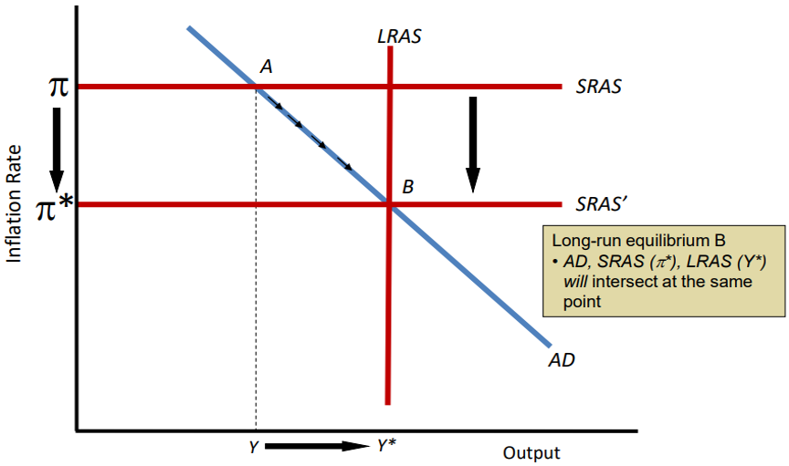

# CB2402 Macroeconomics

## 0. Introduction (Ch. 4)

- **Economics** is the study of how people allocate scarce resources to satisfy their unlimited wants.
- **Microeconomics** is the study of how individuals, households, and firms make decisions and how they interact in specific markets.
- **Macroeconomics** is the study of the economy as a whole, including topics such as inflation, unemployment, and economic growth. 

Topics include:

- Economic growth and living standards
- Productivity
- Recessions and expansions
- Unemployment
- Inflation
- Economic interdependence among nations

Macroeconomic Policies:

- **Monetary policy** is the process by which the government, central bank, or monetary authority of a country controls the supply of money, availability of money, and cost of money or rate of interest, in order to attain a set of objectives oriented towards the growth and stability of the economy.
- **Fiscal policy** determines the government's budget, including spending (public expenditure) and taxation (tax policy, transfer payments) which moves the government budget towards a surplus or deficit.
- **Structural policy** is a type of economic policy that involves government intervention to strengthen the economic foundation of a country. It is designed to help a country achieve economic growth and development.

Macroeconomic Analysis:

- **Positive analysis** addresses the economic consequences of a particular event or policy, and does not involve value judgments.
- **Normative analysis** involves judgments about whether a policy **should be used** and depends on the values of the person making the judgment.

## 1. Gross Domestic Product (Ch. 5)

**Gross Domestic Product (GDP)** is the **market value** of **all final goods and services** produced within a country in a given period of time (typ. a year).

- **A final good or service** is an item purchased by a final user.
- **An intermediate good or service** is an item that is produced by one firm, bought by another firm, and used as a component of a final good or service.
- **Value added** = $ \text{Market value of output} - \text{Cost of intermediate goods} $
- **Domestic** means the activity is within the country's borders. Nationality of the producer does not matter.

In real life, GDP can be **estimated** using two approaches:

- Calculate the **total expenditure on final output** (expenditure approach).
- Calculate the **total income generated by final production** (income approach).

(*) Expenditure means spending, i.e. the money spent on goods and services.

Both methods SHOULD give the same result.

### 1.1 The Expenditure Approach

$ GDP = C + I + G + (X - IM) $

where:

- $C$ = **Consumption**, the expenditure on all final goods/services by individuals.
    - Durables: last a long time (e.g. cars, furniture).
    - Semi-durables: last a short time (e.g. clothes).
    - Non-durables: consumed quickly (e.g. food).
    - Services: intangible products (e.g. haircuts, education).
    - What is NOT included: purchase of houses (new houses included in investment, existing houses = intermediate goods so not included).
- $I$ = **Investment**, the expenditure on capital goods (e.g. machinery, buildings).
    - **Inventories investment**: the change in the stock of goods that firms produce but do not sell.
    - **Business fixed investment**: the purchase of new capital goods (e.g. plant, equipment).
    - **Residential investment**: the construction of new homes.
    - What is NOT included: the purchase of financial assets (e.g. stocks, bonds); but the **commission** paid to the broker is included.
- $G$ = **Government spending**, the expenditure on goods/services by the government.
    - What is NOT included: transfer payments (e.g. EI = unemployment benefits, CPP = pension). In such cases, no goods/services are produced.
- **Net exports** = $X - IM$ = **Exports** - **Imports**.
    - $X$ = Exports, the goods/services produced domestically and sold abroad.
    - $IM$ = Imports, the goods/services produced abroad and sold domestically.

Example: Assume we are calculating "GDP" of a car manufacturer.

Price per car = \$1,000

Total production = 10,000

Total GDP = $1,000 * 10,000 = \$10,000,000

| Sector | No of cars | GDP contribution |
|--------|------------|------------------|
| Consumers | 7,000 | $7,000,000 |
| Business | 2,000 | $2,000,000 |
| Government | 500 | $500,000 |
| Net exports | 250 | $250,000 |
| Unsold cars | 250 | $250,000 |
| Total | 10,000 | $10,000,000 |

where:

- Consumers: \$7,000,000
- Investment: \$2,000,000 (business) + \$250,000 (unsold cars)
- Government: \$500,000
- Net exports: \$250,000

### 1.2 The Income Approach

From income side, when a good is sold, its value is distributed to the workers or business owners.

$ GDP = \text{Labor income} + \text{Capital income}$

where:

- **Labor income** = wages, salaries, and benefits distributed to workers.
- **Capital income** = interest distributed to business owners, which may be used to pay:
    - **Rent** for land.
    - **Interest** for capital (bondholders, banks).
    - **Royalties** for intellectual property.
    - or kept as **profits** for the business owners.

### 1.3 Real vs. Nominal GDP, GDP per Capita

- **Nominal GDP** is the GDP measured in current prices.
- **Real GDP** is the GDP measured in constant prices.
- We choose a year as the base year, and calculate the GDP using the prices of goods/services in that year.

Therefore $\text{Real GDP} \neq \text{Nominal GDP} \div \text{Price index}$, as prices of different goods/services change differently.

---

**GDP per capita** (per person) = $\text{GDP} \div \text{Population}$.

However, Real GDP per capita DOES NOT measure the quality of life (the average living standard) of the people, as it:

- GDP cannot include economic activities outside the regular market (e.g. illegal activities, the underground economy, home production).
- GDP does not measure **economic bads** (e.g. pollution, crime, inequality).
- GDP does not measure **economic goods** (e.g. leisure, volunteer work, education).
- Environmental qualities and resource depletion is hard to measure.
- GDP does not capture the effects of **income inequality**.

### 1.4 Unemployment

- **Employment**: the number of working-age people (usually 15-64) who have a job.
- **Unemployment**: the number of working-age people who are not employed but are actively looking for a job.
- $\text{Working-age population} = \text{Employed} + \text{Unemployed} + \text{Out of labor force}$.
- $\text{Labor force} = \text{Employed} + \text{Unemployed}$.
- $\text{Unemployment rate} = \text{Unemployed} \div \text{Labor force}$.
- $\text{Participation rate} = \text{Labor force} \div \text{Working-age population}$.

Costs of unemployment:

- Economic costs: loss of wages, production, and tax revenue; increased social welfare spending (transfers).
- Phycological costs: self-esteem, family relationships.
- Social costs: potential for crime, social unrest, political instability.

**Discouraged workers** are those unemployed, looking for a job, but have given up looking (legally, in the past 4 weeks).
- Counted **Out of labor force**.

**Involuntary part-time workers** (underemployment) are those who are working part-time but want to work full-time.
- Counted as **Employed**.

## 2. Price Level and Inflation (Ch. 6)

### 2.1 The Consumer Price Index

**Consumer Price Index (CPI)** is a measure of the average change over time in the prices of a **baskets of typical goods and services** purchased by households.

$ \text{CPI} = \left( \frac{\text{Cost of basket in current year}}{\text{Cost of basket in base year}} \right) \times 100 $

Other price indexes:

- **Core CPI**: excludes volatile items (e.g. food, energy).
    - mainly includes: rent, clothing, transportation, medical care, education.
- **Producer Price Index (PPI)**: measures selling prices received by domestic producers for their output.
- **Import/Export Price Index**: measures the prices of goods/services imported/exported.

Biases in CPI:

- **Quality adjustment bias**: CPI measures price changes, not quality changes.
    - Example: Whenever a new generation of PC is released, the price always goes up, but the quality also goes up.
- **Substitution bias**: CPI uses a fixed basket of goods, not accounting for consumer substitution.
    - Example: Assume tea and coffee is the only drink in the basket. If the price of coffee goes up, the CPI increases. However, consumers will switch to tea, so the increase in expenditure is not as much as CPI suggests.

Denote the base year prices and quantities as $P_0$ and $Q_0$, and the current year prices and quantities as $P_1$ and $Q_1$.

CPI for this year is calculated as:

$ \text{CPI} = \left( \frac{\sum P_1 \cdot Q_0}{\sum P_0 \cdot Q_0} \right) \times 100 $

$Q_1$ is irrelevant because CPI is a price index, not a quantity index.

### 2.2 Inflation

**Inflation** is the annual percentage change in the price level.

$ \text{Inflation rate} = \left( \frac{\text{CPI in current year} - \text{CPI in previous year}}{\text{CPI in previous year}} \right) \times 100 $

Adjusting for inflation:

$ \text{Real value} = \frac{\text{Nominal value}}{CPI} $

---

Understand that **CPI inflation** is different from the inflation in the **price of a specific good**, nor the inflation in the daily cost of living.

This is because the basket of goods in CPI is a comprehensive measure of the average price change of all goods and services, and is correspondingly used to adjust wages, pensions, and other payments. (The list of goods in the basket is not disclosed, but updated every 2 years.)

Also, when inflation rate decreases, it DOES NOT mean prices are falling, but the rate of increase is slowing down.

When a inflation year happens, most workers have already got worse off, because their wages have not been adjusted for inflation. However, when a deflation year happens, workers lose their jobs and are more unwilling to spend.

---

Prices transmit information about (the cost of production) + (the value buyers place on the product).

Response to changing prices is tentative and slow, because buyers and sellers can't easily tell whether
- ONLY this product's price has changed (i.e. due to a sharp change in demand/supply)
- or the inflation has changed the price of all products.

Costs of inflation:

- Distortions caused by taxes
    - Taxes are based on nominal prices, not real prices.
    - Example: **Capital depreciation allowance** (tax deduction) encourages purchase of capital goods. e.g. If you buy a machine, and a \$10,000 tax deduction is provided in 10 years, the \$1,000 in year 1 worth more than \$1,000 in year 10.
    - When inflation is high, investment in plant and equipment is discouraged because the tax deduction is worth less.
- Increased the cost of holding cash
- Unexpected redistribution of wealth
    - If inflation is high, employers are benefited because they can pay workers less in real terms; borrowers are benefited because they can pay back loans with cheaper dollars.
- Interference with long term planning
    - Retirement planning requires an estimated cost of living in the future, which will be affected by inflation.

### 2.3 Interest Rates

- **Nominal interest rate**: the rate expressed in money terms.
- **Real interest rate**: the rate expressed in terms of purchasing power.

$ \text{Real interest rate} = \text{Nominal interest rate} - \text{Inflation rate} $

$ r = i - \pi $

As mentioned above, inflation benefits borrowers at the expense of lenders. Bank provides the same base rate for depositing and borrowing and to protect its own profit, the bank will increase the nominal interest rate when inflation is high (to make its real interest rate close to constant).

**Fisher effect**: when inflation is high, nominal interest rates will be high.

**Inflation-protected bonds** pay a combined interest rate that is the sum of the real interest rate and the expected inflation rate. This guarantees that the real value of the bond will not be eroded by inflation.

## 3. Economic Growth, Productivity, and Living Standards (Ch. 7)

### 3.1 Living Standards

$ \frac{Y}{POP} = \frac{Y}{N} \times \frac{N}{POP} $

where:

- $Y$ = real GDP
- $N$ = number of the employed
- $POP$ = population

Real GDP per capita $\frac{Y}{POP}$ is the product of

- $\frac{Y}{N}$ = real GDP per worker
- $\frac{N}{POP}$ = Share of population employed

Real GDP per capita is a estimate of the average living standard.

In the long run, increase in $\frac{Y}{POP}$ is mainly due to increase in $\frac{Y}{N}$, while $\frac{N}{POP}$ is relatively stable.

### 3.2 Economic Growth

Six factors that affect labor productivity:

- Human capital
    - Education, training, skills of the workforce.
- Physical capital
    - Tools, machines, infrastructure.
    - **Diminishing returns to capital**: as the amount of capital increases, the additional output produced by each additional unit of capital decreases.
    - Implications of diminishing returns:
        - Increasing capital will increase output and labor productivity, but at a decreasing rate.
        - **Capital accumulation** is necessary for economic growth, but not sufficient.
- Land and other natural resources
    - Land (for farming, building), energy, raw materials.
    - Resources can be imported through international trade.
- Technology
    - **New technologies** are the single most important factor in long-term economic growth.
    - Diminishing returns DOES NOT apply to technology.
- Entrepreneurship and management
    - **Entrepreneurship** is the ability to organize and create new business ventures.
    - **Management** is the ability to organize and coordinate other factors of production.
- Political stability and economic institutions
    - Political and legal environment should encourage people to be productive.
    - **Property rights** are the rights individuals or firms have to the exclusive use of their property, including the right to buy or sell it.
    - Well-defined property rights encourage investment and innovation, and also allows reliable recourse to the legal system in case of disputes.

Government policies can also affect labor productivity:

- Supports education and training as **education has positive externalities**.
- Encourage new capital formation and saving.
- Support research and development of military and space technology.
- Maintain stable political and legal framework.

Costs of economic growth:

- Fewer consumer goods, reduced leisure time
- Potential risk of health, safety, environmental degradation
- Costs of R&D, education, infrastructure

## 4. The Labor Market (Ch. 8)

### 4.1 Labor Demand

**Supply and demand analysis** can be used to find the price (P, real wage) and quantity (Q, number of jobs) of labor.

The labor demand curve is downward sloping, because as the wage increases, the cost of hiring workers increases, and companies will hire fewer workers.

The demand for labor depends on:

- The productivity of labor
- The price of the worker's output

**Value of Marginal Product (VMP)** is the additional revenue generated by employing one more worker. Companies will hire workers until the VMP equals the wage.

**Diminishing returns to labor**: Assumes non-labor inputs are fixed. As more labor is added, the additional output produced by each additional unit of labor decreases.

Shifts in the demand curve: the demand curve shifts to the right when

- The price of the company's output increases
    - Allowing the company to expand production and hire more workers.
- The productivity of labor increases
    - e.g. by investing in new technology, training, or education.
    - Allowing the company to produce more output with the same number of workers.

---

Recall in microeconomics, changes in demand is not the same as changes in quantity demanded.

- Changes in demand: shift in the demand curve caused by non-price factors.
- Changes in quantity demanded: movement along the demand curve caused by price changes.

### 4.2 Labor Supply

**Reservation wage** is the lowest wage at which a worker is willing to accept a job.

- At reservation wage, the work compensates for the opportunity cost of leisure.
- If working conditions are dangerous or unpleasant, the reservation wage will be higher.

The number of workers willing to work at a given wage is the **quantity supplied of labor**, affected by:

- Size of working-age population
    - Domestic population breakdown by age
    - Immigration and emigration
    - Ages of entry and exit from the labor force
- Portion of the working-age population willing to work

The labor supply curve is upward sloping, because as the wage increases, more workers are willing to work.

Shifts in the supply curve: the supply curve shifts to the right when

- The working-age population increases, OR
- The portion of the working-age population willing to work increases.

This allows more workers to be employed at a given wage.

### 4.3 Equilibrium in the Labor Market

Trend in US labor market:

1. Increasing real wage.
2. Stagnated increase in real wage since 1970s.
3. Increased wage inequality.
4. Number of jobs increase faster than the population (i.e. number of the employed has increased).
5. Western Europe has higher unemployment rates than the US.

Explaining increase in real wage:

- Productivity growth due to technological advancement and capital accumulation. This causes **increase in demand for labor grows faster than supply**, making it reasonable for companies to pay higher wages to attract workers.

Explaining stagnated increase in real wage:

- As mentioned in the last point, the increase in real wage comes from $\text{increase in demand} - \text{increase in supply}$.
- Increase in demand has slowed down (industrialization has matured, technology breakthroughs are less frequent).
- Increase in supply has grown faster (baby boomers, woman workers, immigrants).
- Therefore, the increase in real wage has slowed down.

Explaining increased wage inequality:

- Globalization results in increased competition from low-wage countries.
- Therefore, low-skilled workers in the US face increased competition, while high-skilled workers are in demand.
- US policies resist to free trade grows (protectionism).
- Technological advancement increases the demand for high-skilled workers, but not low-skilled workers. This is a source of **skill-biased technological change**.

### 4.4 Unemployment

3 types of unemployment:

- **Frictional unemployment**: short-term unemployment that arises from the process of matching workers with jobs.
    - e.g. new graduates, people who quit their jobs.
- **Cyclical unemployment**: unemployment caused by a business cycle recession.
    - e.g. during the pandemic, many businesses are forced to close, leading to layoffs.
- **Structural unemployment**: unemployment that arises from a persistent mismatch between the skills or attributes of workers and the requirements of jobs. Caused by:
    - Barriers: lack of skills, language difficulties, discrimination.
    - Structural changes: technological change and globalization makes old jobs obsolete.
    - Regulations: minimum wage, labor unions, unemployment benefits.
    - Geographical mismatch: jobs are available in one region, but workers are in another.

---

Structural unemployment caused by regulations:

- **Minimum wage** is a price floor set by the government, below which it is illegal to pay workers. It can cause unemployment if it is set above the equilibrium wage.
- **Unemployment benefits** are payments made by the government to unemployed people. It can cause unemployment if it reduces the incentive to find a job.
    - An ideal unemployment benefit should be limited-time and conditional on actively seeking a job, to avoid moral hazard.
- **Health and safety regulations** can reduce the demand for labor, as this increases the cost of hiring workers and limits productivity in hazardous industries.

---

Explaining the difference in unemployment rates between the US and Western Europe:

European labor markets are even more regulated than the US:

- Higher minimum wages
- Little flexibility in benefits
- More powerful labor unions

This makes it harder for companies to adjust to changing economic conditions, leading to higher unemployment rates.

## 5. Saving and Capital Formation (Ch. 9)

### 5.1 Saving and Investment

$\text{Saving} = \text{Income} - \text{Current consumption}$

$\text{Saving Rate} = \frac{\text{Saving}}{\text{Income}}$

$\text{Wealth} = \text{Assets} - \text{Liabilities}$

- A **flow** is a value defined per unit of time (e.g. income/spending/saving per year).
- A **stock** is a value defined at a point in time (e.g. wealth, debt at the end of the year).
- The **flow of savings causes the stock of wealth to change**.
- Changes in wealth: $\Delta \text{Wealth} = \text{Saving} + \text{Capital gains} - \text{Capital losses}$

Three reasons for households to save:

- **Life-cycle saving**: saving for future consumption (e.g. retirement, house purchase, offspring education).
- **Precautionary saving**: saving for unexpected events (e.g. illness, job loss).
- **Bequest saving**: saving to leave an inheritance.

Saving often take the form of **financial assets** (e.g. bank deposits, bonds, stocks).

- Recall that the **real interest rate** ($r$) is the nominal interest rate ($i$) minus the inflation rate ($\pi$).
- Real interest rate is the increase in purchasing power from a financial assets.

### 5.2 Two Types of Saving

**National saving** is the sum of private saving and public saving.

Recall that $Y = C + I + G + (X - IM)$, where $I$ is investment.

National savings $S$ is **current income** (Y) that is not spent on **current consumption** (C or G).

Therefore $S = Y - C - G$.

---

**Private saving** is the saving of households and businesses.

$S_{\text{private}} = Y - C - T$

where $T = \text{Taxes} - \text{Transfer payments} - \text{Gov Interest payments}$.

For business saving, it is the retained earnings (profits not paid out as dividends).

$S_{\text{business}} = (\text{Revenues} - \text{Operating costs}) - \text{Dividends}$.

Business saving can purchase **new capital equipment**, which is good for economic growth.

---

**Public saving** is the saving of the government.

$S_{\text{public}} = T - G$

where $T$ is the net taxes (defined above).

- When $T > G$, government is running a **budget surplus**.
- When $T < G$, government is running a **budget deficit**.

---

Back to national saving, $S = S_{\text{private}} + S_{\text{public}} = (Y - C - T) + (T - G) = Y - C - G$.

Benefits of increased national saving rates:

Higher national saving rate leads to greater **investment in new capital**, and a higher standard of living in the long run.

How to increase national saving rates:

- Reduces government budget deficit: increases public saving.
- Increases incentives for households to save: by tax exemptions on dividends and investment income.

### 5.3 Investment and Capital Formation

**Investment is the creation of new capital goods** (e.g. machinery, buildings).

According to **Cost-Benefit Principle**, firms will buy new capital to increase profits, as long as the **marginal benefit** of the capital is greater than the **marginal cost**.

- **Cost** is the cost of purchasing and maintaining the capital.
    - Price of the capital, real interest rate.
- **Benefit** is the additional revenue generated by the capital.
    - Technical innovation, lower taxes, higher price increase the benefit.

---

- **Supply of savings** (S) is the amount of savings available at each possible real interest rate $r$.
- **Demand for investment** (I) is the amount of savings borrowed to buy new capital at each possible real interest rate $r$.
- When $r$ increases, $S$ increases and $I$ decreases.
- **Equilibrium real interest rate** is the $r$ where $S = I$.
- If $r > r^*$, there is a **surplus of savings**; if $r < r^*$, there is a **shortage of savings**.

Shift of the demand curve:

**Technological improvements** raise the **marginal benefit of capital**, 

- increases the demands for investment.
- demand curve shifts to the up/right.
- higher real interest rate.
- higher level of savings and investment.

Shift of the supply curve:

**Government budget deficit** reduces national savings,

- supply curve shifts to the up/left.
- higher real interest rate.
- lower level of savings and investment.
- **private investment is crowded out by public investment**.

## 6. Financial Markets and International Capital Flows (Ch. 11)

### 6.1 Banking System

A successful economy allocates its saving to the most productive investments.

The banking system improves the allocation of saving by

- Provides information to savers about the possible uses of their funds
    - e.g. interest rates, risk levels.
- Help savers **share the risks** of individual investments

**Financial intermediaries** are firms that extend credit to borrowers using funds raised from savers.

- Commercial banks accept deposits from savers and make loans to borrowers.
- When loans are paid back with interest, banks keep a portion of the interest as profit and pay the rest to the depositors.
- Intermediaries specialize in **evaluating the quality of borrowers**
    - As banks have a lower cost of evaluating opportunities
    - As banks pool the savings of many depositors to make large loans, spreading out risk.

Banks gather information about potential investments, and make loans to the most promising ones. Having bank deposits makes payment easier (as debit cards are safer than cash, and banks record transactions).

### 6.2 Bond

A **bond** is a **legal promise** to repay a debt, usually including both the principal amount and regular interest.

Each bond specifies:

- **Principal amount**: the amount borrowed.
- **Maturation date**: the date when the principal must be repaid. / **Term**: the time between the issuance and maturation date.
- **Coupon payment**: the periodic interest payment.
- **Coupon rate**: $\text{Principal} \times \text{Coupon rate} = \text{Coupon payment}$.

Coupon rate depends on:

- Bond's term: longer term, higher coupon rate. Note coupon rate is time-irrelevant; it specifies the total interest paid over the term, not over-time interest rate.
- Issuer's default risk: higher risk, higher coupon rate.
- Tax: Municipal bonds are free from federal tax. Lower tax, lower coupon rate.

**Bonds can be sold before maturation**. **Market price** is the price at which the bond is sold in the market, which can be higher or lower than the face value.

Example: US gov issues a 1-year bond with a face value of \$1,000 and a coupon rate of 5%. If the market interest rate is 5%, the bond will be sold at \$1,000. If the market interest rate is 4%, the bond will be sold at \$1,010:

$P \cdot 1.04 = 1000 \cdot 1.05 \Rightarrow P = 1000 \cdot 1.05 \div 1.04 = 1010$

**Second-hand bond prices and interest rates are inversely related**. When the market interest rate increases, the old bond sells less than the face value, because the new bond pays more interest with the same face value.

### 6.3 Stock

A share of **stock (or equity)** is a claim to partial ownership of a firm.

- Receive **dividends**, a regular payment received by stockholders for each share they own
- Receive **capital gains** if the price of the stock increases
- Prices are determined in the **stock market**

Example: After 1 year, the estimated selling price of stock becomes \$80 and you receive \$1 dividends per share. The interest rate is 6%.

$P \cdot 1.06 = 80 + 1 \Rightarrow P = 81 \div 1.06 = 76.42$

Therefore the current stock price is \$76.42.

**Risk premium** is the rate of return investors require to hold risky assets, minus the rate of return on safe assets.

Suppose the safe asset has a return of 3%, and the risky asset has a return of 6%, the risk premium is 3%. The current stock price is still \$76.42.

If the risky asset has a return of 9%, the risk premium is 6%, and the current stock price is $81 \div 1.09 = 74.31$.

Risk aversion increases the return required for holding risky assets, and lowers the stock price.

### 6.4 International Capital Flows

Bond markets and stock markets both allocate saving by

- providing information on investment projects and their risks
- providing risk sharing and diversification across projects

**Diversification** is spreading one's wealth over a variety of investments to reduce risk.

**Sale of new bonds or new stock can finance capital investment**, as they both channel funds from savers to borrowers with productive investment opportunities.

A **mutual fund** is a financial intermediary that sells its shares to the public and uses the proceeds to buy a portfolio of stocks and bonds.

**International capital flows** are purchases/sales of real and financial assets across international borders.

- **Capital inflows**: foreigners buy domestic assets.
- **Capital outflows**: domestic investors buy foreign assets.
- **Net capital flows (KI)**  = capital inflows - capital outflows.

**Trade balance** = net exports (NX). A **trade surplus** is when exports exceed imports, and a **trade deficit** is when imports exceed exports.

Two roles of ICF:

- Trade imbalances
    - trade surplus (NX > 0) = net capital outflows (KI < 0)
    - trade deficit (NX < 0) = net capital inflows (KI > 0)
- Efficient allocation of savings
    - Savers are allowed to invest in the most profitable projects, regardless of location.
    - Fills savings gap in destination countries.

On a $KI-r$ graph, the curve is upward sloping, because as the real interest rate increases, the capital inflows increase.

- Capital flows respond to real interest rates (movement along curve): Higher domestic interest rates = higher return on domestic assets = capital inflows.
- Capital flows respond to riskiness (shift of curve): Higher risk = foreigners buy less + domestic savers buy more foreign assets = capital outflows.

Recall that $Y = C + I + G + NX$, where $I$ is investment. And we have computed national savings $S = Y - C - G$.

$I = Y - C - G - NX = S - NX$.

Also we know $NX + KI = 0$, therefore $I = S + KI$.

- In a **closed economy**, $KI = 0, S = I$.
- In an **open economy**, $S + KI = I$, national savings + capital inflows = investment.

What cause trade deficits ($NX < 0$, i.e. $KI > 0$): **a low rate of national savings**.

- Low savings = high spendings = high imports + low exports = trade deficit.
- Trade deficit countries receive capital inflows = increased interest rates = increased investment = increased GDP.

## 7. Money and the Federal Reserve (Ch. 10)

### 7.1 Money

**Money** is any **asset** that people are generally willing to accept in exchange for goods/services, or for payment of debts.

Without money, people have to barter (exchange goods/services directly), which require double coincidence of wants.

Function of money:

- **Medium of exchange**: money is used to buy goods/services.
- **Store of value**: money can be saved and used later. Unlike other assets, money is liquid so it can be easily exchanged.
- **Unit of account**: money is used to measure the value of goods/services.

Is Bitcoin money? The answer is No, because Bitcoin is not owned by any government, and is not widely accepted as a medium of exchange.

Is Bitcoin included in money supply? The answer is No, but if one day Bitcoin is widely accepted as a medium of exchange, it will be included in money supply.

### 7.2 Commercial Banks

**Central banks control the money supply**; commercial banks create money.

- Commercial banks are created to store cash
- **Without interest**, banks earn profits by charging depositors a fee for holding their cash
- **Bank reserves** are cash/assets held by banks to meet depositors' demands for withdrawals. **Bank reserves is not part of money supply** as they are unavailable for payment.
- **Reserve-deposit ratio** = $\text{Reserves} \div \text{Deposits}$, the fraction of deposits that banks hold as reserves. The remainder is used to make loans. **Required reserve ratio** (RRR) is the minimum reserve-deposit ratio set by the central bank.
- **Loans are spent and redeposited**, which creates new deposits. This is called the **money multiplier** effect.

Example: Initially, the banks has 1,000,000 g cash and the RRR is 10%. The bank can lend out 900,000 g. The borrower spends the money, and the seller deposits it back to the bank. The bank now has 1,900,000 g cash, and can lend out 810,000 g. The process continues until the total amount of money created is:

$\frac{1,000,000}{10\%} = 10,000,000$ g.
**The money supply is positively related to the bank deposits**.

e.g. If the public owns 500,000 g cash, the bank owns 500,000 g reserves, and the RR is 10%, the total amount of money is:

$500,000 + \frac{500,000}{10\%} = 5,500,000$ g.

Now, the public withdraws 100,000 g cash. The total amount of money is:

$600,000 + \frac{400,000}{10\%} = 4,600,000$ g.

Therefore, the more money deposited in the bank, the more money created.

### 7.3 The Federal Reserve

Responsibilities of the Federal Reserve:

- **Conduct monetary policy**: control the money supply to achieve macroeconomic goals (e.g. full employment, stable prices).
- **Oversee and regulate financial markets**: ensure the stability of the financial system and protect consumers.

Monetary policy is deciding and managing the size of the nation's money supply. Controlled indirectly by central banks, and:

- **open-market purchases of government bonds**: the central bank buys government bonds from banks, increasing the reserves of banks and increasing the money supply.
- **open-market sales of government bonds**.

When the Federal Reserve purchases public bonds (assets), it pays the holder with new money. The new money enters the economy; the bond (which wasn't money) leaves the economy.

Example: Assume the public owns 500,000 g cash, the bank owns 500,000 g reserves, and the RR is 10%. The total amount of money is:

$500,000 + \frac{500,000}{10\%} = 5,500,000$ g.

Now the central bank pays 100,000 g for a bond held by the public. The total amount of money is:

$500,000 + \frac{600,000}{10\%} = 6,500,000$ g.

A 100,000 g increase in reserves leads to a 1,000,000 g increase in the money supply.

When the Federal Reserve sells a bond to the public, the total amount of money decreases.

**Banking panics** are caused by a sudden loss of confidence in the banking system, leading to bank runs. The Federal Reserve can prevent this by (1) supervising and regulating banks, (2) loaning banks funds if needed.

The Great Depression (1929-1939) was caused by a banking panic, leading to a decrease in the money supply and people were holding cash.

**Deposit insurance** is a government guarantee that depositors will be paid even if the bank fails. This reduces the risk of bank runs. Side effect: it reduces the incentive for banks to be careful with their loans, so small banks are more likely to fail.

### 7.4 Money and Prices

**M1, M2**: 

- M1 is the most liquid form of money, including cash and checking accounts. 
- M2 includes M1 plus savings accounts, time deposits, and other near-money assets (e.g. money market accounts).

In the long run, the amount of money circulating and the level of prices are positively related. i.e. if the money supply increases, the price level increases.

**Quantity equation**: $MV = PY$, where:

- $M$ = money supply
- $V$ = velocity of money (the number of times a dollar is spent in a year)
- $P$ = price level
- $Y$ = real GDP

**Velocity** is a measure of how fast money circulates in the economy. $V = \frac{PY}{M} = \frac{\text{Nominal GDP}}{\text{Money supply}}$.

As the technology advances, less cash is needed. Money are transferred electronically with high velocity, which results in a increase in $Y$ (real GDP).

Suppose velocity and real GDP are constant, an increase in the money supply will lead to a proportional increase in the price level.

Central banks can create money to **make up for government deficits**. This is called **monetizing the debt**. However, this can lead to inflation if the money supply increases faster than real GDP.

## 8. Short Term Economic Fluctuations (Ch. 12)

### 8.1 Business Cycles

**Business cycles** are short-term fluctuations in economic activity, measured by changes in real GDP.

A **recession** or **contraction** is a period in which the economy is growing at a rate significantly below normal.

Three coincident indicators of recessions: Real personal consumption expenditures, non-farm employment, and real after-tax household income.

- **Peak**: the highest point of the business cycle, before a recession.
- **Trough**: the lowest point of the business cycle, before a recovery.
- **Expansion**: a period in which the economy is growing at a rate significantly above normal.
- **Boom**: a strong and prolonged expansion, often leading to inflation.

Phenomenon of business cycles:

- Cyclical unemployment rises sharply during recessions. 
- Production of durable goods (e.g. cars, houses) is more volatile than non-durable goods and services.
- Inflation generally decreases during recessions.

### 8.2 Output Gap

**Potential Output** (also full-employment output) $Y^*$ is the maximum sustainable amount of output that an economy can produce, given its resources and technology.

- Actual output can exceed $Y^*$ in the short run, if using capital and labor at greater than normal rates.
- Actual output grows at a variable rate, reflecting the growth rate of $Y^*$.

**Output gap** is the difference between actual output and potential output.

$\text{Output gap} = \frac{Y - Y^*}{Y^*} \times 100\%$

**Natural rate of unemployment** $u^*$ is the sum of frictional and structural unemployment, when the economy is at full employment. Cyclical unemployment is zero.

- **Recessionary gap** is a negative output gap, $Y < Y^*, u > u^*$.
- **Inflationary gap** is a positive output gap, $Y > Y^*, u < u^*$.

**Okun's law** states that for every 1% increase in the unemployment rate above the natural rate, a recession occurs that is roughly 2% below potential output.

$\frac{Y - Y^*}{Y^*} \approx -2 \cdot (u - u^*)$

### 8.3 Self-Correcting Mechanism

Output gap arise for two main reasons:

(1) **Markets require time to reach equilibrium price and quantity**.

- Prices are not changed frequently, and quantity produced is not at equilibrium during the adjustment period.

(2) **Changes in economy-wide spending affects output level**.

- When economy-wide spending is low, output will be below potential output.
- Policy: adjust government spending to close the gap.

In macroeconomics, **short run** is the time horizon over which the wages and prices of other inputs to production are **sticky** (i.e. not flexible). **Long run** is the period over which these prices and wages have time to adjust.

The economy has self-correcting mechanisms. **Firms eventually adjust to output gaps**.

- If spending is less than potential output, firms will slow the increase of their prices.
- If spending is more than potential output, firms will increase the prices.

In the long run, **output is determined by productive capacity**; spending influences only the price level and inflation.

Again, in the short run, **producers meet demand at existing prices**. In the long run, **prices reach equilibrium and output is at its potential level**.

## 9. Spending and Output in the Short Run (Ch. 13)

### 9.1 Keynesian Model

**In the short run, firms meet demand at preset prices; prices do not change quickly**.

- Firms set a price and meet demand at that price.
- **Menu costs**: the costs of changing prices (e.g. determining new prices, printing new menus, informing customers).
- Firms change prices when the marginal benefits exceed the marginal costs.

### 9.2 Planned Aggregate Expenditure

**Planned Aggregate Expenditure (PAE)** is the total planned spending on final goods and services.

$PAE = C + I + G + NX$

where:

Consumption (C) is the spending by households on goods/services. $C$ depends on disposable income (Y - T), where $T$ is taxes.

**Consumption function**: $C = \bar{C} + \text{MPC} \cdot (Y - T)$

where $\bar{C}$ is the **autonomous consumption** (the amount of consumption when income is zero), and **MPC** is the **marginal propensity to consume** (the fraction of additional income that is consumed = $\frac{\Delta C}{\Delta (Y-T)}$).

**Wealth effect**: tendency of changes in asset prices to affect household's wealth and consumption. Higher asset prices increase household's wealth, leading to higher consumption. 

**Interest rate effect**: higher interest rates lead to lower consumption on durable goods (e.g. cars, houses), as the cost of borrowing increases.

---

Consumption is the largest component of PAE. Consumption depends on output $Y$ and net taxes $T$; PAE depends on output $Y$.

PAE has two parts: **autonomous spending** ($k = \bar{C} - \text{MPC} \cdot T + I + G + NX$) and **induced spending** ($\text{MPC} \cdot Y$).

**Short run equilibrium** is the level of output where PAE = actual output $Y$. That is, the intersection of $PAE=Y$ (the 45 degree line) and $PAE = \text{MPC} \cdot Y + k$.

Suppose $PAE = 960 + 0.8Y$. The equilibrium output is:

$Y = 960 + 0.8Y \Rightarrow Y = 4800$

And the current output is $Y = 4500$.

Then current output is below equilibrium output,

- planned spending is more than actual output.
- unplanned inventory (reserves) is decreasing.
- firms will increase production to meet demand.

Suppose now the house price goes down. According to the wealth effect, the autonomous consumption $\bar{C}$ will decrease. Thew new PAE is:

$PAE = 960 - 10 + 0.8Y = 950 + 0.8Y$

And the new equilibrium output is: $Y = 4750$

So a \$10 decrease in consumption reduces GDP by \$50.

**Income expenditure multiplier** is the ratio of the change in equilibrium output to the change in autonomous spending. $IE = \frac{\Delta Y}{\Delta k} = \frac{1}{1 - \text{MPC}}$. e.g. in the above example, the multiplier is $\frac{1}{1 - 0.8} = 5$. 

A higher MPC leads to a higher multiplier.

### 9.3 Stabilization Policy

**Stabilization policy** are government policies that are used to affect PAE to eliminate output gaps.

- Expansionary policy: increase PAE.
- Contractionary policy: decrease PAE.
- Fiscal policy: government spending and taxes.
- Monetary policy: money supply.

Examples of government purchases: military spending, education, infrastructure.

Net taxes $T$ = total taxes - transfer payments - government interest payments. 

Example: if $\bar{C}$ reduces by \$10, to offset the decrease in consumption, the government can

- increase government spending $G$ by \$10, or
- decrease taxes $T$ by \$12.5 (as $\text{MPC} (\Delta T) = 10$).

Recall: government deficit $G - T$ is the difference between government spending and taxes. Prolonged government deficit = less national saving = less investment = lower economic growth.

Limits to fiscal policy flexibility:

- The legislative process is slow.
- Competing political objectives (e.g. tax cuts vs. spending increases).

Automatic stablizers increase government spendings $G$ or decrease taxes $T$ when real output $Y$ declines, wityhout changes in fiscal policy.

Therefore **monetary policy is more often used** to stabilize the economy.

## 10. Federal Control (Ch. 14)

### 10.1 Money Demand

Demand for money is **the amount of wealth held in the form of money**.

- Money demanded increases with real income (Y).
- Money demanded decreases as the technology advances.

According to Cost-Benefit Principle, people balance **the MC of holding money** (the interest forgone) and **the MB of holding money** (the ability to make transactions).
- The nominal interest rate on money is 0; for stocks and bonds it is positive.

Three factors that affect money demand:

- **Nominal interest rate** (i): higher $i$ = lower money demand.
- **Real income** (Y): higher real income = higher money demand.
- **Price level** (P): higher price level = higher money demand.

**Money demand curve** ($M-i$) is downward sloping, because as the nominal interest rate increases, the opportunity cost of holding money increases.

Shift in money demand curve can be caused by any non-interest rate factors:

- Increase in output
- Increase in price level
- Technological advances
- Financial advances
- Foreign demand for dollars

When nominal interest rate changes from $i_1$ to $i$, where $i_1 < i^*$.

- Quantity of money demanded (due to lower interest rate) is $M_1 > M^*$. Money demanded is more than money available.
- To get more money, people sell bonds; bond prices go down, interest rates rise.
- Quantity of money demanded decreases to $M^*$, and the interest rate increases to $i^*$.

### 10.2 Money Supply

Recall $\text{Money Supply} = \text{Public Currency} + \frac{\text{Bank Reserves}}{\text{RR}}$.

**Open-market operations** are the main tool of money supply.

Federal can thus control the nominal interest rate by controlling the money supply. More money supply = lower interest rate.

- Federal cannot set the interest rate and the money supply independently.
- Federal policy is announced in terms of the target interest rate.

**Federal Funds Rate** is the interest rate at which banks lend reserves to each other overnight.

- Banks borrow funds from each other to meet reserve requirements.
- Targeted by the Federal and determined by the market.
- Positively correlated with other interest rates.

Federal offers **discount window lending** to banks at **discount rate** (> the federal funds rate but < the market rate).

Federal's lending to banks increases the reserves of banks, and increases the money supply.

**Reserve requirements** are the minimum amount of reserves that banks must hold against deposits. Increasing reserve requirements decreases the money supply.

**Zero lower bound**: the nominal interest rate cannot go below zero. This limits the effectiveness of monetary policy. Note that some countries allow negative interest rates, but cannot go far below zero.

**Quantitative easing (QE)**: the Federal buys financial assets (e.g. bonds, mortgage-backed securities) to increase the money supply and lower interest rates.
- Stimulates the economy by purchasing assets of longer maturity and thereby lower long-term interest rates.

**Forward Guidance**: the Federal announces its future plans for monetary policy, to influence expectations and behavior of households and firms.

**Interest on Reserves**: Even at an interest rate of 0%, banks can earn interest on reserves held at the Federal Reserve.

### 10.3 Revisiting the Keynesian Model

Given

$C = 640 + 0.8 (Y-T) - 400r, I^P = 250 - 600 r, G = 300, NX = 20, T = 250$

$PAE = C + I^P + G + NX = 1010 + 0.8Y - 1000r$

> Recessionary gap: $r \downarrow \Rightarrow C + I^P \uparrow \Rightarrow PAE \uparrow \Rightarrow Y \uparrow$  
> Inflationary gap: $r \uparrow \Rightarrow C + I^P \downarrow \Rightarrow PAE \downarrow \Rightarrow Y \downarrow$

Suppose $r=0.05$, short run equilibrium $960 + 0.8Y = Y$, $Y = 4800$

Suppose potential output $Y^* = 5000$, and there is a recessionary gap $Y^* - Y = 200$.

Momentary policy can be used to increase PAE:

$\Delta PAE = \Delta C + \Delta I^P = -1000 \Delta r + 0.8 \Delta Y = \Delta Y, \Delta Y = 200$

Solution: $\Delta r = \frac{200 \div 5}{-1000} = -0.04$

So the new interest rate is $r = 0.01$.

---

The Federal has limited ability to manage the stock market.

**Policy reaction function** describes the Federal's interest rate decision in response to the output gap and inflation.

Taylor rule: $i = r^* + \pi + 0.5 \frac{Y - Y^*}{Y^*} + 0.5 (\pi - \pi^*)$

where $r^*$ is the equilibrium real interest rate, $\pi$ is the inflation rate.

## 11. Aggregate Demand and Supply (Ch. 15)

### 11.1 Aggregate Demand

Aggregate demand (AD) curve shows the relationship between short-run equilibrium output $Y$ and the rate of inflation $\pi$. Downward sloping. Why?

- Policy reaction function: inflation rate $\pi$ increases = real interest rate $r$ increases = planned spending decreases = GDP $Y$ decreases.
- Distributional effects: Inflation hurts people with lower incomes, who spend more percentage of their income. Therefore, inflation decreases consumption.
- Uncertainty: Inflation increases uncertainty about future prices, which decreases consumption.
- Exports: inflation = higher prices of exported goods = lower exports = lower GDP.

Movement along the AD curve can be caused by inflation rate changes.

Shifts in the AD curve can be caused by: changes in **exogenous spending** (e.g. government spending, taxes, foreign demand); changes in the Federal's policy reaction function.

A tight monetary policy = higher real interest rate = lower planned spending = lower GDP. AD curve shifts to the left.

**Inflation inertia**: the tendency of inflation to persist even when the economy is stable. This is caused by:

- **Inflation expectation**: prices are negotiated with future inflation in mind. If the inflation rate is expected to be high, the price will be high.
- **Long term wage and price contracts**: wages and prices are set for a long period of time, and reflect the inflation expectation at the time they are signed.

Low inflation and low inflation expectation can cause a **deflationary spiral**: low inflation = low spending = low output = low inflation expectation = low economic growth.

### 11.2 Aggregate Supply

**Long-run aggregate supply (LRAS)** curve is vertical at the potential output $Y^*$, because in the long run, output is determined by productive capacity.

**Short-run aggregate supply (SRAS)** is a horizontal line at the current inflation rate $\pi$.

So LRAS and SRAS curve are perpendicular to each other.

Short-run equilibrium: intersection of AD and SRAS curve. A situation where given the current inflation rate, the economy is at full employment, so the equilibrium output is at the current potential level.

Long-run equilibrium: intersection of AD and LRAS curve. A situation where the economy is at full employment.

- Expansionary gap: $Y > Y^*$, inflation rises $\pi > \pi^*$, unemployment rate is low $u < u^*$
- Recessionary gap: $Y < Y^*$, inflation falls $\pi < \pi^*$, unemployment rate is high $u > u^*$

Adjusting from a recessionary gap:

- Firms that are overproducing start to sell at lower prices.
- Inflation rate $\pi$ decreases. This reduces uncertainty and AD curve shifts to the right.
- Federal lowers interest rate $r$ to stimulate spending, AD curve moves to the right.
- As $Y$ increases, cyclical unemployment decreases. (Okun's law)
- Adjustmenmt continues until the economy reaches long-run equilibrium.

Another example:

Assume LRAS: $Y^* = 5000$, SRAS: $\pi = 0.05$, AD: $Y = 5200 - 10000 \pi$

Current economy is at the intersection of AD and SRAS curve, $Y = 4700$, $\pi = 0.05$.

Long-term economy is at the intersection of AD and LRAS curve, $Y^* = 5000$, $\pi^* = 0.02$.

So after adjustment SRAS: $\pi^* = 0.02$. Long-term inflation rate is 2%.

---

If the adjustment process is slow, fiscal and monetary policies can help stabilize the economy.

If the adjustment process is fast, fiscal and monetary policies are ineffective and potentially destabilizing.

The speed of adjustment depends on

- The use of long-term contracts
- The efficiency and flexibility of labor markets

### 11.3 Shocks

**Inflation shocks** are unexpected changes in the inflation rate.

Assume current economy is at $A(Y^*, \pi)$. The inflation rate suddenly increases to $\pi' > \pi$, and the economy is at $(Y^*, \pi')$.

The new short run equilibrium will happen at the intersection of SRAS': $\pi = \pi'$ and AD, that is at $B(Y', \pi')$, where $Y' < Y^*$. There is a recessionary gap and stagflation happens.

If no policy intervention, the economy will adjust to $A(Y^*, \pi)$ in the long run.

If policy intervention, the Federal can increase the money supply to shift the AD curve to the right to AD', and the economy will adjust to $C(Y^*, \pi')$ in the long run.

---

**Aggregate supply shocks** are (1) caused by inflation shocks, or (2) a shock to potential output.

Assume current economy is at $A(Y^*, \pi)$. The potential output suddenly decreases to $Y' < Y^*$, and the economy is at $(Y', \pi)$.

LRAS will move left to $Y = Y'$. SRAS will move up to $\pi = \pi'$. 

The new long run equilibrium will happen at the intersection of SRAS' and LRAS', that is at $B(Y', \pi')$, where $Y' < Y^*$ and $\pi' > \pi$.

Recovering from stagflation:

Assume current economy is at $A(Y^*, \pi)$. The inflation rate is high $\pi >> \pi^*$.

Federal shifts the AD curve to the left to $AD'$, and the short run equilibrium will happen at $B(Y', \pi)$, where $Y' < Y^*$. So a recessionary gap happens.

Adjustment continues until inflation falls to its long run level $\pi^*$, and the economy reaches long run equilibrium at $C(Y^*, \pi^*)$. 

During the whole process, the potential output LRAS does not change, but the inflation rate SRAS decreases.

## 12. Exchange Rates and the Open Economy (Ch. 17)

### 12.1 Exchange Rates

**Exchange rate** are set in the foreign exchange market (with some exceptions), determined by supply and demand.

Exchange rate affects the value of exported and imported goods, and the value of foreign investments.

- **Nominal exchange rate** is the price of one currency in terms of another currency.
- **Appreciation** is an increase in the value of a currency relative to another currency.
- **Depreciation** is a decrease in the value of a currency relative to another currency.
- **Real exchange rate** is the nominal exchange rate adjusted for buying power.

$\text{Real exchange rate} = \frac{\text{Price of domestic goods}}{\text{Price of foreign goods}}$

$RER = \frac{P}{P^f \div e} = \frac{Pe}{P^f}$

where $P$ is the price of domestic goods, $P^f$ is the price of foreign goods, and $e$ is the nominal exchange rate.

Example: A RTX 4090 costs \$1,600 in the US and 1,200 pounds in the UK. The nominal exchange rate is USD:GBP = 1.00:1.25. The real exchange rate is:

$RER = \frac{Pe}{P^f} = \frac{1600 \cdot 0.8}{1200} = 106.67$

That is, the RTX 4090 is 6.67% more expensive in the US than in the UK.

If the real exchange rate is high, domestic goods are more expensive than foreign goods, the imports are high and exports are low.

**Real and nominal exchange rates are positively correlated**.

A **strong currency** means its value is high relative to other currencies, which reduces net exports. Strong currency is unrelated to the strength of the economy.

### 12.2 Long-Run Exchange Rates

**The law of one price** states that identical goods should sell for the same price in different countries, when expressed in the same currency.

Example: Now RTX 4090 is more expensive in the US than in the UK. So people buy it in the UK (so the price increases), and resell it in the US (to profit from the price difference). This will continue until the price of RTX 4090 is the same in both countries.

**Purchasing power parity** (PPP) states that the nominal exchange rate between two currencies is equal to the ratio of the price levels in the two countries.

- PPP doesn't work in the short run, because of transportation costs, tariffs, and other trade barriers.
- PPP doesn't work well if a lot of goods are not traded internationally (e.g. services).

### 12.3 Short-Run Exchange Rates

**Foreign exchange market** is the market for buying and selling currencies.

A **flexible exchange rate** is an exchange rate that varies freely in response to changes in supply and demand.

A **fixed exchange rate** is an exchange rate that is pegged to another currency or a basket of currencies according to government policy.

Supply and demand for foreign exchange: X axis: $Q$ = quantity of USD traded; Y axis: $e$ = nominal exchange rate (USD/EUR).

- Supply curve is upward sloping: as USD appreciates, selling USD is more profitable, so the supply of USD increases.
- Demand curve is downward sloping: as USD appreciates, foreign investors are less willing to buy USD, so the demand for USD decreases.

Market equilibrium is the intersection of supply and demand curves.

- If $e > e^*$, the dollar is overvalued, and the Federal will sell dollars to decrease the exchange rate.
- If $e < e^*$, the dollar is undervalued, and the Federal will buy dollars to increase the exchange rate.

Supply of dollars is determined by (selling USD for EUR):

- The preference for foreign goods and services (imports). If US consumers want to buy more foreign goods, the USD supply increases.
- US Real GDP (Y). Higher GDP = higher USD supply.
- Real interest rate on European assets $r^f$ and real interest rate on US assets $r$. If $r^f > r$, investing on foreign assets is more attractive, and the USD supply increases.

Demand for dollars is determined by (buying USD for EUR):

- The preference for US goods.
- European Real GDP ($Y^f$).
- Real interest rate on US assets $r$ and real interest rate on European assets $r^f$. If $r^f < r$, investing on US assets is more attractive, and the USD demand increases.

Example of shifting the supply curve:

- US consumers want to buy more foreign goods, the USD supply increases
- Supply shift to the right
- USD depreciates to $e' < e^*$, and the quantity of dollars traded increases to $Q' > Q^*$

Example of shifting the demand curve:

- Federal increases interest rates, the demand for dollars increases
- Demand shift to the right
- USD appreciates to $e' > e^*$, and the quantity of dollars traded increases to $Q' > Q^*$

Momentary policy is more effective in an open economy with flexible exchange rates.

Example: the Federal tightens monetary policy.

- Domestically, the interest rate increases $r\uparrow$, $C + I^P \downarrow$, $PAE \downarrow$, $Y \downarrow$.
- Internationally, higher interest rate $r$ attarcts foreign investment, the demand for dollars increases, and the dollar appreciates $e^* \uparrow$. Net export $NX \downarrow$, $PAE \downarrow$, $Y \downarrow$.

### 12.4 Fixed Exchange Rates

Fixed exchange rates greatly reduce the effectiveness of monetary policy.

- **Devaluation** is a reduction in the official value of a currency in a fixed-exchange-rate system.
- **Revaluation** is an increase in the official value of a currency in a fixed-exchange-rate system.

Benefits of fixed exchange rates:

- Predictability and stability in foreign transactions.
- Certainty of future value of currency. Encourages exports and imports.

**International reserves** are the foreign currencies held by the central bank. The country must have enough reserves to maintain the fixed exchange rate.

- A **balance-of-payments deficit** = a net decline in international reserves over a year.
- A **balance-of-payments surplus** = a net increase in international reserves over a year.

**Speculative attack** is a sudden and large capital outflow from a country, leading to a devaluation of the currency. This can happen when investors believe that the domestic currency is overvalued and will be devalued in the future.

Initially, the peso is at point B, which is above the equilibrium exchange rate. The peso is overvalued, and when a speculative attack happens, the supply of peso largely increases, and the peso moves to point C, which is much higher than the equilibrium exchange rate. This means peso will sharply depreciate, and since the supply has been increased, the new equilibrium exchange rate is lower than the previous.

Mitigation: raise interest rates to attract foreign investment, and reduce the supply of pesos.

**The Euro** is the common currency of the European Union, though not all EU countries use it. Since countries with a single currency must have a common monetary policy, the European Central Bank (ECB) sets interest rates for all Eurozone countries.