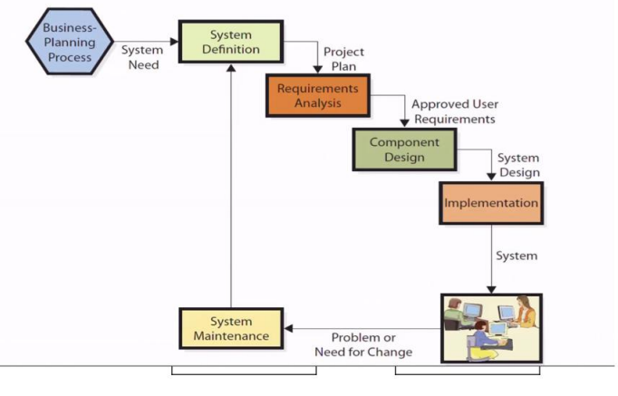
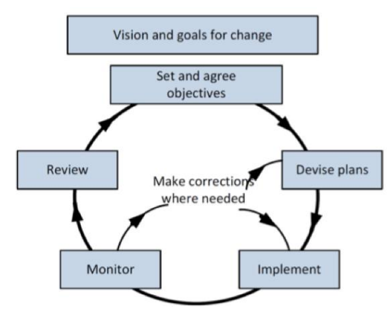
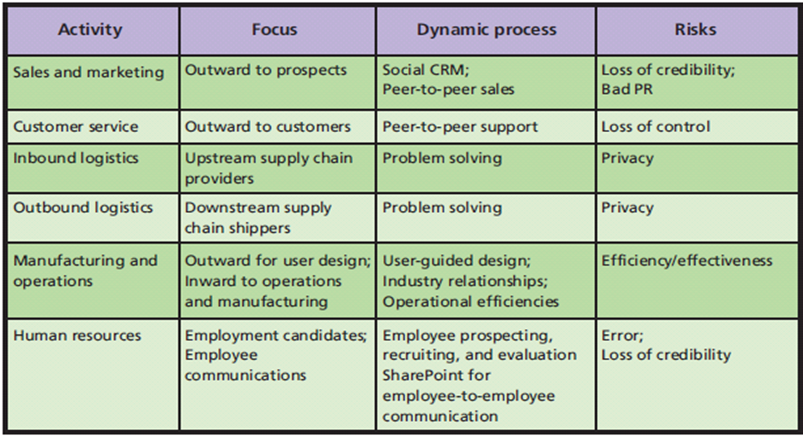

# CB2500 Information Management

## 1. Introduction

### Importance of MIS

Background: the forces pushing the evolution of new digital devices

| Law | Meaning | Implications |
| --- | --- | --- |
| Bell's Law | New class of computers established each decade | New computers create new industries |
| Moore's Law | 2x transistors on a chip every 18 months | Computing power scales and costs approach 0 |
| Metcalfe's Law | Value of a network is proportional to the square of the number of users | More digital devices create more value |
| Nielsen's Law | 1.5x network connection speed every year | Higher speeds enable new products, platforms, and companies |
| Kryder's Law | Storage density on magnetic disks is increasing exponentially | Storage capacity increases and costs approach 0 |

**Routine cognitive skills** = skills that are routine and can be accomplished through a set of rules

Any routine skill can, and will, be outsourced to the lowest bidder.

**Marketable skills** = skills that require creativity and problem solving

Examples of marketable skills:

| Skills | Examples |
| --- | --- |
| Abstract reasoning | Modelling a problem |
| Systems thinking | Understanding how system components work together |
| Collaboration | Working with others, providing and receiving critical feedback |
| Ability to experiment | Creating and testing new ideas |

### Definition of MIS

**Information system (IS)** = a computer-based system that stores, organizes, and provides access to information

5 components of an IS:

- Hardware
- Software
- Data
- Procedures
- People

**Management Information Systems (MIS)** = the management and use of information systems that help organizations achieve their strategies

From the bottom up, MIS is used by everyone in the organization:

- **Use IS**: employees use IS for daily operations
    - **Transaction processing system (TPS)** = collect, modify and retrieve transaction data
- **Manage IS**: managers develop, maintain and adapt IS
    - **Management information system (MIS)** = convert data from TPS into information for monitoring performance
    - **Decision support system (DSS)** = support decision making process
    - Expert system (ES) = provide expert advice
    - AI = learn from past experiences and perform human-like tasks
- **Achieving strategies**: executives use IS to compete and develop new products and services
    - **Executive support system (ESS)** = provide access to internal and external information relevant to executives, so they can make strategic decisions

Common misconceptions about MIS:

- IS can be bought off the shelf: IS consists of hardware, software, data, procedures and people. The software can be bought, but the procedures and people need to be developed and trained.
- IS is equivalent to IT: IT is the hardware and software, but IS also includes data, procedures and people.

## 2. Business Processes

### Definition of Business Process

**A business process is a network of activities for accomplishing a business function**. More specifically, it produces a service or product for a particular customer(s).

Therefore, all activities connected to serving a customer are part of a business process.

### BPMN

Business Process Model and Notation (BPMN) is a standard set of terms and graphical notations for documenting business processes.

Remarks on BPMN standard:

| Shape | Meaning | Remarks |
| --- | --- | --- |
| Thin circle | Start | Only 1 is allowed |
| Thick circle | End | Only 1 is allowed |
| Rectangle | Activity |
| Rectangle with `+` | Subprocess | Refers to another diagram |
| Parallelogram | Data Repository | a database |
| Diamond | Decision |
| Dashed line | Data Flow | |
| Solid line | Control Flow |

Example of a business process:

This is a business process for a distributor. The Buyer (distributor) buys products from the Vendor. Then, the Customer buys products from the Buyer through a website. The Operations handles the delivery of products to the Customer.

**Actors** (= roles) are shown at the top of the diagram.

### Process Quality

Two dimensions of process quality:

- **Effectiveness**: enables organization to accomplish its strategy
- **Efficiency**: ratio of benefits to costs

Examples: having a single repository outperforms having multiple repositories, because it will generate less errors and save time.

Best practices: use a single repository for a single subject. In the above example, Vendor Data Repository and Vendor Order Repository should be merged into a single Vendor Repository. Customer Order Repository focuses on another subject, so it should be kept separate.

Revised diagram:

### Information

1. Information is **knowledge derived from data**, where data is defined as recorded facts or figures.
2. Information is **data presented in a meaningful context**.
3. Information is **data processed** by summing, ordering, averaging, grouping, comparing, or other similar operations.

5 characteristics of quality information:

- **Accurate**: correct and complete
- **Timely**: made available in time for its intended use (before it loses its value)
- **Relevant**: relevant to both context and subject (the user and the goal in using the information)
- **Just barely sufficient**: sufficient for the purpose. In other words, no unnecessary information.
- **Worth its cost**: the value of the information should justify the cost for developing, maintaining and using IS

## 3. Organizational Strategy

Organizational Strategy = a plan for how the organization will do business

Organizational Strategy determine the Information Systems structure:

Industry structure → Competitive strategy → Value chains → Business processes → Information systems

### Porter's Five Forces

Five forces that determine Industry Structure:

- 3 Competitive forces:
    - **Degree of rivalry**: The intensity of competition among existing firms
    - **Threat of Substitutes**: The advantage of a substitute product or service
    - **Threat of New Entrants**: The possibility and strength of new competitors entering the market
- 2 Bargaining power forces:
    - **Bargaining power of Suppliers**: The ability of suppliers to drive up prices of materials
    - **Bargaining power of Customers**: The ability of buyers to drive down prices

Bargaining power = the ability to influence the price of a product

Bargaining Power of Customers is determined by:

- **Purchase volume share**: the proportion of the total sales that is purchased from a single supplier
- **Product differentiation**: the degree to which a product is unique
- **Switching costs**: the costs of switching from one supplier to another
- **Substitutes**: the availability of substitutes

Examples:

- McDonald's -> Customer: Customer has HIGH BPC because of low switching costs, many substitues, and homogeneous products
- Airline -> Customer: Customer has HIGH BPC because of low switching costs, many substitutes, and homogeneous products
- Auto Paint Supplier -> Toyota: Customer has HIGH BPC because Toyota is a large customer and can therefore demand lower prices
- University -> Student: Student has LOW BPC because of high switching costs, few substitutes, and unique products

Bargaining Power of Suppliers is determined by:

- **Supplier-buyer ratio**: the number of suppliers to the number of buyers
- **Dependence**: the degree to which the buyer depends on the supplier
- **Switching costs**: the costs of switching from one supplier to another
- **Substitutes**: the availability of substitutes

Examples:

- Potato Supplier -> McDonald's: Supplier has LOW BPS because of McDonald's high purchase volume share and low switching costs
- Supplier -> Airline: Supplier has HIGH BPS because of the low number of suppliers and high dependence
    - Airlines highly depend on aircraft manufacturers and fuel suppliers
    - There are only 2 major airplane manufacturers, Boeing and Airbus. They dominate the market and have high bargaining power
    - Fuel price is heavily influenced by geopolitical events. Airlines have no control over fuel prices

Backward integration = when a company buys its suppliers (e.g. Intel buying and operating its own silicon foundries)

Forward integration = when a company buys its customers (e.g. Apple setting up its own retail stores)

### Competitive Strategy

Industry Structure determines Competitive Strategy.

Porter's Four Competitive Strategies:

- **Industry-wide cost**: become the lowest-cost producer across the industry
- **Focus cost**: become the lowest-cost producer within an industry segment
- **Industry-wide differentiation**: create better products or services across the industry
- **Focus differentiation**: create better products or services within an industry segment

Example 1: Consider a bank. Its Competitive Strategy may include:

- Industry-wide cost: Lowest cost in providing general counter services
- Focus cost: Lowest cost in providing investment advice for investment acc holders
- Industry-wide differentiation: Longest operating hours (e.g. Citibank)
- Focus differentiation: Premier banking services for high net worth individuals (e.g. HSBC)

Note the company can define the industry segment as it wishes.

Example 2: Consider an airline. Its Competitive Strategy may include:

- Industry-wide cost: Lowest cost in providing economy class flights
- Focus cost: Lowest cost in providing day-time flights (because day-time flights are usually less popular)
- Industry-wide differentiation: Best in-flight entertainment
- Focus differentiation: Best in-flight meals / The most comfortable seats

### Value Chains

Competitive Strategy determines Value Chains.

**Value Chain** = a network of value-creating, primary and support activities

**Margin = Value - Cost** -> value generated in this activity - cost of this activity

Primary activities (business functions):

- **Inbound logistics**: buying, storing, and distributing inputs
- **Operations**: manufacturing
- **Outbound logistics**: collecting, storing, and distributing products to buyers
- **Sales and marketing**
- **Customer service**

Support activities:

- **Technology**
- **Procurement**: raw materials
- **Human resources**
- **Firm infrastructure**: part of the firm unrelated to the business functions. e.g. management, finance, accounting, legal, etc.

### Business Processes

Value Chains determine Business Processes.

**Business Process** = a network of activities that implements (portions of) a value chain

One value chain may be associated with multiple business processes.

- **Low-cost strategy**: focus on efficiency
- **High-service strategy**: focus on effectiveness

E.g. car rental company:

- for general customers: low-cost strategy (cheaper models, minimal customer service, simple processes)
- for business customers: high-service strategy (variety of models, customized services, detailed processes)

Even though the value chain is similar for both types of customers, the business processes are different.

This is why "business process IMPLEMENTS value chain": there are many possible implementations of the same value chain.

### Information Systems

Business Processes determine Information Systems.

Information Systems can provide **Competitive Advantages**. e.g.

- Product implementation
    - Create new products/services
    - Enhance existing products/services
    - Differentiate products/services
- Process implementations
    - Lock in customers and buyers
    - Lock in suppliers
    - Raise barriers to market entry
    - Establish alliances
    - Reduce costs

Example of a cheap airline:

Cheap airlines cannot innovate in product implementation, because they are focused on cost. Instead, they focus on process implementation:

- Lock in customers: frequent flyer programs
- Lock in suppliers: exclusive deals with specific airports
- Raise barriers to market entry: the airline market has very high barriers to entry. This is because of the high startup costs, and difficulty in obtaining licenses and permits
- Establish alliances: code-sharing agreements with other airlines (which allows the airline to sell tickets on behalf of other airlines, thus increasing the number of destinations it can offer)
- Reduce costs:
    - Externalizing costs: e.g. charging for meals, luggage, reserved seats, etc.
    - Internalizing costs: e.g. using a single type of aircraft to reduce maintenance costs

## 4. Database

Types of Applications:

- **Horizontal-market** = provide capabilities common across all organizations and industries
    - e.g. Microsoft Office
- **Vertical-market** = serve the needs of a specific industry
    - e.g. POS systems for retail, Canvas for education
- **One-of-a-kind** = developed for a specific, unique need
    - customized solutions for a specific company

Note: the types are based on the industry and the organization who uses the software, not the functionality of the software.

Sources of Software:

- **Off-the-shelf** = prewritten, plug-and-play software
    - Horizontal-market OR Vertical-market
- **Off-the-shelf and then customized** = prewritten software that is customized to fit the needs of a specific organization
    - Vertical-market
- **Custom-developed** = developed by the organization for its own use
    - One-of-a-kind

### Database

A database is a self-describing collection of integrated records.

- **Table** = a single file consisting of rows and columns
- **Record** = a row in a table
- **Column** = a field in a table
- **Key** = a column (or group of columns) that uniquely identifies a record within a table
- **Foreign key** = a column (or group of columns) in one table that references the primary key in another table
- **Metadata** = data that describes data
    - Database metadata describes the structure (schema) of the database

Components of a Relational Database:

- Data (state)
- Relationships among rows in tables
- Metadata (schema)

### Database Management System (DBMS)

- DB = data + relationships + metadata
- DBMS = a program used to create, process, and administer a database
- Database application = a collection of forms, reports, queries, and application programs that serves as an intermediary between users and database data
- **Database Application System**: User ↔ Database application ↔ DBMS ↔ Database
- Local Database Application System: User ↔ Database application on client ↔ DBMS on server ↔ Database on server
- Web-based Database Application System: User ↔ Web browser ↔ Web server ↔ Database application on server ↔ DBMS on server ↔ Database on server

Four main DBMS operations: read, insert, modify, delete

**SQL** (Structured Query Language) = an international standard language for processing a database

### Entity-Relationship Data Model

- **Entity** = something that the users want to track
    - e.g. Customer, Order, Product
- **Attribute** = a characteristic of an entity
    - e.g. Customer Name, Order Time, Product Price
- **Identifier** = an attribute (or group of attributes) whose value is associated with one and only one entity
    - e.g. Customer ID, Order ID, Product ID

Cardinality: 1:1, 1:N, M:N

### Normalization

To transform a data model into a database design, we need to normalize the data model.

Normalization = the process of converting a poorly structured table into two or more well-structured tables

Goal: to construct tables such that every table has a **single theme** or entity

Purpose: **to minimize data integrity problems**. (Data integrity problems produce incorrect and inconsistent information. It can only occur if data is **duplicated**.)

However, normalization can lead to performance issues. The most viable design depends on the specific situation.

## 5. Business Intelligence

### Smart Banking

Seven Features of Smart Banking:

- **Connectivity**
- **Anywhere, anytime, any device**
- **Customer-oriented service** and **Self-service**

Smart Banking is a global project requiring global partnerships across fields.

7 Features of Smart Banking:

- Balance sheet efficiency
- M&A (Mergers and Acquisitions) support
- Growth
    - Invest in customer analytics
    - Improve customer experience by digital technologies
    - Revise underwriting standards (underwriting = the process of evaluating the risk of insuring a home, car, or individual)
    - Learn from non-bank technology firms and establish partnerships to create competitive advantage
- Payments Transformation
    - Use customer data for specialized promotions and services
    - Differentiate customer experience
- Compliance and Risk Management
    - Incorporate risk management and compliance responsibilities into the performance management process
    - Reinforce a strong "tone at the top" to integrate the ethics of risk management into the company culture
- Data Management
    - Create a central regulatory management office to manage data
    - The board should make decisions through chief data officers
- Cybersecurity

### Smart e-Payment

An electronic payment system is a way of making transactions or paying for goods and services through an electronic medium, without the use of checks or cash in person.

Types of e-Payment:
- Credit card
- Direct debit
    - the purchased amount is directly deducted from the buyer's account (*)
    - Examples: FPS (轉速快)
- SVF (Stored Value Facility)
    - A third-party payment service that allows a customer to store value in an electronic account
    - Examples: Octopus, PayPal, Alipay, WeChat Pay

Note: Apple Pay and Google Pay are not SVF. They are credit card payment systems (There are no "digital wallets". When you pay, the amount is deducted from your credit card.)

### Business Intelligence

**Business Intelligence (BI)** = technologies, applications, and practices for the collection, integration, analysis, and presentation of business information. also known as Data-Driven Decision Support System

> 4 Standard Components of BI: Data from business environment, BI Software, BI Procedures, BI Applications

**BI System** = a IS that processes operational (and other) data to analyze past performance and to make predictions

BI = Patterns, relationships, and trends in data, as identified by BI systems

BI = Data + Software (BI Application) + People (Knowledge Workers)

- **Acquire data**: retrieve data from
    - Operational databases (DB monitoring daily transactions)
    - Purchased data (e.g. demographic data)
    - Public data (trends, economic indicators)
- **Analyze data**: BI Application analyzes the data
- **Publish results**: Provide information to knowledge workers, who can then make decisions

Typical Uses of BI:

- Identifying changes in purchasing patterns
    - important life events (e.g. marriage, birth of a child) that trigger changes in purchasing patterns
- Discovering business insights
    - Market Basket Analysis: what products are bought together
- BI for entertainment
    - Recommendation systems (e.g. Netflix, Amazon)
- Predictive Policing

How BI helps Smart Banking:
- Bank can acquire data from various interactions
- e.g. Transaction data from branch, ATM, Phone Banking, Fax, E-Banking

### Big Data

4 V's of Big Data:

- **Volume** Scale of data
- **Velocity** Analysis of streaming data
- **Variety** of Different forms of data
- **Veracity** Uncertainty of data (data quality)

How organizations use Big Data:

Data Sources (Operational, Purchased, Social) → Processing (ETL) → Data Warehouse (DBMS) → BI Tools → BI Users

**ETL** = Extract, Transform, Load

- **Extract**: get information from internal & external sources
- **Transform**: data using common sets of enterprise definitions (= data formatting & cleaning)
- **Load**: load data into a data warehouse

**Data Warehouse** = a DBMS which aggregates data from multiple sources into a single repository of highly structural historical data

**Data Mart** = a subset of a data warehouse that is used for a specific purpose or by a specific department

Data mart looks into a given subject area (e.g. sales, finance, marketing) or a selected set of sources.

| Data Warehouse | Data Marts |
| --- | --- |
| Multi subject | Single subject |
| Detailed Information | Summarized Data |
| Integrate all sources | Integrate selected sources |
| Not necessarily a dimensional model   Feeds dimensional model | Dimensional model |
| Data is historical (Years) | Data is current (Months) |

> Question: Do data warehouses and data marts implement the normalization process?

Answer:

The goal of normalization is to minimize data integrity problems. Data warehouses consist of massive amounts of data from multiple sources. Therefore, the data in a data warehouse is likely to be redundant. Therefore, the data warehouse may apply normalization to clean up the data, but only if a relational database is used.

Dimensional model data warehouses and data marts are never normalized. The goal of a dimensional model is to provide a fast and easy way to access data for end users. Normalization would slow down the process of accessing data.

### BI Techniques

#### Multidimensional Analysis

What is a dimensional model? Consider a 3D array `data[time, branch, product]`. This is very easy to access but at the cost of redundancy. This is the opposite of normalization.

- **Dimension**: a particular attribute of data
- **Cube**: a representation of multidimensional information

**Online Analytical Processing (OLAP)**: a reporting technology that can perform multidimensional analysis

The analysis is done by slicing and dicing the data, by fixing one or more dimensions and varying the others.

**Offline and online dimensions**:
- Offline: time, geography, product
- Online: customer, salesperson, promotion

#### Cluster Analysis

A technique used to divide an information set into **mutually exclusive groups** such that

- Intra-cluster members are close to each other
- Inter-cluster members are far apart

without much prior knowledge of the groupings.

Goal: analyze the **proximity** (= similarity) to find out potential groups and clusters; help finding **market segmentation**.

#### Association Detection

A technique used to reveal **the relationship between variables** along with the nature and frequency of the relationship.

**Market Basket Analysis** is a common application of association detection. Example: analyze the goods that are mostly likely to be bought together. **Predict future behavior and promote cross-selling**.

### Project Management Qualifications

To become a qualified project manager, the following qualifications are useful:

- **Project Management Professional (PMP)**
- Project Management Institute (PMI)
- Domain knowledge of project management

5 steps of project management:

- **Initiating** the project
    - Project assessment: feasibility study / risk assessment
    - Meeting with internal and external stakeholders
    - Project charter (a document that formally authorizes a project)
- **Planning** the project
    - Assess and review detailed project requirements, constraints, and assumptions
    - Scope, budget plan, schedule, HR management plan
- **Executing** the project
    - Obtain resources
    - Execute the tasks defined in the plan
    - Implement approved changes
- **Monitoring and Controlling** the project (during the execution phase)
    - Measure project performance
    - Ensure deliverables pass quality controls
- **Closing** the project
    - Final acceptance
    - Transfer of ownership
    - Financial, legal, and administrative closure

### System Development Life Cycle (SDLC)

**System Definition** → **Requirements Analysis** → **Component Design** → **Implementation** → **System Maintenance**

- Decide the need for a new system based on Business-Planning Process
- System Definition: deliverables = Project Plan
- Requirements Analysis: deliverables = System Requirements Document with approval from the user
- Component Design: deliverables = System Design Document
- Implementation: deliverables = New System
- System Maintenance: Continuously solve problems and improve the system

### Change Management

Change management is a vital component of IS development. It is a practice of project implementation to increase the chances of success.

When managing change, special attention should be paid to the following:

- **Resistance to change**
- **Organizational culture**
- **Project participants** (stakeholders)

4 steps of change management:

1. **Set and agree on objectives**: Setting objectives linked to the vision of the organization and purpose of the change
2. **Devise plans**: Planning the change details and the resources required
3. **Implement and monitor**: Implementing the change with continuous monitoring
4. **Review**: Providing possible adjustments of the plan or modification of actions to ensure the objectives are met

### Major Challenges to System Development

1. The difficulty of requirments determination
    - Requirements are never and could never be fully determined at the beginning of the project
    - Solution: SDLC Step 2 (Requirements Analysis)
    - PMs (Project managers) use **diagrams** to illustrate key features, with detailed **specifications** attached
2. Changing requirements
    - Requirements are likely to change during the project
    - PMs decide what changes could be handled given the time and budget constraints
3. Scheduling and Budgeting Difficulties
    - PMs plan the project and report ROI (Return on Investment) to stakeholders
4. Changing Technology
    - PMs carry out the impact analysis and decide whether to adopt the new technology
5. Diseconomies of Scale
    - When the size of the organization or project grows, the cost per unit increases
    - PMs plan for team sizes and timelines

## 6. Social Media

### Social Media Information Systems (SMIS)

SMIS is the use of IS to support **sharing** content among networks of users, that enables **communities** (= groups of people related by a **common interest**).

3 Roles of SMIS:

- **Social Media Providers**: e.g. Facebook, LinkedIn, Twitter
    - Goal: attracting and targeting demographic groups
- **Users**: individuals and organizations
    - Organizations use social media as part of their marketing strategy
- **Communities**: a group of users with a common interest

**SMIS is not free**, as development, maintenance, and resource costs are involved.

Five components of SMIS as an IS:

| Component | Role | Example |
| --- | --- | --- |
| Hardware | SMPs | Servers, data centers |
| Software | SMPs | DBMS, analytics, BI |
| Software | Users | Browser, mobile app |
| Data | SMPs | Store and retrieve data on behalf of users |
| Data | Users | Content, connection data |
| Procedures | SMPs | Running and maintaining the system |
| Procedures | Users | Content creation and response |
| People | | Users, community managers, social media managers |

### Social Media Strategy

How does SMIS advance Organizational Strategy?

Recall: Industry Structure → Competitive Strategy → Value Chains → Business Processes → Information Systems

Social media is by nature a dynamic Information System → unstructured Business Process → unstructured Value Chain

Social media fundamentally changes balance of power among users, communities, and organizations.

- **Sales and Marketing Activities**
    - Social **Customer Relationship Management** (CRM) enables each customer to actively craft their own relationship with the company instead of staying passive
    - Downside: negative feedback can spread quickly, causing loss of credibility and poor PR (Public Relations)
- **Customer Service**
    - Product users can help each other solving problems, reducing the need for customer service
    - Downside: peer-to-peer support risks loss of control over the message (e.g. incorrect information)
- **Inbound and Outbound Logistics**
    - find suppliers and customers to solve supply chain problems
    - Downside: loss of privacy (exposure of problems in front of competitors)
- **Manufacturing and Operations**
    - Externally, social media can be used to **crowdsource** ideas for new products → design new products, promote brand awareness in B2C (Business to Consumer) markets
    - Internally, social media can improve communication and help knowledge management (e.g. enterprise social networks)
- **Human Resources**
    - Finding employee prospects, recruting and evaluating candidates (LinkedIn)
    - Downside: form errorneous opinions based on social media profiles

### Social Capital

**Social Capital** = the investment in social relations with the expectation of returns in the marketplace

In the context of SMIS, social capital is a combination of 
- social network size
- relationship strength
- resources possessed by those in the network

Values of Social Capital:

- **Information**
    - learning opportunities, alternatives and problems
- **Influence**
    - influence decision-makers who are critical to your success
- **Social Credentials**
    - linked to a community of high reputation makes you more credible
- **Reinforcement**
    - support and validation of your ideas and opinions
    - reinforce your personal and professional identity in the industry

#### Social Capital for Organizations

- **Strengthening Relationships**
    - Social media can be used to strengthen relationships with customers, suppliers, and employees
    - Continuing and frequent interactions can lead to trust and commitment
- **Connecting to Resource Holders**
    - Social media can be used to connect to those with more resources
    - **resources must be relevant** to the customer/investor/supplier

Strength of Social captial is determined by: number of relationships × relationship strength × resource

### Revenue Models for Social Media

3 channels for revenue generation:

- **Advertising**
    - Pay-per-click (PPC)
    - e.g. YouTube ads, Facebook ads
    - Platform generates revenue from advertisers, businesses increase sales (ad revenue)
- **Freemium**
    - Basic services are free, but premium services are charged
    - e.g. YouTube Premium, LinkedIn Premium
- **Sales**
    - Selling apps, virtual goods
    - Affiliate commissions (if a user buys a product through a link, the platform gets a commission)
    - Donations (e.g. Wikipedia)

## 7. Information Security

In risk management, IT/IS auditing is a critical component.

However, it is important to note that IT/IS auditing is:

- NOT accounting control or financial auditing (done by accountants)
- NOT compliance testing (done by compliance officers. Compliance testing: evaluating the effectiveness of internal controls)
- NOT out of scope of Information Management

**Corporate Governance** = a set of mechanism and processes to control and operate a firm

### COBIT

COBIT (Control Objectives for Information & related Technology) is designed by ISACA (Information Systems Audit and Control Association).

COBIT is a **reference framework** to help companies to **manage risks** related to the use of information systems.

To be an IS auditor, passing the CISA (Certified Information Systems Auditor) exam is a must.

Five domains in CISA:

(1) **Information Systems Auditing Process**

Provide audit services in accordance with **IT audit standards** to assist the organization with **protecting and controlling information systems**.

Requirements:

- Know relevant **laws and regulations**, which affect the scope, evidence collection, preservation, and frequency of audits (i.e. how audits are conducted)
- Know fundamental **business processes** and relevant IT systems

(2) **Governance and Management of IT**

Provide assurance that necessary **leadership** and **organizational structures** and **processes** are in place to achieve objectives and to support the organization’s strategy.

Requirements:

- Know **enterprise risk management**
- Know **Business Impact Analysis** (BIA) related to **Business Continuity Planning** (BCP)

(3) Information Systems **Acquisition, Development, and Implementation**

Provide assurance that the practices for the **acquisition, development, testing and implementation** of information systems meet the organization’s strategies and objective.

Requirements:

- Know **acquisition practices** and **system development methodologies**

e.g. How to configure a horizontal/vertical/one-of-a-kind software, the phases in SDLC

(4) Information Systems **Operations** and **Business Resilience**

Provide assurance that the process of information systems **operations**, maintenance, and support meet the organization’s strategies.

Requirements:

- Know system **performance monitoring** processes
- Know **regulatory, legal, contractual, and insurance issues** related to disaster recovery

(5) Protection of **Information Assets**

Provide assurance that the organization’s security policies, standards, procedures, and controls ensure the **confidentiality, integrity, and availability** of information assets

Requirements:

- Know how to **monitor and respond to security incidents**
- Know how to **store, retrieve, transport, and dispose of** confidential information assets

### Goals of IS Security

Goal: to balance **costs** (safeguard) and **risks** (loss)

Sources of threats:

- **Human error**
- **Computer crime**
- **Natural events and disasters**

Types of security loss:

- **Unauthorized data disclosure**
    - Pretexting: pretending to be someone else
    - Phishing: pretending to be a legitimate company to get sensitive information
    - Sniffing: intercepting computer communications
    - Hacking: breaking into computers, servers, or networks
- **Incorrect data modification**
- **Faulty service**: incorrect system response (usurpation)
- **Denial of service** (DoS): disrupts the normal function and prevents others from using the system
- **DDoS attack**: flooding a network server with false requests to disrupt normal traffic

### Safeguards

Recall the 5 components of an IS: Hardware, Software, Data, Procedures, People

To safeguard against security threats, each of the components must be protected.

- **Technical safeguards** (Hardware, software)
    - **Identification and authentication**
        - 2FA (Two-factor authentication), biometric
    - **Encryption**: the process of transforming clear text into coded, unintelligible text for secure storage or communication
        - Key: a string of bits used to encrypt the data
        - Symmetric key encryption: the same key is used to encrypt and decrypt the data
        - Asymmetric key encryption: public key to encrypt, private key to decrypt
    - **Firewalls**: hardware and/or software to prevent unauthorized access
    - **Malware protection**
        - 3 types of malware: virus (replicate themselves to corrupt systems and destroy data), spyware (monitor and report user activities in background), adware (just ads)
- **Data safeguards** (Data)
    - **Data administration**: **organization-wide** function that oversees developing data policies and enforcing data standards
    - **Database administration**: database-specific function (ERP, CRM, MRP, etc.)
- **Human safeguards** (Procedures, People)
    - Goal: to ensure that employees are aware of security threats and are trained to respond to them
    - **Position definition**
        - Separate duties and authorities
        - Determine the least privilege (only provide the necessary access)
        - Document position sensitivity
    - **Hiring and screening**
    - **Dissemination and enforcement**: responsibility, accountability, compliance
    - **Termination**: remove access rights

### Business Continuity Planning (BCP)

**Business Continuity Planning**
- to enable a business to **continue offering critical services** in the event of a disruption
- to **survive a disastrous interruption**
- rigorous **planning and commitment of resources** is necessary to adequately plan for such an event

The responsibilities of IS auditors:

1. **Identify critical services** a company should continue to offer after interruption
    - e.g. bank's critical services include ATM, online banking, etc.
    - Allocate **resources** and follow **regulations** to maintain these services
2. Help **planning for resources and procedure** for recovering client's business in the shortest possible time
    - backup site / facilities / data
    - emergency response team, emergency procedures

Formally, BCP involves defining any **risks** that can affect the business, and also include the following:

1. Determine how those risks will affect operations
2. Implementing safeguards and procedures to mitigate those risks
3. Testing procedures to ensure they work
4. Reviewing the process to make sure it is up-to-date

### Information Ethics

**Information Ethics** governs the ethical and moral issues arising from the **development and use of information technologies**, as well as the creation, collection, duplication, distribution, and processing of information itself.

| Intellectual Property | |
| --- | --- |
| Copyright | The legal protection afforded an expression of an idea |
| Fair Use Doctrine | A doctrine that permits limited use of copyrighted material without acquiring permission |
| Pirated Software | Unauthorized use, duplication, distribution, or sale of copyrighted software |
| Counterfeit Software | Software that is manufactured to look like the real thing and sold as such |

PDO (Personal Data Ordinance) is a law in Hong Kong that governs the collection and use of personal data.

### Company Policies

To ensure information security, companies should have policies in place to govern the use of information systems.

- Ethical computer use policy: general principles to guide computer use behavior
- Acceptable use policy: a policy that defines acceptable uses of the firm’s information resources and computing equipment
- **Email privacy policy**: a policy that details the extent to which email messages may be read by others
    - e.g. employers can monitor employee's email, but they must inform the employees through this policy
    - also discourages **spamming**

## 8. Organizational Information Systems

### Scope of Information Systems

- **Personal** information systems: used by individuals
    - e.g. personal email
- **Workgroup** information systems: 10-100 users
    - used within a group
- **Enterprise** information systems: 100-1000 users
    - cross department
    - e.g. CRM, ERP, SCM
- **Inter-enterprise** information systems: 1000+ users
    - used across organizations
    - e.g. supply chain management

### Information Silo

Information silo is a condition that exists when data are isolated in separated information systems.

Problems of information silos:

- **Data integrity**: since duplicated data are stored in different systems, they can be inconsistent
- **Disjointed processes**: different departments may have different processes
- **Lack of integrated enterprise information**: cannot connect data across systems
- **Inefficiency**
- **Increased costs**

### CRM, SCM, and ERP

Evaluating system performance:

- **benchmarking** = a process of measuring performance and comparing with other players in the industry
- **metrics** = measurements used to track performance

**CRM** (Customer Relationship Management)
- manage interactions with customers through four phases: **marketing**, **customer acquisition**, **relationship management**, and **loss/churn**
- Applications:
    - Sales force automation
    - Solicitation and lead management
    - Relationship management
    - Customer support
- Metrics:
    - **Sales metrics** (e.g. number of sale calls, revenue generated)
    - **Service metrics** (e.g. number of cases handled, average resolution time)
    - **Marketing metrics** (e.g. customer acquisition cost, customer retention rate)

**supply chain**: a network of organizations and business processes for procuring raw materials, transforming these materials into intermediate and finished products, and distributing the finished products to customers (supplier → manufacturer → distributor → retailer → customer)
- **bullwhip effect**:
    - **variability in size and timing** of orders increases at each stage up the supply chain (i.e. the supplier end sees the most variability)
    - large demand fluctuations force distributions, manufacturers, and suppliers to carry more inventory than necessary
    - reduces the profitability of the entire supply chain

**SCM** (Supply Chain Management)
- manage the flow of information, materials, and services from raw material suppliers through factories and warehouses to the end customers
- Metrics
    - Backorder (the number of orders that cannot be filled immediately)
    - Customer order promised/actual cycle time (the time between the order and delivery)
    - Transit time

**ERP** (Enterprise Resource Planning)
- a suite of applications, a database, and a set of inherent processes for consolidating business operations into a **single, consistent, computing platform**
- **integrates all departments and functions** throughout an organization into a single IT system
- Make **enterprise-wide decisions** based on the data from the system

Advantages of ERP:

- Logical **solution to incompatible applications** (e.g. different departments using different software)
- **global information sharing and reporting**
- No need to **fix legacy systems**

If not using ERP, companies may have to customize a way to connect different systems from different vendors, which is costly and time-consuming.

ERP components:

- Core:
    - **Accounting and finance**: general ledger, accounts payable, accounts receivable, budgeting, asset management
    - **Production and materials management**: demand forecasting, production scheduling, job cost accounting, quality control
    - **Human resources**: track employee information (payroll, benefits, compensation, performance assessment)
- Extended: **BI, CRM, SCM**

## 9. Collaboration

### Disruptive Technologies

**Digital Darwinism** = the phenomenon of technology and society evolving faster than an organization can adapt

This implies that organizations which cannot adapt to the new demands placed on them for surviving in the information age are doomed to extinction.

**Disruptive Technologies** = a new way of doing things that initially does not meet the needs of existing customers

Example: social media, 3D printing, blockchain

**Long-tail marketing** = selling a large number of unique items with relatively small quantities sold of each

### Collaboration Systems

Internal collaboration: **collaboration system**
- tools that support the work of teams or groups by facilitating the **sharing and flow of information**
- e.g. scheduling, document sharing, video conferencin

**knowledge management system**: capturing, classifying, evaluating, retrieving, and sharing information assets in a way that provides context for effective decisions and actions
- Benefit:
    - enable generalist to do specialist work
- Knowledge:
    - **explicit knowledge**: can be documented, archived, codified, and accessed
    - **tacit knowledge**: knowledge contained in people's heads

External collaboration: **video conferencing**
- A set of interactive telecommunication technologies that allow two or more locations to interact via two-way video and audio transmissions simultaneously

### International MIS

**Globalization** = the integration and interdependence of economic, social and cultural relations across international boundaries

Recall: Industry Structure → Competitive Strategy → Value Chains → Business Processes → Information Systems

- Worldwide opportunities (Industry Structure)
- International market (Competitive Strategy)
- Internationalized value chain (Value Chains + Business Processes)
- Support international business processes (Information Systems)

Recall: IS Components: Hardware, Software, Data, Procedures, People

- International Hardware: sold worldwide
- International Software: localized software
- International Data: choose one language for data
- International Procedures: reflect local customs and regulations

Challenges in making IS international:

- **ETL**: raw data is in different languages
- **Software design**: interface localization
- **Procedure design**: multiple layers of approval

Issues with global databases:

- Commit to a single company language
- If a single database is used, not suitable for multilanguage working environment
- If multiple databases are used, export and import data between databases
- Slow data transmission speed requires **distributed databases**

Challenges in global IS:

- Project integration (internal management)
- Scope (requirements)
- Time
- Cost
- Quality
- Human resources
- Communications
- Risk
- Procurement

### International Outsourcing

**Outsourcing** = the process of hiring another company/individual to perform a service

Advantages of outsourcing:

- Management advantages
    - Obtain expertise
    - Free management time
- Cost reduction
- Risk reduction

Risks of outsourcing:

- Loss of control
- Benefits outweighed by long-term costs
- No easy exit
    - Employees are not trained to do the work
    - Costly and risky to change vendors

## 10. The Cloud

The cloud = elastic leasing of pooled computer resources over the internet

- **Elastic**:
    - Leasing (= renting) resources as needed
    - Increased or decreased dynamically and programmatically
    - Only pay for what you use
- **Pooled**:
    - Same physical hardware serves multiple organizations, shared through **virtualization**
    - Benefit from **economic of scale**
        - Average cost of production decreases as the size of the operation increases
        - Major cloud vendors operate **web farms** (a collection of servers working together to serve a large number of users)

Cloud is better than in-house hosting:

- In-house hosting incurs significantly higher costs, and brings maintainance and staff training issues
- In-house hosting is hard to scale up, especially impossible to accommodate sudden spikes in demand

Downside of cloud:

- Dependency on vendor
- Loss of control over data location
- Limited security visibility (hard to know how secure the data is, even though the vendor promises security)
- Limited disaster preparedness

Cloud cannot be used for everything:

- Financial institutions are legally required to maintain physical control over their data

### Computer Networks

- **Computer network**: a collection of computers that communicate with one another over transmission lines or wirelessly
- **PAN (Personal Area Network)**: a network that connects devices within a range of a few meters
- **LAN (Local Area Network)**: a network that connects devices within a building or campus
- **Internet**: a network of networks, interconnecting small networks worldwide
- **Intranet**: a private internet that is used exclusively within an organization
- **Extranet**: extension of an intranet that is available to authorized outsiders
- **Protocol**: a set of rules and data structures for organizing communication

### Freeconomics

- **Freeconomics**: the leveraging of digital technologies to provide **free goods and services** to customers as a business strategy for gaining a **competitive advantage**

How does freeconomics work:

- Marginal cost is approaching zero = the cost of serving one more user is almost zero
- **Influences price setting**
- Some users (e.g. enterprise users) pay for the service
- **Value proposition**: the benefit that a company offers to customers
- Value proposition includes more than just buyers and sellers, but also **complementors** (e.g. app developers for Apple)

Approaches to freeconomics:

- **Advertising**: free service, but with ads
- **Freemium**: basic service is free, but premium service is charged
- **Cross-subsidies**: bundle with other services to encourage purchase
    - e.g. Free cell phone with a 2-year contract

### Future Trends

- **Internet of Things (IoT)** = a world where interconnected, Internet-enabled devices or "things" can collect and share data without human intervention
    - connect to a network to share data with any other application, service and design
- **Fashion Technology**: e.g. smart watches, smart glasses
- **Smart home** = a home equipped with technology to enable remote control of appliances, lighting, and heating
- **Smart city** = a city that uses IoT and ICT to enhance the quality of life for its citizens
- **NFT (Non-Fungible Token)** = a blockchain-based digital asset that represents ownership of a unique item or piece of content
- **Metaverse**
