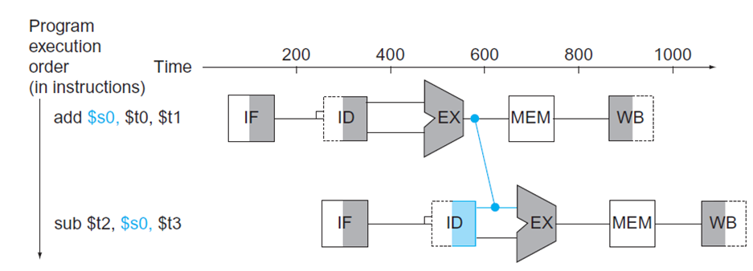
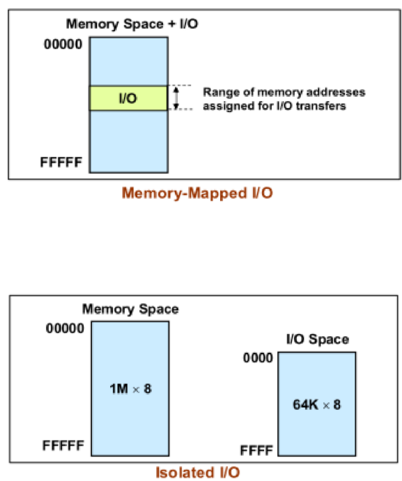

# CS2115 - Computer Organization

## 1. Macro View of a Computer

### Turing Machine

- A Turing Machine is a **mathematical model** of a computer (i.e., an abstract machine)
- **Universal Turing Machine** is a Turing Machine that can simulate any Turing Machine, can compute any computable sequence (i.e., any algorithm)

### Von Neumann Architecture

Consists of a **control unit**, **arithmetic logic unit**, **memory unit** and **input/output devices**

### Functional Units in a Computer

#### Processor

- **Control Unit**: Controls the operation of the processor
    - **Timing**: Synchronizes the activities of the computer
    - **Control circuits**: Directs the sequence of operations
    - Fetches, decodes and executes instructions stored in memory
- **Arithmetic Logic Unit (ALU)**: Performs arithmetic and logic operations
    - **Logic circuits**
    - Addition, subtraction, multiplication, division, etc.
    - AND, OR, NOT, etc.
- **Registers**: Small, fast storage locations inside the processor
    - Word-sized (e.g., 32 bits)
    - Store operands and results of operations
    - Store addresses of memory locations
    - Store control information

#### Memory Unit

- **Primary Memory (Main Memory)**: RAM
    - Semiconductor bit cells, organized into words (e.g., 32 bits)
    - Programs and their data must be in this memory to be executed
- **Secondary Memory**: Hard disk, SSD, USB flash drive, etc.
    - Non-volatile, slower than primary memory
- **Cache Memory**: Fast memory that stores frequently used data
    - Much smaller and faster than main memory
    - adjacent to the main memory, fabricated on the same chip as the processor

#### Input/Ouput Devices

- **Input**: Keyboard, mouse, microphone, etc.
- **Output**: Monitor, printer, speakers, etc.

#### Interconnection

- **Bus**: A set of wires that carry data, instructions and signals between the functional units of a computer
    - data bus, address bus, control bus
    - main memory ↔ I/O devices ↔ processor
    - **Bus width**: The number of bits that can be transmitted simultaneously

### Layered View of a Computer

- Application
- Algorithm
- Programming Language
- Instruction Set Architecture (ISA)
- Microarchitecture
- Logic Design (Circuits)
- Transistors

## 2. Number Systems

### Generalized Radix Representation

$$
N = (a_{n-1}a_{n-2}...a_1a_0.a_{-1}a_{-2}...a_{-m})_r = \sum_{i=-m}^{n-1}a_ir^i
$$

- $r$ is the radix (base)
- $a_i$ is the digit at position $i$

### Binary, Octal and Hexadecimal

- **Binary**: $r = 2, a_i \in \{0, 1\}$
- **Octal**: $r = 8, a_i \in \{0, 1, 2, 3, 4, 5, 6, 7\}$
- **Hexadecimal**: $r = 16, a_i \in \{0, 1, 2, 3, 4, 5, 6, 7, 8, 9, A, B, C, D, E, F\}$

### Converting to Decimal

Generalized Radix Representation

Example: $(1011.101)_2 = 1 \times 2^3 + 0 \times 2^2 + 1 \times 2^1 + 1 \times 2^0 + 1 \times 2^{-1} + 0 \times 2^{-2} + 1 \times 2^{-3} = 11.625$

### Converting from Decimal

Radix Divide (for integer part) and Radix Multiply (for fractional part)

Example: Convert $(11.6875)_{10}$ to binary

$$
\begin{align}
11 \div 2 &= 5 \text{ remainder } 1 \\
5 \div 2 &= 2 \text{ remainder } 1 \\
2 \div 2 &= 1 \text{ remainder } 0 \\
1 \div 2 &= 0 \text{ remainder } 1 \\
\notag \text{remainders from bottom to top} &= (1011)_2 \\
0.6875 \times 2 &= 1.375 \text{ truncate } 1 \\
0.375 \times 2 &= 0.75 \text{ truncate } 0 \\
0.75 \times 2 &= 1.5 \text{ truncate } 1 \\
0.5 \times 2 &= 1.0 \text{ truncate } 1 \\
\notag \text{truncated digits from top to bottom} &= (.1011)_2 \\
(11.6875)_{10} &= (1011.1011)_2
\end{align}
$$

the result might be infinite, e.g., $(0.1)_{10} = (0.0\overline{0011})_2$

### Converting between Binary, Octal and Hexadecimal

- **Binary to Octal**: Group bits into groups of 3
- **Binary to Hexadecimal**: Group bits into groups of 4

Example: Convert $(1101101.1011)_2$ to octal and hexadecimal

$$
\begin{align}
(1101101.1011)_2 &= (001\ 101\ 101.101\ 100)_2 \\
&= (155.54)_8 \\
&= (0110\ 1101.1011)_2 \\
&= (6\mathrm{D}.\mathrm{B})_{16}
\end{align}
$$

### Signed Numbers

#### Singed Magnitude, 1's Complement and 2's Complement

- **Positive**: Most significant bit (MSB) is 0, remaining bits = binary representation of the magnitude
- **Negative**: Most significant bit (MSB) is 1
    - **Signed Magnitude**: Remaining bits = binary representation of the magnitude
    - **1's Complement**: Remaining bits = flip all bits of abs(magnitude)
    - **2's Complement**: Remaining bits = flip all bits of abs(magnitude) then add 1

Example: Convert $(-5)_{10}$ to 4-bit signed magnitude, 1's complement and 2's complement

$$
\begin{align}
5_{10} &= (0101)_2 \\
(-5)_{10} &= (1101)_2 \text{ signed magnitude} \\
(0101)_2 &\rightarrow (1010)_2 \text{ one's complement} \\
(1010)_2 + (0001)_2 &= (1011)_2 \text{ two's complement}
\end{align}
$$

$(-5)_{10}$ in 8-bit representation:
- signed magnitude: $(1000\ 0101)_2$ (move MSB to the left)
- 1's complement: $(1111\ 1010)_2$ (fill all higher bits with 1)
- 2's complement: $(1111\ 1011)_2$ (fill all higher bits with 1)

#### Range of Signed Numbers in 2's Complement

Half of the numbers are non-negative, half are negative

Example: in 4-bit signed numbers, $-8$ to $+7$

- **0000**: $+0$
- **0001** to **0111**: $+1$ to $+7$
- **1000**: $-8$
- **1001** to **1111**: $-7$ to $-1$

#### Arithmetic Operations in 2's Complement

##### Case 1: POS + POS = POS

same as unsigned addition

##### Case 2: POS + NEG = ?

Example: $(+5) + (-3)$

$$
\begin{align}
(+5)_{10} &= (0101)_2 \\
(-3)_{10} &= (1101)_2 \\
(0101)_2 + (1101)_2 = ({\color{red}1}0010)_2=(0010)_2&=(+2)_{10}
\end{align}
$$

Example: $(+5) + (-6)$

$$
\begin{align}
(+5)_{10} &= (0101)_2 \\
(-6)_{10} &= (1010)_2 \\
(0101)_2 + (1010)_2 = (1111)_2&=(-1)_{10}
\end{align}
$$

##### Case 3: NEG + NEG = NEG

Example: $-4 + (-3)$
$$
\begin{align}
(-4)_{10} &= (1100)_2 \\
(-3)_{10} &= (1101)_2 \\
(1100)_2 + (1101)_2 = ({\color{red}1}1001)_2=(1001)_2&=(-7)_{10}
\end{align}
$$
**Overflow**: When the result of an arithmetic operation is too large to be represented in the number of bits available

e.g., $(-5) + (-3)$ in 4-bit signed numbers: $(1011)_2 + (1101)_2 = ({\color{red}1}1000)_2=(1000)_2=(-8)_{10}$

##### Case 4: POS - POS = ?

equivalent to POS + NEG

### Floating Point Numbers

#### Normalized Floating Point Representation

```
Sign|Biased Exponent|Normalized Mantissa
1 bit|8 bits|23 bits (IEEE 754 single precision/32 bits)
1|10000100|1010...0
```

- **Sign**: 0 for positive, 1 for negative
- **Biased Exponent**: $e = E + 127$, where $E$ is the true exponent ($e=0$ and $e=255$ are reserved for special cases)
    - $E = e - 127$, $E\in[-126, 127]$
    - the constant $127=2^{8-1}-1$ is the bias
- **Normalized Mantissa**: $1.m_1m_2...m_{23}$, where $m_i$ is the $i$-th bit of the mantissa
    - $m_0=1$ is always true for normalized mantissa
    - $m_1m_2...m_{23}$ is the fractional part of the mantissa
- Floating point to decimal example:
    - `1|10000100|1010...0`
    - $E = (10000100)_2 - 127 = 4$
    - $m = 1.1010...0_2 = 1.625_{10}$
    - decimal: $-1 \times 1.625 \times 2^4 = -26$
- Decimal to floating point example:
    - $-20.875_{10} = -(10100.111)_2 = -1.0100111_2 \times 2^4$
    - $e = 4 + 127 = 131 = (10000011)_2$
    - floating point representation: `1|10000011|01001110...0`
- Special case: 
    - 0 is represented as `0|00000000|00000000000000000000000`
    - $\pm \infty$ is represented as `0|11111111|00000000000000000000000`
    - NaN is represented as `0|11111111|1xxxxxxxxxxxxxxxxxxxxxx`
- For IEEE 754 single precision, abs range from $1.175494351 \times 10^{-38}$ to $3.402823466 \times 10^{38}$, precision is about 7 decimal digits

- IEEE 754 double precision/64 bits:
    - 1 bit sign, 11 bits biased exponent, 52 bits mantissa
    - $E = e - (2^{11-1}-1) = e - 1023$, $E\in[-1022, 1023]$
    - abs range from $2.2250738585072014 \times 10^{-308}$ to $1.7976931348623157 \times 10^{308}$, precision is about 16 decimal digits

### Miscellaneous

#### BCD (Binary Coded Decimal)

Each decimal digit is represented by a 4-bit binary number

| Decimal | BCD |
| --- | --- |
| 0 | `0000` |
| 1 | `0001` |
| 2 | `0010` |
| 3 | `0011` |
| 4 | `0100` |
| 5 | `0101` |
| 6 | `0110` |
| 7 | `0111` |
| 8 | `1000` |
| 9 | `1001` |
| 10 | `0001 0000` |
| 137 | `0001 0011 0111` |

#### ASCII

Important characters:

- `0` = `0x30` = 48
- `A` = `0x41` = 65
- `a` = `0x61` = 97 = `A` + 32

#### Gray Code

- Adjacent numbers differ by only 1 bit

How to create Gray Code: When the bit increase by 1 (e.g. 2-bit -> 3-bit)  
- for lower half (0~3 in 3-bit), add 0 to the front
- for upper half (4~7 in 3-bit), add 1 to the front and reverse the order

Python snippet of creating Gray Code:

```python
@functools.lru_cache(maxsize=None)
def gray_code(n):
    if n == 1:
        return ['0', '1']
    else:
        lower_half = gray_code(n - 1)
        upper_half = lower_half[::-1]
        return ['0' + x for x in lower_half] + ['1' + x for x in upper_half]
```

| Decimal | 1-bit | 2-bit | 3-bit | 4-bit |
| --- | --- | --- | --- | --- |
| 0 | `0` | `00` | `000` | `0000` |
| 1 | `1` | `01` | `001` | `0001` |
| 2 |  | `11` | `011` | `0011` |
| 3 |  | `10` | `010` | `0010` |
| 4 |  |  | `110` | `0110` |
| 5 |  |  | `111` | `0111` |
| 6 |  |  | `101` | `0101` |
| 7 |  |  | `100` | `0100` |
| 8 |  |  |  | `1100` |
| 9 |  |  |  | `1101` |
| 10 |  |  |  | `1111` |
| 11 |  |  |  | `1110` |
| 12 |  |  |  | `1010` |
| 13 |  |  |  | `1011` |
| 14 |  |  |  | `1001` |
| 15 |  |  |  | `1000` |

## 3. Circuits

### Logic Gates

#### Binary Truth Tables

| # | Operator | Sign | T/T | T/F | F/T | F/F | Logic Representation |
| --- | --- | --- | --- | --- | --- | --- | --- |
| 0 | CONT | F | 0 | 0 | 0 | 0 | $a \land \neg a$ |
| 1 | NOR | $\downarrow$ | 0 | 0 | 0 | 1 | $\neg (a \lor b)$ = $\neg a \land \neg b$ |
| 2 | NCIMPLY | $\not\leftarrow$ | 0 | 0 | 1 | 0 | $\neg a \land b$ | | |
| 3 | NOT A | $\neg a$ | 0 | 0 | 1 | 1 | $\neg a$ | | |
| 4 | NIMPLY | $\not\rightarrow$ | 0 | 1 | 0 | 0 | $a \land \neg b$ |
| 5 | NOT B | $\neg b$ | 0 | 1 | 0 | 1 | $\neg b$ |
| 6 | XOR | $\oplus$ | 0 | 1 | 1 | 0 | $a \oplus b$ = $(a \lor b) \land \neg (a \land b)$ |
| 7 | NAND | $\uparrow$ | 0 | 1 | 1 | 1 | $\neg (a \land b)$ = $\neg a \lor \neg b$ |
| 8 | AND | $\land$ | 1 | 0 | 0 | 0 | $a \land b$ |
| 9 | XNOR | $\odot$ | 1 | 0 | 0 | 1 | $\neg (a \oplus b)$ = $\neg a \oplus b$ = $a \Leftrightarrow b$ |
| 10 | IMPLY | $\rightarrow$ | 1 | 0 | 1 | 0 | $\neg a \lor b$ |
| 11 | B | $b$ | 1 | 0 | 1 | 1 | $b$ |
| 12 | CIMPLY | $\leftarrow$ | 1 | 1 | 0 | 0 | $a \lor \neg b$ |
| 13 | A | $a$ | 1 | 1 | 0 | 1 | $a$ |
| 14 | OR | $\lor$ | 1 | 1 | 1 | 0 | $a \lor b$ |
| 15 | TAUT | T | 1 | 1 | 1 | 1 | $a \lor \neg a$ |

- CONT = contradiction
- NCIMPLY = converse nonimplication
- CIMPLY = converse implication
- TAUT = tautology

There are $2^{2^N}$ possible boolean functions of $N$ variables

#### Logic Gates

Refer to the lecture slides for the symbols of logic gates

- `AND`: $f=a \cdot b$
- `OR`: $f=a + b$
- `NOT`: $f=\overline{a}$
- `NAND`: $f=\overline{a \cdot b}=\overline{a} + \overline{b}$, `NAND` = `NOT(AND)`
- `NOR`: $f=\overline{a + b}=\overline{a} \cdot \overline{b}$, `NOR` = `NOT(OR)`
- `XOR`: $f=a \oplus b=(a + b) \cdot \overline{a \cdot b}=\overline{a} \cdot b + a \cdot \overline{b}$
- `XOR` = `OR(AND(NOT(A), B), AND(A, NOT(B)))`

#### Logic Rules

- **Commutative**: $a + b = b + a$, $a \cdot b = b \cdot a$
- **Associative**: $(a + b) + c = a + (b + c)$, $(a \cdot b) \cdot c = a \cdot (b \cdot c)$
- **Distributive**: $a \cdot (b + c) = a \cdot b + a \cdot c$, $a + (b \cdot c) = (a + b) \cdot (a + c)$
- **De Morgan's Laws**: $\overline{a + b} = \overline{a} \cdot \overline{b}$, $\overline{a \cdot b} = \overline{a} + \overline{b}$
- Idempotent: $a + a = a$, $a \cdot a = a$
- Involution: $\overline{\overline{a}} = a$
- Complement: $a + \overline{a} = 1$, $a \cdot \overline{a} = 0$
- Identity: $a + 0 = a$, $a \cdot 1 = a$
- Annihilator: $a + 1 = 1$, $a \cdot 0 = 0$

#### Boolean Algebra
$$
\begin{align}
f &= \overline{x_1x_2x_3}+\overline{x_1x_2}x_3+\overline{x_1}x_2x_3+x_1x_2x_3 \\
&= \overline{x_1x_2}(\overline{x_3}+x_3)+x_2x_3(\overline{x_1}+x_1) \\
&= \overline{x_1x_2}+x_2x_3
\end{align}
$$

#### Karnaugh Map

Refer to the lecture slides

Used for concluding logic expressions from truth tables

Note:
- Use gray code (00/01/11/10) to arrange cells
- Choose rectangle areas fully covered by 1s
- Areas must have a size of $2^N$
- Areas may overlap
- Areas may wrap around the edges
- Choose least number of areas to cover all 1s
- If there are many 1s and few 0s, calculate the complement of K-map covering 0s instead

#### Don't Care Conditions

Don't care values are never used, so they can be either 0 or 1. Can be used to simplify the logic expression.

Example: in a 7-segment display using BCD, value 10 ~ 15 are not used.

Table 1: Displayed number vs. BCD

| dc \ ba | 00 | 01 | 11 | 10 |
| --- | --- | --- | --- | --- |
| 00 | 0 | 1 | 3 | 2 |
| 01 | 4 | 5 | 7 | 6 |
| 11 | | | | |
| 10 | 8 | 9 | | |

Table 2: Left lower segment vs. BCD

| dc \ ba | 00 | 01 | 11 | 10 |
| --- | --- | --- | --- | --- |
| 00 | 1 | 0 | 0 | 1 |
| 01 | 0 | 0 | 0 | 1 |
| 11 | X | X | X | X |
| 10 | 1 | 0 | X | X |

K-map can be used to solve Don't Care conditions. Choose areas to cover all 1s, no 0s, and whatever Xs.

Table 3: Left lower segment vs. BCD (simplified)

| dc \ ba | 00 | 01 | 11 | 10 |
| --- | --- | --- | --- | --- |
| 00 | 1 | 0 | 0 | 1 |
| 01 | 0 | 0 | 0 | 1 |
| 11 | 0 | 0 | 0 | 1 |
| 10 | 1 | 0 | 0 | 1 |

The logic expression is $(a=0\land c=0)\lor(a=0\land b=1)$, simplified as $\overline{a} \cdot \overline{c} + \overline{a} \cdot b$

### Combinational Logic Circuits

#### Half Adder

```
    A
+   B
-----
  C S
```

| A | B | = | Sum | Carry |
| --- | --- | --- | --- | --- |
| 0 | 0 | | 0 | 0 |
| 0 | 1 | | 1 | 0 |
| 1 | 0 | | 1 | 0 |
| 1 | 1 | | 0 | 1 |

- $S = A \oplus B$
- $C = A \cdot B$

#### 1-bit Full Adder

```
    A
+   B
+  Ci
-----
 Co S
```

| A | B | Carry in | = | Sum | Carry out |
| --- | --- | --- | --- | --- | --- |
| 0 | 0 | 0 | | 0 | 0 |
| 0 | 0 | 1 | | 1 | 0 |
| 0 | 1 | 0 | | 1 | 0 |
| 0 | 1 | 1 | | 0 | 1 |
| 1 | 0 | 0 | | 1 | 0 |
| 1 | 0 | 1 | | 0 | 1 |
| 1 | 1 | 0 | | 0 | 1 |
| 1 | 1 | 1 | | 1 | 1 |

- $S = A \oplus B \oplus C_i$
- $C_o = A \cdot B + A \cdot C_i + B \cdot C_i$

delay of 1-bit full adder: `t = 3D`
- time unit 1: `m1 = A XOR B`, `m2 = A AND B`, `m3 = A AND Ci`, `m4 = B AND Ci`
- time unit 2: `S = m1 XOR Ci`, `m5 = m2 OR m3`
- time unit 3: `C = m4 OR m5`

#### 4-bit Ripple Carry Adder (RCA)

```
    A3 A2 A1 A0
+   B3 B2 B1 B0
---------------
    C2 C1 C0
---------------
 C3 S3 S2 S1 S0
```

delay of n-bit RCA: `t = (2n + 1) * D`


#### 4-bit Carry Lookahead Adder (CLA)

Carry Lookahead: **determine whether the previous adder will generate a carry**

| $A_i$ | $B_i$ | $C_i$ | $C_{i+1}$ |
| --- | --- | --- | --- |
| 0 | 0 | 0 | 0 |
| 0 | 0 | 1 | 0 |
| 0 | 1 | 0 | 0 |
| **0** | **1** | **1** | **1** |
| 1 | 0 | 0 | 0 |
| **1** | **0** | **1** | **1** |
| **1** | **1** | **0** | **1** |
| **1** | **1** | **1** | **1** |

There are 2 possibilities to generate a carry:

- $A_i=1, B_i=1 \Rightarrow A_i \cdot B_i = 1$
- $A_i+B_i=1, C_i=1 \Rightarrow (A_i \oplus B_i) \cdot C_i = 1$

Therefore two equations can be derived:
- **Carry Generator**: $G_i = A_i \cdot B_i$
- **Carry Propagator**: $P_i = A_i \oplus B_i$
- The final carry is $C_{i+1} = G_i + P_i\cdot C_i = A_i \cdot B_i + (A_i \oplus B_i) \cdot C_i$

Since $G_i$ and $P_i$ can be calculated without knowing $C_i$, all bits can be calculated in parallel.

- $C_1 = G_0 + P_0C_0$
- $C_2 = G_1 + P_1C_1 = G_1 + P_1G_0 + P_1P_0C_0$
- $C_3 = G_2 + P_2C_2 = G_2 + P_2G_1 + P_2P_1G_0 + P_2P_1P_0C_0$
- $C_4 = G_3 + P_3C_3 = G_3 + P_3G_2 + P_3P_2G_1 + P_3P_2P_1G_0 + P_3P_2P_1P_0C_0$
- $C_i = G_{i-1} + P_{i-1}C_{i-1} = G_{i-1} + P_{i-1}G_{i-2} + P_{i-1}P_{i-2}G_{i-3} + ... + P_{i-1}P_{i-2}...P_0C_0$

For 4-bit CLA, the delay is `t = 2D`.


#### 16-bit CLA

View 4-bit CLA as a black box.

- Input: $C_0, A_{3,2,1,0}, B_{3,2,1,0}$
- Output: $C_4, S_{3,2,1,0}, G^{I}, P^{I}$

Where $G^{I}=G_3+P_3G_2+P_3P_2G_1+P_3P_2P_1G_0$ and $P^{I}=P_3P_2P_1P_0$

Use four 4-bit CLAs to construct a 16-bit CLA.

- $C_4 = G^{I} + P^{I}C_0$
- $C_8 = G^{II} + P^{II}C_4 = G^{II} + P^{II}G^{I} + P^{II}P^{I}C_0$
- $C_{12} = G^{III} + P^{III}C_8 = G^{III} + P^{III}G^{II} + P^{III}P^{II}G^{I} + P^{III}P^{II}P^{I}C_0$
- $C_{16} = G^{IV} + P^{IV}C_{12} = G^{IV} + P^{IV}G^{III} + P^{IV}P^{III}G^{II} + P^{IV}P^{III}P^{II}G^{I} + P^{IV}P^{III}P^{II}P^{I}C_0$


#### Multiplexer (MUX)

Use of a MUX: select one of the inputs to be the output

MUX can be 2:1, 4:1, 8:1, etc. $2^n:1$ MUX needs $n$ select lines.

Structure of a 2:1 MUX:

- Inputs: $I_0, I_1$
- Select Line: $S$
- Output: $Y=I_{S}$

| $S$ | Y |
| --- | --- |
| 0 | $I_0$ |
| 1 | $I_1$ |

$Y=\overline{S} \cdot I_0 + S \cdot I_1$

Structure of a 4:1 MUX:

- Inputs: $I_0, I_1, I_2, I_3$
- Select Lines: $S_1, S_0$
- Output: $Y=I_{S_1S_0}$

| $S_1$ | $S_0$ | Y |
| --- | --- | --- |
| 0 | 0 | $I_0$ |
| 0 | 1 | $I_1$ |
| 1 | 0 | $I_2$ |
| 1 | 1 | $I_3$ |

$Y=\overline{S_1S_0}I_0 + \overline{S_1}S_0I_1 + S_1\overline{S_0}I_2 + S_1S_0I_3$

### Sequential Logic Circuits

Sequential logic circuits: **Output based on current input and previous input**

Sequential logic circuits have **memory**.

#### Set-Reset Latch (SR Latch)

The simplest **bistable** (stable in two states) sequential logic circuit.

**Active High SR Latch**: (S=1, R=0) set, (S=0, R=1) reset

- Design: S is set button, R is reset button
- When S is pressed, Q is set to 1, and remains 1 even if S is released
- When R is pressed, Q is reset to 0, and remains 0 even if R is released
- $Q=R \text{ NOR } \overline{Q}$
- $\overline{Q}=S \text{ NOR } Q$


Initial state: $R=0, S=0, Q=1, \overline{Q}=0$

1. Reset: $R=1$
    - $Q=R \text{ NOR } \overline{Q}=1 \text{ NOR } 1=0$
    - $\overline{Q}=S \text{ NOR } Q=0 \text{ NOR } 0=1$
    - Note: $Q$ and $\overline{Q}$ use current value, not the previous state
2. Release R: $R=0$
    - $Q=R \text{ NOR } \overline{Q}=0 \text{ NOR } 1=0$
    - $\overline{Q}=S \text{ NOR } Q=0 \text{ NOR } 0=1$
3. Set: $S=1$
    - $Q=R \text{ NOR } \overline{Q}=0 \text{ NOR } 0=1$
    - $\overline{Q}=S \text{ NOR } Q=1 \text{ NOR } 1=0$
4. Release S: $S=0$
    - $Q=R \text{ NOR } \overline{Q}=0 \text{ NOR } 0=1$
    - $\overline{Q}=S \text{ NOR } Q=0 \text{ NOR } 1=0$

Truth table:

| S | R | Q | $\overline{Q}$ | State |
| --- | --- | --- | --- | --- |
| 0 | 0 | 1 | 0 | Hold |
| 0 | 0 | 0 | 1 | Hold |
| 0 | 1 | 0 | 1 | Reset |
| 1 | 0 | 1 | 0 | Set |
| 1 | 1 | X | X | Invalid |

| Step | S | R | Q | $\overline{Q}$ |
| --- | --- | --- | --- | --- |
| Initial | 0 | 0 | 1 | 0 |
| Reset | 0 | 1 | 0 | 1 |
| Release R | 0 | 0 | 0 | 1 |
| Set | 1 | 0 | 1 | 0 |
| Release S | 0 | 0 | 1 | 0 |

**Active Low SR Latch**: (S=0, R=1) set, (S=1, R=0) reset

- $Q=R \text{ NAND } \overline{Q}$
- $\overline{Q}=S \text{ NAND } Q$

| S | R | Q | $\overline{Q}$ | State |
| --- | --- | --- | --- | --- |
| 0 | 0 | X | X | Invalid |
| 0 | 1 | 1 | 0 | Set |
| 1 | 0 | 0 | 1 | Reset |
| 1 | 1 | 0 | 1 | Hold |
| 1 | 1 | 1 | 0 | Hold |

#### Gated SR Latch

**Can only change while enable is 1**

- Inputs: $S, R, E$
- Outputs: $Q, \overline{Q}$


Left: AND-AND-Active High SR Latch

Right: NAND-NAND-Active Low SR Latch

**Gated SR Latch is Active High**

AND-AND-Active High SR Latch:

- Design: only make it R and S able to change when E is 1
- $r_1 = R \cdot E$
- $s_1 = S \cdot E$
- $Q = r_1 \text{ NOR } \overline{Q}$
- $\overline{Q} = s_1 \text{ NOR } Q$

NAND-NAND-Active Low SR Latch:

- $t_1 = S \text{ NAND } E$
- $t_2 = R \text{ NAND } E$
- $Q = t_1 \text{ NAND } \overline{Q}$
- $\overline{Q} = t_2 \text{ NAND } Q$

#### Gated D Latch

**1-bit memory cell**

- Goal: store a bit, and make it changeable only when enable is 1
- Design: View $D$ as $S$, $\overline{D}$ as $R$, and modify based on Gated SR Latch
- $t_1 = D \text{ NAND } E$
- $t_2 = \overline{D} \text{ NAND } E$
- $Q = t_1 \text{ NAND } \overline{Q}$
- $\overline{Q} = t_2 \text{ NAND } Q$

Simplification:
- $t_1 = D \text{ NAND } E$
- $t_2 = t_1 \text{ NAND } E$
- $Q = t_1 \text{ NAND } \overline{Q}$
- $\overline{Q} = t_2 \text{ NAND } Q$


#### Edge Detector

Edge Detector: detect the rising/falling of a clock signal in short time

Rising Edge Detector:

- $Q = C \cdot \overline{C}$
- Why? **NOT gate adds a delay of 1 time unit**

| $C$ | $Q$ Left Input | $Q$ Right Input | $Q$ | Remarks |
| --- | --- | --- | --- | --- |
| 0 | 0 | 1 | 0 | Initial |
| 1 | 1 | 1 | 1 | Input 0->1: Before NOT invert output: Instant Rise |
| 1 | 1 | 0 | 0 | After NOT invert output: Instant Fall |
| 0 | 0 | 0 | 0 | Input 1->0: Before NOT invert output: nothing happens |
| 0 | 0 | 1 | 0 | After NOT invert output: nothing happens |

Falling Edge Detector: two implementations
- $t = \overline{C}, Q=t \cdot \overline{t}$
- $Q=C \text{ NOR } \overline{C}$

The first implementation is trivial. Take the second as an example:

| $C$ | $Q$ Left Input | $Q$ Right Input | $Q$ | Remarks |
| --- | --- | --- | --- | --- |
| 0 | 0 | 1 | 0 | Initial |
| 1 | 1 | 1 | 0 | Input 0->1: Before NOT invert output: nothing happens |
| 1 | 1 | 0 | 1 | After NOT invert output: nothing happens |
| 0 | 0 | 0 | 1 | Input 1->0: Before NOT invert output: Instant Rise |
| 0 | 0 | 1 | 0 | After NOT invert output: Instant Fall |

#### Clocked D Latch

Replace input E in Gated D Latch with a Rising Edge Detector (with clock signal C).

- $Q$ can only be modified when $C$ **changes from 0 to 1**
- $Q$ will be changed to the value of $D$ at these times
- $Q$ will remain unchanged at other times
- Also adding PRE (preset) and CLR (clear) inputs
- $e = C_i \cdot \overline{C_{i-1}}$
- $t_1 = D \text{ NAND } e$
- $t_2 = \overline{D} \text{ NAND } e$
- $Q = \text{ NAND } (t_1, \overline{Q}, PRE)$
- $\overline{Q} = \text{ NAND } (t_2, Q, CLR)$

- NAND gate: when all inputs are 1, output is 0. Otherwise output is 1.
- When PRE=1, Q is always 1
- When CLR=1, Q is always 0


#### D Flip-Flop


Connecting a Gated D Latch to a Gated SR Latch. This is called a Master-Slave D Flip-Flop.

- Input: $D$, $CLK$
- Output of GDL: $q, \overline{q}$
- Input of GSR: $S=q, R=\overline{q}, E=\overline{CLK}$
- Output: $Q, \overline{Q}$


- Master is enabled when CLK=1, Slave is enabled when CLK=0
- When master enabled, DFF accepts input; when slave enabled, DFF outputs the value of the master
- DFF is a 1-bit memory device, several DFFs can be combined to build a register or a bank of memory
- DFF is safe because it allows sufficient time for propagation delays and therefore leaves time for the inputs to flunctuate before affecting the output
- DFF involves a lot of components, making it relatively slow and power-hungry

## 4. Instruction Set Architecture (ISA)

- Interface between hardware and software
- Translates instructions into hardware operations
- Popular ISAs: x86, ARM, MIPS, RISC-V

- **RIsc**: Reduced Instruction Set Computer
    - One-word instruction
    - store operands in registers
    - Example: MIPS, RISC-V, ARM
- **CIsc**: Complex Instruction Set Computer
    - Multi-word instruction
    - store operands in memory
    - Example: x86

### Layers of a Computer System

- Software
    - Application
    - Operating System, Middleware
    - Compiler, Assembler
- Hardware
    - ISA: Processor, Memory, I/O, Data Path, Control
    - Digital Logic
    - Circuit Design
    - Device Physics (transistors, etc.)

### Program Execution


1. Processor loads instruction from memory
2. Processor decodes instruction and calls control unit
3. Control unit determines operation, fetches data from registers / memory
4. Operation and data are sent to ALU
5. Result is sent back to processor, and may be stored in registers / memory
6. Control unit determines next instruction
7. Repeat

### MIPS

- MIcroprocessor without Interlocked Pipeline Stages
- RIsc (Reduced Instruction Set Computer)
- A pioneer of RISC architecture

#### MIPS Registers

- 1 MIPS register = 32 bits = 1 word = 32 DFFs
- **register = a multi-bit DFF**
- **register file = a set of registers**
- Design of MIPS: Load/Store Register File machine
    - Instructions can only compute using register data
    - Register is small and fast, memory is large and slow
    - To execute an instruction, data must be **loaded** from memory into registers
    - To output data, data must be **stored** from registers into memory

#### Memory

- Memory is a large 1D array of bytes
- **each location = 1 byte = 8 bits**
- A memory address is the index of a byte in memory
- For 32-bit computer, there are at most $2^{32}$ memory locations ($2^{32}$ bytes = 4GB)
- For 64-bit computer, there are at most $2^{64}$ memory locations, but usually limited to 48 bits ($2^{48}$ bytes = 256TB)

#### Memory as Word Array

- MIPS handles memory as a 1D array of **words**
- Because **1 word = size of 1 register** = 32 bits = 4 bytes
- Address of a word is the index of the first byte of the word
- MIPS use **Aligned adddresses** (address of a word is a multiple of 4, e.g. 0x0000, 0x0004, 0x0008, etc.)

#### Big Endian vs. Little Endian

Two different ways to store multi-byte data in memory

Assume we want to store `0x01234567` at address `0x1000`.

| Addressing | `0x1000` | `0x1001` | `0x1002` | `0x1003` | Remarks |
| --- | --- | --- | --- | --- | --- |
| Big Endian (BE) | `01` | `23` | `45` | `67` | Most significant byte first |
| Little Endian (LE) | `67` | `45` | `23` | `01` | Most significant byte last |

MIPS prefers **Big Endian**, but can support both.

UTF-8 is always Big Endian.

UTF-16 can be BE or LE.

#### MIPS Instructions

MIPS instructions are 32 bits = 1 word

| Type | 31-26 | 25-21 | 20-16 | 15-11 | 10-6 | 5-0 |
| --- | --- | --- | --- | --- | --- | --- |
| I-Type (Immediate) | opcode | rs | rt | immediate | immediate | immediate |
| J-Type (Jump) | opcode | target | target | target | target | target |
| R-Type (Register) | opcode | rs | rt | rd | shamt | funct |

- **opcode**: operation code, represents the operation to be performed
    - 6 bits
    - In R-Type, `op`, `shamt`, `funct` (total 6+5+6=17 bits) are used to determine the operation
- **operands**: data to be operated on
    - I-Type: `rs`, `rt`, `immediate`
    - J-Type: `target`
    - R-Type: `rs`, `rt`, `rd`
    - they are stored in registers
- R-type and I-type have 3 operands
    - `rs` = source register 1
    - `rt` = source register 2
    - `rd` = destination register
    - `immediate` = immediate value
    - Format in assembly language: `op_name dest, src1, src2`
    - Example: `a = b + c` is `add $s0, $s1, $s2`
    - Example: `a = b + c + d` is `add $t0, $s1, $s2`, `add $s0, $t0, $s3` (s = save, t = temporary)
    - Example: `a = b + 10` is `add $s0, $s1, #10` - `#` means immediate value

| Register # | Register Name | Usage |
| --- | --- | --- |
| `$0` | `$zero` | constant 0 |
| `$2-$3` | `$v0-$v1` | return values |
| `$4-$7` | `$a0-$a3` | arguments |
| `$8-$15` | `$t0-$t7` | temporaries |
| `$16-$23` | `$s0-$s7` | saved |
| `$24-$25` | `$t8-$t9` | temporaries |
| `$28` | `$gp` | address: global pointer |
| `$29` | `$sp` | address: stack pointer |
| `$30` | `$fp` | address: frame pointer |
| `$31` | `$ra` | address: return address |

Note: `$1` is reserved for assembler, `$26-$27` are reserved for OS.

### MIPS Assembly Language

#### Directives

Directives are commands to the assembler, i.e. what actions to take when assembling the code.

| Directive | Usage | Remarks |
| --- | --- | --- |
| `.data` | `.data` | Start of data section |
| `.text` | `.text` | Start of operation section |
| `.byte` | `var: .byte 0x12` | Store a byte or char (1 byte) |
| `.word` | `var: .word 0x12345678` | Store a word (4 bytes) |
| `.float` | `var: .float 3.14159` | Store a float (4 bytes) |
| `.double` | `var: .double 3.141592653589793` | Store a double (8 bytes) |
| `.asciiz` | `var: .asciiz "Hello World"` | Store a string (null-terminated) |
| `.global` | `.global main` | Declare the label as global |
| `.space` | `var: .space 4` | Allocate 4 bytes of space |

#### Assembly Data Operations

##### Addition and Subtraction

Example: `a = b + c + d - e;`

1. Store in registers: `b->$s1`, `c->$s2`, `d->$s3`, `e->$s4`
2. `add $t0, $s1, $s2` (t0 = b + c)
3. `add $t0, $t0, $s3` (t0 += d)
4. `sub $s0, $t0, $s4` (a = t0 - e)

Example: add constant (immediate value) to register

`a = b + 10;`

1. Store in registers: `b->$s1`
2. `addi $s0, $s1, #10` (a = b + 10)

**`addi` is I-Type, `add` is R-Type**

Example: assign value to another variable

**Hard-wided `$zero` is used to store constant 0**

`f = g;`

Equivalent to `f = g + 0;`

1. Store in registers: `g->$s1`
2. `add $s0, $s1, $zero` (f = g + 0) -> `$zero` is not immediate so use `add`

##### Multiplication and Division

`mult` and `div` use 2 new registers: `$hi` and `$lo`

They are not implemented in MIPS hardware

- `mult $s0, $s1`: higher 32 bits of result stored in `$hi`, lower 32 bits of result stored in `$lo`
- `div $s0, $s1`: quotient stored in `$lo`, remainder stored in `$hi`
- `mfhi $s0`: move `$hi` to `$s0`
- `mflo $s0`: move `$lo` to `$s0`

Example: `a = b * c + d / e;` (assume no overflow, i.e. just use lower 32 bits of multiplication result)

1. Store in registers: `b->$s1`, `c->$s2`, `d->$s3`, `e->$s4`
2. `mult $s1, $s2` (b * c)
3. `mflo $t0` (t0 = lower 32 bits of result)
4. `div $s3, $s4` (d / e)
5. `mflo $t1` (t1 = quotient)
6. `add $s0, $t0, $t1` (a = t0 + t1)

##### Bitwise Operations

| Operation | Example | Remarks |
| --- | --- | --- |
| AND | `and $s0, $s1, $s2` | `s0 = s1 & s2` |
| AND immediate | `andi $s0, $s1, #10` | `s0 = s1 & 10` |
| OR | `or $s0, $s1, $s2` | `s0 = s1 \| s2` |
| OR immediate | `ori $s0, $s1, #10` | `s0 = s1 \| 10` |
| NOR | `nor $s0, $s1, $s2` | `s0 = ~(s1 \| s2)` |
| logical shift left | `sll $s0, $s1, #10` | `s0 = s1 << 10` |
| logical shift right | `srl $s0, $s1, #10` | `s0 = s1 >> 10` |
| arithmetic shift right | `sra $s0, $s1, #10` | `s0 = s1 >>> 10` |

- Logical shift left: fill lower bits with 0
- Logical shift right: fill higher bits with 0
- Arithmetic shift right: fill higher bits with sign bit

#### Data Operations Routine

1. **Program Counter (PC)**: register that stores the address of the next instruction
2. Next instruction is fetched from memory at address `PC`
3. **Control Logic** decode the instruction and determine the operation, inform **ALU** and **Register File**
4. Register File sends data to **ALU, ALU performs operation, and sends result back to register file
5. Control Logic updates PC to point to the next instruction

Instruction address is a multiple of 4 (because 1 instruction = 1 word = 4 bytes)

#### Data Transfer Operations

| Operation | Example | Remarks |
| --- | --- | --- |
| Load word | `lw $s0, 100($s1)` | `s0 = memory[s1 + 100]` (4 bytes) |
| Store word | `sw $s0, 100($s1)` | `memory[s1 + 100] = s0` (4 bytes) |
| Load Immediate | `li $s0, 100` | `s0 = 100` (1 register) |
| Load Address | `la $s0, var` | `s0 = &var` (1 register) |

Load = From memory to register

Store = From register to memory

Register-Memory Data Transfer:

1. **ALU** computes the address of the memory location to be stored
2. Address goes to **Memory Address Register (MAR)** and data goes to **Memory Data Register (MDR)**
3. **Control Logic** sends **Memory Read/Write** signal to **Memory**
4. Memory reads from / writes to the address in MAR

##### Load Word Example

Memory

```
0x1000  addi $s5, $zero, 12 # $s5 = 12
0x1004  lw $s6, 4096($s5) # $s6 = memory[s5 + 4096]
0x1008
0x100C  123456789
```

Register File is empty

1. `PC = 0x1000`
2. CL gets the instruction at `0x1000`: `addi $s5, $zero, 12`, inform RF and ALU
3. RF send `$zero` to ALU, ALU adds 12 to `$zero`, result is 12
4. result send to RF, RF stores 12 in `$s5`
5. CL updates PC to `0x1004`
6. CL gets the instruction at `0x1004`: `lw $s6, 4096($s5)`, inform RF and ALU
7. RF send `$s5` to ALU, ALU adds 4096 to `$s5`, result is 4108 (0x100C)
8. result send to **MAR** (0x100C) -> **Address from ALU**
9. Memory writes the value at address `0x100C` to **MDR** (123456789) -> **Data from Memory**
10. MAR and MDR is sent to RF, RF stores the value in `$s6`

Result Register File:

```
$s5 = 12
$s6 = 123456789
```

##### Store Word Example

Continue the previous example

Memory

```
0x1010  add $s7, $s6, $s5 # $s7 = $s6 + $s5
0x1014  sw $s7, 4096($s5) # memory[s5 + 4096] = $s7
```

1. `PC = 0x1010` -> `$s7 = 123456789 + 12 = 123456801`
2. CL updates PC to `0x1014`
3. CL gets the instruction at `0x1014`: `sw $s7, 4096($s5)`, inform RF and ALU
4. RF send `$s5` to ALU, ALU adds 4096 to `$s5`, result is 4108 (0x100C)
5. result send to **MAR** (0x100C) -> **Address from ALU**
6. RF send `$s7` to **MDR** (123456801) -> **Data from Register**
7. CL sends Memory Write signal to Memory
8. Memory overwrites the value at address `0x100C` with 123456801

Result Register File:

```
$s5 = 12
$s6 = 123456789
$s7 = 123456801
```

Result Memory:

```
0x100C  123456801
```

#### Control Flow Operations

Translate the following C code to MIPS assembly language:

```c
if (a == b) {
    c = d + e;
} else {
    c = d - e;
}
```

pseudo assembly language

```asm
if $s0 == $s1 goto L1 # if condition met, skip next instruction
# if condition not met, will continue here
$s2 = $s3 - $s4
goto L2
L1: $s2 = $s3 + $s4
L2: # do nothing
```

| Operation | Example | Remarks |
| --- | --- | --- |
| Branch if equal | `beq $s0, $s1, L1` | if \$s0 == \$s1, goto L1 |
| Branch if equal | `beq $s0, $s1, #100` | see below |
| Branch if not equal | `bne $s0, $s1, L1` | if \$s0 != \$s1, goto L1 |
| Branch if != 0 | `bnez $s0, L1` | if \$s0 != 0, goto L1 |
| Branch if > 0 | `bgtz $s0, L1` | if \$s0 > 0, goto L1 |
| Branch if <= 0 | `blez $s0, L1` | if \$s0 <= 0, goto L1 |
| Set on less than | `slt $t0, $s1, $s2` | if $s1 < \$s2, \$t0 = 1, else \$t0 = 0 |
| Set on less than immediate | `slti $t0, $s1, #100` | if \$s1 < 100, \$t0 = 1, else \$t0 = 0 |
| goto | `j L1` | goto L1 |

`beq $s0, $s1, #100` means:

if \$s0 == \$s1, goto PC + 4 + 400

- `PC + 4` is because PC points to the next instruction while `beq` is executed
- `400` because offset is in words, 100 words = 400 bytes

Why `PC + 4`?

Example:

Suppose memory contains the following instructions:

```
0x1000          beq, $s0, $s1, #0 # if s0 == s1, goto PC + 4 + 0
0x1004  (PC)    # else, do something
0x1008  (PC+4)  # beq jumps here
```

`PC`, next instruction of `beq`, must deal with else case. If jump to `PC`, then whether the condition is met or not, `PC` will be executed, thus the `if` does not work.

Therefore, the sequence of `if` instruction must be at or after next instruction of `PC`.

i.e. When offset = 0, `beq` jumps to `PC + 4`.

Complex Control Flow Example:

```c
if (a < b) {
    c = d + e;
} else if (a == b) {
    c = d - e;
} else {
    c = d * e;
}
```

pseudo assembly language

```asm
$t0 = ($s0 < $s1) # $t0 = 1 if $s0 < $s1, else $t0 = 0
if $t0 == 1 goto L1
if $s0 == $s1 goto L2
# if condition not met, will continue here
$s2 = $s3 * $s4
goto L3
L1: $s2 = $s3 + $s4; goto L3
L2: $s2 = $s3 - $s4
L3: # do nothing
```

assembly language

```asm
slt $t0, $s0, $s1 # $t0 = 1 if $s0 < $s1, else $t0 = 0
bne $t0, $zero, L1 # $t0 can only be 0 or 1, if $t0 != 0, $t0 = 1 -> $s0 < $s1
beq $s0, $s1, L2 # if $s0 == $s1
mult $s3, $s4
mflo $s2
j L3
L1:
    add $s2, $s3, $s4
    j L3
L2:
    sub $s2, $s3, $s4
L3:
    # do nothing
```

##### Loop

```c
for (i = 0; i < 10; i++) {
    a += i;
}
```

First, translate to while loop:

```c
i = 0;
while (i < 10) {
    a += i;
    i++;
}
```

pseudo assembly language

```asm
$t0 = 0 # i = 0
$s0 = 0 # a = 0
while:
    if $t0 >= 10 goto end
    $s0 = $s0 + $t0
    $t0 = $t0 + 1
    goto while
end:
    # do nothing
```

assembly language

```asm
li $t0, 0
li $s0, 0
while:
    bge $t0, 10, end
    add $s0, $s0, $t0
    addi $t0, $t0, 1
    j while
end:
    # do nothing
```

Compiler will optimize `bge $t0, 10, end` to `beq $t0, 11, end`. (Further optimization differs between compilers)

#### Procedure Call Operations

Function call: jump to a function, execute the function, and return to the caller

In detail:

1. `main()` provides parameters
2. Transfer control to `foo()`
3. Allocate memory for `foo()`
4. `foo()` executes
5. return value is put in register
6. return to the calling point in `main()`

**Jump-and-Link** (jal) is used to call a function

Usage: `jal fooAddr`

1. store return address in `$ra` (return address register), `$ra = PC + 4` (PC = next instruction address)
2. puts parameter in `$a0-$a3` (argument registers)
3. jump to `fooAddr`
4. `foo` executes
5. `jr $ra` (jump to return address -> jump to where `jal` is called)
6. return values are stored in `$v0-$v1` (return value registers)

Why `PC + 4`?

```
0x1010          jal fooAddr # jump to fooAddr, return address = PC + 4
0x1014  (PC)    # 
0x1018  (PC+4)  # jal jumps here -> handle return value
```

Example:

```c
int max (int a, int b) {
    if (a > b) {
        return a;
    } else {
        return b;
    }
}
int main () {
    // ...
    // a = 1, b = 2
    int c = max(a, b);
}
```

Pseudo assembly language

```asm
main:
    $a0 = 1
    $a1 = 2
    jal max
    $t1 = $v0
    # do something with $t1
    goto end # skip the body of max()
max:
    $t0 = $a0 - $a1
    bgez $t0, L1 # if a - b >= 0, goto L1
    $v0 = $a1 # else, a < b, return b
    jr $ra
L1:
    $v0 = $a0 # a >= b, return a
    jr $ra
end:
    # do nothing
```

assembly language

```asm
main:
    li $a0, 1
    li $a1, 2
    jal max
    move $t1, $v0
    # do something with $t1
    j end
max:
    sub $t0, $a0, $a1
    bgez $t0, L1
    move $v0, $a1
    jr $ra
L1:
    move $v0, $a0
    jr $ra
end:
    # do nothing
```

#### MIPS Psuedo Instructions

Psuedo instructions are not real MIPS instructions, but are translated to one or more real MIPS instructions by the assembler.

| Psuedo Instruction | Real Instruction | Remarks |
| --- | --- | --- |
| `move $t0, $s0` | `addu $t0, $zero, $s0` | Move data from `$s0` to `$t0` |
| `li $s0, 10` | `ori $s0, $zero, 10` | Load immediate value 10 to `$s0` |
| `lw $s0, var` | `lui $at, 0x1000` <br> `lw $s0, 12($at)` | Load a word from memory to `$s0` |
| `la $s0, var` | `lui $at, 0x1000` <br> `ori $s0, $at, 16` | Load address of `var` to `$s0` |
| `blt $t0, $t1, L1` | `slt $at, $t0, $t1` <br> `bne $at, $zero, L1` | Branch if less than |
| `ble $t0, $t1, L1` | `slt $at, $t1, $t0` <br> `beq $at, $zero, L1` | Branch if less than or equal to |
| `bgt $t0, $t1, L1` | `slt $at, $t1, $t0` <br> `bne $at, $zero, L1` | Branch if greater than |
| `bge $t0, $t1, L1` | `slt $at, $t0, $t1` <br> `beq $at, $zero, L1` | Branch if greater than or equal to |

12 and 16 is offset of real address from the beginning of the data segment

#### System Calls

Syscall is a special function call to the operating system

Usage:

1. set `$v0` to the syscall number
2. set arguments
3. execute `syscall`

| Syscall Number | Operation | Remarks |
| --- | --- | --- |
| 1 | print integer | output `$a0` |
| 3 | print double | output `$f12` |
| 4 | print string | output string starting at address `$a0` |
| 5 | read integer | input to `$v0` |
| 7 | read double | input to `$f0` |
| 8 | read string | input string starting at address `$a0`, at most `$a1` characters |
| 10 | exit | exit program |

Example:

```c
int main () {
    char[] hello = "Hello World";
    print(hello);
    return 0;
}
```

assembly language

```asm
.data
    hello: .asciiz "Hello World"
.text
    li $v0, 4 # print string
    la $a0, hello
    syscall

    li $v0, 10 # exit
    syscall
```

Example:

```c
int main () {
    int a, b;
    a = read();
    b = read();
    print(a + b);
    return 0;
}
```

assembly language

```asm
.text
    li $v0, 5 # read integer
    syscall
    move $s0, $v0 # a = $v0

    li $v0, 5 # read integer
    syscall
    move $s1, $v0 # b = $v0

    add $s0, $s0, $s1 # $s0 = a + b

    li $v0, 1 # print integer
    move $a0, $s0
    syscall

    li $v0, 10 # exit
    syscall
```

## 5. CPU


- Black lines: data path
- Blue lines: control path
- **ALU**: Arithmetic Logic Unit
- MUX: Multiplexer
- PC: Program Counter
- **Signed Bit Extender**: extend the sign bit to the left. In MIPS, extend to 32 bits (fill all leading bits with sign bit)

### State Elements

- State elements are used to store data
- PC, registers, memory
- **Edge-triggered**: data is stored at the rising edge of the clock, and remains unchanged until the next rising edge

#### Register File

- A collection of registers. 32 registers in a MIPS register file. Multiple register files in a processor.
- Register = a multi-bit DFF (32 bits in MIPS)
- Register file = a MUX that selects the corresponding register
- Input:
    - `Read Register 1` and `Read Register 2`: select the registers to read
    - `Write Register`: select the register to write
    - `Write Data`: data to be written
    - `RegWrite`: if 1, write data to the register
- Output:
    - `Read Data 1` and `Read Data 2`: data read from the registers

#### Decoder

- $n$ input, $2^n$ output
- translate the binary value to the corresponding # of output
- e.g. `0111` -> `output 7`, `1000` -> `output 8`
- Implementation: AND gates

### Executing Instructions

#### PC


When PC is **triggered by the clock**:

- Add 4 to current PC, and store the result in PC
- Send the new address to **Instruction Memory**

#### Instruction Memory

Different bits of the instruction are sent to different components

R-Type:

| Bit | Content | Send to | Remarks |
| --- | --- | --- | --- |
| `31-26` | `opcode` | Control Logic | Determine the operation |
| `25-21` | `rs` | Register File | Read Register 1 |
| `20-16` | `rt` | Register File | Read Register 2 |
| `15-11` | `rd` | Register File | Write Register (via MUX) |
| `10-6` | `shamt` | ALU | Shift amount |
| `5-0` | `funct` | ALU | Determine the operation |

I-Type:

| Bit | Content | Send to | Remarks |
| --- | --- | --- | --- |
| `31-26` | `opcode` | Control Logic | Determine the operation |
| `25-21` | `rs` | Register File | Read Register 1 |
| `20-16` | `rt` | Register File | Write Register (via MUX) |
| `15-0` | `immediate` | Sign Extend → ALU | Immediate value |

J-Type:

| Bit | Content | Send to | Remarks |
| --- | --- | --- | --- |
| `31-26` | `opcode` | Control Logic | Determine the operation |
| `25-0` | `target` | Sign Extend → ALU | Target address |

#### Control Logic

Input:

- Instruction bit 31-26 (`opcode`)

Output: 8 flags

- `RegDst`: send to a MUX before RF
    - MUX Input: `rt` (bit 20-16) and `rd` (bit 15-11)
    - If `RegDst = 1`, `rt` → Read Register 2, `rd` → Write Register (R-type)
    - If `RegDst = 0`, `rt` → Write Register (I-type)
    - If `PCSrc / MemWrite = 1`, `RegDst = X` (don't care), `rt` → Read Register 2, Write Register not used
- `Branch` / `PCSrc`: send to a MUX before PC
    - MUX Input: `PC + 4` and `PC + 4 + (offset << 2)`
    - If `PCSrc = 1`, `PC + 4 + (offset << 2)` → PC (branch)
    - If `PCSrc = 0`, `PC + 4` → PC (next instruction)
    - Overrides `RegDst` and `MemtoReg`
- `MemRead`: send to data memory
    - If `MemRead = 1`, `Memory[Address]` → Read Data
- `MemWrite`: send to data memory
    - If `MemWrite = 1`, Write Data → `Memory[Address]`
    - Overrides `RegDst` and `MemtoReg`
- `MemtoReg`: send to a MUX after data memory, before RF
    - MUX Input: `ALUOut` and Read Data (`Memory[Address]`)
    - If `MemtoReg = 1`, Read Data → RF Write Data
    - If `MemtoReg = 0`, `ALUOut` → RF Write Data
    - If `PCSrc / MemWrite = 1`, `MemtoReg = X` (don't care), does not write to RF
- `RegWrite`: send to RF
    - If `RegWrite = 1`, `ALUOut` or Read Data → RF Write Register
- `ALUSrc`: send to a MUX before ALU
    - MUX Input: `Read Data 2` and `immediate` (sign-extended)
    - If `ALUSrc = 1`, `immediate` → ALU Operand 2
    - If `ALUSrc = 0`, `Read Data 2` → ALU Operand 2
- `ALUOp`: 2 bits
    - `ALUOp` and `funct` (bits 5-0) is sent to ALU control
    - ALU control outputs 4 bits `ALUControl`, which is sent to ALU

Input/Output table:

| Output | `add` | `addi` | `lw` | `sw` | `beq` |
| --- | --- | --- | --- | --- | --- |
| `RegDst` | 1 | 0 | 0 | X | X |
| `PCSrc` | 0 | 0 | 0 | 0 | 1 |
| `MemRead` | 0 | 0 | 1 | 0 | 0 |
| `MemWrite` | 0 | 0 | 0 | 1 | 0 |
| `MemtoReg` | 0 | 0 | 1 | X | X |
| `RegWrite` | 1 | 1 | 1 | 0 | 0 |
| `ALUSrc` | 0 | 1 | 1 | 1 | 0 |

##### Example 1: `add`

Instruction: `add $t3, $t1, $t2`

Control Logic:

1. `RegDst = 1`: `rt` → Read Register 2, `rd` → Write Register
2. `PCSrc = 0`
3. `MemRead = 0`
4. `MemWrite = 0`
5. `MemtoReg = 0` & `RegWrite = 1`: ALUOut → Write Data
6. `ALUSrc = 0`: Read Data 2 → ALU Operand 2

Execution:

1. `rs` (bits 25-21, `$t1`) → Read Register 1 = `rs`
2. `RF[$t1]` → Read Data 1
3. `rt` (bits 20-16, `$t2`), `RegDst = 1` → MUX → Read Register 2 = `rt`
4. `RF[$t2]` → Read Data 2
5. `rd` (bits 15-11, `$t3`), `RegDst = 1` → MUX → Write Register = `rd`
6. `funct` (bits 5-0), `ALUOp` → ALU Control → `ALUControl`
7. Read Data 2, `ALUSrc = 0` → MUX → ALU Operand 2 = Read Data 2
8. Read Data 1, Read Data 2, `ALUControl` → ALU → ALUOut = `RF[$t1] + RF[$t2]`
9. ALUOut, `MemtoReg = 0` → MUX → Write Data = ALUOut
10. Write Data, `RegWrite = 1` → RF writes
11. Write Data, Write Register (`$t3`) → RF → `RF[$t3] = RF[$t1] + RF[$t2]`
12. `PCSrc = 0` → MUX → PC = `PC + 4`

##### Example 2: `addi`

Instruction: `addi $t3, $t2, 100`

Control Logic:

1. `RegDst = 0`: `rt` → Write Register
2. `PCSrc = 0`
3. `MemRead = 0`
4. `MemWrite = 0`
5. `MemtoReg = 0` & `RegWrite = 1`: ALUOut → Write Data
6. `ALUSrc = 1`: immediate → ALU Operand 2

Execution:

1. `rs` (bits 25-21, `$t2`) → Read Register 1 = `rs`
2. `RF[$t2]` → Read Data 1
3. `rt` (bits 20-16, `$t3`), `RegDst = 0` → MUX → Write Register = `rt`
4. `immediate` (bits 15-0, `100`) → Sign Extend
5. extended immediate, `ALUSrc = 1` → MUX → ALU Operand 2 = extended immediate
6. `ALUOp` (from Control Logic) → ALU Control → `ALUControl`
7. Read Data 1, extended immediate, `ALUControl` → ALU → ALUOut = `RF[$t2] + 100`
8. ALUOut, `MemtoReg = 0` → MUX → Write Data = ALUOut
9. Write Data, `RegWrite = 1` → RF writes
10. Write Data, Write Register (`$t3`) → RF → `RF[$t3] = RF[$t2] + 100`
11. `PCSrc = 0` → MUX → PC = `PC + 4`

##### Example 3: `lw`

Instruction: `lw $t1, 100($t2)`

Control Logic:

1. `RegDst = 0`: `rt` → Write Register
2. `PCSrc = 0`
3. `MemRead = 1`: `Memory[Address]` → Read Data
4. `MemWrite = 0`
5. `MemtoReg = 1` & `RegWrite = 1`: Read Data → Write Data
6. `ALUSrc = 1`: immediate → ALU Operand 2

Execution:

1. `rs` (bits 25-21, `$t2`) → Read Register 1 = `rs`
2. `RF[$t2]` → Read Data 1
3. `rt` (bits 20-16, `$t1`), `RegDst = 0` → MUX → Write Register = `rt`
4. `immediate` (bits 15-0, `100`) → Sign Extend
5. extended immediate, `ALUSrc = 1` → MUX → ALU Operand 2 = extended immediate
6. `ALUOp` (from Control Logic) → ALU Control → `ALUControl`
7. Read Data 1, extended immediate, `ALUControl` → ALU → ALUOut = `RF[$t2] + 100`
8. ALUOut, `MemtoReg = 1` → MUX → Write Data = `Memory[ALUOut]`
9. Write Data, `RegWrite = 1` → RF writes
10. Write Data, Write Register (`$t1`) → RF → `RF[$t1] = Memory[RF[$t2] + 100]`
11. `PCSrc = 0` → MUX → PC = `PC + 4`

##### Example 4: `sw`

Instruction: `sw $t1, 100($t2)`

Control Logic:

1. `RegDst = X`: `rt` → Read Register 2, Write Register not used
2. `PCSrc = 0`
3. `MemRead = 0`
4. `MemWrite = 1`: Write Data → `Memory[Address]`
5. `MemtoReg = X` & `RegWrite = 0`: does not write to RF
6. `ALUSrc = 1`: immediate → ALU Operand 2

Execution:

1. `rs` (bits 25-21, `$t2`) → Read Register 1 = `rs`
2. `RF[$t2]` → Read Data 1
3. `rt` (bits 20-16, `$t1`), `MemWrite = 1` → MUX → Read Register 2 = `rt`
4. `RF[$t1]` → Read Data 2
5. `immediate` (bits 15-0, `100`) → Sign Extend
6. extended immediate, `ALUSrc = 1` → MUX → ALU Operand 2 = extended immediate
7. `ALUOp` (from Control Logic) → ALU Control → `ALUControl`
8. Read Data 1, extended immediate, `ALUControl` → ALU → ALUOut = `RF[$t2] + 100`
9. ALUOut, `MemWrite = 1` → Data Memory writes
10. RF Read Data 2 (`RF[$t1]`) → DM Write Data
11. ALUOut → DM Address → DM → `Memory[RF[$t2] + 100] = RF[$t1]`
12. `PCSrc = 0` → MUX → PC = `PC + 4`

##### Example 5: `beq`

Instruction: `beq $t1, $t2, 100`

Control Logic:

1. `RegDst = X`: `rt` → Read Register 2, Write Register not used
2. `PCSrc = 1`: jump
3. `MemRead = 0`
4. `MemWrite = 0`
5. `MemtoReg = X` & `RegWrite = 0`: does not write to RF
6. `ALUSrc = 0`: Read Data 2 → ALU Operand 2

Execution:

1. `rs` (bits 25-21, `$t1`) → Read Register 1 = `rs`
2. `RF[$t1]` → Read Data 1
3. `rt` (bits 20-16, `$t2`), `MemWrite = 1` → MUX → Read Register 2 = `rt`
4. `RF[$t2]` → Read Data 2
5. `immediate` (bits 15-0, `100`) → Sign Extend
6. extended immediate, `ALUSrc = 0` → MUX → ALU Operand 2 = Read Data 2
7. `ALUOp` (from Control Logic) → ALU Control → `ALUControl`
8. Read Data 1, Read Data 2, `ALUControl` → ALU → ALUOut = `bool(RF[$t1] == RF[$t2])`

If `ALUOut = 1`: `RF[$t1] == RF[$t2]`, jump

1. `ALUOut = 1`, `PCSrc = 1` → AND → `PCJump = 1`
2. `immediate` left shift 2 bits
3. `PC + 4`, `immediate << 2` → adder → newPC = `PC + 4 + (immediate << 2)`
4. `PCJump = 1`, `PC + 4`, newPC → MUX → PC = newPC

If `ALUOut = 0`: `RF[$t1] != RF[$t2]`, no jump

1. ALU ouputs a hardwired 0, `PCSrc = 1` → AND → `PCJump = 0`
2. newPC is still calculated as above
3. `PCJump = 0`, `PC + 4`, newPC → MUX → PC = `PC + 4`

[Reference](https://www.cs.umd.edu/~meesh/cmsc411/CourseResources/CA-online/chapter/execution-of-a-complete-instruction-control-flow/index.html)

### Clock and Pipelining

#### Clock Cycle

All components in a processor are triggered by the clock

In **Single-Cycle** processor, all components are triggered by the same clock. Therefore, the clock cycle is determined by the slowest component (e.g. memory)

This is not efficient because some components are idle while waiting for the slowest component.

In **Multi-Cycle** processor, different components are triggered by different clocks. 

A base clock frequency is used to trigger the slowest component, and other components are triggered by a multiple of the base clock frequency.

#### Pipelining

**Pipelining** is a technique to improve the performance of a processor by overlapping the execution of multiple instructions.

Instructions are executed in multiple stages, and each stage is executed by a different component. Therefore, the different stages of different instructions can be executed in parallel.

In MIPS, there are 5 stages:

- Instruction Fetch (IF)
- Instruction Decode, RF Read (ID)
- Execution (EX)
- Memory Access (MEM)
- Write Back (WB)

Pipeline is implemented by adding registers between two consecutive stages.


**Pipeline Hazard** is a situation where the next instruction cannot execute in the next clock cycle.

There are 3 types of pipeline hazards:

- Structural Hazard: two instructions require the same hardware resource
- Data Hazard: two instructions require the same data
- Control Hazard: the next instruction depends on the result of the current instruction

##### Structural Hazard

| Stage | Hardware Part |
| --- | --- |
| IF | Instruction Memory |
| ID | Register File |
| EX | ALU |
| MEM | Data Memory |
| WB | Register File |

If IF and MEM are executed in the same clock cycle, and the memory cannot be accessed simultaneously, then there is a structural hazard.

| Time | 0 | 1 | 2 | 3 | 4 | 5 | 6 | 7 |
| --- | --- | --- | --- | --- | --- | --- | --- | --- |
| `lw $t1, 100($s0)` | IF | ID | EX | **MEM** | WB | - | - | - |
| `lw $t2, 200($s0)` | - | IF | ID | EX | MEM | WB | - | - |
| `lw $t3, 300($s0)` | - | - | IF | ID | EX | MEM | WB | - |
| `lw $t4, 400($s0)` | - | - | - | **IF** | ID | EX | MEM | WB |


Solution: change the hardware. Memory supports simultaneous access to Instruction Memory and Data Memory.

##### Data Hazard

Example:

```asm
add $t0, $t1, $t2
sub $t2, $t0, $t3
```

The second instruction requires the result of the first instruction (`$t0`). Therefore, the second instruction cannot be executed until the first instruction is completed.

| Time | 0 | 1 | 2 | 3 | 4 | 5 |
| --- | --- | --- | --- | --- | --- | --- |
| `add $t0, $t1, $t2` | IF | ID | EX | MEM | **WB** | - |
| `sub $t2, $t0, $t3` | - | IF | **ID** | EX | MEM | WB |


Since WB writes to Register File, and ID reads from Register File, ID of the second instruction will be executed in the next clock cycle of WB of the first instruction.

**Pipeline Stall**: the clock cycle stalls until the data is ready

Solution: **Forwarding**. Hardware is changed to allow other instructions to retrieve the result of the previous instruction before it is written to the register file.

| Time | 0 | 1 | 2 | 3 | 4 | 5 |
| --- | --- | --- | --- | --- | --- | --- |
| `add $t0, $t1, $t2` | IF | ID | **EX** | MEM | WB | - |
| `sub $t2, $t0, $t3` | - | IF | ID | **EX** | MEM | WB |



Register and memory input/output are forwarded to MUXes and then ALU.

Forwarding cannot avoid all data hazards. Memory access will delay for more than 1 clock cycle.

| Time | 0 | 1 | 2 | 3 | 4 | 5 | 6 |
| --- | --- | --- | --- | --- | --- | --- | --- |
| `lw $s0, 20($t1)` | IF | ID | EX | **MEM** | WB | - | - |
| `sub $t2, $s0, $t3` | - | - | IF | ID | **EX** | MEM | WB |

Insturction 1 load from memory, and its value is used in instruction 2. Therefore, ID stage of instruction 2 will be executed simultaneously with MEM stage of instruction 1 (with slight delay), and EX stage will be 1 clock cycle after MEM stage.


Solution: Reorder the instructions. Put memory access instructions as early as possible (as long as value is not overwritten).

##### Control Hazard

Current instruction is a branch instruction. CPU can't determine if next instruction is to be executed until the current instruction is completed.

Solution: **Branch Prediction**.

An approach is that assume branches are not taken.

- If the branch is not taken, then the next instruction is executed in the next clock cycle (IF of instruction 2 is executed in the same clock cycle as ID of instruction 1)
- If the branch is taken, then stall the pipeline for 1 clock cycle (IF of instruction 2 is executed in the same clock cycle as EX of instruction 1)


**Dynamic Branch Prediction** is a more advanced approach. 

- It looks up the address of the branch instruction.
- If it was branched before, it is likely to be branched again (e.g. in a loop)
- **Branch prediction buffer**: a small memory, index = address of branch instruction (lower bits), value = 1 if branch is taken, 0 if branch is not taken
- 1-bit prediction buffer will change it prediction if the branch changes state once
- 2-bit prediction buffer will change it prediction if the branch changes state twice in a row


Pseudo code for 2-bit prediction buffer:

```c
switch (prediction_buffer[address]) {
    case 0b00: // not taken
        predict(branch is not taken);
        if (branch is taken) {
            prediction_buffer[address] = 0b01; // not taken, transition to taken
        }
        break;
    case 0b01: // not taken, transition to taken
        predict(branch is not taken);
        if (branch is taken) { // previous taken is assumed to be correct
            prediction_buffer[address] = 0b10; // taken
        } else { // previous taken is a glitch
            prediction_buffer[address] = 0b00; // not taken
        }
        break;
    case 0b10: // taken, transition to not taken
        predict(branch is taken);
        if (branch is taken) {
            prediction_buffer[address] = 0b11;
        } else {
            prediction_buffer[address] = 0b01;
        }
        break;
    case 0b11: // taken
        predict(branch is taken);
        if (branch is not taken) {
            prediction_buffer[address] = 0b10;
        }
        break;
}
```

## 6. Memory

Memory refers to all state elements. Since they can keep their values, they can be used to store data.

This includes:
- CPU side: registers
- Memory side: cache, main memory
- Storage side: hard disk, SSD

**Locality**: the tendency of a program to access a relatively small portion of its address space at any instant of time

- **Temporal locality**: if an item is referenced, it will tend to be referenced again soon
- **Spatial locality**: if an item is referenced, items whose addresses are close by tend to be referenced soon

### Memory Hierarchy

CPU (registers) → L1 cache → L2 cache → L3 cache → main memory → hard disk

### Cache

#### Direct Mapped Cache

Suppose the cache has 8 cache lines, each line has 4 words, and the main memory has 32 words.

- **Cache Index** = `address % cache size`
- **Cache Tag** = `address / cache size`

When access the cache with $2^w$ lines
- Tag bits = $32-w-\log_2(\text{words per line})$ bits
- Index bits = $w$ bits (in this case, 3 bits)
- Offset bits = $\log_2(\text{words per line})$ bits (in this case, 4 words per line, 2 bits)


Example 1:

- 64 lines in cache, 4 words per line (24 + 6 + 2 bits to store address)
- Read memory `0x0000400C`
- Tag = `0x000040`
- Index = `0b000011=0x03`
- Offset = `0b00`

Read from `cache[3][0]` - line 3, word 0

- valid bit = 1
- tag = `0x000040`
- data = `0x42424242`
- Cache hit, return `0x42424242`

Example 2:

- Same information as above
- Read memory `0x00004004`
- Tag = `0x000040`
- Index = `0b000001=0x01`
- Offset = `0b00`

Read from `cache[1][0]` - line 1, word 0

- valid bit = 1
- tag = `0x000058` - mismatch, cache miss
- Read from main memory `0x00004000`, return data `0x12345678`
- Update cache line 1: valid bit = 1, tag = `0x000040`, data = `0x12345678`

#### Fully Associative Cache

- Memory can be stored in any cache line.
- To check cache hit, have to check all cache lines.
- Upon miss, new data will be stored in any cache line. Some data will have to be replaced.
- **Replacement Policy**: which data to be replaced?
    - First In First Out (FIFO): replace the data that has been in the cache for the longest time
    - Least Recently Used (LRU): replace the data that has not been used for the longest time
    - Random: replace any data randomly
    - LRU performs the best, but is hard to implement

FIFO pseudo code:

```c
int read_cache(int tag) {
    for (int i = 0; i < cache_size; i++) {
        if (cache[i].valid && cache[i].tag == tag) {
            return cache[i].data; // cache hit
        }
    }
    // cache miss
    int to_be_replaced = argmax(cache[i].age);
    cache[to_be_replaced].valid = 1;
    cache[to_be_replaced].tag = tag;
    cache[to_be_replaced].data = read_memory(tag);
    // increment age of all other cache lines
    for (int i = 0; i < cache_size; i++) {
        cache[i].age++;
    }
    cache[to_be_replaced].age = 0;
    return cache[to_be_replaced].data;
}
```

LRU pseudo code:

```c
int read_cache(int tag) {
    for (int i = 0; i < cache_size; i++) {
        if (cache[i].valid && cache[i].tag == tag) {
            // cache hit
            // increment age of all other cache lines
            for (int j = 0; j < cache_size; j++) {
                cache[j].age++;
            }
            cache[i].age = 0;
            return cache[i].data;
        }
    }
    // cache miss
    int to_be_replaced = argmax(cache[i].age);
    cache[to_be_replaced].valid = 1;
    cache[to_be_replaced].tag = tag;
    cache[to_be_replaced].data = read_memory(tag);
    // increment age of all other cache lines
    for (int i = 0; i < cache_size; i++) {
        cache[i].age++;
    }
    cache[to_be_replaced].age = 0;
    return cache[to_be_replaced].data;
}
```

#### Set Associative Cache

- Memory can be stored in a specific set of cache lines.
- Each set can have multiple cache lines.
- **Set Index** = `address % number of sets`
- **Way Index** = the number of cache lines in a set
- In the same set, replacement policy will be applied

For example, a 1024-set, 4-way associative cache has 4 sub-caches, each with 1024 lines and 1 word per line.


To search for a cache hit:

- Determine the set index based on the address lower bits
- Search all 4 cache lines in the set

#### Quantifying Cache Performance

CPU time = (CPU clock cycles + Memory stall cycles) \* Clock cycle time

Memory stall cycles = Number of misses \* Miss penalty = Number of memory access \* memory access time

Example:

- 1 GHz CPU (1 clock cycle = 1 ns)
- 2 ns per instruction (CPI = Cycle Per Instruction = 2)
- 30% of instructions are load/store
- 5% of load/store instructions are cache misses
- 0.1ms memory access time (100 clock cycles)

CPU time = CPU clock cycles \* Clock cycle time = IC \* CPI \* T = IC \* (2 \* 1ns) = 2ns \* IC

Memory stall cycles = Number of misses \* Miss penalty = (IC \* 0.05) \* ((2 + 0.3) \* 100 \* 1ns) = 11.5ns \* IC

Total CPU time = 13.5ns \* IC

### RAM

RAM: **Random Access Memory**

RAM allows data items to be accessed in the same amount of time regardless of their physical location in memory.

- **Static RAM (SRAM)**: uses flip-flops to store data. Fast, expensive, used in cache
- **Dynamic RAM (DRAM)**: uses capacitors to store data. Slow, cheap, used in main memory
- SRAM and DRAM are **volatile**. Data is lost when power is off.

### Storage

- **Hard Disk Drive (HDD)**: uses magnetic storage to store data. Slow, cheap, non-volatile
- **Solid State Drive (SSD)**: uses flash memory to store data. Fast, expensive, non-volatile
- **Flash memory**: two types of flash memory
    - **NOR flash**: random access, small capacity, used for code-on-chip
    - **NAND flash**: block access, large capacity, used for flash drive, memory card, SSD

#### NAND Flash Cell

- NAND flash cell store charge in a floating gate
- **Threshold voltage**: the minimum voltage required to turn on the transistor
- To read the cell, apply a voltage to the gate, and measure the current
    - If the cell is empty, the current is high
    - If the cell is full, the current is low
    - Therefore, high = 0, low = 1


#### Flash Hierarchy

- Cells are organized in pages, then blocks, then planes
- Each cell can be accessed individually by vertical lines (WL, word line) and horizontal lines (BL, bit line)
- Page size = 4 ~ 32 KB, for reading and writing
- Block size = 64 ~ 1024 pages, for erasing
- Plane size = 1024 blocks

#### Accessing a page


- A voltage is applied to the full block (for example, 5V)
- Irrelevant pages let the current pass through (they occupy 0V, so the current is still 5V after passing through)
- The requested page occupies voltage (for example, 3V, so the current is 2V after passing through)
- At the end of the page, a sense amplifier is used to detect the current. Based on the current, the requested page is read.

#### Writing to cell

- A single cell can only be charged from low voltage (1) to high voltage (0)
- To write data, the whole block is **erased** first, all cells are charged to low voltage (1)
- After that, individual cells can be charged to high voltage (0)

#### Garbage collection

When the user deletes data, the data is not actually deleted. The data is marked as deleted, and the space is available for new data.

When the space is full, the garbage collector will erase the block and move the valid data to a new block.

Garbage collection is to reclaim the space occupied by deleted data, so that new data can be written continuously.

#### Density

- **Single-level cell (SLC)**: 1 bit per cell. Two voltage levels (1, 0) (from low to high)
- **Multi-level cell (MLC)**: 2 bits per cell. Four voltage levels
- **Triple-level cell (TLC)**: 3 bits per cell. Eight voltage levels

The voltage-to-data mapping is in a Hamming code-like pattern. **For two adjacent voltage levels, the data differs by 1 bit.**

From low to high:

- MLC: (11, 01, 00, 10) (Most significant bit first)
- TLC: (111, 110, 100, 101, 001, 000, 010, 011)

High voltage is called **Erased State**, low voltage is called **Programmed State**.

SSD lifetime is measured by the number of **Program/Erase (P/E) cycles**. The program process will wear out the cell, and the erase process will wear out the block.

Pros of higher density:

- More data can be stored in the same amount of space (the physical size of the cell is the same)
- Cheaper

Cons of higher density:

- More voltage levels, more difficult to detect the current (higher error rate)
- Read, program, and erase are slower
- Lifetime is shorter

Example:


High voltage (2.5V-5V) = 0, low voltage (0V-2.5V) = 1

The pages are:

- Page 1: 0 0 0 0 
- Page 2: 0 0 1 1
- Page 3: 1 0 0 1
- Page 4: 0 1 1 0

Read the cell in the blue circle (Page 4, cell 3):

- Apply pass voltage (5V) to Page 1, 2, 3
- Apply read voltage (2.5V) to Page 4
- Result: Hi Lo Lo Hi (0 1 1 0)

## 7. I/O

### Peripheral Devices

- **Display**: monitor, projector
- **Input**: keyboard, mouse, microphone
- **Hardcopy**: printer

### I/O Interface

Structure of a computer system: Use a **single bus** to connect CPU, memory, and I/O devices.

Each I/O device has a **device controller** between the device and the bus.

**I/O Interface**: connect the device controller to the bus. For example, physical cables, connectors, and protocols.

Common I/O interfaces:

- **Universal Serial Bus (USB)**: A standard for connecting peripherals to a computer. Supports hot-plugging.
- **HDMI/VGA**: Display interface

Note: Ethernet is not an I/O interface. It is a network interface.

### Northbridge and Southbridge

- **Northbridge**: connects CPU and memory controller (access to RAM, AGP, PCIe, southbridge)
- **Southbridge**: connects memory controller to I/O controller (access to PCI bus, USB, SATA, BIOS)


### I/O Controller

- Linked to system bus (address, data, control lines)
- **Provide universal interface** on CPU side
- **Provide device-specific interface** on device side (External Interface)


External interface: tailored to the device

- Parallel interface: multiple data lines, high bandwidth, short distance
- Serial interface: single data line, low bandwidth, long distance
- Data format conversion: e.g. parallel to serial, serial to parallel
- Transfer rates
- Number of devices
- Protocol

Three types of signals are sent from/to external devices:

- **Control signals**: e.g. read, write, interrupt (from CPU to device)
- **Status signals**: e.g. busy, ready, error (from device to CPU)
- Data signals (bidirectional)

### I/O Modes

#### I/O Addressing

- Defines a range of memory addresses for each device
- **Memory-mapped I/O**: Read/write to external devices as if reading/writing to a part of memory. No special instructions are used.
- **Isolated I/O**: Spaces in external devices are assigned isolated addresses. Special instructions are used to read/write to external devices.



#### I/O Techniques


See [CS2115_extra.md](CS2115_extra.md) for Chinese explanation.

I/O Module:

- Connects CPU and I/O devices
- Provides a standard interface to the CPU

DMA Controller:

- Connects CPU, I/O module, and memory
- Can perform arithmetic operations for device-memory transfers
- Agent of the CPU: communicates with I/O module without CPU intervention

##### Programmed I/O

1. CPU periodically sends read command to I/O module (CPU → IOM)
2. I/O module checks if the device is ready and send status to CPU (IOM → CPU)
3. If not ready, repeat step 2 until ready
4. If ready, I/O module reads data from device and send data to CPU (IOM → CPU)
5. CPU stores data in memory (CPU → memory)
6. If data is larger than I/O module buffer, repeat step 1 to 5 until all data is transferred

Pros: Simple, no extra hardware required

Cons: CPU is busy waiting for I/O module during step 2, 3, 4, very inefficient

##### Interrupt-Driven I/O

1. When a thread requires I/O, CPU sends read command to I/O module (CPU → IOM)
2. CPU can execute other threads while waiting for I/O module
3. I/O module checks if the device is ready, but does not send status to CPU. Repeats until ready
4. I/O module reads data from device and send data to CPU (IOM → CPU)
5. I/O module sends interrupt signal to CPU (IOM → CPU)
6. CPU receives interrupt signal, stops current thread, and executes interrupt handler
7. Interrupt handler stores data in memory (CPU → memory)
8. If data is larger than I/O module buffer, repeat step 1 to 7 until all data is transferred

Pros: CPU can execute other threads while waiting for I/O module, more efficient

Cons: Frequent interrupts, interrupt handler is complex

##### Direct Memory Access (DMA)

1. When a thread requires I/O, CPU sends read command to DMA controller (CPU → DMA). This contains postprocessing instructions, i.e. the amount of data to be transferred, and the address of the destination in memory
2. CPU can execute other threads while waiting for DMA controller
3. DMA sends read command to I/O module (DMA → IOM)
4. I/O module checks if the device is ready, and send data as blocks to DMA (IOM → DMA)
5. DMA stores data in memory (DMA → memory)
6. DMA sends interrupt signal to CPU (DMA → CPU)

Pros: 
- Data is transferred as blocks, less CPU interrupts, more efficient
- Device-memory transfer does not require CPU intervention

Cons: The data block must be contiguous in memory.

## 8. Multicore

Multicore processors is a single chip with multiple processing units (cores), each with its own control unit and local memory.


**Moore's Law**: The number of transistors in a dense integrated circuit doubles about every 18 - 24 months.

Recently, due to the physical limitations of transistors, the number of transistors in a dense integrated circuit is no exponentially increasing unless a new breakthrough is made.

### Amhdal's Law

**Amdahl's Law**: The speedup of a program using multiple processors in parallel computing is limited by the time needed for the sequential fraction of the program.

Assume the portion of the program that can be parallelized is $p$, and the portion that must be executed sequentially is $1-p$.

The parallel portion can be executed by $n$ processors, and the sequential portion can be executed by 1 processor.

The previous execution time is $T_1$, the new execution time is $T_n$, then the speedup is $S = \frac{T_1}{T_n}$.

The following equation holds: $T_n = T_1 \cdot \left[ (1-p) + \frac{p}{n} \right]$

Solve the equation for S: $S = \frac{1}{(1-p) + \frac{p}{n}}$

The theoretical maximum speedup is $S_{\max} = \lim\limits_{n \to \infty} S = \frac{1}{1-p}$

Numerical example:

1. 80% of a program can use all threads; 10% can use 4 threads; 10% can use 1 thread. What is the speedup of the program using 8 threads?

$T_n = \frac{80\%}{8} + \frac{10\%}{4} + 10\% = 22.5\%$

$S = \frac{1}{22.5\%} = 4.44$

2. 40% of a program can use all threads; 40% can use 8 threads; 10% can use 4 threads; 10% can use 1 thread.

(a) To achieve a speedup of 4, what is the minimum number of threads required?

At $n = 4$, $T_n = \frac{40\%}{4} + \frac{40\%}{4} + \frac{10\%}{4} + 10\% = 32.5\%$, $S = \frac{1}{32.5\%} = 3.08$

At $n = 8$, $T_n = \frac{40\%}{8} + \frac{40\%}{8} + \frac{10\%}{4} + 10\% = 22.5\%$, $S = \frac{1}{22.5\%} = 4.44$

Let $S = 4$, $T_n = \frac{40\%}{n} + \frac{40\%}{n} + \frac{10\%}{4} + 10\% = \frac{0.8}{n} + 0.125 = \frac{1}{S}=0.25$

$n = 6.4$, so the minimum number of threads required is 7.

(b) To achieve a speedup of 8, what is the minimum number of threads required?

Let $S = 8$, $T_n = \frac{40\%}{n} + \frac{40\%}{8} + \frac{10\%}{4} + 10\% = \frac{0.4}{n} + 0.175 = \frac{1}{S}=0.125$

Therefore, this is not possible.

(c) What is the maximum speedup of the program?

$\lim\limits_{n \to \infty}T_n = \lim\limits_{n \to \infty}\frac{40\%}{n} + \frac{40\%}{8} + \frac{10\%}{4} + 10\% = 0 + 0.175 = 0.175$, $S = \frac{1}{0.175} = 5.71$

### GPU

Unlike CPU which is a MIMD (Multiple Instruction Multiple Data) architecture, GPU is a SIMD (Single Instruction Multiple Data) architecture.

i.e. Each core can only execute one instruction at a time, but each instruction can operate on multiple data.

#### GPU Architecture


- **Scalar Processor (SP)**: 1 SP = 1 thread, execute one instruction at a time
- **Streaming Multiprocessor (SM)**: 1 SM = multiple SPs
- **Shared Memory**: a small cache shared by all SPs in the same SM
- **Global Memory**: a large memory shared by all SMs, use **GDDR** RAM
- **Host**: CPU

#### GPU Programming

Nvidia provides CUDA (Compute Unified Device Architecture) for GPU programming.

- It is a parallel GPU programming API, that can be used with C, C++, and Fortran.
- CUDA-C++ is a C++ language extension that allows parallel programming on GPU.
- CUDA core = SP

Other GPU programming APIs:

- OpenGL
- DirectX

#### CUDA Structure

Bottom to top:

- **Kernel**: a function that runs on GPU. Kernel is managed by the host CPU.
- **Thread**: a minimum unit of execution managed by CUDA runtime. Threads execute the same kernel code, but operate on different data.
- **Warp**: a group of up to 32 threads. All threads in a warp execute the same instruction at the same time.
- **Block**: a group of threads. Threads in the same block can communicate with each other.
- **Grid**: a group of blocks. A grid is created for each kernel launch.


Top down:

- When a kernel is launched, a grid is created.
- The work is divided into blocks, and each block is assigned to a SM. Different blocks are executed in parallel.
- The block is physically divided into warps. A warp can only be executed by nearby SPs at the same time.
- The warp is divided into threads. A thread can only be executed by a SP at a time, but can move to another SP at the end of an instruction execution cycle.

Each block and thread is identified by a unique ID based on its location in a 3D grid.

- `blockIdx`: the ID of the block (x, y, z)
- `blockDim`: the size of the block (x, y, z)
- `threadIdx`: the ID of the thread in the block (x, y, z)

#### CUDA Programming

In CUDA-C++, the code is by default on the host CPU.

Function declarations:

- `__global__`: create a kernel that runs on GPU
- `__host__`: the host function that runs on CPU and calls the kernel
- `__device__`: a function that runs on GPU. It can only be called by global or device functions, but not host functions.

At compile time:
- unlabeled or `__host__` part of the code is only compiled by CPU compiler
- `__shared__`, `__device__`, or `__global__` part of the code is only compiled by GPU compiler

To launch a kernel, use `kernel_name<<<grid_size, block_size>>>(args)` to specify the desired grid size and block size.

A basic CUDA program:

```cpp
__global__ void increment(int *a, int b, int N) {
    int i = blockIdx.x * blockDim.x + threadIdx.x;
    if (i < N) {
        a[i] += b;
    }
}
int main() {
    int N = 1000;
    int *a, *d_a;
    a = (int*)malloc(N * sizeof(int));
    cudaMalloc(&d_a, N * sizeof(int));
    cudaMemcpy(d_a, a, N * sizeof(int), cudaMemcpyHostToDevice); // transfer data from main memory to GPU memory
    increment<<<(N+255)/256, 256>>>(d_a, 1, N); // call kernel
    cudaMemcpy(a, d_a, N * sizeof(int), cudaMemcpyDeviceToHost);
    cudaFree(d_a);
    free(a);
    return 0;
}
```

`<<<(N+255)/256, 256>>>` means that the grid size is `ceil(N/256)` and the block size is 256. The block size of 256 is chosen based on the hardware.

The product of grid size and block size must $\geq$ the number of threads.

#### Example of CUDA Programming

Check the appearance of a number in a array.

The array is very large so we divide the array into threads, and each thread checks a portion of the array.

For example, if the array has 16 elements, and each block contains 4 threads (block size = 4), and 1 block (grid size = 1), then each thread checks 4 elements.

- `threadIdx.x = 0`: check elements 0, 4, 8, 12
- `threadIdx.x = 1`: check elements 1, 5, 9, 13
- `threadIdx.x = 2`: check elements 2, 6, 10, 14
- `threadIdx.x = 3`: check elements 3, 7, 11, 15

Now the array contains up to 1048576 elements, each block contains 256 threads, and up to 1024 blocks are used.

```cpp
__shared__ const int BLOCK_SIZE = 256;
__device__ int compare(int val, int expected) {
    if (val == expected) {
        return 1;
    } else {
        return 0;
    }
}
__global__ void check(int *a, int expected, int size, int grid_size, int* result) {
    result[threadIdx.x] = 0;
    int work_per_thread = (size - 1) / (grid_size * BLOCK_SIZE) + 1; // ceil(size / (grid_size * BLOCK_SIZE))
    for (int i = 0; i < work_per_thread; i++) {
        int index = (blockIdx.x * BLOCK_SIZE + threadIdx.x) * work_per_thread + i;
        if (index < size) {
            result[threadIdx.x] += compare(a[index], expected);
        }
    }
}

// in main()
int grid_size = min((size - 1) / BLOCK_SIZE + 1, 1024);
int *result, *d_result; // result is a main memory array, d_result is a GPU memory array
result = (int*)malloc(BLOCK_SIZE * sizeof(int));
cudaMalloc(&d_result, BLOCK_SIZE * sizeof(int));
check<<<grid_size, BLOCK_SIZE>>>(d_a, expected, size, grid_size, d_result);
cudaMemcpy(result, d_result, BLOCK_SIZE * sizeof(int), cudaMemcpyDeviceToHost);
```

#### Tradeoff of GPU

- GPU has very high throughput, but high latency
- GPU has low single-thread performance, with no pipeline and branch prediction
- If a program is not parallelizable, it will not benefit from GPU

### Interconnection

**Interconnection Network**: a network that connects multiple processors, memory, and I/O modules.

- **Bandwidth**: the capacity of physical communication channels
- **Effective Throughput**: the actual data transfer rate

#### Structure

- **Bus**: a set of lines that can be used by all processors and I/O modules
    - However, only one access can be granted at a time
    - Simple bus: busy until current response is completed
    - **Split-transaction bus**: the request and response are separated
- **Ring**: a set of lines that provides a point-to-point bidirectional connections
    - **Bi-directional ring**: further halves the latency
    - **Hierarchical ring**: multiple levels of rings that can communicate with each other
- **Crossbar**: a set of lines that provides **direct link** between any pairs of units

#### Shared Memory

Different cores can access the same memory. This can be implemented by 2 ways:

- **Uniform Memory Access (UMA)**: 
    - all processors have the same access time to the same memory
    - Path: Processor ↔ Cache ↔ Interconnection Network ↔ Memory
- **Non-Uniform Memory Access (NUMA)**:
    - every processor is granted access to a local memory
    - local memory access is faster than remote memory access
    - Path: Processor ↔ Cache ↔ Local Memory ↔ Interconnection Network ↔ Remote Memory
    - Remote memory is another processor's local memory, so they can interact via interconnection network


Comparison:

| | UMA | NUMA |
| --- | --- | --- |
| Access time | Same | Local < Remote |
| Memory controller | Single | Multiple |
| Bandwidth | Small | Large |
| Speedup | Low | High |

#### Cache Coherence

Issue: if multiple threads write to the same memory location, how to ensure that each thread can read correct data?

Basic idea: A processor broadcast that "I am writing to this memory location", and other processors invalidate their cache.

Reference: [https://zhuanlan.zhihu.com/p/419722803](https://zhuanlan.zhihu.com/p/419722803)

##### Snoopy Cache

- All caches monitors all cache read/write requests
- If a processor writes to a memory location, it broadcasts a **snoop** message to all other processors on the bus
- which invalidates the corresponding cache line in other caches

Issue: If many cores, broadcast will occupy a large portion of the bus bandwidth.

##### Directory-based Cache

A logically centralized directory records where the copies of each cache block are located

Denote:

- **Requester**: the processor that wants to read/write a memory location
- **Owner**: processors that has a latest copy of the memory location
- **Sharer**: processors that share a copy of the cache block

Read:

1. Requester sends a request to the directory
2. Directory forwards the request to the owner
3. Owner sends the data to the requester

Write:

1. Requester sends a request to the directory
2. Directory sends an invalidation message to all sharers
3. Sharers mark the cache block with corresponding tag as invalid

Issue: If many cores, directory will be a bottleneck. (high latency)

#### Message Passing

- Each processor has its own memory, and thus **local physical address**
- Different processors communicate by **message passing**
- Main constraint: **latency**
- No cache coherence problem
- More software overhead

Compared to shared memory:


## Performance Analysis Example

### Example 1

A CPU has separate instruction and data caches.

- 15% of instructions involve a data memory access
- 1% of instructions are cache misses
- 8% of instructions are branch instructions
- Cache miss penalty is 100 clock cycles

Calculate CPI (Cycle Per Instruction).

Solution:

$1 + 1\% \cdot 100 + 15\% \cdot 8\% \cdot 100 = 3.2$

### Example 2

A CPU has a separate L1 instruction cache and L1 data cache, with a unified L2 cache.

- 20% of instructions involve a data memory access
- Amortized miss rate of L1 cache is 5%
- Amortized miss rate of L2 cache is 1%
- L1 cache miss penalty is 10 clock cycles
- L2 cache miss penalty is 100 clock cycles

What is the speedup of the CPU if memory access speed is doubled? (i.e. L2 cache miss penalty is halved)

Solution:

Original CPI:
- L1 cache read: $1$
- L1 cache miss: $5\% \cdot 10 \cdot (1 + 20\%) = 0.6$
- L2 cache miss: $5\% \cdot 1\% \cdot 100 \cdot (1 + 20\%) = 0.06$
- Total: $1 + 0.6 + 0.06 = 1.66$

New CPI:
- L1 cache read: $1$
- L1 cache miss: $5\% \cdot 10 \cdot (1 + 20\%) = 0.6$
- L2 cache miss: $5\% \cdot 1\% \cdot 50 \cdot (1 + 20\%) = 0.03$
- Total: $1 + 0.6 + 0.03 = 1.63$

Speedup: $\frac{1.66}{1.63} = 1.0184$

### Example 3

Refer to Example 2. Which cache plays a more important role in reducing CPI?

Solution:

If removing L1 cache:
- L2 cache read: $1 + 10 \cdot (1 + 20\%) = 13$
- L2 cache miss: $1\% \cdot 100 \cdot (1 + 20\%) = 1.2$
- Total: $13 + 1.2 = 14.2$

If removing L2 cache:
- L1 cache read: $1$
- L1 cache miss: $5\% \cdot 100 \cdot (1 + 20\%) = 6$
- Total: $1 + 6 = 7$

Therefore, L1 cache plays a more important role in reducing CPI.

### Example 4

A program has
- 80% of instructions can be perfectly parallelized
- 10% of instructions can be parallelized with 4 threads
- 10% of instructions must be executed sequentially

What is the speedup of the program using $n$ threads?

Solution:

If $n \leq 4$:

New execution time = $\frac{80\%}{n} + \frac{10\%}{n} + 10\% = \frac{0.9}{n} + 0.1$

Speedup = $\frac{1}{\frac{0.9}{n} + 0.1}$

If $n > 4$:

New execution time = $\frac{80\%}{n} + \frac{10\%}{4} + 10\% = \frac{0.8}{n} + 0.125$

Speedup = $\frac{1}{\frac{0.8}{n} + 0.125}$

### Example 5

A program has
- 40% of instructions can be perfectly parallelized
- 40% of instructions can be parallelized with 8 threads
- 10% of instructions can be parallelized with 4 threads
- 10% of instructions must be executed sequentially

What number of threads can achieve a speedup of 4? and 8?

Solution:

Assume $n$ threads are used.

If $n < 4$:

New execution speed = $\frac{40\%}{n} + \frac{40\%}{n} + \frac{10\%}{n} + 10\% = \frac{0.9}{n} + 0.1$

If $4 \leq n < 8$:

New execution speed = $\frac{40\%}{n} + \frac{40\%}{4} + \frac{10\%}{4} + 10\% = \frac{0.8}{n} + 0.125$

If $n \geq 8$:

New execution speed = $\frac{40\%}{n} + \frac{40\%}{8} + \frac{10\%}{4} + 10\% = \frac{0.4}{n} + 0.175$

Let $\frac{0.8}{n} + 0.125 = \frac{1}{4}$, $n = 6.4$, so the minimum number of threads required is 7.

$\lim\limits_{n \to \infty}(\frac{0.4}{n} + 0.175) = 0.175$, $S = \frac{1}{0.175} = 5.71$

Therefore, it is not possible to achieve a speedup of 8.
