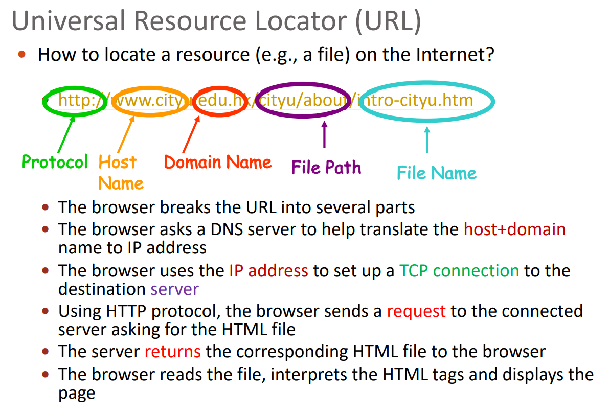
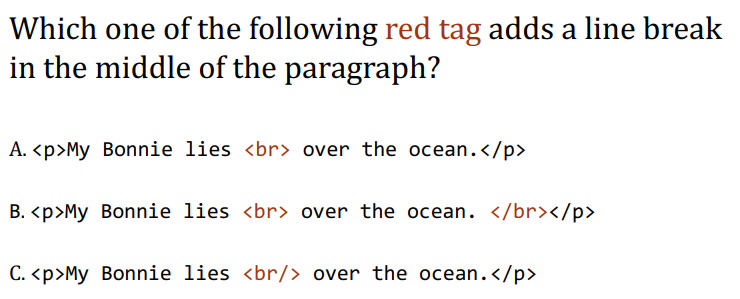
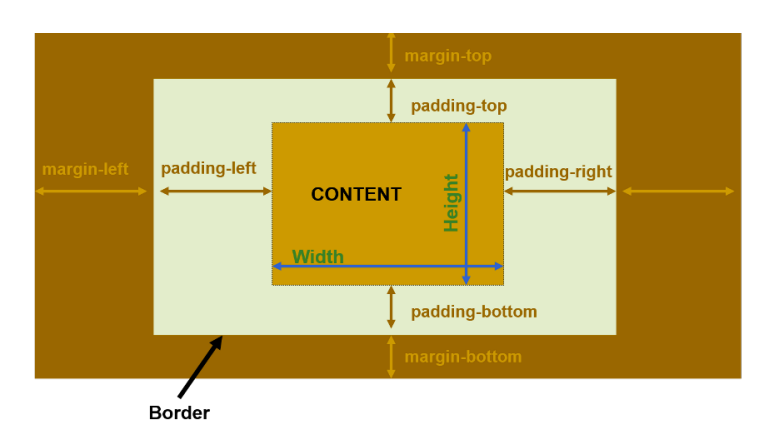
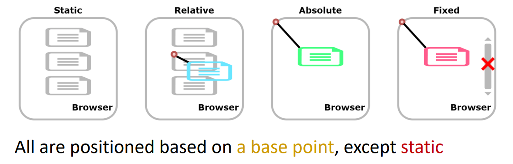
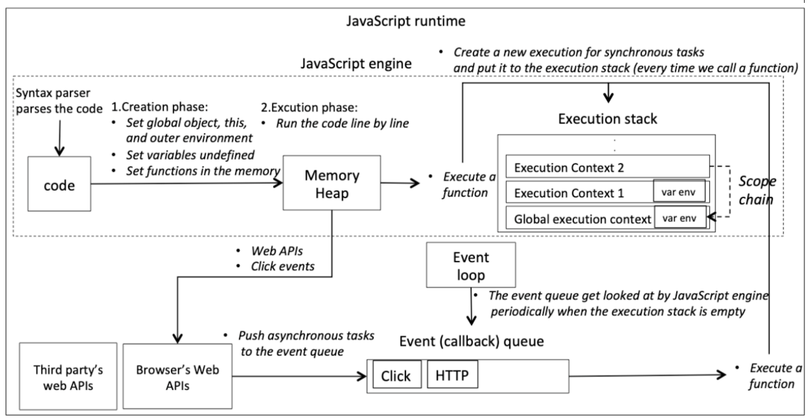
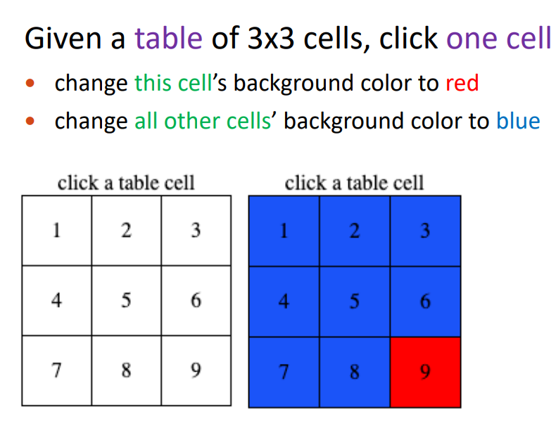

# Fundamentals of Internet Applications Development

## Lecture 1

### Communications

* Computer **network**: **two or more** computers connected to exchange data
    * Server: share resources
    * Directory Server: manage resources(such as user account) for entire network
    * Host: provide access to its resources
    * Router: forwards data packets
    * Switch: Coordinates the flow of data by sending directly

* Computer **communications**: the process of *two or more* computers share resources by *way of a medium*
* **Communication systems**: system that transmit data
    * Devices: Sending, Receiving, Connection
    * Protocol: Data Transmission Specifications
    * Communication Channel (can be physical or wireless) 
* Connection Devices: **Modem**
    * analog signals=*electronic waves*
    * **Modulation: digital to analog**
    * **Demodulation**
* Transfer rate=the *speed* of modem transmitting data
* **Delay**
    * Propagation delay: $T=\frac DS$ =distance/speed, *bit delay*
    * Transmission delay: $T=\frac LR$=packet length/transmission rate, *packet delay*

* **Bandwidth**: *capacity* of the communication channel
* **Protocols**
    * **HTTP**: Hyper-Text Transfer Protocol (See below)
    * **TCP/IP**: Transmission Control Protocol/Internet Protocol, *identifying* devices and *breaking* data into packets

* **Network Protocol Layers (OSI model)**
    * Upper Layers: (7)Application, (6)Presentation, (5)Session, (4)Transport
    * Lower Layers:(3)Network, (2)Data Link, (1)Physical

* **Network Types**
    * **LANs** (Local Area Networks), **Home**, **WLAN** (Wireless LAN), **PANs** (Personal)
    * **MANs** (Metropolitan)
    * **WANs** (Wide), use satellites, widest is the Internet which spans the entire globe

* **Network Strategies**
    * **Client/Server Network**
        * Client access data on server
        * Client request for services, server provide
        * Server control the access of client
        * server and client have **different** software

    * **Peer-to-Peer (P2P) Network**
        * peer connected **directly or indirectly**
        * have similar type of software


### Internet and WWW

* **Internet: interconnected network**
* Extranet: connect multiple organization
* **World Wide Web (WWW)**: worldwide collection of electronic documents (**webpages**)
    * **website**: collection of webpages and associated resources, stored on a web browser
    * **web server**: deliver requested webpages to client
* **Web Generations**
    * *1.0 (1996-2004)*: linking existing information, application: search engine
    * *2.0 (2004-2016)*: content creation, application: social platform
    * *3.0 (2016+)*: identifying relationship between data, application: intelligent assistant
* **Browser**: provide access to web resources with an *interface*
* **Uniform Resource Locator (URL)**: *Unique* address to locate a webpage
    * 
    * **Port number**: multiple server programs on a host
* **HTTP: Hyper-Text Transfer Protocol**
    * the **command and syntax** for transmitting web data
    * allow browser to fetch web page and simple feedback (form filling)
    * allow server to provide extra information
* **IP Address: Internet Protocol Address**
    * **IPv4**: $4\times 8$-bit numbers=32bits, 4 numbers ranged `0-255` separated by `.`
    * **IPv6**: $8\times16$-bit numbers=128bits, 8 groups of 4-digit hexadecimal numbers separated by `:`
    * To shorten IPv6, remove leading zeroes and using `::` for consecutive groups of 0s
* **DNS: Domain Name Server**
    * host parts of the DNS database
    * translate domain names into IP addresses
    * organized in a **tree** structure following the layers of domain names
    * Top-level domain
    * Browser communicates with a DNS server maintained by ISP (Internet Service Provider) and contact the server at given IP address
* **E-mail**: Client-based, web-based
    * Client A->Server A->Server B->Client B

### Architecture of Web Applications

* Full stack architecture (**N-tier** System)
* Web Browser <-> Web/Application Server <-> Storage System
* **HTML: Hyper-Text Markup Language**
    * text, image, audio, video
    * HTML5 can handle inaccurate syntax
* Interactive Website Technologies
    * **CSS: Cascading Style Sheets**
    * JavaScript


## Lecture 2

### Webpage

* **Source Code**: text **marked up** with *HTML tags* (with *CSS and JavaScript*)
* **HTML**: use *tags* to describe the **structure**
* **CSS**: describe how HTML elements should be displayed
* **JavaScript**: **dynamic** content generation, *interaction*

### HTML - Hypertext markup language

* HTML is markup language; **no logic or algorithm** like programming language
* Version: HTML (1991), XHTML (2000, for desktop), **HTML5** (2008, for mobile)

### Structure of a webpage

```html
<!DOCTYPE html>
<html>
    <head>
        <title>Introduction</title>
    </head>
    <body>
        <p>
            This is a sample page
        </p>
    </body>
</html>
```

* Each HTML file should have **one and only one** `<html>`, `<head>`, `<body>`
* Indentation is not required

#### Sections

* **Head section**: container for page title and metadata, **NOT shown on the webpage**
* **Body section**: container for HTML content, must follow head section (the 2nd child of `<html>` element)

### Tags

* Definition: `<>` (angle brackets) with the name inside
* Most tags working **in pairs**, **content**: the text enclosed by the *opening & closing tags*
* Some tags not in pair called **empty tag**, and has *no content*, e.g. `<br>`, `<hr>`
* **attribute**: e.g. in `<div id="me">div's content</div>`, attribute is `id`

#### Head Section Tags

* `<title>`:

    * **tab name** of a webpage in browser
    * used by **search engine** for keyword search
    * default title when bookmarking

* `<meta>`: **not shown on the webpage**, commonly optional; **empty tag**

    * ```HTML
        <head>
            <meta charset="utf-8">
            <meta name="author" content="CS2204">
            <meta name="description" content="Example of CS2204">
            <meta name="keywords" content="HTML, CSS, Javascript">
            <title>CS2204 Title Example</title>
        </head>
        ```

    * `name` attribute: the usage of this line of metadata

    * `content` attribute: the actual value of each name

    * `description` and `keywords` are for search engine spider

    * `charset` attribute: **encoding**

    * UTF (Unicode Transformation Format)

    * `utf-8`: encode characters into 8-bit bytes, high 2 bits (6&7th): *indicate if there are any more bits*

* other tags: `<base>`, `<link>`, `<meta>`, `<script>`, `<style>`

#### Body Section Tags

##### Heading

`<h1>`, `<h2>`, `<h3>`, `<h4>`, `<h5>`, `<h6>`

##### Paragraph: `<p>`

* Browser automatically insert **line spacing** between successive `<p>` tags
* Browser controls **line breaks**
* These layouts are irrelevant to HTML file

##### Hyperlink (Link):

* ```html
    <p>You can open <a href="https://www.cs.cityu.edu.hk/">CS department's homepage on the same tab</a></p>
    
* `<a>` (**anchor** tag)

* `href` attribute: URL

* by default, open **in the same tab**

* `target="_blank"` attribute: open in a new tab

* **Link action** other than opening webpage:

    * `<a href="mailto:abcdef@cityu.edu.hk">`
    * `<a href="2-HTML.pdf">`

##### Internal Links

* to **specific location** in the same page
* `id` attribute: **unique within the page**
* can locate to locations in external pages, example: `<a href="http://abc.com/xyz.html#pagelocation">Go</a>`
```html
<p>You can navigate to <a href="#pHTML5">paragraph HTML5</a></p>

<h2 id="pHTML5">HTML5</h2>
```

##### Divider: `<div>`

group different parts and give different `id` attribute (can be used to apply different style)

##### Image: `` (Empty Element)

* `src` attribute: path of the image, default in the same folder of the webpage

* `alt` attribute: **alternate text**, will be displayed instead of the image when the image not found

* **NO END TAG**

* **Image Link**: in the following example, hyperlink applies to both the image and the text

* ```html
    <a href="https://www.cityu.edu.hk/">
        <br>
        CS department homepage
    </a>
    ```

##### More Empty Elements

* `<br>, <br/>`: **line break**

* `<hr>, <hr/>`: **horizontal line**, like this

---



B is grammatically incorrect, but can display correctly. Web browsers are faulty-tolerant.


### File Path

* **Full path / Absolute path**: `C:\WP\Data\Myfile.txt`, `C:` (Driver letter), `WP\` (Folder), `Data\` (Subfolder), `Myfile` (Filename), `txt` (Extension)
* **Relative path**: `.` (single dot: **current directory**), `..` (double dots: **parent directory**)
* Absolute URL is for **external websites** (not on the same web server), browser will query the server
* relative URL is for internal websites

### Web Accessibility

#### Principles

**Perceivable, Operable, Understandable, Robust** (different user agents, and remain after years)

#### Measures

* **alt text**
* **descriptive** web link
* adjustable font size
* high-contrast color


## Lecture 3

### Body Section Tags, Continued

#### List

* `<ul>`: Unordered list (ballpoint)
* `<ol>`: Ordered list
    * `type="A"` attribute: can change `1,2,3, ...` to `A, B, C, ..., Z, AA`
    * `start="3"` attribute: can start from `3` (use the same numerical index for `type="A"`)

* `<li>`: (Each) list item

```html
<ol type="a" start="703">
      <li>apple</li>
      <li>orange</li>
      <li>banana</li>
      <li>pear</li>
      <li>grape</li>
      <li>watermelon</li>
</ol>
```

The output will be:

```
aaa. apple
aab. orange
aac. banana
aad. pear
aae. grape
aaf. watermelon
```

#### Definition List

* `<dl>` tag: list
* `<dt>` tag: title
* `<dd>` tag: data

multiple `dd` under the same `dt`

```html
<dl>
    <dt>Coffee</dt>
    	<dd>- black hot drink</dd>
    	<dd>- Alice likes it</dd>
    <dt>Milk</dt>
    	<dd>- white cold drink</dd>
</dl>
```


#### Table

* **rows are →, columns are ↓**
* `<table>` tag: enclosing the full table
* By default no border. Set `<table border="1">`
* `<tr>` tag: **rows**
* `<th>` tag: **head** of each column
* `<td>` tag: **data** in cells other than column heads

##### Table Details

* `<caption>` tag: **only one immediately after** `<table>`
* `<thead>` (header) **can have multiple rows**, use `<th>` inside, **bold font** by default
* `<tbody>` (body)
* `<tfoot>` (footer) summary section
* can be used to define styles for each section

```html
<table>
    <caption>Monthly savings</caption>
    <thead>
        <tr>
            <th>Month</th>
            <th>Savings</th>
        </tr>
    </thead>
    <tbody>
        <tr>
            <td>January</td>
            <td>$100</td>
        </tr>
        <tr>
            <td>Feburary</td>
            <td>$200</td>
        </tr>
    </tbody>
    <tfoot>
        <tr>
        	<td>Summary</td>
        	<td>$300</td>
        </tr>
    </tfoot>
</table>
```

##### Table cell merging

* `<td>` tag
    * `colspan="X"` attribute
    * `rowspan="X"` attribute

* can use both at one cell

```html
<table style="width:80%"> <!-- an example of 3row, 4col table -->
    <tr>
    	<td colspan="2">1</td> 	<!--(r1c1, r1c2)-->
        <td>2</td> 				<!--(r1c3)-->
        <td>3</td> 				<!--(r1c4)-->
    </tr>
    <tr>
    	<td>4</td>				<!--(r2c1)-->
        <td>5</td>				<!--(r2c2)-->
        <td rowspan="2">6</td>	<!--(r2c3, r3c3)-->
        <td>6+</td>				<!--(r2c4)-->
    </tr>
    <tr>						<!--r3c3 skipped-->
    	<td>7</td>				<!--(r3c1)-->
        <td>8</td>				<!--(r3c2)-->
        <td>9</td>				<!--(r3c4)-->
    </tr>
</table>
```


#### HTML Form

* `<form>` tag: enclosing the full form
    * `method` attribute: can use `http`, `get` or `post` to communicate with servers
    * `GET` include all required data (e.g. password) in the URL
    * `POST` supply additional data browser **more secure**
    * `action="xxx.html"` attribute:  the URL receive and process the form
* `<label>` tag
    * `for="fname"` attribute: **corresponding to input id**
* `<input>` tag (**EMPTY TAG**)
    * `type="text"`attribute: text box; `submit` and `reset`: corresponding button
    * `id="fname"` attribute: corresponding to the label; also in-page identifier
    * `name="fname"` attribute: send to server
    * `value="John"` attribute: default value, placeholder

```html
<form method="get" action="lec03-07-HTML-form-script.html">
	<label for="fname">First Name:</label> <br>
	<input type="text" id="fname" name="ffname" value="John"> <br>
	<label for="lname">Last Name:</label> <br>
	<input type="text" id="lname" name="llname" value="Doe"> <br>
	<br>
	<input type="submit"> 	<!-- button -->
	<input type="reset"> 	<!-- button -->
</form>
```


### Multimedia

#### Video & Audio

* supported video format: `mp4`, `webm`, `ogg`
* `<video>`, `<audio>` tag
    * `controls` attribute: show the control bar
    * `loop`, `autoplay`, `muted` attribute
* `<source>` tag (**EMPTY TAG**)
    * `src` attribute
    * `type` attribute

```html
<video controls="controls" autoplay="autoplay">
	<source src="../video/wonders.ogg" type="video/ogg">
	<source src="../video/wonders.mp4" type="video/mp4">
    <h2>Your browser does not support this video format</h2>
</video>
```

##### Cross Browser Support

* **only mp4 supported by all browsers**
* **Fall back code**: if all `<source>` failed the remaining HTML will be shown

#### Canvas

`<canvas>` tag, a **real-time drawing area**

* `id` attribute
* `width` attribute, `height` attribute
* **drawn by JavaScript**, in a `<script>` tag outside the `<canvas>`
* `<canvas>ALT TEXT</canvas>` **enclosed by the tags are alt text**


### Doctype

```html
<!DOCTYPE html>		<!-- Line 2 -->
<html lang="en">	<!-- Line 3 -->
```

* **HTML5**: As above
* **HTML 4.01**: No doctype default
* **XML**: `<?xml version="1.0" encoding="UTF-8"?>`(line 1) **BEFORE Doctype**
* **XHTML**

  ```xml
  <!DOCTYPE html PUBLIC "-//W3C//DTD XHTML 1.1//EN" "http://www.w3.org/TR/xhtml11/DTD/xhtml11.dtd">			<!-- Line 2 -->
  <html xmlns="http://www.w3.org/1999/xhtml” xml:lang=“en”> <!-- Line 3 -->
  ```


### Web Page Validation

Check syntax with [W3C Validator](https://validator.w3.org/)


## Lecture 4

### Form, Continued

#### Form Types

* `<input>` **is a empty tag**
* text input: `<input type="text">`
* single choice: `<input type="radio"> <label for="">...</label>` (input **`name` attribute should be same so user can select only one**, `id` should be different)
* checkbox: `<input type="checkbox"> <label>...</label>` (can uncheck, `name` should be different and multiple name-Boolean key-value pairs will be sent to browser) 
* password: `<input type="password">`
* number: `<input type="number" min="1" max="10">`
* slider: `<input type="range" min="1" max="10">`
* email: `<input type="email">`
* URL: `<input type="url">`
* date: `<input type="date">` (min, max)
* selection: `<select> <option value="" selected>...</option> <option>...</option> </select>`
* text input: `<textarea rows="10" cols="30">...</textarea>`
* in `<input>`: `id` attribute is for **webpage structure**, `name` attribute is for **form and server**
* in `<label>`: **`for` attribute is for `<input> id`**


#### Form Attributes

* `<input maxlength="10">`
* `<input checked="checked">` (radio + checkbox, auto checked when loaded)
* `<input required="required">`
* Multiple select: `<select multiple="mulpitle">`

#### Grouping Form Elements

* `<fieldset>` **group form controls together**. Browser shows a line around the edge
* `<legend>`: purpose of `<fieldset>`

```html
<form>
    <fieldset>
        <legend>TITLE</legend>
        FORM CONTENT
    </fieldset>
    
    <input type="submit">
    <input type="reset">
</form>
```

### Query String

* **Sending data from browser via form**
* **Name-Value Pairs**
    * `name` is from `<input name>` attribute
    * Appended to the address: `.html?Field1=Value1&Field2=Value2&Field3=Value3`
* `GET`: Appended to the address, sent to the server **as part of URL**
* `POST`: sent to server **as part of message content**, cannot see change in the address

### Additional Markup

* button: `<button class="button button1">`
* embedded webpage: `<iframe src="" width="500" height="400">`
* escape character: `&lt;`(&lt;), `&gt;`(&gt;), `&ldquo;`(&ldquo;), `&rdquo;`(&rdquo;), `&times;`(&times;), `&divide;`(&divide;), `&nbsp;`(space), `&copy;`(&copy;); **`&amp;`(&amp;)**


## Lecture 5

### CSS

* Inline Style
* **Embedded Style** by `<style>` inside `<head>`
* **External Style** by `<link>` inside `<head>`
* **External Style: Import** by `<style>` inside `<head>`

```html
<head>
    <link rel="stylesheet" type="text/css" href="style1.css" media="all">
    <link rel="stylesheet" type="text/css" href="style2.css" media="all">
</head>

<!-- IMPORT -->
<head>
    <style type="text/css" media="all">
    	@import url("mystyle.css");
    </style>
</head>
```

* **`<link>` is an empty tag**
* can link multiple .CSS stylesheet
* `media="all"` attribute is used **for all media types**
* `@import` will take more time to download css


### CSS Selector

#### ID Selector

**`id` should be unique** within the page

```html
<head>
    <style>
        #paragraph1 {
            color: blue;
        }
    </style>
</head>
<body>
    <p id="paragraph1"></p>
</body>
```

#### Class Selector

`<span>` tag can be used to enclosed a specific part of text

```html
<head>
    <style>
        .hightlight {
            color: red;
        }
    </style>
</head>
<body>
    <p>1<span class="highlight">2</span>3</p>
</body>
```

#### Group Selector

Can be applied to differently selected elements.

```html
    <style>
        h1, #paragraph1, .highlight {
            color: red;
        }
    </style>
```

#### Contextual Selector, Attribute Selector

* `container h1`: descendant
* `ul > li`: direct child
* `h1 + p`: immediate sibiling
* `h1 ~ p`: general sibling (coming in order)
* `input[type="text"]`: attribute
* `*`: wildcard

```html
<!DOCTYPE html>
<html lang="en">
  <head>
    <meta charset="utf-8">
    <title>CSS Group Selector</title>
    <style>
      #maintcontainer h1 {
        color: red;
      } /*1.<h1> DESCENDANT of id=maintcontainer */
      #list1 > li{
        color: orange;
      } /*2.<li> CHILD of id=list1 */
      #list2 > li {
        color: blue;
      } /*3.<li> CHILD of id=list2 */
      h1 + p {
        color: green;
      } /*4.<p> SIBILING immediately after <h1> */
      * { 
        margin: 0px;    
        padding: 0;  
      } /*5.ANY elements */
      input[type="text"] {
        color: red;
      } /*6.ATTRIBUTE SELECTOR <input type="text"> */
      a {
        text-decoration: none;
      } /*7.<a> */
      a:hover {
        color: red;
      } /*8.PSEUDO CLASS */
    </style>
  </head>
  <body>
    <div id="maintcontainer">
        <h1>Fruits</h1> <!-- RULE 1 red -->
        <p id="p1">The following fruits can be commonly found in supermarkets:</p> <!-- RULE 4 green -->
        <ul id="list1">
            <li>apple</li> <!-- RULE 2 orange -->
            <li>orange</li>
            <li>banana</li>
            <li>pear</li>
            <li>grapes</li>
            <li>watermelon</li>
        </ul>
        
        <p>My favorite fruits are ranked according to my preference below:</p> <!-- NO STYLE; NOT IMMEDIATELY AFTER <h1> -->
        <ol id="list2">
            <li>watermelon</li> <!-- RULE 3 blue -->
            <li>banana</li>
            <li>orange</li>
        </ol>

        <h1>Vegetables</h1> <!-- RULE 1 red -->
        <p id="p2">The following vegetables can be commonly found in supermarkets:</p> <!-- RULE 4 green -->
        <ul id="l3">
            <li>carrot</li> <!-- NO STYLE -->
            <li>corn</li>
            <li>eggplant</li>
            <li>pepper</li>
        </ul>

        <div> <!-- still DESCENDANT of id=maintcontainer -->
          <h1>Another h1 Title</h1> <!-- RULE 1 red -->
        </div>
    
    </div>

    <input type="text"> <br> <!-- RULE 6 red -->
    <input > <br> <!-- NO STYLE -->
    <input type="submit"> <!-- NO STYLE -->

    <br><br>
    <a href="#">this is a link</a> <!-- RULE 7,8 -->

  </body>
</html>
```

#### Pseudo Class Selector

State of the element

* For links, `:link`(unvisited), `:hover`, `:visited`, `:active` (currently on)
* `:focus`: focused by clicking or `TAB`
* `p:first-child`, `p:last-child`, `p:only-child`: `<p>` as the first, last, only child of some other elements

#### Pseudo Element Selector

Partial of the element

* `::first-line`, `::first-letter`
* `::before`, `::after`: insert content
* `::marker`: `<li>` marker (ballpoint and number)
* `::selection`: when elements selected by cursor (like some text highlighted by mouse)

`::pseudo-element` is for all elements; no `*` (wildcard character) is required

```html
p::after {
	content: "XXXXXXX";
} <!-- append XXXXXXX after each <p> -->
```


### Priority

#### CSS Order

1. Inline styles
2. External and internal styles
3. Browser default

#### Inheritance

some of the properties set for ancestors can effect their descendants

#### CSS Priority

* Origin of styles: **user !important>author !important>author>user>user-agent** (`!important` can set to highest priority)
* Type of styles: **inline>embedded=linked**
* Selector (specificity)
<ol start="0">
	<li>In-line Style</li>
    <li>ID(<code>#</code>)</li>
    <li>Class(<code>.</code>), Pseudo-Class(<code>:</code>), Attribute(<code>[]</code>)</li>
    <li>Element(e.g. <code>&lt;h1&gt;</code>), Pseudo-Element(<code>::</code>)</li>
</ol>

### Organization

#### File Organization

* `default.css` at root, for all pages
* `section.css` at each subfolder

#### Media Type

`all`, `print`, `screen`, `speech`

```html
<style type="text/css">
	@import url("screen.css") print;
</style>
```


## Lecture 6

### Box Model



* `width`, `height`: can be px or % (relative value of ancestor element)
* `border`
    * **`border-width: top right bottom left;`**
    * `border-top`, `border-right`, `border-bottom`, `border-left`
    * `border-color`, `border-style`
* `padding`: distance from content to border
    * `padding: top right bottom left;`, can be px or % (percentage of parent `width`)
    * defaults:
        * `padding: four-side;`
        * `padding: top-bottom right-left;`
        * `padding: top right-left bottom;`

* `margin`: distance between (borders of different elements)
    * px (`top right bottom left`)
    * percentage
    * `{margin: auto;}` (centered)

* `overflow`: when the elements is bigger than the container
    * `scroll`: scroll bar
    * `hidden`: **a part of content, cannot manually scroll, can programmatically scroll**
    * `clip`: **a part of content, cannot scroll**
    * `visible` (default): ignore the container boundary
    * `auto`: browser


### Page Layout

```html
<div id="container">
    <header></header>
    <section></section> <!-- content -->
    <nav></nav> <!-- navigation -->
    <footer></footer>
</div>
```

#### Type of Elements

* **Block-level**:
    * **start a new line, take up full width**
    * `<div>, <p>, <ul>, <h1>`
    * `width, height, padding, margin` can be adjusted
* **Inline-level**
    * only necessary width, can have multiple in one line
    * `<a>, <span>`
    * **`width, height` invalid**
* **Inline-block**
    * can have multiple in one line
    * ` <input> <td>`
    * `width, height, padding, margin` can be adjusted

#### Display Priority

* `display: block;`: new line, width, height, horizontal margin, **vertical margin collapsed (larger of top and bottom)**
* `display: inline;`: same line, ~~width, height~~, **horizontal margin only**
* `display: none;`: **take up no space**, `visibility: hidden`: take space
* `display: inline-block;`: same line, width, height

#### `position`



* `static` (default, **normal flow**)
    * layout according to **sequence and display priority** 
    * **`top/bottom/left/right`: no use**
    * **no overlap**, elements one by one
* `relative`
    * **first follows the normal flow, then adjust this element** by `top, bottom, left, right`
    * **`z-index`**: bigger at top, smaller at bottom
* `absolute`
    * **taken out of normal flow, adjust to nearest positioning ancestor** (non-static) element
    * if no positioning ancestor element, use `<body>` (browser window) and moves along scroll
* `fixed`
    * **taken out of normal flow, adjust to browser window**

#### Column

* `float`
    * 2-column: `#d3 {float: right;} #d4 {float: left;}`
    * 3-column: `#d3, #d4, #d5 {float: left;}`

* `clear`
    * `{float: none;}` or `{clear: left | right | both;}`
    * **no elements on left and right; new element on new line**

* `columns`
    * `columns: 100px 3;` means **min width 100px; max columns 3**


### Layout Types

* **Fixed Layout**
    * the big container `<body>` or `<div>`, width set to a fixed value
    * advantages: **look identical, no overpower text** on small monitors
    * disadvantages: big space on big screen and scrolling on small screen
* **Liquid/Fluid Layout**
    * container width set to a relative value (percentage)
    * advantages: fill to full screen, responsive design
    * disadvantages: text can be too big or too small; fixed width elements can have display issues

### Responsive Design

#### Mobile friendly layout

* different screen sizes
* **orientation**: portrait vs landscape
* no mouse and no **mouse hover**
* **swipe** to scroll - horizontal and vertical
* click / tab

#### Viewpoint

visible area of a web page

`<meta name="viewport" content="width=device-width, initial-scale=1.0">`

#### Responsive Layout

* Liquid Layout: always use **relative styles**
* **Adaptive design**: think in terms of fluid grid (different divs into rows and columns)
* **media query** (link to different CSS)

```html
<link rel="stylesheet" type="text/css" href=”screen.css“ media="screen">
<link rel="stylesheet" type="text/css" href="print.css" media="print">

<link rel="stylesheet" type="text/css" media="screen and (max-device-width: 768px)" href="mobile.css">
<link rel="stylesheet" type="text/css" media="screen and (min-device-width: 768px)" href="desktop.css">
```

#### Screen Layout Partitioning

**iframe**: add a frame containing **a block of external HTML** (controlled by CSS)

each `frameset` can be a row or column

```html
<head>
    
</head>
<frameset>
    <frameset rows="55%, 45%">
        <frameset cols="*,*,*">
            <frame src="1"></frame>
            <frame src="2"></frame>
            <frame src="3"></frame>
        </frameset>
		<frameset cols="*,2*">
            <frame src="4"></frame>
			<frame src="5"></frame>
		</frameset>
    </frameset>
</frameset>

<noframe>
	<body>
        Your browser does not support Frames
    </body>
</noframe>
```


## Lecture 7

### CSS3 Effect

#### Round Border

* `border-radius`: px or %, 4-values: Left Top, Right Top, Right Bottom, Left Bottom
* `border-radius` is **capped to 50% (a circle)**

#### Box Shadow

```css
box-shadow: 5px(x) 10px(y) blur-radius spread red(color);
```

* `x, y`: **shadow position relative to the box**

#### Radiant

```css
background: linear-gradient(circle, #FF8000, #FFFF00);
```

* `linear-gradient()`: Top to Bottom
* `linear-gradient(left,)`: Left to Right
* `linear-gradient(top left,)`: Left Top to Right Bottom
* `radial-gradient(circle,)`: Inner to Outer

```css
#g-rainbow{
  background-color: red; /* For browsers that do not support gradients */
  background-image: linear-gradient(to right, red, orange, yellow, green, blue, indigo, violet);
}

#g-transparent {
  background-image: linear-gradient(to right, rgba(255,0,0,0), rgba(255,0,0,1));
}

#g-repeat-linear {
  background-color: red; /* For browsers that do not support gradients */
  background-image: repeating-linear-gradient(red, yellow 10%, green 20%);
}

#g-repeat-linear-angle {
  background-color: red; /* For browsers that do not support gradients */
  background-image: repeating-linear-gradient(45deg,red,yellow 7%,green 10%);
}
```

* **A in RGBA: Opacity**. `A=0`: Full Transparent, `A=1`: Full Color

### CSS3 Animation

#### Transform

* `transform: translate(10px, 10px);` (can be %): displacement
* `transform: scale(1.5, 0.5);`: x scaling and y scaling
* `transform: rotate(45deg);`: rotate by center (clockwise)

#### Transition

**gradually transform upon an event**

```css
#trans { 
	transition: background-color 3s linear;
	-webkit-transition: background-color 3s linear; 
} 
#trans:hover { 
	background-color: #004080; 
}
```

* `transition: transform-type time speed-curve;`
* **event and transform final state specified by `:hover`**
* `speed-curve`: `ease` (slow-fast-slow), `linear`, `ease-in` (slow-fast), `ease-out` (fast-slow), `ease-in-out` (slow-linear-slow)

#### Animation

```css
		#rt:hover {
			animation-name: divRotate;
			animation-duration: 1s; /* duration of 1 animation */
			animation-iteration-count: 5; /* 5 times */
		}

		@keyframes divRotate { /* can be used for different elements */
			from {
				transform: rotate(0deg);
				margin-left: 0px;
			}

			to {
				transform: rotate(360deg);
				margin-left: 150px;
			}
		}
```

```css
{
    animation-timing-function: linear; /* easin, ease-in, ease-out, ease-in-out */
}
```


### JavaScript

#### Type

* **embedded script**: `<script></script>` in `<head>`
* **external script**: `<script src="../js/x.js"> </script>`
* **inline script**: `<script></script>` in `<body>` **not as content of element** (for diagnostic)

#### Execution Environment

##### Engines

* **Rendering Engine**: HTML/CSS
* **Script Engine**: (e.g. Node.js) *single-thread, synchronous*

##### Runtime



##### Three Components

* **ECMAScript**: syntax
* **DOM (Document Object Model)**: webpage operations
* **BOM (Browser Object Model)**: browser operations

##### Usage

* DHTML and HTML5 features
* select an object from DOM
* identify events of an element


### JavaScript Basic Syntax

* **identifiers**: variable, function, object (letter, digits, underscore`_` and dollar `$`, **case sensitive**)
* **keywords**
* **variable**: no type declaration

#### Basic Types

* **Boolean**
* **Number** (integer and float)
* **String** (`''` or `""`, can have zero characters)
* **Array, Date, Object**

#### Variable Declaration

* `var Msg;`: **value is undefined**
* `console.log(Msg)` print in console

#### Variable Scope

* **Local variables**: declared in a block `{}`, can **only be accessed within the block**
* **Global variables**: can be accessed in the rest of the scripts, **will be override by a local variable with the same name**
* **Variable declared in block without `var` is global**
* HTML cannot read JS variables

```js
        var x = 1;
        function f() {
            x = x + 1;
            console.log(x); // 2
        }
        function g() {
            var x = 10;
            console.log(x); // 10

            var myNum;
            console.log(myNum); // undefined
        }

        f();
        g();

        var num = 1;
        function h() {
            console.log(num); // undefined
            var num = 10;
            console.log(num); // 10

            date = 'today'; // global var
        }

        h();
        console.log(date); // 'today'
```

### Array

```js
var nums;
nums = [1, 2, 3, 4, 5, 6, 7, 8, 9, 10]; // nums[0] to nums[9]
```

### Switch

```js
let x = "0";
switch (x) { // switch use === (strict)
  case 0:
    text = "Off";
    break;
  case 1:
    text = "On";
    break;
  default:
    text = "No value found";
}
```


## Lecture 9

### String Operation

```js
var s1 = 25;
var s2 = "1000";
var s3 = "abc";
console.log (s1 + s2); // '251000'
console.log (s1 + s3); // '25abc'
console.log (s2 + s3); // '1000abc'
var s4 = true;
console.log (s1 + s4); // 26
console.log (s2 + s4); // 1000true
console.log (s3 + s4); // abctrue
```

### NaN

```js
console.log (isNaN(s1)); // false
console.log (isNaN(s2)); // false
console.log (isNaN(s3)); // true
console.log (Number.isNaN(s1)); // false
console.log (Number.isNaN(s2)); // false
console.log (Number.isNaN(s3)); // false
NaN == NaN // false
NaN === NaN // false
2 === 2.0 // true. there is only 'number', no 'int' and 'float'
2 == "2" // true
2 === "2" // false
2 !== "2" // true
```

* `isNaN` return true if it is `NaN` or type not Number
* `Number.isNaN` return true if it is `NaN` and type is Number

### Hoisting

* `var` declares **uninitialized** variable at the top of the scope, can be accessed anywhere in the function (the initialization is to be done at the original line in code)
* `let` declares inside the loop, can only be accessed inside the loop

```js
function f() {
  // equavilently, declare 'var i;' here uninitalized
  // so it can be used before after the loop
  // but not initialized before the loop
  document.write(i); // undefined
  for (var i = 1; i < 11; i++){
  	document.write(i);
  }
  document.write(i); // 11, because i is local
}
// var i = 0;
function g() {
  document.write(i); // 0, because i is global
  for (let i = 1; i < 11; i++){
    if (i % 2 == 0) {
      continue;
    }
  	document.write(i);
  }
  document.write(i); // 0, because i is global
}
```


### Function

#### Function Parameters

* **arguments can be passed even they are NOT defined in declaration**
* JavaScript is loosely typed: no checking of parameter types

```js
function f() {
    for (i=0; i<arguments.length;i++) {
        alert(arguments[i]);
    }
}
f(1);
f("string1", "string2");
```

#### Function as Variable

In the following example, `d` is a anonymous function

```js
function square(x) {return x*x;}
var a = square(4);
var b = square;
var c = b(5);
var d = function(x) {return x*x;} 
var e = d(3);
```


### Built-in Functions

```js
decodeURI(); // URI = Universal Resource Identifier
encodeURI();

eval(); // evaluate a string and execute it as if it was script code
var s1 = "10";
var s2 = " + 20";
console.log(s1 + s2); // '10+20'
console.log(eval(s1 + s2)); // 30

parseFloat(); // return the first number
parseInt(); // return NaN if the first character cannot be converted
var s3 = "10, 20, 30"; // 10
var s4 = "40 years ago"; // 40
var s5 = "He was 50"; // NaN
var s6 = "60.9999"; // parseInt -> 60
```


### JavaScript Objects

Object is created by **constructor** or **object literal**

```js
var currentDT = new Date(); // a constructor function creating a Date object
var myvar = 123; //123 is a literal
var person = {name: “John”, age: 25}; // a new person object with two properties
```

* Variables are used to store **temporary values** and **lost on reload**
* Four main kinds of objects:
    * **primitive objects** - Number, String and Boolean
    * **built-in objects** - Array, Date and Math
    * **self-defined objects**
    * **DOM** - window, document, console (not type but objects)
* Two main parts:
    * **Properties**: values, can be get/changed
    * **Methods**: actions


#### `this`

`this` refers to an object

* In an *object method* -> **object**
* In an *event* -> **element** receiving the event
* In *global scope* -> **global object** (window object)

#### Iterate Elements in An Object

```js
for (var k in obj) {
    console.log(k + ' is: ' + obj[k]);
} // including object methods
```


### Object Declaration

#### Defined by Literal

```js
var person = {
    firstName: "John";
    lastName: "Doe";
    fullName: function() {
        return this.firstName + " " + this.lastName;
    }
}; // notice the ; here!
console.log(person.firstName)
console.log(person['lastName'])
// these two accesses can be used for all other definitions
```

#### Defined by new Object()

```js
var person = new Object();
person.firstName = "John";
person.lastName = "Doe";
person.fullName = function() {
    return this.firstName + " " + this.lastName;
}
```

#### Defined by Constructor

```js
function Person(f, l) {
    this.firstName = f;
    this.lastName = l;
    this.fullName = function() {
        return this.firstName + " " + this.lastName;
    }
}
var person = new Person("John", "Doe");
```


### Built-In Object

#### Boolean

```js
var b = new Boolean(), (0), (null), (""), (false), (NaN); // all converted to false
// true converted to 1 and false to 0 in number calculation
```

#### Math

Like document, window and console, Math is an existing Object. Use it directly without `new ()`.

```js
Math.PI;
Math.SQRT2;
Math.min(); // Infinity
Math.max(); // -Infinity
Math.random(); // [0, 1)
Math.floor(Math.random()*10 + 1); // integers in [1, 10]
```

#### Date

```js
new Date(); // local time
new Date(miliseconds); // integer in ms from 1970/01/01 00:00:00 UTC
new Date(dateString); // string
new Date(yr_num, mo_num, day_num[, hr_num, min_num, sec_num, ms_num]); // mo_num=0...11
.getDate(); // 1-31
.getDay(); // 0-6 (Sun...Sat)
.getMonth(); // 0-11 (Jan...Dec)
.geyFullYear();
.getHours(); // 0-23
```

#### Array

can store values of any data types

```js
// defined by literal
var arr = [];
// defined by new
var arr = new Array();
var arr = new Array(ele0, ele1, ..., eleN);
var arr = new Array(LENGTH);
// new Array(1,); -> 1-length empty array
console(arr.length);
arr.pop(); // delete the last element
arr.push(values); // add to the end
arr.shift(); // delete the first element
arr.unshift(values); // add to the beginning
```

### String

```js
var str = 'hello world!' // 0...11
// or var str = new String('hello world!')
console.log(str.length); // 12
str.indexOf('lo'); // 3
str.lastIndexOf('l'); // 9
str.CharAt(1); // e
str.substr(0, 5); // 'hello' (0...5-1)
str.substr(5); // ' world!' (5...end)
str2 = str.replace('l', '&'); // 'he&&o wor&d!'
str2.split('&'); // ['he', '', 'o wor', 'd!']
```


### DOM

Sample HTML

```html
<body>
    <div id="block1">
        this is a block
    </div>
    <div id="block2">
        <h1>heading1</h1>
        <h1>heading2</h1>
        <h1>heading3</h1>
        <p>this is a pargraph</p>
    </div>
    <ol>
        <li id="list1">The first item</li>
        <li id="list2">The first item</li>
    </ol>
</body>
```

#### ID Select

```js
console.log(document.getElementById('block1').innerHTML); // this is a block
// getElementByID, don't write as getElementsById
// as there cannot have multiplie
```

#### Tag Select

```js
var h1s = document.getElementsByTagName('h1'); // return an array
for(var k = 0; k < h1s.length; k++) {
    console.log(h1s[k].innerHTML);
} // heading1, heading2, heading3
```

#### Combination

```js
var divhs = document.getElementById('block2').getElementsByTagName('h1');
// var list = document.getElementsByTagName('ol')[0].getElementById('list1');
// incorrect
```

`document.getElementsByTagName` **cannot use `.getElementById`**

#### CSS Selector

```js
document.querySelector('div > p');
document.querySelector('#id1, #id2'); // whichever comes first
// only return the first element object
document.querySelectorAll('div, #ps2, .list'); // select all, return an array
```


### Event

#### JS interaction with web objects

* properties

* methods

    ```js
    alert(); // window.alert();
    document.write();
    document.querySelector("video").play();
    ```

* event handlers

#### Common events

* `onchange`
* `onclick`
* `onmouseover`
* `onmouseout`
* `onkeydown`
* `onload`

## Lecture 10

### Events

#### Event Handler

```html
<button id="btn">
    What's the time?
</button>
<p id="output"></p>
<script>
	var btn = document.querySelector("#btn"); // getElementByID("btn")
    // equivlantly, <button id="btn" onclick="eventHandler();">
    btn.onclick = eventHandler;
    
    function eventHandler () {
        document.getElementByID("output").innerHTML = Date();
    }
</script>
```

#### Event Listener

```html
<script>
	var btn = document.querySelector("#btn");
    btn.addEventListener('click', eventListener);
</script>
```

* multi **event handler: last**
* multi **event listener: first**

#### Object `this`

`this` can make event handler work for different objects

```js
window.onload = initAll; // on page load
function initAll() {
    buttons = document.querySelectorAll("button"); // type: HTMLCollection
    for (let i = 0; i < buttons.length; i++) {
        buttons[i].onclick = eventHandler;
    }
}
function eventHandler() {
    alert(this.id);
}
```

#### Event Canceling

* event handler: `element.onclick = null;`
* event listener: `element.removeEventListener('click', eventListenerName);`

#### `onreset`

**event handler attribute**; a function to be executed when **a form is reset**

* `confirm()` display a dialog box with "OK" and "Cancel" button
* `confirm()` return `false` if "Cancel" and `true` if "OK"

```html
<script>
function check() {
    if (confirm("Are you sure to clear all data?")) {
        return true;
    }
    return false;
}
</script>
<form action="#" method="get" onreset="return check();">
   
</form>
```


### Dynamic Content

#### `CreateElement()`

**two steps: create -> add**

```js
function handler() {
    var li = document.createElement("li"); // create
    var ol = document.querySelector("ol");
    
    // add after
    ol.appendChild(li);
    // add before
    ol.insertBefore(li, ol.children[0]);
}
```

#### `InnerHTML`

```html
<head>
    <script>
    	function init() {
            document.getElementByID('welcome').innerHTML = 
                '<h2>Welcome!</h2>';
        }
    </script>
</head>
<body onload="init();">
    <div id="welcome"></div>
    <!-- onload it becomes
		<div id="welcome"><h2>Welcome!</h2></div>
	-->
</body>
```

* Efficiency: `InnerHTML < createELement()`

* improving efficiency: **add content to an array and displaying them all at once**

    ```js
    var arr = [];
    for (var i = 0; i < 500; i++) {
        arr.push('<li></li>');
    }
    ol.innerHTML = arr.join('');
    ```

#### Delete Element

`Parent.removeChild(Child);`

### Inline Script

```html
<h1>
    Static Header
</h1>
<script>
	document.write("<h2>Dynamic Header</h2>");
</script>
<h3>
    Static Header
</h3>
```

* HTML will be created when the page is loaded
* created at the location of the script (in the example, after `h1` and before `h3`)
* will cause the page to **re-render** if the page is **fully loaded**

```js
window.onload = function() {
    document.write("hello world!");
    // this will overwrite HTML from the beginning
}
```

#### Hide & Show

1. `display`

    ```js
    document.getElementById("sweet").style.display="block";
    document.getElementById("sour").style.display="none";
    ```

2. `visibility` (`"hidden"` or `"visible"`)
3. `zIndex` (`1` at top, `-1` at bottom)

#### Intervals

```js
var Interval; // must be global to be cleared
function startTimer() {
    Interval = setInterval(eventer, 1000); // 1000ms=1s
}

function eventer() {
    const date = new Date();
    document.getElementById("clock").innerHTML = date.toLocaleTimeString();
} // short time, e.g. 21:05:59

function stopTimer() {
    clearInterval(Interval);
}
```


### Video

```js
var v = document.getElementById("v");
function vplay() {
    v.play();
}
function vpause() {
    v.pause();
}
function vstop() {
    v.currentTime = 0;
    v.pause();
}
function vff() { // fast forward
    v.currentTime += v.duration / 10;
    if (v.currentTime >= v.duration) {
        v.currentTime = 0;
    }
}
function vfb() { // fast backward
    v.currentTime -= v.duration / 10;
    if (v.currentTime < 0) {
        v.currentTime = 0;
    }
}
```

```html
<video id="v" oncanplay="initButton();">
```

* `oncanplay`: when a video is **ready to play**
* **switch videos**: change `InnerHTML` of parent container of `<video>`

#### Audio

```js
audio[i] = new Audio("../audio/audioFile[i]");
audio[i].load();
audio[i].play();
```


## Lecture 11

### Slide Show

```js
window.onload = repeater;
var imgs = ["img/1.jpg", "img/2.jpg", "img/3.jpg", "img/4.jpg", "img/5.jpg"];
var i = 0;
// setTimeout
function repeater() {
    i++;
    if (i == imgs.length) {
        i = 0;
    }
    document.getElementById("img").src = imgs[i];
    setTimeout("repeater()", 3000);
}

// setInterval
function repeater2() {
    i++;
    if (i == imgs.length) {
        i = 0;
    }
    document.getElementById("img").src = imgs[i];
}
setInterval("repeater2()", 3000);
```

* `setTimeout(function, milisecond);` use recursion
* `setInterval(function, milisecond);`

### Information Storage

* **Variable**: temporal, disappear when the page is reloaded
* **Database**
* **Session storage**: `window.sessionStorage`
    * Stored for current session
    * can be **shared within the same page**
    * **Deleted upon closing browser**
* **Local storage**: `window.localStorage`
    * Stored permanently unless manually deleted
    * can be **shared across multiple pages**

#### Session storage

* Data format: **key and value**
* `sessionStorage.getItem("key");`
* `sessionStorage.setItem("key", value);`
* `sessionStorage.removeItem("key");`
* `sessionStorage.clear();`

### Movement

#### Controlled Move

```js
dot.style.top = up + "px"; // e.g. top = "80px";
dot.style.left = current_xPos + "px";
```

Use `.style` to modify CSS attributes

repeatedly changing the position

#### Layering

```css
.odd {
    position: relative;
    z-index: 0; // layer under dot
}
.even {
    position: relative;
    z-index: 2; // layer over dot
}
#dot {
    position: relative;
    z-index: 1;
}
```

Note: `z-index` cannot be applied for `position: static`, but you can use `relative` with no displacement (just allowing overlap)

#### Tracking

```js
box = dot.getBoundingClientRect();
```

returning value:

* `box.top` the distance of `top` **relative to viewpoint** `top`
* `box.left` the distance of `left` relative to viewpoint `left`
* `box.bottom` the distance of `bottom` relative to viewpoint `top`
* `box.right` the distance of `right` relative to viewpoint `left`
* the values need adjustment on page scroll

#### Collision Detection

```js
const bigRectSize = 150;
const smallRectSize = 80;
function insideBigRect(x, y) {
    return x >= bigRectLeft && x <= bigRectLeft + bigRectSize &&
        y >= bigRectTop && y <= bigRectTop + bigRectSize;
}
function checkCollision(smallRect) {
    let l = smallRect.left;
    let t = smallRect.top;
    let r = l + smallRectSize;
    let b = t + smallRectSize;
    if (insideBigRect(l, t) || insideBigRect(r, t) ||
        insideBigRect(l, b) || insideBigRect(r, b)) {
        return true;
    } // All four corners
    return false;
}
```

#### Keyboard Handling

```html
<input type="text" onkeypress="func(event)">
<script>
	function func(event) {
        let key = event.code;
        document.getElementById("output").innerHTML = key;
    }
</script>
```

* `onkeypress`: press and release
* `onkeydown`: press
* `onkeyup`: release
* `alt, ctrl, shift, esc, backspace` cannot trigger this event

#### Drag and Drop

```html
<script>
function drag(event) { // get the img from drag event
    event.dataTransfer.setData("image", event.target.id);
}
function drop(event) { // set dragged img as the child of dropbox
    var data = event.dataTransfer.getData("image");
    event.target.appendChild(document.getElementById(data));
}
function allowDrop(event) {
    event.preventDefault(); // by default is not dropable
}
function init() {
    document.getElementsByClassName("drop")[0].ondragover = allowDrop;
    document.getElementsByClassName("drop")[0].ondrop = drop;
}
</script>
<div id="drag">
    
</div>
```

elements to be dragged needs `draggable="true"` and `ondragstart="drag(event)"`


### JavaScript Library

#### Categories

* **external scripts** are placed externally and used repeatedly
* **API** (application programming interface) - objects and methods to use

#### JQuery

```html
<script src=‘./myjquery.js’></script>
```

Download jQuery and store in `myjquery.js`, and refer it using `<script>`

#### JQuery Function, Selector

```html
<script>
// $(document) to select document
$(document).ready(function() {
    
});
// JQuery Function must be braced with $()
$(function() {
    // document.querySelectorAll('li') - getElementsByTagName
    console.log($('li')[0].innerHTML);
    // document.querySelector('#l1') - getElementById
    $('#l1').hide();
});
</script>
```

#### Advanced Selector, CSS setting

```js
$(function() {
	$('ul > li:first').css('color', 'red'); // first (1st)
	$('ul > li:last').css('color', 'blue'); // last (5th)
	$('ul > li:eq(2)').css('color', 'green'); // indexed 2 (3rd)
	$('ol > li:even').css('color', 'orange'); // indexed 0,2,4 (1,3,5th)
	$('ol > li:odd').css('color', 'purple'); // indexed 1,3 (2,4th)
	$('div').css({
		'width': '100px',
		'height': '100px',
		'backgroundColor': 'red'
	});
});
```

#### Content Access

* `outerHTML` (with tags): `.html()`
* `innerHTML` (without tags): `.text()`
* `value` (form element): `.val()`
* empty `()` = **get value**
* with parameters `(para)` = **set value**

#### Event

```js
$('div').click(function() {
   $(this).css('backgroundColor', 'blue'); 
});
```

#### Implicit Iteration

`$('#ul2 > li').css('color', 'blue');` applies `color: blue` to all `li` in `#ul2`

can be used to set style or event

#### Multiple Events



```js
$(function() {
    $('td').click(function() {
        $('td').css('backgroundColor', 'blue');
        $(this).css('backgroundColor', 'red');
    });
    $('td').mouseleave(function() {
        $('td').css('backgroundColor', 'white');
    });
    
    // equivalantly using on()
    $('td').on({
        click: function() {
            $('td').css('backgroundColor', 'blue');
            $(this).css('backgroundColor', 'red');
        },
        mouseleave: function() {
        	$('td').css('backgroundColor', 'white');
        }
    });
});
```


