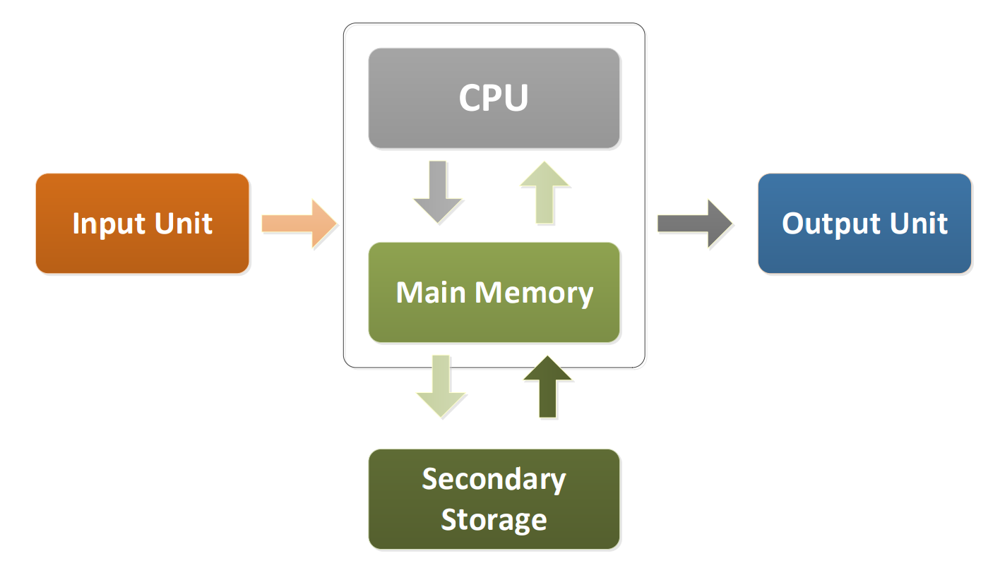

# Computer Programming

## Lecture 1

### Stored Program Computer (Von Neumann Machines)



* CPU: read and execute **instructions** from main memory
* Main Memory: *fast* **storage** of active program and data
* Secondary Storage: *slow* **storage** of program and data, maintain them after shutting down

### Programming Languages

* Machine Language, *directly* understood by the computer, **binary code**
* Symbolic Language, English-like *abbreviations*, **assembly language**
* High-level Language

### Basic Concepts of Programming

* (External View) Input->Process->Output
* (Internal View) Computer Program = Instructions (with Logic Flow) (with Data Access)
    * Instructions = **predefined actions**
    * Logic Flow = *arrangement* of instructions
    * Data = Variable + Constant


### Building C++ Program

* Writing source code
* Preprocessing
* Complication
	* Check *syntax*
	* Source code -> **Object code (.obj)**
	* Every source code has corresponding object code
* Linking
	* Object code + Library -> **Executable (.exe)**
	* Library/SDK/Package
	* Every project has only one executable

### C++ Program Framework

```cpp
/* The traditional first program in honor of
  Dennis Ritchie who invented C at Bell Labs
  in 1972 */

#include <iostream>
using namespace std;

void main()
{
  cout << "Hello, world!\n";
}
```

* `#include <iostream>`:  library `iostream` contains the definition of `cout`
* `using namespace std;`:  can use `cout` as `std::cout`
* `void main()`: the **starting point** of the program, first function to be called
* `cout`: console output
* `<<`: output (insertion) operator
* `"Hello, world!\n"`: **literal** (character string)

#### Object - cout
* `\` + character = **escape sequence**
* `\n`: newline
* `\\`: character `\`
* `\"`: character `"`
* `endl`: `\n`

#### Tokens
* **keywords**: data type, flow control, syntax keywords
* **identifiers**: variables, objects, functions
* string constants
* numeric constants
* operators
* punctuators

#### Identifiers
* unique
* cannot use keywords
* can only be composed by **letters, digits, underscores (\_)**, no hyphen (-)
* **cannot begin with digits**

#### Variables and Constants
* stored in **memory**, expires after the program execution
* attributes: **type, name, scope**
* scope: where the variable can be accessed, also identifier conflict domain


## Lecture 2

### Variable Types

#### Integers

* `int` (4 bytes = 32 bits), range $[-2^{31},2^{31}-1]$
* `short` (2 bytes)
* `long` (8 bytes)
* `unsigned(=unsigned int)`, range $[0, 2^{32}-1]$

##### two's complement


#### Character and String

* `char` (1 byte = 8 bits) : single character, enclosed by single quotation mark `''`
* `char*`, double quotation mark `""`

```cpp
char lecture[] = "CS2310 Lecture02";
char * lecture = "CS2310 Lecture02";
```


#### Floating Numbers

* `float` (4 bytes)
* `double` (8 bytes)

#### `sizeof` operator

* `sizeof(variable)` or `sizeof(type)`
* result is **bytes** in unsigned integer

#### Data type conversion

##### Implicit type conversion

* binary (as opposed to unary) expressions (e.g. `x + y`) **promote to high rank**
* assignment (e.g. `x = y`) **convert to the type on the left**

##### Explicit type conversion

may change or invalidate value

### Variable Scope

#### Local Variables

**Declared in a block {}** and can only be accessed in the block

#### Global Variables

Declared in the global sections, outside any blocks

**Local variable has higher priority** than the global variable of the same name

#### Namespace

* scope operator `::`
* only using `::` = global scope

### Operators

#### Terminology

* **operands** are values that used to calculate
* **expression** is a combination of constants, variables and function calls that **evaluate to a result**

#### Assignment Operator `=`

* `variable = expression`
* **assignment statement has a value** equal to `expression`

#### Increment & decrement Operators `++` `--`

```cpp
int x, y;

x = 10;
y = (x++) + (x++);
cout << y << endl; // 20

x = 10;
y = (x++) + (++x);
cout << y << endl; // 22

x = 10;
y = (++x) + (x++);
cout << y << endl; // 22

x = 10;
y = (++x) + (++x);
cout << y << endl; // 24
```


#### Division & modulus operators `/` `%`

**quotient** + division remainder (integer division only)

### Precedence & Associativity

|            Precedence            |                           Operator                           | Associativity |
| :------------------------------: | :----------------------------------------------------------: | :-----------: |
| 2<br />unary<br />variable left  | `a++` `a--` (**postfix** incdec)<br />`a()` (function call)<br />`a[]` (subscript)<br />`.` `->` (member access) |     `->`      |
| 3<br />unary<br />variable right | `++a` `--a` (**prefix** incdec)<br />`+a` `-a` (unary plus / minus)<br />`!` `~` (logical NOT; bitwise NOT)<br />`(int)` (**type cast**)<br />`*a` (dereference)<br />`&a` (address-of)<br />`sizeof` | **Right** |
|                5                 |                      `a*b` `a/b` `a%b`                       |     `->`      |
|                6                 |                       `a+b` `a-b`                        |   `->`    |
|              7               |                    `<< ` `>>`                    |     `->`      |
| 9 | `<` `<=` `>` `>=` | `->` |
| 10 | `== !=` | `->` |
| 11 | `a&b` (bitwise AND) | `->` |
| 12 | `a^b` (bitwise XOR) | `->` |
| 13 | `a|b` (bitwise OR) | `->` |
| 14 | `a&&b` (logical AND) | `->` |
| 15 | `a|b` (logical OR) | `->` |
| 16<br />binary<br />variable left<br />expression right | `a?b:c` (ternary conditional)<br />`=` (**assignment**)<br />`+=` `-=` `*=` `/=` `%=` `<<=` `>>=` `&=` `^=` `|=` | **Right** |


## Lecture 5

### Array definition

**DO NOT USE VARIABLE AS ARRAY SIZE**


## Lecture 9

### Pointer

```cpp
#include <cstdio>
int x, y;
int main () {
    int *p1, *p2;
    x = 10;
    y = 12;
    p1 = &x;
    p2 = &y;
    *p1 = 5; // x = 5
    *p2 = *p1 + 10; // y = x + 10 = 15
}
```

* `int *p1`: declare a pointer
* `*p1`: **dereference**, the value of pointed variable; **can modify pointed variable**
* `&x`: **reference**, the address of variable

### Constant Pointer and Pointer to Constant

* **Constant Pointer**: Address is constant, cannot change to point other variables
* **Pointer to Constant**: Can change pointed address, cannot change pointed variable from pointer but can change from variable itself

```cpp
int main () {
    // constant pointer
    int x = 10;
    int y = 12;
    int *const p1 = &x;
    *p1 = 5; // OK
    // p1 = &y; // Error
    printf("%d %d\n", x, *p1);
    // constant pointer can only point to one specific variable
    // i.e., its address is constant

    // pointer to constant
    const int *p2 = &x;
    // *p2 = 5; // Error
    p2 = &y; // OK
    y = 15;
    printf("%d\n", *p2); // 15
    // pointer to constant can point to different variables
    // the pointed variable cannot be changed from the pointer
    // but can be changed from the variable itself
}
```

### Call By Pointer and Reference

```cpp
void swap(int *a, int *b) { // *a and *b store the address of x and y
    int tmp = *a; // here * is dereference operator
    *a = *b; // to get x and y values
    *b = tmp;
}

void swapByRef(int &a, int &b) { // a and b are aliases of x and y
    int tmp = a; // they store the values of x and y
    a = b;
    b = tmp;
}

int main () {
    int x = 10, y = 12;
    swap(&x, &y); // address of x and y are passed
    printf("%d %d\n", x, y);
    swapByRef(x, y); // x and y are passed
    printf("%d %d\n", x, y);
}
```

### Reference

* reference is **alias** of a variable
* reference is **constant pointer**
* must be **initialized** in the declaration and cannot be pointed to another variable

```cpp
    int n = 10;
    int &ref = n; // equiv. int* const ref = &n;
    ref = 5; // n = 5
    
    // int &ref0; // Error: must be initialized
    // int &ref1 = 100; // Error: must be initialized with a variable
    const int &ref2 = 100; // OK
    int m = 15;
    const int &ref3 = m; // OK
    m = 20; // OK
    // ref3 = 20; // Error: ref3 is a constant reference
```

### `main()` arguments

```cpp
int main(const int argc, const char** argv) {
	for (int i = 0; i < argc; i++)
        printf("%s\n", *(++argv));
}
```

### File I/O

```cpp
#include <fstream>
ifstream fin; // variable fin
ofstream fout; // variable fout
fin.open("input.txt");
fin >> x;
fin.close();
fout.open("output.txt");
fout << x;
fout.close();
```

#### Open Mode

`open(filename, mode)`

* `mode=in`, `mode=out`, `mode=binary`

#### I/O Failures

* `fin.fail()`
* `fin.eof()`
    * EOF can also be detected by `while(fin >> x)`. In case of EOC return false

##  Lecture 10

### Pointer Copy

#### Copy the Address

```cpp
p = q;
```

By copying the address, changing the value of `*p` will also change `*q` as they point to the same variable.

#### Copying the content

```cpp
*p = *q;
```

By copying the content, changing the value of `*p` will not change `*q` as they point to different variables though starting value is the same.


### `NULL` pointer

```cpp
int *ptr1 = NULL; // or
int *ptr2 = 0;
```

The pointer points to nothing. Used to **initialize** the pointer.


### Pointer and Array

Array-like notation can be used to pointer.

```cpp
int num[2] = {40, 50};
int *p = num;
p[0] = 400;
p[1] = 500;
num = p; // illegal
```

Do notice that **pointer operation cannot be applied to array**.

This is because:

* `num` is **a constant pointer** pointed to `num[0]`
* `p` is **a pointer variable**

#### pointer `++` operator

Additionally, `++p` increments the content of `p` (which is an address) by `sizeof(int)` buyes

```cpp
int *p = num;
*p = 400; // num[0] = 400;
++p; // p = num+1=&(num[1])
*p = 500; // num[1] = 500;
```

* `num+i` is the address of `num[i]`
* `num+i=&(num[i])`
* `*(num+i)=num[i]`

#### Pointer and 2D array

for a 2D array `int a[m][n]`:

* `a[i] (i=0, 1, ..., m-1)` is **the address of the first element** of `i`-th row
* use `int *p = a[i];` to manipulate `i`-th row as one 1D array

```cpp
int a[4][3];
int *p = a[0]; // or int *p = a;
for (int i = 0; i < 12; i++) {
    cout << *p << endl;
    p++;
}
```

#### Char Pointer and Array

```cpp
char s[] = "abc";
s = "abcd"; // illegal
```

This is because `s` is a **constant pointer** pointed to `s[0]`. `"abcd"` is at a different memory address, and `s` cannot change the pointed variable.

Also, `cin >> s` can cause array out-of-bound.

Use `cin.getline(s, 5);` instead (read at most 4 characters).

#### Passing arrays to functions

Since arrays are already pointers, passing arrays is always call-by-pointer.

```cpp
double sum(int *a); // is the same as
double sum(int a[]);
```


### Dynamic Memory Allocation

```cpp
int *p = new int; // (*p) can access some int variable
int *p = new int(10); // this is only the starting value of (*p)
// and can be changed
char *p = new char('a');

delete p; // DELETE (*p), NOT DELETE p itself
// *p = 10; // illegal
p = NULL;
```

#### Dynamic Arrays

```cpp
int *p = new int[20];
char *p = new char[20];

delete [] p;
p = NULL;
```

#### 2D Dynamic Arrays

```cpp
int **p = new int*[n];
for (int i = 0; i < n; i++) {
    p[i] = new int[3];
}

for (int i = 0; i < n; i++) {
    delete [] p[i];
}
delete [] p;
```

### Copy Constructor

Besides **default and parameterized** constructor, can use another object of the **same class** to initialize the variable

If no user-defined copy constructor, default copy contsructor is provided (member-wise copy)

#### Shallow Copy

For pointer, only address is copied.

```cpp
class Student {
    public:
    int *pID;
    int age;
    Student(int id, int a) {
        pID = new int(id);
        age = a;
    }
    ~Student() {
        delete[] pID;
        pID = NULL;
    }
    // default copy constructor
}

Student s1(123456, 20);
Student s2(s1);
```

`s1.pID` and `s2.pID` points to the same address. When `s1` is destructed, `s1.pID` is deleted, and then `s2` destructor tries to delete it again, which causes error.

#### Deep copy

Copy the value of pointer.

```cpp
Student (const Student &s) {
    age = s.age;
    pID = new int(*s.pID);
}
```

