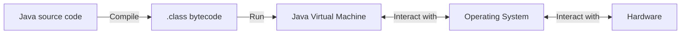
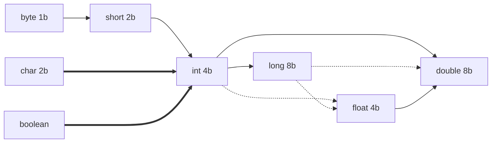

# CS2312 - Problem Solving and Programming (Java)

## 1. Introduction

### How does Java program run?

- **JRE** (Java Runtime Environment): a package enables Java program to run on a device. Includes JVM (Java Virtual Machine) and first-party libraries.
- **JDK** (Java Development Kit): extension of JRE, includes tools for developing Java program.
- **JVM**: a virtual machine that runs Java bytecode. A software implementation of a computer that executes programs like a physical machine.
- `.class` is not platform-dependent, but JVM is platform-dependent.



An example of compiling and running Java program:

1. Source Code: `Main.java`
2. Compile: `javac Main.java`
3. Bytecode (= machine language for JVM): `Main.class`
4. Execute: `java Main`

### Packages

#### Import Existing Packages

```java
import java.util.Scanner; // import a specific class
import javax.swing.*; // import all
```

`java.lang` is automatically imported. It includes `String`, `System`, `Math`, etc.

#### User-defined Packages

```java
// src/org/random/util/RandomUtil.java
package org.random.util;
public class RandomUtil {
    public static int getRandomInt(int, int); // implementation omitted
}

// src/org/random/util/StringUtil.java
RandomUtil.getRandomInt(1, 10); // no need to import for a class in the same package

// src/org/random/user/controller/UserController.java
import org.random.util.RandomUtil;
RandomUtil.getRandomInt(1, 10); // import needed for a class in another package
```

- Package is organized in a hierarchical structure. The **package name is the path to the package directory**.
- Refering to a class in the same package does not require import. `private` members are accessible within the same package.
- Refering to a class in another package requires import. `protected` members are accessible within the same package and subclasses. (e.g. `org.random.util.RandomUtil` is a subclass of `org.random.util`)

### Data Types and Variables

- **Primitive Data Types**: `int`, `double`, `boolean`, `char`, `byte`, `short`, `long`, `float`
- **Reference types: a reference to an object**. (object: an instance of a class)
- Variables:
    - Variables of primitive types store the actual value.
    - Variables of reference types store the reference to the object.
- **Variables must be explicitly initialized** before use.
- **Variables are passed by value**. (For reference types, the value is the reference to the object. Caller and callee share the same object. Changes on the object in callee will be reflected in caller.)

| Type | Size | Range |
| ---- | ---- | ----- |
| `byte` | 1 byte | -128 to 127 |
| `short` | 2 bytes | -32,768 to 32,767 |
| `int` | 4 bytes | -2,147,483,648 to 2,147,483,647 |
| `long` | 8 bytes | -9,223,372,036,854,775,808 to 9,223,372,036,854,775,807 |
| `float` | 4 bytes | ±1.40129846e-45 to ±3.40282347e+38 (6-7 significant decimal digits) |
| `double` | 8 bytes | ±4.94065645841246544e-324 to ±1.79769313486231570e+308 (15 significant decimal digits) |
| `char` | 2 bytes | 0 to 65,535 (unsigned) |
| `boolean` | (not specified) | `true` or `false` |

Literal values:
- Integer prefix: `0b` for binary, `0x` for hexadecimal.
- Integer suffix: `L` for `long`.
- Floating-point suffix: `f` for `float`, `d` for `double`.
- Default type: integer literal is `int`, floating-point literal is `double`.
- escape sequence: `\n` for newline, `\t` for tab, `\"` for double quote, `\\` for backslash. Or use hexadecimal escape sequence: `\u0000` to `\uFFFF`.

#### Primitive Type Casting

- **Implicit casting**: Will be done automatically by the compiler.
    - Order: `byte` → `short` → `int` → `long` → `float` → `double`
    - `int` → `float`, `long` → `float`, `long` → `double` may incur precision loss.
- **Explicit casting**: Must be done manually by claiming the type in parentheses.
    - Reverse order of implicit casting.
    - Additionally: `boolean` / `char` ↔ `int` or other integer types.
    - May incur precision loss / overflow.
    - Example: `char c = (char) 65;`



#### `final`

- `final` keyword can be used to declare a constant.
- More precisely, it declares a variable that can only be assigned once.
- `final` variables must be initialized when declared or in the constructor.

### Arrays

- **Array is an reference type**. It stores the reference to the array object.
- Array only accepts elements of the same type.
- Initialization:
    - `int[] arr = new int[10];`
    - `int[] arr = {1, 2, 3};`
    - `int[] arr = new int[] {1, 2, 3};`
- Array's size is fixed after initialization.
- **for-each loop**: `for (int i : arr) { ... }`
- `.toString()` method of an array returns a string representation of the array.
    - For example, `int[] arr = {1, 2, 3};` → `arr.toString() == "[1, 2, 3]"`
    - For primitive types, the string representation is the literal value.
    - For reference types, the string representation contains the class name and the hash code of the object.
    - Can be overriden by `@Override public String toString() { ... }` in the class definition.
    - Do not need to call when printing an array: `System.out.println(arr);` - `.toString()` is automatically called in any of above cases.
- Multi-dimensional array: Nested 1D arrays. Elements in each 1D array is stored in a contiguous block of memory.
- Ragged array: 2D array with different lengths of 1D subarrays.

```java
String[][] helpers = {
    {"Helena", "Kit", "Jason"},
    {"Helena", "Kit", "Jason"},
    {"Kit", "Jason"},
    {"Helena", "Kit"},
    {"Helena"}
};
```

#### Array Methods

- `Array.sort(arr)`: sort the array in ascending order.
- Copying an array:
    - Copying the reference: `int[] arr2 = arr1;` (`arr2` and `arr1` refer to the same array object.)
    - Copying as a new array: `int[] arr2 = Arrays.copyOf(arr1, arr1.length);`
- `Arrays.fill(arr, value)`: fill the array with the specified value.
- `Arrays.equals(arr1, arr2)`: check if two arrays are equal.

### Strings

- **String is an reference type**.
- To check is a string is not `null` and not empty: `if (str != null && "".equals(str)) { ... }`
- `==` checks **if two references point to the same object**.
- For string comparison, use `.equals()` method.

| Method | Example | Remark |
| ------ | ------- | ------ |
| `.length()` |`"Hello".length() == 5` |
| `.charAt(index)` |`"Hello".charAt(0) == 'H'` |
| `.substring(start)` | `"Hello".substring(1) == "ello"` | `start` inclusive, till the end |
| `.substring(start, end)` | `"Hello".substring(1, 3) == "el"` | `start` inclusive, `end` exclusive |
| `.equals(str)` | `"Hello".equals("Hello") == true` |
| `.indexOf(str)` | `"Hello".indexOf("l") == 2` |
| `.indexOf(str, fromIndex)` | `"Hello".indexOf("l", 3) == 3` <br> `"Hello".indexOf("l", 4) == -1` | `fromIndex` inclusive |
| `.lastIndexOf(str)` | `"Hello".lastIndexOf("l") == 3` |
| `.replace(oldChar, newChar)` | `"Hello".replace('l', 'L') == "HeLLo"` |
| `String.valueOf(value)` | `String.valueOf(123) == "123"` | convert number to string |
| `String.join(delimiter, str1, str2, ...)` | `String.join("-", "Hello", "World") == "Hello-World"` |
| `.split(delimiter)` | `"Hello-World".split("-") == ["Hello", "World"]` | returns an array of strings |
| `.trim()` | `" Hello ".trim() == "Hello"` | remove leading and trailing whitespaces |

```java
String greeting = "Hello";
String s;
s = 1000 + " " + greeting; // "1000 Hello"
s = 1000 + ' ' + greeting; // "1032Hello"
// since + is left-associative, 1000 + ' ' is evaluated first -> 1032
// then 1032 + greeting -> 1032.toString() + greeting -> "1032Hello"
```

#### `StringBuilder`

- **String is immutable**. 
- Any modification on a string will create a new string object.
- For example: `String str = "Hello"; str += " World";` will create a new string object `"Hello World"` and assign it to `str`.
- To improve performance, use `StringBuilder` which can manipulate characters in a string without creating a new string object.

```java
String name = "World";
StringBuilder sb = new StringBuilder("Hello");
sb.append(name);
sb.replace(0, 1, "h"); // .replace(start, end, str)
sb.delete(0, 1); // .delete(start, end)
sb.insert(0, "H"); // .insert(index, str)
sb.reverse();
System.out.println(sb.toString()); // "dlroWolleH"
```

### Operators

| Precedence | Operator | Associativity |
| ---------- | -------- | ------------- |
| HIGHEST | `()` | → |
| | `expr++` `expr--` | ← (unary) |
| | `++expr` `+expr` `~expr` (bitwise NOT) <br> `--expr` `-expr` `!expr` (logical NOT) | → (unary) |
| | `*` `/` `%` | → |
| | `+` `-` | → |
| | `<<` `>>` `>>>` | → |
| | `<` `<=` `>` `>=` `instanceof` | → |
| | `==` `!=` | → |
| | `&` (bitwise AND) | → |
| | `^` (bitwise XOR) | → |
| | `|` (bitwise OR) | → |
| | `&&` (logical AND) | → |
| | `||` (logical OR) | → |
| | `?:` | ← (ternary) |
| LOWEST | `=` <br> compound assignment operators | ← |

### Control Flow

Basically identical to C++.

**Label Statement**: A statement with a label. Can be used to `break` / `continue` the outer loop.

```java
outer: for (int i = 0; i < 10; i++) {
    for (int j = 0; j < 10; j++) {
        if (i == 5 && j == 5) {
            break outer;
        }
    }
}
```

### Input and Output

#### STDOUT

- `System.out.print()`: print a string without a newline. Parameters can be any primitive types or objects.
- `System.out.println()`: print a string with a newline. Parameters can be any primitive types or objects, or nothing (blank line).
- `System.out.printf(str, ...)`: C-style formatted output. `String.format(str, ...)` returns a formatted string.

Conversion characters:

| Conversion Character | Description | Example |
| -------------------- | ----------- | ------- |
| `%b` | boolean | `true` |
| `%c` | character | `a` |
| `%d` | decimal integer | `123` |
| `%x` | hexadecimal integer | `7b` |
| `%o` | octal integer | `173` |
| `%f` | fixed-point floating-point | `1234.56` |
| `%e` | scientific notation floating-point | `1.23456e+03` |
| `%s` | string | `Hello` |
| `%%` | percent sign | `%` |

Use `%d` to print a floating-point number as an integer will automatically round down.

#### STDIN

- `import java.util.Scanner;`
- `Scanner sc = new Scanner(System.in);`
- `.nextInt()`, `.nextDouble()`, `.nextBoolean()`
- `.next()`: ignore first whitespaces, then read a string until next whitespace. (whitespace: space, tab, newline)
- `.nextLine()`: read a string until next newline. (newline is not stored in the string)
- `.close()`: close the scanner.

Example:

```java
s1 = sc.next(); // `Today`
s2 = sc.nextLine(); // `\tis a good day.`
System.out.println(s1);
System.out.println(s2);
```

Input:

```
    Today   is a good day.
(\tToday\tis a good day.\n)
```

Output:

```
Today
    is a good day.
(Today\n\tis a good day.\n)
```

| Behaviour | `next()` | `nextLine()` |
| --- | --- | --- |
| Leading spaces | Discarded | Included |
| Trailing whitespace or `\t` | Stop reading | Included |
| Trailing `\n` | Stop reading | Discarded |

#### File Output

- `import java.io.*;`
- `PrintWriter pw = new PrintWriter(new File("output.txt"));`
- `pw.println("Hello World");`
- `pw.close();`

Methods are identical to `System.out`.

#### File Input

- `import java.io.*;`
- `Scanner sc = new Scanner(new File("input.txt"));`
- `.hasNext()`: has next token (=non-whitespace string; false if no more content)
- `.hasNextLine()`: has next line (false if EOF)

```java
while (sc.hasNext()) {
    String line = sc.nextLine();
    System.out.println(line);
}
```

Methods are identical to `Scanner(System.in)`.

#### String I/O

- String Input: `Scanner sc = new Scanner(str);`
- String Output: Use `.toString()`, `StringBuilder`, `String.format()`, etc.

## 2. Object-Oriented Programming

### Terminology

- **Object-Oriented Programming**: a programming paradigm based on the concept of "objects".
- **Class**: a blueprint for creating objects.
- **Object**: an instance of a class.
- **Field**: a variable in a class. Instance fields are associated with an object. Static fields are associated with a class.
- **Method**: a function in a class.
- **Encapsulation**: hiding the implementation details (data and methods) of a class from the user.
- **Object Variable**: a variable that stores the **reference** to an object.
    - A `final` object variable cannot be assigned to another object. But the referenced object can be modified.

### Constructor

- A special method that is called when an object is created with `new`
- Name is the same as the class name
- No return type
- Be `public` (or `protected`), otherwise cannot be called outside the package
- Multiple constructors can be defined. They must have different parameter lists.
- You can call another constructor in the same class with `this(...)`. This must be the first statement in the constructor.

```java
public Employee(String name, double salary, Date hireDay) {
    this.name = name;
    this.salary = salary;
    this.hireDay = hireDay;
}
public Employee(String name, double salary, int year, int month, int day) {
    this(name, salary, new Date(year, month, day));
}
public Employee(String name, double salary) {
    this(name, salary, new Date()); // today
}
public Employee() {
    this("John Doe", 0.0);
}
```

Default constructor: `public Employee() {}`

- Initializes with no parameters.
- If no constructor is defined, a default constructor is automatically generated.
- If user-defined constructors are defined, the default constructor is not generated.
- Initializes all fields to default values: `0` for numeric types, `false` for `boolean`, `null` for reference types.

Practice of creating instances:

```java
// assume .toString() is overriden
System.out.println(new Employee()); // John Doe ($0.0) hired on 1970-01-01
// new Employee().toString() => (new Employee()).toString()
Employee smith = new Employee("Smith", 1000.0);
Employee john = new Employee("John", 2000.0, 2000, 1, 1);

// incorrect usage
// john.Employee("John", 2000.0, 2000, 1, 1); // error
// reason: john is an object variable, not a class name
// remind that constructors must be called with `new`

Employee[] staff = new Employee[3]; // all initialized to null; does not call constructors
staff[0] = new Employee("Smith", 1000.0);
```

### Using Objects

#### Object Variable

Object variable **does not store the object itself**. It stores the **reference** to the object.

Multiple object variables can refer to the same object.

```java
String s1 = "Hello";
String s2 = s1;
String s3 = "Hello";
System.out.println(s1 == s2); // true
System.out.println(s1 == s3); // false
System.out.println(s1.equals(s3)); // true
```

By default `==` operator for object variables compares if they refer to the same object.

`new` operator (or constructor) creates a new object and returns the reference to the object.

#### `null`

- `null` is a special value that represents "no object".
- Used to initialize object variables.
- Must check if an object variable is `null` before accessing its fields or methods.
- Or, handle `NullPointerException` with `try`-`catch` block.

```java
Employee e = null;

if (e != null) {
    System.out.println(e.getName());
}
```

#### Local Variables

- Local variables are declared inside a method or a block.
- **Local variables are not initialized automatically**.
- Accessing without initialization will cause compilation error.

```java
Day d1;
System.out.println(d1); // compile error
System.out.println(d1.toString()); // compile error

Day d2 = null;
System.out.println(d2); // null
System.out.println(d2.toString()); // NullPointerException
```

### Implicit Parameter and `this`

```java
Employee e = new Employee("John", 2000.0, 2000, 1, 1);
e.raiseSalary(100.0);
```

- Explicit parameter: `0.0`
- Implicit parameter: `e` - the caller object
- `this`: a reference to the implicit parameter (the caller object)

```java
public void raiseSalary(double byPercent) {
    double raise = salary * byPercent / 100;
    salary += raise;
}
```

`this` can be omitted most of the time.

However, to distinguish explicit parameters and instance fields, `this` is required.

```java
public Day(int year, int month, int day) {
    this.year = year;
    this.month = month;
    this.day = day;
}
```

`this()` can be used to call another constructor in the same class.

```java
public Day(int year) {
    this(year, 1, 1);
}
```

### Access Modifiers

| | `public` | `protected` | (default) | `private` |
| --- | --- | --- | --- | --- |
| Same class | + | + | + | + |
| Same package | + | + | + | - |
| Subclass | + | + | - | - |
| Other packages | + | - | - | - |

```java
package org.random.package1;
public class Class1 {
    static public int a = 1;
    static protected int b = 2;
    static int c = 3;
    static private int d = 4;
    static public void test() {
        System.out.println(a); // +
        System.out.println(b); // +
        System.out.println(c); // +
        System.out.println(d); // +
    }
}
public class Class2 { // same package
    public static void main(String[] args) {
        System.out.println(Class1.a); // +
        System.out.println(Class1.b); // +
        System.out.println(Class1.c); // +
        System.out.println(Class1.d); // -
    }
}
```

```java
package org.random.package2;
import org.random.package1.Class1;
public class Class1Subclass extends Class1 { // subclass
    public static void main(String[] args) {
        System.out.println(Class1.a); // +
        System.out.println(Class1.b); // +
        System.out.println(Class1.c); // -
        System.out.println(Class1.d); // -
    }
}
public class Class4 { // different package
    public static void main(String[] args) {
        System.out.println(Class1.a); // +
        System.out.println(Class1.b); // -
        System.out.println(Class1.c); // -
        System.out.println(Class1.d); // -
    }
}
```

- `public` methods: constructors, getters, setters, practical methods
- `private` methods: helper methods
- `public` fields: except for `final` fields, should be avoided
- `private` fields: instance variables

### Getters and Setters

Benefits of encapsulation:

- **protect data from accidental corruption**
- **easier to locate bugs** - only methods can modify the data.
- **easier to change implementation** - users can still use the same methods.

**Avoid unnecessary getters and setters**.

1. If the field is not designed to be modified, do not provide a setter.

```java
class Employee {
    private String name;
    private double salary;
    private Day hireDay; // should use final Day hireDay;

    public void setHireDay(int year, int month, int day) {
        hireDay = new Day(year, month, day);
    } // bad design
}
```

2. If the setter may cause inconsistency, do not provide a setter.

```java
class Day {
    private int year, month, day;
    public void setDay(int day) {
        this.day = day;
    } // bad design - may create an invalid date
    // e.g. 2016-02-30 -> cannot validate without checking the whole year and month
}
```

3. Avoid returning reference from a getter. (If the object is mutable)

```java
class Employee {
    public Day getHireDay() { return hireDay;} 
}

// main()
Day d = harry.getHireDay();
d.advance(); // harry's hireDay is changed
```

Both `d` and `harry.hireDay` refer to the same Day object.

So `d.advance()` which mutates its object will also change `harry.hireDay`.

This breaks encapsulation.

Solution: return a copy of the object.

```java
class Employee {
    public Day getHireDay() { return new Day(hireDay); }
}
```

### `final`

1. Method constants

```java
public static void main(String[] args) {
    final double CM_PER_INCH = 2.54;
}
```

2. Class constants (`static final`)

```java
public class RandomUtil {
    public static final long SEED = 1234567890;
}
```

3. `final` instance fields

```java
public class Employee {
    private final String name;
    private double salary;
    private final Day hireDay;

    public Employee(String name, double salary, int year, int month, int day) {
        this.name = name;
        this.salary = salary;
        this.hireDay = new Day(year, month, day);
    }
}
```

`final` instance fields must be initialized when declared or in the constructor.

4. `final` methods (cannot be overriden by subclasses)

### `static`

1. Class constants (`static final`)

2. Class-wide fields and methods

```java
class Employee {
    private int id;
    private String name;

    private static int nextId = 1; // class-wide field

    public Employee(String name) { this.name = name; id = nextId++; }
    public String toString() { return name + " (" + id + ")"; }

    public static int getNextId() { return nextId; } // class-wide method
}
```

Class-wide fields and methods can be accessed with `ClassName.name` or `InstanceName.name`. Using class name is preferred.

- For a non-static field, each instance has its own copy.
- For a static field, all instances share the same copy.

### Parameter Passing

Java use **pass-by-value** for all parameters.

- A primitive type parameter directly stores the value.
- Modify the value of a primitive type parameter will not affect the caller.
- A reference type parameter stores the reference to the object.
- Modify the value of a reference type parameter will affect the caller.

```java
public static void swap(Employee x, Employee y) {
    Employee temp = x;
    x = y;
    y = temp;
}

// main()
swap(harry, carl);
```

However, `swap()` does not work as expected. Reason:

- Because of pass-by-value, modifications on value of `x` and `y` will not affect `harry` and `carl`.
- The value of an object variable is the reference to the object.
- The `swap()` function changes value of `x` and `y` - make them refer to different objects.
- What `harry` and `carl` refer to is not changed.

## 3. Inheritance

### Terminology

- **Subclass**: the new class that inherits from the existing class.
- **Superclass**: the class that subclasses inherit from.
- **is-a relationship**: a subclass is a type of its superclass.
- **Inheritance**: a subclass inherits (reuses) the fields and methods of its superclass. **Constructors are not inherited**.
- **Overriding**: a subclass can override (redefines) the **non-static** methods of its superclass. **Static methods and fields are not overridden** but **hidden**.
- **Polymporphism**: a subclass object can be treated as its superclass object. (e.g. `Employee` object can be treated as `Object` object.). This is checked **at compile time**.
- **Dynamic Binding**: the **non-static method** called by a subclass object is determined **at runtime**. (e.g. Even `Employee` is treated as `Object`, `Employee.toString()` is called if `toString()` is overridden in `Employee`.)

### `extends`

```java
class A {
    int objectVar = 0;
    static int classVar = 0;
    A() {
        objectVar++;
        classVar++;
    }
    void objectVarInc() { objectVar++; }
    void classVarInc() { classVar++; }
    static void classVarIncStatic() { classVar++; }
}

class B extends A {
    // inherits objectVar
    // inherits staticVar
    // automatically generated constructor: B() { super(); }
    void objectVarInc() { objectVar++; }
    void classVarInc() { classVar++; }
    static void classVarIncStatic() { classVar++; }
}

A a = new A(); // objectVar = 1, classVar = 1
a.objectVarInc(); // objectVar = 2, classVar = 1
a.classVarInc(); // objectVar = 2, classVar = 2
a.classVarIncStatic(); // objectVar = 2, classVar = 3

B b = new B(); // super(), i.e. A() is called; b.(A.objectVar) = 1, A.classVar = 4
b.objectVarInc(); // b.(A.objectVar) = 2, b.(B.objectVar) = 1, A.classVar = 4
b.classVarInc(); // b.(A.objectVar) = 2, b.(B.objectVar) = 1, A.classVar = 4, B.classVar = 1
b.classVarIncStatic(); // b.(A.objectVar) = 2, b.(B.objectVar) = 1, A.classVar = 4, B.classVar = 2

A a1 = b; // implicit upcasting; a1 and b refer to the same object
// dynamic binding; a1 is a B object, so B.objectVarInc() is called
a1.objectVarInc(); // b.(A.objectVar) = 2, b.(B.objectVar) = 2, A.classVar = 4, B.classVar = 2
// dynamic binding; a1 is a B object, so B.classVarInc() is called
a1.classVarInc(); // b.(A.objectVar) = 2, b.(B.objectVar) = 2, A.classVar = 4, B.classVar = 3
// NO dynamic binding for STATIC methods; A.classVarIncStatic() is called
a1.classVarIncStatic(); // b.(A.objectVar) = 2, b.(B.objectVar) = 2, A.classVar = 5, B.classVar = 3
```

### Access Modifiers

| | `public` | `protected` | (default) | `private` |
| --- | --- | --- | --- | --- |
| Same class | + | + | + | + |
| Same package | + | + | + | - |
| Subclass | + | + | - | - |
| Other packages | + | - | - | - |

A class can only be `public` or (default).

Best Practice: Use getter/setter and `private` fields. Avoid `protected` fields because it breaks encapsulation.

```java
class Employee {
    private double salary;
    public double getSalary() { return salary; }
}
class Manager extends Employee {
    private double bonus;
    public double getSalary() { return super.getSalary() + bonus; }
}
```

### Subclass Constructor

- Invoke `super()` (the superclass constructor) **as the first statement**, or
- Do not use `super()` at all, the superclass default (parameterless) constructor is called automatically.

```java
class Employee {
    private String name;
    private double salary;
    public Employee() { this("John Doe", 0.0); } // this() calls another constructor in the same class
    public Employee(String name, double salary) {
        this.name = name;
        this.salary = salary;
    }
}
class Manager extends Employee {
    private double bonus;
    public Manager() { super(); }
    public Manager(String name, double salary, double bonus) {
        super(name, salary); // must be the first statement
        this.bonus = bonus;
    }
}
```

If no constructor is defined for class `Manager`, the default constructor `Manager()` is automatically generated.

```java
public Manager() { super(); }
```

If `super()` is not called in `Manager()`, it will be called implicitly.

```java
public Manager() {
    // super(); // implicitly called
    this.name = "John Doe";
    this.salary = 0.0;
    this.bonus = 0.0;
}
```

Best Practice: Always define a default constructor.

### `final`

- `final` class cannot be subclassed.
- `final` method cannot be overriden.
- `String` is a `final` class. Therefore, it is impossible to subclass `String` or override its methods.

### Casting

```java
Manager m1 = new Manager("John", 2000.0, 1000.0);
Employee e1 = m1; // implicit upcasting
Manager m2 = (Manager) e1; // explicit downcasting
```

- **Upcasting**: **from sub to super**. Implicit.
- **Downcasting**: **from super to sub**. Explicit. May cause `ClassCastException` at runtime.
- Use `instanceof` to check if a superclass object is an instance of a subclass, before downcasting.

```java
Employee[] staff = new Employee[3];
staff[0] = new Employee(...);
staff[1] = new Manager(...);
staff[2] = new Employee(...);
for (Employee e : staff) {
    if (e instanceof Manager) {
        Manager m = (Manager) e;
        // do something with m
    }
}
```

Dynamic binding can eliminate the need of downcasting in most cases. Just override `.getSalary()` in `Manager`.

### `abstract`

- Abstract methods have no implementation.
- **Only abstract classes can have abstract methods**.
- Abstract class can contain fields and concrete methods.
- **Abstract classes cannot be instantiated**.
- **Subclasses of abstract classes must override all abstract methods**.
- Constructors and static methods cannot be abstract.

Reason: constructor = can be called with `new()`, static method = can be called with `ClassName.method()`.

```java
public abstract class Employee {
    private String name;
    public abstract double getSalary();
}

public class SalariedEmployee extends Employee {
    private double annualSalary;
    public double getSalary() { return annualSalary / 12; }
}

public class HourlyEmployee extends Employee {
    private double hourlyRate;
    private double hours;
    public double getSalary() { return hourlyRate * hours; }
}
```

All `Employee` objects can now use `.getSalary()`.

Note: you can create an array `Employee[]` because this does not create any `Employee` objects.

Cannot be instantiated = cannot call `new Employee()`.

### `Object`

- `Object` is the superclass of all classes.
- defines `.equals()` and `.toString()`, provides default implementation.

```java
// define of Object.equals()
package java.lang.object.equals;
public boolean equals(Object obj) {...}

// the correct way to override equals()
class ClassName {
    @Override
    public boolean equals(Object obj) {...}
}
```

`@Override` annotation requires the method to be a valid override, i.e. have exactly the same parameter list as the superclass method. Therefore, it can detect errors like `public boolean equals(Employee e) {...}`.

Implementation:

```java
@Override
public boolean equals(Object obj) {
    if (this == obj) return true; // same object
    if (obj == null) return false; // null
    if (getClass() != obj.getClass()) return false; // different class
    Employee other = (Employee) obj; // downcasting
    return Objects.equals(name, other.name) && salary == other.salary && Objects.equals(hireDay, other.hireDay);
}
```

### `ArrayList` and Wrapper Classes

- `ArrayList` is a resizable array.
- Initialize: `ArrayList<Integer> list = new ArrayList<>();`
- Specify initial capacity: `ArrayList<Integer> list = new ArrayList<>(10);`
- The type must be a reference type. Cannot be primitive types (use their wrapper classes instead).
- Add to the end: `list.add(1);`
- Get element: `list.get(0);`
- Modify element: `list.set(0, 2);`
- Remove element: `list.remove(0);` (Complexity: O(n))
- Length: `list.size();`

---

- **Wrapper Class**: a class that wraps a primitive type.
- **Auto-boxing**: automatically convert a primitive type to its wrapper class. e.g. `Integer i = 1;`
- Auto-boxing is done by calling the static method `valueOf()` of the wrapper class. e.g. `Integer i = Integer.valueOf(1);`
- **Number**: a superclass of all numeric wrapper classes.
- Wrapper classes are **final** and **immutable** (like `String`).

---

Methods provided by `Integer`:

- `Integer.parseInt(str)`: static method, convert a string to an integer.
- `Integer.toString(i)`: static method, convert an integer to a string.

## 4. Interfaces

- Interface is a way to describe what (not how) a class can do.
- Interface can only contain:
    - **non-static** methods (no implementation; implicitly `public abstract`)
    - **static final** fields (constants; implicitly `public static final`)
    - Java 8+: **static** methods (with implementation; implicitly `public static`)
- A class can implements one or more interfaces.

```java
interface A {
    void f1();
    void f2();
}

interface B {
    void f3();
    void f4();
}

class C implements A {
    public void f1() { ... }
    public void f2() { ... }
}

class D implements A, B {
    public void f1() { ... }
    public void f2() { ... }
    public void f3() { ... }
    public void f4() { ... }
}

abstract class E implements A {
    public void f1() { ... }
    // f2() is not implemented
}

class F extends E {
    // f1() is inherited
    public void f2() { ... }
}
```

- An abstract class can implement an interface without implementing all methods.
    - Implemented methods can be inherited by subclasses.
    - Unimplemented methods must be implemented by subclasses.
- Note that abstract class can contain concrete non-static methods and fields.

```java
interface G {
    void f1();
    void f5();
}
class H implements A, G {
    public void f1() { ... }
    public void f2() { ... }
    public void f5() { ... }
}
```

- A class can implement multiple interfaces. If there are functions with same signature in different interfaces, they are regarded as the same function.
- In the above example, `A.f1()` and `G.f1()` are regarded as the same function.

```java
interface I extends A, B {
    void f5();
}
```

- An interface can extend multiple interfaces.
- In the above example, `interface I` has 5 method declerations: `A.f1()`, `A.f2()`, `B.f3()`, `B.f4()`, `I.f5()`.

```java
class J extends D implements I {
    // f1(), f2(), f3(), f4() are inherited
    public void f5() { ... }
}
```

- A class can simultaneously extend a superclass and implement interface(s). It can be abstract or concrete.

### Difference between Abstract Class and Interface

Similarities:

- Both cannot be instantiated.

Abstract class and interface can be used as data types. However, `new()` cannot be used to create an object.

```java
A a;
B b;
C c;
D d;
E e;

// upcasting: subclass -> superclass
a = new C(); // OK. C() is an A object.
b = new C(); // OK. Both C() and D() are B objects.
e = new F(); // OK. F() is an E object.

// downcasting: superclass -> subclass

c = (C) a; // OK. a is a C object.
d = (D) b; // ERROR. b is a C object, not a D object.
// downcasting may fail at runtime. Use instanceof to check.
if (b instanceof D) {
    d = (D) b;
}
```

- Both contain abstract methods. (interface methods are implicitly abstract)

Differences:

- Inheritance:
    - A class can only extend 1 abstract class, but can implement multiple interfaces.
    - A class can simultaneously extend a superclass and implement interface(s).
- Access Modifiers:
    - Abstract class can have `public`, `protected`, (default), `private` methods and fields.
    - Interface can only have `public` methods and fields.
- Shared Methods:
    - Abstract class can have concrete methods. They can be inherited or overridden by subclasses.
    - Interface can only have abstract methods. They must be implemented by subclasses if it is concrete.
- Constructors:
    - Abstract class can have constructors. This is useful for initializing fields.
    - Interface cannot have constructors.
- Fields:
    - Abstract class can have instance fields.
    - Interface can only have static final fields (constants).

An example of using abstract class and interface:

- A grader can only read / grade students' exercises.
- A student can only read / write exercises.

Design goal: use multi implements to allow the distribution of access rights.

```java
interface IReadWrite {
    void readAnswer();
    void writeAnswer(String);
}

interface IGrade {
    void readAnswer();
    void gradeAnswer();
}

class Student {
    private final String name;
    public Student(String);
    public void doExercise(IReadWrite x, String ans) {
        x.writeAnswer(ans);
    }
} // use interface as parameter

class Grader {
    private final String name;
    public Grader(String);
    public void gradeExercise(IGrade x) {
        x.gradeAnswer();
    }
}

class Exercise implements IReadWrite, IGrade {
    private final String question;
    private final String modelAnswer;
    private String studentAnswer;
    private int score;
    public Exercise(String, String);
    public void writeAnswer(String); // can only be called by Student
    public void readAnswer(); // can be called by both Student and Grader
    public void gradeAnswer(); // can only be called by Grader
    public String toString();
}
```

#### `Comparable`

- `java.lang.Comparable` interface.
- Java provides sorting methods for **comparable** objects.
- Usage:
    - `[]` C-style array: `Arrays.sort(arr);` where `java.util.Arrays` is imported.
    - Collections (e.g. `ArrayList`): `Collections.sort(list);` where `java.util.Collections` is imported.
- If a user-defined class wants to be sorted, it must implement `Comparable` interface.
    - The class implements `java.lang.Comparable<TypeName>` interface.
    - The class overrides `int compareTo(TypeName other)` method. The function is a three-way comparison:
        - Returns `-1` if `this` is less than `other`.
        - Returns `0` if `this` is equal to `other`.
        - Returns `1` if `this` is greater than `other`.

Example:

```java
class Employee implements Comparable<Employee> {
    private String name;
    private double salary;
    public Employee(String name, double salary) { ... }
    public int compareTo(Employee other) {
        if (salary < other.salary) return -1;
        if (salary > other.salary) return 1;
        return 0;
    }
}

Employee[] staff = new Employee[3];
// ...
Arrays.sort(staff);
ArrayList<Employee> list = new ArrayList<>();
// ...
Collections.sort(list);
```

#### `Cloneable`

- `java.lang.Cloneable` interface.
- **Copying** an object variable = copying the reference to the object. The two variables refer to the same object.
- **Cloning** an object = creating a new object with the same value. The two variables refer to different objects.
- For a user-defined class to be cloned, it must implement `Cloneable` interface.
    - The class implements `java.lang.Cloneable` interface.
    - The class overrides `Object clone()` method. The function returns a copy of the object.

Example:

```java
class Employee implements Cloneable {
    private String name;
    private double salary;
    private Day hireDay;
    public Employee(String name, double salary, int year, int month, int day) { ... }
    public Employee clone() throws CloneNotSupportedException {
        Employee cloned = (Employee) super.clone();
        cloned.hireDay = (Day) hireDay.clone();
        return cloned;
    }
}
```

1. `super.clone()` calls `Object.clone()`, which creates a shallow copy of the object.
2. In shallow copy, primitive type fields are copied, but reference type fields still refer to the same object.
3. We need to update the reference type fields to refer to a new object.
4. For `Day` object, since `Day.clone()` is already implemented, we can just call it. Or, we can create a new `Day` object with the same value: `new Day(hireDay.getYear(), hireDay.getMonth(), hireDay.getDay())`.
5. For `String` object, since `String` is immutable, we do not need to clone it.

For example, `newEmployee = oldEmployee.clone();` creates a new `Employee` object with the same value as `oldEmployee`.

Now, `newEmployee.name` and `oldEmployee.name` refer to the same `String` object. But `newEmployee.hireDay` and `oldEmployee.hireDay` refer to different `Day` objects.

If `oldEmployee.name` is changed, it refers to a new `String` object. But `newEmployee.name` still refers to the old `String` object (because its reference is not changed).

Therefore, immutable objects are by natural clone-independent.

### Nested Classes

A class defined inside another class.

Access:
- Outer class have full access to inner class's methods and non-static fields. (even private)
- Inner class have full access to outer class's methods and fields. (even private)
- Static fields cannot exist in inner class, unless they are `final static`.

```java
private final static int INNER_CLASS_CONSTANT = 1; // OK
private static int INNER_CLASS_STATIC = 2; // ERROR
```

Example 1: Outer class access inner class

```java
class BankAccount {
    private class Money { // other classes cannot access Money
        private String currency;
        private double value; // in reality, BigDecimal should be used to avoid precision loss
        public Money(String currency, double value) { ... }
        @Override
        public String toString() { return currency + " " + value; }
    }

    private Money balance;
    public BankAccount(String currency, double value) {
        balance = new Money(currency, value);
    }
    public String getBalance() { return balance.toString(); }
    public void transaction(double value) {
        balance.value += value; // BankAccount accessed Money's private field
    }
}
```

Example 2: Inner class access outer class

```java
class BankAccount {
    private class Money {
        private String currency;
        private double value;
        public Money(String currency, double value) { ... }
        @Override
        public String toString() { return owner + ": " + currency + " " + value; }
    } // Money accesses BankAccount's private fields
    private String owner;
    private Money balance;
    public BankAccount(String owner, String currency, double value) { ... }
    public String getBalance() { return balance.toString(); }
    public void transaction(double value) { balance.value += value; }
}
```

Example 3: Association

```java
class BankAccount {
    private class Money { ... }
    public void nonStaticMethod() {
        Money m = new Money(...);
    }
}
```

When another class invoke `BankAccount.nonStaticMethod()`, another `Money` object is created (different from existing `this.balance`). This is called **association**.

---

Side note: `static` inner class

```java
class OuterClass {
    private static class InnerClass { ... }
    public static staticMethod() {
        InnerClass i = new InnerClass(...);
    }
}
```

- `static` inner class can only access outer class's `static` fields and methods.
- `static` inner class can only be created in a `static` method. (If inner class is `public`, it can be created in other classes.)
- Association is not possible for `static` inner class. Treat `static` inner class as a separate class.

- Inner class can be nested inside another inner class.
- Non-static inner class cannot be created in a static context. (e.g. static method, static initializer)
- Static inner class can be created in a non-static context.
- Anonymous inner class: `return new Interface() { ... };`
- When the outer class is inherited, the inner class is inherited as well.

## 5. Exceptions

The following program reads a nonnegative integer from the file and prints its factorial.

```java
public static void main(String[] args) {
    if (args.length != 1) {
        throw new IllegalArgumentException("Usage: java Factorial <filename>");
    }
    try {
        Scanner in = new Scanner(new File(args[0]));
        int n = in.nextInt();
        if (n > 20) {
            throw new IllegalArgumentException("Integer overflow");
        }
        long fact = 1;
        for (int i = 2; i <= n; i++) {
            fact *= i;
        }
        System.out.println(fact);
    } catch (FileNotFoundException e) {
        System.out.println("File not found");
    } catch (InputMismatchException e) {
        System.out.println("Invalid input");
    } catch (Exception e) {
        System.out.println("Unknown error");
    }
}
```

- `try`-`catch`-`finally` block is used to handle exceptions.
- `try` block contains the code that may encounter exceptions.
- `catch` block contains the code that handles exceptions.
- `finally` block contains the code that is always executed regardless of exceptions.
- `throw` statement throws an exception.

Given

- File `data01.txt` contains `5`
- File `data02.txt` contains `abc`
- File `data03.txt` contains `100`

Rundown sample:

- `java Factorial` => `Usage: java Factorial <filename>`
- `java Factorial data01.txt` => `120`
- `java Factorial data02.txt` => `Invalid input`
- `java Factorial data03.txt` => `Integer overflow`
- `java Factorial data04.txt` => `File not found`

### Terminology

- **Exception**: an event that occurs during the execution of a program that disrupts the normal flow of instructions.
- **Checked Exception**: an exception that must be handled by the programmer. (e.g. `FileNotFoundException`)
- **Unchecked Exception**: an exception that does not need to be handled by the programmer. (e.g. `InputMismatchException`) It can be handled if needed.
- **Error**: an event that occurs during the execution of a program that should not be handled by the programmer. (e.g. `OutOfMemoryError`) It is usually caused by the environment (e.g. insufficient memory) and raised by JVM. It can be handled if needed.
- **User-defined Exception**: an exception defined by the programmer. It is usually a subclass of `Exception`.
- **Catch-or-Declare Rule**: a method must either catch all checked exceptions or declare them in its `throws` clause.

In the above example:

- `FileNotFoundException` is a checked exception. If it is not handled, the program will not compile.
- `InputMismatchException` is an unchecked exception. If it is not handled, the program will terminate if it happens.
- `IllegalArgumentException` is a user-defined exception. It is also an unchecked exception.

### `Throwable` Hierarchy

- `Throwable`
    - `Error`: Should not be handled by the programmer. (Unchecked exceptions)
        - `OutOfMemoryError`, `StackOverflowError`, ...
    - `Exception`: Should be handled by the programmer.
        - `RuntimeException`: Unchecked exceptions are not checked at compile time.
            - `NullPointerException`, `IndexOutOfBoundsException`, `InputMismatchException`, ...
        - Other exceptions: Checked exceptions are checked at compile time. If not handled, the program will not compile.
            - `FileNotFoundException`, `IOException`, `ClassNotFoundException`, ...

### How does JVM handle exceptions?

1. JVM or the program detects an exception.
2. The exception is encapsulated as an `Exception` object.
3. Current code section is terminated.
    - If exception happens in a `try` block, the rest of the `try` block is skipped.
    - If exception happens in a method, the method is terminated.
    - The return value of the method is discarded. For example, a constructor that throws an exception will not return an object.
4. The exception is thrown hierarchically, waiting to be handled.
    - If exception happens in a `try` block, the exception is thrown to the `catch` block.
    - If current method does not have a `catch` block, the exception is thrown to the caller method.
    - If the exception cannot be handled up to the `main()` method, the program terminates.
5. Continue running the program. If a `finally` block exists, it is executed regardless of exceptions.

If more than 1 `catch` blocks are defined, the exception is thrown to the first `catch` block that can handle the exception.

```java
try {
    // ...
} catch (FileNotFoundException e) {
    // ...
} catch (InputMismatchException e) {
    // ...
} catch (Exception e) {
    // ...
}
```

Put `catch (Exception)` first will cause compilation error.

Practice: Pitfall, put the more specific exception first.

### User-defined Exception

User-defined exception inherits from `Exception` class. It can contain additional fields and methods.

```java
public class NegativeIntegerException extends Exception {
    private int exceptionValue;
    public int getExceptionValue() { return exceptionValue; }

    public NegativeIntegerException() {
        super("Negative integer");
    }
    public NegativeIntegerException(int exceptionValue) {
        super("Negative integer: " + exceptionValue);
        this.exceptionValue = exceptionValue;
    }
}
```

`Exception(String)` constructor: use an error message to instantiate an exception object.

At call: `throw new NegativeIntegerException(n);` The error message will contain the value of `n`.

### `throws` Clause

```java
public static void processFile(String filepathname)
    throws FileNotFoundException, InputMismatchException, NegativeIntegerException {
        Scanner in = new Scanner(new File(filepathname)); // may throw FileNotFoundException
        int n = in.nextInt(); // may throw InputMismatchException
        if (n < 0) {
            throw new NegativeIntegerException(n);
        }
        // ...
}
```

`processFile()` does not handle exceptions. It throws exceptions to the caller method.

The caller:

```java
public static void main(String[] args) {
    try {
        processFile(args[0]);
    } catch (FileNotFoundException e) {
        System.out.println("File not found");
    } catch (InputMismatchException e) {
        System.out.println("Invalid input");
    } catch (NegativeIntegerException e) {
        System.out.println("Negative integer: " + e.getExceptionValue());
    }
}
```

The caller must handle the exceptions. Otherwise, this will cause compilation error.

An overriden method in subclass can only throw the same or fewer (namely, a subset of) exceptions as the superclass method.

This is because the overriden method may handle some exceptions that the superclass method cannot handle.

```java
class A {
    public void f() throws Exception { ... }
}
class B extends A {
    public void f() throws Exception { ... } // OK
}
class C extends A {
    public void f() throws FileNotFoundException { ... } // OK because FileNotFoundException is a subset of Exception
}
class D extends C {
    public void f() throws Exception { ... } // ERROR
}
```

### Example: Exception Controlled Loop

```java
public static void main(String[] args) {
    Scanner in = new Scanner(System.in);
    int n = 0;
    boolean done = false;
    while (!done) {
        try {
            System.out.print("Enter a positive integer: ");
            n = in.nextInt();
            if (n <= 0) {
                throw new NegativeIntegerException(n);
            }
            done = true;
        } catch (InputMismatchException e) {
            System.out.println("Invalid input");
            in.nextLine();
            System.out.println("Try again? [y/n]");
            String ans = in.nextLine();
            if (ans.equals("n")) {
                done = true;
            }
        } catch (NegativeIntegerException e) {
            System.out.println("Negative integer: " + e.getExceptionValue());
            System.out.println("Try again? [y/n]");
            String ans = in.nextLine();
            if (ans.equals("n")) {
                done = true;
            }
        }
    }
    System.out.println("n = " + n);
}
```

## 6. Generic Programming

### Terminology

- **Generic**: method and class definitions which take types as parameters.
- **Generic Programming**: writing generic methods and classes that can be reused for different types.

For example, `java.util.ArrayList` is a generic class. `java.util.Collections.sort()` is a generic method.

`ArrayList` is defined as `class ArrayList<E>`. It accepts any class `E` as its element type, but not primitive types.

`sort()` is defined as `public static <T extends Comparable<? super T>> void sort(List<T> list)`. 

- It accepts any class `T` that implements `Comparable` interface.
- Primitive types will be automatically converted to their wrapper classes, which implement `Comparable` interface.
- The data must be stored in a `List` object. For example, `ArrayList` implements `List` interface. However, C-style array does not implement `List` interface.

### Type Parameter

**Type Inference**: the compiler automatically infers the type of the generic parameter.

```java
public static <T> void print(T x) {
    System.out.println(x);
}

print(1); // T = Integer
print("Hello"); // T = String
print(1.0); // T = Double
```

Note that for `x = 1`, the parameter type is `Integer`, not `int`.

**Diamond Syntax**: when creating a generic object with `new()`, the compiler automatically infers the type of the generic parameter.

```java
ArrayList<Integer> list = new ArrayList<>(); // OK
```

### Pitfalls

**Type Erasure**: the compiler removes all generic type parameters and replaces them with their bounds or `Object` if the type parameters are unbounded.

For example, `Pair<T>` is erased to `Pair<Object>`. `Pair<T extends Comparable>` is erased to `Pair<Comparable>`.

Type Erasure ensures that **no new classes are created for parameterized types**. Therefore, generic types will not cause runtime overhead.

1. **Overloading method cannot have the same signature after type erasure**.

```java
public static void print(Pair<Integer> p) { ... }
public static void print(Pair<String> p) { ... } // ERROR
```

Both methods are erased to `public static void print(Pair<Object> p) { ... }`.

2. **Static field in generic class** belongs to the whole class, not a specific type.

```java
class Smartphone {}
class Tablet {}
class Pager {}
class MobileDevice<T> {
    private static int count = 0; // belongs to the whole class
    public MobileDevice() { count++; System.out.println(count); }
}

main() {
    MobileDevice<Smartphone> s = new MobileDevice<>(); // count = 1
    MobileDevice<Tablet> t = new MobileDevice<>(); // count = 2
    MobileDevice<Pager> p = new MobileDevice<>(); // count = 3
}
```

3. **Static parameterized object cannot be created in generic class** because the type of `T` is not known at runtime.

```java
class MobileDevice<T> {
    private static T obj; // ERROR
}

main() {
    MobileDevice<Smartphone> s = new MobileDevice<>(); // type of static T obj cannot be determined
    MobileDevice<Tablet> t = new MobileDevice<>();
    MobileDevice<Pager> p = new MobileDevice<>();
}
```

Non-static parameterized object can be created in generic class.

4. **Parameterized object cannot be created in generic method**.

```java
public static <E> void print() {
    E obj = new E(); // ERROR
}
```

5. **Generic array cannot be created**. For example, `Pair<String>[] arr = new Pair<String>[10];` is not allowed. Use `ArrayList` instead.
6. Generic type extending `Throwable`, or catch block with generic type, is not allowed. Therefore, generic type cannot be used for exceptions.
7. Cannot cast or `instanceof` generic type. For example, `if (obj instanceof Pair<String>) { ... }` is not allowed.

**Bounded wildcard** can be used to solve some of the above problems.

For example:

```java
Pair<Integer> li = new Pair<>(1, 2);
Pair<Number> ln = (Pair<Number>) li; // ERROR

Pair<? extends Number> ln = li; // OK, ln can be assigned to any Pair object whose type is a subclass of Number
```

### Misc

**Bounded Type Parameter**: a type parameter with a bound. For example, `T extends Comparable`.

```java
public class TwoTypePair<T1 extends Class1, T2 extends Class2 & Comparable>
// equivalent to <T1 extends Class1, T2 extends Class2 & Comparable<? super T2>>
```

**Generic Interface**: an interface with type parameters.

Inheritance: a generic interface can extend a generic interface.

```java
class C0 {}
class C1<T> extends C0 {} // involve T-type fields or methods
class C2<T> extends C1<T> {} // the two T's are the same
class C3<String> extends C2<T> // original T fields + new String fields
```

## 7. Collections

### Java Collections Framework

- A collection is a container that stores a group of objects.
- A framework is a set of classes and interfaces that provide commonly reusable functions.
- Java Collections Framework supports the following collections:
    - `Set`: a collection that contains no duplicate elements.
    - `List`: an ordered collection.
    - `Queue`: a collection that orders its elements in a FIFO (first-in-first-out) manner.
    - `Map`: an object that maps keys to values. (not a `Collection`)
- Java Collections Framework is implemented in hierarchy of interfaces and classes:
    - Interfaces: `Collection`, `Set`, `List`, `Queue`, `Map`, ... (define the framework and some common methods)
    - Abstract Classes: `AbstractCollection`, `AbstractSet`, `AbstractList`, `AbstractQueue`, `AbstractMap`, ... (provide skeletal implementations)
    - Classes: `ArrayList`, `LinkedList`, `HashSet`, `TreeSet`, `HashMap`, `TreeMap`, ... (provide concrete implementations)
- All collections are generic. They can only contain reference types, not primitive types.
- Additionally, `Collections` provides static methods for sorting and searching collections. For example, `Collections.sort(list)`.

### Collection Iteration

```java
List<Integer> list = new ArrayList<>();
for (int i = 0; i < 10; i++) {
    list.add(i);
}
// two ways to iterate a collection
// 1. for-each loop
for (Integer i : list) {
    System.out.println(i);
}
// 2. iterator
Iterator<Integer> iter = list.iterator();
while (iter.hasNext()) {
    System.out.println(iter.next());
}
```

Note: modification or removal of elements during iteration is not allowed.

### Common Methods

- `int size()`
- `boolean isEmpty()`
- `boolean contains(Object)`
- `boolean containsAll(Collection<?>)`
- `boolean add(E)`
- `boolean addAll(Collection<? extends E>)`
- `boolean remove(Object)`
- `boolean removeAll(Collection<?>)`
- `void clear()`
- `Object[] toArray()`

### `Set`

`Set` has two implementations: `HashSet` and `TreeSet`.

- `HashSet`: stores elements in a hash table. It is unordered.
- `TreeSet`: stores elements in a red-black tree. It is ordered.

To use a `TreeSet`, the element type must implement `Comparable` interface.

```java
class Product implements Comparable<Product> {
    private int serialNumber;
    private String name;
    public int compareTo(Product other) {
        return Integer.compare(serialNumber, other.serialNumber);
    }
}
```

However, you can pass an inner class to `TreeSet` constructor to achieve multiple comparisons.

Such class is called **Comparator**. It is an interface:

```java
public interface Comparator<T> {
    int compare(T o1, T o2);
}
```

Implement `Comparator` interface:

```java
SortedSet<Product> products = new TreeSet<>(new Comparator<Product>() {
    @Override
    public int compare(Product o1, Product o2) {
        return o1.getName().compareTo(o2.getName());
    }
});
```

### `PriorityQueue`

`PriorityQueue` is implemented as a min-heap. It is ordered and thus requires a comparator.

To make it a max-heap, negate the comparator.

Specific methods:

- `E remove()`: remove and return the smallest element.

### `Map`

`Map` has two implementations: `HashMap` and `TreeMap`.

Specific methods:

- `V put(K key, V value)`: put a key-value pair into the map. If the key already exists, the old value is replaced.
- `V get(K key)`: get the value of a key. If the key does not exist, return `null`.

### Collection methods

Wrapper methods:

- `Arrays.asList(T...)`: convert an array to a `List`.
- `Collection.toArray(T[])`: convert a `Collection` to an array.

Collections methods:

- `Collections.binarySearch(List<? extends Comparable<? super T>>, T)`: search an ascending-sorted list. (Ascending is defined by comparator.) If the element is found, return its index. Otherwise, return `-1`.
- `Collections.disjoint(Collection<?>, Collection<?>)`: check if two collections have no common elements.

## 8. Object-Oriented Design

### Basic Concepts

- **Procedure-Oriented Programming**: specify **what** to do.
- **Object-Oriented Programming**: specify **who** to perform **what**.

#### Relationship Between Classes

- `is-a`: **inheritance**. e.g. `class Manager extends Employee`
- `has-a`: implemented by **aggregation** or **composition**.
- `use-a`: **dependency**

`A` depends on `B` if: any change to `B` requires `A` to be changed and/or recompiled. This includes:

- Inheritance: `A extends B`, or `A implements B`

```java
class A extends B {
    ...
}
class A implements B, C, D {
    ...
}
```

- Aggregation: `A` has a field of type `B`.

```java
class A {
    private B b; // object field
}
class A {
    private static B b; // static field
}
class A {
    public void doIt(B b) { ... } // parameter
}
class A {
    public void doIt() {
        B b = company.getB(); // local variable
        b.doSomething();
    }
}
class A {
    public void doIt(C c) {
        C.getB().doSomething(); // anonymous local variable
    }
}
class A {
    public void doIt() {
        new B().doSomething(); // anonymous object
    }
}
```

#### Relationship Between Objects

- **Association**: a relationship between two objects. Implemented by:
    - Single-way association: `A` has a field of type `B`.
    - Double-way association: `A` has a field of type `B`, and `B` has a field of type `A`.
    - Association class: relationship between two objects is represented by a third object. This is more suitable if the relationship carries additional information.
- **Aggregation**: `A` has a field of type `B`. However, `B` has its own life cycle. `B` can exist without `A`. Ownership is not implied, and both side can perform other operations.
- **Composition**: `A` has a field of type `B`. `A` is the **owner** of `B`. `B` cannot exist without `A`.

### OO Techniques

- **Encapsulation**: combine data (field) and behavior (method) into a single unit (class), and hide the implementation details from the user.
    - Goal: increase maintainability and reusability; prevent misuse; if internal implementation is refactored, the user does not need to change the code.
- **Abstraction**: only specify the framework of a class, not the implementation details.
    - `interface` and `abstract` class are used to achieve abstraction.
- **Generalization**: create a superclass to represent common features of subclasses.
    - Inheritance is used to achieve generalization.
- **Realization**: implement details of an abstract class or interface.
- **Delegation**: a class forwards its method calls to another class.
    - Usually forward from a high-level instance method to a low-level static method. e.g. `company.listEmployees()` => `Employee.listEmployees(employeeList)`
    - An alternative to inheritance, more flexible.
    - Minimize the use of getters and setters.

### Cohesion and Coupling

**Coupling**: the degree of interdependence between software modules. It is measured by the number of dependencies between modules.

Two classes are coupled if changes in one class require changes in the other class.

**Cohesion**: the degree to which a class and a method have a single, well-focused purpose.

A good design should have high cohesion and low coupling.

### Principles

- **Liskov Substitution Principle**: a subclass should be substitutable for its superclass.
    - A subclass object should logically "be" a superclass object.
    - A subclass should 100% reuse the superclass's methods (but may override them).
- **Dependency Inversion Principle**: high-level modules should not depend on low-level modules. Both should depend on abstractions.
    - For example, `SalariedEmployee`, `HourlyEmployee` are low-level modules; `Company` is a high-level module.
    - They all depend on `Employee` interface, an abstraction.
- **Open Closed Principle**: software entities should be open for extension, but closed for modification.
    - New functionality should be added by adding new classes, with least modification to existing code.
    - `interface` is a good way to achieve this.
    - For example, `interface Employee` can be implemented by `class SalariedEmployee`, `class HourlyEmployee`, etc.
    - If a new type is added, they all have methods can be accessed in a uniform way regulated by `interface Employee`. So the existing code does not need to be modified.

### Design Patterns

- **Singleton**: a class that can only have one instance.
    - Private static instance: `private static Company instance = new Company();`
    - Private empty constructor: `private Company() {}`
    - Public instance getter: `public static Company getInstance() { return instance; }`
- **State**: encapsulate a state as an `interface`-implemented class.
    - To achieve Open Closed Principle.
    - The object can change it behavior according to its state. (Delegating object method to the State object)
- **Command**: encapsulate a request as an object.
    - To achieve Open Closed Principle.
    - All commands can be executed in a uniform way.
    - Commands can carry arguments, allowing undo and redo.
