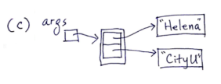
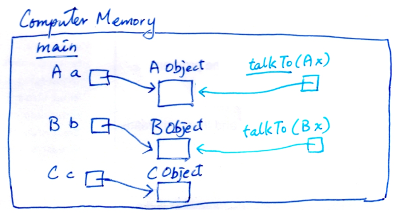
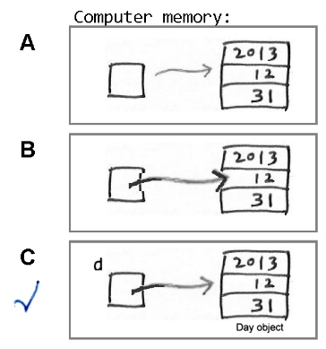
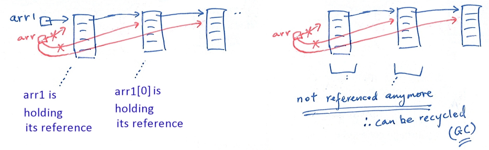

# CS2312 - Lecture Exercise

## Lecture 01

### Q1

```java
int i=10;
while (i>0)
    i--; 
System.out.println(i);
```

- After the loop finishes, `i` is `-1`.
- The loop body runs `10` times.
- The condition is checked `11` times.

### Q4.1

```java
int sum = 0;
for (int i=0; i<10; i++)
    sum = sum + i;
System.out.println(sum);
System.out.println(i);
```

Compile error: `i` is not defined outside the `for` loop.

Solution: create a new variable `i` outside the loop.

### Q4.2

```java
int m(int i) 
{ 
    return i*2;
    i++;
}
```

Compile error: `i++` is unreachable.

Solution: move `i++` before `return`.

### Q4.3

```java
int larger(int i, int j) 
{ 
    if (i>j) return i;
    if (i<=j) return j;
}
```

Compile error: This method must return a result of type `int`.

Solution: add a `return` statement after the `if` statements.

### Q8

```java
public static void main(String [] args) 
{ 
    int i=97; char c;
    c=(char)i; 
    System.out.println(i); //output: 97
    System.out.println(c); //output: a
}
```

- Data type of `i` did not change after `c=(char)i;`.
- `(char)i` means to provide a `char` value by converting from the value of `i`.
- `(char)i` can be used if we want to consider the value of `i` as a `char`.

### Q12

```java
public int f(int n) {
    System.out.println(n);
    if (n == 0 || n == 1) return 1;
    return f(n-1) + f(n-2);
}

public static void main(String[] args) {
    System.out.println(f(5));
}
```

Output:

```bash
5 // f(4) + f(3)
4 // f(3) + f(2)
3 // f(2) + f(1)
2 // f(1) + f(0)
1
0 // end of f(2)
1 // end of f(3)
2 // f(1) + f(0)
1
0 // end of f(2), end of f(4)
3 // f(2) + f(1)
2 // f(1) + f(0)
1
0 // end of f(2)
1 // end of f(3), end of f(5)
8 // result of f(5)
```

## Lecture 02

### Q1: Object Reference

```java
public class welcome {
    public static void main(String[] args) {
        System.out.println("Hi " + args[0] + ", welcome to " + args[1]);
    }
}
```

```bash
$ java welcome John CS2312
Hi John, welcome to CS2312
```

Diagram for `args[]` Object:



## Lecture 03

### Q1: Method Overloading

```java
class A { public void reply() {System.out.println("Hi!");} }
class B { public void reply() {System.out.println("Hey!");} } 
class C {
    public void talkTo(A x) {System.out.println("Hi A object!"); x.reply();}
    public void talkTo(B x) {System.out.println("Hi B object!"); x.reply();}
} 
public class Main {
    public static void main(String[] args) {
        A a = new A();
        B b = new B();
        C c = new C();
        c.talkTo(a);
        c.talkTo(b); 
    } 
} 
```

1. Output of the program:

```
Hi A object!
Hi!
Hi B object!
Hey!
```

2. Draw structure diagram for all variables inside `main()`.



3. **Method overloading**:

- Use the same name for 2 or more methods in the same class.
- Compiler will choose the correct method to call based on the argument type.
    - `c.talkTo(a);` will call `talkTo(A x)`.
    - `c.talkTo(b);` will call `talkTo(B x)`.

### Q2: Object Reference

```java
Day day = new Day(2013, 12, 31);
```

Diagram:



The **value stored in variable `day`** is a reference (memory address) to the object.

### Q3: Object Reference

```java
Day d1 = new Day(y, m, d);
Day d2 = new Day();
d2 = d1.advance(1);
```

`d2 = new Day();` is redundant because `d2` is assigned a new value in the next line.

The redundant Day object will be garbage collected.

### Q4: `.nextLine()` vs `.next()`

```java
Scanner scanner = new Scanner(System.in);
String s1, s2;
s1 = scanner.next();
s2 = scanner.nextLine();
System.out.println(s1);
System.out.println(s2);
```

Input: 

```
   Today    is a good day.
(<space><space><space>Today\tis a good day.\n)
```

Output:

```
Today
    is a good day.
(Today\n\tis a good day.\n)
```

1. When `s1 = scanner.next();` is executed, the program **pauses** and waits for user input.
2. When user presses `<Enter>`, the program resumes.
3. `s1 = scanner.next();` skips **leading white-spaces** and reads the next token (until the next space).
4. `Today` is assigned to `s1`. `\tis a good day.\n` is left in the **input buffer**.
5. `s2 = scanner.nextLine();` reads the rest of the line (until `\n`).
6. `\tis a good day.` is assigned to `s2`. No more input in the buffer.

| Behaviour | `next()` | `nextLine()` |
| --- | --- | --- |
| Leading spaces | Discarded | Included |
| Trailing space or `\t` | Stop reading | Included |
| Trailing `\n` | Stop reading | Discarded |

### Q6: In-place Modification vs New Object

```java
// return reference to a new Day object
public Day next() {
    if (isEndOfMonth()) {
        if (month == 12) {
            return new Day(year + 1, 1, 1);
        }
        return new Day(year, month + 1, 1);
    }
    return new Day(year, month, day + 1);
}

// Modify the current Day object
public void advance() {
    if (isEndOfMonth()) {
        if (month == 12) {
            year++;
            month = 1;
            day = 1;
        } else {
            month++;
            day = 1;
        }
    } else {
        day++;
    }
}

Day d1 = new Day(2013, 12, 31);
System.out.println(d1); // 2013-12-31
d1.advance();
d1 = d1.next();
System.out.println(d1); // 2014-01-02
```

### Q7: `.toString()`

Explain the output statement step by step:

```java
public String Day::toString() {...}
public Day Employee::getHireDay() {...}

public static void main(String[] args) {
    Employee e = new Employee("John", 1000, 2013, 12, 31);
    System.out.println(
        "name=" + e.getName() +
        ", salary=" + e.getSalary() +
        ", hireDay=" + e.getHireDay());
}
```

1. `e.getName()` -> `"John"`
2. String: `"name=" + "John"` -> `"name=John"`
3. String: `"name=John" + ", salary="` -> `"name=John, salary="`
4. `e.getSalary()` -> `1000`
5. String: `"name=John, salary=" + 1000` -> `"name=John, salary=1000"`
6. String: `"name=John, salary=1000" + ", hireDay="` -> `"name=John, salary=1000, hireDay="`
7. `e.getHireDay()` -> `new Day(2013, 12, 31)`
8. `new Day(2013, 12, 31).toString()` -> `"2013-12-31"`
9. String: `"name=John, salary=1000, hireDay=" + "2013-12-31"` -> `"name=John, salary=1000, hireDay=2013-12-31"`
10. `System.out.println("name=John, salary=1000, hireDay=2013-12-31");`

### Q8: Constructor Overloading

```java
public class Day {
    private int year, month, day;
    public Day(int y, int m, int d) {
        this.year=y; this.month=m; this.day=d;
    }
    public Day(int y) {
        this(y, 1, 1);
    }
    public Day(int y, int dayInYear) {
        this(y);
        // cannot call another constructor after the first statement
        int m = 1;
        int daysPassed = 0;
        while (daysPassed + getMonthTotalDays(y, m) < dayInYear) {
            daysPassed += getMonthTotalDays(y, m);
            m++;
        }
        this.month = m;
        this.day = dayInYear - daysPassed;
    }
    private int getMonthTotalDays(int y, int m) {...}
```

### Q9: In-place Modification vs New Object

```java
public static void main(String[] args) {
    Day birthday, deadline;
    birthday = new Day(2014,1,15);
    deadline = birthday;
    System.out.println(birthday); //15 Jan 2014
    System.out.println(deadline); //15 Jan 2014
    birthday.advance();
    System.out.println(birthday); //16 Jan 2014
    System.out.println(deadline); //16 Jan 2014
    birthday.next();
    System.out.println(birthday); //16 Jan 2014
    System.out.println(deadline); //16 Jan 2014
    birthday = birthday.next();
    System.out.println(birthday); //17 Jan 2014
    System.out.println(deadline); //16 Jan 2014
}
```

Object variable does not store the object itself, but a reference to the object.

### Q10: Uninitialized and `null`

```java
Day d1;
System.out.println(d1); // compile error
System.out.println(d1.toString()); // compile error

Day d2 = null;
System.out.println(d2); // null
System.out.println(d2.toString()); // NullPointerException
```

### Q12

Calculate the maximum row sum and column sum of a 2D array. Output the maximum value and corresponding row/column number(s).

```java
public static void main(String[] args) throws FileNotFoundException { 
    System.out.print("Please input the file pathname: ");
    Scanner scannerObj = new Scanner(System.in);
    String fileName = scannerObj.nextLine(); 
    Table2dMxSumRowCol table = new Table2dMxSumRowCol(fileName); 
    table.print();

    System.out.print("Maximum row sum: " + table.getRowSumMax());
    System.out.print(" (row ");
    table.printAllRowsOfMax();
    System.out.println(")");

    System.out.print("Maximum column sum: " + table.getColSumMax());
    System.out.print(" (column ");
    table.printAllColsOfMax();
    System.out.println(")");

    scannerObj.close();
}

public class Table2dMxSumRowCol {
    private int[][] nums;

    private final int SIZE = 10;

    private int getRowSum(int row) {
        for (int c = 0; c < SIZE; c++) {
            sum += nums[row][c];
        }
        return sum;
    }

    public int getRowSumMax() {
        int max = getRowSum(0);
        for (int r = 1; r < SIZE; r++) {
            int sum = getRowSum(r);
            if (sum > max) {
                max = sum;
            }
        }
        return max;
    }

    public void printAllRowsOfMax() {
        int max = getRowSumMax();
        boolean first = true;
        for (int r = 0; r < SIZE; r++) {
            int sum = getRowSum(r);
            if (sum == max) {
                if (first) {
                    first = false;
                } else {
                    System.out.print(",");
                }
                System.out.print(r);
            }
        }
    }
```

## Lab 04

### Q1: Recursive Method

```java
void showDigits(int n) { 
    if (n<10)
        System.out.print(n+" ");
    else { 
        int leading = n/10;
        int right_most = n%10;
        showDigits(leading);
        System.out.print(right_most+" ");
    } 
} 
void main(String[] args) { 
    System.out.print("Input n: ");
    Scanner s = new Scanner(System.in);
    int n=s.nextInt();
    showDigits(n);
    s.close();
}
```

#### Q1.1

Input: `5`

Output: `5`

Input: `56`

Output: `5 6`

Input: `567`

Output: `5 6 7`

#### Q1.2

Analyze the stack trace for `showDigits(567)`.

- `showDigits(567)` -> `n=567`
    - `leading=56` -> `showDigits(56)`
        - `leading=5` -> `showDigits(5)`
            - `n<10` -> `System.out.print(5+" ")`
        - `right_most=6` -> `System.out.print(6+" ")`
    - `right_most=7` -> `System.out.print(7+" ")`

- Each instance of `showDigits()` is a **stack frame**.
- Each stack frame separately stores the values of `n`, `leading`, and `right_most`.
- When the method returns, the stack frame is popped from the stack, and the values are discarded.


## Lecture 06

### Q1

```java
class X {
    private int xValue;
    private X xChild;
    public X(int xValue, X xChild) {
        this.xValue = xValue; 
        this.xChild = xChild;
    }
    public String toString() {
        return xChild + " " + xValue;
    } 
}
public class Tester{
    public static void main(String[] args) {
        X obj = new X(99, new X(88, new X(77, null)));
        System.out.println(obj);
    }
}
```

Output: `null 77 88 99`

### Q2

```java
class X {
    private int data;
    public X(int d) {data=d*2;}
    public String toString() {return String.valueOf(data);}
    public void doSomething(X r) {
        X s = new X(8);
        System.out.println(this.data);
        System.out.println(r.data);
        System.out.println(s.data);
    }
}
public class Main_X_3Objs {
    public static void main(String[] args) {
        X a = new X(1);
        X b = new X(15);
        a.doSomething(b);
    }
}
```

Output:

```
2
30
16
```

For `a.doSomething(b)` call, `a` is implicit parameter, `b` is explicit parameter.

### Q4: Static Context

```java
class A {
    public int x1;
    public static int x2;
    public void m1() {
        m2();
    }
    public static void m2() {
        //x1+=100; //<== this is invalid. [line X1]
        x2+=100;
        //m1(); //<== invalid [line X2]
    } 
}
public static void main(String[] args) {
    (new A()).m1(); 
    (new A()).m1();
}
```

- Line X1 is invalid because static method cannot access instance variable.
- Line X2 is invalid because static method cannot call instance method.

### Q5: Default Constructor

```java
public class RandomNumber {
    private int r=(int)(Math.random()*100); //0..99
    public RandomNumber(int n) { r=(int)(Math.random()*n); }
    public String toString() {return ""+r;}
    public static void main(String[] args) {
        System.out.println(new RandomNumber(1000)); //Expected: 0..999 [OK]
        System.out.println(new RandomNumber()); //Expected: 0..99 [ERROR!]
    }
}
```

Default constructor is missing. Fix: `public RandomNumber() { }`

### Q7: Casting

```java
class A {
    public String f1() { return "A solution";} 
}
class B extends A {
    public String f1() { return "Best solution";}
}
public class Main {
    public static void main(String [] args) {
        go(new B());
    }
 
    public static void go(A x) {
        String result1 = ((B)x).f1();
        String result2 = x.f1();
        System.out.println(result1 + ", " + result2); 
    }
}
```

Output: `Best solution, Best solution`

Reason: non-static method is called based on the actual type of the object, i.e. `B`. (Dynamic binding)

**Dynamic binding requires the overriding method to have the same signature**, i.e. same name and same parameter lists [number, order, type].

**Dynamic binding** is checked at **run time**, i.e. by JVM.

### Q8: Casting

```java
class A {
    private int x;
    public A() {x=100;}
    public void m1() { System.out.println(x);}
}
class B extends A {
    private int y;
    public B() {y=200;}
    public void m1() {System.out.println(y);}
}
public static void main(String[] args) {
    A i = new A();
    B j = new B();
}
```

1. `i.m1();` -> `100`
2. `j.m1();` -> `200`
3. `((A)j).m1();` -> `200` (because `j` is a `B` object, so `((A)j)` is still a `B` object)
4. `((B)i).m1();` -> runtime error (because `i` is an `A` object, `y` is not defined in `A`)

### Q9: Wrapper Class

```java
Integer i=3; //line 1 
String s; //line 2
s = (String)i; //line 3 
Object o; //line 4
o = i; //line 5
i = (Integer)o;//line 6
```

- Line 1: OK
- Line 2: OK
- Line 3: compile error (cannot cast `Integer` to `String`)
- Line 4: OK
- Line 5: OK
- Line 6: OK (`Integer.valueOf(o)` will be called)

### Q10: For-each Loop

```java
public static void main(String[] args) {
    Integer[] arr = new Integer[3];
    arr[0] = 100; arr[1] = 101; arr[2] = 109;
    ArrayList<Integer> alist = new ArrayList<Integer>();
    alist.add(100); alist.add(101); alist.add(109);
    for (int i = 0; i < arr.length; i++)
        System.out.print(arr[i] + " ");
    System.out.println();
    for (int i = 0; i < alist.size(); i++)
        System.out.print(alist.get(i) + " ");
}
```

Rewrite the above code using for-each loop.

```java
for (Integer i : arr)
    System.out.print(i + " ");
System.out.println();
for (Integer i : alist)
    System.out.print(i + " ");
```

Note: in for-each loop, the variable `i` is a copy of the element in the array/list.

```java
System.out.println(Arrays.toString(arr)); //output: [100, 101, 109]
System.out.println(alist.toString()); //output: [100, 101, 109]
System.out.println(); System.out.println();
// Try to change element values
for (Integer e : arr)
    e++;
for (Integer e : alist)
    e++;
System.out.println(Arrays.toString(arr));
System.out.println(alist.toString());
System.out.println(); System.out.println();
// Try to change add or remove element in arraylist
for (Integer e : alist)
    if (e == 109)
        alist.add(110);
for (Integer e : alist)
    if (e == 109)
        alist.remove(e);
System.out.println(Arrays.toString(arr));
System.out.println(alist.toString());
```

**For-each loop cannot modify the array/list and its elements.**

This is because the variable `e` is a copy of the element in the array/list, not a reference to the element.

i.e. When `e++;` is executed, it points to a new `Integer` object because `Integer` is immutable.

## Lab 08

### Q0.1: Undo and Redo

Suppose user is writing a document in Wordpad, which has undo and redo functionality. Here is a possible sequence of events:

| Event | Document | Undo Stack | Redo Stack |
|-------|----------|------------|------------|
| Start | `""` | `[]` | `[]` |
| Enter "apple" | `"apple"` | `["apple"]` | `[]` |
| Enter "pear" | `"apple pear"` | `["apple", "pear"]` | `[]` |
| Undo | `"apple"` | `["apple"]` | `["pear"]` |
| Redo | `"apple pear"` | `["apple", "pear"]` | `[]` |
| Undo | `"apple"` | `["apple"]` | `["pear"]` |
| Enter "lemon" | `"apple lemon"` | `["apple", "lemon"]` | `[]` |

- When user enters a new string, push it to undo stack and **clear redo stack**.
- When user undoes, pop the top of undo stack and push it to redo stack.
- When user redoes, pop the top of redo stack and push it to undo stack.

### Q0.2: ArrayList as static field

```java
class Pocket{
    private Object thing;  
    private static ArrayList<Pocket> createdPockets = new ArrayList<>();
    public Pocket(Object t) {
        this.thing=t;
        createdPockets.add(this);
    }
   
    @Override
    public String toString() {return thing.toString();}
   
    public static void listEverything() {
        for (Object p:createdPockets)
        System.out.println(p);
    }
}

public class Main_Lab08Q00 {
    public static void main(String [] args)  {  
        new Pocket("Pencil");
        new Pocket(2014);
        new Pocket("Spring");
        Pocket.listEverything();
    }
}
```

Note: `2014` is passed as an `Integer` object, not a primitive `int`.

Because `Pocket(Object t)` requires an `Object` parameter, `2014` is autoboxed to `Integer` object.

## Lecture 07

### Q1: JVM Stack and Heap

- Stack is dedicated to each thread.
- Heap is shared by all threads.
- Assume all programs are single-threads, stack is dedicated to each program, and heap is shared by all programs.

Identify the type of error caused by following code:

```java
public static void main(String[] args) {
    Object[] arr1 = new Object[10000000]; 
    Object[] arr = arr1;
    for (int i=0; i<200; i++) {
        arr[0] = new Object[10000000];
        arr = (Object[])arr[0];
    }
}
```

This program will cause `java.lang.OutOfMemoryError`. This is because the program creates too many objects and the heap is full.

```java
private static int factorial(int n) {
    if (n==1)
        return 1;
    else
        return n*factorial(n+1); 
}
public static void main(String[] args) {
    int f = factorial(4000000);
    System.out.println(f); 
}
```

This program will cause `java.lang.StackOverflowError`. This is because the program creates too many stack frames and the stack is full.

Each function call will create a new stack frame. The stack frame is popped from the stack when the function returns. If too many recursive calls are made, the stack will be full.

### Q2: Garbage Collection

The example above:

```java
public static void main(String[] args) {
    Object[] arr1 = new Object[10000000]; 
    Object[] arr = arr1;
    for (int i=0; i<200; i++) {
        arr[0] = new Object[10000000];
        arr = (Object[])arr[0];
    }
}
```

- `arr1` refers to `Object[10000000]` (a)
- `arr` copies `arr1` and refers to `Object[10000000]` (a)
- `arr[0]`, i.e. the first element of a, refers to `Object[10000000]` (b)
- `arr` now refers to `arr[0]`, i.e. `Object[10000000]` (b)
- And the process repeats for 200 times.
- `arr1` still holds the refernece to a, so a is not garbage collected.

If we change the code to:

```java
public static void main(String[] args) {
    Object[] arr = new Object[10000000];
    for (int i=0; i<200; i++) {
        arr[0] = new Object[10000000];
        arr = (Object[])arr[0];
    }
}
```

- `arr1` does not exist. The reference to the first layer of `Object[10000000]` is lost. Therefore, the first layer of `Object[10000000]` is garbage collected.
- This process repeats for 200 times, and the first 200 layers of `Object[10000000]` are garbage collected. The last layer is what `arr` refers to.
- This program does not cause `java.lang.OutOfMemoryError`.



## Lecture 08

### Q1: `equals()` and `==`

```java
String s1 = "red";
String s2 = "";
s2 += "r";
s2 += "e";
s2 += "d";

System.out.println(s1.equals("red")); //true
System.out.println(s2.equals("red")); //true

System.out.println(s1 == "red"); //true
System.out.println(s2 == "red"); //false
```

Why `s1 == "red"` is true? Becuase JVM has a **string pool** to store all string literals. When a string literal is created, JVM will check if the string pool already has the same string. If yes, the string literal will refer to the same string in the string pool.

Therefore, `s1 == "red"` is true because `s1` and `"red"` refer to the same string in the string pool.

Why `s2 == "red"` is false? Because `s2` refers to a new string object created by 3 concatenations. This new string object is not in the string pool.

Remember: `==` compares the **reference** of the object, not the **value** of the object.

### Q2.1: `this`

```java
class A {
    public String tellMe() {return "a";}
    public void alg() {System.out.println(tellMe() + "*");}
}
class B extends A {
    public String tellMe() {return "b";}
    public void alg() {System.out.println(tellMe() + "#");}
}
class C extends A {
    public String tellMe() {return "c";}
}
public class Main {
    public static void main(String[] args) {
        A x1 = new B(); x1.alg(); //b#
        B x2 = new B(); x2.alg(); //b#
        A x0 = new A(); x0.alg(); //a*
        A x3 = new C(); x3.alg(); //c*
        C x4 = new C(); x4.alg(); //c*
    }
}
```

Since all methods are non-static, dynamic binding is used. The function called is determined by the actual type of the object.

### Q2.2: `super`

```java
class A {
    public String toString() {return "a";}
    public void alg() {System.out.println(super.toString() + "*");}
}
class B extends A {
    public String toString() {return "b";}
    public void alg() {System.out.println(super.toString() + "#");}
}
class C extends A {
    public String toString() {return "c";}
}
public class Main {
    public static void main(String[] args) {
        A x1 = new B(); x1.alg(); //a#
        B x2 = new B(); x2.alg(); //a#
        A x0 = new A(); x0.alg(); //A@<hash>*
        A x3 = new C(); x3.alg(); //C@<hash>*
        C x4 = new C(); x4.alg(); //C@<hash>*
    }
}
```

`super.toString()` calls the `toString()` method of the superclass.

`A` implicitly extends `Object`. `Object.toString()` returns the class name and hash code of the object.

- `.alg()` is not overriden in `C`, so `A.alg()` is called.
- Therefore, `x3` and `x4` calls `A.alg()`, which calls `Object.toString()`.

Conclusion:

- **this** is based on the actual type of the object. (run time)
- **super** is based on the context of the method. (compile time)

### Q3: Autoboxing

```java
ArrayList<int> arrlist = new ArrayList<>();
```

Compile error: `Syntax error on token "int", Dimensions expected after this token`.

Why? Because `ArrayList` can only store objects, not primitive types.

However, `int[]` is a reference type. Therefore, the following code is valid:

```java
ArrayList<int[]> arrlist = new ArrayList<>();
```

### Q4: For-each Loop

Recall: for-each loop iterator **shallow copies** the element in the array/list. It cannot manipulate or remove the element.

Implement remove with for loop:

```java
public static void remove(ArrayList<Employee> allEmployees, Employee e) {
    int index = -1;
    for (int i = 0; i < allEmployees.size(); i++) {
        if (allEmployees.get(i) == e) {
            index = i;
            break;
        }
    }
    if (index != -1) {
        allEmployees.remove(index);
    }
}
```

Note: use `==` to compare the reference of the object. We need exactly the same object to be removed.

Actually, `ArrayList` has a built-in `remove()` method: `allEmployees.remove(e);`

## Lecture 09

### Q1: Compile-time Dependency

```java
class Student {
    private String name;
    public void doExercise(IReadWrite, int);
}

class Grader {
    private String name;
    public void gradeExercise(IGrade);
}

interface IReadWrite {
    public void readAnswer();
    public void writeAnswer(int);
}

interface IGrade {
    public void readAnswer();
    public void grade();
}

class Exercise implements IReadWrite, IGrade {
    public void readAnswer() {...}
    public void writeAnswer(int) {...}
    public void grade() {...}
}

class Main {
    public static void main(String[] args) {
        Student s = new Student("Mary");
        Grader g = new Grader("John");
        Exercise e = new Exercise("Calculate 1+1", 2);
        s.doExercise(e, 3);
        g.gradeExercise(e);
    }
}
```

What are the compile-time dependencies?

- `Main` depends on `Student`, `Grader`, and `Exercise`. Because it invokes constructors of these classes.
- `Main` also depends on `IReadWrite` and `IGrade`. Because it uses these interfaces as parameter types.
- `Exercise` depends on `IReadWrite` and `IGrade`. Because it implements these interfaces.
- `Student` depends on `IReadWrite`. Because it uses `IReadWrite` as parameter type.
- `Grader` depends on `IGrade`. Because it uses `IGrade` as parameter type.
- `IRewrite` and `IGrade` do not depend on any other classes/interfaces.

Suppose source code of `Exercise` has been modified. What classes have to be recompiled?

Answer: `Exercise` and `Main`.

### Q2: `isSorted()`

```java
class Employee implements Comparable<Employee> { ... }

private static boolean isSorted(Employee[] arr) {
    for (int i = 0; i < arr.length - 1; i++) {
        if (arr[i].compareTo(arr[i + 1]) > 0) { // arr[i] > arr[i+1]
            return false;
        }
    }
    return true;
}
```

### Q3: Top-down and OO Design

```java
Book b = library.getBook(bookID);
Member m = library.getMember(memberID);
lib.addBorrowRecord(b, m);
```

This is a **top-down** design.

```java
Member m = library.getMember(memberID);
try {
    m.borrowBook(bookID);
} catch (Exception e) {
    System.out.println(e.getMessage());
}
```

This is an **OO** design. The main program invokes the method of `Member` object.

`Member` object is designed to handle all cases and exceptions, so the main program does not have to care about the details.

### Q4: What should be included in a interface-implementing class?

```java
public abstract class RecordedCommand implements Command {
    private static ArrayList<RecordedCommand> undoList = new ArrayList<>();
    private static ArrayList<RecordedCommand> redoList = new ArrayList<>();
    public abstract void execute(String[] tokens); // inherited from Command
    public abstract void undoMe();
    public abstract void redoMe();
    public static void undoOneCommand() {...}
    public static void redoOneCommand() {...}
    public static void clearRedoList() {...}
    public static void addRedoCommand(RecordedCommand cmd) {...}
    public static void addUndoCommand(RecordedCommand cmd) {...}
}

public class Fire extends RecordedCommand {
    Employee e;
    @Override
    public void execute(String[] tokens) {
        Company company = Company.getInstance();
        e = company.findEmployee(tokens[1]);
        company.removeEmployee(e);
        addUndoCommand(this);
        clearRedoList();
    }

    @Override
    public void undoMe() {
        Company company = Company.getInstance();
        company.addEmployee(e);
        addRedoCommand(this);
    }

    @Override
    public void redoMe() {
        Company company = Company.getInstance();
        company.removeEmployee(e);
        addUndoCommand(this);
    }
}
```

- `Employee` is included in `Fire` because `Fire` needs to save the `Employee` object to undo/redo.
- **`Company` SHOULD NOT be included in `Fire`**. Because `company` reference is not a property that belongs to `Fire`. `Company` is a singleton class, so it should be accessed by `Company.getInstance()`.

### Q6: Inner Class Instantiation

```java
class BankAccount {
    private class Money { 
        private String currency;
        private double value;
        public Money(String c, double b) {currency=c; value=b;} 
        public String getOwner() {return owner;}
        } 
        private Money balance; 
        private String owner;
        public BankAccount(String currency, String ow) { 
            owner = ow; balance = new Money(currency, 0.00); 
        } 
        public void methodX() { 
            BankAccount another = new BankAccount("RMB","Tom");
            Money m1 = new Money("HKD", 88);
            Money m2 = another.new Money("JPY",123);
            System.out.printf("%.2f(%s) %.2f(%s) %.2f(%s) %.2f(%s)", 
            this.balance.value, this.balance.getOwner(),
            another.balance.value, another.balance.getOwner(),
            m1.value, m1.getOwner(), 
            m2.value, m2.getOwner());
    } 
    // public static void methodY() { 
    // new Money("JPY", 0.00); //Compilation error
    // } 
}
```

1. Why `BankAccount.methodY()` is invalid?

Because `Money` is a non-static inner class. It can only be instantiated by an instance of `BankAccount`.

Therefore, to create a `Money` object, we need to specify which `BankAccount` object it belongs to.

However, in static context, there is no `BankAccount` object.

2. What's the output of following code?

```java
public static void main(String[] args) {
    BankAccount a = new BankAccount("HKD", "Helena");
    a.methodX();
}
```

Note: 

- In `a.methodX()` call, `this` refers to `a`.
- In `m1.getOwner()` call, `Money` accesses outer class field. The accessed outer class object is `this`, i.e. `a`.
- In `m2.getOwner()` call, `Money` accesses outer class field. The accessed outer class object is `another`.
- However, `m1` does not belong to `a`, and `m2` does not belong to `another`. They will be garbage collected after the method call.

Output: `0.00(Helena) 0.00(Tom) 88.00(Helena) 123.00(Tom)`

## Lab 10

### Conceptual Questions

1. A Java Exception is an instance of (Throwable).
2. An instance of (Error) describes system errors.
3. An instance of (RuntimeException) describes programming errors.
4. An instance of (RuntimeException, Error) is an unchecked exception. The compiler does not check if the exception is handled.
5. 

```java
public class Test {
  public static void main(String[] args) {
    System.out.println(1 / 0);
  }
}
```

Unchecked exception: `java.lang.ArithmeticException: / by zero`

6. 

```java
public class Test {
  public static void main(String[] args) {
    int[] list = new int[5];
    System.out.println(list[5]);
  }
}
```

Unchecked exception: `java.lang.ArrayIndexOutOfBoundsException: Index 5 out of bounds for length 5`

7. 

```java
public class Test {
  public static void main(String[] args) {
    Object o = new Object();
    String d = (String)o;
  }
}
```

Unchecked exception: `java.lang.ClassCastException: class java.lang.Object cannot be cast to class java.lang.String`

8. 

```java
public class Test {
  public static void main(String[] args) {
    Object o = null;
    System.out.println(o.toString());
  }
}
```

Unchecked exception: `java.lang.NullPointerException`

9. 

```java
public class Test {
  public static void main(String[] args) {
    Object o = null;
    System.out.println(o);
  }
}
```

Output: `null`

Why? Because `System.out.println()` will call `String.valueOf()` to convert the object to string. `String.valueOf()` will return `"null"` if the object is `null`.

However, `null.toString()` is calling a non-static method on a null object, which causes `NullPointerException`.

For a user defined class, `String.valueOf()` will call the `toString()` method of the class.

10. A method must declare (using `throws`) or handle (using `try-catch`) a checked exception.
11. Which of the following statements are true?

    - You use the keyword `throws` to declare exceptions in the method heading. (true)
    - A method may declare to throw multiple exceptions. (true)
    - To throw an exception, use the key word throw. (true)
    - If a checked exception occurs in a method, it must be either caught or declared to be thrown from the method. (true)

12. 

```java
class Test {
  public static void main(String[] args) throws MyException {
    System.out.println("Welcome to Java");
  }
}
class MyException extends Error {}
```

What's improper about the above code?

A: You should not declare a class that extends `Error`. `Error` is used to describe system errors. Extends `RuntimeException` instead.

13.

```java
class Test {
  public static void main(String[] args) {
    try {
      String s = "5.6";
      int k = Integer.parseInt(s); // Cause a NumberFormatException
      int i = 0;
      int y = 2 / i;
      System.out.println("Welcome to Java");
    }
    catch (Exception ex) {
      System.out.println(ex);
    }
  }
}
```

Output: `java.lang.NumberFormatException: For input string: "5.6"`

Lines after `int k = Integer.parseInt(s);` are not executed because an exception is thrown.

14.

```java
class Test {
  public static void main(String[] args) {
    try {
      String s = "5.6";
      int k = Integer.parseInt(s); // Cause a NumberFormatException
      int i = 0;
      int y = 2 / i;
    }
    catch (Exception ex)      { System.out.println("Exception"); }
    catch (ArithmeticException ex) { System.out.println("ArithmeticException"); }
    catch (NumberFormatException ex) { System.out.println("NumberFormatException"); }
    catch (RuntimeException ex)  { System.out.println("RuntimeException"); }
  }
}
```

The program will not compile. Because `catch` blocks must be ordered from most specific to most general.

15.

```java
class Test {
  public static void main(String[] args) {
    try {
      method();
      System.out.println("After the method call");
    }
    catch (NumberFormatException ex) { System.out.println("NumberFormatException"); }
    catch (RuntimeException ex)    { System.out.println("RuntimeException"); }
  }
  static void method() {
    String s = "5.6";
    int k = Integer.parseInt(s); // Cause a NumberFormatException
    int i = 0;
    int y = 2 / i;
    System.out.println("Welcome to Java");
  }
}
```

Output: `NumberFormatException`

16.

```java
class Test {
  public static void main(String[] args) {
    try {
      method();
      System.out.println("After the method call");
    }
    catch (RuntimeException ex)  { System.out.println("RuntimeException"); }
    catch (Exception ex)      { System.out.println("Exception"); }
  }
  static void method() throws Exception {
    try {
      String s = "5.6";
      int k = Integer.parseInt(s); // Cause a NumberFormatException
      int i = 0;
      int y = 2 / i;
      System.out.println("Welcome to Java");
    }
    catch (RuntimeException ex)  { System.out.println("RuntimeException"); }
    catch (Exception ex)      { System.out.println("Exception"); }
  }
}
```

Output: 

```
RuntimeException
After the method call
```

Why? The `RuntimeException` is caught in the `method()` method. Therefore, the `method()` method does not throw any exception.

17.

```java
class Test {
  public static void main (String[] args) {
    try {
      System.out.println("Welcome to Java");
    }
  }
}
```

The program will not compile. Because `try` must be followed by `catch` or `finally`.

18.

```java
class Test {
  public static void main (String[] args) {
    try {
      System.out.println("Welcome to Java");
      return;
    }
    finally {
      System.out.println("The finally clause is executed");
    }
  }
}
```

Output: 
```
Welcome to Java
The finally clause is executed
```

Why? Because `finally` is always executed, even if there is a `return` statement in the `try` block.

If the method `try` to return a value, the `finally` block will be executed before the return statement.

19.

```java
class Test {
  public static void main(String[] args) {
    try {
      System.out.println("Welcome to Java");
      int i = 0;
      int y = 2/i;
      System.out.println("Welcome to Java");
    }
    catch (RuntimeException ex) {
      System.out.println("Welcome to Java");
    }
    finally {
      System.out.println("End of the block");
    }
    
    System.out.println("End of the block");
  }
}
```

Output: 

```
Welcome to Java
Welcome to Java
End of the block
End of the block
```

20.

```java
class Test {
  public static void main(String[] args) {
    try {
      System.out.println("Welcome to Java");
      int i = 0;
      int y = 2/i;
      System.out.println("Welcome to Java");
    }
    finally { System.out.println("End of the block"); }
    
    System.out.println("End of the block");
  }
}
```

Output: 

```
Welcome to Java
End of the block
Exception in thread "main" java.lang.ArithmeticException: / by zero
    at Test.main(Test.java:6)
```

21.

```java
class Test {
  public static void main(String[] args) {
    try {
      method();
      System.out.println("After the method call");
    }
    catch (RuntimeException ex)  { System.out.println("RuntimeException"); }
    catch (Exception ex)      { System.out.println("Exception"); }
  }
  static void method() throws Exception {
    try {
      String s = "5.6";
      int k = Integer.parseInt(s); // Cause a NumberFormatException
      int i = 0;
      int y = 2 / i;
      System.out.println("Welcome to Java");
    }
    catch (NumberFormatException ex) {
      System.out.println("NumberFormatException");
      throw ex;
    }
    catch (RuntimeException ex) {
      System.out.println("RuntimeException");
    }
  }
}
```

**Rethrowing an exception**: throw the exception in the `catch` block. The exception will be thrown to the caller of the method.

Output: 

```
NumberFormatException
RuntimeException
```

22. Which of the following is not an advantage of Java exception handling?

- Java separates exception handling from normal processing tasks. (true)
- Exception handling improves performance. (false)
- Exception handling makes it possible for the caller's caller to handle the exception. (true)
- Exception handling simplifies programming because the error-reporting and error-handling code can be placed at the catch block. (true)

## Lecture 10

### Q1: Singleton and `.clone()`

```java
class Day {
    // ...
    @Override
    public Day clone() {
        Day copy=null;
        try {
            copy = (Day) super.clone();
        } catch (CloneNotSupportedException e) {
            e.printStackTrace();
        } 
        return copy;
    }
}

class SystemDate extends Day { ... }
```

`SystemDate` is a singleton class. However, as it inherits `Day.clone()`, it is possible to create a clone of `SystemDate`.

How to prevent this?

Rewrite `SystemDate.clone()` so that it returns a `Day` object instead of `SystemDate` object.

```java
@Override
public Day clone() {
    return new Day(this.getDay(), this.getMonth(), this.getYear());
}
```
