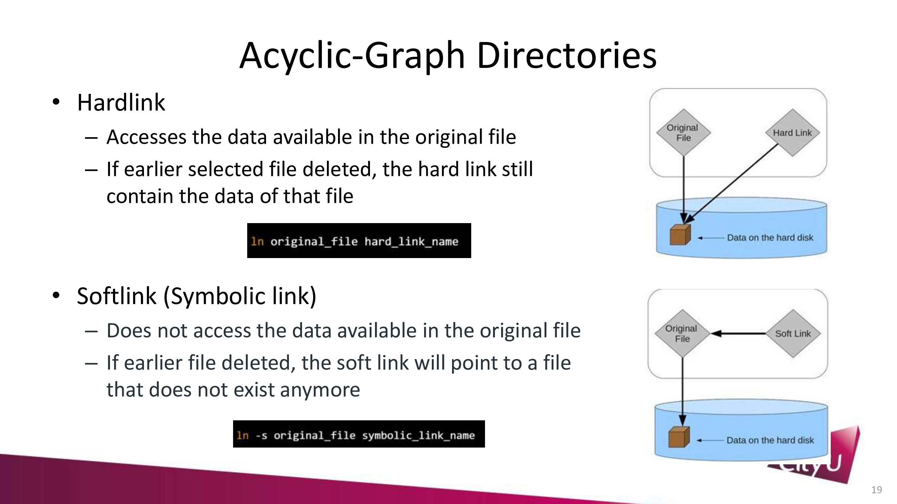

# CS3103 Operating Systems

## 1. Introduction

**Operating Systems** (OS): an intermediary **program** between applications and hardware

4-layer model of a computer system:

- **Hardware**: physical components
- **Operating System**: controls and coordinates use of hardware among various applications and users
- **Application Programs**: programs designed for end users
- **Users**: people, machines, other computers

Functions of OS in a broad sense:

- **allocate resources**: manage all resources, decide between conflicting requests for efficient and fair resource use
- **control execution**: control and monitor execution of programs to prevent errors and improper use of the computer

Computer System Organization:


CPU and device controllers (disks controller, graphics adapter, I/O controller) is connected to the system bus which provides access to shared memory.

### Interrupts

- **Interrupt**: a signal from hardware or software indicating an event that needs attention
- Upon receiving an interrupt, OS transfers control from the current program (PC), saves its state (registers, PC) and executes an **interrupt service routine** (ISR) to process the interrupt
- **Interrupt vector**: a table of pointers (addresses) to all the ISRs
- ISRs are part of the OS kernel
- At the end of the ISR, **scheduler** is invoked to determine which process to run next

Two types of interrupts:

- **Hardware Interrupt**: caused by an external device (e.g. I/O device)
    - **Maskable Interrupt**: can be turned off (ignored) by the CPU
    - **Non-Maskable Interrupt**: cannot be turned off
    - Avoid wasting CPU time for waiting external devices by using **interrupt-driven I/O** (polling)
- **Software Interrupt**: caused by special instruction (e.g. INT in x86)
    - Trap: a software-generated interrupt caused either by an error or a user request
    - System Call: a request to the OS to allow user to wait for I/O completion, create a new process, access a file, etc.
    - **Context Switch**: to resolve blocking and preemption (resource contention) issues, OS needs to save the state of the current process and restore the state of another process

Periodic interrupts by timer:

- **Real-time Clock** (RTC): a hardware device that keeps track of the current time
- **Timer**: a OS software component that counts down from a specified value to zero. Timer is based on RTC. Multiple timers can be set up.
- Goal: prevent a process from monopolizing the CPU
- Activity: When timer reaches zero, a Context Switch interrupts the current process and transfers control to the OS kernel
- Only the OS kernel can set the timer (setting the timer is a **privileged instruction**)

### Memory and Storage Management

Storage Hierarchy:


**Memory management** is the task of allocating memory to processes and managing memory access.

- Goal: maximize CPU utilization and minimize response time
- Activity:
    - Track memory usage and the processes that are using them
    - Decide which processes to load and which to remove from memory
    - Allocate and deallocate memory space as needed

**Storage management** is the task of optimizing the use of storage devices.

- Goal: improve performance and reliability
- Activity: Free space management, storage allocation, disk scheduling

### Multitasking

**Multiprogramming**: multiple programs are loaded into memory and executed concurrently.

- Scheduler selects a process from the **ready queue** and allocates CPU to it
- When a process is blocked (e.g. waiting for I/O), the scheduler selects another process to run

**Multitasking** or time-sharing: CPU switches between multiple processes rapidly to give the illusion that multiple processes are running concurrently.

- Goal: **short response time** for **interactive** computing
- Includes: scheduling (scheduler), memory management (swapping moves the process in and out of memory)

Process:

- **Process**: a program in execution
- Program is a **passive** entity stored in a file, whereas process is an **active** entity with a program counter (PC) specifying the next instruction to execute and a set of associated resources
- **Thread**: the unit of execution within a process. The smallest unit of scheduling.
- Each thread has its own **stack and registers**, but shares the same code and data segments with other threads in the same process
- Each process does not share memory with other processes. Use **inter-process communication** (IPC) to share data between processes.

### Kernel

User mode vs. Kernel mode:

- **User mode**: user programs run in user mode
- **Kernel mode**: OS kernel runs in kernel mode
- **Mode bit**: a bit in the processor status register (PSR) that indicates whether the CPU is in user mode or kernel mode
- **Privileged instructions**: instructions that can only be executed in kernel mode


OS **kernel**: the core of the OS that provides the most essential services.

- OS mainly consists of the kernel and system programs
- Kernel manages operations of the hardware (memory, CPU time)
- System programs (or user services) provide richer functionality (file system, compilers, etc.)

Types of kernels:

- **Monolithic kernel**: all OS services run in kernel mode
    - Both kernel and system programs are in the same address space
    - E.g. Linux, Windows
- **Microkernel**: only essential OS services run in kernel mode
    - Kernel runs in kernel mode, system programs run in user mode
    - E.g. Mach, Windows NT


### OS Services

User services provided by OS:

- **User Interface** (UI): command-line interface (CLI), graphical user interface (GUI)
- **Program Execution**: load, execute, terminate programs
- **I/O Operations**: file and I/O device manipulation
- **File System Manipulation**: create, delete, read, write, search, permissions
- **Communications**: inter-process communication (IPC) via shared memory or message passing
- **Error Detection**: detect and handle hardware and software errors. This includes debugging facilities
- **Resource Allocation**: allocate resources (CPU time, memory / storage space, I/O devices) to processes
- **Accounting**: keep track of resource usage
- **Protection and Security**: protect resources from unauthorized access

User Interface:

- **Shell**: a OS component which exposes the OS services to the user or application programs
- Command-line interface (CLI): user types commands to interact with the OS
- Graphical user interface (GUI): user interacts with the OS by manipulating graphical objects (windows, icons, menus, etc.)

System calls:

- **System call**: Programming interface to the services provided by the OS kernel
- In UNIX, system calls are implemented as functions in the C library. OS combines low-level (assembly) and high-level (C) languages.
- Usually invoked via **high-level API** rather than directly via `syscall` instruction (e.g. `INT` in x86). This is because high-level API is not platform-specific.
- Most common APIs: Win32 API (Windows), POSIX API (UNIX), Java API (JVM)

OS design and implementation:

- **mechanism**: interface to the OS service
- **policy**: algorithm that implements the service
- Example: the OS supports file compression (mechanism), and chooses to use the LZW algorithm (policy)
- Separating mechanism and policy allows OS to be more flexible and extensible. i.e. the OS can change the policy without changing the mechanism.

### UNIX

- UNIX is a multi-user, multi-tasking OS developed in 1969 by Bell Labs
    - Written in C
- Linux is a open-source UNIX-like OS developed in 1991 by Linus Torvalds
    - Linux itself is just the kernel; it does not define the user interface
    - **Distribution**: a collection of software packages that are built on top of the Linux kernel (i.e. adding user services) Examples: Ubuntu, Fedora, Red Hat, Debian, etc.
- Android is a framework on top of Linux kernel
    - Android is not a distribution of Linux
    - A middleware, integrating higher-level services (e.g. JVM) into the OS

Real-time OS (RTOS) is an OS that is designed for real-time applications
- **Event-driven**: OS responds to external events (e.g. interrupts) in a timely manner
- **Preemptive**: More urgent tasks can preempt other tasks so that they can be executed immediately
- Different from **time-sharing** OS (e.g. UNIX) which switches between tasks based on a fixed time interval

**Portable Operating System Interface (POSIX)**
- a set of standards by IEEE for maintaining compatibility between UNIX-like OSes (e.g. Linux, Mac OS X)
- defines API, shell (CLI commands), and utility interfaces

**Virtual Machine (VM)**
- a software implementation of a machine (i.e. a computer) that executes programs like a physical machine
- virtualization and emulation of a whole computer system (hardware and OS)
- Purpose:
    - to run guest OSes on a host OS, incl. running legacy applications
    - to provide a platform-independent programming environment (e.g. JVM)
    - to provide a sandbox environment for testing and debugging.

## 2. Process

### Process State

- **new**: the process is being created
- **ready**: the process is waiting to be assigned to a logical processor
- **running**: instructions are being executed
- **waiting**: the process is waiting for some event to occur (such as an I/O completion or reception of a signal)
- **terminated**: the process has finished execution


### Process Control Block (PCB)

Do not confuse with the physical PCB (Printed Circuit Board).

Each process is represented by a **Process Control Block** (PCB) in the OS kernel.

A **Process Table** records the PCBs of all processes.

Each PCB contains:

- **Process ID** (PID): unique identifier
- **Process State**: new, ready, running, waiting, terminated
- **Program Counter** (PC): address of next instruction to be executed
- Registers: general-purpose registers, stack pointer, program status word (PSW)
- Scheduling Information: priority, pointers to scheduling queues
- Files, I/O devices, memory management information

### Process Scheduling

Queue of processes:

- **Job queue**: all processes in the system
- **Ready queue**: all processes residing in main memory, ready and waiting to execute
- **Device queue**: processes waiting for an I/O device


Two types of scheduler:

- **Long-term scheduler** (job scheduler): selects which processes should be brought into the ready queue
    - Arrange the execution of processes according to their priority
    - Control the degree of **multiprogramming** (number of processes in memory)
- **Short-term scheduler** (CPU scheduler): selects which process should be executed next and allocates CPU to it
    - Create **concurrency** (the illusion of parallelism) by switching between processes rapidly

Two types of process:

- **CPU-bound process**: spends most of its time doing computations. Requires few long CPU bursts.
- **I/O-bound process**: spends most of its time waiting for I/O. Requires many short CPU bursts.

### Context Switch

**Context switch**: the process of saving the state of the current process and restoring the state of another process.

The context switching process incurs overhead.

Theoretically, each process should have its own registers, which is impossible in practice. Therefore, when saving the state of a process, the register values are also stored in the PCB.


### Process Creation

```c
pid_t fork(void);
```

`fork()` creates a new process by duplicating the calling process, `main()` in this case.

- The calling process is the **parent process**. `fork()` returns PID of the child process.
- The new process is the **child process**. `fork()` returns 0 to the child process.

Parent's memory is duplicated to the child's memory. The child process has its own copy of stack, heap, and data segments.

```c
execlp("/bin/ls", "ls", NULL);
```

Using `execlp()` will replace the current process with a new process but retain the same PID.

This can load new data and text (code) segments into the process.

In the above example, the child process will instead execute `/bin/ls`, printing the contents of the current directory, and then terminate.

#### Examples

```c
#include <stdio.h>
#include <sys/types.h>
#include <unistd.h>
int main() {
    pid_t pid;
	/* fork another process */
	pid = fork();
	if (pid < 0) { /* error occurred */
		fprintf(stderr, "Fork Failed");
		exit(-1);
	}
	else if (pid == 0) { /* child process */
		execlp("/bin/ls", "ls", NULL);
	}
	else { /* parent process */
		/* parent wait for the child to complete */
		wait(NULL);
		printf("Child Complete");
		exit(0);
	}
}
```

The above example will
- fork a child process
- in the child process, execute `/bin/ls`
- when the child process terminates, the parent process will print `Child Complete`

Additional notes:

- `getpid()` returns the PID of the current process.
- `getppid()` returns the PID of the parent process. The parent process of `main()` is the shell
- `wait()` suspends execution of the calling process until one of its children terminates

```c
int main() {
    pid_t pid;
    pid = fork();
    if (pid < 0) {
        printf(stderr, "Fork Failed");
        exit(-1);
    }
    else if (pid == 0) {
        printf("I am the child process\n");
        printf("Current PID: %d Parent PID: %d\n", getpid(), getppid());
    } else {
        wait(NULL);
        printf("I am the parent process\n");
        printf("Current PID: %d Parent PID: %d\n", getpid(), getppid());
    }
}
```

Possible output:

```
I am the child process
Current PID: 31497 Parent PID: 31496
I am the parent process
Current PID: 31496 Parent PID: 31491
```

The process tree:

```
shell.exe      31491
└ main.exe     31496
   └ main.exe  31497
```

An application can have multiple processes, each with its own PID. Their executable files can be the same.

#### Steps in Process Creation

Segments of a process:

- **Text segment**: machine code of the program
- **Data segment**: global variables
- **Stack segment**: local variables, function parameters, return addresses, etc.
- **Heap segment**: dynamically allocated memory

In the executable files, text, data, and stack segments are stored in the file.

Steps in process creation:

1. Load the executable into memory
    - **lazy loading**: load the text and data segments only when they are needed. More can be loaded during execution.
2. Allocate memory for the **stack** segment
    - Local variables, function parameters, return addresses, etc.
    - For `main(argc, argv)`, `argc` and `argv` are stored in the stack
3. Allocate memory for the **heap** segment
    - Dynamically allocated memory. They must be explicitly allocated (`malloc()`) and freed (`free()`)
    - Note that `int[]` is stored in the stack. `int*` pointer is stored in the stack, but the pointed memory is stored in the heap.
4. Other initializations
    - Initialize the **program counter** (PC) to the first instruction in the text segment (the entry point of the program, `main()` in this case)
    - Setup I/O streams (stdin, stdout, stderr)
5. Start execution at the PC
    - OS transfers control to the program

### Process Termination

Two types of termination:

- **Process exit**: after finishing execution, ask OS to delete the process
    - use `exit()` system call to **return a status code** to the parent process (e.g. shell)
    - parent process can `wait()` for the return status code
    - All resources (memory, files, I/O buffers) are deallocated by the OS
- **Process abort**: parent process terminates the child process, happens when
    - child process has exceeded allocated resources
    - task assigned to the child process is no longer required
    - parent process is exiting and OS does not allow child processes to continue if the parent process terminates

### Process Cooperation

- **Independent process**: cannot affect or be affected by the execution of another process
- **Cooperating process**: can affect or be affected by the execution of another process
- **Producer-consumer problem**: a producer process produces information that is consumed by a consumer process
    - unbounded buffer: the producer can produce as many items as it likes
    - bounded buffer: a fixed-size buffer

**Inter-process communication** (IPC): a mechanism for processes to communicate and synchronize their actions.
- Support sending and receiving messages between processes
- Processes need to establish a communication link before sending and receiving messages
- **Message passing**: sender->message queue in OS kernel->receiver
- **Shared memory**: sender->shared memory->receiver


> Message Passing vs Shared Memory

- Message passing can be used in a distributed system, whereas shared memory cannot
- Message passing automatically synchronizes the sender and receiver, whereas shared memory requires explicit synchronization (harder to implement)
- Message passing is slower than shared memory

### Communication Models

#### Direct Communication

Processors must explicitly name the recipient or sender of the communication

Properties:

- Links are established automatically
- A link is associated with exactly one pair of processes, and between each pair there is exactly one link
- Link may be unidirectional (one-way) or bi-directional (two-way)

System calls:

- `send(P, message)`: send a message to process P
- `receive(Q, message)`: receive a message from process Q

#### Indirect Communication

- Messages are sent to and received from **mailboxes**
- Each mailbox has a unique ID
- Two processes can communicate only if they share a mailbox

Properties:

- A link is established only if processes share a common mailbox
- A link may be associated with many processes, and each pair of processes may share several links
- Link may be unidirectional or bi-directional

System calls:

- `send(A, message)`: send a message to mailbox A
- `receive(A, message)`: receive a message from mailbox A

Issues: multiple receivers may attempt to receive a message from the same mailbox

Possible solutions:

- Only allow 2 processes to be associated with a mailbox
- Only allow 1 process to receive a message at a time
- Allow random selection of the receiver, and inform the sender of the receiver's identity

#### Synchronization

- **Blocking send**: the sender is blocked (suspended) until the message is received by the receiver
- Blocking receive: the receiver is blocked until a message is available
- **Non-blocking send**: the sender sends the message and resumes operation
- Non-blocking receive: the receiver receives a valid message or null

Blocking send and receive are **synchronous** operations, whereas non-blocking send and receive are **asynchronous** operations.

**Socket**: a communication endpoint; an universal interface for communication between processes.
- In Internet Protocol (IP), a socket is identified by an IP address and a port number
- In Unix, a socket is identified by a socket descriptor (an integer)
- All communication occurs entirely within the OS kernel, 2-way FIFO queue

**Remote Procedure Call (RPC)**: a protocol that allows a program on one computer (client) to execute a program on a remote computer (server) as if it were on the client computer.
- Use packet to send parameters and receive results
- Client-side stub: locates the server and marshals (packs) the parameters
- Server-side stub: receives the parameters, unpacks them, and executes the procedure

## 3. Threads

**Thread**: the unit of execution within a process and managed by the OS scheduler

Multiple threads in a process share the same code and data segments, but have their own stack and registers.


> Process vs Thread

- Inter-process communication (IPC) is more expensive than inter-thread communication
- Context switching between threads is faster than context switching between processes
- Processes have its own address space, threads share the same address space

Address space:

- **Logical address** (virtual address): address generated by the CPU
- **Physical address**: address seen by the memory unit
- Each process has its own logical address space, which may or may not be physically contiguous
- Logical address is translated to physical address by the **memory management unit** (MMU), by adding the base address (relocation register) to the logical address

### Multithreading

The benefits of multithreading:

- For parallel execution. Some program has inherently parallel tasks (e.g. web server) so it can be executed faster by multithreading.
- For higher CPU utilization in the presence of I/O operations.
    - I/O operations are slow and require the CPU to wait
    - Multithreading allows the CPU to switch to another thread while waiting for I/O
    - This is helpful even if only one logical processor is available

Comparing parallelism and concurrency:

- Parallelism: running multiple threads in parallel on multiple logical processors
- Concurrency: running multiple threads at the same time by interleaving their execution, even on a single logical processor

### Multithreading Models

- User-level threads (ULTs): managed by the user-level thread library. Examples: POSIX Pthreads, Java threads
- Kernel-level threads (KLTs): managed by the OS kernel.

Since privilege instructions can only be executed in kernel mode, ULTs must be mapped to KLTs.

- **One-to-one** (1:1): each ULT is mapped to a KLT
    - Different ULTs can execute in parallel
    - Drawback: creating a ULT requires creating a KLT, which is expensive
- **Many-to-one** (N:1): multiple ULTs are mapped to a single KLT
    - Only one ULT can execute at a time
    - Drawback: if a ULT blocks, the entire process blocks
- **Many-to-many** (M:M): multiple ULTs are mapped to multiple KLTs
    - Allows OS to create a sufficient number of KLTs without creating too many
    - Drawback: more complex to implement
- **Combined** (M:M+1:1): M:M model that allows a ULT to be bound to a KLT


> ULT vs KLT

- OS can only schedule KLTs
- ULT has lower context switching overhead than KLT
- M:1 Mapping allows ULT schedule without entering kernel mode
- Other mapping requires ULT to be mapped to KLT before scheduling
- In M:1 Mapping, a single ULT can block the entire process
- In other mapping and KLT, each thread and process are independent

### Thread Management

#### Thread Cancellation

Terminate a thread before it has finished.

Two general approaches:

- **Asynchronous cancellation**: terminate the target thread at any time. Supposedly, the target thread is terminated immediately, but not guaranteed.
- **Deferred cancellation**: target thread periodically checks if it should be cancelled. The target thread is terminated only at **cancellation points**.

#### Thread Pools

A number of threads are created in advance and placed in a pool. When a task arrives, a thread is removed from the pool and assigned to the task. When the task is completed, the thread is returned to the pool.

Advantages:

- Avoids the overhead of creating and destroying threads
- Allows to bound (limit) the number of threads associated with an application

#### POSIX Threads

Also known as Pthreads.

- A POSIX standard API for thread creation and synchronization
- API only specifies the behavior of the thread library, not the implementation
- Pthread library is a ULT library

In C, the Pthread library is called `pthread.h`.

Creates a thread:

```c
int pthread_create( // returns 0 if successful
    pthread_t *thread, // thread ID
    const pthread_attr_t *attr, // thread attributes (e.g. stack size)
    void *(*start_routine) (void *), // function to be executed by the thread
    void *arg // argument to the function
);
```

When a thread is created, it is not guaranteed to be executed immediately. The OS scheduler decides when to execute the thread.

Wait for a thread to terminate:

```c
int pthread_join( // returns 0 if successful
    pthread_t thread, // thread ID
    void **retval // pointer to the return value of the function
);
```

- `join()` blocks the master thread until the worker thread, which achieves **synchronization**
- The return value of the function will be stored in `retval`, by worker thread calling `pthread_exit()`
- Cannot perform simultaneous join on the same thread

Example:

```c
#include <stdio.h>
#include <stdlib.h>
#include <pthread.h>

void *mythread(void *arg) {
    printf("%s\n", (char *) arg);
    return NULL;
}

int main(int argc, char *argv[]) {
    pthread_t p1, p2;
    int rc;
    printf("main: begin\n");
    rc = pthread_create(&p1, NULL, mythread, "A");
    rc = pthread_create(&p2, NULL, mythread, "B");
    // join waits for the threads to finish
    rc = pthread_join(p1, NULL);
    rc = pthread_join(p2, NULL);
    printf("main: end\n");
    return 0;
}
```

Possible output:

```
main: begin
A
B
main: end
```

### Context Switch

Context of a thread: **register values** and **stack**.

Context of a process: **register values**, **memory** (code, data, heap, stack), other resources (files, I/O buffers, etc.)

**Context Protection**: when an interrupt occurs, save the registers to the stack (incl. PC, SP), then switch to ISR. Context Protection is **hardware assisted**.

Note interrupt is **asynchronous** (= unpredictable) and preemptive (= can occur at any time), so the compiler does not know which registers to save. Therefore, the compiler saves all registers.

(Unlike function call, which is synchronous and non-preemptive, so the compiler only saves the relevant registers, i.e. PC, SP, and the callee-saved registers.)

**SysTick** (system tick) is a timer in ARM Cortex-M processors. It can be used to generate periodic interrupts.

```c
SysTick->LOAD = 16000000; // interrupt every 1.6e7 CPU cycles
SysTick->VAL = 0; // clear current value
SysTick->CTRL = 0x7; // enable SysTick, enable interrupt, use CPU clock
__enable_interrupt(); // enable global interrupt
```

#### Thread Switching

Context Switching between threads:

1. Initialize the saved context of each thread
2. Restore the context of the selected thread
3. Upon SysTick interrupt, save the context of the current thread
4. Execute the ISR, which selects the next thread to run
5. Repeat steps 2-4

The saved context include (from low address to high address): `R0, R1, R2, R3, R12, LR, PC, xPSR`

- `R0-R3`: general-purpose registers
- `R12`: scratch register. usage varies between compilers
- `LR`: link register, stores the return address of a function
- `PC`: program counter, stores the address of the next instruction to be executed
- `xPSR`: program status register, stores the current execution state (e.g. interrupt enabled/disabled)


## 4. Scheduling

Goals of scheduling:

- **Maximize CPU utilization**: keep the CPU as busy as possible
    - **CPU-I/O burst cycle**: process execution consists of a cycle of CPU execution and I/O wait
    - CPU burst distribution is exponential (most short, few long)
    - Alternating sequence of CPU and I/O bursts
- **Do multiple tasks concurrently**: allow multiple processes to execute concurrently

### Components of Scheduling

- **Scheduler** (short-term scheduler)
    - Selects a task (process or thread) from the ready queue and allocates CPU to it
    - Scheduler decides which process to run next
    - Scheduling decisions may take place when a process:
        - running → waiting (for I/O)
        - running → ready (interrupted by timer)
        - waiting → ready (I/O completion)
        - terminated
- **Dispatcher**
    - Hands over the control of the CPU to the selected process
    - Dispatcher's work involves:
        - Switching context
        - Switching to user mode
        - Jumping to the proper location in the user program to restart the process
    - **Dispatch latency**: time it takes for the dispatcher to stop one process and start another

Ready Queue → Scheduler → Dispatcher → Next Process on CPU

### Scheduling Criteria

- **CPU utilization**: keep the CPU as busy as possible
- **Throughput**: number of processes that complete their execution per time unit
- **Waiting time**: amount of time a process has been waiting in the ready queue
- **Turnaround time**: time taken from the submission of a process to its completion
- **Response time**: time taken from the submission of a request to the start of its execution

### Scheduling Policy

**Scheduling Policy** is an algorithm for distributing resources among parties which simultaneously and asynchronously request them.

**CPU Scheduling Policy** is an algorithm for deciding which task to execute at which time.

#### First-Come, First-Served (FCFS)

Also First-In, First-Out (FIFO).

- **Non-preemptive**: once a process starts, it runs to completion
- **Convoy effect**: short processes are delayed by long processes
- Average waiting time is long, given the exponential distribution of CPU bursts
- Waiting time greatly affected by the order of arrival

#### Shortest Job First (SJF)

Either preemptive or non-preemptive.

Select a process with the smallest next CPU burst.

- **Non-preemptive SJF**: once a process starts, it runs to completion
- **Preemptive SJF** also **Shortest Remaining Time First (SRTF)**: if a new process arrives with a CPU burst length less than the remaining time of the current executing process, preempt the current process

Non-preemptive SJF has the minimum average waiting time.

However, in practice, the length of the next CPU burst is not known in advance, but only **estimated**.

The time of future CPU bursts can be predicted by using the **exponential average** of the measured lengths of previous CPU bursts.

Denote $t_n$ as the length of the $n$-th CPU burst, and $\tau_{n+1}$ as the predicted value of the next CPU burst.

Pick a value $\alpha$ between 0 and 1, and use the following formula to predict the next CPU burst: $\tau_{n+1} = \alpha t_n + (1 - \alpha) \tau_n$

Expanding the formula, we have: $\tau_{n+1} = \alpha t_n + (1 - \alpha) \alpha t_{n-1} + (1 - \alpha)^2 \alpha t_{n-2} + \cdots + (1 - \alpha)^n \tau_0$

Where the influence of the past CPU burst length diminishes exponentially, at the rate of $\alpha$ per process.

#### Priority Scheduling

Each process is assigned a priority (smaller number = higher priority). The scheduler selects the process with the highest priority.

Can be either preemptive or non-preemptive.

SJF is an example of priority scheduling where the priority is the predicted next CPU burst.

#### Round Robin (RR)

- Each task gets a small unit of CPU time (time quantum), usually 10-100 milliseconds
- Once the time quantum is used up, the task is preempted and added to the end of the ready queue
- If there are $n$ tasks and the time quantum is $q$, each task gets $1/n$ of the CPU time in chunks of at most $q$ time units at once.
- No task waits more than $(n-1)q$ time units

Performance depends on the size of the time quantum. 

If $q$ is too large, RR degenerates to FCFS (long waiting time). 

If $q$ is too small, overhead of context switching is too high.

#### Multilevel Queue

Ready queue is partitioned into several queues, each with its own scheduling algorithm.

e.g. foreground (interactive) and background (batch) queues.

- Foreground queue uses RR to create an illusion of parallelism for interactive users
- Background queue uses FCFS for high throughput

Further, scheduling is done between the queues. This can be done by using **fixed priority scheduling** (e.g. foreground queue has higher priority than background queue), or by **time slice** (e.g. 80% of CPU time to foreground queue, 20% to background queue).

#### Example: CPU Scheduling in Linux

Linux uses **scheduling classes** to implement different scheduling policies.

- Default scheduling class: **Completely Fair Scheduler (CFS)**
    - **Nice value**: affecting the proportion of CPU time given to a process
    - larger nice value = lower priority
    - **Virtual Runtime**: the criterion for scheduling, scheduler chooses the process with the smallest virtual runtime to run next
    - `virtual_runtime += real_runtime * nice` (simplified) -> `virtual_runtime ~= real_runtime / weight` (smaller nice value = higher weight = higher priority)

## 5. Synchronization

Motivation: concurrent access to shared data (e.g. same memory address) can lead to data inconsistency. This is called a **race condition**.

Goal of synchronization: ensure the orderly execution of cooperating processes.

### Critical Section

- **Critical section** (CS): a segment of code that accesses shared data
    - If context switch occurs during critical section, the data may be left in an inconsistent state
    - Critical section must be protected to avoid concurrent access
- A good solution should satisfy the following conditions:
    - **Mutual Exclusion**: only one process can be in CS at a time
    - **Progress**: if no process is in CS, and some (>1) processes want to enter CS, the selection of who enters CS next should not be postponed indefinitely (i.e. no deadlock)
    - **Bounded Waiting**: there is a limit on the number of times other processes are allowed to enter CS after a process has made a request to enter CS
    - **Independence**: the algorithm makes no assumptions about the speed or number of CPUs

### Mutex Locks

A **mutex lock** is a synchronization mechanism that enforces mutual exclusion.

- Mutex ensures that only one thread has access to CS at a time
- Two operations: `lock()` and `unlock()`

#### Peterson's Algorithm

Assumptions:

- Two processes P0 and P1, running on two cores CPU0 and CPU1
- `LOAD` and `STORE` are **atomic** operations (cannot be interrupted)
- The processes share two variables
    - `int turn`: indicates whose turn it is to enter the CS
    - `bool flag[2]`: indicates whether a process is ready to enter the CS

```c
// P0
do {
    flag[0] = true;
    turn = 1;
    while (flag[1] && turn == 1) {
        // busy wait
    }
    // critical section
    flag[0] = false;
    // remainder section
} while (1);

// P1
do {
    flag[1] = true;
    turn = 0;
    while (flag[0] && turn == 0) {
        // busy wait
    }
    // critical section
    flag[1] = false;
    // remainder section
} while (1);
```

Examine the mutual exclusion, progress, and bounded waiting properties.

- **Mutual Exclusion**:
    - If P0 is in CS, P1 cannot enter CS
        - Proof: If P0 is in CS, then `flag[0] = true` and `turn = 0` (because P1 sets `turn = 0`), causing P1 to busy wait
    - It is impossible for both processes to enter CS at the same time
        - Proof: If both processes set `flag[0] = true` and `flag[1] = true`, then `turn` must be 0 or 1, so one of the while loops is true (while the other can enter CS)
- **Progress**:
    - If no process is in CS, and P0 wants to enter CS, P0 will enter CS
        - Proof: If P1 is not in CS, then `flag[1] = false` and `turn = 0`, so P0's while loop is false
    - If both processes want to enter CS, one of them will enter CS
        - See the proof for mutual exclusion
- **Bounded Waiting**:
    - If P0 wants to enter CS, at most 1 other process can enter CS before P0
        - Proof: If both processes want to enter CS, P0 may have to wait. Say P1 enters CS, then `flag[1] = true` and `turn = 1`. When it exits CS, `flag[1] = false`, so P0 can enter CS.
        - Even if P1 sets `flag[1] = true` again, before P0 enters CS, it executes `turn = 0` next, which allows P0 to enter CS
        - Further, P1 cannot enter CS again in this case, since at this moment `flag[0] = true` and `turn = 0`, causing P1 to busy wait

#### Test-and-Set Instruction

Modern CPUs provide special atomic hardware instructions for synchronization.

```c
bool test_and_set(bool *lock) {
    bool old = *lock;
    *lock = true;
    return old;
}
```

**Test-and-set** is an atomic operation that sets the lock to true and returns the old value of the lock.

```c
bool lock = false; // shared variable

// P0
do {
    while (test_and_set(&lock)); // obtain lock
    // critical section
    lock = false; // release lock
    // remainder section
} while (1);

// P1
do {
    while (test_and_set(&lock)); // obtain lock
    // critical section
    lock = false; // release lock
    // remainder section
} while (1);
```

- If `lock = false`, `test_and_set()` sets `lock = true` and returns `false`, allowing the process to enter CS
- If `lock = true`, `test_and_set()` returns `true`, causing the process to busy wait

**Swap Instruction** can be used to implement a mutex lock.

```c
bool lock = false; // shared variable

// P0
do {
    key = true; // local variable
    while (key) {
        swap(&lock, &key); // obtain lock
    }
    // critical section
    lock = false; // release lock
    // remainder section
} while (1);

// P1
do {
    key = true; // local variable
    while (key) {
        swap(&lock, &key); // obtain lock
    }
    // critical section
    lock = false; // release lock
    // remainder section
} while (1);
```

This is equivalent to the test-and-set algorithm.

### Semaphores

Semaphore is a sync mechanism that uses an integer variable to control access to a shared resource.

Two standard operations:

- `wait()`: wait for the resource to become available
- `signal()`: release the resource

```c
int semaphore = 1; // shared variable

void wait(int *semaphore) {
    while (*semaphore <= 0); // wait till semaphore > 0
    *semaphore--;
}

void signal(int *semaphore) {
    *semaphore++;
}

// process
do {
    wait(&semaphore);
    // critical section
    signal(&semaphore);
    // remainder section
} while (1);
```

Initially, `semaphore = 1`, so P0 can enter CS. When P0 enters CS, `semaphore = 0`, blocking P1. When P0 exits CS, `semaphore = 1`, allowing P1 to enter CS.

There are two implementations of semaphores:

- **Binary semaphore**: can only take the values 0 and 1. Similar to a mutex lock
- **Counting semaphore**: can take any non-negative integer value. Used when several resources of the same type are available

#### Semaphore with Busy Waiting

**Spinlock**: a lock which causes a thread trying to acquire it to simply wait in a loop while repeatedly checking if the lock is available.

Here, `wait()` is a spinlock. If applications spend a long time in CS, spinlocks are inefficient.

#### Semaphore with Blocking

Instead of busy waiting, a process can be blocked when it cannot enter CS.

Each semaphore has an associated waiting queue. Each entry in the queue contains 2 fields:

- value
- pointer to the next process

Two operations:

- `block()`: place the process who called `wait()` into the waiting queue
- `wakeup()`: move the process at the head of the waiting queue to the ready queue

```c
struct Semaphore {
    int value;
    queue *waiting_queue;
};

void wait(Semaphore *s) {
    s->value--;
    if (s->value < 0) {
        block(s->waiting_queue); // add this process to the waiting queue
    }
}

void signal(Semaphore *s) {
    s->value++;
    if (s->value <= 0) {
        thread *t = s->waiting_queue->head;
        wakeup(t); // move the process at the head of the waiting queue to the ready queue
    }
}
```

### Classical Problems of Synchronization

#### Producer-Consumer Problem

When multiple **producers** and **consumers** share a common, fixed-size (size $n$) buffer:
- Producers write data to the buffer, and must block if the buffer is full
- Consumers read data from the buffer, and must block if the buffer is empty

Solution: use 3 semaphores

- `mutex` (binary, initially 1): protect access to CS
- `full` (counting, initially 0): count the number of occupied slots in the buffer
- `empty` (counting, initially $n$): count the number of empty slots in the buffer

Design:
- For a producer to enter CS, it must both acquire `mutex` and `empty` (allowing write)
- For a consumer to enter CS, it must both acquire `mutex` and `full` (allowing read)

```c
// producer
do {
    wait(empty);
    wait(mutex); // proceed if mutex = 1 and empty > 0
    // write - critical section
    signal(mutex);
    signal(full); // release mutex and signal 1 more occupied slot for consumers
} while (1);

// consumer
do {
    wait(full);
    wait(mutex); // proceed if mutex = 1 and full > 0
    // read - critical section
    signal(mutex);
    signal(empty); // release mutex and signal 1 more empty slot for producers
} while (1);
```

#### Readers-Writers Problem

A data set is shared among multiple processes.

- **Readers**: only read the data set
- **Writers**: both read and write the data set

Goal: allow multiple readers to access the data set concurrently, but only one writer can access the data set at a time (during which no reader can access).

Solution: use 2 semaphores and 1 shared variable

- `mutex` (binary, initially 1): protect access to `read_count`
- `wrt` (binary, initially 1): protect access to writing
- `read_count` (integer, initially 0): count the number of concurrent readers

The shared variable itself is protected by a mutex.

```c
// writer
do {
    wait(wrt);
    // write - critical section
    signal(wrt);
} while (1);

// reader
do {
    wait(mutex);
    read_count++;
    if (read_count == 1) { wait(wrt); } // if this is the only reader, block writers. Otherwise, writer has been blocked
    signal(mutex);
    // read - critical section
    wait(mutex);
    read_count--;
    if (read_count == 0) { signal(wrt); } // if this is the only reader, unblock writers
    signal(mutex);
} while (1);
```

#### Dining-Philosophers Problem

5 philosophers sit at a round table. Each philosopher thinks and eats.

5 chopsticks (not 5 pairs) are placed between the philosophers. To eat, a philosopher must pick up the two chopsticks adjacent to him.

```c
// philosopher i
do {
    wait(chopstick[i]);
    wait(chopstick[(i+1) % 5]);
    // eat - critical section
    signal(chopstick[i]);
    signal(chopstick[(i+1) % 5]);
    // think - remainder section
} while (1);
```

Issues: this solution may lead to deadlock. (e.g. All philosophers pick up the left chopstick at the same time, then wait for the right chopstick)

Solution: only allow a philosopher to pick up both chopsticks if both are available.

### Condition Variables

Condition variables are used when a thread whishes to check a condition before proceeding.

Example: a parent thread waits for a child thread to complete before proceeding. `join()` serves as a condition variable.

**Spin-based approach**: use a spinlock as a condition variable. The parent thread busy waits for the child thread to complete.

```c
volatile int done = 0; // shared variable. if done = 1, child thread has completed
void* child(void *arg) {
    // do something
    done = 1;
}

int main() {
    pthread_t p;
    pthread_create(&p, NULL, child, NULL);
    while (!done); // spinlock
    // proceed
}
```

**Semaphore-based approach**: use a semaphore as a condition variable. The parent thread blocks until the child thread signals the semaphore.

- `wait(condition)`: a thread puts itself to sleep on **an explicit queue**, when the condition is not met
- `signal(condition)`: another thread signals the change of state, and wakes up one of the threads in the queue

Declaring a condition variable:

```c
pthread_cond_t condition = PTHREAD_COND_INITIALIZER;
```

Wait and signal:

```c
pthread_cond_wait(&condition, &mutex); // wait for the condition to be signaled
pthread_cond_signal(&condition); // signal the condition
```

- `wait()` takes a mutex as an argument. It will release the mutex and put the thread to sleep
- When a waiting thread wakes up, it will reacquire the mutex

A more complete example:

```c
int done = 0;
pthread_mutex_t mutex = PTHREAD_MUTEX_INITIALIZER;
pthread_cond_t condition = PTHREAD_COND_INITIALIZER;

void thr_exit() {
    pthread_mutex_lock(&mutex);
    done = 1;
    pthread_cond_signal(&condition);
    pthread_mutex_unlock(&mutex);
}

void *child(void *arg) {
    // do something
    thr_exit();
}

void thr_join() {
    pthread_mutex_lock(&mutex);
    if (!done) {
        pthread_cond_wait(&condition, &mutex);
    }
    pthread_mutex_unlock(&mutex);
}

int main() {
    pthread_t p;
    pthread_create(&p, NULL, child, NULL);
    thr_join();
    // proceed
}
```

Execution sequence:

**Parent**:
- Create a child thread `pthread_create()` and continue running itself
- Call `thr_join()` to wait for the child thread to complete
    - acquire the mutex
    - check if the child thread has completed
        - if not, put itself to sleep on the condition variable queue (hence releasing the mutex)
        - if yes, or when signaled, wake up and reacquire the mutex
    - release the mutex and proceed

**Child**:
- Do something
- Call `thr_exit()` to signal the parent thread
    - acquire the mutex
    - set `done = 1`
    - signal the parent thread
    - release the mutex and exit

#### Justification of Condition Variables

Both the condition variable and the mutex are required to form a condition synchronization mechanism.

Importance of the mutex: In the above example, a process must acquire the mutex before signaling or waiting. If the mutex is not used to protect the condition variable, race conditions may occur.

```c
void thr_exit() {
    done = 1;
    pthread_cond_signal(&condition);
}
void thr_join() {
    if (!done) {
        pthread_cond_wait(&condition, &mutex);
    }
}
```

Example case:
- Parent calls `thr_join()` and checks `done`, which is 0, so it goes to sleep
- Just before the parent goes to sleep, the child calls `thr_exit()`, sets `done = 1` and signals the condition
- However, no thread is waiting, so no thread is woken.
- Parent is **interrupted** but when it excutes `thr_join()` again, it will never receive the signal and sleep forever

Importance of the condition variable `done`:

```c
void thr_exit() {
    pthread_mutex_lock(&mutex);
    pthread_cond_signal(&condition);
    pthread_mutex_unlock(&mutex);
}

void thr_join() {
    pthread_mutex_lock(&mutex);
    pthread_cond_wait(&condition, &mutex);
    pthread_mutex_unlock(&mutex);
}
```

Example case:

- Before the parent calls `thr_join()`, the child has already called `thr_exit()`, and the condition variable has been signaled
- There is no thread waiting, so the signal is lost
- When the parent runs `thr_join()`, it will go to sleep and never wake up

#### Put-and-Get Routine

In a producer-consumer problem, the put-and-get routine can be used to signal the condition variable.

Assume the buffer only has 1 slot. The condition variable is `count`, initially 0, which counts the number of items in the buffer.

- Producer can only put an item into the buffer when `count = 0`
- Consumer can only get an item from the buffer when `count = 1`

```c
int buffer;
int count = 0;

void put(int value) {
    assert(count == 0);
    count = 1;
    buffer = value;
}

int get() {
    assert(count == 1);
    count = 0;
    return buffer;
}

pthread_cond_t cond = PTHREAD_COND_INITIALIZER;
pthread_mutex_t mutex = PTHREAD_MUTEX_INITIALIZER;

void* producer(void *arg) {
    int i, loops = atoi(arg);
    for (i = 0; i < loops; i++) {
        pthread_mutex_lock(&mutex);
        if (count == 1) { // sleep if buffer is full
            pthread_cond_wait(&cond, &mutex);
        }
        put(i);
        pthread_cond_signal(&cond);
        pthread_mutex_unlock(&mutex);
    }
}

void* consumer(void *arg) {
    int i, loops = atoi(arg);
    for (i = 0; i < loops; i++) {
        pthread_mutex_lock(&mutex);
        if (count == 0) { // sleep if buffer is empty
            pthread_cond_wait(&cond, &mutex);
        }
        int value = get();
        pthread_cond_signal(&cond);
        pthread_mutex_unlock(&mutex);
        printf("%d\n", value);
    }
}
```

However, the above code only works when there is only 1 producer and 1 consumer. When there are multiple producers and consumers, the condition variable may be signaled at the wrong time, resulting in buffer overflow or underflow.

**Mesa Semantics**: there is no guarantee that when the woken thread runs, the condition still holds. In other words, there is no guarantee that the woken thread will run immediately after the signal.

**Hoare Semantics**: when a thread signals a condition variable, the woken thread will run immediately.

If changing `if` to `while` in the consumer code, the condition variable will be signaled at the right time, but the code will still not work because it can cause consumers to signal other consumers instead of producers.

To implement Hoare semantics, two condition variables and `while` loops are used.

```c
pthread_cond_t empty = 1;
pthread_cond_t full = 0;
pthread_mutex_t mutex = PTHREAD_MUTEX_INITIALIZER;

void* producer(void *arg) {
    int i, loops = atoi(arg);
    for (i = 0; i < loops; i++) {
        pthread_mutex_lock(&mutex);
        while (count == 1) { // sleep if buffer is full, awake when buffer becomes empty
            pthread_cond_wait(&empty, &mutex);
        }
        put(i);
        pthread_cond_signal(&full); // signal that buffer is full, and thus wake up consumers
        pthread_mutex_unlock(&mutex);
    }
}

void* consumer(void *arg) {
    int i, loops = atoi(arg);
    for (i = 0; i < loops; i++) {
        pthread_mutex_lock(&mutex);
        while (count == 0) { // sleep if buffer is empty, awake when buffer becomes full
            pthread_cond_wait(&full, &mutex);
        }
        int value = get();
        pthread_cond_signal(&empty); // signal that buffer is empty, and thus wake up producers
        pthread_mutex_unlock(&mutex);
        printf("%d\n", value);
    }
}
```

Multiple buffers can be used to allow concurrent reading or concurrent writing.

```c
int buffer[MAX]; // a circular queue
int count = 0; // the number of items in the buffer
int qFront = 0; // the next position to put a value
int qRear = 0; // the next position to pop a value

void put(int value) {
    buffer[qFront] = value;
    qFront = (qFront + 1) % MAX;
    count++;
}

int get() {
    int value = buffer[qRear];
    qRear = (qRear + 1) % MAX;
    count--;
    return value;
}

pthread_cond_t empty = MAX;
pthread_cond_t full = 0;
pthread_mutex_t mutex = PTHREAD_MUTEX_INITIALIZER;

void* producer(void *arg) {
    int i, loops = atoi(arg);
    for (i = 0; i < loops; i++) {
        pthread_mutex_lock(&mutex);
        while (count == MAX) { // sleep only when buffer is fully occupied
            pthread_cond_wait(&empty, &mutex);
        }
        put(i);
        pthread_cond_signal(&full);
        pthread_mutex_unlock(&mutex);
    }
}

void* consumer(void *arg) {
    int i, loops = atoi(arg);
    for (i = 0; i < loops; i++) {
        pthread_mutex_lock(&mutex);
        while (count == 0) { // sleep only when buffer is empty
            pthread_cond_wait(&full, &mutex);
        }
        int value = get();
        pthread_cond_signal(&empty);
        pthread_mutex_unlock(&mutex);
        printf("%d\n", value);
    }
}
```

## 6. Deadlocks

**Deadlock**: a set of blocked processes each holding a resource and waiting to acquire a resource held by another process.

Example: two processes each holding a disk drive and waiting for the other to release the other drive.

| P0 | P1 |
|----|----|
| `wait(S0)` | `wait(S1)` |
| `wait(S1)` | `wait(S0)` |
| ... | ... |

In this chapter, we will model the system as a **resource allocation graph**.

Reasons of deadlock:

- Dependency between processes
- **Encapsulation**: encapsulation facilitates **modularity** but also leads to deadlock

Necessary conditions for deadlock:

- **Mutual exclusion**: only one process at a time can use a resource
- **Hold and wait**: a process holding at least one resource is waiting to acquire additional resources held by other processes
- **No preemption**: resources are only released after the process has completed its task
- **Circular wait**: $P_0$ is waiting for a resource held by $P_1$, $P_1$ is waiting for a resource held by $P_2$, ..., $P_n$ is waiting for a resource held by $P_0$

### Resource Allocation Graph

- Nodes: processes and resources
    - $P = \{P_1, P_2, \ldots, P_n\}$: set of processes
    - $R = \{R_1, R_2, \ldots, R_m\}$: set of resources
        - each represents a different resource type
        - $i$-th resource type has $w_i$ 
- Edges: resource allocation and request
    - $P_i \rightarrow R_j$: process $P_i$ is holding resource $R_j$ ($R_j$ has been allocated to $P_i$)
    - $R_j \rightarrow P_i$: process $P_i$ is requesting resource $R_j$


In the above example, $w_1 = 1, w_2 = 2, w_3 = 1$.

- $P_1$ holds $R_2$ and requests $R_1$
- $P_2$ holds $R_1$, $R_2$, and requests $R_3$
- $P_3$ holds $R_3$

There is no deadlock. The processes will be executed in the order $P_3, P_2, P_1$.


An example of Circular wait itself DOES NOT necessarily lead to deadlock.

$P_1 \rightarrow R_3 \rightarrow P_3 \rightarrow R_2 \rightarrow P_1$ is a circular wait. But if $P_4$ completes its task and releases $R_2$, the deadlock is broken.

Takeaway:

- If RAG has no cycle, no deadlock
- If RAG has cycle, and resources have only one instance, deadlock
- If RAG has cycle, and resources have multiple instances, possible deadlock

### Handling Deadlocks

2 ways of handling deadlock:

- **Prevention and avoidance**: ensure that the system will never enter a deadlock state
    - Prevention: ensure that at least one of the necessary conditions for deadlock is never true
    - Avoidance: ensure that the system will never enter an unsafe state
- **Detection and recovery**: allow the system to enter a deadlock state, detect it, and recover from it

#### Deadlock Prevention

Consider the four necessary conditions for deadlock:

- **Circular wait**:
    - Mitigation: **total ordering** on lock acquisition
        - Requires careful design of global lock hierarchy
        - Example: if there are two locks L1 and L2, all threads must acquire L1 before L2
- **Hold-and-wait**:
    - Mitigation: Process can request a resource only if it has no resources held (must release all resources before requesting new ones)
        - Issue: low resource utilization, starvation (a process may never get all the resources it needs)
    - Mitigation 2: Process must **acquire all locks at once** (as an atomic operation)
        - Therefore **no thread switches** during lock acquisition
        - Issue: requires prior knowledge of all resources needed; decreases **concurrency**
- **No preemption**:
    - Mitigation: **trylock()** instead of lock()
        - If a process cannot acquire a lock, it releases all locks and tries again
        - Issue: **live lock** (processes keep releasing and reacquiring locks, and no progress is made)
        - Mitigating live lock: add a **random delay** before retrying
- **Mutual exclusion**
    - Mitigation: **wait-free atomic hardware instructions** (e.g. test-and-set, swap)
        - No explicit locking (note, test-and-set is not always semantically equivalent to a lock)

```c
void AtomicIncrement(int *value, int amount) {
    int old;
    do {
        old = *value;
    } while (!CompareAndSwap(value, old, old + amount));
}
```

Explanation: `CompareAndSwap(t0, t1, t2)` atomically compares the value at `t0` with `t1`. If they are equal, it sets `t0 = t2` and returns true. Otherwise, it returns false.

This snippet tries increasing value at `value` by `amount` atomically, whenever possible. No locks are used.

Translate lock acquisition and release to atomic operations:

```c
void insert(int value) {
    node_t * n = malloc(sizeof(node_t));
    assert(n != NULL); // malloc failed
    n -> value = value;
    lock(list_lock); // begin critical section
    n -> next = head;
    head = n;
    unlock(list_lock); // end critical section
}

void insert(int value) {
    node_t * n = malloc(sizeof(node_t));
    assert(n != NULL);
    n -> value = value;
    do {
        n -> next = head;
    } while (!CompareAndSwap(&head, n -> next, n)); // while head is stil old value, keep trying
}
```
#### Deadlock Avoidance

Deadlock avoidance requires extra information about **how resources are to be requested**.

- Each process declares maximum resource requirements in advance
- Deadlock-avoidance algorithm dynamically examines the resource allocation state to ensure that there can never be a circular-wait condition
- Resource alloation state involves:
    -  number of **available** and **allocated** resources of each type
    - **maximum demand** of each process
- When a process requests an available resource, system must decide if immediate allocation leaves the system in a **safe state**, defined as:
    - there exists a sequence $P_1, P_2, \ldots, P_n$ of all processes such that for each $P_i$, the resources that $P_i$ can still request can be satisfied by the currently available resources plus the resources held by $P_{i+1}, P_{i+2}, \ldots, P_n$
    - **Safe state guarantees no deadlock**
    - If $P_i$'s request cannot be satisfied immediately, $P_i$ must wait until all $P_1, P_2, \ldots, P_{i-1}$ have finished

Comparing deadlock prevention and avoidance:

- System in safe state will never enter deadlock
- System in unsafe state may enter deadlock
- Deadlock avoidance ensures that the system will never enter an unsafe state

##### Deadlock Avoidance (1): RAG

RAG is suitable if each resource type has only one instance.

- Nodes: processes and resources
- Edges:
    - Request edge $P_i \rightarrow R_j$: process $P_i$ requests resource $R_j$
    - Assignment edge $R_j \rightarrow P_i$: resource $R_j$ is assigned to process $P_i$
    - **Claim edge** $P_i \rightarrow R_j$ (dash line): process $P_i$ may request resource $R_j$ in the future
- Types of edge changes during the execution cycle:
    - When resource is requested, claim edge becomes request edge
    - When resource is allocated, request edge becomes assignment edge
    - When resource is released, assignment edge becomes claim edge


When converting a request edge to an assignment edge results in a cycle, the system is in an unsafe state. This request cannot be granted.


##### Deadlock Avoidance (2): Banker's Algorithm

Banker's algorithm is suitable if each resource type has multiple instances.

Assumptions:

- Each process must **a priori claim** the maximum number of resources it will need of each type
- When a process requests resources, it may have to wait
- When a process gets all its resources, it must return them in a finite amount of time (i.e. no deadlock)

Assume $n$ processes and $m$ types of resources. The following data structures are used:

- `available[m]`: number of available resources of each type
- `max[n][m]`: maximum demand of each process
- `allocation[n][m]`: number of resources of each type currently allocated to each process
- `need[n][m] = max[n][m] - allocation[n][m]`: remaining resource need of each process
- `work[m] = available[m]`: copy of `available[]` to simulate resource allocation
- `finish[n] = false`: whether process $P_i$ has finished (and thus can release resources)

Application 1: Determine whether a system is in a safe state

```py
def is_safe_state():
    work = available.copy()
    finish = [False] * n
    while True:
        found = False
        for i in range(n):
            if not finish[i] and all(need[i][j] <= work[j] for j in range(m)):
                found = True
                finish[i] = True
                for j in range(m):
                    work[j] += allocation[i][j]
        if not found:
            break
    return all(finish)
```

Explanation:

1. Find a process `i` that is
    - not finished, and
    - has all its resource needs less than or equal to the available resources
    - If no `i` is found, go to step 3 (the system is in an unsafe state)
2. Simulate allocation of resources to process `i`
    - Mark process `i` as finished
    - For each resource type `j`, add the allocated resources to `work`
3. If all processes can be finished, the system is in a safe state

Application 2: Resource allocation

An additional data structure:

- `request[n][m]`: number of resources of each type requested by each process

```py
def allocate(i):
    if not all(request[i][j] <= need[i][j] for j in range(m)):
        raise ValueError("Process has exceeded its maximum claim")
    if not all(request[i][j] <= available[j] for j in range(m)):
        return False
    for j in range(m):
        available[j] -= request[i][j]
        allocation[i][j] += request[i][j]
        need[i][j] -= request[i][j]
    if is_safe_state(): # successful allocation
        return True
    else:
        for j in range(m): # restore state
            available[j] += request[i][j]
            allocation[i][j] -= request[i][j]
            need[i][j] += request[i][j]
        return False
```

Explanation:

1. if all `request[i][j] <= need[i][j]` go to step 2, else raise an error (process has exceeded its maximum claim)
2. if all `request[i][j] <= available[j]` go to step 3, else process `i` must wait
3. simulate resource allocation to process `i`
4. if the simulated state is safe, allocate resources to process `i`, else process `i` must wait (and restore the state)

Example:

| Process | Allocation | Max | Available | Need |
|---------|------------|-----|-----------|------|
| P0 | 0,1,0 | 7,5,3 | 3,3,2 | 7,4,3 |
| P1 | 2,0,0 | 3,2,2 | | 1,2,2 |
| P2 | 3,0,2 | 9,0,2 | | 6,0,0 |
| P3 | 2,1,1 | 2,2,2 | | 0,1,1 |
| P4 | 0,0,2 | 4,3,3 | | 4,3,1 |

The sequence P1, P3, P4, P2, P0 is in a safe state. Verify:

- `needed[1] = {1, 2, 2} <= work = {3, 3, 2}`
    -> `work = work + allocation[1] = {5, 3, 2}`
- `needed[3] = {0, 1, 1} <= work = {5, 3, 2}`
    -> `work = work + allocation[3] = {7, 4, 3}`
- `needed[4] = {4, 3, 1} <= work = {7, 4, 3}`
    -> `work = work + allocation[4] = {7, 4, 5}`
- `needed[2] = {6, 0, 0} <= work = {7, 4, 5}`
    -> `work = work + allocation[2] = {10, 4, 7}`
- `needed[0] = {7, 4, 3} <= work = {10, 4, 7}`
    -> `work = work + allocation[0] = {10, 5, 7}`
- All processes can be finished

Now, if P1 requests `{1, 0, 2}`, the system is still in safe state (because this request does not exceed the remaining need of P1).

##### Deadlock Avoidance vs. Scheduling

Sometimes deadlock avoidance is preferable, but it requires **global knowledge** of the system.
- Must know which locks each process will request in the future
- Scheduling inherently prevents deadlock because it controls the order in which processes acquire locks, however, at the price of **lower concurrency**.

#### Deadlock Detection

To detect deadlock, we perform exactly the opposite of deadlock avoidance.

##### Deadlock Detection (1): Wait-for Graph

Suitable if each resource type has only one instance.

- Nodes: processes
- Edges: $P_i \rightarrow P_j$ if $P_i$ is waiting for $P_j$ to release a resource. implicitly $P_i \rightarrow R_k \rightarrow P_j$.
- Perodically search for a cycle in the graph
    - If a cycle is found, a deadlock has occurred
    - Time complexity: $O(n^2)$

##### Deadlock Detection (2)

Suitable if each resource type has multiple instances.

Similar to Banker's algorithm, but with a different goal.

- Goal: prove it is **impossible to enter a safe state**
- `available[m]`, `work[m]`, `finish[n]`, `allocation[n][m]`, `request[n][m]` (definition see above)

```py
def is_deadlocked()
    finish = [False] * n
    work = available.copy()
    while True:
        found = False
        for i in range(n):
            if not finish[i] and all(request[i][j] <= work[j] for j in range(m)):
                found = True
                finish[i] = True
                for j in range(m):
                    work[j] += allocation[i][j]
        if not found:
            break
    return [not f for f in finish] # if finish[i] == false, process i is deadlocked
```

Explanation:

1. Find a process `i` that is
    - not finished, and
    - has all its resource requests less than or equal to the available resources
    - If no `i` is found, go to step 3 (all unfinished processes are deadlocked)
2. Simulate allocation of resources to process `i`
3. If process `i` cannot be finished, it is deadlocked.

Difference from `is_safe_state()`: this time `request[i][j] <= work[j]` is used instead of `need[i][j] <= work[j]`. This is because, the algorithm finds if a deadlock is currently happening, not checking if the system would ever enter an unsafe state.

Example:

| Process | Allocation | Request | Available |
|---------|------------|---------|-----------|
| P0 | 0,1,0 | 0,0,0 | 0,0,0 |
| P1 | 2,0,0 | 2,0,2 |
| P2 | 3,0,3 | 0,0,0 |
| P3 | 2,1,1 | 1,0,0 |
| P4 | 0,0,2 | 0,0,2 |

Sequence P0, P2, P3, P1, P4 will results in no deadlock. Verify:

- `requests[0] = {0, 0, 0} <= work = {0, 0, 0}`
    -> `work = work + allocation[0] = {0, 1, 0}`
- `requests[2] = {0, 0, 0} <= work = {0, 1, 0}`
    -> `work = work + allocation[2] = {3, 1, 3}`
- `requests[3] = {1, 0, 0} <= work = {3, 1, 3}`
    -> `work = work + allocation[3] = {5, 2, 4}`
- `requests[1] = {2, 0, 0} <= work = {5, 2, 4}`
    -> `work = work + allocation[1] = {7, 2, 4}`
- `requests[4] = {0, 0, 2} <= work = {7, 2, 4}`
    -> `work = work + allocation[4] = {7, 2, 6}`

All processes can be finished.

Now P2 request `{0, 0, 1}`. The system is deadlocked. Verify:

- `request[0] = {0, 0, 0} <= work = {0, 0, 0}`
    -> `work = work + allocation[0] = {0, 1, 0}`
- Now we can't find a process that can be finished

#### Deadlock Recovery

- Option 1: terminate all deadlocked processes and **reclaim their resources**.
    - abort one process at a time until the cycle is broken
- Option 2: preempt resources from some processes and give them to others
    - preempt resources from one or more of the deadlocked processes
    - preempted processes are rolled back to some safe state and restarted later

## 7. Memory

### Background

#### Virtual and Physical Memory

- **Logical/virtual address**: address generated by the CPU, for processes to access memory
- **Physical address**: address seen by the memory unit
- Logical and physical addresses are the same in compile-time and load-time address-binding schemes, but different in **execution-time** address-binding scheme

#### Memory-Managment Unit (MMU)

MMU is a **hardware** device that maps virtual addresses to physical addresses.

- **relocation register**: an offset value that is added to virtual address to get physical address
- User programs only see virtual addresses

#### Swapping

Temporarily swap out a process from memory to disk, and swap it back in when needed.

- swap time = transfer time + swap out time + swap in time
- transfer time is proportional to the amount of memory swapped

#### Dynamic Storage-Allocation Problem

- **Hole**: a block of available memory (contiguous)
- The whole main memory is partitioned into holes of various sizes
- When a process arrives, it needs to be allocated memory from a hole that is large enough to accommodate it

How to allocate memory to a process:

- **First-fit**: allocate the first hole that is large enough
- **Best-fit**: allocate the smallest hole that is large enough. Must search the entire list, unless the list is ordered by size

#### Fragmentation

- **Internal fragmentation**: allocated memory may be slightly larger than requested memory
- **External fragmentation**: total memory space exists to satisfy a request, but it is not contiguous
    - **Compaction**: move all processes to one end of memory to eliminate fragmentation

### Paging

- **Physical memory** is divided into fixed-size blocks called **frames**
    - usually between 512 bytes and 8 KB
- **Logical memory** is divided into blocks of the same size called **pages**
- Track all free frames
    - To run a program of size $n$ pages, need to find $n$ free frames
- **Page table** translates logical to physical addresses
    - Each entry in the page table has the frame number where the page is stored
    - Page table is kept in memory
- Paging eliminates external fragmentation, but internal fragmentation still exists

Advantages:

- **Flexibility**: abstract the physical memory layout from the process
    - Do not need to assume how heap and stack grow
    - Just allocate pages as needed
- **Simple**: no need to find contiguous memory blocks

Example:


Virtual address consists of two parts:

- **Virtual page number (VPN)**: index into the page table
- **Offset**: offset within the page

Based on the page table, the MMU translates the VPN to a **Page Frame Number (PFN)**. The offset within the page is unchanged.

The page table contains other flags, such as:

- **Valid bit**: whether this translation still holds
- **Protection bit**: read/write/execute permissions
- **Present bit**: whether the page is in memory or swapped out
- **Dirty bit**: whether the page has been modified
- **Reference bit**: whether the page has been accessed

Example:

Assume physical memory size = 64 KB (= 16 frames x 4 KB), page size = 4 KB, and logical address = 16 bits.

- To represent 4KB of offset, 12 bits are needed
- To represent 16 frames, 4 bits are needed
- e.g. virtaul address `0x3229` = `0011 0010 0010 1001`
    - VPN = `0011` = `0x3`
    - offset = `0010 0010 1001` = `0x229`
    - check the page table: `VPN[3] = 0110`
    - physical address `0110 0010 0010 1001` = `0x6229`

Issue of linear page table: **page table size** is proportional to the **size of the logical address space**.

Consider a modern laptop with 64-bit address space and 16GB (= $2^{34}$ bytes) of memory. The page size is 4KB (= $2^{12}$ bytes). Then, $2^{22}$ lines of page table are needed. Each maps a VPN to 64-bit PFN. The page table size is $2^{22} \times 64$ bits = 256MB. The OS needs to maintain a page table for each process, which will consume a lot of memory.

To mitigate this issue, one can use a larger page size, but this will increase internal fragmentation.

#### TLB

- Page table is stored in **main memory**
- The access to the page table is sped up by a hardware cache called **Translation Lookaside Buffer (TLB)**


#### Hierarchical Page Tables

**Page Directory** (Outer Page Table) -> **Page Table** (Inner Page Table) -> **Frame**

- A tree-like structure
- Each layer divides the whole address space into equal-sized blocks
- If a block is invalid, there is no sub-table
- Otherwise, the sub-table is another page table


Advantage:

- Only allocates space for valid page tables
- OS can allocate space for page tables on demand

Disadvantage:

- Increased memory access time

A working example:

- Address space = 32 KB (Virtual Address = 15 bits)
- Page size = 32 bytes (Page Offset = 5 bits)
- VPN = 10 bits
- Physical memory = 4 KB (12 bits)
- PFN = 12-5 = 7 bits
- 32 page entry per page

**Page Directory Index** (1st layer): 5 bits


- 1 entry per page table, 32 PDEs in total
- First 5 bits of VPN decides which PDE to use
- If PDE is invalid, page fault

**Page Table Index** (2nd layer): 5 bits


- 32 PTEs per page table
- Last 5 bits of VPN decides which PTE to use

**PBDR** = Page Directory Base Register = the page number used by the page directory

Example: translate virtual address `0x611c = 0110 0001 0001 1100` to physical address (PBDR = 108)

(1) VPN = `11 0000 1000`, offset = `1 1100`

(2) PDE index = `11000` = 24, PTE index = `01000` = 8

(3) Read Page 108 at PDE index = 24, get `0xa1 = 1010 0001`

which means: valid bit `1`, `PT = 010 0001 = 33`

(4) Read Page 33 at PTE index = 8, get `0xb5 = 1011 0101`

which means: valid bit `1`, `PFN = 011 0101 = 53`

(5) Physical address = `(PFN)011 0101 (offset)1 1100 = 0110 1011 1100 = 0x6bc`

(6) Read Page 53 at offset = 28, get `0x08`

Therefore, we know that value at virtual address `0x611c` is located at physical address `0x06bc` and the value is `0x08`.

#### Segmentation

In user view of memory, a program is a collection of segments (text, data, stack, heap).

Each segment is a logical unit, and can grow or shrink dynamically.

## 8. Page Replacement

**Virtual memory** separates logical memory from physical memory, allowing a large program to run on a smaller physical memory. All software (including the OS) runs in virtual memory.

To implement virtual memory, there are 2 hardware mechanisms: **paging** and **segmentation**.

### Demand Paging

- **Demand paging**: only load pages into memory when they are needed
    - To execute a program, only the to-be-executed pages are loaded
- Page table tracks if a page is in memory (valid=1) or on disk (valid=0)
    - When on disk, the page table contains the disk address
- If program tries to access a page that is not in memory, a **page fault** occurs
    - If the referred page is on disk, the OS loads it into memory
    - If the referred page does not exist, the OS terminates the program
- **Valid-invalid bit**: a bit associated with each page table entery
    - Initially, all bits are set to invalid (0)
    - During execution, the OS sets the bit to valid (1) when the page is loaded into memory
- When page fault occurs,
    - OS gets a free frame
    - Reads the page from disk into the frame
    - Resets the page table entry to valid = 1
    - Restarts the instruction that caused the page fault

### Page Replacement

When a page fault occurs and there is no free frame, the OS must select a victim frame to replace.

Goal: to minimize the number of page faults

**Page fault rate** (p) = $\frac{\text{number of page faults}}{\text{number of memory accesses}}$

**Effective access time** (EAT) = $(1 - p) \times \text{memory access time} + p \times \text{page fault time}$

EAT increases with the page fault rate.

Generally, more frames in the memory lead to fewer page faults.

### Page Replacement Algorithms

- **FIFO**: replace the oldest page
- **LRU**: replace the least recently used page
    - Counter-based: 
        - each page has a counter
        - every time a page is accessed, current clock time is stored in the counter
        - when a page needs to be replaced, the page with the smallest counter is replaced
    - Stack-based:
        - maintain a doubly linked list of page numbers
        - when a page is accessed, move it to the top of the list
        - when a page needs to be replaced, replace the page at the bottom of the list
- **Second-chance (clock)**: similar to FIFO, but gives a second chance to the oldest page
    - use a reference bit to indicate whether the page has been accessed
    - when a page is accessed, set the reference bit to 1
    - when a page needs to be replaced, if the reference bit is 1, set it to 0 and move to the next page
    - if the reference bit is 0, replace the page
    - all frames visited in circular order


### More on Page Replacement

**Frame allocation**

- Equal allocation: each process gets the same number of frames
- Proportional allocation: allocate based on the size of the process
- Priority allocation: higher priority processes get more frames

**Replacement Scope**

- Local replacement: the replaced frame can only come from the frames allocated to the process
    - large size process slows down due to frequent page faults
- Global replacement: the replaced frame can come from any frame in the system
    - page fault rate is lower, but a process can be penalized by other processes

**Thrashing**: a process is busy swapping pages in and out, and makes little progress

Happens due to under-allocation of frames. High page fault rate.

**Working set**: the set of pages that a process is using in a given time interval until now

- **Principle of locality**: a process tends to reference a small set of pages at any given time
- **Working set window**: the time interval or number of page references that defines the working set


If the number of frames allocated to a process is at least the size of the working set, the page fault rate will greatly decrease.

**Prepaging**: load multiple pages at once to reduce the number of page faults. Prepaging reduces initial page faults but may waste I/O and memory.

Assume $s$ pages are prepaged and $\alpha$ of the pages is used. For a smaller $\alpha$, the lose caused by prepaging is greater.

## 9. File System

### File Concept

**File** is a contiguous logical address space for storing information.

**Attributes**:

- name: human-readable identifier
- identifier: globally unique identifier
- type: regular file, directory, symbolic link, etc.
- location
- size
- protection: read, write, execute permissions
- time, date, user ID, group ID

**File operations**:

- create (allocate space)
- delete (release the space)
- open (return a handler for other operations)
- read / write (maintain a file pointer)
- reposition (seek)
- truncate (shorten the file)

Data involved in file operations:

- **File handle**: a data structure that represents an open file
- **File descriptor**: an integer that identifies an open file within a process. Used by OS to manage access permissions
- **File table**: a list of all open files in the system, including the handle and descriptor
- **Lock table**: a list of locked files and which processes have locked them
- **File cache**: a cache of recently accessed portions of open files
- **I/O buffer**: a buffer for reading and writing data

**Access methods**:

- **Sequential access**: read from the beginning to the end
    - old media, e.g. magnetic tapes
- **Random access**: read from any part of the file. access time is roughly the same for all parts of the file

### Directory Structure

**Directory**: a collection of nodes containing information about files.

Typically, each disk is partitioned into several parts. Each parts begin with directory blocks and followed by data (files).


Types of directory structures:

**Single-level directory**: one directory for all users. Causes naming problems.

**Two-level directory**: separate directories for each user. Each user has a unique name.
- **MFD** (Master File Directory) contains all **UFDs** (User File Directories)
- Cannot group files

**Tree-structured directory**: a tree of directories. Each directory can contain files and subdirectories.
- Files and directories cannot be shared between users

**Acyclic-graph directory**: a graph of directories.
- Allows symbolic links (aliases) to files and directories
- **dangling pointer**: a symbolic link that points to a non-existent file
- solution to dangling pointers: only delete a file if no symbolic links point to it


- **Hardlink**: a directory entry that points to the same inode as another directory entry
    - If original file is deleted, it only deletes the original reference. The hardlink can still access the file
- **Softlink** (symbolic link): a directory entry that points to another directory entry
    - If original file is deleted, the symbolic link becomes a dangling pointer



**General graph directory**: a graph of directories. Allows cycles.
- Use **garbage collection** to delete files that are no longer accessible
- Detect cycles every time a link is created (to prevent infinite loops)


### File System Mounting

**Mounting**: attaching a file system to a directory in another file system.

**Mount point**: the directory where the file system is attached.


**File sharing**: a file system can be mounted by multiple directories. **User ID and group ID** are used to control access.

**Remote file sharing**: NFS (Network File System, UNIX) and CIFS (Common Internet File System, Windows) allows a file system to be mounted over a network. Users will mount the remote file system as if it is local.

### Access Control

**Access control list (ACL)**: each file and directory has a list of users and their permissions
- Issue: ACLs can be large and complex

**UNIX Access control**
- Three access modes: read (r, 4), write (w, 2), execute (x, 1)
- Three user types: owner, group, others
- e.g. `chmod 664` means owner can read and write, group can read and write, others can read

### File System Structure

- **File structure** are logical storage units, a collection of related information.
- **File systems** are responsible for mapping logical information and operations to physical storage.
- **File Control Block (FCB)**: a data structure that contains information about a file.
    - **inode** number, permissions, size, date, pointers to data blocks
- **Device driver**: a software component that controls a physical device.

File system layers:

```
application programs
logical file system
file organization module
basic file system
I/O control
device drivers
```

- **Device drivers** give hardware-specific commands to the disk controller
- **I/O control** manages the transfer of data between memory and disk (e.g. `retrive block 123`)
- **File organization module** translates logical block no. to physical block no., and manage **free space**
    - the border between logical and physical file systems
- **logical file system** manages metadata (e.g. file name, size, protection)
    - the border between user and kernel space

Physically, file system consists of 2 parts:

- **On-disk structure**
    - each volume has a **boot control block** (BCB) and **volume control block** (VCB)
        - volume (or logical drive) is a single accessible storage area with a single file system (e.g. C:, D:)
        - a logical drive does not necessarily correspond to a physical disk. It can be part of a disk or span multiple disks
    - each file system has a **directory structure**
    - each file has a **file control block** (FCB)
- **In-memory structure**
    - Mount table: a list of mounted file systems
    - Directory structure cache: a cache of recently accessed directories
    - System-wide open-file table: FCBs of all open files
    - Per-process open-file table: Pointers to the system-wide FCBs

**Inode**: a data structure that denotes a file or directory. Contains metadata and pointers to data blocks. **Inode table** is a list of inodes.


Directory implementation: linear list, hash table, or B-tree.

### Allocation

When a file is created, the OS must allocate space for it.

- Logically, a FCB is created with a pointer to the first block of the file
- Physically, disk blocks are allocated to the file, and directory entries are updated

**Contiguous allocation**: each file has `start` block and `length` attributes stored in the FCB. Files are stored in contiguous blocks.

- Advantages: simple, fast access
- Disadvantages: **external fragmentation**, file size must be known in advance (cannot grow)

**Linked allocation**: each block contains a pointer to the next block. The last block has a null pointer (denoted by -1). Each file has `start` and `end` pointers.

- Advantages: flexible file size, no external fragmentation
- Disadvantages: slow access, **space overhead** caused by pointers


**File Allocation table** (FAT): a table that maps file blocks to disk blocks. Each entry in the table is a pointer to the next block.

**Indexed allocation**: each file has an index block that contains pointers to data blocks. Each file has a single index block.


Advantages: no external fragmentation, fast access

Disadvantages: even more space overhead than linked allocation

In actual file systems, a combination of multiple-level indexing is used.


### More on File Systems

**Extents**: a contiguous block of disk space. Each file has a list of extents.

An **extent map** maps contiguous logical blocks to several physical blocks (extents).


**Free-space management**: keep knowledge of free blocks. Two methods:

- **Bit vector**: each block has a bit. 1 = free, 0 = used. Simple, but wastes space.
    - if disk consists of $n$ blocks, then $n$ bits are needed
- **Linked list**: a linked list of free blocks. Each block contains a pointer to the next free block.
    - requires no extra space, but slow access. Also difficult to find contiguous free blocks
- **Grouping**: store $n$ free blocks as a group. Store their pointers in the first block of the group. The last pointer points to the next group.
- **Counting**: a link of clusters. Each cluster records the first free block and the number of free blocks in the cluster.


**Copy-on-write** (COW): a technique used in file systems to avoid data corruption. When a file is modified, the OS copies the original block to a new block, and writes the new data to the new block. If the write is successful, the OS updates the file pointer to the new block.

## 10. Storage

### Magnetic Disks (Hard Disks)

Electro-mechaical data storage device using magnetic storage and 1+ rotating platters.

**Non-volatile Memory** (NVM): retains data even when powered off.

Used as **secondary storage** to store mass data.

- **Transfer rate**: the rate at which data is transferred to/from the disk
- **Positioning time**:
    - **Seek time**: time to move the disk arm to the desired track
    - **Rotational latency**: time for the desired sector to rotate under the disk head
- **Head crash**: when the read/write head touches the disk platter. Can cause data loss.

Disk → Platter (surface) → Track (a circle on the platter with fixed radius) → Sector (a pie slice of a track)

Cylinder: a set of tracks with the same radius on all platters.

Disk is addressed by a large array of **logical blocks**, the smallest unit of transfer. Each logical block is mapped to a **sector**.

**Disk attachment**: storage accessed through I/O parts that connect the disk to the computer. Goal is to maximize the transfer rate.

- SCSI (Small Computer System Interface): a set of standards for connecting and transferring data between computers and peripheral devices. (MB/s)
- SAS (Serial Attached SCSI): Serialized version of SCSI. (GB/s)
- SATA (Serial ATA): a computer bus interface that connects host bus adapters to mass storage devices. (GB/s with larger storage size)

**Network-attached storage (NAS)**: a storage made available over a network rather than a local connection (e.g. USB).

Protocol: NFS (Network File System) for UNIX, CIFS (Common Internet File System) for Windows.

**Storage Area Network (SAN)**: a specalized, high-speed network that provides block-level network access to storage.

Storage → SAN → Server → LAN → Client

### Disk Scheduling

- FCFS (First-Come-First-Serve): serve requests in the order they arrive.
- SSTF (Shortest Seek Time First): serve the request with the shortest seek time.
    - May cause **starvation** (longer requests are never served)
- SCAN: serve requests in one direction until the end, then reverse direction.
    - May cause **head thrashing** (the head moves back and forth)
    - C-SCAN (Circular SCAN) moves the head to the other end of the disk after reaching the end
    - C-LOOK: similar to C-SCAN, but immediately reverses direction after reaching the last request (instead of moving to the end of the disk)

### Flash Memory

- Two types: NAND (for storage) and NOR (for code execution)
- **Solid-state drive (SSD)**: an integrated circuit that stores data persistently
- SSD is more resistant to physical shock, runs silently, and has faster access time than HDD

SSD → NAND Flash → Block → Page → Cell

- Page: the smallest unit of data that can be read or written
- Block: a group of pages. The smallest unit of erase operation

### Topics in Storage

**Disk formatting**: the process of preparing a data storage device for initial use. Includes creating a file system.
- **Low-level formatting** (physical formatting): dividing the disk into sectors so that the disk controller can read/write data
- **High-level formatting** (logical formatting): creating a file system

**Sector sparing**:

- Maintain a spare sector for each track
- Upon detecting a bad write, the disk controller will remap the bad sector to a spare sector and mark the bad sector as unusable.

**Flash Translation Layer (FTL)**: a firmware inside the SSD that manages the mapping between logical and physical addresses.

- Flash memory must erase a block before writing to it.
- This makes random writes slow. Program/erase (P/E) cycles are limited.
- FTL integrates address translation, garbage collection, and wear leveling.

**Address translation**: maps Logical Block Address (LBA) to Physical Block Address (PBA). The map is stored inside the memory of the SSD.

**Out-place update**: when a block is updated, the new data is written to a new block. The old block is marked as invalid. Address translator updates the mapping.

Types of address translation:

- Page-level: LBA maps to PPA (Physical Page Address)
- Block-level: A range of LBA maps to PBA (Physical Block Address)
- Hybrid: A range of LBAs maps to PBA and each LBA maps to a PPA

Hybrid FTLs logically partition blocks into two groups:

- **Data blocks** are mapped via block-level mapping (smaller mapping table for fast read)
- **Log/Update blocks** are mapped via page-level mapping (detailed mapping table for fast write)
- When updating a data block, it is written to a log block.
- **Demand-based address translation**:
    - Map of data pages (block-level) is in **translation pages** on flash memory
    - **Translation pages** are cached in DRAM on demand
    - **Map of translation pages** is in RAM for fast access

RAM (global translation table) → RAM (selectively cached translation page, copies of translation blocks) → Data block (data pages)

**Garbage collection**: a process of reclaiming space from deleted files. SSDs use garbage collection to erase blocks that are no longer in use.

Out-place updates cause **write amplification**: the amount of data written to the flash memory is greater than the amount of data written by the host.

Procedure:

- **Victim Block Selection**: select a block with the most invalid pages
- **Live Page Copying**: copy live pages to a new block
- **Block Erase**: erase the old block

Victim block selection policies:

- Random (randomly select a block. Yield a long-term average use of all blocks)
- Round-robin (select the next block in a round-robin fashion. The P/E cycles are evenly distributed)
- Gready (select the block with the most invalid pages. Minimize the number of blocks to be copied)
- Cost-benefit (select the block largest benefit-cost for wear leveling)

**Wear leveling**: a technique to distribute write/erase cycles evenly across all blocks. Prevents some blocks from wearing out faster than others.

- Dynamic wear leveling (DWL): Wear leveling only for hot blocks
- Static wear leveling (SWL): Wear leveling for all blocks
    - Proactively moving cold data to younger (less used) blocks
- Progressive wear leveling (PWL): Wear leveling for all blocks
    - In early stages, prevent WLs for better performance
    - More and more WLs are performed as the block wears out
- Error-Rate-Aware Wear Leveling (ERWL): Wear leveling based on error rate
    - Move data from blocks with high error rate to blocks with low error rate
    - Metrics: **Bit Error Rate (BER)**, the fraction of bits read incorrectly.

**I/O Parallelism**: SSDs can read/write multiple blocks in parallel.

The internal of flash devices is highly parallel, making it possible to read/write multiple blocks at the same time.

Channel → Chip → Die → Plane → Block → Page

**Flash-aware file systems**: file systems that are optimized for flash memory.

- Use sequential writes instead of random writes for better performance & wear leveling
