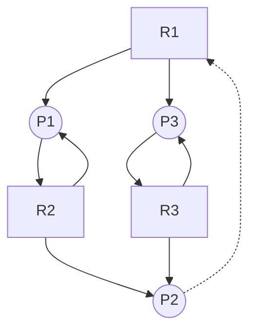

# CS3103 Assignment

## Assignment 1

### Section 1: Scheduling

Consider the following process A, B, C, and D with arrival times, processing times (i.e., burst time), and deadlines as given in the following table. The deadline is the time when a process is expected to complete.

| Process | Arrival Time | Processing Time | Deadline |
| ------- | ------------ | --------------- | -------- |
| A | 0 | 9 | 13 |
| B | 1 | 2 | 12 |
| C | 4 | 7 | 14 |
| D | 5 | 3 | 18 |

Q1.1. Compute the finish time, response time, and turnaround time for each process for the following CPU scheduling algorithms. Please answer the finish time, response time, and turnaround time of each processor under the following scheduling algorithms by completing the provided table:

- First-Come-First-Served (FCFS)
- Preemptive Shortest Job First (PSJF)
- Round Robin (RR) with time quantum = 1 (assume processes can be executed immediately upon arrival)

A1.1.

Recall: response time = start time - arrival time, turnaround time = finish time - arrival time

(1) FCFS

- t=0: A arrives, A starts (t=0~9)
- t=1: B arrives, queue: B
- t=4: C arrives, queue: B, C
- t=5: D arrives, queue: B, C, D
- t=9: A finishes, B starts (t=9~11)
- t=11: B finishes, C starts (t=11~18)
- t=18: C finishes, D starts (t=18~21)
- t=21: D finishes

| Process | Arrival Time | Start Time | Finish Time | Response Time | Turnaround Time |
| ------- | ------------ | ---------- | ----------- | -------------- | ---------------- |
| A | 0 | 0 | 9 | 0-0=0 | 9-0=9 |
| B | 1 | 9 | 11 | 9-1=8 | 11-1=10 |
| C | 4 | 11 | 18 | 11-4=7 | 18-4=14 |
| D | 5 | 18 | 21 | 18-5=13 | 21-5=16 |

(2) PSJF

- t=0: A (9) starts (t=0~9)
- t=1: B (2) arrives, preempt A, B starts (t=1~3), queue: A (8)
- t=3: A (8) starts (t=3~11)
- t=4: C (7) arrives, A continues (t=4~11), queue: C (7)
- t=5: D (3) arrives, preempt A, D starts (t=5~8), queue: A (6), C (7)
- t=8: D finishes, A starts (t=8~14), queue: C (7)
- t=14: A finishes, C starts (t=14~21)
- t=21: C finishes

| Process | Arrival Time | Start Time | Finish Time | Response Time | Turnaround Time |
| ------- | ------------ | ---------- | ----------- | -------------- | ---------------- |
| A | 0 | 0 | 14 | 0-0=0 | 14-0=14 |
| B | 1 | 1 | 3 | 1-1=0 | 3-1=2 |
| C | 4 | 14 | 21 | 14-4=10 | 21-4=17 |
| D | 5 | 5 | 8 | 5-5=0 | 8-5=3 |

(3) RR

- t=0: A starts (9->8)
- t=1: B arrives, B starts (2->1), queue: A (8)
- t=2: A (8->7), queue: B (1)
- t=3: B (1->0), queue: A (7), B finishes at t=4
- t=4: C arrives, C starts (7->6), queue: A (7)
- t=5: D arrives, D starts (3->2), queue: A (7), C (6)
- t=6, 7, 8: A (7->6), C (6->5), D (2->1)
- t=9, 10, 11: A (6->5), C (5->4), D (1->0), D finishes at t=12
- t=12, 13: A (5->4), C (4->3)
- t=14, 15: A (4->3), C (3->2)
- t=16, 17: A (3->2), C (2->1)
- t=18, 19: A (2->1), C (1->0), C finishes at t=20
- t=20: A (1->0), A finishes at t=21

| Process | Arrival Time | Start Time | Finish Time | Response Time | Turnaround Time |
| ------- | ------------ | ---------- | ----------- | -------------- | ---------------- |
| A | 0 | 0 | 21 | 0-0=0 | 21-0=21 |
| B | 1 | 1 | 4 | 1-1=0 | 4-1=3 |
| C | 4 | 4 | 20 | 4-4=0 | 20-4=16 |
| D | 5 | 5 | 12 | 5-5=0 | 12-5=7 |

Q1.2. Is it possible to schedule these four processes so that they all meet their deadlines? If yes, please explain how to schedule them. If not, please explain why.

A1.2. No. Because the total processing time of the processes is 9+2+7+3=21, which is greater than the latest deadline 18. Therefore, it is impossible to make all processes meet their deadlines.

Q1.3. Considering the following four algorithms: FCFS, non-preemptive SJF, preemptive SJF and RR. Please answer the following questions.

(a)	Which algorithm(s) has/have the maximum CPU utilization (suppose the context switch overhead can be ignored)?  
(b)	Which algorithm(s) has/have the minimum average waiting time?  
(c)	Which algorithm(s) is/are the fairest?

A1.3.

(a) All algorithms have the same CPU utilization.  
(b) Preemptive SJF has the minimum average waiting time.  
(c) RR is the fairest.

Q1.4. Suppose a process has the following four states: Not arrived, Ready, Running, and Finished. Under Round-Robin (RR) scheduling, what are the states of the four processes at time points 2.1, 3.4, 8.2, and 15.4 respectively? Please explain how did you get your answer.

A1.4.

At t=2.1, A is running, B is ready, C is not arrived, D is not arrived. Reason: at t=2.1, the queue is (A, B). Since B was running during t=1~2, A is running now and B is ready to be executed next.

At t=3.4, A is ready, B is running, C is not arrived, D is not arrived. Reason: at t=3.4, the queue is (A, B). Since A was running during t=2~3, B is running now and A is ready to be executed next. (Though C arrives at t=4, which causes the queue to be (A, B, C) and C to be executed next, but this is irrelevant to the states at t=3.4.)

At t=8.2, A is ready, B is finished, C is ready, D is running. Reason: B has finished at t=4. The queue is (A, C, D). Since C was running during t=4~7, D is running now and A, C are ready to be executed next.

At t=15.4, A is ready, B is finished, C is running, D is finished. Reason: D has finished at t=12. The queue is (A, C). Since A was running during t=14~15, C is running now and A is ready to be executed next.

Q1.5. During time interval [2.1, 8.6], how many times does the system switches from the user mode to the kernel mode, and how many times does the system switches from the kernel mode to the user mode? Please explain how did you get your answer.

A1.5. There are 6 switches from the user mode to the kernel mode, and 6 switches from the kernel mode to the user mode.

This is because there are 6 context switches during the time interval, at t=3, 4, 5, 6, 7, 8, respectively. In each context switch, the system first switches from the user mode to the kernel mode to perform the context switch, and then switches from the kernel mode to the user mode to resume or start the next process.

### Section 2: Process

Q2.1. `Run process-run.py` with flags in tutorial 2. 

One important behavior is what to do when an I/O completes. With `-I IO_RUN_LATER`, when an I/O completes, the process that issued it is not necessarily run right away; rather, whatever was running at the time keeps running. 

What happens when you run this combination of processes? (`-l 3:0,5:100,5:100,5:100 -S SWITCH_ON_IO -I IO_RUN_LATER -c -p`) Are system resources being effectively utilized?

A2.1. This combination include 1 process with issue 3 I/Os, and another 3 processes which occupies the CPU for 5 time units each. Each I/O takes 1 time unit to issue and 4 more time units to complete.

The timeline is as follows:

- t=1: PID 0 issues I/O
- t=2~5: PID 0 waits for I/O to complete
- t=2~6: PID 1 runs
- t=7~11: PID 2 runs
- t=12~16: PID 3 runs
- t=17: PID 0 issues I/O
- t=18~21: PID 0 waits for I/O to complete
- t=22: PID 0 issues I/O
- t=23~26: PID 0 waits for I/O to complete
- t=27: PID 0 finishes

In brief, PID 0 issues the first I/O at start, and the remaining 2 I/Os at t=17 and t=22. PID 1, PID 2, PID 3 executes one after another, and PID 0 is not resumed until all other processes are finished.

During the 27 time units, the CPU is busy for 18 time units, the I/O is busy for 12 time units. CPU utilization is 18/27=66.67%, I/O utilization is 12/27=44.44%. The system resources are not being effectively utilized becaused the I/O could be utilized while the CPU is running other processes.

Q2.2. Now run the same processes `process-run.py`, but with `-I IO_RUN_IMMEDIATE` set, which immediately runs the process that issued the I/O. How does this behavior differ? Why might running a process that just completed an I/O again be a good idea?

A2.2. The timeline is as follows:

- t=1: PID 0 issues I/O (t=2~5: waits for I/O to complete)
- t=2~5: PID 1 runs
- t=6: PID 0 interrupts PID 1 to issue I/O (t=7~10: waits for I/O to complete)
- t=7: PID 1 runs
- t=8~10: PID 2 runs
- t=11: PID 0 interrupts PID 2 to issue I/O (t=12~15: waits for I/O to complete)
- t=12~13: PID 2 runs
- t=14~18: PID 3 runs

In brief, PID 0 issues all 3 I/Os at t=1, t=6, t=11, is resumed immediately after each I/O is finished, and interrupts other processes to start its next I/O.

During the 18 time units, the CPU is busy for 18 time units, the I/O is busy for 12 time units. CPU utilization is 18/18=100%, I/O utilization is 12/18=66.67%.

Running a process that just completed an I/O again is a good idea because it can make full use of CPU and I/O resources. When a process have just completed an I/O, it is likely that it will issue another I/O soon, so it is better to resume the process immediately which makes CPU and I/O work in parallel.

### Section 3: Synchronization

Q3.1. Run `x86.py` in tutorial 3 like this: `./x86.py -p loop.s -t 2 -i 3 -r -a dx=3,dx=3 -R dx`. This makes the interrupt interval small/random; use different seeds (`-s 1`, `-s 2`, etc) to see different interleavings. Does the interrupt frequency change anything?

`loop.s`:

```
.main
.top
sub  $1,%dx
test $0,%dx
jgte .top
halt
```

`loop.s` is a loop that decrements `dx` by 1 each time, and jumps to start if `dx` is greater than or equal to 0. In other words, the program halts when `dx` becomes negative.

The interrupt frequency does not change anything. The result is always the same: the `dx` for both threads is -1 at the end, which is as expected.

Reason: Each interrupt introduces a context switch, which stores the current state of some registers for the current thread and restores the state of the registers for the next thread. Since `dx` is a register, it is saved and restored during the context switch and exclusive to each thread. Therefore, no race condition occurs and the result is always the same.

Q3.2. Run with multiple iterations/threads: `./x86.py -p looping-race-nolock.s -t 2 -a bx=3 -M 2000`. Why does each thread loop three times? What is final value of value?

`looping-race-nolock.s`:

```
# assumes %bx has loop count in it

.main
.top
# critical section
mov 2000, %ax  # get 'value' at address 2000
add $1, %ax    # increment it
mov %ax, 2000  # store it back

# see if we're still looping
sub  $1, %bx
test $0, %bx
jgt .top

halt
```

`looping-race-nolock.s` involves two parts in the loop body: the critical section and remainder section. The critical section increments the value at address 2000 by 1, and the remainder section decrements `bx` by 1 and halts when `bx` becomes 0. Therefore, the loop will be executed `bx` times.

Each thread loops three times because the initial value of `bx` is 3 for each thread, and `bx` is a register exclusive to each thread, hence changing the value of `bx` in one thread does not affect the value of `bx` in another thread.

The final value of `value` is 6. Since no context switch occurs during the critical section, no race condition occurs and the critical section is executed 6 times in total, which increments the value at address 2000 by 6.

## Assignment 2

### Section 1: Deadlock

Consider thw following resource allocation graph:



(1) Does the above allocation graph contain a deadlock? Explain your answer using no more than two sentences.

Consider the four necessary conditions for deadlock:

- mutual exclusion: resources cannot be shared
- hold and wait: a process holds a resource and waits for another
- no preemption: resources cannot be preempted
- circular wait: a cycle in the resource allocation graph

Banker's algorithm:

| Process | Allocation | Need |
| ------- | ---------- | ---- |
| P1 | 1,1,0 | 0,1,0 |
| P2 | 0,1,1 | 0,0,0 |
| P3 | 1,0,1 | 0,0,1 |

Work = Available = 0,0,0

Execution sequence:

- P2: `need[2] = 0,0,0 <= work = 0,0,0`, finish
    - `work += allocation[2] = 0,1,1`
- P1: `need[1] = 0,1,0 <= work = 0,1,1`, finish
    - `work += allocation[1] = 1,2,1`
- P3: `need[3] = 0,0,1 <= work = 1,2,1`, finish
    - `work += allocation[3] = 2,2,2`

Answer: There is no deadlock. One possible execution sequence is P2→P1→P3.

(2) Assume now that P2 also demands resource R1. Does this allocation graph contain a deadlock? Explain your answer using no more than two sentences.

Banker's algorithm:

| Process | Allocation | Need |
| ------- | ---------- | ---- |
| P1 | 1,1,0 | 0,1,0 |
| P2 | 0,1,1 | 1,0,0 |
| P3 | 1,0,1 | 0,0,1 |

Work = Available = 0,0,0

Execution sequence: we cannot find a process that can be executed because no process has `need <= work`.

Answer: There is a deadlock. The cycle P2→R1→P3→R3→P2 satisfies the four necessary conditions for deadlock, including circular wait.

(3) Assume the allocation graph in problem b), and, in addition, assume that R2 has now three instances. Does this allocation graph contain a deadlock? Explain your answer using no more than two sentences. 

Banker's algorithm:

Work = Available = 0,0,1

Execution sequence:

- P3: `need[3] = 0,0,1 <= work = 0,0,1`, finish
    - `work += allocation[3] = 1,0,2`
- P2: `need[2] = 1,0,0 <= work = 1,0,2`, finish
    - `work += allocation[2] = 1,1,3`
- P1: `need[1] = 0,1,0 <= work = 1,1,3`, finish
    - `work += allocation[1] = 2,2,3`

Answer: There is no deadlock. The only possible execution sequence is P3→P2→P1.

(4) Add to the original allocation graph an additional process P4 that demands an instance of R1. Does the allocation graph contain a deadlock? Explain your answer using no more than two sentences. 

Banker's algorithm:

| Process | Allocation | Need |
| ------- | ---------- | ---- |
| P1 | 1,1,0 | 0,1,0 |
| P2 | 0,1,1 | 0,0,0 |
| P3 | 1,0,1 | 0,0,1 |
| P4 | 0,0,0 | 1,0,0 |

Work = Available = 0,0,0

Execution sequence:

- P2: `need[2] = 0,0,0 <= work = 0,0,0`, finish
    - `work += allocation[2] = 0,1,1`
- P3: `need[3] = 0,0,1 <= work = 0,1,1`, finish
    - `work += allocation[3] = 1,1,2`
- P1: `need[1] = 0,1,0 <= work = 1,1,2`, finish
    - `work += allocation[1] = 2,2,2`
- P4: `need[4] = 1,0,0 <= work = 2,2,2`, finish
    - `work += allocation[4] = 2,2,2`

Answer: There is no deadlock. One possible execution sequence is P2→P3→P1→P4.

### Section 2: Deadlock

Consider the following snapshot of a system:

| Process | Allocation | Max |
| ------- | ---------- | --- |
| P0 | 2,1,3,2 | 5,3,5,4 |
| P1 | 1,2,2,1 | 3,5,7,3 |
| P2 | 4,3,4,4 | 5,5,5,5 |
| P3 | 1,4,1,2 | 3,7,2,4 |
| P4 | 4,3,2,4 | 7,5,3,6 |

Available = 2,2,2,1

(1) Compute the need matrix.

| Process | Need |
| ------- | ---- |
| P0 | 3,2,2,2 |
| P1 | 2,3,5,2 |
| P2 | 1,2,1,1 |
| P3 | 2,3,1,2 |
| P4 | 3,2,1,2 |

(2) Is the system in a safe state? If so, please list a safe sequence. If not, please explain why.

Banker's algorithm:

Work = Available = 2,2,2,1

- P2: `need[2] = 1,2,1,1 <= work = 2,2,2,1`, finish
    - `work += allocation[2] = 6,5,6,5`
- P0: `need[0] = 3,2,2,2 <= work = 6,5,6,5`, finish
    - `work += allocation[0] = 8,6,9,7`
- P1: `need[1] = 2,3,5,2 <= work = 8,6,9,7`, finish
    - `work += allocation[1] = 9,8,11,8`
- P3: `need[3] = 2,3,1,2 <= work = 9,8,11,8`, finish
    - `work += allocation[3] = 10,12,12,10`
- P4: `need[4] = 3,2,1,2 <= work = 10,12,12,10`, finish
    - `work += allocation[4] = 14,15,14,14`

Answer: The system is in a safe state. One possible safe sequence is P2→P0→P1→P3→P4.

### Section 3: Page Replacement

Given the following reference string of size 12:

5, 3, 2, 1, 5, 4, 6, 3, 7, 9, 5, 1

Run (a) the FIFO replacement algorithm, (b) the LRU page replacement algorithm on the above reference string with a 4-frame physical memory. 

Please compute the number of page faults and page fault ratio (number of page faults divided by the number of references) by FIFO and LRU respectively on that string, respectively.

(a) FIFO:

| Ref | F0 | F1 | F2 | F3 | Page Fault |
| --- | --- | --- | --- | --- | ---------- |
| 5 | **5** | - | - | - | 1 |
| 3 | 5 | **3** | - | - | 2 |
| 2 | 5 | 3 | **2** | - | 3 |
| 1 | 5 | 3 | 2 | **1** | 4 |
| 5 | **5** | 3 | 2 | 1 | 4 |
| 4 | **4** | 3 | 2 | 1 | 5 |
| 6 | 4 | **6** | 2 | 1 | 6 |
| 3 | 4 | 6 | **3** | 1 | 7 |
| 7 | 4 | 6 | 3 | **7** | 8 |
| 9 | **9** | 6 | 3 | 7 | 9 |
| 5 | 9 | **5** | 3 | 7 | 10 |
| 1 | 9 | 5 | **1** | 7 | 11 |

Page fault: 11, Page fault ratio: 11/12 = 0.9167

(b) LRU:

the number in the bracket denotes the last time the page was referenced

| Ref | F0 | F1 | F2 | F3 | Page Fault |
| --- | --- | --- | --- | --- | ---------- |
| 5 | **5**(1) | - | - | - | 1 |
| 3 | 5(1) | **3**(2) | - | - | 2 |
| 2 | 5(1) | 3(2) | **2**(3) | - | 3 |
| 1 | 5(1) | 3(2) | 2(3) | **1**(4) | 4 |
| 5 | **5**(5) | 3(2) | 2(3) | 1(4) | 4 |
| 4 | 5(5) | **4**(6) | 2(3) | 1(4) | 5 |
| 6 | 5(5) | 4(6) | **6**(7) | 1(4) | 6 |
| 3 | 5(5) | 4(6) | 6(7) | **3**(8) | 7 |
| 7 | **7**(9) | 4(6) | 6(7) | 3(8) | 8 |
| 9 | 7(9) | **9**(10) | 6(7) | 3(8) | 9 |
| 5 | 7(9) | 9(10) | **5**(11) | 3(8) | 10 |
| 1 | 7(9) | 9(10) | 5(11) | **1**(12) | 11 |

Page fault: 11, Page fault ratio: 11/12 = 0.9167

### Section 4: Paging

In a machine using multi-level paging policy, the virtual address is subdivided into 4 segments as follows:

- 10 bits for the first-level page table
- 8 bits for the second-level page table
- 6 bits for the third-level page table
- 8 bits for the offset

We use a 3-level page table, such that the first 10-bit are for the first level and so on. The memory is indexed in bytes. 2 bytes per entry, no matter what level.

(1) How many bytes are in one page of such a system (i.e., page size)? Why?

Since the offset within a page is represented by 8 bits, the page size is 2^8 = 256 bytes.

(2) How many entries are needed for the page tables of different levels in a process that has 256KB of memory, which starts at address 0? Why? 

The process has 256KB = 2^18 bytes of memory. The page size is 256 bytes, so there are 2^18/2^8 = 2^10 pages in total.

For the 3rd-level page table, each entry points to a page. There are 2^10 = 1024 entries in the 3rd-level page table.

For the 2nd-level page table, each entry points to a 3rd-level page table, which contains 2^6=64 entries. There are 1024/64 = 16 entries in the 2nd-level page table.

For the 1st-level page table, each entry points to a 2nd-level page table, which contains 2^8=256 entries. There is 1 entry in the 1st-level page table.

### Section 5: Page Replacement

A page replacement algorithm simulator paging-policy.py is available at /public/cs3103/Assignment2 on the gateway server, which allows you to play around with different page-replacement policies. The default policy is FIFO, though others are available, including LRU.

For a cache of size 3, generate worst-case address reference streams (the number of addresses is 10 and the maximum of addresses is 10) for each of the following policies: FIFO and LRU. A worst-case reference stream for a specific policy, for example FIFO, causes the largest (among FIFO and LRU) number of misses when using this policy.

Give the address reference stream in the style of “./paging-policy.py --addresses=5,8,9,2,7,7,6,1,0,3 -p FIFO -C 3 -n 10 -c” or “./paging-policy.py --addresses=5,8,9,2,7,7,6,1,0,3 -p LRU -C 3 -n 10 -c”

 For the worst-case reference streams, what is its hit rate and how much bigger of a cache is needed to improve performance dramatically(increase by more than 20%)? 

### Section 6: File System

A file system simulator vsfs.py is available at /public/cs3103/Assignment2 on the gateway server. The simulator allows you to get close to how file system state changes when different operations take place by user and system behaviors. The possible operations are: 

- `mkdir`: create a directory
- `create`: create an empty file
- `open`, `close`: open and close a file
- `write`: append data to a file
- `link`: create a hard link
- `unlink`: remove a hard link. If link count is 0, remove the file

The simulator shows the state of the file system by printing the contents of four different data structures:

- inode bitmap: indicates which inodes are allocated
- inode table: shows the contents of each inode
- data bitmap: indicates which data blocks are allocated
- data blocks: shows the contents of each data block

Each indoe has 3 fields:

- File type: `f` for file, `d` for directory
- Data block: the index of the data block that contains the file content
    - For simplicity, we assume that each file has no more than one data block
    - If the file is empty, address is -1
    - If the file is non-empty, address is a non-negative integer indicating the index of the data block
- Link count: the number of hard links to the file

e.g. 

- `[f a:-1 r:1]` means a file with one hard link, no data block allocated
- `[f a:10 r:2]` means a file with two hard links, data block 10 is allocated

Each data block has 2 fields:

- name: the name of the file or directory
- inumber: the index of the inode that contains the file or directory

e.g.

- `[(.,0) (..,0)]` means an empty directory
- `[(.,0) (..,0) (file,1)]` means a directory with one file named `file`
- `[]` means a block that has not been allocated

Example:

```
11110000
[d a:0 r:6] [f a:1 r:1] [f a:-1 r:1] [d a:2 r:2]
11100000
0: [(.,0) (..,0) (y,1) (z,2) (f,3)]
1: [u]
2: [(.,3) (..,0)]
```

- The root directory contains three entries `y`, `z`, and `f`
- `y` refers to inode 1 `[f a:1 r:1]`, it is a file with one hard link, stored at data block 1
    - its value is `u`
- `z` refers to inode 2 `[f a:-1 r:1]`, it is a file with one hard link, no data block allocated
- `f` refers to inode 3 `[d a:2 r:2]`, it is a directory with two hard links, stored at data block 2
    - its content is `[(.,3) (..,0)]`, so `f` is an empty directory

Questions: analyze what operations are performed given the before and after states of the file system.

(1)

Before

```
11000000
[d a:0 r:2] [f a:1 r:1]
11000000
0: [(.,0) (..,0) (y,1)]
1: [u]
```

After

```
11000000
[d a:0 r:2] [f a:1 r:2]
11000000
0: [(.,0) (..,0) (y,1) (m,1)]
1: [u]
```

Initially, there is a file `u` at block 1.

The root directory has a hardlink to `u`, named `y`.

After creating a hard link `m` to `u`, the link count of `u` increases to 2. `y` and `m` both refer to `u`.

Answer: `link("/y", "/m");`

(2)

Before

```
11110000
[d a:0 r:3] [f a:1 r:1] [f a:-1 r:1] [d a:2 r:2]
11100000
0: [(.,0) (..,0) (y,1) (z,2) (f,3)]
1: [u]
2: [(.,3) (..,0)]
```

After

```
11110000
[d a:0 r:3] [f a:1 r:1] [f a:3 r:1] [d a:2 r:2]
11110000
0: [(.,0) (..,0) (y,1) (z,2) (f,3)]
1: [u]
2: [(.,3) (..,0)]
3: [s]
```

> For reference, to create and write a file, the command would look like `fd=open("/g", O_WRONLY|O_APPEND); write(fd, buf, BLOCKSIZE); close(fd);`

Initially, inode 2 is a file with one hard link, which is `z` in the root directory. The file is empty, so no data block is allocated.

After the operation, inode is allocated data block 3, and the file is written with content `s`.

Answer: `fd=open("/z", O_WRONLY|O_APPEND); write(fd, buf, BLOCKSIZE); close(fd);` where `buf` is the content `s`.

(3)

Before

```
11111100
[d a:0 r:3] [f a:1 r:3] [f a:3 r:2] [d a:2 r:2] [f a:-1 r:1] [f a:-1 r:1]
11110000
0: [(.,0) (..,0) (y,1) (z,2) (f,3) (a,1) (c,5)]
1: [u]
2: [(.,3) (..,0) (m,4) (k,2) (u,1)]
3: [s]
```

After

```
11111110
[d a:0 r:3] [f a:1 r:3] [f a:3 r:2] [d a:2 r:2] [f a:-1 r:1] [f a:-1 r:1] [f a:-1 r:1]
11110000
0: [(.,0) (..,0) (y,1) (z,2) (f,3) (a,1) (c,5)]
1: [u]
2: [(.,3) (..,0) (m,4) (k,2) (u,1) (y,6)]
3: [s]
```

Initially, 6 inodes are allocated. After the operation, 7 inodes are allocated with the first 6 unchanged.

The new inode is an empty file with one hard link and no data block allocated. Data block 2 has a new entry `y` that refers to the new file.

As for its parent directory, it is data block 2, refering to inode 3. Inode 3 is a directory with two hard links, which is `z` in data block 0 and `.` in data block 2. Therefore its parent directory is `/z`.

The name of the new file is `y`.

The parent directory of the new file is `/z` at inode 3 and stored at data block 2.

Answer: `create("/y");`

(4) Now reduce the number of data blocks in the file system, to very low numbers (say two), and run the simulator for a hundred or so requests. What types of files end up in the file system in this highly constrained layout? What types of operations would fail? 

mkdir(), open(), write() and close() would fail because new files or directories require data blocks to be allocated.

create(), link() and unlink() are unaffected because they work with inodes or existing data blocks.

Therefore, directories and files with content would not be created. The system is likely to have many empty files.

(5) Now do the same, but with inodes. With very few inodes, what types of operations can succeed? Which will usually fail? What is the final state of the file system likely to be? 

open(), write(), close(), link() and unlink() can succeed.

mkdir() and create() would fail because new directories or files require inodes to be allocated.

The final state of the file system is likely to have few files with content and/or directories, and many links to them.