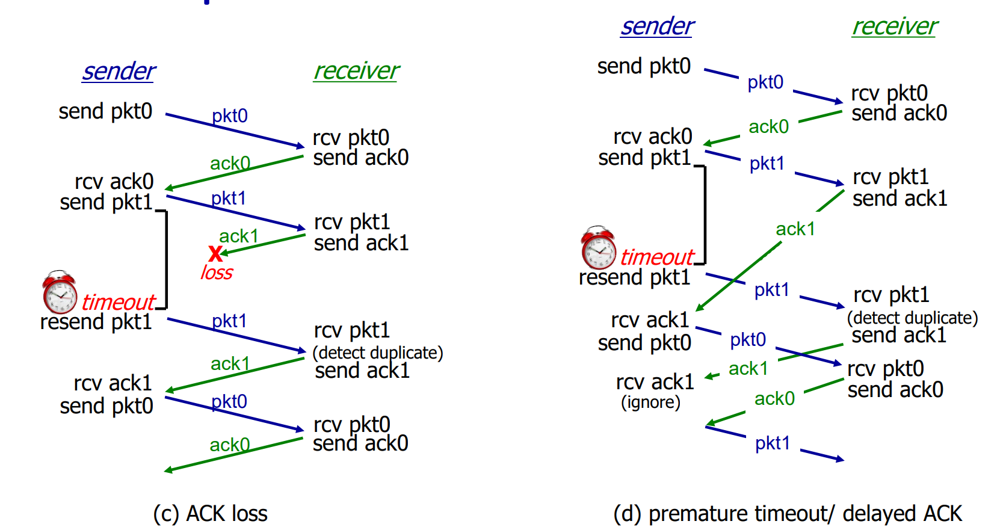

# CS3201 - Computer Networks

## 1. Introduction

### Terminology

- **Networks**: A set of devices (nodes) connected by communication links.
- **Internet**: A network of networks, interconnected ISPs.
- **Protocols** define the **format** and the **order** of messages sent and received among network entities, and the **actions** taken on the transmission and/or receipt of a message.

### Network Edge

- **Hosts**: Clients and servers; running application programs; at the edge of the network.
- **Access networks & physical media**: Wired, wireless communication links; routers and switches.
- **Network core**: Interconnected routers; network of networks.

### Network Core

Host sending function:

- takes application message
- breaks into smaller **packets** of length $L$ bits
- transmits packet into access network
- **transmission rate** = link bandwidth = $R$ bits/sec
- **Packet transmission delay** = time needed to transmit $L$-bit packet into link = $L/R$ sec

#### Packet Switching

- Host splits application-layer message into **packets**, each packet contains source and destination IP addresses
- **forward** packets from one router to the next, across links on path from source to destination
- each packet will be transmitted at **full link capacity**
- **Store-and-forward**:
    - only after **entire** packet arrives at router, can it be transmitted on next link
    - **Packet transmission delay** = $L/R$ sec
    - **End-end delay** = $2L/R$ sec (assuming zero propagation delay)
    - **Packet queuing**: if arrival rate > transmission rate, packets will queue, wait for turn
    - **Packet loss**: if router memory (buffer) fills up, packet will be dropped
- Function of network core:
    - **Routing**: **global** network-layer algorithm determines source-destination route taken by packets
    - **Forwarding**: **local** forwarding table in each router determines the appropriate output link for each incoming packet (by header value)

#### Circuit Switching

- End-end resources are reserved, only available when a connection is established between the source and destination.
- Each connection gets a **dedicated** circuit segment (bandwidth is **guaranteed**).
- **No sharing** of circuit segments; they will be idle if not used by the call.
- Example: traditional telephone network
- **Frequency division multiplexing** (FDM):
    - divide the link bandwidth into frequency bands
    - each call allocated its own band; can transmit at max rate of the band (not the entire link)
- **Time division multiplexing** (TDM):
    - time is divided into frames of fixed duration
    - each frame is divided into fixed number of time slots
    - each call gets a time slot, can transmit at max rate of the link (but only during its time slot)

#### Packet Switching vs. Circuit Switching

- Packet switching is more efficient than circuit switching:
    - Packet switching:
        - $N$ users share $R$ bps link
        - each user can transmit up to $R$ bps when transmitting
        - average rate: $N \times R$ bps
    - Circuit switching:
        - $N$ users share $R$ bps link
        - each user can transmit up to an average of $R/N$ bps when transmitting
        - average rate: $R$ bps
- Packet switching is better than circuit switching for bursty data:
    - Sometimes users are active, sometimes idle
    - Resource sharing
    - Does not require call setup
- Packet switching may encounter **excessive congestion**:
    - packet delay and loss when data rate exceeds link capacity
    - protocols needed for congestion control and packet loss recovery
- Improve packet switching reliability:
    - Guarantee bandwidth to audio/video applications

### Internet Structure

- **Internet Service Provider** (ISP): Host connects to ISP, ISP connects to other ISPs.
- ISP Hierarchies:
    - Highest tier:
        - **Tier-1 Commercial ISPs**: International / National coverage (AT&T, Sprint, NTT)
        - **Content Provider Networks**: Regional, bypassing tier-1 ISPs (Google, Facebook)
        - Connected to each other via **Internet Exchange Points** (IXP)
    - IXP: up connection to T1 ISPs / CPNs, down connections to lower-tier ISPs
    - Regional ISPs: up connection to T1 ISPs / CPNs / IXPs, down connections to access ISPs
    - Access ISPs: lower-tier ISPs that connect to end systems (hosts in a local area)

### Performance Metrics

- Delay:
    - **Nodal processing delay**: check bit errors, determine output link, typically < msec
    - **Queuing delay**: $La/R$ (L = packet length, a = average packet arrival rate, R = link bandwidth)
        - $La/R \to 0$ when traffic is light
        - $La/R \to 1$ when traffic is heavy
        - $La/R > 1$, more work arriving than can be serviced, theoretically infinite delay
        - queueing delay grows with packets arriving at the same time
    - **Transmission delay**: $L/R$ (L = packet length, R = link bandwidth)
    - **Propagation delay**: $d/s$ (d = length of physical link, s = propagation speed in medium)
    - **Total nodal delay** = processing delay + queuing delay + transmission delay + propagation delay
- Packet loss:
    - **Packet loss**: when a packet is arriving at a router with a full buffer, the packet will be dropped
    - **Congestion control** algorithms: limit number of packets in transit, so that loss rate is low
- Throughput: rate (bits/time unit) at which bits transferred between sender/receiver
    - **Instantaneous throughput**: rate at given point in time
    - **Average throughput**: rate over longer period of time, $F/T$ bits/sec (F = file size, T = transfer time)
    - **bottleneck link**: slowest link segment on end-end path
    - End-end throughput = $\min(R_c, R_s, R/N)$ ($R_c$ = source sending rate, $R_s$ = destination receiving rate, $N$ = number of connections sharing main link); $R_c$ or $R_s$ is bottleneck link

### Protocol Layers

- **Layering**: each layer implements a service, via its own internal-layer actions, relying on services provided by layer below
- Advantages of layering: **Modularization**, easier to maintain and update the system (change specific layer without affecting other layers)
- 5-layer Internet protocol stack:
    - **Application**: supporting network applications (FTP, SMTP, HTTP)
    - **Transport**: process-process data transfer (TCP, UDP)
    - **Network**: routing of datagrams from source to destination (IP, routing protocols)
    - **Link**: data transfer between neighboring network elements (Ethernet, 802.11)
    - **Physical**: bits "on the wire"
- Encapsulation example:
    - Source: Application -> Transport -> Network -> Link -> Physical
    - Switch: Physical -> Link -> Physical
    - Router: Physical -> Link -> Network -> Link -> Physical
    - Destination: Physical -> Link -> Network -> Transport -> Application
- OSI reference model: application, *presentation*, *session*, transport, network, link, physical
    - **Presentation** and **Session** layers are not implemented in the Internet protocol stack
    - If needed, will be implemented in the application layer

## 2. Application Layer

### Principles of Network Applications

#### Creating a network application

A network application is a program that runs on different end systems and communicates over a network.

User applications only run on client and server hosts, not network-core devices.

#### Client-server architecture

- **Server**:
    - always-on host
    - permanent IP address
    - most servers are physically in data centers, for scaling (extendable)
- **Clients**:
    - communicate with server only during session
    - may have dynamic IP addresses
    - **do not directly communicate** with each other

#### P2P architecture

- No central server
- Randomly distributed end systems **directly communicate** with each other
- Peer request from other peers, and provide service in return
- **Self-scalability**: new peers bring new service capacity, as well as new service demands
- Connection between peers are **dynamic** (peers may join/leave the network at any time; IP addresses may change)

#### Processes communicating

- **Process**: program running within a host
- **Client process**: process that initiates communication (active open)
- **Server process**: process that waits to be contacted (passive open)
- **Inter-process communication**: process **within the same host** communicate by IPC mechanisms (shared memory, message passing)
- Process in different hosts communicate by exchanging messages

#### Sockets

- **Socket**: interface between **application layer** and **transport layer**
- Process sends/receives messages to/from its socket
- TCP or UDP
- One socket on each end, identified by **socket address** (IP address + port number)

#### Addressing processes

- serves as **process identifier**, = IP address + port number
- Example Port numbers:
    - HTTP: 80 / 8080
    - HTTPS: 443 / 8443
    - SMTP: 25
    - FTP: 20 / 21

### Web and HTTP

#### Elements of Web page

- Base HTML file: contains **references to other objects**; markup tags indicate how objects are linked together
- Referenced objects: HTML file, JPEG image, Java applet, audio file, ... They can be stored in the same host or different hosts.
- All objects are retrieved from the server, and assembled together by the browser.
- Each object is separately addressable by a **URL** (Uniform Resource Locator, = host name + path name)

#### Hypertext Transfer Protocol (HTTP)

- One of the application-layer protocol
- Use **Client-server** model
    - Client: browser; sends request, receives response, displays web object
    - Server: web server; receives request, sends response
- Use **TCP** as the underlying transport-layer protocol
- Example of TCP client-server interaction:
    - Client creates a TCP socket, connects to server on port 80
    - Server accepts TCP connection request from client
    - HTTP requests and responses sent over TCP connection
    - After page is received, TCP connection is closed
- HTTP is **stateless**: DOES NOT include information about past client requests
    - Server thus maintains no information about clients
    - **Cookies** can be used to retain state information

#### Persistent HTTP

- HTTP was non-persistent initially: for a webpage containing $N$ objects (excluding HTML file), 
    - $N+1$ TCP connections are needed
    - $2N$ RTTs are needed to retrieve all objects
    - **Round Trip Time (RTT)**: time for a small packet to travel from client to server and back
    - HTTP response time per object = 2RTT + file transmission time
        - 1st RTT is used to initiate TCP connection
        - 2nd RTT is used to request and receive the object
        - File transmission happens at the middle of the 2nd RTT
    - Issues:
        - OS overhead (=cost) for each TCP connection
        - browsers open parallel TCP connections to fetch referenced objects
        - browsers have to wait HTML to fully arrive before fetching referenced objects
- HTTP is persistent since HTTP/1.1
    - Server keeps connection open after sending response
    - Subsequent HTTP messages between same client/server sent over open connection
    - Client sends requests as soon as it encounters a referenced object
    - **1RTT** for all referenced objects (parallel TCP connections are not needed)

Example (Tutorial 3 Q5):

Assume RTT = T, and file transmission time = t. Client wants to retrieve a webpage containing 10 objects (excluding HTML file).

1. Under non-persistent HTTP and single TCP connection:
    - Establish + HTML = 2T + t
    - 10 repeats of (Establish + Object) = 10 \* (2T + t)
    - Total = 22T + 11t
2. Under persistent HTTP and single TCP connection:
    - Establish + HTML = 2T + t
    - 10 objects = T + 10t
    - Total = 3T + 11t
3. Under non-persistent HTTP and 5 parallel TCP connections:
    - Establish + HTML = 2T + t
    - 2 repeats of (Establish + 5 Objects) = 2 \* (2T + 5t)
    - Total = 6T + 11t
4. Under persistent HTTP and 5 parallel TCP connections:
    - Establish + HTML = 2T + t
    - 2 objects = T + 2t
    - Total = 3T + 3t

#### HTTP request message

- 2 types of HTTP messages: **request**, **response**
- Request message is in human-readable format, and is sent from client to server
- Response message can be of any format (including binary), and is sent from server to client
- Request command:
    - `GET`: requests with parameters visible in URL
    - `POST`: requests with parameters invisible in URL; can send large amount of data
    - `HEAD`: GET request, but only response header is returned
    - `PUT`: upload data to the server, replace if already exists

Sample `GET` request message:

```
GET /index.html HTTP/1.1\r\n
Host: www-net.cs.umass.edu\r\n
User-Agent: Firefox/3.6.10\r\n
Accept: text/html,application/xhtml+xml\r\n
Accept-Language: en-us,en;q=0.5\r\n
Accept-Encoding: gzip,deflate\r\n
Accept-Charset: ISO-8859-1,utf-8;q=0.7\r\n
Keep-Alive: 115\r\n
Connection: keep-alive\r\n
\r\n
```

- Line 1: request line, includes the command `GET`, the path `/index.html`, and the HTTP version `HTTP/1.1`
- Line 2-8: header lines, each line is in the format of `field-name: field-value`
- A repeated `\r\n` indicates the end of the header lines

#### HTTP response message

Sample `200 OK` response message:

```
HTTP/1.1 200 OK\r\n
Date: Sun, 26 Sep 2010 20:09:20 GMT\r\n
Server: Apache/2.0.52 (CentOS)\r\n
Last-Modified: Tue, 30 Oct 2007 17:00:02 GMT\r\n
ETag: "17dc6-a5c-bf716880"\r\n
Accept-Ranges: bytes\r\n
Content-Length: 2652\r\n
Keep-Alive: timeout=10, max=100\r\n
Connection: Keep-Alive\r\n
Content-Type: text/html; charset=ISO-8859-1\r\n
\r\n
<html> ... </html>
```

- Line 1: status line, includes the HTTP version `HTTP/1.1`, the status code `200 OK`, and the status message `OK`
- Line 2-10: header lines, each line is in the format of `field-name: field-value`
- Line 12: response body, contains the requested object

- **Status Code**:
    - `200 OK`: request succeeded, requested object later in this message
    - `301 Moved Permanently`: requested object moved, new location specified in `Location:` header line (browser will auto redirect)
    - `400 Bad Request`: request message not understood by server (request command/header line format error)
    - `404 Not Found`: requested document not found on this server
    - `505 HTTP Version Not Supported`: HTTP version not supported by server

#### Cookies

- Without cookies, HTTP is stateless, all HTTP requests are independent
- Sites and client browsers can maintain **state** information across sessions by using cookies
- Components of Cookies:
    - `Cookie:` header line in HTTP response message
    - For requests after the cookie is set, `Cookie:` header line in HTTP request message
    - Cookie file managed by client browser
    - Cookie file stored in server's database
- Cookie can be used for authentication, shopping carts, recommendations, user session state, ...

1. Cookie is created by server when client first visits the site, then sent to client browser and saved in server's database
2. Cookie file is saved in client browser, and will be sent to server in subsequent requests
3. Server access database to retrieve client's state information

#### Web Caches (Proxy Server)

- If clients request an object in cache: proxy server returns the object
- Else: proxy server requests the object from the origin server, then returns the object to the client and saves a copy in its cache
- Proxy server serves as **both a client and a server**
- Cache is installed by university / company / residential ISP
- Advantages:
    - **Reduce response time** for client request
    - **Reduce traffic** for server access link

#### Example: Proxy Server

```mermaid
graph LR
    A[Client A] -- 1.request --> B[(Proxy Server)]
    B -- 2.request from A --> C[(Origin Server)]
    C -. 3.response for A .-> B
    B -. 4.cache the object .-> A
    D[Client B] -- 5.request for same object --> B
    B -. 6.use cached object .-> D
```

#### Conditional GET

- Client send `If-modified-since: <date>` header line in HTTP request message
- If the object is last-modified after `<date>`, server returns the object with status code `200 OK`
- Else, server returns the object with status code `304 Not Modified`, and no object is attached in the response message

### Email

#### Email System Components

- **User agent**: mail reader (Outlook, Thunderbird, etc.)
- Mail servers:
    - **Mailbox**: incoming (received) messages
    - **Message queue**: outgoing (to be sent) messages
- **SMTP**: protocol **between** mail servers to send email messages

#### Email Access Protocols

- **HTTP**: access in web browser (Yahoo! Mail, Hotmail, etc.)
- **POP3**: Post Office Protocol, version 3
    - Authorization (agent <--> server)
    - Onced downloaded to client, the message is deleted from the server
    - Messages are stored in the client side
- **IMAP**: Internet Mail Access Protocol
    - Authorization (agent <--> server)
    - Messages are stored in the server side
    - features: folders / message state information (read, replied, deleted) / search capability

#### Example: Sending and Receiving Email


### Domain Name System (DNS)

- **IP address**: 32-bit (IPv4) or 128-bit (IPv6) identifier for host, interface, or router interface
- **Host name**: Human-readable name in UTF-8 format, e.g. `欢迎.中国`
- DNS **maps host names to IP addresses**
- **Name server**: distributed database (i.e. only part of the database is stored in each server)
- DNS is an application-layer protocol

#### DNS Services

- Translating host names to IP addresses
- **Host aliasing**: multiple host names correspond to the same IP address
- Mail server aliasing
- **Load distribution**: multiple IP addresses correspond to the same host name

#### DNS Hierarchical Structure

- Centralized service are not designed for scalability; **DNS is decentralized**
- DNS uses a **hierarchical** (multi-level) structure: `Root > Top-level domain > Authoritative domain > Local domain`
- For example, query `www.google.com`: Client -> **Local DNS serve** (e.g. ISP) -> **Root DNS server** -> `.com` DNS server -> `google.com` DNS server -> `www.google.com` IP address
- There are 13 root DNS servers worldwide, each with multiple instances
- Top-level domain servers are managed globally (top-level country domains are managed by each country)
- Authoritative DNS servers are managed by organizations themselves (website they own) or service providers (e.g. Google DNS)
- Local DNS servers are managed by ISPs, has **local cache** of recent queries, acts as proxy for clients
    - After TTL (Time To Live) expires, the local DNS server will discard the entry in its cache. Next time the entry is requested, the local DNS server will query the authoritative DNS server again.
    - Cached entries may be out-of-date. If a website changes its IP address, the local DNS server may still return the old IP address until the TTL expires.

#### Example: Iterative DNS query

Host at `engineering.nyu.edu` wants IP address for `gaia.cs.umass.edu`

```mermaid
graph LR
    A[Host] -- 1.query --> B[Local DNS server]
    B -- 2.ask root server --> C[Root DNS server]
    C -. 3.go ask .edu TLD server .-> B
    B -- 4.query --> D[TLD DNS server]
    D -. 5.go ask UMASS Auth server .-> B
    B -- 6.query --> E[Auhoritative DNS server]
    E -. 7.IP for gaia.cs.umass.edu .-> B
    B -. 8.return IP to Host .-> A
```

- Advantages: Distributed, scalable
- Disadvantages: High latency, single point of failure (at root DNS server)

Example (Tutorial 3 Q3):

User at `m1.alice.com` wants to download 1Gbits file from `www.bob.com/bigfile.html`

Assume:
- Local network transmission rate = $u_0$ = 1Gbps
- Access link transmission rate = $u_a$ = 100Mbps
- Propagation delay from `www.alice.com` to outside network = $d_a$ = 10ms
- Propagation delay from `www.alice.com` to `www.bob.com` = $d_b$ = 30ms
- Iterative DNS query

1. `m1.alice.com` sends request to local DNS server (no delay)
2. Local DNS server sends request to root DNS server ($d_a$ = 10ms)
3. Root DNS server returns name of `.com` TLD server ($d_a$ = 10ms)
4. Local DNS server sends request to `.com` TLD server ($d_a$ = 10ms)
5. TLD server returns `bob.com`'s auth name server ($d_a$ = 10ms)
6. Local DNS server sends request to `bob.com`'s auth name server ($d_b$ = 30ms)
7. `bob.com`'s auth name server returns `www.bob.com`'s IP address ($d_b$ = 30ms)
8. 1Gbit file is transmitted from `www.bob.com` to `www.alice.com` ($1/u_a$ = 10s)
9. `www.alice.com` sends file to `m1.alice.com` ($1/u_0$ = 1s)

Total delay = $4d_a + 2d_b + 1/u_a + 1/u_0$ = 11.10s

Continued: User at `m2.alice.com` wants to download 1Gbits file from `www.bob.com/bigfile.html`

The file has been cached in `www.alice.com`'s local DNS server.

1. `m2.alice.com` sends request to local DNS server (no delay)
2. Local DNS lookup in cache and returns `www.bob.com`'s IP address (no delay)
3. `m2.alice.com` sends request to `www.bob.com`, `www.alice.com` HTTP cache finds the file (no delay)
4. `www.alice.com` HTTP cache sends `GET If-modified-since: <date>` request to `www.bob.com` ($d_b$ = 30ms)
5. `www.bob.com` returns `304 Not Modified` response ($d_b$ = 30ms)
6. `www.alice.com` HTTP cache returns file to `m2.alice.com` ($1/u_0$ = 1s)

Total delay = $2d_b + 1/u_0$ = 1.06s

#### Example: Recursive DNS query

```mermaid
graph LR
    A[Host] -- 1.query --> B[Local DNS server]
    B -- 2.ask root server --> C[Root DNS server]
    C -- 3.ask .edu TLD server --> D[TLD DNS server]
    D -- 4.ask UMASS Auth server --> E[Auhoritative DNS server]
    E -. 5.IP for gaia.cs.umass.edu .-> D
    D -. 6 .-> C
    C -. 7 .-> B
    B -. 8.return IP to Host .-> A
```

- Advantages: Low latency, no single point of failure
- Disadvantages: High reload on higher-level DNS servers

#### DNS Records

- stored in RR (Resource Record) format: `(name, value, type, ttl)`
- `type=A`: `name` = hostname, `value` = IPv4 address
- `type=AAAA`: `name` = hostname, `value` = IPv6 address
- `type=NS` (name server): `name` = domain, `value` = domain's authoritative DNS server's hostname
- `type=CNAME` (canonical name): `name` = alias hostname, `value` = canonical (real) hostname
- `type=MX` (mail server): `name` = domain, `value` = domain's mail server hostname

Example: Register `networkutopia.com` with DNS registrar (domain seller, e.g. GoDaddy)
- Provide names and IP addresses of authoritative name server (primary and secondary)
- Registrar inserts two RRs into `.com` TLD server

TLD records:
```
(networkutopia.com, dns1.networkutopia.com, NS) // map the site to authoritative DNS server
(dns1.networkutopia.com, 212.212.212.1, A) // map the DNS server to its IP address
```

Local records (running authoritative DNS server):
```
(www.networkutopia.com, 212.212.212.1, A)
(networkutopia.com, mail.networkutopia.com, MX) // register the mail server in the same domain
```

#### DNS Query and Reply Messages

DNS query and reply messages are in the same format:

- `16-bit ID`: used to match replies with queries
- `16-bit flags`: query or reply, recursion desired, recursion available, reply is authoritative
- `16-bit query count`: number of questions in the query
- `16-bit RR count`: number of resource records in the reply
- `16-bit authority count`: number of authority RRs in the reply
- `16-bit additional count`: number of additional RRs in the reply
- body query
- reply (RR format)
- authority RR
- additional RR

Note: Authority RR = records for other authoritative servers

### P2P Applications

#### File Distribution Time

In a client-server, let

- $N$ = number of clients
- $F$ = file size (in bits)
- $d_i, u_i$ = download / upload rate of client $i$ (in bps)
- $u_s$ = upload rate of server (in bps)
- assume the network-core has infinite bandwidth

Then the **distribution time** (time to distribute the file to all clients) is: $D_{c\to s} = \max\{NF/u_s, F/d_{\min}\}$

The bottleneck is $NF/u_s$ as $N$ grows large, i.e. the time to send $N$ copies of the file from the server to the network core.

In a P2P network, the distribution time is: $D_{P2P} = \max\{F/u_s, F/d_{\min}, NF/(u_s + \sum_{i=1}^N u_i)\}$

The bottleneck is $NF/(u_s + \sum_{i=1}^N u_i)$, which does not scale as $N$ grows large (assuming all clients have the same upload rate).

Every device only have to upload 1 copy of the file (in fact, it's multiple devices sending fractions of the file).

#### BitTorrent

- File divided into 256KB chunks
- **tracker**: tracks peers participating in torrent
- **torrent**: group of peers exchanging chunks of a file
- Peer joining torrent:
    - has no chunks, but knows how to connect to tracker
    - registers with tracker to get list of peers, connects to torrent
    - Recieving and sending chunks
        - while downloading, peer is also uploading chunks
        - peers may come and go, or change the torrent they are in
- Requesting chunk:
    - At given time, different peers have different subsets of file chunks
    - The client periodically asks peers for list of chunks they have
    - Download missing chunks from peers (simultaneously upload to other peers)
- Sending chunk:
    - Client send her own list of chunks to peers
    - Send chunks to peers who contribute to her (up to 4 senders at a time)

### Video Streaming and Content Distribution Networks

- Challenges:
    - **scalability**: number of users may be very large
    - **heterogeneity**: different users have different bandwidths and connection types
- Solution: **content distribution networks** (CDNs)
    - **Replicate** content in multiple geographically distributed sites
    - **Redirect** user requests to closest server
    - **Load balance** user requests among replicated servers

#### Streaming Stored Video


- Challenges:
    - **bandwidth varying** (in different parts of server-to-client path)
    - **Packet loss and delay** (due to congestion)
    - **Continuous Playout Constraint**: audio/video must be played out at a certain rate (while network delay may vary)
- Solution: **Playout Buffering**
    - Server: transmit video in constant bit rate
    - Client: receive video. Delay may vary
    - **Client Playout Delay**: an initial delay after the first packet is received, before the video starts playing
    - **Buffer**: store received and to-be-played packets in buffer
    - Result: Client can play video smoothly

#### Dynamic Adaptive Streaming over HTTP (DASH)
- Server:
    - divides video into multiple chunks
    - Each chunk is stored in multiple versions, with different bit rates (e.g. 1080p 20Mbps, 1080p 10Mbps, 720p 10Mbps, 720p 5Mbps, ...)
- **Manifest file**: each version of each chunk is given a unique URL
- Client:
    - **periodically measures available bandwidth**
    - consult manifest file and request the most appropriate version of next chunk. Only one chunk is requested at a time.
- Bitrate for different segments during a single video playback may vary
- Client determines:
    - **when to request** next chunk (to prevent buffer running out or overflowing)
    - **what bitrate** to request next chunk
    - **which server** to request from (to minimize latency or maximize throughput - physically closest server may not be the best choice)
- Complete solution for video streaming: CDN + encoding + DASH + playout buffering

#### Content Distribution Networks (CDNs)


- Copies of content are stored in multiple CDN servers
- Site server returns URL of the requested object on closest CDN server
- DNS resolves URL (through CNAME) to retrieve IP address of closest CDN server
- Client connects to closest CDN server to retrieve object

## 3. Transport Layer

### Overview

- Transport layer provides **logical communication between processes** running on different hosts
- Action:
    1. Receive messages from sender's application layer (socket)
    2. Break messages into **segments**, add header
    3. Pass segments to network layer (IP)
    4. Data pass through switches and routers
    5. Receive segments at receiver's network layer (IP)
    6. Check header, extract messages
    7. Pass messages to receiver's application layer (socket)
- Two transport layer protocols: TCP, UDP
    - TCP (Transmission Control Protocol): reliable, in-order delivery, congestion control, flow control, connection setup
    - UDP (User Datagram Protocol): unreliable, unordered delivery, no control or setup, higher throughput
- Transport layer does not guarantee network delay and bandwidth (network layer does)

- Network layer provides logical communication between **hosts**
- Transport layer provides logical communication between **processes** (on different hosts)

### Multiplexing and Demultiplexing

Scenario: Server is responding to multiple clients. How does the server know which client is the message from or to?

- **Multiplexing**: **at sender**, handle data from multiple sockets, add transport header to each segment
- **Demultiplexing**: **at receiver**, use header info to deliver received segments to correct socket

#### TCP Header

Data is organized in 32-bit words, and is stored in **byte stream** format.

<table>
    <thead>
        <tr>
            <th>Word Offset</th>
            <th>Bit Offset</th>
            <th>0-7</th>
            <th>8-15</th>
            <th>16-23</th>
            <th>24-31</th>
        </tr>
    </thead>
    <tbody>
        <tr>
            <td>0</td>
            <td>0</td>
            <td colspan="2"><b>Source Port</b> (0 ~ 65535)</td>
            <td colspan="2"><b>Destination Port</b> (0 ~ 65535)</td>
        </tr>
        <tr>
            <td>1</td>
            <td>32</td>
            <td colspan="4">Sequence Number (0 ~ 4294967295)</td>
        </tr>
        <tr>
            <td>2</td>
            <td>64</td>
            <td colspan="4">Acknowledgement Number (0 ~ 4294967295)</td>
        </tr>
        <tr>
            <td>3</td>
            <td>96</td>
            <td>Data Offset (0-3) + Reserved (4-6) + NS (7)</td>
            <td>CWR ~ FIN</td>
            <td colspan="2">Window Size (0 ~ 65535)</td>
        </tr>
        <tr>
            <td>4</td>
            <td>128</td>
            <td colspan="2">Checksum</td>
            <td colspan="2">Urgent Pointer</td>
        </tr>
        <tr>
            <td>5+</td>
            <td>160+</td>
            <td colspan="4">Options (if Data Offset > 5)</td>
        </tr>
    </tbody>
</table>

#### UDP Structure

<table>
    <thead>
        <tr>
            <th>Word Offset</th>
            <th>Bit Offset</th>
            <th>0-7</th>
            <th>8-15</th>
            <th>16-23</th>
            <th>24-31</th>
        </tr>
    </thead>
    <tbody>
        <tr>
            <td>0</td>
            <td>0</td>
            <td colspan="4">Source IPv4 Address</td>
        </tr>
        <tr>
            <td>1</td>
            <td>32</td>
            <td colspan="4">Destination IPv4 Address</td>
        </tr>
        <tr>
            <td>2</td>
            <td>64</td>
            <td>Rerserved (0)</td>
            <td>Protocol (17)</td>
            <td colspan="2">UDP Length</td>
        </tr>
        <tr>
            <td>3</td>
            <td>96</td>
            <td colspan="2">Source Port (0 ~ 65535)</td>
            <td colspan="2">Destination Port (0 ~ 65535)</td>
        </tr>
        <tr>
            <td>4</td>
            <td>128</td>
            <td colspan="2">Length</td>
            <td colspan="2">Checksum</td>
        </tr>
        <tr>
            <td>5+</td>
            <td>160+</td>
            <td colspan="4">Data</td>
        </tr>
    </tbody>
</table>

Length = Header Length + Data Length, Unit = Byte (1 Word = 4 Bytes)

#### Connectionless Demultiplexing (UDP)

- Sender:
    - When creating socket, must specify process's **local port number**
    - When creating message in UDP socket, must specify **destination IP and port number**
- Receiver:
    - Transport layer receives UDP segment
    - Checks destination port number in segment
    - Sends data to socket with that port number
    - Multiple datagrams from different source IP or source port will be sent to the **same receiver socket**

#### Connection-Oriented Demultiplexing (TCP)

- TCP socket is uniquely identified by 4-tuple: `(source IP, source port, destination IP, destination port)`
- Demultiplexing: receiver uses 4-tuple to direct segment to appropriate socket
- Multiple TCP connections between same pair of hosts
    - Each connection has its own 4-tuple
    - Server host may support many simultaneous TCP sockets: each socket identified by its own 4-tuple
    - Multiple datagrams from different source IP or source port will be sent to **different receiver sockets**

- The basis of multiplexing and demultiplexing is header values - header makes data segment identifiable
- UDP: Demultiplexing only using destination port number, different sender goes to the same socket
- TCP: Demultiplexing using 4-tuple, different sender goes to different socket
- Multiplexing: both UDP and TCP use 4-tuple
- Multiplexing / Demultiplexing happens at **all layers**

### UDP: User Datagram Protocol

- Connectionless: **No handshaking** between UDP sender and receiver
- Each UDP segment handled independently of others (stateless)
- May cause data loss or unordered delivery

Why UDP?
- No connection establishment (RTT delay)
- Simple: No connection state at sender / receiver
- Small header size
- No congestion control

#### Applications of UDP

- **Streaming multimedia**: tolerate data loss but sensitive to delay / transmission rate
- **DNS**
- **SNMP**: Simple Network Management Protocol

#### Transport Layer in UDP

Assuming SNMTP is running over UDP:

- Sender:
    - Transport layer receives messages from application layer
    - Determine UDP header values
    - Create UDP segment
    - Pass UDP segment to network layer (IP)
- Receiver:
    - Transport layer receives UDP segment
    - Check UDP checksum
    - Extract UDP data
    - Demux, send to appropiate socket

#### UDP Checksum

Design Goal: detect errp    

- Sender:
    - Treat segment contents as sequence of 16-bit integers
    - Checksum = 1's complement of sum of segment contents
    - Put checksum value into UDP header (Word 4, Bit 144-159)
- Receiver:
    - Compute checksum of received segment
    - Check if computed checksum equals checksum field value
    - If NO, error detected. Discard segment, send error message to application

Calculating checksum:

- Add all unsigned 16-bit integers
- Use 1's complement arithmetic: if sum > 65535, add carry (1) to the sum
- Finally take 1's complement of the sum
    - if sum highest bit is 1, flip all bits
    - if sum highest bit is 0, do nothing

Example:

```
    1110 0110 0110 0110 A
+   1101 0101 0101 0101 B
-----------------------
  1 1011 1011 1011 1011
-----------------------
    1011 1011 1011 1100 SUM
    0100 0100 0100 0011 CKSUM
```

Usage: sum of all data + CKSUM should be all zeros

Example:

```
    1110 0110 0110 0110 A
+   1101 0101 0101 0100 B
-----------------------
  1 1011 1011 1011 1010
+   0100 0100 0100 0111 CKSUM
-----------------------
 10 0000 0000 0000 0001
```

The result is not all zeros, so there is an error.

### TCP: Transmission Control Protocol

#### Reliable Data Transfer

Network transmission is **unreliable**. TCP provides reliable data transfer by using **pipelining** and **cumulative ACK**.

Abstract of a reliable data transfer protocol:

- Sender:
    - Data from application layer to transport layer
    - Data go under reliable data transfer protocol in transport layer
    - Data go to network layer
- Transmissions: Network layer can corrupt or lose packets
- Receiver:
    - Data from network layer to transport layer
    - Data go under reliable data transfer protocol in transport layer
    - Data go to application layer

#### Stop-and-Wait Protocol




- Design: When sender does not receive ACK before timeout, it retransmits the packet
- Problems:
    - 1 clock cycle = 1 RTT + L / R (packet transmission time)
    - **Utilization** = $\frac{L/R}{RTT + L/R} = \frac{1}{1 + \frac{RTT}{L/R}}$ - sender is idle most of the time

#### Pipelined Protocols


- Design: Allow more than 1 unacknowledged packet in the pipeline
- If allow $N$ unacknowledged packets in the pipeline, the utilization is $\frac{N}{1 + \frac{RTT}{L/R}}$ - improved by $N$ times
- **Go-Back-N**:
    - Sender maintains a window of size $N$
    - Receiver sends cumulative ACK (**doesn't ACK if there is a gap**)
    - Sender keeps a timer for the oldest UNACKed packet
    - If it times out, retransmit all UNACKed packets
- **Selective Repeat**: Another implementation of pipelined protocol
    - Sender maintains a window of size $N$
    - Receiver sends ACK for each packet
    - Sender keeps a timer for each UNACKed packet
    - If it times out, retransmit that packet only

##### Go-Back-N

Denote:
    - $N$ = window size
    - $base$ = no. of oldest unacknowledged packet
    - $next$ = no. of next packet to be sent

- Sender:
    - Window size = $N$, from $base$ to $base + N - 1$
    - ACKed: $0$ to $base - 1$
    - Sent but not ACKed: $base$ to $next - 1$
    - Not sent: $next$ to $base + N - 1$
    - **Culmulative ACK**: ACK for $n$ means $0\cdots n - 1$ are all received; on receiving ACK for $n$, move $base$ to $n + 1$
    - **Timeout**: timer for $base$ packet. When $base$ packet times out, retransmit all packets from $base$ to $next - 1$
- Receiver:
    - Always ACK the **highest in-order packet no.**
    - Example: When 1, 2, 3 are received, ACK 3. When 1, 3, 4 are received, ACK 1 only (when 3 and 4 received, duplicate ACK 1)
    - When receiving out-of-order packet, buffer it and resend ACK for the highest in-order packet no.


##### Selective Repeat

- Sender:
    - Window size = $N$, from $base$ to $base + N - 1$
    - ACKed: $0$ to $base - 1$, and some packets in $base$ to $next - 1$
    - Sent but not ACKed: Some packets in $base$ to $next - 1$
    - Not sent: $next$ to $base + N - 1$
- Sender's Action:
    - if $next < base + N$ and there is a new packet from application layer, send it
    - record timer for the newly sent packet $next$
    - When receiving ACK for $n$:
        - if $base \leq n < base + N$, mark packet $n$ as ACKed
        - if $base = n$ ($n$ is the oldest unACKed packet), move $base$ to the next unACKed packet
        - sender will record not-in-order ACKs, so these packets doesn't have to be retransmitted
        - otherwise, ignore the ACK
- Receiver's Action:
    - if received packet $n$ is in the window $base \leq n < base + N$, send ACK for $n$
        - if the packet is in-order, deliver it to application layer, move $base$ to the next unreceived packet
        - if the packet is out-of-order, buffer it
    - if received packet $n$ is in previous window $base - N \leq n < base$, send ACK for $n$
        - this is because the sender may have missed the ACK for this packet
        - since the window has already moved, the data must be duplicated so just discard it
        - however, ACK must be sent to synchronize the sender's window
    - otherwise, completely ignore the packet


#### Selective Repeat Window Size

Assume sequence number space is $K = 2^m$, then window size $N \leq K / 2$.

If $N > K / 2$, then the selective repeat protocol will not work.

Scenario: $K = 4$, $N = 3$

| Sender Action | Receiver Action | Sender Window | Receiver Window |
| --- | --- | --- | --- |
| Initial | Initial | 0, 1, 2 | 0, 1, 2 |
| Send 0 | Receive 0 | 0, 1, 2 | 1, 2, 3 |
| Send 1 | Receive 1 | 0, 1, 2 | 2, 3, 0 |
| Send 2 | Receive 2 | 0, 1, 2 | 3, 0, 1 |
| ACK 0,1,2 lost | ACK 0, 1, 2 | 0, 1, 2 | 3, 0, 1 |
| Resend 0 | Receive 0 | 0, 1, 2 | 3, 0, 1 |

The receiver has already received packet 0, 1, and 2. Therefore, current `rcv_base` is 3, and the receiver window $[\text{rcv\_base}, \text{rcv\_base} + N - 1] = \{3, 0, 1\}$.

When sender retransmits packet 0, since 0 is within the receiver window, the receiver will incorrectly accept packet 0 as a new packet in the next cycle. And since packet 3 has not been received, the packet 0 is received out of order and buffered by the receiver.

Reference: Assignment 1 Q3

#### Go-Back-N Window Size

In Go-Back-N, the window size $N < K$.

Example 1: $N = 4, K = 4$

Sender sends 0, 1, 2, 3. Receiver receives all and ACK. All ACKs are lost.

At this moment, the sender window is $[0, 1, 2, 3]$, and the receiver window is $[0, 1, 2, 3]$. 

The sender will retransmit all packets in the window. The receiver will reckon them as packets in the next cycle. Therefore, the protocol behaves incorrectly.

Example 2: $N = 3, K = 4$

Sender sends 0, 1, 2. Receiver receives all and ACK. All ACKs are lost.

At this moment, the sender window is $[0, 1, 2]$, and the receiver window is $[3, 0, 1]$.

The sender will retransmit all packets in the window. The receiver discards out-of-order packets and resends ACK 2.

When the sender receives ACK 2, it will move the window to $[3, 0, 1]$. The protocol behaves correctly.

Reference: Tutorial 5

#### TCP Segment Structure


- **Sequence Number**: byte stream number of first byte in segment's data
- **Acknowledgement Number**: next byte expected from other side

e.g. Sending 1-byte message

- Sender: `seq = 42`, `ack = 79`
- Receiver: `seq = sender ack = 79`, `ack = sender seq + length = 43`
- Sender: `seq = receiver ack = 43`, `ack = receiver seq + length = 80`

**Sender and receiver seq number are independent**, they alternate at SEQ and ACK

- Sender: SEQ = sender sequence number, ACK = receiver sequence number
- Receiver: SEQ = receiver sequence number, ACK = sender sequence number
- After a cycle, both SEQ and ACK is incremented by the length of the message
- If the sequence number exceeds $2^{32} - 1$, it will wrap around to $0$

#### TCP Implementation

##### TCP Sender Actions

- Event: Data received from AppLayer
    - Split data into segments
    - Assign sequence number (= byte stream number of first data byte in segment)
    - Start timer for oldest unACKed segment (of current window)
- Event: Timeout
    - Retransmit segment that caused timeout
    - Restart timer
- Event: packet with ACK=y received
    - If y > sendbase, set sendbase to y
    - start timer if there are still unACKed segments

##### TCP Receiver Actions

- Event: arrival of in-order segment with expected seqno
    - If all segments up to expected seqno have been ACKed:
        - delay ACK for up to 500ms
        - If no new segments in this time, send cumulative ACK
    - If another earlier ACK is pending
        - send cumulative ACK immediately
- Event: arrival of out-of-order segment whose seqno > expected seqno
    - buffer the segment
    - immediately send duplicate ACK, with expected seqno
- Event: arrival of segment with lower-than-expected seqno (retransmission)
    - immediately send ACK, if retransmitted segment can fill the gap (move $next$ to the next unreceived packet)
    - otherwise, ignore the segment


Scenario: Sender wants to send 2 segments:
    - `seq = 92`, `len = 8` (`ack = 100`)
    - `seq = 100`, `len = 20` (`ack = 120`)

- Case 1: lost ACK.
- Solution: sender retransmits unACKed segment, receiver reACKs segment.
- Case 2: premature timeout, segment is delayed.
- Solution: A culminative ACK=120 from receiver means that all packets up to 120 are received. So even ACK=100 was never received, the sender still knows that the receiver has received the SEQ=92 packet.

##### TCP Fast Retransmit

If **triple duplicate ACK** is received, sender assumes the packet after the ACKed packet is lost, and retransmit that packet immediately.

- Scenario:
    - `seq = 92`, `len = 8` (`ack = 100`)
    - `seq = 100`, `len = 20` (`ack = 120`)
    - `seq = 120`, `len = 20` (`ack = 140`)
    - `seq = 140`, `len = 20` (`ack = 160`)
    - `seq = 160`, `len = 20` (`ack = 180`)
- Receiver:
    - receive `seq = 92`, ACK 100
    - packet `seq = 100` is lost
    - receive `seq = 120`, reACK 100
    - receive `seq = 140`, reACK 100
    - sender knows that packet after `ack = 100` is lost, retransmit `seq = 100`

##### TCP Handshake

Before sending data, TCP sender and receiver must establish a **connection**. Handshake is done by **SYN** and **ACK** segments.

Including the following information:
- agreement on establishing connection
- agreement on connection parameters (e.g. initial seqno)

2-way handshake would cause retransmit and duplicate connection if the ACK is lost.

TCP uses 3-way handshake:

- Client: choose client initial seqno `x`, send SYN message (`SYN=T`, `seq=x`)
- Server: choose server initial seqno `y`, send SYN-ACK message (`SYN=T`, `ACK=T`, `seq=y`, `ack=x+1`)
- Client: receive SYN-ACK, send ACK message (`ACK=T`, `seq=x+1`, `ack=y+1`), connection established
- Server: receive ACK, connection established

Closing a TCP connection is a 2-way handshake:

- Client: send FIN message (`FIN=T`, `seq=u`)
- Server: send FIN-ACK message (`FIN=T`, `ACK=T`, `seq=v`, `ack=u+1`), connection closed
- Client: receive FIN-ACK, connection closed

Server can handle simultaneous FIN messages from both sides.

#### TCP Performance

##### TCP RTT

- Goal: Set an appropriate TCP timeout value
- Design: Estimate RTT
    - **SampleRTT**: measured time from segment transmission until ACK receipt (no retransmissions)
    - RTT varies, to estimate RTT, average several recent measurements
    - **Exponential Weighted Moving Average** (EWMA): $\text{EstimatedRTT} = (1 - \alpha) \times \text{EstimatedRTT} + \alpha \times \text{SampleRTT}$
        - Exponentially reduce influence of old samples
        - Typical value: $\alpha = 0.125$
    - $\text{TimeoutInterval} = \text{EstimatedRTT} + 4 \times \text{DevRTT}$
        - $\text{DevRTT} = (1 - \beta) \times \text{DevRTT} + \beta \times |\text{SampleRTT} - \text{EstimatedRTT}|$
        - EWMA of $|\text{SampleRTT} - \text{EstimatedRTT}|$, i.e. estimate of RTT variation
        - Typical value: $\beta = 0.25$

##### TCP Flow Control

- Goal: Receiver controls sender not to send too much data
- Receiver buff size: `RcvBuffer` (in bytes)
- Receiver free buffer size: `rwnd`
- `rwnd` is included in TCP header (Word 3, Bit 112-127, Receiver Window Size)
- Sender limits length of total unACKed (in pipeline) data to `min(cwnd, rwnd)` (See next section)

##### TCP Congestion Control

- **Flow Control**: keep one fast sender from swamping a slow receiver
- **Congestion Control**: keep network resources (routers, links) from being swamped by a set of fast senders
- final TCP window size: `min(congestion window, receiver window)`
- **End-end congestion control**:
    - no explicit feedback from network
    - Sender **infers** congestion from observed loss, delay
    - Sender then restricts transmission rate
- **Network-assisted congestion control**:
    - **router** provides feedback to sender
    - router may indicate congestion level or explicit max rate
- TCP Implementation: **AIMD** (Additive Increase, Multiplicative Decrease)
    - Design: If there is no problem, increase transmission rate
    - MSS = Maximum Segment Size = the size limit of a single TCP segment
    - Additive Increase: increase `cwnd` by 1 MSS every RTT until loss detected
    - Multiplicative Decrease: reduce `cwnd` upon loss event
        - TCP Reno: cut `cwnd` in half upon triple duplicate ACK (fast retransmit); reset `cwnd` to 1 MSS upon full loss event (timeout)
        - TCP Tahoe: cut `cwnd` to 1 MSS upon loss event (either triple duplicate ACK or timeout)
        - **Slow Start**: After timeout, `cwnd` is reset to 1 MSS, and grows exponentially until loss detected
        - **Congestion Avoidance**: After timeout or a while after slow start, `cwnd` grows linearly until loss detected
    - Repeat AIMD cycle on loss event
    - Average TCP rate = $\frac{\text{cwnd}}{\text{RTT}}$ (bytes/sec)
    - TCP sender limits total in-pipeline unACKed data: `lastByteSent - lastByteAcked <= min(cwnd, rwnd)`
- TCP Slow Start:
    - Initial `cwnd = 1 MSS`
    - Double `cwnd` every RTT until loss detected
    - This is applied whenever `cwnd` is reset to 1 MSS
    - Exponential growth will be reduced to linear growth when `cwnd` reaches 1/2 of its previous timeout value
    - $ssThresh = cwnd_{prev}/2$ - use the `cwnd` value immediately before the timeout event
- TCP Fairness:
    - Goal: if $N$ TCP sessions share same bottleneck link of bandwidth $R$, each should have average rate of $R/N$
    - TCP is fair under AIMD **if RTTs are the same**
    - Application can ask for multiple parallel TCP sessions to get higher throughput; TCP for different devices still fair

Multimedia applications **use UDP** because:
- TCP has congestion control, which causes limited / variable transmission rate
- Multimedia tolerate packet loss, but not delay
- UDP can send at constant rate, and design is simpler so lower delay

## 4. Network Layer (Data Plane)

### Overview

Two key functions of network layer:

- **Forwarding**: move packets from router's input to appropriate router output
- **Routing**: determine route taken by packets from source to destination

Two planes of network layer:

- **Data plane**: for **forwarding** packets / implemented by **hardware**
    - Local. Every router performs forwarding independently
- **Control plane**: for **routing** packets / implemented by **software**
    - Global. Routers interact to run routing algorithms
    - **Per-router control plane**: every router implements routing algorithm locally
    - **Software-defined networking (SDN)**: control plane is implemented in a (logically) centralized controller. the server computes flow tables and sends them to routers

Goal of network layer: provides reliable end-to-end packet delivery service

- guaranteed delivery with **bounded delay**
- **in-order** datagram delivery
- guaranteed **minimum bandwidth** to flow

Internet "best-effort" service model cannot guarantee these goals.

### Router Architecture


- Green = Physical Layer
- Blue = Data Link Layer
- Red = Network Layer
- Left = Input Port
- Right = Output Port
- Medium = Switching Fabric

#### Input Port

- Green = Physical Layer. It accepts the bit stream from the physical link.
- Blue = Data Link Layer. It accepts the frame from the physical layer. e.g. Ethernet, 802.11, PPP
- Red = Lookup and Forward. It accepts the datagram from the data link layer. It performs the following actions:
    - **Header Processing**: check errors, determine output port
    - **Queuing**: if datagrams arrive faster than the forwarding rate (into SF), queue the datagrams
    - **Scheduling**: choose next packet to send on link

Implementation of **Queuing**:

- Check header field values, lookup forwarding table (stored in memory) and determine output port
- **Destination-based forwarding**: forward based on destination IP address
- **Generalized forwarding**: forward based on any set of header field values (e.g. five-tuple of source and destination IP address, source and destination port number, protocol number)

#### Destination-Based Forwarding

Forwarding table is a map from destination address to output port.

For example, the following forwarding table:

| Destination Address Range | Link Interface |
| ------------------------- | -------------- |
| ... 00010000 00000000 - 00010111 11111111 | 0 |
| ... 00011000 00000000 - 00011000 11111111 | 1 |
| ... 00011001 00000000 - 00011111 11111111 | 2 |
| otherwise | 3 |

Use **Longest Prefix Matching** to determine the output port.

| Destination Address | Link Interface |
| ------------------- | -------------- |
| ... 00010xxx xxxxxxxx | 0 |
| ... 00011000 xxxxxxxx | 1 |
| ... 00011xxx xxxxxxxx | 2 |
| otherwise | 3 |

If multiple entries match, choose the entry with the **longest prefix**.

Example: 

- destination address = ... 00010110 10100001 -> output port = 0
- destination address = ... 00011000 10101010 -> output port = 1. This matches rule 1 and 2, but rule 1 has a longer prefix so it is chosen.

#### Switching Fabrics

Switch fabrics receive datagrams with corresponding output ports from input ports, and forward them to the output ports.

**Switching rate** = rate at which packets can be transferred from inputs to outputs

With $N$ pairs of input and output ports, their rate is $R$, the switching rate is $N \times R$.

#### Input port Queuing

- Input port queuing: If SF handles packets slower than all input ports combined, queueing may occur at input queues
- **Head-of-the-Line (HOL) Blocking**: queued datagram at front of queue prevents others in queue from moving forward


At $T=0$, Red0, Blue1 and Red2 are at the front of each queue. Red0 and Red2 can't be switched to Red output port at the same time, so Red2 has to wait for Red0 to be switched first.

At $T=1$, Red0 and Blue1 has been switched. Blue0 and Red2 are at the front of each queue. Green2 has been blocked for 2 time units despite Green output port is free.

#### Output Port

- Red = datagram buffer
- Blue = data link layer
- Green = physical layer

When SF is faster than the output ports combined, **buffering** may occur at output ports.

Scheduling discipline chooses among queued datagrams for transmission. It does not necessarily follow FIFO.

Queuing delay and loss due to output port buffer overflow.

Possible packet scheduling algorithms:

- FIFO: first-in-first-out (queue)
- Priority: (priority queue)
    - Classify packets into priority classes based on header values
    - High priority and low priority packets are queued separately
    - High priority are dequeued first. If high priority queue is empty, dequeue low priority packets
- **Round Robin**:
    - Classify packets into classes based on header values.
    - For example, 3 queues: A, B, C
    - Dequeue 1 packet from A, then 1 packet from B, then 1 packet from C, and repeat
- **Weighted Fair Queuing (WFQ)**:
    - Classify packets into classes based on header values.
    - Assign each class a weight
    - Dequeue packets from each class in proportion to its weight
    - For example, 3 queues: A, B, C, with weight 1, 2, 4
    - Dequeue 1 packet from A, then 2 packets from B, then 4 packets from C, and repeat
    - Each class gets $\frac{w_i}{\sum w_i}$ of the bandwidth
    - Minimum bandwidth is guaranteed = $\frac{w_i}{\sum w_i} \times R$

### Internet Protocol (IP)

#### IP Datagram Format


- Word 0 (Bit 0): Version (4) + Header Length (4) + Type of Service (8) + Total Length (16)
- Word 1 (Bit 32): Identification (16) + Flags (3) + Fragment Offset (13)
- Word 2 (Bit 64): TTL (8) + Protocol (8) + Header Checksum (16)
- Word 3 (Bit 96): Source IP Address (32)
- Word 4 (Bit 128): Destination IP Address (32)
- Word 5+ (Bit 160+): Options (if Header Length > 20) + Padding
- Payload: Data (TCP/UDP segment)

- **Version**: IP protocol version
- **Header Length**: length of header in bytes (1 word = 4 bytes)
- **Total Length**: length of datagram in bytes (header + data)
- **TTL**: time to live (in seconds). If TTL = 0, datagram is discarded
- **Protocol**: higher layer protocol to deliver payload to (e.g. TCP, UDP)

#### IP Addressing

- **IP Address**: 32-bit identifier for host/router interface
- **Interface**: connection between host/router and physical link
    - router typically has multiple interfaces
    - host typically has one interface (e.g. wired Ethernet, wireless 802.11)
    - Each interface uses a different IP address

##### Subnets


- Subnet is a set of interfaces, can physically reach each other **without intervening router**.
- IP address can be divided into two parts: subnet part and host part
- **Subnet part**: the higher bits, shared by all interfaces in the subnet
- **Host part**: the lower bits, unique to each interface

In the above example, `233.1.3.1`, `233.1.3.2`, `233.1.3.27` are in the same subnet `223.1.3.0/24`.

There first 24 bits are the subnet part, and the last 8 bits are the host part.

**CIDR** (Classless InterDomain Routing) notation: `a.b.c.d/x`

- `x` is the number of bits in the subnet part, it can be arbitrary
- `a.b.c.d`, the first `x` bits is the subnet part, the last `32 - x` bits is filled with 0
- `x` is called the **subnet mask**

Allocation of IP addresses: **DHCP** (Dynamic Host Configuration Protocol)

- DHCP dynamically allocates IP addresses to hosts from a pool of addresses
- Can handle joins and leaves in the subnet
- Only hold addresses while currently connected
- DHCP server is in router, serving all subnets it connects to
- `DHCP discover` message: client broadcast to DHCP server
- `DHCP offer` message: DHCP server responds with allocated IP address
- `DHCP request` message: client broadcast to DHCP server, confirming the IP address
- `DHCP ack` message: DHCP server responds with confirmation

DHCP can also return additional information to the client, such as:

- IP address of first-hop router for client
- Name and IP address of DNS server
- Network mask (e.g. `/24`)

Example:

1. A laptop is connected to a router via Ethernet, send `DHCP request` message to reuse the IP address it used before
2. `DHCP request` message is encapsulated in UDP > IP > Ethernet frame
3. Ethernet frame broadcast to all devices in the subnet
4. DHCP server receives the message, demux Ethernet > IP > UDP > DHCP
5. DHCP server sends `DHCP ack` message to the laptop, together with IP address of first-hop router, DNS server
6. Encapsulated in UDP > IP > Ethernet frame，laptop receive and demux Ethernet > IP > UDP > DHCP
7. Client now can use its IP address and contact the DNS server, therefore it can access the Internet

##### IP Allocation

Each isolated network is allocated a **block** of IP addresses from its ISP.

For example, ISP A's block is `11001000 00010111 00010000 00000000` (`200.23.16.0/20`)

ISP A then allocate 8 blocks to 8 different organizations.

Each organization recieves 1/8 of the ISP A's block. Subnet mask increases by 3 bits, i.e. 20 + 3 = 23.

- Organization 0: `11001000 00010111 00010000 00000000` (`200.23.16.0/23`)
- Organization 1: `11001000 00010111 00010010 00000000` (`200.23.18.0/23`)
- Organization 2: `11001000 00010111 00010100 00000000` (`200.23.20.0/23`)
- ...
- Organization 7: `11001000 00010111 00011110 00000000` (`200.23.30.0/23`)

**Hierarchical addressing**: Matching with largest subnet mask first.

Example: ISP B has a block `200.23.0.0/20`

All data with `200.23.0/20` destination will be sent to ISP B. All data with `200.23.16/20` destination will be sent to ISP A.

Now Organization 1 moves from ISP A to ISP B. ISP A and ISP B will announce their new blocks to the Internet.

All data with `200.23.0/20` or `200.23.18/23` destination will be sent to ISP B. All data with `200.23.16/20` destination will be sent to ISP A.

`200.23.18/23` destination meet both ISP A and ISP B's blocks, but ISP B's block has a longer prefix so it is chosen.

- **ICANN** allocates blocks of IP addresses to ISPs
- IPv4 address have been exhausted
- Main solution today is IPv4 + NAT
- IPv6 uses 128-bit addresses

| IPv4 Class | Address Range | Number of Networks | Addresses per Network |
| ---------- | ------------- | ------------------ | --------------------- |
| Class A | 0.0.0.0 - 127.255.255.255 | $2^{7} - 2 = 126$ | $2^{24} - 2 = 16,777,214$ |
| Class B | 128.0.0.0 - 191.255.255.255 | $2^{14} = 16,384$ | $2^{16} - 2 = 65,534$ |
| Class C | 192.0.0.0 - 223.255.255.255 | $2^{21} = 2,097,152$ | $2^{8} - 2 = 254$ |

- Class A: 8 bits for network, 24 bits for host. `0/8` and `127/8` are reserved. Network part starts with `0`.
- Class B: 16 bits for network, 16 bits for host. Network part starts with `10`.
- Class C: 24 bits for network, 8 bits for host. Network part starts with `110`.

#### NAT (Network Address Translation)

Design:

- all devices in local network have unique local IP address
- all devices in local network **share a single IP address** that is visible to the outside world

**Private IP address**: not globally unique, not visible to outside world

| Class | Subnet | Number of Networks | Addresses per Network |
| ----- | ------ | ------------------ | --------------------- |
| Class A | `10/8` | $1$ | $2^{24} - 2 = 16,777,214$ |
| Class B | `172.16/12` | $2^{4} = 16$ | $2^{16} - 2 = 65,534$ |
| Class C | `192.168/16` | $2^{8} = 256$ | $2^{8} - 2 = 254$ |

Advantages:

- just use one public IP address for a set of devices
- DHCP can assign local IP addresses to devices without affecting the public IP address
- can change ISP without affecting local IP addresses
- devices inside local net not directly addressable by outside world

NAT router:

- **Outgoing datagrams**: replace header fields (local IP address, local port number) of every outgoing datagram to (NAT IP address, new port number)
- **Incoming datagrams**: replace (NAT IP address, new port number) in dest fields of every incoming datagram to (local IP address, local port number)
- **NAT table**: mapping of (local IP address, local port number) to (NAT IP address, new port number)

#### Subnet Mask

In a subnet `a.b.c.d/x`, the first `x` bits are the subnet part, the last `32 - x` bits are the host part.

There are $2^{32 - x}$ IP addresses in the subnet.

However, the first (lower bits all 0) is the subnet address, and the last (lower bits all 1) is the broadcast address. The remaining $2^{32 - x} - 2$ addresses can be assigned to hosts.

Example: A private IP address `10.16.3.65/253`

- Its IP address is `00001010 00010000 00000011 01000001`
- Its subnet mask is `11111111 11111111 11111110 00000000`
- Perform bitwise AND, the subnet address is `00001010 00010000 00000010 00000000` (`10.16.2.0`)
- Lowest host address is `00001010 00010000 00000010 00000001` (`10.16.2.1`)
- Highest host address is `00001010 00010000 00000011 11111110` (`10.16.3.254`)
- Broadcast address is `00001010 00010000 00000011 11111111` (`10.16.3.255`)

Example: A block of IP address at `212.1.18.0/23`, divided into 5 subnets

- The subnet address is `11010100 00000001 00010010 00000000` (`212.1.18.0/23`)
- The first subnet is `11010100 00000001 00010010 xxxxxxxx` (`212.1.18.0/24`, 254 hosts)
- The second subnet is `11010100 00000001 00010011 0xxxxxxx` (`212.1.19.0/25`, 126 hosts)
- The third subnet is `11010100 00000001 00010011 10xxxxxx` (`212.1.19.128/26`, 62 hosts)
- The fourth subnet is `11010100 00000001 00010011 110xxxxx` (`212.1.19.192/27`, 30 hosts)
- The fifth subnet is `11010100 00000001 00010011 111xxxxx` (`212.1.19.224/27`, 30 hosts)

### Generalized Forwarding and SDN

- Each router contains a **forwarding table** / **flow table**
- flow table is used to determine the output port for each incoming packet
- Each of the output port is connected to different router/switch
- **match and action**: match the incoming packet with the flow table, and perform the action
- **Destination-based forwarding**: forward based on destination IP address
- **Generalized forwarding**: perform action based on any set of header field values (e.g. five-tuple of source and destination IP address, source and destination port number, protocol number). Actions may include: forward, drop, modify header, send to controller

#### Flow Table

- **match**: match the incoming packet with the flow table. the rules can be exact match, longest prefix match, wildcard match. the rules can use any header field values.
- **action**: perform the action based on the match result. the actions can be forward, drop, modify header, send to controller. May contain a parameter (e.g. output port number, new header value)
- **priority**: if multiple rules match, choose the rule with the highest priority
- **counters**: count the number of packets that match each rule

#### OpenFlow

OpenFlow is a protocol that allows a controller to modify the flow table of a switch. This enables router to do more than just forwarding.

- Router
    - match: destination IP (longest prefix match)
    - action: forward to port
- Switch
    - match: destination MAC (exact match)
    - action: forward to port
- Firewall
    - match: user-defined rules
    - action: forward (allow), drop (deny)
- NAT
    - match: source IP + port (outgoing), destination IP + port (incoming) (exact match)
    - action: modify header

## 5. Network Layer (Control Plane)

### Routing Algorithms

Abstract the network into a **graph**:

Graph: $G = (N, E)$

- $N$: set of nodes (routers)
- $E$: set of edges (links)
- $c_{ij}$: cost of link $(i, j)$, $\infty$ if no link
- Goal: find least-cost path from source to destination

Classification of routing algorithms:

- **Global** or **decentralized** information
    - Global: all routers have complete topology, link cost info; **link state** algorithms
    - Decentralized: router initially only know physically-connected neighbors, link costs to neighbors; **distance vector** algorithms
- **Static** or **dynamic** routing
    - Static: routes change slowly over time
    - Dynamic: routes change more quickly, periodic update

### Link State Routing: Dijkstra's Algorithm

$dist(u, v) = \min\limits_{(x, v) \in E} \{dist(u, x) + c_{xv}\}$

```py
def dijkstra(G, u):
    # G: graph
    # u: source node
    # dist: distance from u to v
    # prev: prior node of v in the shortest path from u to v
    # Q: set of unvisited nodes
    # return: (dist, prev)
    dist = {}
    prev = {}
    for v in G.nodes:
        dist[v] = inf
        prev[v] = None
    dist[u] = 0
    Q = G.nodes
    while Q:
        x = min(Q, key=lambda v: dist[v])
        Q.remove(x)
        for v in G.nodes:
            if v in Q and G.cost(x, v) != inf:
                alt = dist[x] + G.cost(x, v)
                if alt < dist[v]:
                    dist[v] = alt
                    prev[v] = x
    return (dist, prev)
```

Example:


Source: u, Destination: z

| Step | relay | Q | d(v), p(v) | d(w), p(w) | d(x), p(x) | d(y), p(y) | d(z), p(z) |
| ---- | ----- | - | ---------- | ---------- | ---------- | ---------- | ---------- |
| 0 | u | v, w, x, y, z | 2, u | 5, u | **1, u** | - | - |
| 1 | x | v, w, y, z | 2, u | 4, x | *1, u* | **2, x** | - |
| 2 | y | v, w, z | **2, u** | 3, y | *1, u* | *2, x* | 4, y |
| 3 | v | w, z | *2, u* | **3, y** | *1, u* | *2, x* | 4, y |
| 4 | w | z | *2, u* | *3, y* | *1, u* | *2, x* | **4, y** |
| 5 | z | - | *2, u* | *3, y* | *1, u* | *2, x* | *4, y* |

Resulting least-cost-path tree:


Forwarding table in Node u:

| Destination | Next Hop | Cost |
| ----------- | -------- | ---- |
| v | v | 2 |
| w | x | 3 |
| x | x | 1 |
| y | x | 2 |
| z | x | 4 |

- (u, v) and (u, x) are direct links, and they are the cheapest path to v and x respectively
- Message to w, y or z should be first forwarded to x, because (u, x) is on the cheapest path to w, y and z

Time complexity: $O(n^2)$, where $n$ is the number of nodes
- At most $n(n-1)$ comparisons

Message complexity: $O(n^2)$
- Each router **broadcasts** its link state to all other $(n-1)$ routers in the network
- Broadcast is $O(n)$ per router, so total is $O(n^2)$

**Oscillation**: if the link cost is not stable and directional, the routing algorithm may oscillate between two states.

### Distance Vector Routing: Bellman-Ford Algorithm

$dist(u, v) = \min\limits_{(x, v) \in E} \{c_{ux} + dist(x, v)\}$

```py
def bellman_ford(G, u):
    # G: graph
    # u: source node
    # dist: distance from u to v
    # prev: prior node of v in the shortest path from u to v
    # return: (dist, prev)
    dist = {}
    prev = {}
    for v in G.nodes:
        dist[v] = inf
        prev[v] = None
    dist[u] = 0
    for i in range(len(G.nodes) - 1):
        for (x, v) in G.edges:
            alt = dist[x] + G.cost(x, v)
            if alt < dist[v]:
                dist[v] = alt
                prev[v] = x
    return (dist, prev)
```

Major difference from Dijkstra's algorithm:

Dijkstra uses a set $Q$ to store unvisited nodes, which is global state information.

Bellman-Ford can be implemented on each node independently, each at $O(m)$ complexity, where $m$ is the number of edges connected to the node.

Total complexity: $O(nm)$, worse than Dijkstra's $O(n^2)$, but can be implemented in a decentralized manner.

**Iterative, asynchronous**: each node only executes the algorithm when:

- Local link (= link connected to the node) cost changes
- A neighbor sends a distance vector message

**Distributied, self-terminating**: each node notifies neighbors only when its distance vector changes

Then neighbor will recomputes its own DV. If it changes, it will notify its neighbors. If not, it will keep silent.

At time $t$, every node $x$

- Receives DV from neighbors
- Computes new DV (if needed)
- Sends updated DV to neighbors **only if DV changes**

State information diffusion:

By iterative communication, information is diffused throughout the network.

At time $t$, all nodes whose distance to $u$ within $t$ hops have received the updated DV from $u$.

#### Link Cost Changes in Bellman-Ford

Example 1:

x <-> y cost decreases from 4 to 1

y <-> z cost 1

z <-> x cost 50

- $t = 0$: y detects link cost change, sends new DV to neighbors
- $t = 1$: z receives new DV from y, updates its DV, sends new DV to neighbors
- $t = 2$: y receives new DV from z, but y's DV does not change, so y keeps silent

Example 2:

x <-> y cost increases from 4 to 50

y <-> z cost 1

z <-> x cost 50

**Count-to-infinity problem**: if a link cost increases, the algorithm may not converge.

Issue: $(z, x)$ current shortest path is $z \rightarrow y \rightarrow x$, cost = 5

However, the $y \rightarrow x$ link cost increases, but $z$ is not informed

### Link State vs Distance Vector

Goal of routing algorithm: **compute routing tables** at each router

Messgae complexity:

- Link state: $O(n^2)$
- Distance vector: exchange happens every time a node's DV changes

Convergence time:

- Link state: worst case $O(n^2)$
- Distance vector: worst case $O(nm)$

Robustness:

- Link state:
    - may have oscillations
    - requires global state information
    - each router computes its own routing table
- Distance vector:
    - count-to-infinity problem
    - may cause routing loops
    - DV error may propagate through the network

### Intra-AS Routing

**Autonomous System (AS)**: a network under a single administrative control, i.e. organization, ISP

**Intra-AS routing**: routing among hosts, routers in the same AS (network)

**Inter-AS routing**: routing among routers in different AS; performed by gateway routers

**Gateway router**: router at edge of one AS that connects to routers in other AS

- All routers in the same AS run the same intra-AS routing protocol
- Different AS can run different intra-AS routing protocol
- Inter-AS routing protocol is different from intra-AS routing protocol
- Internet uses only one inter-AS routing protocol: BGP

#### Types of Intra-AS Routing Protocols

- RIP (Routing Information Protocol): Distance Vector
- EIGRP (Enhanced Interior Gateway Routing Protocol): Distance Vector
- OSPF (Open Shortest Path First): Link State

#### RIP (Routing Information Protocol)

- Use number of hops as the cost metric, i.e. each link has cost 1, maximum cost is 15
- Every node advertises its distance vector to all neighbors every 30 seconds
- Each advertisement lists up to 25 destination **subnets** and their costs

From current router to directly connected subnet, cost = 1

From current router to subnet connected to neighbor, cost = 2

#### OSPF (Open Shortest Path First)

- Each router sends link state advertisement (LSA) to all other routers in the network (over IP multicast)
- Consider multiple metrics (e.g. delay, bandwidth, load, reliability)
- Each router runs Dijkstra's algorithm to compute the shortest path to all other routers
- OSPF messages are **authenticated** to prevent malicious attacks

#### Hierarchical OSPF

Each AS has one **backbone** area and multiple **local** areas.

There are 2 types of routers in local area:

- **Local router**: only computes and sends LSAs to other routers in the same local area; Forward outbounded traffic to ABR
- **Area Border Router (ABR)**: connects to routers in its own local area and other backbone areas; Forward outbounded traffic to other ABRs or ASBRs

There are 2 types of routers in backbone area:
- ABR
- **AS Boundary Router (ASBR)**: connects to ABRs and routers in other AS

### Inter-AS Routing

#### BGP (Border Gateway Protocol)

BGP provides each AS a means to:

- **eBGP**: learn subnet reachability from neighboring AS
- **iBGP**: send reachability info to all routers in the AS


- **ASBR** runs both eBGP and iBGP protocol
- all other routers within the AS run only iBGP protocol

#### BGP Session

- **BGP session**: two BGP routers (e.g. ASBRs) that are neighbors, exchange BGP message over TCP connection
- BGP session advertises path to different destination subnets (identified by IP prefix)
- BGP is a **path vector** protocol: each AS advertises the path to a destination subnet, not just the next hop
- BGP advertised route is denoted by prefix + attributes

Two important attributes:
- `AS-PATH`: lists of ASs that the forwarding path go through
- `NEXT-HOP`: the ASBR in each AS that can get into next-hop AS

Scenario:


- Goal: AS1 want to know how to send to X
- AS3: ASBR 3a sends `AS3, X` to ASBR 2c (via eBGP)
- AS2: ASBR 2c sends `AS3, X` to local router 2d and finally ASBR 2a (via iBGP)
- AS2: ASBR 2a sends `AS2, AS3, X` to ASBR 1c (via eBGP)


If a new link from 3a to 1c is added, based on policy, AS1 ASBR 1c chooses `AS3, X` and propagates within AS1 via iBGP.

Destination 1c and X **uses the same interface** on router 1a, 1b and 1d, because all packets to X must be first sent to 1c.

### Advantage of Separating Intra-AS and Inter-AS Routing

- Policy:
    - Inter-AS admin wants control over how is traffic routed
    - Intra-AS only has single admin, so policy less of an issue
- Scale: Hierarchical routing prevents immensive forwarding table size
- Performance:
    - Inter-AS: Policy (and status) over performance
    - Intra-AS: Can optimize performance

#### Hot Potato Routing


Each local router chooses ASBR that, from current router to ASBR, has the least cost.

For example, 2d wants to send to X. 2d-2a has a link weight of 201, while 2d-2c has a link weight of 263.

It chooses 2a to forward, even though 2a-1c-3a-X goes through more AS hops than 2c-3a-X.

#### Policy via Advertisement of Routes

BGP considers the following factors in determining the best route:

- **Local preference value**: policy decision
- **shortest AS-PATH**: AS-PATH with the least number of AS hops
- **closest NEXT-HOP**: hot potato routing
- **additional criteria**: e.g. avoid certain AS, use certain link

In real world, ISP wants the traffic only to go through its own network, so it can charge the other AS for the traffic.

### SDN Control Plane

SDN separates the control plane from the data plane.

- Remote server monitors the network and computes the flow table (control plane)
- The flow table is sent to the routers (data plane)

SDN is a **logically centralized** control plane. Advantages include:

- Management: centralized management of network
- Table-based forwarding (e.g. OpenFlow) allows programmability

Traditional distributed control plane has the following issues:

- Can't alternate between different routing algorithms for different types of traffic
- Can't achieve load balancing (e.g. split traffic between two paths)
- Can't achieve access control (e.g. avoid certain paths based on source/destination IP address)

Finally, SDN can be abstracted as a 3-layer architecture:

- **Network-Control Apps**: (Control Plane)
    - Use API provided by controller to compute flow tables
    - Take routing alhgorithm, access control and load balancing into consideration
    - **unbundled**: can be provided by 3rd party
- **SDN Controller/Network Operating System**: (Control Plane)
    - **Interface**: provide abstraction API to network-control apps via northbound API
    - **Network-wide state management**: kepp all knowledge of network state as a **distributed database**
    - **Communication**: monitor and communicate with network devices via southbound API
- **Switches**: (Data Plane)
    - Generalized data-plane forwarding is implemented in hardware
    - The flow table is provided by the controller
    - API is used for table-based switching (e.g. OpenFlow)

#### OpenFlow Protocol

- OpenFlow API is used for specify actions in generalized forwarding
- OpenFlow Protocol is used for communication between controller and switches over TCP connection

Common controller-to-switch messages:

- `features`: controller queries if the switch supports certain features
- `get-config`: controller queries the switch's configuration
- `set-config`: controller sets the switch's configuration
- `modify-state`: controller modifies the switch's OpenFlow table
- `packet-out`: controller sends a packet to the switch, out of a specific port

Common switch-to-controller messages:

- `packet-in`: switch sends a packet to the controller
- `flow-removed`: switch notifies the controller that a OpenFlow table entry has been removed
- `port-status`: switch notifies the controller that a port has changed status


Example:

1. Path S1-S2 fails. Switch S1 notifies the controller via `packet-in` message
2. Controller receives the message, update the link-status info table in NOS database
3. Controller sends the new table to Network-Control App, which recomputes the flow table using Dijsktra's algorithm
4. Controller updates the flows table in NOS database with the new table
5. Controller installs new flow table to all local switches via `modify-state` message

#### Issues with SDN

Controller is the major weakness of SDN. If the controller fails, the network will fail.

It has scalability, reliability and security issues.

## 6. Link Layer

### Terminology

- **Nodes**: all devices connected to the same link. This includes hosts, routers, switches, etc.
- **Links**: communication channels that connect adjacent nodes along the communication path. Link can be wired or wireless.
- **Frame**: **Protocol Data Unit (PDU)** refers to packets. They functions differently at each layer so they have different names. At the link layer, packets are called frames.

Link layer provides: **reliable transfer of frames between physically adjacent nodes** over a link.

Different types of links use different link layer protocols, providing different services.

### Link Layer Services

- **Framing**: 
    - encapsulate datagram (from network layer) into frame, adding header and trailer
    - **MAC address** is used to identify the source and destination of the frame
- **Delivery between adjacent nodes**: 
    - wireless links are unreliable, so link layer may provide reliable delivery
- **Error detection**: 
    - Link Layer at receiver detects errors (e.g. bit errors) and decides whether to discard the frame
- **Error correction**: 
    - Link Layer at receiver may have the ability to correct errors without retransmission

### Implementation of Link Layer

- It is implemented in each-and-every node
- **Switches implement up to the link layer**
- **Router implement up to the network layer**
- Link layer in Network Interface Card (NIC), e.g. Ethernet card, WiFi chip
- It is attached to the system bus of the host
- A combination of hardware and software

For each node, the logic is similar to the Network Layer:

1. Sender encapsulates datagram into frame, adding control information (header, trailer)
2. Sender transmits frame
3. Receiver receives frame, checks for errors
4. Receiver extracts datagram, passes to upper layer at receiver

### Access Protocols

Two types of links:

- **Point-to-point**: e.g. dial-up modem
- **broadcast**: e.g. Ethernet, WiFi

**Broadcast sends datagram to all nodes in the link** (wire or transmission medium).

In a single shared broadcast channel, only one node can send at a time.

**Interference**: two or more nodes sending at the same time.

**Collision**: a node receives two or more frames at the same time.

**Multiple Access Protocols** is used to coordinate all nodes to share the link.

- MAP is implemented by distributed algorithm in each node
- MAP determines when the node can transmit
- MAP uses channel itself to coordinate transmission

There are 3 categories of MAP:

- **Channel partitioning**: divide channel into smaller "pieces" (time slots, frequency, code)
- **Random access**: not divide channel, allow collisions, provide collision resolution
- **Round robin**: nodes take turn, but nodes with more data to send can take longer turns

#### Channel Partitioning

##### Time Division Multiple Access (TDMA)

- Divide channel into time slots
- Each node gets a fixed number of time slots in each cycle
- Unused slots go idle
- The effective bandwidth of each node is $R/N$

##### Frequency Division Multiple Access (FDMA)

- Divide channel into frequency bands
- Each node is assigned to fixed frequency band
- Unused bands go idle
- The effective bandwidth of each band is $R/N$

##### Code Division Multiple Access (CDMA)

- Each node is assigned a unique code
- Multiple transmission at same time and frequency is possible
- Receiver uses code to distinguish different senders
- CDMA was used in 2G/3G cellular networks

##### Orthogonal Frequency Division Multiplexing (OFDM)

- A different implementation of FDMA
- Used in WiFi 6 (802.11ax)

#### Random Access Protocols

- Allow multiple transmissions at the same time and frequency, each at full rate
- If collision occurs, random access protocol provides collision detection + resolution

##### Pure ALOHA

Design: Whenever a frame arrives at sender link layer, it is transmitted immediately.

Assume each link layer transmission takes $1$ time unit. The frame sent at $t_0$ will collide with the frame sent in $[t_0 - 1, t_0 + 1]$.

Assume $N$ nodes with infinite number of frames to send, each node only transmit at the start of each time unit, with a probability of $p$.

$$
\begin{aligned}
(\text{success by a given node}) &= P(\text{this node transmits})\cdot\\
&= P(\text{no other node transmits in } [t_0 - 1, t_0))\cdot\\
&= P(\text{no other node transmits in } [t_0 - 1, t_0))\\
&= p \cdot (1 - p)^{N - 1} \cdot (1 - p)^{N - 1}\\
&= p \cdot (1 - p)^{2(N - 1)}
\end{aligned}
$$

Assume each user is independent, the probability of success is:

$S = E(p) = N \cdot P(\text{success by a given node}) = N \cdot p \cdot (1 - p)^{2(N - 1)}$

Maximum efficiency $\lim\limits_{N \to \infty} S = \lim\limits_{N \to \infty} N \cdot p \cdot (1 - p)^{2(N - 1)} = \frac{1}{2e} = 0.184$

> Deriving $E(p) = N \cdot p \cdot (1 - p)^{2(N - 1)}$:  
> $E'(p) = N \cdot (1 - p)^{2(N - 3)} ((1-p) - p \cdot 2(N - 1))$  
> Let $E'(p) = 0$, we get $p_m = \frac{1}{2(N - 1)}$, efficiency is maximized when $p = p_m$  
> $E(p_m)=\frac{N}{2N-1} \left(1-\frac{1}{2N-1}\right)^{2(N-1)}$  
> $\lim\limits_{N \to \infty} E(p_m) = \frac{1}{2e}$

##### Slotted ALOHA

Assumptions:

- all frames are of the same size, and each frame takes $1$ time unit to transmit
- nodes only transmit at the start of each time unit
- nodes have their clocks **synchronized**
- all nodes can detect collision in less than $1$ time unit

Implementation:

- When a frame arrives at sender link layer, it is queued until the start of the next time unit
- If no collision occurs, the frame is transmitted at the start of the next time unit
- If collision occurs, the frame will be retransmitted in each subsequent time unit with probability $p$, until it is successfully transmitted


Pros:

- If only 1 node is active, it can transmit at full rate $R$
- Highly decetralized: only need to sync with slot boundaries

Cons:

- Collissions still happen frequently, wasting majority of slots
- Slots can also go idle
- May waste more time to transmit than detect collision
- Clock synchronization is required

Assume $N$ nodes with infinite number of frames to send, each node only transmit at the start of each time unit, with a probability of $p$.

$P(\text{success by a given node}) = P(\text{this node transmits}) \cdot P(\text{no other node transmits in } [t_0 - 1, t_0)) = p \cdot (1 - p)^{N - 1}$

$S = E(p) = N \cdot P(\text{success by a given node}) = N \cdot p \cdot (1 - p)^{N - 1}$

Derive: $E'(p) = N \cdot (1 - p)^{N - 2} ((1-p) - p \cdot (N - 1)) = 0$, we get $p_m = \frac{1}{N}$

Maximum efficiency: $\lim\limits_{N \to \infty} E(p_m) = \frac{1}{e} = 0.368$

##### Carrier Sense Multiple Access (CSMA)

Nodes **detect possible transmission** before transmitting.

Non-persistent CSMA:

- If the channel is idle, the node transmits
- If the channel is busy, the node waits for a random amount of time (**backoff**) and then repeats the algorithm
- If collision occurs, the node waits for a random amount of time (backoff) and then repeats the algorithm
- It does not detect the channel during backoff

1-persistent CSMA:

- If the channel is idle, the node transmits
- If the channel is busy, the node keeps sensing the channel until it is idle, then transmits immediately
- If collision occurs, the node waits for a random amount of time (backoff) and then repeats the algorithm

p-persistent CSMA:

- If the channel is idle, the node transmits at a probability of $p$. If not transmitted, repeat the algorithm in the next time unit
- If the channel is busy, the node waits for a random amount of time (backoff) and then repeats the algorithm

Comparison:


0.01-persistent CSMA > Non-persistent CSMA > 1-persistent CSMA > Slotted ALOHA > Pure ALOHA

Why p-persistent CSMA is better than 1-persistent CSMA?

Because when every node senses the channel is idle, they all transmit at the same time, causing collision.

##### CSMA/CD (Collision Detection)

- Detect collision (which takes less than $1$ time unit) while transmitting
- If collision is detected, abort transmission immediately
- Only viable for wired links
- **used in LANs** (IEEE 802.3 Ethernet)

Collision can still occur in CSMA/CD, because **propagation delay** causes two nodes unable to sense each other's just-started transmission.

Collision means the entire packet transmission time is wasted, so the efficiency is low.

CSMA/CD reduces the time wasted by collision, because it aborts transmission early.

Ethernet Implementation:

1. NIC receives datagram from network layer, prepares frame
2. NIC senses channel, (1-persistent CSMA)
    - If idle, NIC starts transmission
    - If busy, NIC waits until channel is idle, then starts transmission
3. If the entire frame is transmitted without collision, proceed to next frame
4. If another transmission is detected while transmitting, abort transmission immediately
5. **Binary (Exponential) Backoff**:
    - After $m$-th collision, NIC chooses a random number $k$ from $\{0, 1, 2, ..., 2^m - 1\}$
    - NIC waits for $k \cdot 512$ bit times, then repeats the algorithm
    - More collisions means longer backoff time

Denotes $t_\text{prop}$ = max propagation delay between two nodes in the network, $t_\text{trans}=L/R$ = time to transmit a frame of $L$ bits

Efficiency $S = \frac{1}{1+\frac{5t_\text{prop}}{t_\text{trans}}}$

Efficiency goes to 1 as propagation delay goes to 0.

##### CSMA/CA (Collision Avoidance)

Used in 802.11 WiFi.

Implementation:

- Sense channel before transmitting (CSMA)
- **RTS-CTS three-way handshake**: sender asks right to use time slot
    - Sender sends a Request-to-Send (RTS) frame to receiver
    - Receiver sends a Clear-to-Send (CTS) frame to sender
    - Sender sends the actual data frame to receiver
- **busy-tone** is used to notify other nodes that the channel is busy

#### Round Robin Protocols

**Polling** Implementation:

- Multiple hosts and one master node in the network
- Master node instructs each host to transmit in turn
- Drawback: master node is a single point of failure; polling takes time

**Token Passing** Implementation:

- Hosts form a circular list
- A token message grants access right to transmit outside the network
- The token message is passed around the network
- If a host has nothing to send, it immediately passes the token to the next host
- Drawback: token overhead (e.g. token loss, token delay)

### Error Detection and Correction

- **Error detection**: receiver detects presence of error
- Error detection is not 100% reliable
- **Redundancy** bits (check bits) are included in the frame to detect errors

#### Parity Check

Single bit parity:

```
0111 0001 1010 101 | 0
```

**Even parity**: number of 1s in the frame is even

Two-dimensional bit parity:

A checksum at the end of each row and column is used to detect errors.

```
10101 | 1
11110 | 0
01110 | 1
---------
00101 | 0
```

**Single-bit error** is detectable and correctable:

```
10101 | 1
10110 | 0
01110 | 1
---------
00101 | 0
```

sum of row 2 and column 2 is odd, so there is an error in row 2 column 2. It can be corrected by flipping the 0 to 1.

#### Cyclic Redundancy Check (CRC)

- View data bits as a binary number
- $d$ data bits followed by $r$ check bits
- $D$: data bits
- $G$: bit pattern (generator), $r+1$ bits
- $R$: check bits (unknown)
- $D \cdot 2^r \oplus R$ (binary division)
- Goal: construct $R$ such that $<D, R>$ is divisible by $G$ (i.e. remainder is 0)
- Can detect all burst errors where at most $r$ bits are corrupted

$D \cdot 2^r \oplus R = k \cdot G$

$\Leftrightarrow D \cdot 2^r = (k \cdot G) \oplus R$ (Perform XOR on both sides)

$\Leftrightarrow R = D \cdot 2^r \mod G$ (Perform binary division on both sides)

##### CRC Example

Data $D$ = `0b1001`

Divisor $G$ = `0b1011`

Remainder length $r = 3$

```
      _______
1011 |1001000
      1011
       ---
       0100
       0000
        ---
        1000
        1011
         ---
         0110
         0000
          ---
          110
```

- **Dividend**: Extended data $D \cdot 2^r$. Simply append $r$ 0s to the end of $D$
- In each step, use the highest $r+1$ bits of the dividend to perform XOR with the divisor
- If most significant bit of the dividend is 0, XOR with 0
- If most significant bit of the dividend is 1, XOR with the divisor
- Divisor always begins with 1, so each step eliminates the MSB of the dividend
- After $r+1$ steps, the $r$ bits left is the remainder $R$

Result: `1001 | 110` is sent over the link

Receiver side:

Due to the reversible nature of XOR, the receiver can perform the same XOR operation on the received data and the divisor.

If the remainder is 0, no error is detected.

```
      _______
1011 |1001110
      1011
       ---
       0101
       0000
        ---
        1011
        1011
         ---
         0000
         0000
          ---
          000
```

##### Generator

Generator (divisor) is manually chosen.

It represents a polynomial. Different check bit length has different generator.

Application: ATM, HDLC, LANs, IEEE 802, etc.

It can be proved that polynomial division is equivalent to bit-wise XOR.

### Local Area Networks (LANs)

#### MAC Addresses

- **Media Access Control (MAC)** address is a 48-bit (6-byte) address
- Represented in hexadecimal notation, 12 hexadecimal digits, connected by colons or dashes
- e.g.: `12-34-56-78-9A-BC`
- Used to idenify a device (or one of its interfaces) in a network
- MAC address allocation is managed by IEEE
- Manufacturers are assigned a 24-bit (3-byte) Organizationally Unique Identifier (OUI)
- Then, manufacturers assign 24-bit OUI + 24-bit NIC-specific identifier to each NIC
- Therefore, every single device on the Internet has a unique MAC address

Comparison with IP address:

- MAC is used in **link layer**, IP is used in **network layer**
- MAC is **hard-coded** in the device, IP is **assigned** to the device
- MAC is **globally unique**, IP is **locally unique**
- MAC address is **portable** - when moving interface to another network, MAC address does not change
- IP address is **not portable** - IP address is reassigned when it connects to another subnet

### Address Resolution Protocol (ARP)

Each IP node (including hosts and routers. Switches is not in Network Layer) has an ARP table, which maps IP addresses to MAC addresses.

With ARP table, they can send IP datagram to the correct MAC address.

Format of ARP table: `<IP address, MAC address, TTL>`

TTL: time to live, the time before the entry is removed from the table (typically 20 minutes)

Example:

1. A wants to send IP datagram to B
2. ARP table does not have B's MAC address
3. A broadcasts (=sending an ethernet frame to all nodes in the link) an ARP request message, containing B's IP address
4. B replies with an ARP reply message, containing B's MAC address
5. A receives the ARP reply message, and updates its ARP table
6. A's message also contains its IP and MAC address, so B can update its ARP table

### Inter-subnet Link Layer Forwarding

Assume A and B are in different subnets. To transmit from A to B, the data must first go through a router R.

Assume A knows B's IP address, but not its MAC address. A knows R's IP and MAC address, because the router belongs to the same subnet.

1. A sends an IP datagram to R, IP source = A, IP destination = B
2. A sends a link-layer frame to R, MAC source = A, MAC destination = R's first-hop MAC address
3. Frames are received at R's ethernet interface (link layer)
4. Data are passed up to R's network layer
5. R's link layer modifies the frame, MAC source = R's second-hop MAC address (outgoing interface), MAC destination = B's MAC address

### Ethernet

#### Ethernet

Ethernet is the first widely used **wired LAN** technology.

Its physical topology (how nodes are connected) may be:

- **Bus**: all nodes are connected to a single shared link (shares a collision domain)
- **Switched**: each node is connected to a switch (each node has its own collision domain)

Ethernet is

- **connectionless**: no handshaking between sending and receiving NICs. The frame is just sent; the sender does not know if the frame is received
- **unreliable**: no ACKs, no NAKs, no error control
- MAC Protocol: **CSMA/CD** with binary exponential backoff

#### Ethernet Frame Structure

IP datagram is encapsulated in an ethernet frame.

The structure of an ethernet frame is:

- Preamble
- **Destination MAC address**: 6-byte
- **Source MAC address**: 6-byte
- **Type**: 2-byte, indicates the type of the payload (e.g. IP, ARP, etc.), used for demultiplexing
- Payload: data from the upper layer
- **CRC**: 4-byte, used for error detection

#### Ethernet Switch

Switch is a **link-layer device**; it only has 2 layers: link and physical.

Its function includes:

- Store and forward ethernet frames
- Exanime incoming frame's MAC address, and selectively forward the frame to the correct outgoing link (or links)
- Use CSMA/CD to access the link

Switches are **plug-and-play** devices. They do not need to be configured.

Switches are not visible to the network layer. Therefore, hosts do not need to know the existence and status of switches.

#### Switch Handle Simultaneous Transmission

- Each host have a dedicated, direct link to the switch
- Switches buffer packets
- Each incoming link runs separate Ethernet protocol, so no collisions and full duplex
- Switching guarantees that transmissions with **different destinations** can be simultaneous

It uses a **switch table** to store the MAC address of each host.

Each entry in the switch table is `<MAC address, interface, TTL>`

When a frame arrives at the switch,

- switch **learns** about the sender because its MAC address is in the frame, and incoming interface is known
- switch looks up the destination MAC address in the switch table
    - if the destination is found, the frame is forwarded to the outgoing interface
    - if the destination is not found, the frame is broadcasted to all interfaces except the incoming interface
    - The receiver will reply with its MAC address, so the switch can learn about the receiver

Switches can be interconnected to form a larger network.

However, this is not hierarchical or scalable.

#### Switches vs Routers

- Router is a network layer device, switch is a link layer device
- Router computes routing table using routing algorithm
- Switch learn switch table using MAC addresses via flooding and learning

### Data Center Networking

Data center must be hierarchical so it is highly scalable, with low latency and high throughput.

The simplified structure of a data center is:

- **Border router**: connects to other data centers and the Internet
- Tier-1 switches: connect to border router and Tier-2 switches
- Tier-2 switches: connect to Tier-1 switches and TOR switches
- **Top-of-Rack (TOR) switches**: connect to Tier-2 switches and servers, 1 per server rack
- Server racks: each rack has multiple servers

Each layer connects to multiple nodes in the layer above and below.

This helps to

- Increase reliability through redundancy
- Increase throughput through parallelism, the data from same rack can be forwarded in different paths, which each have separate bandwidth

Application-layer routing in data center:

- Receives external requests from the Internet
- **Load balancing**: distribute requests to different servers
- **Content caching**: cache popular content in the data center
- **Content distribution**: distribute content to other data centers

## 7. Wireless and Mobile Networks

### Structure of Wireless Networks

3 elements:

- **Base station** / **access point**: wireless network broadcast station
    - usually connected to wired network
    - reponsible for sending packets between wired network and wireless hosts in its area
    - cell tower is a type of base station
    - 802.11 AP is a type of access point
- **Wireless host**: device connected to a wireless network
    - the device may be stationary or mobile
- **Wireless link**: link between wireless host and base station
    - **Multiple Access Protocol (MAP)** is used to coordinate transmission between multiple hosts

2 types of wireless links:

- **Infrastructure mode**: base station connects wireless hosts into wired network (Normal WiFi)
    - Handoff: when a wireless host moves from one AP to another, the new AP takes over the connection
- **Ad hoc mode**: no base station, no connection to wired network (e.g. Mobile Ad Hoc Network (MANET))
    - Hosts can only communicate with other hosts within the same subnet
    - Hosts organize themselves into a network, performing routing among themselves
    - Host can still access the Internet via a gateway node

### Characteristics of Wireless Links

Wireless connection has many physical limitations:

- **Decreasing signal strength**: signal attenuates as it propagates through the medium
- **Interference from other sources**: wireless network run at a frequency shared by other devices (e.g. motors, cellular phones, etc.)
- **Multipath propagation**: reflected signals may arrive at the receiver at different times, causing **echoes**
- **Hidden terminal problem**: two nodes may be able to communicate with the same base station, but not with each other (caused by interference)

Wireless connection quality can be measured by:

- **Signal-to-noise ratio (SNR)**: ratio of signal power to noise power (unit: decibel (dB))
- **Bit error rate (BER)**: probability of bit error, positively correlated with SNR

With a given physical layer medium, increase the transmission power can increase SNR and decrease BER.

With a given SNR, choosing a better physical layer medium can decrease BER while increasing throughput.

SNR may change the mobility of the wireless host, i.e. maximum effective distance between the host and the base station.

### Code Division Multiple Access (CDMA)

Review: TDMA and FDMA is used to divide the channel into smaller pieces, so multiple hosts can transmit at the same time.

CDMA is used in 2G/3G cellular networks to achieve multiple access.

1. Each host is assigned a unique, which are **orthogonal** to each other
2. All hosts share the same frequency band
3. Each host uses its unique code to encode outgoing signal
4. Simultaneous transmissions from different hosts are summed together
5. The receiver uses the same code to decode the signal

The receiver can extract the signal from a specific host by using the same code.


A simplified mathematical model:

1. At time $t$
2. Sender $i$ is sending message $s_i(t)$ with unique code $c_i(t)$
3. All senders' code are orthogonal to each other: $\int c_i(t) \cdot c_j(t) dt = 0, \forall i \neq j$
4. The sender $i$ encodes it message as $s_i(t) \cdot c_i(t)$
5. The sum of all senders' signals is sent to the base station: $BS(t) = \sum\limits_{i=1}^N s_i(t) \cdot c_i(t)$
6. Receiver can recover user i's signal using **correlation detctor**:

$$
\begin{aligned}
\int BS(t) \cdot c_i(t) dt &= \int c_i(t)\cdot c_i(t) \cdot s_i(t) dt + \sum\limits_{j \neq i} \int c_i(t) \cdot c_j(t) \cdot s_j(t) dt\\
&= s_i(t) \cdot \int c_i(t) \cdot c_i(t) dt + \sum\limits_{j \neq i} 0\\
&= s_i(t)
\end{aligned}
$$

i.e. By encoding the summed signal again with sender i's code, the receiver can extract sender i's signal.

This is based on two properties of orthogonal functions:

- $c_i(t) \cdot c_j(t) = 0, \forall i \neq j$
- $\int c_i(t) \cdot c_i(t) dt = 1$

### IEEE 802.11 Wireless LAN

IEEE 802.11 is a standard for wireless LANs.

The standard is updated over time, providing faster speed and more features.


The newest standard is 802.11ax (WiFi 6), which has been in commercial use since 2020.

All standards use **CSMA/CA** as the MAC protocol, and have two modes: base station mode and ad hoc mode.

Note: 802.11 is a standard for wireless LANs. There are other standards for cellular networks and other wireless networks.

Wi-Fi is an implementation of 802.11 standard. Wi-Fi is not a standard.

#### 802.11 Architecture

**Basic Service Set (BSS)**: A subset of wireless hosts with **only one** access point (AP) in the network.

- Base station mode: AP = base station
- Ad hoc mode: AP = one of the hosts

**Channel**: wireless LAN uses a frequency band near its designated frequency (e.g. 2.4GHz, 5GHz)

There are 14 channels in 2.4GHz band, but only 3 of them are non-overlapping.

- When starting a BSS, the AP chooses a channel
- Interference is possible if two physically adjacent APs choose the same channel

**Association**: wireless host must first associate with an AP before sending/receiving data

- Wireless host scan channels, listening for beacon frames sent by APs
    - beacon frame = link-layer frame sent by APs to announce its presence
    - It includes AP's MAC address, SSID (**Service Set Identifier**), parameters (e.g. channel, data rate, etc.)
- The user selects an AP to associate with. AP may ask for authentication and/or encryption key
- After connection is established, the host run **DHCP** to get an subnet IP address

**Scanning**: the process of listening for beacon frames

- **Passive scanning**:
    1. AP sends beacon frames periodically
    2. Host sends association request to AP
    3. AP sends association response to host
- **Active scanning**:
    1. Host sends probe request (broadcast) to all APs
    2. AP sends probe response to host
    3. Host sends association request to AP
    4. AP sends association response to host

Note: this is done in link layer, so the host does not need to know the IP address of the AP.

And upon receiving the beacon frame, the host can know the MAC address of the AP.

#### 802.11 MAC Protocol

**CSMA/CA** is used as the MAC protocol.

Review:

- CSMA (Carrier Sense Multiple Access): listen before transmit
- CA (Collision Avoidance): avoid collision by sending RTS and CTS frames

Possible implementation:

- **Physical Layer Carrier Sensing**: physical layer senses the power transmitted in the medium
- **Virtual Carrier Sensing**: NAV (Network Allocation Vector) is sent by AP to indicate when will the medium be busy

Possible mode:

- **PCF** (Point Coordination Function): centralized, AP polls hosts in a round-robin fashion
- **DCF** (Distributed Coordination Function): P2P, hosts transmit based on contention

#### DCF

Goal: coordinate the usage of the wireless medium

**IFS** (Interframe Space): time interval between frames

The value of IFS depends on the type of frame:

- **SIFS** (Short IFS): used between frames from the same sender (e.g. subsequent ACK frame)
- **PIFS** (PCF IFS): used after another sender's frame, before self's frame in PCF mode
- **DIFS** (DCF IFS): used before sending a frame in DCF mode
- SIFS < PIFS < DIFS

#### Binary Exponential Backoff in CSMA/CA

- When a host wants to transmit, pick up a random number $k$ from $[0, CW_{\min} - 1]$, and take it as the backoff time
- During a time slot, 
    - if the medium is busy, the timer freezes until **another DIFS** has passed
    - if the medium is idle, the timer decreases by 1
- If the timer reaches 0, the host transmits
    - If its transmission is successful, $CW$ is reset to $CW_{\min}$
    - If its transmission is unsuccessful, $CW$ is doubled $CW'=2\cdot CW$, and repeat the algorithm
    - Retransmit until success or give up after $\log_2(CW_{\max} / CW_{\min})$ attempts (7 tries in 802.11x, different in other standards)

#### Multiple Access with Collision Avoidance (MACA)

A part of CSMA/CA.

- Sender sends RTS (Request-to-Send) frame to receiver
- Base station broadcasts CTS (Clear-to-Send) frame to all hosts
- All hosts hear the CTS frame
    - Only the sender (who has sent the RTS frame) can transmit
    - Other hosts will freeze their backoff timer
- Virtual carrier sensing is carried out by RTS/CTS frames

#### Distributed Foundation Wireless MAC (DFWMAC)

A part of IEEE 802.11 standard.

**Four-way handshake** is performed before data transmission:

1. Sender sense channel idle -> wait for DIFS -> send RTS
2. Receiver receives RTS -> wait for SIFS -> send CTS
3. Sender receives CTS -> wait for SIFS -> send data
4. Receiver receives data -> wait for SIFS -> send ACK
5. After ACK is received by the sender, the medium is free and other hosts can transmit after DIFS

**Time spacing** (because DIFS > SIFS) provides higher priority to RTS/CTS frames.


Base station NAV will indicate the medium is busy:

- Start immediately after RTS is received
- End immediately after ACK is received

Collision avoidance is achieved by RTS/CTS frames + Binary Exponential Backoff.

WINET: Wireless Network for Emergency and Tactical Communications

WINET has another approach instead of Binary Exponential Backoff:

**Fast Collision Resolution (FCR)**: All nodes (including the deferred nodes) will increase their CW after collision. This reduces the chance of collision in the next round.

#### 802.11 Frame Structure

802.11 frame is in the data link layer. It encapsulates the IP datagram from the network layer.


- Duration: duration of reserved channel time (RTS/CTS frames)
- Address 1: MAC address of the receiver or AP
- Address 2: MAC address of the sender
- Address 3: MAC address of the router interface that AP is connected to
- Sequence number: used to ensure data integrity
- Address 4: used in ad hoc mode

802.3 Ethernet frame is similar, but only contains 2 MAC addresses (destination and source).

#### 802.11 Mobility

A Wireless LAN may contain multiple APs.

If all APs have same SSID, the user device can roam between APs without losing connection. All APs and their BSSs are in the same subnet.

However, the user device must re-associate with the new AP.

### 802.15 Wireless Personal Area Network (WPAN)

WPAN is a wireless network for personal use. 

Bluetooth is an implementation of 802.15 standard. Similiar to Wi-Fi, Bluetooth is a trademark, not a standard.

- Very short range (10m)
- **Ad hoc** mode only
- Use 2.4GHz band, possible interference with 802.11
- **Master/client** architecture: one master, multiple clients
- Master polls clients in a round-robin fashion, requesting each client to transmit in turn

#### Multiple Access in 802.15

Bluetooth supports TDM and FDM.

- TDM: 625us time slots
- FDM: 79 channels, 1MHz each

Client can enter **parked mode** to save power. The connection can be resumed later.

All devices support **bootstrapping**, allow self-assemble (plug and play, no need to configure).

### Cellular Internet Access

#### Architecture

All-IP Enhanced Packet Core (EPC):

- The core of the cellular network
- Each cellular network operator has its own EPC
- **Home Subscriber Server (HSS)**: stores user profiles
- **Mobility Management Entity (MME)**: handles user authentication and mobility management
- **Packet Data Network Gateway (PGW)**: router between cellular network and the Internet
- **Serving Gateway (SGW)**: router between base station and PGW

Radio Access Network (RAN):

- The wireless link between user devices and base stations
- **Base Station (BS)**: connects user devices to the EPC via RAN
- **Mobile Device (MD)**: user device

#### 1G/2G Cellular Networks

1G/2G cellular networks use **circuit switching**.

The design of early cellular networks is to provide voice calls. However, the high-level architecture is similar to modern cellular networks.

Architecture: Connects RAN to the wired PSTN (Public Switched Telephone Network).

RAN: Mobile Station (MS), Base Station (BS)

PSTN:

- Base Station Controller (BSC): connects base stations to the PSTN (similar to SGW)
- Mobile Switching Center (MSC): connects BSCs to the Mobility Database (similar to PGW)
- Mobility Database: stores user profiles (similar to HSS + MME)

**Call Origination** (outgoing call):

- MS contacts a nearby BS with strongest signal (transmission power is proportional to distance)
- MS sends MIN, ESN and called phone number to BS
- BS sends data to MSC via wired PSTN
- MSC finds the **terminating switch** (the switch that connects to the called phone number)
- MSC sends a request to the terminating switch
- Terminating switch finds the called user by phone number
- Connection is established between the two users

**Call Termination** (incoming call):

- After MSC sends MIN, ESN and called phone number to terminating switch
- MSC then broadcasts a **paging message** to all BSs in the area
- The terminating switch sends a **ringing signal** to the called user
- The called MS responds to BS and the BS forwards the response to MSC
- Connection is established between the two users

The main issue of 2G cellular network is **mobility management**.

#### 3G/4G Cellular Networks

3G/4G change is to provide data services, and use **packet switching**.

- 3G: still use circuit switching for voice calls, which is separated from packet switching for data services
- 4G: shifting to all-data (all-IP) network. For example, VoIP (Voice over IP) is an option for voice calls

### Mobility

**Mobility**, from network perspective, is the ability of a host to change its point of attachment to the network while maintaining ongoing connections.

#### Traditional Mobility

Let router handle mobility:

- Each router will advertise its name, public IP address and subnet mask to the Internet
- The message can still be sent from and to the host after host moving to another subnet by **modifying the routing table**

Issue: **Not scalable**. The routing table will be very large.

#### End System Mobility

Two modes:

- **Indirect routing**: message → home network → current network → host
- **Direct routing**: message → current network → host

Two basic operations:

- **Registration**: host informs its current location to the system
- **Paging**: The system locates the host

Indirect routing is used as early as 2G cellular networks.

- MD is registered to the home network, stored in HLR (Home Location Register)
- When MD travels to another network, it registers to the new network and stores its location in VLR (Visitor Location Register)
- HLR and VLR are connected by PSTN and will update each other


#### IP Mobility

More advanced indirect routing.

- Each mobile node has a permanent IP address, called **home address**
- **Home Agent (HA)**: router in the home network, stores the home address of each mobile node
- **Foreign Agent (FA)**: router in the foreign network, stores the current address of each mobile node (serves as HA for local mobile nodes)
- **Care-of Address (CoA)**: Temporary IP address assigned to the mobile node in the foreign network (binding between home address and CoA is stored in HA)

**Triangle routing**:

1. Packet destined to the mobile node's home address → Redirected to HA
2. HA contacts FA
3. FA forwards the packet to the mobile node based on binding IP address

When a mobile node moves to a new foreign network, the new FA will inform the HA of the new CoA.

### Multi-access Edge Computing (MEC)

MEC is a network architecture that extends cloud computing to the edge of the network.

It is a type of **distributed cloud computing**.

Compared to traditional cloud computing:

- Cloud computing: machines are in a physically centralized location
- Cloud computing demands long-haul network bandwidth, resulting in high latency
- MEC: machines are distributed in the network
- MEC's distributed nature reduces latency

## 8. Network Security

### Terminology

- **Confidentiality**: only sender and intended receiver can understand the message
- **Integrity**: receiver can detect whether the message has been modified
- **Authentication**: sender and receiver can confirm each other's identity
- **Non-repudiation**: sender cannot deny sending the message
- **Access and availability**: services are available to intended users

### Cryptography

Denote
- $m$: plaintext
- $c = K_A(m)$: ciphertext
- $K_A$: encryption key

#### Symmetric Key Cryptography

##### Substitution Cipher

Substitution cipher: substitute each letter in the plaintext with another letter.

Its encryption key: the mapping from alphabet to alphabet.

##### n-Substitution Cipher

- $n$-substitution ciphers $M_1, M_2, ..., M_n$ are used in sequence
- For each letter, the next encryption key in the sequence is used
- Encryption key: $K_A = (M_1, M_2, ..., M_n)$ + cyclic pattern

##### DES (Data Encryption Standard)

- n-substitution cipher with $n = 16$
- 56-bit symmetric key, text are break into 64-bit blocks
- Security: brute force attack takes $2^{56}$ time
- 3DES: encrypt 3 times with 3 different keys

##### AES (Advanced Encryption Standard)

- n-substitution cipher
- 128, 192 or 256-bit symmetric key, text are break into 128-bit blocks
- Secruity: brute force time greatly increased compared to DES

#### Asymmetric Key Cryptography

- Sender and receiver do not share secret key
- Public ket is known to all
- Private key is known only to the owner

Design:
- Sender encrypts message with receiver's public key
- Receiver decrypts message with receiver's private key

Denote:
- $K_B^+$: receiver's public key
- $K_B^-$: receiver's private key

Then, $c = K_B^+(m)$, $m = K_B^-(c)$

Requirements: Given $K_B^+$, it is computationally infeasible to find $K_B^-$

##### RSA

1. Choose two large prime numbers $p$ and $q$.
2. Compute $n = p \cdot q$ and $z = (p - 1) \cdot (q - 1)$
3. Choose $e$ such that $1 < e < z$ and $\gcd(e, z) = 1$
4. Choose $d$ such that $e \cdot d \equiv 1 \mod z$
5. Save $K_B^+ = (n, e)$ and $K_B^- = (n, d)$
6. Destroy $p$, $q$ and $z$

Encryption:
1. Break message into blocks of size $k < \log_2(n)$.
2. Treat each block as a number $m$, so $m < n$.
3. To encrypt, compute $c = m^e \mod n$.
4. To decrypt, compute $m = c^d \mod n$.

Mathematical proof:
1. The goal is to prove $(m^e)^d = m^{ed} \equiv m \mod n$
2. Given **Eular's Theorem**: $a^{\phi(n)} \equiv 1 \mod n$ if $\gcd(a, n) = 1$ [$\phi(n)$ is the number of integers less than $n$ that are coprime to $n$. For $n=pq$, $p$ and $q$ are prime, so $\phi(n) = (p-1)(q-1)$] Therefore, $a^z \equiv 1 \mod n$.
3. $ed \equiv 1 \mod z$
4. $m^{ed} \equiv m^{ed \mod z} \equiv m^{1} \equiv m \mod n$

Property of RSA:
- $K_B^+(K_B^-(m)) = K_B^-(K_B^+(m)) = m$

i.e. RSA is **self-inverse**. Public key and private key can be used interchangeably.

Proof: $(m^e\mod n)^d \mod n \equiv m^{ed} \mod n \equiv (m^d \mod n)^e \mod n$

Security of RSA is guaranteed by the difficulty of factoring a large number $n$.

##### Session Key

RSA is computationally expensive. Therefore, it is not used to encrypt large messages.

**RSA is used to establish connection, then a symmetric key is used to encrypt the message.**

i.e. sender and receiver use RSA to exchange a **session key** $K_S$. After that, they use $K_S$ to encrypt the message.

##### Diffie-Hellman Key Exchange

Define **primitive root**: $g$ is a primitive root modulo $p$ if $g^x \mod p$ can take all values from $1$ to $p-1$.

Mathematically, denote $Z_p^*$ as the set of integers from $1$ to $p-1$ that are coprime to $p$. Since $p$ is prime, $Z_p^* = \{1, 2, ..., p-1\}$.

Then, $g$ is a primitive root modulo $p$ if $\forall a \in Z_p^*, \exists i, g^i \equiv a \mod p$.
- Given public information $p$ and $g$
- $p$ is a large prime number
- $g$ is a primitive root modulo $p$
- Sender chooses a random secret key $x$, computes $X = g^x \mod p$, and sends $X$ to receiver
- Receiver chooses a random secret key $y$, computes $Y = g^y \mod p$, and sends $Y$ to sender
- $X^y \mod p = (g^x \mod p)^y \mod p = g^{xy} \mod p = (g^y \mod p)^x \mod p = Y^x \mod p$
- Use g^{xy} \mod p as the session key

### Authentication

#### Playbacks Attack

Assume Alice is the sender, Bob is the receiver, and Carol is the attacker.

1. Alice sends a message to Bob
2. The message is intercepted by Carol. It goes to Carol instead of Bob
3. Carol sends exactly the same message to Bob
4. Bob does not know the message is from Carol, because the message is not modified
5. Bob sends a reply to Carol, thinking it is Alice

#### Message Authentication Code (MAC)

1. Alice sends a message to Bob
2. Bob replies with a **challenge** (random number $R$)
3. Alice is required to cipher $R$ with her private key $K_A^-$, and send $K_A^-(R)$ to Bob
4. Bob knows Alice's public key $K_A^+$, so he can compute $K_A^+(K_A^-(R)) = R$. If it is not equal to the challenge, Bob knows the message is not from Alice

#### Man-in-the-Middle Attack (MITM)


What causes MITM attack?

- In the original MAC protocol, public key is asked by Bob, but not verified
- Carol sends her public key $K_C^+$ and ciphered $K_C^-(R)$ to Bob
- This passes the authentication, because $K_C^+(K_C^-(R)) = R$
- However, Bob is actually communicating with Carol, not Alice

Solution:
- Bob must verify the public key of the sender
- Digital certificate is used to verify the public key and map it to a user

#### Digital Certificate

- Suppose Alice receives message $m$, with ciphered $K_B^-(m)$
- Alice verifies that "Bob send the message m" by checking $K_B^+(K_B^-(m)) = m$
- Even if Bob did not send the message, the sender must know $K_B^-$ to cipher $m$

Therefore, Alice knows that:
- Bob signed the message
- **Non-repudiation**: Bob cannot deny sending the message

#### Message Digest (MD)

Goal: **Fixed-length, easy-to-compute fingerprint** of a message

Implementation: Hash function

Properties of hash function:

- Many-to-one mapping: $h(m) = h(m')$ for some $m \neq m'$. Therefore, it is not possible to recover the original message from the hash
- One-way: given $h(m)$, it is computationally infeasible to find $m$
- The message digest is of fixed length

Under MD, the sender Bob:

- Sends a large message $m$
- Calculates $h(m)$
- Signs $h(m)$ with his private key $K_B^-$
- Therefore, $m$ and $K_B^-(h(m))$ are sent to Alice

Alice can verify the message by:
- Calculates $h(m)$
- Verifies $K_B^+(K_B^-(h(m))) = h(m)$

Common hash functions:
- MD5: produces 128-bit hash
- SHA-1: produces 160-bit hash
- Hash result is represented in hexadecimal notation

#### Public Key Certification Authority (CA)

- **Certificate Authority (CA)**: a trusted third party that issues digital certificates
- certificates bind each public key to a particular user
- Implementation: CA uses its private key to sign the certificate
- signed Bob's public key $K_{CA}^- (K_B^+)$ is mapped to Bob's name

Then, Alice can verify that "the sender who sends Bob's public key" is Bob by:
- Use CA's public key $K_{CA}^+$ to verify $K_{CA}^+(K_{CA}^-(K_B^+)) = K_B^+$