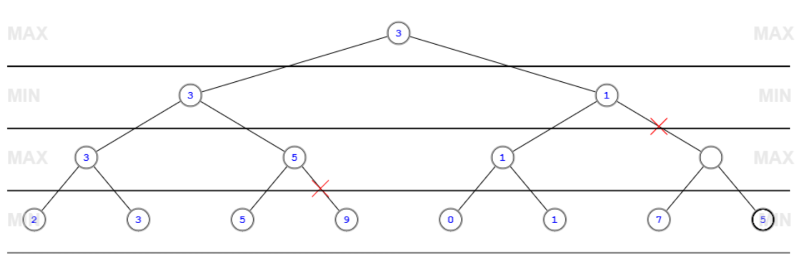
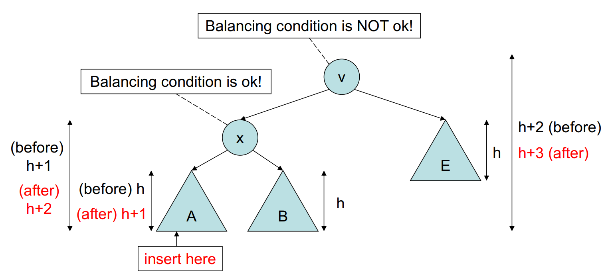
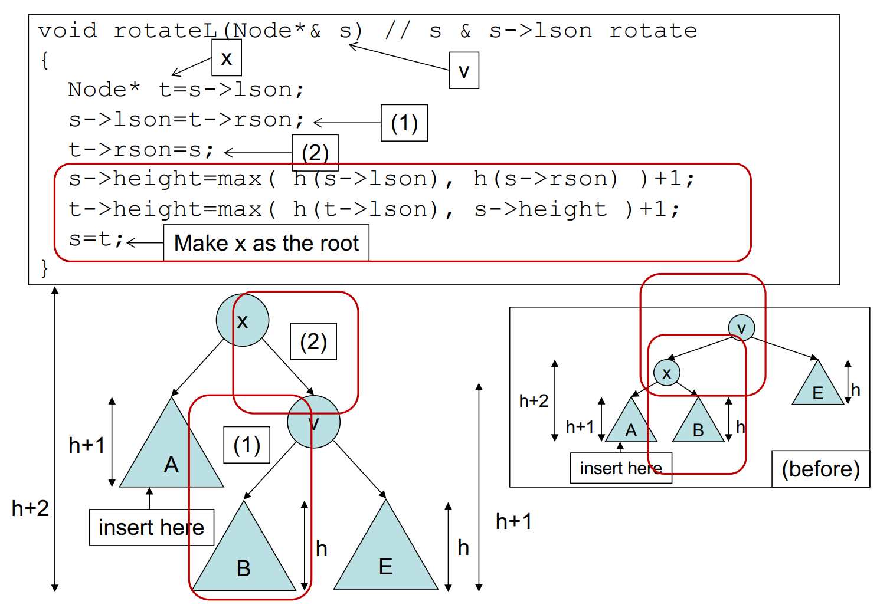
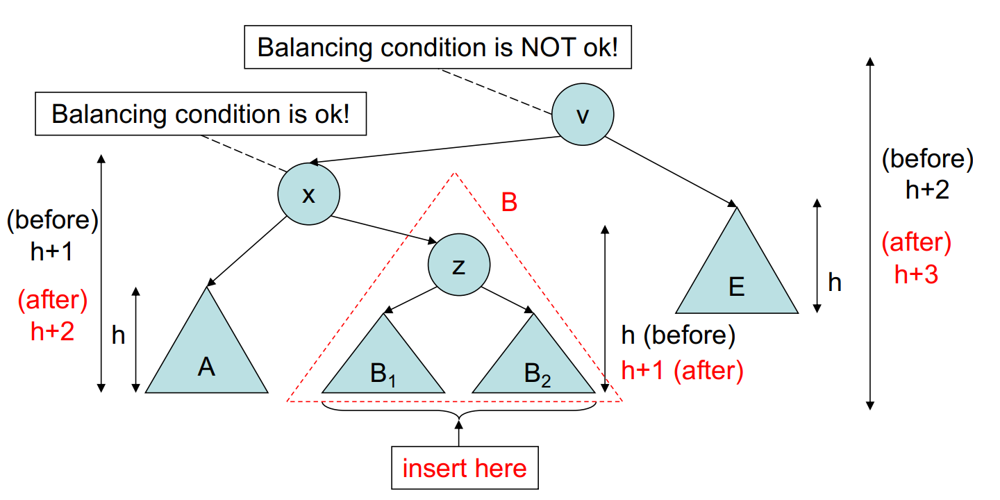
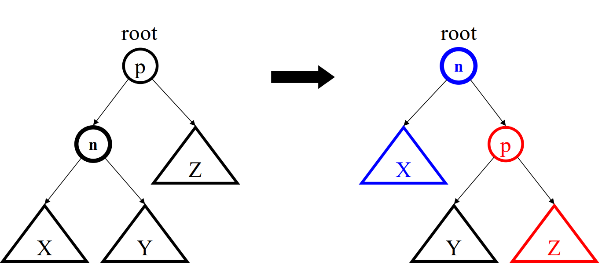
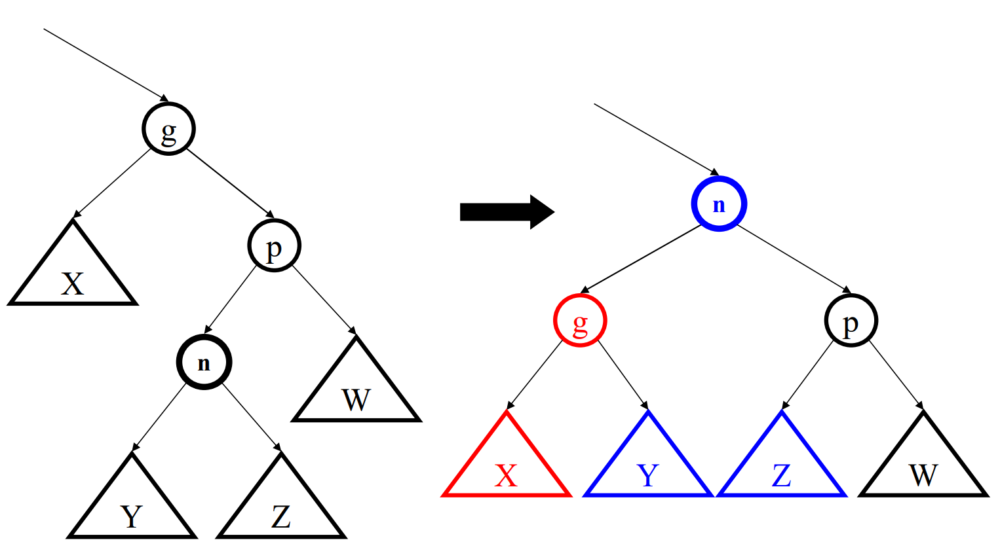
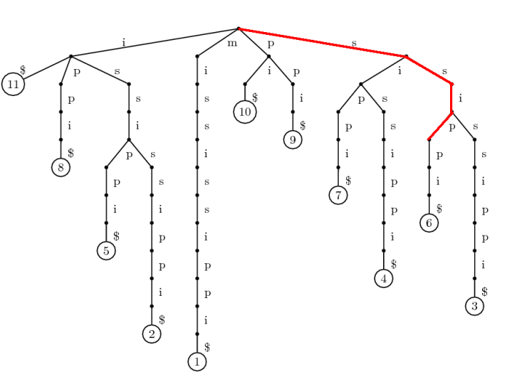

# CS3334 - Data Structures and Algorithms

## Complexity Analysis

### Terminology

- **Worst-case complexity**: max time (steps) for any input of size n
- **Average-case complexity**: expected time (steps) for any input of size n
- **Best-case complexity**: min time (steps) for any input of size n
- **Order of growth**: the rate at which the complexity increases as the input size increases

$$
\log_b n < n ^ \frac{1}{b} < n < n ^ b < b ^ n < n! < n ^ n (b > 1)
$$

### Notation

- Big-O notation: $O(f(n))$ is the set of functions that grow no faster ($\leq$) than $f(n)$, use **worst-case** complexity
- Big-omega notation: $\Omega(f(n))$ is the set of functions that grow no slower ($\geq$) than $f(n)$, use **best-case** complexity
- Theta notation: $\Theta(f(n))$ is the set of functions that grow at the same rate as $f(n)$, use **average-case** complexity
- Little-o notation: $o(f(n))$ is the set of functions that grow slower ($<$) than $f(n)$, the actual growth rate is strictly less than $f(n)$

$$
O(f(n)) = \{ g(n) : \exists c > 0, n_0 > 0, \forall n \geq n_0, 0 \leq g(n) \leq c f(n) \}
$$

$$
\Omega(f(n)) = \{ g(n) : \exists c > 0, n_0 > 0, \forall n \geq n_0, 0 \leq c f(n) \leq g(n) \}
$$

$$
\Theta(f(n)) = \{ g(n) : \exists c_1, c_2 > 0, n_0 > 0, \forall n \geq n_0, 0 \leq c_1 f(n) \leq g(n) \leq c_2 f(n) \}
$$

#### Little-o notation

- $100n = o(n)$
- $\log n = o(n)$
- $n = o(n\log n)$
- $n^2 = o(n^3)$
- $n^c = o(b^n)$

#### Asymptotic Notation

If $f(n)=n+\log n$, $\log n$ is negligible compared to $n$, called **lower-order term**, so $f(n)=\Theta(n)$

Examples:

- $T(n)=An^2+Bn+C$, $T(n)=O(n^2)$
- $T(n)=A n\log n+B n^2+C$, $T(n)=O(n^2)$
- $T(n)=n\log(n^2)$, $T(n)=O(2n\log n)=O(n\log n)$

```cpp
for (int i = 0; i < n; i++)
    for (int j = 0; j < n; j++)
        doSomething(); // O(1)
// O(n^2)
```

```cpp
for (int i = 0; i < n; i++)
    for (int j = 0; j < i; j++)
        doSomething(); // O(1)
// O(n^2)
```

```cpp
for (int i = 0; i < n; i++)
    for (int j = 0; j < i * i; j++)
        for (int k = 0; k < j; k++)
            doSomething(); // O(1)
/*
1 + 4 + 9 + ... + n^2 = O(n^3) (j and k)
O(n) (i)
total: Theta(n^4)
*/
```

```cpp
for (int i = 1; i < n; i++)
    for (int j = 1; j < i * i; j++)
        if (j % i == 0)
            for (int k = 0; k < j; k++)
                doSomething(); // O(1)
/*
i + 2i + 3i + ... + (n-1)i = O(n^2) (j and k)
O(n) (i)
total: Theta(n^3)
*/
```

### Recursive Relations

- $T(n)=T(n-1)+A, T(1)=B \Rightarrow T(n)=A(n-1)+B=O(n)$
- $T(n)=T(n-1)+n, T(1)=1 \Rightarrow T(n)=\frac{n(n+1)}{2}=O(n^2)$
- $T(n)=2T(n-1)+1, T(1)=1 \Rightarrow T(n)=2^n-1=O(2^n)$
- $T(n)=2T(n/2)+n, T(1)=1 \Rightarrow T(n)=n\log n=O(n\log n)$

General form: $T(n)=aT(n/b)+f(n)$

#### Master Theorem

Consider the recurrence relation $T(n)=aT(n/b)+f(n)$, where $a\geq1, b>1$ and $f(n)$ is asymptotically positive. Then:

- $f(n) \in O(n^{\log_b a-\epsilon}) \Rightarrow T(n) \in \Theta(n^{\log_b a})$ (where recursion dominates)
- $f(n) \in \Theta(n^{\log_b a}) \Rightarrow T(n) \in \Theta(n^{\log_b a}\log n)$ (where recursion and $f(n)$ are at same order of growth)
- $f(n) \in \Omega(n^{\log_b a+\epsilon}) \Rightarrow T(n) \in \Theta(f(n))$ (where $f(n)$ dominates)
- key is to compare $f(n)$ and $n^{\log_b a}$

Examples:

- Binary search: $T(n)=T(n/2)+\Theta(1)$
    - $a=1, b=2, f(n)=1$
    - $f(n) \sim n^{\log_2 1}=n^0=1$ → Case 2
    - $T(n)=\Theta(n^0\log n)=\Theta(\log n)$
- Merge sort: $T(n)=2T(n/2)+\Theta(n)$
    - $a=2, b=2, f(n)=n$
    - $f(n) \sim n^{\log_2 2}=n^1$ → Case 2
    - $T(n)=\Theta(n^1\log n)=\Theta(n\log n)$
- Binary tree traversal: $T(n)=2T(n/2)+\Theta(1)$
    - $a=2, b=2, f(n)=1$
    - $f(n) < n^{\log_2 2}=n^1$ → Case 1
    - $T(n)=\Theta(n^1)=\Theta(n)$

### Review

#### Time Complexity

- Big O notation: $f(n)=O(g(n))$ means $f(n)$ grows slower than $g(n)$ for $n\geq n_0$
- Big Omega notation: $f(n)=\Omega(g(n))$ means $f(n)$ grows faster than $g(n)$ for $n\geq n_0$
- Theta notation: $f(n)=\Theta(g(n))$ means $f(n)$ grows at the same rate as $g(n)$ for $n\geq n_0$

#### Lecture 4 Exercises

1. Suppose $T_1(N)=O(f(N))$, $T_2(N)=O(f(N))$. Which of the following are true?

$T_1(N)/T_2(N)=O(1)$ - **Incorrect**

Counterexample: $T_1(N)=N^2$, $T_2(N)=N$, $T_1(N)=O(f(N^2))$, $T_2(N)=O(f(N^2))$, but $T_1(N)/T_2(N)=O(N)$

2. Which function grows faster, $f(N)=N\log N$ or $g(N)=N^{1+\frac{\epsilon}{\sqrt{\log N}}} (\epsilon>0)$?

$\log f(N)=\log N+\log\log N$

$\log g(N)=\log N+\frac{\epsilon}{\sqrt{\log N}}\log N=\log N+\epsilon\sqrt{\log N}$

Let $t=\log N$, assume $N > 1$, then $t > 0$

$\log f(N)-\log g(N)=\log t-\epsilon\sqrt{t}$

derivative: $\frac{1}{t}-\frac{\epsilon}{2\sqrt{t}}=0\Rightarrow t=\frac{4}{\epsilon^2}$

for $t>\frac{4}{\epsilon^2}$, $\log f(N)-\log g(N)<0$, i.e. $f(N)<g(N)$

so for $N>10^{\frac{4}{\epsilon^2}}$, $f(N)$ grows slower than $g(N)$

3. Complexity of following code:

```cpp
for (int i = 1; i < n; i++)
    i *= k;
```

if $k=0$, infinite loop

if $k=1$, $O(n)$

if $k>1$, $O(\log_{k-1} n)=O(\log n)$

#### Lab 2 Exercises

1.

```cpp
void function1(int n) {
    int i, j, x=0;
    for (i = 0; i < n; i++) {
        if (x < 100)
            x++;
        for (j = 0; j < n; j++)
            x += j;
    }
}
```

Time Complexity: $O(n^2)$

`x++` is at most $O(n)$, `x+=j` is guaranteed $O(n^2)$, so the overall complexity is $O(n^2)$

2.

```cpp
void function2(int n) {
    int i, j, x=200;
    for (i = 0; i < n; i++) {
        if (x > 100)
            x--;
        else
            for (j = 0; j < n; j++)
                x += j;
    }
}
```

If $n < 100$, only `x--` is executed, so $O(n)$

If $n \geq 100$

- most of the time, `x--` is executed at $O(1)$ per loop
- very rarely, `x+=j` is executed at $O(n)$ per inner loop
- After `x+=j` is executed, it take many outer loops to get `x` back to 100
- Average time complexity is $O(1)$ per outer loop (armortized analysis, like a heap with $O(\log n)$ complexity)
- final result is $O(n)$

## Hashing

1. `tableSize` should be a prime number
2. Combination of hash functions:
    - $H_1(x)=f(x) \mod \text{largePrime}$
    - $H_2(t)=t \mod \text{tableSize}$
    - $H(x)=H_2(H_1(x))$
3. collision resolution
    - chaining (linked list)
    - open addressing
        - linear probing: $H(x)+1, 2, 3, ...$
        - quadratic probing: $H(x)+1^2, 2^2, 3^2, ...$
        - double hashing, $H(x)+h(x), 2h(x), 3h(x), ...$
4. **Quadratic probing**: a new element can always be inserted if table size is a prime number and load factor < 0.5
5. **Load factor** = occupied slots / table size
6. **Rehashing**: when load factor > 0.5, create a new table with size = next prime number > 2 * current table size, and recalculate hash values for all elements. Cost = $O(n/2+n/4+...+1)=O(n)$

Example:

Array = {4371, 1323, 6173, 4199, 4344, 9679, 1989}

Hash function: $H(x)=x \mod 10$

1. Linear Probing

| x | 4371 | 1323 | 6173 | 4199 | 4344 | 9679 | 1989 |
| - | ---- | ---- | ---- | ---- | ---- | ---- | ---- |
| H(x) | 1 | 3 | 3 | 9 | 4 | 9 | 9 |
| Loc(x) | 1 | 3 | 4 | 9 | 5 | 0 | 2 |

2. Quadratic Probing

| x | 4371 | 1323 | 6173 | 4199 | 4344 | 9679 | 1989 |
| - | ---- | ---- | ---- | ---- | ---- | ---- | ---- |
| H(x) | 1 | 3 | 3 | 9 | 4 | 9 | 9 |
| Loc(x) | 1 | 3 | 4 | 9 | 5 | 0 | 8 |

3. Double Hashing

$h(x)=7-(x \mod 7)$

| x | 4371 | 1323 | 6173 | 4199 | 4344 | 9679 | 1989 |
| - | ---- | ---- | ---- | ---- | ---- | ---- | ---- |
| H(x) | 1 | 3 | 3 | 9 | 4 | 9 | 9 |
| h(x) | 4 | 7 | 1 | 1 | 3 | 2 | 6 |
| Loc(x) | 1 | 3 | 4 | 9 | 7 | 5 | - |

## Trees

### Terminology

**Tree**: a finite set of nodes $T$ such that:
- there is a special node called the **root** of $T$
- the remaining nodes are partitioned into $n$ disjoint sets $T_1, T_2, ..., T_n$, where each of these sets is a tree

| Terminology | Definition |
| ----------- | ---------- |
| Level (depth) | the number of edges on the path from the root to the node. Level of the root is 0 |
| Height | the maximum level of any node in the tree |
| Degree | the number of subtrees of a node |
| Terminal node (leaf) | a node with degree 0 |
| Branch node | a node with degree > 0 |
| Parent - Child | $u$ is parent of $v$ and $v$ is child of $u$ where $v$ is root of a subtree of $u$ |
| Sibling | nodes with the same parent |
| Path | a sequence of nodes such that any two consecutive nodes are parent-child |
| Ancestor - Descendant | $u$ is ancestor of $v$ and $v$ is descendant of $u$ if $u$ is on the path from $v$ to the root |

**Binary Tree**: a tree in which each node has at most two children. It is **either empty**, or consists of a **root** and two disjoint binary trees called the **left subtree** and **right subtree**.

- Maximum number of nodes at level $i$: $2^i$
- Maximum number of nodes in a tree of height $h$: $2^{h+1}-1$

| | Tree | Binary Tree |
| - | ---- | ----------- |
| Node | At least 1 | Can be empty |
| Subtrees | Any number | 0, 1, or 2 |

- Height of an empty tree is -1.
- Height of a tree with one node is 0.

**Full Binary Tree**: a binary tree in which every node has 2 children, except the leaves. Leaves are all at the same level.

**Complete Binary Tree**: a binary tree with $n$ nodes and height $h$ is complete if:

Its nodes correspond to the nodes numbered from 1 to $n$ in the full binary tree of height $h$

In other words,

- Every level except the last is completely filled
- Nodes on the last level are left-justified

CBT is not necessarily a full binary tree.

### Array Representation

Assume the tree is complete, and the root is at index 0.

A tree of height $h$ has $2^{h+1}-1$ nodes, so the array size is $2^{h+1}$.

Children of node $i$ are at $2i+1$ and $2i+2$.

Parent of node $i$ is at $\lfloor\frac{i-1}{2}\rfloor$.

#### Binary Search Tree

Binary Search Tree is a binary tree, and for each node $x$:

- all nodes in the left subtree of $x$ are less than $x$
- all nodes in the right subtree of $x$ are greater than $x$

### Recursive Operations on Binary Trees

#### Binary Tree Traversal

A binary tree can be uniquely defined by its preorder and inorder traversals. (or postorder and inorder traversals)

However, a binary tree cannot be uniquely defined by its preorder and postorder traversals.

e.g. Preorder = ABC, Postorder = CBA. There are two possible trees.

#### Expression Trees

#### Complexity Analysis

Denote $h$ as the height of the tree, $O(h) = O(\log n)$

- Binary Search Tree Search: average $O(h)$, worst $O(n)$
- Binary Search Tree Insert: average $O(h)$, worst $O(n)$
- Binary Search Tree Delete: average $O(h)$, worst $O(n)$

The worst case happens when the tree is a single branch (linked list).

### General Trees

```cpp
struct TreeNode {
    int data;
    TreeNode *firstChild, *nextSibling;
};
```

### Heap

Heap is a **complete binary tree**.

Min heap: parent < children (assume no duplicate values)

Heap is not a BST.

Insert:

1. Insert at the end of the array
2. Swap with parent until heap property is satisfied

Delete:

1. Replace root with last element
2. Swap with **smaller** child until heap property is satisfied

### Game Trees

Consider a game with two players and zero-sum. Property of the game tree:

- Root = Initial state
- Every node = a possible status
- Every edge = a possible move
- Any path from root to leaf = a possible sequence of moves

Abstracting the game tree:

- Each outcome is assigned a utility value stored at the leaf node. Positive for player 1, negative for player 2.
- Goal: compute the utility for all internal nodes, so each player can choose the best move at each step.
- Player 1 always chooses the child with maximum utility, player 2 always chooses the child with minimum utility.

Solution: Minimax algorithm (DFS + Alpha-Beta pruning)

- For a max node, $\alpha$ is lower bound of its utility = $\max \beta$ of its children
- For a min node, $\beta$ is upper bound of its utility = $\min \alpha$ of its children
- A max node is pruned if its $\alpha$ value is greater than or equal to its parent's $\beta$ value
- A min node is pruned if its $\beta$ value is less than or equal to its parent's $\alpha$ value

Numerical example:

```
[max] N1 (child: N2, N3, N4)
[min] N2 (child: 3, 12, 8)
[min] N3 (child: 1, X, X)
[min] N4 (child: 12, 5, 4)
```

- $\beta_2=3$ - P2 acts at this step. He will choose 3, because 3 is the smallest value among 3, 12, 8.
- $\beta_3=1$ - P2 acts at this step. He will choose 1, because 1 is smaller than M1's $\alpha$ value at this step (3). Its children are not explored.
- $\beta_4=4$ - P2 acts at this step. He will choose 4, and 4 is used to update M1's $\alpha$ value.
- $\alpha_1=4$ - P1 acts at this step. He will choose 4, because 4 is the largest value among 3, 1, 4.

Numerical example 2:

```
[max] N1 (child: N2, N3)
[min] N2 (child: N4, N5)
[min] N3 (child: N6, N7)
[max] N4 (child: 2, 3)
[max] N5 (child: 5, 9)
[max] N6 (child: 0, 1)
[max] N7 (child: 7, 5)
```

- $\alpha_4 = \min (2, 3) = 2$ → $\beta_2 = \max(\alpha_4, \alpha_5) \geq 2$
- $\alpha_5 = \min (5, X) = 5$, 5 > $\beta_2$ → prune 9, $\beta_2 = 5$ → $\alpha_1 = \min (5, X) \leq 5$
- $\alpha_6 = \min (0, 1) = 0$ → $\beta_3 = \max(\alpha_6, \alpha_7) \geq 0$
- $\beta_3 < \alpha_1$ → N7 is pruned → $\beta_3 = 0$ → $\alpha_1 = \min (5, 0) = 0$

Image created by [minimax simulator](https://raphsilva.github.io/utilities/minimax_simulator/):



Brute force:

```cpp
struct Node {
    int value;
    Node *firstChild, *nextSibling;
}
int minimax(Node *node, bool isMax) {
    if (node->firstChild == NULL) // leaf node
        return node->value;
    if (isMax) {
        int alpha = INT_MIN;
        for (Node *child = node->firstChild; child != NULL; child = child->nextSibling) {
            int beta = minimax(child, false);
            if (beta > alpha)
                alpha = beta;
        }
        return alpha;
    } else {
        int beta = INT_MAX;
        for (Node *child = node->firstChild; child != NULL; child = child->nextSibling) {
            int alpha = minimax(child, true);
            if (alpha < beta)
                beta = alpha;
        }
        return beta;
    }
}

// main()
int alpha = minimax(root, true); // best move for player 1
```

Time complexity: $O(b^m)$, where $b$ is the branching factor, $m$ is the maximum depth of the tree.

Alpha-Beta pruning:

```cpp
int minimax(Node *node, int alpha, int beta, bool isMax) {
    // alpha = ansectors max nodes' lower bound -> updated with min node's beta
    // beta = ansectors min nodes' upper bound -> updated with max node's alpha
    if (node->firstChild == NULL) // leaf node
        return node->value;
    if (isMax) {
        for (Node *child = node->firstChild; child != NULL; child = child->nextSibling) {
            int beta = minimax(child, alpha, beta, false);
            if (beta > alpha)
                alpha = beta;
            if (alpha >= beta)
                break;
        }
        return alpha;
    } else {
        for (Node *child = node->firstChild; child != NULL; child = child->nextSibling) {
            int alpha = minimax(child, alpha, beta, true);
            if (alpha < beta)
                beta = alpha;
            if (alpha >= beta)
                break;
        }
        return beta;
    }
}

// main()
int alpha = minimax(root, INT_MIN, INT_MAX, true); // best move for player 1
```

Worst case time complexity: $O(b^m)$, same as brute force. Average case is much faster.

## Balanced Search Trees

### Terminology

BST is a binary search tree, but tree structure can change after insertion and deletion.

Goal: **keep the tree balanced**. Maintain the depth of the tree to be $O(\log n)$.

Common implementations:

- AVL tree
- Red-black tree (C++ STL)
- B-tree (database)

Priority Queue can be implemented using BST or heap.

### B Tree

B tree is originally designed for disk storage.

Each node is **kept between half-full and full**.

- In a B tree, pointers to data records are stored in all nodes
- In a B+ tree, pointers to data records are stored only in leaf nodes
- B+ tree has a smaller depth than B tree of same size

### AVL Tree

AVL tree is a BST that performs rotations to keep the tree balanced. AVL tree is **self-balancing**.

Balance factor = height of left subtree - height of right subtree

If `abs(balance factor) <= 1`, the tree is balanced.

All operations are $O(\log n)$.

```cpp
struct Node {
    int value, height;
    Node *left, *right;
}
```

See `avl.cpp` for implementation. Note: `delete` is beyond the scope of this course.

Advantages:

- Worst case operations are guaranteed to be $O(\log n)$

Disadvantages:

- Extra space for balance factor
- Rebalancing is expensive
- Hard to implement, especially deletion

#### Insertion

Case 1: Left-left





Initial tree:

```
    y   height(y) = h+3
   / \  height(x) = h+2
  x   E height(E) = h
 / \    height(A) = h
A   B   height(B) = h
↑insert t at A
```

Final tree:

```
    x   height(x) = h+2
   / \
  A   y
 /   / \
t   B   E
```

Implementation: `rotateRight(y)`, i.e. let `y` become the right child of `x`

Case 2: Right-right

Similar to Case 1, but `rotateLeft(x)`, i.e. let `x` become the left child of `y`

Case 3: Left-right



#### Proof of Complexity

Goal: Prove the height of an AVL tree with $n$ nodes is $O(\log n)$.

Lemma: AVL tree of height $h$ has at least $F_{h+2}-1$ nodes, where $F_i$ is the $i$th Fibonacci number.

Proof by mathematical induction:

1. Base case: $h=0$, $F_2-1=1$, $n=1$
2. Inductive step: assume AVL tree of height $h-1$ has at least $F_{h+1}-1$ nodes
    - For AVL tree of height $h$, assume its left subtree has height $h-1$, then right subtree has height $h-2$
    - The subtree has at least $\text{Left+Right+Root}=F_{h+1}-1+F_h-1+1=F_{h+2}-1$ nodes
    - Therefore the lemma holds for $h+1$
3. By induction, AVL tree of height $h$ has at least $F_{h+2}-1$ nodes

$n\geq F_{h+2}-1$ can be approximated by $n\geq\alpha^h-1$ where $\alpha=\frac{1+\sqrt{5}}{2} \approx 1.618$

Therefore, AVL tree of $n$ nodes has height $h \leq \log_\alpha (n+1) \approx 1.44 \log_2 (n+1) = O(\log n)$

For example, AVL tree with $7$ nodes has a maximum height of $\lfloor\log_\alpha 8\rfloor=3$. (Note a tree with only root node has height 0.)

Or, $f(n)=F_n-1$, $f(1, 2, 3, 4)=1, 2, 4, 7$

### Splay Tree

- A BST that performs rotations to keep the tree balanced
- Different from AVL tree, splay tree is **self-adjusting**
- Amortized time complexity of all operations is $O(\log n)$, worst case is $O(n)$
- Upon access, the accessed node is always rotated to the root
- Don't care about balance factor, just rotate based on local structure (e.g. zig-zig, zig-zag)

Denote: node `n`, parent `p`, grandparent `g`

Three are 3 cases:

- the accessed node is the root
- the accessed node is the child of the root
- the accessed node is the grandchild of the root

#### Single Rotation

Access child of root on the left: `zig(n)`: rotate `n` to the root, `p` becomes the right child of `n`

Access child of root on the right: `zag(n)`



#### Double Rotation

Access grandchildren on left → right (`g < n < p`): `zig-zag(n)`

1. rotate `n` to the root
2. `g` becomes the left child of `n` (`g < n`)
3. `p` becomes the right child of `n` (`p > n`)
4. `n->left` becomes the right child of `g` (`g < n->left`)
5. `n->right` becomes the left child of `p` (`p > n->right`)



## Disjoint Sets

### Equivalence Relations

A relation $R$ on a set $S$ is defined as:

If $a, b \in S$, then $aRb$ is either true or false.

A relation $R$ is an **equivalence relation** if it is:

- **reflexive**: $aRa$ for all $a \in S$
- **symmetric**: if $aRb$, then $bRa$
- **transitive**: if $aRb$ and $bRc$, then $aRc$

If $R$ is an equivalence relation on $S$, then $S$ is partitioned into several **equivalence classes**.

In each equivalence class, all elements are related to each other.

Between different equivalence classes, no elements are related to each other.

### ADT of Disjoint Sets

- value:
    - a **set** of elements
    - each element is associated with a **equivalence class** (represented by a **root**, an element in the class)
- methods:
    - `find(x)`: return the root of the equivalence class of `x` (precondition: `x` is in the set)
    - `union(x, y)`: merge the equivalence classes of `x` and `y` (precondition: `x` and `y` are in the set)

### Array Implementation

```cpp
int parent[MAX_SIZE];
int find(int x) {
    return parent[x];
}
void union(int x, int y) {
    if (find(x) != find(y))
        int temp = find(y);
        for (int i = 0; i < MAX_SIZE; i++)
            if (parent[i] == temp)
                parent[i] = find(x);
    }
}
```

- Find: $O(1)$
- Union: $O(n)$

### Tree Implementation

**Graph abstraction**: each element is a node, each equivalence class is a tree.

Union-by-height implementation:

```cpp
int parent[MAX_SIZE], height[MAX_SIZE];
void init(int n) {
    for (int i = 0; i < n; i++) {
        parent[i] = i;
        height[i] = 0; // a tree with only one node has height 0
    }
}
int find(int x) {
    return (parent[x] == x) ? x : find(parent[x]);
}
void union(int x, int y) {
    if (find(x) != find(y)) {
        if (height[x] < height[y])
            parent[x] = y;
        else if (height[x] > height[y])
            parent[y] = x;
        else { // same height, need to +1
            parent[y] = x;
            height[x]++;
        }
    }
}
```

Possible optimizations:

**Path compression**: update all nodes on the path to the root to point to the root directly.

```cpp
int find(int x) {
    return (parent[x] == x) ? x : parent[x] = find(parent[x]);
}
```

- **Union-by-height**: merge the shorter tree into the taller tree.
- **Union-by-size**: merge the smaller tree into the larger tree.

### Complexity Analysis

Theorem 1: Union-by-height implementation has $O(\log n)$ time complexity for `find` and `union`.

Theorem 2: Union-by-height + path compression implementation has $O(\alpha(n))$ amortized time complexity for `find` and `union`, where $\alpha(n)$ is the inverse Ackermann function.

Proof of Theorem 1:

Lemma 1: Union-by-height implementation guarantees that a tree of $n$ nodes has height at most $\log n$.

Proof Lemma 1 by mathematical induction:

1. Base case: initial tree of 1 node has height 0, $\log 1 = 0$
2. Inductive step: assume the lemma holds before executing `union(x, y)` (`x` and `y` are the roots of two trees)
    - Therefore, $h_x \leq \log \text{size}_x$, $h_y \leq \log \text{size}_y$
    - If $h_x < h_y$, merges $x$ into $y$, new height $h_y*=h_y$, new size $\text{size}_y* = \text{size}_x + \text{size}_y \geq 2^{h_y} + 2^{h_y} \geq 2^{h_y}$, therefore $h_y* \leq \log \text{size}_y*$
    - If $h_x > h_y$, similar
    - If $h_x = h_y$, merges $x$ into $y$, new height $h_y*=h_y+1$, new size $\text{size}_y* = \text{size}_x + \text{size}_y \geq 2^{h_y} + 2^{h_y} = 2^{h_y+1}$, therefore $h_y* \leq \log \text{size}_y*$
    - Conclusion: the lemma holds after executing `union(x, y)`
3. By induction, the lemma holds for all cases

Then use Lemma 1 to prove Theorem 1:

for all roots, $\text{size}_x \geq 2^{h_x}$

Worst case: visit from leaf to root, since $\log n \geq h$, the worst case time complexity is $O(h) = O(\log n)$

## String Matching

### Suffices

Mathematically, a string $S$ of length $n$ is a sequence of characters $S_1, S_2, ..., S_n$.

It has $n$ suffices, denoted by $suffix(S, i) = S_i, S_{i+1}, ..., S_n$ for $1 \leq i \leq n$.

**A substring of** $S$ **is a prefix of a suffix** of $S$.

### Exact Pattern Matching

Goal: find all occurrences of a pattern $P$ of length $m$ in a text $T$ of length $n$.

Brute force: $O(nm)$

Knuth-Morris-Pratt (KMP) algorithm: $O(n+m)$

(advanced topic)

### Trie

Idea of concurrent search:

- List all suffices of $T$
- Choose a prefix of $P$
- Search for the prefix in the list of suffices
- If a suffix is not a match or too short, discard it for the rest of the search
- Increase the length of the prefix and repeat

**Trie** is a tree that stores all suffices of $T$. 

A character is stored at each node. Going from root to leaf, the characters form a suffix of $T$.

Time complexity: $O(n^2+m)$



- A route from root to internal node = a prefix of a suffix of $T$ = a substring of $T$
- `$` is used to mark the end of a string

### Suffix Array

Suffix array is **sorted index** of all suffices of $T$.

Given the suffix array of $T$, we can find all occurrences of $P$ in $T$ in $O(m\log n)$ time (binary search).

But how to make a suffix array?

Reminder: perform string operation is considered as $O(n)$ since it traverses the string. Therefore, quick sort have $O(n^2\log n)$ time complexity.

**Doubling algorithm** can reduce the time complexity to $O(n\log n)$.

#### Doubling Algorithm

**L-order** is defined as the lexicographical order of the first $L$ characters of a string.

In doubling algorithm, only $L=2^k$ is considered.

Example: string `mississippi`

Implementation:

1. sort by 1-order
2. sort by 2-order. (How? only compare the 2nd character if the 1st character is the same)
3. sort by 4-order.

To extend 2-order to 4-order:

In the above example, part of the result after 2-order sort:

```
S[8:] = ippi
S[5:] = issippi
S[3:] = ssissippi
S[6:] = ssippi
```

i.e. $S[8:] <_2 S[5:], S[3:] =_2 S[6:]$

To compare $S[3:]$ and $S[6:]$ in 4-order, we know that

- First two characters are the same
- $S[5:6]$ and $S[8:9]$ is given by the order of $S[5:]$ and $S[6:]$ in 2-order

Since $S[8:] <_2 S[5:]$, $S[8:9] < S[5:6]$, therefore $S[6:] <_4 S[3:]$

Generally speaking, if $L=2^k$ order is given, $2L=2^{k+1}$ order can be determined by:

- $S[i:] <_L S[j:] \Rightarrow S[i:] <_{2L} S[j:]$
- $S[i:] >_L S[j:] \Rightarrow S[i:] >_{2L} S[j:]$
- $S[i:] =_L S[j:]$:
    - $S[i+L:] <_L S[j+L:] \Rightarrow S[i:] <_{2L} S[j:]$
    - $S[i+L:] >_L S[j+L:] \Rightarrow S[i:] >_{2L} S[j:]$

Complexity analysis:

- $O(n)$ for each iteration
- $\log n$ iterations
- $O(n\log n)$ in total

## Graphs

### Terminology

A graph $G$ consists of:

- a non-empty set of vertices $V \neq \emptyset$
- a set of edges $E$
- each edge is a pair of vertices $(u, v)$, where $u, v \in V$
- denoted as $G = (V, E)$

More terminology:

- **Degree** of a vertex: number of edges incident to it
- For directed graphs, **in-degree** and **out-degree** of a vertex
- For weighted graphs, **weight** of an edge
- **Simple graph**: an undirected graph with no self-loop or multiple edges
- **Complete graph**: a simple graph with $n$ vertices and $\frac{n(n-1)}{2}$ edges. All pairs of vertices are connected.

### Representations

**Adjacency matrix**: use $N\times N$ matrix to represent a graph with $N$ vertices.

- For undirected graph, half of the matrix is redundant.
- Fast if checking if two vertices are connected.
- Slow if checking all neighbors of a vertex.

#### Adjacency List

- Use link list to store all neighbors of a vertex.
- Save space if the graph is sparse.
- Query on a specific edge (connection) is slow.
- Enumerating all neighbors of a vertex is fast.

### Search

#### DFS

Iterative:

```python
def dfs(G, s): # s = source
    visited = set()
    stack = [s]
    while stack:
        u = stack.top()
        visited.add(u)
        for v in G[u]:
            if v not in visited:
                stack.append(v) # only push 1 neighbor at a time
                break
        else:
            stack.pop() # if reach leaf, recursively pop
```

Recursive:

```python
def dfs(G, u, visited):
    visited.add(u)
    for v in G[u]:
        if v not in visited:
            dfs(G, v, visited)
```

#### BFS

```python
def bfs(G, s):
    visited = set()
    q = Queue()
    q.enqueue(s)
    while q:
        u = q.dequeue()
        visited.add(u)
        for v in G[u]:
            if v not in visited:
                q.enqueue(v) # push all neighbors at once
```

### Minimum Spanning Tree

In this section, $G$ is undirected and non-negative weighted.

- **Spanning tree**: a subgraph of a graph $G$ that is a tree and contains all vertices of $G$
- **Minimum spanning tree**: a spanning tree with minimum total weight

Lemma: Inserting an edge to a spanning tree creates a cycle. 

(Proof: a tree is a connected graph with no cycle) 

Therefore, we can remove the heaviest edge in the cycle to get a new spanning tree with smaller total weight.

#### Prim's Algorithm

Idea: start from an arbitrary vertex, add the lightest edge that connects to a vertex not in the tree.

```python
def prim(G):
    T = set()
    visited = set()
    visited.add(0) # source
    while len(T) < len(G):
        min_weight = inf
        for u in visited:
            for v in G[u]:
                if v not in visited and G[u][v] < min_weight:
                    min_weight = G[u][v]
                    min_edge = (u, v)
        T.add(min_edge)
        visited.add(min_edge[1])
    return T
```

Time complexity: $O(n^2)$

#### Kruskal's Algorithm

Idea: sort all edges by weight, add the lightest edge that does not create a cycle.

```python
def kruskal(G):
    T = set()
    visited = set()
    edges = sorted(G.edges, key=lambda x: x[2]) # sort by weight
    for edge in edges:
        if edge[0] not in visited or edge[1] not in visited:
            T.add(edge)
            visited.add(edge[0])
            visited.add(edge[1])
    return T
```

Time complexity: $O(m\log m)$

### Shortest Path

#### Dijkstra's Algorithm

```python
def dijkstra(G, s):
    dist = [inf] * len(G)
    dist[s] = 0
    visited = set()
    while len(visited) < len(G):
        min_dist = inf
        for u in range(len(G)):
            if u not in visited and dist[u] < min_dist:
                min_dist = dist[u]
                min_vertex = u
        visited.add(min_vertex)
        for v in G[min_vertex]:
            if v not in visited and dist[min_vertex] + G[min_vertex][v] < dist[v]:
                dist[v] = dist[min_vertex] + G[min_vertex][v]
    return dist
```

Time complexity: $O(n^2)$

**Relaxation**: if $d(u) + w(u, v) < d(v)$, update $d(v) = d(u) + w(u, v)$

## Sorting

### Heapsort

Assume using a max heap.

```cpp
void heapsort(int A[], int n) {
    buildMaxHeap(A, n);
    for (int i = n-1; i >= 1; i--) {
        swap(A[0], A[i]); // move largest element to the end
        maxHeapify(A, 0, i);
    }
}

void buildMaxHeap(int A[], int n) {
    for (int i = n/2-1; i >= 0; i--)
        maxHeapify(A, i, n);
}

void maxHeapify(int A[], int i, int n) {
    int l = 2*i+1, r = 2*i+2, largest = i;
    if (l < n && A[l] > A[largest])
        largest = l;
    if (r < n && A[r] > A[largest])
        largest = r;
    if (largest != i) {
        swap(A[i], A[largest]);
        maxHeapify(A, largest, n);
    }
}
```


Time complexity: $O(n\log n)$

Worst case: $O(n\log n)$

Auxiliary space: $O(1)$ (in-place)

### Merge Sort

```cpp
void mergeSort(int A[], int l, int r) { // sort [l, r-1]
    if (l < r) {
        int m = (l+r)/2;
        mergeSort(A, l, m); // sort [l, m-1]
        mergeSort(A, m+1, r); // sort [m, r-1]
        merge(A, l, m, r); // merge [l, m-1] and [m, r-1]
    }
}

void merge(int A[], int l, int m, int r) {
    int n1 = m-l+1, n2 = r-m;
    int L[n1], R[n2];
    for (int i = 0; i < n1; i++)
        L[i] = A[l+i];
    for (int i = 0; i < n2; i++)
        R[i] = A[m+1+i];
    int i = 0, j = 0, k = l;
    while (i < n1 && j < n2) {
        if (L[i] <= R[j])
            A[k++] = L[i++];
        else
            A[k++] = R[j++];
    }
    while (i < n1)
        A[k++] = L[i++];
    while (j < n2)
        A[k++] = R[j++];
}
```

Time complexity: $O(n\log n)$

Worst case: $O(n\log n)$

Auxiliary space: $O(n)$ (an extra array)

### Quick Sort

```cpp
void quickSort(int A[], int l, int r) { // sort [l, r-1]
    if (l < r) {
        int p = partition(A, l, r);
        quickSort(A, l, p); // sort [l, p-1]
        // p is already in the right place
        quickSort(A, p+1, r); // sort [p+1, r-1]
    }
}

int partition(int A[], int l, int r) {
    int pivot = A[r-1]; // choose the last element as pivot
    int i = l-1;
    for (int j = l; j < r-1; j++) {
        if (A[j] < pivot)
            swap(A[++i], A[j]);
    } // move all elements smaller than pivot to the left
    swap(A[++i], A[r-1]);
    return i; // return the index that cuts the array into two parts
    // left is smaller than pivot, right is larger than pivot
}
```

Time complexity: $O(n\log n)$

Worst case: $O(n^2)$ [Note: random pivot choice can avoid this. Expected worst case is $O(n\log n)$, but $O(n^2)$ is still possible.]

Auxiliary space: $O(1)$ (in-place)

### Bucket Sort

Time complexity: $O(n)$

Auxiliary space: $O(\max A_i)$

### Stable Sort

A sorting algorithm is **stable** if it preserves the relative order of elements with equal keys.

Example: insertion sort $O(n^2)$, merge sort $O(n\log n)$, radix sort $O(n)$

Unstable sort example: quick sort $O(n\log n)$, heap sort $O(n\log n)$

A hands-on example: sorting 2-digit numbers.

1. sort by least significant digit
2. sort by most significant digit

### Radix Sort

Apply **stable bucket sort** to each digit, from least significant digit to most significant digit.

Implementation with queue:

```cpp
void radixSort(int A[], int n, int d) { // d = number of digits
    for (int i = 0; i < d; i++) {
        // perform bucket sort on i-th least significant digit (10^i)
        queue<int> buckets[10];
        for (int i = 0; i < n; i++)
            buckets[digit(A[i], i)].push(A[i]);
        for (int i = 0, j = 0; i < 10; i++) {
            while (!buckets[i].empty()) {
                A[j++] = buckets[i].front();
                buckets[i].pop();
            }
        }
    }
}
```

Assume the largest number has $d$ digits in base $b$.

For each digits, $O(n+b)$ time to insert and collect numbers in buckets.

Therefore, time complexity is $O(d(n+b)) = O(n\log_b \max A_i) = O(n)$.

Auxiliary space: $O(n+b)$ ($b$ buckets and $n$ numbers)

## Review Roadmap

- Complexity analysis
- Linear data structures
    - Linked list
    - Stack
    - Queue
- Trees
    - Binary tree
    - Binary search tree
    - AVL tree (concept)
    - Splay tree
    - Disjoint sets
    - Tree traversal
- Tree applications
    - Game tree: minimax tree, alpha-beta pruning
    - Heap
- Graphs
    - Graph representation: adjacency matrix, adjacency list
    - Graph search: DFS, BFS
    - Minimum spanning tree: Prim, Kruskal
    - Shortest path: Dijkstra
- Sorting
- Misc
    - String matching: trie (concept), suffix array

Exercises:

1. Complexity analysis

(a)

```cpp
int count = 0;
for (int i = n/2; i <= n; i++)
    for (int j = 1; j + n/2 <= n; j++)
        for (int k = 1; k <= n; k *= 2)
            count++;
```

Solution:
- For `i`, $n/2 \leq i \leq n$, $n/2$ times
- For `j`, $1 \leq j \leq n/2$, $n/2$ times
- For `k`, $\log_2 n$ times
- Total complexity: $O(n^2\log n)$

(b) $T(n) = 2T(n/2) + n$

Solution:

- $T(n) = 2T(n/2) + n$
- $= 2(2T(n/4) + n/2) + n$
- $= 4T(n/4) + 2n$
- $= 4(2T(n/8) + n/4) + 2n$
- $= 8T(n/8) + 3n$
- ...
- $= 2^kT(n/2^k) + kn$
- $= nT(1) + n\log_2 n$ (let $k = \log_2 n$)
- $= O(n + n\log n) = O(n\log n)$

2. Tree traversal

- Inorder: 3, 12, 6, 4, 7, 10, 11, 5, 2, 8
- Preorder: 10, 12, 3, 4, 6, 7, 5, 11, 2, 8

Therefore, postorder: 3, 6, 7, 4, 12, 11, 8, 2, 5, 10

3. AVL tree

Insert 12, 28, 8, 36, 30, 17, 45 into an empty AVL tree. Show the tree after each insertion.

4. Disjoint set

The maze generation algorithm uses disjoint set.

```
while (!isConnected(entrance, exit)) {
    randomly choose a wall, described by two adjacent cells i and j
    if (find(i) != find(j))
        union(i, j)
}
```

5. Quick sort

Show the array after each partition: 7, 6, 10, 5, 9, 2, 1, 15, 7

- 1: 2, 6, 1, 5, 7 / 7 / 10, 9, 15

6. Binary tree

Count internal nodes of a binary tree.

```cpp
class TreeNode {
public:
    int value;
    TreeNode *left, *right;
    TreeNode(int value) {
        this->value = value;
        left = right = NULL;
    }
};

class Tree {
public:
    TreeNode *root;
    Tree() {
        root = NULL;
    }
    int countInternal();
private:
    int countInternal(TreeNode *node);
}
```

Solution:

```cpp
int Tree::countInternal() {
    return countInternal(root);
}
int Tree::countInternal(TreeNode *node) {
    if (node == NULL)
        return 0;
    if (node->left == NULL && node->right == NULL)
        return 0;
    return 1 + countInternal(node->left) + countInternal(node->right);
}
```
