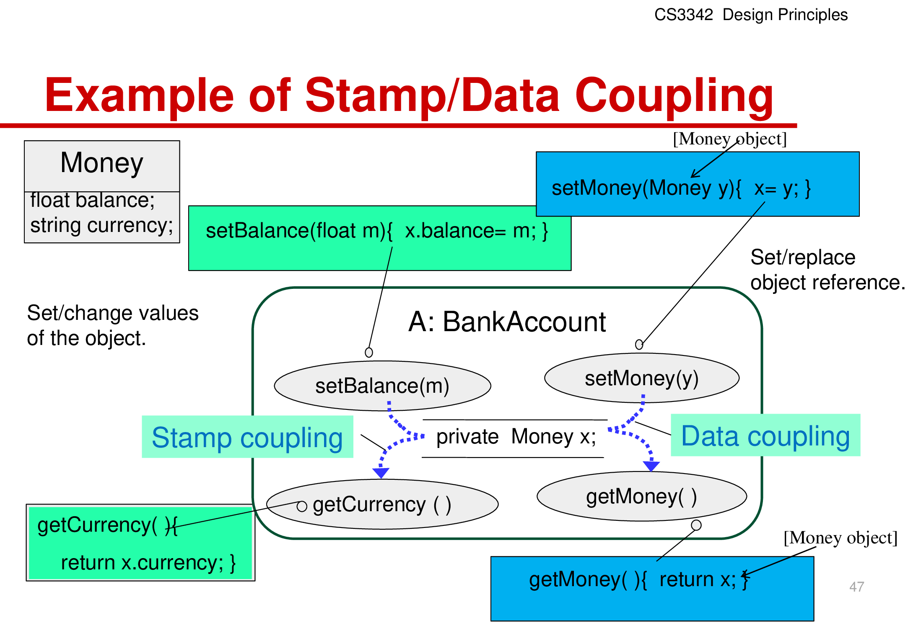

# CS3342 Software Design

## 1. OO Design

- **OOP** is a programming paradigm that uses objects and their interactions, used for software engineering.
- **Object** is an entity that has state (values of attributes) and behavior (methods). Object is an instance of a class.
- **Object class** is a template for creating objects. It defines the attributes and methods that all instances of the class share.

Advantages of OOP:

- Easier to maintain
- Reusable
- Modelling real world entities to objects

State of object:

- An object's state is defined by the values of its attributes.
- Support **operation** (setter) and **query** (getter) methods to change and access the state of an object.

Message passing:

- An object requests (invokes) an operation (method) on another object.
- Used in **delegation** and **inheritance** (invoking `super`).

### Inheritance

- If B inherits from A, B is a subclass of A, and A is a superclass of B.
- **Generalization**: A is a generalization of all its subclasses. B is a specialization of A.
- **is-a** relationship: B is a kind of A.

Advantages of inheritance:

- **An abstraction mechanism** to classify entities into groups.
- Code reuse
- Inheritance diagram gives organizational knowledge of the system.

Problems with inheritance:

- **Class are not self-contained**. Subclasses only have meaning in the context of their superclass.
- **Subclasses are separately maintained**.

### Encapsulation

- or **information hiding**.
- hiding the implementation details of a class from other objects.
- implementation: `private` access modifier. In UML, `+` means public, `-` means private.

Via encapsulation, objects do no directly access each other's data and methods. Instead, message passing is used.

## 2. Software Development Process

5 stages of software development: Requirement → Design → Implementation → Verification → Maintenance

**Software Process**: a process that defines the tasks and activities within an schedule.

**Software Process Model** (Life Cycle): an **abstract** representation of a software process. It is a set of activities.

All Software Process Models have **phases**. Each phases has 3 components:

- Set of **activities** (tasks)
- Set of **deliverables** (outputs)
- **Quality control measures** (evaluate the deliverables)

### Common Software Process Models


#### Waterfall Model

Fully sequential. Each phase must be completed before the next phase begins.

Advantages:

- Easy and structured.
- Provide a template, into which analysis, design, coding, testing, and maintenance can be fitted. (i.e. different phases are segregated in the source code)

Disadvantages:

- Sequential and idealistic, does not reflect the reality of software development.
- Does not produce a prototype
    - Prototype = a working model of the system, with reduced functionality.
    - Requires accurate assessment of the requirements at the beginning of the project.
    - **Little feedback** from the customer until testing phase.
    - Problems in specification are not discovered until the coding phase.
    - Take a long time to deliver the first version.

**Pure Waterfall Model**: no overlapping between phases.

Since integration and testing are done at the end, it is difficult to find and fix errors.

Applicable to:

- Small projects
- Projects with well-defined requirements
- Projects with well-understood technologies

**Industrial Waterfall Model**: overlapping between phases.


#### Incremental Process Model

Goal: to produce a working product early. 

**Well defined requirements** are necessary (so that it can be divided into incremental modules).

##### Incremental Model

- 1st build: core functionality
- Each subsequent build adds functionality.
- Combines the characteristics of the waterfall model (phase-based development) and the iterative nature of the prototyping model.

Applicable to: software that can be divided into modules.


##### RAD (Rapid Application Development)

- Emphasizes a **short development cycle**.
- Utilizes multiple teams working in parallel to speed up the development process.

Applicable to: projects with a clear business need, a well-defined scope, and a limited time frame.


#### Evolutionary Process Model 

- Specification, development, and validation are carried out **concurrently** with **rapid feedback** across the activities.
- Core requirements are well understood, but the final requirements are not well defined.
- Design most prominent parts first (a prototype), then add more features.
- 3 types: **Prototype, Spiral, Concurrent**

Advantages:

- Do not require **full knowledge** of the requirements at the beginning.
- **iterative**, divided into **builds**.
- Allows **feedback**.
- Used to develop more complex systems.
- Provide steady and visible progress.

Disadvantages: Time estimation is difficult.

##### Prototyping Model

- Complete a quick design with known requirements.
- Focus on what the user sees and interacts with. (i.e. UI, user interaction)
- Communicate with the user to refine the requirements.

Advantages:

- Prototype can serve as a way for **identifying requirements**.
- Developed quickly.

Disadvantages:

- Prototype lack quality (performance, reliability, etc.)

Applicable to:

- When the customer define **general objectives** but does not specify input, processing, or output requirements.
- When the efficiency of an algorithm or the user interaction is unsure.

##### Spiral Model

- Iterative (prototype nature) and controlled (divided into phases, like waterfall model).
- Evolutionary release of the product. Complexity increases with each iteration.
- **Spiral**: **each loop** represents a **phase** of the software process.
    - rather than a sequence of activities with backtracking.
- However, **no fixed phases** are assigned to each loop so the model is flexible.
- Emphasizes **risk assessment and management**.
- Can be viewed as a series of **mini-project**.

Advantages:

- Can be **combined** with other models.
- **Risk orientation** provides early warning of potential problems.

Disadvantages: More complex and requires lots of management.

Applicable to:

- Very large projects
- When technical skills must be evaluated at each step (i.e. current technology is not well understood)


##### Concurrent Development Model

Use **divide and conquer** to assign different parts of the system to different teams.

Each team follows its own process model, usually spiral or incremental.

Initial planning and periodic integration are necessary.


#### Component-Based Software Engineering (CBSE)

- **Reuse** existing components to build new systems.
- Components are from **COTS** (Commercial Off-The-Shelf) software, or **open-source** software.
- Core: compose solutions from prepackaged components.
- **Be problem-oriented** rather than solution-oriented. So, don't build what you can buy.

Requirements:

- Components must be **independent** so do not interfere with each other.
- Component **implementations are hidden**.
- **Well-defined interfaces** (methods) are provided.
- Component are build on a shared platform and reduce the cost of development.

Characteristics of Components:

- Standardized
    - Standardized interfaces, metadata, documentation, etc.
- Independent
- Composable
    - Publicly defined interfaces
    - Publicly accessible information about its methods and attributes
- Deployable
    - Can be deployed independently
- Documented

CBSE is common in enterprise software. Buy solutions from vendors and integrate them via APIs.

(Example: intergating QR code scanning via a third-party library)


## 3. Roles of Variables

(1) **Constant**

Purpose: to write once and use many times.

Language-specific syntax: `final` in Java, `const` in C++. However, it is not necessary to use these keywords to define constants.

```cpp
double PI = 3.14159;
for (int i = 1; i < 10; i++) {
    cout << PI * i * i << endl;
}
```

Counterexample:

- `#define PI 3.14159` is not a constant. It is effectively a literal number at the preprocessor stage.
- If a variable ever changes, it is not a constant.

(2) **Stepper** / Incrementor

Purpose: to count.

```cpp
for (int i = 0; i < 10; i++) {
    cout << i << endl;
}
```

(3) **Most Recent Holder**

Purpose: to store the most recent value. One notable example is to hold the **latest input value**.

```cpp
int u, v, w;
for (int i = 0; i < m; i++) {
    cin >> u >> v >> w;
    make_edge(u, v, w);
}
```

(4) **Gatherer** / Accumulator

Purpose: to store the sum of a series of values.

(5) **Transformation**

Purpose: to store the result of a transformation (e.g. result of a operation).

(6) **One-way Flag**

Purpose: to store a boolean value.

Note sometimes a `int` is used to store a boolean value.

```cpp
bool isPrime = true;
for (int i = 2; i < n; i++) {
    if (n % i == 0) {
        isPrime = false;
        break;
    }
}
```

(7) **Temporary**

Purpose: to store intermediate results.

```cpp
void swap(int &a, int &b) {
    int temp = a;
    a = b;
    b = temp;
}
```

(8) **Organizer**

Purpose: to store a collection of values.

Example: any container class.

---

General practice:

Use one variable for one purpose.

Wrong example:

1. find the smallest number among 10 numbers

```java
public class SearchSmallest {
    public static void main(String[] args) {
        int i, smallest;
        int number = 10; // number is fixed to 10
        System.out.print("Enter the 1. number: ");
        smallest = UserInputReader.readInt();
        for (i = 2; i <= number; i++) {
            System.out.print("Enter the " + i + ". number: ");
            number = UserInputReader.readInt();
            if (number < smallest) smallest = number;
        }
        System.out.println("The smallest was " + smallest);
}}
```

`number` is used for two purposes: constant and the most recent holder. It should be separated into two variables.

2. reverse a string and check if it contains the character 'A'

```java
public class Reverse {
    public static void main(String[] args) {
        char[] word = new char[10];
        char tmp; int i; boolean charA= false;
        System.out.print("Enter ten letters: ");
        for (tmp = 0; tmp < 10; tmp++) word[tmp] = UserInputReader.readChar();
        for (i = 0; i < 5; i++) {
            if (word[i] <> word[9-i]){
                if (word[i] == 'A') charA = !charA;
                tmp = word[i];
                word[i] = word[9-i];
                word[9-i] = tmp;
            }
        }
        for (tmp = 0; tmp < 10; tmp++) System.out.print(word[i]);
        if (charA) System.out.println("the inputs have the character A.");
    }
}
```

- `tmp` is used for two purposes:
    - `for(tmp = 0; tmp < 10; tmp++)` -> stepper
    - `tmp = word[i]; word[i] = word[9-i]; word[9-i] = tmp;` -> temporary
- `charA` is logically a one-way flag
    - but `if(word[i] == 'A') charA = !charA;` makes it a two-way flag.
    - therefore the program is incorrect.

Exercises:

(1)

```java
public int RandomTotal (int how_many) {
    int max = 10;
    int sum = 0;
    int [] rands_array = new int [how_many]; 
    Random random = new Random();
    
    for (int i=0; i<how_many; i++) {
        rands_array[i] = random.nextInt(max);
        sum = sum + rands_array[i];
    }
    return sum;
}
```

- `how_many` is a constant.
    - the parameters of a function should always be treated as a constant. Do not modify its value in the function.
- `max` is a constant. (the maximum value of the RNG)
- `sum` is a gatherer.
- `rands_array` is an organizer.
- `i` is a stepper.

(2)

```java
class Growth { 
    public static void main(int amount) { 
        float loanAmount, interest; int i; 
        int n = 10; 
        loanAmount = amount; 
        for (i = 1; i <= n; i++) { 
            interest = 0.05 * loanAmount; 
            loanAmount = loanAmount +interest; 
            System.out.println("After " + i + " years, loan is " + loanAmount); 
        } 
    } 
} 
```

| Variable | Purpose |
| --- | --- |
| `amount` | constant |
| `loanAmount` | gatherer |
| `interest` | transformation |
| `i` | stepper |
| `n` | constant |

(3)

```java
class Student {
    int student_id;
    double total_credits;
    ArrayList<Course> courses;

    Student(int s_id) {
        student_id = s_id;
        total_credits = 0;
        courses = new ArrayList<Course>();
    }

    public void passCourse(Course c) {
        courses.add(c);
        total_credits += c.getCredits();
    }
}
```

| Variable | Purpose |
| --- | --- |
| `student_id` | constant |
| `total_credits` | gatherer |
| `courses` | organizer |
| `s_id` | constant |
| `c` | constant |

As long as a variable is only written once in the context, it is a constant.

In the above example, `s_id` and `c` are parameters. `student_id` is only writeable once in the constructor. They are all constants.

(4)

```cpp
bool isThreeOfaKind(const string cards[], int n) {
    for (int i = 0; i < n - 2; i++) {
        if (cards[i][1] == cards[i + 1][1] && cards[i + 1][1] == cards[i + 2][1]) {
            return true;
        }
    }
    return false;
}
```

| Variable | Purpose |
| --- | --- |
| `cards` | constant |
| `n` | constant |
| `i` | stepper |

## 4. Use Case Diagram

Phase: Requirements Elicitation & Analysis


Distinguish between **requirements** and **design**:

- Requirements: what the system should do (abstract)
- Design: how the system should do it (detailed)

**Use Case diagram** is a diagram that shows the interaction between the **use-cases** (system functionalities) and the **actors** (external parties, e.g. users).

**Use Case specification** is a document that describes the use case in detail. One document per use case.

### Building a Use Case Diagram

- **System Boundary**: the field (functionality) that the system is responsible for.
    - a rectangle enclosing the use cases, but not the actors.
- **Primary Actors**: the main users of the system.
    - e.g. buyer, seller, admin
- **Identify user goals**
- **Define use cases**: the functionalities of the system.
    - e.g. login, register, search, buy, sell

Actors are **sources and/or destinations** for data, and they must be **external** to the system.

For example, in a factory management system:

- Human workers are actors.
- Machines (who receive commands from the system) are actors.
- Sensors (who send data to the system) are actors.
- Other systems, like emergency alert systems, are actors.
- Database is not an actor. It is part of the system.
- Printer is not an actor. It is part of the system. (The printing functionality is integrated into the system)

**Secondary Actors**: actors that interact with the system indirectly, or support the use cases to be functional.

e.g. for Teacher's Canvas: teachers are primary actors (main users), course administrators are secondary actors (they control Canvas via the admin panel, not directly interacting with the system).

### Relationships in Use Case Diagram

#### Association

Represented by a solid line.

The actor instance and the use case instance communicate with each other. The **only relationship between actors and use cases**.

#### Include

Represented by a dashed line, with an arrow pointing from the **base use case** to the **included use case**.

**Commonality** (= shared functionality) between use cases.

- Avoid repeating details in multiple use cases.
- Performs lower-level tasks that are common to multiple use cases.

Example: `Add to Cart` and `Checkout` both include `Calculate Total`.

#### Conditional Extend

Represented by a dashed line, with an arrow pointing from the **base use case** to the **extended use case**.

**Condition** (IF ...) should be specified.

Example: `Checkout` extends `Select Address` if the goods are physical. Otherwise, the step is skipped.

#### Generalization (Inheritance)

Denoted by a solid line with a hollow triangle pointing from the **child use case** to the **parent use case**.

A generalizes B = A includes all the functionality of B, and more = A inherits from B.

Example: `Calculate Total` generalizes `Calculate Subtotal` and `Calculate Tax`.

### Structure of a Use Case Specification

- **Name**
- **Purpose**
- **Actors**: the actors who can invoke the use case.
- **Preconditions**: the conditions that must be satisfied before the use case can be executed.
- **Flow of Events**: the main steps of the use case.
- **Not allowed paths**
- **Alternative paths**
- **Exceptions**: the exceptions that can be thrown during the use case.
- **Postconditions**: the conditions that are guaranteed to be true after the use case is completed.
- **Extension Points**: the points in the use case where the use case can be extended.

**Trigger**: the event that causes the use case to be executed.

Example:
- Customer clicks "Add to Cart" button, triggering `Add to Cart` use case.
- System clock reaches 00:00, triggering `Send Daily Report` use case. (In this case, TIME is the actor)

**Preconditions** example: to use `Checkout`

- User must be logged in.
- User must have at least one item in the cart.
- The items must be available at the moment.

**Postconditions**:
- **Minimal guarantees**: the system guarantees that the postconditions are true regardless of the outcome of the use case.
- **Success guarantees**: the system guarantees that the postconditions are true only if the use case is successful.
    - Defines success factors/conditions or measurable success factors.

Example: `Checkout`

- Minimal guarantees: the amount wouldn't be deducted without the user's consent.
    - Goal of minimal guarantees: to prevent expectable failures (e.g. the money is deducted but the order is not placed)
- Success guarantees: the order is placed and the amount is deducted from the user's account.
    - Success condition in this case: the user clicks "Confirm Order", and the bank approves the transaction.

**Success Scenario**: the main path of the use case, assumed that everything goes well.
- Described by a sequence of steps.

Example: `Checkout`

1. User requests to checkout. (Interaction Step)
2. System validates the availability of the items. (Validation Step)
3. System displays the cart, along with the total, tax, discount, and the final amount. (Interaction Step)
4. User chooses the payment method. (Interaction Step)
5. User confirms the order. (Interaction Step)
6. System sends the order to the warehouse and requests the payment from the bank. (Internal Change Step)
7. Confirmation message is displayed. (Interaction Step)

Guidelines for writing use case specifications:

- Use simple language.
- There must be a system and at least one actor.
- Do not care about the user interface details.

**Alternative Paths**: exceptional functionalities that are not part of the main path.
- Errors (invalid user input)
- Unusual cases (the total of the cart is 0)
- Failures (rejected payment)
- Different starting points (the user is not logged in)
- Different endpoints (the user cancels the order)
- Shortcuts (the user has a saved address)

**Include** example: `Add to Cart` includes `Calculate Total`

1. The item is added to the cart.
2. `<include: Calculate Total>`

**Extend** example: `Checkout` extends `Select Address`

1. if the goods are physical, then perform extended use case.
2. `<extension point: Select Address>`

### Guidelines for Use Case Diagrams

- Factor out common procedures required by multiple use cases.
    - If the procedure A is required in B, use include (A includes B).
    - If the base use case is complete, and the procedure A is optional or conditional, use extend (A extends B).
- A use case diagram should ONLY contain
    - required use cases at the same level of abstraction
    - actors that interact with theses use cases

### Class Diagram in Visual Paradigm

#### Class Linkages


- **Composition** (black diamond):
    - A has a ownership variable reference of type B.
- **Aggregation** (white diamond):
    - A has a changeable variable reference of type B.
- **Association** (line):
    - A and B are associated, but they can work standalone.
    - A does not have a variable reference of type B. Instead, B objects are created at runtime and passed to A.

```java
class Engine {
    // ...
    void ignite() {
        // ...
    }
}

class Car1 {
    Engine engine;
    public Car1() {
        engine = new Engine();
    }
    void start() {
        engine.ignite();
    }
} // Composition

class Car2 {
    Engine engine;
    public Car2(Engine e) {
        engine = e;
    }
    void start() {
        if (engine != null) {
            engine.ignite();
        }
    }
} // Aggregation

class Car3 {
    void start(Engine e) {
        e.ignite();
    }
} // Association
```

- In `Car1`, each `Car1` object must have an `Engine` object.
- In `Car2`, each `Car2` object can have an `Engine` object, but have no by default.
- In `Car3`, `Car3` objects do not own `Engine` objects. They can work with `Engine` objects by passing them as parameters.


Note:

- A aggregates B (= B is part of A): the white diamond is on the side of A.
- A generalizes A1 (= A1 inherits from A): the hollow triangle is on the side of A.

#### Multiplicity


| Multiplicity | Notation |
| --- | --- |
| Full Participation, exactly one | 1 or (blank) |
| Full Participation, any number | 1..\* |
| Partial Participation, up to one | 0..1 |
| Partial Participation, any number | 0..\* or \* |

## 5. Sequence Diagram

Elements in a sequence diagram:

- **Object**/Actor
- **Lifeline**: a vertical dashed line that represents the existence of an object over time.
- **Message**: a horizontal arrow that represents the communication between objects.
- **Condition**
- **Execution Occurrence**: a vertical dashed line that represents the execution of a message.
- Frame: the scope of the sequence diagram.
- The system itself is not represented in the sequence diagram.

### Types of Messages


- **Synchronous Message**:
    - Typically implemented as a function call.
    - Caller is suspended until the callee returns.
- **Return Message**:
    - The response of a synchronous message.
    - Optional, if the return value is void or trivial. (e.g. `get()` method)
    - When a specific non-trivial return value is expected, it is necessary.
- **Asynchronous Message**:
    - The caller is not suspended.
    - The callee processes the message in the background.
    - There might be a return message, but it is not shown in the sequence diagram.
- **Object Creation Message**:
    - The creation of a new object. Must point to an object label `v:ClassName`.
    - The object is destroyed when the lifeline ends.\

Example 1: The `Word` object requests `Print(file)` from the `Printer` object. `Word` waits until `Printer` finishes printing.


Example 2: While printing, `Word` continues to `Format(file)` with the `TextStyler` object.


Code to sequence diagram:


```
1: register(name : String, age : int) : void
2: creates account : Account
3: setId(id : int = 1) : void
4: setNames(name : String = name) : void
5: setAge(age : int = age) : void
6: addAccount(account)
7: return
```

### Conditions

- **Guard Condition**: a condition that must be satisfied for the message to be executed.
- **Guarded Transition**: a transition that is only taken if its event occurs and its condition is true.
- **InteractionUse** (Ref): a reference to another sequence diagram.
- **CombinedFragment**: a group of messages that are executed together. (describe control logic)
    - **Alt**: alternative execution paths (`switch` statement. Use `else` for unhandled cases)
    - **Opt**: optional execution paths (`if` statement. No `else` branch)
    - **Loop**: repeated execution paths (`for` statement)
    - **Break**: If `break` condition is satisfied, only the events within the `break` fragment are executed. After the `break` fragment, the sequence terminates.
        - If `break` condition is not satisfied, `break` fragment is skipped and the sequence continues.

InteractionUse:


Alt:


Opt:


Break:


Loop:


Specify a loop condition or loop count.

### Dependencies

- **Fork diagram** (centralized control): a single object sends messages to multiple objects.
    - Appropriate when: the operations can **change order** or new operations can be **inserted**.
- **Stair diagram** (decentralized control): objects only send messages to the next object.
    - Appropriate when: the operations have a strong connection and **will always be executed in the same order**.


Self-loop arrow: the object calls a method on itself.

## 6. Design Principles

SOLID Principles:

- **Single Responsibility Principle** (SRP)
- **Open-Closed Principle** (OCP)
- **Liskov Substitution Principle** (LSP)
- **Interface Segregation Principle** (ISP)
- **Dependency Inversion Principle** (DIP)

### Open-Closed Principle (OCP)

Software entities should be open for extension, but closed for modification.

- **Open for extension**: new behavior can be added.
- **Closed for modification**:
    - when extending the behavior of a class, the core functions should not be modified.
    - Important attributes should not be directly accessible.
- **OCP Heuristic**: make all fields `private`.


Example:

```java
class Shape {
    abstract void draw();
}
class Rectangle extends Shape {
    void draw() {
        // ...
    }
}
class Circle extends Shape {
    void draw() {
        // ...
    }
}
class GraphicEditor {
    void drawShape(Shape s) {
        s.draw();
    }
}
```

Use abstract classes and interfaces to achieve OCP.
- **Interface**: method signatures only. No fields. No implementation.
- **Abstract class**: can have fields and default implementations.
- Use **polymorphism** to implement different behaviors in subclasses.

### Liskov Substitution Principle (LSP)

Subtypes must be completely substitutable for their base types.

If B inherits from A, B "is-a" A, and B should be able to replace A without affecting the correctness of the program.

e.g. `Square` is a `Rectangle`, but `Square` should not inherit from `Rectangle`.

Bad example:

```java
class Rectangle {
    int width, height;
    void setWidth(int w) {
        width = w;
    }
    void setHeight(int h) {
        height = h;
    }
    int getArea() {
        return width * height;
    }
}
class Square extends Rectangle {
    void setWidth(int w) {
        width = w;
        height = w;
    }
    void setHeight(int h) {
        width = h;
        height = h;
    }
}
```

Issue: We cannot control external callers to use `setWidth` and `setHeight` properly.

e.g.

```java
Square s = new Square();
s.setWidth(5);
s.setHeight(10);
System.out.println(s.getArea()); // 100
```

### Dependency Inversion Principle (DIP)

- High-level modules should not depend on low-level modules. Both should depend on abstractions.
- Abstractions should not depend on details. Details should depend on abstractions.

Bad example:


- `ABusinessClass` use `AServiceClass`, `AServiceClass` use `AUtilityClass`.
- Changing the implementation of `AUtilityClass` would affect high-level modules.

Revision:


- `ABusinessClass` use `ServiceInterface`, `AServiceClass` implements `ServiceInterface`.
- `AServiceClass` use `UtilityInterface`, `AUtilityClass` implements `UtilityInterface`.
- Changing the implementation of `AUtilityClass` would not affect high-level modules, since `AUtillityClass` provides a fixed method signature.


DIP provides a way to achieve OCP:

- The concrete classes should not directly depend on each other.
- Instead they depend on an interface, which can be implemented as another concrete class.

Exercise:

```java
public class Lamp {
    private boolean isOn;
    public Lamp() {isOn = false;}
    public void turnOn() {isOn = true;}
    public void turnOff() {isOn = false;}
    public boolean isOn() {return isOn;}
}

public class Button {
    private Lamp lamp;
    public Button(Lamp l) {lamp = l;}
    public void push() {
        if (lamp.isOn()) {
            lamp.turnOff();
        } else {
            lamp.turnOn();
        }
    }
}
```

Modify the code to add `SpotLight` and `Switch` classes.

```java
public interface Appliance {
    void turnOn();
    void turnOff();
    boolean isOn();
}
public interface Control {
    void push();
}
public class Lamp implements Appliance {
    private boolean isOn;
    public Lamp() {isOn = false;}
    public void turnOn() {isOn = true;}
    public void turnOff() {isOn = false;}
    public boolean isOn() {return isOn;}
}
public class SpotLight implements Appliance {
    // ...
}
public class Button implements Control {
    private Appliance appliance;
    public Button(Appliance a) {appliance = a;}
    public void push() {
        if (appliance.isOn()) {
            appliance.turnOff();
        } else {
            appliance.turnOn();
        }
    }
}
public class Switch implements Control {
    // ...
}
```
### Single Responsibility Principle (SRP)

A class should have only a single responsibility.

Bad example 1:

```java
interface Modem {
    void dial(String pno);
    void hangup();
    void send(char c);
    char recv();
}
```

The `Modem` interface has multiple responsibilities.

- Connection management
- Data transmission

Revision:

```java
interface Connection {
    void dial(String pno);
    void hangup();
}
interface DataChannel {
    void send(char c);
    char recv();
}
class Modem implements Connection, DataChannel {
    // ...
}
```

Bad example 2:

```java
interface IEmail {
    void setSender(String sender);
    void setReceiver(String receiver);
    void setContent(String content);
}
```

The `IEmail` interface has multiple responsibilities.

- Set sender and receiver
- Set content

Revision:

```java
interface RichText {
    void setContent(String content);
    String getContent();
}

interface IEmail {
    void setSender(String sender);
    void setReceiver(String receiver);
    void setContent(RichText content);
}
```

### Interface Segregation Principle (ISP)

**Client classes** should not be forced to depend on interfaces **they do not use**.

Heuristics: many client-specific interfaces are better than one general-purpose interface.

Bad example:

```java
interface IRead_Write_Grade {
    void read(); // read answer
    void write(); // write answer
    void grade(); // grade answer
}
class Assignment implements IRead_Write_Grade {
    // ...
}
class Student {
    // use IRead_Write_Grade
}
class Instructor {
    // use IRead_Write_Grade
}
```

Issue: `Student` can invoke `Grade`, but it should not.

Revision:

```java
interface IRead {
    void read();
}
interface IRead_Write {
    void read();
    void write();
}
interface IRead_Grade {
    void read();
    void grade();
}
class Assignment implements IRead, IRead_Write, IRead_Grade {
    // ...
}
class Student {
    void review(IRead r) {
        // ...
    }
    void submit(IRead_Write rw) {
        // ...
    }
}
class Instructor {
    void grade(IRead_Grade rg) {
        // ...
    }
}
```

### Law of Demeter (LoD)

Each unit should only have **limited knowledge** about other units, and only about units closely related to the current unit.

i.e. invoking methods of objects that are not directly accessible is discouraged.

```java
class A {
    B b;
    void f() {
        b.g(); // OK
        b.c.h(); // class C is not directly accessible, bad
    }
}
```

How to fix it: add a method in `B` that calls `h()`.

```java
void B::c_h() {
    c.h();
}
```

### Cohesion and Coupling

- **Cohesion**: the ability for a module to work independently.
- **Coupling**: the ability of a module to pass data to other modules via interfaces.
    - If there is a coupling from X to Y, a change in X may lead to a change in Y.
    - The degree of coupling is determined by **the number of links** and the **degree of interaction** between modules.

Golden rule:

- **Low coupling** between every two packages or classes.
- **High cohesion** within a package or class.

#### Types of Coupling

Content - Common - Control - Stamp - Data (from tight to loose)

**Content coupling**: one module heavily depends on **the internal working mechanism** of another module.

i.e. `class B` copys the code of `class A` and modifies it for new functionality.

Issue: if `class A` is buggy, `class B` will also be buggy.

**Common coupling**: multiple modules share the same global data. e.g. **global/public variables**.

These variables are easily accessible by all modules, but it is difficult to track the changes.

**Control coupling**: data (control flag) from A controls the behavior of B.

**Stamp coupling**: A and B communicate through a **complex data structure** but not all fields are used.

**Data coupling**: A and B communicate through **parameters** (i.e. arguments).



Example:

```java
class Account {
    private Money x; // {amount : int, currency : String}
    void setBalance(double b) {
        x.amount = b;
    }
    String getCurrency() {
        return x.currency;
    }
    void setMoney(Money m) {
        x = m;
    }
    Money getMoney() {
        return x;
    }
}
```

- `setBalance(b)` and `getCurrency()` are stamp coupling. Because they only access part of the `Money` object (access object fields).
- `setMoney(m)` and `getMoney()` are data coupling. Because they pass the `Money` object as a parameter.

#### Types of Cohesion

- **Functional Cohesion**: all variables and functions only contribute to a single, well-defined task.
- **Sequential Cohesion** (Chained): the output of one function is the input of another function.
- **Communicational Cohesion**: all functions operate on the same data and produce different parts of the result.

In database design, a relation `R(A, B)` (where A and B are entities) is an example of **functional cohesion**. A, B and R each serve a single purpose.

Concluding remarks:

- Low coupling
    - OCP: prevent changes in one module from affecting others; prevent hardcoding.
    - DIP: A practice to achieve OCP; prevent hard dependencies.
    - LoD: prevent unnecessary dependencies created by indirect access.
- High cohesion
    - SRP: prevent a module from having multiple responsibilities.
    - ISP: prevent unnecessary responsibilities.
    - LSP: prevent unreasonable inheritance.

## 7. Design Patterns

List of important design patterns:

- Creational Patterns (create objects)
    - Factory Method
    - Singleton
- Structual Patterns (connect classes and objects)
    - Facade
- Behavioral Patterns (delegate responsibilities, communication)
    - Observer
    - Command
    - State/Strategy

### Creational Patterns

#### Factory Method Pattern

Intent: define an interface for creating an object, but let subclasses decide which class to instantiate.

Example: Each of the browser tab can render HTML, PDF or image, which is decided upon creation.

```java
interface Page {
    void render();
}
class HTMLPage implements Page {
    public void render() {
        // ...
    }
}
class PDFPage implements Page {
    public void render() {
        // ...
    }
}
class ImagePage implements Page {
    public void render() {
        // ...
    }
}
abstract class AbstractBrowser {
    abstract Page createPage(String URI); // analyze the URI and decide which type of page to create
    public void newTab(String URI) {
        String type = analyzeURI(URI);
        Page p = createPage(type);
        p.render();
    }
}
class Browser extends AbstractBrowser { // factory
    Page createPage(String URI) {
        if (URI.endsWith(".html")) {
            return new HTMLPage();
        } else if (URI.endsWith(".pdf")) {
            return new PDFPage();
        } else if (URI.endsWith(".jpg") || URI.endsWith(".png")) {
            return new ImagePage();
        }
    }
}
// what if a old browser does not support PDF?
class OldBrowser extends AbstractBrowser { // factory
    Page createPage(String URI) {
        if (URI.endsWith(".html")) {
            return new HTMLPage();
        } else if (URI.endsWith(".jpg") || URI.endsWith(".png")) {
            return new ImagePage();
        }
    }
}
```

In the above example, `Browser` and `OldBrowser` are factories that create different types of `Page` objects.

They can have different implementations of `createPage` method.

#### Singleton Pattern

Intent: ensure a class has **only one instance**, and provide a global point of access to it.

Implementation:

- Variable instance refers to the class itself. Set to `private static final` to prevent modification.
- Constructor is set to `private` to prevent external instantiation.
- Provide a `getInstance` method to access the instance.

Example: A system clock which should only have one instance.

```java
class SystemClock {
    long currentTime;
    long GMTOffset;
    private static final SystemClock instance = new SystemClock();
    private SystemClock() {}
    public static SystemClock getInstance() {
        return instance;
    }
}

SystemClock clock = SystemClock.getInstance();
```

calling `getInstance` multiple times will return the same instance.

### Structural Patterns

#### Facade Pattern

Intent: provide a unified interface to other code (other interfaces within the system). i.e. connecting client to a backend system.

Example: The geometry library provides a facade to the client.

```java
interface Shape { // Backend
    void draw();
}
class Rectangle implements Shape {
    public void draw() {
        // ...
    }
}
class Circle implements Shape {
    public void draw() {
        // ...
    }
}
class ShapeFacade { // Facade Frontend
    private Rectangle r;
    private Circle c;
    public ShapeFacade() {
        r = new Rectangle();
        c = new Circle();
    }
    public void drawRectangle() {
        r.draw();
    }
    public void drawCircle() {
        c.draw();
    }
}
class User {
    public void drawShapes() {
        ShapeFacade f = new ShapeFacade();
        f.drawRectangle();
        f.drawCircle();
    }
}
```

Summary of the Facade Pattern:

- Benefits:
    - Simplify the interface for the client.
    - Decouple the client from the backend. (Clients do not directly invoke the backend methods)
- Drawbacks:
    - The facade may become a **God Object** (a class that knows too much about the system, and does too much).

### Behavioral Patterns

#### Observer Pattern

Intent: define a one-to-many dependency between objects so that when one object changes state, all its dependents are notified and updated automatically.

e.g. You can't let the client to periodically ping the server for updates, because there are too many clients. Instead, the server should notify the clients when there are updates.

Example: A RSS source notifies its subscribers when there are new articles.

```java
abstract class RSSSource { // the subject
    private List<RSSSubscriber> subscribers;
    public RSSSource() {
        subscribers = new ArrayList<RSSSubscriber>();
    }
    public void subscribe(RSSSubscriber s) {
        s.update(this); // initial update
        subscribers.add(s);
    }
    public void unsubscribe(RSSSubscriber s) {
        subscribers.remove(s);
    }
    public void notifySubscribers() {
        for (RSSSubscriber s : subscribers) {
            s.update(this);
        }
    }
}
class Blog extends RSSSource {
    // ...
    public void update() {
        // ...
        notifySubscribers();
    }
}
abstract class RSSSubscriber { // the observer
    public abstract void update(RSSSource s);
}
class MobileRSSReader extends RSSSubscriber {
    public void update(RSSSource s) {
        // ...
    }
}
class DesktopRSSReader extends RSSSubscriber {
    public void update(RSSSource s) {
        // ...
    }
}
```

When to use the Observer Pattern:

- When an abstraction has **two aspects**:
    - One is dependent on the other.
    - The dependent aspect should be decoupled from the independent aspect.
- When a change to object A requires changing objects B[], but the number of B[] is **not known**.
- When A should be able to notify B[] without **knowing who they are**.
- Support for **broadcast communication**.

In short, the goal is to decouple the subject from the observer.

#### Command Pattern

Intent: encapsulate a request as an object, thereby allowing for parameterization of clients with queues, requests, and operations.

Example: a text editor supports undo/redo.

```java
interface Command {
    void execute(String[] args);
}
abstract class RecordableCommand implements Command {
    private static final List<RecordableCommand> UndoStack = new ArrayList<RecordableCommand>();
    private static final List<RecordableCommand> RedoStack = new ArrayList<RecordableCommand>();

    abstract public void execute(String[] args);
    abstract public void undoThis();
    abstract public void redoThis();
    public void addToUndoStack() {
        UndoStack.add(this);
    }
    public void addToRedoStack() {
        RedoStack.add(this);
    }
    public void clearRedoStack() { // upon new command, clear the redo stack
        RedoStack.clear();
    }
    public static void undo() {
        if (UndoStack.size() > 0) {
            RecordableCommand c = UndoStack.remove(UndoStack.size() - 1);
            c.undoThis();
        }
    }
    public static void redo() {
        if (RedoStack.size() > 0) {
            RecordableCommand c = RedoStack.remove(RedoStack.size() - 1);
            c.redoThis();
        }
    }
}
class InsertCommand extends RecordableCommand {
    int insertIndex;
    String text;
    public void execute(String[] args) {
        text = args[0];
        insertIndex = Integer.parseInt(args[1]);
        // ...
        addToUndoStack();
        clearRedoStack();
    }
    public void undoThis() {
        // ...
        addToRedoStack();
    }
    public void redoThis() {
        // ...
        addToUndoStack();
    }
}
```

#### State/Strategy Pattern

Intent: allow an object to alter its behavior when its **internal state** changes. The object will appear to change its class.

Example: A customer can be in different statuses (Bronze, Silver, Gold), and each status has different discount rates.

```java
interface Status {
    double getDiscount();
    String getStatus();
}
class Bronze implements Status {
    static final double DISCOUNT = 1.0;
    public double getDiscount() {
        return DISCOUNT;
    }
    public String getStatus() {
        return this.getClass().getName();
    }
}
class Silver implements Status {
    static final double DISCOUNT = 0.95;
    public double getDiscount() {
        return DISCOUNT;
    }
    public String getStatus() {
        return this.getClass().getName();
    }
}
class Gold implements Status {
    static final double DISCOUNT = 0.9;
    public double getDiscount() {
        return DISCOUNT;
    }
    public String getStatus() {
        return this.getClass().getName();
    }
}
class Customer {
    // ...
    private Status status;
    public void setStatus(Status s) {
        status = s;
    }
    public double getDiscount() {
        return status.getDiscount();
    }
    public String getStatus() {
        return status.getStatus();
    }
}
```

Summary of the State Pattern:

- Benefits:
    - Consolidate the state-specific behavior into one object.
    - Allow the object to change its state and keep the same interface.
- Drawbacks:
    - The number of objects increases.
    - You may want to use **Singleton** to reduce the number of objects.

Strategy Pattern: State Pattern with only 1 method.

e.g. Different sorting algorithms can be called with an unified interface.

```java
interface SortStrategy {
    void sort(int[] arr);
}
class QuickSort implements SortStrategy {
    public void sort(int[] arr) {
        // ...
    }
}
class RadixSort implements SortStrategy {
    public void sort(int[] arr) {
        // ...
    }
}
class IntroSort implements SortStrategy {
    public void sort(int[] arr) {
        // ...
    }
}
class User {
    private SortStrategy strategy;
    public void setStrategy(SortStrategy s) {
        strategy = s;
    }
    public void sort(int[] arr) {
        strategy.sort(arr);
    }
}
```

Comparing State and Strategy:

- States are **created** by the context (e.g. `Customer(new Bronze())`).
- Strategies are **passed** to the context.
