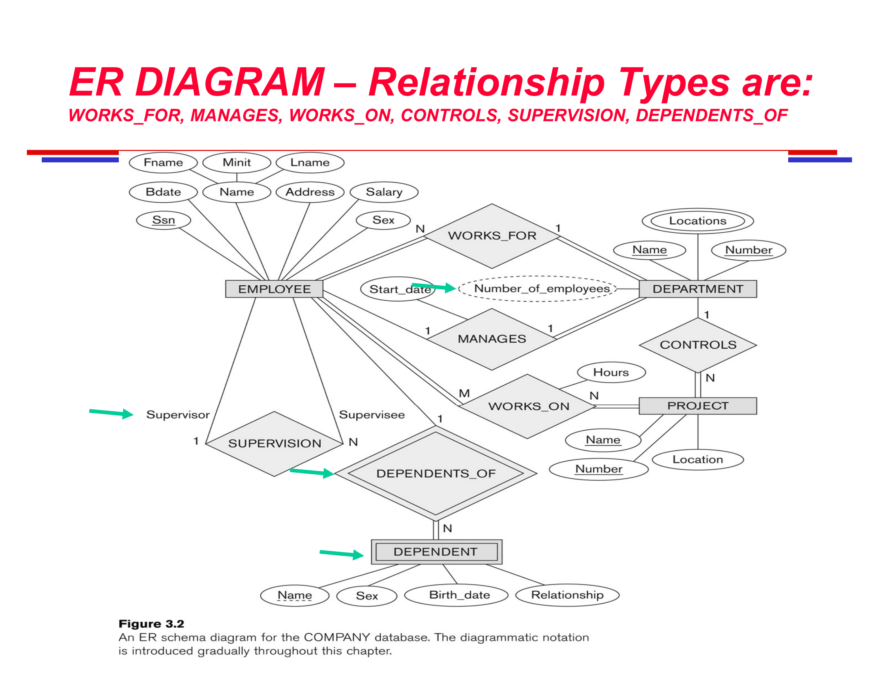
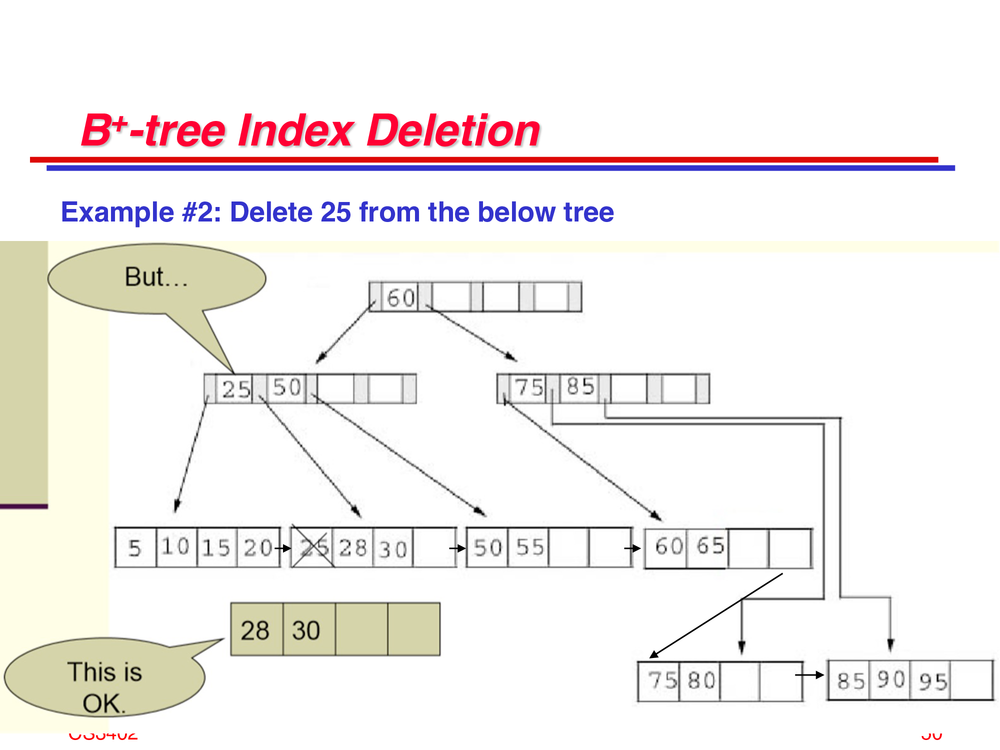
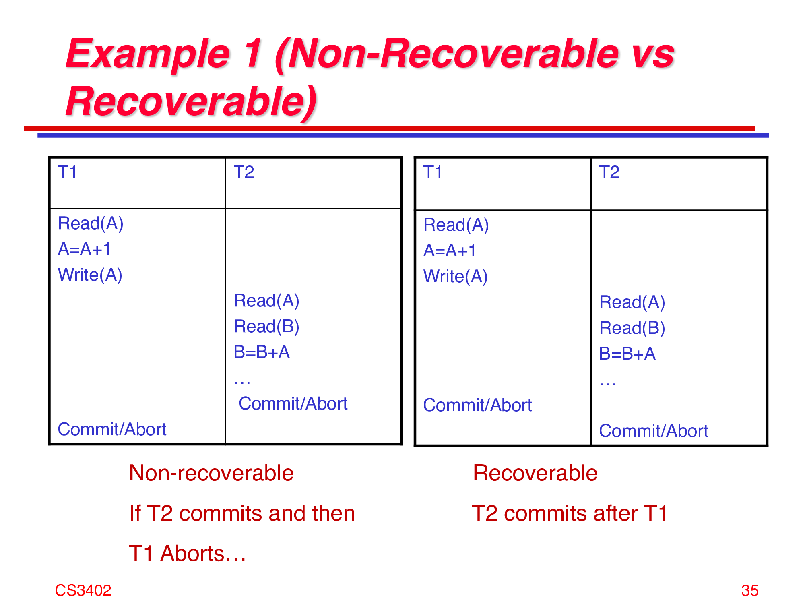
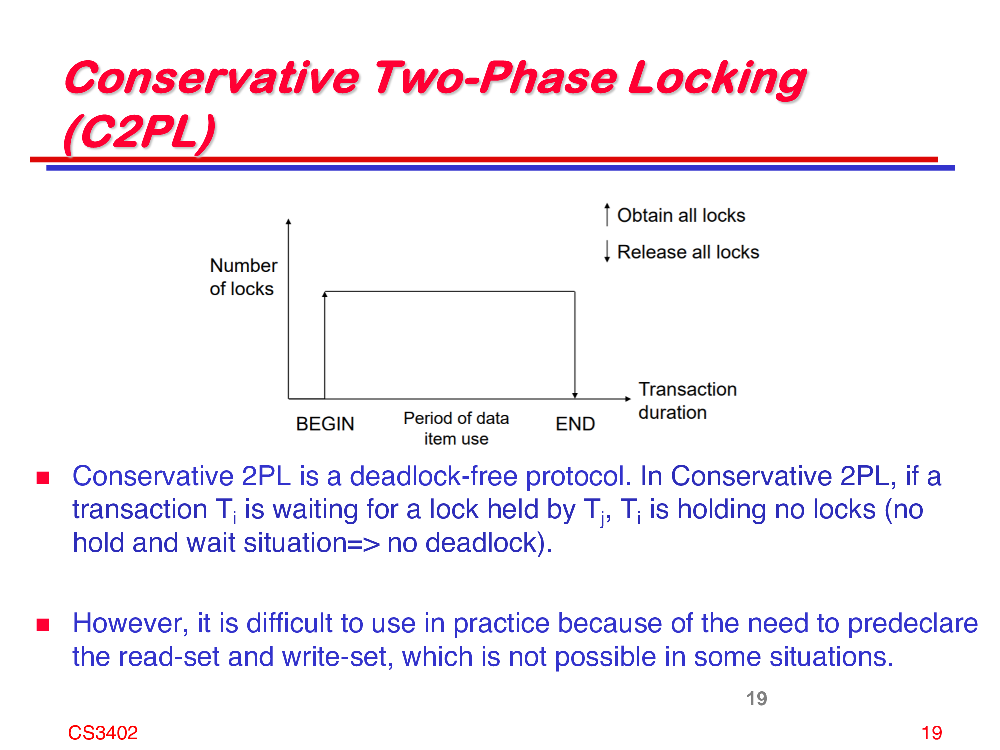

# CS3402 Database Systems

## 1. Introduction

### Terms

- **Data**: any information stored in a computer memory.
- **Database** (DB): a **non-redundant, persistent** collection of **logically related** data that are **structured** to support various processing and retrieval needs.
    - non-redundant: no duplicate data
    - persistent: data is stored in a permanent storage device
- **Database Management System** (DBMS): a set of software programs for creating, storing, updating, and accessing the data of a database.
    - examples: Oracle, MySQL, Microsoft SQL Server, PostgreSQL, MongoDB, Redis, etc.
    - Compared to a file system, a DBMS provides
        - the ability to manage persistent data
        - other features such as data modeling, query languages, transaction management, access control, recovery, etc.
- **Database System**: an integrated system of hardware, software, people, procedures, and data that define and regulate the collection, storage, management, and use of data within a database environment.
    - Software = OS + DBMS + Application Programs

### Database System Architecture


- Typical Users
    - **Naive Users**: run application programs to access the database indirectly
    - **Interactive Users**: use a query language to access the database
    - **Application Programmers**: write embedded DML statements in a general-purpose programming language (e.g. Java)
    - **Database Administrators** (DBAs): have central control of the database system. Responsible for:
        - Define the schema (= logical structure) of the database
        - Define the storage structure and access methods
        - Modify the schema and physical organization
        - Grant authorization for data access
        - Specify integrity constraints
- Database Languages
    - **Data Definition Language** (DDL): used to define the database schema
        - Examples: `CREATE`, `ALTER`, `DROP`
    - **Data Manipulation Language** (DML): used to retrieve, insert, delete, and modify data
        - Examples: `SELECT`, `INSERT`, `DELETE`, `UPDATE`
    - **Data Query Language** (DQL): a subset of DML that specifies the retrieval of data
        - Examples: `SELECT`
    - Real-world DBMSs use a single language covering all three purposes and more functions
        - Examples: SQL, QBE, etc.

### 3-Level Architecture


Database systems can be abstracted into three levels:

- **External Schema**: how external users view the data
    - **View**: a subset of the database, only providing the data that external users need
    - Design: Hide the details (structure and unconcerned data) from external users
    - Use: Provide a customized view of the database for each user group
- **Conceptual Schema**: how the entire database is viewed by the database administrator
    - Design: Hide the details (physical storage) from the database administrator
- **Internal Schema**: how the data is stored in the database
    - Complete details of data storage, and access paths to the data

From high-level to low-level, details increase and abstraction decreases.

The 3-layer system helps to:
- Simplify interactions between users and the database
- Hide unnecessary details from users
- Achieve **data independence**: the ability to modify a schema definition in one level without affecting the schema definition in the next higher level
    - **Physical Data Independence** (via Conceptual/Internal Mapping): changes in the storage structure or updates in the DBMS software do not affect how users access the data
    - **Logical Data Independence** (via External/Conceptual Mapping): changes in the logical organization of the data do not affect how external users view the data

### Data Models

Data model = a collection of concepts for describing data, data relationships, operations, and constraints

**Relational Model** is the most widely used data model.

**Entity-Relationship Model** is a popular high-level conceptual data model.

To design a database, we need to

- List the concerned fields and their relationships according to the requirements
- Use ER diagrams to visualize the relationships
- Translate the diagrams into a relational schema
- Construct the database using SQL

### ER Model

- **Entity**: a distinguishable object in the real world
    - Examples: Jone Doe, etc. Colors, numbers, etc. are not entities.
- **Entity Set**: a collection of entities of the same type
- **Attribute**: a property of an entity
    - Examples: A person's name, age, etc.
    - Each attribute has a **domain** (a set of possible values), described by a **data type** (e.g. integer, string, etc.)
    - Types of attributes:
        - **Simple Attribute**: a single value
        - **Composite Attribute**: composed of multiple simple attributes (class)
            - Example: an address composed of street, city, state, and zip code
            - Forms a **hierarchy** where sub-attributes are themselves composite attributes
        - **Multi-valued Attribute**: may have 0, 1, or multiple values (array)
            - Example: a student's previous degrees
- **Key**: an attribute (or a set of attributes) that UNIQUELY identifies an entity
- **Relationship**: an association among several entities
    - **Relationship can carry attributes**
- **Relationship Set**: a collection of relationships of the same type
    - that have the same connected entity types and same semantics (relationship attribute types, data constraints)
- **Cardinality**: describes the number of entities that can be involved in a relationship
    - One-to-one, one-to-many, many-to-many
- **Participation**: describes whether all entities in an entity set must participate in a relationship
    - Total participation vs. partial participation

### ER Diagram


- Rectangles: entity sets
- Ellipses: attributes
    - Underlined: primary key
    - Double-lined: multi-valued attribute
- Diamonds: relationship sets
- Lines:
    - connect attributes to entity / relationship sets
    - connect relationship sets to entity sets (single line: partial participation, double line: total participation)
    - connect attributes to attributes (for composite attributes)

More symbols:

- Double-lined rectangle: weak entity set
    - an entity set that does not have a unique attribute that can be used as a key
    - usually depends on another entity set (owner entity set)
- Double-lined diamond: identifying relationship
    - a relationship that is necessary to identify the weak entity set
    - i.e. Only with the identifying relationship can the weak entity set be uniquely identified
- Dashed ellipse: derived attribute
    - an attribute whose value can be calculated from other attributes
    - e.g. age can be calculated from birth date
    - dervied attributes can be omitted or stored in the database, but the data must be consistent

**Identifying relationship** connects a weak entity set to its owner entity set.
- On the weak entity set side, it must be total participation.
- The owner entity set must be a strong entity set.
- The relationship can carry attributes that, combined with the primary key of the owner entity set, can uniquely identify the weak entity set. (e.g. timestamp + employee ID = uniquely identifiable operation)


Example: a database for a company



- `Employee Works_For Department` is a N-to-1 relationship.
    - Both sides are total participation.
- `Employee Manages Department` is a 1-to-1 relationship
    - Employee side is partial participation.
    - Department side is total participation.
- `Employee Supervises Employee` is a 1-to-N relationship.
    - Both sides are partial participation.
- `Employee Works_On Project` is a M-to-N relationship.
    - Both sides are total participation.
    - The relationship carries an attribute `Hours` to record the number of hours an employee works on a project.
- `Department Controls Project` is a 1-to-N relationship.
    - Department side is partial participation.
    - Project side is total participation.
- `Dependent Dependents_Of Employee` is a N-to-1 relationship.
    - Dependent side is total participation. **Weak entity set MUST have total participation.** (Because a dependent cannot exist without an employee)
    - Employee side is partial participation.
- `Number_Of_Employees` can be computed from given data, so it is a derived attribute.

### Constraints in ER Diagrams

**Cardinality ratio** = for an instance of A or B, at most how many A-R-B relationships can it participate in?

It can be 1:1, 1:N, N:1, or M:N. Denoted by corresponding numbers on the lines.

**Participation constraint** = for an instance of A or B, must it participate in at least one A-R-B relationship?

If must, then it is total participation (double line). Otherwise, it is partial participation (single line).

Alternatively, **(min, max) constraint** can be used to describe cardinality and participation constraints.

(min, max) constraint is determined by:

- the cardinality ratio on the other side → the maximum
- the participation constraint on this side → the minimum

| | x:1 | x:N |
| --- | --- | --- |
| total A | A = (1,1) | A = (1,N) |
| partial A | A = (0,1) | A = (0,N) |

Work on the previous example:


- `Employee Works_For Department` is N:1, total vs. total
    - Employee works for exactly one department (1,1)
    - Department has at least one employee (1,N)
- `Employee Manages Department` is 1:1, partial vs. total
    - Employee manages 0 or 1 department (0,1)
    - Department has exactly one manager (1,1)
- `Employee Supervises Employee` is 1:1, partial vs. partial
    - Employee (as supervisor) manages 0 or any number of employees (0,N)
    - Employee (as subordinate) has 0 or 1 direct supervisor (0,1)
- `Employee Works_On Project` is M:N, total vs. total
    - Employee works on 1 or multiple projects (1,N)
    - Project has 1 or multiple employees working on it (1,N)
- `Department Controls Project` is 1:N, partial vs. total
    - Department controls 0 or any number of projects (0,N)
    - Project is controlled by exactly one department (1,1)
- `Dependent Dependents_Of Employee` is N:1, total vs. partial
    - Dependent is dependent of exactly one employee (1,1)
    - Employee has 0 or any number of dependents (0,N)

(min, max) constraints is preferred because it is easier to translate into relational schema.

### Special Relationship Sets

#### N-ary Relationship

**Degree** of a relationship = number of participating entity sets

In the previous example, all relationships are binary.

A ternary relationship is NOT EQUIVALENT to three binary relationships.

Instead, to represent a ternary relationship using binary relationships, we need to introduce weak entity sets.

#### Recursive Relationship

**Recursive relationship**, self-referencing relationship = a relationship between an entity set and itself

e.g. `Employee Supervises Employee`

## 2. Relational Model

Databases are usually implemented using the relational model. Therefore, we need to convert ER diagrams into relational schemas.

- **Relation**: a table with columns and rows.
- **Tuple**: a row of a relation. Tuples are **unordered**, but in applications, they are usually ordered by a primary key.
- **Attribute**: a column of a relation. Attributes are **ordered**, and thus the values (state) of a relation are ordered.
- **Domain**: data type and value range (constraints) of an attribute.
- **Schema of a relation**: name of the relation, and the name and domain of each attribute.
- **State of a relation**: a set of tuples (specific values) of the relation. Contains the data at a particular point in time.

Values in a relation are
- **atomic**, indivisible. They should not be further divided.
- basic units of data manipulation.
- in the domain of that attribute.
- valued with **null** if unknown or inapplicable.

To convert an ER diagram into a relational schema, we need to
- Map each entity set to a relation. The attributes remain the same.
- Replace each of A-R-B relationship with EITHER
    - **a new relation** C, that contains the primary keys of A and B as foreign keys, and any attributes of the relationship as attributes of C; OR
    - **a foreign key** in A (or B) that references the primary key of B (or A)

Basically, if the relationship has attributes, a new relation is needed. Otherwise, a foreign key is enough.

### Step-by-step Conversion

In relational model, both entity sets and relationship sets are represented as relations. They are distinguished as **entity relations** and **relationship relations**.

(1) Strong entity sets

Choose one of the key attributes (candidate keys) as the primary key.

> In the above example, `Employee` (key: `Ssn`), `Department` (key: `Dnumber`), `Project` (key: `Pnumber`) are strong entity sets.

(2) Weak entity sets + identifying relationship

Add its owner entity set's primary key as a foreign key. Foreign key + partial key = primary key.

> In the above example, `Dependent` (partial key: `Dependent_name`) is a weak entity set. Its owner entity set is `Employee` (key: `Ssn`).

> Solution: add `Essn` as a foreign key to `Dependent`. Its primary key is `(Essn, Dependent_name)`.

Note: weak entity sets derived from N-ary relationships may contain multiple foreign keys but no partial key. In that case, the primary key is the combination of all foreign keys.

(3) 1:1 relationship

3 possible approaches:

- **Foreign key approach**: assume A-R-B is 1:1. Add the primary key of B as a foreign key in A, or reverse.
    - If one side is total participation, add the foreign key to the total participation side. This eliminates the need for null values.
- **Merged relation approach**: assume A-R-B is 1:1 and **both sides are total participation**. Merge A and B into a single relation.
    - Surjective mapping: each tuple in R represents a pair of A instance and B instance, as well as their relationship.
- **Cross reference approach**: assume A-R-B is 1:1. Create a new relation C with foreign keys referencing A and B.
    - Primary key of C is the **combination** of the foreign keys.

> In the above example, `Employee Manages Department` is a 1:1 relationship.

> Solution: add `Mgr_ssn` as a foreign key to `Department`. The primary key of `Department` remains unchanged.  
> Note that `Department` is the total participation side. So there will be no null values.

(4) 1:N relationship

2 possible approaches:

- Foreign key approach: assume A-R-B is 1:N. Add the primary key of A (1-side) as a foreign key in B (N-side).
- Cross reference approach

> In the above example, `Employee Supervises Employee` (1:N), `Employee Works_For Department` (N:1), `Department Controls Project` (1:N) are 1:N relationships.

> Solution:  
> - add `Super_ssn` as a foreign key to `Employee` (subordinate is N-side)  
> - add `Dno` as a foreign key to `Employee` (Employee is N-side)  
> - add `Dnum` as a foreign key to `Project` (Project is N-side)

(5) M:N relationship

Only cross reference approach is possible.

> In the above example, `Employee Works_On Project` is a M:N relationship.

> Solution: create a new relation `Works_On`. Attributes:  
> - foreign key `Essn` referencing `Employee`  
> - foreign key `Pno` referencing `Project`  
> - `Hours` (relationship attribute)  
> Its primary key is `(Essn, Pno)`.

(6) N-ary relationship

Only cross reference approach is possible.

(7) Multi-valued attribute

Assume A has a multi-valued attribute M.

Create a new relation `A_M`. Each tuple in `A_M` contains the primary key of A (foreign key) and one value of M.

The combination of foreign key and value is the primary key of `A_M`.

> In the above example, `Department` has a multi-valued attribute `Locations`.

> Solution: create a new relation `Dept_Locations`. Attributes:  
> - foreign key `Dnumber` referencing `Department`  
> - `Dlocation` (multi-valued attribute)  
> Its primary key is `(Dnumber, Dlocation)`.

Finally, we get the following relational schema. Domain of each attribute is omitted.


### Correspondence between ER Model and Relational Model

| ER Model | Relational Model |
| --- | --- |
| 1:1 relationship | Foreign key in A referencing B OR <br> Foreign key in B referencing A |
| 1:N relationship | Foreign key in B referencing A |
| M:N relationship | New relation C with foreign keys referencing A and B |
| n-ary relationship | New relation C with n foreign keys referencing n entity sets |
| Simple attribute | Attribute |
| Composite attribute | Divided into multiple simple attributes |
| Multi-valued attribute | New relation C with foreign key referencing A and attribute |
| Value set | Domain |
| Key attribute | Primary key |

## 3. Integrity Constraints

### Terms

A relational database schema can be defined as
- a set of relation schemas $S = \{R_1, R_2, \dots, R_n\}$, AND
- a set of integrity constraints $IC = \{IC_1, IC_2, \dots, IC_m\}$

**Integrity constraint** = a condition that must be true for any instance (= state) of the database.

If a state passes all integrity constraints, it is a **valid state**. Otherwise, it is an **invalid state**.

### Types of Integrity Constraints

- **Inherent** (implicit) constraints
    - **Domain** constraints: each attribute value must be in the domain of that attribute
    - **Key** constraints: each tuple must be uniquely identifiable
    - **Entity integrity** constraints: primary key cannot be null
    - **Referential integrity** constraints: foreign key must be null or must match the primary key of the referenced relation
- **Schema-based** (explicit) constraints
    - (min, max) cardinality constraints
- **Application-based** (semantic) constraints
    - defined by the application

#### Domain constraints

Every value in a tuple must be an **atomic** value from the domain of that attribute.

- Multi-valued attributes are not allowed.
- `NULL` is allowed unless `NOT NULL` is specified.

#### Key constraints

```sql
CREATE TABLE Student (
    ID INT,
    Name VARCHAR(20),
    Email VARCHAR(20),
    PRIMARY KEY (ID)
);
```

**Superkey**: a set of attributes that uniquely identifies a tuple

In the above example, `ID` and `Email` are unique to each student. Therefore, any set of attributes that contains `ID` or `Email` is a superkey. This includes `(ID), (Email), (ID, Email), (ID, Email, Name)`, etc.

**Candidate key**: a minimal superkey. One (or more) of the superkey sets such that removing any attribute from it will make it not a superkey.

In the above example, `(ID)` and `(Email)` are candidate keys. `(ID, Email)` is not a candidate key because removing `Email` still qualifies as a superkey.

It can be concluded that:

- All candidate keys $CK_i$ are superkeys. $CK \subseteq SK$.
- All set of attributes $S$, such that a candidate key $CK_i \subseteq S$, are superkeys. $S \in SK$.
- A minimal superkey is a candidate key.

**Primary key**: a candidate key that is chosen to be the primary key.

It can be a (one) attribute, or a composite key.

In the above example, `(ID)` is the primary key. However, `(Email)` can also be chosen as the primary key.

#### Entity integrity constraints

All **primary key** attributes must NOT be `NULL`. If the primary key is composite, then all attributes in the primary key must NOT be `NULL`.

In SQL, declaring `PRIMARY KEY` automatically adds `NOT NULL` constraint to those attributes.

#### Referential integrity constraints

Referential integrity constraints are used to maintain **consistency** among tuples in two relations.

In a `A-R-B` relationship, if the reference key is stored in `A`, then `A` is **referencing relation** and `B` is **referenced relation**.

The reference key in `A` is called **foreign key**. It must:

- Have the same domain as the primary key of `B`
- Each value must either be `NULL` or match a value of the primary key of `B`

### Violation of Integrity Constraints

Consider possible updates to the database: `INSERT`, `DELETE`, `UPDATE`.

They should NOT violate any integrity constraints.

Consider the following example:

```sql
CREATE TABLE Student (
    ID INT,
    Name VARCHAR(20),
    Email VARCHAR(20),
    PRIMARY KEY (ID)
);
CREATE TABLE Email (
    ID INT,
    Email VARCHAR(20),
    Privilege INT,
    PRIMARY KEY (ID, Email),
    FOREIGN KEY (ID) REFERENCES Student(ID)
);
```

- `INSERT INTO Student VALUES (1, 'John Doe', 'john@example.com')` is valid.
- `INSERT INTO Student VALUES (2, 'Jane Doe', NULL)` is valid.
- `INSERT INTO Student VALUES (1, 'John Doe', 'john@example.com')` violates key constraint: `ID=1` already exists.
- `INSERT INTO Student VALUES ('1', 'John Doe', 'john@example.com')` violates domain constraint: `ID` must be an integer.
- `INSERT INTO Student VALUES (NULL, 'John Doe', 'john@example.com')` violates entity integrity constraint: `ID` cannot be `NULL`.
- `INSERT INTO Email VALUES (1, 'john@example.com', 0)` is valid.
- `INSERT INTO Email VALUES (4, 'mark@example.com', 0)` violates referential integrity constraint: `ID=4` does not exist in `Student`.
- `DELETE FROM Student WHERE ID=1` violates referential integrity constraint: `ID=1` is referenced by `Email`.

### Functional Dependencies

**Functional dependency** = a constraint between two sets of attributes in the same relation.

Mathematical definition: Let $R$ be a relation schema, and $X \subseteq R$ and $Y \subseteq R$ be two sets of attributes.

$X \rightarrow Y$ if and only if $\forall t_1, t_2 \in R, (t_1[X] = t_2[X]) \Rightarrow (t_1[Y] = t_2[Y])$.

Also reads as, $Y$ depends on $X$, or $Y$ is determined by $X$.

Properties:

- $(X \rightarrow Y) \Rightarrow (XZ \rightarrow Y)$
- Trivial functional dependency: When $Y \subseteq X$, $X \rightarrow Y$ is trivial. e.g. $A \rightarrow A$, $AB \rightarrow A$, etc.

Inference rules:

- **Reflexive**: If $Y \subseteq X$, then $X \rightarrow Y$.
- **Augmentation**: If $X \rightarrow Y$, then $XZ \rightarrow YZ$.
- **Transitive**: If $X \rightarrow Y$ and $Y \rightarrow Z$, then $X \rightarrow Z$.

They form a **sound and complete** inference system.
- Sound: given rules are correct
- Complete: all correct rules can be derived from the given rules

Proving $(X \rightarrow Y) \Rightarrow (XZ \rightarrow Y)$:

$(X \rightarrow Y) \Rightarrow (XZ \rightarrow YZ) \overset{YZ \rightarrow Y}{\Rightarrow} (XZ \rightarrow Y)$

Commonly used inference rules:

- **Decomposition**: If $X \rightarrow YZ$, then $X \rightarrow Y$ and $X \rightarrow Z$.
- **Union**: If $X \rightarrow Y$ and $X \rightarrow Z$, then $X \rightarrow YZ$.
- **Pseudo-transitive**: If $X \rightarrow Y$ and $WY \rightarrow Z$, then $WX \rightarrow Z$.

**Closure** of a set $F$ of functional dependencies = the set $F^+$ of all functional dependencies that can be inferred from $F$.

A set of functional dependencies $F$ **covers** another set $G$ if $G \subseteq F^+$, i.e. all functional dependencies in $G$ can be inferred from $F$.

Two sets of functional dependencies $F$ and $G$ are **equivalent** if $F^+ = G^+$.

If $F^+$ contains all attributes of the relation $R$, then $F$ is a **superkey**. i.e. From the given values of $X$, we can determine the values of the whole tuple.

## 4. Normal Forms

**Normalization** = dividing a relation into several related relations.

The goal of normalization is to

- minimize redundancy
- minimize update (insert, delete, update) anomalies (inconsistency)

Normalization requires two properties:

- **Lossless join**: Joining the decomposed relations should produce the original relation.
    - Decomposition is reversible; no information is lost.
    - No spurious (illegitimate) tuples are generated through a natural join.
- Preserving functional dependencies
    - Each of the FDs in the original relation should be either preserved or derivable from the decomposed relations.


> Example: The left decomposition is lossless. The right decomposition is not lossless because spurious tuples are generated.

### 1NF

Test: Each attribute value must be atomic. **Multi-valued or composite attributes are not allowed.**

Remedy (UNF → 1NF):

- Divide multi-valued attributes into separate relations (lines in a table).
- Divide composite attributes into separate attributes (columns in a table).

Example 1:


`Department(Dname, Dnumber: key, Dmgr_ssn, Dlocations)` is not in 1NF because `Dlocations` is a multi-valued attribute.

Remedy: dividing `Dlocations` into different rows, each with a different location. The new schema becomes: `Department(Dname, Dnumber: key, Dmgr_ssn, Dlocation: key)`.

However, this is NOT a good solution because it introduces redundancy. `Dname` and `Dmgr_ssn` are repeated for each location under the same department.

Better solution: create a new relation solely for `Dlocations`. The new schema becomes:

- `Department(Dname, Dnumber: key, Dmgr_ssn)`
- `Dept_Locations(Dnumber: key, Dlocation: key)`

Example 2:


`Emp_Proj(Ssn: key, Ename, Pnumber, Hours)` is not in 1NF because `(Pnumber, Hours)` is a composite attribute.

Remedy: create a new relation that takes `Pnumber` as the primary key, and `Hours` as an attribute. The new schema becomes:

- `Emp(Ssn: key, Ename)`
- `Emp_Proj(Ssn: foreign key, Pnumber: key, Hours)`

### 2NF

- **Full Functional Dependency**: $X \rightarrow Y$ is a full functional dependency if removing any attribute from $X$ makes the dependency not hold.
- **Partial Dependency**: $X \rightarrow Y$ is a partial dependency if $\exists Z \subset X, Z \rightarrow Y$.
- **Prime (key) Attribute**: an attribute that is part of a candidate key (= minimal superkey).

Test: For relations where **primary key contains multiple attribute**, each non-key attribute must be fully functionally dependent on the primary key.

Remedy (1NF → 2NF): Decompose the relation. Set up a new relation for the unrelated attributes.

Example:


`Supplier(Supplier_No: key, Supplier_Country, Supplier_City, Product_No: key, Quantity)` is not in 2NF because `Supplier_Country` and `Supplier_City` are not fully functionally dependent on the primary key `(Supplier_No, Product_No)`. They are only dependent on `Supplier_No`, i.e. partially dependent on the primary key.

Remedy: create a new relation for `Supplier_No`, `Supplier_Country`, and `Supplier_City`. The new schema becomes:


- `Supplier(Supplier_No: key, Country, City)`
- `Supplier_Product(Supplier_No: foreign key, Product_No: key, Quantity)`

In the above example,

- `(Supplier_No, Product_No) → Quantity` is a full functional dependency. Removing either attribute invalidates the dependency.
- `(Supplier_No, Product_No) → Country` is a partial dependency. While `(Supplier_No) → Country` is a full functional dependency, `Product_No` is completely unrelated to `Country`.
- Candidate keys of the relations are `(Supplier_No, Product_No)`. No other combinations are both unique and minimal. 
- Therefore, the prime (key) attributes are `Supplier_No` and `Product_No`.
- Non-prime (non-key) attributes are `Country`, `City`, and `Quantity`.

### 3NF

**Transitive Dependency**: $X \rightarrow Y (X, Y \subseteq R)$ is a transitive dependency if $\exists Z \subseteq R, X \rightarrow Z \rightarrow Y$. ($Z$ must be non-prime, i.e. not a candidate key)

Test: The relation should not contain non-prime attributes that are functionally dependent on other non-prime attributes. (i.e. can be uniquely determined by non-prime attributes). Or, the relation should not contain a non-prime attribute that is transitively dependent (i.e. indirectly determined) on the primary key.

Remedy: Decompose the relation.

In the above example, `Supplier_No → Country` is a transitive dependency since `Supplier_No → City → Country` holds, and `City` is non-prime.

The new schema becomes:

- `Supplier(Supplier_No: key, City)`
- `City_Country(City: key, Country)`
- `Supplier_Product(Supplier_No: foreign key, Product_No: key, Quantity)`

### BCNF

General definition of 2NF: A relation is in 2NF iff

- It is in 1NF, AND
- Every non-prime attribute is not partially dependent on any candidate key.

General definition of 3NF: A relation is in 3NF iff

- It is in 2NF, AND
- Whenever a nontrivial functional dependency $X \rightarrow A$ holds, EITHER
    - $X$ is a superkey ($X$ includes a candidate key), OR
    - $A$ is a prime attribute ($A$ is part of a candidate key).

**Boyce-Codd Normal Form (BCNF)**: A relation is in BCNF iff

- It is in 2NF, AND
- Whenever a nontrivial functional dependency $X \rightarrow A$ holds, $X$ is a superkey.

Example: Lands to be sold


`Lots(Property_Id: key, County, Lot_No, Area, Price, Tax_Rate)`

Candidate keys: `(Property_Id)`, `(County, Lot_No)`

Existing FDs:

- FD1: Property Id → (County, Lot No, Area, Price, Tax Rate)
- FD2: (County, Lot No) → Property Id → (Area, Price, Tax Rate)
- FD3: County → Tax Rate
- FD4: Area → Price

This is a 1NF relation. It violates 2NF because non-prime `Tax_Rate` is not fully dependent on the primary key `Property_Id`.

2NF Remedy: Set up a new relation for `Tax_Rate`. The new schema becomes:

- `Lots(Property_Id: key, County, Lot_No, Area, Price)`
- `County_Tax(County: key, Tax_Rate)`

It violates 3NF because `Area → Price` is a nontrivial functional dependency, and `Area` is not a superkey, nor is `Price` a prime attribute.

3NF Remedy: Set up a new relation for `Area` and `Price`. The new schema becomes:

- `Lots(Property_Id: key, County, Lot_No, Area)`
- `Area_Price(Area: key, Price)`
- `County_Tax(County: key, Tax_Rate)`

It is now in BCNF.


However, if we add constraints such as `Area → County` (because County A only contains large lots while County B only contains small lots), then the relation is still in 3NF but not in BCNF.

It violates BCNF because `Area → County` is a nontrivial functional dependency, and `Area` is not a superkey.

BCNF Remedy: Set up a new relation for `Area` and `County`. The new schema becomes:

- `Lots(Property_Id: key, Lot_No, Area)`
- `Area_County(Area: key, County)`
- `Area_Price(Area: key, Price)`
- `County_Tax(County: key, Tax_Rate)`


An abstract example shown as (b) of the above figure:

`R(A: key, B: key, C)` is in 3NF but not in BCNF.

- Candidate keys: `(A, B)`, `(A, C)`
- FD1: (A, B) → C
    - (A, B) is a superkey, but C is non-prime (3NF and BCNF)
- FD2: C → B
    - C is not a superkey, but B is a prime attribute (3NF but not BCNF)

BCNF is useful when a relation has **multiple composite candidate keys sharing some attributes**. Otherwise, BCNF reduces to 3NF.

In the above example, two composite candidate keys `(A, B)` and `(A, C)` share attribute `A`.

## 5. SQL

SQL (Structured Query Language) is a standard language for relational database management systems.

SQL functions as 3 types of languages:

- **DDL** (Data Definition Language): used to define the database schema
    - `CREATE`, `ALTER`, `DROP`
- **DML** (Data Manipulation Language): used to retrieve, insert, delete, and modify data
    - `INSERT`, `DELETE`, `UPDATE`
- **DQL** (Data Query Language): used to retrieve data
    - `SELECT`

SQL commands are case-insensitive. However, it is a common practice to write SQL keywords in uppercase.

Each SQL statement must end with a semicolon `;`.

### Data Types

- **INT**: integer (signed 32-bit)
- **FLOAT**: floating-point number (64-bit)
- **BOOLEAN**: `TRUE` or `FALSE`
- **CHAR(n)**: fixed-length character string. Memory will be allocated for `n` characters, and a shorter string will be padded with spaces. `CHAR` is equivalent to `CHAR(1)`.
- **VARCHAR(n)**: variable-length character string. Memory will be allocated for the actual length of the string, up to `n` characters
- **DATE**: date in the format `YYYY-MM-DD`
- **TIME**: time in the format `HH:MM:SS`
- **DECIMAL(p, s)**: fixed-point number. `p` is the precision (total number of digits), `s` is the scale (number of digits after the decimal point)

e.g. `DECIMAL(5, 2)` can store numbers up to 5 significant digits, with 2 digits after the decimal point. `123.45` is valid, `12.345` is not.

`DATE('YYYY-MM-DD')` and `TIME('HH:MM:SS')` are used to convert strings to date and time. 

`DATE`, `TIME`, `CHAR`, `VARCHAR` can be compared using comparison operators.

### SQL Boolean Operators

SQL allows `NULL` values, which will be treated as UNKNOWN (`U`) in boolean expressions.

Therefore, the result of a boolean expression can be `TRUE`, `FALSE`, or `UNKNOWN`.

NOT:

| A | NOT A |
| --- | --- |
| T | F |
| U | U |
| F | T |

AND:

| A | B | A AND B |
| --- | --- | --- |
| T | T | T |
| T | U | U |
| T | F | F |
| U | U | U |
| U | F | F |
| F | F | F |

OR:

| A | B | A OR B |
| --- | --- | --- |
| T | T | T |
| T | U | T |
| T | F | T |
| U | U | U |
| U | F | U |
| F | F | F |


### Constraints

Column constraints:

- **NOT NULL**: the column cannot contain `NULL` values.
- **UNIQUE**: the column cannot contain duplicate values
- **CHECK (condition)**: the column must satisfy the condition. e.g. `CHECK (Age > 0)`
- **DEFAULT value**: the column will be assigned the default value if no value is specified

`UNIQUE` should be used to specify candidate keys that are not chosen as the primary key.

Table constraints:

- **PRIMARY KEY (column)**: the column(s) will be the primary key.
    - All columns in the primary key are implicitly `NOT NULL`.
    - The combination of all columns in the primary key must be unique. However, each column can contain duplicate values.
- **FOREIGN KEY (column) REFERENCES table (column)**: the column(s) will be a foreign key referencing the primary key of another table.
    - The foreign key must match a primary key in the referenced table, or be `NULL`.
    - The foreign key must be the same data type as the referenced primary key.

### DDL

#### CREATE TABLE

```sql
CREATE TABLE table_name (
    column1_name data_type [constraint],
    column2_name data_type [constraint],
    ...
    [table_constraint]
);
```

#### DROP TABLE

```sql
DROP TABLE table_name;
```

#### ALTER TABLE

```sql
ALTER TABLE table_name
    ADD column_name data_type [constraint], -- add a new column
    DROP column_name, -- drop a column
    ALTER column_name data_type [constraint]; -- change the data type or constraint of a column
```

#### Table Constraints

**ADD CONSTRAINT**:

```sql
ALTER TABLE table_name
    ADD CONSTRAINT constraint_name constraint_type (column_name);
```

**DROP CONSTRAINT**:

```sql
ALTER TABLE table_name
    DROP CONSTRAINT constraint_name;
```

`constraint_type` can be `PRIMARY KEY`, `FOREIGN KEY`, `UNIQUE`, `CHECK`.

Running examples:

Given the following Relational Schema:

```
Employee(
    Fname, Minit, Lname, Ssn: key, Bdate, Address, Sex, Salary, Super_ssn (-> Employee.Ssn), Dno (-> Department.Dnumber)
)
Department(
    Dname, Dnumber: key, Mgr_ssn (-> Employee.Ssn), Mgr_start_date
)
Dept_Locations(
    Dnumber: key (-> Department.Dnumber), Dlocation: key
)
Project(
    Pname, Pnumber: key, Plocation, Dnum (-> Department.Dnumber)
)
Works_On(
    Essn: key (-> Employee.Ssn), Pno: key (-> Project.Pnumber), Hours
)
Dependent(
    Essn: key (-> Employee.Ssn), Dependent_name: key, Sex, Bdate, Relationship
)
```

Since we have mutual references, we need to create the tables and then add the foreign key constraints.

```sql
Create Table Employee (
    Fname VARCHAR(20) NOT NULL,
    Minit CHAR,
    Lname VARCHAR(20) NOT NULL,
    Ssn CHAR(9),
    Bdate DATE,
    Address VARCHAR(30),
    Sex CHAR,
    Salary DECIMAL(10, 2),
    Super_ssn CHAR(9),
    FK_Dno INT,
    PRIMARY KEY (Ssn),
    FOREIGN KEY (Super_ssn) REFERENCES Employee(Ssn)
);
Create Table Department (
    Dname VARCHAR(20) NOT NULL,
    Dnumber INT,
    Mgr_ssn CHAR(9),
    Mgr_start_date DATE,
    PRIMARY KEY (Dnumber),
    UNIQUE (Dname),
    FOREIGN KEY (Mgr_ssn) REFERENCES Employee(Ssn)
);
Create Table Dept_Locations (
    Dnumber INT,
    Dlocation VARCHAR(20),
    PRIMARY KEY (Dnumber, Dlocation),
    FOREIGN KEY (Dnumber) REFERENCES Department(Dnumber)
);
Create Table Project (
    Pname VARCHAR(20) NOT NULL,
    Pnumber INT,
    Plocation VARCHAR(20),
    Dnum INT,
    PRIMARY KEY (Pnumber),
    FOREIGN KEY (Dnum) REFERENCES Department(Dnumber)
);
Create Table Works_On (
    Essn CHAR(9),
    Pno INT,
    Hours DECIMAL(5, 1),
    PRIMARY KEY (Essn, Pno),
    FOREIGN KEY (Essn) REFERENCES Employee(Ssn),
    FOREIGN KEY (Pno) REFERENCES Project(Pnumber)
);
Create Table Dependent (
    Essn CHAR(9),
    Dependent_name VARCHAR(20),
    Sex CHAR,
    Bdate DATE,
    Relationship VARCHAR(20),
    PRIMARY KEY (Essn, Dependent_name),
    FOREIGN KEY (Essn) REFERENCES Employee(Ssn)
);
Alter Table Employee
    ADD CONSTRAINT FK_Dno FOREIGN KEY (FK_Dno) REFERENCES Department(Dnumber);
```

### DQL

#### SELECT

```sql
SELECT column1, column2, ...
FROM table_name
WHERE condition
[ORDER BY column_name [ASC | DESC]];
```

- The logical comparison operators are `=`, `<`, `>`, `<=`, `>=`, `<>`
- The logical operators are `AND`, `OR`, `NOT`. The precedence is `NOT` > `AND` > `OR`.

e.g. `A AND B OR NOT C` is equivalent to `(A AND B) OR (NOT C)`.

Retrieval from a single table: Retrieve the name and address of John B. Smith.

```sql
SELECT Bdate, Address
FROM Employee
WHERE Fname = 'John' AND Minit = 'B' AND Lname = 'Smith';
```

Retrieval from multiple tables: Retrieve the name of all employees working for the 'Research' department.

```sql
SELECT Fname, Lname
FROM Employee, Department
WHERE Employee.Dno = Department.Dnumber AND Department.Dname = 'Research';
```

- `Employee.Dno = Department.Dnumber` is a **join condition** because it combines tuples from `Employee` and `Department` whenever the condition is true.
- `Department.Dname = 'Research'` is a **selection condition** because it selects tuples from `Department` based on the condition.

#### Aliases

**Ambiguity**: If the same column name exists in multiple tables, it is ambiguous. You need to specify the table name.

Example: select the child dependents of all employees. `Employee.Bdate` and `Dependent.Bdate` are ambiguous.

```sql
SELECT Fname, Lname, Dependent_name, Dependent.Sex, Dependent.Bdate
FROM Employee, Dependent
WHERE Employee.Ssn = Dependent.Essn AND Employee.Bdate > Dependent.Bdate;
```

In such cases, you can use **aliases** to rename the result columns.

```sql
SELECT (E.Fname || ' ' || E.Lname) AS Employee_name, D.Dependent_name AS Child_name
FROM Employee AS E, Dependent AS D
WHERE E.Ssn = D.Essn AND D.Bdate > E.Bdate;
```

where `AS` in relation aliasing is optional. i.e. `FROM Employee E, Dependent D` is also valid.

#### LIKE

`LIKE` is used to match a pattern.

- `_` matches any single character
- `%` matches any sequence of characters (0 to many)

Retrieve the name of all employees whose name starts with 'J'.

```sql
SELECT Fname, Lname
FROM Employee
WHERE Fname LIKE 'J%';
```

#### ORDER BY

`ORDER BY` is used to sort the result. By default, ascending order is used.

You can sort by multiple columns. For example, first in ascending order of `Fname`, then in descending order of `Bdate` (from oldest to youngest).

```sql
SELECT Fname, Lname, Bdate
FROM Employee
ORDER BY Fname ASC, Bdate DESC;
```

#### SELECT DISTINCT

`SELECT ALL` retrieves all values, including duplicates. `SELECT` is equivalent to `SELECT ALL`.

`SELECT DISTINCT` retrieves only unique values. This views the column as a set.

Retrieve all unique salary numbers.

```sql
SELECT DISTINCT Salary
FROM Employee;
```

#### Working with NULL

Retrieve the working hours of all employees.

```sql
SELECT Essn, Pno, Hours
FROM Works_On
WHERE Hours > 0;
```

Whenever `NULL` is compared with a value, the result is `UNKNOWN`. Therefore, `Hours > 0` will not include tuples with `NULL` values. (Negating the clause still excludes `NULL` values because `NOT UNKNOWN = UNKNOWN`)

It is easier to use `IS NULL` or `IS NOT NULL` to compare with `NULL`.

```sql
SELECT Essn, Pno, Hours
FROM Works_On
WHERE Hours IS NOT NULL;
```

#### Universal Quantification

If `WHERE` condition is omitted, all tuples are selected.

If `SELECT *` is used, all columns are selected.

Retrieve the name of all employees.

```sql
SELECT Fname, Lname
FROM Employee;
```

### DML

#### INSERT

```sql
INSERT INTO table_name (column1, column2, ...)
VALUES (value1, value2, ...);
```

If `(column1, column2, ...)` is omitted, all columns are inserted.

Automatically create `Works_On` records for all employees working on project 1.

```sql
INSERT INTO Works_On (Essn, Pno, Hours)
SELECT Ssn, 1, 40
FROM Project P, Employee E
WHERE P.Pnumber = 1 AND E.Dno = P.Dnum;
```

The above example uses a **subquery**.

1. Subquery `SELECT Ssn, 1, 40 FROM Project P, Employee E WHERE P.Pnumber = 1 AND E.Dno = P.Dnum` retrieves the `Essn` of all employees working on project 1.
2. `INSERT INTO Works_On (Essn, Pno, Hours)` executes with the values `(*, 1, 40)` from the subquery.

#### DELETE

```sql
DELETE FROM table_name
WHERE condition;
```

If `WHERE` condition is omitted, all tuples are deleted.

**DELETE is dangerous**. It is recommended to use `UPDATE` to set a flag for deletion so you can use `SELECT` to verify the tuples to be deleted.

#### UPDATE

```sql
UPDATE table_name
SET column1 = value1, column2 = value2, ...
WHERE condition;
```

Similarly, if `WHERE` condition is omitted, all tuples are updated.

### Views

**Base table**: a table that is actually stored as a file in the database. It is stored in secondary storage (e.g. hard disk).

**View**: a **virtual table** that is derived from one or more base tables. It only exists in memory.

Views are used to

- simplify complex queries
- provide security by restricting access to certain columns
- remove unnecessary and redundant data

```sql
CREATE VIEW view_name AS
[SELECT ... FROM ... WHERE ...];

DROP VIEW view_name;
```

- View is created as a result of a query.
- **View is always up-to-date**. All updates to the base table are reflected in the view.
- Although limited modifications are allowed, it is recommended to use views for **read-only** purposes. Most DBMSs do not allow modifications to views that involve multiple base tables.

### Nested Queries

**Nested query**: a query within another query.

For the following examples, we will illustrate with the following schema:

```sql
CREATE TABLE Player (
    Player_ID INT,
    Name VARCHAR(20),
    Email VARCHAR(20),
    Level INT,
    Join_Date DATE,
    PRIMARY KEY (Player_ID),
    UNIQUE (Email)
);

CREATE TABLE Guild (
    Guild_ID INT,
    Name VARCHAR(20),
    Creation_Date DATE,
    Leader_ID INT,
    Current_Members INT,
    Max_Members INT,
    Visibility CHAR(10), -- Public, Private, Secret
    Rank INT,
    PRIMARY KEY (Guild_ID),
    FOREIGN KEY (Leader_ID) REFERENCES Player(Player_ID)
);

CREATE TABLE Guild_Member (
    Player_ID INT,
    Guild_ID INT,
    Role CHAR(10), -- Leader, Officer, Member
    Join_Date DATE,
    PRIMARY KEY (Player_ID, Guild_ID),
    FOREIGN KEY (Player_ID) REFERENCES Player(Player_ID),
    FOREIGN KEY (Guild_ID) REFERENCES Guild(Guild_ID)
);
```

#### IN

Example 1. Print the name of all guild leaders.

```sql
SELECT Name
FROM Player
WHERE Player_ID IN (SELECT Leader_ID FROM Guild);
```

Which is equivalent to:

```sql
SELECT P.Name
FROM Player P, Guild G
WHERE P.Player_ID = G.Leader_ID;
```

However, `IN` is more efficient than the equivalent query because it does not require a join.

**When subquery returns a single value**, `=` can be used instead of `IN`.

Example 2. Print the name of the leader of the oldest guild.

```sql
SELECT Name
FROM Player
WHERE Player_ID = (
    SELECT Leader_ID
    FROM Guild
    WHERE Creation_Date = (SELECT MIN(Creation_Date) FROM Guild)
);
```

If unsure about the cardinality of the subquery, always use `IN`.

#### SOME/ANY and ALL

`SOME` and `ANY` are equivalent. They return `TRUE` if the comparison is `TRUE` for at least one value in the subquery.

Example 3. Print the name of guilds whose leader has the highest level.

```sql
SELECT Name
FROM Guild
WHERE Leader_ID = SOME (
    SELECT Player_ID
    FROM Player
    WHERE Level = (SELECT MAX(Level) FROM Player)
);
```

From this example we can see `= SOME` (`= ANY`) is equivalent to `IN`.

On the other hand, other comparison operators (`<`, `>`, `<=`, `>=`, `<>`) can also be used with `SOME` (`ANY`) and `ALL`, making them more flexible than `IN`.

`ALL` returns `TRUE` if the comparison is `TRUE` for all values in the subquery.

Example 4. Print the name of guilds whose leader has the highest level within the guild.

```sql
SELECT G.Name
FROM Guild G
WHERE G.Leader_ID IN (
    SELECT P.Player_ID
    FROM Player P, Guild_Member M
    WHERE P.Player_ID = M.Player_ID AND M.Role = 'Leader' AND M.Guild_ID = G.Guild_ID AND P.Level >= ALL (
        SELECT P2.Level
        FROM Player P2, Guild_Member M2
        WHERE P2.Player_ID = M2.Player_ID AND M2.Guild_ID = G.Guild_ID
    )
);
```

The above query is an example of a **correlated subquery**. The subquery references the outer query.

The complete execution of the query is as follows:

1. Main query iterates through each guild $G$.
2. Second subquery iterates through each player in $G$.
3. Second subquery returns a list of levels of all players in $G$.
4. First subquery finds the leader of $G$ and validates if his level is greater than or equal to all levels in the list.
5. First subquery returns a list of leaders that satisfy the condition.
6. Main query returns the names of the guilds whose leader is in the list.

In this specific example, `>= ALL` can also be replaced with `NOT < ANY`, `= MAX`. This is because we know the equality must hold for at least one value (himself) in the list.

#### EXISTS

`EXISTS` returns `TRUE` if the subquery returns at least one tuple. `NOT EXISTS` does the opposite.

`EXISTS` / `NOT EXISTS` is more efficient than `IN` because it does not require the subquery to return any value, just check for existence.

Example 5. Print the name of all players who are not in any guild.

```sql
SELECT P.Name
FROM Player P
WHERE NOT EXISTS (
    SELECT *
    FROM Guild_Member M
    WHERE P.Player_ID = M.Player_ID
);
```

Example 6. Print the name of all guilds that have at least one member with level 100.

```sql
SELECT G.Name
FROM Guild G
WHERE EXISTS (
    SELECT *
    FROM Guild_Member M, Player P
    WHERE G.Guild_ID = M.Guild_ID AND M.Player_ID = P.Player_ID AND P.Level = 100
);
```

### Aggregate Functions

**Aggregate functions** summarize the information from multiple tuples into a single tuple.

`COUNT` can be used on any data types.

`SUM`, `AVG`, `MIN`, `MAX` can only be used on numeric data types. (e.g. `INT`, `FLOAT`, `DECIMAL`)

Example 7. Count the number of guildless players.

```sql
SELECT COUNT(*)
FROM Player
WHERE NOT EXISTS (
    SELECT *
    FROM Guild_Member M
    WHERE Player.Player_ID = M.Player_ID
);
```

Example 8. Count how many ranks of guilds are there.

```sql
SELECT COUNT(DISTINCT Rank)
FROM Guild;
```

Example 9. Print the average rank of all guilds whose leader has the highest level.

```sql
SELECT AVG(Rank)
FROM Guild
WHERE Leader_ID IN (
    SELECT Player_ID
    FROM Player
    WHERE Level = (SELECT MAX(Level) FROM Player)
);
```

#### NULL in Aggregate Functions

**NULL values are discarded** when calculating aggregate functions.

For example, if the `Level` of a player is `NULL`, it will not be included in the calculation of `AVG(Level)`.

However, `COUNT(*)` still counts that player. (Since a tuple in the relation will never be completely `NULL` - otherwise it does not satisfy the primary key constraint - therefore all tuples are counted in `COUNT(*)`)

#### Aggregate Functions in Nested Queries

Example 10. Print the name of all guilds who have at least 2 members with the highest level.

```sql
SELECT G.Name
FROM Guild G
WHERE (SELECT COUNT(*)
    FROM Guild_Member M, Player P
    WHERE G.Guild_ID = M.Guild_ID AND M.Player_ID = P.Player_ID AND P.Level = (SELECT MAX(Level) FROM Player)
) >= 2;
```

When the constraint is `>= 1`, it is equivalent to `EXISTS`.

#### GROUP BY

`GROUP BY` is used to group the result by one or more columns.

Example 11. Count for each rank, how many guilds have that rank. Sort by rank ascending.

```sql
SELECT Rank, COUNT(*)
FROM Guild
GROUP BY Rank
ORDER BY Rank;
```

The grouping criteria must be a column appearing in the `SELECT` clause.

- It cannot be an expression. If you want to group by an expression, you need to include the expression in the `SELECT` and give it an alias.
- It must be a non-aggregate column. For example, `GROUP BY COUNT(*)` is invalid.

Example 12. For each combination of guild rank and visibility, count how many guilds created on or after than `2020-01-01`, satisfy that combination. Sort by rank ascending, then visibility ascending.

```sql
SELECT Rank, Visibility, COUNT(*)
FROM Guild
WHERE Creation_Date >= DATE('2020-01-01')
GROUP BY Rank, Visibility
ORDER BY Rank, Visibility;
```

#### HAVING

`HAVING` is used to filter the result of a `GROUP BY` clause.

Example 13. In Example 12, omit the lines where the count is 0 or 1.

```sql
SELECT Rank, Visibility, COUNT(*)
FROM Guild
WHERE Creation_Date >= DATE('2020-01-01')
GROUP BY Rank, Visibility
HAVING COUNT(*) > 1
ORDER BY Rank, Visibility;
```

Example 14. Count for each rank, how many guilds have that rank, given that the guild has at least 5 members. Sort by rank ascending.

Note that the result `COUNT(*)` and the constraint `COUNT(*) >= 5` are not related. One is executed in `WHERE` and the other is executed in `HAVING`.

Therefore, a subquery is required.

```sql
SELECT Rank, COUNT(*)
FROM Guild
WHERE Guild_ID IN (
    SELECT Guild_ID
    FROM Guild_Member
    GROUP BY Guild_ID
    HAVING COUNT(*) >= 5
)
GROUP BY Rank
ORDER BY Rank;
```

The complete `SELECT` syntax is as follows:

```sql
SELECT column1, column2, ...
FROM table_name
[WHERE condition]
[GROUP BY column1, column2, ...]
[HAVING condition] -- must be used with GROUP BY
[ORDER BY column_name [ASC | DESC], ...];
```

## 6. Relational Algebra

- **Relational algebra** is a formal language for the **relational model**.
- Relational algebra consists of a set of operations that take one or more relations as input and produce a **new relation** as output.
- A sequence of relational algebra operations forms a **relational algebra expression**.

Importance of relational algebra:

- RA is the **theoretical foundation** for the relational model and SQL.
- RA provides a mathematical framework for **query optimization**.

### Basic Operations

- Set operations
    - $\cup$ (Union / Or)
    - $\cap$ (Intersection / And)
    - $-$ (Difference / Except)
    - $\times$ (Cartesian product)
- Unary relational operations
    - $\sigma$ (Select)
    - $\pi$ (Project)
    - $\rho$ (Rename)
- Binary relational operations
    - $\Join$ (General join)
    - $*$ (Natural join)
    - $\div$ (Division)
- Aggregate functions
    - SUM, AVG, COUNT, MAX, MIN

We will again use the company database schema for the following examples.

```
Employee        {Fname, Minit, Lname, Ssn: key, Bdate, Address, Sex, Salary, Super_ssn (-> Employee.Ssn), Dno (-> Department.Dnumber)}
Department      {Dname, Dnumber: key, Mgr_ssn (-> Employee.Ssn), Mgr_start_date}
Dept_Locations  {Dnumber: key (-> Department.Dnumber), Dlocation: key}
Project         {Pname, Pnumber: key, Plocation, Dnum (-> Department.Dnumber)}
Works_On        {Essn: key (-> Employee.Ssn), Pno: key (-> Project.Pnumber), Hours}
Dependent       {Essn: key (-> Employee.Ssn), Dependent_name: key, Sex, Bdate, Relationship}
```

### Unary Relational Operations

#### Select ($\sigma$)

- $\sigma$ selects a subset of tuples from a relation that satisfy a selection condition.
- **Horizontal partitioning**: it selects a subset of rows from a relation (i.e. it only filters rows)
- General form: $\sigma_{\text{cond}}(R)$

Properties:

- The schema of $\sigma_{\text{cond}}(R)$ is the same as the schema of $R$. (i.e. **same attributes**)
- $\sigma$ is **commutative**: $\sigma_{\text{cond1}}(\sigma_{\text{cond2}}(R)) = \sigma_{\text{cond2}}(\sigma_{\text{cond1}}(R))$
- A sequence of $\sigma$ operations can be applied in any order.
- A sequence of $\sigma$ operations can be combined into a single $\sigma$ operation: $\sigma_{\text{cond1} \land \text{cond2}}(R)$
- The number of tuples in $\sigma_{\text{cond}}(R)$ is **less than or equal** to the number of tuples in $R$.
- The fraction of tuples selected (i.e. $\text{card}(\sigma_{\text{cond}}(R)) / \text{card}(R)$) is called the **selectivity** of the condition.

Example 1. Select all employees who work in dept 4.

```sql
SELECT *
FROM Employee
WHERE Dno = 4;
```

$\sigma_{\text{Dno = 4}}(\text{Employee})$

Example 2. Select all employees who work in dept 4 with a salary greater than 25000, or who work in dept 5 with a salary greater than 30000.

```sql
SELECT *
FROM Employee
WHERE (Dno = 4 AND Salary > 25000) OR (Dno = 5 AND Salary > 30000);
```

$\sigma_{(\text{Dno = 4} \land \text{Salary > 25000}) \lor (\text{Dno = 5} \land \text{Salary > 30000})}(\text{Employee})$

or

$\sigma_{\text{(Dno = 4 AND Salary > 25000) OR (Dno = 5 AND Salary > 30000)}}(\text{Employee})$

#### Project ($\pi$)

- $\pi$ selects a subset of attributes from a relation.
- **Vertical partitioning**: it only filters columns.
- General form: $\pi_{\text{attr1, attr2, ...}}(R)$

Properties:

- $\pi$ removes duplicate tuples.
    - This is because the result of $\pi$ is a set of tuples, and a set does not contain duplicate elements.
    - For example, $\pi_{\text{Salary}}(\text{Employee})$ is equivalent to `SELECT DISTINCT Salary FROM Employee`.
- The number of tuples in $\pi_{\text{attr1, attr2, ...}}(R)$ is less than or equal to the number of tuples in $R$.
    - If the list of attributes includes a key of $R$ (i.e. each tuple is unique), then the number of tuples in $\pi_{\text{attr1, attr2, ...}}(R)$ is equal to the number of tuples in $R$.
- $\pi$ is NOT commutative
    - Instead, $\pi$ is **idempotent**: $\pi_{\text{list1}}(\pi_{\text{list2}}(R)) = \pi_{\text{list1}}(R)$ if $\text{list1} \subseteq \text{list2}$
    - e.g. list1 = {Lname, Fname}, list2 = {Lname, Fname, Salary}. Both $\pi_{\text{Lname, Fname}}(\pi_{\text{Lname, Fname, Salary}}(R))$ and $\pi_{\text{Lname, Fname}}(R)$ will return the same result: all distinct combinations of Lname and Fname.

Example 3. Select the name and salary of all employees.

```sql
SELECT Lname, Fname, Salary
FROM Employee;
```

$\pi_{\text{Lname, Fname, Salary}}(\text{Employee})$

Example 4. Select the name and salary of all employees who work in dept 5.

```sql
SELECT Lname, Fname, Salary
FROM Employee
WHERE Dno = 5;
```

$\pi_{\text{Lname, Fname, Salary}}(\sigma_{\text{Dno = 5}}(\text{Employee}))$

#### Rename ($\rho$)

- $\rho_{\text{S}}(R)$ renames relation $R$ to $S$.
- $\rho_{\text{(A1, A2, ...)}}(R)$ renames the attributes of $R$ to $A1, A2, ...$
- $\rho_{\text{S(A1, A2, ...)}}(R)$ does both.

Example 5. Example 4 but rename the result:

```sql
SELECT E.Lname As Family_name, E.Fname As Given_name, E.Salary
FROM Employee E
WHERE E.Dno = 5;
```

$\texttt{TMP} \leftarrow \sigma_{\text{Dno = 5}}(\text{Employee})$

$\texttt{RESULT} \leftarrow \rho_{\text{Family\_name, Given\_name, Salary}}(\pi_{\text{Lname, Fname, Salary}}(\texttt{TMP}))$

### Set Operations

#### Union ($\cup$)

- $R \cup S$ returns a relation that contains all tuples that are in $R$, $S$, or both.
- **Deduplication**: all set operations remove duplicate tuples.
- **Type compatibility**: $R$ and $S$ must have the same schema.
    - $R$ and $S$ must have the same number of attributes.
    - **The domains of corresponding attributes are type compatible**, i.e. $\text{dom}(R.A_i) = \text{dom}(S.A_i)$ for all $i$.
    - Same attribute name is not required. The result will have the attribute names of $R$.

Example 6. Retrieve the SSN of all employees who either work in dept 5 or directly supervise an employee who works in dept 5.

```sql
(SELECT Ssn FROM Employee WHERE Dno = 5)
UNION
(SELECT Super_ssn FROM Employee WHERE Dno = 5);
```

$\texttt{DEPT5} \leftarrow \sigma_{\text{Dno = 5}}(\text{Employee})$

$\texttt{RESULT1} \leftarrow \pi_{\text{Ssn}}(\texttt{DEPT5})$

$\texttt{RESULT2} \leftarrow \pi_{\text{Super\_ssn}}(\texttt{DEPT5})$

$\texttt{RESULT} \leftarrow \texttt{RESULT1} \cup \texttt{RESULT2}$

#### Intersection ($\cap$)

- $R \cap S$ returns a relation that contains all tuples that are in both $R$ and $S$.
- Type compatibility

#### Difference ($-$)

- $R - S$ returns a relation that contains all tuples that are in $R$ but not in $S$.
- Type compatibility

$R\cap S = (R - (R - S)) \cup (S - (S - R)) = (R \cup S) - (R - S) - (S - R)$

Explanation: in a Venn diagram, $R$ is the left circle, $S$ is the right circle. $R - S$ is the left exclusive part, $S - R$ is the right exclusive part. $R \cap S$ is the intersection. $R \cup S$ is the union.

#### Cartesian Product ($\times$)

- Combines all tuples from $R$ with all tuples from $S$
- $R(A_1, A_2, ..., A_n) \times S(B_1, B_2, ..., B_m) = T(A_1, A_2, ..., A_n, B_1, B_2, ..., B_m)$
- If $R$ has $n$ attributes and $S$ has $m$ attributes, then $T$ has $n + m$ attributes.
- If $R$ has $|R|$ tuples and $S$ has $|S|$ tuples, then $T$ has $|R| \times |S|$ tuples.
- No type compatibility is required.

Example 7. Retrieve the name of all dependents along with the name of their respective employees.

```sql
SELECT D.Dependent_name, E.Fname, E.Lname
FROM Dependent D, Employee E
WHERE D.Essn = E.Ssn;
```

$\texttt{EMP\_DEP} \leftarrow \text{Dependent} \times \text{Employee}$

$\texttt{VALID\_EMP\_DEP} \leftarrow \sigma_{\text{Dependent.Essn = Employee.Ssn}}(\texttt{EMP\_DEP})$

$\texttt{RESULT} \leftarrow \rho_{\text{Dependent\_name, Fname, Lname}}(\pi_{\cdots}(\texttt{VALID\_EMP\_DEP}))$

#### Properties of Set Operations

- Union and intersection are **commutative** and **associative**.
    - Commutative: $R \cup S = S \cup R$, $R \cap S = S \cap R$
    - Associative: $(R \cup S) \cup T = R \cup (S \cup T)$, $(R \cap S) \cap T = R \cap (S \cap T)$
- Difference is **not commutative** and not associative.
- Cartesian product is **not commutative** and not associative.

### Binary Relational Operations

#### Join ($\Join$)

- Effectively, **Select from a Cartesian product**.
- General form: $R \Join_{\text{cond}} S$
- Returns all combinations of tuples from $R$ and $S$ that satisfy the condition.
- No type compatibility is required.

Example 8. Example 7 but using join.

$\texttt{VALID\_EMP\_DEP} \leftarrow \text{Dependent} \Join_{\text{Dependent.Essn = Employee.Ssn}} \text{Employee}$

Properties:

Consider $R(A_1, A_2, ..., A_n) \Join_{R.A_i = S.B_j} S(B_1, B_2, ..., B_m)$

- The result has $n + m$ attributes.
    - But you can remove $S.B_j$ from the result because it is redundant.
- If $R$ has $|R|$ tuples and $S$ has $|S|$ tuples, then the result has less than or equal to $|R| \times |S|$ tuples.

#### Types of Join

- The general type $R \Join_\theta S$ is called the **theta join**.
    - The condition $\theta$ can be any general boolean expression on the attributes of $R$ and $S$.
- If $\theta$ only contains equality comparisons (=), then it is called the **equijoin**.
    - The equijoin is the most common type of join.
- **Natural join**: $R * S$ is a join that automatically selects the **attributes** that appear in both $R$ and $S$ as the join condition.
    - If $R$ and $S$ have attributes with the same name, they are automatically selected as the equijoin condition.
    - Only one copy of the attribute is included in the result.
    - e.g. $R(A, B, C, D) * S(C, D, E) \rightarrow Q(A, B, C, D, E)$. Tuples are joined if $R.C = S.C \land R.D = S.D$.

Example 9. Retrieve the name of the student, name of the course and his grade in the course, under the following schema:

```
Student     {SID: key, Sname, Major, GPA}
Course      {CID: key, Cname, Dept}
Enroll      {SID: key (-> Student.SID), CID: key (-> Course.CID), Grade}
```

```sql
SELECT S.Sname, C.Cname, E.Grade
FROM Student S, Course C, Enroll E
WHERE S.SID = E.SID AND C.CID = E.CID;
```

With general join:

$\texttt{TMP} \leftarrow \text{Student} \Join_{\text{Student.SID = Enroll.SID}} \text{Enroll}$

$\texttt{RESULT} \leftarrow \sigma_{\text{Sname, Cname, Grade}}(\texttt{TMP}\Join_{\text{Course.CID = Enroll.CID}} \text{Course})$

With natural join:

$\texttt{RESULT} \leftarrow \sigma_{\text{Sname, Cname, Grade}}(\text{Student} * \text{Enroll} * \text{Course})$

The natural join `Student * Enroll * Course` has the following schema:

```
{SID: key, CID: key, Sname, Major, GPA, Cname, Dept, Grade}
```

The natural join is only performed if `Student.SID = Enroll.SID` and `Course.CID = Enroll.CID`.

If the attributes in different relations have different names, you can use $\rho$ to rename before the natural join.

#### Division ($\div$)

General form: $R(Z) \div S(X)$, where $X$ and $Z$ are sets of attributes.
- $X \subseteq Z$ must hold.
- Let $Y = Z - X$. Therefore, $X \cap Y = \emptyset, X \cup Y = Z$. That is, $Y$ is the set of attributes in $Z$ that are not in $X$.
- $R(Z) \div S(X)$ returns a relation $T(Y)$.

---

Take a simple example:

```
R {Course, Programme} = {
    "Operating Systems", "CS",
    "Database Systems", "CS",
    "Database Systems", "IS",
    "Discrete Mathematics", "CS"
}

S {Programme} = {
    "CS",
    "IS"
}
```

Retrieve the course that is required by all programmes.

We perform `R(Course, Programme) ÷ S(Programme) = T(Course)`:

```
T {Course} = {
    "Database Systems"
}
```

Informally, the division `R(Z) ÷ S(X) = T(Y)` returns all tuples in `R` that is associated with all tuples in `S`. (Since all `X` attributes are common, we omit them, so `T` only contains `Y` attributes.)

Mathematically, the division is defined as follows:

`R(Z) ÷ S(X) = T(Y)` if and only if for every tuple $t$ in $T$ holds that:

for tuples $t_r \in R$ such that $t_r[Y] = t$, for every tuple $t_s \in S$, $t_r[X] = t_s$.

Or equivalently, $\forall t_s \in S, \exists t_r = (t_s, t) \in R$.

For a tuple $t$ to appear in the result $T$, the combination of every tuple $t_s$ with it, i.e. $(t_s, t)$, must appear in $R$.

---

Example 10. Retrieve the SSN of employees who work on all the projects that 'John Smith' works on.

Analyze the question:

- `R` should be the combination of `Employee.Ssn` and `Works_On.Pno`.
- `S` should be the list of `Pno` that 'John Smith' works on.
- Therefore, `R ÷ S` should return the `Ssn` of employees associated with all of the projects in `S`.

Relational algebra:

- $\texttt{SMITH} \leftarrow \sigma_{\text{Fname = 'John' AND Lname = 'Smith'}}(\text{Employee})$
- $\texttt{SMITH\_PNO} \leftarrow \pi_{\text{Pno}}(\text{Works\_On} \Join_{\text{Works\_On.Essn = SMITH.Ssn}} \text{SMITH})$
- $\texttt{SSN\_PNO} \leftarrow \pi_{\text{Essn, Pno}}(\text{Works\_On})$
- $\texttt{RESULT} \leftarrow \texttt{SSN\_PNO} \div \texttt{SMITH\_PNO}$

To implement a division in SQL, double `NOT EXISTS` is often used.

```sql
SELECT E.Ssn
FROM Employee E
WHERE NOT EXISTS (
    SELECT P.Pnumber
    FROM Project P
    WHERE P.Pnumber IN (
        SELECT W.Pno
        FROM Works_On W
        WHERE W.Essn = (
            SELECT E2.Ssn
            FROM Employee E2
            WHERE E2.Fname = 'John' AND E2.Lname = 'Smith'
        )
    ) AND NOT EXISTS (
        SELECT W2.Pno
        FROM Works_On W2
        WHERE W2.Essn = E.Ssn AND W2.Pno = P.Pnumber
    )
)
```

Explanation:

- `SELECT E2.Ssn FROM Employee E2 WHERE E2.Fname = 'John' AND E2.Lname = 'Smith'` retrieves the `Ssn` of 'John Smith'.
- `SELECT W.Pno FROM Works_On W WHERE W.Essn = (...)` retrieves the `Pno` of all projects that 'John Smith' works on.
- `SELECT P.Pnumber FROM Project P WHERE P.Pnumber IN (...) AND NOT EXIST (...)` checks if there are any projects that the employee E is NOT working on but 'John Smith' is working on.
- `SELECT E.SSn FROM Employee E WHERE NOT EXISTS (...)` retrieves the `Ssn` of employees that are working on all the projects that 'John Smith' works on.
    - It checks, that there are NO projects that 'John Smith' works on but the employee E does NOT work on.
    - The double negation turns a existential quantifier into a universal quantifier.

### Complete Set of Relational Operations

The set of operations including

- `SELECT` $\sigma$, `PROJECT` $\pi$, `RENAME` $\rho$
- `UNION` $\cup$, `DIFFERENCE` $-$, `CARTESIAN PRODUCT` $\times$

is called the **complete set of relational operations**.

Any other relational operation can be expressed as a sequence of operations from the complete set.

### Grouping and Aggregation

- Grouping must be used with aggregation.
- General form: $_{\text{group-by attr1, attr2, ...}}\gamma_{\text{attr1, attr2, ..., aggre(attr)}}(R)$

Example 11. Retrieve each department number, the number of employees in the department, and their average salary.

```sql
SELECT Dno, COUNT(*), AVG(Salary)
FROM Employee
GROUP BY Dno;
```

$_{\text{Dno}}\gamma_{\ \text{COUNT Ssn, AVG Salary}}(\text{Employee})$

The group-by attributes are automatically included in the result.

## 7. Files and Hashed Files

Recall the 3-level architecture of a database system: External level, Conceptual level, Internal level.

Above we have mainly discussed the External/Conceptual mapping. Now we will discuss the Conceptual/Internal mapping to see how data is stored in the database.

### Memory Hierarchy

From fastest to slowest:

- Registers
- Cache
- Main memory (RAM)
- Secondary storage (e.g. magnetic disk, SSD, flash memory)
- Tertiary (off-line) storage (e.g. tape)

### Disk Storage Devices

- Data are stored as **magnetized areas** on disk surfaces.
- A **disk pack** consists of multiple disks.
- In the center of the disk pack is a rotating **spindle**.
- Each disk surface is divided into concentric circular **tracks**.
    - Track have different diameters, and therefore different storage capacity.
- Each track is divided into **sectors** and then **blocks**.
    - Sectors and blocks are **fixed-size**.
    - They are more dense towards the outer edge of the disk.
    - During disk-memory transfer, data are transferred in **blocks**.
- A **read-write head** moves to the track that contains the desired block.
    - After the head is positioned, the disk rotates to bring the block to the head.
- Latency:
    - **Seek time**: time to position the head over the desired track.
    - **Rotational delay**: time for the desired block to rotate under the head.
    - **Transfer delay**: time to transfer the block to memory.


### Files

A database is stored as data file and metadata on disk.

- **Data file** (table): a sequence of records (tuples), where each record is a collection of data values (fields).
- **File descriptor**: metadata that describes the file.
    - Field names, data types, addresses of the file blocks on disk, etc.

Types of files:

- **Fixed length records**: each record has the same length.
- **Variable length records**: each record may have a different length.
    - **Separator characters** are used to separate fields/records.

When the block size is larger than the record size, multiple records can be stored in a block.

- **Blocking**: the process of storing multiple records in a block.
- **Blocking factor** (BFR): the number of records that can be stored in a block.
    - Suppose the block size is $B$ bytes and the record size is $R$ bytes, then the blocking factor is $\text{BFR} = \lfloor B / R \rfloor$.

Or, the file records can span multiple blocks.

- **Spanned**: a record that spans multiple blocks. At the end of each block, a pointer to the next block is stored.
- **Unspanned**: No record can be stored across multiple blocks.
- In a file of fixed-length records, the records are usually unspanned.
- For variable-length records, the records are usually spanned to avoid wasting space.

### File Operations

- `OPEN`: make the file ready for access, and associates a **pointer** to the `current` file record (i.e. the next record to be read or written).
- `FIND`: search for the first record that satisfies a condition and set it `current`.
- `FINDNEXT`: search for the next record that satisfies a condition and set it `current`.
- `READ`: read the `current` record into a **program variable** in memory.
- `READ_ORDERED`: read the file blocks of a specific field in order.
- `INSERT`: add a new record to the file and set it `current`.
- `DELETE`: remove the `current` record from the file. Usually done by **marking the record as deleted**.
- `REORGANIZE`: reorganize the file to remove the deleted records and compact the file.
- `MODIFY`: change the `current` record in the file.
- `CLOSE`: close the file and release the resources.

### Types of Files

- **Unordered file** (heap file)
    - Records are stored in no particular order.
    - New records are **inserted at the end** of the file. $O(1)$
    - Searching for a record requires a **linear search**. $O(n)$
- **Ordered file**
    - Records are kept sorted by the values of an **ordering field**.
    - New records are **inserted in the correct position**. $O(\log n)$
    - Searching for a record can be done using **binary search**. $O(\log n)$
        - It is common to keep a separate **unordered overflow file** for new records to improve insertion performance. Data in this file is periodically merged into the ordered file.
    - Reading the records in order is efficient. $O(n)$

Average access time:

- Unordered file: $\frac{n}{2}$
- Ordered file (Binary search): $\log_2 n$

Pseudocode for binary search:

```python
l = 1 # 1-indexed
u = n
while u >= l:
    i = (l + u) // 2
    if key == record[i].key:
        return i
    elif key < record[i].key:
        u = i - 1
    else:
        l = i + 1
return -1 # not found
```

### Hashed Files

- Hashing for disk files is called **external hashing**.
- The file blocks are divided into $B$ equal-sized **buckets**. Each bucket contains a number of physically contiguous blocks.
- One of the file fields is used as the **hash key**.
- A hash function $h(K) \rightarrow [0, B-1]$ is used to map the hash key to a bucket number.
- A table in file header maps the number of each bucket to the address of the first block of the bucket.


#### Collision Resolution

A **collision** occurs when a new record hashes to a bucket that is already full.

- **Open addressing**: the new record is placed in the next available bucket.
    - Linear probing: $h(K) + 1, h(K) + 2, ...$
    - Quadratic probing: $h(K) + 1^2, h(K) + 2^2, ...$
- **Chaining**: the new record is chained to the end of the bucket.
    - **Overflow buckets** are maintained to store the chained records.
    - At the end of each bucket (including overflow buckets), a **record pointer** points to the next block in the chain.
- **Multiple hashing**: a second hash function is used to resolve the collision.
    - If collision occurs, open addressing is used.

To reduce the number of collision, the **load factor** $\alpha = \frac{n}{B}$ is kept small. (usually less than 0.7)

The hash function $h$ should distribute the records **uniformly** across the buckets.

The issue with **static external hashing** is that the number of buckets is fixed. When the number of records increases, reorganization is required to increase the number of buckets.

### Dynamic and Extendible Hashing

- The **dynamic growth and shrinking** of the number of buckets is allowed.
- The hash function $h$ is replaced by a **directory**, an access structure that maps hash keys to buckets.
- In dynamic hashing, the directory is a **binary tree**.
- In extendible hashing, the directory is an **array**.

Terminology:

- **Directory entries** are pointers to the blocks where the buckets are stored.
- **Splitting**: when a bucket is full, an insertion causes the bucket to be split into two buckets.
    - This eliminates the need of an **overflow bucket**.
- A directory stores the addresses of $2^d$ buckets, where $d$ is the **global depth** of the directory.
    - The first $d$ bits of the hash key are used to index the directory.
- **Local depth** $d'$ of a bucket is the number of bits used to index the bucket.
    - The local depth is always less than or equal to the global depth.

---

Example: $d=3$

There are 8 entries in the directory: 000, 001, 010, 011, 100, 101, 110, 111.

There are 6 buckets: 000 ($d'=3$), 001 ($d'=3$), 01 ($d'=2$), 10 ($d'=2$), 110 ($d'=3$), 111 ($d'=3$).

Currently, 000 -> 000, 001 -> 001, 010/011 -> 01, 100/101 -> 10, 110 -> 110, 111 -> 111

Upon splitting, the local depth $d'$ is increased by 1, and the corresponding directory entry is updated.

If a bucket is split to $d'=4$, then the whole directory updates to $d=4$.


---

Running example of Extendible Hashing:

Initially, $d=1$ and there are only 2 buckets: 0 and 1.

When the first split occurs, the directory becomes:

```
d=2
00 -> 0 (d=1)
01 -> 0 (d=1)
10 -> 10 (d=2)
11 -> 11 (d=2)
```


---

Dynamic hashing: There are two types of nodes in the directory tree:

- **Internal node**: a node that has two pointers. If the current node represents `x` (a bit string), then the left child represents `x0` and the right child represents `x1`.
- **Leaf node**: a node that has a pointer to a bucket.

The idea is similar to extendible hashing.


## 8. Indexing Techniques

An index is an **auxiliary file** to provide fast access to a record in a data file. (Index file + Data file)

An index is an **ordered sequence** of entries `(K, P)`, where `K` is a **search key** and `P` is a **pointer** to the record in the data file.

Compared to data file:

- Index file is **smaller** than the data file.
- The biggest delay in data retrieval is the **disk retrieval time**. Size of index entry is smaller than the size of a record, so reading an index file is faster.
- After reading the index file, searching for the record in **main memory** is faster than searching in the data file.

### Types of Indexes

- Single-level index: index entry directly points to the record.
    - **Primary index**: the search key is the **ordering key field** of an **ordered file**.
    - **Cluster index**: the search key is a **non-key ordering field** of an **ordered file**.
    - **Secondary index**: the search key is a **non-ordering field** of any file.
    - Dense and sparse index.
        - **Dense index**: an index entry for every search key value.
        - **Sparse index**: an index entry for every block of the data file. (only some of the search key values)

#### Primary Index

- **Ordered data file** ordered by a **key field** (non-repeating values).
- One index entry for **each block** of the data file.
- Fields: `(K, P)`, where `K` is the key field of block anchor record, and `P` is the address of the block.
- **Block anchor**: the first record of each block.
- **Sparse index**


Example: a file of employee records ordered by `Ssn`.

- Record size fixed and unspanned $R = 100$ bytes.
- Block size $B = 1024$ bytes.
- Number of record $r = 30,000$.

Solution:

- Blocking factor $\text{BFR} = \lfloor B / R \rfloor = 10$.
- Number of blocks $b = \lceil r / \text{BFR} \rceil = 3,000$.
- Disk space for the data file $D = b \times B = 3,000 \times 1024 = 3,072,000$ bytes.
- Binary search requires $\log_2 b = \lceil \log_2 3,000 \rceil = 12$ block accesses.

Using a primary index:

- Field size $V_K = 9$ bytes (Ssn is 9 digits).
- Block pointer size $V_P = 6$ bytes.

Solution:

- Index entry size $R_I = V_K + V_P = 15$ bytes.
- Index blocking factor $\text{BFR}_I = \lfloor B / R_I \rfloor = 68$.
- Number of index entries $b = 3,000$
- Number of index blocks $b_I = \lceil b / \text{BFR}_I \rceil = 45$.
- Binary search requires $\log_2 b_I = \lceil \log_2 45 \rceil = 6$ block accesses.
- To get the record, $6 + 1 = 7$ block accesses. (first 6 is on index file, last 1 is on data file)

#### Cluster Index

- **Ordered data file** ordered by a **non-key field** (repeating values).
- One index entry for each distinct value of the non-key field.
- Fields: `(K, P)`, where `K` is the non-key field value, and `P` is the address of the block.
- Use **overflow blocks** to store K values that have too many records.
- **Sparse index**


#### Secondary Index

- Used when primary access already exists.
- When a non-ordering key or non-key field is used as the search key.


Key field example: Two fields `(K, P)` where `K` is the search key and `P` is the address of the record in the data file.


Non-key field example: Two fields `(K, P)` where `K` is the non-key field value and `P` points to a block of records with the same value.


Example:

- Record size fixed and unspanned $R = 100$ bytes.
- Block size $B = 1024$ bytes.
- Number of record $r = 30,000$.

Solution:

- $BFR = 10, b = 3,000$.
- A linear search on average requires $b/2 = 1,500$ block accesses.

Using a secondary index:

- Index entry size $R_I = V_K + V_P = 15$ bytes.
- Index BFR $\text{BFR}_I = 68$
- Number of index entries $r = 30,000$
- Number of index blocks $b_I = \lceil r / \text{BFR}_I \rceil = 442$
- Binary search requires $\log_2 b_I = \lceil \log_2 442 \rceil = 9$ block accesses.
- To get the record, $9 + 1 = 10$ block accesses.

#### Comparison


| Index Type | Search Key | Ordered | Number of Index Entries | Dense or Sparse | Block Anchor |
| --- | --- | --- | --- | --- | --- |
| Primary | Key | Yes | Number of blocks | Sparse | First record of each block |
| Cluster | Non-key | Yes | Number of distinct values | Sparse | First record of each value (*) |
| Key Secondary | Key | No | Number of records | Dense | - |
| Non-key Secondary | Non-key | No | Number of distinct values | Dense | - |

(*) if overflow blocks are used

#### Multilevel Index

Example:

- Record size fixed and unspanned $R = 100$ bytes.
- Block size $B = 1024$ bytes.
- Number of record $r = 3 \times 10^8$.
- Index entry size $R_I = 15$ bytes.
- Depth of the index $d = 3$.

Solution:

- Data BFR $\text{BFR} = 10$, number of blocks $b = 3 \times 10^7$.
- 1st level index BFR $\text{BFR}_1 = 68$, number of index entries $r_1 = 441,177$.
- 2nd level index BFR $\text{BFR}_2 = 68$, number of index entries $r_2 = 6,488$.
- 3rd level index BFR $\text{BFR}_3 = 68$, number of index entries $r_3 = 96$.
- Number of binary searches within 1st and 2nd level index: $\log_2 BFR = 7$.
- Number of binary searches within 3rd level index: $\log_2 r_3 = 7$.
- Total number of block accesses: $(7+1) + (7+1) + (7+1) = 24$.

### Tree Indexes

Recall of tree concepts:

- **Tree**: a connected graph with no cycles.
- **Root**: the top node of the tree.
- **Parent**: a node that has children. / **Child**: a node that has a parent.
- **Leaf**: a node that has no children.
- **Internal node**: a node that has children.
- **Subtree**: a tree including a node and all its descendants.
- **Balanced tree**: a tree where children nodes are approximately at the same level (at most 1 level difference).

B/B+ tree:

- **B/B+ tree**: a balanced tree structure that is used to maintain an index.
    - supports insertions, deletions, and searches.
    - ordered by the search key.
    - **reserve spaces** in each block (= tree node) for future insertions.
- Each node corresponds to a **disk block**.
- Each node is kept between **half-full** and **full**.
    - When **overflows** occur, the node is **split**.
    - When **underflows** occur, the node is **merged**.
    - Split and merged nodes may propagate up the tree.
- Difference between B and B+ tree:
    - In B tree, pointers to data records exist at all levels.
    - In B+ tree, pointers to data records exist only at the leaf level.
    - B+ tree have **less levels** than B tree, since its entry is smaller (no data pointers).

#### B Tree

- **All paths from the root to the leaf have the same length**.
- Each internal node is of the form $(P_1, (K_1, Pr_1)), (P_2, (K_2, Pr_2)), ..., P_q$ where
    - $P_i$ is a pointer to the child node.
        - Childs of $P_1$ have $K < K_1$.
        - Childs of $P_k$ have $K_{k-1} < K < K_k$.
        - Childs of $P_q$ have $K > K_{q-1}$.
    - $(K_i, Pr_i)$ is a key-pointer pair.
- Each leaf node is of the form $(\text{NULL}, (K_1, Pr_1)), (\text{NULL}, (K_2, Pr_2)), ..., (\text{NULL}, (K_{q-1}, Pr_{q-1}), \text{NULL})$
- $q$ is called the **order** of the B tree.
- Full condition: Each internal node has at most $q$ tree pointers, $q-1$ key-pointer pairs.
- Half-full condition: Each internal node has at least $\lceil q/2 \rceil$ tree pointers, $\lceil q/2 \rceil - 1$ key-pointer pairs.

#### B+ Tree

- Data pointers are only stored in the leaf nodes.
- Each internal node is of the form $(P_1, K_1, P_2, K_2, ..., P_q)$ where
    - $P_i$ is a pointer to the child node.
    - $K_i$ is a key value.
- Each leaf node is of the form $((K_1, Pr_1), (K_2, Pr_2), ..., (K_{q-1}, Pr_{q-1}), P_{next})$ where
    - $(K_i, Pr_i)$ is a key-pointer pair.
    - $P_{next}$ is a pointer to the next leaf node.
- Full condition:
    - Each internal node has at most $q$ tree pointers, $q-1$ key values.
    - Each leaf node has at most $q-1$ key-pointer pairs.
- Half-full condition:
    - Each internal node has at least $\lceil q/2 \rceil$ tree pointers, $\lceil q/2 \rceil - 1$ key values.
    - Each leaf node has at least $\lceil q/2 \rceil - 1$ key-pointer pairs.


Size of B+ tree:

- Order of tree $q$, key field size $V_K$, pointer size $V_P$, tree pointer size $V_T$, block size $B$.
- An internal node must fit in a block: $q \times V_T + (q-1) \times V_K \leq B$.
- A leaf node must fit in a block: $(q-1) (V_K+V_P) + V_T \leq B$.

#### B+ Tree Insertion

```py
def insert(tree, key, pointer):
    if tree is None:
        return (key, pointer, None)
    if tree is leaf:
        if tree is full:
            split(tree)
            return insert(parent, key, pointer) # insert a copy of the middle key to the parent
        else:
            insert key, pointer into tree
            return None
    else:
        child = find_child(tree, key)
        result = insert(child, key, pointer)
        if result is not None: # if split occurred
            insert result into tree
            if tree is full:
                split(tree)
                return (key, pointer, new_child)
            else:
                return None
```

- Step 1: Descend to the appropriate leaf node.
- Step 2: 
    - If the node has an empty slot, insert the key-pointer pair.
    - If the node is full, split the node into two nodes by the middle key.
        - if current node is leaf, insert a copy of the middle key to the parent node.
        - if current node is internal,
            - if current node has an empty slot, insert the middle key.
            - if current node is full, recursively split the parent node.


#### B+ Tree Deletion

```py
def delete(tree, key):
    if tree is None:
        return None
    if tree is leaf:
        if key is in tree:
            delete key from tree
            if tree is underflow:
                merge(tree) # merge with sibling
                return tree
            else:
                return None
        else:
            return None
    else:
        child = find_child(tree, key)
        result = delete(child, key)
        if result is not None:
            delete result from tree
            if tree is underflow:
                merge(tree)
                return tree
            else:
                return None
```

- Step 1: Descend to the appropriate leaf node.
- Step 2: 
    - First assure that the key exists in the leaf node.
    - If remaining keys >= half-full, delete the key.
    - If remaining keys < half-full and left or right sibling has > half-full keys, borrow a key from the sibling.
    - If remaining keys < half-full and both siblings have = half-full keys, merge the node with one of the siblings.
    - Update the parent index key, if the smallest key within a node is deleted or borrowed.





In this case `(65,,,)` is less than half-full, so we merge it with the left sibling `(50, 55,,)`.

Additionally, this causes layer 2 node `(NULL,75,P,85,P,,NULL,,NULL)` also to be less than half-full (it should have 3 pointers and 2 key values, but actually only 2 pointers and 1 key value). So we merge it with the left sibling `(P,28,P,50,P,,NULL,,NULL)`.

Finally, the root node `(P,60,P,,NULL,,NULL,,NULL)` is also less than half-full since we merge the 2 layer 2 nodes. So we delete the root node.


### Indexing in SQL

```sql
CREATE [UNIQUE] INDEX index_name
ON table_name (column1 [ASC|DESC], [column2 [ASC|DESC], ...]);
[CLUSTER];
```

e.g.

```sql
CREATE INDEX DnoIndex
ON EMPLOYEE (Dno)
CLUSTER;
```

Creates a cluster index on the `Dno` field of the `EMPLOYEE` table.

`UNIQUE` should be used if the index is a primary index (key field).

## 9. Transaction Management

Real-life databases are often accessed by multiple users concurrently.

To ensure the **consistency** of the database, transaction management and concurrency control are required.

### Transaction

- **Transaction**: a process consists of **atomic operations** that are executed as a single unit.
- **Transaction = database operations + transaction operations**.
- Database operations: `SELECT`, `INSERT`, `UPDATE`, `DELETE`.
- Transaction operations: `BEGIN`, `COMMIT`, `ROLLBACK`.
    - The transaction becomes permanent only when `COMMIT` is executed.
- The whole transaction is **executed as an atomic unit**.

#### Read and Write Operations

- **Disk block** is the smallest unit of data transfer between disk and memory.
- `READ(X)` includes the following steps:
    - Find the address of the **disk block** containing `X`.
    - Copy the block from disk in a **buffer** in main memory.
    - Search for the value of `X` in the buffer.
    - Copy from buffer to the **program variable**.
- `WRITE(X)` includes the following steps:
    - Find the address of the **disk block** containing `X`.
    - Copy the block from disk in a **buffer** in main memory. (if not already in buffer)
    - Search for the value of `X` in the buffer.
    - Copy from the **program variable** to the buffer.
    - Store the buffer back to disk, either immediately or later.

### Serializability

- **Multiuser system**: multiple users (transactions) access the database concurrently.
- **Serial execution**: transactions are executed one after another.
- **Concurrent execution**:
    - **Interleaved execution**: transactions are executed in an alternating manner, in a single CPU system.
    - **Parallel execution**: transactions are executed in a multiple CPUs system.


#### Transaction Schedule


- For concurrent execution, the order of execution of operations from all transactions is called a **schedule**.
- A schedule S of $n$ transactions $T_1, T_2, ..., T_n$ must satisfy the following:
    - Each operation of $T_i$ appears in $S$ in the order it appears in $T_i$.
- **Serial schedule**: $T_j$ starts only after $T_i$ completes for all $i < j$.
- **Concurrent schedule**: $T_j$ can start before $T_i$ completes for some $i < j$.


**Concurrency issues**:

- **Lost Update Problem** (write/write conflict): two transactions update the same data item.
- **Incorrect Summary Problem** (read/write conflict): one transaction reads a data item while another transaction is updating it.

**Conflict Equivalent**: two schedules are conflict equivalent if the order of conflicting operations (read, write or write, write) is the same in both schedules.

**Serializable Schedule**: a schedule is serializable if it is conflict equivalent to a serial schedule. No conflicts between transactions.

#### Serialization Graph

- **Serialization graph**: a directed graph that shows the **effective execution order** of transactions.
- An edge $T_i \rightarrow T_j$ means that $T_i$ must complete before $T_j$ starts, in one of the three following cases:
    - W/R conflict: $T_i$ `WRITE(X)` before $T_j$ `READ(X)`
    - R/W conflict: $T_i$ `READ(X)` before $T_j$ `WRITE(X)`
    - W/W conflict: $T_i$ `WRITE(X)` before $T_j$ `WRITE(X)`
- A schedule is serializable if and only if its serialization graph is **acyclic** (no cycles).


In the above example, D is a serializable schedule, while C is not.


In the above example:

- $T_1$ `WRITE(X)` before $T_2$ `READ(X)`.
- $T_2$ `WRITE(Y)` before $T_1$ `READ(Y)`.
- $T_3$ `WRITE(Y)` before $T_1$ `READ(Y)`.
- $T_2$ `READ(Z)` and `READ(Y)` before $T_3$ `WRITE(Z)` and `WRITE(Y)`.

Therefore, the serialization graph is cyclic, and the schedule is not serializable.

### Database Recovery

Recovery may fail due to:

- A computer failure.
- A transaction error.
- Exception conditions.
- Concurrency control.
- Disk failure.

**Transaction states**: active, partially committed, committed, failed, terminated.


**Log**: a file that records all the operations of a transaction. 

Logs exist in main memory and are **periodically written to disk** by flush-log operation. (because Disk I/O is slow)

Logs in non-volatile storage (disk) can be used to restore the database.

Recoverability issues:

**Dirty read** (write/read conflict): a transaction reads a data item that has been updated by another transaction but not yet committed.

- A schedule is **recoverable** if for all $T_i$ and $T_j$ where $T_i$ `READ(X)` and $T_j$ `WRITE(X)`, $T_j$ always commits before $T_i$ commits.



**Cascaded rollback**: a single rollback leads to a **series of rollbacks**. All uncomitted transactions that read data from an aborted transaction must also be rolled back.

- A schedule is **cascadeless** if for all $T_i$ and $T_j$ where $T_i$ `READ(X)` and $T_j$ `WRITE(X)`, $T_j$ always commits before $T_i$ reads `X`.
- A schedule is **strict** if for all $T_i$ and $T_j$ where $T_i$ `READ/WRITE(X)` and $T_j$ `WRITE(X)`, $T_j$ always commits before $T_i$ reads or writes `X`.
- Cascadeless is a stronger condition than recoverable. Strict is a stronger condition than cascadeless. $\text{Strict} \subset \text{Cascadeless} \subset \text{Recoverable}$.

**ACID properties**:

- **Atomicity**: a transaction is an atomic unit of work. All operations are executed or none are executed.
- **Consistency**: a transaction must transform the database from one consistent state to another consistent state.
- **Isolation**: the effect of a transaction is not visible to other transactions until it is committed. (no partial updates)
- **Durability**: once a transaction is committed, the changes are permanent.

## 10. Concurrency Control

Purpose of concurrency control:

- To preserve the **consistency** of the database.
    - To ensure all schedules are **serializable and recoverable**.
- To maximize the **concurrency** of the database.

### Locking

- `LOCK(X)`: secures permission to read or write data item `X` for the transaction.
- `UNLOCK(X)`: releases the lock on data item `X`.
- Binary lock: either locked or unlocked.
    - If lock = 1, the data item cannot be accessed by other transactions.
    - If lock = 0, the data item can be accessed via requesting a lock.
    - Binary lock enforces **mutual exclusion**.
- **Multiple locks**: multiple locks can be held by a transaction.
    - **Shared mode**: multiple transactions can read the data item, during which no write operation is allowed.
    - **Exclusive mode**: only one transaction can write the data item, during which no other operation is allowed.

Binary lock:

```py
def lock(x):
    while x.lock == 1:
        wait
    x.lock = 1

def unlock(x):
    x.lock = 0
```

Multiple locks:

```py
def read_lock(x):
    while x.write_lock == 1:
        wait
    if x.read_lock == 0:
        x.lock = 1 # deny write access
    x.read_lock += 1

def write_lock(x):
    while x.lock > 0:
        wait
    x.lock = 1 # deny read access
    x.write_lock = 1

def read_unlock(x):
    x.read_lock -= 1
    if x.read_lock == 0:
        x.lock = 0 # allow write access

def write_unlock(x):
    x.lock = 0
    x.write_lock = 0

def upgrade_lock(ti, x): # upgrade ti's lock from read to write
    flag = 0
    while not flag:
        for tj in transactions:
            if tj.write_lock == 1 and tj != ti:
                break
        else:
            flag = 1
            break # can upgrade
    
    read_unlock(x)
    write_lock(x)

def downgrade_lock(ti, x): # downgrade ti's lock from write to read
    write_unlock(x)
    read_lock(x) # no other locks can be held so must be safe
```

**Lock manager**: a process that manages the locks.

**Lock table**: an array of lock entries, one for each data item. Each entry contains the transaction ID and the lock mode.

**Lock granularity**: the level of data item that is locked. Larger granularity causes lower overhead but more conflicts.

### Locking Protocols

#### B2PL (Basic Two-Phase Locking)


- All locking operations precede the first unlock operation.
- **Growing phase**: a transaction can acquire locks but cannot release any lock. (including lock upgrades)
- **Shrinking phase**: a transaction can release locks but cannot acquire any lock. (including lock downgrades)
- B2PL is serializable but can cause **deadlocks**.

#### C2PL (Conservative Two-Phase Locking)



- A transaction must acquire all locks before it starts executing.
- Predeclaring read/write sets.
- All locks are acquired atomically; if one lock cannot be acquired, all locks are released.
- Advantages: no deadlocks.
- Disadvantages: knowing which locks to acquire in advance is difficult.

#### S2PL (Strict Two-Phase Locking)


- A transaction must acquire all locks before it starts executing.
- Then it does not release any lock until the transaction completes or aborts.
- Release is atomic.
- Advantages: cascadeless, strict.

| Protocol | Serializability | Recoverability | Prevent Deadlock | Concurrency |
| --- | --- | --- | --- | --- |
| B2PL | Yes | No | No | High |
| C2PL | Yes | Yes | Yes | Low |
| S2PL | Yes | Yes | No | Medium |

- Lock holding time: C2PL > S2PL > B2PL
- Performance: C2PL < S2PL < B2PL (assuming no deadlocks)

### Deadlock

**Deadlock**: a situation where each transaction T in a set is waiting for some other transaction in the set to release a lock.

Conditions for deadlock:

- Hold and wait
- Cyclic wait

**Deadlock prevention**: A transaction must acquire all locks at the beginning (C2PL).

Deadlock prevention with timestamps:

- Each transaction is assigned a timestamp when it is created.
- Assume $T_i$ tries to lock $X$ which is currently locked by $T_j$.
- **Wait-die**: if $TS(T_i) < TS(T_j)$, $T_i$ waits; otherwise, $T_i$ dies.
- **Wound-wait**: if $TS(T_i) < TS(T_j)$, $T_i$ aborts $T_j$; otherwise, $T_i$ waits.
- Goal: prevent cyclic waits.

**Deadlock detection**: periodically check for deadlocks (S2PL).

**Wait-for graph**: a directed graph that shows the waiting relationships between transactions.

If $T_i \rightarrow T_j$ in the wait-for graph, then $T_i$ is waiting for $T_j$ to release a lock.

If there is a cycle in the wait-for graph, then there is a deadlock.

**Starvation**: a transaction is always waiting or restarting and never completes.

- Algorithm can use higher priority for restarting transactions.
- Wait-die and wound-wait can prevent starvation. (Restarted transactions keep their original timestamp)
