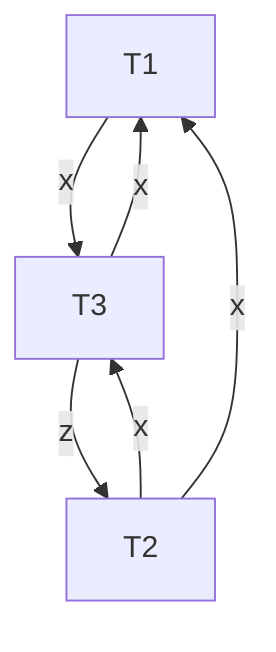
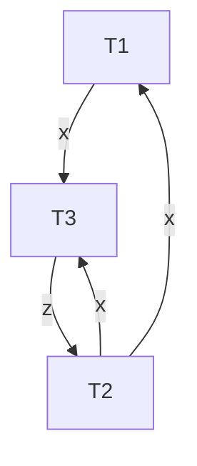
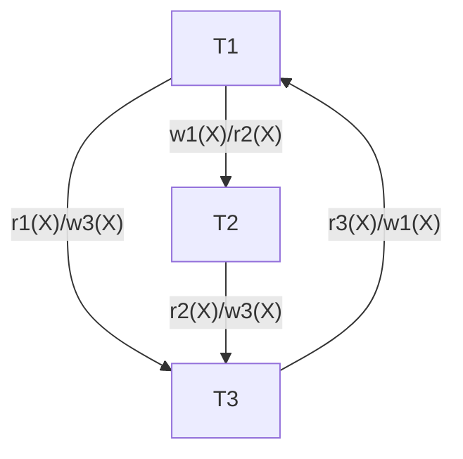
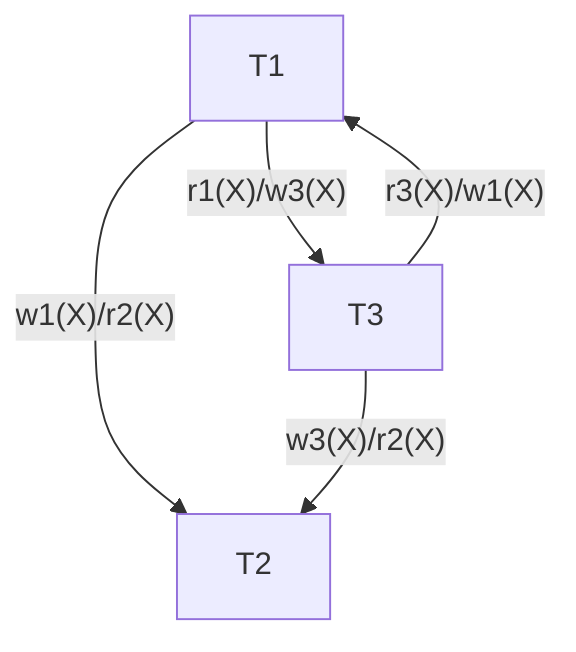
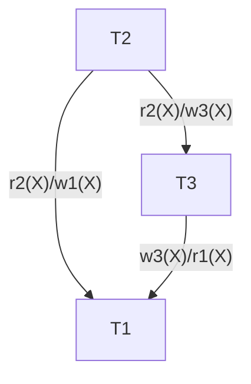
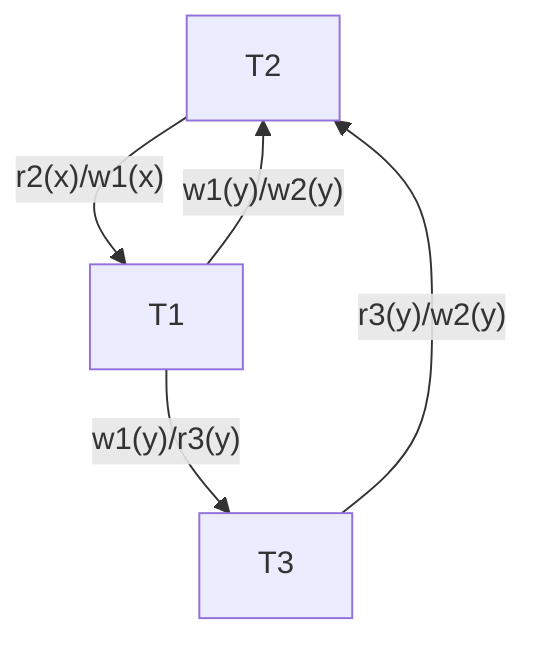
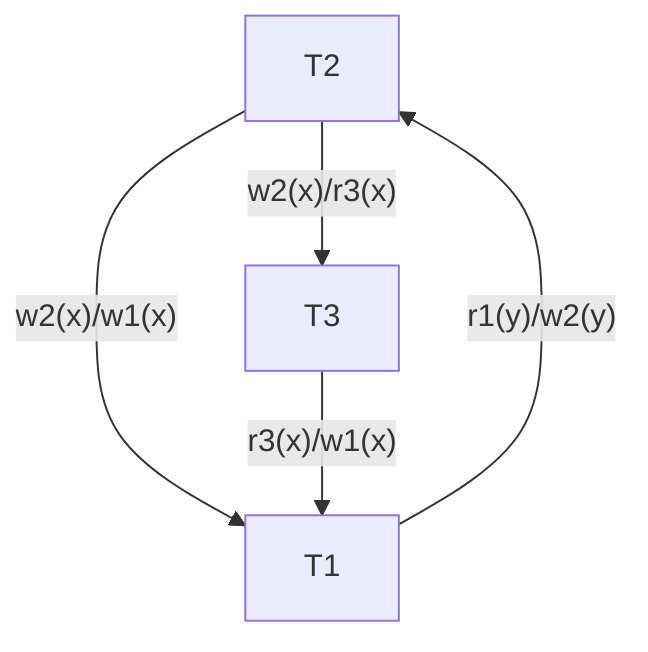
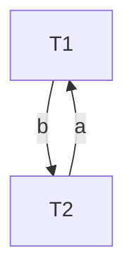

# CS3402 Exercises

## Lecture 2: Relational Model

2. Consider the following ER model:

```
A (a: primary key)
B (b: primary key)
rel(A, B) (A:B = X:Y)
```

2.1. Convert the ER model to a relational model under different X:Y cardinalities.

| X:Y | Relational Model |
| --- | ---------------- |
| 1:1 | `A (a: primary key, B_b: foreign key)`<br>`B (b: primary key)` |
| 1:N | `A (a: primary key, B_b: foreign key)`<br>`B (b: primary key)` |
| N:1 | `A (a: primary key)`<br>`B (b: primary key, A_a: foreign key)` |
| M:N | `A (a: primary key)`<br>`B (b: primary key)`<br>`rel(A_a: foreign key, B_b: foreign key)` |

2.2. Examine how many tuples listed below can be inserted into the relational model under different X:Y cardinalities.

```
(A1, B1), (A1, B2), (A2, B2)
```

| X:Y | Tuples |
| --- | ------ |
| 1:1 | `(A1, B1), (A2, B2)` |
| 1:N | `(A1, B2), (A2, B2)` or `(A1, B1), (A2, B2)` |
| N:1 | `(A1, B1), (A1, B2)` or `(A1, B1), (A2, B2)` |
| M:N | `(A1, B1), (A1, B2), (A2, B2)` |

## Lecture 4: Normalization

1. Consider the following schema: 

```
Branch(BranchNo: key, BranchAddress, TelNo[])
```

Analysis:

- FD1: BranchNo → BranchAddress → (Street, City, Postcode)
- FD2: Street → City
- FD3: Street → Postcode
- FD4: TelNo → BranchNo
- FD5: Postcode → City

1.1. Why this schema is not in 1NF?

> `BranchAddress` is a nested attribute. `TelNo` is a multi-valued attribute.

1.2. Convert the schema to 3NF.

(a) 1NF Remedy (FD1, FD4)

```
Branch(BranchNo: key, Street, City, Postcode)
BranchTelNo(BranchNo: key, TelNo: key)
```

(b) 2NF Remedy (FD2, FD3)

> Since `Street → City` and `Street → Postcode`, `City` and `Postcode` are partially dependent on the primary key `BranchNo`. Therefore they should be moved to a separate relation.

```
Branch(BranchNo: key, Street)
StreetCityPostcode(Street: key, City, Postcode)
BranchTel(BranchNo: key, TelNo: key)
```

(c) 3NF Remedy

> Since `Postcode → City`, `City` is transitively dependent on the primary key `Street`. Therefore `City` should be moved to a separate relation.

```
Branch(BranchNo: key, Street)
StreetPostcode(Street: key, Postcode)
PostcodeCity(Postcode: key, City)
BranchTel(BranchNo: key, TelNo: key)
```

2. Consider the following schema:

```
StaffBranchAllocation(StaffNo: key, BranchNo: key, BranchAddress, Name, Position, HoursPerWeek)
```

Analysis:

- FD1: StaffNo → Name, Position
- FD2: (StaffNo, BranchNo) → HoursPerWeek
- FD3: BranchNo → BranchAddress

2.1. Why this schema is not in 2NF?

> Non-prime attributes `Name`, `Position`, `BranchAddress` are partially dependent on the primary key.

2.2. Convert the schema to 3NF.

(a) 2NF Remedy (FD1, FD3)

```
Branch(BranchNo: key, BranchAddress)
Staff(StaffNo: key, Name, Position)
BranchStaffAllocation(StaffNo: key, BranchNo: key, HoursPerWeek)
```

(b) 3NF Remedy

The above schema is already in 3NF.

3. Consider the following schema:

```
BranchManager(BranchNo: key, BranchAddress, TelNo, MgrStaffNo, MgrName)
```

- FD1: BranchNo → (BranchAddress, TelNo, MgrStaffNo, MgrName)
- FD2: MgrStaffNo → MgrName
- FD3: TelNo → BranchNo

3.1. Why this schema is not in 3NF?

> `MgrName` is transitively dependent on the primary key `BranchNo` since `BranchNo → MgrStaffNo → MgrName` and `MgrStaffNo` is non-prime.

3.2. Convert the schema to 3NF.

3NF Remedy (FD2)

```
Branch(BranchNo: key, BranchAddress, TelNo, MgrStaffNo)
ManagerStaff(StaffNo: key, Name)
```

4. Consider the following schema:

```
CourseRoomAlloc(CourseId, CourseName, Year, Lecturer, Enrollment, RoomId, RoomCapacity, Day, Time)
```

- FD1: CourseId → CourseName
- FD2: CourseName → CourseId
- FD3: (CourseId, Year) → (Lecturer, Enrollment)
- FD4: RoomId → RoomCapacity
- FD5: (RoomId, Year, Day, Time) → CourseId
- FD6: (CourseId, Year, Day, Time) → RoomId

4.1. Find all candidate keys.

> - (CourseId, Year, Day, Time)  
> - (RoomId, Year, Day, Time)  
> - (CourseName, Year, Day, Time)

4.2. Convert the schema to BCNF.

(a) 1NF Remedy

> Since all attributes are atomic, the schema is already in 1NF.

(b) 2NF Remedy (FD1, FD3, FD4)

> We choose `(CourseId, Year, Day, Time)` as the primary key. Then,

- `CourseName` is only dependent on `CourseId`.
- `Lecturer` is only dependent on `CourseId` and `Year`.
- `Enrollment` is only dependent on `CourseId` and `Year`.
- `RoomId` is fully dependent on the primary key.
- `RoomCapacity` is only dependent on `RoomId`.

```
Course(CourseId: key, CourseName)
CourseTeaching(CourseId: key, Year: key, Lecturer, Enrollment)
CourseRoomAlloc(CourseId: key, Year: key, Day: key, Time: key, RoomId: key)
Roon(RoomId: key, RoomCapacity)
```

(c) BCNF Remedy

> Since no transitive dependency exists, the above schema is already in BCNF.

## Homework 1

### Question 2

Consider the relation $R = \{A, B, C, D, E, F, G, H, I, J\}$ and the set of functional dependencies $F = \{\{A, B\} \rightarrow \{C\}, \{A\} \rightarrow \{D, E\}, \{B\} \rightarrow \{F\}, \{F\} \rightarrow \{G, H\}, \{D\} \rightarrow \{I, J\}\}$.

(a) Proof $\{A\} \rightarrow \{E, I\}$ by using inference rules.

1. $\{A\} \rightarrow \{D, E\}$ (given)
2. $\{A\} \rightarrow \{D\}$, $\{A\} \rightarrow \{E\}$ (decomposition, 1)
3. $\{D\} \rightarrow \{I, J\}$ (given)
4. $\{D\} \rightarrow \{I\}$ (decomposition, 3)
5. $\{A\} \rightarrow \{I\}$ (transitivity, 2, 4)
6. $\{A\} \rightarrow \{E, I\}$ (union, 2, 5)

(b) Whether $\{A, B, D\}$ is a super key? Whether $\{A, B, D\}$ is a candidate key?

$\{A, B, D\}^+ = \{A, B, C, D, E, F, G, H, I, J\} = R$, so $\{A, B, D\}$ is a super key because it can derive all attributes in $R$.

Since $\{A\} \rightarrow \{D, E\}$, we have $\{A\} \rightarrow \{D\}$ (decomposition) and $\{A, B\} \rightarrow \{D\}$ (augmentation). Thus $\{A, B\}^+ = \{A, B, D \}^+ = R$, so $\{A, B, D\}$ is not a candidate key because it is not minimal.

(c) Whether $\{A, F\}$ is a super key? Whether $\{A, F\}$ is a candidate key?

$\{A, F\}^+ = \{A, D, E, F, G, H, I, J\} \neq R$, so $\{A, F\}$ is not a super key because it cannot derive all attributes in $R$.

Thus, it is not a candidate key.

(d) Decompose $R$ into 2NF.

The relation only has one candidate key $\{A, B\}$. So the primary key is $\{A, B\}$.

Since $\{A\} \rightarrow \{D, E\}$, $\{B\} \rightarrow \{F\}$, $D, E$ are only dependent on $A$, and $F$ is only dependent on $B$. Therefore, $D, E, F$ are partially dependent on the primary key. Therefore, $R$ is not in 2NF.

Its 2NF decomposition is:

- $R_1 = \{\underline{A, B}, C\}$
- $R_2 = \{\underline{A}, D, E, I, J\}$
- $R_3 = \{\underline{B}, F, G, H\}$

where underline denotes the primary key.

(e) Decompose $R$ into 3NF.

Since $\{A\} \rightarrow \{D\} \rightarrow \{I, J\}$, $I, J$ are transitively dependent on $A$. Also, $\{B\} \rightarrow \{F\} \rightarrow \{G, H\}$, $G, H$ are transitively dependent on $B$. Therefore, the above relation is not in 3NF.

Its 3NF decomposition is:

- $R_1 = \{\underline{A, B}, C\}$
- $R_{2a} = \{\underline{A}, D, E\}$
- $R_{2b} = \{\underline{D}, I, J\}$
- $R_{3a} = \{\underline{B}, F\}$
- $R_{3b} = \{\underline{F}, G, H\}$

where underline denotes the primary key.

## SQL Exercises

### Lecture 5

Given 4 tables:

```sql
CREATE TABLE Student (
    s_id INT,
    s_name VARCHAR(20) NOT NULL,
    s_birth DATE,
    s_sex CHAR(6) NOT NULL,
    PRIMARY KEY (s_id)
);
CREATE TABLE Course (
    c_id CHAR(6),
    c_name VARCHAR(20) NOT NULL,
    t_id INT NOT NULL,
    PRIMARY KEY (c_id),
    FOREIGN KEY (t_id) REFERENCES Teacher(t_id)
);
CREATE TABLE Teacher (
    t_id INT,
    t_name VARCHAR(20) NOT NULL,
    PRIMARY KEY (t_id)
);
CREATE TABLE SC (
    s_id INT,
    c_id CHAR(6),
    s_Sc INT NOT NULL,
    PRIMARY KEY (s_id, c_id),
    FOREIGN KEY (s_id) REFERENCES Student(s_id),
    FOREIGN KEY (c_id) REFERENCES Course(c_id)
);
```

Write SQL queries for the following questions:

(1) Query male student's name.

```sql
SELECT s_name
from Student
where s_sex='Male';
```

(2) Query the name and score of each course that 'ZHAO Lei' took.

```sql
SELECT c_name, s_Sc
FROM Student, Course, Sc
WHERE Student.s_id = Sc.s_id AND Course.c_id = Sc.c_id AND s_name = 'ZHAO Lei';
```

(3) Query name of students with higher grades in the '02' course than in the '03' course.

We need to query `Sc` for two times, one for '02' course and one for '03' course.

```sql
SELECT s_name
FROM Student a, Sc b, Sc c
WHERE a.s_id = b.s_id AND a.s_id = c.s_id AND b.c_id = '02' AND c.c_id = '03' AND b.s_Sc > c.s_Sc;
```

(4) Query the information of students whose birth date is NULL.

```sql
SELECT *
FROM Student
WHERE s_birth IS NULL;
```

(5) Query the id of teachers surnamed 'LI'. (Chinese surnames is written first)

```sql
SELECT t_id
FROM Teacher
WHERE t_name LIKE 'LI%';
```

(6) Query information of students who born after '2001-01-01'.

```sql
SELECT *
FROM Student
WHERE s_birth > DATE('2001-01-01');
```

(7) Retrieve name and '01' course score of students whose score of '01' course are less than 60, sorted in descending order of the score.

```sql
SELECT s_name, s_Sc
FROM Student, Sc
WHERE Student.s_id = Sc.s_id AND c_id = '01' AND s_Sc < 60
ORDER BY s_Sc DESC;
```

(8) Retrieve information about students who have studied '01' course and '02' course, sorted in ascending order of the sum score of two courses.

```sql
SELECT a.*, b.s_Sc + c.s_Sc AS sum_score
FROM Student a, Sc b, Sc c
WHERE a.s_id = b.s_id AND a.s_id = c.s_id AND b.c_id = '01' AND c.c_id = '02'
ORDER BY sum_score;
```

(9) Retrieve the distinct names of students.

```sql
SELECT DISTINCT s_name
FROM Student;
```

(10) Query id of the courses that 'ZHENG Zhu' and 'SUN Feng' both took.

```sql
SELECT c_id FROM Sc WHERE s_id = (SELECT s_id FROM Student WHERE s_name = 'ZHENG Zhu')
INTERSECT
SELECT c_id FROM Sc WHERE s_id = (SELECT s_id FROM Student WHERE s_name = 'SUN Feng');
```

### Lecture 6

(11) Query the name of students who have studied 'English' course.

```sql
SELECT S.s_name
FROM Student S, Sc, Course C
WHERE S.s_id = Sc.s_id AND Sc.c_id = C.c_id AND C.c_name = 'English';
```

(12) Query the information of students who have studied the course with id '01' but have not studied the course with id '02'.

```sql
SELECT *
FROM Student S
WHERE EXISTS (
    SELECT *
    FROM Sc
    WHERE Sc.s_id = S.s_id AND Sc.c_id = '01'
) AND NOT EXISTS (
    SELECT *
    FROM Sc
    WHERE Sc.s_id = S.s_id AND Sc.c_id = '02'
);
```

Equivalent query using `IN`:

```sql
SELECT *
FROM Student S
WHERE S.s_id IN (
    SELECT s_id
    FROM Sc
    WHERE c_id = '01'
) AND S.s_id NOT IN (
    SELECT s_id
    FROM Sc
    WHERE c_id = '02'
);
```

(13) Query the names of students who have not studied any course taught by teacher 'ZHANG San'.

```sql
SELECT S.s_name
FROM Student S
WHERE NOT EXISTS (
    SELECT *
    FROM Sc, Course C, Teacher T
    WHERE Sc.s_id = S.s_id AND Sc.c_id = C.c_id AND C.t_id = T.t_id AND T.t_name = 'ZHANG San'
);
```

(14) Query course ids and the number of students enrolling for each course.

Output format: `c_id, COUNT(s_id)`

```sql
SELECT c_id, COUNT(s_id)
FROM Sc
GROUP BY c_id;
```

(15) Query the average score of each course, and sort the results in descending order of the average score.

Output format: `c_id, AVG(s_Sc)`

```sql
SELECT c_id, AVG(s_Sc)
FROM Sc
GROUP BY c_id
ORDER BY AVG(s_Sc) DESC;
```

(16) Query id and name of students who enroll only 2 courses.

```sql
SELECT S.s_id, S.s_name
FROM Student S
WHERE 2 = (
    SELECT COUNT(*)
    FROM Sc
    WHERE Sc.s_id = S.s_id
);
```

(17) Query information of students who have taken all courses.

Breaking down the question:

1. Iterate through each student $S$.
2. Generate the list of all courses $C$.
3. Generate the list of courses $C'$ that student $S$ has taken.
4. Check if $C = C'$. Since $C' \subseteq C$, we only need to check if $C \subseteq C'$. That is, every element in $C$ is also in $C'$.
5. Return the list of students satisfying the condition.

$$C \subseteq C' \Leftrightarrow (\forall x \in C \rightarrow x \in C') \Leftrightarrow \neg (\exists x \in C \land x \notin C')$$

```sql
SELECT *
FROM Student S
WHERE NOT EXISTS ( --- C is a subset of C' iff the following query is empty
    SELECT C.c_id
    FROM Course C -- if any element in C ...
    WHERE NOT EXISTS ( -- ... that is not in C'
        SELECT *
        FROM Sc
        WHERE Sc.s_id = S.s_id AND Sc.c_id = C.c_id
    )
);
```

Model answer using `HAVING`:

```sql
SELECT *
FROM Student S
WHERE S.s_id IN (
    SELECT Sc.s_id
    FROM Sc
    GROUP BY Sc.s_id
    HAVING COUNT(DISTINCT Sc.c_id) = (SELECT COUNT(*) FROM Course)
);
```

`HAVING` is used along with `GROUP BY` to filter the groups. In this case, we group the students by their id, and a implicit `COUNT(*)` is used to count the number of courses each student has taken. Then we filter the groups by the condition that the number of courses each student has taken is equal to the total number of courses.

(18) Display student id and average grades of all the courses of each student in descending order of average grades.

Output format: `s_id, AVG(s_Sc)`

```sql
SELECT s_id, AVG(s_Sc)
FROM Sc
GROUP BY s_id
ORDER BY AVG(s_Sc) DESC;
```

(19) Query the information of other students who took at least one same course as the student with id '01'.

Breaking down the question:

1. Iterate through each student $S$.
2. Generate the list of courses $C$ that student '01' has taken.
3. Generate the list of courses $C'$ that student $S$ has taken.
4. Check if $C \cap C' \neq \emptyset$. That is, there is at least one course that both students have taken. (By checking: if there is a course in $C$ that is also in $C'$)
5. Return the list of students satisfying the condition. Skip student '01'.

```sql
SELECT *
FROM Student S
WHERE S.s_id <> '01' AND EXISTS (
    SELECT *
    FROM Sc
    WHERE Sc.s_id = '01' AND Sc.c_id IN (
        SELECT Sc.c_id
        FROM Sc
        WHERE Sc.s_id = S.s_id
    )
);
```

Equivalent query using `IN`:

```sql
SELECT *
FROM Student S
WHERE S.s_id <> '01' AND S.s_id IN (
    SELECT Sc.s_id
    FROM Sc
    WHERE Sc.c_id IN (
        SELECT Sc.c_id
        FROM Sc
        WHERE Sc.s_id = '01'
    )
);
```

(20) Query the information of the students who got highest score in the 'Math' course. Note: `LIMIT` is not allowed.

```sql
SELECT *
FROM Student S
    WHERE S.s_id = (
    SELECT Sc.s_id
    FROM Sc
    WHERE Sc.s_Sc = (
        SELECT MAX(Sc.s_Sc)
        FROM Course C, Sc
        WHERE C.c_name = 'Math' AND C.c_id = Sc.c_id
    )
);
```

Equivalent query using `IN`:

```sql
SELECT *
FROM Student S
WHERE S.s_id IN (
    SELECT Sc.s_id
    FROM Sc
    WHERE (Sc.c_id, Sc.s_Sc) = (
        SELECT Sc.c_id, MAX(Sc.s_Sc)
        FROM Course C, Sc
        WHERE C.c_name = 'Math' AND C.c_id = Sc.c_id
        GROUP BY Sc.c_id
    )
);
```

### Extra Exercises

(21) List the name of courses which are not taken by any student.

```sql
SELECT c_name
FROM Course
WHERE NOT EXISTS (
    SELECT *
    FROM Sc
    WHERE Sc.c_id = Course.c_id
);
```

(22) List the name of the teachers with the number of courses they teach. Order the results by the number of courses in descending order.

```sql
SELECT t_name, COUNT(c_id)
FROM Teacher T, Course C
WHERE T.t_id = C.t_id
GROUP BY t_name
ORDER BY COUNT(c_id) DESC;
```

## Lecture 7: Relational Algebra

1. Given two relations:

```
T1 = {P, Q, R} = {
    {10, a, 5},
    {15, b, 8},
    {25, a, 6}
}
T2 = {A, B, R} = {
    {10, b, 6},
    {25, c, 3},
    {10, b, 5}
}
```

(a) $T1 \times T2$

This is the Cartesian product of two relations. The result is a relation with 3x3=9 tuples and 3+3=6 attributes.

```
T = {P, Q, T1_R, A, B, T2_R} = {
    {10, a, 5, 10, b, 6},
    {10, a, 5, 25, c, 3},
    {10, a, 5, 10, b, 5},
    {15, b, 8, 10, b, 6},
    {15, b, 8, 25, c, 3},
    {15, b, 8, 10, b, 5},
    {25, a, 6, 10, b, 6},
    {25, a, 6, 25, c, 3},
    {25, a, 6, 10, b, 5}
}
```

(b) $T1\Join_{T1.P=T2.A}T2$

General join, including equijoin, will keep the duplicate attributes. Therefore the result still has 6 attributes.

```
T = {P, Q, T1_R, A, B, T2_R} = {
    {10, a, 5, 10, b, 6},
    {10, a, 5, 10, b, 5},
    {25, a, 6, 25, c, 3}
}
```

(c) $T1\Join_{T1.Q=T2.B}T2$

```
T = {P, Q, T1_R, A, B, T2_R} = {
    {15, b, 8, 10, b, 6},
    {15, b, 8, 10, b, 5}
}
```

(d) $T1\Join_{T1.R>T2.R}T2$

```
T = {P, Q, T1_R, A, B, T2_R} = {
    {10, a, 5, 25, c, 3},
    {15, b, 8, 10, b, 6},
    {15, b, 8, 25, c, 3},
    {15, b, 8, 10, b, 5},
    {25, a, 6, 25, c, 3},
    {25, a, 6, 10, b, 5}
}
```

(e) $T1 * T2$

A natural join will remove the duplicate attributes.

The condition of natural join is $T1.R=T2.R$. The result is a relation with 3+3-1=5 attributes.

```
T = {P, Q, R, A, B} = {
    {10, a, 5, 10, b},
    {25, a, 6, 10, b}
}
```

2. Consider the Company database schema:

```
Employee        {Fname, Minit, Lname, Ssn: key, Bdate, Address, Sex, Salary, Super_ssn (-> Employee.Ssn), Dno (-> Department.Dnumber)}
Department      {Dname, Dnumber: key, Mgr_ssn (-> Employee.Ssn), Mgr_start_date}
Dept_Locations  {Dnumber: key (-> Department.Dnumber), Dlocation: key}
Project         {Pname, Pnumber: key, Plocation, Dnum (-> Department.Dnumber)}
Works_On        {Essn: key (-> Employee.Ssn), Pno: key (-> Project.Pnumber), Hours}
Dependent       {Essn: key (-> Employee.Ssn), Dependent_name: key, Sex, Bdate, Relationship}
```

(a) Find the SSN of all employees who are not supervisors.

$$\pi_{\text{Ssn}}(\text{Employee}) - \pi_{\text{Super\_ssn}}(\text{Employee})$$

```sql
SELECT Ssn
FROM Employee
EXCEPT
SELECT Super_ssn
FROM Employee;
```

Or

```sql
SELECT Ssn
FROM Employee
WHERE Ssn NOT IN (
    SELECT Super_ssn
    FROM Employee
);
```

(b) Find the SSN of all employees that either work in Dept 5 or directly supervises an employee who works in Dept 5.

$$
\begin{aligned}
\texttt{Dept5\_Emp}&\leftarrow \sigma_{\text{Dno}=5}(\text{Employee})\\
\texttt{Res1}&\leftarrow\pi_{\text{Ssn}}(\texttt{Dept5\_Emp})\\
\texttt{Res2}&\leftarrow\pi_{\text{Super\_Ssn}}(\texttt{Dept5\_Emp})\\
\texttt{Res}&\leftarrow\texttt{Res1} \cup \texttt{Res2}
\end{aligned}
$$

```sql
SELECT Ssn
FROM Employee
WHERE Dno = 5
UNION
SELECT Super_ssn
FROM Employee
WHERE Dno = 5;
```

(c) Retrieve each Dept number and the number of projects controlled by the Dept.

$$_\text{Dnum} \gamma_\text{\ COUNT Pnumber}(\text{Project})$$

```sql
SELECT Dnum, COUNT(Pnumber)
FROM Project
GROUP BY Dnum;
```

(d) List the first name of all employees who have a dependent with the same first name as themselves. (Assume a new attribute `Dependent_Fname` is added to the `Dependent` relation.)

$$
\begin{aligned}
\texttt{Emp\_Dep}&\leftarrow \text{Employee}\Join_{\text{Ssn=Essn}}\text{Dependent}\\
\texttt{Res}&\leftarrow \pi_\text{Fname}(\sigma_\text{Fname=Dependent\_Fname}(\texttt{Emp\_Dep}))
\end{aligned}
$$

Or in one line:

$$\pi_\text{Fname}(\text{Employee} \Join_{\ \text{Ssn=Essn AND Fname=Dependent\_Fname}} \text{Dependent})$$

```sql
SELECT Fname
FROM Employee, Dependent
WHERE Ssn = Essn AND Fname = Dependent_Fname;
```

(e) Retrieve the salary of all employees in Dept 5 who worked > 10 hours on project named 'ProjectX'.

$$
\begin{aligned}
\texttt{Dept5\_Emp}&\leftarrow \sigma_\text{Dno=5}(\text{Employee})\\
\texttt{Work\_Proj}&\leftarrow \text{Works\_On}\Join_\text{Pno=Pnumber}\text{Project}\\
\texttt{ProjectX\_10}&\leftarrow \sigma_\text{Pname='ProjectX' AND Hours > 10}(\texttt{Work\_Proj})\\
\texttt{Res}&\leftarrow \pi_\text{Salary}(\texttt{Dept5\_Emp}\Join_\text{Essn=Ssn}\texttt{ProjectX\_10})
\end{aligned}
$$

```sql
SELECT Salary
FROM Employee, Works_On, Project
WHERE Dno = 5 AND Essn = Ssn AND Pno = Pnumber AND Pname = 'ProjectX' AND Hours > 10;
```

## Homework 2

### Part A

Given the following schema: (All fields are `NOT NULL`, omitted for brevity)

```sql
CREATE TABLE User (
    user_id INT,
    name VARCHAR(20),
    email VARCHAR(20),
    age INT,
    gender CHAR,
    PRIMARY KEY (user_id),
    UNIQUE (email)
);
CREATE TABLE HealthRecord (
    record_id INT,
    user_id INT,
    date DATE,
    weight NUMBER(5, 2),
    height NUMBER(3, 2),
    heart_rate INT,
    PRIMARY KEY (record_id),
    FOREIGN KEY (user_id) REFERENCES User(user_id)
);
CREATE TABLE ExerciseType (
    type_id INT,
    name VARCHAR(20),
    PRIMARY KEY (type_id)
);
CREATE TABLE ExerciseSession (
    session_id INT,
    user_id INT,
    type_id INT,
    date DATE,
    duration INT,
    calories_burned INT,
    PRIMARY KEY (session_id),
    FOREIGN KEY (user_id) REFERENCES User(user_id),
    FOREIGN KEY (type_id) REFERENCES ExerciseType(type_id)
);
CREATE TABLE ActivityShare (
    share_id INT,
    user_id INT,
    session_id INT,
    share_date DATE,
    PRIMARY KEY (share_id),
    FOREIGN KEY (user_id) REFERENCES User(user_id),
    FOREIGN KEY (session_id) REFERENCES ExerciseSession(session_id)
);
```

Provide both the relational algebra and SQL queries for the following questions:

(1) Find the exercise session IDs for the user 'Bob Jones'.

$$\pi_{\text{session\_id}}(\sigma_{\text{name='Bob Jones'}}(\text{User}\Join_{\text{user\_id}}\text{ExerciseSession}))$$

Based on the attribute naming across the tables, all joins in this part are natural joins.

Written in natural join:

$$\pi_{\text{session\_id}}(\sigma_{\text{name='Bob Jones'}}(\text{User} * \text{ExerciseSession}))$$

```sql
SELECT ES.session_id
FROM User U, ExerciseSession ES
WHERE U.user_id = ES.user_id AND U.name = 'Bob Jones';
```

(2) List the names of users who have not logged any exercise sessions.

$$\pi_{\text{name}}(\text{User}) - \pi_{\text{name}}(\text{User} * \text{ExerciseSession})$$

(EXCEPT)

```sql
SELECT U.name
FROM User U
EXCEPT
SELECT U.name
FROM User U, ExerciseSession ES
WHERE U.user_id = ES.user_id;
```

Or (NOT IN)

```sql
SELECT U.name
FROM User U
WHERE U.user_id NOT IN (
    SELECT DISTINCT user_id
    FROM ExerciseSession
);
```

Or (NOT EXISTS)

```sql
SELECT U.name
FROM User U
WHERE NOT EXISTS (
    SELECT *
    FROM ExerciseSession ES
    WHERE U.user_id = ES.user_id
);
```

(3) List the names of users who have logged more than one exercise session on any given day.

$$
\begin{aligned}
\texttt{User\_day\_count} &\leftarrow _\text{user\_id, date} \gamma_{\text{COUNT(session\_id)}}(\text{ExerciseSession})\\
\texttt{Res} &\leftarrow \pi_{\text{name}}(\text{User} * \sigma_{\text{MAX(count)>1}}(\texttt{User\_day\_count}))
\end{aligned}
$$

(EXISTS ... HAVING)

```sql
SELECT U.name
FROM User U
WHERE EXISTS (
    SELECT COUNT(*) -- or COUNT(session_id)
    FROM ExerciseSession
    WHERE user_id = U.user_id
    GROUP BY user_id, date
    HAVING COUNT(*) >= 2
);
```

Can be simplified to:

```sql
SELECT U.name
FROM User U, ExerciseSession ES
WHERE U.user_id = ES.user_id
GROUP BY U.user_id, ES.date
HAVING COUNT(ES.session_id) >= 2;
```

(4) Calculate the average calories burned of male users.

$$\text{AVG}(\pi_{\text{calories\_burned}}(\sigma_{\text{gender='M'}}(\text{User}) * \text{ExerciseSession}))$$

```sql
SELECT AVG(calories_burned)
FROM User U, ExerciseSession ES
WHERE U.user_id = ES.user_id AND U.gender = 'M';
```

(5) List name(s) of the exercise type(s) that have never been shared.

$$\pi_{\text{name}}(\text{ExerciseType}) - \pi_{\text{name}}(\text{ExerciseType} * \text{ExerciseSession} * \text{ActivityShare})$$

```sql
SELECT ET.name
FROM ExerciseType ET
WHERE NOT EXISTS (
    SELECT *
    FROM ExerciseSession ES, ActivityShare S -- remember AS is a keyword so cannot be used as an alias
    WHERE ET.type_id = ES.type_id AND ES.session_id = S.session_id
);
```

(6) List the ID of each exercise type along with its frequency of occurrence (i.e., the total number of times the exercise session has been done), in descending order by frequency. If a type has never been performed in any exercise session, it will not be included in the result.

$$_\text{type\_id} \gamma_{\ \text{COUNT(session\_id)}}(\text{ExerciseSession})$$

```sql
SELECT type_id, COUNT(session_id) AS frequency
FROM ExerciseSession ES
GROUP BY type_id
ORDER BY frequency DESC;
```

(7) List the names of users who have logged at least two exercise sessions but have never shared any of exercise sessions.

$$
\begin{aligned}
\texttt{User\_session\_count} &\leftarrow _\text{user\_id} \gamma_{\ \text{COUNT(session\_id)}}(\text{ExerciseSession})\\
\texttt{User\_never\_share} &\leftarrow \pi_{\text{user\_id}}(\text{User}) - \pi_{\text{user\_id}}(\text{User} * \text{ActivityShare})\\
\texttt{Res} &\leftarrow \pi_{\text{name}}(\texttt{User\_never\_share} * \sigma_{\text{COUNT(session\_id) >= 2}}(\texttt{User\_session\_count}))
\end{aligned}
$$

```sql
SELECT U.name
FROM User U, ExerciseSession ES
WHERE U.user_id = ES.user_id
AND U.user_id NOT IN (SELECT DISTINCT (S.user_id) FROM ActivityShare S)
GROUP BY ES.user_id
HAVING COUNT(ES.session_id) >= 2;
```

(8) List the user ID(s) with the largest weight change in the HealthRecord.

$$
\begin{aligned}
\texttt{User\_weight\_change} &\leftarrow _\text{user\_id} \gamma_{\ \text{weight\_change} \leftarrow \text{MAX(weight) - MIN(weight)}}(\text{HealthRecord})\\
\text{MAX(weight\_change)} &= _\text{user\_id} \gamma_{\ \text{MAX(weight\_change)}}(\texttt{User\_weight\_change})\\
\texttt{Res} &\leftarrow \pi_{\text{user\_id}}(\sigma_{\text{weight\_change} = \text{MAX(weight\_change)}}(\texttt{User\_weight\_change}))
\end{aligned}
$$

A tricky way is to use `LIMIT` to get the first row of the result of a subquery.

```sql
SELECT HR.user_id
FROM HealthRecord HR
GROUP BY HR.user_id
ORDER BY MAX(HR.weight) - MIN(HR.weight) DESC
LIMIT 1;
```

However, `LIMIT` is not supported in all SQL dialects. Further, if there are more than one user with the same largest weight change, only one of them will be returned. A more general solution would be:

Step 1: `User_weight_change`

```sql
SELECT user_id, MAX(weight) - MIN(weight) AS weight_change
FROM HealthRecord HR
GROUP BY user_id;
```

Step 2: Compute the maximum weight change

```sql
SELECT MAX(weight_change) FROM (...) AS User_weight_change;
```

Step 3: Get the user(s) whose weight change is the maximum

```sql
SELECT user_id
FROM User_weight_change
WHERE weight_change = (SELECT MAX(weight_change) FROM User_weight_change);
```

Putting them together:

```sql
WITH User_weight_change AS (
    SELECT user_id, MAX(weight) - MIN(weight) AS weight_change
    FROM HealthRecord HR
    GROUP BY user_id
)
SELECT user_id
FROM User_weight_change
WHERE weight_change = (SELECT MAX(weight_change) FROM User_weight_change);
```

(9) List the user name(s) with the maximum number of health records.

$$
\begin{aligned}
\texttt{User\_record\_count} &\leftarrow _\text{user\_id} \gamma_{\ \text{record\_count} \leftarrow \text{COUNT(record\_id)}}(\text{HealthRecord})\\
\text{MAX(record\_count)} &= _\text{user\_id} \gamma_{\ \text{MAX(record\_count)}}(\texttt{User\_record\_count})\\
\texttt{Res} &\leftarrow \pi_{\text{name}}(\text{User} * \sigma_{\text{record\_count} = \text{MAX(record\_count)}}(\texttt{User\_record\_count}))
\end{aligned}
$$

```sql
WITH User_record_count AS (
    SELECT HR.user_id, COUNT(HR.record_id) AS record_count
    FROM HealthRecord HR
    GROUP BY HR.user_id
)
SELECT U.name
FROM User U, User_record_count
WHERE U.user_id = User_record_count.user_id AND record_count = (SELECT MAX(record_count) FROM User_record_count);
```

(10) List the name(s) of exercise type(s) that result in the highest average calorie burn for female users only.

$$
\begin{aligned}
\texttt{Female\_exercise\_session} &\leftarrow \sigma_{\text{gender='F'}}(\text{User} * \text{ExerciseSession})\\
\texttt{Type\_avg\_calories} &\leftarrow _\text{type\_id} \gamma_{\ \text{avg\_calories} \leftarrow \text{AVG(calories\_burned)}}(\texttt{Female\_exercise\_session})\\
\text{MAX(avg\_calories)} &= _\text{type\_id} \gamma_{\ \text{MAX(avg\_calories)}}(\texttt{Type\_avg\_calories})\\
\texttt{Res} &\leftarrow \pi_{\text{name}}(\text{ExerciseType} * \sigma_{\text{avg\_calories} = \text{MAX(avg\_calories)}}(\texttt{Type\_avg\_calories}))
\end{aligned}
$$

```sql
WITH Type_avg_calories AS (
    SELECT ES.type_id, AVG(ES.calories_burned) AS avg_calories
    FROM User U, ExerciseSession ES
    WHERE U.user_id = ES.user_id AND U.gender = 'F'
    GROUP BY ES.type_id
)
SELECT ET.name
FROM ExerciseType ET, Type_avg_calories
WHERE ET.type_id = Type_avg_calories.type_id AND avg_calories = (SELECT MAX(avg_calories) FROM Type_avg_calories);
```

### Part B

Given the following schema:

```
Album           {Album_ID, Album_Name, Artist_Name, Release_Year, Genre}
Artist          {Artist_Name, Gender, Birthplace, Birthyear}
Song            {Album_ID, Song_Name, Artist_ID}
Selling_record  {Album_ID, Inventory, Sell_Amount, Price}
Customer_record {Album_ID, Customer_ID, Date, Price, Discount}
```

a. Provide DDLS for the schema.

```sql
CREATE TABLE Album (
    Album_ID INT,
    Album_Name VARCHAR(20),
    Artist_Name VARCHAR(20),
    Release_Year INT,
    Genre VARCHAR(20),
    PRIMARY KEY (Album_ID)
);
CREATE TABLE Artist (
    Artist_Name VARCHAR(20),
    Gender CHAR,
    Birthplace VARCHAR(20),
    Birthyear INT,
    PRIMARY KEY (Artist_Name)
);
CREATE TABLE Song (
    Album_ID INT,
    Song_Name VARCHAR(20),
    Artist_ID INT,
    PRIMARY KEY (Album_ID, Song_Name),
    FOREIGN KEY (Album_ID) REFERENCES Album(Album_ID)
);
CREATE TABLE Selling_record (
    Album_ID INT,
    Inventory INT,
    Sell_Amount INT,
    Price INT,
    PRIMARY KEY (Album_ID),
    FOREIGN KEY (Album_ID) REFERENCES Album(Album_ID)
);
CREATE TABLE Customer_record (
    Album_ID INT,
    Customer_ID INT,
    Date DATE,
    Price INT,
    Discount INT,
    PRIMARY KEY (Album_ID, Customer_ID, Date),
    FOREIGN KEY (Album_ID) REFERENCES Album(Album_ID)
);
ALTER TABLE Album
ADD FOREIGN KEY (Artist_Name) REFERENCES Artist(Artist_Name);
```

b. Provide the relational algebra and SQL queries for the following questions:

(1) Find the names of the artists who have album with the genre of "Pop music".

$$\pi_{\text{Artist\_Name}}(\sigma_{\text{Genre='Pop music'}}(\text{Album}))$$

```sql
SELECT DISTINCT Artist_Name
FROM Album
WHERE Genre = 'Pop music';
```

(2) List the name of albums released in 2023 by the Hong Kong artist.

$$\pi_{\text{Album\_Name}}(\sigma_{\ \text{Release\_Year=2023 AND Birthplace='Hong Kong'}}(\text{Album} * \text{Artist}))$$

```sql
SELECT Album_Name
FROM Album, Artist
WHERE Album.Artist_Name = Artist.Artist_Name AND Release_Year = 2023 AND Birthplace = 'Hong Kong';
```

(3) List the name of female artist and the total selling amount of all its album.

$$
\begin{aligned}
\text{Artist\_selling} &\leftarrow _\text{Artist\_Name} \mathfrak{I}_{\ \text{SUM(Sell\_Amount)}}(\text{Album} * \text{Selling\_record})\\
\text{Result} &\leftarrow \pi_{\text{Artist\_Name, SUM(Sell\_Amount)}}(\sigma_{\ \text{Gender = 'F'}}(\text{Artist} * \text{Artist\_selling}))
\end{aligned}
$$

```sql
SELECT Artist_Name, SUM(Sell_Amount)
FROM Album, Selling_record, Artist
WHERE Album.Album_ID = Selling_record.Album_ID AND Album.Artist_Name = Artist.Artist_Name AND Artist.Gender = 'F'
GROUP BY Artist_Name;
```

(4) Retrieve the Album ID which contains the maximum number of songs.

$$
\begin{aligned}
\text{Album\_song\_count} &\leftarrow \rho_{\text{Album\_ID, song\_count}}{(_\text{Album\_ID} \mathfrak{I}_{\ \text{COUNT(Song\_Name)}}(\text{Album} * \text{Song}))}\\
\text{Result} &\leftarrow \pi_{\text{Album\_ID}}(\sigma_{\ \text{song\_count} = \mathfrak{I}_{\ \text{MAX(song\_count)}}(\text{Album\_song\_count})}(\text{Album\_song\_count}))
\end{aligned}
$$

```sql
WITH Album_song_count AS (
    SELECT Album_ID, COUNT(Song_Name) AS song_count
    FROM Album, Song
    WHERE Album.Album_ID = Song.Album_ID
    GROUP BY Album_ID
)
SELECT Album_ID
FROM Album_song_count
WHERE song_count = (SELECT MAX(song_count) FROM Album_song_count);
```

(5) Find the Customer ID who buy more than three albums with the genre of "Folk music" during 2023-01-01 to 2023-12-31.

$$
\begin{aligned}
\text{Selected\_buy} &\leftarrow \sigma_{\ \text{Genre='Folk music' AND Date >= '2023-01-01' AND Date <= '2023-12-31'}}(\text{Album} * \text{Customer\_record})\\
\text{Customer\_buy\_count} &\leftarrow _\text{Customer\_ID} \mathfrak{I}_{\ \text{COUNT(Album\_ID)}}(\text{Selected\_buy})\\
\text{Result} &\leftarrow \pi_{\text{Customer\_ID}}(\sigma_{\ \text{COUNT(Album\_ID) > 3}}(\text{Customer\_buy\_count}))
\end{aligned}
$$

```sql
SELECT Customer_ID
FROM Album, Customer_record
WHERE Album.Album_ID = Customer_record.Album_ID AND Genre = 'Folk music' AND Date >= '2023-01-01' AND Date <= '2023-12-31'
GROUP BY Customer_ID
HAVING COUNT(Album_ID) > 3;
```

(6) Find the Customer ID who buy all the album of the artist “Eason Chan”.

Recall that $R \div S$ returns the set of tuples from $R$ such that they are related to all tuples in $S$. The attributes of $S$ must be a subset of the attributes of $R$.

Let `Eason_album_ID` be the set of album IDs of Eason Chan.

For a customer to be selected, he must be related to all entries in `Eason_album_ID`. Therefore, `R` is `Customer_record` and `S` is `Eason_album_ID`.

$$
\begin{aligned}
\text{Eason\_album\_ID} &\leftarrow \pi_{\text{Album\_ID}}(\sigma_{\ \text{Artist\_Name='Eason Chan'}}(\text{Album}))\\
\text{Result} &\leftarrow \pi_{\text{Customer\_ID}}(\text{Customer\_record} \div \text{Eason\_album\_ID})
\end{aligned}
$$

```sql
SELECT Customer_ID
FROM Customer_record
WHERE NOT EXISTS (
    SELECT Album_ID
    FROM Album
    WHERE Artist_Name = 'Eason Chan' AND Album_ID NOT IN (
        SELECT Album_ID
        FROM Customer_record
        WHERE Customer_record.Customer_ID = Customer_ID
    )
);
```

## Lecture 8: Files and Hashed Files

1. If the database consists of 512 records and the blocking factor is 8. On average, how many blocks needed to be searched to if the records are in unordered format and ordered format?

- number of blocks = number of records / blocking factor = 512 / 8 = 64
- Unordered: $64 / 2 = 32$
- Ordered: $\log_2 64 = 6$

2.  Suppose that we use hashing to organize a PRODUCT file containing records with the following product# values: 2369, 3760, 4692, 4871, 5659, 1821, 1074, and 7115.

(a) Let the hash function be h(product#) = product# mod 5, show the static hash structure for this file. Assuming that each bucket can hold at most three records as shown below, and records in each bucket is unordered.

| product# | bucket |
|----------|--------|
| 2369 | 4 |
| 3760 | 0 |
| 4692 | 2 |
| 4871 | 1 |
| 5659 | 4 |
| 1821 | 1 |
| 1074 | 4 |
| 7115 | 0 |

| bucket | [0] | [1] | [2] | pointer |
|--------|-----|-----|-----|---------|
| 0 | 3760 | 7115 | | NULL |
| 1 | 4871 | 1821 | | NULL |
| 2 | 4692 | | | NULL |
| 3 | | | | NULL |
| 4 | 2369 | 5659 | 1074 | NULL |

(b) Some new records are inserted into the file with product# values: 1620, 2428, 3945, 4759, 6975, 4981, and 9206. Show the updated hash structure for this file when using chaining for collision resolution. That is, if collision occurs, new records are inserted in overflow bucket and pointers are set from the original buckets to the overflow buckets. Assuming that each overflow bucket can hold at most three records, as shown below.

| product# | bucket | no. of entries in this bucket |
|----------|--------| ------------------------------ |
| 1620 | 0 | 3 |
| 2428 | 3 | 1 |
| 3945 | 0 | 4 (OF) |
| 4759 | 4 | 4 (OF) |
| 6975 | 0 | 5 (OF) |
| 4981 | 1 | 3 |
| 9206 | 1 | 4 (OF) |

| bucket | [0] | [1] | [2] | pointer |
|--------|-----|-----|-----|---------|
| 0 | 3760 | 7115 | 1620 | OF0[0] |
| 1 | 4871 | 1821 | 4981 | OF1[0] |
| 2 | 4692 | | | NULL |
| 3 | 2428 | | | NULL |
| 4 | 2369 | 5659 | 1074 | OF0[1] |

| bucket | [0] | [0] pointer | [1] | [1] pointer | [2] | [2] pointer |
|--------|-----|-------------|-----|-------------|-----|-------------|
| OF0 | 3945 | OF0[2] | 4759 | NULL | 6975 | NULL |
| OF1 | 9206 | NULL | | | | |

3. In extendible hashing, how many hash codes can you have in maximum if the global depth is 3?

$2^k = 2^3 = 8$

4. Consider a disk with block size B = 1024 bytes. A file has r = 1000 STUDENT records of fixed length. Each record has following fields: SName (40 bytes), SID (8 bytes), Department (4 bytes), Address (65 bytes), Phone (8 bytes), Birthdate (8 bytes), Sex (1 byte), CourseId (7 bytes), SemesterId (6 bytes), SectionId (2 bytes). An additional byte is used as a deletion marker.

a) Calculate the record size R in bytes.

$R$ = 40 + 8 + 4 + 65 + 8 + 8 + 1 + 7 + 6 + 2 + 1 = 150 bytes

b) Suppose the file is stored with an unspanned organization. Calculate the blocking factor.

$BFR = \lfloor B / R \rfloor = \lfloor 1024 / 150 \rfloor = 6$

c) How many hard disk blocks does this file occupy?

number of blocks = $\lceil r / BFR \rceil = \lceil 1000 / 6 \rceil = 167$

## Homework 3

### Part A: Files and Indexing

Suppose we have 10,000 STUDENT records of fixed length, and the disk has a block size of 2048bytes. In this system, a block pointer is 4 bytes long (P = 4). Each STUDENT record has the following fields: Name (10 bytes), Age (4 bytes), Gender (4 bytes), Department (12 bytes), Student ID (12 bytes). The file is ordered by the key field Student ID, and we want to construct a primary index on Student ID. The records are stored unspanned.

(1) Calculate the blocking factor (bfr) and the number of file blocks needed to store the STUDENT records.

(2) Assume that the primary index is a single-level index. Calculate the number of index entries and the number of index blocks.

(3) Now, suppose that we want to make the primary index a multilayer index. Calculate the number of hard disk blocks that will be occupied by this index file.

Solution:

(1) Given $r=10000$ records, block size $B=2048$ bytes, and record size $R=10+4+4+12+12=42$ bytes.

$BFR = \lfloor \frac{B}{R} \rfloor = \lfloor \frac{2048}{42} \rfloor = 48$

Number of blocks: $b = \lceil \frac{r}{BFR} \rceil = \lceil \frac{10000}{48} \rceil = 209$

(2) The index is a primary index on Student ID. The key field is 12 bytes long, and the block pointer is 4 bytes long. The index entry size $R_I = 12 + 4 = 16$ bytes.

Number of index entries = number of blocks = 209

Index BFR = $BFR_i = \lfloor \frac{B}{R_i} \rfloor = \lfloor \frac{2048}{16} \rfloor = 128$

Number of index blocks = $\lceil \frac{b}{BFR_i} \rceil = \lceil \frac{209}{128} \rceil = 2$

(3) For all levels of the multilevel index, $BFR_i=128$.

1st level block: $L_1 = \lceil \frac{b}{BFR_i} \rceil = \lceil \frac{209}{128} \rceil = 2$

2nd level block: $L_2 = \lceil \frac{L_1}{BFR_i} \rceil = \lceil \frac{2}{128} \rceil = 1$

Since $L_2=1$, the multilevel index has 2 levels.

Total number of index blocks = $L_1 + L_2 = 2 + 1 = 3$

### Part C: Transaction Management

Consider the three transactions, T1, T2, and T3, and the schedules S1 and S2 given below.

T1: r1(x); r1(y); w1(x); c1

T2: r2(x); r2(z); w2(z); c2

T3: r3(z); r3(x); w3(x); c3

S1: r1(x); r1(y); r2(x); r2(z); r3(z); r3(x); w2(z); c2; w1(x); c1; w3(x); c3.

S2: r1(x); r1(y); r2(x); r2(z); w1(x); r3(z); r3(x); w3(x); c3; w2(z); c2; c1.

(1) Draw the serializibility graphs for S1 and S2 and state whether each schedule is serializable or not.

(2) Determine whether the schedule is non-recoverable, recoverable, cascadeless, or strict.

Solution:

(1) S1:

x: r1(x) r2(x) r3(x) w1(x) w3(x)

y: r1(y)

z: r2(z) r3(z) w2(z)

- T1 reads x before T3 writes x
- T2 reads x before T1, T3 writes x
- T3 reads x before T1 writes x
- T1 writes x before T3 writes x
- T3 reads z before T2 writes z



The graph has a cycle, so S1 is not serializable.

S2:

x: r1(x) r2(x) w1(x) r3(x) w3(x)

y: r1(y)

z: r2(z) r3(z) w2(z)

- T1 reads x before T3 writes x
- T2 reads x before T1, T3 writes x
- T1 writes x before T3 reads, writes x
- T3 reads z before T2 writes z



The graph has a cycle, so S2 is not serializable.

(2) S1:

S1 is strict. A schedule is strict if for Ti to read or write a data item X previously written by Tj, Tj must commit before Ti reads or writes X.

For variable x, only after T1 writes x and T1 commits, T3 writes x. Therefore, S1 is strict.

S2:

S2 is non-recoverable. A schedule is recoverable if for Ti to read a data item X previously written by Tj, Tj must commit before Ti commits.

For variable x, after T1 writes x, T3 reads x. However, T3 commits before T1 commits. Therefore, S2 is non-recoverable.

## SQL Exercises

```sql
CREATE TABLE Chefs (
    ChefID INT PRIMARY KEY,
    Name VARCHAR(255),
    Expertise VARCHAR(255)
);
CREATE TABLE Dishes (
    DishID INT PRIMARY KEY,
    Name VARCHAR(255),
    Type VARCHAR(255),
    ChefID INT,
    Price DECIMAL(10, 2),
    FOREIGN KEY (ChefID) REFERENCES Chefs(ChefID)
);
CREATE TABLE Customers (
    CustomerID INT PRIMARY KEY,
    Name VARCHAR(255),
    Age INT
);
CREATE TABLE Orders (
    OrderID INT PRIMARY KEY,
    CustomerID INT,
    DishID INT,
    OrderDate DATE,
    Quantity INT,
    FOREIGN KEY (CustomerID) REFERENCES Customers(CustomerID),
    FOREIGN KEY (DishID) REFERENCES Dishes(DishID)
);
```

1. List the names of dishes that are priced above the average price of all dishes.

```sql
SELECT Name
FROM Dishes
WHERE Price > (SELECT AVG(Price) FROM Dishes);
```

$$
\pi_{\text{Name}}(\sigma_{\text{Price} > _\text{DishID} \gamma_{\text{AVG(Price)}}(\text{Dishes})}(\text{Dishes}))
$$

2. Find the IDs of customers who have never ordered any dish priced over 50.

```sql
SELECT CustomerID
FROM Customers
WHERE CustomerID NOT IN (
    SELECT DISTINCT CustomerID
    FROM Orders, Dishes
    WHERE Orders.DishID = Dishes.DishID AND Price > 50
);
```

Or

```sql
SELECT CustomerID
FROM Customers
WHERE NOT EXISTS (
    SELECT *
    FROM Orders, Dishes
    WHERE Orders.DishID = Dishes.DishID AND Price > 50 AND Orders.CustomerID = Customers.CustomerID
);
```

Or

```sql
SELECT CustomerID
FROM Orders, Dishes
WHERE Orders.DishID = Dishes.DishID
GROUP BY CustomerID
HAVING MAX(Price) <= 50;
```

$$
\pi_{\text{CustomerID}}(\text{Customers}) - \pi_{\text{CustomerID}}(\sigma_{\text{Price} > 50}(\text{Orders} * \text{Dishes}))
$$

3. List the expertise of chefs who have prepared desserts.

```sql
SELECT DISTINCT Expertise
FROM Chefs, Dishes
WHERE Chefs.ChefID = Dishes.ChefID AND Type = 'Dessert';
```

$$
\pi_{\text{Expertise}}(\sigma_{\text{Type='Dessert'}}(\text{Chefs} \Join_{\text{Chefs.ChefID=Dishes.ChefID}} \text{Dishes}))
$$

Note we cannot use natural join here because `Chefs.Name` and `Dishes.Name` are different attributes.

4. For each chef, list the chef's name and the name of their most expensive dish.

```sql
SELECT C.Name as ChefName, D.Name as DishName
FROM Chefs C, Dishes D
WHERE C.ChefID = D.ChefID AND D.Price = (
    SELECT MAX(Price)
    FROM Dishes D1
    WHERE D1.ChefID = C.ChefID
);
```

$$
\begin{aligned}
\text{Chef\_max\_price} &\leftarrow _\text{ChefID} \gamma_{\ \text{MAX(Price)}}(\text{Dishes})\\
\text{Chef\_max\_dish} &\leftarrow \text{Dishes} \Join_{\text{ChefID AND Price}} \text{Chef\_max\_price}\\
\text{Res} &\leftarrow \pi_{\text{C.Name, D.Name}}(\text{Chefs} \Join_{\text{ChefID}} \text{Chef\_max\_dish})
\end{aligned}
$$

Note: $\text{ChefID}$ means $\text{Chefs.ChefID = Dishes.ChefID}$. Ommited for brevity, same for below.

5. List the types of dishes that have been ordered, sorted by their total quantities ordered in descending order.

```sql
SELECT Type, SUM(Quantity) AS TotalQuantityOrdered
FROM Dishes D, Orders O
WHERE D.DishID = O.DishID
GROUP BY Type
ORDER BY TotalQuantityOrdered DESC;
```

$$
\begin{aligned}
\text{Type\_total\_quantity} &\leftarrow _\text{Type} \gamma_{\ \text{SUM(Quantity)}}(\text{Dishes} * \text{Orders})\\
\text{Res} &\leftarrow \pi_{\text{Type, SUM(Quantity)}}(\text{Type\_total\_quantity})
\end{aligned}
$$

6. List the names of customers who ordered 'Margherita Pizza' more than once.

```sql
SELECT C.Name
FROM Dishes D, Customers C, Orders O
WHERE D.Name = 'Margherita Pizza' AND D.DishID = O.DishID AND O.CustomerID = C.CustomerID
GROUP BY C.Name
HAVING COUNT(*) > 1;
```

$$
\begin{aligned}
\text{Pizza\_order\_count} &\leftarrow _\text{CustomerID} \gamma_{\ \text{COUNT(*)}}(\sigma_{\text{Name='Margherita Pizza'}}(\text{Dishes} * \text{Orders}))\\
\textrm{Res} &\leftarrow \pi_{\text{Name}}(\sigma_{\text{COUNT(*)} > 1}(\text{Customers} \Join_{\text{CustomerID}} \text{Pizza\_order\_count}))
\end{aligned}
$$

7. List the names of customers who ordered on '2023-01-01'.

```sql
SELECT Name
FROM Customers C, Orders O
WHERE C.CustomerID = O.CustomerID AND OrderDate = '2023-01-01';
```

$$
\pi_{\text{Name}}(\sigma_{\text{OrderDate='2023-01-01'}}(\text{Customers} * \text{Orders}))
$$

8. Calculate the highest and lowest price for each type of dish.

```sql
SELECT Type, MAX(Price) AS HighestPrice, MIN(Price) AS LowestPrice
FROM Dishes
GROUP BY Type;
```

$$
\pi_{\text{Type, MAX(Price), MIN(Price)}}(_\text{Type} \gamma_{\ \text{MAX(Price), MIN(Price)}}(\text{Dishes}))
$$

9. List each dish along with the number of unique customers who have ordered it. (Note: you have to output even if the number of customers is 0.)

Wrong Answer:

```sql
SELECT Name, COUNT(DISTINCT CustomerID) AS UniqueCustomerCount
FROM Dishes D, Orders O
WHERE D.DishID = O.DishID
GROUP BY Name;
```

To output even if the number of customers is 0, the main query can only use `Dishes` table.

```sql
SELECT Name, (
    SELECT COUNT(DISTINCT CustomerID)
    FROM Orders O
    WHERE O.DishID = D.DishID
) AS UniqueCustomerCount
FROM Dishes D;
```

$$
\begin{aligned}
\text{Dish\_unique\_customer} &\leftarrow _\text{DishID} \gamma_{\ \text{COUNT(DISTINCT CustomerID)}}(\text{Orders})\\
\text{Res} &\leftarrow \pi_{\text{Name, COUNT(DISTINCT CustomerID)}}(\text{Dishes} * \text{Dish\_unique\_customer})
\end{aligned}
$$

10. Find the cheapest dish prepared by 'Gordon Ramsay'.

Wrong Answer:

```sql
SELECT D.Name
FROM Dishes D
WHERE Price = (
    SELECT MIN(Price)
    FROM Chefs C, Dishes D1
    WHERE C.ChefID = D1.ChefID AND C.Name = 'Gordon Ramsay'
);
```

Note that other chefs may have dishes with the same price as Gordon Ramsay's cheapest dish. The correct answer should be:

```sql
SELECT D.Name
FROM Chefs C, Dishes D
WHERE C.ChefID = D.ChefID AND C.Name = 'Gordon Ramsay' AND Price = (
    SELECT MIN(Price)
    FROM Dishes D1
    WHERE D1.ChefID = C.ChefID
);
```

$$
\begin{aligned}
\text{Chef\_min\_price} &\leftarrow _\text{ChefID} \gamma_{\ \text{MIN(Price)}}(\text{Dishes})\\
\text{Chef\_min\_dish} &\leftarrow \text{Dishes} \Join_{\text{ChefID AND Price}} \text{Chef\_min\_price}\\
\text{Res} &\leftarrow \pi_{\text{Dishes.Name}}(\sigma_\text{Chefs} \Join_{\text{ChefID AND Chefs.Name='Gordon Ramsay'}} \text{Chef\_min\_dish})
\end{aligned}
$$

11. List chefs who have prepared both 'Pizza' and 'Main Course' dishes

```sql
SELECT C.Name
FROM Chefs C, Dishes D1, Dishes D2
WHERE C.ChefID = D1.ChefID AND C.ChefID = D2.ChefID AND D1.Type = 'Pizza' AND D2.Type = 'Main Course';
```

Or

```sql
SELECT Name
FROM Chefs
WHERE ChefID IN (
    SELECT ChefID
    FROM Dishes
    WHERE Type = 'Pizza'
) AND ChefID IN (
    SELECT ChefID
    FROM Dishes
    WHERE Type = 'Main Course'
);
```

$$
\begin{aligned}
\text{Pizza\_chef} &\leftarrow \pi_{\text{ChefID}}(\sigma_{\text{Type='Pizza'}}(\text{Dishes}))\\
\text{Main\_course\_chef} &\leftarrow \pi_{\text{ChefID}}(\sigma_{\text{Type='Main Course'}}(\text{Dishes}))\\
\text{Res} &\leftarrow \pi_{\text{Name}}(\text{Chefs} * \text{Pizza\_chef} * \text{Main\_course\_chef})
\end{aligned}
$$

12. List chefs who prepared multiple dish types, along with their dish variety count.

```sql
SELECT ChefID, COUNT(DISTINCT Type) AS DishVariety
FROM Dishes
GROUP BY ChefID
HAVING DishVariety > 1;
```

$$
\begin{aligned}
\text{Chef\_dish\_variety} &\leftarrow _\text{ChefID} \gamma_{\ \text{COUNT(DISTINCT Type)}}(\text{Dishes})\\
\text{Res} &\leftarrow \pi_{\text{ChefID, COUNT(DISTINCT Type)}}(\sigma_{\text{DishVariety > 1}}(\text{Chef\_dish\_variety}))
\end{aligned}
$$

## Lecture 10: Transaction Management

[Online Tool](https://fereidani.com/tools/scheduleparser)

1. Which of the following schedules is (conflict) serializable? For each serializable schedule, determine the equivalent serial schedules.

(a) r1(X); r3(X); w1(X); r2(X); w3(X);

(b) r1(X); r3(X); w3(X); w1(X); r2(X);

(c) r3(X); r2(X); w3(X); r1(X); w1(X);

(a)



There exists cycle $T1 \rightarrow T3 \rightarrow T1$, so it is not conflict serializable.

(b)



There exists cycle $T1 \rightarrow T3 \rightarrow T1$, so it is not conflict serializable.

(c)



There is no cycle, so it is conflict serializable.

It is equivalent to the serial schedule $T2 \rightarrow T3 \rightarrow T1$.

2. Consider the following concurrent schedule. Draw the serialization graph for the schedule. Is it conflict serializable?

R2(x)W1(y)R3(y)W2(y)W1(x)C2W3(z)C1C3



Since there is a cycle $T2 \rightarrow T1 \rightarrow T3 \rightarrow T2$, it is not conflict serializable.

Recoverability:

- A schedule is recoverable if for Ti to read a data item X previously written by Tj, Tj must commit before Ti commits.
- A schedule is cascadeless if for Ti to read a data item X previously written by Tj, Tj must commit before Ti reads X.
- A schedule is strict if for Ti to read or write a data item X previously written by Tj, Tj must commit before Ti reads or writes X.

This schedule is recoverable: T3 reads y after T1 writes y, and T1 commits before T3 commits.

This schedule is not cascadeless: T3 reads y after T1 writes y, but T1 commits after T3 reads y.

3. Consider schedules S1, S2 and S3 below. Determine whether each schedule is strict, cascadeless, recoverable, or nonrecoverable. Determine the strictest recoverability condition that each schedule satisfies.

(a) r1(X); w1(X); r2(X); r1(Y); w2(X); c2; c1;

(b) r1(X); w1(X); r2(X); r1(Y); w2(X); w1(Y); c1; c2;

(c) r1(X); w1(X); w2(X); w1(Y); c1; r2(X); c2;

Can you change c) into a strict schedule?

(a) r1(X)w1(X)r2(X)r1(Y)w2(X)c2c1

conflict serializable / nonrecoverable

T2 reads X after T1 writes X, but T1 commits after T2 commits.

(b) r1(X)w1(X)r2(X)r1(Y)w2(X)w1(Y)c1c2

conflict serializable / recoverable

recoverable: T2 reads X after T1 writes X, and T1 commits before T2 commits.

not cascadeless: T2 reads X after T1 writes X, but T1 commits after T2 reads X.

(c) r1(X)w1(X)w2(X)w1(Y)c1r2(X)c2

conflict serializable / cascadeless

cascadeless: T2 reads X after T1 writes X, and T1 commits before T2 reads X.

not strict: T2 writes X after T1 writes X, but T1 commits after T2 writes X.

Strict schedule: r1(X)w1(X)w1(Y)c1w2(X)r2(X)c2

## Lecture 11: Concurrency Control

1. Consider the following arrival order of operations to the scheduler. If the scheduler uses strict two phase locking to schedule the operations, modify the table below to show the new schedule.

| Ta | Tb | Tc |
|----|----|----|
| | Write(x) | |
| Read(y) | | |
| | Read(z) | |
| | | Read(x) |
| | Write(y) | |
| Write(x) | | |
| | Read(x) | |
| | Commit | |
| | | Write(z) |
| Commit | | |
| | | Commit |

w2(x)r1(y)r2(z)r3(x)w2(y)w1(x)r2(x)c2w3(z)c1c3



Not serializable

- B2PL: Acquire all locks before releasing any lock.
- C2PL: Acquire all locks atomically and release all locks atomically.
- S2PL: Acquire all locks before releasing any lock, and release all locks atomically.

Solution:

| Ta | Tb | Tc |
|----|----|----|
| | WriteLock(x) | |
| | Write(x) | |
| ReadLock(y) | | |
| Read(y) | | |
| | ReadLock(z) | |
| | Read(z) | |
| | | ReadLock(x) <br> Blocked |
| | WriteLock(y) <br> Blocked | |
| WriteLock(x) <br> Blocked | | |

Deadlock

Resolving with wait-die: (assume TS(Ta) < TS(Tb) < TS(Tc))

| Ta | Tb | Tc |
|----|----|----|
| | WL(x); W(x) | |
| RL(y); R(y) | | |
| | RL(z); R(z) | |
| | | RL(x); Abort |
| | WL(y); Abort | |
| WL(x); W(x) | | |
| Unlock(x, y) | | |
| Commit | | |
| | WL(x); W(x) | |
| | RL(z); R(z) | |
| | WL(y); W(y) | |
| | R(x) | |
| | Unlock(x, y, z) | |
| | Commit | |
| | | RL(x); R(x) |
| | | WL(z); W(z) |
| | | Unlock(x, z) |
| | | Commit |

Resolving with wound-wait:

| Ta | Tb | Tc |
|----|----|----|
| | WL(x); W(x) | |
| RL(y); R(y) | | |
| | RL(z); R(z) | |
| | | RL(x); Blocked |
| | WL(y); Blocked | |
| WL(x); Abort Tb | | |
| W(x) | | |
| Unlock(x, y) | | |
| Commit | | |
| | | RL(x); R(x) |
| | | WL(z); W(z) |
| | | Unlock(x, z) |
| | | Commit |
| | WL(x); W(x) | |
| | RL(z); R(z) | |
| | WL(y); W(y) | |
| | R(x) | |
| | Unlock(x, y, z) | |
| | Commit | |

2.The following table shows the schedule for transactions T1 and T2 with T1 having an “older” time-stamp than T2.

| T1 | T2 |
|----|----|
| Read(a) | |
| | Read(b) |
| Write(b) | |
| | Write(a) |
| Commit | |
| | Commit |

(1) Assume that Strict Two Phase Locking is used for concurrency control. Define the wait-for graph.

Solution:

| T1 | T2 |
|----|----|
| ReadLock(a) | |
| Read(a) | |
| | ReadLock(b) |
| | Read(b) |
| WriteLock(b) <br> Blocked | |
| | WriteLock(a) <br> Blocked |



(2) Show the new schedule if the wait-die method is used.

Wait-die: If Ti waits for Tj, and Ti is older, Ti waits; otherwise, Ti aborts.

| T1 | T2 | Note |
|----|----|------|
| ReadLock(a); Read(a) | |
| | ReadLock(b); Read(b) |
| WriteLock(b) <br> Blocked | | T1 is older, wait |
| | WriteLock(a) <br> Aborted | T2 is younger, die |
| WriteLock(b); Write(b) | |
| Commit | |
| Unlock(a); Unlock(b) | |
| | ReadLock(b); Read(b) |
| | WriteLock(a); Write(a) |
| | Commit |
| | Unlock(a); Unlock(b) |

(3) Show the new schedule if the wound-wait method is used.

Wound-wait: If Ti waits for Tj, and Ti is older, Tj aborts; otherwise, Ti waits.

| T1 | T2 | Note |
|----|----|------|
| ReadLock(a); Read(a) | |
| | ReadLock(b); Read(b) |
| WriteLock(b) <br> Abort T2 | | T1 is older, wound |
| Write(b) | |
| Commit | |
| Unlock(a); Unlock(b) | |
| | ReadLock(b); Read(b) |
| | WriteLock(a); Write(a) |
| | Commit |
| | Unlock(a); Unlock(b) |

## Extra Questions

1. We have $3 \times 10^6$ records in a file. The primary key is 4 bytes long, and other fields are 40 bytes long. The block pointer is 4 bytes long. The block size is 2048 bytes.

(a) Calculate the blocking factor and the amount of space occupied by the file.

$R = 4 + 40 = 44$ bytes

$BFR = \lfloor \frac{B}{R} \rfloor = \lfloor \frac{2048}{44} \rfloor = 46$

$b = \lceil \frac{r}{BFR} \rceil = \lceil \frac{3 \times 10^6}{46} \rceil = 65218$

File size = $b \times B = 65218 \times 2048$ bytes $ = 127.38$ MB

(b) Assume a single-level primary index is used. Calculate the number of index entries and the number of index blocks.

Index entry size $R_i = 4 + 4 = 8$ bytes

$BFR_i = \lfloor \frac{B}{R_i} \rfloor = \lfloor \frac{2048}{8} \rfloor = 256$

$r_i = b = 65218$

Number of index blocks $b_i = \lceil \frac{r_i}{BFR_i} \rceil = \lceil \frac{65218}{256} \rceil = 255$

(c) Assume a multi-level primary index is used. Calculate the number of index blocks.

$BFR_i = 256$ for all levels

L1 index: $r_{i1} = 65218$ entries, $L1 = \lceil \frac{r_{i1}}{BFR_i} \rceil = \lceil \frac{65218}{256} \rceil = 255$ blocks

L2 index: $r_{i2} = 255$ entries, $L2 = \lceil \frac{r_{i2}}{BFR_i} \rceil = \lceil \frac{255}{256} \rceil = 1$ block

Total number of index blocks = $L1 + L2 = 255 + 1 = 256$

2. Consider the following Relational Model:

```
User (Username, Email, Password, Title, Rating, MaxRating, University)
Contest (ContestID, Name, StartTime, EndTime, Rated, Organizer)
Record (Username, ContestID, Rank, OldRating, NewRating)
Problem (ProblemID, Name, Difficulty, ContestID)
Submission (SubmissionID, Username, ProblemID, Time, Language, Verdict)
```

Write SQL queries and relational algebra expressions for the following questions:

(1) Retrieve the maximum MaxRating of all users.

```sql
SELECT MAX(MaxRating) FROM User;
```

$$
_\text{Username} \mathfrak{I}_{\text{MAX(MaxRating)}}(\text{User})
$$

(2) Retrieve the number of users under each title.

```sql
SELECT Title, COUNT(Username) FROM User GROUP BY Title;
```

$$
_\text{Title} \mathfrak{I}_{\text{COUNT(Username)}}(\text{User})
$$

(3) Retrieve the usernames of users who have participated in ALL contests organized by 'Codeforces'.

```sql
SELECT Username
FROM User
WHERE NOT EXISTS (
    SELECT *
    FROM Contest
    WHERE Organizer = 'Codeforces'
    EXCEPT
    SELECT ContestID
    FROM Record
    WHERE Record.Username = User.Username
);
```

Or

```sql
SELECT Username
FROM User
WHERE NOT EXISTS (
    SELECT ContestID
    FROM Contest
    WHERE Organizer = 'Codeforces' AND NOT EXISTS (
        SELECT *
        FROM Record
        WHERE Record.Username = User.Username AND Record.ContestID = Contest.ContestID
    )
);
```

$$
\begin{aligned}
\text{Codeforces\_contests} &\leftarrow \pi_{\text{ContestID}}(\sigma_{\text{Organizer='Codeforces'}}(\text{Contest}))\\
\text{User\_record} &\leftarrow \pi_{\text{Username, ContestID}}(\text{User} * \text{Record})\\
\text{Res} &\leftarrow \text{User\_record} \div \text{Codeforces\_contests}
\end{aligned}
$$

(4) Retrieve the number of users who are currently at their maximum rating.

```sql
SELECT COUNT(Username)
FROM User
WHERE Rating = MaxRating;
```

$$
\pi_{\text{COUNT(Username)}}(\sigma_{\text{Rating=MaxRating}}(\text{User}))
$$

(5) Retrieve all contests with a maximal rating change of +500 or more, sorted by ContestID from the most recent to the oldest.

```sql
SELECT ContestID, MAX(NewRating - OldRating) AS MaxRatingChange
FROM Record
GROUP BY ContestID
HAVING MAX(NewRating - OldRating) >= 500
ORDER BY ContestID DESC;
```

$$
\begin{aligned}
\text{Max\_rating\_change} &\leftarrow _\text{ContestID} \mathfrak{I}_{\text{MAX(NewRating - OldRating)}}(\text{Record})\\
\text{Res} &\leftarrow \pi_{\text{ContestID, MAX(NewRating - OldRating)}}(\sigma_{\text{MAX(NewRating - OldRating) >= 500}}(\text{Max\_rating\_change}))
\end{aligned}
$$

(6) Retrieve the most participated contest.

```sql
WITH ContestParticipants AS (
    SELECT ContestID, COUNT(Username) AS ParticipantCount
    FROM Record
    GROUP BY ContestID
)
SELECT ContestID
FROM ContestParticipants
WHERE ParticipantCount = (
    SELECT MAX(ParticipantCount)
    FROM ContestParticipants
);
```

$$
\begin{aligned}
\text{Contest\_participants} &\leftarrow _\text{ContestID} \mathfrak{I}_{\text{COUNT(Username)}}(\text{Record})\\
\text{Res} &\leftarrow \pi_{\text{ContestID}}(_\text{ContestID} \mathfrak{I}_{\text{MAX(COUNT(Username))}}(\text{Contest\_participants}))
\end{aligned}
$$

(7) List the name of all organizers who have organized more than 5 contests, with the total number of participants in their contests.

```sql
SELECT Organizer, COUNT(ContestID) AS ContestCount, SUM(ParticipantCount) AS TotalParticipants
FROM Contest, (
    SELECT ContestID, COUNT(Username) AS ParticipantCount
    FROM Record
    GROUP BY ContestID
) AS ContestParticipants
WHERE Contest.ContestID = ContestParticipants.ContestID
GROUP BY Organizer
HAVING COUNT(ContestID) > 5;
```

$$
\begin{aligned}
\text{Contest\_participants} &\leftarrow _\text{ContestID} \mathfrak{I}_{\text{COUNT(Username)}}(\text{Record})\\
\text{Res} &\leftarrow \pi_{\text{Organizer, COUNT(ContestID), SUM(COUNT(Username))}}(\text{Contest} * \text{Contest\_participants})\\
\text{Res} &\leftarrow _\text{Organizer} \mathfrak{I}_{\text{COUNT(ContestID) > 5}}(\text{Res})
\end{aligned}
$$

3. True or False:

(a) To perform a binary search on a relation, we first need to build a B+-tree.

Solution: False. A B+-tree is used to index a relation, not to perform a binary search.

(b) To process any SQL query with a WHERE clause, selection has to be performed before projection.

Solution: False. The order of selection and projection does not matter.

(c) Primary index is built on prime attribute and clustering index is built on non-prime attribute (An attribute is prime attribute if it belongs to one candidate key).

Solution: False. A primary index is built on an ordering prime field, and a clustering index is built on an ordering non-prime field.

(d) In an extendible hashing system, each hash code is a bit string value that is associated with exactly one bucket.

Solution: False. Overflow buckets are used in extendible hashing.

(e) Given two relations R(a,b,c) and S (c,d,e), the results of $R * S$ and $R \Join_{R.c=S.c} S$ are not equivalent.

Solution: True. Equijoin keeps two attributes with the same name, but natural join only keeps one.