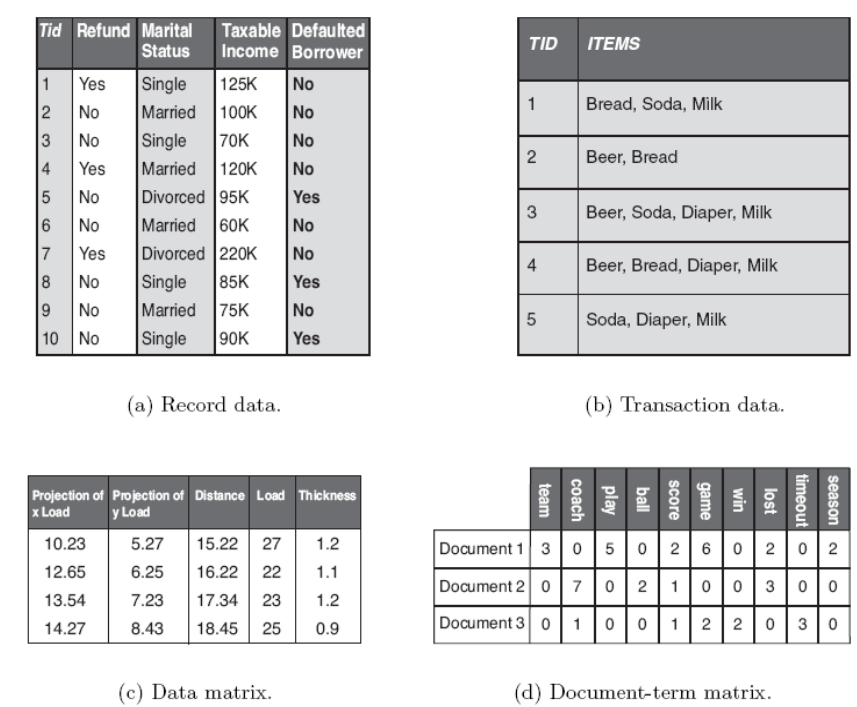
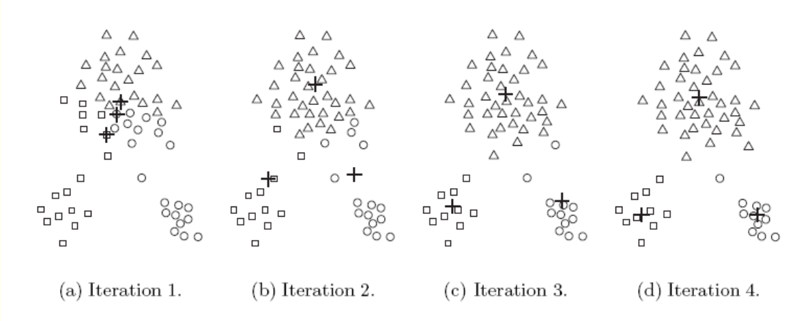
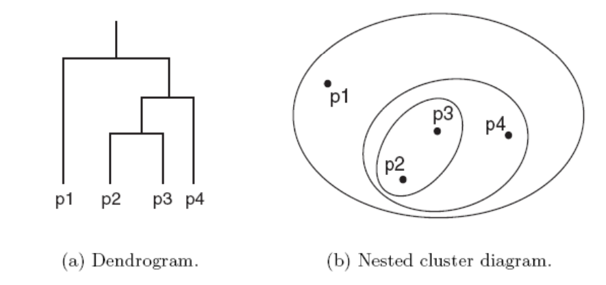
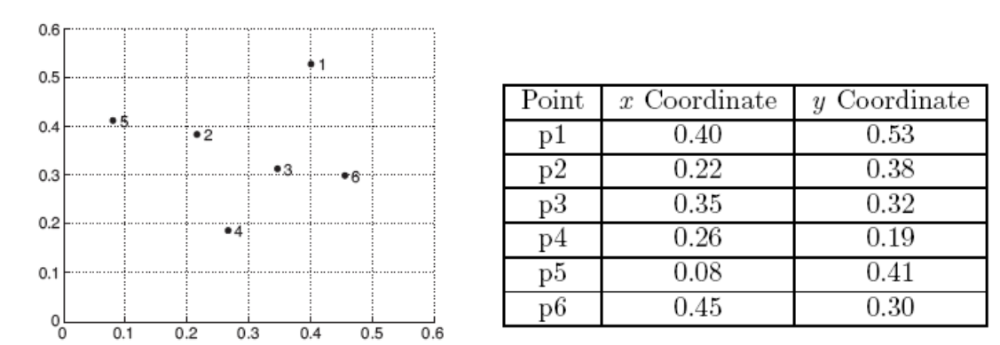
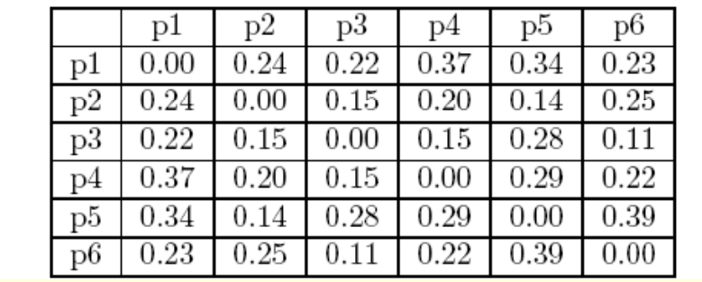
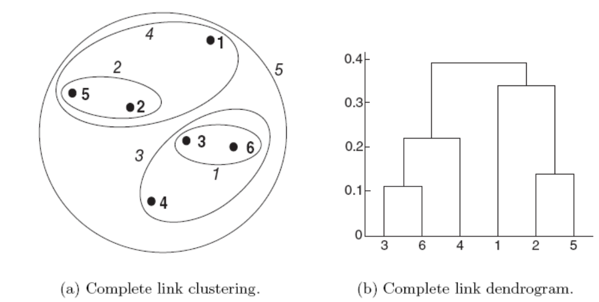
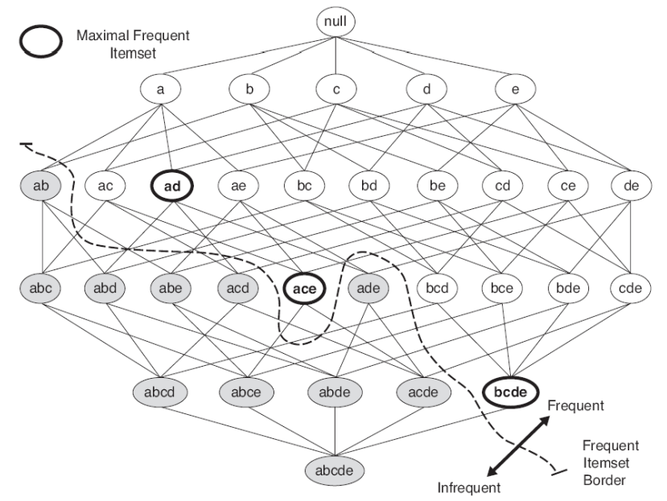
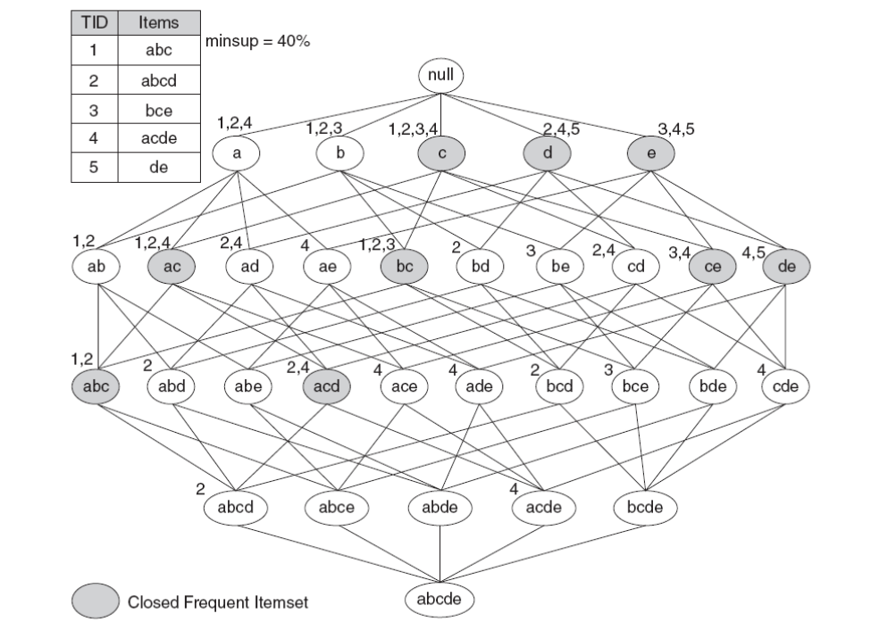

# CS3481 Fundamentals of Data Science

## 01 Introduction

Data Science Pyramid:

1. Data sources
2. Data warehouses: OLAP
3. Data exploration: Statistical analysis, querying and reporting
4. Data mining: Information discovery
5. Data presentation: Visualization
6. Making decisions

### Concepts

**Data mining**: A fundamental approach in data science which allows automatic discovery of useful information in large data repositories.

Not all information discovery is data mining. (e.g., data retrieval)

**Knowledge discovery in databases (KDD)**: The overall process of converting raw data into useful information. Steps include:

1. Data **cleaning** (removes noise and inconsistent data) and **integration** (combines multiple data sources)
2. Data **selection** (retrieves relevant data for analysis) and **transformation** (converts data into appropriate forms for mining)
3. Data **mining**
4. **Pattern evaluation** (identifies truly interesting patterns based on given measures)
5. **Knowledge presentation** (visualization and presentation of mined knowledge to users)

Challenges in data mining:

- Scalability
- High dimensionality
- Heterogeneous and complex data

Core data mining tasks:

- Predictive modeling: to learn a model that minimizes the error in predicting the target variable
    - **Classification** for discrete target variables (labels)
    - **Regression** for continuous target variables
- Association analysis: to extract interesting correlations and patterns efficiently
- Cluster analysis: to find groups of closely related data points

## 02 Data

- **Data set**: A collection of data objects. Records (rows) represent data objects, and fields (columns) represent attributes.
- **Attribute**: A property or characteristic of an object.

Types of attributes (1):

- **Nominal**: Categorical values without order (e.g., colors)
- **Ordinal**: Categorical values with order (e.g., grade levels)
- **Interval**: Numeric values where only relative differences matter (e.g., calendar dates)
- **Ratio**: Numeric values with a true zero point (e.g., physical measurements)

Types of attributes (2):

- **Discrete**: Finite or countably infinite values (including binary attributes)
- **Continuous**: Infinite values within a range

Types of data sets:

- **Record data**: Each data object is represented as a fixed number of attributes, like in a relational database.
- **Transaction data**: Each data object is a transaction containing a set of items (e.g., market basket data).
- **Graph data**: All data objects have the same fixed set of numeric attributes, can be viewed as high-dimensional vectors.
- **Sparse data matrix**: Most attribute values are zero (e.g., document data represented as term-frequency vectors).



Data quality:

- **Precision**: The stddev of repeated measurements. $\text{Precision} = \sqrt{\frac{1}{N}\sum_{i=1}^{N}(x_i - \bar{x})^2}$
- **Bias**: The systematic error between the average of measurements and the true value. $\text{Bias} = |\bar{x} - \mu|$
- **Noise**: The random component of measurement error.
- **Outliers**: Statistically different data points that may be due to measurement errors or variability in the data.
- **Missing values**: Missing attribute values for some data objects. We may either eliminate such objects or estimate the missing values. For discrete attributes, the most frequent value can be used. For continuous attributes, the mean or median can be used.

### Data preprocessing

#### Aggregation

Combining two or more objects into a single object.

For example, to analyze how monthly rainfall affects crop yield, aggregate daily rainfall data into monthly totals.

Disadvantage: potential loss of interesting details.

#### Sampling

Selecting a subset of data objects to be analyzed.

For example, to analyze customer purchasing behavior, sample a subset of transactions from a large database.

Two types of sampling: **Sampling with replacement** and **sampling without replacement**.

Need to select a **sample size**. Disadvantage: larger sample size eliminates the advantage of sampling; smaller sample size may not represent the whole data set well.

#### Dimensionality reduction

Advantages: eliminates irrelevant features, makes the model more understandable, easier to visualize data, reduces time and space complexity.

Techniques:

(1) **Feature transformation**: Transforming the data from the original high-dimensional space to a lower-dimensional space. **Principal Component Analysis (PCA)** is a common technique that identifies the directions (principal components) along which the variance of the data is maximized.

Example: Given a data set with $n$ elements and $d$ dimensions, we want to reduce it to $k$ dimensions using PCA.

Let $X$ be the $n \times d$ data matrix. The steps are:

1. Center the data by subtracting the mean of each attribute. $X_{centered} = X - \mu$, where $\mu$ is the mean vector.
2. Compute the covariance matrix of the centered data. $C = \frac{1}{n-1} X_{centered}^T X_{centered}$
3. Compute the eigenvalues and eigenvectors of the covariance matrix $C$.
4. Sort the eigenvalues in descending order and select the top $k$ eigenvectors corresponding to the largest eigenvalues.
5. Project the original data onto the new $k$-dimensional space. $X_{reduced} = X_{centered} \cdot W$, where $W$ is the matrix of the top $k$ eigenvectors.

(2) **Feature subset selection**: Selecting a subset of the original features based on certain criteria. Implementation methods include:

- **Embedded approach**: Perform feature selection as part of the model training process (e.g., LASSO regression).
- **Filter approach**: Select features based on their statistical properties (e.g., correlation with the target variable).
- **Wrapper approach**: Use a predictive model to evaluate the performance of different feature subsets (e.g., recursive feature elimination).

Pros and Cons of wrapper approach (tested in midterm):

- Pros: can achieve higher accuracy; can be customized to specific models; considers feature interactions (feature dependencies).
- Cons: computationally expensive; risk of overfitting.

#### Discretization

Transforming continuous attributes into discrete attributes by creating intervals (bins).

Let $A$ be a continuous attribute with range $[min_A, max_A]$. To discretize $A$ into $k$ intervals:

1. Determine the width of each interval: $width = \frac{max_A - min_A}{k}$
2. Create $k$ intervals: $[min_A, min_A + width), [min_A + width, min_A + 2 \cdot width), \ldots, [min_A + (k-1) \cdot width, max_A]$
3. Assign each value of $A$ to the corresponding interval.

#### Normalization

Scaling attribute values to a specific range.

3 common techniques:

1. Min-max normalization: $x' = \frac{x - x_{min}}{x_{max} - x_{min}}$ normalizes $x$ to the range [0, 1].
2. Z-score normalization (standardization): $x' = \frac{x - \mu}{\sigma}$ normalizes $x$ to have mean 0 and stddev 1.
3. Decimal scaling: $x' = \frac{x}{10^j}$ where $j$ is the smallest integer such that $max(|x'|) < 1$, so that $x'$ is in the range [-1, 1].

### Dissimilarity measures

- Nominal attributes: dissimilarity is 0 if values are the same, 1 otherwise.
- Ordinal attributes: convert to ranks, then take the absolute difference.
- Interval/ratio attributes: take the absolute difference.

Common distance measures:

- **L2 norm (Euclidean distance)**: $d(x, y) = \sqrt{\sum_{i=1}^{n} (x_i - y_i)^2}$
- **L1 norm (Manhattan distance)**: $d(x, y) = \sum_{i=1}^{n} |x_i - y_i|$
- **L∞ norm (Chebyshev distance)**: $d(x, y) = \max_{i} |x_i - y_i|$

Properties of distance functions (cosine similarity is not a distance function):

- Positivity: $d(x, y) \geq 0$ and $d(x, y) = 0$ iff $x = y$
- Symmetry: $d(x, y) = d(y, x)$
- Triangle inequality: $d(x, z) \leq d(x, y) + d(y, z)$

Weighted distance: $d(x, y) = \sqrt{\sum_{i=1}^{n} w_i (x_i - y_i)^2}$ where $w_i$ is the weight for attribute $i$.

### Summary Statistics

- Relative frequency: $f(a_i) = \frac{\text{count}(a_i)}{N}$
- Mode: the most frequent value of a discrete attribute.
- Mean: $\bar{x} = \frac{1}{N} \sum_{i=1}^{N} x_i$
- Median: $x_{(N+1)/2}$ for odd $N$, $\frac{x_{N/2} + x_{N/2 + 1}}{2}$ for even $N$ when data is sorted.
- Trimmed mean: mean after removing $\frac{p}{2}\%$ of the smallest and largest values.
- Range: $\text{Range} = x_{max} - x_{min}$
- Variance: $\sigma^2 = \frac{1}{N} \sum_{i=1}^{N} (x_i - \bar{x})^2$
- Standard deviation: $\sigma = \sqrt{\sigma^2}$

Multivariate statistics:

**Covariance**: $\text{Cov}(x, y) = \frac{1}{N-1} \sum_{i=1}^{N} (x_i - \bar{x})(y_i - \bar{y})$ measures how two attributes vary together.

**Covariance matrix**: A square matrix that contains the covariances between all pairs of attributes in the data set. For $d$-dimensional data, covariance matrix $C$ is a $d \times d$ matrix where the element at row $i$ and column $j$ is $\text{Cov}(x_i, x_j)$.

For 2-dimensional data, covariance matrix:

$$\begin{aligned}
C & = \begin{bmatrix}
\text{Var}(x) & \text{Cov}(x, y) \\
\text{Cov}(y, x) & \text{Var}(y)
\end{bmatrix} \\
& = \begin{bmatrix}
\frac{1}{n-1} \sum_{i=1}^{n} (x_i - \bar{x})^2 & \frac{1}{n-1} \sum_{i=1}^{n} (x_i - \bar{x})(y_i - \bar{y}) \\
\frac{1}{n-1} \sum_{i=1}^{n} (y_i - \bar{y})(x_i - \bar{x}) & \frac{1}{n-1} \sum_{i=1}^{n} (y_i - \bar{y})^2
\end{bmatrix}
\end{aligned}$$

For 3-dimensional data, covariance matrix:

$$C = \begin{bmatrix}
\text{Var}(x) & \text{Cov}(x, y) & \text{Cov}(x, z) \\
\text{Cov}(y, x) & \text{Var}(y) & \text{Cov}(y, z) \\
\text{Cov}(z, x) & \text{Cov}(z, y) & \text{Var}(z)
\end{bmatrix}$$

Note that $\text{Cov}(x, y) = \text{Cov}(y, x)$.

**Correlation coefficient**: $r_{xy} = \frac{\text{Cov}(x, y)}{\sigma_x \sigma_y}$ measures the linear relationship between two attributes.

Data visualization techniques:

- Histograms: Divide possible values into bins and show the number of objects in each bin.
- Scatter plot: Show the relationship between two continuous attributes. Can be used to identify correlations and outliers.

## 03 Decision Trees

### Classification

**Classification**: Assigning objects to one of several predefined categories.

Input: $D = \{(x_1, y_1), (x_2, y_2), \ldots, (x_N, y_N)\}$ where $x_i$ is the feature vector and $y_i$ is the class label.

A classification technique employs a **learning algorithm** to identify a model that best fits the relationship between the attribute set and the class labels.

- A **training set** consists of data objects with known class labels is used to build the model.
- A **test set** consists of data objects with different records is used to evaluate the model's performance.

**Confusion matrix**: A table used to evaluate the performance of a classification model. Rows represent actual classes, and columns represent predicted classes.

In a binary classification problem, the confusion matrix has four components:

|              | Predicted Positive | Predicted Negative |
|--------------|--------------------|--------------------|
| Actual Positive | $a_{11}$              | $a_{10}$              |
| Actual Negative | $a_{01}$              | $a_{00}$              |

$\text{Accuracy} = \frac{a_{11} + a_{00}}{a_{11} + a_{10} + a_{01} + a_{00}}$

$\text{Error Rate} = \frac{a_{10} + a_{01}}{a_{11} + a_{10} + a_{01} + a_{00}}$

### Decision Tree

A **decision tree** is a series of questions (tests) about the attributes of the data objects, organized in a tree structure.

3 types of nodes:

- **Root node**: The topmost node in the tree, with no incoming edges.
- **Internal nodes**: Nodes that represent tests on attributes, with exactly one incoming edge and multiple outgoing edges.
- **Leaf nodes**: Terminal nodes that represent class labels, with exactly one incoming edge and no outgoing edges.

Suppose $U_s$ is the set of data objects at node $s$, $C= \{c_1, c_2, \ldots, c_k\}$ is the set of class labels, the decision tree construction works as follows:

- If all data objects in $U_s$ belong to the same class $c_j$, create a leaf node labeled $c_j$ and stop.
- If $U_s$ contains records that belong to different classes, select the best attribute $A$ to split the data objects in $U_s$ into subsets based on the values of $A$.
- Recursively apply the algorithm to each child node.
- In most cases, the leaf node is assigned to the majority class of the data objects in that node $\text{argmax}\ p(c_j | U_s)$.

### Attribute Selection

Attribute testing types:

- There are two types of splits: **binary splits** and **multiway splits**.
- Nominal attributes: there are $2^{S-1} - 1$ possible binary splits.
- Ordinal attributes: can be split anyway along the order.
- Continuous attributes: split into ranges $x \leq t$ and $x > t$ for some threshold $t$.

**Information entropy**: A measure of the uncertainty in a random variable, i.e., how much more we know about the system after observing the variable.

Suppose a set has $k$ possible outcomes (classes) $c_1, c_2, \ldots, c_k$ with probabilities $p(c_1), p(c_2), \ldots, p(c_k)$, the entropy is defined as: (in bits)

$$I = - \sum_{i=1}^{k} p(c_i) \log_2 p(c_i)$$

When there are $k$ equally likely outcomes, the entropy is maximized: $I = \log_2 k$.

**Information gain**: The reduction in entropy after splitting the data on an attribute.

$$\text{Gain}(A) = I(U) - \bar{I}(A) = I(U) - \sum_{s=1}^{S} \frac{|U_s|}{|U|} I(U_s)$$

where $U$ is the total set at the node, $U_s$ is the subset after splitting on attribute $A$, and $S$ is the number of subsets.

Example: there are 10 objects in $U$, 8 positive and 2 negative. Attribute $A$ splits $U$ into 2 subsets: $U_{1}$ with 5 objects (3 positive, 2 negative) and $U_{2}$ with 5 objects (5 positive, 0 negative).

Entropy before split: $I(U) = -\left(\frac{8}{10} \log_2 \frac{8}{10} + \frac{2}{10} \log_2 \frac{2}{10}\right) \approx 0.7219$.

Entropy after split: $\bar{I}(A) = \frac{5}{10} I(U_{1}) + \frac{5}{10} I(U_{2}) = \frac{5}{10} \left(-\left(\frac{3}{5} \log_2 \frac{3}{5} + \frac{2}{5} \log_2 \frac{2}{5}\right)\right) + \frac{5}{10} (0) \approx 0.4855$.

Information gain: $\text{Gain}(A) = I(U) - \bar{I}(A) \approx 0.7219 - 0.4855 = 0.2364$.

After calculating the information gain for all attributes, select the attribute with the highest information gain to split the data at node $s$.

---

Splitting continuous attributes:

- The goal is instead to find the optimal threshold $t$ to split the data.
- Training set is split into two subsets based on a threshold $t$: $U_{\leq t} = \{x_1, x_2, \ldots, x_r\}$ and $U_{> t} = \{x_{r+1}, x_{r+2}, \ldots, x_N\}$.
- There are at most $N-1$ possible splits.
- For each $r = 1 \ldots N-1$, compute the information gain for the split at threshold $t_r = \frac{x_r + x_{r+1}}{2}$.
- The threshold $t_r$ that gives the highest information gain is selected.

---

Impurity measures:

- **Gini index**: $G(U) = 1 - \sum_{i=1}^{k} p(c_i)^2$ gives the probability of misclassifying a randomly chosen element.
- **Classification error**: $E(U) = 1 - \max_{i} p(c_i)$ gives the error rate of the majority class.

In binary classification, entropy, Gini index, and classification error are all maximized when $p = 0.5$ and minimized when $p = 0$ or $p = 1$.

**Gain ratio**: To overcome the bias of information gain towards attributes with many values, the gain ratio is defined as:

$$\text{GainRatio}(A) = \frac{\text{Gain}(A)}{\text{SplitInfo}(A)}$$

where

$$\text{SplitInfo}(A) = - \sum_{s=1}^{S} \frac{|U_s|}{|U|} \log_2 \frac{|U_s|}{|U|}$$

**Oblique decision trees**: Decision trees that allow splits based on linear combinations of attributes, rather than single attributes. This can lead to more compact trees and better classification performance in some cases.

Example:

| Instance | $a_1$ | $a_2$ | $a_3$ | Class |
| --- | --- | --- | --- | --- |
| 1 | T | T | 1 | + |
| 2 | T | T | 6 | + |
| 3 | T | F | 5 | - |
| 4 | F | F | 4 | + |
| 5 | F | T | 7 | - |
| 6 | F | T | 3 | - |
| 7 | F | F | 8 | - |
| 8 | T | F | 7 | + |
| 9 | F | T | 5 | - |

(a) What is the original entropy of this set of training instances?

$$E = -\left(\frac{5}{9} \log_2 \frac{5}{9} + \frac{4}{9} \log_2 \frac{4}{9}\right) = 0.991$$

(b) What are the information gains when $a_1$ and $a_2$ are used for partitioning the training set respectively?

The new entropy after partitioning by $a_1$ is (T: 3+ 1-, F: 1+ 4-):

$$E_{a_1} = \frac{4}{9} \left(-\frac{3}{4} \log_2 \frac{3}{4} - \frac{1}{4} \log_2 \frac{1}{4}\right) + \frac{5}{9} \left(-\frac{1}{5} \log_2 \frac{1}{5} - \frac{4}{5} \log_2 \frac{4}{5}\right) = 0.762$$

The information gain for $a_1$ is: $$IG_{a_1} = E - E_{a_1} = 0.991 - 0.762 = 0.229$$

The new entropy after partitioning by $a_2$ is (T: 2+ 3-, F: 2+ 2-):

$$E_{a_2} = \frac{5}{9} \left(-\frac{2}{5} \log_2 \frac{2}{5} - \frac{3}{5} \log_2 \frac{3}{5}\right) + \frac{4}{9} \left(-\frac{2}{4} \log_2 \frac{2}{4} - \frac{2}{4} \log_2 \frac{2}{4}\right) = 0.984$$

The information gain for $a_2$ is: $$IG_{a_2} = E - E_{a_2} = 0.991 - 0.984 = 0.007$$

(c) Calculate the respective changes in the Gini index value when $a_1$ and $a_2$ are used for partitioning the training set.

The original Gini index is:

$$G = 1 - \left(\frac{5}{9}\right)^2 - \left(\frac{4}{9}\right)^2 = 0.494$$

The new Gini index after partitioning by $a_1$ is (T: 3+ 1-, F: 1+ 4-):

$$G_{a_1} = \frac{4}{9} \left(1 - \left(\frac{3}{4}\right)^2 - \left(\frac{1}{4}\right)^2\right) + \frac{5}{9} \left(1 - \left(\frac{1}{5}\right)^2 - \left(\frac{4}{5}\right)^2\right) = 0.344$$

The change in Gini index for $a_1$ is: $$\Delta G_{a_1} = G - G_{a_1} = 0.494 - 0.344 = 0.150$$

The new Gini index after partitioning by $a_2$ is (T: 2+ 3-, F: 2+ 2-):

$$G_{a_2} = \frac{5}{9} \left(1 - \left(\frac{2}{5}\right)^2 - \left(\frac{3}{5}\right)^2\right) + \frac{4}{9} \left(1 - \left(\frac{2}{4}\right)^2 - \left(\frac{2}{4}\right)^2\right) = 0.489$$

The change in Gini index for $a_2$ is: $$\Delta G_{a_2} = G - G_{a_2} = 0.494 - 0.489 = 0.005$$

(d) Calculate the respective changes in the classification error rate when $a_1$ and $a_2$ are used for partitioning the training set.

The original classification error rate is:

$$E = 1 - \max\left(\frac{5}{9}, \frac{4}{9}\right) = 0.444$$

The new classification error rate after partitioning by $a_1$ is (T: 3+ 1-, F: 1+ 4-):

$$E_{a_1} = \frac{4}{9} \left(1 - \max\left(\frac{3}{4}, \frac{1}{4}\right)\right) + \frac{5}{9} \left(1 - \max\left(\frac{1}{5}, \frac{4}{5}\right)\right) = 0.222$$

The change in classification error rate for $a_1$ is: $$\Delta E_{a_1} = E - E_{a_1} = 0.444 - 0.222 = 0.222$$

The new classification error rate after partitioning by $a_2$ is (T: 2+ 3-, F: 2+ 2-):

$$E_{a_2} = \frac{5}{9} \left(1 - \max\left(\frac{2}{5}, \frac{3}{5}\right)\right) + \frac{4}{9} \left(1 - \max\left(\frac{2}{4}, \frac{2}{4}\right)\right) = 0.444$$

The change in classification error rate for $a_2$ is: $$\Delta E_{a_2} = E - E_{a_2} = 0.444 - 0.444 = 0$$

## 04 Classifier Evaluation

### Classification Error

Two types of errors:

- **Training error**: The number of misclassifications on the training set.
- **Generalization error**: The expected error of the model on unseen data.

A good model should have low training error and low generalization error. If a model fits the training data too well, it may have low training error but high generalization error, which is called **overfitting**.

Example: when the tree size becomes too large in a decision tree, the training error rate continues to decrease, but the test error rate starts to increase, indicating overfitting.

### Estimating Generalization Error

Three techniques:

- **Resubstitution estimate**: Use the training error as an estimate of the generalization error. This is often optimistic and can underestimate the true error.
- **Estimating incorporating model complexity**: Estimate the generalization error as the sum fo training error and a penalty term that increases with model complexity (e.g., number of nodes in a decision tree).
    - A penalty term of $\alpha = 0.5$ encourages split nodes only when it corrects the classification of at least 1 training record.
    - A penalty term of $\alpha = 1$ encourages split nodes only when it corrects the classification of at least 2 training records.
- **Validation set**: Split the data into a training set and a validation set. Train the model on the training set and evaluate it on the validation set to estimate the generalization error.

### Handling Overfitting

Two approaches:

- **Pre-pruning**: Stop the tree construction early, before it perfectly fits the training data. For example, stop splitting a node if the change in impurity $< \delta$.
    - Advantage: faster training time, simpler model.
    - Disadvantage: difficult to choose the right stopping criteria, may underfit the data.
- **Post-pruning**: Allow the tree to grow fully, then prune back nodes that do not contribute to improving the generalization error. For example, replace a subtree with a leaf node if it reduces the estimated generalization error.
    - Advantage: can achieve better performance.
    - Disadvantage: more computationally expensive.

### Evaluating

Two approaches:

- **Hold-out method**: Split the data into a training set and a test set. Train the model on the training set and evaluate it on the test set.
    - Disadvantage: fewer data for training, results can be sensitive to how the data is split.
- **Cross-validation**: Split the data into $k$ folds. For each fold, train the model on the other $k-1$ folds and evaluate it on the current fold. The average error across all folds is used as an estimate of the generalization error.
    - Advantage: more reliable estimate of generalization error, uses all data for training and testing.
    - Disadvantage: more computationally expensive.

## 05 Nearest Neighbor and Probabilistic Classifiers

### Nearest Neighbor Classifier

Basic idea: classify a new data object by finding the most similar data objects in the training set and assigning the class label based on those neighbors.

**k-nearest neighbor (k-NN)**: A generalization of the nearest neighbor classifier that considers the $k$ closest neighbors instead of just one. The class label is assigned based on the majority class among the $k$ neighbors.

- If $k$ is too small, the classifier may be sensitive to noise and outliers (overfitting).
- If $k$ is too large, the classifier may be too general and may not capture the local structure of the data.

Algorithm for k-NN:

1. Compute the distance $D_i$ between the new data object $X$ and all data objects in the training set $x_i$.
2. Sort the distances and select the $k$ nearest neighbors.
3. Determine the majority class among the $k$ neighbors and assign that class label to $X$.

### Probabilistic Classifiers

**Bayes' theorem**: Let $X$ and $Y$ be two random variables, their joint and conditional probabilities are related by:

$$P(X, Y) = P(X | Y) P(Y) = P(Y | X) P(X)$$

or

$$P(Y | X) = \frac{P(X | Y) P(Y)}{P(X)}$$

where $P(Y)$ is the prior probability, $P(X | Y)$ is the class-conditional probability, and $P(X)$ is the evidence. 

When comparing the posterior probabilities for different classes $Y_1$ and $Y_2$ given the same data object $X$, we can ignore the evidence $P(X)$ since it is the same for all classes: $P(Y | X) \propto P(X | Y) P(Y)$.

**Naive Bayes classifier**: A probabilistic classifier that applies Bayes' theorem with the **conditional independence assumption** that the features are independent given the class label:

$$P(X | Y = c) = \prod_{i=1}^{n} P(X_i | Y = c)$$

where $X = (X_1, X_2, \ldots, X_n)$ is the feature vector.

Categorical attributes are easy to handle with Naive Bayes.

For continuous attributes, two common approaches:

- **Discretization**: Convert continuous attributes into discrete attributes by creating intervals (bins).
- **Gaussian Naive Bayes**: Assume that the continuous attributes follow a Gaussian distribution for each class. Estimate the mean and variance for each attribute and class from the training data, then

$$P(X_u = x_u | Y = c_k) = \frac{\epsilon}{\sqrt{2 \pi s_{u,k}}} \exp\left(-\frac{(x_u - \mu_{u,k})^2}{2 s_{u,k}^2}\right)$$

where $\mu_{u,k}$ and $s_{u,k}^2$ are the mean and **sample variance** of attribute $X_u$ for class $c_k$, and $\epsilon$ is a small constant to prevent underflow when multiplying many probabilities together.

Alternatively, use log probabilities: $\log P(X | Y = c) = \sum_{i=1}^{n} \log P(X_i | Y = c) + C$ where $C$ is a constant that can be ignored when comparing classes.

Example:

| Tid | Home Owner | Marital Status | Annual Income | Defaulted Borrower |
| --- | --- | --- | --- | --- |
| 1 | Yes | Single | 125K | No |
| 2 | No | Married | 100K | No |
| 3 | No | Single | 70K | No |
| 4 | Yes | Married | 120K | No |
| 5 | No | Divorced | 95K | Yes |
| 6 | No | Married | 60K | No |
| 7 | Yes | Divorced | 220K | No |
| 8 | No | Single | 85K | Yes |
| 9 | No | Married | 75K | No |
| 10 | No | Single | 90K | Yes |

Goal: Predict the class label of a test record: Home Owner = No, Marital Status = Married, Annual Income = 120K.

$P(\text{Home Owner = Yes} | \text{Yes}) = \frac{0}{3} = 0$

$P(\text{Home Owner = No} | \text{Yes}) = \frac{3}{3} = 1$

$P(\text{Home Owner = Yes} | \text{No}) = \frac{3}{7}$

$P(\text{Home Owner = No} | \text{No}) = \frac{4}{7}$

$P(\text{Marital Status = Single} | \text{Yes}) = \frac{2}{3}$

$P(\text{Marital Status = Married} | \text{Yes}) = \frac{0}{3} = 0$

$P(\text{Marital Status = Divorced} | \text{Yes}) = \frac{1}{3}$

$P(\text{Marital Status = Single} | \text{No}) = \frac{2}{7}$

$P(\text{Marital Status = Married} | \text{No}) = \frac{4}{7}$

$P(\text{Marital Status = Divorced} | \text{No}) = \frac{1}{7}$

$\bar{x}_\text{Yes} = \frac{95 + 85 + 90}{3} = 90$

$s^2_\text{Yes} = \frac{(95-90)^2 + (85-90)^2 + (90-90)^2}{3-1} = 25$

$s_\text{Yes} = \sqrt{25} = 5$

Note: sample variance is used.

$\bar{x}_\text{No} = \frac{125 + 100 + 70 + 120 + 60 + 220 + 75}{7} = 110$

$s^2_\text{No} = \frac{(125-110)^2 + (100-110)^2 + (70-110)^2 + (120-110)^2 + (60-110)^2 + (220-110)^2 + (75-110)^2}{7-1} = 2975$

$s_\text{No} = \sqrt{2975} \approx 54.54$

$P(\text{Annual Income} = X) = \frac{1}{\sqrt {2\pi} s} \exp\left(-\frac{(X - \bar{x})^2}{2s^2}\right)$

$P(\text{Annual Income} = 120K | \text{Yes}) = \frac{1}{\sqrt {2\pi} \times 5} \exp\left(-\frac{(120 - 90)^2}{2 \times 25}\right) \approx 1.22 \times 10^{-9}$

$P(\text{Annual Income} = 120K | \text{No}) = \frac{1}{\sqrt {2\pi} \times 54.54} \exp\left(-\frac{(120 - 110)^2}{2 \times 2975}\right) \approx 0.007192$

Prior probabilities: $P(\text{Yes}) = \frac{3}{10} = 0.3$, $P(\text{No}) = \frac{7}{10} = 0.7$

Posterior probabilities:

$P(\text{Yes} | X) = P(\text{Home Owner = No} | \text{Yes}) \times P(\text{Marital Status = Married} | \text{Yes}) \times P(\text{Annual Income} = 120K | \text{Yes}) \times P(\text{Yes}) = 1 \times 0 \times 1.22 \times 10^{-9} \times 0.3 = 0$

$P(\text{No} | X) = P(\text{Home Owner = No} | \text{No}) \times P(\text{Marital Status = Married} | \text{No}) \times P(\text{Annual Income} = 120K | \text{No}) \times P(\text{No}) = \frac{4}{7} \times \frac{4}{7} \times 0.007192 \times 0.7 \approx 0.00229$

Since $P(\text{No}|X) > P(\text{Yes}|X)$, the predicted class label for the test record is No.

## 06 Cluster Analysis

Cluster analysis: Group data objects based only on their attribute values, without using class labels. The objects within a group should be similar to each other, while objects in different groups should be different.

Different types of clusterings:

- Partitional vs. hierarchical
    - A **partitional** clsutering is a division of the data set into subsets.
    - A **hierarchical** clustering is a set of nested clusters organized as a tree. Each node is the union of its children, and the root is the entire data set.
    - Relationship: A hierarchical clustering can be viewed as a sequence of partitional clusterings. A partitional clustering can be obtained by taking a certain level of a hierarchical tree.
- Exclusive vs. fuzzy
    - An **exclusive** clustering assigns each data object to exactly one cluster.
    - A **fuzzy** clustering allows each data object to belong to multiple clusters with different degrees of membership between 0 and 1.
    - Relationship: A fuzzy clustering can be converted to an exclusive clustering by assigning each data object to the cluster with the highest membership degree.
- Complete vs. partial
    - A **complete** clustering assigns every data object to a cluster.
    - A **partial** clustering allows some data objects to remain unclustered. The motivation is that some data objects may be noise or outliers that do not belong to any cluster.

### K-Means

A prototype-based clsutering technique which creates a one-level paritioning. The prototype is defined as the centroid of the cluster.

Algorithm:

1. Choose K initial centroids.
2. Each point is assigned to the cluster with the closest centroid.
3. Update the centroids by calculating the mean of the points in each cluster.
4. Repeat steps 2-3 until convergence.



```python
def k_means(X, K, max_iters=100, eps=1e-4):
    # Step 1: Initialize centroids randomly from the data points
    centroids = X[np.random.choice(X.shape[0], K, replace=False)]
    
    for _ in range(max_iters):
        # Step 2: Assign each point to the nearest centroid
        distances = np.linalg.norm(X[:, np.newaxis] - centroids, axis=2)
        closest_centroids = np.argmin(distances, axis=1)
        
        # Step 3: Update centroids
        new_centroids = np.array([X[closest_centroids == k].mean(axis=0) for k in range(K)])
        
        # Check for convergence (if centroids do not change)
        if np.all(np.linalg.norm(new_centroids - centroids, axis=1) < eps):
            break
        
        centroids = new_centroids
    
    return closest_centroids, centroids
```

Distance measure: Euclidean distance.

Objective function: Sum of squared error (SSE):

$$SSE = \sum_{k=1}^{K} \sum_{x_i \in C_k} ||x_i - \mu_k||^2$$

where $C_k$ is the set of points in cluster $k$ and $\mu_k = \frac{1}{|C_k|} \sum_{x_i \in C_k} x_i$ is the centroid of cluster $k$.

Choosing initial centroids:

(1) Choose initial centroids randomly. However, this may suffer from poor convergence and local minima.

(2) Run k-means multiple times with different random initializations and select the clustering with the lowest SSE.

Outliers:

- Keep track of the contribution of each point to the SSE. If a point contributes more than a certain threshold, it can be considered an outlier and removed from the clustering process.

Post-processing to decrease SSE:

- Split a cluster: the cluster that reduces the SSE the most is split into two clusters.
- Introduce a new cluster centroid: Choose the farthest point from its cluster centroid and create a new cluster with that point as the centroid. Reassign points to the nearest centroids and update the centroids. Repeat until no improvement in SSE is observed.

Post-processing to decrease the number of clusters:

- Disperse a cluster: the cluster that increases the SSE the least is removed, and its points are reassigned to the nearest remaining centroids.
- Merge two clusters: the pair of clusters that increases the SSE the least when merged is merged into a single cluster.

Limitations of k-means:

Assume spherical clusters of similar size and density. Cannot handle clusters with different numbers of points, different densities, or non-spherical shapes.

### Hierarchical Clustering

Two approaches:

- Agglomerative:
    - Start with each point as an individual cluster.
    - Iteratively merge the closest pair of clusters.
    - Requires defining a notion of cluster distance.
- Divisive:
    - Start with all points in a single cluster.
    - Iteratively split clusters until only singleton clusters remain.
    - Requires defining a splitting criterion (which cluster to split and how to split it).

Displayed using a tree diagram called a **dendrogram**. Displays both **cluster-subcluster relationships** and **the order in which clusters are merged or split**.

2D points can also be displayed in a nested cluster diagram.



Consider the following six 2D points:



Their euclidean distance matrix is:



Cluster distance measures:

- **Single link**: The distance between two clusters is defined as the minimum distance between any pair of points, one from each cluster.
    - Evaluation: Good at handling non-elliptical clusters.
- **Complete link**: The distance between two clusters is defined as the maximum distance between any pair of points, one from each cluster.
    - Evaluation: Good at handling globular clusters.
- **Group average**: The distance between two clusters is defined as the average distance between all pairs of points, one from each cluster. Mathematically,

$$d(C_i, C_j) = \frac{1}{m_i m_j} \sum_{x \in C_i} \sum_{y \in C_j} d(x, y)$$

Example: applying agglomerative clustering with complete link on the six points:

1. Initially, each point is a cluster: $\{1\}, \{2\}, \{3\}, \{4\}, \{5\}, \{6\}$.
2. 3 and 6 has the smallest distance (0.11), merge them: $\{1\}, \{2\}, \{3, 6\}, \{4\}, \{5\}$.
3. 2 and 5 has the smallest distance (0.14), merge them: $\{1\}, \{2, 5\}, \{3, 6\}, \{4\}$.
4. 4 and $\{3, 6\}$ has the smallest distance (max = d(4, 6) = 0.22), merge them: $\{1\}, \{2, 5\}, \{4, \{3, 6\}\}$.
5. distance between 1 and $\{2, 5\}$ is max = d(1, 5) = 0.34, distance between 1 and $\{4, \{3, 6\}\}$ is max = d(1, 4) = 0.37, distance between $\{2, 5\}$ and $\{4, \{3, 6\}\}$ is max = d(5, 6) = 0.39. Merge 1 and $\{2, 5\}$: $\{1, \{2, 5\}\}, \{4, \{3, 6\}\}$.
6. Merge them with distance max = d(5, 6) = 0.39: $\{\{1, \{2, 5\}\}, \{4, \{3, 6\}\}\}$.



```python
def single_linkage_distance(cluster1, cluster2):
    return np.min([np.linalg.norm(point1 - point2) for point1 in cluster1 for point2 in cluster2])

def complete_linkage_distance(cluster1, cluster2):
    return np.max([np.linalg.norm(point1 - point2) for point1 in cluster1 for point2 in cluster2])

def average_linkage_distance(cluster1, cluster2):
    distances = [np.linalg.norm(point1 - point2) for point1 in cluster1 for point2 in cluster2]
    return np.mean(distances)

def agglomerative_clustering(data, distance_func):
    # Initialize each point as a separate cluster
    clusters = [[point] for point in data]
    
    while len(clusters) > 1:
        # Compute the distance between all pairs of clusters
        distances = np.zeros((len(clusters), len(clusters)))
        for i in range(len(clusters)):
            for j in range(i + 1, len(clusters)):
                distances[i][j] = distance_func(clusters[i], clusters[j])
                distances[j][i] = distances[i][j]
        
        # Find the pair of clusters with the minimum distance
        np.fill_diagonal(distances, np.inf)
        i, j = np.unravel_index(np.argmin(distances), distances.shape)
        
        # Merge the closest clusters
        new_cluster = clusters[i] + clusters[j]
        clusters.append(new_cluster)
        
        # Remove the merged clusters
        clusters.pop(max(i, j))
        clusters.pop(min(i, j))
    
    return clusters[0]
```

scipy provides a built-in implementation:

```python
def hierarchical_clustering(data, method='single'):
    from scipy.cluster.hierarchy import linkage, fcluster
    Z = linkage(data, method=method)
    return fcluster(Z, t=1.0, criterion='distance') # t = threshold for forming flat clusters
```

Evaluation of K-means and hierarchical clustering:

| Criterion | K-means | Hierarchical |
| --- | --- | --- |
| Shape of clusters | Spherical | Any shape |
| Number of clusters | Must be specified | Can be determined from dendrogram |
| Sensitivity to outliers | High | Low |
| Time complexity | $O(nkt)$ | $O(n^3)$ |
| Space complexity | $O(nk)$ | $O(n^2)$ |

where $n$ is the number of data points, $k$ is the number of clusters, and $t$ is the number of iterations until convergence.

#### DBSCAN

Density-Based Spatial Clustering of Applications with Noise (DBSCAN) is a density-based clustering algorithm that groups together points that are closely packed together, while marking points that lie alone in low-density regions as outliers. It is resistant to noise and can find clusters of arbitrary shape.

- **Density**: The number of points within a specified radius $\epsilon$ around a point, including the point itself.
- **Core point**: A point in the interior of a dense region, which has at least $minPts$ density.
- **Border point**: A point at the edge of a dense region, which has fewer than $minPts$ density but is within $\epsilon$ distance of a core point.
- **Noise point**: A point in a sparse region, which is neither a core point nor a border point.

Algorithm:

While there are points which have not been processed:

- For one of these points, check whether it is a core point.
- If not, label it as noise and continue.
- If it is a core point,
    - Label it and create a new cluster C.
    - Include all points within $\epsilon$ distance of the core point in C.
    - Insert all these neighboring points into a queue.
    - While the queue is not empty:
        - Pop a point from the queue.
        - If it is not a core point, label it as border point.
        - If it is a core point,
            - Label it and check all unassigned points within $\epsilon$ distance of it.
            - For each such point, assign it to C and add it to the queue.

```python
def dbscan(X, eps, minPts):
    from sklearn.neighbors import NearestNeighbors
    n = X.shape[0]
    labels = np.full(n, -1)  # Initialize all points as noise
    cluster_id = 0
    
    # Compute the distance matrix
    nbrs = NearestNeighbors(radius=eps).fit(X)
    distances, indices = nbrs.radius_neighbors(X)
    
    for i in range(n):
        if labels[i] != -1:  # Already processed
            continue
        
        neighbors = indices[i]
        if len(neighbors) < minPts:  # Not a core point
            continue
        
        # Start a new cluster
        labels[i] = cluster_id
        queue = list(neighbors)
        
        while queue:
            j = queue.pop(0)
            if labels[j] == -1:  # Unprocessed point
                labels[j] = cluster_id
                j_neighbors = indices[j]
                if len(j_neighbors) >= minPts:  # Core point
                    queue.extend(j_neighbors)
        
        cluster_id += 1
    
    return labels
```

## 08 Association Analysis

**Market basket transactions**: A transaction dataset. Each row conrresponds to a transaction, which contains a unique identifier (TID) and a set of items bought in that transaction.

Market basket analysis can be used for: marketing promotions, inventory management, and customer relationship management.

Binary representation of transactions: The whole transaction dataset can be represented as a binary matrix, where rows correspond to transactions and columns correspond to items. A value of 1 indicates that the item is present in the transaction, while a value of 0 means not.

**Contain**: A transaction $t_j$ contains an itemset $X$ if all items in $X$ are present in $t_j$.

**Support count**: The number of transactions that contain an itemset $X$, denoted as $\sigma(X)$.

$$\sigma(X) = |\{t_j | X \subseteq t_j, t_j \in T\}|$$

i.e. the number of transactions that contain all items in $X$.

**Association rule**: An implication of the form $X \Rightarrow Z$, where $X$ and $Z$ are disjoint itemsets. The rule suggests that if a customer buys items in $X$, they are likely to also buy items in $Z$.

**Support**: the frequency of the rule in the transaction dataset, defined as:

$$s(X \Rightarrow Z) = \frac{\sigma(X \cup Z)}{|T|}$$

**Confidence**: the frequency of the rule being correct when it is applicable, defined as:

$$c(X \Rightarrow Z) = \frac{\sigma(X \cup Z)}{\sigma(X)}$$

No causality implied. A high confidence does not necessarily mean that $X$ causes $Z$. It could be that both $X$ and $Z$ are caused by a common factor, or that the association is due to chance. Causality requires knowledge about cause and effects in the data.

**Association rule mining**: Given a set of transactions $T$, find all rules such that $s(X \Rightarrow Z) \geq s_{min}$ and $c(X \Rightarrow Z) \geq c_{min}$.

Brute force time complexity: $O(2^n)$ where $n$ is the number of items, since we need to consider all possible itemsets.

Strategy: decompose the problem into two steps:

- **Frequent itemset generation**: Find all itemsets that have support greater than or equal to $s_{min}$.
- **Rule generation**: Extract all high-confidence rules (strong rules) from the frequent itemsets.

### Frequent Itemset Generation - Apriori Algorithm

A k-itemset have $2^k-1$ non-empty subsets.

The Apriori principle: **If an itemset is frequent, then all of its subsets must also be frequent.** This allows us to prune the search space when generating candidate itemsets.

Similarly, **if an itemset is infrequent, then all of its supersets must also be infrequent.**

Definitions:

- Let $I$ be a set of items; let $J = 2^I$ be the power set of $I$.
- A measure $f: J \to \mathbb{R}$ is **monotone** if $\forall X, Y \in J, X \subseteq Y \implies f(X) \leq f(Y)$.
- A measure $f: J \to \mathbb{R}$ is **anti-monotone** if $\forall X, Y \in J, X \subseteq Y \implies f(X) \geq f(Y)$.

Apriori algorithm uses the anti-monotone property of support to efficiently find frequent itemsets:

1. Let $C_k$ be the set of candidate k-itemsets, and $F_k$ be the set of frequent k-itemsets.
2. Initially, $C_1$ is the set of all items, and $F_1$ is the set of frequent items (those with support $\geq s_{min}$).
3. For $k = 2$ to the maximum itemset size:
    - Generate $C_k$ by joining pairs of itemsets in $F_{k-1}$ that differ in only one item. i.e. if $X = \{i_1, i_2, \ldots, i_{k-1}\}$ and $Y = \{i_1, i_2, \ldots, i_{k-2}, i_k\}$ are in $F_{k-1}$, then $X \cup Y = \{i_1, i_2, \ldots, i_{k-1}, i_k\}$ is a candidate itemset of size $k$.
    - Prune $C_k$ (see below).
    - Count the support of each itemset in $C_k$ and keep those that are frequent to form $F_k$.

Analysis:

- Apriori algorithm is a level-wise search algorithm
- It employs a generate-and-test strategy for finding frequent itemsets

Pruning step:

Consider a candidate k-itemset $X = \{i_1, i_2, \ldots, i_k\}$.

- The algorithm determines whether $X - \{i_j\}$ is frequent for all $j = 1, 2, \ldots, k$, i.e. $\forall j, X - \{i_j\} \in F_{k-1}$.
- If any of the subsets is infrequent, then $X$ cannot be frequent and is pruned from the candidate set $C_k$.

### Rule Generation

Each frequent k-itemset $F_k$ can generate up to $2^k - 2$ non-trivial rules of the form $X \Rightarrow Z$ where $X \subset F_k$ and $Z = F_k - X$.

Consider $F_3 = \{1, 2, 3\}$, rule $J = \{1, 2\} \Rightarrow \{3\}$ can be generated from $F_3$, its confidence is $c(J) = \frac{\sigma(\{1, 2, 3\})}{\sigma(\{1, 2\})}$.

Since $\{1, 2, 3\}$ is frequent, the anti-monotone property of support implies that $\{1, 2\}$ must also be frequent, i.e. $\sigma(\{1, 2\}) \geq \sigma(\{1, 2, 3\}) \geq s_{min}$.

**Confidence pruning**: If a rule $X \Rightarrow F_k - X$ does not satisfy the confidence threshold, then any rule $X' \Rightarrow F_k - X'$ where $X' \subset X$ will also not satisfy the confidence threshold, and can be pruned from consideration.

Proof:

- $c(X \Rightarrow F_k - X) = \frac{\sigma(F_k)}{\sigma(X)}$.
- $c(X' \Rightarrow F_k - X') = \frac{\sigma(F_k)}{\sigma(X')}$.
- Since $X' \subset X$, $\sigma(X') \geq \sigma(X)$ due to the anti-monotone property of support.
- As a result, $c(X' \Rightarrow F_k - X') = \frac{\sigma(F_k)}{\sigma(X')} \leq \frac{\sigma(F_k)}{\sigma(X)} = c(X \Rightarrow F_k - X)$.

Similary, if a rule $F_k - Y \Rightarrow Y$ does not satisfy the confidence threshold, all the rules containing $Y$ in the consequent can be pruned.

**Rule generation**: If given two high-confidence rules $X \Rightarrow F_k - X$ and $Y \Rightarrow F_k - Y$ where $X, Y \subset F_k$ and $|X| = |Y| = k-1$, then we can generate a new rule $X \cup Y \Rightarrow F_k - (X \cup Y)$, which will also have high confidence, i.e.

Given $\{i_1, i_2, \ldots, i_{k-1}\} \Rightarrow \{i_k\}$ and $\{i_1, i_2, \ldots, i_{k-2}, i_k\} \Rightarrow \{i_{k-1}\}$ are high-confidence rules, we can generate a new rule $\{i_1, i_2, \ldots, i_{k-2}\} \Rightarrow \{i_{k-1}, i_k\}$ which will also have high confidence.

```python
def generate_rules(frequent_itemsets, min_confidence):
    rules = []
    for itemset in frequent_itemsets:
        if len(itemset) < 2:
            continue
        for i in range(1, len(itemset)):
            for antecedent in combinations(itemset, i):
                consequent = set(itemset) - set(antecedent)
                confidence = support(itemset) / support(antecedent)
                if confidence >= min_confidence:
                    rules.append((antecedent, consequent, confidence))
    return rules
```

### Itemset Representation

The number of frequent itemsets can be large. There are two common approaches to represent them:

#### Maximal frequent itemsets

Maximal frequent itemsets are the largest itemsets that are frequent, i.e. they are not subsets of any other frequent itemset.

Mathematically, an itemset $X$ is a maximal frequent itemset if $X$ is frequent and there is no itemset $Y$ such that $X \subset Y$ and $Y$ is frequent.



All frequent itemsets can be derived from the maximal frequent itemsets. However, an additional pass is required to calculate the support of the non-maximal frequent itemsets.

#### Closed frequent itemsets

Closed itemsets are itemsets that have no superset with the same support.

Closed frequent itemsets are itemsets that are both closed and frequent, i.e.,

- their support passes the minimum support threshold $\sigma(X) \geq s_{min}$, and
- there is no superset $Y$ such that $X \subset Y$ and $\sigma(Y) = \sigma(X)$.



The support of any non-closed frequent itemset is the largest support of its immediate (one-item larger) closed frequent supersets.

In the above example, `ad` has a immediate closed frequent superset `acd=2,4`, so $\sigma(ad) = \sigma(acd) = 2$, and `ad` is not closed.

Relationship between frequent, maximal frequent, and closed frequent itemsets:

$$\text{Frequent itemsets} \supseteq \text{Closed frequent itemsets} \supseteq \text{Maximal frequent itemsets}$$

i.e. every maximal frequent itemset is a closed frequent itemset, and every closed frequent itemset is a frequent itemset.