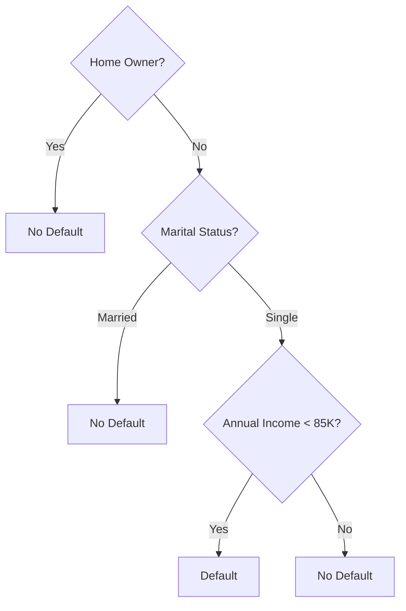
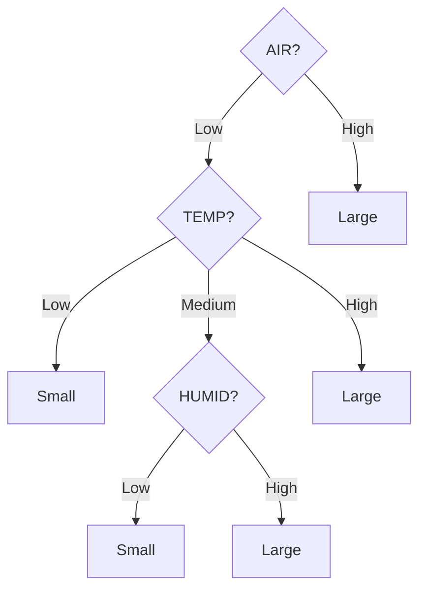
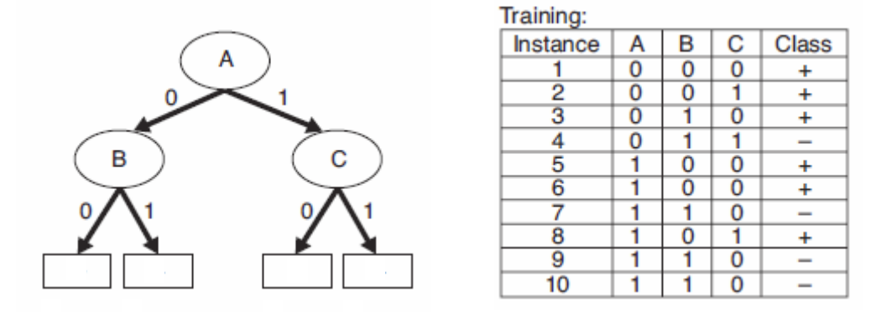
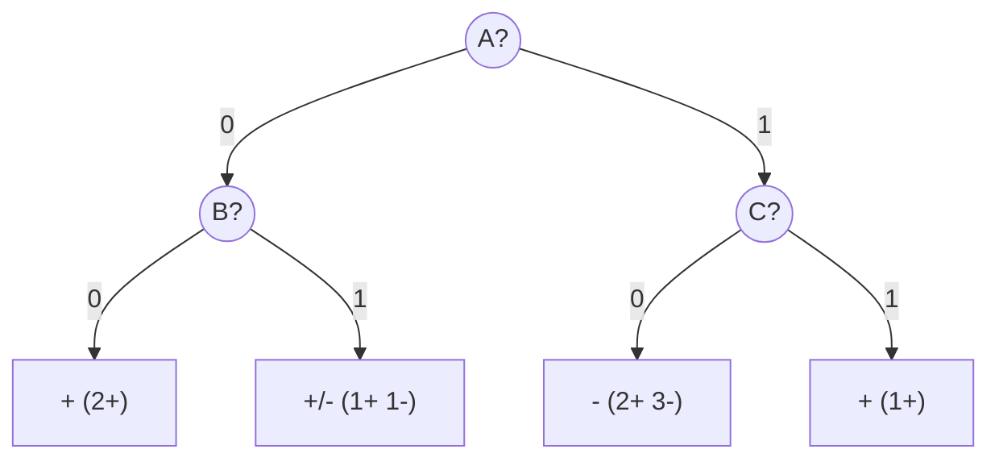
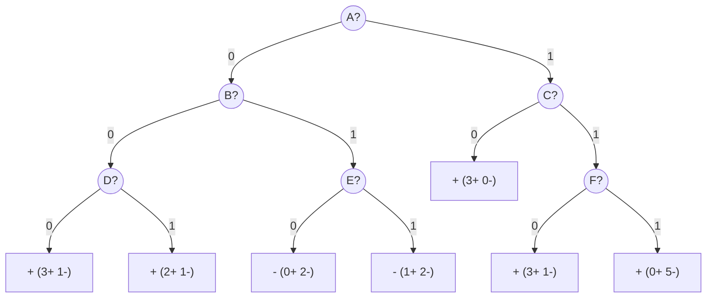
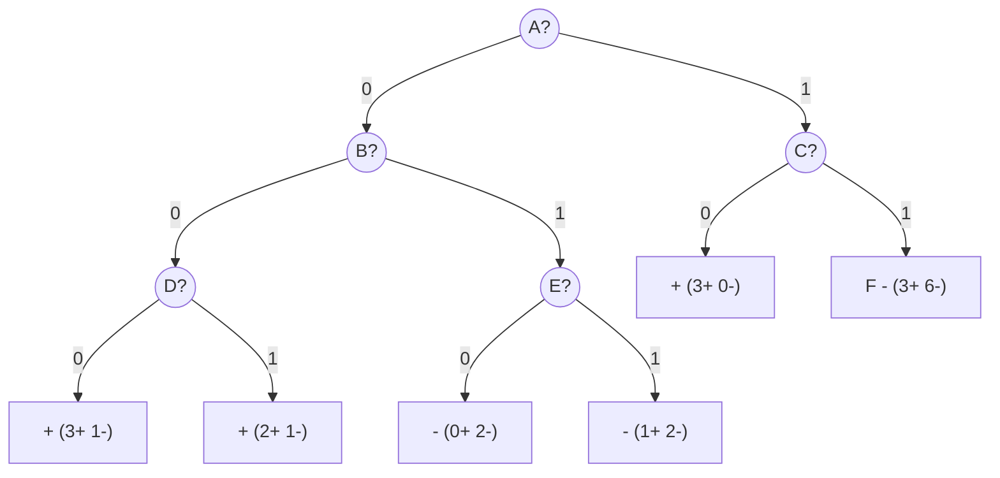
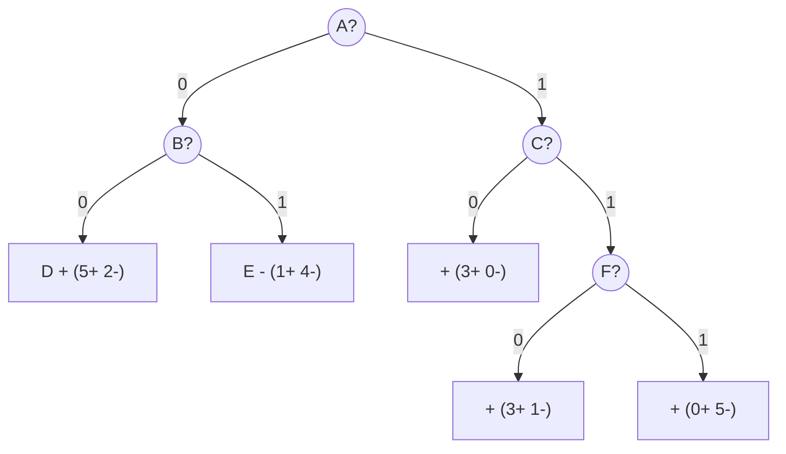
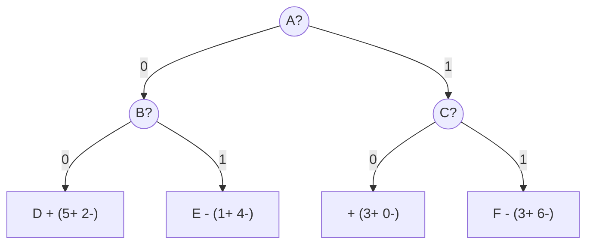

# CS3481 - Tutorial & Exercise

## Tutorial 1 (Data)

(1) Simple Matching Coefficient (SMC):

$$SMC = \frac{f_{11} + f_{00}}{f_{11} + f_{10} + f_{01} + f_{00}}$$

Jaccard Coefficient:

$$J = \frac{f_{11}}{f_{11} + f_{10} + f_{01}}$$

1. Calculate the value of the Simple Matching Coefficient and the Jaccard coefficient for the two vectors x=(1,0,0,0,0,1,1,0) and y=(0,0,1,0,1,0,1,0).
2. What is the main difference between these two measures?

---

Answers:

$$f_{11} = 1, f_{00} = 3, f_{10} = 2, f_{01} = 2$$

$$SMC = \frac{1 + 3}{1 + 2 + 2 + 3} = \frac{4}{8} = 0.5$$

$$J = \frac{1}{1 + 2 + 2} = \frac{1}{5} = 0.2$$

The main difference is that Jaccard coefficient does not consider the cases where both attributes are 0 (i.e., f00) in its calculation, while Simple Matching Coefficient does. This makes Jaccard more suitable for situations where the presence of a feature is more important than its absence.

---

(2)

| Article | economics | market | bank | company | medicine | insurance |
|---------|-----------|--------|------|---------|----------|-----------|
| 1 | 3 | 5 | 2 | - | - | - |
| 2 | 12 | 15 | 10 | 8 | - | - |
| 3 | - | - | - | 5 | 3 | 5 |

Cosine similarity between articles 1 and 2: $S_c(A_1, A_2) = \frac{A_1 \cdot A_2}{||A_1|| \cdot ||A_2||} = 0.920483$

Cosine similarity between articles 2 and 3: $S_c(A_2, A_3) = \frac{A_2 \cdot A_3}{||A_2|| \cdot ||A_3||} = 0.225564$

Observation: Articles 1 and 2 are more similar to each other than articles 2 and 3, as indicated by the higher cosine similarity value.

---

(3)

| Article | Words |
|---------|-------|
| 1 | dollar:1, industry:4, country:2, loan:3, deal:2, government:2, very:6 |
| 2 | machinery:2, labor: 3, market:4, industry:2, government:3, very:5 |
| 3 | job:5, inflation:3, company:2, market:3, country:2, index:3, very:8 |
| 4 | domestic:3, forecast:2, government:1, market:2, sale:3, price:2, very:2 |
| 5 | patient:4, symptom:2, drug:3, health:2, clinic:2, doctor:2, very:5 |
| 6 | pharmaceutical:2, company:3, drug:2, vaccine:1, flu:3, very:3 |
| 7 | death:2, cancer:4, drug:3, government:4, health:3, director:2, very:7 |
| 8 | medical:2, cost:3, government:2, patient:2, health:3, care:1, very:5 |

TF-IDF formula:

$$t_{ij} = \text{tf}_{ij} \times \log_2\left(\frac{N}{\text{df}_j}\right)$$

Where: $\text{tf}_{ij}$ = term frequency of term j in document i, N = total number of documents, $\text{df}_j$ = document frequency of term j.

Apply this transformation to (i) the count of the word “pharmaceutical” in article 6, (ii) the count of the word “government” in article 2, and (iii) the count of the word “very” in article 5. What is your observation? What is the purpose of this transformation?

---

Answers:

(i) $t_{6, \text{pharmaceutical}} = 2 \times \log_2\left(\frac{8}{1}\right) = 6$

(ii) $t_{2, \text{government}} = 3 \times \log_2\left(\frac{8}{5}\right) = 2.034$

(iii) $t_{5, \text{very}} = 5 \times \log_2\left(\frac{8}{8}\right) = 0$

Observation: The term "pharmaceutical" has a high TF-IDF score in article 6, indicating its significance in that document. The term "government" has a moderate score in article 2, reflecting its relevance but also its presence in other documents. The term "very" has a TF-IDF score of 0 in article 5, suggesting it is a common word across all documents and does not contribute to distinguishing the content of the articles.

Purpose: The TF-IDF transformation helps to highlight important words in a document while down-weighting common words that appear frequently across all documents. This allows for better identification of unique and relevant terms that contribute to the meaning of each document.

## Tutorial 2 (Data)

(1) Derive the mathematical relationship between cosine similarity and Euclidean distance when each data object has an L2 length of 1.

---

Answers:

$$\begin{aligned}
D(x, y) &= \sqrt{\sum_{i=1}^{n} (x_i - y_i)^2} \\
&= \sqrt{\sum_{i=1}^{n} (x_i^2 - 2x_i y_i + y_i^2)} \\
&= \sqrt{\sum_{i=1}^{n} x_i^2 + \sum_{i=1}^{n} y_i^2 - 2\sum_{i=1}^{n} x_i y_i} \\
&= \sqrt{||x||^2 + ||y||^2 - 2(x \cdot y)} \\
&= \sqrt{1 + 1 - 2(x \cdot y)} \\
&= \sqrt{2 (1 - \cos(x, y))}
\end{aligned}$$

---

(2) We consider the following similarity measure between two vectors x and y. 

$$S(x, y) = \frac{x \cdot y}{(||x||^2 + ||y||^2 - x \cdot y)}$$

Show that this measure corresponds to the Jaccard coefficient when x and y are binary vectors.

---

Answers:

For binary vectors, the dot product $x \cdot y$ counts the number of dimensions where both vectors have a value of 1 (denoted as $f_{11}$). The term $||x||^2$ counts the number of dimensions where vector x has a value of 1 (denoted as $f_{10} + f_{11}$), and similarly for $||y||^2$ (denoted as $f_{01} + f_{11}$).

So $f_{11} + f_{10} + f_{01} = (f_{10} + f_{11}) + (f_{01} + f_{11}) - f_{11} = ||x||^2 + ||y||^2 - x \cdot y$.

So $$J(x, y) = \frac{f_{11}}{f_{11} + f_{10} + f_{01}} = \frac{x \cdot y}{(||x||^2 + ||y||^2 - x \cdot y)} = S(x, y)$$

---

(3) We consider the following data points: (2, 19), (9, 6), (7, 15), (5, 12).

1. Calculate the covariance matrix of this set of data.
2. Calculate the correlation coefficient between the two attributes.

---

Answers:

$\bar x = \frac{2 + 9 + 7 + 5}{4} = 5.75$, $\bar y = \frac{19 + 6 + 15 + 12}{4} = 13$

$Var(x) = \frac{1}{4-1} ((2-5.75)^2 + (9-5.75)^2 + (7-5.75)^2 + (5-5.75)^2) = 8.9167$

$Var(y) = \frac{1}{4-1} ((19-13)^2 + (6-13)^2 + (15-13)^2 + (12-13)^2) = 30$

$Cov(X, Y) = \frac{1}{4-1} ((2-5.75)(19-13) + (9-5.75)(6-13) + (7-5.75)(15-13) + (5-5.75)(12-13)) = -14$

$$C = \begin{bmatrix}
8.9167 & -14 \\
-14 & 30
\end{bmatrix}$$

Correlation coefficient: $r_{XY} = \frac{Cov(X, Y)}{\sigma_X \sigma_Y} = \frac{-14}{\sqrt{8.9167} \times \sqrt{30}} = -0.856$

## Exercise 1 (Data & Decision Tree)

(1) Discuss whether or not each of the following activities is a data mining task.

1. Computing the total sales of a company.
2. Sorting a student database based on student identification numbers.
3. Predicting the future stock price of a company using historical records.

---

Answers:

1. No, a straightforward aggregation task is at data exploration level.
2. No, sorting is a basic data processing task.
3. Yes, this is a predictive modeling task.

---

(2) We consider a collection of news articles shown in the following table. Each article is represented as a set of word-frequency pairs (w,c), where w is a word and c is the number of times the word appears in the article.

Suppose we apply cluster analysis to group the set of articles based on their respective topics. Suggest a suitable representation format for each article such that the degree of similarity between two articles can be readily compared.

---

Answers:

A suitable representation format for each article is the vector space model, where each article is represented as a vector in a high-dimensional space. Each dimension corresponds to a unique word from the entire collection of articles, and the value in each dimension represents the frequency of that word in the article. This allows for easy computation of similarity measures, such as L2-norm or cosine similarity, between articles based on their vector representations.

---

(3) We consider the problem of predicting whether a loan applicant will default on his/her loan. A data set for this problem is shown in the table in the next page. Each record contains the personal information of a borrower, along with a class label indicating whether the borrower has defaulted on loan payments.

| Applicant No. | Home Owner | Marital Status | Annual Income | Defaulted Borrower |
| --- | --- | --- | --- | --- |
| 1 | Yes | Single | 125K | No |
| 2 | No | Married | 100K | No |
| 3 | No | Single | 70K | Yes |
| 4 | Yes | Married | 120K | No |
| 5 | No | Single | 95K | No |
| 6 | No | Married | 60K | No |
| 7 | Yes | Single | 220K | No |
| 8 | No | Single | 80K | Yes |
| 9 | No | Married | 75K | No |
| 10 | No | Single | 90K | No |

1. Suppose we first focus on the attribute Home Owner. Describe in what way this attribute can help us to determine whether a borrower will default on his/her loan payment or not.
2. Suppose we next focus on the subset of non-home owners. Describe in what way the attribute Marital Status can help us to determine whether a borrower will default or not.
3. Finally, determine how we can make use of the attribute Annual Income to complete the prediction process.

---

Answers:

1. Let $A = \text{Home Owner = Yes}$ and $B = \text{Defaulted Borrower = Yes}$. It can be observed that all home owners (Applicants 1, 4, and 7) did not default on their loans. Therefore, home owners can successfully repay their loans, while more information is needed for non-home owners.
2. Let $C = \text{Marital Status = Single}$ and we only consider non-home owners. Among these, Applicants 3 and 8 (single) defaulted, Applicants 5 and 10 (single) did not default, and Applicants 2, 6, and 9 (married) did not default. Therefore, married non-home owners can successfully repay their loans, while more information is needed for single non-home owners.
3. Let $E = \text{Annual Income < 85K}$. Among Applicants 3, 5, 8, 10, we can observe that Applicants 3 and 8 (with income less than 85K) defaulted, while Applicants 5 and 10 (with income greater than or equal to 85K) did not default. Therefore, if his/her annual income is greater than or equal to 85K, they can successfully repay their loans; if his/her annual income is less than 85K, they cannot successfully repay their loans.

Decision Tree:

## Tutorial 3 (Decision Tree)

(1) Explain why there are $2^{S-1}-1$ ways of creating a binary partition for a nominal attribute with $S$ distinct values.

Answers:

For a nominal attribute with $S$ distinct values, we can think of each value as a unique category. To create a binary partition, we need to decide which categories will go into one group and which will go into the other group.

This gives us $2^S$ possible ways to assign the $S$ categories into two groups (since each category can either be in group 1 or group 2). However, we need to exclude the cases where all categories are in one group and the other group is empty, which accounts for 2 cases (all in group 1 or all in group 2). Additionally, group 1 and group 2 are interchangeable (i.e., swapping the groups does not create a new partition), so we need to divide by 2 to account for this symmetry.

Thus, the number of unique binary partitions is given by:

$$\frac{2^S - 2}{2} = 2^{S-1} - 1$$

(2) We consider the training examples shown in the following table for a binary classification problem.

| Instance | $a_1$ | $a_2$ | $a_3$ | Class |
| --- | --- | --- | --- | --- |
| 1 | T | T | 1 | + |
| 2 | T | T | 6 | + |
| 3 | T | F | 5 | - |
| 4 | F | F | 4 | + |
| 5 | F | T | 7 | - |
| 6 | F | T | 3 | - |
| 7 | F | F | 8 | - |
| 8 | T | F | 7 | + |
| 9 | F | T | 5 | - |

(a) What is the original entropy of this set of training instances?

(b) What are the information gains when $a_1$ and $a_2$ are used for partitioning the training set respectively?

Answers:

(a) The original entropy is :

$$E = -\left(\frac{5}{9} \log_2 \frac{5}{9} + \frac{4}{9} \log_2 \frac{4}{9}\right) = 0.991$$

(b) The new entropy after partitioning by $a_1$ is (T: 3+ 1-, F: 1+ 4-):

$$E_{a_1} = \frac{4}{9} \left(-\frac{3}{4} \log_2 \frac{3}{4} - \frac{1}{4} \log_2 \frac{1}{4}\right) + \frac{5}{9} \left(-\frac{1}{5} \log_2 \frac{1}{5} - \frac{4}{5} \log_2 \frac{4}{5}\right) = 0.762$$

The information gain for $a_1$ is: $$IG_{a_1} = E - E_{a_1} = 0.991 - 0.762 = 0.229$$

The new entropy after partitioning by $a_2$ is (T: 2+ 3-, F: 2+ 2-):

$$E_{a_2} = \frac{5}{9} \left(-\frac{2}{5} \log_2 \frac{2}{5} - \frac{3}{5} \log_2 \frac{3}{5}\right) + \frac{4}{9} \left(-\frac{2}{4} \log_2 \frac{2}{4} - \frac{2}{4} \log_2 \frac{2}{4}\right) = 0.984$$

The information gain for $a_2$ is: $$IG_{a_2} = E - E_{a_2} = 0.991 - 0.984 = 0.007$$

(3)

| Condition | TEMP | HUMID | AIR | Number |
| --- | --- | --- | --- | --- |
| 1 | High | High | Low | Large |
| 2 | High | High | High | Large |
| 3 | Medium | High | Low | Large |
| 4 | Low | Low | Low | Small |
| 5 | Low | Low | High | Large |
| 6 | Medium | Low | Low | Small |
| 7 | Medium | Low | High | Large |
| 8 | Medium | High | High | Large |
| 9 | High | Low | Low | Large |
| 10 | High | Low | High | Large |

Entropy of the original set: $E = -\left(\frac{8}{10} \log_2 \frac{8}{10} + \frac{2}{10} \log_2 \frac{2}{10}\right) = 0.722$

For the root split:

TEMP (High: 4+ 0-, Medium: 3+ 1-, Low: 1+ 1-):

$$IG_T = E - \left[ \frac{4}{10} (0) + \frac{4}{10} \left(-\frac{3}{4} \log_2 \frac{3}{4} - \frac{1}{4} \log_2 \frac{1}{4}\right) + \frac{2}{10} \left(-\frac{1}{2} \log_2 \frac{1}{2} - \frac{1}{2} \log_2 \frac{1}{2}\right) \right] = 0.722 - 0.525 = 0.197$$

HUMID (High: 4+ 0-, Low: 4+ 2-):

$$IG_H = E - \left[ \frac{4}{10} (0) + \frac{6}{10} \left(-\frac{4}{6} \log_2 \frac{4}{6} - \frac{2}{6} \log_2 \frac{2}{6}\right) \right] = 0.722 - 0.551 = 0.171$$

AIR (High: 5+ 0-, Low: 3+ 2-):

$$IG_A = E - \left[ \frac{5}{10} (0) + \frac{5}{10} \left(-\frac{3}{5} \log_2 \frac{3}{5} - \frac{2}{5} \log_2 \frac{2}{5}\right) \right] = 0.722 - 0.485 = 0.237$$

Since $IG_A$ is the highest, we choose AIR as the root node.

$$E_{AIR} = -\left(\frac{3}{5} \log_2 \frac{3}{5} + \frac{2}{5} \log_2 \frac{2}{5}\right) = 0.971$$

(Note: The definiton of "entire set" changes after a split, so the entropy need to be recalculated.)

The high branch is pure. For AIR = Low:

| Condition | TEMP | HUMID | AIR | Number |
| --- | --- | --- | --- | --- |
| 1 | High | High | Low | Large |
| 3 | Medium | High | Low | Large |
| 4 | Low | Low | Low | Small |
| 6 | Medium | Low | Low | Small |
| 9 | High | Low | Low | Large |

TEMP (High: 2+ 0-, Medium: 1+ 1-, Low: 0+ 1-):

$$IG_T = E_{AIR} - \left[ \frac{2}{5} (0) + \frac{2}{5} \left(-\frac{1}{2} \log_2 \frac{1}{2} - \frac{1}{2} \log_2 \frac{1}{2}\right) + \frac{1}{5} (0) \right] = 0.971 - 0.4 = 0.571$$

HUMID (High: 2+ 0-, Low: 1+ 2-):

$$IG_H = E_{AIR} - \left[ \frac{2}{5} (0) + \frac{3}{5} \left(-\frac{1}{3} \log_2 \frac{1}{3} - \frac{2}{3} \log_2 \frac{2}{3}\right) \right] = 0.971 - 0.551 = 0.42$$

Since $IG_T$ is the highest, we choose TEMP as the second node.

High and Small branches are pure. For TEMP = Medium, split by HUMID: High = Large, Low = Small.

The decision tree is shown below:

## Tutorial 4 (Decision Tree)

Continue from Tutorial 3 (2)

(a) Calculate the respective changes in the Gini index value when $a_1$ and $a_2$ are used for partitioning the training set.

The original Gini index is :

$$G = 1 - \left(\frac{5}{9}\right)^2 - \left(\frac{4}{9}\right)^2 = 0.494$$

The new Gini index after partitioning by $a_1$ is (T: 3+ 1-, F: 1+ 4-):

$$G_{a_1} = \frac{4}{9} \left(1 - \left(\frac{3}{4}\right)^2 - \left(\frac{1}{4}\right)^2\right) + \frac{5}{9} \left(1 - \left(\frac{1}{5}\right)^2 - \left(\frac{4}{5}\right)^2\right) = 0.344$$

The change in Gini index for $a_1$ is: $$\Delta G_{a_1} = G - G_{a_1} = 0.494 - 0.344 = 0.150$$

The new Gini index after partitioning by $a_2$ is (T: 2+ 3-, F: 2+ 2-):

$$G_{a_2} = \frac{5}{9} \left(1 - \left(\frac{2}{5}\right)^2 - \left(\frac{3}{5}\right)^2\right) + \frac{4}{9} \left(1 - \left(\frac{2}{4}\right)^2 - \left(\frac{2}{4}\right)^2\right) = 0.489$$

The change in Gini index for $a_2$ is: $$\Delta G_{a_2} = G - G_{a_2} = 0.494 - 0.489 = 0.005$$

(b) Calculate the respective changes in the classification error rate when $a_1$ and $a_2$ are used for partitioning the training set.

The original classification error rate is :

$$E = 1 - \max\left(\frac{5}{9}, \frac{4}{9}\right) = 0.444$$

The new classification error rate after partitioning by $a_1$ is (T: 3+ 1-, F: 1+ 4-):

$$E_{a_1} = \frac{4}{9} \left(1 - \max\left(\frac{3}{4}, \frac{1}{4}\right)\right) + \frac{5}{9} \left(1 - \max\left(\frac{1}{5}, \frac{4}{5}\right)\right) = 0.222$$

The change in classification error rate for $a_1$ is: $$\Delta E_{a_1} = E - E_{a_1} = 0.444 - 0.222 = 0.222$$

The new classification error rate after partitioning by $a_2$ is (T: 2+ 3-, F: 2+ 2-):

$$E_{a_2} = \frac{5}{9} \left(1 - \max\left(\frac{2}{5}, \frac{3}{5}\right)\right) + \frac{4}{9} \left(1 - \max\left(\frac{2}{4}, \frac{2}{4}\right)\right) = 0.444$$

The change in classification error rate for $a_2$ is: $$\Delta E_{a_2} = E - E_{a_2} = 0.444 - 0.444 = 0$$

(c) For $a_3$, compute the information gain for every possible split. What is the best threshold for splitting the set of attribute values?

Splitting at 1.5: (<: 1+ 0-, >: 3+ 5-):

$$E_{1.5} = \frac{1}{9} \left(-\frac{1}{1} \log_2 \frac{1}{1}\right) + \frac{8}{9} \left(-\frac{3}{8} \log_2 \frac{3}{8} - \frac{5}{8} \log_2 \frac{5}{8}\right) = 0.848, IG_{1.5} = 0.143$$

Splitting at 3.5: (<: 1+ 1-, >: 3+ 4-):

$$E_{3.5} = \frac{2}{9} \left(-\frac{1}{2} \log_2 \frac{1}{2} - \frac{1}{2} \log_2 \frac{1}{2}\right) + \frac{7}{9} \left(-\frac{3}{7} \log_2 \frac{3}{7} - \frac{4}{7} \log_2 \frac{4}{7}\right) = 0.989, IG_{3.5} = 0.002$$

Splitting at 4.5: (<: 2+ 1-, >: 2+ 4-):

$$E_{4.5} = \frac{3}{9} \left(-\frac{2}{3} \log_2 \frac{2}{3} - \frac{1}{3} \log_2 \frac{1}{3}\right) + \frac{6}{9} \left(-\frac{2}{6} \log_2 \frac{2}{6} - \frac{4}{6} \log_2 \frac{4}{6}\right) = 0.918, IG_{4.5} = 0.073$$

Splitting at 5.5: (<: 2+ 3-, >: 2+ 2-):

$$E_{5.5} = \frac{5}{9} \left(-\frac{2}{5} \log_2 \frac{2}{5} - \frac{3}{5} \log_2 \frac{3}{5}\right) + \frac{4}{9} \left(-\frac{2}{4} \log_2 \frac{2}{4} - \frac{2}{4} \log_2 \frac{2}{4}\right) = 0.984, IG_{5.5} = 0.007$$

Splitting at 6.5: (<: 3+ 3-, >: 1+ 2-):

$$E_{6.5} = \frac{6}{9} \left(-\frac{3}{6} \log_2 \frac{3}{6} - \frac{3}{6} \log_2 \frac{3}{6}\right) + \frac{3}{9} \left(-\frac{1}{3} \log_2 \frac{1}{3} - \frac{2}{3} \log_2 \frac{2}{3}\right) = 0.973, IG_{6.5} = 0.018$$

Splitting at 7.5: (<: 4+ 4-, >: 0+ 1-):

$$E_{7.5} = \frac{8}{9} \left(-\frac{4}{8} \log_2 \frac{4}{8} - \frac{4}{8} \log_2 \frac{4}{8}\right) + \frac{1}{9} \left(-\frac{1}{1} \log_2 \frac{1}{1}\right) = 0.889, IG_{7.5} = 0.102$$

So the best threshold for splitting the set of attribute values is 1.5.

## Tutorial 5 (Classifier Evaluation)

(1)

| Instance | A | B | C | Class |
| --- | --- | --- | --- | --- |
| 1 | 0 | 0 | 0 | + |
| 2 | 0 | 0 | 1 | + |
| 3 | 0 | 1 | 0 | + |
| 4 | 0 | 1 | 1 | - |
| 5 | 1 | 0 | 0 | + |
| 6 | 1 | 0 | 0 | + |
| 7 | 1 | 1 | 0 | - |
| 8 | 1 | 0 | 1 | + |
| 9 | 1 | 1 | 0 | - |
| 10 | 1 | 1 | 0 | - |

(a) Estimate the generalization error rate of the tree by using the resubstitution estimate.

(b) Estimate the generalization error rate by using a penalty term of 0.5 for each leaf node.

Answers:

- Node A: 0 (3+ 1-), 1 (3+ 3-)
- Node B (A=0): 0 (2+), 1 (1+ 1-)
- Node C (A=1): 0 (2+ 3-), 1 (1+)

So the decision tree can be represented as follows:

(a) The resubstitution estimate means that we use the training error rate to estimate the generalization error rate. The training error rate is :

$$E_{resub} = \frac{3}{10} = 0.3$$

(b) The penalty term for each leaf node is 0.5, and there are 4 leaf nodes in the tree. So the total penalty is $0.5 \times 4 = 2$. The adjusted error rate is :

$$E_{adjusted} = E_{resub} + \frac{2}{10} = 0.3 + 0.2 = 0.5$$

(2)

Suppose a penalty term of 1.5 is assigned to each leaf node.

(a) Estimate the generalization error rate if the sub-tree associated with node F is pruned and replaced with a leaf node.

(b) Estimate the generalization error rate if the sub-trees associated with nodes D and E are pruned and replaced with leaf nodes.

(c) Estimate the generalization error rate if the above operations are performed together.

Answers:

(a) If the sub-tree associated with node F is pruned, the new tree will be:

Total cases in the training set: 24

Number of errors in the new tree: 1 ("3+ 1-") + 1 ("2+ 1-") + 1 ("1+ 2-") + 3 ("3+ 6-") = 6

Number of leaves in the new tree: 6

Error rate after pruning F: $E_{pruneF} = \frac{6}{24} + \frac{1.5 \times 6}{24} = 0.625$

(b) If the sub-trees associated with nodes D and E are pruned, the new tree will be:

Number of errors in the new tree: 2 ("5+ 2-") + 1 ("1+ 4-") + 1 ("3+ 1-") = 4

Number of leaves in the new tree: 5

Error rate after pruning D and E: $E_{pruneDE} = \frac{4}{24} + \frac{1.5 \times 5}{24} = 0.479$

(c) If both operations are performed together, the new tree will be:

Number of errors in the new tree: 2 ("5+ 2-") + 1 ("1+ 4-") + 3 ("3+ 6-") = 6

Number of leaves in the new tree: 4

Error rate after pruning D, E, and F: $E_{pruneDEF} = \frac{6}{24} + \frac{1.5 \times 4}{24} = 0.5$

## Tutorial 6 (Probabilistic Classifier)

(1) For the loan default prediction problem in the lecture notes, verify the class conditional probability values of the categorical attributes Home Owner and Marital Status, and also the sample mean and variance values of the attribute Annual Income for the class Yes.

| Tid | Home Owner | Marital Status | Annual Income | Defaulted Borrower |
| --- | --- | --- | --- | --- |
| 1 | Yes | Single | 125K | No |
| 2 | No | Married | 100K | No |
| 3 | No | Single | 70K | No |
| 4 | Yes | Married | 120K | No |
| 5 | No | Divorced | 95K | Yes |
| 6 | No | Married | 60K | No |
| 7 | Yes | Divorced | 220K | No |
| 8 | No | Single | 85K | Yes |
| 9 | No | Married | 75K | No |
| 10 | No | Single | 90K | Yes |

Answer:

$P(\text{Home Owner = Yes} | \text{Yes}) = \frac{0}{3} = 0$

$P(\text{Home Owner = No} | \text{Yes}) = \frac{3}{3} = 1$

$P(\text{Home Owner = Yes} | \text{No}) = \frac{3}{7}$

$P(\text{Home Owner = No} | \text{No}) = \frac{4}{7}$

$P(\text{Marital Status = Single} | \text{Yes}) = \frac{2}{3}$

$P(\text{Marital Status = Married} | \text{Yes}) = \frac{0}{3} = 0$

$P(\text{Marital Status = Divorced} | \text{Yes}) = \frac{1}{3}$

$P(\text{Marital Status = Single} | \text{No}) = \frac{2}{7}$

$P(\text{Marital Status = Married} | \text{No}) = \frac{4}{7}$

$P(\text{Marital Status = Divorced} | \text{No}) = \frac{1}{7}$

$\bar{x}_\text{Yes} = \frac{95 + 85 + 90}{3} = 90$

$s^2_\text{Yes} = \frac{(95-90)^2 + (85-90)^2 + (90-90)^2}{3-1} = 25$

$s_\text{Yes} = \sqrt{25} = 5$

Note: sample variance is used.

(2) Continue from (1). Predict the class label of a test record: Home Owner = No, Marital Status = Married, Annual Income = 120K.

$\bar{x}_\text{No} = \frac{125 + 100 + 70 + 120 + 60 + 220 + 75}{7} = 110$

$s^2_\text{No} = \frac{(125-110)^2 + (100-110)^2 + (70-110)^2 + (120-110)^2 + (60-110)^2 + (220-110)^2 + (75-110)^2}{7-1} = 2975$

$s_\text{No} = \sqrt{2975} \approx 54.54$

$P(\text{Annual Income} = X) = \frac{1}{\sqrt {2\pi} s} \exp\left(-\frac{(X - \bar{x})^2}{2s^2}\right)$

$P(\text{Annual Income} = 120K | \text{Yes}) = \frac{1}{\sqrt {2\pi} \times 5} \exp\left(-\frac{(120 - 90)^2}{2 \times 25}\right) \approx 1.22 \times 10^{-9}$

$P(\text{Annual Income} = 120K | \text{No}) = \frac{1}{\sqrt {2\pi} \times 54.54} \exp\left(-\frac{(120 - 110)^2}{2 \times 2975}\right) \approx 0.007192$

Prior probabilities: $P(\text{Yes}) = \frac{3}{10} = 0.3$, $P(\text{No}) = \frac{7}{10} = 0.7$

Posterior probabilities:

$P(\text{Yes} | X) = P(\text{Home Owner = No} | \text{Yes}) \times P(\text{Marital Status = Married} | \text{Yes}) \times P(\text{Annual Income} = 120K | \text{Yes}) \times P(\text{Yes}) = 1 \times 0 \times 1.22 \times 10^{-9} \times 0.3 = 0$

$P(\text{No} | X) = P(\text{Home Owner = No} | \text{No}) \times P(\text{Marital Status = Married} | \text{No}) \times P(\text{Annual Income} = 120K | \text{No}) \times P(\text{No}) = \frac{4}{7} \times \frac{4}{7} \times 0.007192 \times 0.7 \approx 0.00229$

Since $P(\text{No}|X) > P(\text{Yes}|X)$, the predicted class label for the test record is No.

(3) 

| Record | A | B | C | Class |
| --- | --- | --- | --- | --- |
| 1 | F | F | F | + |
| 2 | F | F | T | - |
| 3 | F | T | T | - |
| 4 | F | T | T | - |
| 5 | F | F | F | + |
| 6 | T | F | F | + |
| 7 | T | F | T | - |
| 8 | T | F | T | - |
| 9 | T | T | T | + |
| 10 | T | F | T | + |

(a) Estimate the class-conditional probabilities.

(b) Predict the class label for a test example (A=F, B=T, C=F) using the naïve Bayes approach.

Answers:

(a)

$P(A=F|+) = \frac{2}{5}, P(A=T|+) = \frac{3}{5}$

$P(A=F|-) = \frac{3}{5}, P(A=T|-) = \frac{2}{5}$

$P(B=F|+) = \frac{4}{5}, P(B=T|+) = \frac{1}{5}$

$P(B=F|-) = \frac{3}{5}, P(B=T|-) = \frac{2}{5}$

$P(C=F|+) = \frac{3}{5}, P(C=T|+) = \frac{2}{5}$

$P(C=F|-) = 0, P(C=T|-) = 1$

(b)

$P(+|A=F, B=T, C=F) = \frac{P(A=F|+) \times P(B=T|+) \times P(C=F|+) \times P(+)}{P(A=F) \times P(B=T) \times P(C=F)} = \frac{\frac{2}{5} \times \frac{1}{5} \times \frac{3}{5} \times 0.5}{P(A=F) \times P(B=T) \times P(C=F)} = \frac{0.024}{p}$

$P(-|A=F, B=T, C=F) = \frac{P(A=F|-) \times P(B=T|-) \times P(C=F|-) \times P(-)}{P(A=F) \times P(B=T) \times P(C=F)} = \frac{\frac{3}{5} \times \frac{2}{5} \times 0 \times 0.5}{P(A=F) \times P(B=T) \times P(C=F)} = 0$

Since $P(+|A=F, B=T, C=F) > P(-|A=F, B=T, C=F)$, the predicted class label for the test example is +.