# CS4182 Computer Graphics

## 01 Introduction

Definition of Computer Graphics:

The pictorial synthesis of real or imaginary objects from their computer-based 2D/3D models.

- Computer Graphics is from scene description to digital image.
- Computer Vision is the reverse process.

Applications of Computer Graphics:

- Movies and computer animations
- Video games
- Computer-aided design (CAD)
- Simulation (for training, e.g., flight simulators)
- Scientific visualization
- Graphical user interface (GUI)
- Computer art

### Concepts in Computer Graphics

- **Modeling**: The process of creating a 2D/3D representation of objects or scenes.
- **Animation**: Physics-based simulation, natural phenomena, motion capture or animation transfer.
- **Rendering**: Generating images from models, including lighting, shading, and texturing.

**Model**: The mathematical representation of objects or scenes. (Polygonal meshes, splines, subdivision surfaces, implicit surfaces, etc.)

Details:

- **Digital Geometry Processing** (DGP): Use algorithms to manipulate 3D models. (Smoothing, denoising, simplification, parameterization, etc.)
- **3D Acquisition**: Techniques to capture real-world objects or scenes. (3D scanning or depth cameras.)
- Surface Reconstruction: Create 3D models from point clouds.
- **Smoothing and Denosing**: Remove noise while preserving salient features.
- **Simplification**: Reduce the complexity (number of polygons) of a 3D model while preserving its overall shape and appearance.
- **Parameterization**: Map a 3D surface to a 2D domain for texture mapping or remeshing. (example: 3D Earth model + 2D map = texture mapping)
- Morphing: Smoothly transform one shape into another. Interpolation between two shapes. (example: face morphing)
- 3D Shape Registration: Align two or more 3D shapes into a common coordinate system so that they can be compared or combined.
- Motion Capture: Record the movement of objects or people to create realistic animations.
- Animation Transfer: Transfer motion data from one character to another.
- **Photo-Realistic Rendering** / **Non-Photo-Realistic Rendering** (NPR)
- **Neural Rendering**: Use neural networks to generate images from 3D models or other inputs.
- AIGC

Summary of the 3 main components:

- Modeling
    - Input: description of objects and scenes
    - Output: 2D/3D models
    - Techniques: Math
- Rendering
    - Input: 2D/3D models
    - Output: digital images
    - Techniques: Optics, visual perception
- Animation
    - Input: 2D/3D models
    - Output: animated 2D/3D models
    - Techniques: Mechanics, math

## 02 Object Modeling

### Basic Rendering Algorithms

#### Bresenham's Line Algorithm

Draw a straight segment between $(x_0, y_0)$ and $(x_1, y_1)$ on a pixel grid.

```cpp
void Bresenham(int x0, int y0, int x1, int y1) {
    if (x0 > x1) {
        swap(x0, x1);
        swap(y0, y1);
    }
    int dx = x1 - x0;
    int dy = y1 - y0;
    int p = 2 * dy - dx; // initial decision parameter
    int c1 = 2 * dy;
    int c2 = 2 * (dy - dx);
    int x = x0, y = y0;
    setPixel(x, y); // plot the first pixel

    while (x < x1) {
        x++;
        if (p < 0) { // choose E (X+1, Y)
            p += c1;
        } else { // choose NE (X+1, Y+1)
            y++;
            p += c2;
        }
        setPixel(x, y);
    }
}
```

How was this derived?

Assume $y = y_0 + m(x - x_0)$, where $m = \frac{dy}{dx}$ is the slope.

Assume the current pixel is $(X, Y)$, then the next pixel is either $(X+1, Y)$ (E) or $(X+1, Y+1)$ (NE). The actual line passes through $(X+1, Y + m)$.

Their distance to the line is:

- $d_E = (Y + m) - Y = m$
- $d_{NE} = (Y + 1) - (Y + m) = 1 - m$

To compare $m$ and $1 - m$, and to avoid floating-point operations, we multiply both by $dx$:

$m \cdot dx \stackrel{?}{<} (1 - m) \cdot dx$

$dy \stackrel{?}{<} dx - dy$

So the decision parameter is $p = 2dy - dx$. If $p < 0, d_E < d_{NE}$, choose E; otherwise, choose NE.

After choosing E, $(X+2, Y)$ (E) and $(X+2, Y+1)$ (NE) are the next candidates.

- $d_E' = (Y + 2m) - Y = 2m$
- $d_{NE}' = (Y + 1) - (Y + 2m) = 1 - 2m$

$2m \cdot dx \stackrel{?}{<} (1 - 2m) \cdot dx$

$2dy \stackrel{?}{<} dx - 2dy$

So the new decision parameter is $p' = 4dy - 2dx = p + 2dy$. The increment for E is $c_1 = 2dy$.

Similarly, after choosing NE, $(X+2, Y+1)$ (E) and $(X+2, Y+2)$ (NE) are the next candidates.

- $d_E' = (Y + 2m) - (Y + 1) = 2m - 1$
- $d_{NE}' = (Y + 2) - (Y + 2m) = 2 - 2m$

$(2m - 1) \cdot dx \stackrel{?}{<} (2 - 2m) \cdot dx$

$2dy - dx \stackrel{?}{<} 2dx - 2dy$

So the new decision parameter is $p' = 4dy - 4dx = p + 2(dy - dx)$. The increment for NE is $c_2 = 2(dy - dx)$.

---

Note the above code only works for $0 \leq m \leq 1$. To handle all cases, we can add some preprocessing:

```cpp
void Bresenham(int x0, int y0, int x1, int y1) {
    bool steep = abs(y1 - y0) > abs(x1 - x0);
    if (steep) { swap(x0, y0); swap(x1, y1); }
    if (x0 > x1) { swap(x0, x1); swap(y0, y1); }
    int dx = x1 - x0, dy = abs(y1 - y0);
    int p = 2 * dy - dx, c1 = 2 * dy, c2 = 2 * (dy - dx);
    int x = x0, y = y0;
    int ystep = (y0 < y1) ? 1 : -1; // determine the increment direction for y
    steep ? setPixel(y, x) : setPixel(x, y);

    while (x < x1) {
        x++;
        if (p < 0) {
            p += c1;
        } else {
            y += ystep;
            p += c2;
        }
        steep ? setPixel(y, x) : setPixel(x, y);
    }
}
```

#### Bresenham's Circle Algorithm

Draw a circle centered at $(x_c, y_c)$ with radius $r$ on a pixel grid.

```cpp
void PlotCirclePoints(int xc, int yc, int x, int y) {
    setPixel(xc + x, yc + y);
    setPixel(xc - x, yc + y);
    setPixel(xc + x, yc - y);
    setPixel(xc - x, yc - y);
    setPixel(xc + y, yc + x);
    setPixel(xc - y, yc + x);
    setPixel(xc + y, yc - x);
    setPixel(xc - y, yc - x);
}

void BresenhamCircle(int xc, int yc, int r) {
    int x = 0, y = r;
    int p = 3 - 2 * r; // initial decision parameter
    PlotCirclePoints(xc, yc, x, y);
    while (x < y) {
        x++;
        if (p < 0) { // choose E
            p += 4 * x + 6;
        } else { // choose SE
            y--;
            p += 4 * (x - y) + 10;
        }
        PlotCirclePoints(xc, yc, x, y);
    }
}
```

#### Flood Fill Algorithm

Problem: Given a 2D grid of pixels and a starting pixel, fill all connected pixels with the same color as the starting pixel with a new color.

Implementation using DFS:

```cpp
void dfsFill(int x, int y, int targetColor, int newColor) {
    if (x < 0 || x >= width || y < 0 || y >= height) return;
    if (getPixel(x, y) != targetColor) return; // not connected
    if (getPixel(x, y) == newColor) return; // already filled

    setPixel(x, y, newColor);

    // recursively fill neighboring pixels
    dfsFill(x + 1, y, targetColor, newColor);
    dfsFill(x - 1, y, targetColor, newColor);
    dfsFill(x, y + 1, targetColor, newColor);
    dfsFill(x, y - 1, targetColor, newColor);
}

void floodFill(int x, int y, int newColor) {
    int targetColor = getPixel(x, y);
    if (targetColor == newColor) return; // no need to fill
    dfsFill(x, y, targetColor, newColor);
}
```

Implementation using BFS:

```cpp
typedef pair<int, int> pii;

void floodFill(int x, int y, int newColor) {
    int targetColor = getPixel(x, y);
    if (targetColor == newColor) return; // no need to fill

    queue<pii> q;
    q.push({x, y});
    setPixel(x, y, newColor);

    while (!q.empty()) {
        pii p = q.front(); q.pop();
        int cx = p.first, cy = p.second;

        // check 4 neighboring pixels
        vector<pii> directions = {{1, 0}, {-1, 0}, {0, 1}, {0, -1}};
        for (auto dir : directions) {
            int nx = cx + dir.first;
            int ny = cy + dir.second;
            if (nx >= 0 && nx < width && ny >= 0 && ny < height &&
                getPixel(nx, ny) == targetColor) {
                setPixel(nx, ny, newColor);
                q.push({nx, ny});
            }
        }
    }
}
```

### Different Modeling Methods

#### 3D Point Cloud

**3D point cloud** is an unstructured set of points in 3D space, usually obtained from 3D scanning or depth cameras. 

Each point has 3D coordinates $(x, y, z)$ and may have additional attributes like color $(r, g, b)$ or normal vectors $(n_x, n_y, n_z)$.

Main applications: autonomous driving.

Advantages:

- Real-time acquisition
- Connectivity/topology not required

Disadvantages:

- Difficult to perform geometry computations (e.g., surface reconstruction, rendering)
- Time and memory consuming

**Structured point cloud**: Organized in a 2D grid, e.g., depth images from RGB-D cameras.

#### Polygon Meshes

A **polygon mesh** is a collection of vertices $V$, edges $E$, and faces $F$ that defines the shape of a 3D object.

- Each vertex must belong to at least one edge.
- Each edge connects two vertices and belongs to at least one face.
- An edge is **boundary** if it belongs to only one face.

Each face can be assigned an orientation (clockwise or counter-clockwise) based on the order of its vertices.

By convention, the vertices of a face are ordered counter-clockwise when viewed from outside the object. This allows us to compute the face normal using the right-hand rule.

A mesh is **orientable** if all faces can be consistently oriented, i.e. all CCW or all CW, such that each edge has opposite orientations in its two adjacent faces.

Not every mesh is orientable. For example, a Möbius strip or a Klein bottle is non-orientable.

Data structures for polygon meshes: **face-vertex mesh**, **winged-edge mesh**, **half-edge mesh**, etc.

Face-vertex mesh:

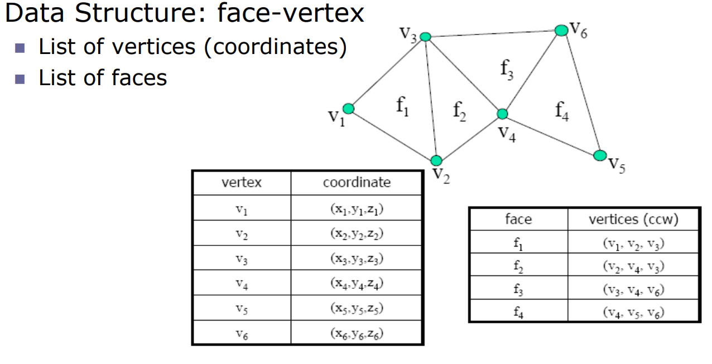

Advantages:

- Arbitrary geometry/topology
- Sharp features
- Adaptive refinement (local details)
- Efficient rendering

Disadvantages:

- Difficult to perform smooth deformations
- Edges between polygons may become visible (faceting artifacts)

#### Subdivision Surfaces

A **subdivision surface** is a smooth surface generated by recursively refining a coarse polygon mesh, i.e. by adding the vertices and faces.

Resemble with subdivision curves: use corner cutting to add more control points and make the curve smoother.

**Catmull-Clark subdivision**: Generalizes bicubic B-splines to arbitrary topology. Each face is subdivided into 4 smaller faces.

#### Implicit Surfaces

An **implicit surface** is defined by a function $f(x, y, z) = 0$. The surface consists of all points $(x, y, z)$ that satisfy this equation.

Resemble with implicit curves (binary implicit functions): $f(x, y) = 0$.

**Signed distance function** (SDF): A special type of implicit function where the value of $f(x, y, z)$ represents the shortest distance from the point $(x, y, z)$ to the surface. The sign indicates whether the point is inside (negative) or outside (positive) the surface.

i.e.

- $f(x, y, z) < 0$: inside the surface
- $f(x, y, z) = 0$: on the surface
- $f(x, y, z) > 0$: outside the surface

Advantages:

- Easy to check if a point is inside or outside the surface

Disadvantages:

- Not easy to generate a point on the surface
- Not easy to piecewise join points to form a continuous, smooth surface
- Not easy to represent any bounded portion

#### Parametric Surfaces

A **parametric surface** is defined by a mapping from a 2D parameter domain $(s, t)$ to 3D space $(x, y, z)$:

$$\mathbf{P}(s, t) = (x(s, t), y(s, t), z(s, t))$$

Example: a sphere can be parameterized as:

$$\mathbf{P}(s, t) = (r \cos s \cos t, r \sin s \cos t, r \sin t)$$

where $s \in [0, 2\pi]$ and $t \in [-\frac{\pi}{2}, \frac{\pi}{2}]$.

Advantages:

- Smooth and continuous surfaces

Disadvantages:

- Computationally expensive

#### Voxel Representation

A **voxel** (volume pixel) is a cubic element that represents a value on a regular grid in 3D space, similar to how a pixel represents a value on a 2D grid.

Each voxel has a position $(i, j, k)$ in the grid and may have additional attributes like color $(r, g, b, a)$ or density.

Advantages:

- Simple to render

Disadvantages:

- Expensive to do scaling and deformation
- Consumes a lot of memory

**Octree**: A tree with non-leaf nodes having 8 children. Each node represents a cubic volume in 3D space. If all voxels of a node have the same value, we can merge them into a single voxel to save memory. Otherwise, we subdivide the node into 8 children.

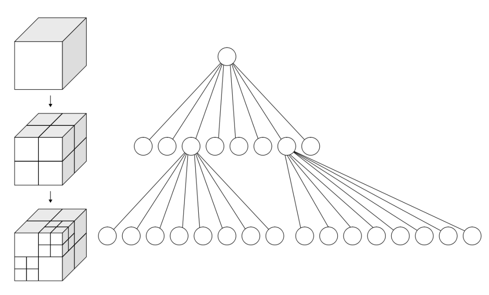

#### Constructive Solid Geometry (CSG)

**Constructive Solid Geometry** (CSG) is a modeling technique that uses Boolean operations to combine simple 3D shapes (primitives, e.g., cubes, spheres, cylinders) to create complex objects.

The main Boolean operations are:

- **Union** ($A \cup B$)
- **Intersection** ($A \cap B$)
- **Difference** ($A - B$)

Advantages:

- Complex objects can be created from simple primitives
- Easy to undo operations

Disadvantages:

- A small modification may require a complete re-evaluation of the CSG tree

#### Fractals

A **fractal** can be generated by recursively applying the same transformation to an initial shape.

$x = f(\ldots f(x))$

### Summary of Modeling Methods

(by DeepSeek)

| 建模方法 | 基础原理 | 优点 | 缺点 | 典型应用场景 |
| :--- | :--- | :--- | :--- | :--- |
| **多边形网格** | 用无数顶点、边和面（通常是三角形或四边形）来定义3D物体的形状和表面。 | - **行业标准**，兼容所有软件和硬件<br>- 计算效率高，易于渲染和变形<br>- 直观易懂，易于编辑 | - 难以描述光滑的有机形体（会有棱角）<br>- 高精度需要大量面数，占用资源<br>- 布尔运算容易出错 | **最通用**的游戏、影视动画、虚拟现实、实时可视化 |
| **细分曲面** | 通过定义一套粗糙的“控制网格”并通过细分规则不断迭代，生成光滑曲面。 | - 兼具有机光滑性和网格的易编辑性<br>- 内存效率高（用低模控制高模）<br>- 无缝建模，无破面问题 | - 算法稍复杂<br>- 对硬表面建模控制力稍弱 | 角色建模、生物有机体、工业设计（汽车、家电） |
| **参数曲面** | 用数学方程（如NURBS）定义的精确曲面，由控制点调整曲线，曲线生成曲面。 | - **数学精度极高**，表面完美光滑<br>- 易于编辑，修改控制点即可改变形状<br>- 存储效率高 | - 模型必须由**完整的曲面拼合**，难以处理复杂拓扑<br>- 最终需转换为网格以供渲染<br>- 学习曲线较陡 | **工业设计与制造**（CAD）、汽车、航空航天、船舶设计 |
| **隐式曲面** | 不直接定义表面，而是用一个数学函数 `f(x,y,z)=0` 来定义空间点与模型的关系（内外/表面）。 | - 描述拓扑变化（如融合、分裂）**非常简单自然**<br>- 易于进行布尔运算<br>- 原生支持碰撞检测<br>- 无限分辨率 | - 难以直接编辑具体形态<br>- 可视化/渲染前需进行多边形化（如Marching Cubes算法）<br>- 不直观 | **程序化建模**、医学成像（MRI重建）、流体模拟、SCULPTING雕刻 |
| **体素** | 将3D空间划分为均匀的**三维像素**网格，每个体素存储材料等信息。 | - **结构简单统一**，易于模拟<br>- 天然表示内部结构<br>- 布尔运算和CSG操作极其简单 | - **内存消耗巨大**（精度翻倍，内存增8倍）<br>- 缺乏细节，边缘呈锯齿状（除非分辨率极高）<br>- 不适用于角色动画 | 医学成像（CT扫描）、科学可视化（地质、流体）、**Minecraft类游戏**、体素艺术 |
| **构造实体几何** | 通过布尔运算（并集、交集、差集）将简单的**图元**（立方体、圆柱体、球体等）组合成复杂模型。 | - **参数化**极强，修改尺寸即可改变模型<br>- 概念简单，易于创建精确的机械结构<br>- 历史记录清晰，可逆 | - 难以创建有机或复杂的自由形态<br>- 布尔运算容易产生错误（如破面）<br>- 模型复杂度有限 | **机械工程、CAD设计**、硬表面建模（零件、家具、建筑） |
| **3D点云** | 物体表面的一组无序的**数据点**的集合，每个点包含XYZ坐标，可能还有颜色、法线等信息。 | - 是**3D扫描数据的原始形式**，获取简单<br>- 可表示任何复杂几何形状<br>- 数据直观 | - **不是实体模型**，无法直接用于渲染或模拟<br>- 数据量大且无序<br>- 缺乏拓扑和表面信息 | **3D扫描**、逆向工程、激光雷达、环境测绘、文化遗产保护 |

## 03 Geometric Transformations

### 2D Transformations

- **Translation**: Move an object by a vector $(t_x, t_y)$.
    - $(x', y') = (x + t_x, y + t_y)$
- **Scaling**: Scale an object by factors $(s_x, s_y)$ along the $x$ and $y$ axes.
    - Origin scaling: $(x', y') = (s_x x, s_y y)$
    - With respect to a point $(x_c, y_c)$: $(x', y') = (s_x (x - x_c) + x_c, s_y (y - y_c) + y_c)$
    - A scaling is uniform if $s_x = s_y$. Only uniform scaling preserves the shape of an object.
- **Rotation**: Rotate an object by an angle $\theta$ around the origin or a point $(x_c, y_c)$.
    - Origin rotation:
      $$
      \begin{bmatrix}x'\\y'\end{bmatrix} = \begin{bmatrix}\cos \theta & -\sin \theta\\\sin \theta & \cos \theta\end{bmatrix} \begin{bmatrix}x\\y\end{bmatrix} = \begin{bmatrix}x \cos \theta - y \sin \theta\\x \sin \theta + y \cos \theta\end{bmatrix}
      $$
    - With respect to a point $(x_c, y_c)$: see below for matrix form.
- **Shearing**: Shear an object by factors $(sh_x, sh_y)$ along the $x$ and $y$ axes.
    - $(x', y') = (x + sh_x y, y + sh_y x)$
    - With respect to a point $(x_c, y_c)$: $(x', y') = (x + sh_x (y - y_c) + x_c, y + sh_y (x - x_c) + y_c)$

Note: reflection is a special case of scaling with a negative scale factor.

With homogeneous coordinates, the transformations can be represented as matrix multiplications:

- **Translation**:
  $$T(t_x, t_y) = \begin{bmatrix}1 & 0 & t_x\\0 & 1 & t_y\\0 & 0 & 1\end{bmatrix}$$
- **Origin Scaling**:
  $$S(s_x, s_y) = \begin{bmatrix}s_x & 0 & 0\\0 & s_y & 0\\0 & 0 & 1\end{bmatrix}$$
- **Origin Rotation**:
  $$R(\theta) = \begin{bmatrix}\cos \theta & -\sin \theta & 0\\\sin \theta & \cos \theta & 0\\0 & 0 & 1\end{bmatrix}$$
- **Origin Shearing**:
  $$H(sh_x, sh_y) = \begin{bmatrix}1 & sh_x & 0\\sh_y & 1 & 0\\0 & 0 & 1\end{bmatrix}$$

Transformation matrices can be combined by matrix multiplication. For example, to rotate an object $P$ around a point $(x_c, y_c)$:

$$P' = T(x_c, y_c) R(\theta) T(-x_c, -y_c) P$$

**Order of the matrix multiplication matters!** The rightmost matrix is applied first.

Example: Rotate the object by $30^\circ$ then scale it by $2$ along both axes, with respect to the point $(1, 1)$.

$$
P' = T(1, 1) S(2, 2) R(\frac{\pi}{6}) T(-1, -1) P
$$

Order of operations:

- $T(-1, -1)$: The point $(1, 1)$ temporarily becomes the origin.
- $R(\frac{\pi}{6})$: Rotate around the origin.
- $S(2, 2)$: Scale around the origin.
- $T(1, 1)$: Move back to the original position.

### 3D Transformations

- **Translation**: Move an object by a vector $(t_x, t_y, t_z)$.
    - $(x', y', z') = (x + t_x, y + t_y, z + t_z)$
- **Scaling**: Scale an object by factors $(s_x, s_y, s_z)$ along the $x$, $y$, and $z$ axes.
    - Origin scaling: $(x', y', z') = (s_x x, s_y y, s_z z)$
- **Rotation**: Rotate an object by an angle $\theta$ around one of the principal axes ($x$, $y$, or $z$) or an arbitrary axis.
    - Rotation around the $x$-axis:
      $$
      \begin{bmatrix}x'\\y'\\z'\end{bmatrix} = \begin{bmatrix}1 & 0 & 0\\0 & \cos \theta & -\sin \theta\\0 & \sin \theta & \cos \theta\end{bmatrix} \begin{bmatrix}x\\y\\z\end{bmatrix}
      $$
    - Rotation around the $y$-axis:
      $$
      \begin{bmatrix}x'\\y'\\z'\end{bmatrix} = \begin{bmatrix}\cos \theta & 0 & \sin \theta\\0 & 1 & 0\\-\sin \theta & 0 & \cos \theta\end{bmatrix} \begin{bmatrix}x\\y\\z\end{bmatrix}
      $$
    - Rotation around the $z$-axis:
      $$
      \begin{bmatrix}x'\\y'\\z'\end{bmatrix} = \begin{bmatrix}\cos \theta & -\sin \theta & 0\\\sin \theta & \cos \theta & 0\\0 & 0 & 1\end{bmatrix} \begin{bmatrix}x\\y\\z\end{bmatrix}
      $$
    - Unlike 2D rotation, **3D rotations are not commutative**. The order of rotations matters.

Rotation direction is defined as the counterclockwise rotation when looking along the positive axis towards the origin (right-hand rule).

- Rotating around the $z$-axis is in the $+x \rightarrow +y$ direction.
- Rotating around the $x$-axis is in the $+y \rightarrow +z$ direction.
- Rotating around the $y$-axis is in the $+z \rightarrow +x$ direction.

### Decomposing 3D Rotations

Example: Rotate $90^\circ$ around an axis passing from $(0, 1, 1)$ to $(2, 1, 1)$.

1. Translate the axis to pass through the origin: $T(0, -1, -1)$.
2. Rotate $90^\circ$ around the $x$-axis: $R_x(\frac{\pi}{2})$.
3. Translate back: $T(0, 1, 1)$.

$$P' = T(0, 1, 1) R_x(\frac{\pi}{2}) T(0, -1, -1) P$$

$$M = \begin{bmatrix}1 & 0 & 0 & 0\\0 & 1 & 0 & 1\\0 & 0 & 1 & 1\\0 & 0 & 0 & 1\end{bmatrix} \begin{bmatrix}1 & 0 & 0 & 0\\0 & 0 & -1 & 0\\0 & 1 & 0 & 0\\0 & 0 & 0 & 1\end{bmatrix} \begin{bmatrix}1 & 0 & 0 & 0\\0 & 1 & 0 & -1\\0 & 0 & 1 & -1\\0 & 0 & 0 & 1\end{bmatrix}$$

Example 2: Rotate $30^\circ$ around an axis passing from $(1, 1, 0)$ to $(1, 2, 1)$.

1. Translate the axis to pass through the origin: $T(-1, -1, 0)$.
2. The unit vector of the axis is $\mathbf{u} = (0, \frac{1}{\sqrt{2}}, \frac{1}{\sqrt{2}})$. Since it is already in the $yz$-plane, we only need to rotate it around the $x$-axis to align it with the $z$-axis. The angle is $\alpha = 45^\circ$: $R_x(\frac{\pi}{4})$.
3. Rotate $30^\circ$ around the $z$-axis: $R_z(\frac{\pi}{6})$.
4. Undo the rotation around the $x$-axis: $R_x(-\frac{\pi}{4})$.
5. Translate back: $T(1, 1, 0)$.

$$P' = T(1, 1, 0) R_x(-\frac{\pi}{4}) R_z(\frac{\pi}{6}) R_x(\frac{\pi}{4}) T(-1, -1, 0) P$$

### General 3D Rotation

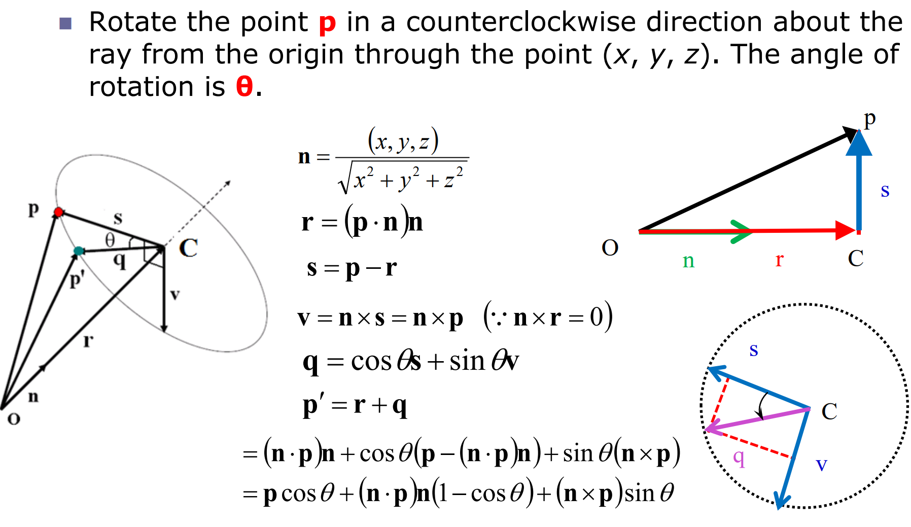

Rotate the point $\mathbf{p}$ about the ray from the origin through the point $(x, y, z)$ by an angle $\theta$.

$\mathbf{n} = \frac{(x, y, z)}{\sqrt{x^2 + y^2 + z^2}}$ (unit vector of the axis)

$\mathbf{r} = (\mathbf{n} \cdot \mathbf{p}) \mathbf{n}$ (projection of $\mathbf{p}$ onto $\mathbf{n}$. $\overrightarrow{OC}$ in the figure)

$\mathbf{s} = \mathbf{p} - \mathbf{r}$ (the in-plane component of $\mathbf{p}$ perpendicular to $\mathbf{n}$. $\overrightarrow{CP}$ in the figure)

$\mathbf{v} = \mathbf{n} \times \mathbf{s} = \mathbf{n} \times \mathbf{p}$ (vector perpendicular to both $\mathbf{n}$ and $\mathbf{s}$, in the rotation plane. Note $\mathbf{n} \times \mathbf{r} = 0$)

$\mathbf{q} = \mathbf{s} \cos \theta + \mathbf{v} \sin \theta$ (the in-plane component of the rotated point. $\overrightarrow{CP'}$ in the figure)

$$
\begin{aligned}
\mathbf{p'} &= \mathbf{r} + \mathbf{q} \\
&= (\mathbf{n} \cdot \mathbf{p}) \mathbf{n} + (\mathbf{p} - (\mathbf{n} \cdot \mathbf{p}) \mathbf{n}) \cos \theta + (\mathbf{n} \times \mathbf{p}) \sin \theta \\
&= \mathbf{p} \cos \theta + (\mathbf{n} \cdot \mathbf{p}) \mathbf{n} (1 - \cos \theta) + (\mathbf{n} \times \mathbf{p}) \sin \theta
\end{aligned}
$$

Recall that cross product $\mathbf{a} \times \mathbf{b}$ can be represented as a matrix multiplication: 

$\mathbf{a} \times \mathbf{b} = [\mathbf{a}]_\times \mathbf{b} = \begin{bmatrix}0 & -a_z & a_y\\a_z & 0 & -a_x\\-a_y & a_x & 0\end{bmatrix} \begin{bmatrix}b_x\\b_y\\b_z\end{bmatrix}$.

Denote $\mathbf{M} = [\mathbf{n}]_\times = \frac{1}{\sqrt{x^2 + y^2 + z^2}} \begin{bmatrix}0 & -z & y\\z & 0 & -x\\-y & x & 0\end{bmatrix}$.

Then $R(\theta, x, y, z) = I + \sin \theta \mathbf{M} + (1 - \cos \theta) \mathbf{M}^2$.

Proof:

$$
\begin{aligned}
\mathbf{Rp} &= \mathbf{p} + \sin \theta \mathbf{M} \mathbf{p} + (1 - \cos \theta) \mathbf{M}^2 \mathbf{p} \\
&= \mathbf{p} + \sin \theta (\mathbf{n} \times \mathbf{p}) + (1 - \cos \theta) (\mathbf{n} \times (\mathbf{n} \times \mathbf{p})) \\
&= \mathbf{p} + \sin \theta (\mathbf{n} \times \mathbf{p}) + (1 - \cos \theta) ((\mathbf{n} \cdot \mathbf{p}) \mathbf{n} - (\mathbf{n} \cdot \mathbf{n}) \mathbf{p}) \\
&= \mathbf{p} + \sin \theta (\mathbf{n} \times \mathbf{p}) + (1 - \cos \theta) ((\mathbf{n} \cdot \mathbf{p}) \mathbf{n} - 1 \cdot \mathbf{p}) \\
&= \mathbf{p} \cos \theta + \sin \theta (\mathbf{n} \times \mathbf{p}) + (1 - \cos \theta) (\mathbf{n} \cdot \mathbf{p}) \mathbf{n}
\end{aligned}
$$

Assume we have normalized axis vector $\mathbf{n} = (x, y, z)$, then

$$
R(\theta, x, y, z) = \begin{bmatrix}\cos \theta + (1 - \cos \theta) x^2 & (1 - \cos \theta) xy - z \sin \theta & (1 - \cos \theta) xz + y \sin \theta\\(1 - \cos \theta) yx + z \sin \theta & \cos \theta + (1 - \cos \theta) y^2 & (1 - \cos \theta) yz - x \sin \theta\\(1 - \cos \theta) zx - y \sin \theta & (1 - \cos \theta) zy + x \sin \theta & \cos \theta + (1 - \cos \theta) z^2\end{bmatrix}  
$$

This is also known as **Rodrigues' rotation formula**.

## 04 Projection and Clipping

**Center of Projection (COP)**: The point where all projection lines converge.

- **Parallel Projection**: All projection lines are parallel. The COP is at infinity.
    - **Orthographic Projection**: The projection lines are perpendicular to the projection plane.
    - **Oblique Projection**: Not orthogonal to the projection plane.
- **Perspective Projection**: All projection lines converge at a finite COP.

**Homogeneous Coordinates**: A system that uses an extra dimension to represent points in projective space. A 3D point $(x, y, z)$ is represented as $(x, y, z, w)$ in homogeneous coordinates, where $w \neq 0$. The Cartesian coordinates can be obtained by dividing by $w$: $(\frac{x}{w}, \frac{y}{w}, \frac{z}{w})$.

### Parallel Projection

Parallel projection matrix:

$$
\begin{bmatrix}x'\\y'\\z'\\1\end{bmatrix} = \begin{bmatrix}1 & 0 & 0 & 0\\0 & 1 & 0 & 0\\0 & 0 & 0 & d\\0 & 0 & 0 & 1\end{bmatrix} \begin{bmatrix}x\\y\\z\\1\end{bmatrix}
$$

Explanation: a 3D point $(x, y, z)$ is projected onto the plane $z = d$ along the direction of the $z$-axis.

In parallel projection, **depth information is lost** since $z'$ is constant.

### Perspective Projection

**Vanishing Point**: The point where parallel lines appear to converge in a perspective projection.

- **One-point perspective**: One vanishing point (e.g., looking down a straight road).
    - The projection plane is parallel to TWO principal axes, say $x$ and $y$ axes.
    - All elements parallel to the $z$-plane remain parallel in the projection.
    - All elements parallel to the $z$-axis converge to a single vanishing point.
- **Two-point perspective**: Two vanishing points (e.g., looking at the corner of a building).
    - The projection plane is parallel to ONE principal axis, say $y$ axis.
    - All elements parallel to the $y$-plane remain parallel in the projection.
    - All elements parallel to the $x$-axis converge to a single vanishing point.
    - All elements parallel to the $z$-axis converge to another vanishing point.
- **Three-point perspective**: Three vanishing points (e.g., looking up at a tall building).
    - The projection plane is NOT parallel to any principal axis.
    - Each set of elements parallel to the $x$-, $y$-, and $z$-axes converge to their own vanishing points.

In photography, perspective gives the impression of 3D depth and distance in an image.

- Close objects look larger, distant objects look smaller.
- Parallel lines appear to converge at vanishing points.
- If a line is parallel to the projection plane, the effect is called **scaling**, otherwise it is called **foreshortening**.

Perspective projection matrix:

$$
\begin{bmatrix}x'\\y'\\z'\\1\end{bmatrix} = \frac{d}{z} \begin{bmatrix}x\\y\\z\\z/d\end{bmatrix} =\frac{d}{z} \begin{bmatrix}1 & 0 & 0 & 0\\0 & 1 & 0 & 0\\0 & 0 & 1 & 0\\0 & 0 & \frac{1}{d} & 0\end{bmatrix} \begin{bmatrix}x\\y\\z\\1\end{bmatrix}
$$

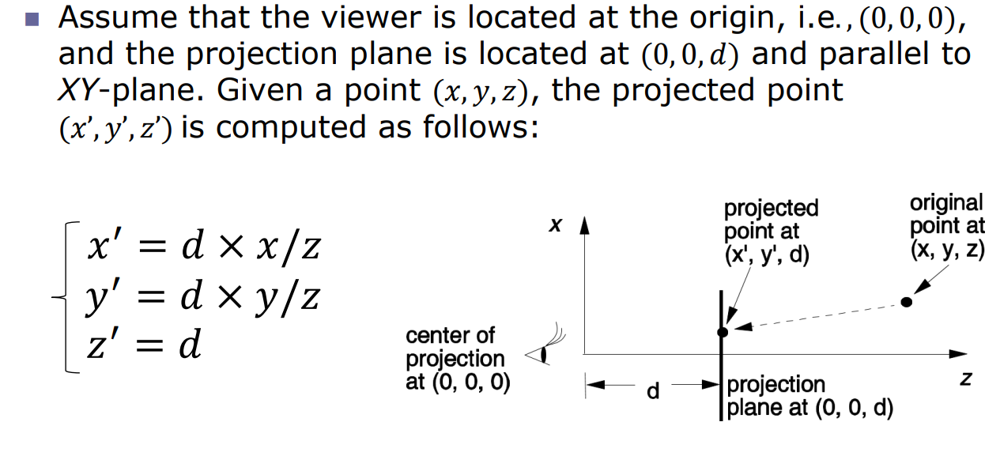

| | Parallel Projection | Perspective Projection |
| :---: | :---: | :---: |
| Realism | Less realistic for no foreshadowing | More realistic, works like human vision |
| Parallel Lines | Remain parallel | Converge at vanishing points |
| Angle Preservation | Only preserves faces parallel to the projection plane | Same |

### Clipping

Clipping is the process to determine the portion of an object lying inside (or outside) a specified region, called the **clipping window** (2D) or **clipping volume** (3D).

#### Clipping Lines Against a Rectangular Window

**Cohen-Sutherland Line Clipping Algorithm**: A divide-and-conquer algorithm to clip a line segment against a rectangular clipping window.

Each endpoint of the line segment is assigned a 4-bit region code based on its position relative to the clipping window.

| Bit | Position | Condition |
| :---: | :---: | :---: |
| 1 | Left | $x < x_{min}$ |
| 2 | Right | $x > x_{max}$ |
| 3 | Bottom | $y < y_{min}$ |
| 4 | Top | $y > y_{max}$ |

The algorithm proceeds as follows:

- **Trivial accept**: If both endpoints have a region code of 0000, the line segment is completely inside the clipping window and is accepted.
- **Trivial reject**: If the bitwise AND of the region codes of both endpoints is not 0000, the line segment is completely outside the clipping window and is rejected.
- Otherwise, the line segment is partially inside the clipping window. The algorithm selects one endpoint that is outside the clipping window and calculates the intersection point with the clipping window boundary. The endpoint is then replaced with this intersection point, and its region code is updated. The process is repeated until the line segment is either accepted or rejected.

```python
def cohen_sutherland_clip(window, lines):
    # window = (x_min, y_min, x_max, y_max)
    # lines = [(x0, y0, x1, y1), ...]
    def compute_code(x, y):
        code = 0
        if x < window[0]:   # L
            code |= 1
        elif x > window[2]: # R
            code |= 2
        if y < window[1]:   # B
            code |= 4
        elif y > window[3]: # T
            code |= 8
        return code

    def clip_line(x0, y0, x1, y1):
        code0 = compute_code(x0, y0)
        code1 = compute_code(x1, y1)
        while True:
            if code0 == 0 and code1 == 0:  # Trivial accept
                return (x0, y0, x1, y1)
            elif code0 & code1 != 0:  # Trivial reject
                return None
            else:  # Partially inside
                if code0 != 0:
                    code_out = code0
                else:
                    code_out = code1
                # Find intersection point
                if code_out & 1: # L
                    x = window[0]
                    y = y0 + (y1 - y0) * (window[0] - x0) / (x1 - x0)
                elif code_out & 2: # R
                    x = window[2]
                    y = y0 + (y1 - y0) * (window[2] - x0) / (x1 - x0)
                elif code_out & 4: # B
                    y = window[1]
                    x = x0 + (x1 - x0) * (window[1] - y0) / (y1 - y0)
                elif code_out & 8: # T
                    y = window[3]
                    x = x0 + (x1 - x0) * (window[3] - y0) / (y1 - y0)
                # Replace outside point with intersection point
                if code_out == code0:
                    x0, y0 = x, y
                    code0 = compute_code(x0, y0)
                else:
                    x1, y1 = x, y
                    code1 = compute_code(x1, y1)

    clipped_lines = []
    for (x0, y0, x1, y1) in lines:
        clipped_line = clip_line(x0, y0, x1, y1)
        if clipped_line:
            clipped_lines.append(clipped_line)
    return clipped_lines
```

#### Clipping Polygons Against a Rectangular Window

**Sutherland-Hodgman Polygon Clipping Algorithm**: An algorithm to clip a polygon against a rectangular clipping window by processing each edge of the clipping window in sequence.

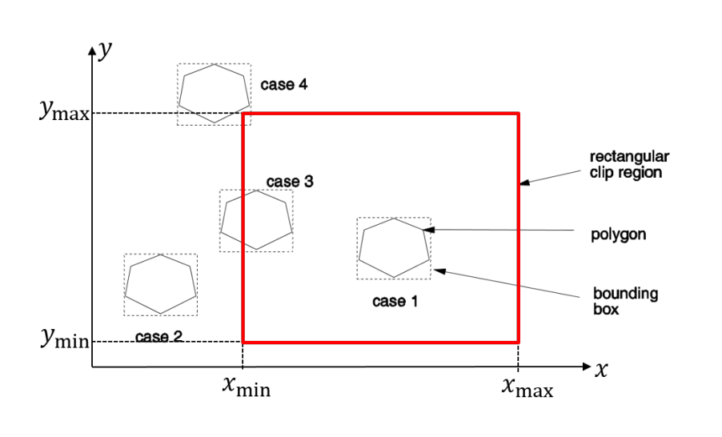

Steps:

1. Draw the bounding box of the polygon. Bounding box is an axis-aligned rectangle that completely contains the polygon.
2. If the bounding box is completely inside the clipping window, accept the polygon.
3. If the bounding box is completely outside the clipping window, reject the polygon.
4. Otherwise, check each vertex of the polygon:
    - Mark the first and the next vertex as "inside" or "outside" the clipping window.
    - If one vertex is inside and the next is outside, compute the intersection point with the clipping window boundary and mark it as "synthetic"; use it as the next vertex.
    - Go to the next vertex and repeat until all vertices are processed.
    - Remove all "outside" vertices; the remaining "inside" and "synthetic" vertices form the clipped polygon.

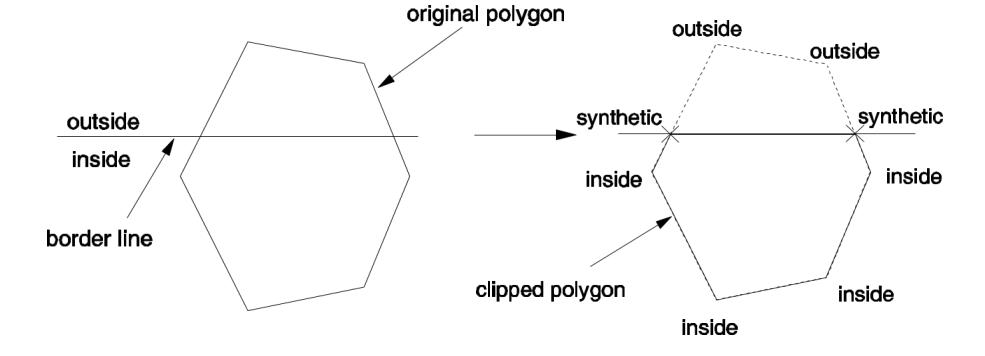

```python
def sutherland_hodgman_clip(polygon, window):
    # polygon = [(x0, y0), (x1, y1), ...]
    # window = (x_min, y_min, x_max, y_max)
    def inside(p, edge):
        if edge == 0: # L
            return p[0] >= window[0]
        elif edge == 1: # R
            return p[0] <= window[2]
        elif edge == 2: # B
            return p[1] >= window[1]
        elif edge == 3: # T
            return p[1] <= window[3]
    
    def compute_intersection(p1, p2, edge):
        if edge == 0: # L
            x = window[0]
            y = p1[1] + (p2[1] - p1[1]) * (window[0] - p1[0]) / (p2[0] - p1[0])
        elif edge == 1: # R
            x = window[2]
            y = p1[1] + (p2[1] - p1[1]) * (window[2] - p1[0]) / (p2[0] - p1[0])
        elif edge == 2: # B
            y = window[1]
            x = p1[0] + (p2[0] - p1[0]) * (window[1] - p1[1]) / (p2[1] - p1[1])
        elif edge == 3: # T
            y = window[3]
            x = p1[0] + (p2[0] - p1[0]) * (window[3] - p1[1]) / (p2[1] - p1[1])
        return (x, y)
    
    input_polygon = polygon
    output_polygon = []

    for edge in range(4): # L, R, B, T
        output_polygon = []
        if not input_polygon:
            break
        pre = input_polygon[-1]
        for curr in input_polygon:
            if inside(curr, edge):
                if inside(pre, edge):
                    output_polygon.append(curr)
                else:
                    inter = compute_intersection(pre, curr, edge)
                    output_polygon.append(inter)
                    output_polygon.append(curr)
            else:
                if inside(pre, edge):
                    inter = compute_intersection(pre, curr, edge)
                    output_polygon.append(inter)
            pre = curr
        input_polygon = output_polygon
    return output_polygon
```

Special cases to consider:

- If the polygon completely contains the clipping window, the output polygon will be the input polygon. Because no vertices are processed, the output polygon remains unchanged.

#### Clipping Lines Against a 3D Rectangular Volume

Extend Cohen-Sutherland algorithm to 3D. Each endpoint has a 6-bit region code:

- $t_1 = 1$ if $x < x_{min}$ (left)
- $t_2 = 1$ if $x > x_{max}$ (right)
- $t_3 = 1$ if $y < y_{min}$ (bottom)
- $t_4 = 1$ if $y > y_{max}$ (top)
- $t_5 = 1$ if $z < z_{min}$ (near)
- $t_6 = 1$ if $z > z_{max}$ (far)

The implementation is similar to the 2D case.

```python
if code_out & 1: # L
    x = window[0]
    t = (x - x0) / (x1 - x0)
    y = y0 + t * (y1 - y0)
    z = z0 + t * (z1 - z0)
... # similarly for R, B, T, N, F
```

#### Clipping Lines Against a Circular Clipping Window

**Liang-Barsky Line Clipping Algorithm**.

Use parametric representation of the line segment:

$$\mathbf{P}(t) = (x_0 + t \Delta x, y_0 + t \Delta y), \quad t \in [0, 1]$$

where $\Delta x = x_1 - x_0$ and $\Delta y = y_1 - y_0$.

The line segment is inside the circular clipping window if:

$$\|\mathbf{P}(t) - \mathbf{C}\| \leq r, \quad t \in [0, 1]$$

where $\mathbf{C} = (x_c, y_c)$ is the center of the circle and $r$ is the radius.

Expanding the inequality:

$$(x_0 + t \Delta x - x_c)^2 + (y_0 + t \Delta y - y_c)^2 \leq r^2$$

Expanding and rearranging gives a quadratic inequality in $t$:

$$At^2 + Bt + C \leq 0$$

where
$$A = (\Delta x)^2 + (\Delta y)^2$$
$$B = 2((x_0 - x_c)\Delta x + (y_0 - y_c)\Delta y)$$
$$C = (x_0 - x_c)^2 + (y_0 - y_c)^2 - r^2$$

Solve the quadratic equation $At^2 + Bt + C = 0$ to find the intersection points.

Three possible cases:

- If the discriminant $D = B^2 - 4AC < 0$, the line segment is completely outside the circle and is rejected.
- If $D = 0$, the line segment is tangent to the circle and intersects at one point. Check if this point lies within $t \in [0, 1]$.
- If $D > 0$, the line segment intersects the circle at two points. Compute $t_1$ and $t_2$. The clipped segment is between $\max(0, t_1)$ and $\min(1, t_2)$.

```python
def liang_barsky_clip(line, circle):
    # line = (x0, y0, x1, y1)
    # circle = (xc, yc, r)
    x0, y0, x1, y1 = line
    xc, yc, r = circle
    dx = x1 - x0
    dy = y1 - y0

    A = dx * dx + dy * dy
    B = 2 * ((x0 - xc) * dx + (y0 - yc) * dy)
    C = (x0 - xc) ** 2 + (y0 - yc) ** 2 - r * r

    D = B * B - 4 * A * C
    if D < 0:
        return None  # No intersection
    elif D == 0:
        t = -B / (2 * A)
        if 0 <= t <= 1:
            xi, yi = x0 + t * dx, y0 + t * dy
            return (xi, yi, xi, yi)  # Tangent point
        else:
            return None  # Tangent point outside segment
    else:
        sqrtD = D ** 0.5
        t1, t2 = (-B - sqrtD) / (2 * A), (-B + sqrtD) / (2 * A)
        t_min, t_max = max(0, min(t1, t2)), min(1, max(t1, t2))
        if t_min > t_max:
            return None  # No valid segment
        xi0, yi0 = x0 + t_min * dx, y0 + t_min * dy
        xi1, yi1 = x0 + t_max * dx, y0 + t_max * dy
        return (xi0, yi0, xi1, yi1)  # Clipped segment
```

#### Clipping Polygons Against a Circular Clipping Window

The idea is similar to the Sutherland-Hodgman algorithm.

```python
def clip_polygon_circle(polygon, circle):
    # polygon = [(x0, y0), (x1, y1), ...]
    # circle = (xc, yc, r)
    xc, yc, r = circle

    def inside(p):
        return (p[0] - xc) ** 2 + (p[1] - yc) ** 2 <= r * r

    def compute_intersection(p1, p2):
        line = (p1[0], p1[1], p2[0], p2[1])
        clipped_line = liang_barsky_clip(line, circle)
        if clipped_line:
            return (clipped_line[0], clipped_line[1])  # Return first intersection point
        return None
    
    ... # (rest of the implementation is similar to Sutherland-Hodgman)
```

## 05 Hidden Surface Removal and Shading

**Hidden Surface Removal**: Algorithms to determine which surfaces (or parts of surfaces) are visible from a certain viewpoint.

Two main categories:

- **Object space methods**: Determine which 3D objects are in front of others before projection.
    - Examples: Back-face culling, BSP trees, Octrees.
- **Image space methods**: Determine what color is used at each pixel after projection onto the 2D view plane.
    - Examples: Z-buffering, Painter's algorithm.

### Back-Face Culling

3D objects are made of polygons. A polygon is a back face if its normal vector points away from the viewpoint.

For each polygon face $f$, compute the vector from the viewpoint $\mathbf{V}$ to a point on the face $\mathbf{P}$: $\mathbf{VP} = \mathbf{P} - \mathbf{V}$.

- Invisible if $\mathbf{N} \cdot \mathbf{VP} \geq 0$
- Visible if $\mathbf{N} \cdot \mathbf{VP} < 0$

where $\mathbf{N}$ is the normal vector of the face.

$\mathbf{N}$ can be computed using the cross product of two edges of the polygon:

$\mathbf{N} = (\mathbf{V}_1 - \mathbf{V}_0) \times (\mathbf{V}_2 - \mathbf{V}_0)$

where $\mathbf{V}_0$, $\mathbf{V}_1$, and $\mathbf{V}_2$ are three vertices of the polygon.

Advantages:

- Simple and fast. Time complexity is $O(n)$ for $n$ polygons.

Disadvantages:

- Only works for closed, convex objects. For concave polyhedral, some back faces may be visible.

```python
def back_face_culling(polygons, viewpoint):
    # polygons = [[(x0, y0, z0), (x1, y1, z1), (x2, y2, z2)], ...]
    # viewpoint = (vx, vy, vz)
    visible_polygons = []
    
    V = np.array(viewpoint)
    for poly in polygons:
        V0, V1, V2 = np.array(poly[0]), np.array(poly[1]), np.array(poly[2])
        N = np.cross(V1 - V0, V2 - V0)  # Normal vector
        VP = V0 - V  # Vector from viewpoint to a point on the face
        if np.dot(N, VP) < 0:  # Visible
            visible_polygons.append(poly)
    return visible_polygons
```

### Depth Sorting (Painter's Algorithm)

Sort polygons by their depth (distance from the viewpoint) and draw them from farthest to nearest.

A frame buffer is used to store the color of each pixel. When drawing a nearer polygon, it overwrites the color of the pixel in the frame buffer.

```python
def painter_algorithm(polygons, viewpoint, canvas):
    V = np.array(viewpoint)
    
    def polygon_depth(poly):
        centroid = np.mean(np.array(poly), axis=0)
        return np.linalg.norm(centroid - V)  # Distance from viewpoint to centroid
    
    sorted_polygons = sorted(polygons, key=polygon_depth, reverse=True)
    
    for poly in sorted_polygons:
        canvas.draw_polygon(poly)
    canvas.display()
```

Time complexity: $O(n \log n)$ for sorting $n$ polygons.

Advantages:

- Simple to implement.

Disadvantages:

- Cannot handle cyclic overlaps (A in front of B, B in front of C, C in front of A).

### Z-Buffering

2 buffers: depth buffer (Z-buffer) and color buffer (frame buffer).

Depth buffer stores the depth value (distance from the viewpoint) of the visible surface at each pixel. Also used to determine the nearest surface at each pixel.

1. Initialize the depth buffer with infinity and the color buffer with the background color.
2. Surfaces are rendered one at a time in any order.
3. For each pixel covered by the surface, compute its depth value $z$.
4. If $z$ is less than the current value in the depth buffer, update both the depth buffer and the color buffer at that pixel.

```python
def z_buffering(polygons, viewpoint, canvas):
    width, height = canvas.size
    depth_buffer = np.full((width, height), np.inf)
    color_buffer = np.full((width, height, 3), canvas.background_color)
    
    for poly in polygons:
        for pixel in canvas.get_covered_pixels(poly):
            x, y = pixel
            z = compute_depth_at_pixel(poly, x, y, viewpoint)
            if z < depth_buffer[x, y]:
                depth_buffer[x, y] = z
                color_buffer[x, y] = poly.color
    
    canvas.set_pixels(color_buffer)
    canvas.display()
```

Advantages:

- Always produces correct results for any arrangement of polygons.
- The most widely used hidden surface removal technique.

Disadvantages:

- Incurs additional memory overhead for the depth buffer. However as $n$ gets larger, the overhead becomes negligible.
- Slower than the Painter's algorithm due to per-pixel depth comparisons. But again, Z-buffering scales better with scene complexity.

### Illumination Models

There are two main types of light sources:

- **Spotlight**: Emits light from a single point in a specific direction. Light beams are parallel.
- **Area light**: Emits light from a finite surface area, casting soft shadows.

An **illumination model** (lighting model) determines the color of a surface point by simulating some physical properties of light. Phong Illumination Model includes three components:

#### Ambient Reflection

$$I_a = k_a \ast I_c$$

where ambient light intensity $I_c$ is the same in all directions, and $k_a$ is the ambient reflection coefficient.

#### Diffuse Reflection

Because of the roughness of the surface, an incoming parallel light beam is scattered equally in all directions.

According to Lambert's cosine law, the intensity of the reflected light is proportional to the cosine of the angle $\theta$ between the light direction $\mathbf{L}$ and the surface normal $\mathbf{N}$.

$$I_d = k_d \ast I_L \ast \cos \theta = k_d \ast I_L \ast (\mathbf{N} \cdot \mathbf{L})$$

where $k_d$ is the diffuse reflection coefficient and $I_L$ is the intensity of the incoming light.

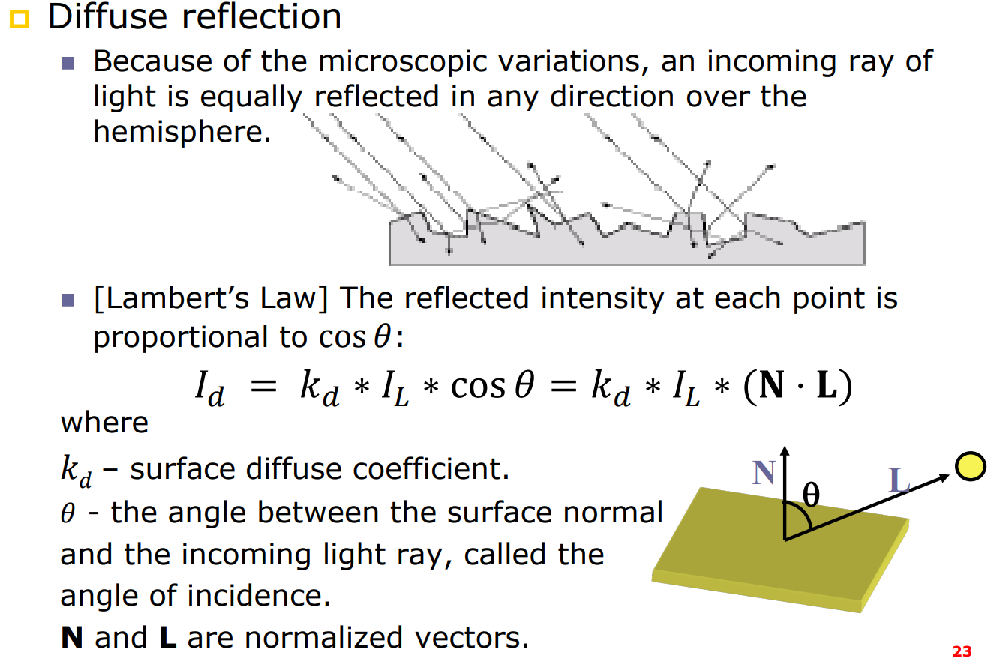

#### Specular Reflection

Specular reflection is the mirror-like reflection of light from a surface.

Assume the surface is perfectly smooth, the angle of incidence equals the angle of reflection. At the reflection direction $\mathbf{R}$, the intensity of the reflected light is the highest.

However, the surface is non-ideal, so parts of the light are reflected in directions close to $\mathbf{R}$. There will still be highlights in directions close to $\mathbf{R}$, and the intensity decreases as the angle $\alpha$ between the view direction $\mathbf{V}$ and the reflection direction $\mathbf{R}$ increases.

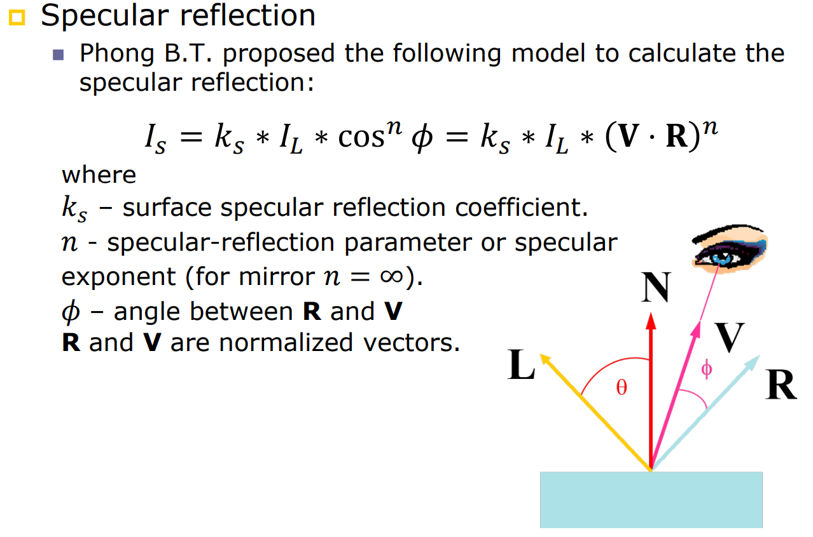

$$I_s = k_s \ast I_L \ast \cos^n \phi = k_s \ast I_L \ast (\mathbf{R} \cdot \mathbf{V})^n$$

where $k_s$ is the specular reflection coefficien and $n$ is the shininess coefficient (the larger $n$ is, the smaller and sharper the highlight will be. For ideal mirror, $n = \infty$).

In Phong model, combine Ambient, Diffuse, and Specular components:

$$I = I_a + \sum_{i=1}^{m} (I_{d,i}+I_{s,i})$$

where $m$ is the number of light sources.

### Shading Method

A **shading method** (surface rendering method) use the color calculated from the illumination model to determine the pixel colors for all projected positions in a scene.

#### Flat Shading

For each polygon, compute the color at one point (usually the centroid) using the illumination model, and fill the entire polygon with that color.

Advantages:

- Simple and fast.

Disadvantages:

- Only very coarse reflection. Good for far away light/viewer or the surface is small.
- Main issue: Intensity discontinuity between adjacent polygons.

#### Smooth Shading

It is necessary to compute vertex normals for smooth shading.

**Gouraud Shading**: The intensity is computed at each vertex using the illumination model, and then interpolated across the polygon.

1. Approximate vertex normal $\mathbf{N}_v$ by averaging the normals of all faces sharing that vertex:

$\mathbf{N}_v = \frac{\sum_{i=1}^{k} \mathbf{N}_i}{\|\sum_{i=1}^{k} \mathbf{N}_i\|}$

2. Linearly interpolate the vertex intensities across the polygon.

Given point $P$ inside the triangle $ABC$, find the scanline intersections $L$ and $R$ with the triangle edges $AB$ and $CB$ respectively.

$\alpha = \frac{\|AL\|}{\|AB\|}, \quad \beta = \frac{\|CR\|}{\|CB\|}, \quad \gamma = \frac{\|LP\|}{\|LR\|}$

$I_L = (1-\alpha) I_A + \alpha I_B, \quad I_R = (1-\beta) I_C + \beta I_B, \quad I_P = (1-\gamma) I_L + \gamma I_R$

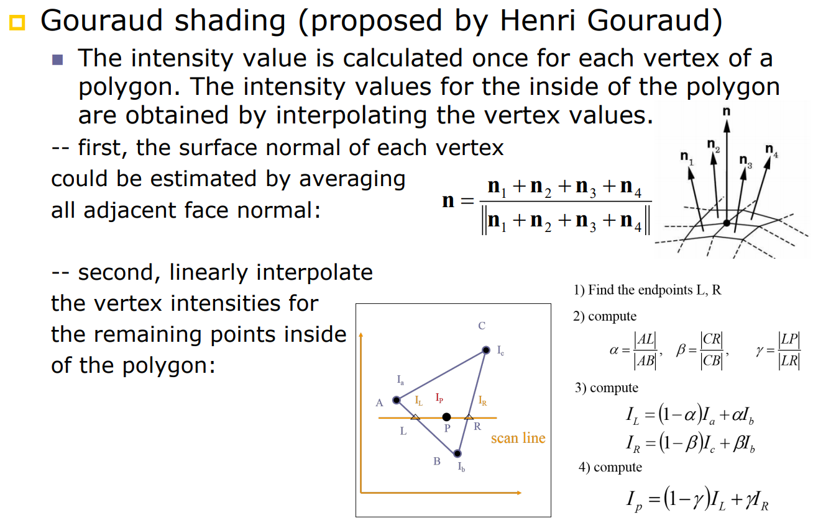

```python
def gouraud_shading(v_pos, v_norm, v_color, l_pos, l_col, viewer,
    k_a=0.1, k_d=0.7, k_s=0.2, shininess=10):
    # Input shape: (3, 3), (3, 3), (3, 3), (3,), (3,), (3,)

    def phong_lighting(pos, norm, color):
        I_a = k_a * l_col

        N = norm / np.linalg.norm(norm)
        L = l_pos - pos # Light direction
        L = L / np.linalg.norm(L)
        diff = max(np.dot(N, L), 0)
        I_d = k_d * l_col * diff

        V = viewer - pos # View direction
        V = V / np.linalg.norm(V)
        R = 2 * np.dot(N, L) * N - L # Reflection direction
        spec = np.power(max(np.dot(R, V), 0), shininess)
        I_s = k_s * l_col * spec

        I = I_a + I_d + I_s
        return np.clip(I * color, 0, 1)
    
    # shaded color at each vertex
    v_shaded = np.array([phong_lighting(v_pos[i], v_norm[i], v_color[i]) for i in range(3)])

    def interpolate_color(alpha, beta, gamma):
        return alpha * v_shaded[0] + beta * v_shaded[1] + gamma * v_shaded[2]
    
    return v_shaded, interpolate_color
```

Advantages:

- Smoother appearance than flat shading.
- Most used shading method in practice.

Disadvantages:

- Misses specular highlights if they do not fall on a vertex.

**Phong Shading**: The normal vector instead of the intensity is interpolated across the polygon, and the intensity is computed at each pixel using the illumination model.

```python
def phong_shading(v_pos, v_norm, v_color, l_pos, l_col, viewer,
    k_a=0.1, k_d=0.7, k_s=0.2, shininess=10):

    def phong_lighting(pos, norm, color):
        pass # same as above
    
    def interpolate_normal(alpha, beta, gamma):
        norm = alpha * v_norm[0] + beta * v_norm[1] + gamma * v_norm[2]
        return norm / np.linalg.norm(norm)
    
    def interpolate_color(alpha, beta, gamma):
        pos = alpha * v_pos[0] + beta * v_pos[1] + gamma * v_pos[2]
        norm = interpolate_normal(alpha, beta, gamma)
        color = alpha * v_color[0] + beta * v_color[1] + gamma * v_color[2]
        return phong_lighting(pos, norm, color)
    
    return interpolate_normal, interpolate_color
```

Advantages:

- More accurate representation of specular highlights.

Disadvantages:

- More computationally expensive than Gouraud shading.

## 06 The Rendering Pipeline

1. Input object models
2. World coordinate transformation
3. Perspective transformation
4. Back-face removal
5. Clipping
6. Rasterization
7. Hidden surface removal & shading
8. Output image

(1) Input object models

The most common 3D object representation is the polygonal mesh, which consists of vertices, edges, and faces (usually triangles or quads).

(2) World coordinate transformation

Perform translations $T$, scalings $S$, and rotations $R$ to position the objects in the world coordinate system.

(3) Perspective transformation

Two types: perspective projection (does not retain depth information; $x' = d \times x/z$, $y' = d \times y/z$, $z' = d$) and orthographic projection (retains depth information; $x' = d \times x/z$, $y' = d \times y/z$, $z' = z$).


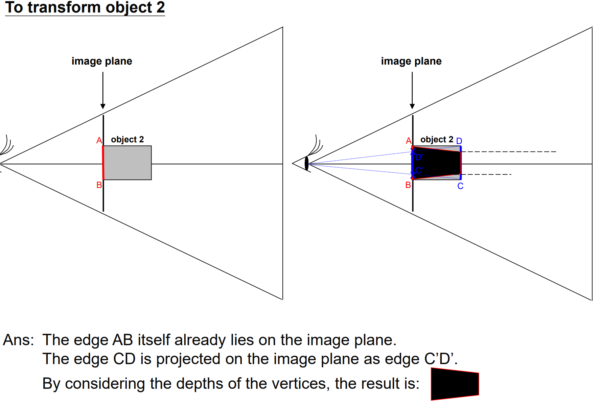

(4) Back-face removal

Back-face culling: visible if $\mathbf{N} \cdot \mathbf{VP} < 0$ where $\mathbf{N}$ is the normal vector of the face and $\mathbf{VP}$ is the vector from the viewpoint to a point on the face.

After perspective transformation, the projection becomes parallel, so we can simplify the test to $\mathbf{N_Z} < 0$ where $\mathbf{N_Z}$ is the $z$-component of the normal vector.

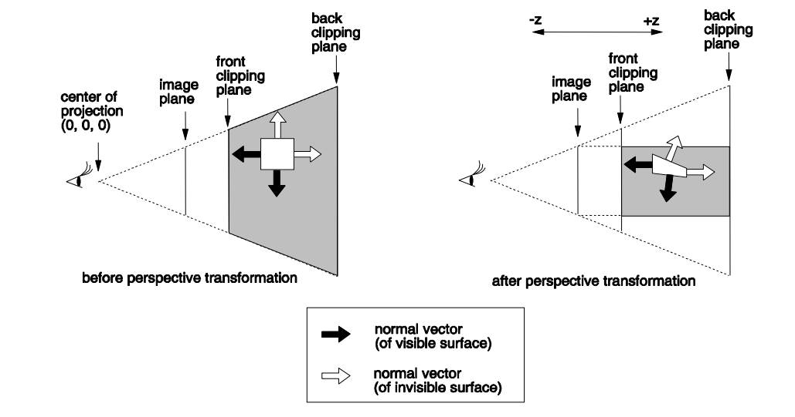

(5) Clipping

After perspective transformation, the viewing volume becomes a frustum (truncated pyramid). We can perform clipping against the six planes of the frustum:

$x=-A, x=A, y=-B, y=B, z=d, z=C$

where $A = d \tan(\theta_x/2)$, $B = d \tan(\theta_y/2)$, and $C$ is the far clipping plane distance.

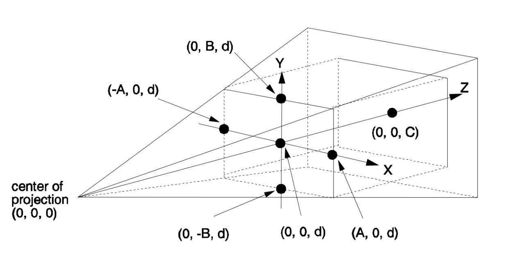

(6) Rasterization

Convert the projected objects into pixels on the 2D screen.

Denote a triangle $v_1 (x_1, y_1)$, $v_2 (x_2, y_2)$, $v_3 (x_3, y_3)$. Vertices are ordered counter-clockwise.

For rasterization, its segments define three half-planes: $E_i(x,y) = a_i x + b_i y + c_i$.

$(x, y)$ is inside the triangle if and only if $\forall i, E_i(x,y) \geq 0$.

Where:
$$
\begin{align*}
E_i(x, y) \geq 0 \iff \mathbf{v_i v_{i+1}} \times \mathbf{v_ip} \geq 0\\
(x_{i+1} - x_i, y_{i+1} - y_i) \times (x - x_i, y - y_i) \geq 0\\
(x_{i+1} - x_i) y - (x_{i+1} - x_i) y_i - (y_{i+1} - y_i) x + (y_{i+1} - y_i) x_i \geq 0\\
(y_i - y_{i+1}) x + (x_{i+1} - x_i) y + (y_{i+1}x_i - x_{i+1}y_i) \geq 0
\end{align*}
$$

Example: $v_1 (1, 3)$, $v_2 (4, 1)$, $v_3 (2, 5)$

$\mathbf{v_1v_2} \times \mathbf{v_1p} = (3, -2) \times (x-1, y-3) = 2x + 3y - 11 \geq 0$

$\mathbf{v_2v_3} \times \mathbf{v_2p} = (-2, 4) \times (x-4, y-1) = -4x -2y + 18 \geq 0$

$\mathbf{v_3v_1} \times \mathbf{v_3p} = (-1, -2) \times (x-2, y-5) = 2x -y + 1 \geq 0$

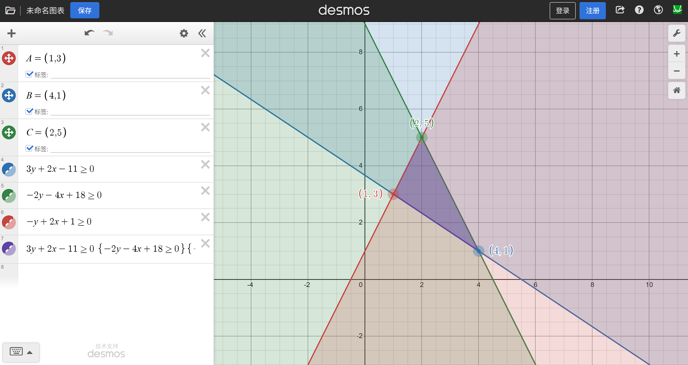

Test if a triangle is given in counter-clockwise order:

$$
\text{Area} = \frac{1}{2} \begin{vmatrix} x_1 & y_1 & 1 \\ x_2 & y_2 & 1 \\ x_3 & y_3 & 1 \end{vmatrix} = \frac{1}{2} [x_1(y_2 - y_3) + x_2(y_3 - y_1) + x_3(y_1 - y_2)] > 0
$$

Example: $v_1 (1, 3)$, $v_2 (4, 1)$, $v_3 (2, 5)$

$$
\text{Area} = \frac{1}{2} \begin{vmatrix} 1 & 3 & 1 \\ 4 & 1 & 1 \\ 2 & 5 & 1 \end{vmatrix} = \frac{1}{2} [1(1 - 5) + 4(5 - 3) + 2(3 - 1)] = 4 > 0
$$

(7) Hidden surface removal & shading

Depth sorting use a frame buffer to draw polygons from farthest to nearest; Z-buffering use a depth buffer to keep track of the nearest surface at each pixel.

Gouraud shading computes normal at each vertex and interpolates color across the polygon; Phong shading interpolates normal across the polygon and computes color at each pixel.

## 07 Ray Tracing and Radiosity

There are two rendering approaches:

- Geometry-based rendering (rasterization): Project 3D objects onto a 2D view plane and determine pixel colors based on visible surfaces. This is the traditional rendering pipeline. However, it is hard to compute accurate shadows, reflections, and refractions. It cannot handle the scattering between objects.
- Pixel-based rendering: Ray-tracing generates an image by tracing the flow of rays in a scene, **in a backward manner from the eye to the light sources**.

Details:

1. For each pixel $(x, y)$ on the image plane, generate a primary ray from the centre of projection (eye) through the pixel into the scene.
2. Find the first object that the ray intersects. If no intersection, set pixel color to background color.
3. If the object is located between a particular light source and the eye, the intersection point is in shadow and does not contribute to the pixel color.
4. Reflect the ray at the intersection point to generate secondary rays (reflection ray + refraction ray if surface is transparent). Recursively trace these rays to compute their contributions to the pixel color.
5. Repeat steps 2-4 until a maximum recursion depth is reached or the contribution becomes negligible.
6. Combine the contributions from all rays to determine the final pixel color.


$C_p = r_1 C_1 + r_1 r_2 C_2 + \cdots$

where $C_p$ is the pixel color, $C_i$ is the color contribution from the $i$-th ray, and $r_i$ is the reflection/refraction coefficient at each intersection.

Advantages:

- It considers direct specular & diffuse reflections as well as indirect specular reflections.
- It considers light refraction and shadowing.

Disadvantages:

- It is computationally expensive due to many intersection tests and color calculations.
- It does not handle diffuse inter-reflections well.

### Ray Tracing Acceleration

Goal: reduce the number of ray-object intersection tests.

**Bounding volumes**: Enclose complex objects within simple geometric shapes (e.g., Axis-Aligned Bounding Boxes = AABBs, Oriented Bounding Boxes = OBBs). First test ray against the bounding volume; if no intersection, skip testing against the enclosed object.

**Space subdivision**: Divide the 3D space into a grid of cells (voxels). Each cell contains a list of objects that intersect it. When tracing a ray, only test against objects in the cells that the ray passes through.

### Radiosity

Radiosity is the radiant flux leaving (emitted and reflected by) a surface per unit area.

$$B_i = E_i + \rho_i \sum_{j \in \text{patches}} L_{i \leftarrow j}$$

$$L_{i \leftarrow j} = F_{i \leftarrow j} B_j$$

$$F_{i \leftarrow j} = \frac{1}{A_i} \int_{A_i} \int_{A_j} \frac{\cos \theta_i \cos \theta_j}{\pi r^2} V_{i,j} dA_j dA_i$$

where:

- $B_i$: radiosity (W/m²), $E_i$: emitted energy (W/m²), $\rho_i$: reflectivity of patch $i$ (0 to 1)
- $L_{i \leftarrow j}$: radiance from patch $j$ to patch $i$ (W/m²)
- $F_{i \leftarrow j}$: form factor from patch $j$ to patch $i$ (0 to 1) = % of energy leaving patch $j$ that arrives at patch $i$
- $A_i$, $A_j$: areas of patches $i$ and $j$ (m²)
- $V_{i,j}$: visibility between patches $i$ and $j$ (1 if visible, 0 if occluded)

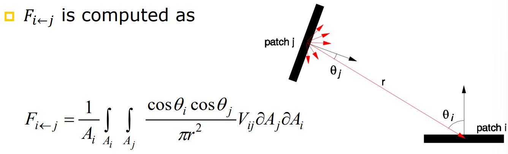

Example: an enclosed region with four polygons, all with reflectivity $\rho$. $S_1$ is a light source; $S_2$, $S_3$, and $S_4$ are diffuse surfaces.

At time $t$: the light is off, no energy is emitted.

At time $t+1$: $S_1$ emits energy $E_1$. Energy received: $L_1 = 0, L_2 = eF_{21}, L_3 = eF_{31}, L_4 = eF_{41}$.

At time $t+2$: $S_2$, $S_3$, and $S_4$ reflect part of the received energy.

- $L_1 = \rho e F_{21} F_{12} + \rho e F_{31} F_{13} + \rho e F_{41} F_{14}$
- $L_2 = e F_{21} + \rho e F_{31} F_{23} + \rho e F_{41} F_{24}$
- and so on.

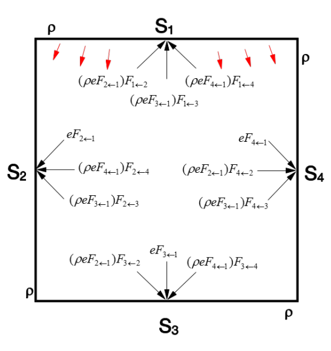

There will be more and more terms but as $\rho < 1$, the total energy converges.

Radiosity for a large surface can be computed by dividing it into smaller patches and solving a system of linear equations.

$$[B'_i] = [E_i] + [\rho_i F_{i1} \ \rho_i F_{i2} \ \ldots \ \rho_i F_{in}] [B_i]$$

Dimensions: $(n \times 1) = (n \times 1) + (n \times n)(n \times 1)$

However, **radiosity is view-independent**; it cannot handle **specular reflections**.

It can be combined with ray tracing for even more realistic rendering; however, the computational cost will be very high. Instead, radiosity is often precomputed and stored in textures for real-time rendering.

## 08 Aliasing and Anti-Aliasing

### Aliasing

**Nyquist Sampling Theorem**: A continuous bandlimited function (signal) can be completely represented (reconstructed) by a set of equally spaced samples, if the samples occur at more than twice the frequency of the highest frequency component in the function.

In other words, to avoid aliasing, the sampling frequency $N$ is at least $N = 2f_{max}$, where $f_{max}$ is the highest frequency in the signal.

**Aliasing**: Distortion or artifact that occurs when a signal is undersampled. Two types:

- **Spatial aliasing**: Occurs in static images when high-frequency details are not adequately sampled, resulting in jagged edges, disappeared details, fragmentation, moiré patterns, etc.
- **Temporal aliasing**: Occurs in animations when fast-moving objects are not sampled frequently enough over time, either as a result of spatial aliasing or undersampling in time (i.e. low frame rate).
    - Example: wagon-wheel effect. If the wheel rotates faster than half the frame rate, it appears to rotate backward.

### Anti-Aliasing

#### Supersampling

- Create a higher-resolution (2x, 4x, etc.) version of the image by sampling multiple points within each pixel.
- Apply a low-pass filter (e.g., box filter, Gaussian filter) to the high-resolution image to smooth out high-frequency details.
- Downsample the filtered image back to the original resolution by averaging the samples within each pixel.

Pros: Easy to implement; hardware support (e.g., MSAA).

Cons: Memory and computationally expensive; does not eliminate aliasing, only reduces it.

```python
def supersampling(image, scale_factor=2):
    import numpy as np
    from scipy.ndimage import gaussian_filter

    # Step 1: Create a higher-resolution image
    high_res_shape = (image.shape[0] * scale_factor, image.shape[1] * scale_factor, image.shape[2])
    high_res_image = np.zeros(high_res_shape, dtype=image.dtype)

    for i in range(scale_factor):
        for j in range(scale_factor):
            high_res_image[i::scale_factor, j::scale_factor] = image

    # Step 2: Apply a low-pass filter
    filtered_image = gaussian_filter(high_res_image, sigma=scale_factor/2)

    # Step 3: Downsample back to original resolution
    downsampled_image = filtered_image[::scale_factor, ::scale_factor]

    return downsampled_image
```

Exercise Question: How to extend the ray-tracing method to supersampling to address spatial aliasing?

- For each pixel on the image plane, generate multiple (say, 2x2=4) primary rays projected through different locations within the pixel into the scene.
- For each subray, compute the color of objects where the ray intersects through reflection/refraction recursively.
- For each subray, average the color values weighted by the the attenuation factors to get the final subpixel color.
- Average the subpixel colors to get the final pixel color.

#### Accumulation Buffer

Similar to supersampling, but instead of rendering all subpixels in a single pass, renders one subpixel at each pass.

Let the subpixel resolution be $a \times b$ and the final image resolution be $m \times n$.

Then $a \times b$ passes are needed to render the final image. In each pass, compute the contribution of one subpixel to each pixel in the final $m \times n$ image and accumulate the results in the accumulation buffer.

The idea is similar to matrix multiplication:

```python
def accumulation_buffer(image, a=2, b=2):
    import numpy as np

    m, n, c = image.shape
    acc_buffer = np.zeros((m, n, c), dtype=image.dtype)

    for i in range(a):
        for j in range(b):
            # Render subpixel image for (i, j)
            subpixel_image = render_subpixel(image, i, j, a, b)
            acc_buffer += subpixel_image

    return acc_buffer / (a * b)
```

Pros: Only require one more buffer; can simulate motion blur (accumulate over time axis) and depth of field (accumulate with camera position moving over time).

Cons: Slow; the accumulation buffer may overflow if too many passes are used.

### Stochastic Sampling

Every region of the image is sampled randomly. Small features that fall between uniform (on-grid) samples tend to be detected by non-uniform (off-grid) samples.

Replaces aliasing with noise.

(1) Poisson-disc distribution: Add points randomly, ensuring a minimum distance between points.

(2) Jittered distribution: Start with regular grid of samples, then randomly perturb each sample within its grid cell.

Pros: Reduce aliasing better when less samples per pixel are used; theoretically can eliminate alising with large enough number of samples.

Cons: Random noise is added to the image; memory and computationally expensive.

```python
def jittered_sampling(image, samples_per_pixel=4):
    import numpy as np

    m, n, c = image.shape
    sampled_image = np.zeros((m, n, c), dtype=image.dtype)

    sqrt_spp = int(np.sqrt(samples_per_pixel))
    for i in range(m):
        for j in range(n):
            color_sum = np.zeros(c)
            for si in range(sqrt_spp):
                for sj in range(sqrt_spp):
                    # Jitter within the grid cell
                    offset_x = (si + np.random.rand()) / sqrt_spp
                    offset_y = (sj + np.random.rand()) / sqrt_spp
                    sample_x = min(int(i + offset_x), m - 1)
                    sample_y = min(int(j + offset_y), n - 1)
                    color_sum += image[sample_x, sample_y]
            sampled_image[i, j] = color_sum / samples_per_pixel

    return sampled_image
```

#### Catmull's Subdivision Sampling

- Clip each polygon against each pixel to form polygon fragments.
- Determine visible fragments using depth sorting or Z-buffering.
- Compute fragment areas and use them as weights to average the colors of all visible fragments within each pixel.

Pros: Calculates exactly how much of each polygon covers each pixel

Cons: Computationally very expensive due to polygon-pixel clipping and depth buffering of fragments.

#### A-Buffer

Use subpixel sampling to make summing areas easier.

Pros: Can be implemented efficiently using bitwise logical ops on subpixel masks; processing per pixel depends only on the number of visible fragments, not the number of polygons in the scene.

Cons: Memory intensive due to storing subpixel masks for each pixel.

```python
def a_buffer_rendering(polygons, image_width, image_height, subpixel_resolution=4):
    import numpy as np

    # Initialize A-buffer
    a_buffer = [[[] for _ in range(image_width)] for _ in range(image_height)]
    subpixel_mask_size = int(np.sqrt(subpixel_resolution))

    for poly in polygons:
        # Clip polygon against each pixel
        for i in range(image_height):
            for j in range(image_width):
                fragments = clip_polygon_against_pixel(poly, i, j)
                for frag in fragments:
                    depth = compute_depth(frag)
                    area = compute_area(frag)
                    a_buffer[i][j].append((depth, area, frag.color))

    # Resolve visibility and compute final pixel colors
    final_image = np.zeros((image_height, image_width, 3), dtype=np.float32)
    for i in range(image_height):
        for j in range(image_width):
            fragments = sorted(a_buffer[i][j], key=lambda x: x[0])  # Sort by depth
            total_area = 0
            color_sum = np.zeros(3)
            for depth, area, color in fragments:
                color_sum += color * area
                total_area += area
            if total_area > 0:
                final_image[i, j] = color_sum / total_area

    return final_image
```

## 09 Real-Time Rendering

In real-time rendering, **Time-critical rendering** trades off image quality for speed to achieve interactive frame rates.

**Frame time**: The time between two consecutive frames. For 60 FPS, frame time = 1/60 seconds = 16.67 ms.

### Progressive Rendering

If an object is far away, it can be rendered with fewer polygons (lower level of detail, LoD).

**Discrete LoD**: Precompute multiple versions of the object with different polygon counts. Switch between them based on distance from the camera.

Pros: Efficient; easy to implement.

Cons: Visible popping artifacts when switching LoD levels; a design choice is needed for how many LoD levels to create.

**Progressive meshes**: Store a single mesh and progressively simplify it by **edge collapsing**. Each edge collapse removes one vertex and two tirangles.

A **base mesh** is the lowest resolution version of the object. The original mesh can be reconstructed by applying a sequence of **vertex splits**.

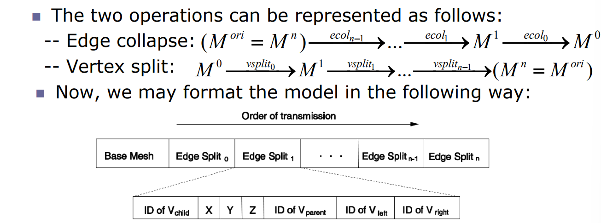

During rendering, start with the base mesh and iteratively apply vertex splits to refine the mesh until a desired quality level is reached or time budget is exhausted.

**Selective Refinement**. For large models (e.g. landscapes), we want to refine only the visible parts of the model. Selective refinement uses a hierarchical structure (e.g., quadtree, octree) to represent the model at different levels of detail.

**Visual Quality Estimation**: Estimate the visual quality of the rendered image using the model's LoD, distance from the camera, and screen size.

**Rendering Cost Estimation**: Estimate the rendering cost (time) of rendering the model at different LoD levels using different rendering techniques (e.g., flat or Gouraud shading).

### Shadows

Two types of shadows:

- **Hard shadows**: Only umbra regions; point light source; sharp shadow edges.
- **Soft shadows**: Umbra and penumbra regions; area light source; soft shadow boundaries.

Methods to render hard shadows:

**Shadow volumes methods**: Compute a 3D volume representing the shadowed region cast by an object.

To determine if a pixel is in shadow: draw a line from the viewpoint to the pixel. Count +1 if the line enters the shadow volume and -1 if it exits. If the final count is greater than 0, the pixel is in shadow.


**Shadow maps methods**:

- Render a depth map from the light source's point of view, storing the distance to the nearest surface at each pixel.
- When rendering the scene from the camera's point of view, transform each pixel's position into the light's coordinate system and compare its depth with the corresponding value in the shadow map. If the pixel's depth is greater than the shadow map value, it is in shadow.


```python
def shadow_mapping(scene, light_pos, camera_pos, shadow_map_size):
    # Step 1: Render depth map from light's point of view
    light_view_matrix = compute_light_view_matrix(light_pos)
    depth_map = render_depth_map(scene, light_view_matrix, shadow_map_size)

    # Step 2: Render scene from camera's point of view
    camera_view_matrix = compute_camera_view_matrix(camera_pos)
    final_image = np.zeros((image_height, image_width, 3), dtype=np.float32)

    for pixel in image_pixels:
        world_pos = compute_world_position(pixel, camera_view_matrix)
        light_space_pos = transform_to_light_space(world_pos, light_view_matrix)

        # Compare depth with shadow map
        shadow_map_depth = sample_shadow_map(depth_map, light_space_pos)
        if light_space_pos.z > shadow_map_depth:
            # Pixel is in shadow
            final_image[pixel] = compute_shadowed_color(world_pos)
        else:
            # Pixel is lit
            final_image[pixel] = compute_lit_color(world_pos)

    return final_image
```

Issue: Aliasing artifacts due to limited resolution of the shadow map.

**Perspective shadow maps**: First transform all objects perspectively into the light's view space, then create an orthographic shadow map in this space.

Methods to render soft shadows:

**Combining point light sources**: Approximate an area light source by combining multiple point light sources distributed over the area. Each creates a shadow map, and they can be combined to form an attenuation map.

**Single sample soft shadows**: applicable when there is a occluder between the point light source and the surface.

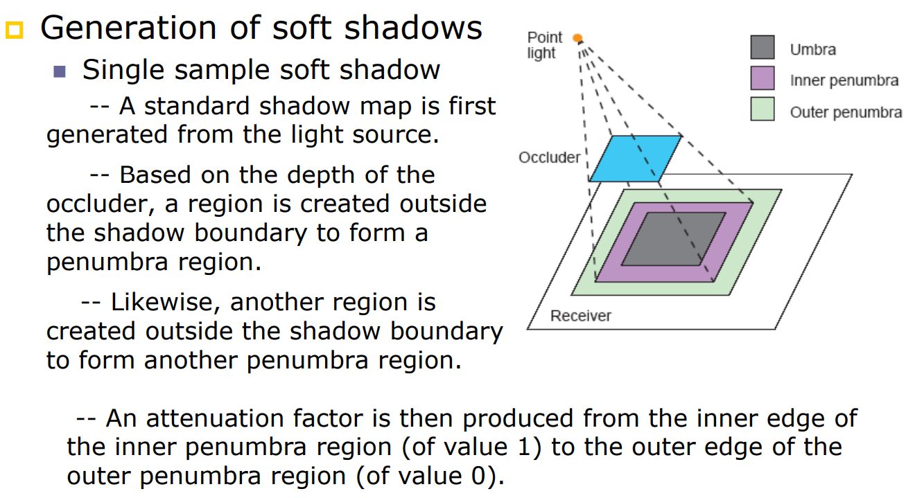

### Visible Object Determination

**Area of Interest (AoI)**: Only render objects within a certain distance from the camera or within the camera's view frustum.

Extended approach: each object has a AOI. Only objects whose AOIs intersect with the camera's AOI are rendered.

Further approach: Divide the scene into grids. Each cell has a list of objects whose AOIs intersect with the cell. Only objects in the cells that intersect with the camera's AOI are rendered.

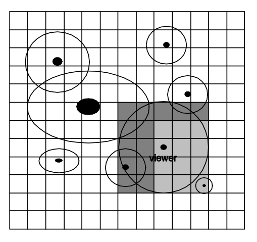

## 10 GPU, Computer Animation, and Image Processing

### GPU

Graphics Processing Unit (GPU) is a specialized processor designed to accelerate graphics rendering.

CPU have the following features:

- Good at control-heavy tasks with complex branching.
- Few arithmetic logic units (ALUs) optimized for sequential processing.
- Optimized for low latency.
- Not for high bandwidth.

GPU have the following features:

- Lots of ALUs optimized for parallelism.
- Simple control, multiple stages (cores dedicated to specific tasks, e.g., vertex processing, fragment processing).
- Latency tolerant through massive multithreading.

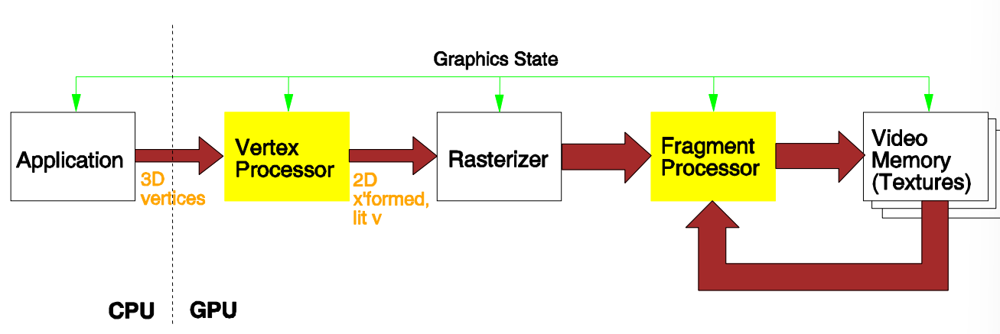

GPU Architecture:

- Vertex Processor (transformation, back-face culling, per-vertex lighting)
- Rasterizer (clipping, convert primitives to fragments, interpolation)
- Fragment Processor (texture mapping, shading)
- Video Memory (store textures, frame buffer)

Two types of parallelism in GPU:

- **Data-level parallelism**: Same operation applied to multiple data elements simultaneously (e.g., processing multiple vertices or fragments in parallel).
- **Task-level parallelism**: Different tasks executed concurrently (e.g., vertex processing and fragment processing happening simultaneously).

However, GPU parallelization is limited by CPU-GPU communication. To improve: favor transferring entire data blocks over multiple small transfers; favor deep pipelines with minimal CPU intervention; structuring applications as pipelines (rather than waiting for CPU to instruct GPU for each step).

### Computer Animation

- **Keyframing animation**: Define events at specific keyframes, and interpolate the in-between frames.
- **Procedural animation**: Use algorithms to generate motion (e.g., particle systems for smoke, fire) for simulating complex phenomena.
- **Motion capture animation**: Record real-world motion using sensors and apply it to 3D models.

Current motion capture techniques:

- **Electromagnetic tracking**: Use magnetic fields to track sensor positions.
    - Pros: (1) records 3D orientations; (2) no occlusions; (3) no lighting issues; (4) can capture multiple subjects simultaneously.
    - Cons: (1) magnetic perturbations; (2) cannot capture deformation (facial expression); (3) hard to capture fine details (finger movement); (4) less accurate than optical methods.
- **Electromechanical tracking**: Use mechanical linkages to track joint angles.
    - Pros: (1) (2) same as above; (3) portable for outdoor capture.
    - Cons: (1) only 3D orientations, no positions; (2) (3) same as above
- **Optical tracking**: Use multiple cameras to track retro-reflective markers attached to the subject.
    - Pros: (1) 3D orientations and positions; (2) high accuracy; (3) high frame rate; (4) can capture fine details.
    - Cons: (1) occlusions; (2) hard to capture interactions among multiple actors; (3) expensive.
- **Markerless optical tracking**: Reconstruct 3D motion directly from video footage without markers.
    - Video-based
    - Depth sensor-based (e.g., Kinnect)

Optical tracking process:

- Planning: camera placement; marker setup; character setup
- Calibration: determine camera parameters; subject calibration
- Processing markers: camera records scenes; extract 2D marker positions; reconstruct 3D marker positions
- Post-processing: clean up data; retarget motion to 3D model

### Image Processing

- Histogram modification: A histogram represents the distribution of pixel intensities in an image. Histogram modification adjust the contrast and brightness of an image by modifying its histogram.
    - **Histogram equalization**: Replace the pixel intensity values with their percentile ranks to achieve a uniform histogram. $g(x, y) = \text{floor}((L-1) \sum_{n=0}^{f(x,y)} p_n)$
    - **Histogram stretching**: Linearly map the pixel intensity values to a wider range to enhance contrast. $g(x, y) = \frac{255(f(x,y) - f_{min})}{f_{max} - f_{min}}$
- Image warping: rotation, aspect ratio change, affine transformation, perspective transformation
    - Forward mapping $q = T(p)$ has an issue: $q$ may not land on integer pixel coordinates.
    - **Backward mapping**: compute $p = T^{-1}(q)$ for each pixel $q$ in the output image, and resample the input image at $p$ using interpolation (e.g., nearest neighbor, bilinear).
- **Image morphing**: Smoothly transform one image into another by interpolation. $r_i(t) = (1-t) p_i + t q_i$ where $p_i$ and $q_i$ are corresponding control points in the two images, and $t$ varies from 0 to 1.
- **Image filtering**: Apply a convolution operation with a kernel to enhance or detect features in an image.
    - Smoothing filters (e.g., Gaussian filter) reduce noise and blur the image.
    - Sharpening filters (e.g., Laplacian filter) enhance edges and fine details.
    - Edge detection filters (e.g., Sobel filter) highlight regions with significant intensity changes.
