# CS4186 Computer Visions & Image Processing

## 成像坐标系和相机参数

### 四种坐标系

- 世界坐标系：一个固定的、绝对的参考坐标系，用来描述环境中物体或相机的位置。
    - 3D 坐标；用 $P_w(X_w, Y_w, Z_w)$ 表示。
    - 单位：物理单位米 (m) 或毫米 (mm)。
- 相机坐标系：以相机的光心 (Optical Center) 为原点，Z 轴通常指向相机的观察方向（光轴），X 轴和 Y 轴分别平行于图像平面的水平和垂直方向。
    - 3D 坐标；用 $P_c(X_c, Y_c, Z_c)$ 表示。
    - 单位：与世界坐标系相同。
- 图像物理坐标系：在相机的成像平面上，以光轴与成像平面的交点（主点，Principal Point）为原点的二维坐标系。
    - 2D 坐标；用 $P_i(x_i, y_i)$ 表示。
    - 单位：与世界坐标系相同。
- 像素坐标系：以图像的左上角为原点，X 轴向右，Y 轴向下的二维坐标系。
    - 2D 坐标；用 $P_p(u, v)$ 表示。
    - 单位：像素 (pixel)。

### 外参

外参描述了相机在世界坐标系中的位置和朝向。

- 旋转矩阵 $R \in \mathbb{R}^{3 \times 3}$ 描述相机坐标系相对于世界坐标系的旋转。
    - 右手坐标系：$R^T R = I$，$R^T = R^{-1}$。
    - 正交矩阵：$\det(R) = 1$。
- 平移向量 $t \in \mathbb{R}^{3 \times 1}$ 描述相机坐标系原点在世界坐标系中的位置。

$$P_c = R P_w + t \quad (1.1)$$

通常使用齐次坐标表示：

$$\begin{bmatrix} P_c \\ 1 \end{bmatrix} = \begin{bmatrix} R & t \\ 0 & 1 \end{bmatrix} \begin{bmatrix} P_w \\ 1 \end{bmatrix}$$

$$\begin{bmatrix} X_c \\ Y_c \\ Z_c \\ 1 \end{bmatrix} = \begin{bmatrix} r_{11} & r_{12} & r_{13} & t_x \\ r_{21} & r_{22} & r_{23} & t_y \\ r_{31} & r_{32} & r_{33} & t_z \\ 0 & 0 & 0 & 1 \end{bmatrix} \begin{bmatrix} X_w \\ Y_w \\ Z_w \\ 1 \end{bmatrix} \quad (1.2)$$

### 内参

从相机坐标系到图像物理坐标系：

- 焦距 $f_x, f_y$：相机的焦距，单位为毫米 (mm)。
- 如果 $f_x = f_y$，传感器像素为正方形。

$$x_i = f_x \frac{X_c}{Z_c}, \quad y_i = f_y \frac{Y_c}{Z_c} \quad (2.1)$$

从图像物理坐标系到像素坐标系：

- 主点坐标 $(c_x, c_y)$：成像平面上光轴与成像平面的交点，在像素坐标系中的位置。
- 像素尺寸 $d_x, d_y$：每像素的物理尺寸，单位为毫米 (mm)。

$$u = c_x + d_x x_i, \quad v = c_y + d_y y_i \quad (2.2)$$

将 $(2.1)$ 和 $(2.2)$ 结合起来：

定义 $F_x = \frac{f_x}{d_x}, F_y = \frac{f_y}{d_y}$（单位：像素），则有：

$$u = c_x + F_x \frac{X_c}{Z_c}, \quad v = c_y + F_y \frac{Y_c}{Z_c} \quad (2.3)$$

定义内参矩阵 $K = \begin{bmatrix} F_x & 0 & c_x \\ 0 & F_y & c_y \\ 0 & 0 & 1 \end{bmatrix}$，则有：

$$K P_c = \begin{bmatrix} u \\ v \\ 1 \end{bmatrix}$$

$$\begin{bmatrix} u \\ v \\ 1 \end{bmatrix} = \begin{bmatrix} F_x & 0 & c_x \\ 0 & F_y & c_y \\ 0 & 0 & 1 \end{bmatrix} \begin{bmatrix} X_c \\ Y_c \\ Z_c \end{bmatrix} \quad (2.4)$$

将 $(1.2)$ 和 $(2.4)$ 结合起来：

$$\begin{bmatrix} u \\ v \\ 1 \end{bmatrix} = K \begin{bmatrix} R & t \\ 0 & 1 \end{bmatrix} \begin{bmatrix} X_w \\ Y_w \\ Z_w \\ 1 \end{bmatrix}$$

注意矩阵乘法的结合是从右往左计算的，见例题的 (3)。

### 例题

(1) 已知相机坐标系的 x, y, z 轴分别与世界坐标系的 y, z, x 轴平行；世界坐标系的原点在相机坐标系中为 (0, -h, 4h)。计算外参矩阵。

(2) 当内参矩阵 $K = \begin{bmatrix} 1 & 0 & 0 \\ 0 & 1 & 0 \\ 0 & 0 & 1 \end{bmatrix}$ 时，计算下面这条用参数方程表示的线在图像坐标系中灭点 (vanishing point) 的坐标：

$$(X_w, Y_w, Z_w) = (2 + 4t, 3 + 2t, 4 + 3t)$$

(3) 当内参矩阵 $K = \begin{bmatrix} 1000 & 0 & 320 \\ 0 & 1000 & 240 \\ 0 & 0 & 1 \end{bmatrix}$ 时，计算位于世界坐标系 $(X_w, Y_w, Z_w) = (2h, 3h, 4h)$ 的点在图像坐标系中的坐标。

---

(1) 确定旋转矩阵 $R$:

- 相机 x 轴 // 世界 y 轴
- 相机 y 轴 // 世界 z 轴
- 相机 z 轴 // 世界 x 轴

假设世界坐标 $P_w = (X_w, Y_w, Z_w)$，其对应的相机坐标（仅旋转）为 $P_c' = (Y_w, Z_w, X_w)$。

$P_c'^T = R P_W^T$

$\begin{bmatrix} Y_w \\ Z_w \\ X_w \end{bmatrix} = \begin{bmatrix} 0 & 1 & 0 \\ 0 & 0 & 1 \\ 1 & 0 & 0 \end{bmatrix} \begin{bmatrix} X_w \\ Y_w \\ Z_w \end{bmatrix}$

所以旋转矩阵 $R = \begin{bmatrix} 0 & 1 & 0 \\ 0 & 0 & 1 \\ 1 & 0 & 0 \end{bmatrix}$。

平移向量 $t = \begin{bmatrix} 0 \\ -h \\ 4h \end{bmatrix}$。

所以外参矩阵为：

$$[R | t] = \begin{bmatrix} 0 & 1 & 0 & 0 \\ 0 & 0 & 1 & -h \\ 1 & 0 & 0 & 4h \end{bmatrix}$$

(2) 已知世界坐标系中的直线 $(X_w, Y_w, Z_w) = (2 + 4t, 3 + 2t, 4 + 3t)$，其方向向量为 $\overrightarrow{d} = (4, 2, 3)$。

灭点是直线方向向量在图像平面上的投影。由于平移向量不影响方向向量的投影，下列式子中 $t = 0$。

$$\begin{bmatrix} u \\ v \\ 1 \end{bmatrix} = K \begin{bmatrix} R & t \\ 0 & 1 \end{bmatrix} \begin{bmatrix} X_w \\ Y_w \\ Z_w \\ 1 \end{bmatrix}$$

代入 $K = I; R; (X_w, Y_w, Z_w) = (4, 2, 3)$，得到：

$$\begin{bmatrix} u \\ v \\ 1 \end{bmatrix} = \begin{bmatrix} 0 & 1 & 0 & 0 \\ 0 & 0 & 1 & 0 \\ 1 & 0 & 0 & 0 \end{bmatrix} \begin{bmatrix} 4 \\ 2 \\ 3 \\ 1 \end{bmatrix}$$

$$\begin{bmatrix} u \\ v \\ 1 \end{bmatrix} = \begin{bmatrix} 2 \\ 3 \\ 4 \end{bmatrix}$$

$u = \frac{2}{4} = 0.5; v = \frac{3}{4} = 0.75$。

所以灭点坐标为 $(0.5, 0.75)$。

(3)

$$[P_c] = \begin{bmatrix} R & t \\ 0 & 1 \end{bmatrix} \begin{bmatrix} P_w \\ 1 \end{bmatrix}$$

$$\begin{bmatrix} P_{cx} \\ P_{cy} \\ P_{cz} \end{bmatrix} = \begin{bmatrix} 0 & 1 & 0 & 0 \\ 0 & 0 & 1 & -h \\ 1 & 0 & 0 & 4h \end{bmatrix} \begin{bmatrix} 2h \\ 3h \\ 4h \\ 1 \end{bmatrix} = \begin{bmatrix} 3h \\ 3h \\ 6h \end{bmatrix}$$

$$\begin{bmatrix} u \\ v \\ 1 \end{bmatrix} = K \begin{bmatrix} P_{cx} \\ P_{cy} \\ P_{cz} \end{bmatrix}$$

$$\begin{bmatrix} u \\ v \\ 1 \end{bmatrix} = \begin{bmatrix} 1000 & 0 & 320 \\ 0 & 1000 & 240 \\ 0 & 0 & 1 \end{bmatrix} \begin{bmatrix} 3h \\ 3h \\ 6h \end{bmatrix} = \begin{bmatrix} 4920h \\ 4440h \\ 6h \end{bmatrix}$$

$u = \frac{4920h}{6h} = 820; v = \frac{4440h}{6h} = 740$。

所以像素坐标为 $(820, 740)$。

### 极线几何

极线几何描述了两个相机之间的几何关系。记物体 $P$ 在相机 $C_1, C_2$ 中的投影为 $p_1, p_2$，$C_1$ 和 $C_2$ 的光心分别为 $O_1, O_2$，$\bold{p_1} = \overrightarrow{O_1 p_1}$，$\bold{p_2} = \overrightarrow{O_2 p_2}$。

则 $R \bold{p_1} + t = \bold{p_2}$，即 $R \bold{p_1}, t, \bold{p_2}$ 共面。

其中 $R$ 和 $t$ 是描述将 $C_1$ 坐标系转换到 $C_2$ 坐标系的旋转矩阵和平移向量。可用 $[R_1 | t_1]$ 和 $[R_2 | t_2]$ 计算：

$R = R_2^T R_1, t = R_2^T (t_1 - t_2)$。

例：相机 $C_1$ 的 x, y, z 轴分别与世界坐标系的 y, z, x 轴平行，平移向量 $t_1^T = (0, -1, 4)$；相机 $C_2$ 的 x, y, z 轴分别与世界坐标系的 z, y, x 轴平行，平移向量 $t_2^T = (1, 4, 4)$。

$R_1 = \begin{bmatrix} 0 & 1 & 0 \\ 0 & 0 & 1 \\ 1 & 0 & 0 \end{bmatrix}, R_2 = \begin{bmatrix} 0 & 0 & 1 \\ 0 & 1 & 0 \\ 1 & 0 & 0 \end{bmatrix}$。

$R = R_2^T R_1 = \begin{bmatrix} 0 & 0 & 1 \\ 0 & 1 & 0 \\ 1 & 0 & 0 \end{bmatrix} \begin{bmatrix} 0 & 1 & 0 \\ 0 & 0 & 1 \\ 1 & 0 & 0 \end{bmatrix} = \begin{bmatrix} 1 & 0 & 0 \\ 0 & 0 & 1 \\ 0 & 1 & 0 \end{bmatrix}$。

$t = R_2^T (t_1 - t_2) = \begin{bmatrix} 0 & 0 & 1 \\ 0 & 1 & 0 \\ 1 & 0 & 0 \end{bmatrix} \begin{bmatrix} -1 \\ -5 \\ 0 \end{bmatrix} = \begin{bmatrix} 0 \\ -5 \\ -1 \end{bmatrix}$。

---

## Image Processing

Goal of computer vision:

- Compute and understand the physical world from images and videos
- Reconstruct 3D models from crowd-sourced images
- Recognize objects in images
- Improve image quality (computational photography)

### Image Filtering (L1)

An **image**, when represented as a matrix, is a 2D array of numbers. Each number represents the intensity of a pixel in the image. There can be multiple channels in an image, e.g. RGBA, where each channel is a 0-255 value representing the intensity of a color.

Mathematically, a grayscale (1-channel) image is a function $f: \mathbb{R}^2 \rightarrow \mathbb{R}$, where $f(x, y)$ is the intensity of the pixel at position $(x, y)$.

A digital image is a **discrete** representation of the continuous image function, where points are **sampled** and intensity values are **quantized**.

**Image filtering** is the process of modifying an image by changing the intensity values of the pixels. It is done by applying a **filter** (also called a **kernel**) to the image. The filter is a small matrix that is applied to each pixel in the image.

Objective of image filtering:

- To get useful information from the image
    - To extract edges
- To remove noise from the image
- To enhance the image
    - Sharpening
    - Blurring

**Linear filtering** is the most common type of image filtering. It is done by **convolving** the image with a filter kernel.

**Cross-correlation** is a measure of similarity between two signals, in this case, two matrices.

Let $F$ be a $N \times N$ image and $H$ be a $(2k+1) \times (2k+1)$ filter kernel. The cross-correlation of $F$ and $H$ is given by:

$$
G(x, y) = \sum_{i=-k}^{k} \sum_{j=-k}^{k} H(i, j) F(x+i, y+j)
$$

The size of $G$ is $(N-2k) \times (N-2k)$. $G(0, 0)$ aggregates the information from $(0, 0)$ to $(2k, 2k)$ in $F$.

**Convolution** is similar to cross-correlation, but the filter kernel is flipped before applying it to the image. Convolution is commutative, associative, and distributive.

Convolution is denoted by $G = F \ast H$:

$$
G(x, y) = \sum_{i=-k}^{k} \sum_{j=-k}^{k} H(i, j) F(x-i, y-j)
$$

Common filters:

- **Identity filter**: $H = \begin{bmatrix} 0 & 0 & 0 \\ 0 & 1 & 0 \\ 0 & 0 & 0 \end{bmatrix}$ (does nothing)
- **Displacement filter**: $H = \begin{bmatrix} 0 & 0 & 0 \\ 0 & 0 & 1 \\ 0 & 0 & 0 \end{bmatrix}$ (shifts to the right by 1 pixel)
- **Box filter**: $H = \frac{1}{9} \begin{bmatrix} 1 & 1 & 1 \\ 1 & 1 & 1 \\ 1 & 1 & 1 \end{bmatrix}$ (averages the pixel values, blurs the image)
- **Sharpening filter**: $H = \begin{bmatrix} 0 & -1 & 0 \\ -1 & 5 & -1 \\ 0 & -1 & 0 \end{bmatrix}$

**Gaussian filter** is a bell-shaped curve that is used to blur the image.

$$
G(x, y) = \frac{1}{2\pi\sigma^2} e^{-\frac{x^2 + y^2}{2\sigma^2}}
$$

However since we truncate the Gaussian distribution to $(2k + 1) \times (2k + 1)$, the values should be renormalized to ensure that the sum of the filter kernel is 1.

In Gaussian filtering, the standard deviation $\sigma$ controls the amount of blurring. A larger $\sigma$ results in slower decay of weights, which means that the filter kernel is larger and the image is more blurred.

The above filters are **linear filters**. They are **shift-invariant** and **linearly combine** the pixel values in the neighborhood.

**Median filter** is a non-linear filter that replaces each pixel value with the median of the pixel values in the neighborhood.

### Edge Detection (L2)

Goal of edge detection:

- To identify boundaries (visual changes, discontinuities) in the image

Consider a 1D signal $f(x)$:

- It is mostly white but has a black stripe in the middle
- White = 255 and black = 0
- The intensity function is mostly constant, but enters a low-intensity region in the middle
- Taking the first derivative of the signal, the start and end of the low-intensity region will have a high derivative (negative and positive, respectively)

**Derivative** is a measure of the rate of change of a function. Since the image is a discrete function, the derivative is approximated by the **finite difference**:

$$
\frac{df}{dx} F(x, y) \approx F(x+1, y) - F(x, y)
$$

The **gradient** of an image is a vector that points in the direction of the greatest rate of change of intensity: $\nabla F = \left[ \frac{df}{dx}, \frac{df}{dy} \right]$. 

The **direction** of the gradient is perpendicular to the edge. It is given by $\theta = \arctan \left( \frac{df}{dy} / \frac{df}{dx} \right)$.

The **edge strength** is the magnitude of the gradient: $||\nabla F|| = \sqrt{\left( \frac{df}{dx} \right)^2 + \left( \frac{df}{dy} \right)^2}$.

#### Denoising in Edge Detection

However, even in 1D signals, the derivative is sensitive to noise. To denoise the signal, we can apply a **smoothing filter** to the signal before taking the derivative.

Denote $h$ as the smoothing filter, and $g = f \ast h$ as the smoothed signal. The derivative of the smoothed signal is: $\frac{dg}{dx} = \frac{d}{dx} (f \ast h) = f \ast \frac{dh}{dx}$.

This is true because differentiation is convolution in the frequency domain, and convolution is associative. Thus we can distribute the derivative to the filter kernel.

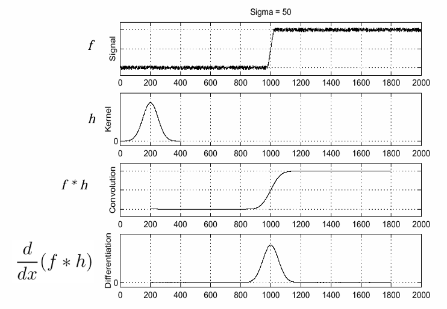

For 1D Gaussian smoothing: $G(x) = \frac{1}{\sqrt{2\pi}\sigma} e^{-\frac{x^2}{2\sigma^2}}$

Its derivative is: $G'(x) = \frac{dG}{dx} = -\frac{x^2}{\sqrt{2\pi}\sigma^3} e^{-\frac{x^2}{2\sigma^2}} = -\frac{x}{\sigma^2} G(x)$

Therefore, the Gaussian derivative is a scaled version of the Gaussian function itself.

Approximation of 2D Gaussian derivative:

- $s_x = \frac{1}{8} \begin{bmatrix} -1 & 0 & 1 \\ -2 & 0 & 2 \\ -1 & 0 & 1 \end{bmatrix}$
- $s_y = \frac{1}{8} \begin{bmatrix} -1 & -2 & -1 \\ 0 & 0 & 0 \\ 1 & 2 & 1 \end{bmatrix}$

Note $s_x$ is for $\frac{df}{dx}$ and thus it detects $y$-direction edges (vertical edges).

By combining $f \ast s_x$ and $f \ast s_y$, we can compute the gradient magnitude and direction at each pixel.

#### Canny Edge Detector

Criteria for a good edge detector:

- **Good detection**: The detector should detect as many real edges as possible, but ignore noise.
- **Good localization**
    - The detected edges should be as close as possible to the true
    - The edges should be thin (single pixel width)

**Canny edge detector** is a multi-step algorithm for edge detection:

1. **Smoothing**: Apply a Gaussian filter to the image to reduce noise.
2. **Gradient computation**: Compute the gradient magnitude and orientation at each pixel using Gaussian derivatives.
3. **Non-maximum suppression**: Thin the edges by removing pixels that are not local maxima in the gradient direction.
4. **Double thresholding**: Use two thresholds to identify strong, weak, and non-relevant pixels.

### Image Resampling (L2)

**Resampling** is the process of changing the resolution of an image. It is done by **interpolation**, which is the estimation of pixel values at non-integer coordinates.

**Upsampling** is increasing the resolution of an image. **Nearest-neighbor interpolation** is the simplest method, where the pixel value at a non-integer coordinate is the value of the nearest pixel.

**Subsampling** is decreasing the resolution of an image.

Steps of Gaussian resampling:

1. **Blur**: Apply a Gaussian filter to the image to reduce aliasing. (Also known as **Gaussian pre-filtering**)
2. **Subsample**: Remove pixels to reduce the resolution.
3. Repeat the above steps to downsample the image. This process forms a Gaussian pyramid.

### Color Histograms (L2)

A **histogram** of a grayscale image is a plot of the frequency of each intensity value in the image. It displays the number of pixels with each intensity value.

$H(i)$ is the number of pixels with intensity $i$.

$P(i) = \frac{H(i)}{N}$ is the normalized histogram, where $N$ is the total number of pixels in the image.

Application of histograms:

- Since histogram is efficient to compute, and the size can be normalized, it can be matched with histograms of other images for image retrieval.

**Multi-scale spatial histograms** are histograms of the image at different scales. It is used in object recognition.

By dividing the image into $1 \times 1, 2 \times 2, 4 \times 4, \ldots$ blocks, we can compute histograms at different scales.

### Texture Analysis (L3)

Using statistical measures to describe the spatial arrangement of colors in an image.

Using edge density and direction to describe the texture of an image:

- Apply edge detection to the image
- Compute the number of edge pixels in a fixed-size window
- Analyze the distribution of edge directions via histograms

Edginess per unit area: $F_\text{edginess} = | \{ p | \text{gradient mag}(p) > T \} | \div N$

where $T$ is the threshold and $N$ is the number of pixels in the window.

Edge mangnitude and direction histogram: $F_\text{magdir} = ( H_\text{magnitude}, H_\text{direction} )$

---

**Local Binary Patterns (LBP)** is a texture descriptor that is invariant to monotonic changes in illumination. It is used in face recognition.

- For each pixel $p$, create a 8-bit binary number by comparing the intensity of $p$ with its 8 neighbors, where $b_i = 0$ if $p_i \leq p$ and $b_i = 1$ otherwise.
- Represent the texture in the image by histogramming the binary numbers, i.e. capturing the distribution of edge directions.

Mathematically, 

$$
LBP_{p,r}(N_c) = \sum_{p=0}^{P-1} g (N_p - N_c) 2^p
$$

where $N_c$ is the center pixel, $N_p$ is a neighbor pixel, $r$ is the radius (for 3x3 case, $r=1$), and $g$ is a binary threshold function:

$$
g(x) = \begin{cases} 1 & \text{if } x \geq 0 \\ 0 & \text{otherwise} \end{cases}
$$

---

**Co-occurrence matrix** is a matrix that describes the spatial arrangement of colors in an image.

A co-occurrence matrix $C$ is a $N_g \times N_g$ matrix, where $N_g$ is the number of gray levels in the image. $C_d(i, j)$ is the number of times that intensity $i$ occurs in the image, followed by intensity $j$ at a distance $d$.

The distance $d$ is described by a vector $(dr, dc)$. $(1, 0)$ is the horizontal direction, and $(0, 1)$ is the vertical direction.

We can compute the **normalized co-occurrence matrices** $N_d$ by dividing each element in $C_d$ by the sum of all elements in $C_d$.

## Convolutional Neural Networks (CNN)

### Machine Learning (L3)

**Machine learning** is the study of algorithms that improve automatically through experience. It is a subset of artificial intelligence.

- $y = f(x)$ is a function that maps input $x$ to output $y$. The function $f$ is learned from data.
- **Training**: Given a training set of **labelled examples**, the algorithm learns the function $f$ by minimizing the prediction error on the training/validation set.
- **Testing**: The learned function is evaluated on a not-seen-before test set.

**Classification**:
- Assign input vectors to one of a finite number of categories
- Input space divided into **decision regions** separated by **decision boundaries**

**Neural networks** are a class of machine learning algorithms inspired by the structure of the human brain. They consist of **neurons** that are connected in layers.

- The whole network consists of an **input layer**, multiple **hidden layers**, and an **output layer**.
- Each layer consists of **neurons** that are connected to neurons in the previous and next layers.
- **Activation function** is applied to the output of each neuron to introduce non-linearity.

$$
y = \begin{cases} 1 & \text{if } \sum w_i x_i + b > 0 \\ 0 & \text{otherwise} \end{cases}
$$

where $w_i$ are the weights, $x_i$ are the inputs, and $b$ is the bias.

Example of a neural network: MNIST digit recognition

- Input: 28x28 grayscale image
- Input layer: collapse the 2D image into a 1D vector (28x28 = 784 neurons)
- Hidden layers: multiple layers of neurons
- Output layer: 10 neurons, each representing a digit from 0 to 9
- Each output neuron reports the probability of the input image being the corresponding digit
- The probability is then normalized to sum to 1

In this example,

- $x$ is the 1D input vector ($|x| = 1 \times 784$)
- $W$ is a matrix of weights for each pixel and each perceptron ($|W| = 784 \times 10$)
- $b$ is a bias per perceptron $|b| = 1 \times 10$
- result = $x \cdot W + b = (R^{1}, R^{784}) \cdot (R^{784}, R^{10}) + (R^{1}, R^{10}) = (R^{1}, R^{10})$

**Rectified Linear Unit (ReLU)** is an activation function that is commonly used in neural networks. $f(x) = \max(0, x)$.

### Image Filtering with CNN (L3)

In practice, image is too large to be fed directly into a neural network. Instead, we can use a **convolutional neural network (CNN)**.

Example: If the input image is $200 \times 200$ and there are $40,000$ hidden neurons, the number of weights (parameters) is $200 \times 200 \times 40,000 = 1,600,000,000$. This is too large.

Instead, we filter the image with a small kernel. The kernel is applied to the image in a sliding window manner. The output of the kernel is called a **feature map**.

If a $10 \times 10$ kernel is applied to the image, the number of weights is $10 \times 10 \times 40,000 = 4,000,000$. This is much smaller.

This allows different locations of the image to share the same weights, which reduces the number of parameters.

We can further optimize the CNN by learning **multiple kernels**. Each kernel is responsible for detecting a different feature in the image.

If we have $100$ kernels, the number of weights is $10 \times 10 \times 100 = 10,000$. This is even smaller.

#### Stride

**Stride** is the number of pixels by which the kernel is shifted. A stride of $1$ means the kernel is shifted by $1$ pixel each time. 

If the kernel size is $k \times k$, the output size is $\frac{N - k}{\text{stride}} + 1$.

Example: In the above example, $N = 200$, $k = 10$. If $\text{stride} = 1$, the output size is $\frac{200 - 10}{1} + 1 = 191$. If $\text{stride} = 2$, the output size is $\frac{200 - 10}{2} + 1 = 96$.

A larger stride reduces the output size.

Another example: A $32 \times 32 \times 3$ (RGB) image is convolved with a $5 \times 5 \times 3$ kernel with stride $1$. The output size is $28 \times 28 \times 1$.

If multiple kernels (e.g. $6$) are used, the output size is $28 \times 28 \times 6$. Each kernel produces a feature map.

We can stack multiple convolutional layers to learn more complex features. Performing Convolution + ReLU is called a **convolutional layer**.

If we have $3$ convolutional layers,
- The second layer takes $28 \times 28 \times 6$ as input, convolves with $5 \times 5 \times 10$ kernels, and outputs $24 \times 24 \times 10$.
- The third layer takes $24 \times 24 \times 10$ as input, convolves with $5 \times 5 \times 16$ kernels, and outputs $20 \times 20 \times 16$.

#### Pooling

**Pooling** is a technique to reduce the spatial dimensions of the feature map. It is used to reduce the number of parameters and computation in the network.

**Max pooling** is a common pooling technique. It takes the maximum value in a window of pixels.

Mathematically, max pooling is defined as:

$$
h^n_j(x,y) = \max_{i,j\in W} h^{n-1}_j(x \cdot s + i, y \cdot s + j)
$$

Average pooling is defined as:

$$
h^n_j(x,y) = \frac{1}{|W|} \sum_{i,j\in W} h^{n-1}_j(x \cdot s + i, y \cdot s + j)
$$

where $h^n$ is the output of the $n$-th layer, $h^{n-1}$ is the input to the $n$-th layer, and $s$ is the stride.

---

If a $N \times N$ feature map is pooled with a $k \times k$ window and stride $s$, the output size is $\frac{N - k}{s} + 1$.

For example, if $N = 20$, $k = 2$, and $s = 2$, the output size is $\frac{20 - 2}{2} + 1 = 10$.

The cell at output $(0, 0)$ is the maximum value in the $2 \times 2$ window at input $(0, 0) \ldots (1, 1)$; at output $(0, 1)$ is the maximum value in the window at input $(0, 2) \ldots (1, 3)$, and so on.

[CNN calculator](https://www.maplefan.com/conv-pool/)

Denote the input dimension as $W \times H$, the kernel size as $F \times F$, the stride as $S$, and the padding as $P$. The output dimension is:

$$
\left(\left\lfloor \frac{W - F + 2P}{S} \right\rfloor + 1 ,\left\lfloor \frac{H - F + 2P}{S} \right\rfloor + 1 \right)
$$

Example:

- When $W\times H = 32 \times 32$, $F = 5$, $S = 1$, $P = 0$, the output is $28 \times 28$, where $\frac{H-F}{S} + 1 = 28$.
- When $S = 3$, the output is $10 \times 10$, where $\frac{H-F}{S} + 1 = 10$.
- When $S = 3$ and $P = 2$, the output is $11 \times 11$, where $\frac{H-F+2P}{S} + 1 = \frac{27+4}{3} + 1 = 11$.

### Image Segmentation (L4)

**Image segmentation** is the process of partitioning an image into multiple segments. It is used to locate objects and boundaries in images.

Types of image segmentation:

- **Semantic segmentation**: Assigns a class to each pixel in the image.
- **Classification + localization**: Locate and classify the single object in the image.
- **Object detection**: Locate and classify multiple objects in the image.
- **Instance Segmentation**: Locate and pixel-wise segment each object in the image.

#### Semantic Segmentation

Semantic Segmentation doesn't differentiate instances of the same class (e.g. it cannot separate two cars). It only cares about the class of each pixel.

Input: `3 x H x W` image

Output: `C x H x W` segmentation map, where `C` is the number of classes.

Predictions: color each pixel with the color of the class.

However, in the network, downsampling is performed to reduce the spatial dimensions. To recover the spatial dimensions, we can use **upsampling**.

**Unpooling** is the inverse operation of pooling. It recovers the spatial dimensions of the feature map.

**Max unpooling** is the inverse operation of max pooling. It recovers the spatial dimensions by placing the max value at the original location.

e.g.

$$
\begin{bmatrix}
1 & 2 & \boxed{6} & 3 \\
3 & \boxed{5} & 2 & 1 \\
1 & 2 & 2 & 1 \\
\boxed{7} & 3 & 4 & \boxed{8}
\end{bmatrix}
\overset{\text{max pooling}}{\longrightarrow}
\begin{bmatrix}
5 & 6 \\
7 & 8
\end{bmatrix}
\overset{\cdots}{\longrightarrow}
\begin{bmatrix}
1 & 2 \\
3 & 4
\end{bmatrix}
\overset{\text{max unpooling}}{\longrightarrow}
\begin{bmatrix}
0 & 0 & \boxed{2} & 0 \\
0 & \boxed{1} & 0 & 0 \\
0 & 0 & 0 & 0 \\
\boxed{3} & 0 & 0 & \boxed{4}
\end{bmatrix}
$$

**Learnable unpooling** allows **Fully Convolutional Networks (FCNs)** to learn the upsampling operation.

e.g. in a 3x3 transpose convolution with stride 2 pad 1, the input is 2x2 and the output is 4x4.

- $(0, 0)$ maps to $(0, 0)$
- $(0, 1)$ maps to $(0, 2)$
- $(1, 0)$ maps to $(2, 0)$
- $(1, 1)$ maps to $(2, 2)$

Since stride is 2, every pixel move in the input maps to 2 pixels in the output.

Since the kernel size is 3x3, each input pixel affects a 3x3 region in the output, with out-of-bound pixels ignored, and overlapping pixels summed.

An 1D example:

- Input: $[a, b]$
- Filter: $[x, y, z]$
- Output: $[a \cdot x, a \cdot y, a \cdot z + b \cdot x, b \cdot y, b \cdot z]$

#### Object Detection

**Sliding window detection** is a technique to detect objects in an image by applying a CNN to many different crops of the image, which classifies each crop as object or background.

Issue: Many, many locations and scales to consider. Computationally expensive.

**Region Proposal Networks (RPNs)** are used to generate region proposals. They predict the bounding boxes of likely-object regions, which is then fed into a CNN for classification.

Structure of R-CNN:

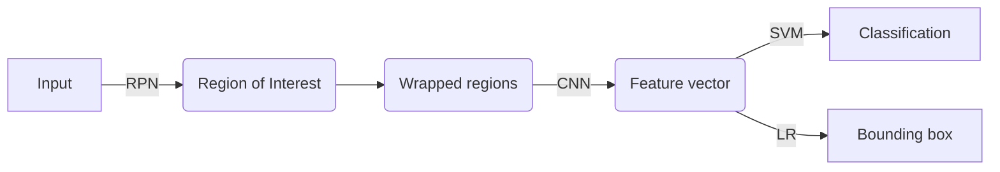

LR: Linear regression

#### YOLO

YOLO (You Only Look Once) is a real-time object detection system. It divides the image into a grid and predicts bounding boxes and probabilities for each grid cell.

Within each grid cell:

- A bounding box is regressed as `(dx, dy, dw, dh, confidence)` from each of the $B$ base boxes
- A class probability for each of the $C$ classes

Input image: $3 \times H \times W$

Number of **grid cells**: $S \times S$

Number of **base boxes** per grid cell: $B$

Output: $S \times S \times (5B + C)$

e.g.

- A $3 \times 448 \times 448$ image is divided into a $7 \times 7$ grid, each grid cell is $64 \times 64$
- Bounding boxes per grid cell: 2
- Classes: 20

Output size: $7 \times 7 \times (5 \times 2 + 20) = 7 \times 7 \times 30$

## Image Matching (L5)

Motivation: Automatic panorama stitching. Given two images, we need to find the transformation that aligns the images, so that we can stitch them together.

Find features that are invariant to transformations

- geometric transformations (rotation, scaling, translation)
- photometric transformations (brightness, exposure)

Advantages of **local features**:

- **Locality**: Local features are robust to occulsion and clutter
- **Quantity**: Many local features can be extracted from an image
- **Distinctiveness**: Local features can distinguish a object from many others in a database
- **Efficiency**: Local features enable real-time performance

Main components of local features:

1. **Feature detection**: Find points of interest in the image
2. **Feature description**: Describe the local region around the point as a feature vector
3. **Feature matching**: Match features between images

#### Harris Corner Detector

What makes a good local feature? **Uniqueness**. Flat and linear regions are not good features, but corners are.

Consider shifting the window $W$ by $(u, v)$. The **sum of squared differences** (SSD) is:

$$
E(u, v) = \sum_{x, y \in W} [I(x + u, y + v) - I(x, y)]^2 \quad \text{(SSD)}
$$

However this is computationally expensive. Instead, we can use the Taylor expansion:

$$
\begin{aligned}
I(x + u, y + v) &\approx I(x, y) + u \frac{\partial I}{\partial x} + v \frac{\partial I}{\partial y} \\
&\approx I(x, y) + [I_x\ I_y] \begin{bmatrix} u \\ v \end{bmatrix}
\end{aligned}
$$

where $I_x = \frac{\partial I}{\partial x}$ and $I_y = \frac{\partial I}{\partial y}$ are the image gradients.

Plugging this into the SSD:

$$
\begin{aligned}
E(u, v) & = \sum_{x, y \in W} [I(x + u, y + v) - I(x, y)]^2 \\
& \approx \sum_{x, y \in W} \left[ I(x, y) + [I_x\ I_y] \begin{bmatrix} u \\ v \end{bmatrix} - I(x, y) \right]^2 \\
& = \sum_{x, y \in W} \left[I_x u + I_y v \right]^2 \\
& = A u^2 + 2Buv + Cv^2 \\
& = \begin{bmatrix} u & v \end{bmatrix} \begin{bmatrix} A & B \\ B & C \end{bmatrix} \begin{bmatrix} u \\ v \end{bmatrix}
\end{aligned}
$$

where $A = \sum I_x^2$, $B = \sum I_x I_y$, and $C = \sum I_y^2$.

Denote $H = \begin{bmatrix} A & B \\ B & C \end{bmatrix}$ as the **structure tensor**.

If you apply SSD to a horizontal edge, i.e. $I_x = 0$ as the image is x-invariant, $H = \begin{bmatrix} 0 & 0 \\ 0 & C \end{bmatrix}$. On the $E(u, v)$ surface, this is a parabolic shape invariant to $u$.

#### Eigenvalues of the Structure Tensor

Recall that the **eigenvectors** of a matrix $A$ are the vectors $x$ that are not rotated by $A$, and the **eigenvalues** are the scalars $\lambda$ that scale the eigenvectors.

$A x = \lambda x$

The eigenvalues can be solved by: $\text{det}(A - \lambda I) = 0$.

$$
\begin{aligned}
&\text{det}
\begin{bmatrix}
h_{11} - \lambda & h_{12} \\
h_{21} & h_{22} - \lambda
\end{bmatrix}
= 0 \\
&\rArr
\lambda^2 - \lambda \text{tr}(H) + \text{det}(H) = 0 \\
&\rArr
h_\pm = \frac{\text{tr}(H) \pm \sqrt{\text{tr}(H)^2 - 4 \text{det}(H)}}{2}
\end{aligned}
$$

where $\text{tr}(H) = h_{11} + h_{22}$ and $\text{det}(H) = h_{11} h_{22} - h_{12} h_{21}$.

In this case, $\text{tr}(H) = A + C$ and $\text{det}(H) = AC - B^2$. 

$h_\pm = \frac{A + C \pm \sqrt{(A-C)^2 + 4B^2}}{2}$.

Interpretation:

$R = \lambda_1 \lambda_2 - k(\lambda_1 + \lambda_2)^2$ is the **cornerness measure**.

- If $R > 0$ is large, the point is a corner
- If $R$ is small, the point is flat
- If $R < 0$ is large, the point is an edge

$f = \frac{\lambda_1 \lambda_2}{\lambda_1 + \lambda_2} = \frac{\text{det}(H)}{\text{tr}(H)}$ is the **Harris response function**, another measure of cornerness.

The algorithm of corner detection:

1. Compute the image gradients $I_x$ and $I_y$ at each pixel
2. Create the $H$ matrix
3. Compute the eigenvalues of $H$
4. Find points with large response $\lambda_\text{min}$ > threshold
5. Choose points where $\lambda_\text{min}$ is a local maximum

#### Automatic Scale Selection

After describing the feature, we need to find the **scale** of the feature. The scale is the size of the region around the feature.

We need to find a property that is invariant to image translations (rotation, scaling, etc.).

Harris detector is not scale-invariant. The scale of the feature is the size of the window $W$. Image you upscale a corner of radius $r$ by a large factor. Then all parts of the corner will be classified as edges.

So we need to find scale that gives local maxima in $f$. One definition of $f$ is the Harris response function. In implementation, instead of computing $f$ for larger and larger windows, we can implement using a fixed-size window with a **Gaussian pyramid**.

Another definition of $f$ is the **Laplacian of Gaussian (LoG)**:

$$
\nabla^2 g(x, y) = \frac{\partial^2 g}{\partial x^2} + \frac{\partial^2 g}{\partial y^2}
$$

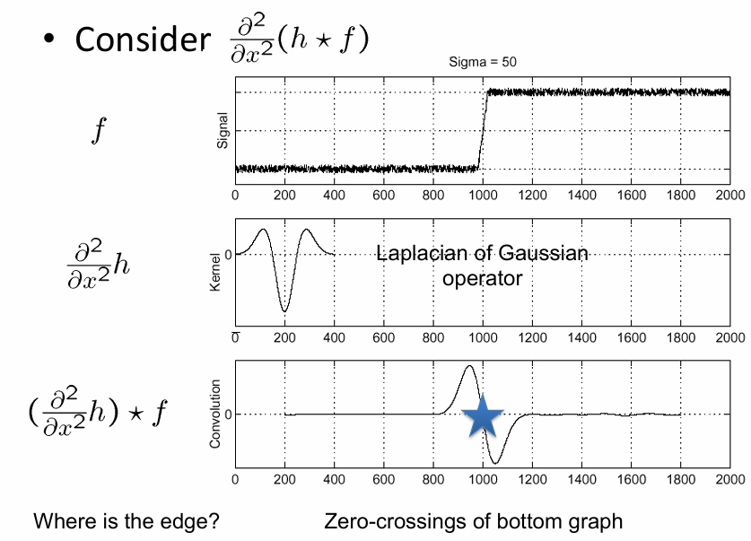

Consider $\frac{\partial^2}{\partial x^2} (h \ast f) = (\frac{\partial^2 h}{\partial x^2}) \ast f$.

When it crosses the edge, the second derivative is large. Therefore $(\frac{\partial^2 h}{\partial x^2}) \ast f$ will first increase then decrease sharply, crossing zero, which locates the edge.

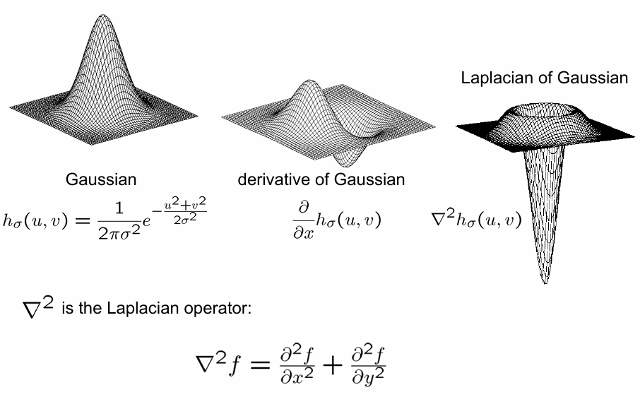

$\nabla^2$ is the Laplacian operator $\nabla^2 f = \frac{\partial^2 f}{\partial x^2} + \frac{\partial^2 f}{\partial y^2}$. Plugged into the Gaussian function, we get the LoG: $g(x, y) = -\frac{x^2 + y^2 - 2\sigma^2}{2\pi\sigma^4} e^{-\frac{x^2 + y^2}{2\sigma^2}}$.

**Blob** is a region of an image that is brighter or darker than its surroundings. The LoG function is a blob detector. **Scale-space blob detection** is the process of detecting blobs at different scales $\sigma, \sigma^2, \ldots$.

**LoG-DoG**: The difference of Gaussians (DoG) is the difference between two LoG functions with different scales. It approximates the LoG function.

$$
\text{DoG}(x, y, \sigma) = (g(x, y, k\sigma) - g(x, y, \sigma)) \ast I
$$

#### SIFT

**Scale-Invariant Feature Transform (SIFT)** is a feature descriptor that is invariant to scale, rotation, and illumination.

(1) Building the scale space:

- Compute Gaussian pyramid $\sigma, k\sigma, k^2\sigma, \ldots$
- Compute DoG pyramid $k\sigma - \sigma, k^2\sigma - k\sigma, \ldots$

(2) Scale space peak detection

- Compare each pixel with its 26 neighbors (in 3x3x3 cube) in the current and adjacent scales
- Select pixels X that are local maxima or minima

(3) Assigning orientation

Gradient magnitude and orientation are computed at each pixel.

$$
m(x, y) = \sqrt{(L(x+1, y) - L(x-1, y))^2 + (L(x, y+1) - L(x, y-1))^2}
$$

$$
\theta(x, y) = \arctan \left( \frac{L(x, y+1) - L(x, y-1)}{L(x+1, y) - L(x-1, y)} \right)
$$

$$
L(x, y, \sigma) = g(x, y, \sigma) \ast I(x, y)
$$

(4) Orientation histogram

An orientation histogram is formed from the **gradient orientations** of sample points within a region around the keypoint. 

It has 36 bins, each representing 10 degrees. ($10^\circ \times 36 = 360^\circ$)

Each surrounding point contributes to the histogram by a weight determined by the **gradient magnitude** and the Gaussian weight.

The **dominate orientation** is the peak in the histogram.

(5) Keypoint descriptor

The keypoint descriptor is a 128-dimensional vector that describes the local region around the keypoint.

- Window size: 16x16, divided into 16 cells of 4x4
- Each cell has an 8-bin orientation histogram
- 16 x 8 = 128-dimensional vector

#### Feature Distance

However sometimes matching features can be ambiguous. e.g. There is a fence in the image with repeating patterns. Each of the fence post will have similar features.

Naive approach: Compute L2 distance between feature vectors. $L_2(f_1, f_2) = \sqrt{\sum (f_1 - f_2)^2}$, which is also how SSD works.

Better approach: ratio distance. 

$RD(f_1, (f_2, f_2')) = \frac{d(f_1, f_2)}{d(f_1, f_2')}$. where $f_2$ is the best SSD match and $f_2'$ is the second best SSD match. If the ratio is less than a threshold, the match is considered correct.

Summary:

- Keypoint detection should be repeatable and distinctive
- Keypoint descriptor should be robust to transformations

### Bag of Words (L6)

Matching local features is computationally expensive. 

**Bag of Words (BoW)** is a technique to represent an image as a histogram of visual words which enables quick global image matching. It is inspired by text retrieval where a document is represented as a histogram of words.

(1) Feature extraction

- Detect local features (e.g. SIFT)
- Normalize the features and compute the descriptors

(2) Learning the visual vocabulary

Desceriptors are scattered in a high-dimensional space. As similar descriptors are close to each other, we can cluster them into **visual words**.

**K-means clustering** is used to cluster the descriptors into $K$ clusters.

Goal of K-means: minimize sum of L2 distances between each descriptor and its cluster center.

$$
\text{argmin} \sum_{i=1}^N \sum_{j=1}^K z_{ij} ||x_i - \mu_j||^2
$$

where $z_{ij} = 1$ if $x_i$ is assigned to cluster $j$, and $z_{ij} = 0$ otherwise.

Algorithm:

- Randomly initialize $K$ cluster centers
- Iterate until convergence:
    - Assign each descriptor to the nearest cluster
    - Update the cluster centers as the mean of the assigned descriptors

```python
def kmeans(X, K):
    # Randomly initialize K cluster centers
    centers = random.sample(X, K)
    while True:
        # Assign each descriptor to the nearest cluster
        clusters = [[] for _ in range(K)]
        for x in X:
            nearest = argmin([L2(x, c) for c in centers])
            clusters[nearest].append(x)
        # Update the cluster centers
        new_centers = [mean(cluster) for cluster in clusters]
        # Check for convergence
        if L2(centers, new_centers) < threshold:
            break
        centers = new_centers
    return centers
```

This is an unsupervised learning process.

A **vector quantizer** is a method to map a high-dimensional vector to the index of the nearest cluster center.

- Codevector: the visual word. Extracted from the test image, but may not be a real word.
- Codebook: the visual vocabulary. Learned on a separate training set.

(3) Image representation

Describe the image as a histogram of visual vocabulary.

#### Large Scale Image Retrieval

To apply BoW to large-scale image retrieval:

First, different visual vocabulary has different weights. A **term frequency-inverse document frequency (TF-IDF)** weight is applied to each visual word.

$IDF(j) = \log \frac{N}{n_j}$, where $N$ is the total number of images and $n_j$ is the number of images containing word $j$.

More frequent words are less informative, so they are down-weighted.

To compute the value of a word $j$ in image $i$:

$TF\_IDF(i, j) = \frac{f_i(j)}{\sum f_i(w)} \times \log \frac{N}{n_j}$

where $f_i(j)$ is the frequency of word $j$ in image $i$.

Second, the image is represented as a histogram of visual words, which is sparse. To reduce the dimensionality, we can use **inverted file**.

Inverted file maps each visual word to the images that contain it. It is a dictionary of visual words, where each word is mapped to a list of images.

We can use inverted file to quickly compute the similarity between two images, as we only need to compare the visual words that are common between the two images.

## Image Processing (Cont'd)

### Transformations (L7)

Mathematically, an image is a function $I: \mathbb{R}^2 \to \mathbb{R}$, where $I(x, y)$ is the intensity at pixel $(x, y)$.

**Image filtering changes the range of the image**. By convolving the image with a kernel, we can apply different filters to the image, making the $I$ values more or less intense to obtain desired effects.

**Image wraping changes the domain of the image**. By applying a transformation to the image, we can warp the image to a different shape, via translation, rotation, scaling, etc.

Assume source image $f(x, y)$ and destination image $g(x, y)$. The transformation is $T: (x, y) \to (x', y')$.

The **Forward wraping** is $T(x,y) = (x', y')$.

The **Inverse wraping** is $T^{-1}(x', y') = (x, y)$.

Denote $p=(x, y)$ and $p'=(x', y')$.

Then we have linear transformation: $p' = Tp$ or $\begin{bmatrix} x' \\ y' \end{bmatrix} = \begin{bmatrix} a & b \\ c & d \end{bmatrix} \begin{bmatrix} x \\ y \end{bmatrix}$.

A 2x2 matrix can represent a linear transformation on 2D space (rotation, scaling, shearing), but NOT translation.

- Rotation about the origin by $\theta$: $\begin{bmatrix} \cos \theta & -\sin \theta \\ \sin \theta & \cos \theta \end{bmatrix}$ ($x' = x \cos \theta - y \sin \theta, y' = x \sin \theta + y \cos \theta$)
- Mirror about the x-axis: $\begin{bmatrix} 1 & 0 \\ 0 & -1 \end{bmatrix}$ ($x' = x, y' = -y$)
- Mirror about $y=x$: $\begin{bmatrix} 0 & 1 \\ 1 & 0 \end{bmatrix}$ ($x' = y, y' = x$)

#### Homogeneous Coordinates

To represent translation, we can use **homogeneous coordinates**.

We append $1$ to the position vector to make it a 3D vector. Then we need a 3x3 matrix to represent the transformation, and the operation on constant $1$ is the translation.

e.g. $T = \begin{bmatrix} a & b & t_x \\ c & d & t_y \\ 0 & 0 & 1 \end{bmatrix}, \begin{bmatrix} x \\ y \\ 1 \end{bmatrix} T = \begin{bmatrix} x + t_x \\ y + t_y \\ 1 \end{bmatrix}$.

Any transformation with last row $[0, 0, 1]$ is an **affine transformation**. Affine transformation includes both linear transformation and translation.

If the last row is not $[0, 0, 1]$, i.e. $H = \begin{bmatrix} a & b & c \\ d & e & f \\ g & h & 1 \end{bmatrix}$, it is a **homography**. Homography distorts the image, does not preserve angles, and is not affine.

We can solve the equation $\begin{bmatrix} x' \\ y' \\ 1 \end{bmatrix} = H \begin{bmatrix} x \\ y \\ 1 \end{bmatrix}$ to obtain $x' = \frac{ax + by + c}{gx + hy + 1}, y' = \frac{dx + ey + f}{gx + hy + 1}$.

---

Now back to forward wraping and inverse wraping.

For forward wraping, If the result coordinate is not an integer, it contributes to multiple pixels near $(x', y')$ each with a weight. Contributions from different single pixels are summed up and then normalized.

For inverse wraping, if the source coordinate is not an integer, its color value is **resampled** from **intepolated** (prefiltered) source image.

Understanding the difference:

- Forward wraping: Every pixel in the source image maps to one or more pixels in the destination image.
- Inverse wraping: Every pixel in the destination image is mapped from one or more pixels in the source image.

### Image Alignment (L8)

Given $N$ matched points $(x_i, y_i) \leftrightarrow (x'_i, y'_i)$, we can compute the transformation $T$ that minimizes the error.

First we consider the case where only **translation** is involved.

Displacement of match $i$ = $(x'_i - x_i, y'_i - y_i)$.

Translation vector $(x_t, y_t) = \left( \frac{1}{N} \sum (x'_i - x_i), \frac{1}{N} \sum (y'_i - y_i) \right)$.

Now we consider the translation as a system of equations:

For each point $i$, we have $x'_i = x_i + x_t$ and $y'_i = y_i + y_t$. Define **residuals** as $r_{x_i}(x_t) = (x_i+x_t)-x'_i$ and $r_{y_i}(y_t) = (y_i+y_t)-y'_i$.

**Least squares** minimizes the sum of squared residuals:

$$
\text{argmin}_{x_t, y_t} C(x_t,y_t) = \sum r_{x_i}^2(x_t) + \sum r_{y_i}^2(y_t)
$$

However, if we simpley compute the homography based on the translation vector, the result is not accurate due to the existence of **outliers**.

**RANSAC** is a robust method to estimate the transformation. It is an iterative method that estimates the transformation from a subset of the data.

#### RANSAC

Basic idea:

1. Given a hypothesized line
2. Count the number of **inliers** (points that are close to the line)
3. Repeat for many lines
4. Choose the line with the most inliers

Implementation:

1. Randomly choose $s$ samples
2. Fit a model (line) to the samples using least squares
3. Count the number of inliers that approximately fit the model
4. Repeat for $N$ iterations
5. Choose the model with the most inliers
6. Refit the model using all inliers

### Camera Models (L8)

#### Pinhole Camera Model

Consider the process of image formation. Initially, only a film is used to capture the image. The object is illuminated by light, and the light rays are reflected off the object and then captured by the film.

Issue: too many different light rays are captured by the film, resulting in a blurry image.

**Pinhole camera**: A small hole on a barrier is used to capture the light rays, which reduces the number of rays and sharpens the image.

The opening of the barrier is the **aperture**. The captured image is upside down.

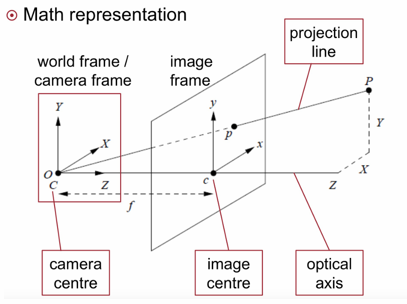

3D point $P = (x, y, z)$ is projected to 2D point $P' = (x', y')$ on the image plane.

$\frac{x}{z}= \frac{x'}{f}, \frac{y}{z} = \frac{y'}{f}$, where $f$ is the focal length.

Therefore, $P' = (x', y') = (f \frac{x}{z}, f \frac{y}{z})$.

#### Camera Parameters

To project a point $(x, y, z)$ in world coordinates to the image plane, we need to know the camera parameters.

Required knowledge:

- Camera position in world coordinates
- Camera orientation in world coordinates

**Intrinsic parameters**:

(1) Principle point offset

Denote the location of **principle point** on the image plane as $(c_x, c_y)$.

The principle point is the intersection of the optical axis with the image plane. Since the optical axis is perpendicular to the image plane, the principle point is the center of the image.

$P' = (x', y') = (f \frac{x}{z} + c_x, f \frac{y}{z} + c_y)$.

(2) Unit conversion

Since real world coordinates are in meters, but image coordinates are in pixels, we need to convert the units.

Denote $s_x, s_y$ as the number of pixels per meter in the x and y directions. If $s_x = s_y$, the camera has **square pixels**.

$P' = (x', y') = (s_x f \frac{x}{z} + c_x, s_y f \frac{y}{z} + c_y)$. Denoted as $\alpha \frac{x}{z} + c_x, \beta \frac{y}{z} + c_y$.

Recall the homogeneous coordinates: $(x, y) \Rightarrow \begin{bmatrix} x \\ y \\ 1 \end{bmatrix}$ for 2D coordinates, and $(x, y, z) \Rightarrow \begin{bmatrix} x \\ y \\ z \\ 1 \end{bmatrix}$ for 3D coordinates.

To recover the position vector from homogeneous coordinates, we divide by the last element. $\begin{bmatrix} x \\ y \\ z \\ w \end{bmatrix} \Rightarrow (x/w, y/w, z/w)$.

Representing $P'=(\alpha\frac{x}{z}+c_x, \beta\frac{y}{z}+c_y)$ in homogeneous coordinates:

$$
P' = \begin{bmatrix} \alpha & 0 & c_x & 0 \\ 0 & \beta & c_y & 0 \\ 0 & 0 & 1 & 0 \end{bmatrix} \begin{bmatrix} x \\ y \\ z \\ 1 \end{bmatrix} = MP\\
MP = \begin{bmatrix} \alpha & 0 & c_x \\ 0 & \beta & c_y \\ 0 & 0 & 1 \end{bmatrix} [I \quad 0] P = K[I \quad 0]P
$$

where $K$ is the **camera matrix** or calibration matrix, describing the measurement mapping and the principle point offset.

**Extrinsic parameters**:

(World coordinates) $\overset{e.p., 3D \to 3D}{\longrightarrow}$ (Camera coordinates) $\overset{i.p., 3D \to 2D}{\longrightarrow}$ (Image coordinates)

Given a point in world coordinates $P_w$, the camera coordinate is computed as $P=\begin{bmatrix} R & t \\ 0 & 1 \end{bmatrix} P_w$.

Combining intrinsic and extrinsic parameters:

$P' = K [R \quad t] P_w = MP_w$.

whereas $K$ is intrinsic parameters, $R$ is the rotation matrix, $t$ is the translation vector, and $[R \quad t]$ is the extrinsic parameters.

- $K$ is independent of the camera position and orientation
- Extrinsic parameters are independent of the type of camera. However, when camera moves, $R$ and $t$ change

e.g.

$$
\begin{bmatrix} 250 & 0 & 500 & 0 \\ 0 & 250 & 500 & 0 \\ 0 & 0 & 1 & 0 \end{bmatrix} \begin{bmatrix} 100 \\ 150 \\ 800 \\ 1 \end{bmatrix} = \begin{bmatrix} x' \\ y' \\ w \end{bmatrix}
$$

where the $3 \times 4$ matrix $M$ is the **projection matrix**, $P=\begin{bmatrix} 100 \\ 150 \\ 800 \\ 1 \end{bmatrix}$ is the h.g. coordinates of the 3D point, and $P'=\begin{bmatrix} x' \\ y' \\ w \end{bmatrix}$ is the h.g. coordinates of the 2D point.

### Stereo Vision (L9)

Recall on vector products:

**Dot product** $\mathbf{a} \cdot \mathbf{b} = |\mathbf{a}| |\mathbf{b}| \cos \theta$ yields a scalar.

For 3D vectors $\mathbf{a} = (x_1, y_1, z_1)$ and $\mathbf{b} = (x_2, y_2, z_2)$:

$$
\mathbf{a} \cdot \mathbf{b} = x_1 x_2 + y_1 y_2 + z_1 z_2
$$

**Cross product** $\mathbf{a} \times \mathbf{b} = |\mathbf{a}| |\mathbf{b}| \sin \theta$ yields a vector.

For 3D vectors $\mathbf{a} = (x_1, y_1, z_1)$ and $\mathbf{b} = (x_2, y_2, z_2)$:

$$
\begin{aligned}
\mathbf{a} \times \mathbf{b} &= \begin{vmatrix}
\mathbf{i} & \mathbf{j} & \mathbf{k} \\ x_1 & y_1 & z_1 \\ x_2 & y_2 & z_2 \end{vmatrix} \\
&= \mathbf{i} \begin{vmatrix} y_1 & z_1 \\ y_2 & z_2 \end{vmatrix} - \mathbf{j} \begin{vmatrix} x_1 & z_1 \\ x_2 & z_2 \end{vmatrix} + \mathbf{k} \begin{vmatrix} x_1 & y_1 \\ x_2 & y_2 \end{vmatrix} \\
&= (y_1 z_2 - y_2 z_1, z_1 x_2 - z_2 x_1, x_1 y_2 - x_2 y_1)
\end{aligned}
$$

We can also represent the cross product as a matrix-vector multiplication:

$$
\mathbf{a} \times \mathbf{b} = \begin{bmatrix} 0 & -z_1 & y_1 \\ z_1 & 0 & -x_1 \\ -y_1 & x_1 & 0 \end{bmatrix} \begin{bmatrix} x_2 \\ y_2 \\ z_2 \end{bmatrix}
$$

where the matrix is called the **skew-symmetric matrix** of $\mathbf{a}$, denoted as $[\mathbf{a}]_\times$. Can be memorized as: $\begin{bmatrix} 0 & -3 & 2 \\ 3 & 0 & -1 \\ -2 & 1 & 0 \end{bmatrix}$

The cross product is **anti-commutative**: $\mathbf{a} \times \mathbf{b} = -(\mathbf{b} \times \mathbf{a})$.

#### Basic Stereo Vision

Stereo vision is the process of estimating depth from two images taken from different viewpoints.

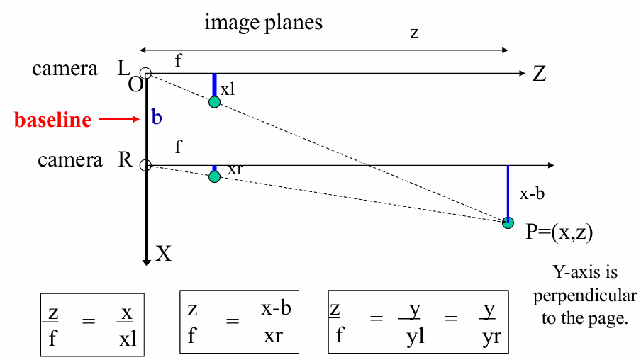

**Baseline** is the distance between the two cameras. Stereo vision only works if **the cameras are parallel and have the same focal length**.

Denotes:

- The focal length of the camera as $f$
- The baseline as $b$
- The height of the object on the image plane as $x_l, x_r$ respectively
- The position of the object on the image plane as $x, z$ (relative to camera L)

Our goal is to compute $z$ from other parameters.

According to similar triangles: $\frac{z}{f} = \frac{x}{x_l}, \frac{z}{f} = \frac{x - b}{x_r}, \frac{z}{f} = \frac{y}{y_l} = \frac{y}{y_r}$.

The solution is:

$$
\begin{aligned}
z &= \frac{f b}{x_l - x_r} = \frac{f b}{d} \\
x &= \frac{x_l z}{f} = b + \frac{x_r z}{f} \\
y &= \frac{y_l z}{f} = \frac{y_r z}{f}
\end{aligned}
$$

where $d = x_l - x_r$ is the **disparity**.
Disparity is the difference in position of the same point in two images. **Depth is inversely proportional to disparity**.

#### Epipolar Geometry

**Correspondence problem**: Given two images, how do we find the corresponding points in the two images? The intrinsic and extrinsic parameters can be different for the two images.

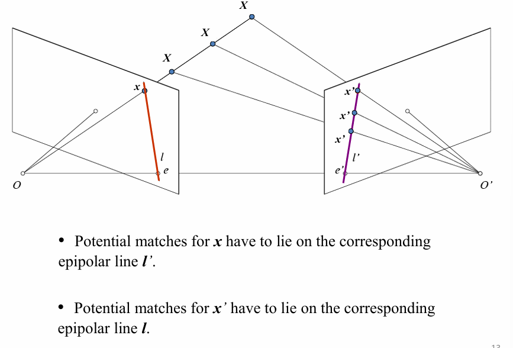

- **Epipole**: The intersection of the baseline with the image plane. It is the projection of the other camera center onto the image plane.
- **Epipolar plane**: The plane that contains the baseline. It can rotate 360 degrees around the baseline.
- **Epipolar lines**: The intersection of the epipolar plane with the image plane. It is a pair of lines in the two images that correspond to the same 3D point.

If we observer point $x$ in image $I_1$, the corresponding point $x'$ in image $I_2$ must lie on the epipolar line $l'$ in image $I_2$.

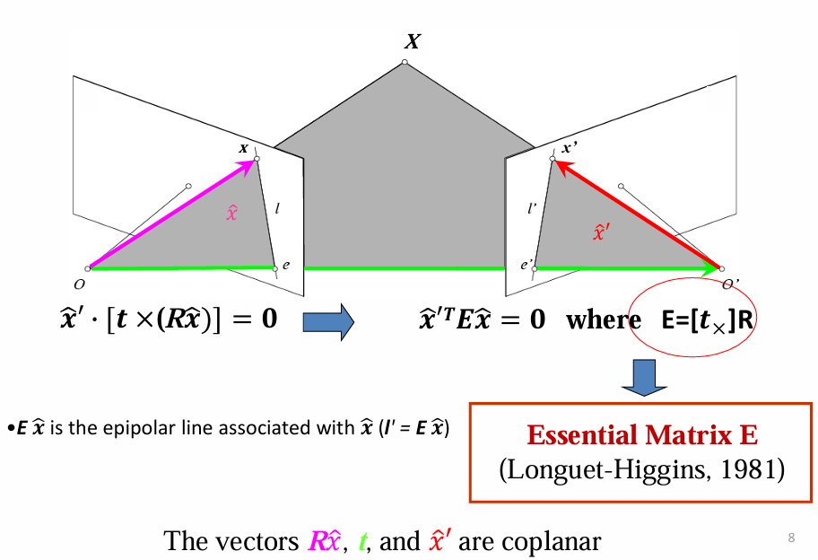

Assume intrinsic parameters $K$ and extrinsic parameters $[R \quad t]$ are known. The image coordinate is normalized:

$P' = K [R \quad t] P_w = MP_w$ for camera 2 in its own coordinate system.

$K^{-1} P' = [R \quad t] P_w$ is the **normalized image coordinate**.

$K^{-1} M = [R \quad t] = [I \quad 0] \begin{bmatrix} R & t \\ 0 & 1 \end{bmatrix}$ is the **normalized projection matrix**.

The world coordinate system is set to the camera 1 coordinate system. Then the projection matrix of the cameras are $M_1 = [I \quad 0]$ and $M_2 = [R \quad t]$ respectively.

Then the vectors $R \hat{x}$ (the direction of the ray), $t$ (the translation vector), and $\hat{x}'$ (the direction of the ray for camera 2) are coplanar.

$\hat{x} \cdot [t \times \hat{x}'] = 0$ is the **epipolar constraint**. (Recall that for two coplanar vectors $\mathbf{a}$ and $\mathbf{b}$, $\mathbf{a} \cdot [\mathbf{b}]_\times = 0$.)

This can also be written as $\hat{x}'^T E \hat{x} = 0$, where $E = [t]_\times R$ is the **essential matrix**. The essential matrix is a $3 \times 3$ matrix that encodes the relative rotation and translation between the two cameras.

#### Stereo Rectification

**Rectification** is the process of transforming the two images so that the epipolar lines are horizontal and aligned with the image rows.

For each pixel $x$ in the left image, find the corresponding epipolar scanline in the right image. Search along the epipolar line for the best match $x'$, compute the disparity $d = x - x'$, and set the depth $d(x) = \frac{f b}{d}$.

In this way we can compute the depth map of the scene using two images.

The next question is how to search for the best match along the epipolar line. We slide a window along the right scanline and compare the contents of that window with the reference window in the left image. The position with the minimum matching cost is the best match.

The matching cost can be computed using **sum of squared differences (SSD)**, **sum of absolute differences (SAD)**, or **normalized cross-correlation (NCC)** (higher NCC = better match).

$$
\text{SSD}(x, y) = \sum_{(i,j) \in W} (I_1(i, j) - I_2(i + x, j + y))^2
$$

where $(x, y)$ is the pixel in the left image, $W$ is the window size, $(i, j)$ is the offset within the window.

$$
\text{SAD}(x, y) = \sum_{(i,j) \in W} |I_1(i, j) - I_2(i + x, j + y)|
$$

$$
\text{SAD}_\text{0-mean}(x, y) = \sum_{(i,j) \in W} |I_1(i, j) - \bar{I_1} - (I_2(i + x, j + y) - \bar{I_2})|
$$

where $\bar{I}$ is the mean of the window.

$$
\text{NCC}(x, y) = cos\theta = \frac{a \cdot b}{||a|| ||b||} = \frac{\sum I_1(i, j) I_2(i + x, j + y)}{\sqrt{\sum I_1(i, j)^2} \sqrt{\sum I_2(i + x, j + y)^2}}
$$

**Window size**: The size of the window used to compute the matching cost. A small window size means more detail, but more noise. A large window size yields smoother disparity maps, but less detail, and can fail near boundaries.

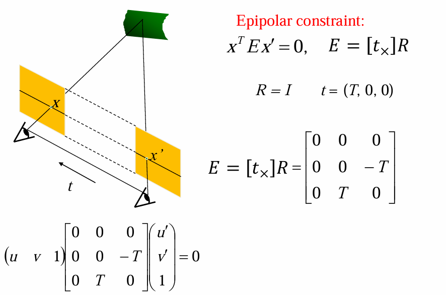

Applying epipolar constraints: Denote the left and right viewpoint coordinates as $x$ and $x'$; the baseline as $t$.

According to the epipolar constraint, $x^T E x' = 0, E = [t]_\times R$. 

Plugging in $R=I$ (since the cameras are parallel) and $t = [T\quad 0\quad 0]$, we have $E = \begin{bmatrix} 0 & 0 & 0 \\ 0 & 0 & -T \\ 0 & T & 0 \end{bmatrix}$.

Then the epipolar constraint becomes $[u\quad v \quad 1] \begin{bmatrix} 0 & 0 & 0 \\ 0 & 0 & -T \\ 0 & T & 0 \end{bmatrix} \begin{bmatrix} u' \\ v' \\ 1 \end{bmatrix} = 0$.

As a result, the $y$-coordinates of the left and right images are the same, i.e. $v = v'$.

#### Stereo Constraints

Above algorithms consider every pixel individually. To improve the window-based matching, the following constraints can be applied:

- **Uniqueness constraint**: Each pixel in the left image can only match to at most one pixel in the right image.
- **Ordering constraint**: The order of the pixels in the left image must be preserved in the right image. If pixel $x$ matches to pixel $x'$, then all pixels to the left of $x$ must match to pixels to the left of $x'$.
- **Smoothness constraint**: The change in disparity should be smooth. If pixel $x$ has disparity $d_x$, then the disparity of its neighbors must be close to $d_x$. This is a **global constraint** and can be solved using graph cuts or dynamic programming.

A good stereo correspondence should achieve a high match quality (each pixel finds a good match) and disparity smoothness (the disparity map is smooth).

### Structure from Motion (SfM) (L10)

**Point cloud** is a set of points in 3D space. Each point is represented by its 3D coordinates $(x, y, z)$ its color $(r, g, b)$, and can carry other attributes such as normal vector, curvature, etc.  Key difference from mesh: Point cloud has no order in the points, and no connectivity information.

**Structure from Motion (SfM)** is the process of estimating the 3D structure of a scene from a set of 2D images taken from different viewpoints.

- Input: A set of images with points in correspondence $p_{i,j} = (u_{i,j}, v_{i,j})$ in image $I_i$ and $I_j$.
- Output:
    - Structure: 3D location $x_i$ for each point $p_i$ in the images
    - Motion: Camera parameters $R_j, t_j$ for each camera $j$
- Objective: Minimize the reprojection error $E = \sum_{i,j} ||p_{i,j} - P_j R_j^T (P_i - t_j)||^2$

It contains two subproblems:

- **Camera calibration**: Given 3D points $x_i$ and their 2D projections $p_i$ on each image, estimate each camera's intrinsic and extrinsic parameters.
- **Camera triangulation**: Given a set of camera parameters and a 2D point $p_i$ they observe, estimate its 3D location $x_i$.

Steps:

1. Feature detection: Detect features in the images using SIFT.
2. Feature matching: Estimate the fundamental matrix between each pair of images using RANSAC. Fundamental matrix $F$ describes the epipolar geometry between two images.
3. Correspondence estimation: Link up pairwise matches to form connected components of points. Each connected component is a set of points that are matched across multiple images.
4. Structure from motion. For camera 1 $(R_1, t_1)$ who observes $X_1$ as $p_{1,1}$; camera 2 $(R_2, t_2)$ who observes $X_1$ as $p_{1,2}$, we minimize $g(R, T, X)$ to estimate the camera parameters and the 3D point $X_1$.

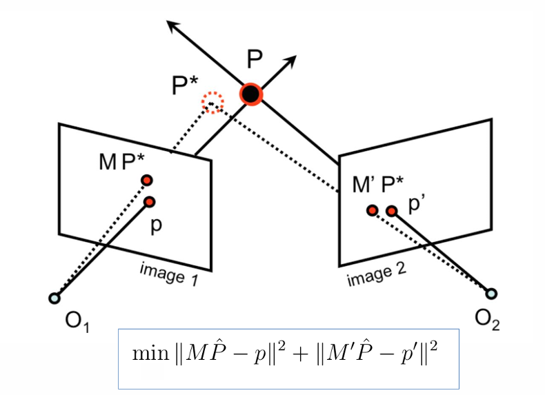

For 3D point $P$ (ground truth); its projection $p_1$, $p_2$ on image 1 and image 2 respectively; the rebuilt point $P'$ and its projection $MP$, $M'P$ on image 1 and image 2 respectively.
The reprojection error is defined as the distance between the projected point and the observed point:

$$E = ||p_1 - MP||^2 + ||p_2 - M'P||^2$$

And the goal is to minimize the reprojection error.

---

Mathematically, the algorithm can be represented as:

$$
\text{argmin}_{\{P_i\}, K, \{R_j, t_j\}} \sum_{j=1}^M \sum_{i=1}^N (u_i^j - f(K, R_j, T_j, P_i))^2 + (v_i^j - g(K, R_j, T_j, P_i))^2
$$

where $M$ is the number of images, $N$ is the number of points; $f$ and $g$ are the projection functions for the x and y coordinates respectively, $(u, v)$ is the ground truth projection of the point $P_i$ in image $j$.

or simply as:

$$
g(X, R, T) = \sum_{j=1}^M \sum_{i=1}^N w_{i, j} ||P(x_i, R_j, T_j) - \begin{bmatrix} u_{i, j} \\ v_{i, j} \end{bmatrix}||^2
$$

where $w_{i, j}$ is a weight that indicates whether the point $P_i$ is visible in image $j$.

There will be $2MN$ equations and $6M + 3N + 3$ unknowns. **Bundle adjustment** is a method to solve the above optimization problem.

### Optical Flow (L11)

**Optical flow** is the pattern of apparent motion of objects in a visual scene. It is the 2D projection of the 3D motion of the object.

Three factors in image processing: light, object, and camera. When one of them changes, the image will change:

- static light, moving object, static camera: surveillance
- static light, static object, moving camera: video stabilization, 3D reconstruction
- moving light, static object, static camera: time-lapse photography

**Feature tracking** is the process of extracting visual features (e.g. corners, textures) from a sequence of images and tracking their motion over time.

**Optical flow** is a velocity field in the image which transforms one image into the next image in a sequence.

#### Lucas-Kanade Method

The **Lucas-Kanade method** is a differential method for computing optical flow. Three assumptions:

- **Brightness consistency**: Projection of the same point in two images has the same brightness. $I(x, y, t) = I(x + u, y + v, t + 1)$, where $(u, v)$ is the optical flow vector.
- **Small motion**: The motion is small, so we can use Taylor expansion to approximate the brightness function. $I(x + u, y + v, t + 1) \approx I(x, y, t) + I_x u + I_y v + I_t$.
- **Spatial coherence**: The motion of neighboring pixels is similar. The optical flow vector is constant in a small neighborhood.

$$I(x+u, y+v, t+1) - I(x, y, t) = I_x u + I_y v + I_t$$

$I_x u + I_y v + I_t = 0 \Rightarrow \nabla I \cdot [u\quad v]^T = -I_t$. We denote $\nabla I = \begin{bmatrix} I_x \\ I_y \end{bmatrix}$ as the image gradient.

Since there are two unknowns $u$ and $v$ and only one equation, the solution is a line $I_x u + I_y v = -I_t$. This can cause **aperture problem**: we cannot determine the direction of the flow.

Lucas-Kanade method solves this problem by assuming that the flow is constant in a small neighborhood. Assume we use a window of size $w \times w$ centered at $(x, y)$, and the flow $(u, v)$ is constant in the window.

$$
0 = I_t (\mathbf{p_i}) + \nabla I (\mathbf{p_i}) \cdot [u \quad v]
$$

$$
\begin{bmatrix} I_x(\mathbf{p_1}) & I_y(\mathbf{p_1}) \\ I_x(\mathbf{p_2}) & I_y(\mathbf{p_2}) \\ \vdots & \vdots \\ I_x(\mathbf{p_n}) & I_y(\mathbf{p_n}) \end{bmatrix} \begin{bmatrix} u \\ v \end{bmatrix} = -\begin{bmatrix} I_t(\mathbf{p_1}) \\ I_t(\mathbf{p_2}) \\ \vdots \\ I_t(\mathbf{p_n}) \end{bmatrix}
$$

where $n = w^2$ is the number of pixels in the window.

This creates a overconstrained linear system $A \cdot d = b$, where $A : n \times 2$, $d : 2 \times 1$, and $b : n \times 1$.

We can solve this system using **least squares**: $A^T A d = A^T b$.

$$
\begin{bmatrix} \sum I_x^2 & \sum I_x I_y \\ \sum I_x I_y & \sum I_y^2 \end{bmatrix} \begin{bmatrix} u \\ v \end{bmatrix} = -\begin{bmatrix} \sum I_x I_t \\ \sum I_y I_t \end{bmatrix}
$$

#### Iterative Refinement

Unfortunately, the above method has two limitations:

- suppose $A^T A$ is easily invertible, but in practice it is not. The matrix is singular or nearly singular, which means the solution is not unique or not stable.
- suppose there is no much noise in the image.

Recall that $I(x, y, t) = I(x + u, y + v, t + 1)$, or $0 = I(x + u, y + v, t + 1) - I(x, y, t) \simeq I(x, y, t) + I_x u + I_y v - I(x, y, t-1) \simeq I_x u + I_y v + I_t$.

However, the above equation is not accurate. We need to add back the high order terms to make it accurate: $0 = I(x, y, t) + I_x u + I_y v + I_t + \bold{I_{xx}} u^2 + \bold{I_{yy}} v^2 + \bold{I_{xy}} uv$.

Newton's method is used to solve the above equation iteratively:

1. Estimate velocity $(u, v)$ using the Lucas-Kanade method for each pixel.
2. Wrap $I_{t-1}$ towards $I_t$ using the estimated flow field.
3. Repeat until convergence.

Now consider the 1D case: a function $I_t(x)$ moves to $I_t(x + u)$. Find the velocity a point $p$ moves to $p + u$.

For the first iteration, temporal derivative is $I_t(x) = \left.\frac{\partial I}{\partial t}\right|_{x=p}$; spatial derivative is $I_x(x) = \left.\frac{\partial I}{\partial x}\right|_t$.

So the velocity is $\overrightarrow{v} = -\frac{I_t}{I_x}$.

For the second iteration, the velocity is amended to $\overrightarrow{v_2} = \overrightarrow{v} - \frac{I_{t2}}{I_{x2}}$.

This continues until convergence.

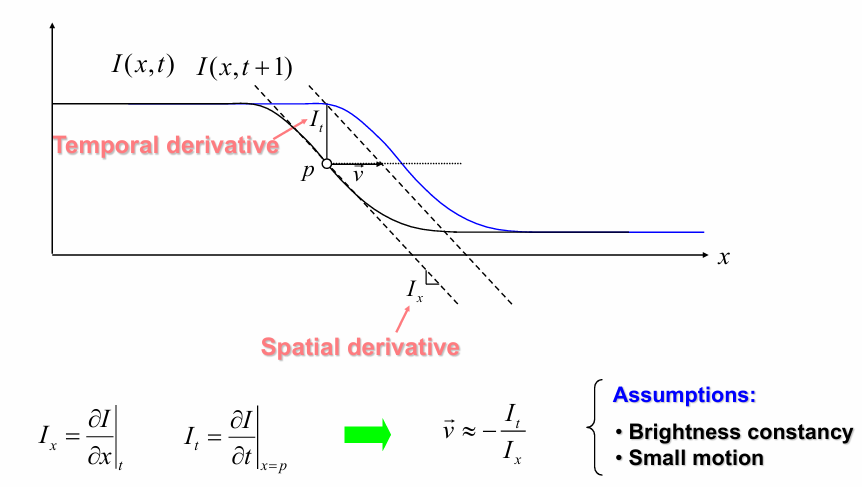

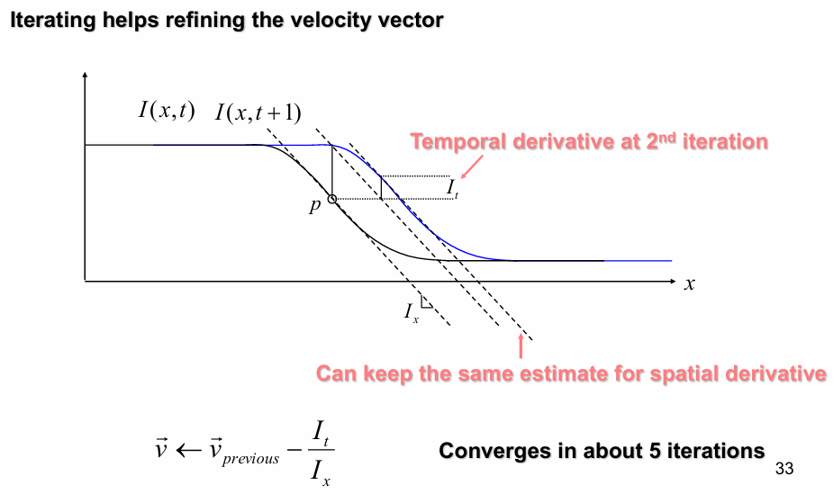

#### Temporal Aliasing

**Temporal aliasing** is the phenomenon that occurs when the sampling rate is too low to capture the motion of the object. It can cause the object to appear to move in the opposite direction or at a different speed.

Here, temporal aliasing causes ambiguity in the optical flow because many pixels have the same brightness (intensity).

To resolve this problem, a **coarse-to-fine** approach is used. The idea is to compute the optical flow at a low resolution and then refine it at a higher resolution.

At top level:

1. Apply Lucas-Kanade to get a flow field $(u, v)$ from frame 1 to frame 2.
2. Warp frame 1 to frame 2 using the flow field $(u, v)$, obtaining a new image $I_1'$.
3. Apply Lucas-Kanade to get a new flow field $(u', v')$ from $I_1'$ to frame 2.
4. Repeat until convergence.

At next level:
1. Upsample the flow field $(u', v')$ to the next level $(u_0, v_0)$, which will be used as the initial guess for the next level.
2. Warp frame 1 to frame 2 using the flow field $(u_0, v_0)$, obtaining a new image $I_1'$.
3. Repeat the above steps until the flow field converges.

```python
def lucas_kanade(I1, I2, window_size):
    # Compute image gradients
    Ix = cv2.Sobel(I1, cv2.CV_64F, 1, 0, ksize=5)
    Iy = cv2.Sobel(I1, cv2.CV_64F, 0, 1, ksize=5)
    It = I2 - I1

    # Initialize flow field
    u = np.zeros_like(I1)
    v = np.zeros_like(I1)

    # Iterate over each pixel in the image
    for i in range(window_size // 2, I1.shape[0] - window_size // 2):
        for j in range(window_size // 2, I1.shape[1] - window_size // 2):
            # Extract window around pixel (i, j)
            Ix_window = Ix[i - window_size // 2:i + window_size // 2 + 1, j - window_size // 2:j + window_size // 2 + 1].flatten()
            Iy_window = Iy[i - window_size // 2:i + window_size // 2 + 1, j - window_size // 2:j + window_size // 2 + 1].flatten()
            It_window = It[i - window_size // 2:i + window_size // 2 + 1, j - window_size // 2:j + window_size // 2 + 1].flatten()

            # Construct matrix A and vector b
            A = np.vstack((Ix_window, Iy_window)).T
            b = -It_window

            # Solve for flow vector [u v]
            nu = np.linalg.pinv(A) @ b
            u[i, j] = nu[0]
            v[i, j] = nu[1]

    return u, v

def optical_flow(I1, I2, num_levels, window_size):
    # Initialize flow field
    u = np.zeros_like(I1)
    v = np.zeros_like(I1)

    # Coarse-to-fine pyramid
    for level in range(num_levels - 1, -1, -1):
        # Resize images to current level
        I1_level = cv2.resize(I1, (I1.shape[1] // (2 ** level), I1.shape[0] // (2 ** level)))
        I2_level = cv2.resize(I2, (I2.shape[1] // (2 ** level), I2.shape[0] // (2 ** level)))

        # Compute optical flow at current level
        u_level, v_level = lucas_kanade(I1_level, I2_level, window_size)

        # Upsample flow field to next level
        if level < num_levels - 1:
            u = cv2.resize(u_level, (I1.shape[1], I1.shape[0]), interpolation=cv2.INTER_LINEAR)
            v = cv2.resize(v_level, (I1.shape[1], I1.shape[0]), interpolation=cv2.INTER_LINEAR)

    return u, v
```