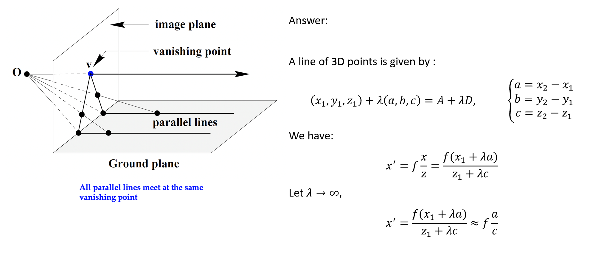

# CS4186 - Exercises

## Tutorial 5 - Convolution

$K$ is a 2D symmetric filter of size $k \times k$. $k$ is an odd number. By convoluting $K$ with an image $I$, we obtain a filtered image $I_K = K \ast I$.

(1) Given a pixel at location $(x, y)$, find its value in the filtered image $I_K(x, y)$.

(2) Assume the size of $I$ is $N \times N$, calculate the number of operations required to compute the filtered image $I_K$.

(3) If $K = gh$, where $g=\R^{k\times 1}$ and $h=\R^{1\times k}$ are two 1D filters, prove $I_K = (I \ast g) \ast h$. What is the number of operations required to compute $I_K$ in this case?

Answer:

(1) The value of $I_K(x, y)$ is its neighboring pixels convoluted with the filter $K$.

Recall that convolution uses a flipped version of the filter. The value of $I_K(x, y)$ is given by

$$
I_K(x, y) = \sum_{i=-\frac{k-1}{2}}^{\frac{k-1}{2}} \sum_{j=-\frac{k-1}{2}}^{\frac{k-1}{2}} K(i, j) I(x-i, y-j)
$$

(2) In the $N \times N$ image, only the center $(N-k+1) \times (N-k+1)$ pixels will be convoluted with the filter $K$. For each pixel,

- $k^2$ multiplications between $K(i, j)$ and $I(x-i, y-j)$ are performed.
- Then $k^2-1$ additions are performed.

Therefore the total number of operations is

- Multiplications: $O_{m1} = (N-k+1)^2 \cdot k^2$
- Additions: $O_{a1} = (N-k+1)^2 \cdot (k^2-1)$

(3)

Remarks on the dimension:

$$
\begin{aligned}
I \ast K &= \begin{bmatrix}
I_{11} & I_{12} & \cdots & I_{1N} \\
I_{21} & I_{22} & \cdots & I_{2N} \\
\vdots & \vdots & \ddots & \vdots \\
I_{N1} & I_{N2} & \cdots & I_{NN}
\end{bmatrix} \ast \begin{bmatrix}
g_1h_1 & g_2h_1 & \cdots & g_kh_1 \\
g_1h_2 & g_2h_2 & \cdots & g_kh_2 \\
\vdots & \vdots & \ddots & \vdots \\
g_1h_k & g_2h_k & \cdots & g_kh_k
\end{bmatrix} \\
&= \begin{bmatrix}
i_{11} & i_{12} & \cdots & i_{1(N-k+1)} \\
i_{21} & i_{22} & \cdots & i_{2(N-k+1)} \\
\vdots & \vdots & \ddots & \vdots \\
i_{(N-k+1)1} & i_{(N-k+1)2} & \cdots & i_{(N-k+1)(N-k+1)}
\end{bmatrix}
\end{aligned}
$$

$$
\begin{aligned}
(I \ast g) \ast h &= \begin{bmatrix}
I_{11} & I_{12} & \cdots & I_{1N} \\
I_{21} & I_{22} & \cdots & I_{2N} \\
\vdots & \vdots & \ddots & \vdots \\
I_{N1} & I_{N2} & \cdots & I_{NN}
\end{bmatrix} \ast \begin{bmatrix}
g_1 & g_2 & \cdots & g_k
\end{bmatrix} \ast h \\
&= \begin{bmatrix}
j_{11} & j_{12} & \cdots & j_{1(N-k+1)} \\
j_{21} & j_{22} & \cdots & j_{2(N-k+1)} \\
\vdots & \vdots & \ddots & \vdots \\
j_{N1} & j_{N2} & \cdots & j_{N(N-k+1)}
\end{bmatrix} \ast \begin{bmatrix}
h_1 \\ h_2 \\ \vdots \\ h_k
\end{bmatrix} \\
&= \begin{bmatrix}
i_{11} & i_{12} & \cdots & i_{1(N-k+1)} \\
i_{21} & i_{22} & \cdots & i_{2(N-k+1)} \\
\vdots & \vdots & \ddots & \vdots \\
i_{(N-k+1)1} & i_{(N-k+1)2} & \cdots & i_{(N-k+1)(N-k+1)}
\end{bmatrix}
\end{aligned}
$$

Since $g$ is a $k \times 1$ matrix extending in ROW direction, $N$ values from each ROW is convolutioned with $g$, resulting in $(N-k+1)$ values. The number of ROWs is not affected in the $I \ast g$ operation, so the result is a $N \times (N-k+1)$ matrix.

$$
(I \ast g) = I_g (x, y)= \sum_{j=-\frac{k-1}{2}}^{\frac{k-1}{2}} g(j) I(x, y-j)
$$

$$
\begin{aligned}
(I \ast g) \ast h (x, y) &= \sum_{i=-\frac{k-1}{2}}^{\frac{k-1}{2}} h(i) I_g(x-i, y) \\
&= \sum_{i=-\frac{k-1}{2}}^{\frac{k-1}{2}} h(i) \sum_{j=-\frac{k-1}{2}}^{\frac{k-1}{2}} g(j) I(x-i, y-j) \\
&= \sum_{i=-\frac{k-1}{2}}^{\frac{k-1}{2}} \sum_{j=-\frac{k-1}{2}}^{\frac{k-1}{2}} h(i) g(j) I(x-i, y-j) \\
&= \sum_{i=-\frac{k-1}{2}}^{\frac{k-1}{2}} \sum_{j=-\frac{k-1}{2}}^{\frac{k-1}{2}} K(i, j) I(x-i, y-j) \\
&= I_K(x, y)
\end{aligned}
$$

The number of operations:

(1) In $I \ast g$, each of the $N$ rows have $(N-k+1)$ values to be convoluted with $g$. For each value, $k$ multiplications and $k-1$ additions are performed. Therefore the total number of operations is

- Multiplications: $O_{m2} = N \cdot (N-k+1) \cdot k$
- Additions: $O_{a2} = N \cdot (N-k+1) (k-1)$

(2) In $(I \ast g) \ast h$, each of the $(N-k+1)$ rows have $(N-k+1)$ values to be convoluted with $h$. For each value, $k$ multiplications and $k-1$ additions are performed. Therefore the total number of operations is

- Multiplications: $O_{m3} = (N-k+1) (N-k+1) \cdot k$
- Additions: $O_{a3} = (N-k+1) (N-k+1)  (k-1)$

The total number of operations is

- Multiplications: $O_m = O_{m2} + O_{m3} = k \cdot (N-k+1) \cdot [N + (N-k+1)]= k \cdot (N-k+1) (2N-k+1)$
- Additions: $O_a = O_{a2} + O_{a3} = (k-1)(N-k+1) \cdot [N + (N-k+1)] = (k-1)(N-k+1) (2N-k+1)$

It can be observed, $O_m < O_{m1}$ and $O_a > O_{a1}$.

## Tutorial 6 - Grayscale Histogram, Harris Corner Detection

(1) The histogram of a grayscale image looks like this:

$ 0 < r_1 < r_2 < r_3 < 128 < 255 $

$f(r_1)=f(r_2)=f(r_3)=p$, all other values are zero.

Describe the image and find the value of $p$.

Answer:

The image will be a dark image consisting of only three gray levels. $p=\frac{1}{3}$.

(2)

$$
I = \begin{bmatrix}
0 & 0 & 1 & 4 & 9 \\
1 & \boxed{0} & \boxed{5} & \boxed{7} & 11 \\
1 & \boxed{4} & \boxed{9} & \boxed{12} & 16 \\
3 & \boxed{8} & \boxed{11} & \boxed{14} & 16 \\
8 & 10 & 15 & 16 & 20
\end{bmatrix}
$$

The highlighted section is called $W$ (window).

$\frac{d}{dx} = [-1 \quad 0 \quad 1]$, $\frac{d}{dy} = \begin{bmatrix} -1 \\ 0 \\ 1 \end{bmatrix}$

(2.1) Compute the derivative of $I$ in $x$ and $y$ directions.

$$
\frac{dI}{dx} = \begin{bmatrix}
\times & \times & \times & \times & \times \\
\times & 4 & 7 & 6 & \times \\
\times & 8 & 8 & 7 & \times \\
\times & 8 & 6 & 5 & \times \\
\times & \times & \times & \times & \times
\end{bmatrix}
$$

Remarks: according to the difference operator, the derivative in $x$ direction is computed by subtracting the right pixel from the left pixel. e.g. $\frac{dI}{dx}(2, 2) = I(2, 3) - I(2, 1) = 5 - 1 = 4$. (The matrix is 1-indexed.)

$$
\frac{dI}{dy} = \begin{bmatrix}
\times & \times & \times & \times & \times \\
\times & 4 & 8 & 8 & \times \\
\times & 8 & 6 & 7 & \times \\
\times & 6 & 6 & 4 & \times \\
\times & \times & \times & \times & \times
\end{bmatrix}
$$

(2.2) Compute the Harris matrix $H$ for the window $W$. The formula is

$$
H = \sum_{(x, y) \in W} \begin{bmatrix} I_x^2 & I_x I_y \\ I_x I_y & I_y^2 \end{bmatrix}
$$

where $I_x = \frac{dI}{dx}$ and $I_y = \frac{dI}{dy}$.

Code for illustrating the process of computing $H$:

```python
I_x = [[4, 7, 6], [8, 8, 7], [8, 6, 5]]
I_y = [[4, 8, 8], [8, 6, 7], [6, 6, 4]]

def square_sum(matrix):
    return sum([sum([x**2 for x in row]) for row in matrix])

def cross_sum(matrix1, matrix2):
    return sum([sum([x*y for x, y in zip(row1, row2)]) for row1, row2 in zip(matrix1, matrix2)])

def harris(I_x, I_y):
    return [[square_sum(I_x), cross_sum(I_x, I_y)], [cross_sum(I_x, I_y), square_sum(I_y)]]
```

(This is only to simulate if you need to compute only with a calculator. In practice you can use numpy to compute the matrix.)

The result is $$H = \begin{bmatrix} 403 & 385 \\ 385 & 381 \end{bmatrix}$$

(2.3) Compute the corner response $R$ for the window $W$. The formula is $R = \det(H) - k \cdot \text{trace}(H)^2$, where $k=0.04$.

```python
def det(matrix):
    return matrix[0][0] * matrix[1][1] - matrix[0][1] * matrix[1][0]

def trace(matrix):
    return matrix[0][0] + matrix[1][1]
```

Result: $\det(H) = 5318, \text{trace}(H) = 784, R = 5318 - 0.04 \cdot 784^2 = -19268.24$

Conclusion: The corner response is negative, which means the window is not a corner.

## Tutorial 7 - Convolution, SIFT

(1) Compute the convolution.

(1.1) $I = [56 \quad 64 \quad 79 \quad 98 \quad 115 \quad 126 \quad 132 \quad 133]$, $F = [1 \quad 0 \quad -1]$.

Flipped $F$: $F^* = [-1 \quad 0 \quad 1]$.

So the convolution is obtained by subtracting the right pixel with the left pixel for each of the center pixels.

$$
I \ast F = [79-56 \quad 98-64 \quad 115-79 \quad 126-98 \quad 132-115 \quad 133-126] = [23 \quad 34 \quad 36 \quad 28 \quad 17 \quad 7]
$$

(1.2) $I = \begin{bmatrix} 4 & 6 & 7 & 5 & 8 \\ 1 & 2 & 8 & 9 & 8 \\ 7 & 7 & 5 & 9 & 9 \\ 3 & 9 & 5 & 5 & 6\end{bmatrix}$, $F = \begin{bmatrix} 0 & 1 & 0 \\ 1 & -1 & 1 \\ 0 & 1 & 0 \end{bmatrix}$.

$$
I \ast F = \begin{bmatrix} 20 & 15 & 21 \\ 16 & 24 & 19 \end{bmatrix}
$$

where 20 is obtained by $6 + 1 + 8 + 7 + (-1) \cdot 2 = 20$.

(2) Can Harris corner detector be used to detect edges? Explain your answer by describing how Harris matrix will respond to edges.

Answer:

Yes. Harris corner detector computes the corner response $R = \det(H) - k \cdot \text{trace}(H)^2$.

It can also be represented as $R = \lambda_1 \lambda_2 - k(\lambda_1 + \lambda_2)^2$.

When edge is detected, one of the eigenvalues will be significantly larger than the other, and $R$ will be negative. This is because the determinant of $H$ is the product of the eigenvalues, and the trace is the sum of the eigenvalues. When one of the eigenvalues is large, the product will be large, but the sum will be small. Therefore $R$ will be negative.

(3) Explain how SIFT can achieve invariances in (i) illumination, (ii) scale, (iii) rotation.

- Illumination: SIFT uses the difference of Gaussian (DoG) to detect keypoints. The DoG is less sensitive to illumination changes compared to the original image.
- Scale: SIFT uses the scale-space representation to detect keypoints at different scales.
- Rotation: SIFT uses the orientation histogram to detect the dominant orientation of the keypoint, and then rotates the keypoint to align with the dominant orientation.

(4) Find local extrema in scale-space.

To do this, build the **Difference of Gaussian** (DoG) pyramid. The DoG is obtained by subtracting the Gaussian blurred images at neighboring scales.

Then each pixel in the DoG pyramid is compared with its 26 neighbors (8 in the same scale, 9 in the scale above, 9 in the scale below). If the pixel is the maximum or minimum among the neighbors, it is considered as a local extrema.

## Tutorial 8 - Linear Transformation, Image Mapping

(1) Please convert the following Homogeneous coordinates to Rectangular coordinates, and determine which ones belong to the same image coordinate.

Hint: Cartesian coordinates, also called rectangular coordinates, provide a method of rendering graphs and indicating the positions of points on a two-dimensional (2D) surface or in three-dimensional (3D) space.

- $(3,2,1) \rightarrow (3,2)$
- $(6,4,2) \rightarrow (3,2)$
- $(15a,10a,5a) (a\neq 0) \rightarrow (3,2)$
- $(16,8,4) \rightarrow (4,2)$

(2) $f = \begin{bmatrix} 1 & -3 & 5 \\ -2 & 1 & -3 \\ 0 & 0 & 1 \end{bmatrix}$ is an affine transformation matrix. Find $f(6, -8)$ and $f^{-1}(-2,-4)$.

$f$ translates to $f(x, y) = (x-3y+5, -2x+y-3)$.

Then $f(6, -8) = (6-3(-8)+5, -2\cdot 6+(-8)-3) = (35,-23)$.

$$
\begin{bmatrix} 1 & -3 & 5 \\ -2 & 1 & -3 \\ 0 & 0 & 1 \end{bmatrix} \begin{bmatrix} x \\ y \\ 1 \end{bmatrix} = \begin{bmatrix} -2 \\ -4 \\ 1 \end{bmatrix}
$$

Simplied, we have $x-3y+5=-2$ and $-2x+y-3=-4$. Solving the equations, we have $x=2,y=3$.

(3)	Please write the pseudocode of the inverse warping given the inverse matrix of T.
Here is the pseudocode of forward warping:

```
Forward(I, I', T)
{
    for (y=0; y<I.height; y++)
    {
        for (x=0; x<I.width; x++)
        {
            (x', y') = T(x, y);
            I'(x', y') = I(x, y);
        }
    }
}
```

Answer:

```
Inverse(I, I', T_inv)
{
    for (y=0; y<I'.height; y++)
    {
        for (x=0; x<I'.width; x++)
        {
            (x', y') = T_inv(x, y);
            I(x', y') = I'(x, y);
        }
    }
}
```

## Lecture 8 - Camera Model

(1) A pinhole camera has focal length 5mm. Each pixel is 0.02mm×0.02mm and the image principle point is at pixel (500,500). Pixel coordinate start at (0,0) in the upper-left corner of the image. 

(a) Show the 3×3 camera matrix for this camera.

(b) Assume the world coordinate system is aligned with camera coordinate system (i.e., their origins are the same and their axes are aligned), and the origins are at the camera’s pinhole, show the 3×4 projection matrix.

(c) What is the projection of a 3D scene point (100, 150, 800) into image coordinates?

Answer:

(a) Principle point $(c_x, c_y) = (500, 500)$, focal length $f=5 \text{mm}$.

Mapping ratio $k_x = k_y = \frac{1 \text{px}}{0.02 \text{mm}} = 50$.

$\alpha = fk_x = 5 \cdot 50 = 250$, $\beta = fk_y = 5 \cdot 50 = 250$.

$K = \begin{bmatrix} \alpha & 0 & c_x \\ 0 & \beta & c_y \\ 0 & 0 & 1 \end{bmatrix} = \begin{bmatrix} 250 & 0 & 500 \\ 0 & 250 & 500 \\ 0 & 0 & 1 \end{bmatrix}$

(2) The projection matrix is $P = K[I\quad 0] = \begin{bmatrix} 250 & 0 & 500 & 0 \\ 0 & 250 & 500 & 0 \\ 0 & 0 & 1 & 0 \end{bmatrix}$.

(3)

$$
\begin{bmatrix} 250 & 0 & 500 & 0 \\ 0 & 250 & 500 & 0 \\ 0 & 0 & 1 & 0 \end{bmatrix} \begin{bmatrix} 100 \\ 150 \\ 800 \\ 1 \end{bmatrix} = \begin{bmatrix} x' \\ y' \\ w \end{bmatrix}
$$

The representation is $MP=P'$, where $M$ is the projection matrix, $P$ is the h.g. coordinate of the 3D point, and $P'$ is the h.g. coordinate of the 2D point. Remarks: here a $3 \times 4$ matrix is multiplied with a $4 \times 1$ matrix, resulting in a $3 \times 1$ matrix.

Result is $\begin{bmatrix} 250 \cdot 100 + 500 \cdot 800 \\ 250 \cdot 150 + 500 \cdot 800 \\ 800 \end{bmatrix} = \begin{bmatrix} 425000 \\ 437500 \\ 800 \end{bmatrix}$.

$x' = \frac{425000}{800} = 531.25$, $y' = \frac{437500}{800} = 546.875$.

## Tutorial 9 - Camera Model

(1) In the 3D space, a line passes through $(x_1, y_1, z_1)$ and $(x_2, y_2, z_2)$. Represent the line in vector, parametric and symmetric forms.

Vector form: $(x, y, z) = (x_1, y_1, z_1) + t \cdot (x_2-x_1, y_2-y_1, z_2-z_1)$

Parametric form: $x = x_1 + t \cdot (x_2-x_1), y = y_1 + t \cdot (y_2-y_1), z = z_1 + t \cdot (z_2-z_1)$

Symmetric form: $\frac{x-x_1}{x_2-x_1} = \frac{y-y_1}{y_2-y_1} = \frac{z-z_1}{z_2-z_1}$

(2) Show that the perspective projection of a line in 3D is still a line on the image plane.

According to the symmetric form, we can represent a point $(x, y, z)$ on the line in 3D space as

$x = m_x z +b_x, y = m_y z + b_y \quad (1)$

where $m_x = \frac{x_2-x_1}{z_2-z_1}, m_y = \frac{y_2-y_1}{z_2-z_1}$ are slopes, $b_x = \frac{x_1 z_2-x_2 z_1}{z_2-z_1}, b_y = \frac{y_1 z_2-y_2 z_1}{z_2-z_1}$ are intercepts.

Assuming $P' (x', y')$ is the projection of $(x, y, z)$ on the image plane, we have

$\frac{x}{x'} = \frac{z}{f}, \frac{y}{y'} = \frac{z}{f}$

or $x = \frac{f}{z} x', y = \frac{f}{z} y' \quad (2)$

Combining $(1)$ and $(2)$, we have

$\frac{z}{f} x' - m_x z = b_x, \frac{z}{f} y' - m_y z = b_y$

$\frac{\frac{z}{f} x' - m_x z}{\frac{z}{f} y' - m_y z} = \frac{b_x}{b_y} \rightarrow \frac{\frac{x'}{f} - m_x}{\frac{y'}{f} - m_y} = \frac{b_x}{b_y}$

$x' = \frac{b_x}{b_y} y' + f \left( m_x - \frac{b_x}{b_y} m_y \right)$

So $P'(x', y')$ is on a line with slope $m' = \frac{b_x}{b_y}$ and intercept $b' = f \left( m_x - \frac{b_x}{b_y} m_y \right)$.

## Tutorial 10 - Camera Model

(1) Please use the camera model to explain the following observations: 

The focal length in a pinhole camera model determines the field of view of the camera. A shorter focal length results in a wider field of view and more of the scene being captured in the image, but objects appear smaller. Conversely, a longer focal length results in a narrower field of view with less of the scene captured, but objects appear larger. This is similar to the concept of "zooming in" or "zooming out" in photography. 

From 3D coordinates $(X, Y, Z)$ to image coordinates $(u, v)$, we have $u = \frac{f}{Z} X + c_x$, $v = \frac{f}{Z} Y + c_y$.

If focal length $f$ is decreased, the object at $(X, Y, Z)$ will have a projection $(u', v')$ closer to the principal point $(c_x, c_y)$, which means the object appears smaller in the image, and more of the scene is captured in the image. So, the focal length directly affects the scale of the projected image in the pinhole camera model.

(2) Please use the camera model to explain the vanishing point. 

Hint: A vanishing point is a point on the image plane of a perspective drawing where the 2D perspective projections of mutually parallel lines in 3D space (perpendicular to a picture plane) appear to converge.



## Tutorial 11 - Camera Model

(1) Find the trace, determinant, characteristic equation and eigenvalues of the following matrix:

$A = \begin{bmatrix} 1 & 2 \\ 1 & 3 \end{bmatrix}$

$B = \begin{bmatrix} a & -2 \\ a & 3 \end{bmatrix}$

Trace: $\text{tr}(M) = \sum_{i=1}^n M_{ii}$

$\text{tr}(A) = 1 + 3 = 4, \text{tr}(B) = a + 3$

Determinant: for 2x2 $\det(M) = x_{11}x_{22} - x_{12}x_{21}$

for 3x3 $\det(M) = x_{11}x_{22}x_{33} + x_{12}x_{23}x_{31} + x_{13}x_{21}x_{32} - x_{13}x_{22}x_{31} - x_{12}x_{21}x_{33} - x_{11}x_{23}x_{32}$

$\text{det}(A) = 1 \cdot 3 - 2 \cdot 1 = 1, \text{det}(B) = a \cdot 3 - (-2) \cdot a = 5a$

Characteristic equation: $\det(M - \lambda I) = 0$

$\det(A - \lambda I) = \begin{vmatrix} 1-\lambda & 2 \\ 1 & 3-\lambda \end{vmatrix} = (1-\lambda)(3-\lambda) - 2 = \lambda^2 - 4\lambda + 1 = 0$

$\det(B - \lambda I) = \begin{vmatrix} a-\lambda & -2 \\ a & 3-\lambda \end{vmatrix} = (a-\lambda)(3-\lambda) + 2a = \lambda^2 - (a+3)\lambda + 5a = 0$

Eigenvalues: $\lambda_1, \lambda_2$ are the roots of the characteristic equation.

$\lambda_{1,2} = \frac{\text{tr}(M) \pm \sqrt{\text{tr}(M)^2 - 4\det(M)}}{2}$

$A: \lambda_{1,2} = \frac{4 \pm \sqrt{16 - 4}}{2} = 2 \pm \sqrt{3}$

$B: \lambda_{1,2} = \frac{a+3 \pm \sqrt{(a+3)^2 - 20a}}{2} = \frac{a+3 \pm \sqrt{a^2 - 14a + 9}}{2}$

(2) If $C = \begin{bmatrix} a & -2 \\ b & 3 \end{bmatrix}$, find all possible values of $b$ such that $C$ is symmetric.

A matrix $M$ is symmetric if $M = M^T$.

$C = \begin{bmatrix} a & -2 \\ b & 3 \end{bmatrix} = C^T = \begin{bmatrix} a & b \\ -2 & 3 \end{bmatrix}$

$b = -2$

(3) Given a 3D scene point P=(0, 2, 2) and a 3x4 projection matrix (intrinsic parameter and extrinsic parameters) as following

$\begin{bmatrix} 5 & -14 & 2 & 17 \\ -10 & -5 & -10 & 50 \\ -10 & 2 & -11 & 20 \end{bmatrix}$

Calculate the 2D image coordinate of the scene point after camera projection.

$\begin{bmatrix} 5 & -14 & 2 & 17 \\ -10 & -5 & -10 & 50 \\ -10 & 2 & -11 & 20 \end{bmatrix} \begin{bmatrix} 0 \\ 2 \\ 2 \\ 1 \end{bmatrix} = \begin{bmatrix} -7 \\ 20 \\ 2 \end{bmatrix}$

$(u, v) = (\frac{-7}{2}, \frac{20}{2}) = (-3.5, 10)$

(4) 
a.	How does SfM differ from traditional stereo vision?

Stereo Vision requires precisely calibrated cameras with known baseline distances to compute depth from disparity. SfM works with uncalibrated cameras and arbitrary camera motion, estimating both camera poses and 3D structure from feature matching. 

b.	What kind of input does SfM need?

- Multiple 2D images of the same scene.
- (Optional) Known camera intrinsics 

c.	How to apply RANSAC in SfM?

RANSAC (Random Sample Consensus) helps remove outliers in feature matching:

- Randomly selecting a subset of matches;
- Fitting a model;
- Count the number of inliers;
- Select the model with the maximum number of inliers;
- Reject those outliers in the set of matches. 
