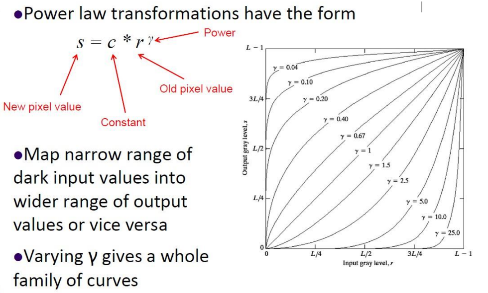
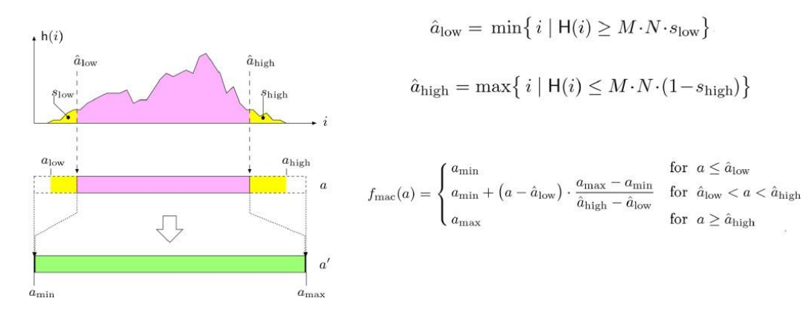
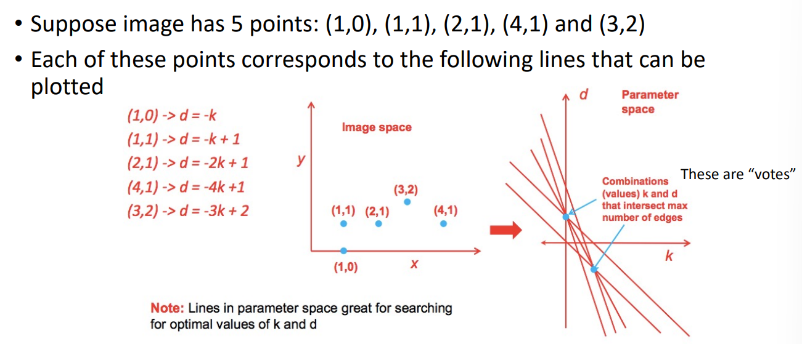
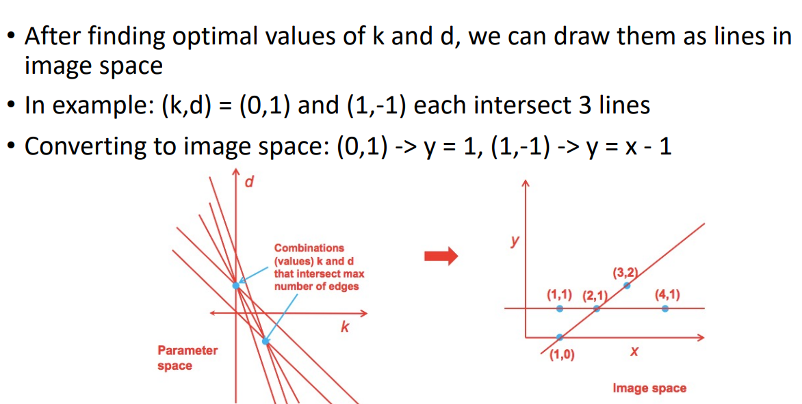
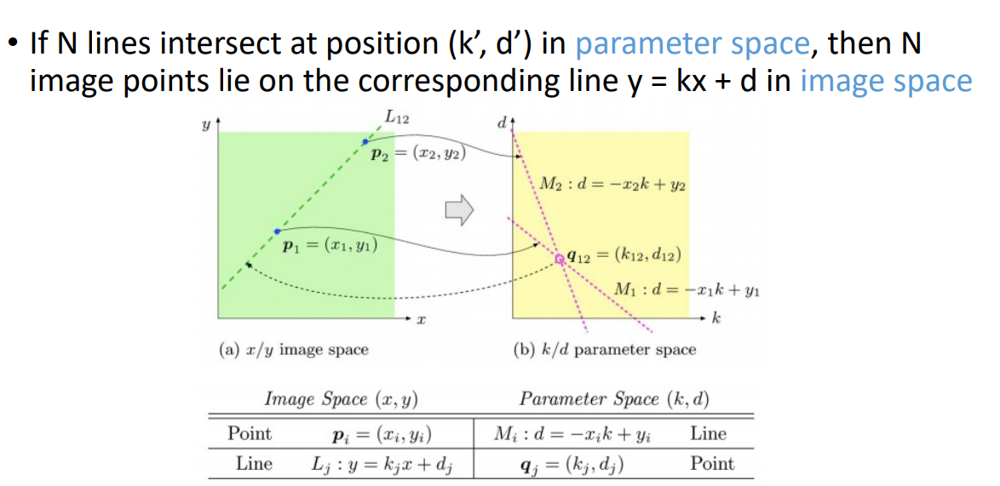
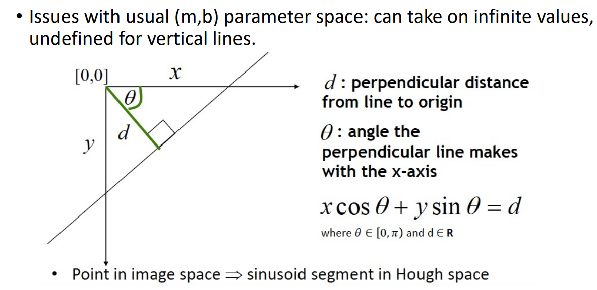
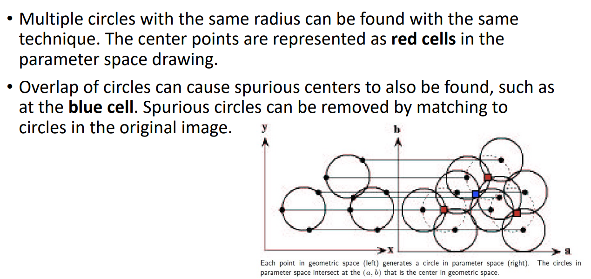
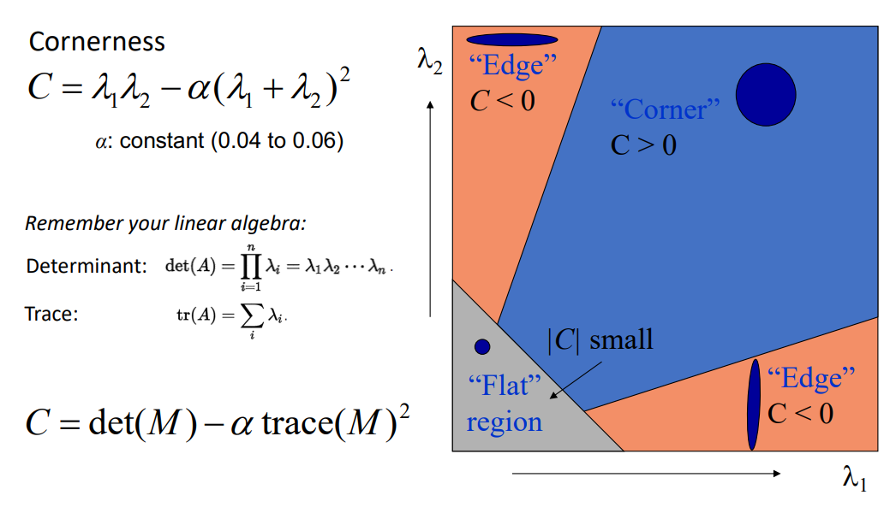

# CS4187 Computer Vision for Interactivity

## 01 Introduction

Definition of Computer Vision:

Make computers understand images and videos as humans do, and ultimately beyond human capabilities.

3 classical problems in computer vision:

- **Reconstruction**: Recovering 3D geometry from 2D images.
- **Recognition**: Attaching semantic category labels (recoginize or classify objects) to objects and scenes.
- **Reorganization**: Grouping and segmenting images and videos into meaningful regions.

Common applications:

- Face detection (recognition)
- Face makeovers (reorganization)
- Autonomous driving (reconstruction, recognition, reorganization)
- Vision-based biometrics (recognition)
- 3D modeling (reconstruction)
- Motion capture (reconstruction)

Definition of **Human-Computer Interaction** (HCI):

Narrowly speaking, HCI is roughly UI and UX design. 

Broadly speaking, HCI is the study and practice of designing, implementing, and evaluating interactive computing systems for human use and the study of major phenomena surrounding them.

Applications of CV in HCI: Augmented reality (AR), Virtual reality (VR).

## 02 Image Formation, Processing, and Filtering

### Fundamental Linear Algebra

For a 2D vector $\mathbf{v} = (x, y)$:

- Magnitude: $||\mathbf{v}|| = \sqrt{x^2 + y^2}$
- Orientation: $\theta = \tan^{-1}(y/x)$
- Unit vector: $\hat{\mathbf{v}} = \frac{\mathbf{v}}{||\mathbf{v}||} = (\cos\theta, \sin\theta)$

Matrix multiplication:

$$C_{n \times p} = A_{n \times m} B_{m \times p}$$

where $c_{ij} = \mathbf{a}_i \cdot \mathbf{b}_j = \sum_{k=1}^{m} a_{ik} b_{kj}$.

Matrix transpose:

$C_{m \times n} = A_{n \times m}^T$ where $c_{ij} = a_{ji}$.

- $(A+B)^T = A^T + B^T$
- $(AB)^T = B^T A^T$
- If $A^T = A$, then $A$ is symmetric.

Determinant of a $2 \times 2$ matrix:

$$\begin{vmatrix} a_{11} & a_{12} \\ a_{21} & a_{22} \end{vmatrix} = a_{11}a_{22} - a_{12}a_{21}$$

Determinant of a $3 \times 3$ matrix:

$$\begin{vmatrix} a_{11} & a_{12} & a_{13} \\ a_{21} & a_{22} & a_{23} \\ a_{31} & a_{32} & a_{33} \end{vmatrix} = a_{11}\begin{vmatrix} a_{22} & a_{23} \\ a_{32} & a_{33} \end{vmatrix} - a_{12}\begin{vmatrix} a_{21} & a_{23} \\ a_{31} & a_{33} \end{vmatrix} + a_{13}\begin{vmatrix} a_{21} & a_{22} \\ a_{31} & a_{32} \end{vmatrix}$$

Inverse of a square matrix $A$:

$A^{-1}$ such that $AA^{-1} = A^{-1}A = I$.

Inverse of a $2 \times 2$ matrix:

$$\begin{bmatrix} a & b \\ c & d \end{bmatrix}^{-1} = \frac{1}{ad - bc} \begin{bmatrix} d & -b \\ -c & a \end{bmatrix}$$

### Image Formation

Image coordinate system: Top-left is $(0, 0)$, $x$ increases to the right, $y$ increases downwards.

Image is a function $f: \mathbb{R}^2 \to \mathbb{R}^c$ where $c$ is the number of channels (1 for grayscale, 3 for RGB).

where $f(x, y)$ is the intensity at pixel $(x, y)$.

Image processing is an operation that takes an image as input and produces an image as output. Therefore it can be represented as a function $g: \mathbb{R}^c \to \mathbb{R}^c$.

- The range of $f$ can be changed: $g(x, y) = t(f(x, y))$.
- Or the domain can be changed: $g(x, y) = f(t_x(x, y), t_y(x, y))$.

### Image Processing

#### Point Processing

**Point processing**: each pixel is processed independently, no spatial information is used. Mathematically, $g = t(f)$ independent of position $x, y$.

Homogeneous point processing:

```python
def point_processing(I, t):
	'''
	Input: I(u, v): w x H
           t: function that maps intensity values to new intensity values
	'''
    w, H = I.shape
    I_prime = np.zeros((w, H), dtype=I.dtype)
    for v in range(H):
        for u in range(w):
            I_prime[u, v] = t(I[u, v])
    return I_prime
```

numpy vectorized version:

```python
def point_processing(I, t):
    I_prime = t(I)
    return I_prime
```

Non-homogeneous point processing:

```python
def nonhomogeneous_point_processing(I, t):
    '''
    Input: I(u, v): w x H
           t: function that maps intensity values and pixel position to new intensity values
    '''
    w, H = I.shape
    I_prime = np.zeros((w, H), dtype=I.dtype)
    for v in range(H):
        for u in range(w):
            I_prime[u, v] = t(I[u, v], u, v)
    return I_prime
```

numpy vectorized version:

```python
def nonhomogeneous_point_processing(I, t):
    w, H = I.shape
    U, V = np.meshgrid(np.arange(w), np.arange(H), indexing='ij') # create coordinate matrices
    I_prime = t(I, U, V)
    return I_prime
```

**Image brightness**: the average intensity of all pixels in the image.

$$B(I) = \frac{1}{wH} \sum_{v=1}^{H} \sum_{u=1}^{w} I(u, v)$$

- **Overexposed**: image brightness is too high. Loss of details in bright regions.
- **Underexposed**: image brightness is too low. Loss of details in dark regions.

**Image contrast**: the difference in intensity between the brightest and darkest parts of the image.

$$C(I) = I_{max} - I_{min}$$

- **Low contrast**: small difference between $I_{max}$ and $I_{min}$. Image looks "washed out".
- **High contrast**: large difference between $I_{max}$ and $I_{min}$. Image looks too harsh.

**Image negative**: invert the intensity values of the image.

$$I'(u, v) = 255 - I(u, v)$$

Usage: convert a dark image to a bright image, or vice versa.

#### Intensity Transformations

**Image clamping**: limit the intensity values to a specified range.

```python
def clamp(I, lo, hi):
    I[I < lo] = lo
    I[I > hi] = hi
    return I
```

numpy reference: `np.clip(I, lo, hi)`

Usage: remove noise or outliers in the image.

**Image thresholding**: convert a grayscale image to a binary image based on a threshold value.

```python
def thresholding(I, T):
    I[I < T] = 0
    I[I >= T] = 255
    return I
```

Usage: segment an image into foreground and background.

**Logarithmic transformation**:

$$I'(u, v) = c \cdot \log(1 + I(u, v))$$

where $c$ is a scaling constant. Useful for images with large dynamic range.

Usage: Enhance details in dark regions while compressing bright regions.

**Power-law (gamma) transformation**: adjust the brightness and contrast of an image.

$$I'(u, v) = c \cdot I(u, v)^\gamma$$

The higher the $\gamma$, the darker the image.

- If $0 < \gamma < 1$, the image is lightened.
- If $\gamma > 1$, the image is darkened.



**Intensity windowing**: A modified version of clamping that stretches the intensity values within a specified range to the full range of [0, 255].

```python
def intensity_windowing(I, low, high):
    I[I < low] = 0
    I[I > high] = 255
    I[(I >= low) & (I <= high)] = (I[(I >= low) & (I <= high)] - low) / (high - low) * 255
    return I
```

Usage: Improve contrast in images with poor contrast. (e.g. images with close levels of gray/brightness)

**Automatic contrast adjustment/Histogram equalization**: Use the lowest and highest intensity values in the image to perform intensity windowing.

```python
intensity_windowing(I, I.min(), I.max())
```

**Modified contrast adjustment**: Use the $p$-th and $(100-p)$-th percentiles of intensity values in the image to perform intensity windowing.

```python
lo = np.percentile(I, p)
hi = np.percentile(I, 100 - p)

intensity_windowing(I, lo, hi)
```

Usage: Avoid the influence of outliers in the image.

Mathematically

$$\hat{a}_\text{low} = \min\{ i | H(i) \geq wH \cdot \frac{p}{100} \}$$
$$\hat{a}_\text{high} = \max\{ i | H(i) \leq wH \cdot (1 - \frac{p}{100}) \}$$

$$f'(x, y) = \begin{cases} 0 & f(x, y) < \hat{a}_\text{low} \\ 255 & f(x, y) > \hat{a}_\text{high} \\ \frac{f(x, y) - \hat{a}_\text{low}}{\hat{a}_\text{high} - \hat{a}_\text{low}} \cdot 255 & \text{otherwise} \end{cases}$$



#### Noise

**Image noise**: random variations in pixel intensity values that can degrade image quality.

Common types of noise: Light variations; camera electronics; surface reflectance; lens.

Mathematically, let $I(i,j)$ be true pixel value and $n(i,j)$ be noise, then the observed pixel value is: $\hat{I}(i,j) = I(i,j) + n(i,j)$.

Common noise models:

**Gaussian noise**: noise values follow a Gaussian (normal) distribution with mean $\mu=0$ and standard deviation $\sigma$.

$n(i, j) = e^{-x^2 / 2\sigma^2} / \sqrt{2\pi\sigma^2}$

**Salt-and-pepper noise**: randomly replaces some pixel values with any value in the range [0, 255].

$$\hat{I}(i, j) = \begin{cases} I(i, j) & p < l \\ s_\text{min} + q (s_\text{max} - s_\text{min}) & p \geq l \end{cases}$$

where $p, q \sim U(0, 1)$, $l$ is the noise density, $s_\text{min} = 0$, $s_\text{max} = 255$.

**Impluse noise**: randomly replaces some pixel values with either the minimum or maximum value (0 or 255).

### Image Filtering

**Image filtering**: modify or enhance an image by applying a filter (or kernel) to the image.

```python
def filtering(I, g):
    '''
    Input: I(u, v): w x H
           g: a x a kernel
    '''
    w, H = I.shape
    a = g.shape[0]
    b = (a - 1) // 2  # assuming a is odd
    I_prime = np.zeros((w, H), dtype=I.dtype)
    for v in range(b, H - b):
        for u in range(b, w - b):
            sum = 0
            for j in range(-b, b + 1):
                for i in range(-b, b + 1):
                    sum += I[u + i, v + j] * g[i + b, j + b]
            I_prime[u, v] = sum
    return I_prime
```

numpy vectorized version:

```python
def filtering(I, g):
    w, H = I.shape
    a = g.shape[0]
    b = (a - 1) // 2  # assuming a is odd
    I_padded = np.pad(I, ((b, b), (b, b)), mode='edge')  # pad the image to handle borders
    I_prime = np.zeros((w, H), dtype=I.dtype)
    for v in range(H):
        for u in range(w):
            I_prime[u, v] = np.sum(I_padded[u:u + a, v:v + a] * g)
    return I_prime
```

$h[u, v] = \sum_{j=-b}^{b} \sum_{i=-b}^{b} f[u+i, v+j] \cdot g[i, j]$ where $b = \frac{a-1}{2}$. 

For $3 \times 3$ kernel, $b=1$.

Types of kernels:

- **Box filter**: $g = \frac{1}{9} \begin{bmatrix} 1 & 1 & 1 \\ 1 & 1 & 1 \\ 1 & 1 & 1 \end{bmatrix}$
- **Gaussian filter**: $g = \frac{1}{16} \begin{bmatrix} 1 & 2 & 1 \\ 2 & 4 & 2 \\ 1 & 2 & 1 \end{bmatrix}$
- **Sharpening filter**: $g = \begin{bmatrix} 0 & -1 & 0 \\ -1 & 5 & -1 \\ 0 & -1 & 0 \end{bmatrix}$
- **Sobel filter**: (vertical) $g_x = \begin{bmatrix} -1 & 0 & 1 \\ -2 & 0 & 2 \\ -1 & 0 & 1 \end{bmatrix}$; (horizontal) $g_y = \begin{bmatrix} 1 & 2 & 1 \\ 0 & 0 & 0 \\ -1 & -2 & -1 \end{bmatrix}$
- **Median filter**: non-linear filter / Useful for removing salt-and-pepper noise.

A larger kernel size can reduce noise more effectively, but it can also blur the image and remove important details.

Gaussian filter is preferred over box filter because it gives more weight to the center pixel and less weight to the surrounding pixels, which helps to preserve edges and details in the image.

## 03 Edge Detection

Axioms of convolution:

- Commutative: $f * g = g * f$
- Associative: $f * (g * h) = (f * g) * h$
- Distributive: $f * (g + h) = f * g + f * h$
- Scalar multiplication: $c(f * g) = (cf) * g = f * (cg)$

### Edge Detection

**Image segmentation**: partition an image into multiple segments (sets of pixels) to simplify or change the representation of an image into something more meaningful and easier to analyze.

**Edges**: significant local changes in intensity values in an image. They often correspond to object boundaries, surface markings, and changes in surface orientation.

Types of edges:

- **Step edge**: abrupt change in intensity values.
- **Ramp edge**: a step edge where the change occurs over a finite distance.
- **Ridge edge**: a thin line of high intensity values surrounded by low intensity values. Generated by lines.
- **Roof edge**: a ridge edge where the intensity values change occurs over a finite distance. Generated by intersections of planes.

Edge masks:

- $M = [-1, 0, 1]$ (for vertical edges)
- $M = \begin{bmatrix} -1 \\ 0 \\ 1 \end{bmatrix}$ (for horizontal edges)

Smoothing + edge detection:

- Since images are often noisy, we can first smooth the image using a Gaussian filter, then apply the edge detection filter.
- Denote the image as $f$, the Gaussian filter as $g$, and the edge detection filter as $h$. The final result is $h * (g * f) = (h * g) * f$.
- $h * g = \frac{1}{2} \begin{bmatrix} -1 & 0 & 1 \end{bmatrix} * \frac{1}{16} \begin{bmatrix} 1 & 2 & 1 \\ 2 & 4 & 2 \\ 1 & 2 & 1 \end{bmatrix} = \frac{1}{16} \begin{bmatrix} 1 & 0 & -1 \\ 2 & 0 & -2 \\ 1 & 0 & -1 \end{bmatrix}$

So sobel filter for vertical edge is $g_x = \frac{1}{8} \begin{bmatrix} -1 & 0 & 1 \\ -2 & 0 & 2 \\ -1 & 0 & 1 \end{bmatrix}$. Remember that when convoluted, the kernel is flipped center-wise.

Sobel filter for horizontal edge is $g_y = \frac{1}{8} \begin{bmatrix} -1 & -2 & -1 \\ 0 & 0 & 0 \\ 1 & 2 & 1 \end{bmatrix}$.

### Gradient

**Gradient**: a vector that points in the direction of the greatest rate of increase of a function. The magnitude of the gradient is the rate of increase in that direction.

Gradient magnitude:

$$||\nabla f|| = \sqrt{\left(\frac{\partial f}{\partial x}\right)^2 + \left(\frac{\partial f}{\partial y}\right)^2}$$

Gradient orientation:

$$\theta = \tan^{-1}\left(\frac{\partial f / \partial y}{\partial f / \partial x}\right)$$

To find the edges, we use **thresholding** on the gradient magnitude.

Standard thresholding:

$f'(x, y) = \begin{cases} 255 & ||\nabla f(x, y)|| \geq T \\ 0 & ||\nabla f(x, y)|| < T \end{cases}$

Hysteresis thresholding:

$f'(x, y) = \begin{cases} 255 & ||\nabla f(x, y)|| \geq T_\text{high} \\ 0 & ||\nabla f(x, y)|| < T_\text{low} \\ \text{check neighbors} & T_\text{low} \leq ||\nabla f(x, y)|| < T_\text{high} \end{cases}$

where "check neighbors" means if any of the 8-connected neighbors is an edge pixel (255), then set $f'(x, y) = 255$, otherwise set $f'(x, y) = 0$.

### Canny Edge Detector

After finding edges using gradient and thresholding, we can use **non-maximum suppression** to thin the edges.

- Check neighbors along the gradient direction.
- If the pixel is not a local maximum, set it to 0.

For implementation,

- Quantize the gradient direction into 4 angles: 0, 45, 90, 135 degrees.
- Check if the central pixel has the maximum gradient magnitude among the 3 pixels along the quantized direction.

```python
def canny_edge_detector(I, sigma, T_low, T_high):
    # Step 1: Smooth image
    I_smooth = gaussian_filter(I, sigma)

    # Step 2: Apply Sobel filter to get x and y derivatives
    sobel_x = np.array([[-1, 0, 1], [-2, 0, 2], [-1, 0, 1]])
    sobel_y = np.array([[1, 2, 1], [0, 0, 0], [-1, -2, -1]])
    I_x = convolve(I_smooth, sobel_x)
    I_y = convolve(I_smooth, sobel_y)

    # Step 3: Calculate gradient magnitude and orientation
    G = np.sqrt(I_x**2 + I_y**2)
    theta = np.arctan2(I_y, I_x) * (180 / np.pi)  # Convert to degrees
    theta[theta < 0] += 180  # Map angles to [0, 180]

    # Step 4: Non-maximum suppression
    G_nms = non_maximum_suppression(G, theta)

    # Step 5: Hysteresis thresholding
    edges = hysteresis_thresholding(G_nms, T_low, T_high)

    return edges

def non_maximum_suppression(G, theta):
    """
    Thin the edge magnitude map G by suppressing non-maximum pixels in the direction of the gradient.
    """
    M, N = G.shape
    Z = np.zeros((M,N), dtype=np.float32)
    angle = theta.copy()
    angle[angle < 0] += 180

    for i in range(1, M-1):
        for j in range(1, N-1):
            q = 255
            r = 255

            # Quantize angle to four directions
            if (0 <= angle[i,j] < 22.5) or (157.5 <= angle[i,j] <= 180):
                q = G[i, j+1]
                r = G[i, j-1]
            elif (22.5 <= angle[i,j] < 67.5):
                q = G[i+1, j-1]
                r = G[i-1, j+1]
            elif (67.5 <= angle[i,j] < 112.5):
                q = G[i+1, j]
                r = G[i-1, j]
            elif (112.5 <= angle[i,j] < 157.5):
                q = G[i-1, j-1]
                r = G[i+1, j+1]

            if (G[i,j] >= q) and (G[i,j] >= r):
                Z[i,j] = G[i,j]
            else:
                Z[i,j] = 0
    return Z

def hysteresis_thresholding(G_nms, T_low, T_high):
    """
    Perform edge tracking by hysteresis: strong edges are kept, weak edges are kept only if connected to strong ones.
    """
    M, N = G_nms.shape
    res = np.zeros((M,N), dtype=np.uint8)

    strong = 255
    weak = 75

    strong_i, strong_j = np.where(G_nms >= T_high)
    weak_i, weak_j = np.where((G_nms < T_high) & (G_nms >= T_low))

    res[strong_i, strong_j] = strong
    res[weak_i, weak_j] = weak

    # Edge tracking by hysteresis
    for i in range(1, M-1):
        for j in range(1, N-1):
            if (res[i,j] == weak):
                if ((res[i+1, j-1] == strong) or (res[i+1, j] == strong) or (res[i+1, j+1] == strong)
                    or (res[i, j-1] == strong) or (res[i, j+1] == strong)
                    or (res[i-1, j-1] == strong) or (res[i-1, j] == strong) or (res[i-1, j+1] == strong)):
                    res[i,j] = strong
                else:
                    res[i,j] = 0
    return res
```

Effect of $\sigma$:

- Larger $\sigma$ detects large scale edges.
- Smaller $\sigma$ detects fine features.

### Hough Transform

**Hough Transform**: a feature extraction technique used to detect simple shapes (e.g., lines, circles) in an image.

**Voting**: a general technique where each data point votes for a set of parameters that could explain it.





If $N$ lines intersect at position $(k', d')$ in the parameter space, then $N$ image points lie on $y = k'x + d'$ in the image space.



We use polar cordinates to represent lines:

$$y = kx + d \rightarrow \rho = x\cos\theta + y\sin\theta$$

where $\rho = d\sqrt{1+k^2}$ and $\theta = \tan^{-1}(-1/k)$.



Steps of Hough Transform for line detection:

1. Initialize the accumulator array $H$ and all $H(\rho, \theta) = 0$.
2. For each edge pixel $(x, y)$ in the image:
  - For each $0 < \theta < \frac{\pi}{2}$ with quantization step $\Delta\theta$:
    - Compute $\rho = x\cos\theta + y\sin\theta$.
    - Increment $H(\rho, \theta)$ by 1.
3. Find the values of $(\rho, \theta)$ where $H(\rho, \theta)$ exceeds a certain threshold.
4. The detected line is given by $\rho = x\cos\theta + y\sin\theta$.

```python
def hough_transform(edges):
    height, width = edges.shape
    diag_len = int(np.sqrt(height**2 + width**2))  # Maximum possible rho
    rhos = np.arange(-diag_len, diag_len, 1)
    thetas = np.deg2rad(np.arange(0, 180))  # Theta from 0 to 179 degrees

    accumulator = np.zeros((len(rhos), len(thetas)), dtype=np.int)

    y_idxs, x_idxs = np.nonzero(edges)  # Get coordinates of edge pixels

    for i in range(len(x_idxs)):
        x = x_idxs[i]
        y = y_idxs[i]
        for t_idx in range(len(thetas)):
            theta = thetas[t_idx]
            rho = int(round(x * np.cos(theta) + y * np.sin(theta))) + diag_len
            accumulator[rho, t_idx] += 1

    return accumulator, rhos, thetas

# usage
edges = canny_edge_detector(I, sigma=1.0, T_low=50, T_high=150)
accumulator, rhos, thetas = hough_transform(edges)
# Find peaks in accumulator to detect lines
peaks = find_peaks(accumulator)
```

Hough Transform for circle detection:

- For known radius $r$, the parametric equation of a circle is $(x - a)^2 + (y - b)^2 = r^2$ where $(a, b)$ is the center of the circle.
- For unknown radius, we need a 3D accumulator array $H(a, b, r)$.
- Multiple circles all with the same known radius can also be detected using a 2D accumulator array.
    - However, overlapping circles can cause **spurious centers** to be detected.



Basic idea of single circle detection with known radius $r$:

1. Initialize the accumulator array $H(a, b) = 0$.
2. For each edge pixel $(x, y)$ in the image:
   - Compute the circle center $(a, b)$ for each angle $\theta$:
     - $a = x - r \cos\theta$
     - $b = y - r \sin\theta$
   - Increment the accumulator: $H(a, b) \leftarrow H(a, b) + 1$
3. Find the local maxima in the accumulator array to detect circle centers.

## 04 Image Segmentation

Goal: Find coherent blobs or specific objects in an image.

**Gestalt** is a German word meaning "shape" or "form". The **Gestalt laws of perceptual grouping** describe how humans naturally perceive visual elements as organized patterns or wholes, rather than as separate components.

Image segmentation is the operation of partitioning an image into a collection of 

- **regions** (covering the entire image)
- **linear structures**
- **2D blobs**

### Thresholding

Common goal: separate foreground from background.

#### Histogram-Based Thresholding

Separate the pixels into two halves by automatically finding a threshold $t$ based on the image histogram.

1. Make an initial guess of the threshold $t$.
2. Calculate the mean pixel value in each category:
   - $m_1$: mean of pixels with intensity $\leq t$
   - $m_2$: mean of pixels with intensity $> t$
3. Update the threshold: $t = \frac{m_1 + m_2}{2}$
4. Repeat steps 2-3 until convergence.

We can optimize the above algorithm by precomputing the histogram and using cumulative sums to compute means efficiently.

```python
def histogram_thresholding(I, initial_t=128, max_iter=100, tol=1):
    hist, _ = np.histogram(I, bins=256, range=(0, 256))
    total_pixels = I.size
    t = initial_t
    for _ in range(max_iter):
        weight1 = hist[:t+1].sum()
        weight2 = hist[t+1:].sum()
        if weight1 == 0 or weight2 == 0:
            break
        m1 = (np.arange(t+1) * hist[:t+1]).sum() / weight1
        m2 = (np.arange(t+1, 256) * hist[t+1:]).sum() / weight2
        new_t = (m1 + m2) / 2
        if abs(new_t - t) < tol:
            break
        t = int(new_t)
    return t
```

#### Minimum Error Thresholding

Assumes the image histogram is a mixture of two Gaussian distributions (foreground and background). The optimal threshold minimizes the classification error. Also known as the Kittler-Illingworth method.

1. Make an initial guess of the threshold $t$.
2. Calculate the prior probabilities, means, and variances $(p_1, \mu_1, \sigma_1^2)$ and $(p_2, \mu_2, \sigma_2^2)$ for the two categories.
3. Update the threshold using the formula:
    - $A = \frac{1}{\sigma_1^2} - \frac{1}{\sigma_2^2}$, $B = \frac{\mu_1}{\sigma_1^2} - \frac{\mu_2}{\sigma_2^2}$, $C = \frac{\mu_1^2}{\sigma_1^2} - \frac{\mu_2^2}{\sigma_2^2} + 2\ln\left(\frac{p_2 \sigma_1}{p_1 \sigma_2}\right)$
    - $t = \frac{B + \sqrt{B^2 - AC}}{A}$
4. Repeat steps 2-3 until convergence.

How was this derived:

- Assume $C_1: x \sim N(\mu_1, \sigma_1^2)$ and $C_2: x \sim N(\mu_2, \sigma_2^2)$
- PDF of $C_1$: $f_1(x) = \frac{1}{\sqrt{2\pi}\sigma_1} \exp\left(-\frac{(x - \mu_1)^2}{2\sigma_1^2}\right)$
- PDF of $C_2$: $f_2(x) = \frac{1}{\sqrt{2\pi}\sigma_2} \exp\left(-\frac{(x - \mu_2)^2}{2\sigma_2^2}\right)$

Error of classifying a pixel with intensity $x$:

- $C_1$ misclassified as $C_2$: $E_1(T) = P(x > T | C_1) = \int_T^{\infty} f_1(x) dx = 1 - F_1(T)$
- $C_2$ misclassified as $C_1$: $E_2(T) = P(x \leq T | C_2) = \int_{-\infty}^T f_2(x) dx = F_2(T)$

Objective function: minimize total error

$$E(T) = p_1 E_1(T) + p_2 E_2(T) = p_1 (1 - F_1(T)) + p_2 F_2(T)$$

$$E(T) = \frac{p_1}{2} \left(1 - \text{erf}\left(\frac{T - \mu_1}{\sqrt{2}\sigma_1}\right)\right) + \frac{p_2}{2} \left(1 + \text{erf}\left(\frac{T - \mu_2}{\sqrt{2}\sigma_2}\right)\right)$$

To find $\arg\min_T E(T)$, set the derivative to zero:

$$\frac{dE}{dT} = -\frac{p_1}{\sqrt{2\pi}\sigma_1} \exp\left(-\frac{(T - \mu_1)^2}{2\sigma_1^2}\right) + \frac{p_2}{\sqrt{2\pi}\sigma_2} \exp\left(-\frac{(T - \mu_2)^2}{2\sigma_2^2}\right) = 0$$

(Note: $\text{erf}(x) = \frac{2}{\sqrt{\pi}} \int_0^x e^{-t^2} dt$, $\frac{d}{dx} \text{erf}(x) = \frac{2}{\sqrt{\pi}} e^{-x^2}$)

Rearranging gives:

$$\frac{p_1 \sigma_2}{p_2 \sigma_1} = \exp\left(\frac{(T - \mu_1)^2}{2\sigma_1^2} - \frac{(T - \mu_2)^2}{2\sigma_2^2}\right)$$

Taking the logarithm of both sides and rearranging gives a quadratic equation in $T$:

$$\ln\left(\frac{p_1 \sigma_2}{p_2 \sigma_1}\right) = \frac{(T - \mu_1)^2}{2\sigma_1^2} - \frac{(T - \mu_2)^2}{2\sigma_2^2}$$

$$\left(\frac{1}{2\sigma_1^2} - \frac{1}{2\sigma_2^2}\right) T^2 + \left(-\frac{\mu_1}{\sigma_1^2} + \frac{\mu_2}{\sigma_2^2}\right) T + \left(\frac{\mu_1^2}{2\sigma_1^2} - \frac{\mu_2^2}{2\sigma_2^2} - \ln\left(\frac{p_1 \sigma_2}{p_2 \sigma_1}\right)\right) = 0$$

The solution is:

$$T = \frac{-B + \sqrt{B^2 - 4AC}}{2A}$$

where

$$A = \frac{1}{2\sigma_1^2} - \frac{1}{2\sigma_2^2}, \quad B = -\frac{\mu_1}{\sigma_1^2} + \frac{\mu_2}{\sigma_2^2}, \quad C = \frac{\mu_1^2}{2\sigma_1^2} - \frac{\mu_2^2}{2\sigma_2^2} - \ln\left(\frac{p_1 \sigma_2}{p_2 \sigma_1}\right)$$

which is equivalent to the formula given above.

```python
def minimum_error_thresholding(I, initial_t=128, max_iter=100, tol=1):
    hist, _ = np.histogram(I, bins=256, range=(0, 256))
    total_pixels = I.size
    t = initial_t
    for _ in range(max_iter):
        weight1 = hist[:t+1].sum()
        weight2 = hist[t+1:].sum()
        if weight1 == 0 or weight2 == 0:
            break
        m1 = (np.arange(t+1) * hist[:t+1]).sum() / weight1
        m2 = (np.arange(t+1, 256) * hist[t+1:]).sum() / weight2
        var1 = ((np.arange(t+1) - m1) ** 2 * hist[:t+1]).sum() / weight1
        var2 = ((np.arange(t+1, 256) - m2) ** 2 * hist[t+1:]).sum() / weight2

        A = (1 / var1) - (1 / var2)
        B = (m1 / var1) - (m2 / var2)
        C = (m1**2 / var1) - (m2**2 / var2) + 2 * np.log((weight2 * np.sqrt(var1)) / (weight1 * np.sqrt(var2)))

        if A == 0:
            break
        new_t = (B + np.sqrt(B**2 - A * C)) / A
        if abs(new_t - t) < tol:
            break
        t = int(new_t)
    return t
```

#### Otsu Thresholding

The goal is to find a threshold that minimizes the intra-class variance (or equivalently maximizes the inter-class variance).

Assumption: Histogram has two peaks (bimodal).

Goal function: minimize intra-class variance

$$\sigma_w^2(t) = q_1(t) \sigma_1^2(t) + q_2(t) \sigma_2^2(t)$$

where $q_1, q_2$ are the probabilities of the two classes.

Iterate over all possible thresholds $t$ (0 to 255 for 8-bit images) and find the one that minimizes $\sigma_w^2(t)$.

In practice we use inter-class variance instead:

$$\sigma_b^2(t) = \sigma^2 - \sigma_w^2(t) = q_1(t) q_2(t) [\mu_1(t) - \mu_2(t)]^2$$

```python
def otsu_thresholding(I):
    hist, _ = np.histogram(I, bins=256, range=(0, 256))
    total_pixels = I.size
    sum_total = (np.arange(256) * hist).sum()
    
    sumB, wB, max_var, threshold = 0, 0, 0, 0
    for t in range(256):
        wB += hist[t]
        if wB == 0:
            continue
        wF = total_pixels - wB
        if wF == 0:
            break
        sumB += t * hist[t]
        mB = sumB / wB
        mF = (sum_total - sumB) / wF
        var_between = wB * wF * (mB - mF) ** 2
        if var_between > max_var:
            max_var = var_between
            threshold = t
    return threshold
```

### Edge-Based Segmentation

#### Connected Component Algorithm (CCA)

**Raster Scan**: Each pixel is visited in a left-to-right, top-to-bottom order.

1. Initialize a label counter to 0.
2. For each pixel in the image:
   - If the pixel is background (0), continue to the next pixel.
   - If the pixel is foreground (1):
     - Check its neighbors (based on 4-connectivity or 8-connectivity).
     - If no neighbors are labeled, increment the label counter and assign this label to the current pixel.
     - If one neighbor is labeled, assign that label to the current pixel.
     - If multiple neighbors have different labels, assign one of those labels to the current pixel and record the equivalence between those labels.
3. After the first pass, resolve label equivalences to ensure all connected components have a unique label.

Implementation using Union-Find data structure:

```python
class UnionFind:
    def __init__(self):
        self.parent = {}
    
    def find(self, x):
        if self.parent[x] != x:
            self.parent[x] = self.find(self.parent[x])
        return self.parent[x]
    
    def union(self, x, y):
        rootX = self.find(x)
        rootY = self.find(y)
        if rootX != rootY:
            self.parent[rootY] = rootX

def cca(I):
    rows, cols = I.shape
    labels = np.zeros((rows, cols), dtype=int)
    uf = UnionFind()
    label_counter = 0

    for r in range(rows):
        for c in range(cols):
            if I[r, c] == 0:
                continue
            neighbors = []
            if r > 0 and I[r-1, c] == 1:  # Top
                neighbors.append(labels[r-1, c])
            if c > 0 and I[r, c-1] == 1:  # Left
                neighbors.append(labels[r, c-1])

            if not neighbors:
                label_counter += 1
                labels[r, c] = label_counter
                uf.parent[label_counter] = label_counter
            else:
                min_label = min(neighbors)
                labels[r, c] = min_label
                for neighbor in neighbors:
                    uf.union(min_label, neighbor)

    # Second pass to resolve labels
    for r in range(rows):
        for c in range(cols):
            if labels[r, c] != 0:
                labels[r, c] = uf.find(labels[r, c])

    return labels
```

Classical problems: Find Contour.

Description: Given a binary image, find the boundary pixels of each connected component.

Algorithm (CCA + Moore-Neighbor Tracing):

```python
def trace_contours(I):
    labels = cca(I)
    contours = {}
    rows, cols = I.shape
    directions = [(-1, 0), (-1, 1), (0, 1), (1, 1), (1, 0), (1, -1), (0, -1), (-1, -1)]  # 8 directions

    def is_boundary(r, c):
        for dr, dc in directions:
            nr, nc = r + dr, c + dc
            if 0 <= nr < rows and 0 <= nc < cols and labels[nr, nc] == 0:
                return True
        return False

    for r in range(rows):
        for c in range(cols):
            if labels[r, c] != 0:
                label = labels[r, c]
                if label not in contours:
                    contours[label] = []
                if is_boundary(r, c):
                    contours[label].append((r, c))
    return contours
```

### Clustering-Based Segmentation

Machine Learning Problems:

| | Supervised Learning | Unsupervised Learning |
| :---: | :---: | :---: |
| Discrete | Classification | Clustering |
| Continuous | Regression | Dimensionality Reduction |

#### K-Means Clustering

Pixels are points in a high-dimensional space (e.g., RGB space is 3D).

1. Initialize $k$ cluster centroids randomly.
2. Assign each pixel to the nearest centroid.
3. Update centroids by computing the mean of all pixels assigned to each cluster.
4. Repeat steps 2-3 until convergence (no change in assignments or centroids).

```python
def k_means_clustering(I, k, max_iter=100, tol=1e-4):
    rows, cols, channels = I.shape
    pixels = I.reshape(-1, channels)
    centroids = pixels[np.random.choice(pixels.shape[0], k, replace=False)]
    
    for _ in range(max_iter):
        distances = np.linalg.norm(pixels[:, np.newaxis] - centroids, axis=2)
        labels = np.argmin(distances, axis=1)
        
        new_centroids = np.array([pixels[labels == i].mean(axis=0) for i in range(k)])
        if np.linalg.norm(new_centroids - centroids) < tol:
            break
        centroids = new_centroids
    
    segmented_image = centroids[labels].reshape(rows, cols, channels).astype(np.uint8)
    return segmented_image
```

Design choices:

- Initialization:
    - Random selection
    - Greedily select points to minimize residual
- Distance metric:
    - L2 norm (Euclidean distance)
    - L1 norm (Manhattan distance)
    - others (e.g., cosine similarity)
- Number of clusters $k$:
    - Test on validation set to see which $k$ gives the best performance
- Local minima:
    - Run multiple times with different initializations and choose the best result

#### Mean-Shift Clustering

Adaptive clustering algorithm that does not require specifying the number of clusters in advance.

1. For each pixel, define a window (e.g., a circle or square) centered at the pixel.
2. Compute the mean of the pixels within the window.
3. Shift the window center to the mean and repeat step 2 until convergence (the shift is smaller than a threshold).
4. After all pixels have converged, group pixels that converge to the same point into clusters.

```python
def linear_kernel(distance, bandwidth):
    return np.where(distance <= bandwidth, 1, 0)

def gaussian_kernel(distance, bandwidth):
    return np.exp(-0.5 * (distance / bandwidth) ** 2)

def mean_shift(I, bandwidth=5, max_iter=100, tol=1e-3):
    I = np.array(I)
    centroids = np.copy(I)
    for _ in range(max_iter):
        new_centroids = []
        for i in range(len(centroids)):
            distances = np.linalg.norm(I - centroids[i], axis=1)
            weights = gaussian_kernel(distances, bandwidth)
            numerator = np.sum(I * weights[:, np.newaxis], axis=0)
            denominator = np.sum(weights)
            new_centroid = numerator / denominator
            new_centroids.append(new_centroid)
        new_centroids = np.array(new_centroids)
        shift = np.linalg.norm(new_centroids - centroids, axis=1)
        centroids = new_centroids
        if np.max(shift) < tol:
            break
    
    unique_centroids = []
    for c in centroids:
        if not any(np.linalg.norm(c - uc) < bandwidth / 2 for uc in unique_centroids):
            unique_centroids.append(c)
    return np.array(unique_centroids)
```

| | K-Means Clustering | Mean-Shift Clustering |
| :---: | :---: | :---: |
| Pros | Good representation of data <br> Simple and fast <br> Easy to implement | Flexible in number of shape of regions <br> Robust to outliers |
| Cons | Need to specify k <br> Sensitive to outliers <br> Prone to local minima <br> Assumes spherical clusters | Need to specify bandwidth <br> Computationally expensive <br> Not suitable for high-dimensional data |
| Applications | Visual Dictionary | Oversegmentation <br> Multiscale segmentation |

## 05 Object Detection & Recognition

### Template Matching

Goal: Find locations of a template image $T$ in a larger image $I$.

1. Slide the template over the image.
2. At each position, compute a similarity measure between the template and the corresponding image patch.

OpenCV provides `cv.matchTemplate()` function with different methods:

```python
methods = ['TM_CCOEFF', 'TM_CCOEFF_NORMED', 'TM_CCORR', 'TM_CCORR_NORMED', 'TM_SQDIFF', 'TM_SQDIFF_NORMED']
 
for meth in methods:
    img = img2.copy()
    method = getattr(cv, meth)
    
    # Apply template Matching
    res = cv.matchTemplate(img,template,method)
    min_val, max_val, min_loc, max_loc = cv.minMaxLoc(res)
    
    # If the method is TM_SQDIFF or TM_SQDIFF_NORMED, take minimum
    if method in [cv.TM_SQDIFF, cv.TM_SQDIFF_NORMED]:
        top_left = min_loc
    else:
        top_left = max_loc
    bottom_right = (top_left[0] + w, top_left[1] + h)
    
 	cv.rectangle(img,top_left, bottom_right, 255, 2)
    
    plt.subplot(121),plt.imshow(res,cmap = 'gray')
    plt.title('Matching Result'), plt.xticks([]), plt.yticks([])
    plt.subplot(122),plt.imshow(img,cmap = 'gray')
    plt.title('Detected Point'), plt.xticks([]), plt.yticks([])
    plt.suptitle(meth)
    
    plt.show()
```

(Taken from [OpenCV docs](https://docs.opencv.org/4.x/d4/dc6/tutorial_py_template_matching.html))

### Harris Corner Detector

Goal: Find points in an image that can be found in other images, precisely and reliably.

Panoramic stitching: stitch multiple images based on feature matching.

1. Detection: Find a set of distinctive keypoints in the image.
2. Description: Compute a feature vector (descriptor) around each keypoint.
3. Matching: Compute distances between feature vectors from different images and find correspondences.

Characteristics of good keypoints:

- Repeatability: can be detected under different imaging conditions (scale, rotation, illumination).
- Saliency: each feature should be distinctive.
- Compactness and efficiency: few features, easy to compute.
- Locality: features should be local to avoid occlusion issues.

Corner detection: change in apperance of window $w(x, y)$ for the shift $(u, v)$:

$E(u, v) = \sum_{x, y} w(x, y) [I(x + u, y + v) - I(x, y)]^2$

Computing this would be $O(n^2w^4)$, which is expensive. Instead, we can approximate it using second-order Taylor expansion.

Local quadratic approximation of $E(u, v)$ around $(0, 0)$:

$E(u, v) \approx E(0, 0) + \begin{bmatrix} u & v \end{bmatrix} \begin{bmatrix} E_u(0, 0) \\ E_v(0, 0) \end{bmatrix} + \frac{1}{2} \begin{bmatrix} u & v \end{bmatrix} \begin{bmatrix} E_{uu}(0, 0) & E_{uv}(0, 0) \\ E_{vu}(0, 0) & E_{vv}(0, 0) \end{bmatrix} \begin{bmatrix} u \\ v \end{bmatrix}$

where

$\nabla E(0, 0) = \begin{bmatrix} E_u(0, 0) \\ E_v(0, 0) \end{bmatrix} = \begin{bmatrix} 0 \\ 0 \end{bmatrix}$

$M = \begin{bmatrix} E_{uu}(0, 0) & E_{uv}(0, 0) \\ E_{vu}(0, 0) & E_{vv}(0, 0) \end{bmatrix} = \sum_{x, y} w(x, y) \begin{bmatrix} I_x^2 & I_x I_y \\ I_x I_y & I_y^2 \end{bmatrix}$ is the second moment matrix (structure tensor),

$I_x = \frac{\partial I}{\partial x}$, $I_y = \frac{\partial I}{\partial y}$ describe the image gradients in $x$ (horizontal) and $y$ (vertical) directions.

Here, $E(0, 0)$ is a constant and can be ignored; $\nabla E(0, 0) = 0$ because we are at a local minimum. Thus,

$E(u, v) \approx \begin{bmatrix} u & v \end{bmatrix} M \begin{bmatrix} u \\ v \end{bmatrix}$

($\frac{1}{2}$ can be added or ignored as it does not affect the analysis)

Consider a fixed shift $E(u, v) = C$, which represents an ellipse in the $(u, v)$ space.

$M = R^{-1} \begin{bmatrix} \lambda_1 & 0 \\ 0 & \lambda_2 \end{bmatrix} R$ is the diagonalization of $M$,

where $R$ is the rotation matrix formed by the eigenvectors of $M$.

$M$ describes the gradient distribution in the window.

- For flat regions: $\lambda_1$ and $\lambda_2$ are small. $E$ is almost constant in all directions.
- For edges: one eigenvalue is large, the other is small. $E$ changes significantly in one direction.
- For corners: both eigenvalues are large. $E$ increases in all directions.

Cornerness (corner response function):

$C = \lambda_1 \lambda_2 - \alpha (\lambda_1 + \lambda_2)^2 = \det(M) - \alpha \cdot \text{trace}(M)^2$

where $\alpha$ is a tunable sensitivity parameter (typically between 0.04 and 0.06).

- For flat regions: $|C|$ is small.
- For edges: $C$ is negative.
- For corners: $C$ is large positive.



Harris Corner Detector Algorithm:

1. Compute $M$ at each image window and calculate the cornerness $C$.
2. Threshold $C > \text{thres}$ to find potential corners.
3. Apply non-maximum suppression to localize corners.

```python
def harris_corner_detector(I, k=0.04, threshold=1e-5):
    I = np.float32(I)
    I_x = convolve(I, np.array([[-1, 0, 1], [-2, 0, 2], [-1, 0, 1]]))
    I_y = convolve(I, np.array([[1, 2, 1], [0, 0, 0], [-1, -2, -1]]))

    I_xx = gaussian_filter(I_x * I_x, sigma=1)
    I_yy = gaussian_filter(I_y * I_y, sigma=1)
    I_xy = gaussian_filter(I_x * I_y, sigma=1)

    height, width = I.shape
    C = np.zeros((height, width), dtype=np.float32)

    for y in range(height):
        for x in range(width):
            # M = np.array([[I_xx[y, x], I_xy[y, x]],
            #               [I_xy[y, x], I_yy[y, x]]])
            # det_M = np.linalg.det(M)
            det_M = I_xx[y, x] * I_yy[y, x] - I_xy[y, x] ** 2
            # trace_M = np.trace(M)
            trace_M = I_xx[y, x] + I_yy[y, x]
            C[y, x] = det_M - k * (trace_M ** 2)

    # Thresholding
    corners = (C > threshold) * C

    # Non-maximum suppression
    corners_nms = non_maximum_suppression(corners, np.zeros_like(corners))

    return corners_nms
```

### Scale-Invariant Feature Transform (SIFT)

Corner detection is not invariant to scale changes. SIFT addresses this by automatic scale selection using scale-space theory.

Step 1: **Scale-space extrema detection**

Find local extrema both in space and scale using Difference-of-Gaussian (DoG) filters.

**Octave**: each scale is a series of Gaussian-blurred images at different scales. Each octave has doubled $\sigma$ and halved image size.

e.g. The first octave contains images with $\sigma, k\sigma, k^2\sigma, k^3\sigma, ...$; the second octave contains images with $2\sigma, 2k\sigma, 2k^2\sigma, 2k^3\sigma, ...$; the third octave contains images with $4\sigma, 4k\sigma, 4k^2\sigma, 4k^3\sigma, ...$; and so on. where $k = 2^{1/s}$ and $s$ is the number of intervals per octave.

Difference-of-Gaussian (DoG) is computed in each octave to approximate the Laplacian of Gaussian (LoG):

$L(x, y, \sigma) = G(x, y, \sigma) * I(x, y)$ is the scale-space representation of image $I(x, y)$.

$G(x, y, \sigma) = \frac{1}{2\pi\sigma^2} e^{-\frac{x^2 + y^2}{2\sigma^2}}$

DoG: $D(x, y, \sigma) = L(x, y, k\sigma) - L(x, y, \sigma)$

Detect local extrema by comparing each pixel with its 26 neighbors (8 in the current image, 9 in the scale above, and 9 in the scale below).

(LoG: $\sigma\nabla^2 G = \frac{\partial G}{\partial \sigma} \approx \frac{G(x, y, k\sigma) - G(x, y, \sigma)}{k\sigma - \sigma} \rightarrow G(x, y, k\sigma) - G(x, y, \sigma) \approx (k - 1)\sigma \nabla^2 G$)

Step 2: **Keypoint localization**

Reject points with low contrast or poorly localized along edges.

Simple method by Lowe: use gradient magnitudes.

$M_{i,j} > 0.1 \text{max}(M)$

where $M$ is the DoG image.

Step 3: **Orientation assignment**

- Compute gradient magnitude and orientation around each keypoint.
- Form an orientation histogram around the keypoint, weighted by gradient magnitude and a Gaussian window.
- The peak of the histogram is the dominant orientation.

Step 4: **Local image descriptor**

- Use a 16x16 neighborhood around the keypoint, divided into 4x4 subregions.
- For each subregion, compute an 8-bin orientation histogram.
- This forms a 128-dimensional feature vector (4x4x8 = 128).

The following code is a proof-of-concept implementation of SIFT, not optimized for performance.

```python
def sift(I):
    # Step 1: Scale-space extrema detection
    octaves = []
    num_octaves = 4
    num_intervals = 5 # s
    k = 2 ** (1 / (num_intervals - 3))
    sigma = 1.6
    for o in range(num_octaves):
        octave_images = []
        for i in range(num_intervals):
            sigma_i = sigma * (k ** i)
            blurred = gaussian_filter(I, sigma=sigma_i)
            octave_images.append(blurred)
        octaves.append(octave_images)
        I = octave_images[-3][::2, ::2]  # Downsample for next octave
    
    # Compute DoG images
    dog_images = []
    for octave in octaves:
        dog_octave = []
        for i in range(1, len(octave)):
            dog = octave[i] - octave[i - 1]
            dog_octave.append(dog)
        dog_images.append(dog_octave)
    
    def is_local_extrema(dog_images, o, i, x, y):
        current = dog_images[o][i][y, x]
        for di in [-1, 0, 1]:
            for dy in [-1, 0, 1]:
                for dx in [-1, 0, 1]:
                    if di == 0 and dy == 0 and dx == 0:
                        continue
                    if current < dog_images[o][i + di][y + dy, x + dx]:
                        return False
        return True
    kps = []
    for o in range(len(dog_images)):
        for i in range(1, len(dog_images[o]) - 1):
            for y in range(1, dog_images[o][i].shape[0] - 1):
                for x in range(1, dog_images[o][i].shape[1] - 1):
                    if is_local_extrema(dog_images, o, i, x, y):
                        kps.append((o, i, x, y))
    
    # Step 2: Keypoint localization
    keypoints = []
    mmax = max([np.max(dog) for octave in dog_images for dog in octave])
    for kp in kps:
        o, i, x, y = kp
        if dog_images[o][i][y, x] > 0.1 * mmax:
            keypoints.append(kp)
    
    # Step 3: Orientation assignment
    def compute_orientation(I, x, y, sigma):
        radius = int(3 * sigma)
        weight = gaussian_filter(np.ones((2 * radius + 1, 2 * radius + 1)), sigma=sigma)
        histogram = np.zeros(36)
        for dy in range(-radius, radius + 1):
            for dx in range(-radius, radius + 1):
                if 0 <= y + dy < I.shape[0] and 0 <= x + dx < I.shape[1]:
                    Ix = I[y + dy, x + dx + 1] - I[y + dy, x + dx - 1]
                    Iy = I[y + dy - 1, x + dx] - I[y + dy + 1, x + dx]
                    magnitude = np.sqrt(Ix ** 2 + Iy ** 2)
                    angle = (np.arctan2(Iy, Ix) * 180 / np.pi) % 360
                    _bin = int(angle / 10) % 36
                    histogram[_bin] += weight[dy + radius, dx + radius] * magnitude
        dominant_orientation = np.argmax(histogram) * 10
        return dominant_orientation
    
    oriented_keypoints = []
    for kp in keypoints:
        o, i, x, y = kp
        sigma_i = sigma * (k ** i)
        orientation = compute_orientation(octaves[o][i], x, y, sigma_i)
        oriented_keypoints.append((o, i, x, y, orientation))
    
    # Step 4: Local image descriptor
    def compute_descriptor(I, x, y, orientation):
        descriptor = []
        size = 16
        subregion_size = 4
        bin_size = 8
        for sy in range(0, size, subregion_size):
            for sx in range(0, size, subregion_size):
                histogram = np.zeros(bin_size)
                for dy in range(subregion_size):
                    for dx in range(subregion_size):
                        ix = x + sx + dx - size // 2
                        iy = y + sy + dy - size // 2
                        if 0 <= iy < I.shape[0] and 0 <= ix < I.shape[1]:
                            Ix = I[iy, ix + 1] - I[iy, ix - 1]
                            Iy = I[iy - 1, ix] - I[iy + 1, ix]
                            magnitude = np.sqrt(Ix ** 2 + Iy ** 2)
                            angle = (np.arctan2(Iy, Ix) * 180 / np.pi - orientation) % 360
                            _bin = int(angle / (360 / bin_size)) % bin_size
                            histogram[_bin] += magnitude
                descriptor.extend(histogram)
        descriptor = np.array(descriptor)
        descriptor /= np.linalg.norm(descriptor)  # Normalize
        return descriptor
    
    descriptors = []
    for kp in oriented_keypoints:
        o, i, x, y, orientation = kp
        desc = compute_descriptor(octaves[o][i], x, y, orientation)
        descriptors.append(desc)
    return oriented_keypoints, descriptors
```

Fortunately you can use OpenCV's built-in SIFT implementation:

```python
sift = cv2.SIFT_create()
keypoints, descriptors = sift.detectAndCompute(I, None)
```

And use BFMatcher to match descriptors between images:

```python
bf = cv2.BFMatcher(cv2.NORM_L2)
matches = bf.knnMatch(descriptors1, descriptors2, k=2)
good = []
for m, n in matches:
    if m.distance < 0.75 * n.distance:
        good.append(m)
# Draw matches
matched_image = cv2.drawMatches(img1, keypoints1, img2, keypoints2, good, None, flags=cv2.DrawMatchesFlags_NOT_DRAW_SINGLE_POINTS)
```

### Feature Matching

After obtaining keypoints and descriptors from two images, the next step is to find correspondences between them.

Three types of distance metrics are commonly used:

- Euclidean Distance (L2 norm): $d(p, q) = \sqrt{\sum_{i=1}^n (p_i - q_i)^2}$
- Manhattan Distance (L1 norm): $d(p, q) = \sum_{i=1}^n |p_i - q_i|$
- Cosine Similarity: $d(p, q) = 1 - \frac{p \cdot q}{\|p\| \|q\|}$ in range [0, 2]

Algorithm:

- Compute pairwise distances between all descriptors and find the nearest neighbor for each descriptor.
- Match points to lowest distance/highest similarity.
- Apply ratio test to filter out ambiguous matches (e.g., Lowe's ratio test).

## 06 Face Detection & Recognition

Skin Detection: detect skin pixels in an image.

### Non-Parametric Method (Histogram-Based)

- Learn from a labeled dataset
- Compute 3D histogram of skin and non-skin pixels
- Compute $P(rgb | \text{skin})$ and $P(rgb | \text{non-skin})$
- Use Bayes' rule to compute $P(\text{skin} | rgb)$ and $P(\sim\text{skin} | rgb)$

Bayes' rule states: $P(X|Y) = \frac{P(Y|X)P(X)}{P(Y)}$

Details:

- For each color $X$, count occurrences $C_{\text{skin}}(X)$ and $C_{\sim\text{skin}}(X)$
- Normalize: $P(X | \text{skin}) = \frac{C_{\text{skin}}(X)}{\sum_t C_{\text{skin}}(t)}$, $P(X | \sim\text{skin}) = \frac{C_{\sim\text{skin}}(X)}{\sum_t C_{\sim\text{skin}}(t)}$
- Posterior probabilities: $H_\text{skin}(X) = P(\text{skin} | X) = \frac{P(X | \text{skin}) P(\text{skin})}{P(X)}$, where $P(X) = P(X | \text{skin}) P(\text{skin}) + P(X | \sim\text{skin}) P(\sim\text{skin})$
- Classification: $X$ is classified as skin if $H_\text{skin}(X) > H_{\sim\text{skin}}(X)$

```python
class SkinDetector:
    def __init__(self):
        self.skin_hist = np.zeros((256, 256, 256), dtype=np.float32)
        self.nonskin_hist = np.zeros((256, 256, 256), dtype=np.float32)
        self.total_skin = 0
        self.total_nonskin = 0

    def train(self, images, masks):
        for img, mask in zip(images, masks):
            for y in range(img.shape[0]):
                for x in range(img.shape[1]):
                    r, g, b = img[y, x]
                    if mask[y, x] == 1:  # skin pixel
                        self.skin_hist[r, g, b] += 1
                        self.total_skin += 1
                    else:  # non-skin pixel
                        self.nonskin_hist[r, g, b] += 1
                        self.total_nonskin += 1
        self.skin_hist /= self.total_skin
        self.nonskin_hist /= self.total_nonskin

    def classify(self, img):
        height, width, _ = img.shape
        skin_mask = np.zeros((height, width), dtype=np.uint8)
        for y in range(height):
            for x in range(width):
                r, g, b = img[y, x]
                p_skin = self.skin_hist[r, g, b] * (self.total_skin / (self.total_skin + self.total_nonskin))
                p_nonskin = self.nonskin_hist[r, g, b] * (self.total_nonskin / (self.total_skin + self.total_nonskin))
                if p_skin > p_nonskin:
                    skin_mask[y, x] = 1
        return skin_mask
```

About non-parametric methods:

- Requires a large, labeled dataset
- Learning is fast
- Classification is fast (2 table lookups per pixel)
- Storage space can be large (3D histogram)

### Viola-Jones Face Detector

Feature-based real-time object detection framework.

Feature: useful domain knowledge that is specific to the subject (e.g., faces).

Rectangle features (Haar-like features):

- Look for features inside 24x24 pixel window
- Feature value: $F = \sum \text{(pixels in white area)} - \sum \text{(pixels in black area)}$
- 4 Basic types of features: 2-rectangle, 3-rectangle, 4-rectangle

#### Efficient computation using Integral Image

- Integral image: $II(x, y) = \sum_{x' \leq x, y' \leq y} I(x', y')$ allows fast computation of rectangle sums.
- Recursive definition: $S = S(x, y - 1) + I(x, y)$ is the cumulative row sum, then $II(x, y) = II(x - 1, y) + S(x, y)$.
- Rectangle sum can be computed in 4 array references: $Sum = II(D) + II(A) - II(B) - II(C)$ where A (UL), B (UR), C (LR), D (LL) are the corners of the rectangle.

#### Efficient feature selection using AdaBoost

Idea: Combine multiple weak classifiers to form a strong classifier.

where $h_t(x)$ is the $t$-th weak classifier, $\alpha_t$ is its weight.

A weak classifier $h_j(x, f, p, \theta)$ consists of a feature $f$, a threshold $\theta$, and a parity $p$, indicating the direction of the inequality:

$h_j(x, f, p, \theta) = \begin{cases} 1 & \text{if } p f(x) < p \theta & \text{(face)} \\ 0 & \text{otherwise} & \text{(non-face)} \end{cases}$

Implementation:

- Given training sample images $(x_1, y_1), (x_2, y_2), ..., (x_N, y_N)$ where $y_i = 0$ (non-face) or $1$ (face).
- Initialize $t=0$ and sample weights $w_i = \frac{1}{N}$ for all $i$.
- While the number of negative samples rejected < threshold:
    - $t += 1$
    - Normalize weights: $w_i \leftarrow \frac{w_i}{\sum_{j=1}^N w_j}$
    - Select the best weak classifier $h_t$ that minimizes the weighted error $\epsilon_t = \sum_{i=1}^N w_i |h_t(x_i) - y_i|$
    - Define $h_t$ with parameters $(f_t, p_t, \theta_t)$
    - Update the weights as $w_i \leftarrow w_i \beta_t^{1-e_i}$ where $\beta_t = \frac{\epsilon_t}{1 - \epsilon_t}$ and $e_i = 0$ if $x_i$ is classified correctly, else $1$.
    - Compute $\alpha_t = \log(\frac{1}{\beta_t})$
    - Compute the strong classifier $H(x) = \begin{cases} 1 & \text{if } \sum_{j=1}^t \alpha_j h_j(x) \geq \gamma_t \sum_{j=1}^t \alpha_j \\ 0 & \text{otherwise} \end{cases}$
    - $\gamma_t$ is chosen such that all positive (face) samples are classified correctly.
    - Evaluate $H(x)$ on negative samples and repeat until the desired rejection rate is achieved.

```python
class WeakClassifier:
    def __init__(self, feature, threshold, polarity):
        self.feature = feature
        self.threshold = threshold
        self.polarity = polarity

    def classify(self, x):
        feature_value = self.feature.compute(x)
        return 1 if self.polarity * feature_value < self.polarity * self.threshold else 0

class HaarFeature:
    def __init__(self, feature_type, position, size):
        self.feature_type = feature_type
        self.position = position
        self.size = size

    def compute(self, x):
        # Placeholder for Haar feature computation
        return np.random.rand()  # Replace with actual computation

class AdaBoost:
    def __init__(self, n_classifiers):
        self.n_classifiers = n_classifiers
        self.classifiers = []
        self.alphas = []

    def fit(self, X, y):
        n_samples, n_features = X.shape
        weights = np.ones(n_samples) / n_samples

        for _ in range(self.n_classifiers):
            best_classifier, error = self._find_best_classifier(X, y, weights)
            alpha = 0.5 * np.log((1 - error) / (error + 1e-10))
            self.classifiers.append(best_classifier)
            self.alphas.append(alpha)

            predictions = np.array([best_classifier.classify(x) for x in X])
            weights *= np.exp(-alpha * y * predictions)
            weights /= np.sum(weights)

    def _find_best_classifier(self, X, y, weights):
        best_error = float('inf')
        best_classifier = None

        # Placeholder for generating Haar features
        haar_features = [HaarFeature('type1', (0,0), (24,24))]  # Replace with actual feature generation

        for feature in haar_features:
            thresholds = np.linspace(0, 1, num=10)  # Placeholder thresholds
            for threshold in thresholds:
                for polarity in [1, -1]:
                    classifier = WeakClassifier(feature, threshold, polarity)
                    predictions = np.array([classifier.classify(x) for x in X])
                    error = np.sum(weights * (predictions != y))

                    if error < best_error:
                        best_error = error
                        best_classifier = classifier

        return best_classifier, best_error

    def predict(self, X):
        final_predictions = np.zeros(X.shape[0])
        for alpha, classifier in zip(self.alphas, self.classifiers):
            predictions = np.array([classifier.classify(x) for x in X])
            final_predictions += alpha * predictions
        return np.sign(final_predictions)
```

#### Real-time detection using Cascade of Classifiers

Attentional Cascade: A sequence of increasingly complex classifiers.

- Each stage is a strong classifier trained using AdaBoost.
- Early stages are simple and reject most negative windows quickly.

User selects a target:

- Maximum FPR per stage $f_i$.
- Minimum TPR per stage $d_i$.
- Target overall FPR $F$

The algorithm repeats until target overall FPR is achieved:

- Add new layer to the cascade.
- Until the layer meets $f_i \leq f$ and $d_i \geq d$:
    - Increase the number of weak classifiers in the current layer.
    - Train the current layer using AdaBoost on the current set of negative samples.
    - Evaluate the current layer on negative samples and collect false positives as new negative samples for the next iteration.

## 07 Motion Tracking

Video is a sequence of frames captured over time. It is a 3D signal with two spatial dimensions and one temporal dimension: $I(x, y, t)$.

### Motion Segmentation

**Shot Boundary Detection**

Video is composed of shots, which are sequences of frames captured continuously by a single camera. The goal is to segment the video into shots.

**Motion Estimation**

Extract motion information between frames, similar to human visual perception.

**Optical Flow**: apparent motion of brightness patterns in an image.

Goal: Given a pixel $I(x, y, t)$, find its new location $(x + u, y + v)$ in the next frame $I(x, y, t + 1)$.

Key assumptions:

- **Brightness/Intensity Constancy**: $I(x, y, t) = I(x + u, y + v, t + 1)$
- **Small Motion**: $u$ and $v$ are small

$$I (x + u, y + v, t + 1) \approx I(x, y, t) + I_x u + I_y v + I_t + \text{higher order terms}$$

Expanding using Taylor series and ignoring higher order terms:

$$I_x u + I_y v + I_t = 0$$

this is called Optical Flow Constraint Equation (OFCE). Matrix form: $$\begin{bmatrix} I_x & I_y \end{bmatrix} \begin{bmatrix} u \\ v \end{bmatrix} = -I_t$$

However, we have two unknowns ($u$ and $v$) but only one equation, leading to the aperture problem: $I_t + I_x u + I_y v = 0$ is a line equation on the $u-v$ plane. We can only confirm the **normal flow** (component of motion perpendicular to the edge).

### Lucas-Kanade Flow

To solve the aperture problem, we assume that all pixels in a small neighborhood $(x_i, y_i), i = 1, 2, ..., n$ have the same motion $(u, v)$.

This gives us a system of equations:

$$\begin{bmatrix} I_x(p_1) & I_y(p_1) \\ I_x(p_2) & I_y(p_2) \\ \vdots & \vdots \\ I_x(p_n) & I_y(p_n) \end{bmatrix} \begin{bmatrix} u \\ v \end{bmatrix} = -\begin{bmatrix} I_t(p_1) \\ I_t(p_2) \\ \vdots \\ I_t(p_n) \end{bmatrix}$$

The dimensions are $A (n \times 2) \cdot d (2 \times 1) = b (n \times 1)$.

So we have an overdetermined system (more equations than unknowns). We can solve it using least squares:

$$\min_d \|Ad - b\|^2$$

Normal equations: $(A^T A) d = A^T b$

$$\begin{bmatrix} \sum I_x^2 & \sum I_x I_y \\ \sum I_x I_y & \sum I_y^2 \end{bmatrix} \begin{bmatrix} u \\ v \end{bmatrix} = -\begin{bmatrix} \sum I_x I_t \\ \sum I_y I_t \end{bmatrix}$$

solvable if $A^T A$ is invertible, i.e. $\frac{\lambda_1}{\lambda_2}$ is not too large.

The idea is similar to Harris Corner Detector: we want to find corners (good features) to track. Similarly, at corners, we can observe significant changes in both $x$ and $y$ directions, so we can estimate motion accurately.

To solve the aperture problem:

$$\begin{bmatrix} u \\ v \end{bmatrix} = -\begin{bmatrix} \sum I_x^2 & \sum I_x I_y \\ \sum I_x I_y & \sum I_y^2 \end{bmatrix}^{-1} \begin{bmatrix} \sum I_x I_t \\ \sum I_y I_t \end{bmatrix}$$

**Iterative Lucas-Kanade**

For larger motions, we can use an iterative approach:

1. Initialize $(u, v) = (0, 0)$
2. Estimate $(\Delta u, \Delta v)$ using Lucas-Kanade on the image gradients at the current estimate.
3. Use the image after optical flow in step 2 as the new base image and repeat steps 2-3 until convergence.

**Coarse-to-Fine Optical Flow**

Similar to the image pyramid in SIFT, we can build an image pyramid to handle large motions:

1. Build a Gaussian pyramid for the two images. Each level is a downsampled version of the previous level.
2. Start from the coarsest level (smallest image) and compute optical flow using iterative Lucas-Kanade.
3. Warp the second image at the current level using the estimated flow and upsample the flow to the next finer level.
4. Repeat steps 2-3 until reaching the original image size.

### Gesture Recognition

Gesture is a form of non-verbal communication using body movements, especially hand movements.

Onedollar recognizer:

1. Collect a set of gesture templates (e.g., circle, tirangle, check mark, etc.)
2. Resample the input gesture to a fixed number of points (e.g., 64 points).
3. Rotate based on the "indicative angle" (angle between the centroid and the first point).
4. Scale and translate (gesture → reference square after rotation → reference point after scaling).
5. Find the optimal angle for the best score:

At this point, all candidates $C$ and templates $T$ are normalized to the same scale and position.

$$d_i = \frac{1}{N} \sum_{k=1}^N \sqrt{(C[k]_x - T_i[k]_x)^2 + (C[k]_y - T_i[k]_y)^2}$$

$$\text{score}(T_i, C) = 1 - \frac{d_i}{0.5 \sqrt{2}}$$

The candidate with the highest score is the recognized gesture.
