# CS4386 AI Game Programming

## 01 Introduction

### Definitions

AI: Making computers able to do things which only humans can do.

Main roles of AI in games: Model players; play games; generate content

Golden rule of AI:

- Search and knowledge are intrinsically linked
- As an engineering trade-off, knowledge vs search is unavoidable
- For an algorithm to outperform another, it should consume more processing power (more search) or be optimized toward a specific set of problems (more knowledge)

Game characteristics:

- Number of players: Single-player, two-player, multi-player
- Stochasticity: Deterministic vs non-deterministic
- Observability: Perfect vs imperfect information
- Branching factor: Average number of legal moves available from a given state
- Time granularity: Turn-based vs real-time

**Markov property**: The future is independent of the past given the present. A deterministic, perfect information game has the Markov property. Agents do not need to remember anything (stateless) to make optimal decisions.

### Game AI

**Complexity fallacy**: A misassumption that the more complex the AI, the better it performs. A good AI should create the illusion of complexity with simple techniques.

**Perception window**: The AI should match its purpose in the game and the attention it will get from the player. No need to add complex AI to incidental characters.

**Change of behavior**: The change of behavior is more perceivable than the behavior itself. A good solution is to keep only two behaviors for incidental characters: a normal action and a player-spotted action.

Why games for AI:

- Games are hard and interesting problems: State space is huge, real-time constraints, imperfect information, multiple agents
- Rich Human-Computer Interaction (HCI): Players expect believable and engaging behaviors
- Games are popular
- Games challenge all core areas of AI: Signal processing, machine learning, tree search, knowledge representation, NLP, planning
- Games best realize the long-term vision of AI: Artificial General Intelligence (AGI)

Why AI for games:

- AI plays and improves games
- AI creates more and better content

## 02 Board Games

**Zero-sum game**: One player's gain is another player's loss.

**Information**: Perfect information (all players know the state, and hereby the options and results of every move) vs imperfect information (some aspects of the game state are hidden from some players).

### Game Tree

**Game tree**: Any turn-based game can be represented as a tree where nodes are game states and edges are moves.

**Terminal positions**: Game states without any legal moves, representing the end of the game. For each terminal position, a final score is assigned to each player: +1 for a win, -1 for a loss, 0 for a draw.

**Transposition**: Reaching the same game state by different sequences of moves.

**Static Evaluation Function**: A function that estimates the value of a mid-game position without searching to terminal positions. It should be fast to compute and correlate well with the actual chances of winning from that position.

### Minimax Algorithm

Start from the bottom of the tree, scores are bubbled up according to the following rules:

- On our turn, the highest score among child nodes is chosen
- On opponent's turn, the lowest score among child nodes is chosen

```python
def minimax(board, player, maxDepth, currentDepth):
    if board.isGameOver() or currentDepth == maxDepth:
        return board.evaluate(player), None

    bestMove = None
    if board.currentPlayer() == player: bestScore = -INF
    else: bestScore = INF

    for move in board.getMoves()
        newBoard = board.makeMove(move)
        currentScore, _ = minimax(newBoard, player, maxDepth, currentDepth + 1)
        if board.currentPlayer() == player:
            if currentScore > bestScore:
                bestScore = currentScore
                bestMove = move
        else:
            if currentScore < bestScore:
                bestScore = currentScore
                bestMove = move
    
    return bestScore, bestMove
```

- Time complexity: $O(nd)$, where $n$ is the average branching factor and $d$ is the depth of the tree
- Space complexity: $O(d)$, since only one path from root to leaf needs to be stored

#### Negamax

Instead of having separate logic for maximizing and minimizing players, we can use the fact that `max(a, b) = -min(-a, -b)` to simplify the code. For each layer, we first negate the score then take the maximum.

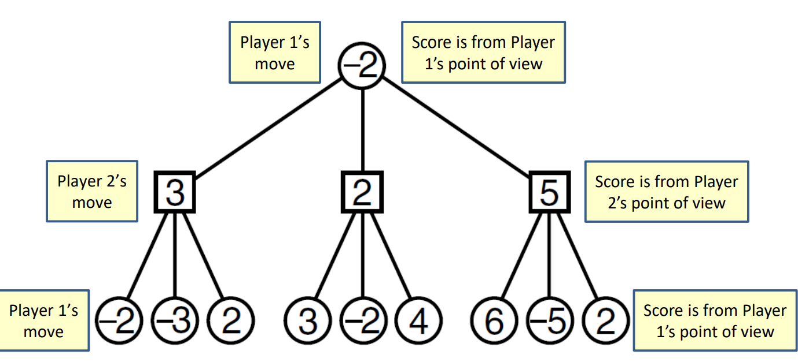

```python
def negamax(board, player, maxDepth, currentDepth):
    if board.isGameOver() or currentDepth == maxDepth:
        return board.evaluate(player), None
    
    bestMove = None
    bestScore = -INF

    for move in board.getMoves():
        newBoard = board.makeMove(move)
        currentScore, _ = negamax(newBoard, player, maxDepth, currentDepth + 1)
        currentScore = -currentScore  # Negate
        if currentScore > bestScore:
            bestScore = currentScore
            bestMove = move
    
    return bestScore, bestMove
```

#### Alpha-Beta Pruning

Alpha-beta pruning keeps track of two values, alpha and beta, to eliminate branches that won't affect the final decision.

- Initially, alpha is set to -∞ and beta to +∞
- Alpha pruning: we will never choose a move that leads to a score lower than alpha
- Beta pruning: our opponent will never choose a move that allows us to get a score higher than beta

```python
def abNegamax(board, player, maxDepth, currentDepth, alpha, beta):
    if board.isGameOver() or currentDepth == maxDepth:
        return board.evaluate(player), None
    
    bestMove = None
    bestScore = -INF

    for move in board.getMoves():
        newBoard = board.makeMove(move)
        currentScore, _ = abNegamax(newBoard, player, maxDepth, currentDepth + 1, -beta, -max(alpha, bestScore))
        currentScore = -currentScore  # Negate
        if currentScore > bestScore:
            bestScore = currentScore
            bestMove = move
            if bestScore >= beta:
                return bestScore, bestMove # Beta cutoff
    
    return bestScore, bestMove

# invoke with:
score, move = abNegamax(board, 0, maxDepth, 0, -INF, INF)
```

Example:

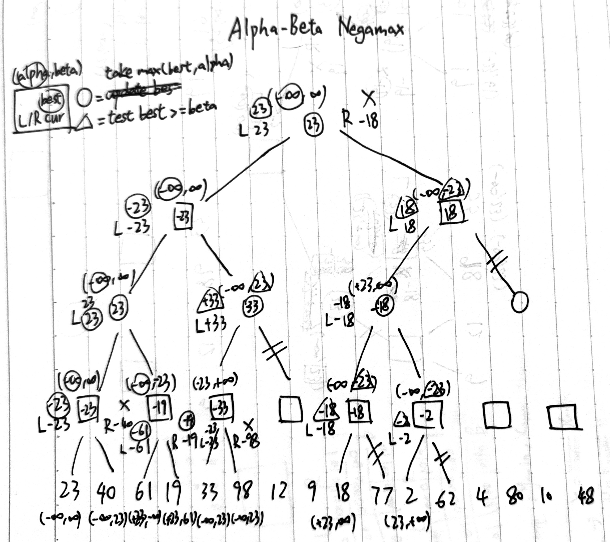

**Search window**: The [alpha, beta] range within which the true score is expected to lie. A narrower search window leads to more pruning.

We also want to order moves so that the most promising ones are considered first, and other moves are more likely to be pruned.

**Aspiration search**: Start with a narrow search window and widen it if a cutoff occurs.

```python
def aspiration(board, maxDepth, previous):
    alpha = previous - WINDOW_SIZE
    beta = previous + WINDOW_SIZE

    while True:
        score, move = abNegamax(board, board.currentPlayer, maxDepth, 0, alpha, beta)
        if score <= alpha: alpha -= NEAR_INF
        elif score >= beta: beta += NEAR_INF
        else: return score, move
```

### Transposition Tables

To avoid re-evaluating the same positions reached via different move sequences, we can use a transposition table (hash table) to store previously computed evaluations.

A good hash function should be:

- spreads the likely position values evenly across the table
- very sensitive to small changes in the position
- reduces the likelihood of collisions

#### Zobrist Hashing

**Zobrist keys**: A set of fixed-length random bit-strings is generated for each piece/square combination. The hash key for a position is computed by XORing the bit-strings corresponding to the pieces on the board.

**Incremental Zobrist hashing**: When making or unmaking a move, the hash key can be updated by XORing the bit-strings for the pieces that were added or removed from their squares.

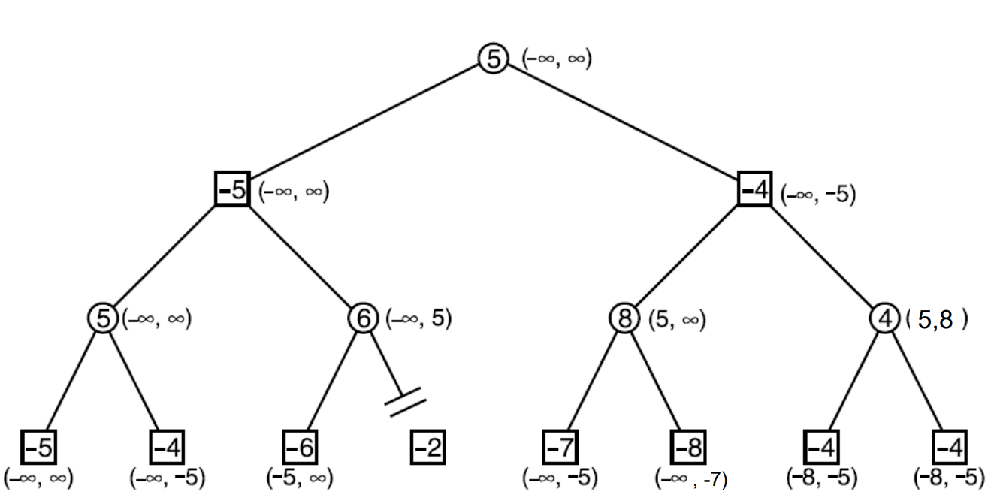

```python
N = 9 # number of squares
K = 2 # number of piece types (e.g., white and black)
zobristKey = [0] * (N * K)

def initZobristKey():
    for i in range(0, N * K):
        zobristKey[i] = rand32()

def hashPosition(board):
    result = 0
    for i in range(0, N):
        piece = board.getPieceAtLocation(i)
        if piece is not None:
            result ^= zobristKey[i * K + piece.type]
    return result
```

Zobrist hashing for chess: 64 squares * 12 piece types (6 white + 6 black) = 768 entries


#### Hash Table Implementation

General hash table implementation (handles collisions with linked lists):

```python
class Bucket:
    entry : TableEntry = None
    _next : Bucket = None

    def getElement(self, hashValue):
        if self.entry.hashValue == hashValue:
            return self.entry
        elif self._next is not None:
            return self._next.getElement(hashValue)
        else:
            return None

class HashTable:
    buckets : List[Bucket] = [Bucket()] * MAX_BUCKETS

    def getBucket(self, hashValue):
        return self.buckets[hashValue % MAX_BUCKETS]

    def getEntry(self, hashValue):
        bucket = self.getBucket(hashValue)
        return bucket.getElement(hashValue)
```

Hash array implementation (fixed size, no collision handling):

```python
class HashArray:
    entries : List[TableEntry] = [None] * MAX_BUCKETS

    def getEntry(self, hashValue):
        return self.entries[hashValue % MAX_BUCKETS]
```

**Replacement strategy**: When using a hash array, if a collision occurs, we can choose to overwrite the existing entry or move it to a secondary location.

Time complexity: O(1) for both get and put operations

Memory complexity: O(m), where m is the size of the hash table

**Path dependency**: Some games require scores that depend on the sequence of moves. For example, in chess, repeating the same set of board positions three times results in a draw. This can be addressed by incorporating a Zobrist key for "number of repeats" in the hash function, so that successive repeats have different hash values and are recorded separately.

**Instability**: The stored values may fluctuate during the same search because entries may be overwritten at different times. This can lead to situations where the score for a board oscillates between two values, potentially causing infinite loops in some re-searching algorithms.

### Monte Carlo Tree Search (MCTS)

When the branching factor is too high for minimax search, we can use MCTS to sample the most promising moves.

MCTS consists of four main steps:

1. Selection: Starting from the root node, walk down the tree until we reach a node if not fully explored.
2. Expansion: If the selected node is not a terminal node, create one or more child nodes and select one of them.
3. Simulation: From the selected node, simulate a random playout to a terminal state.
4. Backpropagation: Update the statistics of the nodes on the path from the selected node to the root based on the result of the simulation.

**Upper Confidence Bound for Trees (UCT)**: A popular selection strategy that balances exploration and exploitation. The UCT value for a node is calculated as:

$$u_i = \frac{w_i}{n_i} + c \sqrt{\frac{\ln N}{n_i}}$$

where:

- $w_i$: number of wins for node $i$
- $n_i$: number of games played with node $i$
- $k$: hyperparameter
- $N$: total number of games played from the parent node

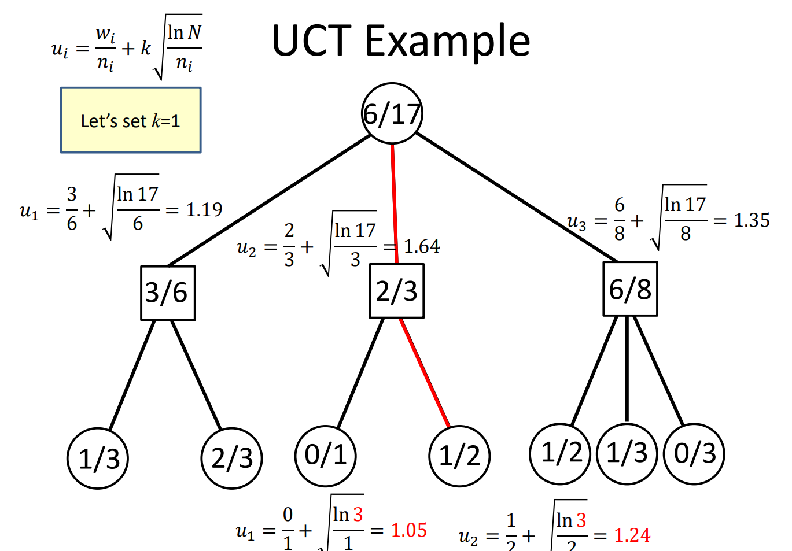

MCTS is a knowledge-free algorithm, but we can introduce more knowledge to reduce the search:

- Heavy Playouts: Choose moves that are more likely instead of random moves, e.g., perform playout using minimax or use heuristics. The more sophistication in choosing the move, the heavier the playout.
- Win Rate Priors: Add node to the subtree with existing win/played value, known as biasing the prior. However, if the prior is too far from the truth, MCTS will take a vary large number of iterations to correct the mistake.
- Static Evaluation Function: Incorporate the evaluation function in UCT:

$$u_i = \frac{w_i}{n_i} + k \sqrt{\frac{\ln N}{n_i}} + c e(B_i)$$

where $e(B_i)$ is the evaluation value for the board position at node $i$, and $c$, $k$ are constants.

**Opening book**: A database of pre-computed best moves for the opening phase of the game. It can be used to guide the MCTS during the early stages of the game.

Similarly, an **endgame tablebase** can be used for the endgame phase, providing perfect play for positions with a limited number of pieces, e.g., 6 or fewer pieces in chess.

### Further Optimizations

**Iterative Deepening**: For each step, perform a minimax search with increasing depth limits until time runs out. AB Negamax can be improved by considering the best move found in the previous iteration first, leading to more pruning.

**Variable Depth Approach - Extensions**: Generally, searches are fixed depth, but we can extend the search depth for the most promising move sequences to mitigate the horizon effect. This is often done using an iterative deepening approach, where only the most promising moves from the previous iteration are extended further. (e.g., in chess, extend searches that involve captures or checks)

**Variable Depth Approach - Quiescence Pruning**: When a position is relatively stable, searching deeper may not provide additional information. Quiescence pruning involves pruning branches where the heuristic value does not change significantly over successive depths of search.

Combining extensions and quiescence pruning allows most of the search effort to be focused on volatile positions where the evaluation function may be less reliable.

**Using game knowledge**: The search algorithms are based on two sources of knowledge: Static evaluation function and move ordering. For very large trees in games such as Go, different move order heuristics can improve overall performance, e.g., prioritizing moves that the opponent is most likely to make.

Solve game:

- A game is **weakly solved** if the outcome (win, lose, or draw) can be correctly predicted from the starting position assuming perfect play from both players.
- A game is **strongly solved** if the optimal move starting from any position can be correctly predicted, which is equivalent to having a perfect static evaluation function for any position.

## 03 Action Prediction

### N-gram Models

An $n$-gram model is a probabilistic model that predicts the next item in a sequence based on the previous $n-1$ items.

```python
class NGramPredictor:
    data : Dict[String, Dict[String, int]] = {} # prev actions -> {next action -> count}
    nValues : int # window size + 1

    def __init__(self, n):
        self.nValues = n

    def registerSequence(actions): # length: nValues+1
        key = actions[0 : self.nValues] # 0...nValues-1 (length: nValues)
        value = actions[self.nValues] # length: 1
        if key not in self.data:
            self.data[key] = {}
        if value not in self.data[key]:
            self.data[key][value] = 0
        self.data[key][value] += 1
    
    def getMostLikely(actions): # length: nValues
        keyData = self.data.get(actions)
        if keyData is None:
            return None
        highestValue = 0
        maxAction = None
        for action, count in keyData.items():
            if count > highestValue:
                highestValue = count
                maxAction = action
        return maxAction
```

Example: String matching. A string only contains 'L' and 'R'. We want to predict the next character based on two previous characters, so 3-gram model is used.

Performance:

- `registerSequence`: O(1)
- `getMostLikely`: $O(m)$, where $m$ is the number of possible next actions for the given key

If using a sorted hash table:

- `registerSequence`: $O(m)$
- `getMostLikely`: O(1)

Memory complexity: $O(n^m)$, where $n = \text{window size} + 1$

Choosing a window size: increasing the window size will first increase then decrease the performance. 

- If the input actions are random, a larger window size will lead to more unique keys and fewer samples for each key, which can reduce the accuracy of predictions.
- Memory concerns: when $n$ increases, the memory complexity grows super-exponentially. Also, large number of probabilities requires more sample data to fill.

Example:

```
LRRLRLLLRRLRLRR
```

(1) Raw probability: 

- R = 8, L = 7
- Predict "R"

(2) 2-gram:

- LR = 5, RL = 4, RR = 3, LL = 2
- Ending with "R" so predict "L" to form "RL"

(3) 4-gram:

- LRRL = 2, RRLR = 2, RLRL = 2
- Ending with "LRR" so predict "L" to form "LRRL"

**Hierarchical N-gram**: Using $1, 2, \ldots, n$-gram models together. If the $n$-gram model fails to predict a next action, we can back off to the $(n-1)$-gram model, and so on until we reach the unigram model.

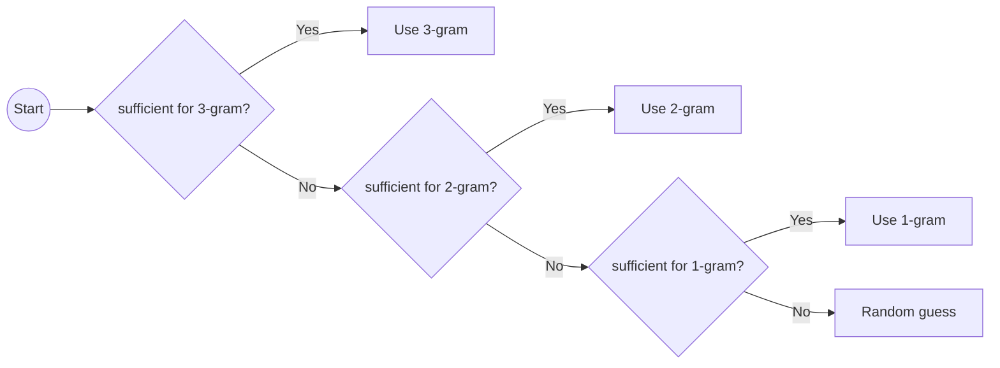
```mermaid
graph LR
    O((Start)) --> A
    A{sufficient for 3-gram?} -->|Yes| B[Use 3-gram]
    A -->|No| C{sufficient for 2-gram?}
    C -->|Yes| D[Use 2-gram]
    C -->|No| E{sufficient for 1-gram?}
    E -->|Yes| F[Use 1-gram]
    E -->|No| G[Random guess]
```

When used for online learning, there is a balance between maximum predictive power and the performance of algorithm. A larger window size may provide better predictions but can take longer to reach a reasonable level of accuracy.

```python
class HierarchicalNGramPredictor:
    predictors : List[NGramPredictor] # from 1-gram to n-gram
    nValues : int

    def __init__(self, n):
        self.nValues = n
        self.predictors = [NGramPredictor(i + 1) for i in range(0, n)]
    
    def registerSequence(actions): # length: nValues+1
        for i in range(0, self.nValues + 1):
            # use last action as the value, and the previous i actions as the key
            subActions = actions[self.nValues - i : self.nValues]
            self.predictors[i].registerSequence(subActions)
    
    def getMostLikely(actions): # length: nValues
        for i in range(0, self.nValues):
            predictor = self.predictors[self.nValues - 1 - i]
            subActions = actions[self.nValues - 1 - i : self.nValues - 1]
        if subActions in predictor.data and predictor.data[subActions].count > THRESHOLD:
                return predictor.getMostLikely(subActions)
    
        return None
```

### Naive Bayes Classifier

Bayes' rule allows us to compute the posterior probability of a hypothesis given some evidence:

$$P(B|A) = \frac{P(A|B)P(B)}{P(A)}$$

where $P(B|A)$ is the posterior probability, $P(A|B)$ is the likelihood, $P(B)$ is the prior probability, and $P(A)$ is the evidence.

Example: AI wons 80\% of the time against human players, among which 25\% are trained players. Among the games that AI wins, 12.5\% are won against trained players. What is the probability that a game won by AI is against a trained player?

Define $T = \text{against trained player}$, $W = \text{AI wins}$, we want to compute $P(W|T)$.

Given: $P(W) = 0.8, P(T) = 0.25, P(T|W) = 0.125$

$P(W|T) = \frac{P(T|W)P(W)}{P(T)} = \frac{0.125 \times 0.8}{0.25} = 0.4$

Based on Bayes' rule, we can see the posterior probability is linearly proportional to the likelihood and the prior probability, i.e. $P(B|A) \propto P(A|B)P(B)$. We denote this by $P(B|A) = \alpha P(A|B)P(B)$, meaning we do not need to compute the evidence $P(A)$ when comparing different hypotheses.

We can build a **Naive Bayes Classifier** for classification problems. Given a set of features $X = (X_1, X_2, \ldots, X_n)$ and a class label $Y$, compare $P(Y|X)$ against $P(\neg Y|X)$ to make a prediction. Here the "naive" assumption is that the features are conditionally independent given the class label, i.e., $P(X|Y) = \prod_{i=1}^n P(X_i|Y)$.

Example: Decide if a day is good for playing golf based on the weather conditions. The features are: Outlook (Sunny, Overcast, Rain), Temperature (Hot, Mild, Cool), Humidity (High, Normal), Windy (True, False). The class label is whether to play golf (Yes or No).

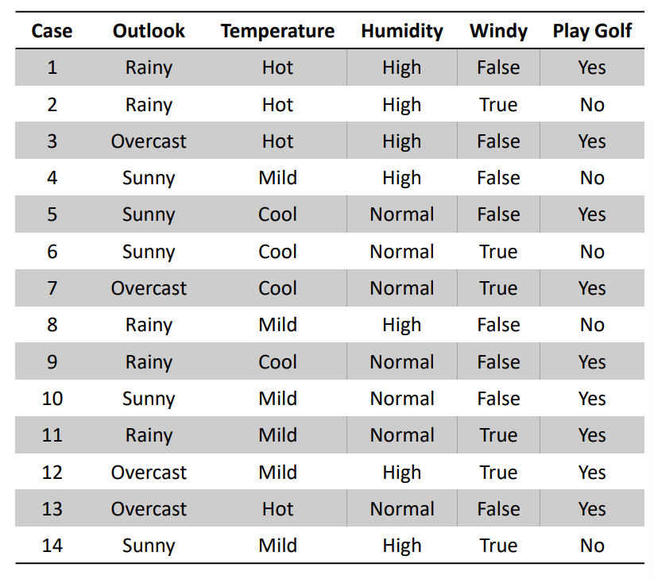

Is it suitable to play golf when the weather is (Rainy, Hot, High, False)?

- $P(Yes|X) = P(X|Yes)P(Yes) \alpha = P(Rainy|Yes) P(Hot|Yes) P(High|Yes) P(False|Yes) P(Yes) \alpha = \frac{3}{9} \times \frac{3}{9} \times \frac{3}{9} \times \frac{6}{9} \times \frac{9}{14} \alpha = \frac{1}{63} \alpha$
- $P(No|X) = P(X|No)P(No) \alpha = P(Rainy|No) P(Hot|No) P(High|No) P(False|No) P(No) \alpha = \frac{2}{5} \times \frac{1}{5} \times \frac{4}{5} \times \frac{2}{5} \times \frac{5}{14} \alpha = \frac{8}{875} \alpha$
- $P(Yes|X) > P(No|X)$, so the prediction is "Yes".

Is it suitable to play golf when the weather is (Rainy, Hot, High, True)?

- $P(Yes|X) = P(X|Yes)P(Yes) \alpha = P(Rainy|Yes) P(Hot|Yes) P(High|Yes) P(True|Yes) P(Yes) \alpha = \frac{3}{9} \times \frac{3}{9} \times \frac{3}{9} \times \frac{3}{9} \times \frac{9}{14} \alpha = \frac{1}{126} \alpha$
- $P(No|X) = P(X|No)P(No) \alpha = P(Rainy|No) P(Hot|No) P(High|No) P(True|No) P(No) \alpha = \frac{2}{5} \times \frac{1}{5} \times \frac{4}{5} \times \frac{3}{5} \times \frac{5}{14} \alpha = \frac{12}{875} \alpha$
- $P(Yes|X) < P(No|X)$, so the prediction is "No".

To address the precision issue when multiplying many probabilities, we can use logarithmic probabilities:

$$\log P(Y|X) = \log P(X|Y) + \log P(Y) + C = \sum_{i=1}^n \log P(X_i|Y) + \log P(Y) + C$$

where $C$ is a constant that does not affect the comparison between different class labels.

## 04 Decision Trees, FSM and Behavior Trees

### Decision Trees

**Decision tree** is a flowchart-like structure where each internal node represents a test on an attribute, each branch represents the outcome of the test, and each leaf node represents a class label (decision).

**Decision complexity**: The depth of the tree, which determines the number of tests needed to reach a decision. e.g. a perfect binary tree with $2^d$ leaf nodes has a decision complexity of $d$.

It is common to see **Binary decision trees**, where each node has 2 options. This is because (1) the underlying code simplifies to a series of if-else statements, (2) most common learning algorithms are designed for binary trees, and (3) easier implementation and tool support.

**Balanced tree**: A tree having about the same number of leaves on each branch. A balanced tree has a lower decision complexity compared to an unbalanced tree with the same number of leaf nodes.

Performance: $O(\log_2 n)$ if balanced, $O(n)$ worst case if unbalanced.

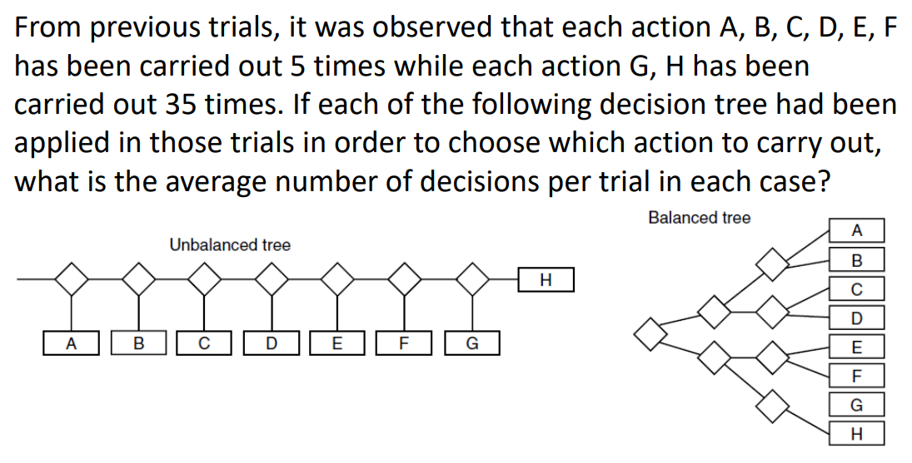

Unbalanced tree:

$E=1 \times \frac{5}{100} + 2 \times \frac{5}{100} + 3 \times \frac{5}{100} + 4 \times \frac{5}{100} + 5 \times \frac{5}{100} + 6 \times \frac{5}{100} + 7 \times \frac{35}{100} + 7 \times \frac{35}{100} = 5.95$

Balanced tree:

$E=3$

**Random decision tree**: A decision tree where some of the decisions are made randomly.

### Finite State Machines (FSM)

A finite state machine is a computational model that consists of a finite number of states and transitions between those states based on input events.

Example: A robot tasked with cleaning a room and can recharge itself when the battery is low. The FSM can be represented as:

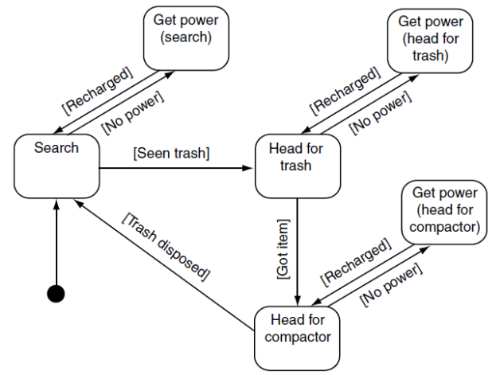

where

- the black circle represents the initial state
- each block represents a state
- the arrows represent transitions between states, with conditions given in brackets `[]`

**Hierarchical FSM**: A finite state machine where states can contain other FSMs, allowing for more complex behavior while keeping the overall structure manageable.

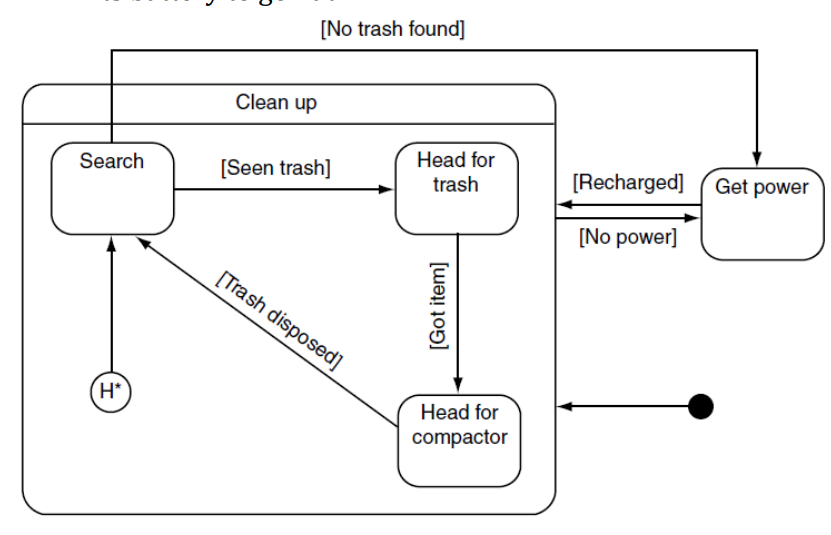

Replacing transitions in FSM with conditions creates a decision tree.

### Behavior Trees

Behavior trees are like Hierarchical FSMs but with a different main building block: tasks. Tasks can be conditions, actions, composite nodes, or decorators. 

Both conditions and actions are at leaf nodes, while composite nodes and decorators are at internal nodes. A composite node should have at least two children, while a decorator can only have one child.

**Selector** (?): A composite node returns success immediately when one of its children returns success, and only returns failure if all children return failure. Choose the first among a set of possible actions that works.

**Sequence** (→): A composite node returns failure immediately when one of its children returns failure, and only returns success if all children return success. Subtasks are executed in order.

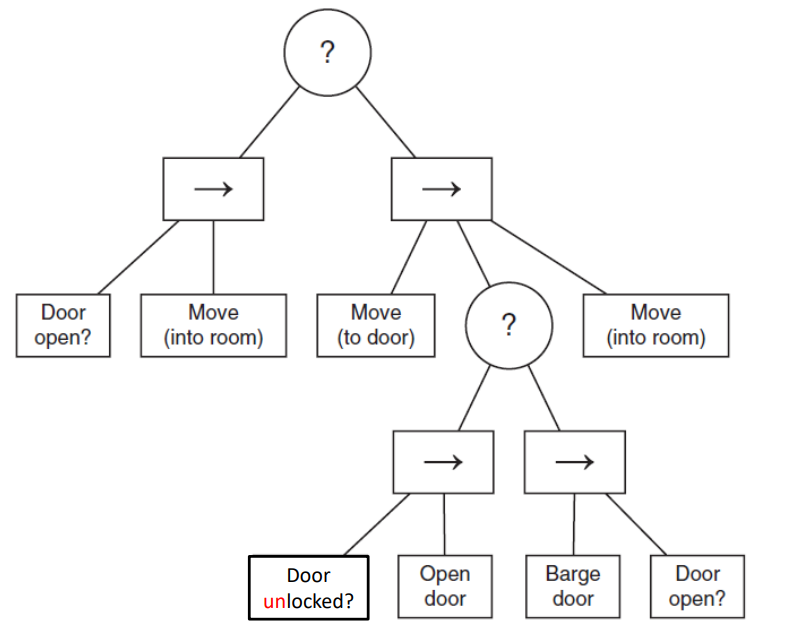

This behavior tree represents the following logic:

```
If door open -> move into room and ? return success
Else try move to door and
    If door unlocked -> open door and ? return success
    Else try barge door and door open and ? return success
    Else ? return failure
```

**Non-deterministic behavior tree**: To make AI less predictable, we can use variations of Selectors and Sequences that can run their children in a random order. This is called "partial-order" where some parts may be strictly ordered, and others can be processed in any order.

- Non-deterministic selector (~?)
- Non-deterministic sequence (↝)

**Parallel** (⇶): A composite node that executes all of its children simultaneously. It returns success if all children return success, and returns failure early if any child returns failure.

**Decorator** (Diamond): A node that has only one child and modifies its behavior, e.g., "Repeat until success".

- If the child is allowed to run, the decorator returns the child's return value.
- If the child is not allowed to run, the decorator normally returns failure.

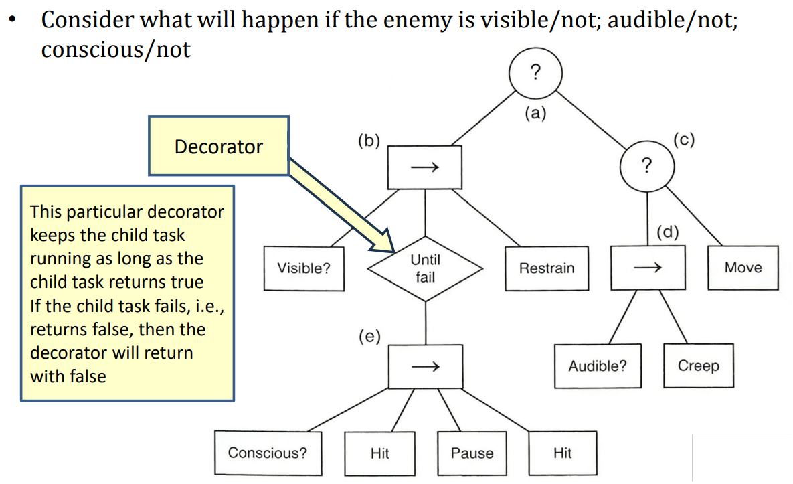

## 05 Decision Tree Learning

### ID3

Recursively partition the training data based on the attribute that provides the highest information gain until all examples in a partition belong to the same class.

Entropy is a measure of impurity in a dataset:

$$E_S = -\sum_{i=1}^n p_i \log_2 p_i$$

where $p_i$ is the proportion of examples in class $i$.

Information gain is the reduction in entropy after partitioning the dataset based on an attribute:

$$G_S(A) = E_S - \sum_{i=1}^n \frac{|S_i|}{|S|} E_{S_i}$$

where $S_1, S_2, \ldots, S_n$ are the subsets of $S$ as attribute $A$ takes on different values.

**Continuous attributes**: For continuous attributes, we can determine the best threshold for splitting the data by sorting the examples based on the attribute and evaluating potential splits between consecutive examples. The split that yields the highest information gain is chosen as the threshold.

**Multiple categories**: Instead of < and >= two-way splits, we can have multi-way splits for attributes, which is equivalent to creating multiple levels of binary splits.

**Problem with offline learning**:

- The decision tree is learned in a single process, which is not suitable for online learning where new examples are generated while the game is running.
- A large number of examples can lead to a complex tree that takes a long time to learn, making it impractical to re-run the algorithm every time a new example is added.

**Incremental ID3**: When a new example is added, we can update the decision tree by traversing it according to the attributes of the new example. If we reach a leaf node and the predicted class does not match the actual class of the new example, we can split that node based on the attributes of the examples that reach it, including the new example.

Issue with incremental ID3: The tree can grow indefinitely as new examples are added, which can lead to overfitting and increased complexity. To mitigate this, we can prune the tree by removing branches that do not contribute significantly to the accuracy of the model, or by setting a maximum depth for the tree.

### ID4

- First build a decision tree using ID3 with the initial training data
- When a new example is added, let every node in the tree check if it needs to be updated based on the new example:
- If the node is terminal and the predicted class matches the actual class of the new example, add the example to the list of examples for that node.
- If the node is terminal but the predicted class does not match, split the node like in ID3.
- If the node is not terminal, check if the current attribute still provides the best information gain with the new example included. If it does, pass the new example down to the appropriate child node. If it does not, rebuild the subtree from that point on using ID3.

Efficiency: In the worst case, ID4 = ID3. In practice, ID4 is much faster than repeatedly calling ID3 for each new example, and it produces flatter trees compared to the simple update procedure. Rebuilding the tree is often at first, but as more examples are added, the changes to the tree decrease in size, keeping it fast to update.

```
1 Healthy, Exposed, No Ammo -> Run
2 Healthy, In Cover, With Ammo -> Attack
3 Hurt, In Cover, With Ammo -> Attack
4 Healthy, In Cover, No Ammo -> Defend
5 Hurt, In Cover, No Ammo -> Defend

6 Hurt, Exposed, With Ammo -> Defend
7 Healthy, Exposed, With Ammo -> Run
```

Constructing the decision tree with the first 5 examples:

- Entropy $E_S = H(\frac{1}{5}, \frac{2}{5}, \frac{2}{5}) \approx 1.522$
- $G_\text{health} = 1.522 - \frac{3}{5} H(\frac{1}{3}, \frac{1}{3}, \frac{1}{3}) - \frac{2}{5} H(\frac{1}{2}, \frac{1}{2}) \approx 1.522 - \frac{3}{5} \times 1.585 - \frac{2}{5} \times 1 = 0.171$
- $G_\text{cover} = 1.522 - \frac{1}{5} H(1) - \frac{4}{5} H(\frac{2}{4}, \frac{2}{4}) = 1.522 - 0 - \frac{4}{5} \times 1 = 0.722$
- $G_\text{ammo} = 1.522 - \frac{3}{5} H(\frac{1}{3}, \frac{2}{3}) - \frac{2}{5} H(\frac{2}{2}) = 1.522 - \frac{3}{5} \times 0.918 - 0 = 0.971$

So we split on "Ammo" first. For the "With Ammo" branch (2, 3), both are "Attack". For the "No Ammo" branch (1, 4, 5):

- $E_S = H(\frac{1}{3}, \frac{2}{3}) \approx 0.918$
- $G_\text{health} = 0.918 - \frac{2}{3} H(\frac{1}{2}, \frac{1}{2}) - \frac{1}{3} H(1) = 0.918 - \frac{2}{3} \times 1 - 0 = 0.252$
- $G_\text{cover} = 0.918 - \frac{1}{3} H(1) - \frac{2}{3} H(\frac{2}{2}) = 0.918 - 0 - \frac{2}{3} \times 0 = 0.918$

So we split on "Cover". For the "In Cover" branch (4, 5), both are "Defend". For the "Exposed" branch (1), it is "Run".

So the tree is:

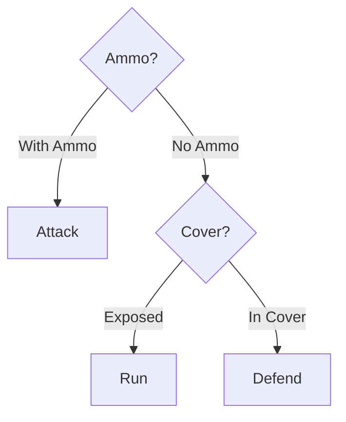
```mermaid
graph TD
    Q1{Ammo?} -->|With Ammo| A1[Attack]
    Q1 -->|No Ammo| Q2{Cover?}
    Q2 -->|Exposed| A2[Run]
    Q2 -->|In Cover| A3[Defend]
```

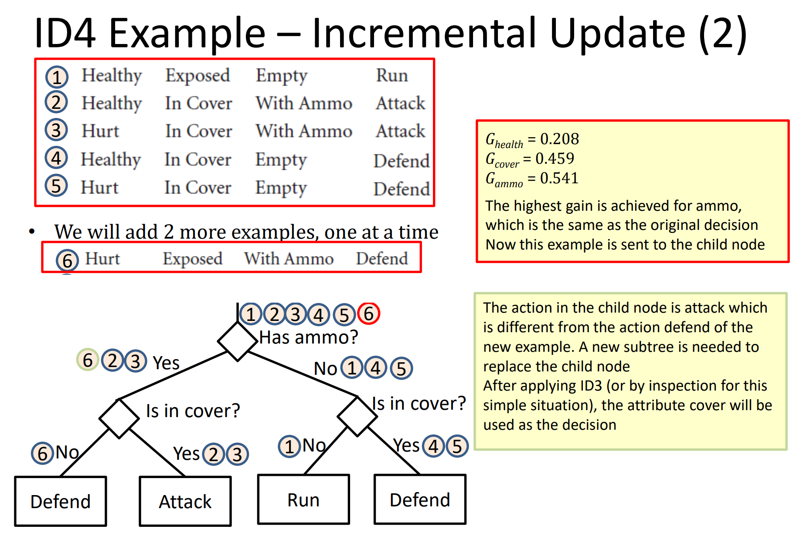

Now we add the 6th example (Hurt, Exposed, With Ammo -> Defend):

(1) The root node will be updated. First calculate the new information gain:

- $E_S = H(\frac{1}{6}, \frac{2}{6}, \frac{3}{6}) \approx 1.459$
- $G_\text{health} = 1.459 - \frac{3}{6} H(\frac{1}{3}, \frac{1}{3}, \frac{1}{3}) - \frac{3}{6} H(\frac{1}{3}, \frac{2}{3}) = 1.459 - \frac{3}{6} \times 1.585 - \frac{3}{6} \times 0.918 = 0.208$
- $G_\text{cover} = 1.459 - \frac{2}{6} H(\frac{1}{2}, \frac{1}{2}) - \frac{4}{6} H(\frac{2}{4}, \frac{2}{4}) = 1.459 - \frac{2}{6} \times 1 - \frac{4}{6} \times 1 = 0.459$
- $G_\text{ammo} = 1.459 - \frac{3}{6} H(\frac{1}{3}, \frac{2}{3}) - \frac{3}{6} H(\frac{1}{3}, \frac{2}{3}) = 1.459 - \frac{3}{6} \times 0.918 - \frac{3}{6} \times 0.918 = 0.541$

So the best split is still on "Ammo". The new sample goes to "With Ammo" branch.

(2) The "With Ammo" branch (2, 3, 6) is no longer pure, so we need to split it again: if "In Cover", then "Attack"; if "Exposed", then "Defend".

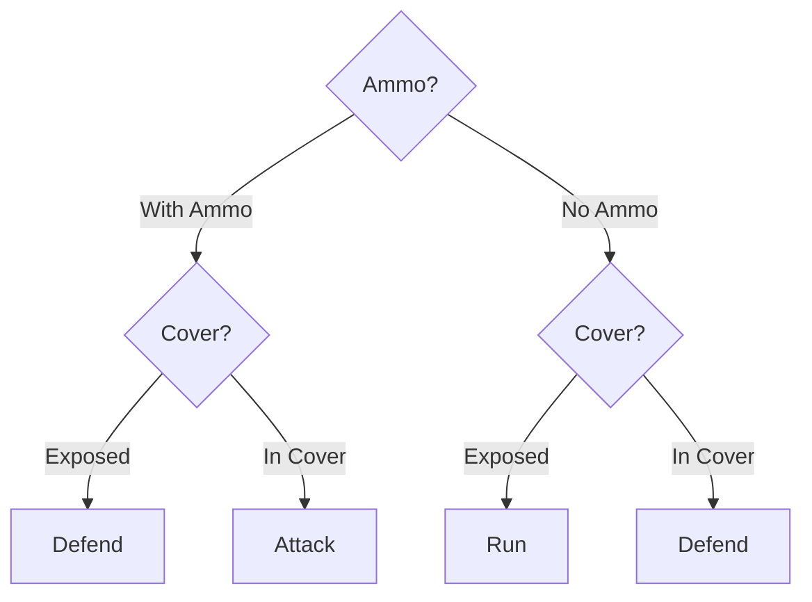
```mermaid
graph TD
    Q1{Ammo?} -->|With Ammo| Q2{Cover?}
    Q1 -->|No Ammo| Q3{Cover?}
    Q2 -->|Exposed| A1[Defend]
    Q2 -->|In Cover| A2[Attack]
    Q3 -->|Exposed| A3[Run]
    Q3 -->|In Cover| A4[Defend]
```

Now we add the 7th example (Healthy, Exposed, With Ammo -> Run):

(1) The root node will be updated again. First calculate the new information gain:

- $E_S = H(\frac{2}{7}, \frac{2}{7}, \frac{3}{7}) \approx 1.557$
- $G_\text{health} = 1.557 - \frac{4}{7} H(\frac{1}{4}, \frac{1}{4}, \frac{2}{4}) - \frac{3}{7} H(\frac{1}{3}, \frac{2}{3}) = 1.557 - \frac{4}{7} \times 1.5 - \frac{3}{7} \times 0.918 = 0.306$
- $G_\text{cover} = 1.557 - \frac{3}{7} H(\frac{1}{3}, \frac{2}{3}) - \frac{4}{7} H(\frac{2}{4}, \frac{2}{4}) = 1.557 - \frac{3}{7} \times 0.918 - \frac{4}{7} \times 1 = 0.592$
- $G_\text{ammo} = 1.557 - \frac{4}{7} H(\frac{1}{4}, \frac{1}{4}, \frac{2}{4}) - \frac{3}{7} H(\frac{1}{3}, \frac{2}{3}) = 1.557 - \frac{4}{7} \times 1.5 - \frac{3}{7} \times 0.918 = 0.306$

So we need to resplit the tree based on "Cover". For the "In Cover" branch (2, 3, 4, 5), we split on "Ammo". If "With Ammo", then "Attack"; if "No Ammo", then "Defend". For the "Exposed" branch (1, 6, 7), we split on "Health". If "Healthy", then "Run"; if "Hurt", then "Defend".

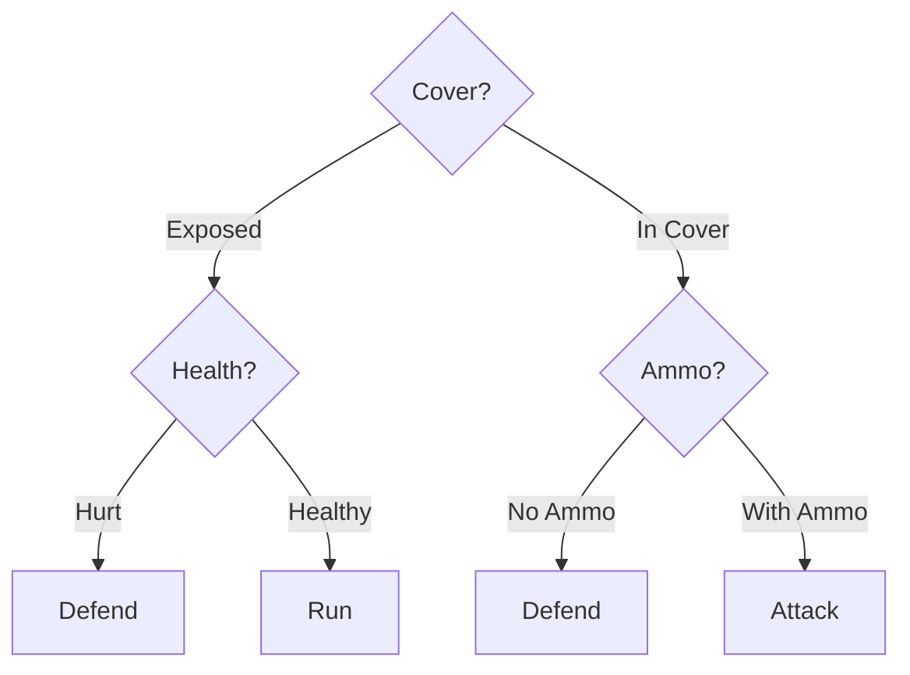
```mermaid
graph TD
    Q1{Cover?} -->|Exposed| Q2{Health?}
    Q1 -->|In Cover| Q3{Ammo?}
    Q2 -->|Hurt| A1[Defend]
    Q2 -->|Healthy| A2[Run]
    Q3 -->|No Ammo| A3[Defend]
    Q3 -->|With Ammo| A4[Attack]
```

## 06 Fuzzy Logic

Motivation: to blur the line between cautious and confident decisions, so the change of behavior is not sudden and give a whole spectrum of confidence levels.

Traditional logic: binary. The character either belongs to a set or does not belong to it. For example, a character is either "tall" or "not tall".

Fuzzy logic: allows for degrees of membership in a set. A character can be "somewhat tall" or "very tall" with a membership value between 0 and 1. (However, the membership value should not be interpreted as a probability)

**Mutual exclusion** in fuzzy logic: The sum of membership values for mutually exclusive sets is 1. For example, if a character is 0.7 "tall", then it is 0.3 "short" (assuming "tall" and "short" are mutually exclusive).

**Fuzzification**: The process of converting crisp input values into fuzzy membership values.

**Defuzzification**: The process of converting a set of membership values back into useful data (usually a single number).

### Defuzzification Methods

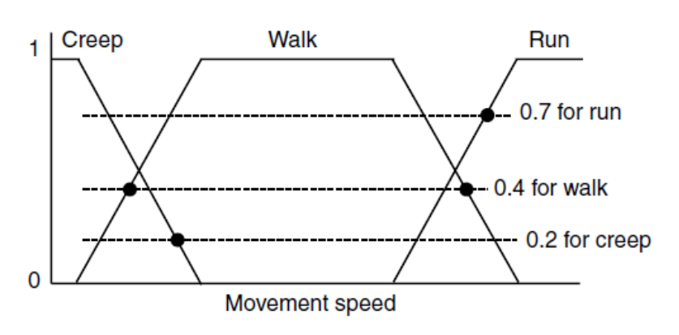

Assuming the following observation:

| y (output) | 0 | 1 | 2 | 3 | 4 | 5 | 6 | 7 |
| --- | -- | -- | -- | -- | -- | -- | -- | -- |
| μ (membership) | 0 | 0.2 | 0.6 | 1.0 | 0.4 | 0.6 | 1.0 | 0.3 |

(1) **Using the highest membership**

- **Mean of maximum (MOM)**: Take the average of the y values that have the highest membership value. In this case, the highest membership value is 1.0, which occurs at y=3 and y=6, so the output is (3 + 6) / 2 = 4.5.
- **Smallest of maximum (SOM)**: Take the smallest y value that has the highest membership value. In this case, the output is 3.
- **Largest of maximum (LOM)**: Take the largest y value that has the highest membership value. In this case, the output is 6.
- **Bisector**: Take the y value that divides the area under the membership curve into two equal parts. In this case, the output is approximately 4.2.

| $y$ | $\sum \mu$ |
| --- | --- |
| 0 | 0 |
| 1 | 0.2 |
| 2 | 0.8 |
| 3 | 1.8 |
| 4 | 2.2 |

Total area = 4.1, half area = 2.05, interpolating between y=3 and y=4 gives $$x^* = 3 + \frac{2.05 - 1.8}{2.2 - 1.8} = 3.625$$

(2) **Blending based on membership**

Calculate the weighted average of all y values, where the weights are the membership values.

(3) **Center of gravity (COG)**: Calculate the center of mass of the area under the membership curve. This is equivalent to the weighted average of y values, where the weights are the membership values.

| $y$ | $\mu$ | $y \cdot \mu$ |
| --- | --- | --- |
| 0 | 0 | 0 |
| 1 | 0.2 | 0.2 |
| 2 | 0.6 | 1.2 |
| 3 | 1.0 | 3.0 |
| 4 | 0.4 | 1.6 |
| 5 | 0.6 | 3.0 |
| 6 | 1.0 | 6.0 |
| 7 | 0.3 | 2.1 |
| Total | 4.1 | 17.1 |

$$\text{COG} = \frac{\sum y \cdot \mu}{\sum \mu} = \frac{17.1}{4.1} \approx 4.17$$

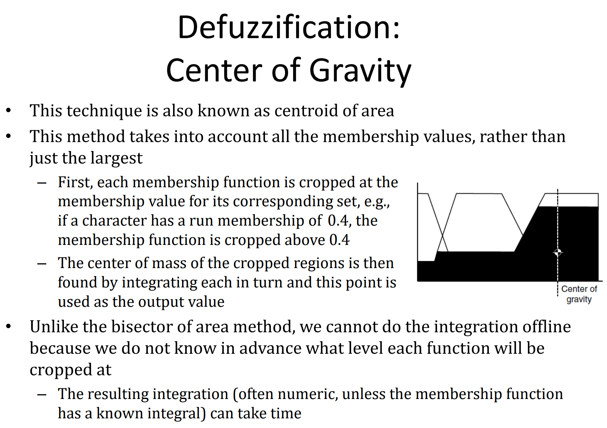

COG may seems similar to the weighted average, but they are different. COG takes into account the shape of the membership function, and it **crops the function of each fuzzy set at the membership value**. COG cannot be computed offline because the membership values are not known until runtime.

In the above image, the input is 0.7 run, 0.4 walk, 0.2 creep, so the "walk" function is capped at 0.4.

**Enumerations** that can be ordered are often defuzzified as a numerical value. Each of the enumeration values is mapped to a range, and if the defuzzified value falls within that range, the corresponding enumeration value is chosen.

**Booleans** use a cutoff threshold, e.g., if the defuzzified value is greater than 0.5, return true; otherwise, return false.

### Logical Operations

Logical operations in fuzzy logic are defined as follows:

| Operation | Fuzzy Logic Definition |
| --- | --- |
| $A \land B$ | $\min(\mu_A, \mu_B)$ |
| $A \lor B$ | $\max(\mu_A, \mu_B)$ |
| $\neg A$ | $1 - \mu_A$ |
| NOR ($\neg (A \lor B)$) | $1 - \max(\mu_A, \mu_B)$ |
| NAND ($\neg (A \land B)$) | $1 - \min(\mu_A, \mu_B)$ |
| $A \oplus B$ | $\mu_A + \mu_B - 2 \cdot \min(\mu_A, \mu_B)$ |
| $A \Rightarrow B$ | $\max(1 - \mu_A, \mu_B)$ |


#### Decision Making

Example: A car is approaching a corner. We want to decide whether to brake or accelerate based on the following rules:

- IF corner-entry AND going-fast THEN brake
- IF corner-exit AND going-fast THEN accelerate
- IF corner-entry AND going-slow THEN accelerate
- IF corner-exit AND going-slow THEN accelerate

Degress of membership:

- corner-entry: 0.1
- corner-exit: 0.9
- going-fast: 0.4
- going-slow: 0.6

Results:

- corner-entry AND going-fast THEN brake: $\min(0.1, 0.4) = 0.1$
- corner-exit AND going-fast THEN accelerate: $\min(0.9, 0.4) = 0.4$
- corner-entry AND going-slow THEN accelerate: $\min(0.1, 0.6) = 0.1$
- corner-exit AND going-slow THEN accelerate: $\min(0.9, 0.6) = 0.6$

results for brake: 0.1, results for accelerate: $\max(0.4, 0.1, 0.6) = 0.6$, so the decision is to accelerate with a degree of membership of 0.6.

Weakness: lack of scalability.

#### Combs Method

Entails ($\Rightarrow$): (x AND y ENTAILS z) = (x ENTAILS z) OR (y ENTAILS z)

So iF a AND b THEN c can be split into two rules: (IF a THEN c), (IF b THEN c).

However, we cannot directly rewrite the original rules into the new rules because there may be interactions between the rules. Instead, start from scratch:

- If corner-entry THEN brake
- If corner-exit THEN accelerate
- If going-fast THEN brake
- If going-slow THEN accelerate

New results:

- If corner-entry THEN brake: 0.1
- If corner-exit THEN accelerate: 0.9
- If going-fast THEN brake: 0.4
- If going-slow THEN accelerate: 0.6

Brake: $\max(0.1, 0.4) = 0.4$, Accelerate: $\max(0.9, 0.6) = 0.9$, so the decision is to accelerate with a degree of membership of 0.9.

### Fuzzy State Machines

- Each state has a degree of membership (DOM).
- States with DOM > 0 are active.
- At each time step, all active states have a chance to trigger their outgoing transitions.
- If a transition is triggered, it can transit to any number of new states. The DOM of the target state is the DOM of source state ANDed(min) by the degree of transition (DOT).

Example 1:

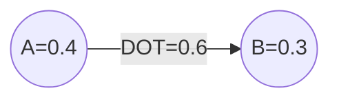
```mermaid
graph LR
    A((A=0.4)) -->|DOT=0.6| B((B=0.3))
```

At t, $M_A = 0.4$, $M_B = 0.3$.

Only A can trigger the transition, so at t+1,

- $M_A' = M_A \text{AND NOT T} = 0.4 \text{AND NOT } 0.6 = \min(0.4, 1 - 0.6) = 0.4$
- $M_B' = M_B \text{OR } (M_A \text{AND T}) = 0.3 \text{OR } (0.4 \text{AND } 0.6) = \max(0.3, \min(0.4, 0.6)) = 0.4$

Example 2:

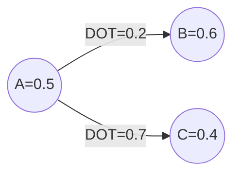
```mermaid
graph LR
    A((A=0.5)) -->|DOT=0.2| B((B=0.6))
    A -->|DOT=0.7| C((C=0.4))
```

At t+1,

- $M_B' = M_B \text{OR } (M_A \text{AND T}(A \to B)) = 0.6 \text{OR } (0.5 \text{AND } 0.2) = \max(0.6, \min(0.5, 0.2)) = 0.6$
- $M_C' = M_C \text{OR } (M_A \text{AND T}(A \to C)) = 0.4 \text{OR } (0.5 \text{AND } 0.7) = \max(0.4, \min(0.5, 0.7)) = 0.5$
- $M_A' = M_A \text{AND NOT} [T(A \to B) \text{OR } T(A \to C)] = 0.5 \text{AND NOT} [0.2 \text{OR } 0.7] = \min(0.5, 1 - \max(0.2, 0.7)) = \min(0.5, 0.3) = 0.3$

Example 3:

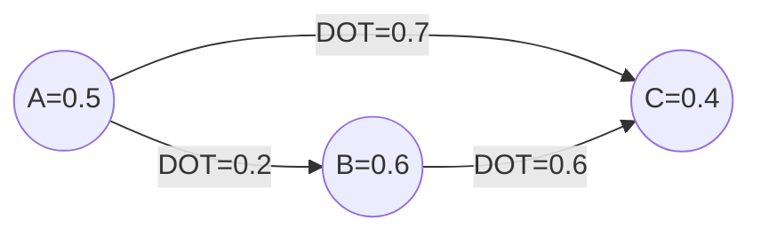
```mermaid
graph LR
    A((A=0.5)) -->|DOT=0.2| B((B=0.6))
    A -->|DOT=0.7| C((C=0.4))
    B -->|DOT=0.6| C
```

Multiple transitions can trigger at the same time, and the DOM of the target state is the OR(max) of all the incoming transitions.

- $M_A' = M_A \text{AND NOT} [T(A \to B) \text{OR } T(A \to C)] = \min(0.5, 1 - \max(0.2, 0.7)) = 0.3$
- $M_B' = M_B \text{OR } (M_A \text{AND T}(A \to B)) \text{OR } (M_B \text{AND NOT T}(B \to C)) = \max(0.6, \min(0.5, 0.2), \min(0.6, 1 - 0.6)) = 0.6$
- $M_C' = M_C \text{OR } (M_A \text{AND T}(A \to C)) \text{OR } (M_B \text{AND T}(B \to C)) = \max(0.4, \min(0.5, 0.7), \min(0.6, 0.6)) = 0.6$

## 07 Goal-Oriented Behavior

Motivation: to present the character with a suite of possible actions and have it choose the one that best meets its immediate needs

**Goals**: Desired states that the character wants to achieve.

**Insistence**: The level of importance of a goal.

Two types of goals: can be fully achieved or can only reduce the insistence. A zero insistence means the goal is fully achieved.

**Actions**: The possible behaviors that the character can perform to achieve its goals.

### Simple Selection

Choose the goal with the highest insistence and perform the action that fulfills or reduces the insistence the most.

- $O(n+m)$ time, $O(1)$ space, where $n$ is the number of goals and $m$ is the number of actions.
- Pro: simple and fast; can give sensible results
- Con: does not consider the side effects of actions on other goals; does not incorporate any timing information

### Discontentment

Discontentment: $D = \sum_{i=1}^n I_i^2$, where $I_i$ is the insistence of goal $i$.

Choose the action that minimizes the discontentment after performing the action.

- $O(nm)$ time, $O(1)$ space

### Utility Over Time

**Timing**: Actions take time to complete, and sometimes in the game it takes significant time to move to a correct location and start the action.

The journey time must be provided as a guess or calculated accurately (pathfinding). However pathfinding is time-consuming, so it is often better to use a heuristic estimate of the journey time.

Sometimes the goal values change over time, e.g., hungry will increase by 2 every hour.

**Recency-Weighted Average**: Update the insistence of a goal based on the previous insistence and the new calculated insistence after performing an action:

```
rateSinceLastTime = changeSinceLastTime / timeSinceLast
basicRate = basicRate * 0.95 + rateSinceLastTime * 0.05
```

where 0.95 and 0.05 are adjustable weights that sum to 1.

### Overall Utility GOAP

Sometimes you have secondary resource constraints other than the number of actions, e.g., in a card game, playing a card consumes energy, and the player has a limited amount of energy each turn. In this case, we can define an overall utility function that combines the discontentment and the resource constraints.

**Goal-Oriented Action Planning (GOAP)**: Considers multiple actions in sequence and tries to find the sequence that best meets the character’s goals in the long term.

Implemented with DFS:

```python
def planAction(worldModel, maxDepth):
    models = new WorldModel[maxDepth + 1]
    actions = new Action[maxDepth]

    models[0] = worldModel
    currentDepth = 0

    bestAction = None
    bestValue = float('inf')

    while currentDepth >= 0:
        currentValue = models[currentDepth].getDiscontentment()

        if currentDepth >= maxDepth:
            if currentValue < bestValue:
                bestValue = currentValue
                bestAction = actions[0]
                currentDepth -= 1
                continue
        else:
            nextAction = models[currentDepth].getNextAction()
            if nextAction is not None:
                models[currentDepth + 1] = models[currentDepth].applyAction(nextAction)
                actions[currentDepth] = nextAction
                currentDepth += 1
            else:
                currentDepth -= 1
    
    return bestAction
```

- $O(nm^k)$ time, $O(k)$ space, where $n$ is the number of goals, $m$ is the number of actions, and $k$ is the maximum depth of the search.
- **Heuristic**: To speed up: never consider actions that lead to higher discontentment values. Calculate the discontentment value at every iteration and store it. If the discontentment value is higher than that at the previous depth, then the current model can be ignored, and we can immediately decrease the current depth and try another action.

## 08 Genetic Algorithms

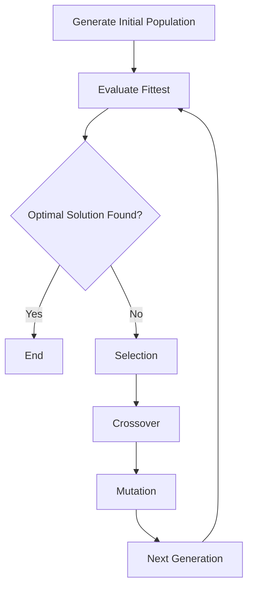
```mermaid
graph TD
    A[Generate Initial Population] --> B[Evaluate Fittest]
    B --> C{Optimal Solution Found?}
    C -->|Yes| D[End]
    C -->|No| E[Selection]
    E --> F[Crossover]
    F --> G[Mutation]
    G --> H[Next Generation]
    H --> B
```

**Initial population**: A set of candidate solutions to the problem that are used to start the genetic algorithm.

- Created through encoding: randomly generate a set of candidate solutions (chromosomes) that represent potential solutions to the problem.
- If initial populations are close to each other, the results may be suboptimal. To ensure diversity, we can use a mix of fixed and random initial populations.

**Encoding**: A way to represent candidate solutions as chromosomes, which are typically strings of bits, numbers, or symbols.

3 encoding approaches:

- **Binary encoding**: A chromosome is made up of bits where each bit represents a specific attribute enabled or disabled.
- **Permutation encoding**: A chromosome is a sequence of values where the order matters, e.g., for the traveling salesman problem, a chromosome can represent a specific route.
- **Value encoding**: A chromosome is a vector of values where each value represents a specific attribute, e.g., the weights of a neural network.

**Fitness**: A value that evaluates how good a chromosome is at solving the problem.

### Selection

**Selection**: The process of selecting which chromosomes should be used in parent pool for the next generation.

- If the parent pool has too few chromosomes, the gene pool will be limited, resulting in similar chromosomes in the next generation.
- If the parent pool has too many chromosomes, all chromosomes from the previous generation may be introduced, making the selection redundant.

Six selection methods:

**Rank Selection**:

- Select chromosomes with highest fitness values.
- Cons: Losing vital attributes that are present in less fit chromosomes.

**Linear Ranking Selection**:

- Divide the chromosomes into groups based on their fitness values. For each group, decide how many chromosomes to select.

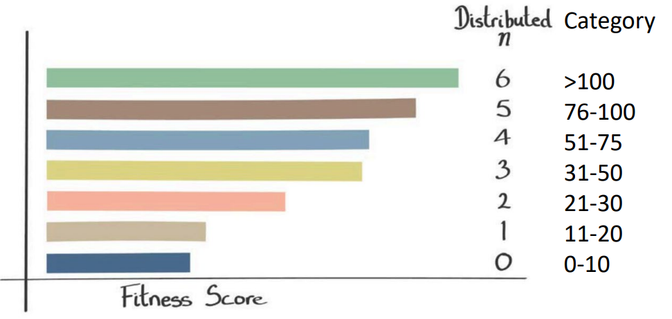

**Tournament Selection**:

- Select a number of chromosomes randomly and select the one with the highest fitness value among them. Repeat until the parent pool is filled.
- Allow low-scoring chromosomes to be selected. Same chromosome can be selected multiple times and have multiple copies in the parent pool.

**Roulette Wheel Selection**:

- Spin a roulette wheel where each chromosome has a slice proportional to its fitness value. The chromosome that the wheel lands on is selected. Repeat until the parent pool is filled.

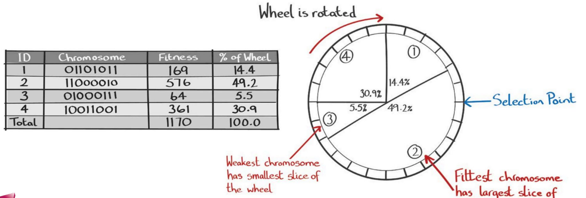

**Stochastic Universal Sampling (SUS)**:

- Similar to roulette wheel selection, but instead of spinning the wheel multiple times, we spin it once and select multiple chromosomes at evenly spaced intervals.
- The randomness is the initial position of the first pointer, and the rest of the pointers are evenly spaced.

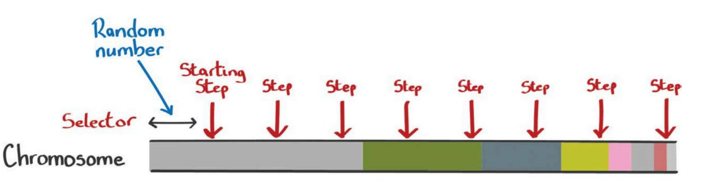

**Elitest Selection**:

- Choose best chromosomes and automatically put them through to the next generation. 
- They still appear in the parent pool, but their copies also go straight through to the next generation, meaning that they do not go through the crossover stage or the mutation stage.
- Guarantee that do not lose the current best, but may stuck in a local optimum if too many elites go through the gene pool, which can quickly diminish the diversity of the population.

### Crossover and Mutation

**Crossover**: The process of combining two parent chromosomes to create one or more offspring chromosomes.

Note the number of children required for the next generation = the same as in previous generation. To generate a child chromosome, we need at least 2 parents, and perform crossover on them (by random selection or in turn).

- **One-point crossover**: Swap $X[0:k]$ and $Y[0:k]$ for a randomly chosen crossover point $k$.
- **N-point crossover**: Choose $n$ random crossover points and swap the segments between those points.
- **Uniform crossover**: For each gene, randomly decide whether to swap it or not with a certain probability.

**Mutation**: The process of randomly altering a gene in a chromosome to introduce variety into the gene pool.

Conclusion of genetic algorithms:

- May not always the best method, and the solutions evolved may be unpredictable.
- Suitable if the elements of the problems may be unpredictable.
- Take many generations to evolve an optimal solution.

## 09 Pathfinding

- **Graph**: A collection of nodes (vertices) and edges (connections between nodes).
- **Weighted graph**: A graph where each edge has a weight (cost) associated with it.
- **Directed weighted graph**: A graph where edges have a direction and a weight.
- **Non-negative constraint**: Pathfinding algorithms typically require that all edge weights are non-negative to guarantee optimality.

### Dijkstra's Algorithm

Given a directed non-negative weighted graph and two nodes (start and goal), find the shortest path from start to goal.

Idea: Spread out from the start node, keep a record of the direction it came from. When it reaches the goal node, we can backtrack to find the path.

Maintain 3 lists

- **Closed list**: Nodes that have been processed
- **Open list**: Nodes that have been visited but not yet processed
- **Unvisited list**: Nodes that have not been visited
- Initially, only the start node is in the open list
- At each iteration, (1) choose the node from the open list with the lowest cost, (2) process the node, (3) move it to the closed list.

Processing a node: for each of its outgoing edges, find the end node and stores (so-far cost, connection from current node to end node) in the priority queue open list.

If for some open and closed nodes, we find a cheaper path to reach them, we update the cost and the connection in the open list. If the node is in the closed list, we move it back to the open list.

Termination condition: when the goal node is the smallest node in the open list, we can stop and backtrack to find the path.

If the open list is empty before we reach the goal node, it means there is no path from start to goal.

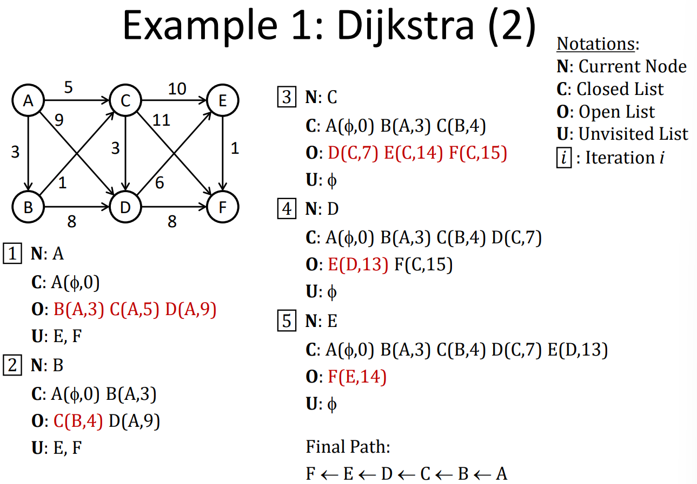

Evaluation:

- $O(nm)$ in time
- Weakness: useful if we are trying to find the shortest path from a single start node to every other node, but if we only care about the path from start to goal, it can be inefficient.

### A\*

A\*: Use a heuristic function to estimate the cost from a node to the goal, and add it to the cost from the start node to that node. This way, we can prioritize nodes that are closer to the goal.

During an interation, consider each of the outgoing edges of the current node, and for each end node, stores (so-far cost, connection, so-far cost + heuristic) in the open list. The node with the lowest so-far cost + heuristic is chosen for processing.

The only difference from Dijkstra's algorithm is that the priority queue is ordered by estimated total cost (so-far cost + heuristic) instead of just the so-far cost.

Termination condition:

- Terminating when the goal node is the smallest node in the open list cannot guarantee optimality because the heuristic may not be admissible (i.e., it may overestimate the cost to reach the goal).
- Therefore, we can only terminate when the smallest **cost-so-far** node in the open list is greater than **cost-so-far** of the goal node. This way, we ensure that we have found the optimal path to the goal node.

Evaluation:

- $O(lm)$ in time, where $l$ is the number of nodes whose total estimated total cost is less than that of the goal.

Choosing a heuristic:

- **Underestimating heuristic**: A heuristic that never overestimates the cost to reach the goal. This guarantees that A\* will find the optimal path, but take longer time. (A\* will prefer nodes that are closer to the start node, which may lead to exploring more nodes before reaching the goal)
- **Overestimating heuristic**: A heuristic that may overestimate the cost to reach the goal. This may not guarantee optimality. (A\* will tend to generate a path with fewer nodes, even if the connections are more expensive)

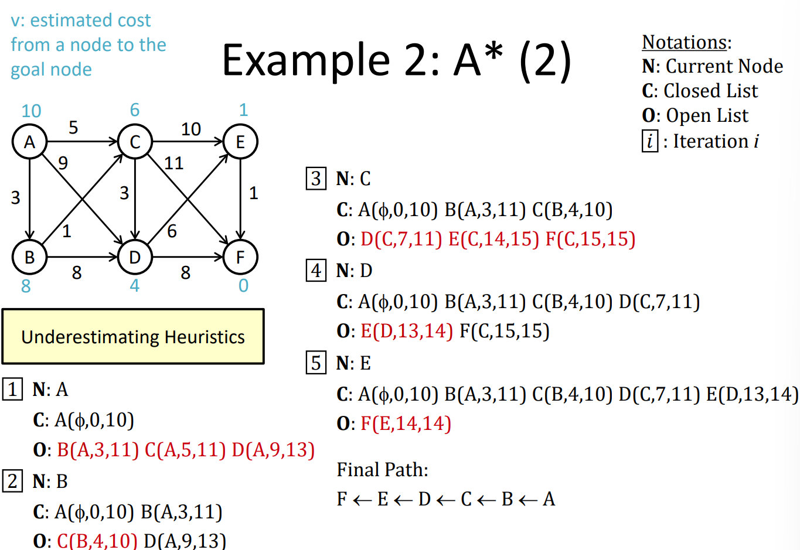

Best practice: choose an underestimating heuristic that is as close to the actual cost as possible.

**Euclidean distance** $L_2 = \sqrt{(x_1 - x_2)^2 + (y_1 - y_2)^2}$ can be used as a heuristic for pathfinding in continuous spaces.

**Manhattan distance** $L_1 = |x_1 - x_2| + |y_1 - y_2|$ can be used as a heuristic for pathfinding in grid-based maps where movement is restricted to horizontal and vertical directions.

**Chebyshev distance** $L_\infty = \max(|x_1 - x_2|, |y_1 - y_2|)$ can be used as a heuristic for pathfinding in grid-based maps where movement is allowed in all eight directions (including diagonals).

These are all underestimating heuristics, as they represent the shortest possible distance between two points in their respective movement models.

**Cluster heuristic**: For large maps, we can divide the map into clusters and precompute the shortest paths between clusters. The heuristic can then be the distance from the current node to the goal node's cluster plus the precomputed distance from that cluster to the goal node.

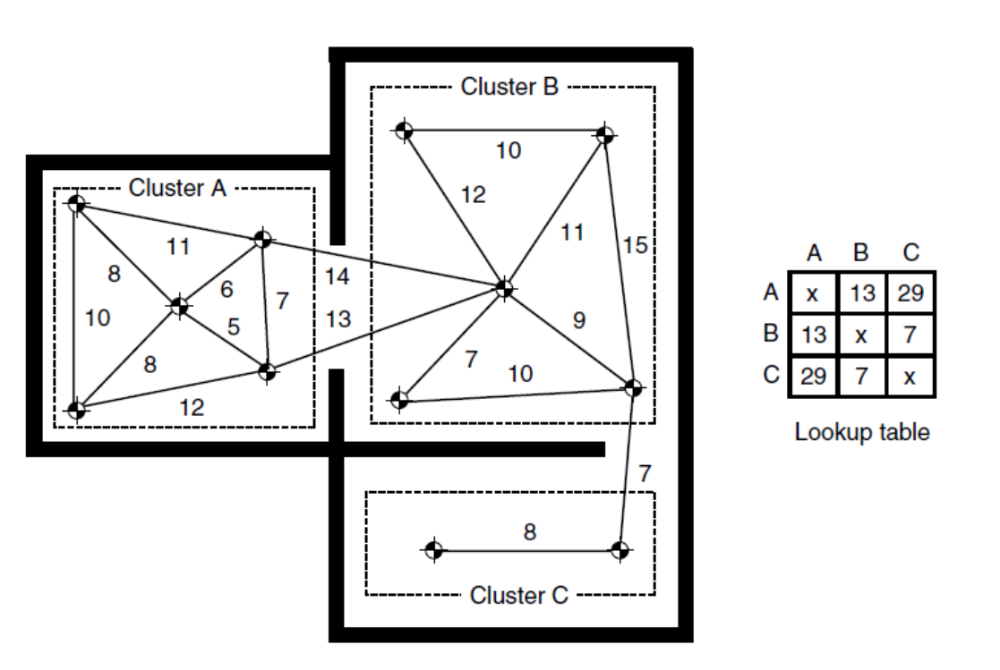

Knowledge vs. search trade-off: A more informed heuristic can reduce the search space and lead to faster pathfinding, but it may require more computational resources to calculate.

Dijkstra is a subset of A\* where the heuristic is zero.

## 10 Tactical AI

Tactical analyses, such as influence maps, are used to evaluate the tactical situation in a game and make informed decisions based on that evaluation.

Representing the game level:

- Split the game level into chunks, where each chunk has roughly the same properties for any tactics we are interested in.
- A tile-based grid is commonly used, especially in RTS games, but for non-tile-based levels, we can impose a grid over the geometry.

### Influence Maps

Influence maps are a way to represent the influence of various factors (e.g., presence of allies, enemies, resources) on different areas of the game level.

Two definitions: $I_d = \frac{I_0}{\sqrt{1 + d}}$ or $I_d = \frac{I_0}{(1+d)^2}$, where $I_0$ is the initial influence and $d$ is the distance from the source of influence.

The difference between the influence of our side and their side can be used to determine the degree of control over a location. If the difference is large, we can consider that location to be secure.

Time complexity: $O(nm)$, memory complexity: $O(m)$, where $m$ is the number of locations and $n$ is the number of units.

Ways to optimize:

#### Limited Radius of Effect

Set a maximum distance for influence of each unit, beyond which the influence is considered negligible and can be ignored.

Time complexity: $O(nr)$, where $r$ is the number of locations within the average radius of effect.

#### Map Flooding

Assume that the influence of each location is the largest influence contributed by any unit (instead of adding up the influence of all units).

#### Convolution Filters

- Start with a grid where only the locations of units have non-zero influence values.
- Apply a convolution filter (e.g., Gaussian blur) to spread the influence values across the grid, simulating the effect of distance on influence.

e.g. $M = \frac{1}{16} \begin{bmatrix} 1 & 2 & 1 \\ 2 & 4 & 2 \\ 1 & 2 & 1 \end{bmatrix}$

There are two ways to handle the borders of the grid when applying the convolution filter:

(1) Modifying the matrix.

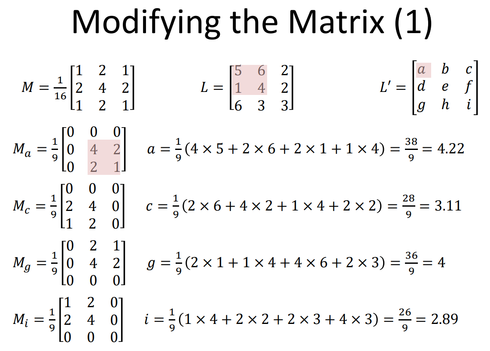

(2) Modifying (padding) the map.

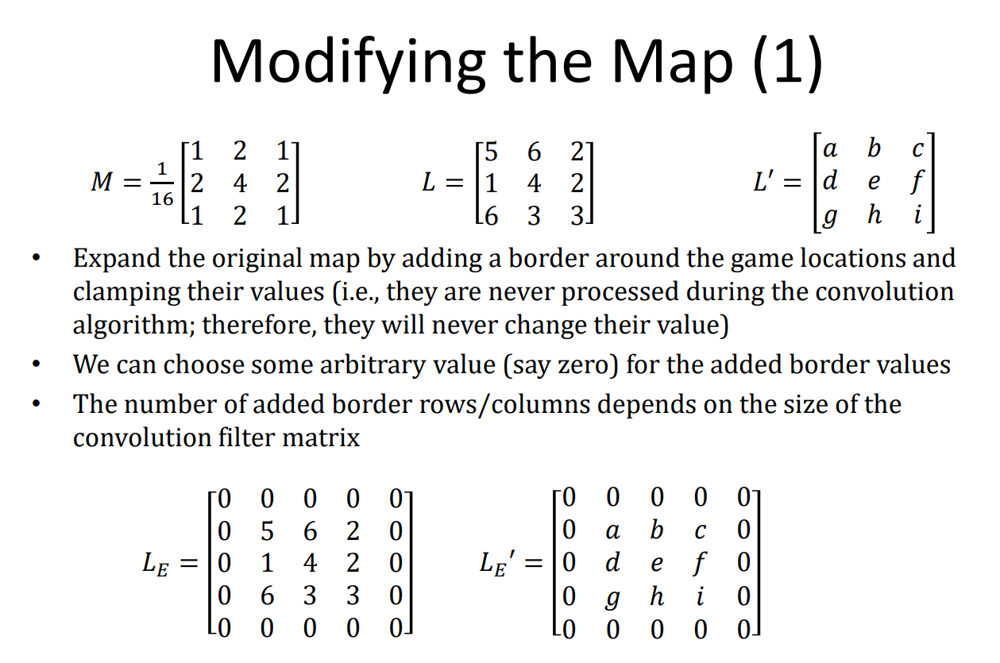

Performance:

Since there are significantly fewer units than locations, the time complexity is higher than the previous methods, but it can be optimized using techniques like Fast Fourier Transform (FFT) to perform convolution efficiently.

Time complexity: $O(m \log m)$, where $m$ is the number of locations.

**Gaussian blur filter**: The product of binomial coefficients vector with itself transposed, normalized by the sum of the coefficients.

e.g. for a 5x5 Gaussian blur filter, the binomial coefficients vector is $[1 \ 4 \ 6 \ 4 \ 1]$, and the filter is:

$$M = \frac{1}{256} \begin{bmatrix} 1 \\ 4 \\ 6 \\ 4 \\ 1 \end{bmatrix} \begin{bmatrix} 1 & 4 & 6 & 4 & 1 \end{bmatrix} = \frac{1}{256} \begin{bmatrix} 1 & 4 & 6 & 4 & 1 \\ 4 & 16 & 24 & 16 & 4 \\ 6 & 24 & 36 & 24 & 6 \\ 4 & 16 & 24 & 16 & 4 \\ 1 & 4 & 6 & 4 & 1 \end{bmatrix}$$

**Sharpening filter**: A filter that concentrates the influence values around the source. General form:

$$M = \frac{1}{a} \begin{bmatrix} -b & -c & -b \\ -c & a(4b+4c+1) & -c \\ -b & -c & -b \end{bmatrix}$$

For example: $M = \frac{1}{2} \begin{bmatrix} -1 & -1 & -1 \\ -1 & 18 & -1 \\ -1 & -1 & -1 \end{bmatrix}$

Dealing with unknowns: if we perform a tactical analysis on the units we can see, we probably underestimate the influence of the enemy. Some games allow AI players to know everything.

Multi-layer analyses: We can have multiple influence maps for different factors (e.g., one for visibility, one for security, one for distance to resources), and combine them to make decisions.

### Tactical Pathfinding

Cost function:

$$C = D + \sum_{i=1}^n w_i T_i$$

where $D$ is the distance to the goal, $T_i$ is the tactical quality for the connection (i.e., the influence value of the location), and $w_i$ is the weight for that tactic.

- If a tactic has a high weight $w_i$, then locations with that tactical property will be avoided by the character, e.g., ambush locations or difficult terrain.
- It is important to ensure that no possible connection in the graph can have a negative overall cost.

Example:

| Types of Units \ Locations | Terrain Difficulty | Enemy | Visibility |
| --- | --- | --- | --- |
| Reconnaissance units | Small positive (avoid) | Large positive (avoid) | Large negative (favor high visibility) |
| Light infantry | Larger positive (avoid) | Small positive (avoid) | Small positive (favor low visibility) |
| Heavy infantry | Large positive (avoid) | Large positive (avoid) | Large positive (favor low visibility) |

## 11 Maze Generation

Structures of mazes:

- Rooms: Open areas.
- Corridors: Narrow passages that connect rooms.

Types/characteristics of mazes:

- Caves: non-grid-based mazes with irregular shapes and connections.
- Rooms: begin with areas that are unreachable, which contain mineable resources.
- Only rooms: instead of grid-based, each location is already a room, and we just need to connect them with doors.
- Thickening walls: the wall is 1-tile thick, same as the corridor.

### Depth-First Backtracking (Bottom-up)

1. Start with a grid of unused cells.
2. Set current cell = entrance cell.
3. Perform the following steps until all cells have been visited (stored in a stack):
    1. Mark the current cell as used.
    2. If the current cell has any unused neighbors:
        1. Choose one of the unused neighbors at random.
        2. Remove the wall between the current cell and the chosen neighbor.
        3. Set the chosen neighbor as the current cell.
    3. Else, backtrack to the previous cell that has unused neighbors and repeat step 3.
4. When all cells have been visited, the maze is complete.

The maze has an exit, but it does not need to be explicitly defined. The algorithm guarantees that there is a path from the entrance to any reachable cell.

### Minimum Spanning Tree (Bottom-up)

Minimum spanning tree algorithms work on weighted graphs, where nodes represent points where there may be branching (often rooms), edges represent every possible connection in the maze, and edge weights represent the cost of making the connection part of the output.

Begin at a single point (usually the entrance to the maze) and calculate the network that spreads from that point to reach all nodes in the graph, such that the tree includes the minimum total edge cost.

**Prim's algorithm**:

1. Start with a weighted graph and a starting node. Add all nodes other than the starting node to an unvisited list.
2. Initialize a tree with the starting node.
3. While there are unvisited nodes:
    1. Find the edge with the smallest weight that connects a node in the tree to a node in the unvisited list.
    2. Add the edge and the connected unvisited node to the tree.
    3. Remove the newly added node from the unvisited list.

Time complexity: $O(m \log n)$, where $n$ is the number of nodes and $m$ is the number of edges.

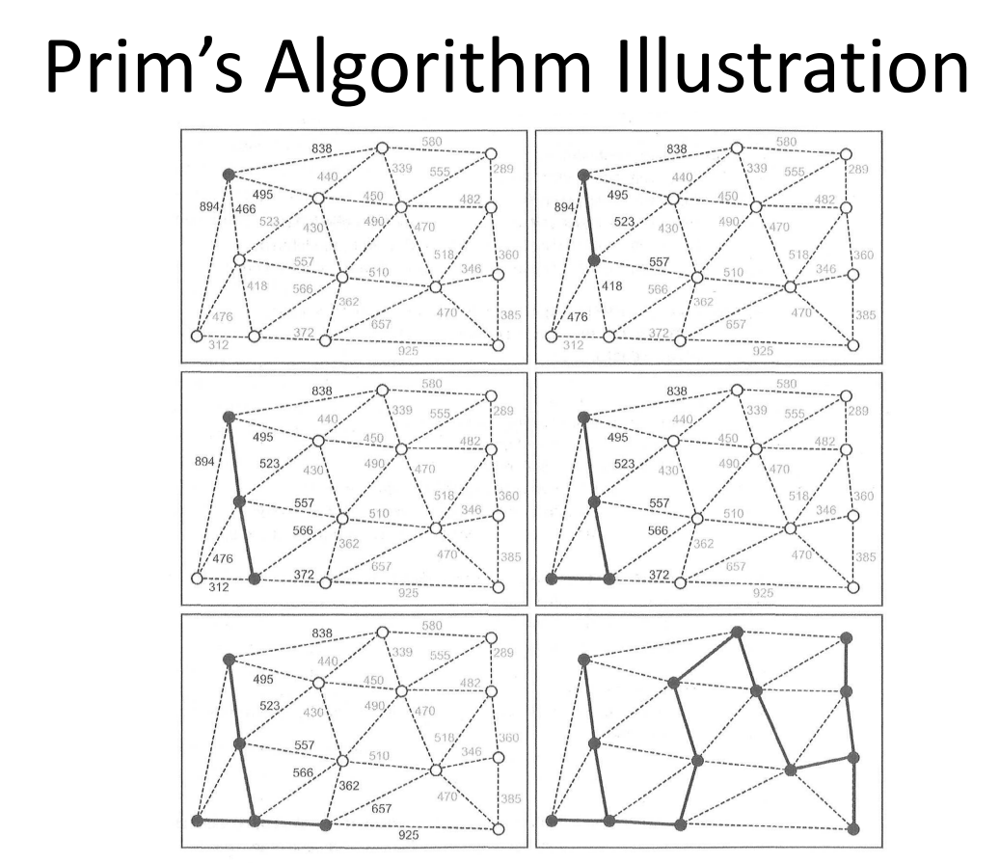

For maze generation, an additional step: For each edge in the minimum spanning tree, dig a corridor from one node to the other.

### Recursive Subdivision (Top-down)

(1) Subdivide the space to place rooms

1. Begin with the entire level and proceed recursively:
    1. Randomly subdivide the current space in two.
    2. If both subdivisions meet certain quality criteria (usually related to size), then recursively subdivide each in turn.
2. Terminate when execution returns to the root space.

(2) Connect the rooms with corridors (which may be ignored if minimum spanning tree or backtracking is used)

1. When 2 leaf spaces have a common parent, a corridor directly connects them.
2. Two non-leaf spaces may be connected by rooms within them, or by their corridors

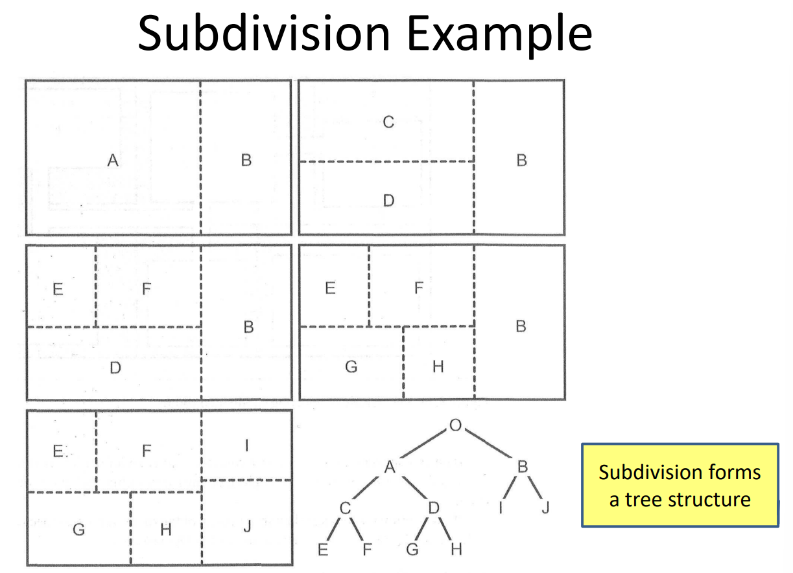

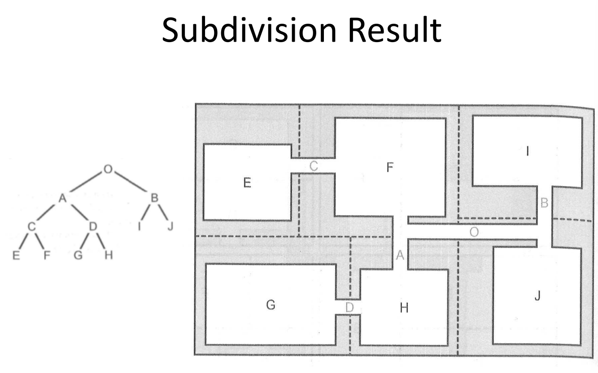

## 12 More on Pathfinding

### Hierarchical Pathfinding

1. Plan a high-level route from the start to the goal using a simplified representation of the environment (e.g., a graph of rooms and corridors).
2. For each segment of the high-level route, plan a detailed path using a more detailed representation of the environment (e.g., a grid-based map).
3. The above steps can be repeated recursively until the path is refined to the level of detail required for movement.

**Nodes**: The individual locations in the environment. Based on the level of detail, a node can represent a specific point in a grid, a room, or an entire building.

A typical implementation will store a mapping from nodes at one level to groups at a higher level.

**Connections**: The possible paths between nodes. If any low-level node in group A is connected to any low-level node in group B, then there is a high-level connection between group A and group B.

Hierarchical pathfinding process:

1. Determine the initial level of the hierarchy to start pathfinding. It is the highest level where the start and goal locations are not in the same node.
2. Perform A\* search at the current level to find a path from the start node to the goal node.
3. Once a path is found, refine the initial stages of the plan by performing A\* search at the next lower level in the hierarchy, where the start point is the same, but the end point is set at the end of the first move in the high-level plan. (Only the initial stages are considered because they directly affect the movement of the character, while the later stages can be worked out later.)

**Hierarchical Pathfinding on exclusions**:  In cases where the whole detailed plan is needed directly, we can modify the algorithm that

- the start and end locations are never moved (always the same at all levels)
- at each lower level, the algorithm only considers nodes that are within a group node that is part of the higher level plan. (i.e. if a zone is not on the high-level path, then its nodes are not considered at the lower level)

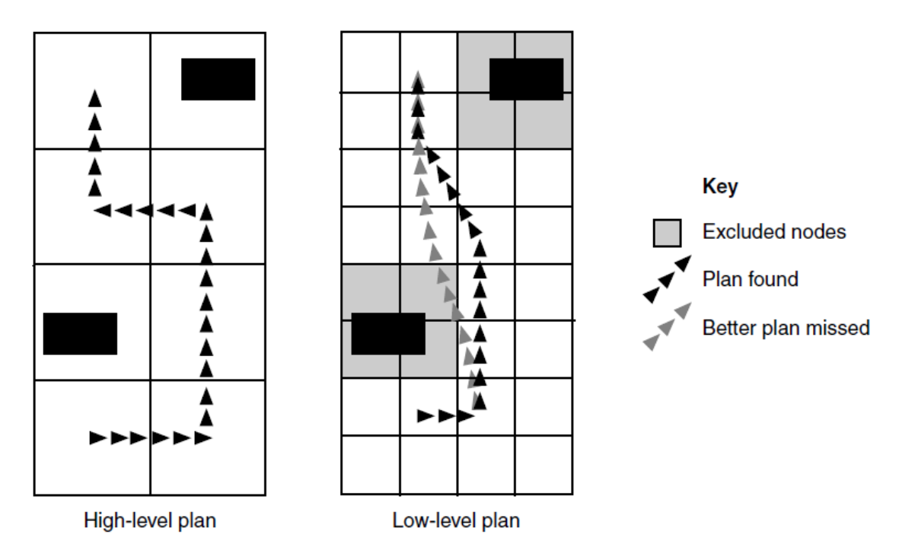

### Continuous Time Pathfinding

Scenario: An AI-controlled police vehicle moving along a busy city road, trying to pursue a criminal. The car needs to decide when to change lanes while avoiding collisions with other vehicles.

- Abstraction: Place a node every few yards on each lane of the road, and create connections between nodes in the same lane and adjacent lanes.
- Problem: The nodes are positioned in an arbitrary way, which can lead to unrealistic behavior.
- Solution: Create a dynamic graph that contains information about position and timing for lane changes, then use A\* to find the optimal path through this graph.

**Nodes as states**: A node has two elements: position and time. A connnection exists if it is possible to move from start to end, and the time difference between the start and end is equal to the time it takes to move from start to end.

However, this makes the pathfinding graph very large, we take the following assumptions to optimize:

1. If the car is to change lanes, it will do so as soon as possible.
2. It will move in its current lane to its next lane change as quickly as possible.

Procedure:

1. Initially, the graph has only a single node in it: the current location of the AI police car, with the current time (0).
2. Outgoing connections from the current node are then added by either going straight or changing lanes, by examining the cars on the road. 

Properties of the graph:

- The connections include a cost value (time + other factors).
- The nodes pointed to by each connection include both position information and time information.
- Upon successive iterations of the pathfinding algorithm, the graph will be called again with a new start node (the new location and time after taking the first step in the plan), and we can predict where the cars on the road will be and repeat the process of generating connections.

Weakness: Very difficult to implement, high computational cost, should only be used for small sections of planning.
