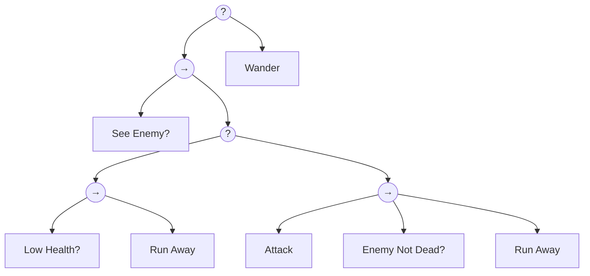

# CS4386 AI Game Programming - Tutorials

## Tutorial 1 - Tic Tac Toe

### Step 1 - Check immediate win/loss

```python
import random
from battle_base import read_ckbd, save_decision, MAX_M, MAX_N

# TicTacToe
# - Board cells: 0 empty, 1 (A / X), 2 (B / O)
# - Input: (step, rival_decision_x, rival_decision_y)
# - Output: call save_decision(x, y)

LINES = [
    [(0, 0), (0, 1), (0, 2)], [(1, 0), (1, 1), (1, 2)], [(2, 0), (2, 1), (2, 2)],
    [(0, 0), (1, 0), (2, 0)], [(0, 1), (1, 1), (2, 1)], [(0, 2), (1, 2), (2, 2)],
    [(0, 0), (1, 1), (2, 2)], [(0, 2), (1, 1), (2, 0)]
]

def play_games(step, rival_decision_x, rival_decision_y):
    board = read_ckbd(step - 1)
    def is_winning_move(board, player, x, y):
        board[x][y] = player
        for line in LINES:
            if all(board[i][j] == player for i, j in line):
                board[x][y] = 0
                return True
        board[x][y] = 0
        return False
    
    me = (step + 1) % 2 + 1
    opponent = 3 - me
    
    legal_decision = []
    for i in range(MAX_M):
        for j in range(MAX_N):
            if board[i][j] == 0:
                legal_decision.append((i, j))
    if not legal_decision:
        # No legal moves (should be a draw)
        save_decision(0, 0)
        return

    for move in legal_decision:
        if is_winning_move(board, me, move[0], move[1]):
            save_decision(move[0], move[1])
            return

    for move in legal_decision:
        if is_winning_move(board, opponent, move[0], move[1]):
            save_decision(move[0], move[1])
            return

    decision = random.choice(legal_decision)
    save_decision(decision[0], decision[1])
```

### Step 2 - Minimax algorithm

```python
import sys
import random
from battle_base import read_ckbd, save_decision, MAX_M, MAX_N

# TicTacToe
# - Board cells: 0 empty, 1 (A / X), 2 (B / O)
# - Input: (step, rival_decision_x, rival_decision_y)
# - Output: call save_decision(x, y)

LINES = [
    [(0, 0), (0, 1), (0, 2)], [(1, 0), (1, 1), (1, 2)], [(2, 0), (2, 1), (2, 2)],
    [(0, 0), (1, 0), (2, 0)], [(0, 1), (1, 1), (2, 1)], [(0, 2), (1, 2), (2, 2)],
    [(0, 0), (1, 1), (2, 2)], [(0, 2), (1, 1), (2, 0)]
]

def debug(*args):
    print(*args, file=sys.stderr, flush=True)

def play_games(step, rival_decision_x, rival_decision_y):
    board = read_ckbd(step - 1)
    me = (step + 1) % 2 + 1
    opponent = 3 - me

    def evaluate_board(board):
        for line in LINES:
            if all(board[i][j] == me for i, j in line):
                return 10
            elif all(board[i][j] == opponent for i, j in line):
                return -10
        return 0
    
    def minimax(board, depth, is_maximizing):
        score = evaluate_board(board)
        # debug("Board:", board, "Score:", score, "Depth:", depth, "Sign:", is_maximizing)
        if score == 10 or score == -10:
            return score
        if all(board[i][j] != 0 for i in range(MAX_M) for j in range(MAX_N)):
            return 0  # Draw
        if is_maximizing:
            best = -1000
            for i in range(MAX_M):
                for j in range(MAX_N):
                    if board[i][j] == 0:
                        board[i][j] = me
                        best = max(best, minimax(board, depth + 1, not is_maximizing))
                        board[i][j] = 0
            return best
        else:
            best = 1000
            for i in range(MAX_M):
                for j in range(MAX_N):
                    if board[i][j] == 0:
                        board[i][j] = opponent
                        best = min(best, minimax(board, depth + 1, not is_maximizing))
                        board[i][j] = 0
            return best

    legal_decision = []
    for i in range(MAX_M):
        for j in range(MAX_N):
            if board[i][j] == 0:
                legal_decision.append((i, j))
    if not legal_decision:
        # No legal moves (should be a draw)
        save_decision(0, 0)
        return
    if step == 1: # First move, choose randomly
        decision = random.choice(legal_decision)
        save_decision(decision[0], decision[1])
        return
    
    best_value = -1000
    best_move = None
    for move in legal_decision:
        board[move[0]][move[1]] = me
        move_value = minimax(board, 0, False)
        board[move[0]][move[1]] = 0
        # debug("Move:", move, "Value:", move_value)
        if move_value > best_value:
            best_value = move_value
            best_move = move
    save_decision(best_move[0], best_move[1])
```

## Tutorial 2 - Tic Tac Toe Analysis

### Task 1 - Possible Boards

Recall from Tutorial 1 on the Tic Tac Toe game that each of the 3×3 board cell is either unoccupied (denoted by 0), occupied by Player A (marked by ‘X’ and denoted by 1), and occupied by Player B (marked by ‘O’ and denoted by 2).

How many possible game boards are there, including all cases from both valid and invalid games? This means that each cell on the board is either unoccupied (0), occupied by Player A (1), or occupied by Player B (2), how many different combinations are there?

**Solution**: Each of the $3 \times 3 = 9$ cells on the board can be in one of 3 states (0, 1, or 2). Therefore, the total number of possible game boards can be calculated as:

$$3^9 = 19683$$

### Task 2 - Possible first 5 moves

(a) If we would like to consider the first 5 moves of the Tic Tac Toe games, how many cells of the 3×3 board cells are occupied and how many cells are unoccupied after the first 5 moves (combined from the 2 players)?

**Solution**: 4 cells are unoccupied.

(b) Among the occupied cells after the first 5 moves, how many of them are occupied by Player A (1) and how many of them are occupied by Player B (2)?

**Solution**: 3 cells are occupied by Player A and 2 cells are occupied by Player B.

(c) How many distinct game boards are there after the first 5 moves?

**Solution**: Considering the number of "distinct game boards", i.e. the number of states after the first 5 moves, we only care about the states of the cells (0, 1, or 2) and not the order of moves.

To choose 3 cells for Player A from the 9 available cells, we have $\binom{9}{3} = 84$ ways.

To choose 2 cells for Player B from the remaining 6 cells, we have $\binom{6}{2} = 15$ ways.

Therefore, the total number of distinct game boards after the first 5 moves is:

$$\binom{9}{3} \times \binom{6}{2} = 84 \times 15 = 1260$$

(d) Among the game boards from (c), how many of them correspond to end game? How do these games end?

**Solution**: After the first 5 moves, the game ends if and only if Player A has formed a winning combination (3 in a row, column, or diagonal) with their 3 moves.

Regarding the winning positions for Player A, there are 8 possible winning combinations in Tic Tac Toe:

1. Rows: (1,2,3), (4,5,6), (7,8,9)
2. Columns: (1,4,7), (2,5,8), (3,6,9)
3. Diagonals: (1,5,9), (3,5,7)

For each winning combination, we need to choose 2 cells for Player B from the remaining 6 cells ($\binom{6}{2} = 15$ ways).

The answer is:

$$8 \times 15 = 120$$

## Tutorial 3 - Minimax Algorithm

```python
values = [23, 40, 61, 19, 33, 98, 12, 9, 18, 77, 2, 62, 4, 80, 10, 48]
DEPTH = 4
NUM_CHILDREN = 2

def abNegamax(i, maxDepth, currentDepth, alpha, beta):
    if currentDepth == maxDepth:
        return values[i]
    
    bestScore = -100_000

    print(f"[ENTER] Depth: {currentDepth}, Index: {i}, Alpha: {alpha}, Beta: {beta}")
    
    for j in range(NUM_CHILDREN):
        childIndex = i * NUM_CHILDREN + j
        score = -abNegamax(childIndex, maxDepth, currentDepth + 1, -beta, -max(alpha, bestScore))
        print(f"[RETURN] Depth: {currentDepth}, ChildIndex: {childIndex}, Score: {score}, BestScore: {bestScore}, Alpha: {alpha}, Beta: {beta}")
        
        if score > bestScore:
            bestScore = score
            print(f"[UPDATE] Depth: {currentDepth}, Index: {i}, New BestScore: {bestScore}")
            if bestScore >= beta:
                print(f"[PRUNE] Depth: {currentDepth}, Index: {i}, BestScore: {bestScore} >= Beta: {beta}")
                break
    return bestScore

if __name__ == "__main__":
    finalScore = abNegamax(0, DEPTH, 0, -100_000, 100_000)
    print(f"Final score: {finalScore}")
```

## Tutorial 4 - Breakthrough Analysis

### Task 1 - Initializing Zobrist Keys

The Jungle Chess has the following game board and chess pieces:

Each of the 2 players has 8 different chess pieces representing different animals: 1. Rat; 2. Cat; 3. Dog; 4. Wolf; 5. Leopard; 6: Tiger; 7. Lion; 8: Elephant. The game board can be visualized as a 9×7 square board. Assuming that each square on the Jungle chess game board can be occupied by any of the animal chess pieces, how many random Zobrist keys need to be initialized if Zobrist hashing is used to implement the transposition table for representing the board states of this game?  Note that you do not need to know the rules of this game in order to answer this question.

On the $9 \times 7$ board, we have 63 squares and 16 piece types (8 for each player), giving us $63 \times 16 = 1008$ unique piece-square combinations.

### Task 3 - Initial Zobrist Keys

On the $8 \times 8$ board, we have 64 squares and 2 piece types (black and white), giving us $64 \times 2 = 128$ unique piece-square combinations.

### Task 4 - Getting Zobrist Key of a Given Board

| Status | Code |
|--------|------|
| [0, 0] = 1 | 1101... |
| [0, 1] = 1 | 1010... |
| [1, 0] = 1 | 0110... |
| [1, 1] = 1 | 0101... |
| [0, 0] = 2 | 1001... |
| [0, 1] = 2 | 0001... |
| [1, 0] = 2 | 1100... |
| [1, 1] = 2 | 0011... |

A = ([0, 0] = 1) xor ([0, 1] = 2) xor ([1, 1] = 2) = 1101... XOR 0001... XOR 0011... = 1111...

B = ([0, 0] = 2) xor ([0, 1] = 2) = 1001... XOR 0001... = 1000...

and also B = A xor ([0, 0] = 1) xor ([0, 0] = 2) xor ([1, 1] = 2) = 1111... XOR 1101... XOR 1001... XOR 0011... = 1000...

C = ([0, 1] = 2) xor ([1, 1] = 1) = 0001... XOR 0101... = 0100...

and also C = A xor ([0, 0] = 1) xor ([1, 1] = 2) xor ([1, 1] = 1) = 1111... XOR 1101... XOR 0011... XOR 0101... = 0100...

Question: For the same game, would clashing occur with higher probability if the length of each Zobrist key is 8 bits or if the length of each Zobrist key is 16 bits?

Answer: Clashing would occur with higher probability if the length of each Zobrist key is 8 bits compared to 16 bits. This is because with 8 bits, there are only $2^8 = 256$ possible unique keys, while with 16 bits, there are $2^{16} = 65,536$ possible unique keys. Therefore, the likelihood of two different board states producing the same Zobrist key (a collision) is much higher with 8-bit keys than with 16-bit keys.

## Tutorial 5 - Monte Carlo Tree Search

给出一个 Monte Carlo Tree Search 的游戏树。根节点 N00 有三个子节点 N10、N11 和 N12。N10 有两个子节点 N20 (1/2) 和 N21 (4/5)。N11 有两个子节点 N22 (1/3) 和 N23 (4/6)。N12 有两个子节点 N24 (1/4) 和 N25 (4/7)。括号内给出了每个叶子节点的 (对手获胜次数/访问次数)。

(1) 计算 N00、N10、N11 和 N12 的值。

(2) 使用 k = 0.5 计算 UCT 值，并确定哪个叶子结点将被选择。$$UCT_i = \frac{w_i}{n_i} + k \sqrt{\frac{\ln N}{n_i}}$$，其中 $N$ 是父节点的访问次数，$n_i$ 是子节点的访问次数，$w_i$ 是子节点的获胜次数。

(3) 假设将 (2) 中被选择的叶子结点进行扩展。对其进行模拟，结果是总共 8 次中对手获胜了 3 次。计算受影响的所有结点的新值。

### Task 1 - Back Propagation

- N20 = 1/2
- N21 = 4/5
- N10 = 1 - (N20 + N21) = 1 - (1+4)/(2+5) = 1 - 5/7 = 2/7
- N22 = 1/3
- N23 = 4/6
- N11 = 1 - (N22 + N23) = 1 - (1+4)/(3+6) = 1 - 5/9 = 4/9
- N24 = 1/4
- N25 = 4/7
- N12 = 1 - (N24 + N25) = 1 - (1+4)/(4+7) = 1 - 5/11 = 6/11
- N00 = 1 - (N10 + N11 + N12) = 1 - (2 + 4 + 6)/(7 + 9 + 11) = 1 - 12/27 = 15/27

### Task 2 - Selection

$u_i = \frac{w_i}{n_i} + k \sqrt{\frac{\ln N}{n_i}}$

When $k = 1.8$:

- N10: $u_{10} = \frac{2}{7} + 1.8 \sqrt{\frac{\ln 27}{7}} = 1.521$
- N11: $u_{11} = \frac{4}{9} + 1.8 \sqrt{\frac{\ln 27}{9}} = 1.534$
- N12: $u_{12} = \frac{6}{11} + 1.8 \sqrt{\frac{\ln 27}{11}} = 1.531$
- N11 is selected.
- N22: $u_{22} = \frac{1}{3} + 1.8 \sqrt{\frac{\ln 9}{3}} = 1.874$
- N23: $u_{23} = \frac{4}{6} + 1.8 \sqrt{\frac{\ln 9}{6}} = 1.756$
- N22 is selected for expansion.

When $k = 0.5$:

- N12: $u_{12} = \frac{6}{11} + 0.5 \sqrt{\frac{\ln 27}{11}} = 0.819$

## Tutorial 6 - N-Gram and Naive Bayes Classifier

```python
input_str = "TGTGJGSJSJJSGSSSJSGSGTGGJGSJSTGGTSGSJGGSSSSGSSSSJSSTSSGSSJSGTSJSGGGSSGSGTJSSSTJSSTJSGJJSGTGJSTGSSGJSSGGJSSSJGGGGTSSJGGSSGGGTSSGGJGGJJSGSSJGSGGTJGGGSGSSSJGSGGSSGGSSSTGSGJSJTTTGSGGSGGSGGSGSTJTSJJTTJTJJT"

# Task 1: N-gram

def construct_n_gram(n):
    n_grams = dict()
    for i in range(len(input_str) - n + 1):
        cur = input_str[i:i+n]
        n_grams[cur] = n_grams.get(cur, 0) + 1
    return n_grams

def predict_next(n_grams, n):
    cur = input_str[-(n-1):]
    print(f"Current context for prediction: '{cur}'")
    candidates = {k: v for k, v in n_grams.items() if k.startswith(cur)}
    if not candidates:
        return None
    max_count = max(candidates.values())
    return [k[-1] for k, v in candidates.items() if v == max_count]

bigrams = construct_n_gram(2)
trigrams = construct_n_gram(3)
print("Bigrams:", bigrams)
print("Trigrams:", trigrams)
print("Predict with bigrams:", predict_next(bigrams, 2))
print("Predict with trigrams:", predict_next(trigrams, 3))

# Task 2: Prior

def calculate_prior():
    char_count = dict()
    for char in input_str:
        char_count[char] = char_count.get(char, 0) + 1
    total_chars = len(input_str)
    prior = {char: count / total_chars for char, count in char_count.items()}
    return prior

def predict_with_prior(prior):
    max_prob = 0
    candidates = []
    for char, prob in prior.items():
        if prob > max_prob:
            max_prob = prob
            candidates = [char]
        elif prob == max_prob:
            candidates.append(char)
    return candidates

print("Prior probabilities:", calculate_prior())
print("Predict with prior:", predict_with_prior(calculate_prior()))

# Task 3: Naive Bayes

p_long_given_word = {'G': 0.2, 'S': 0.1, 'J': 0.4, 'T': 0.5}
p_bayesian = {char: p_long_given_word.get(char, 0) * calculate_prior().get(char, 0) for char in set(input_str)}
print("Naive Bayes probabilities (relative):", p_bayesian)
print("Predict with Naive Bayes:", predict_with_prior(p_bayesian))

"""
we need to know P(word|duration>0.5s). Prior is P(word), and the given conditional probability is P(duration>0.5s|word). We can calculate the posterior probability using Bayes' theorem:
P(word|duration>0.5s) = P(duration>0.5s|word) * P(word) / P(duration>0.5s)
"""
```

## Tutorial 7 - Decision Tree and Behavior Tree

### Task 1 - Decision Tree

| Action | Probability |
|--------|-------------|
| A | 0.3 |
| B | 0.2 |
| C | 0.2 |
| D | 0.15 |
| E | 0.15 |

Consider 2 forms:

Structure 1

```mermaid
graph TD
    {Q1} --> {Q2}
    {Q1} --> {Q3}
    {Q2} --> [N01]
    {Q2} --> [N02]
    {Q3} --> [N03]
    {Q3} --> {Q4}
    {Q4} --> [N04]
    {Q4} --> [N05]
```

Structure 2

```mermaid
graph TD
    {Q1} --> [N06]
    {Q1} --> {Q2}
    {Q2} --> [N07]
    {Q2} --> {Q3}
    {Q3} --> [N08]
    {Q3} --> {Q4}
    {Q4} --> [N09]
    {Q4} --> [N10]
```

Construct the best decision tree (i.e. by replacing the Nxx nodes with the actions A-E) for the above data. The "best" decision tree is the one that minimizes the average number of questions asked to reach a decision.

Which structure can give a better decision tree? Why?

Structure 1: 2.3

$2 \times (0.3 + 0.2 + 0.2) + 3 \times (0.15 + 0.15) = 2.3$

Structure 2: 2.5

$1 \times 0.3 + 2 \times 0.2 + 3 \times 0.2 + 4 \times (0.15 + 0.15) = 2.5$

Structure 1 is better because it is more balanced.

### Task 2 - Behavior Tree

```
Selector Node 1 (-> Node 2, Wander)
-> Node 2 (See Enemy?, Selector Node 3)
Selector Node 3 (-> Node 4, -> Node 5)
-> Node 4 (Low Health?, Run Away)
-> Node 5 (Attack, Enemy Not Dead?, Run Away)
```



In human language, the behavior tree can be described as follows:

- the character will first check if he sees an enemy. If he does not see an enemy, he will wander around.
- If he sees an enemy, he will check if his health is low. If his health is low, he will run away.
- If his health is not low, he will attack the enemy. After attacking, he will check if the enemy is dead. If the enemy is not dead, he will run away.

a) When the character with low health sees an enemy, what will be the action(s)?

Answer: The character will run away.

b) Under what conditions will the character attack?

Answer: The character will attack if he sees an enemy and his health is not low.

c) Is it possible for the character to carry out the following 2 actions, one after the other, in each of the following cases?

- Run away and then attack?
- Attack and then run away?
- Attack and then wander?

Answer: No, Yes, No.

d) Will the selector node at Node 3 return true or false after the character attacks and kills an enemy?

Answer: false

Enemy Not Dead? will return false, so Node 5 will return false (sequence node returns false if any of its children return false). Node 4 must return false (otherwise the attack will never happen), so Node 3 will return false (both children return false).

## Tutorial 8 - Decision Tree Learning

### Task 1 - ID3

Assume that in a game the AI needs to steer a car in a 2-lane road. It tries to learn from some examples observed from a player. The attributes are whether there is a car in front (F), whether there is a car behind (B), and whether there is a car in the next lane (N). The examples given these attribute values and the corresponding actions are shown in the following table:

| Example | F: Car in front? | B: Car behind? | N: Car next lane? | Action          |
|---|---|---|---|---|
| 1 | Yes | Yes | Yes | Maintain Speed |
| 2 | Yes | No  | No  | Change Lane    |
| 3 | Yes | Yes | No  | Change Lane    |
| 4 | No  | Yes | No  | Turbo          |
| 5 | Yes | No  | Yes | Maintain Speed |

Construct the decision tree based on the above examples using the ID3 algorithm.

(1) Entropy of the whole set $E = -\frac{2}{5} \log_2 \frac{2}{5} - \frac{2}{5} \log_2 \frac{2}{5} - \frac{1}{5} \log_2 \frac{1}{5} = 1.522$.

(2) Consider the first split.

On Attribute F:

Yes -> 2M, 2C

No -> 1T

$Gain(F) = E - (\frac{4}{5} (-\frac{2}{4} \log_2 \frac{2}{4} - \frac{2}{4} \log_2 \frac{2}{4}) + \frac{1}{5} (0)) = 1.522 - 0.8 = 0.722$.

On Attribute B:

Yes -> 1M, 1C, 1T

No -> 1M, 1C

$Gain(B) = E - (\frac{3}{5} (-\frac{1}{3} \log_2 \frac{1}{3} - \frac{1}{3} \log_2 \frac{1}{3} - \frac{1}{3} \log_2 \frac{1}{3}) + \frac{2}{5} (-\frac{1}{2} \log_2 \frac{1}{2} - \frac{1}{2} \log_2 \frac{1}{2})) = 1.522 - 1.351 = 0.171$.

On Attribute N:

Yes -> 2M

No -> 2C, 1T

$Gain(N) = E - (\frac{2}{5} (0) + \frac{3}{5} (-\frac{2}{3} \log_2 \frac{2}{3} - \frac{1}{3} \log_2 \frac{1}{3})) = 1.522 - 0.551 = 0.971$.

(3) The best first split is on Attribute F.

We need to further split cases 2,3,4.

It can be observed that the best split is on Attribute F, which results in the following tree:

```
mermaid
graph TD
    N{N: Car next lane?} -->|Yes| M(Maintain Speed)
    N -->|No| F{F: Car in front?}
    F -->|Yes| C(Change Lane)
    F -->|No| T(Turbo)
```

### Task 2 - Simple Updating

| Example | F: Car in front? | B: Car behind? | N: Car next lane? | Action          |
|---|---|---|---|---|
| 6 | No | Yes | Yes | Turbo          |

To update the decision tree, we need to go through the tree with the new example and check if it is correctly classified.

- N: Car next lane? -> Yes -> Maintain Speed (Incorrect)

Therefore we have to split the node N: Car next lane? again.

Observing the examples with N: Car next lane? = Yes, we have:

| Example | F: Car in front? | B: Car behind? | N: Car next lane? | Action          |
|---|---|---|---|---|
| 1 | Yes | Yes | Yes | Maintain Speed |
| 5 | Yes | No  | Yes | Maintain Speed |
| 6 | No  | Yes | Yes | Turbo          |

F is the best attribute to split on, which results in the following updated tree:

```
mermaid
graph TD
    N1{N: Car next lane?} -->|Yes| F1{F: Car in front?}
    N1 -->|No| F2{F: Car in front?}
    F1 -->|Yes| M1(Maintain Speed)
    F1 -->|No| T1(Turbo)
    F2 -->|Yes| C2(Change Lane)
    F2 -->|No| T2(Turbo)
```

### Task 3 - ID4

Same example as Task 2.

Now since N: Car next lane? is not a pure node and not a terminal node, so we have to split it again.

Consider all examples:

| Example | F: Car in front? | B: Car behind? | N: Car next lane? | Action          |
|---|---|---|---|---|
| 1 | Yes | Yes | Yes | Maintain Speed |
| 2 | Yes | No  | No  | Change Lane    |
| 3 | Yes | Yes | No  | Change Lane    |
| 4 | No  | Yes | No  | Turbo          |
| 5 | Yes | No  | Yes | Maintain Speed |
| 6 | No  | Yes | Yes | Turbo          |

Entropy of the whole set $E = -\frac{2}{6} \log_2 \frac{2}{6} - \frac{2}{6} \log_2 \frac{2}{6} - \frac{2}{6} \log_2 \frac{2}{6} = 1.585$.

On Attribute F:

Yes -> 2M, 2C

No -> 2T

$Gain(F) = E - (\frac{4}{6} (-\frac{2}{4} \log_2 \frac{2}{4} - \frac{2}{4} \log_2 \frac{2}{4}) + \frac{2}{6} (0)) = 1.585 - 0.667 = 0.918$.

On Attribute B:

Yes -> 1M, 1C, 2T

No -> 1M, 1C

$Gain(B) = E - (\frac{4}{6} (-\frac{1}{4} \log_2 \frac{1}{4} - \frac{1}{4} \log_2 \frac{1}{4} - \frac{2}{4} \log_2 \frac{2}{4}) + \frac{2}{6} (-\frac{1}{2} \log_2 \frac{1}{2} - \frac{1}{2} \log_2 \frac{1}{2})) = 1.585 - 1.333 = 0.252$.

On Attribute N:

Yes -> 2M, 1T

No -> 2C, 1T

$Gain(N) = E - (\frac{3}{6} (-\frac{2}{3} \log_2 \frac{2}{3} - \frac{1}{3} \log_2 \frac{1}{3}) + \frac{3}{6} (-\frac{2}{3} \log_2 \frac{2}{3} - \frac{1}{3} \log_2 \frac{1}{3})) = 1.585 - 0.918 = 0.667$.

Since F has the highest gain, we split on F again. No consider examples 1, 2, 3, 5.

N is the best attribute to split on, which results in the following updated tree:

```
mermaid
graph TD
    F1{F: Car in front?} -->|Yes| N1{N: Car next lane?}
    F1 -->|No| T1(Turbo)
    N1 -->|Yes| M1(Maintain Speed)
    N1 -->|No| C1(Change Lane)
```

## Tutorial 9 - Fuzzy Logic

3 fuzzy sets: Slow, Medium, Fast

Points to define the fuzzy sets (connected by linear functions):

- Slow: (0, 1), (30, 1), (50, 0)
- Medium: (10, 0), (40, 1), (70, 1), (90, 0)
- Fast: (70, 0), (80, 1), (100, 1)

(a) What are the degrees of membership for the 3 fuzzy sets under the following driving speed?

(i) Driving speed = 22 km/h

(ii) Driving speed = 75 km/h

(b) Assume that the characteristic driving speed for each fuzzy set is obtained by the average of the minimum value and maximum value at which the function returns 1 (Approach 3 in slide 9 of Lecture 06).

(i) What is the characteristic driving speed for each fuzzy set?

(ii) If the degrees of membership for slow, medium and fast are 0.6, 0.4, 0.1 respectively, and we are to blend each characteristic point based on its corresponding degree of membership (Refer to slide 10 of Lecture 06), what would be the driving speed after defuzzification?

(c) Are these 3 fuzzy sets slow, medium, fast mutually exclusive?

---

(a) (i)

- Slow: 1
- Medium: $\frac{22-10}{40-10} = 0.4$
- Fast: 0

(ii)

- Slow: 0
- Medium: $\frac{90-75}{90-70} = 0.75$
- Fast: $\frac{75-70}{80-70} = 0.5$

(b) (i)

- Slow: min = 0, max = 30, characteristic speed = $\frac{0+30}{2} = 15$ km/h
- Medium: min = 40, max = 70, characteristic speed = $\frac{40+70}{2} = 55$ km/h
- Fast: min = 80, max = 100, characteristic speed = $\frac{80+100}{2} = 90$ km/h

(ii)

Blended speed = $\frac{0.6 \times 15 + 0.4 \times 55 + 0.1 \times 90}{0.6 + 0.4 + 0.1} = \frac{9 + 22 + 9}{1.1} = \frac{40}{1.1} \approx 36.36$ km/h

(c) Not mutually exclusive, as the degree of membership for a given speed can be greater than 0 for more than one fuzzy set.

##  Tutorial 10 - Goal-Oriented Behavior

Consider a car racing game where the winning condition is when the car gets to the finish line.

(a) Assume that the goals and actions are modeled with the following insistence values in the range from 0 to 10:

- Goal: Finish = 3
- Goal: Fuel = 4
- Action: Move-Forward (Finish -3; Fuel +2)
- Action: Get-Fuel (Finish +1; Fuel -3)
- Action: Gather-Powerup (Finish -2; Fuel +1)

Consider the discontentment as $a^3 + b^2$, where a is the insistence value for the goal Finish, and b is the insistence value for the goal Fuel. Which action should be chosen? What is the corresponding discontentment value?

(b) Assume that timing is considered with the following model where the insistence values are in the range from 0 to 10:

- Goal: Finish = 1
- Goal: Fuel = 1 changing at +2 per minute
- Goal: Fix = 1 changing at +1 per 2 minutes
- Action: Move-Forward (Finish -3) 1 minute
- Action: Get-Fuel (Finish +1; Fuel -2) 2 minutes
- Action: Seek-Repair (Finish +2; Fix -4) 3 minutes

(i) Which action should be chosen next for minimizing the discontentment as $3a^2 + 2b^2 + c^2$, where a is the insistence value for the goal Finish, b is the insistence value for the goal Fuel and c is the insistence value for the goal Fix?

(ii) Each of the following sequences of actions requires 3 minutes to complete. Which sequence(s) minimize(s) the discontentment defined in (i) at the end of 3 minutes?

- A) Move-Forward, Move-Forward, Move-Forward
- B) Get-Fuel, Move-Forward
- C) Move-Forward, Get-Fuel
- D) Seek-Repair

---

(a) Discontentment values for each action:

- Move-Forward: Finish = 3 - 3 = 0; Fuel = 4 + 2 = 6; Discontentment = $0^3 + 6^2 = 36$
- Get-Fuel: Finish = 3 + 1 = 4; Fuel = 4 - 3 = 1; Discontentment = $4^3 + 1^2 = 65$
- Gather-Powerup: Finish = 3 - 2 = 1; Fuel = 4 + 1 = 5; Discontentment = $1^3 + 5^2 = 26$

So, Gather-Powerup should be chosen with a discontentment value of 26.

(b) (i) Discontentment values for each action after 1 minute:

- Move-Forward:
    - Finish = $1 - 3 = -2$
    - Fuel = $1 + 2 \times 1 = 3$
    - Fix = $1 + 0.5 \times 1 = 1.5$
    - Discontentment = $3(-2)^2 + 2(3)^2 + (1.5)^2 = 32.25$
- Get-Fuel:
    - Finish = $1 + 1 = 2$
    - Fuel = $1 -2 + 2 \times 2 = 3$
    - Fix = $1 + 0.5 \times 2 = 2$
    - Discontentment = $3(2)^2 + 2(3)^2 + (2)^2 = 34$
- Seek-Repair:
    - Finish = $1 + 2 = 3$
    - Fuel = $1 + 2 \times 3 = 7$
    - Fix = $1 - 4 + 0.5 \times 3 = -1.5$
    - Discontentment = $3(3)^2 + 2(7)^2 + (-1.5)^2 = 127.25$

So, Move-Forward should be chosen next with a discontentment value of 32.25.

(ii) Discontentment values for each sequence after 3 minutes:

- A) Move-Forward, Move-Forward, Move-Forward:
    - Finish = $1 - 3 \times 3 = -8$
    - Fuel = $1 + 2 \times 3 = 7$
    - Fix = $1 + 0.5 \times 3 = 2.5$
    - Discontentment = $3(-8)^2 + 2(7)^2 + (2.5)^2 = 296.25$
- B) Get-Fuel, Move-Forward:
    - Finish = $1 + 1 - 3 = -1$
    - Fuel = $1 - 2 + 2 \times 3 = 5$
    - Fix = $1 + 0.5 \times 3 = 2.5$
    - Discontentment = $3(-1)^2 + 2(5)^2 + (2.5)^2 = 59.25$
- C) Move-Forward, Get-Fuel:
    - the same as B) since the order of actions does not affect the final values, so Discontentment = 59.25
- D) Seek-Repair:
    - already calculated as 127.25

So, sequences B) and C) minimize the discontentment with a value of 59.25 at the end of 3 minutes.