# CS4486 Artificial Intelligence

## 01 Introduction

### History of AI

- Warren McCulloch and Walter Pitts (1943): Proposed first mathematical model for building an **Artificial Neuron Networks (ANN)** with on-off neurons, showed that any computable function can be computed with some ANN (universality)
- Alan Turing (1950): Proposed the **Turing Test** as a measure of machine intelligence. A machine is considered intelligent if a human judge cannot distinguish between the machine and a human based on natural language dialogue. Proposed two approches to create intelligent machines: 1) rule-based symbolic AI and 2) training-based neural and statistical AI.
- John McCarthy (1956): Coined the term "Artificial Intelligence" and organized the Dartmouth Conference. Proposed the concept of **Artificial General Intelligence (AGI)** or **Strong AI** that can perform any intellectual task that a human can do.
- Early successes (1950s-1960s): Checkers (Arthur Samuel, 1952); The Logic Theorist (Newell and Simon, 1956); LISP and time-sharing (John McCarthy, 1958)
- First AI winter (~1966): Funding cuts due to unmet expectations and limitations of early AI approaches.
- Knowledge-based systems (1970s-1980s): Expert systems like MYCIN and DENDRAL that used rule-based reasoning to solve specific problems.
- Industrialization (1980s): R1 by Digital Equipment Corporation (DEC) was one of the first successful commercial expert systems; LISP-specific hardware developed to speed up AI computations.
- Second AI winter (~1987): Collapse of the LISP machine market and limitations of expert systems led to reduced funding and interest in AI research. End of the **symbolic AI** era.
- Resurgence with ANNs (1986-): Neocognitron (Fukushima, 1980); **backpropagation** (Rumelhart, Hinton, Williams, 1986); CNNs (LeCun et al., 1989)
- Deep Learning (2006-): Unsupervised pre-training (Hinton et al., 2006); AlexNet (Krizhevsky et al., 2012); AlphaGo (DeepMind, 2016)
- Early ideas from outside AI: Linear regression (Gauss and Legendre, 1801); Linear classification (Fisher, 1936); Dynamic programming and Markov decision processes (Bellman, 1950s)
- Statistical methods: Bayesian networks (Pearl, 1985); Support vector machines (Cortes and Vapnik, 1995)

Three intellectual traditions in AI:

- **Symbolic AI**: Focuses on high-level symbolic representations of problems and logic-based reasoning. Dominant from the 1950s to the 1980s.
- **Neural AI**: Inspired by the structure and function of the human brain, focuses on artificial neural networks and learning from data. Gained prominence in the 1980s and continues to be a major area of research.
- **Statistical AI**: Emphasizes probabilistic models and statistical inference to handle uncertainty in data.

## 02 Search

### Search Problems

A search problem is defined as finding a sequence of actions that transforms the start state to a goal state, defined by **State space**, **Initial state**, **Goal states**, **Successor function**, and **Cost function**.

Example: 8-puzzle

- State space: ${x_1, x_2, ..., x_9}$ where each $x_i$ is a tile (1-8) or blank (0)
- Initial state: A specific arrangement of tiles
- Goal state: ${1, 2, 3, 4, 5, 6, 7, 8, 0}$
- Successor function:
    - Actions: {Up, Down, Left, Right}
    - Transitions: Effect of actions
- Cost: 1 per move

Number of states in 8-puzzle: $9!$

Number of **solvable** states in 8-puzzle: $9!/2 = 181440$

### State Space Graph

A **state space graph** is a directed graph where nodes represent states and edges represent successor functions (actions).

A **search tree** is a decision tree of paths and their outcomes. Nodes correspond to outcomes of decisions and edges correspond to decisions taken. There are explored nodes, frontier nodes, and unexplored nodes.

Measuring search strategy performance:

- Completeness: Does it always find a solution if one exists?
- Optimality: Does it always find the least-cost solution?
- Time complexity & space complexity
- Parameters:
    - $b$: branching factor (max number of successors per state)
    - $d$: depth of the least-cost solution
    - $m$: maximum depth of the state space

### Uninformed Search

**Breadth-First Search (BFS)**

- Expand the shallowest unexpanded node first
- Frontier is a FIFO queue
- Completeness: Yes (if $b$ is finite)
- Optimality: Yes (if step costs are uniform)
- Time complexity: $T(b, d) = 1 + b + b^2 + ... + b^d + b(b^d - 1) = O(b^{d+1})$
- Space complexity: $S(b, d) = b (b^d - 1) = O(b^{d+1})$

**Uninform Cost Search (UCS)**

- Expand the least-cost unexpanded node first
- Frontier is a priority queue ordered by path cost
- Completeness: Yes (if step costs $\min{c(s, a, s')} \geq \epsilon > 0$)
- Optimality: Yes (A\*)
- Time complexity: $O(b^{\lceil C^*/\epsilon \rceil})$ where $C^*$ is the cost of the optimal solution
- Space complexity: $O(b^{\lceil C^*/\epsilon \rceil})$

**Depth-First Search (DFS)**

- Expand the deepest unexpanded node first
- Frontier is a LIFO stack
- Completeness: No (can get stuck in infinite paths)
- Optimality: No (finds the lexicographically first solution)
- Time complexity: $O(b^m)$
- Space complexity: $O(bm)$

**Iterative Deepening Search (IDS)**

- Repeatedly perform depth-limited DFS with increasing depth limits
- Implementation:
    - For depth = 0 to ∞:
        - Perform depth-limited DFS with limit = depth
- Completeness: Yes (if $b$ is finite)
- Optimality: Yes (if step costs are uniform)
- Time complexity: $T(b, d) = (d+1) b^0+ d b^1 + (d-1) b^2 + ... + 1 b^d = O(b^d)$
- Space complexity: $O(bd)$

### Informed Search

**Uninformed search** only estimate **cost-to-arrive** (g(n)), while **informed search** also estimate **cost-to-goal** (h(n)).

**Heuristic function**: $h(n)$ estimates the cost from node $n$ to the nearest goal.

**Greedy Search**

- Based on UCS but uses $h(n)$ instead of $g(n)$
- Frontier is a priority queue ordered by $h(n)$
- Completeness:
    - Yes if finite state space and no loops
    - No if there are loops
- Optimality: No ($h(n)$ may not be accurate)
- Time complexity: $O(b^m)$
- Space complexity: $O(b^m)$

**A Search**

- Based on Greedy Search
- Frontier is a priority queue ordered by $f(n) = g(n) + h(n)$
- Issue: $h(n)$ may overestimate the cost to goal

**A\* Search**

A heuristic $h(n)$ is **admissible** if it never overestimates the true cost to reach the goal from node $n$, i.e. $0 \leq h(n) \leq h^*(n)$ where $h^*(n)$ is the true cost.

**Theorem**: A\* search is optimal if $h(n)$ is admissible.

$h(n)$ defines a relaxed version of the original problem by ignoring some constraints, so that is can be solved without searching.

Examples of admissible heuristics for 8-puzzle:

- $h_1(n)$: number of misplaced tiles
- $h_2(n)$: total Manhattan distance of tiles from their goal positions

A heuristic function $h_2(n)$ **dominates** another heuristic function $h_1(n)$ if for all nodes $n$, $h_1(n) \leq h_2(n) \leq h^*(n)$. An A\* search using $h_2(n)$ will expand no more nodes than an A\* search using $h_1(n)$.

Stopping criteria for A\* search: stop when a goal node is selected for expansion (dequeued from the frontier).

**A\* Search**

- Completeness: Yes (if $b$ is finite and step costs $\geq \epsilon > 0$)
- Optimality: Yes
- Time complexity: $O(b^m)$
- Space complexity: $O(b^m)$
- When $h(n) = 0$, A\* reduces to UCS

Proof of optimality of A\* search:

Assume A\* selects a non-optimal goal node $G_2$ with cost $f(G_2) = g(G_2) + 0$. $n$ is a node on the optimal path to the optimal goal node $G_1$ that is still in the frontier when $G_2$ is selected. Since $h(n)$ is admissible, we have:

$f(G_2) = g(G_2) > g(G_1) \geq g(n) + h(n) = f(n)$

Therefore A\* will never select $G_2$ before $n$, contradicting the assumption.

Using the chain rule for the shortest path, $G_1$ must expand before $G_2$ is selected, so A\* will select $G_1$.

**Iterative Deepening A\* (IDA\*) Search**

- Implementation:
    - For iteration t = 0 to ∞:
        - Perform depth-first search with cost limit $f(n) \leq f^*_{t-1}$ where $f^*_{t-1}$ is the minimum cost during the previous iteration
- Completeness: Yes
- Optimality: Yes
- Time complexity: $O(b^{d})$
- Space complexity: $O(bd)$

**Beam Search**

- Implementation:
    - Keep only the best $k$ nodes at each level (beam width = $k$)
    - Expand only those $k$ nodes
- Frontier is a priority queue ordered by $f(n) = g(n) + h(n)$, but only the best $k$ nodes are kept
- Completeness: No
- Optimality: No
- Time complexity: $O(b^d)$
- Space complexity: $O(k)$

## 03 Adversarial Search

In a deterministic game, assume state space $S$, initial state $s_0$, players $P = {p_1, p_2}$, actions $A(s)$, transition function $S \times A \to S$, terminal test $T(s) \to {true, false}$, and utility function $S \times P \to R$.

The solution is to find a **policy** $\pi: S \times P \to A$ that specifies the action to take for each player at each state.

**Zero-sum game**: One player's gain is another player's loss. The utility values for both players sum to zero.

### Minimax Algorithm

Assume two players: MAX and MIN. MAX tries to maximize the utility value, while MIN tries to minimize it.

1. Describe the game as a game tree with nodes representing states and edges representing actions. Assign utility values to terminal nodes.
2. If the current node is a MAX node, assign it the maximum value of its children. If it is a MIN node, assign it the minimum value of its children.
3. Recursively apply step 2 until the root node is assigned a value.

pseudo-code for minimax algorithm:

```python
def getValue(state):
    if isTerminal(state):
        return utility(state)
    if isMaxNode(state):
        return maxValue(state)
    else:
        return minValue(state)

def maxValue(state):
    v = -infinity
    for action in actions(state):
        v = max(v, getValue(result(state, action)))
    return v

def minValue(state):
    v = +infinity
    for action in actions(state):
        v = min(v, getValue(result(state, action)))
    return v
```

Time complexity: $O(b^m)$ where $b$ is the branching factor and $m$ is the maximum depth of the game tree.

Space complexity: $O(bm)$ due to the depth-first search nature of the algorithm.

### Alpha-Beta Pruning

1. Maintain two values, alpha representing the maximum lower bound for MAX and beta representing the minimum upper bound for MIN.
2. When evaluating a MAX node, if its value is greater than or equal to beta, prune the remaining branches. Update alpha if the value is greater than alpha.

```python
def getValue(state, alpha, beta):
    if isTerminal(state):
        return utility(state)
    if isMaxNode(state):
        return maxValue(state, alpha, beta)
    else:
        return minValue(state, alpha, beta)

def maxValue(state, alpha, beta):
    v = -infinity
    for action in actions(state):
        v = max(v, getValue(result(state, action), alpha, beta))
        if v >= beta:
            return v  # beta cut-off
        alpha = max(alpha, v)
    return v

def minValue(state, alpha, beta):
    v = +infinity
    for action in actions(state):
        v = min(v, getValue(result(state, action), alpha, beta))
        if v <= alpha:
            return v  # alpha cut-off
        beta = min(beta, v)
    return v
```

Time complexity: $O(b^{m/2})$ in the best case with optimal move ordering, $O(b^m)$ as in minimax in the worst case.

Resource limits: Cannot search to leaf nodes in complex games. Use **Iterative Deepening** and **Evaluation Functions** to estimate utility values for non-terminal nodes.

### Monte Carlo Tree Search (MCTS)

4 steps:

1. Selection: Start from the root node and select child nodes based on a selection policy until a leaf node is reached.
2. Expansion: If the leaf node is not terminal, expand it by adding one or more child nodes.
3. Simulation: Perform a random simulation (rollout) from the new node to a terminal state and add the result to the node (e.g., win/loss).
4. Backpropagation: Add the simulation result to all nodes along the path from the new node to the root.

**Upper Confidence Bounds (UCB)** for selection policy:

$$UCB_i = v_i + C \sqrt{\frac{\ln N}{n_i}}$$

where $v_i$ is the estimated value of the node, $n_i$ is the number of times node $i$ has been visited, $N$ is the total number of times the parent node has been visited, and $C$ is a constant that balances exploration and exploitation.

**Upper Confidence Bounds for Trees (UCT)**:

$$UCT_i = \frac{w_i}{n_i} + C \sqrt{\frac{\ln N}{n_i}}$$

where $w_i$ is the total reward (wins) for node $i$.

Benefits of MCTS:

- Requires no domain-specific knowledge
- Highly effective in large state spaces
- Adapts to the topology of the game tree, visit interesting nodes more frequently

Drawbacks of MCTS:

- May fail to find reasonable moves in games with deep tactical sequences
- May converge slowly

## 04 Local Search

**Local search**: begin with an initial solution $x$ and iteratively move to a neighboring solution $x'$ that $f(x') > f(x)$ until a local maximum is reached.

**Optimization problem**: find $x^* = \arg\max_x f(x)$ where $f$ is the objective function.

Advantages in using local search for optimization problems: low memory requirements, can find good solutions in large search spaces, and can be applied to problems where the search space is not explicitly represented.

Example: N-Queens problem

- Problem: Put $N$ queens on an $N \times N$ chessboard with no two queens on the same row, column, or diagonal.
- Initial state: Randomly place $N$ queens on the board, one per column.
- Cost function: $h(x) = $ number of pairs of queens attacking each other.
- Strategy: Move a queen in the column to reduce $h(x)$.

Example: Traveling Salesman Problem (TSP)

- Problem: Given a list of cities $C = \{c_1, c_2, ..., c_n\}$ and distances $d(c_i, c_j)$ between them, find the shortest tour that visits each city exactly once and returns to the starting city.
- Initial state: Random tour of the cities.
- Cost function: $h(x) = $ total distance of the tour.
- Strategy: Swap two cities in the tour to reduce $h(x)$.

### Hill Climbing

Key idea: Move to the best neighboring solution until no better solution is found.

```python
def hill_climbing():
    current = initial_state()
    while True:
        neighbor = get_best_neighbor(current)
        if f(neighbor) <= f(current):
            return current
        current = neighbor
```

**State-space landscape**: A visualization of the $f(x)$ values for all possible solutions $x$ in the search space. It can have local maxima, ridges, and plateaux that can make it difficult for local search algorithms to find the global maximum.

- Local maxima: Once a local maximum is reached, there is no way to backtrack or move out of it, even if it is not the global maximum.
- Ridges: A series of local maxima that are close to each other.
- Plateaux: Flat areas of the search space where many neighboring states have the same value, making it difficult to find a direction to move.

Random-restart hill climbing for 8-queens problem:

- Input: A state of the board with 8 queens randomly placed, one per column.
- Action allowed: Move a queen in its column to any other row.
- Output: Print a solution state that takes the least number of steps to reach from the initial state.

```python
def random_restart_hill_climb(threshold=1000):
    while True:
        solution = hill_climb(random_initial_state(), threshold)
        if solution is not None:
            return solution

def hill_climb(base_state, threshold):
    '''
    base_state: a list of 8 integers in range [0, 7], where the i-th integer represents the row of the queen in the i-th column.
    '''
    current = base_state
    iterations = 0
    while iterations < threshold:
        neighbor = get_best_neighbor(current)
        if h(neighbor) >= h(current):
            return current
        current = neighbor
        iterations += 1
    
    return None

def get_best_neighbor(state):
    best_neighbor = None
    best_h = h(state)
    for col in range(8):
        for row in range(8):
            if row != state[col]:  # Move queen in column 'col' to 'row'
                neighbor = state.copy()
                neighbor[col] = row
                if h(neighbor) < best_h:
                    best_h = h(neighbor)
                    best_neighbor = neighbor
    return best_neighbor

def h(state):
    # Calculate the number of pairs of queens attacking each other
    attacks = 0
    for i in range(8):
        for j in range(i + 1, 8):
            if state[i] == state[j] or abs(state[i] - state[j]) == abs(i - j):
                attacks += 1
    return attacks
```

---

Assume each hill-climbing search has a $p$ probability of success (finding a solution), the expected number of restarts needed to find a solution is $1/p$. For 8-queens problem, $p \approx 0.14$, so the expected number of iterations is about 7.

Shape of the state-space landscape is important: if few local maxima, the random-restart is quick; NP-hard problems usually have many local maxima, but a reasonable solution can be found in a few restarts. (Finding a single solution for N-Queens is polynomial; finding all solutions is NP-complete.)

---

Variants of hill climbing:

**Stochastic hill-climbing**

- Instead of choosing the best neighbor, randomly select a neighbor that is better than the current state.
- Converges slower but more likely to escape local maxima.

**First-choice hill-climbing**

- Generate neighbors randomly (instead of iterating through all neighbors) and select the first one that is better than the current state.
- Good for problems with large branching factors.

**Random-restart hill-climbing**

- Perform multiple hill-climbing searches from different random initial states until a solution is found.
- Probability of success approches 1.

### Simulated Annealing

Key idea: Allow moves to worse solutions (escape local maxima) with a probability that decreases over time (temperature), so that the algorithm can explore the search space more broadly at the beginning and focus on local improvements later.

```python
def simulated_annealing():
    current = initial_state()
    for t in range(1, infinity):
        T = schedule(t)
        if T == 0:
            return current
        neighbor = random_neighbor(current)
        delta_e = f(neighbor) - f(current)
        if delta_e > 0:
            current = neighbor
        else:
            p = exp(delta_e / T)
            if random() < p:
                current = neighbor
```

$$P(s, s', t) = \begin{cases}
1 & \text{if } f(s') > f(s) \\
\exp\left(\frac{f(s') - f(s)}{T(t)}\right) & \text{if } f(s') \leq f(s)
\end{cases}$$

Probability of accepting a worse solution decreases if (1) badness of move $\Delta E = f(s') - f(s)$ is negatively large, or (2) temperature $T(t)$ is low.

A common cooling schedule is $T(t) = \frac{T_0}{\log(1+t)}$.

If $T(t)$ decreases slowly enough, simulated annealing is guaranteed to find the global maximum with probability approaching 1 as $t \to \infty$.

### Local Beam Search

Key idea: Keep track of $k$ best states at each level (beam width = $k$) and expand all of them, then select the $k$ best successors for the next iteration.

```python
def local_beam_search(k):
    current = [random_initial_state() for _ in range(k)]
    while True:
        neighbors = []
        for state in current:
            neighbors.extend(get_neighbors(state))
        if not neighbors:
            return None
        current = sorted(neighbors, key=f, reverse=True)[:k]
        for state in current:
            if is_goal(state):
                return state
```

Problem: Best $k$ search can concentrate around a single local maximum after a few iterations, losing diversity and getting stuck.

**Stochastic beam search**: Instead of selecting the $k$ best successors, select $k$ successors randomly with a probability proportional to their fitness.

```python
def stochastic_beam_search(k):
    current = [random_initial_state() for _ in range(k)]
    while True:
        neighbors = []
        for state in current:
            neighbors.extend(get_neighbors(state))
        if not neighbors:
            return None
        fitness = [f(state) for state in neighbors]
        probabilities = np.softmax(fitness)
        current = np.random.choice(neighbors, size=k, replace=False, p=probabilities)
        for state in current:
            if is_goal(state):
                return state
```

### Genetic Algorithms

Natural selection - the fittest survives.

- Each state is represented as a string (finite-length, finite alphabet) called a **chromosome**. Each character is a **gene**.
- The seleection mechanism is randomized, with the probability of selecting a chromosome proportional to its fitness (objective function value).
- **Crossover**: Given two parent chromosomes $P_1 = \|P_{11} P_{12}\|$ and $P_2 = \|P_{21} P_{22}\|$, create two children $C_1 = \|P_{11} P_{22}\|$ and $C_2 = \|P_{21} P_{12}\|$ by swapping the second halves of the parents. (One-point crossover)
- **Mutation**: With a small probability, randomly change a gene in a chromosome to maintain genetic diversity and avoid premature convergence.

Note crossover is only effective if substrings are meaningful components that can be reassembled into a new meaningful solution.

Two ways of recombination: **discrete recombination** (swap parts of the parents) and **intermediate recombination** (create children by averaging the parents).

Example: TSP with genetic algorithms

- Gene: The city at a specific position in the tour, in range $1 \ldots n$.
- Chromosome: A complete tour of the cities. A full permutation of $1 \ldots n$.
- Fitness function: $f(x) = -$ total distance of the tour (negative because we want to minimize distance).
- Combination: Copy a random portion of parent $P_1$ to child $C$, then fill the remaining genes in the order they appear in $P_2$.
- Mutation: Randomly swap two cities in the tour.

Genetic algorithm usually take large steps in earlier generations and smaller steps later because

- Initially, individuals are diverse, so crossover can create significantly different offspring.
- Gradually, more similar individuals with high fitness will dominate the population.

Crossover is a unique property of genetic algorithms that allows them to combine good traits from different solutions evolved independently, which can lead to faster convergence to high-quality solutions compared to local search methods that only make small changes to a single solution.

### Example: Traveling Salesman Problem (TSP)

```python
def calculate_tour_length(tour, distance_matrix):
    length = 0
    for i in range(len(tour) - 1):
        length += distance_matrix[tour[i], tour[i + 1]]
    length += distance_matrix[tour[-1], tour[0]]  # Return to the starting point
    return length

def initial_solution(n_nodes):
    return list(np.random.permutation(n_nodes))

def swap_cities(tour, n_nodes):
    i, j = np.random.choice(n_nodes, 2, replace=False)
    tour[i], tour[j] = tour[j], tour[i]
    return tour
```

#### Hill Climbing & Random Restart

```python
def hill_climbing(distance_matrix, max_iterations=1000):
    n_nodes = distance_matrix.shape[0]
    current_solution = initial_solution(n_nodes)
    current_length = calculate_tour_length(current_solution, distance_matrix)

    for _ in range(max_iterations):
        neighbor_solution = swap_cities(current_solution.copy(), n_nodes)
        neighbor_length = calculate_tour_length(neighbor_solution, distance_matrix)

        if neighbor_length < current_length:
            current_solution = neighbor_solution
            current_length = neighbor_length

    return current_solution, current_length

def restart_hill_climbing(distance_matrix, n_restarts=10, max_iterations=1000):
    best_solution = None
    best_length = N_NODES * MAX_DISTANCE * 2
    for _ in range(n_restarts):
        solution, length = hill_climbing(distance_matrix, max_iterations)
        if length < best_length:
            best_solution = solution
            best_length = length
    return best_solution, best_length
```

#### Simulated Annealing

```python
def simulated_annealing(distance_matrix, initial_temp=1000, cooling_rate=0.99, max_iterations=1000):
    n_nodes = distance_matrix.shape[0]
    current_solution = initial_solution(n_nodes)
    current_length = calculate_tour_length(current_solution, distance_matrix)
    temp = initial_temp

    for _ in range(max_iterations):
        neighbor_solution = swap_cities(current_solution.copy(), n_nodes)
        neighbor_length = calculate_tour_length(neighbor_solution, distance_matrix)

        if neighbor_length < current_length or np.random.rand() < np.exp((current_length - neighbor_length) / temp):
            current_solution = neighbor_solution
            current_length = neighbor_length

        temp *= cooling_rate

    return current_solution, current_length
```

#### Local Beam Search

```python
def local_beam_search(distance_matrix, k=10, max_iterations=1000):
    n_nodes = distance_matrix.shape[0]
    beam = [initial_solution(n_nodes) for _ in range(k)]
    beam_lengths = [calculate_tour_length(solution, distance_matrix) for solution in beam]

    for _ in range(max_iterations):
        new_beam = []
        for solution in beam:
            for _ in range(10):  # Generate 10 neighbors for each solution
                neighbor_solution = swap_cities(solution.copy(), n_nodes)
                new_beam.append(neighbor_solution)

        new_beam_lengths = [calculate_tour_length(solution, distance_matrix) for solution in new_beam]
        # Select the best k solutions to form the new beam
        best_indices = np.argsort(new_beam_lengths)[:k]
        beam = [new_beam[i] for i in best_indices]
        beam_lengths = [new_beam_lengths[i] for i in best_indices]

    best_index = np.argmin(beam_lengths)
    return beam[best_index], beam_lengths[best_index]
```

Note the number of neighbors explored for each solution (10) is not necessarily the same as the beam width (k), and can be adjusted for better performance.

#### Genetic Algorithm

```python
def genetic_algorithm(distance_matrix, population_size=50, generations=1000, mutation_rate=0.01):
    n_nodes = distance_matrix.shape[0]
    population = [initial_solution(n_nodes) for _ in range(population_size)]
    fitness = [1 / calculate_tour_length(solution, distance_matrix) for solution in population]

    for _ in range(generations):
        # Selection
        selected_indices = np.random.choice(population_size, size=population_size, p=fitness/np.sum(fitness))
        selected_population = [population[i] for i in selected_indices]

        # Crossover
        new_population = []
        for i in range(0, population_size, 2):
            parent1, parent2 = selected_population[i], selected_population[i + 1]
            crossover_start, crossover_end = sorted(np.random.choice(n_nodes, 2, replace=False))
            child1 = parent1[:crossover_start] + parent2[crossover_start:crossover_end] + parent1[crossover_end:]
            child2 = parent2[:crossover_start] + parent1[crossover_start:crossover_end] + parent2[crossover_end:]
            new_population.extend([child1, child2])

        # Mutation
        for i in range(population_size):
            if np.random.rand() < mutation_rate:
                new_population[i] = swap_cities(new_population[i], n_nodes)

        population = new_population
        fitness = [1 / calculate_tour_length(solution, distance_matrix) for solution in population]

    best_index = np.argmax(fitness)
    return population[best_index], 1 / fitness[best_index]
```

### Local Search in Continuous Spaces

In continuous spaces, we can use gradient-based optimization methods like **gradient ascent** (for maximization) or **gradient descent** (for minimization).

Example: minimize the Rosenbrock function

$$f(x, y) = (a - x)^2 + b(y - x^2)^2$$

where $a=1$ and $b=100$.

First we take the partial derivatives:

$$\frac{\partial f}{\partial x} = -2(a - x) - 4b(y - x^2)x$$

$$\frac{\partial f}{\partial y} = 2b(y - x^2)$$

Then we can perform gradient descent:

```python
def gradient_descent(x0, y0, a, b, learning_rate=0.001, max_iterations=10000):
    x, y = x0, y0
    for _ in range(max_iterations):
        grad_x = -2 * (a - x) - 4 * b * (y - x**2) * x
        grad_y = 2 * b * (y - x**2)
        x -= learning_rate * grad_x
        y -= learning_rate * grad_y
    return x, y

print(gradient_descent(-1.2, 1, 1, 100))
```

Note along the direction of the positive gradient, the function value increases. This is a minimization problem, so we move in the opposite direction of the gradient, and is thus called gradient descent.

The best learning rate can be found (1) using a line search, or (2) use Newton-Raphson method which uses the second derivative (Hessian) to adaptively adjust the step size. However, Newton-Raphson can be computationally expensive and may not always converge, especially if the Hessian is not positive definite.

$$x \leftarrow x - H^{-1}_f (x) \nabla f(x)$$

where $H_{ij} = \frac{\partial^2 f}{\partial x_i \partial x_j}$ is the Hessian matrix of second derivatives.

## 05 Logical Agents

An agent is anything that can be viewed as perceiving its environment through sensors and acting upon that environment through actuators.

Agent = Architecture + Program.

- Current agents has very limited knowledge encoded in their programs.
- Reasoning Agents (Artificial General Intelligence) = use symbolic information + adapt to new tasks + learn about environment + update in response to environmental changes.

### Knowledge-Based Agents

A **knowledge base** consists of a series of facts (**true propositions**) in a formal representation language.

- Knowledge base provides domain-specific content to the agent.
- Inference engine uses general-purpose reasoning algorithms.

```
function KB-Agent(percept) returns an action
    inputs: percept, a percept sequence
    persistent: KB, the knowledge base (initially contains general knowledge)
                t, the current time step (initially 0)
    
    KB ← KB ∪ Tell(KB, Make-Percept-Sentence(percept, t))
    action ← Ask(KB, Make-Action-Sentence(t))
    Tell(KB, Make-Action-Sentence(action, t))
    t ← t + 1
    return action
```

### Models and Entailment

- **Logics** are formal languages for representing information, such that conclusions can be drawn from that information.
- **Syntax** defines the setences in the language.
- **Semantics** define the meaning (truth) of the sentences.
- **Entailment**: A sentence $\alpha$ entails a sentence $\beta$ (denoted $\alpha \models \beta$) if in every model where $\alpha$ is true, $\beta$ is also true.

Example:

- $(x = 0) \models (xy = 0)$
- $(p = True) \models (p \lor q = True)$
---

- **Model**: A formally structured world consisting of true propositions. $m$ is a model of sentence $\alpha$ if $\alpha$ is true in $m$ (denoted $m \models \alpha$).

$KB \models \alpha$ iff $M(KB) \subseteq M(\alpha)$. This means that if and only if all models that make $KB$ true also make $\alpha$ true, $KB$ entails $\alpha$. And since $KB$ entails $\alpha$, in every model where $KB$ is true, we can infer that $\alpha$ is also true.

Example:

- Model $m_1$: {A = True, B = True, C = False} is a model of sentence $\alpha = A \land B$.

---

- **Inference**: The process of deriving new sentences from existing sentences using valid rules of inference. An inference procedure is **sound** if it only derives sentences that are entailed by the knowledge base, and **complete** if it can derive all sentences that are entailed by the knowledge base.

The goal can be represented as "decide whether $KB \models \alpha$". ($KB \models_i \alpha$ means $\alpha$ can be derived from $KB$ using inference procedure $i$.)

- Soundness: $i$ is soud if $KB \models_i \alpha$ implies $KB \models \alpha$.
- Completeness: $i$ is complete if $KB \models \alpha$ implies $KB \models_i \alpha$.

### Propositional Logic

- Syntax: propositional symbols (P, Q, R, ...), logical connectives ($\neg$ negation, $\land$ conjunction, $\lor$ disjunction, $\Rightarrow$ implication, $\Leftrightarrow$ biconditional), and parentheses.
- Semantics: A model assigns a truth value (True or False) to each propositional symbol.
- Truth table:

| P | Q | ¬P | P ∧ Q | P ∨ Q | P ⇒ Q | P ⇔ Q |
|---|---|----|-------|-------|-------|-------|
| F | F | T | F | F | T | T |
| F | T | T | F | T | T | F |
| T | F | F | F | T | F | F |
| T | T | F | T | T | T | T |

- Logical equivalences: two sentences $\alpha$ and $\beta$ are logically equivalent (denoted $\alpha \equiv \beta$) if they have the same truth value in every model. i.e. $\alpha \equiv \beta \iff M(\alpha) = M(\beta) \iff (\alpha \models \beta \land \beta \models \alpha)$.

Inference rules:

- Commutativity:
    - $A \land B \equiv B \land A$
    - $A \lor B \equiv B \lor A$
- Associativity:
    - $(A \land B) \land C \equiv A \land (B \land C)$
    - $(A \lor B) \lor C \equiv A \lor (B \lor C)$
- Double Negation Elimination:
    - $\neg(\neg A) \equiv A$
- Contraposition:
    - $A \Rightarrow B \equiv \neg B \Rightarrow \neg A$
- Implication Elimination:
    - $A \Rightarrow B \equiv \neg A \lor B$
- Bidirectional Elimination:
    - $A \Leftrightarrow B \equiv (A \Rightarrow B) \land (B \Rightarrow A)$
- De Morgan's Laws:
    - $\neg(A \land B) \equiv \neg A \lor \neg B$
    - $\neg(A \lor B) \equiv \neg A \land \neg B$
- Distributivity:
    - $A \land (B \lor C) \equiv (A \land B) \lor (A \land C)$ ($\land$ distributes over $\lor$)
    - $A \lor (B \land C) \equiv (A \lor B) \land (A \lor C)$ ($\lor$ distributes over $\land$)

- A sentence is **valid** if it is true in all models (tautology).
- A sentence is **satisfiable** if it is true in at least one model.
- A sentence is **unsatisfiable** if it is false in all models (contradiction).

### Inference and Theorem Proving

#### Enumeration

For $n$ propositional symbols, there are $2^n$ possible models. To check if $KB \models \alpha$, enumerate all models and check if every model that makes $KB$ true also makes $\alpha$ true. Mathematically, $\forall m (m \models KB \Rightarrow m \models \alpha)$.

- Space complexity: $O(n)$
- Time complexity: $O(2^n)$

```python
def tt_entails(KB, alpha):
    symbols = all symbols in KB and alpha
    return tt_check_all(KB, alpha, symbols, {})

def tt_check_all(KB, alpha, symbols, model):
    if not symbols: # all symbols assigned
        if evaluate(KB, model): # (KB true in model) -> (alpha true in model)
            return evaluate(alpha, model)
        else: # (KB false in model) -> satisfied
            return True
    else: # assign True/False one by one
        P = symbols[0]
        rest = symbols[1:]
        model_true = model.copy(); model_true[P] = True
        model_false = model.copy(); model_false[P] = False
        return (tt_check_all(KB, alpha, rest, model_true) and
                tt_check_all(KB, alpha, rest, model_false))
```

#### Forward and Backward Chaining

Horn clauses: a disjunction of literals with at most one positive literal (e.g. $\neg P \lor \neg Q \lor R$). Can be rewritten as an implication: $P \land Q \Rightarrow R$.

Idea of forward chaining:

- Start with known facts $P$ in the knowledge base.
- Apply Modus Ponens (Given $P$ and $P \Rightarrow Q$, infer $Q$) to derive new facts until the query is found or no new facts can be derived.

```python
def fc_entails(KB, query):
    inferred = {}
    count = {}
    agenda = []

    for clause in KB:
        if is_fact(clause):
            p = get_fact(clause)
            agenda.append(p)
        else:
            p, premises = get_implication(clause)
            count[p] = len(premises)

    while agenda:
        p = agenda.pop()
        if p == query:
            return True
        if p not in inferred:
            inferred[p] = True
            for clause in KB:
                if is_implication(clause) and p in get_premises(clause):
                    q = get_conclusion(clause)
                    count[q] -= 1
                    if count[q] == 0:
                        agenda.append(q)
    return False
```

Idea of backward chaining:

- Start with the query $Q$.
- If $Q$ is a known fact, return true.
- If there is an implication $P_1 \land P_2 \land ... \land P_n \Rightarrow Q$, recursively check if all $P_i$ can be proven.

```python
def bc_entails(KB, query):
    return bc_or(KB, query, {})

def bc_or(KB, goal, inferred):
    if goal in inferred:
        return inferred[goal]
    for clause in KB:
        if is_fact(clause) and get_fact(clause) == goal:
            inferred[goal] = True
            return True
        elif is_implication(clause) and get_conclusion(clause) == goal:
            premises = get_premises(clause)
            if bc_and(KB, premises, inferred):
                inferred[goal] = True
                return True
    inferred[goal] = False
    return False

def bc_and(KB, goals, inferred):
    for goal in goals:
        if not bc_or(KB, goal, inferred):
            return False
    return True
```

Forward chaining is **data-driven** (starts from known facts), while backward chaining is **goal-driven** (starts from the query).

#### Resolution

A proof by contradiction method:

- To prove $KB \models \alpha$, show that $KB \land \neg \alpha$ is unsatisfiable.
- **Conjunctive Normal Form (CNF)**: a conjunction $\land$ of clauses, where each clause is a disjunction $\lor$ of literals. e.g. $(A \lor \neg B) \land (B \lor C \lor \neg D)$.
- Apply the resolution rule: from clauses $(l_1 \lor l_2 \lor ... \lor l_k \lor A)$ and $(\neg A \lor m_1 \lor m_2 \lor ... \lor m_n)$, infer the clause $(l_1 \lor l_2 \lor ... \lor l_k \lor m_1 \lor m_2 \lor ... \lor m_n)$.
    - no new clauses can be added (failure), or
    - the empty clause is derived (proven that $KB \land \neg \alpha$ is unsatisfiable, so $KB \models \alpha$).

```python
def resolution_entails(KB, alpha):
    clauses = convert_to_cnf(KB) + convert_to_cnf(negate(alpha))
    new = set()

    while True:
        n = len(clauses)
        for i in range(n):
            for j in range(i + 1, n):
                resolvents = resolve(clauses[i], clauses[j])
                if set() in resolvents:  # empty clause found
                    return True
                new.update(resolvents)
        if new.issubset(set(clauses)):
            return False  # no new clauses added
        clauses.extend(new)
        new.clear()
def resolve(ci, cj):
    resolvents = set()
    for di in ci:
        for dj in cj:
            if di == negate(dj):
                new_clause = (ci - {di}) | (cj - {dj})
                resolvents.add(frozenset(new_clause))
    return resolvents
```

#### Examples of Inference

Rules:

- R1: if A and B then C $(A \land B \Rightarrow C)$
- R2: if D then E $(D \Rightarrow E)$
- R3: if C or D then E $(C \lor D \Rightarrow E)$

Givens:

- G1: A
- G2: B

Goal: E

Forward chaining:

- From G1 and G2, we can infer C using R1. Fact set: $\{A, B, C\}$.
- From C, we can infer E using R3. Fact set: $\{A, B, C, E\}$.
- Therefore, E is entailed by the knowledge base.

Backward chaining:

- Start with goal E.
- To prove E, we can use R2 or R3.
- Check R2: to prove E using R2, we need to prove D. D is not given and cannot be inferred from the rules, so R2 fails.
- Check R3: to prove E using R3, we need to prove C or D.
- Check C: to prove C, we can use R1. To prove C using R1, we need to prove A and B. Both A and B are given, so we can infer C.
- Since we can prove C, we can infer E using R3.
- Therefore, E is entailed by the knowledge base.

Resolution:

First rewrite the rules and givens in CNF. Recall that $X \Rightarrow Y$ is equivalent to $\neg X \lor Y$.

- R1: $(A \land B) \Rightarrow C \equiv \neg (A \land B) \lor C \equiv \neg A \lor \neg B \lor C$
- R2: $D \Rightarrow E \equiv \neg D \lor E$
- R3: $(C \lor D) \Rightarrow E \equiv \neg (C \lor D) \lor E \equiv (\neg C \land \neg D) \lor E \equiv (\neg C \lor E) \land (\neg D \lor E)$
- G1: A
- G2: B
- Negate the goal: $\neg E$
- The set of clauses is:
    - G1: $\{A\}$
    - G2: $\{B\}$
    - R1: $\{\neg A, \neg B, C\}$
    - R2: $\{\neg D, E\}$
    - R3: $\{\neg C, E\}$
    - R3: $\{\neg D, E\}$
    - Goal: $\{\neg E\}$

In the resolution process, take two clauses $\{X\}$ and $\{\neg X, Y\}$, resolve them to get $\{Y\}$.

- Resolve $\{\neg A, \neg B, C\}$ and $\{A\}$ to get $\{\neg B, C\}$.
- Resolve $\{\neg B, C\}$ and $\{B\}$ to get $\{C\}$.
- Resolve $\{\neg C, E\}$ and $\{C\}$ to get $\{E\}$.
- Resolve $\{\neg E\}$ and $\{E\}$ to get $\{\}$ (empty clause).
- Since we derived the empty clause, we have shown that $KB \land \neg E$ is unsatisfiable, so $KB \models E$.

## 06 First-Order Logic

| Logic | Primitives | Available knowledge |
|-------|------------|---------------------|
| Propositional | Logical Expressions (LE) | True/False/Unknown |
| First-order | LE + Objects + Relations | True/False/Unknown |
| Temporal | LE + Objects + Relations + Times | True/False/Unknown |
| Plausible reasoning | LE | Degree of belief (0 to 1) |
| Fuzzy logic | LE + Degree of truth | Truth value (0 to 1) |

### Syntax of First-Order Logic

- **Constants**: represent specific objects (e.g. Alice, Bob).
- **Function symbols**: mapping objects to objects (e.g. FatherOf(x)).
- **Predicate Symbols**: represent relations between objects (e.g. Teacher(x, y)).
- **Variable symbols** (e.g. x, y)
- Connectives ($\neg$, $\land$, $\lor$, $\Rightarrow$, $\Leftrightarrow$)
- Quantifiers (universal $\forall$ and existential $\exists$)

**Term**: an object in the universe or an element in a set. Can be a **constant**, a **variable**, or a **function** applied to terms.

**Atom**: the smallest logical expression that can be true or false. It consists of a predicate symbol applied to terms (e.g. Teacher(Alice, Bob)).

**Sentence**: A logical expression that can be true or false. It can be an atom, sentences combined with connectives (as in propositional logic), or sentences with quantifiers (e.g. $\forall x \exists y \text{Teacher}(x, y)$).

**Universal quantifier** ($\forall x$): A sentence with a universal quantifier is true if the sentence is true for every possible value of $x$. The main connective is implication ($\Rightarrow$).

$$\forall x P(x) \Rightarrow Q(x) \equiv (P(x_1) \Rightarrow Q(x_1)) \land (P(x_2) \Rightarrow Q(x_2)) \land ...$$

**Existential quantifier** ($\exists x$): A sentence with an existential quantifier is true if there is at least one value of $x$ for which the sentence is true. The main connective is conjunction ($\land$).

$$\exists x P(x) \land Q(x) \equiv (P(x_1) \land Q(x_1)) \lor (P(x_2) \land Q(x_2)) \lor ...$$

Quantifier properties:

- $\forall x \forall y P(x, y) \equiv \forall y \forall x P(x, y)$
- $\exists x \exists y P(x, y) \equiv \exists y \exists x P(x, y)$
- $\forall x \exists y P(x, y) \not\equiv \exists y \forall x P(x, y)$
- $\neg \forall x P(x) \equiv \exists x \neg P(x)$
- $\neg \exists x P(x) \equiv \forall x \neg P(x)$

### Inference in First-Order Logic

Inference rules from the propostional logic:

- Modus ponens: $\frac{A \Rightarrow B, A}{B}$
- Resolution: $\frac{A \lor B, \neg B \lor C}{A \lor C}$

**Variable substitution**: A mapping from variables to terms, denoted $\{x/t\}$, which replaces all occurrences of variable $x$ with term $t$ in a sentence.

e.g. $\mathbf{SUBST}(\{x/\text{Alice}, y/\text{Bob}\}, \text{Teacher}(x, y)) = \text{Teacher}(\text{Alice}, \text{Bob})$

**Universal Elimination**: From $\forall x P(x)$, we can infer $P(t)$ for any term $t$.

$$\frac{\forall x P(x)}{P(t)}$$

e.g. From $\forall x \text{Breathes}(x)$, substitute $x$ with $\text{Whale}$ to infer $\text{Breathes}(\text{Whale})$.

**Existential Instantiation**: From $\exists x P(x)$, we can infer $P(c)$ where $c$ is a new constant symbol that does not appear elsewhere in the knowledge base. (Skolem constant: a new constant symbol used to replace an existentially quantified variable.)

$$\frac{\exists x P(x)}{P(c)}$$

e.g. From $\exists x \text{Loves}(x, \text{Alice})$, we can infer $\text{Loves}(\text{Bob}, \text{Alice})$ where Bob is a new constant symbol.

**Propositionalization**: To apply propositional inference methods, we can convert first-order sentences into propositional form by instantiating all possible combinations of constants for the variables. This process is called propositionalization.

e.g. Given the sentence $\forall x \text{King}(x) \land \text{Greedy}(x) \Rightarrow \text{Evil}(x)$ and the constants $\{\text{Arthur}, \text{Lancelot}\}$, we can propositionalize it to:

$$(\text{King}(\text{Arthur}) \land \text{Greedy}(\text{Arthur}) \Rightarrow \text{Evil}(\text{Arthur})) \land (\text{King}(\text{Lancelot}) \land \text{Greedy}(\text{Lancelot}) \Rightarrow \text{Evil}(\text{Lancelot}))$$

that is, if Arthur is a king and greedy, then Arthur is evil; if Lancelot is a king and greedy, then Lancelot is evil. (If either are not kings or not greedy, that sentence is vacuously true.) If both sentences are true, then we can infer that a king who is greedy must be evil.

Problem with propositionalization: if there are $n$ constants and $p$ sentences with $k$ variables, we will have $pn^k$ instantiations, which can be very large, and contains many irrelevant sentences.

**Unification**: The process of finding a substitution that makes two sentences identical. **Most general unifier (MGU)** is the substitution that makes two sentences identical with the least amount of information (i.e. it does not make unnecessary substitutions).

$$\mathbf{UNIFT}(p, q) = \sigma \Leftrightarrow \mathbf{SUBST}(\sigma, p) = \mathbf{SUBST}(\sigma, q)$$

Example:

- $\mathbf{UNIFY}(\text{Knows}(\text{John}, x), \text{Knows}(\text{John}, \text{Mary})) = \{x/\text{Mary}\}$
- $\mathbf{UNIFY}(\text{Knows}(\text{John}, x), \text{Knows}(y, \text{Mary})) = \{x/\text{Mary}, y/\text{John}\}$
- $\mathbf{UNIFY}(\text{Knows}(\text{John}, x), \text{Knows}(y, \text{MotherOf}(y))) = \{x/\text{MotherOf}(\text{John}), y/\text{John}\}$
- $\mathbf{UNIFY}(\text{Knows}(\text{John}, x), \text{Knows}(x, \text{Eve})) = \empty$ (failure)

**Generalized Modus Ponens**: 

$$\frac{A_1 \land A_2 \land ... \land A_n \Rightarrow B, A_1', A_2', ..., A_n'}{B'}$$

where $\mathbf{UNIFY}(A_i, A_i') = \sigma$ for all $i$ (i.e. $\mathbf{SUBST}(\sigma, A_i) = \mathbf{SUBST}(\sigma, A_i')$) and $B' = \mathbf{SUBST}(\sigma, B)$.

In natural language, this means that if we have a rule that says "if A and B then C", and we have $n$ facts that match the conditions A and B, then we can infer C with the appropriate substitutions.

Example:

- Known: $\forall \text{King}(x) \land \text{Greedy}(x) \Rightarrow \text{Evil}(x)$, $\text{King}(\text{John})$, $\forall y \text{Greedy}(y)$
- Here, $A_1 = \text{King}(x)$, $A_2 = \text{Greedy}(x)$; $A_1' = \text{King}(\text{John})$, $A_2' = \text{Greedy}(y)$.
- Generalized modus ponens applies with $\sigma = \{x/\text{John}, y/\text{John}\}$, so from $B = \text{Evil}(x)$, we can infer $B' = \text{Evil}(\text{John})$.

**Generalized resolution**:

$$\frac{\phi_1 \lor \phi_2 \lor ... \lor \phi_k, \psi_1 \lor \psi_2 \lor ... \lor \psi_m}{\mathbf{SUBST}(\sigma, (\phi_1 \lor ... \lor \phi_{i-1} \lor \phi_{i+1} \lor ... \lor \phi_k \lor \psi_1 \lor ... \lor \psi_{j-1} \lor \psi_{j+1} \lor ... \lor \psi_m))}$$

where $\mathbf{UNIFY}(\phi_i, \neg\psi_j) = \sigma$ for some $i$ and $j$.

Inferencing with resolution:

- Goal: To prove $KB \models \alpha$, we show that $KB \land \neg \alpha$ is unsatisfiable.
- Steps:
    - Convert KB and $\neg \alpha$ to CNF with ground terms and universal variables.
    - Repeatedly apply generalized resolution to derive new clauses until either the empty clause is derived (proven that $KB \land \neg \alpha$ is unsatisfiable, so $KB \models \alpha$) or no new clauses can be added (failure).

Example:

Studying the division and congruence of integers.

Denote:

- Predicates: $\text{Div}(x, y)$ means $x$ divides $y$ ($x | y$); $\text{Cong}(x, y, m)$ means $x$ is congruent to $y$ modulo $m$ ($x \equiv y \mod m$).
- Functions: $\text{Mult}(x, y)$ means $x \cdot y$.
- Constants: $2$.
- Variables: $a, b, c, d$.

Knowledge base:

- C1: If $2$ divides $a$ and $2$ divides $b$, then $2$ divides $\text{Mult}(a, b)$.
    - $\forall a \forall b (\text{Div}(2, a) \land \text{Div}(2, b) \Rightarrow \text{Div}(2, \text{Mult}(a, b)))$
    - CNF: $\neg \text{Div}(2, a) \lor \neg \text{Div}(2, b) \lor \text{Div}(2, \text{Mult}(a, b))$
- C2: If $x \equiv y \mod m$ and $m$ divides $z$, then $x \equiv y \mod z$.
    - $\forall x \forall y \forall m \forall z (\text{Cong}(x, y, m) \land \text{Div}(m, z) \Rightarrow \text{Cong}(x, y, z))$
    - CNF: $\neg \text{Cong}(x, y, m) \lor \neg \text{Div}(m, z) \lor \text{Cong}(x, y, z)$
- C3: If $a \equiv b \mod 2d$, then $b \equiv a \mod 2d$.
    - $\forall a \forall b \forall d (\text{Cong}(a, b, \text{Mult}(2, d)) \Rightarrow \text{Cong}(b, a, \text{Mult}(2, d)))$
    - CNF: $\neg \text{Cong}(a, b, \text{Mult}(2, d)) \lor \text{Cong}(b, a, \text{Mult}(2, d))$
- C4: $2$ divides $a$. 
    - $\text{Div}(2, a)$
- C5: $2$ divides $b$.
    - $\text{Div}(2, b)$

(1) Substituion.

Substitue E: $\text{Div}(2, \text{Mult}(x, y))$ with $\theta = \{x/a, y/b\}$ to get $\text{Div}(2, \text{Mult}(a, b))$.

Substituion instantiates the variables in the sentence with specific terms that are related to what we want to prove.

(2) Unification.

Try to unify L1: $\text{Div}(2, x)$ with L2: $\text{Div}(m, a)$ (where $a$ is known and $x, m$ are variables) to get $\sigma = \{x/a, m/2\}$.

Unification finds a substitution that makes two literals identical, i.e. $L_1 \sigma = L_2 \sigma$.

(3) Generalized Modus Ponens.

The rule of generalized modus ponens:

1. Rule: $P_1 \land P_2 {\color{gray} \land ... \land P_n} \Rightarrow Q$
2. Given: $P_1', P_2' {\color{gray} , ..., P_n'}$
3. If we can find unification $\sigma$ such that $P_1 \sigma = P_1', P_2 \sigma = P_2' {\color{gray} , ..., P_n \sigma = P_n'}$
4. Then we can infer $Q \sigma$.

Example: To prove $\text{Div}(2, \text{Mult}(a, b))$:

1. Rule: $\underline{\text{Div}(2, x)} \land \underline{\text{Div}(2, y)} \Rightarrow \text{Div}(2, \text{Mult}(x, y))$ (C1)
2. Given: $\text{Div}(2, a)$ (C4), $\text{Div}(2, b)$ (C5)

Now the goal is to find a unification $\sigma$ such that ...

1. $\text{Div}(2, x) \sigma = \text{Div}(2, a)$. So $x/a$ is part of $\sigma$.
2. $\text{Div}(2, y) \sigma = \text{Div}(2, b)$. So $y/b$ is part of $\sigma$.

Thus, $\sigma = \{x/a, y/b\}$.

Applying the generalized modus ponens with this $\sigma$, we can infer $\text{Div}(2, \text{Mult}(a, b))$.

(4) Generalized Resolution.

The rule of generalized resolution:

1. Clause 1: $\phi_i \lor \phi_1 {\color{gray} \lor ... \lor \phi_{i-1} \lor \phi_{i+1} \lor ... \lor \phi_k}$
2. Clause 2: $\psi_j \lor \psi_1 {\color{gray} \lor ... \lor \psi_{j-1} \lor \psi_{j+1} \lor ... \lor \psi_m}$
3. $\phi_i$ and $\neg \psi_j$ can be unified with $\sigma$: $\phi_i \sigma = \neg \psi_j \sigma$
4. Then we can infer the resolvent (the remaining literals from both clauses after removing $\phi_i$ and $\psi_j$ and applying the substitution $\sigma$):

$$(\phi_1 {\color{gray}{ \lor ... \lor \phi_{i-1} \lor \phi_{i+1} \lor ... \lor \phi_k}} \lor \psi_1 {\color{gray} \lor ... \lor \psi_{j-1} \lor \psi_{j+1} \lor ... \lor \psi_m})\sigma$$

Example: To prove $\text{Cong}(a, b, \text{Mult}(2, d))$ using C2 and C3:

1. Clause 1: $\neg \text{Cong}(x, y, m) \lor \neg \text{Div}(m, z) \lor \underline{\text{Cong}(x, y, z)}$ (C2)
2. Clause 2: $\underline{\neg \text{Cong}(a, b, \text{Mult}(2, d))} \lor \text{Cong}(b, a, \text{Mult}(2, d))$ (C3)
3. We take $\text{Cong}(x, y, z)$ from Clause 1 and $\neg \text{Cong}(a, b, \text{Mult}(2, d))$ from Clause 2 to unify with $\sigma = \{x/a, y/b, z/\text{Mult}(2, d)\}$. We need a GMU, so don't instantiate the unnecessary variable $m$.
4. Plug in this $\sigma$ to the remaining literals ($\neg \text{Cong}(x, y, m) \lor \neg \text{Div}(m, z)$ from Clause 1 and $\text{Cong}(b, a, \text{Mult}(2, d))$ from Clause 2) to get the resolvent:

$$\neg \text{Cong}(a, b, m) \lor \neg \text{Div}(m, \text{Mult}(2, d)) \lor \text{Cong}(b, a, \text{Mult}(2, d))$$

Rewrite the CNF in implication form:

$$(\text{Cong}(a, b, m) \land \text{Div}(m, \text{Mult}(2, d))) \Rightarrow \text{Cong}(b, a, \text{Mult}(2, d))$$

In human language, this means that if $a \equiv b \mod m$ and $m$ divides $2d$, then $b \equiv a \mod 2d$. This makes sense; if you multiply the modulus by any positive integer, the remainder will still be the same, so the congruence relation will still hold.

Use C3 with the same substituion, we can infer $\text{Cong}(a, b, \text{Mult}(2, d))$.

## 07 Belief Networks

### Probabilistic Reasoning

- **Utility theory**: represent and infer preferences over outcomes.
- **Decision theory**: combine utility theory and probability theory to make rational decisions under uncertainty.

Different types of probabilities:

- **Unconditional/prior probability**: $P(X)$, the probability of event $X$ occurring without any additional information.
- **Probability distribution**: $P(X_1, X_2, ..., X_n)$, the joint probability of a set of events occurring together. Normalized such that $\sum_{i=1}^n P(X_i) = 1$.
- **Joint probability distribution**: $P(X=x, Y=y)$, the probability of both $X$ and $Y$ taking specific values.
- **Conditional/posterior probability**:

$$P(a|b) = \frac{P(a \land b)}{P(b)} \\text{ if } P(b) > 0$$

**Product rule**: $P(a \land b) = P(a|b)P(b) = P(b|a)P(a)$

**Chain rule**:

$$\begin{aligned}
P(X_1, X_2, ..., X_n) &= P(X_1,X_2,...,X_{n-1})P(X_n|X_1,X_2,...,X_{n-1}) \\
&= P(X_1)P(X_2|X_1)P(X_3|X_1,X_2)...P(X_n|X_1,X_2,...,X_{n-1}) \\
&= \prod_{i=1}^n P(X_i|X_1,X_2,...,X_{i-1})
\end{aligned}$$

**Inference by enumeration**: To compute $P(X|e)$, we can enumerate all possible values of the hidden variables $Y$ and sum over them. If there are $n$ variables, the degree of freedom is $2^n$.

**Independence**: Two events $A$ and $B$ are independent if $P(A|B) = P(A)$ or $P(B|A) = P(B)$, which implies $P(A, B) = P(A)P(B)$. If there are $n$ independent variables, the degree of freedom is $n$.

**Conditioanl independence**: If given a third event $C$, two events $A$ and $B$ satisfy $P(A|B, C) = P(A|C)$ or $P(B|A, C) = P(B|C)$, then $A$ and $B$ are conditionally independent given $C$, which implies $P(A, B|C) = P(A|C)P(B|C)$.

Example: Catch and Toothache are conditionally independent given Cavity. Then

$$\begin{aligned}
& P(\text{Toothache}, \text{Catch}, \text{Cavity}) \\
= & P(\text{Toothache}|\text{Catch}, \text{Cavity})P(\text{Catch}|\text{Cavity})P(\text{Cavity}) \\
= & P(\text{Toothache}|\text{Cavity})P(\text{Catch}|\text{Cavity})P(\text{Cavity})
\end{aligned}$$

The degree of freedom is $2^3 = 8$ for the joint distribution, but with the conditional independence, we only need $2 + 2 + 1 = 5$ parameters.

**Bayes Rule**:

$$P(Y|X) = \frac{P(X|Y)P(Y)}{P(X)} = \alpha P(X|Y)P(Y)$$

where $\alpha = \frac{1}{P(X)}$ is considered a constant.

Bayes rule with conditional independence:

$$P(\text{Cause}, \text{Effect}_1, \text{Effect}_2, \cdots) = P(\text{Cause}) \prod_i P(\text{Effect}_i|\text{Cause})$$

### Bayesian Networks

A Bayesian network is a directed acyclic graph (DAG) where:

- Each node represents a random variable.
- The outgoing edges from a node is a conditional distribution of the child node given the parent nodes.

Degree of freedom: For the full joint distribution of $n$ variables with $k$ parents at most, we need $O(n2^k)$ parameters. In Bayesian networks, we only need $O(nk)$ parameters.

**Global semantics**: The full joint distribution is the product of the conditional distributions of each node given its parents:

$$P(x_1, x_2, \cdots, x_n) = \prod_{i=1}^n P(x_i | \text{Parents}(x_i))$$

**Markov blanket**: The Markov blanket of a node $X$ is the set of nodes that includes $X$'s parents, $X$'s children, and $X$'s children's other parents. A node is conditionally independent of all other nodes in the network given its Markov blanket.

$$P(x_i|X_1, X_2, \cdots, X_{i-1}, X_{i+1}, \cdots, X_n) = P(x_i|\text{MarkovBlanket}(x_i))$$

**Local semantics**: Each node is conditionally independent of its non-descendants and non-spouses given its parents.

$\text{Local Semantics} \leftrightarrow \text{Global Semantics}$, both can be used to create the same Bayesian network.

**Conditional Probability Table (CPT)**: A table that specifies the conditional probability of a node given each possible combination of its parent nodes' values.

### Inference in Bayesian Networks

Simple queries: Posterior marginals, $P(X_i|E=e)$

Conjunctive queries: $P(X_i, X_j|E=e) = P(X_i|E=e)P(X_j|X_i, E=e)$

Consider the following Bayesian network:

```
graph LR
    B --> A
    E --> A
    A --> J
    A --> M
```

Inference by enumeration:

$$\begin{aligned}
& P(B|j, m)\\
= & P(B, j, m) / P(j, m) \\
= & \alpha P(B, j, m) \\
= & \alpha \sum_e \sum_a P(B, e, a, j, m) 
\end{aligned}$$

Rewrite using product of CPTs:

$$\begin{aligned}
& P(B|j, m) \\
= & \alpha \sum_e \sum_a P(B)P(e)P(a|B, e)P(j|a)P(m|a) \\
= & \alpha P(B) \sum_e P(e) \sum_a P(a|B, e)P(j|a)P(m|a)
\end{aligned}$$

Recursive depth-first enumeration: $O(n)$ space, $O(d^n)$ time, where $d$ is the number of values each variable can take.

**Moral graph**: An undirected graph obtained from a Bayesian network by connecting all parents of the same child and then dropping the direction of the edges. Used to determine conditional independence.

**M-separation**: In a Bayesian network, two sets of nodes $X$ and $Y$ are m-separated by a set of nodes $Z$ if every path between any node in $X$ and any node in $Y$ is blocked by $Z$.

In the above example, the moral graph is:

```
graph LR
    B --- A
    E --- A
    A --- J
    A --- M
```

We say B and E are m-separated by A, because the only path between B and E is through A, so if we know A, then B and E are conditionally independent. **Irrelevant variables**: If $X$ and $Y$ are m-separated by $Z$, then $X$ and $Y$ are conditionally independent given $Z$, so we can ignore the variables in $Y$ when computing $P(X|Z)$.

**Inference by stochastic simulation**: Draw $N$ samples from a sampling distribution $S$, compute an approximate posterior probability $\hat{P}(X|E=e)$ based on the samples, and show convergence that $\hat{P}(X|E=e) \to P(X|E=e)$ as $N \to \infty$.

```
function prior_sample(BN):
    input: BN, a belief network with joint distribution P(X_1, X_2, ..., X_n)
    output: a sample (x_1, x_2, ..., x_n) from the distribution P
    x = {}
    for i = 1 to n:
        x[i] = random sample from P(X_i | Parents(X_i))
    return x
```

Example:

Consider a very classic Bayesian network for a sprinkler system:

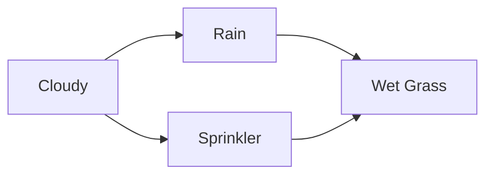
```mermaid
graph LR
    C[Cloudy] --> R[Rain]
    C[Cloudy] --> S[Sprinkler]
    R[Rain] --> W[Wet Grass]
    S[Sprinkler] --> W[Wet Grass]
```

CPT:

- $P(C=T) = 0.5$
- $P(S=T|C=T) = 0.1$, $P(S=T|C=F) = 0.5$
- $P(R=T|C=T) = 0.8$, $P(R=T|C=F) = 0.2$
- $P(W=T|R=T, S=T) = 0.99$, $P(W=T|R=T, S=F) = 0.9$, $P(W=T|R=F, S=T) = 0.9$, $P(W=T|R=F, S=F) = 0.0$

Goal: Compute $P(R=T|W=T)$, the probability that it is raining given that the grass is wet.

```python
import random

class BayesianNetwork:
    def __init__(self):
        # node: {parents_tuple: {value: probability}}
        self.cpt = {
            'C': {  # Cloudy (No parents)
                (): {True: 0.5, False: 0.5}
            },
            'S': {  # Sprinkler (Parent: C)
                (True,): {True: 0.1, False: 0.9},
                (False,): {True: 0.5, False: 0.5}
            },
            'R': {  # Rain (Parent: C)
                (True,): {True: 0.8, False: 0.2},
                (False,): {True: 0.2, False: 0.8}
            },
            'W': {  # WetGrass (Parents: S, R)
                (True, True): {True: 0.99, False: 0.01},
                (True, False): {True: 0.90, False: 0.10},
                (False, True): {True: 0.90, False: 0.10},
                (False, False): {True: 0.00, False: 1.00}
            }
        }
        # topological order of nodes for sampling
        self.order = ['C', 'S', 'R', 'W']

    def sample_value(self, prob_true):
        return random.random() < prob_true

    def likelihood_weighting(self, evidence, query, n_samples=10000):
        weights = {True: 0.0, False: 0.0}
        
        for _ in range(n_samples):
            sample = {}
            current_weight = 1.0
            
            for node in self.order:
                parents = self.get_parents(node)
                parent_values = tuple(sample[p] for p in parents)
                
                if node in evidence:
                    # if it's an evidence variable, we set it to the observed value and update the weight
                    val = evidence[node]
                    sample[node] = val
                    # update weight by the probability of observing this evidence given the parents
                    prob = self.cpt[node][parent_values][val]
                    current_weight *= prob
                else:
                    prob_true = self.cpt[node][parent_values][True]
                    val = self.sample_value(prob_true)
                    sample[node] = val
            
            r_val = sample[query]
            weights[r_val] += current_weight
            
        # normalize
        total_weight = sum(weights.values())
        if total_weight == 0:
            return {True: 0.0, False: 0.0}
            
        return {
            True: weights[True] / total_weight,
            False: weights[False] / total_weight
        }

    def get_parents(self, node):
        if node == 'C': return []
        if node == 'S' or node == 'R': return ['C']
        if node == 'W': return ['S', 'R']
        return []

if __name__ == "__main__":
    bn = BayesianNetwork()
    
    evidence = {'W': True}
    query = 'R'
    
    print(f"Query: P(Rain | WetGrass=True)")
    print(f"Evidence: {evidence}")
    
    result = bn.likelihood_weighting(evidence, query, n_samples=10000)
    
    print(f"\nP(Rain | WetGrass=True):")
    print(f"P(R=True)  ≈ {result[True]:.4f}")
    print(f"P(R=False) ≈ {result[False]:.4f}")
    
    # Expected output (approximate): 0.7079
```

## 08 Learning From Examples

Why learning?

- Learning is essential for unknown environments.
- Learning is useful as a system construction method.
- Learning modifies the agent's decision mechanisms to improve performance.

### Categories of Learning

- **Supervised learning**: The agent learns from labeled examples, where each example consists of an input and a corresponding output (label). The goal is to learn a function that maps inputs to outputs.
- **Unsupervised learning**: The agent learns from unlabeled data, where the goal is to find patterns or structure in the data without any specific output labels.
- **Reinforcement learning**: The agent learns by interacting with an environment and receiving feedback in the form of rewards or penalties. The goal is to learn a policy that maximizes cumulative rewards over time.

### Supervised Learning

Goal: Learn an unknown target function $f: X \to Y$.

Input: A training set $D = \{(x_1, y_1), (x_2, y_2), ..., (x_n, y_n)\}$ where $x_i \in X$ and $y_i = f(x_i)$.

Output: A hypothesis $h: X \to Y$ that approximates the target function $f$.

Two types of problems:

- **Classification**: The output $Y$ is a discrete set of classes (e.g. spam or not spam).
- **Regression**: The output $Y$ is a continuous value (e.g. predicting house prices).

Things to consider:

- Hypothesis space $H$: the model or function class from which we will select our hypothesis $h$ (e.g. linear functions, decision trees, neural networks).
- Degree of fit measure: a metric to evaluate how well a hypothesis $h$ fits the training data (e.g. accuracy, mean squared error).
- Trade-off between degree of fit and complexity
- Find a good $h$ among $H$
- Estimate if a good $h$ will generalize to unseen data (test set)

Supervised learning pipeline:

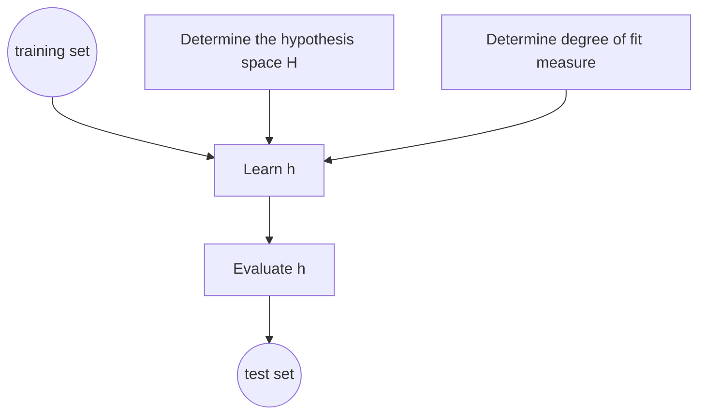
```mermaid
graph TD
    A((training set)) --> D[Learn h]
    B[Determine the hypothesis space H] --> D
    C[Determine degree of fit measure] --> D
    D --> E[Evaluate h]
    E --> H((test set))
```

#### Polynomial regression

- Hypothesis space: $H = \{w | h(x, w) = w_0 + w_1 x + w_2 x^2 + ... + w_M x^M\}$, where $M$ is the degree of the polynomial.
- Degree of fit: sum of squared errors: $E(w) = \sum_{i=1}^n (h(x_i, w) - y_i)^2$

**Underfitting**: When the model is too simple to capture the underlying structure of the data, resulting in poor performance on both the training and test sets.

**Overfitting**: When the model is too complex and captures noise in the training data, resulting in good performance on the training set but poor generalization to the test set.

**Regularization**: A technique to prevent overfitting by adding a penalty term to the loss function that discourages complex models.

- Ridge regression (adds L2 regularization): $E(w) = \sum_{i=1}^n (h(x_i, w) - y_i)^2 + \lambda \sum_{j=0}^M ||w_j||^2$
- Lasso regression (adds L1 regularization): $E(w) = \sum_{i=1}^n (h(x_i, w) - y_i)^2 + \lambda \sum_{j=0}^M |w_j|$

#### Decision tree learning

Let $\text{node}$ be the root of decision tree.

Main loop:

1. A ← the "best" decision attribute for the next $\text{node}$
2. Assign A as the decision attribute for $\text{node}$
3. For each possible value $v$ of A:
    - Create a new descendant of $\text{node}$ for the branch $A = v$
    - Sort training examples into leaf nodes
    - If training examples are perfectly classified, then stop
    - Else, recurse on the new leaf node

**Entropy**: A measure of impurity or disorder in a set of examples.

$$H(p) = \sum_{i=1}^k -p_i \log_2 p_i$$

where $p_i$ is the proportion of examples in class $i$.

**Mutual information** (information gain): The reduction in entropy after splitting the data on an attribute.

$$I(X; Y) = H(X) - H(X|Y) = H(Y) - H(Y|X)$$

where $H(X|Y) = \sum_{y \in Y} P(y) H(X|Y=y)$ is the conditional entropy of $X$ given $Y$.

Example:

| Area | Income | Child | Insurance |
|------|--------|-------|-----------|
| rural | high | no | yes |
| urban | high | yes | yes |
| urban | low | yes | yes |
| urban | low | yes | yes |
| rural | low | no | no |
| rural | low | no | no |
| rural | low | no | no |
| urban | low | no | no |

Let $Y$ denote the insurance status (yes or no).

- $H(Y) = -\frac{4}{8} \log_2 \frac{4}{8} - \frac{4}{8} \log_2 \frac{4}{8} = 1$
- $H(Y|\text{Area}) = \frac{4}{8} (-\frac{1}{4} \log_2 \frac{1}{4} - \frac{3}{4} \log_2 \frac{3}{4})) + \frac{4}{8} (-\frac{3}{4} \log_2 \frac{3}{4} - \frac{1}{4} \log_2 \frac{1}{4})) = 0.8113$
- $I(Y; \text{Area}) = H(Y) - H(Y|\text{Area}) = 1 - 0.8113 = 0.1887$
- $H(Y|\text{Income}) = \frac{2}{8} (-\frac{2}{2} \log_2 \frac{2}{2})) + \frac{6}{8} (-\frac{4}{6} \log_2 \frac{4}{6} - \frac{2}{6} \log_2 \frac{2}{6})) = 0.6887$
- $I(Y; \text{Income}) = H(Y) - H(Y|\text{Income}) = 1 - 0.6887 = 0.3113$
- $H(Y|\text{Child}) = \frac{3}{8} (-\frac{3}{3} \log_2 \frac{3}{3})) + \frac{5}{8} (-\frac{1}{5} \log_2 \frac{1}{5} - \frac{4}{5} \log_2 \frac{4}{5})) = 0.4512$
- $I(Y; \text{Child}) = H(Y) - H(Y|\text{Child}) = 1 - 0.4512 = 0.5488$
- So we choose Child as the root node.

Since $\text{Child=yes}$ is pure, we stop. For $\text{Child=no}$, we need to choose the next attribute:

- $H(Y) = -\frac{1}{5} \log_2 \frac{1}{5} - \frac{4}{5} \log_2 \frac{4}{5} = 0.7219$
- $H(Y|\text{Area}) = \frac{4}{5} (-\frac{1}{4} \log_2 \frac{1}{4} - \frac{3}{4} \log_2 \frac{3}{4})) + \frac{1}{5} (-\frac{1}{1} \log_2 \frac{1}{1})) = 0.6490$
- $I(Y; \text{Area}) = H(Y) - H(Y|\text{Area}) = 0.7219 - 0.6490 = 0.0729$
- $H(Y|\text{Income}) = \frac{1}{5} (-\frac{1}{1} \log_2 \frac{1}{1})) + \frac{4}{5} (-\frac{4}{4} \log_2 \frac{4}{4})) = 0$
- $I(Y; \text{Income}) = H(Y) - H(Y|\text{Income}) = 0.7219 - 0 = 0.7219$
- So we choose Income as the next node.

The final decision tree is:

```
mermaid
graph TD
    Child{Child} -->|yes| D1[Insurance: yes]
    Child -->|no| Income{Income}
    Income -->|high| D2[Insurance: yes]
    Income -->|low| D3[Insurance: no]
```

Evaluation:

- Precision = $\frac{TP}{TP + FP}$
- Recall = $\frac{TP}{TP + FN}$
- Accuracy = $\frac{TP + TN}{TP + TN + FP + FN}$

Avoid overfitting:

- Limit the height of the tree
- Avoid growing when data split is not statistically significant
- Acquire more training data
- Select the smallest possible tree by measuring the performance on a validation set (pruning)

Summary of decision tree learning:

- Pros: fast and simple to implement; can convert to rules
- Cons: univarite splits only; large decision trees are hard to interpret; requires all the data to be in memory

#### Logistic regression

A line (or hyperplane) dividing the feature space into two parts, one for each class. **A classification model**.

- Hypothesis space: $H = \{w | h(x, w) = w_0 + w_1 x_1 + \cdots + w_d x_d = w^T x\}$. Then using $\sigma(z) = \frac{1}{1 + e^{-z}}$ to convert the output to a probability between 0 and 1, we have $h(x, w) = \sigma(w^T x)$.
- Degree of fit: Cross entropy loss: $E(w) = -\sum_{i=1}^n (y_i \log h(x_i, w) + (1 - y_i) \log (1 - h(x_i, w)))$

Gradient descent update rule:

$x \leftarrow x - \alpha \nabla E(w)$

where $\alpha$ is the learning rate and $\nabla E(w)$ is the gradient of the loss function with respect to the weights $w$.

Gradient descent for logistic regression:

$$\begin{aligned}
\frac{\partial E(w)}{\partial w_i} &= \frac{\partial}{\partial w_i} \left(-\sum_{j=1}^n (y_j \log h(x_j, w) + (1 - y_j) \log (1 - h(x_j, w)))\right) \\
&= -\sum_{j=1}^n \left( \frac{y_j}{h(x_j, w)} \frac{\partial h(x_j, w)}{\partial w_i} - \frac{1 - y_j}{1 - h(x_j, w)} \frac{\partial h(x_j, w)}{\partial w_i} \right) \\
&= -\sum_{j=1}^n \left( \frac{y_j}{h(x_j, w)} - \frac{1 - y_j}{1 - h(x_j, w)} \right) \frac{\partial h(x_j, w)}{\partial w_i} \\
&= -\sum_{j=1}^n (y_j - h(x_j, w)) x_{ji} \\
&= \sum_{j=1}^n (\sigma(w^T x_j) - y_j) x_{ji}
\end{aligned}$$

where $x_{ji}$ is the $i$-th feature of the $j$-th training example.

Summary of logistic regression:

- Pros: Easily extended to multi-class by adding more output nodes; does not require all the data to be in memory; quick to train; good for many simple classification problems
- Cons: Perform poorly for complex classification problems such as face recognition

#### Support Vector Machine (SVM)

Linear SVM:

Similar to logistic regression, but instead of using a sigmoid function to convert the output to a probability, it uses a linear function to separate the classes. **A classification model**.

- Hypothesis space: $H = \{w | h(x, w) = w_0 + w_1 x_1 + \cdots + w_d x_d = w^T x\}$. The decision boundary is defined by $h(x, w) = 0$, which means $w^T x = 0$.
- Measure of fit: Minimize $\frac{1}{\text{margin}}$ subject to $y_i (w^T x_i) \geq 1$ for all $i$. The margin is defined as the distance between the decision boundary and the closest training examples, i.e. $\text{margin} = \frac{2}{||w||} = \frac{2}{\sqrt{w_1^2 + w_2^2 + \cdots + w_d^2}}$.
- Solved with the Lagrange multiplier method.

Non linear SVM:

- Hypothesis space: $H = \{w | h(x, w) = w_0 + w_1 \phi(x_1) + \cdots + w_d \phi(x_d) = w^T \phi(x)\}$, where $\phi(x)$ is a non-linear transformation of the input features.

Summary of SVM:

- Pros: Provides good generalization ability; Supports nonlinear transformation; Robust in high dimensions
- Cons: Not scalable to large datasets $T(n) \gtrsim O(n^2)$; Inflexibility in selecting the nonlinear function $\phi(x)$

### Unsupervised Learning

**Clustering**:

- Goal: Learn a mapping function $f$.
- Input: a training set $D = \{x_1, x_2, ..., x_n\}$ where unlabeled $x_i \in X$.
- Output: a mapping function $f: x_i \to g_k$ that assigns each input to a cluster $g_k$.

Things to consider:

- Which clustering algorithm to use
- Which features are useful for clustering
- Similarity function

K-means:

- Randomly choose $k$ examples as the means $m_1, m_2, ..., m_k$.
- Until convergence:
    1. Assign each data point to the cluster with the closest mean.
    2. Calculate the new means of each cluster.

Summary of k-means:

- Heavily depends on the initial choice of means
- The value of $k$ is often unknown and needs to be determined by trial and error

Online k-means:

- Randomly choose $k$ examples as the means $m_1, m_2, ..., m_k$.
- Set the counts $n_1, n_2, ..., n_k$ to 0.
- Until time limit:
    1. Acquire the next sample $x$.
    2. Find the closest mean $m_j$ to $x$.
    3. Update the mean $m_j$ and count $n_j$:
        - $n_j \leftarrow n_j + 1$
        - $m_j \leftarrow m_j + \frac{1}{n_j} (x - m_j)$

## 09 Artificial Neural Networks

Generations of machine learning models:

- 1G: Linear methods (PCA, LDA, LR)
- 2G: Neural networks (Cons: up to 4 layers due to vanishing gradient problem)
- 3G: Kernel methods: Each linear method has a non-linear counterpart by applying a non-linear transformation $\phi(x)$ to the input features (Cons: not scalable to large datasets)
- 3.5G: Deep learning: Neural networks with many layers

### Multilayer Perceptron (MLP)

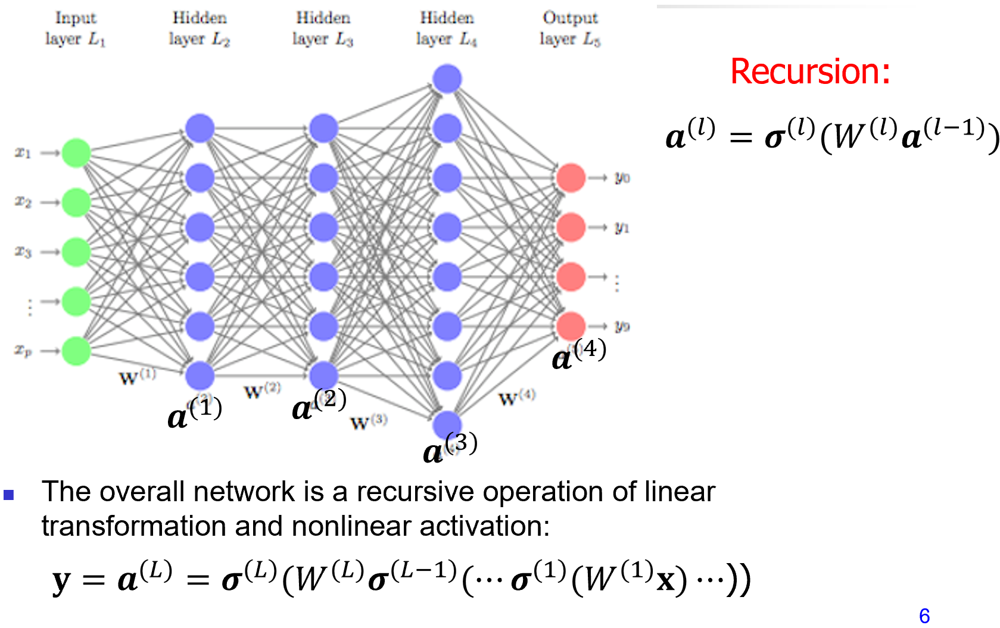

$a^l = \sigma^l(W^l a^{l-1})$, where $a^l$ is the activation of layer $l$, $W^l$ is the weight matrix of layer $l$, and $\sigma^l$ is the activation function of layer $l$.

Each layer consists of two steps: linear transformation $z^l = W^l a^{l-1}$ and non-linear activation $a^l = \sigma^l(z^l)$. The whole network can be represented as a recusive function:

$$y = a^L = \sigma^L(W^L \sigma^{L-1}(W^{L-1} \cdots \sigma^1(W^1 x) \cdots ))$$

- Loss function $C(y_d, y)$: a measure of how well the network's output $y$ matches the desired output $y_d$.
- Training: Adjust the weights $W^l_{j,k}$ to minimize the loss function $C$ using gradient descent.

Backpropagation:

- Computes the graident: $\frac{\partial C}{\partial W^l_{j,k}}$ for each weight in the network.
- Update the weights: $W^l_{j,k} \leftarrow W^l_{j,k} - \eta \frac{\partial C}{\partial W^l_{j,k}}$, where $\eta$ is the learning rate.
- Doing this one weight at a time is inefficient, so we use vectorized operations to compute the gradients for all weights in a layer at once.

Goal: minimize $C(y_d, \sigma^L(W^L \sigma^{L-1}(W^{L-1} \cdots \sigma^1(W^1 x) \cdots )))$ with respect to $W^l_{j,k}$.

Using the chain rule:

$$\frac{\partial C}{\partial W^l_{j,k}} = \frac{dC}{da^L} \cdot \frac{da^L}{dz^L} \cdot \frac{dz^L}{da^{L-1}} \cdots \frac{da^l}{dz^l} \cdot \frac{dz^l}{dW^l_{j,k}}$$

$$\nabla_{W^l} C = \nabla_{a^L} C (\sigma^L)' W^L \cdots (\sigma^{l+1})' W^{l+1} (\sigma^l)' a^{l-1}$$

Define the graident of the loss C with respect to $z^l$ as $\delta^l = \frac{\partial C}{\partial z^l}$, then we have:

$$\delta^l = \nabla_{z^l} C = \nabla_{a^L} C (\sigma^L)' W^L \cdots (\sigma^{l+1})' W^{l+1} (\sigma^l)'$$

Dividing the neighboring terms $\frac{\delta^{l-1}}{\delta^l}$, we can get the recursive relation:

$$\delta^{l-1} = W^l (\sigma^{l-1})' \delta^l$$

Finally, we can compute the gradient with respect to the weights:

$$\nabla_{W^l} C = \delta^l (a^{l-1})^T$$

Example: Assume loss function = cross entropy

Cross entropy: $H(P, Q) = - \sum_x P(x) \log Q(x)$, where $P$ is the true distribution and $Q$ is the predicted distribution.

Loss function: $C(y_d, y) = -\log p_\sigma(a) = -\log p_a$

Activation function at layer L = Softmax: $\sigma(z)_j = \frac{e^{z_j}}{\sum_k e^{z_k}}$

Activation function at layer l < L = logistic: $\sigma(z) = \frac{1}{1 + e^{-z}}$

To calculate gradient:

- Need to calculate $\nabla_{a^L} C$: $\frac{\partial C}{\partial p_a} = \frac{\partial}{\partial p_a} (-\log p_a) = -\frac{1}{p_a}$
- Need to calculate $(\sigma^L)'$: $\frac{\partial \sigma_a^L (z^L)}{\partial z_j^L} = \begin{cases}
(1-p_a) p_a & \text{if } j = a \\
-p_j p_a & \text{if } j \neq a
\end{cases}$
- Need to calculate $(\sigma^l)'$: $\sigma(z) = \frac{1}{1 + e^{-z}}$, so $\frac{d \sigma_j^l(z_j^l)}{d z_j^l} = \sigma_j^l(z_j^l) (1 - \sigma_j^l(z_j^l))$

**Vanishing gradient problem**: As we backpropagate through many layers, the gradients can become very small, so lower layers remain under-trained.

### MLP Math Rephrased

(1) Definition. Each layer is a combination of a linear transformation $z^l = W^l a^{l-1} + b^l$ and a non-linear activation $a^l = \sigma^l(z^l)$. The output of the network is $y = a^L$.

We are now concerned about how to compute the gradient of the loss function $C$ with respect to the weights $W^l$ of any layer $l$, $\frac{\partial C}{\partial W^l}$.

(2) Chain rule.

Using the chain rule, the derivative of $C$ w.r.t. $W^l$ can be expressed as the product of the derivatives of $C$ w.r.t. the activations and the derivatives of the activations w.r.t. the weights:

$$\frac{\partial C}{\partial W^l} = \frac{\partial C}{\partial z^l} \cdot \frac{\partial z^l}{\partial W^l}$$

(3) Error term $\delta^l$.

Define $\delta^l = \frac{\partial C}{\partial z^l}$, which is the gradient of the loss w.r.t. the pre-activation $z^l$ of layer $l$. 

Since $z^l = W^l a^{l-1}$, i.e. $z^l_j = \sum_k W^l_{jk} a^{l-1}_k$, or in matrix form:

$$\begin{vmatrix}
z_1^l \\
z_2^l \\
\vdots \\
z_m^l
\end{vmatrix} = \begin{vmatrix}W_{11}^l & W_{12}^l & \cdots & W_{1n}^l \\
W_{21}^l & W_{22}^l & \cdots & W_{2n}^l \\
\vdots & \vdots & \ddots & \vdots \\
W_{m1}^l & W_{m2}^l & \cdots & W_{mn}^l
\end{vmatrix} \begin{vmatrix}a_1^{l-1} \\
a_2^{l-1} \\
\vdots \\
a_n^{l-1}
\end{vmatrix}$$

Taking the derivative of $z^l$ w.r.t. $W^l_{jk}$, we have:

$$\begin{aligned}
\frac{\partial z^l}{\partial W^l_{jk}} &= \frac{\partial}{\partial W^l_{jk}} (W^l a^{l-1}) \\
&= \frac{\partial}{\partial W^l_{jk}} \left( \begin{vmatrix}W_{11}^l & W_{12}^l & \cdots & W_{1n}^l \\
W_{21}^l & W_{22}^l & \cdots & W_{2n}^l \\
\vdots & \vdots & \ddots & \vdots \\
W_{m1}^l & W_{m2}^l & \cdots & W_{mn}^l
\end{vmatrix} \begin{vmatrix}a_1^{l-1} \\
a_2^{l-1} \\
\vdots \\
a_n^{l-1}
\end{vmatrix} \right) \\
&= \frac{\partial}{\partial W^l_{jk}} \left( \begin{vmatrix}W_{11}^l a_1^{l-1} + W_{12}^l a_2^{l-1} + \cdots + \cdots + W_{1n}^l a_n^{l-1} \\
W_{21}^l a_1^{l-1} + W_{22}^l a_2^{l-1} + \cdots + \cdots + W_{2n}^l a_n^{l-1} \\
\vdots \\
W_{j1}^l a_1^{l-1} + \cdots + {\color{red}W_{jk}^l a_k^{l-1}} + \cdots + W_{jn}^l a_n^{l-1} \\
\vdots \\
W_{m1}^l a_1^{l-1} + W_{m2}^l a_2^{l-1} + \cdots + \cdots + W_{mn}^l a_n^{l-1}
\end{vmatrix} \right) \\
&= \begin{vmatrix}0 \\
0 \\
\vdots \\
a^{l-1}_k \\
\vdots \\
0
\end{vmatrix}
\end{aligned}$$

Plug $\frac{\partial z^l}{\partial W^l_{jk}} = a^{l-1}_k$ into the chain rule, we have:

$$\frac{\partial C}{\partial W^l_{jk}} = \delta^l_j a^{l-1}_k$$

Also written as:

$$\nabla_{W^l} C = \delta^l (a^{l-1})^T$$

(4) Recursive relation. Using the chain rule again, we can propagate layer $l$ to layer $l+1$:

$$\delta^l = \frac{\partial C}{\partial z^l} = \frac{\partial C}{\partial z^{l+1}} \cdot \frac{\partial z^{l+1}}{\partial a^l} \cdot \frac{\partial a^l}{\partial z^l}$$

where

- $\frac{\partial C}{\partial z^{l+1}} = \delta^{l+1}$ is the error term of the next layer
- $\frac{\partial z^{l+1}}{\partial a^l}$ : similar to what we calculated above, the derivative w.r.t. input is the weight matrix of the next layer: $W^{l+1}$
- $\frac{\partial a^l}{\partial z^l}$ : since $a^l = \sigma^l(z^l)$, by chain rule we have $(a^l)' = (\sigma^l)'(z^l) \cdot (z^l)'$. $(\sigma^l)'(z^l)$ is a diagonal matrix:

$$\begin{vmatrix}\frac{\partial a_1^l}{\partial z_1^l} & \frac{\partial a_1^l}{\partial z_2^l} & \cdots & \frac{\partial a_1^l}{\partial z_n^l} \\
\frac{\partial a_2^l}{\partial z_1^l} & \frac{\partial a_2^l}{\partial z_2^l} & \cdots & \frac{\partial a_2^l}{\partial z_n^l} \\
\vdots & \vdots & \ddots & \vdots \\
\frac{\partial a_m^l}{\partial z_1^l} & \frac{\partial a_m^l}{\partial z_2^l} & \cdots & \frac{\partial a_m^l}{\partial z_n^l}
\end{vmatrix} = \begin{vmatrix}(\sigma_1^l)'(z_1^l) & 0 & \cdots & 0 \\
0 & (\sigma_2^l)'(z_2^l) & \cdots & 0 \\
\vdots & \vdots & \ddots & \vdots \\
0 & 0 & \cdots & (\sigma_m^l)'(z_m^l)
\end{vmatrix}$$

Plug in the above terms, we have:

$$\delta^l = (W^{l+1})^T \delta^{l+1} \odot (\sigma^l)'(z^l)$$

(dimensions: $W^{l+1}$ is $m \times n$, $\delta^{l+1}$ is $m \times 1$, so $(W^{l+1})^T \delta^{l+1}$ is $n \times 1$; $(\sigma^l)'(z^l)$ is the same as $z^l$, which is $n \times 1$; so $\delta^l$ is $n \times 1$)

where $\odot$ is the Hadamard product, which is an element-wise product of two vectors:

$$\begin{vmatrix}x_1 \\
x_2 \\
\vdots \\
x_n
\end{vmatrix} \odot \begin{vmatrix}y_1 \\
y_2 \\
\vdots \\
y_n
\end{vmatrix} = \begin{vmatrix}x_1 y_1 \\
x_2 y_2 \\
\vdots \\
x_n y_n
\end{vmatrix}$$

(5) Backward pass.

For the output layer $L$, we can directly compute $\delta^L$ using the loss function and the activation function of the output layer.

Error term of layer $L$:

$$\delta^L = \nabla_{a^L} C \odot (\sigma^L)'(z^L)$$

Then we can propagate the error backward. for $l = L-1, L-2, ..., 1$:

$$\delta^l = (W^{l+1})^T \delta^{l+1} \odot (\sigma^l)'(z^l)$$

Finally, we can compute the gradient w.r.t. the weights:

$$\frac{\partial C}{\partial W^l} = \delta^l (a^{l-1})^T$$

$$\frac{\partial C}{\partial b^l} = \delta^l$$

Update the weights:

$$W^l \leftarrow W^l - \eta \frac{\partial C}{\partial W^l}$$

(6) When loss = cross entropy and activation function at layer L = softmax, the error term $\delta^L$ can be simplified.

Background: the true label $y_d$ is one-hot encoded, i.e. if $i$-th class is true, then $y_i = 1$ and $y_j = 0$ for $j \neq i$.

The predicted output $a^L$ is a vector of probabilities for each class, where $a^L_j = \sigma(z^L)_j = \frac{e^{z^L_j}}{\sum_k e^{z^L_k}}$.

Likelihood function $L = P(y_d | a^L) = \prod_i (a^L_j)^{y_{d,i}}$ (where only the true class contributes to the product, since other classes have $y_{d,j} = 0$ so $(a^L_j)^{y_{d,j}} = 1$)

Loss function: we want the model to maximize the likelihood, so we minimize the negative log-likelihood:

$$C = -\log L = -\log \prod_i (a^L_j)^{y_{d,i}} = -\sum_i y_{d,i} \log a^L_j$$

Now we want to compute $\delta^L = \frac{\partial C}{\partial a^L} \frac{\partial a^L}{\partial z^L}$.

We only consider the correct class $t$ so $C = -\log a_t$.

(6.1) Compute $\frac{\partial C}{\partial a_j}$:

According to $C = -\log a_t$,

- If $j=t$, then $\frac{\partial C}{\partial a_j} = -\frac{1}{a_t}$
- If $j \neq t$, then $\frac{\partial C}{\partial a_j} = 0$

In vector form:

$$\nabla_{a^L} C = \begin{bmatrix} 0 \\ 0 \\ \vdots \\ -\frac{1}{a_t} \\ \vdots \\ 0 \end{bmatrix}$$

(6.2) Compute $\frac{\partial a^L}{\partial z^L}$ (the Jacobian matrix of the softmax function):

$$\frac{\partial a_j}{\partial z_k} = \begin{cases}
a_j (1 - a_j) & \text{if } j = k \\
-a_j a_k & \text{if } j \neq k
\end{cases}$$

In matrix form:

$$\frac{\partial a^L}{\partial z^L} = \begin{bmatrix}
a_1 (1 - a_1) & -a_1 a_2 & \cdots & -a_1 a_n \\
-a_2 a_1 & a_2 (1 - a_2) & \cdots & -a_2 a_n \\
\vdots & \vdots & \ddots & \vdots \\
-a_n a_1 & -a_n a_2 & \cdots & a_n (1 - a_n)
\end{bmatrix}$$

(6.3) Compute $\delta^L$:

$$\delta^L_k = \frac{\partial C}{\partial z_k} = \sum_j \frac{\partial C}{\partial a_j} \cdot \frac{\partial a_j}{\partial z_k}$$

Since only terms with $j=t$ contribute, we have:

$$\delta^L_k = -\frac{1}{a_t} \cdot \frac{\partial a_t}{\partial z_k} = -\frac{1}{a_t} \cdot \begin{cases}
a_t - a_t^2 & \text{if } k = t \\
-a_t a_k & \text{if } k \neq t
\end{cases}= \begin{cases}
(a_t - 1) & \text{if } k = t \\
(a_k - 0) & \text{if } k \neq t
\end{cases}$$

Since $y_t=1$ and $y_k=0$ for $k \neq t$, we can write $\delta^L$ in a unified form:

$$\delta^L = a^L - y_d$$

i.e. the layer L error term is the predicted probability $[p_1, p_2, \cdots, p_n]$ minus the true label $[0, 0, \cdots, 1, \cdots, 0]$.

### Deep Learning

Early attempts to train deep neural networks: **Unsupervised pre-training** followed by traditional supervised backpropagation.

Why it works:

- Pre-training creates a data-dependent prior, so better regularization.
- Also initializes the weights that is better to start with.
- Lowe layers are better optimized, reducing the vanishing gradient problem.

**Deep Belief Network** (DBN):

- Each layer is initialized with a Restricted Boltzmann Machine (RBM)
- Characterized by conditional distributions and joint distribution
- Training is done layer-by-layer greedily, starting from the bottom layer (closest to the input)
- After pre-training, fed to a conventional NN

**Autoencoder** (AE):

- Encoder-decoder architecture: the encoder maps the input to a lower-dimensional representation, and the decoder maps it back to the original input space.
- Can be stacked to form DBNs, training is layer-by-layer
- The final step may be supervised or unsupervised

Dimensionality reduction with autoencoders:

- Pretraining: train each dimensonality reduction RBM layer by layer (784-2000, then 2000-1000, then 1000-500, then 500-30)
- Unrolling: stack the RBMs to form the encoder part, then transpose the weights to form the decoder part. This forms a 784-2000-1000-500-30-500-1000-2000-784 autoencoder.
- Fine-tuning: use backpropagation to fine-tune the weights of each layer, using the original input as the target output.

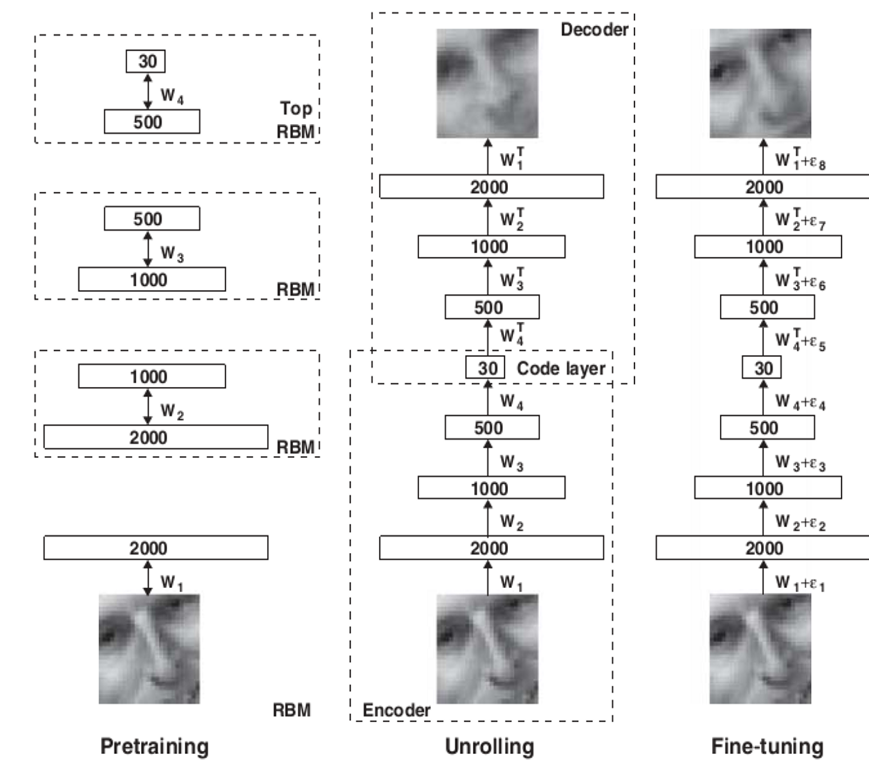

### Regularization techniques

"Regularization" means modification to the learning algorithm that is intended to reduce the generalization error but not the training error.

**Dropout**: During training, randomly set a fraction of the input units to 0 at each update. This prevents overfitting by making the network less sensitive to the specific weights of individual neurons.

Insights from dropout: sparse networks are more robust and generalize better; statistical averaging ~ mixed strategy > pure strategy.

**Batch normalization**: Normalize the activations of each layer to have $\mu = 0$ and $\sigma^2 = 1$ for each mini-batch. This helps to stabilize the learning process and allows for higher learning rates, which can lead to faster convergence.

Given values of a mini-batch $B = \{x_1, x_2, ..., x_m\}$, we need to learn parameters $\gamma$ and $\beta$ to transform the normalized values:

- $\mu_B = \frac{1}{m} \sum_{i=1}^m x_i$
- $\sigma_B^2 = \frac{1}{m} \sum_{i=1}^m (x_i - \mu_B)^2$
- $\hat{x}_i = \frac{x_i - \mu_B}{\sqrt{\sigma_B^2 + \epsilon}}$
- $y_i = \gamma \hat{x}_i + \beta$

where $\epsilon$ is a small constant added to avoid division by zero.

Pseudocode:

```python
def bn_transformation(x, gamma, beta, epsilon=1e-5):
    mu = np.mean(x)
    sigma2 = np.var(x)
    x_hat = (x - mu) / np.sqrt(sigma2 + epsilon)
    y = gamma * x_hat + beta
    return y

def bn_network(N, K):
    """
    Args:
        Already trained network N with parameters {W^l, b^l}
        subset of activations {x^k} for k=1...K
    Returns:
        Batch-normalized network N_BN
    """
    N_BN = copy.deepcopy(N)
    for k in range(1, K+1):
        # Initialize gamma and beta
        gamma = np.ones_like(x_k)
        beta = np.zeros_like(x_k)
        
        # Apply batch normalization transformation
        y_k = bn_transformation(x_k, gamma, beta)
        
        # Modify input of layer k in N_BN to be y_k instead of x_k
        N_BN.layers[k].input = y_k
    
    # train N_BN with backpropagation to learn gamma and beta (together with {W^l, b^l})
    train(N_BN)
    for k in range(1, K+1):
        # take multiple mini-batches, each of size m, and average over them
        E_x = 0
        Var_x = 0
        for batch in mini_batches:
            E_x += np.mean(batch)
            Var_x += np.var(batch)
        E_x /= len(mini_batches) # E(x) = E(mu_B)
        Var_x /= len(mini_batches) # Var(x) = m/(m-1) * E(sigma_B^2)
        # update the parameters of N_BN to be used during testing
        # y = gamma / sqrt(Var_x + epsilon) * (x - E_x) + beta
        # or y = gamma / sqrt(Var_x + epsilon) * x + (beta - gamma * E_x / sqrt(Var_x + epsilon))
        N_BN.layers[k].gamma = gamma / np.sqrt(Var_x + epsilon)
        N_BN.layers[k].beta = beta - gamma * E_x / np.sqrt(Var_x + epsilon)
    return N_BN
```

Torch implementation:

```python
class SimpleBatchNorm(nn.Module):
    def __init__(self, num_features, eps=1e-5, momentum=0.1):
        super(SimpleBatchNorm, self).__init__()
        self.gamma = nn.Parameter(torch.ones(num_features))
        self.beta = nn.Parameter(torch.zeros(num_features))
        self.eps = eps
        self.momentum = momentum

        self.register_buffer('running_mean', torch.zeros(num_features))
        self.register_buffer('running_var', torch.ones(num_features))
    
    def forward(self, x):
        if self.training:
            batch_mean = x.mean(dim=0)
            batch_var = x.var(dim=0, unbiased=False)

            self.running_mean = (1 - self.momentum) * self.running_mean + self.momentum * batch_mean
            self.running_var = (1 - self.momentum) * self.running_var + self.momentum * batch_var

            mean = batch_mean
            var = batch_var
        else:
            mean = self.running_mean
            var = self.running_var
        
        x_hat = (x - mean) / torch.sqrt(var + self.eps) # normalize
        out = self.gamma * x_hat + self.beta # scale and shift
        return out
```

Keras API:

```python
model = Sequential([
    layers.Conv2D(64, (3, 3), activation='relu', input_shape=(32, 32, 3)), # 32x32x3 -> 30x30x64
    layers.BatchNormalization(),
    layers.Activation('relu'),
    layers.MaxPooling2D((2, 2)), # 30x30x64 -> 15x15x64
    layers.Flatten(),
    layers.Dense(128, activation='relu'), # 15x15x64 -> 128
    layers.BatchNormalization(),
])
```

Comparing Normalization and Batch Normalization:

| Feature | Normalization | Batch Normalization |
| --- | --- | --- |
| When | Before training | During training |
| What | Scale and shift the input data | Scale and shift the activations of each layer |
| Parameters | None | Learnable parameters $\gamma$ and $\beta$ |
| Benefits | Helps with convergence and generalization | Stabilizes learning, allows for higher learning rates, reduces internal covariate shift |
| Formula | $x' = \frac{x - \mu}{\sigma}$ | $y = \gamma \frac{x - \mu_B}{\sqrt{\sigma_B^2 + \epsilon}} + \beta$ |

### Convolutional Neural Networks (CNN)

- Convolutional layer: applies a set of learnable filters to the input image, producing a feature map that captures local patterns in the image.
- Pooling layer: reduces the spatial dimensions (downsampling) of the feature map (by taking the maximum or average value in a local neighborhood).
- CNN consists of stacked convolutional and pooling layers, followed by fully connected layers for classification.
- Very effective for image recognition tasks due to its ability to capture spatial hierarchies of features.

### Recurrent Neural Networks (RNN) and Long Short-Term Memory (LSTM)

**RNN** is for time-series data, where the output at time $t$ depends on the input at time $t$ and the hidden state from time $t-1$.

It can process stochastic sequences with short or long-term dependencies, but suffers from the vanishing gradient problem both temporally (cannot handle long range dependencies) and spatially (lower layers are under-trained).

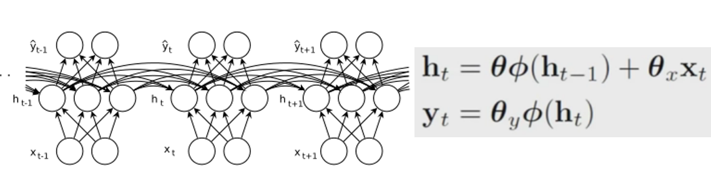

- $h_t = \theta \phi(h_{t-1}) + \theta_x x_t$
- $y_t = \theta_y \phi(h_t)$

where 

- $h_t$ is the hidden state at time $t$
- $x_t$ is the input at time $t$
- $y_t$ is the output at time $t$
- $\theta$, $\theta_x$, and $\theta_y$ are the weight matrices for the hidden state, input, and output respectively
- $\phi$ is the activation function (e.g. tanh or ReLU)

**LSTM** is a type of RNN that is designed to address the vanishing gradient problem.

- Error signals trapped within a memory cell cannot change.
- Gates have to learn which error to trap and which to let through (forget).

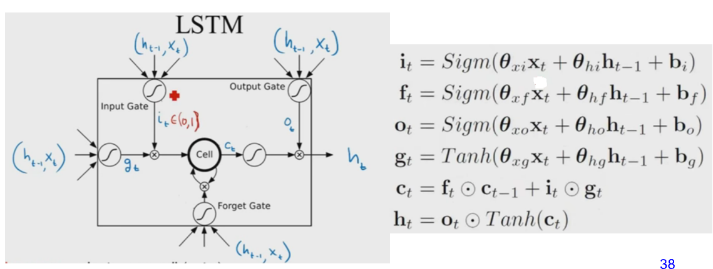

- $i_t = \text{sigmoid}(\theta_{xi} x_t + \theta_{hi} h_{t-1} + b_i)$ (input gate)
- $f_t = \text{sigmoid}(\theta_{xf} x_t + \theta_{hf} h_{t-1} + b_f)$ (forget gate)
- $o_t = \text{sigmoid}(\theta_{xo} x_t + \theta_{ho} h_{t-1} + b_o)$ (output gate)
- $g_t = \tanh(\theta_{xg} x_t + \theta_{hg} h_{t-1} + b_g)$ (candidate memory cell)
- $c_t = f_t \odot c_{t-1} + i_t \odot g_t$ (memory cell update)
- $h_t = o_t \odot \tanh(c_t)$ (hidden state update)

In human language, the LSTM works as follows:

- If input $i_t = 1$, write $g_t$ to the memory cell.
- If forget $f_t = 1$, erase the memory cell.
- If output $o_t = 1$, read from the memory cell and output it.
- When to write, forget, or read is determined by the gates, which are learned during training.

**Seq2seq**: An encoder-decoder architecture that stacks 2 RNNs (usually LSTMs) together. The encoder processes the input sequence and produces a context vector (the final hidden state), which is then used by the decoder to generate the output sequence. This is commonly used for tasks like machine translation.

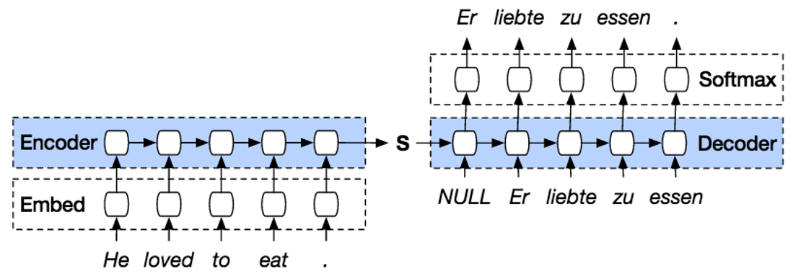

Applications of seq2seq: translation, image captioning, conversational models, text summarization, etc.

**End-to-end (E2E) training**: Train the entire model (encoder and decoder) together using backpropagation, rather than training them separately. This makes all modules differentiable (i.e. the loss can be backpropagated through the entire network).

Traditional approach of speech recognition:

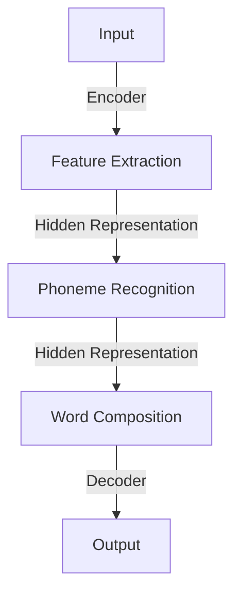
```mermaid
graph TD
    A[Input] --> |Encoder| B[Feature Extraction]
    B --> |Hidden Representation| C[Phoneme Recognition]
    C --> |Hidden Representation| D[Word Composition]
    D --> |Decoder| E[Output]
```

E2E approach:

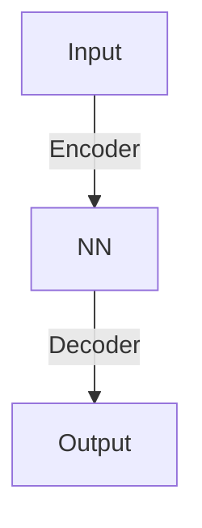
```mermaid
graph TD
    A[Input] --> |Encoder| B[NN]
    B --> |Decoder| C[Output]
```

### Attention

**Transformer**: A type of neural network architecture that relies entirely on attention mechanisms to process sequential data, without using recurrent or convolutional layers. It consists of an encoder and a decoder, both of which are composed of multiple layers of self-attention and feedforward neural networks.

**Attention**: Giving different weights to different parts of the input when generating each part of the output.

Transformer also includes an encoder-decoder architecture. Encoders are stacked together to process the input iteratively, and decoders are stacked together to process the encoder's output iteratively. Each encoder/decoder layer makes use of an attention mechanism. 

For each input, attention weighs the relevance of every other input and draws from them to produce the output. Each decoder layer has an additional attention mechanism that draws information from the outputs of previous decoders, before the decoder layer draws information from the encodings.

For each attention unit (i.e. each encoder/decoder layer), the transformer model learns three weight matrices: query weights $W^Q$, key weights $W^K$, and value weights $W^V$. For each token $i$, the input word embedding $x_i$ is multiplied with each of the three weight matrices to produce a query (row) vector $q_i = x_i W^Q$, a key vector $k_i = x_i W^K$, and a value vector $v_i = x_i W^V$.

The attention weight $a_{ij}$ from token $i$ to token $j$ is determined by the dot product between $q_i$ and $k_j$. The complete formula for the attention weight is:

$$a_{ij} = \text{softmax}\left( \frac{q_i \cdot k_j}{\sqrt{d_k}} \right)$$

Or often written in matrix form:

$$\text{Attention}(Q, K, V) = \text{softmax}\left( \frac{Q K^T}{\sqrt{d_k}} \right) V$$

where $Q$, $K$, and $V$ are the matrices whose rows are the query, key, and value vectors for all tokens, and $d_k$ is the dimension of the key vectors (used for scaling).

**Multi-head attention**: Instead of having a single set of $W^Q$, $W^K$, and $W^V$ matrices, the transformer uses multiple sets (heads) to allow the model to attend to information from different representation subspaces at different positions. Each head computes its own attention output, and the outputs from all heads are concatenated and linearly transformed to produce the final output of the attention layer.

Mathematically,

1. Linear projections for each of the $h$ heads:
    - Head $i$ has its own $W_i^Q$, $W_i^K$, and $W_i^V$ matrices
2. Parallel attention computations for each head:
    - $head_i = \text{Attention}(Q W_i^Q, K W_i^K, V W_i^V)$
3. Concatenation of all heads:
    - $MultiHead(Q, K, V) = \text{Concat}(head_1, head_2, ..., head_h) W^O$
    - Dimension: $\text{Concat}(head_1, head_2, ..., head_h)$ has dimension $h \cdot d_v$, and $W^O$ has dimension $(h \cdot d_v) \times d_{model}$,
    - where $W^O$ is a learnable weight matrix that projects the concatenated output back to the desired dimension.

Encoder-decoder architecture of the transformer:

- Each encoder consists of (1) self-attention and (2) feedforward neural network.
- Each decoder consists of (1) self-attention, (2) encoder-decoder attention, and (3) feedforward neural network.

The **encoder-decoder attention** allows the decoder to attend to the outputs of the encoder, which is crucial for tasks like machine translation where the output depends on the input sequence, e.g., when translating "I am a student" to "Je suis un étudiant", the decoder needs to attend to the encoder's output corresponding to "I", "am", "a", and "student" to generate the correct translation.

Mathematically, the encoder-decoder attention for decoder layer $l$ can be expressed as:

$$\text{Attention}(Q^l, K^{enc}, V^{enc}) = \text{softmax}\left( \frac{Q^l (K^{enc})^T}{\sqrt{d_k}} \right) V^{enc}$$

where $Q^l$ is the query matrix from the decoder layer $l$, and $K^{enc}$ and $V^{enc}$ are the key and value matrices from the encoder's output. This allows the decoder to focus on relevant parts of the input sequence when generating each token in the output sequence.

## 10 Reinforcement Learning

### Characteristics of Reinforcement Learning

- No supervisor, only a reward signal: no labeled input/output pairs, only a evaluation function that gives a reward based on the actions taken by the agent.
- Feedback is delayed, not instantaneous: the reward for an action may not be received immediately, but rather after a sequence of actions.
- Time matters: data are sequential, non i.i.d., and the order of actions affects the outcome.
- Agent's actions affect the subsequent data it receives.

### Concepts

**Reward**:

- A scalar feedback signal $R_t$ indicating how well the agent is doing at time $t$.
- The agent's goal is to maximize the **cumulative reward** over time.
- **Reward Hypothesis**: All goals can be described by the maximization of expected cumulative reward.

**Sequential decision making**:

- Select actions to maximise total future reward.

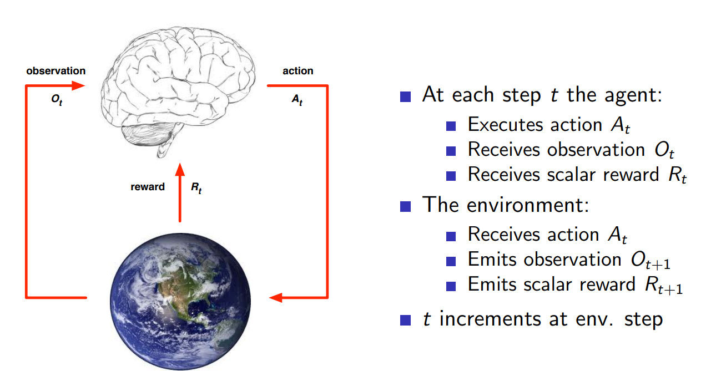

**History**:

- The sequence of observations, actions, and rewards up to time $t$.
- $H_t = O_1, R_1, A_1, O_2, R_2, A_2, ..., A_{t-1}, O_t, R_t$

**State**: 

- The information used to determine what happens next. i.e. A summary of history that are useful for predicting the future, written as a function of the history: $S_t = f(H_t)$.
- **Environment state** $S_t^e$: the true state of the environment, which may not be fully observable to the agent.
- **Agent state** $S_t^a$: the agent's internal representation of the state, a function of the history: $S_t^a = f(H_t)$.

**Information state/Markov state**:

A state is Markov iff the future is independent of the past given the present, i.e.

$$P[S_{t+1} | S_t] = P[S_{t+1} | S_1, S_2, ..., S_t]$$

- The environment state $S_t^e$ is Markov by definition.
- The history $H_t$ is also Markov.

**Full observability**: when the agent directly observes the environment state, i.e. $O_t = S_t^a = S_t^e$. This is a **Markov Decision Process (MDP)**.

**Partial observability**: when the agent indirectly observes the environment state. This is a **Partially Observable Markov Decision Process (POMDP)**.

Agent must construct its own state representation $S_t^a$, e.g.

- Complete history as state: $S_t^a = H_t$
- Beliefs of environment state: $S_t^a = (P[S_t^e = s_1], P[S_t^e = s_2], ..., P[S_t^e = s_n])$
- Recurrent neural network to summarize history: $S_t^a = \sigma(S_{t-1}^a W_s + O_t W_o)$

### Agent

An agent include one or more of these components:

- **Policy**: A policy $\pi$ is a mapping from states to actions, which can be deterministic ($a = \pi(s)$) or stochastic ($\pi(a|s) = P[A_t = a | S_t = s]$).
- **Value function**: A value function $V^\pi(s)$ estimates the expected cumulative reward starting from state $s$ and following policy $\pi$ thereafter. $v_\pi(s) = E_\pi[R_{t+1} + \gamma R_{t+2} + \gamma^2 R_{t+3} + ... | S_t = s]$, where $0 \leq \gamma < 1$ is the discount factor that determines the importance of future rewards.
- **Model**: A model predicts what the environment will do next, i.e. the next state and **immediate reward** given the current state and action: $P[S_{t+1} = s' | S_t = s, A_t = a]$ and $R(s, a) = E[R_{t+1} | S_t = s, A_t = a]$.

Example: in a 2D maze,

- Rewards: -1 for each step.
- Actions: N, E, S, W.
- States: the agent's location.
- Policy: a mapping from location to action (the next step to take).
- Value function: the expected cumulative reward (negative of the distance to the goal) from each location.
- Model: the transition model $P^a_{ss'}$ that gives the probability of moving from state $s$ to state $s'$ when taking action $a$. Note the immediate reward $R(s, a)$ is -1 for all states and actions in this example.

Categorizing agents:

- Value based (no policy), policy based (no value function), or actor-critic (both policy and value function).
- Model free (policy and/or value function, but no model), or model based (policy and/or value function, and a model).

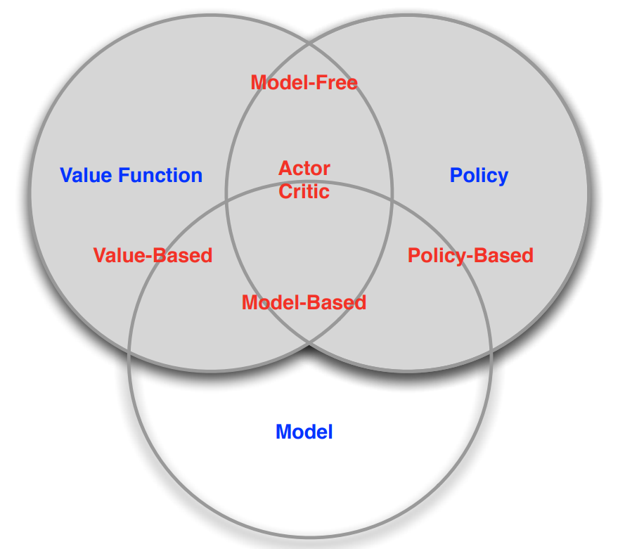

Two fundamental problems in sequential decision making:

- Reinforcement learning:
    - the environment is initially unknown
    - the agent interacts with the environment and improves its policy
- Planning:
    - the environment model is known
    - the agent uses the model to find an optimal policy without interacting with the environment

Exploration vs. exploitation:

- **Exploration**: trying new actions to discover their effects and potentially find better policies.
- **Exploitation**: using the current knowledge to maximize reward based on the existing policy.

Prediction vs. control:

- **Prediction**: evaluate the future (given a policy, calculate the value function).
- **Control**: optimise the future (find the best policy that maximizes the value function).

## 11 Markov Decision Process

### Markov Process

**Markov Decision Process (MDP)** describes an environment for reinforcement learning, where the environment is fully observable, i.e. the current state $S_t$ completely characterizes the process.

**Markov Property**: the future is independent of the past given the present, i.e. $P[S_{t+1} | S_t] = P[S_{t+1} | S_1, S_2, ..., S_t]$.

**State Transition Probability**: $P_{ss'} = P[S_{t+1} = s' | S_t = s]$.

**Markov Process/Markov Chain**: A memoryless random process with the Markov property. A tuple $(S, P)$ where $S$ is a finite set of states and $P$ is the state transition probability matrix.

### Markov Reward Process

A **Markov Reward Process** (MRP) is a Markov Process with rewards. It is a tuple $(S, P, R, \gamma)$ where

- $R$ is the reward function, which gives the expected reward for each state: $R_s = E[R_{t+1} | S_t = s]$.
- $\gamma \in [0, 1]$ is the discount factor, the decay rate of future rewards.

The return $G_t = R_{t+1} + \gamma R_{t+2} + \gamma^2 R_{t+3} + ... = \sum_{k=0}^\infty \gamma^k R_{t+k+1}$ is the total discounted reward from time $t$ onward.

Why discount future rewards?

- Avoid infinite returns in cyclic MRPs.
- Mathematically convenient for convergence of value functions.
- Reflects the idea that immediate rewards are more valuable than delayed rewards.

If all sequences terminate, it is possible to use an undiscounted MRP with $\gamma = 1$.

If $\gamma = 0$, the agent is myopic and only cares about immediate rewards.

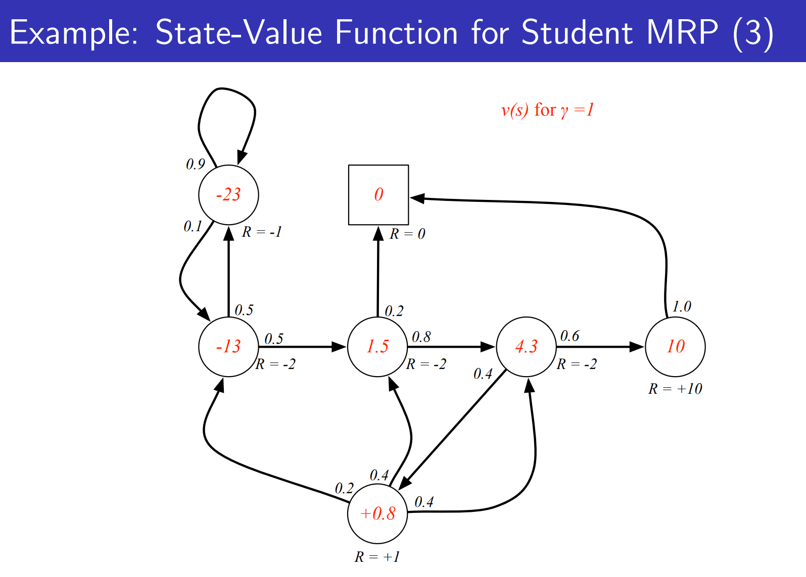

**Value function**: $v(s) = E[G_t | S_t = s]$ is the expected (long-term) return starting from state $s$.

**Bellman Equation**:

$$\begin{aligned}
v(s) &= E[G_t | S_t = s] \\
&= E[R_{t+1} + \gamma R_{t+2} + \gamma^2 R_{t+3} + ... | S_t = s] \\   
&= E[R_{t+1} + \gamma (R_{t+2} + \gamma R_{t+3} + ...) | S_t = s] \\
&= E[R_{t+1} + \gamma G_{t+1} | S_t = s] \\
&= E[R_{t+1} | S_t = s] + \gamma E[v(S_{t+1}) | S_t = s] \\
&= R_s + \gamma \sum_{s'} P_{ss'} v(s')
\end{aligned}$$

Bellman Equation can be written in matrix form:

$$v = R + \gamma P v$$

$$\begin{bmatrix} v_1 \\ v_2 \\ \vdots \\ v_n \end{bmatrix} = \begin{bmatrix} R_1 \\ R_2 \\ \vdots \\ R_n \end{bmatrix} + \gamma \begin{bmatrix} P_{11} & P_{12} & \cdots & P_{1n} \\ P_{21} & P_{22} & \cdots & P_{2n} \\ \vdots & \vdots & \ddots & \vdots \\ P_{n1} & P_{n2} & \cdots & P_{nn} \end{bmatrix} \begin{bmatrix} v_1 \\ v_2 \\ \vdots \\ v_n \end{bmatrix}$$

Solving for $v$:

$$v = (I - \gamma P)^{-1} R$$

where $I$ is the identity matrix.

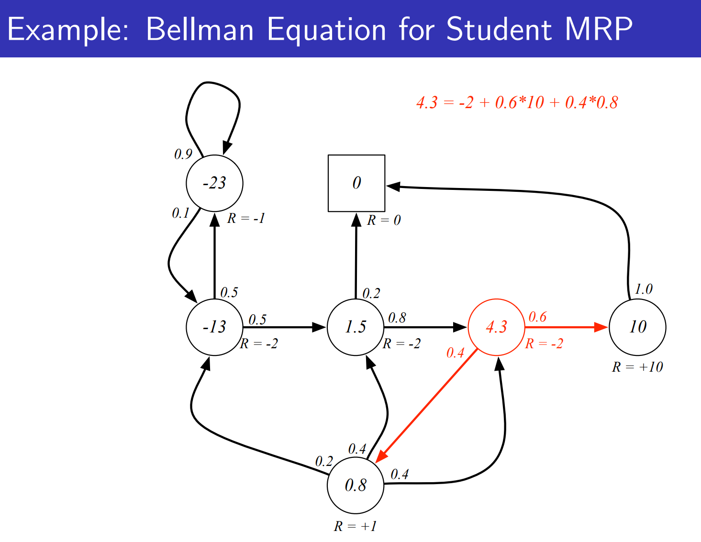

### Markov Decision Process

A **Markov Decision Process (MDP)** is a Markov Reward Process with decisions. It is a tuple $(S, A, P, R, \gamma)$ where

- $\color{red}{A}$ is a finite set of actions.
- $P$ is the state transition probability matrix, which now depends on the action taken: $P^{\color{red}{a}}_{ss'} = P[S_{t+1} = s' | S_t = s, {\color{red}{A_t = a}}]$.
- $R$ is the reward function $R^{\color{red}{a}}_s = E[R_{t+1} | S_t = s, {\color{red}{A_t = a}}]$.

**Policy**: A policy $\pi$ is a distribution over actions given states: $\pi(a|s) = P[A_t = a | S_t = s]$.

MDP policies only depend on the current state, not the history, so policies are stationary: $A_t \sim \pi(\cdot | S_t)$ for all $t$.

Given a MDP $M = (S, A, P, R, \gamma)$ and a policy $\pi$,

- The state sequence is a markov process $(S, P^\pi)$ where $P^\pi_{ss'} = \sum_a \pi(a|s) P^a_{ss'}$.
- The state and reward sequence is a MRP $(S, P^\pi, R^\pi, \gamma)$ where $R^\pi_s = \sum_a \pi(a|s) R^a_s$.

**State-value function**: $v_\pi(s) = E_\pi[G_t | S_t = s]$ is the expected return starting from state $s$ and following policy $\pi$ thereafter.

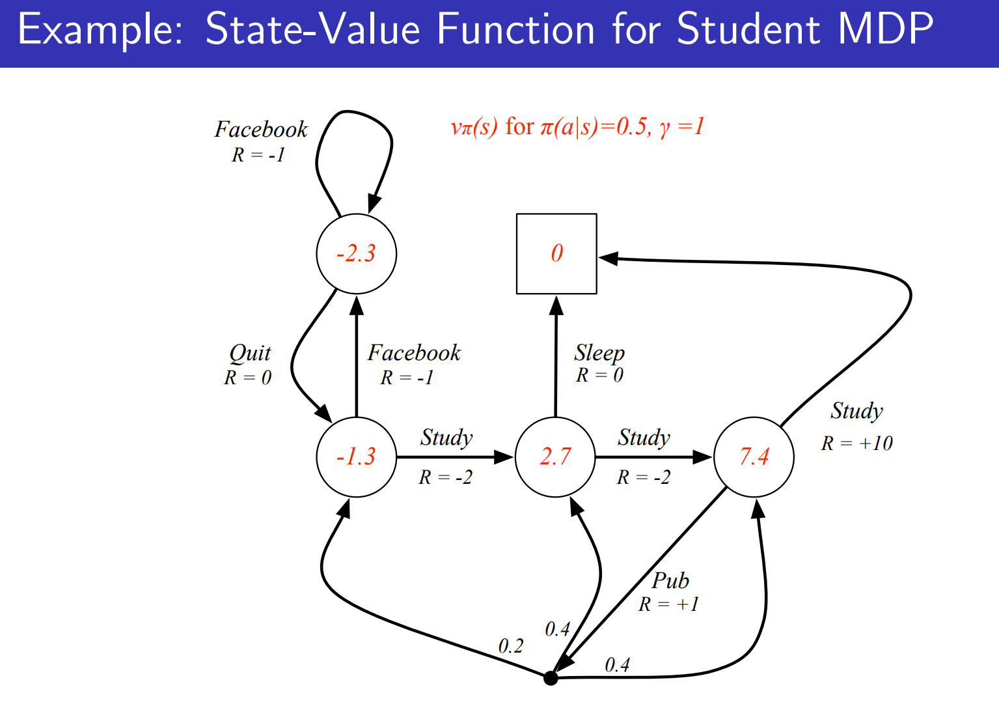

**Action-value function**: $q_\pi(s, a) = E_\pi[G_t | S_t = s, A_t = a]$ is the expected return starting from state $s$, taking action $a$, and following policy $\pi$ thereafter.

**Bellman Expectation Equation**:

$$\begin{aligned}
v_\pi(s) &= E_\pi[R_{t+1} + \gamma G_{t+1} | S_t = s] \\
&= \sum_a \pi(a|s) q_\pi(s, a)
&= \sum_a \pi(a|s) \left( R^a_s + \gamma \sum_{s'} P^a_{ss'} v_\pi(s') \right)
\end{aligned}$$

$$\begin{aligned}
q_\pi(s, a) &= E_\pi[R_{t+1} + \gamma q_\pi(S_{t+1}, A_{t+1}) | S_t = s, A_t = a] \\
&= R^a_s + \gamma \sum_{s'} P^a_{ss'} v_\pi(s') \\
&= R^a_s + \gamma \sum_{s'} P^a_{ss'} \sum_{a'} \pi(a'|s') q_\pi(s', a')
\end{aligned}$$

Matrix form:

$$v_\pi = R^\pi + \gamma P^\pi v_\pi$$

Solution:

$$v_\pi = (I - \gamma P^\pi)^{-1} R^\pi$$

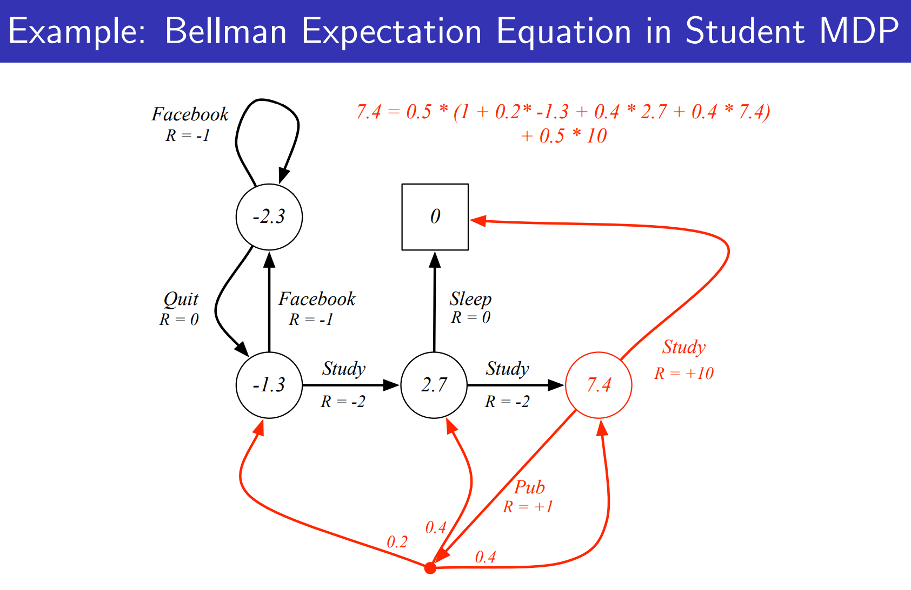

### Optimality

**Optimal state-value function**: $v_*(s) = \max_\pi v_\pi(s)$ is the maximum expected return achievable from state $s$.

**Optimal action-value function**: $q_*(s, a) = \max_\pi q_\pi(s, a)$ is the maximum expected return achievable from state $s$ and action $a$.

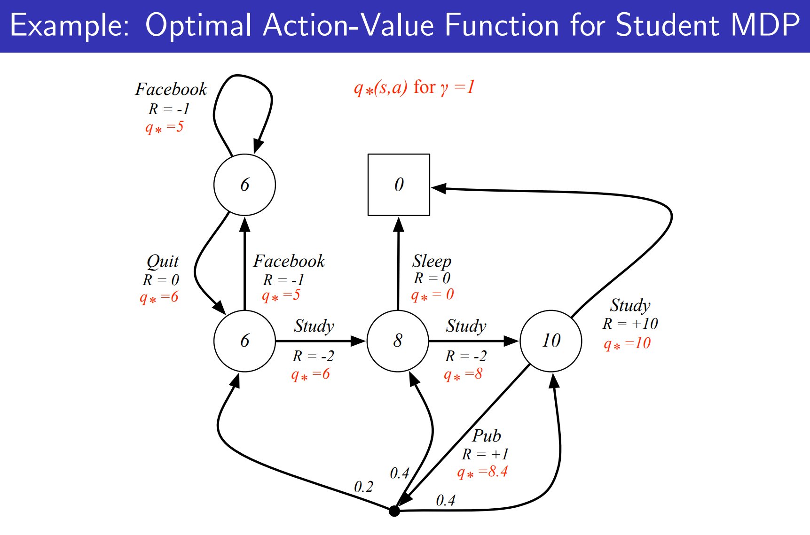

An MDP is **solved** when we have found an optimal policy $\pi_*$ such that $v_{\pi_*}(s) = v_*(s), \forall s$.

**Optimal policy**:

- A policy $\pi \geq \pi'$ if $v_\pi(s) \geq v_{\pi'}(s), \forall s$.
- For any MDP, there exists an optimal policy $\pi_*$ that is better than or equal to all other policies: $\pi_* \geq \pi, \forall \pi$.
- All optimal policies achieve the optimal value function: $v_{\pi_*}(s) = v_*(s), \forall s$.
- All optimal policies achieve the optimal action-value function: $q_{\pi_*}(s, a) = q_*(s, a), \forall s, a$.

An optimal policy can be found by maximizing over $q_*(s, a)$:

$$\pi_*(a|s) = \begin{cases}
1 & \text{if } a = \arg\max_{a'} q_*(s, a') \\
0 & \text{otherwise}
\end{cases}$$

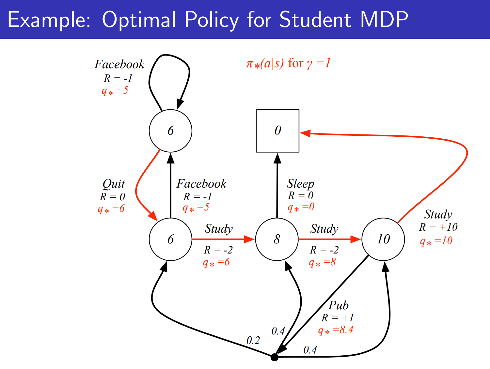

**Bellman Optimality Equation**:

$$\begin{aligned}
v_*(s) &= \max_a q_*(s, a) \\
&= \max_a \left( R^a_s + \gamma \sum_{s'} P^a_{ss'} v_*(s') \right)
\end{aligned}$$

$$\begin{aligned}
q_*(s, a) &= R^a_s + \gamma \sum_{s'} P^a_{ss'} v_*(s')
&= R^a_s + \gamma \sum_{s'} P^a_{ss'} \max_{a'} q_*(s', a')
\end{aligned}$$

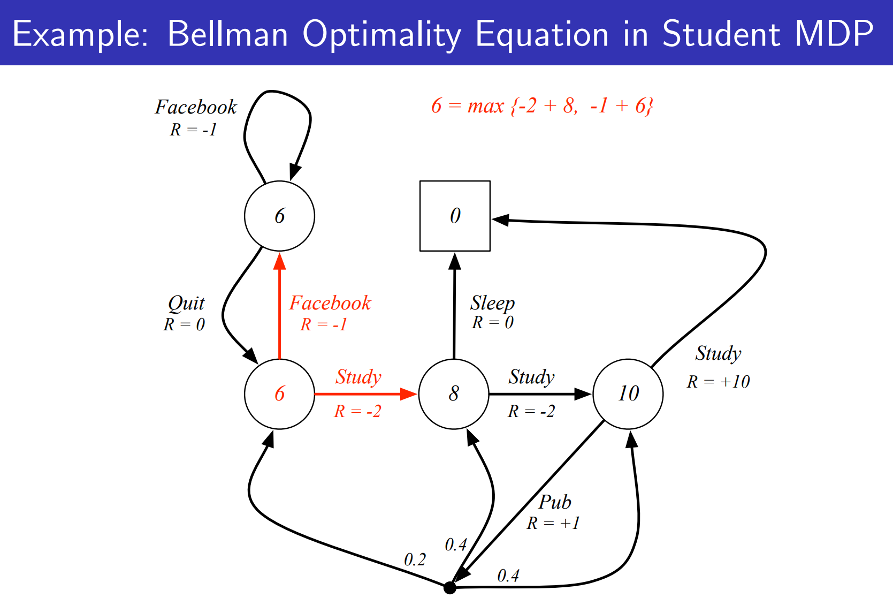

Bellman Optimality Equation is non-linear and cannot be solved in closed form, but can be solved iteratively by value iteration, policy iteration, Q-learning, etc.

### Extensions to MDPs

- **Infinite MDPs**:
    - Countably infinite state and/or action spaces
    - Continuous state and/or action spaces (has closed form for linear-quadratic models, LQR)
    - Continuous time (partial differential equations)
- **Partially Observable MDPs (POMDPs)**: a MDP with hidden states. A POMDP is a tuple $(S, A, P, R, \gamma, O, Z)$ where
    - $O$ is a finite set of observations.
    - $Z$ is the observation probability matrix: $Z_{so} = P[O_t = o | S_t = s]$.
    - History $H_t = A_0, O_1, R_1, A_1, O_2, R_2, ..., A_{t-1}, O_t, R_t$ is Markov.
    - Belief state $b(h) = (P[S_t = s_1 | H_t = h], P[S_t = s_2 | H_t = h], ..., P[S_t = s_n | H_t = h])$ is Markov.
    - Therefore, a POMDP can be reduced to a history tree and belief state tree, which are both MDPs.
    - The general idea is to find a policy that maps belief states to actions, which can be solved (by iterative algorithms) in the belief state space, which is continuous and high-dimensional.
- **Ergodic MPs**:
    - An ergodic MP is recurrent (each state is visited an infinite number of times) and aperiodic (each state is visited without a fixed period).
    - An ergodic MP has a limiting stationary distribution $d^\pi(s) = \sum_{s'} d^\pi(s') P^\pi_{s's}$, which is the long-run proportion of time spent in each state under policy $\pi$.
    - An MDP is ergodic if the Markov chain induced by any policy is ergodic.
    - Average reward per time-step: $\rho^\pi = \lim_{T \to \infty} \frac{1}{T} E_\pi[\sum_{t=1}^T R_t] = \sum_s d^\pi(s) \sum_a \pi(a|s) R^a_s$ is the expected reward per time-step under policy $\pi$ in the long run, independent of the initial state.
    - Average reward value function: $\bar{v}_\pi(s) = E_\pi[\sum_{t=1}^\infty (R_t - \rho^\pi) | S_0 = s]$
    - Average reward Bellman Equation: $\bar{v}_\pi(s) = E_\pi[R_{t+1} - \rho^\pi + \bar{v}_\pi(S_{t+1}) | S_t = s] = \sum_a \pi(a|s) \left( R^a_s - \rho^\pi + \sum_{s'} P^a_{ss'} \bar{v}_\pi(s') \right)$

## 12 Planning by Dynamic Programming

**Dynamic programming**: A method for solving complex problems by breaking them down into simpler subproblems, solving each subproblem just once, and combine solutions to subproblems.

Requirements for dynamic programming:

- **Principle of optimality**: Optimal substructure. The optimal solution to a problem can be constructed from optimal solutions to its subproblems.
- **Overlapping subproblems**: The problem can be broken down into subproblems which are reused multiple times.

MDPs satisfy both requirements, so we can use dynamic programming to solve MDPs.

- Planning requires full knowledge of the MDP.
- Prediction: Input: (1) MDP $M = (S, A, P, R, \gamma)$ and policy $\pi$, or (2) MRP $M = (S, P, R, \gamma)$. Output: value function $v_\pi$ or $q_\pi$.
- Control: Input: MDP $M = (S, A, P, R, \gamma)$. Output: optimal policy $\pi_*$ and optimal value function $v_*$ or $q_*$.

### Iterative Policy Evaluation

- Problem: Given a policy $\pi$, compute the value function $v_\pi$.
- Solution: iteratively apply the Bellman Expectation Equation until convergence.

Using synchronous backups, at each iteration $k+1$, we update the value function for all states simultaneously. For all state $s \in S$,

$$v_{k+1}(s) = \sum_{a \in A} \pi(a|s) \left( R^a_s + \gamma \sum_{s' \in S} P^a_{ss'} v_k(s') \right)$$

$$v_{k+1} = R^\pi + \gamma P^\pi v_k$$

Example: evaluating a policy in a grid world.

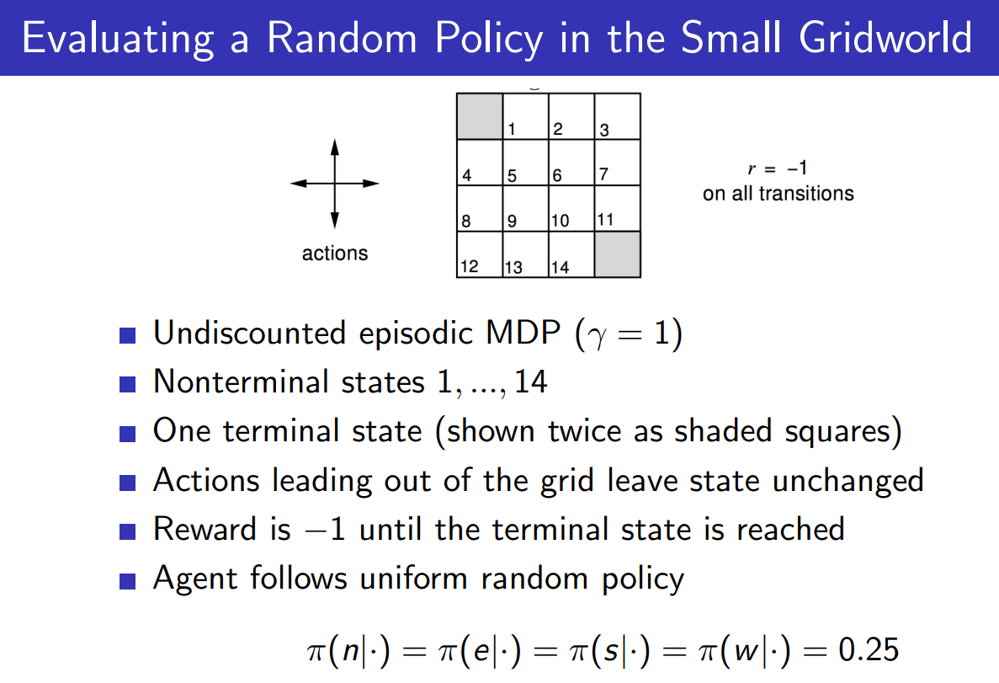

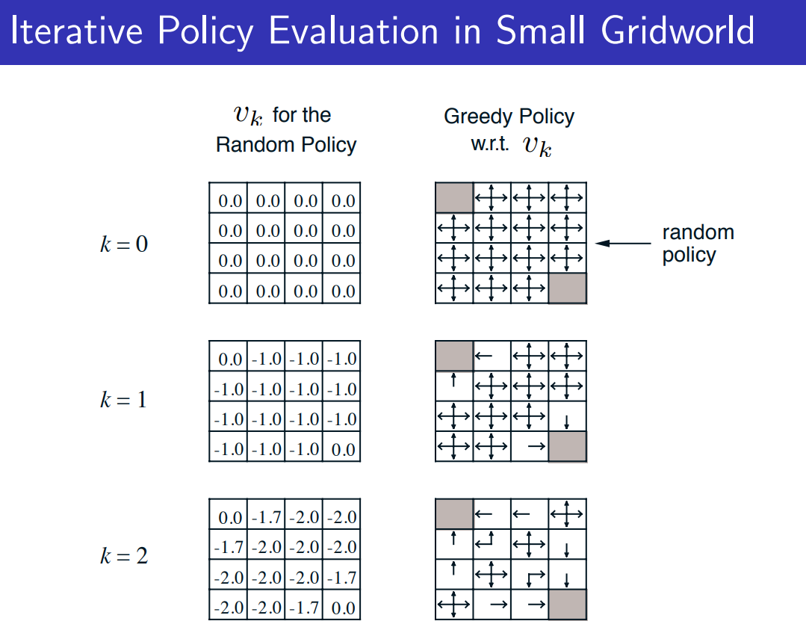

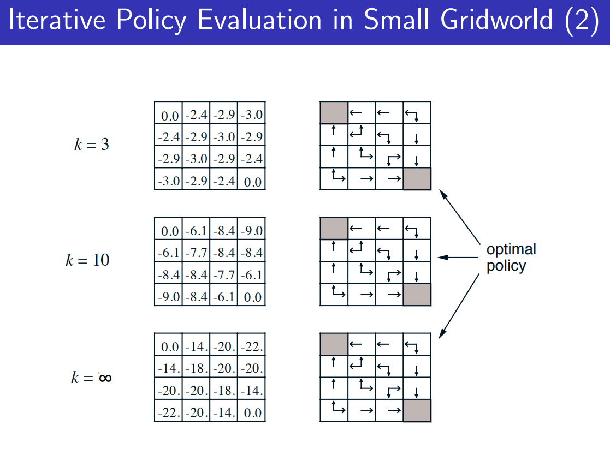

### Policy Iteration

Given a policy $\pi$, evaluate $v_\pi(s) = E[R_{t+1} + \gamma v_\pi(S_{t+1}) | S_t = s]$ for all $s$ (policy evaluation), and then improve the policy by acting greedily with respect to the value function: $\pi' = \text{greedy}(v_\pi)$. Repeat until convergence.

Consider a deterministic policy $a = \pi(s)$, the greedy policy is:

$$\pi'(s) = \arg\max_a q_\pi(s, a)$$

This improves the value from any $s$ over one step:

$$q_\pi(s, \pi'(s)) = \max_a q_\pi(s, a) \geq q_\pi(s, \pi(s)) = v_\pi(s)$$

And eventually improves the value function:

$$\begin{aligned}
v_{\pi'}(s) &\leq q_{\pi'}(s, \pi'(s)) = E_{\pi'}[R_{t+1} + \gamma v_{\pi'}(S_{t+1}) | S_t = s] \\
&\leq E_{\pi'}[R_{t+1} + \gamma q_\pi(S_{t+1}, \pi'(S_{t+1})) | S_t = s] \\
&\leq E_{\pi'}[R_{t+1} + \gamma R_{t+2} + \gamma^2 R_{t+3} + ... | S_t = s] = v_{\pi'}(s)
\end{aligned}$$

If improvements stop, then the Bellman Optimality Equation $v_\pi(s) = \max_a q_\pi(s, a)$ is satisfied, and $\pi$ is an optimal policy.

**Epsilon-convergence**: In practice, we can stop policy iteration when the value function changes less than a small threshold $\epsilon$ between iterations, i.e. $\max_s |v_{k+1}(s) - v_k(s)| < \epsilon$.

Generalized Policy Iteration consists of (1) estimate $v_\pi$ using **any** policy evaluation method, and (2) generate $\pi' \geq \pi$ using **any** policy improvement method.

### Value Iteration

**Principle of optimality**: A policy $\pi(a|s)$ achieves the optimal value from state $s$ ($v_\pi(s) = v_*(s)$) iff $\forall s'$ reachable from $s$, $\pi$ achieves the optimal value from $s'$ ($v_\pi(s') = v_*(s')$). 

This means that if a policy is optimal at one state, it must be optimal at all states reachable from it. Therefore, an optimal policy includes (1) an optimal first action $A_*$ and (2) an optimal policy $\pi_*$ thereafter.

If we know solution to the subproblems $v_*(s')$ for all $s'$ reachable from $s$, the solution $v_*(s)$ can be found by maximizing over the first action:

$$v_*(s) = \max_a \left( R^a_s + \gamma \sum_{s'} P^a_{ss'} v_*(s') \right)$$

So we can start with final rewards and find the optimal solution backwards.

- Problem: Given an MDP, find the optimal policy $\pi$
- Solution: iteratively apply the Bellman Optimality Equation.

Using synchronous backups, at each iteration $k+1$, we update the value function for all states simultaneously. For all state $s \in S$,

$$v_{k+1}(s) = \max_{a \in A} \left( R^a_s + \gamma \sum_{s' \in S} P^a_{ss'} v_k(s') \right)$$

$$v_{k+1} = \max_a R^a + \gamma P^a v_k$$

A summary of synchronous DP algorithms:

| Problem | Equation | Algorithm |
| --- | --- | --- |
| Prediction | Bellman Expectation Equation | Iterative Policy Evaluation |
| Control | Bellman Expectation Equation + Greedy Policy Improvement | Policy Iteration |
| Control | Bellman Optimality Equation | Value Iteration |

For state-value function $v$, the complexity is $O(mn^2)$ per iteration ($m$ actions, $n$ states). For action-value function $q$, the complexity is $O(m^2 n^2)$ per iteration. The number of iterations required for convergence depends on the discount factor $\gamma$ and the structure of the MDP.

### Async DP

In synchronous DP, all states are updated simultaneously at each iteration. In asynchronous DP, states are updated one at a time in any order, which can be more efficient in practice.

3 asynchronous DP algorithms:

(1) In-place DP:

Instead of sync value iteration

$$v_\text{new}(s) = \max_a \left( R^a_s + \gamma \sum_{s'} P^a_{ss'} v_\text{old}(s') \right)$$

and copying $v_\text{new}$ to $v_\text{old}$ at the end of each iteration, we can update $v$ in-place:

$$v(s) \leftarrow \max_a \left( R^a_s + \gamma \sum_{s'} P^a_{ss'} v(s') \right)$$

(2) Prioritised Sweeping:

Using Bellman error:

$$E =  \left| \max_a \left( R^a_s + \gamma \sum_{s'} P^a_{ss'} v(s') \right) - v(s) \right|$$

- Backup the state with largest Bellman error first, which is likely to lead to the largest change in value and therefore faster convergence.
- Can be maintained by priority queue, total time complexity is $O(n \log n)$ per iteration.

(3) Real-time DP:

Only use state that are relevant to the current situation. After each timestep $(S_t, A_t, R_{t+1})$, backup $S_t$ and then:

$$v(S_t) \leftarrow \max_a \left( R^a_{S_t} + \gamma \sum_{s' \in S} P^a_{S_t s'} v(s') \right)$$

### Full-Width Backup vs. Sample Backup

- **Full-width backup**: For each backup, every successor state $s'$ and action $a$ is considered. Cost of backup is $O(mn)$ for state-value function and $O(m^2 n)$ for action-value function.
- **Sample backup**: Using sample rewards and sample transitions $(S_t, A_t, R_{t+1}, S_{t+1})$ to update the value function, instead of the reward function $R$ and the full transition model $P$. This is model-free, and the cost of backup is $O(1)$.

### Contraction Mapping

Goal: prove the convergence (i.e. the existence and uniqueness of the solution) of DP algorithms.

By $\infty$-norm, the distance between two value functions $u$ and $V$ is the largest difference between their values at any state: $||u - v||_\infty = \max_s |u(s) - v(s)|$.

Bellman exppectation backup operator $T^\pi$ is a contraction mapping with respect to $\infty$-norm:

$$\begin{aligned}
T^\pi (v) &= R^\pi + \gamma P^\pi v \\
||T^\pi (u) - T^\pi (v)||_\infty &= ||R^\pi + \gamma P^\pi u - R^\pi - \gamma P^\pi v||_\infty \\
&= \gamma ||P^\pi (u - v)||_\infty \\
&\leq \gamma ||u - v||_\infty
\end{aligned}$$

**Contraction Mapping Theorem**: If $T$ is a $\gamma$-contraction mapping, then there exists a unique fixed point $v$ such that $T(v) = v$, and for any initial value function $v_0$, the sequence defined by $v_{k+1} = T(v_k)$ converges to $v$.

By contraction mapping theorem, iterative policy evaluation (Bellman expectation) converges to $v_\pi$ and policy iteration converges to $v_*$.

Bellman Optimality backup operator $T$ is also a contraction mapping:

$$T^* (v) = \max_a R^a + \gamma \max_a P^a v$$

$$||T^* (u) - T^* (v)||_\infty \leq \gamma ||u - v||_\infty$$

So value iteration (Bellman optimality) also converges to $v_*$.