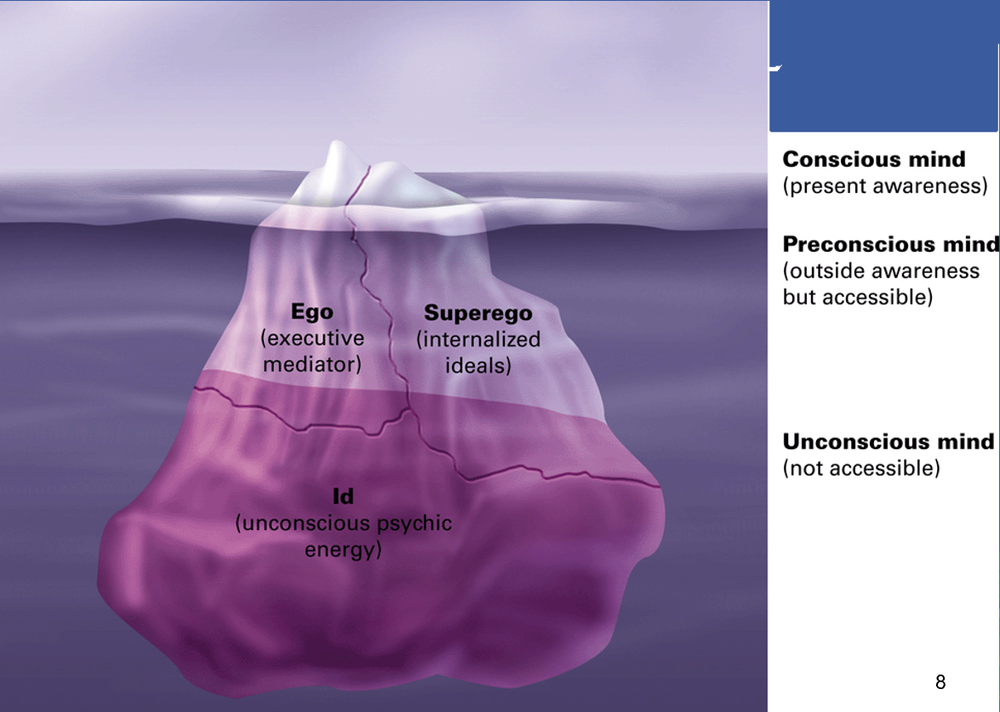
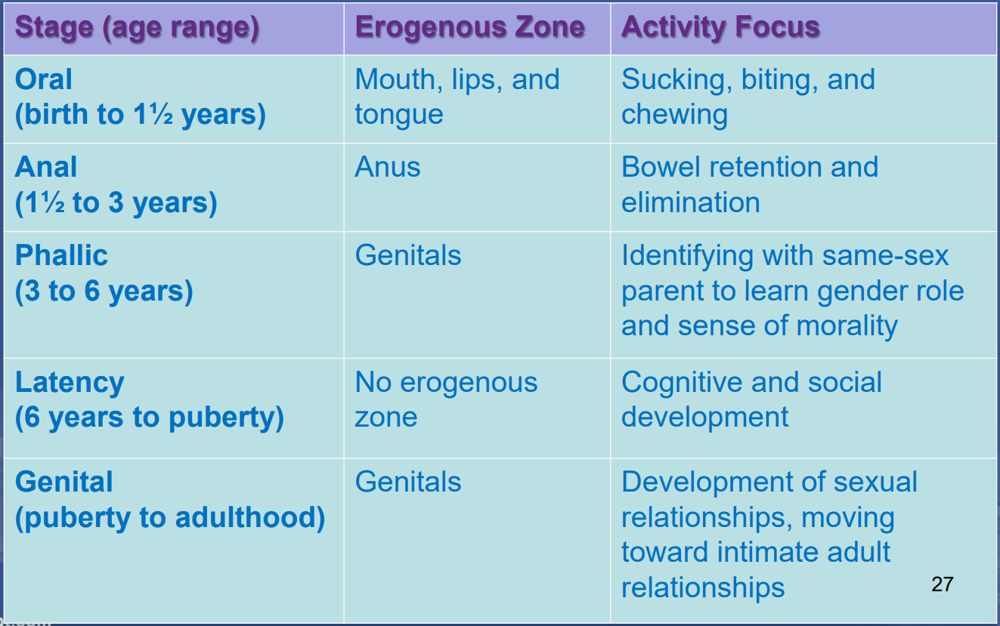
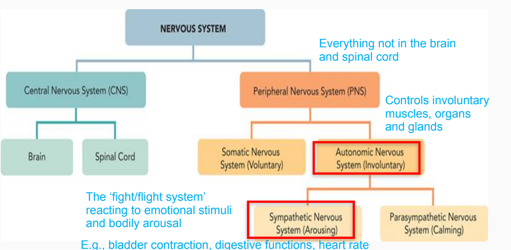
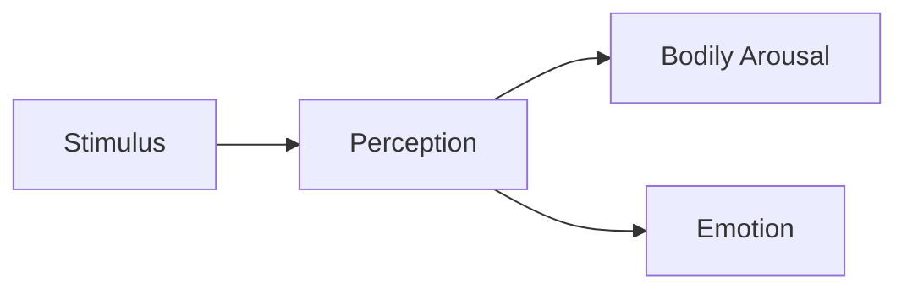
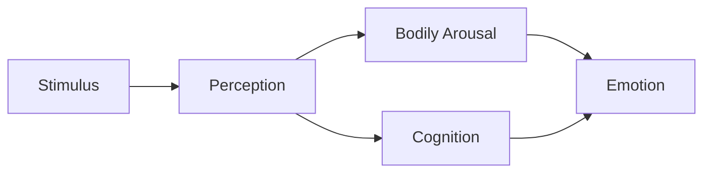
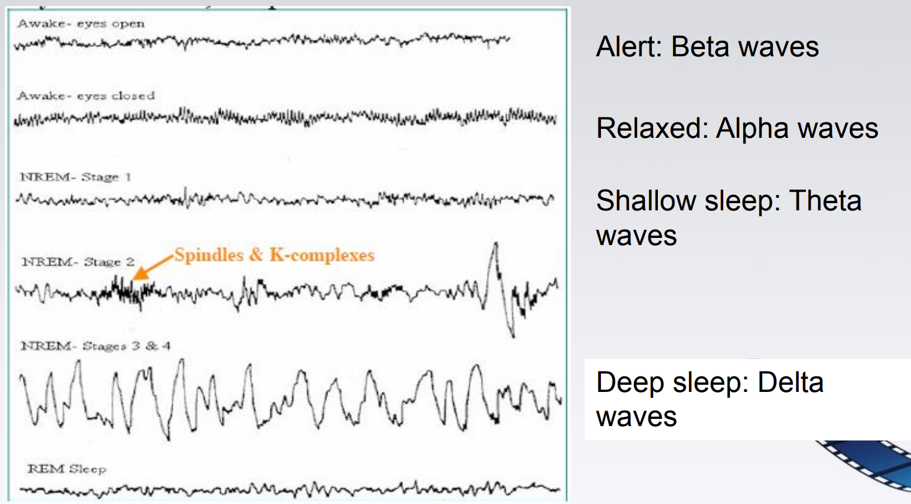
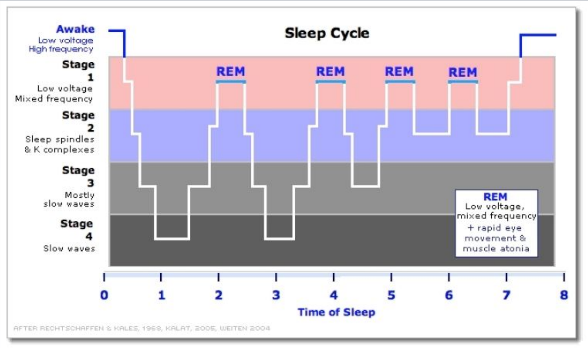
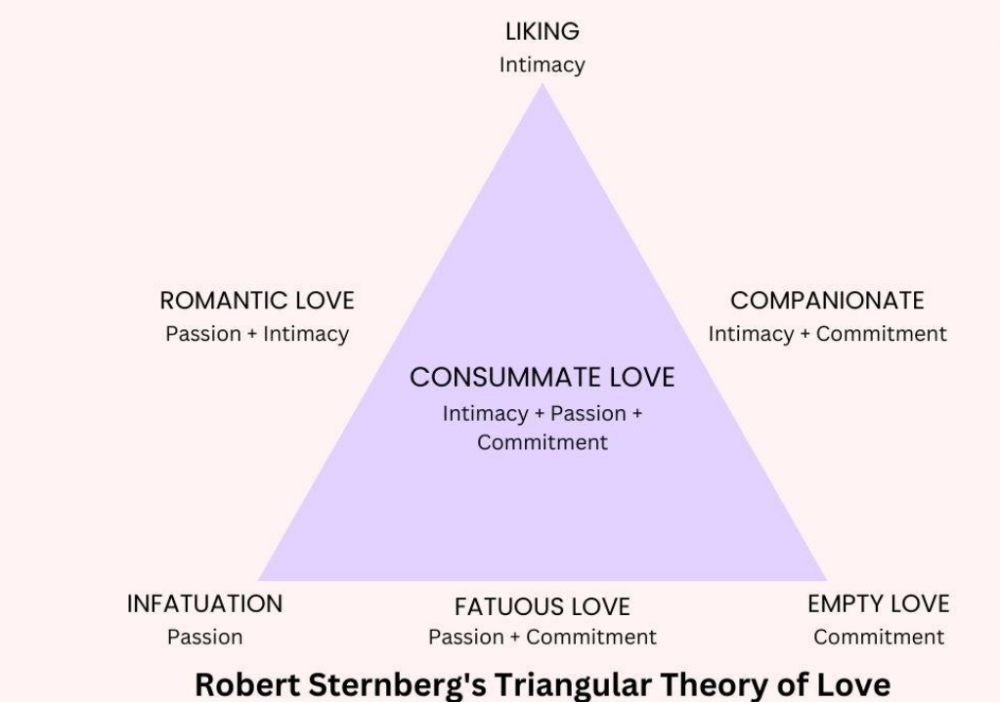

# GE1137 Movies and Psychology

## Trailer: Introduction

### Movie

The word "movie" is coined from "moving picture". It refers to a sequence of **photographs** projected onto a screen rapidly enough to create the **illusion** of motion and continuity, and the form of cinematic **narrative** represented in such a medium.

Brief history of movies:

- Pre-movie: Camera Obscura (5th century BC), Magic Lantern (17th century), Zoetrope (1834)
- **Phenakistoscope** (Joseph Plateau, 1832): A spinning disc with sequential images that create the illusion of motion when viewed through slits.
    - Mechanism: **Persistence of Vision**
    - Similar to flipbooks
    - limited to a small number of drawings and endless repetition
- **Roundhay Garden Scene** (Louis Le Prince, 1888): The first motion picture filmed on paper film using one static shot at 12 frames per second.
- **Workers Leaving the Lumière Factory** (Lumière Brothers, 1895): One of the first films publicly screened, marking the birth of cinema.
- Earliest films are about one event and "purely visual". At around 1900, filmmakers started to put several shots together to tell a story.
- The Great Train Robbery (Edwin S. Porter, 1903): One of the first narrative films, using multiple scenes and editing techniques.
- **The Jazz Singer** (1927): The first feature-length film with synchronized dialogue, enabled by the development of electronic sound recording. Adding speech, music, and sound effects to movies marked the beginning of the "talkies" era.
- Further technological advancements: Color film (Technicolor, 1930s), CGI (1970s), digital filmmaking (1990s), streaming platforms (2000s).

### Psychology

Psychology is the scientific study of human mind and behavior.

Brief history of psychology:

- Pre-Wundt: Ancient Greek (Plato - dualism, soul is separate from body); Descartes (17th century - Pineal gland as the seat of the soul)
- **Wilhelm Wundt** (1879): Established the first psychology laboratory in Leipzig, Germany, and studied structure of human mind using **introspection**. The father of psychology and structuralism.
- **William James** (1890): Published "The Principles of Psychology", emphasizing the functional view of human behavior (functionalism).

### Movies and Psychology

- Historical background: the development of movies and psychology occurred around the same time in the late 19th century.
- Target of interest: human (movies <-> audience, movies <-> individual and societal impact)

#### Perception

Perception means **how brain interprets sensory information**, and have subjectivity.

Power of visual cues - percrptual illusions - **forced perspective** in movies: a technique that uses optical illusion to make objects appear larger, smaller, closer, or farther away than they actually are. (Example in Hobbit)

#### Emotion

- **Close up shots** are more often for tragedy scenes; closeness to the actor's emotion; create a sence of empathy
- **Camera angle**: high angle makes the subject look smaller and weaker; low angle makes the subject look larger and more powerful

#### Social Influence

- Social facilitation: the presence of others increases physiological arousal, facilitates well-learned behaviors (social facilitation) and inhibits poorly-learned behaviors (social impairment).
- **Full-house advantage**: shots with many people in the background create a sense of social facilitation for the audience, making them feel more engaged and excited.
- **Contagious behavior**: in sitcoms, laughter tracks can induce viewers to laugh more.

## Scene 1: Drama / Psychoanalytic Approach

- **Psychoanalysis**: a classical perspective on human mind (psyche) and personality structure (id, ego, superego) developed by Sigmund Freud in the early 20th century.
- **Personality**: the unique way in which a person thinks, acts, and feels across time and situations.

### Three-Level Structure of Mind

- **Conscious level**: what you are aware of or thinking about right now.
- **Preconscious level**: information that is not currently focused on but can be easily brought to consciousness.
- **Unconscious level**: 
    - the part of our mind we cannot become aware of.
    - contains drives (motivations) for all of our actions and feelings:
        - Biological instinctive drives: need for food
        - Aggressive drives
        - Repressed unacceptable thoughts, memories, and feelings; unresolved conflicts from childhood
    - and dreams.

### Three-Part Personality Structure

- **Id**
    - the primitive form of personality and is present at birth
    - 100% resides in the unconscious mind (people have no memory of infancy experiences)
    - basic instincts (life instinct and death instinct)
    - **pleasure principle**: seek immediate gratification of needs and desires, regardless of consequences
- **Ego**
    - develops from the id during infancy (since 1 or 2 years old)
    - functions in all three levels of consciousness
    - **reality principle**: finding gratification for the id's instinctive drives within the constraints of reality; avoid punishment
- **Superego**
    - represents one's conscience (moral sense)
    - develops around age 5 from Ego as a result of internalizing ideal standards of behavior taught by parents and society
    - **morality principle**: strive for perfection, judge actions as right or wrong, and induce feelings of pride or guilt
    - trying to satisfy the id and superego at the same time often creates conflict for the ego, leading to **anxiety**
    - **Psychological defense mechanisms**: unconscious strategies used by the ego to reduce anxiety by distorting reality

**Unhealthy Personality** Development may result from:

- we become too dependent on defense mechanisms
- either the id or the superego becomes too strong, leading to impulsive or overly moralistic behavior
- the ego is too weak

### Defense Mechanisms

- **Repression**: pushing unpleasant memory or thoughts into the unconscious (e.g., forgetting traumatic childhood events)
- **Regression**: reverting to an earlier, more childlike behavior (e.g., throwing a temper tantrum when frustrated)
- **Displacement**: redirecting unacceptable feelings from the original source to a safer substitute target (e.g., yelling at children after being scolded by boss)
- **Sublimation**: redirecting unacceptable impulses into socially acceptable activities (e.g., playing sports to repress aggressive urges)
- **Reaction Formation**: behaving in a way that is opposite to one's true feelings (e.g., being overly nice to someone you dislike)
- **Projection**: attributing one's own unacceptable thoughts or feelings to others (e.g., accusing others of being angry when you are the one who is angry)
- **Denial**: refusing to recognize or acknowledge a threatening situation

### Psychosexual Stage Theory

This theory explains how one's personality develops.

In each stage, a specific **erogenous zone** is the focus. Needs of Id are gratified through that zone. A change in erogenous zone marks the beginning of a new stage.

If excessive gratification or frustration occurs at any stage, the individual may become **fixated** at that stage, leading to personality traits and behaviors associated with that stage in adulthood.

**Anal Stage** (18 months to 3 years):

- Coping with demands for control (toilet training)
- Too lenient: messy, lack of self control; impulsive
- Too strict: stubborn; excessively neat

**Phallic Stage** (3 to 6 years):

- Sexual attraction to the opposite sex parent (Oedipus & Electra complex); Identification with the same sex parent
- Fixation: immature sexual attitudes (promiscuity; vanity) or excessive guilt

**Latency Stage** (6 years to puberty):

- Sexual feelings are repressed; focus on developing social and intellectual skills
- No fixation

**Genital Stage** (puberty onward):

- Sexual urges reawaken; directed towards peers
- Fixation: difficulty forming heterosexual relationships

### Evaluating Freud's Theory

- Criticisms:
    - Overemphasis on childhood experiences (below 12)
    - Overemphasis on sexual and aggressive drives
    - Belief that unconscious mind is the primary determinant of behavior
- Contributions:
    - Childhood is important to later functioning
    - Unconscious processes play a significant role in human development

## Scene 2: Thriller / Emotion

**Emotion**: A class of **subjective** feeling elicited by **stimuli** that have high significance to an individual, accompanied by **physiological** changes and **behavioral** responses.

**Universal Categories of Emotion** (Paul Ekman, 1934):

- Six basic emotions: happiness, sadness, anger, fear, surprise, disgust
- Associated with facial expressions
- Types of emotion universal, display rules differ across cultures
- Culture affects who can display which emotions to whom and when

Three components of emotion:

- **Physiological** component: fight-or-flight response of the autonomic nervous system (ANS)
- **Behavioral** component: facial expressions
- **Cognitive** component: apprasial (interpretation) of the situation; include the social influences from others

The Nervous System:

### Emotion Psychology

- Heart rate: anger, fear and sadness increase heart rate; disgust decreases heart rate
- Skin conductance: disgust
- Blood pressure: anger

**Amygdala**: brain structure which evaluate the significance of stimuli and generate emotional responses; generate hormonal secretions and autonomic reactions accompanying strong emotions. If damaged, causes "psychic blindness" - inability to recognize fearful facial expressions and voices.

Two pathways of fear: fast (visual thalamus -> amygdala) and slow (visual thalamus -> visual cortex -> amygdala)

**Frontal Lobes**: influence people's conscious emotional feelings and ability to act in planned ways based on those feelings. Left - positive emotions; Right - negative emotions.

LeDoux's Theory of Emotion (1996): Fear is generated instaneously by the amygdala; more complex emotions (love or guilt) that do not require life-or-death responses require higher-level processing in the cortex.

**Disgust**: A learned emotion (after ~2 years old) towards morally disgraceful acts. A product of social influences.

### Emotion Behavior

**Facial Feedback Hypothesis**: assumes facial muscles send signals to the brain that help the brain recognize the emotion being experienced.

### Cognitive Theories of Emotion

Factors that influence how people experience and label their emotions:

- Bodily/physiological responses
- Behavioral responses
- Stimuli, situational context, experience and other people

### Theories of Emotion

**Common Sense Theory**

**James-Lange Theory** (1885): Emotion is the perception of bodily / physiological changes.

**Cannon-Bard Theory** (1927): Emotion and bodily arousal occur simultaneously.

**Schachter-Singer Two-Factor Theory** (1962): Emotion is determined by physiological arousal and cognitive labeling of that arousal based on situational cues.

Evidence: Happy / Angry Man Experiment (Schachter & Singer, 1962)

- Experiments: Volunteers were injected with epinephrine (increasing physical arousal) and either (A) informed about the side effects, (B) not informed, (C) misinformed, or (D) given a placebo. They enter a room with a confederate acting (a) happy, (b) angry, or (c) neutral.
- Result: (B) and (C) reported their feelings strongly influenced by the confederate's behavior, (D) to a lesser extent, and (A) the least.
- Explanation: Interplay between physiological responses and cognitive labeling in the experience of emotion.

#### Fear Theories

Cook & Mineka (1989): Fear can be learned by observing others, and specific to stimuli that are inherently threatening.

- Participants: Monkeys raised in captivity that had no prior exposure to snakes.
- Experiments: Monkeys are exposed to videos of other monkeys reacting fearfully to (A) plastic snakes, or (B) plastic flowers.
- Results: (A) monkeys act fearfully towards plastic snakes, (b) monkeys act neutrally.

LoBue & DeLoache (2009): Children as young as 3 years old are capable of perceiving danger.

- Participants: 3-year-old children.
- Experiments: Children are asked to find out the deviant picture among (A) 7 grasshoppers and 1 snake, or (B) 7 snakes and 1 grasshopper.
- Results: Children in (A) find the snake faster than children in (B) find the grasshopper.

**Collective Subconsciousness** (Carl Jung, 1916): Humans share a set of ancestral memories and ideas, known as archetypes, which are expressed through symbols and themes in myths, art, and dreams across cultures. Evidence: Similar elements (fear of darkness) found in different cultures' ancient stories.

Fear stimuli can be categorized into (A) evolutionary bias and (B) innate bias (fear of darkness, sharp teeth).

#### Horror Theories

Horror movie: a fictionalized account designed to **evoke terror** through the implied presence of **supernatural or grossly abnormal forces**.

**Eight Psychological Theories** (Walters, 2004): Why people enjoy horror movies

| Theory | Explanation | Criticism |
| --- | --- | --- |
| **Psychoanalysis** | Freud: manifestation of Id; thoughts and feelings repressed by Ego  Jung: arousal of archetypes in collective subconsciousness | Hard to test empirically |
| **Catharsis** | Aristotle: people like scary stories to purge negative emotions | Research shows the opposite - horror movies make people more aggressive |
| **Excitation Transfer** | Make plot resolution more exciting | Enjoyment is higher during horror scenes rather than after |
| **Curiosity / Fascination** | Violate social norms  Satisfy curiosity outside normal experience | Not all viewers enjoy seeing norm violators not being punished |
| **Sensation Seeking** | High sensation seekers like horror movies more | Findings insignificant; hard to interpret a preference on movie with a single trait |
| **Dispositional Alignment** | Violence to deserving characters = more positive  Violence to the innocent = more negative | Can only explain why horror episode A is more acceptable than B, not why people like horror movies in general |
| **Gender Role Socialization** | Teenage boys are much more enjoyable if the girl companion is frightened | Cannot explain why people go to horror movies alone or in adulthood |
| **Societal concerns** | Wartimes -> zombie movies  Serial killers -> psychopath movies | Many horror movies work on cross-cultural fears |

Three key features of horror movies:

**Tension**

- Create tension through mystery, suspense, terror, or shock
- Tension based on the distortion of natural forms
- **Musical tension**: music add tension because they build suspense and supply information about the emotional tone

**Relevance**

- Universal relevance: use fundamental level of fear and terror (e.g., darkness, danger and death)
- Cultural, Sub-group, Personal relevance: use specific fears and anxieties (e.g., fear of clowns)

**Unrealism**

- People prefer watching explicit horror movies than less explicit documentary videos about real-life violence or disasters
- **Fictional nature increases the psychological distance** between the viewer and the violent acts
- Music intensifies the sense of unreality and serves as protective buffer

Thomas Straube: Horror movies does not relate to amygdala activation, but rather to visual cortex + thalamus, insular cortex (disgust) and **prefrontal cortex** (planning, attention and problem-solving).

Horror movies require us to face the unknown (universal fear) in a safe place, to understand it and make it less scary. They also allow us to put our fears into the context, which helps us to understand more about ourselves and relationships with others.

## Scene 3: Biography / Mental Illness

### History of Mental Disorders

- Pre-history: Trepanation (drilling holes in the skull to release evil spirits)
- Hippocrates (~400 BC): Mental disorders caused by imbalances in bodily fluids (blood, phlegm, black bile, yellow bile); first documented biological cause
- Middle Ages: caused by spiritual possession; treatment by exorcism
- Renaissance: caused by demonic possession; witches were persecuted; asylums were built to house the mentally ill, but conditions were often inhumane; bloodletting and snake pits as treatments
- 20th century: development of psychology and psychiatry; availability of drug treatments; deinstituionalization (movement to close mental hospitals and treat patients in the community); increased awareness and acceptance of mental illness

(*) Psychiatry (from Greek "psyche" meaning soul and "iatros" meaning healer) = mental illness diagnosis and treatment.

### Defining Mental Disorders

**Abnormal**: statistically rare, deviant from social norms. Involving subjective discomfort, maladaptive behavior (inability to function normally), and/or harm to self or others.

Explanations from 3 models:

- **Biological model**:
    - caused by chemical imbalances, genetic predisposition, brain damage or dysfunction
- **Psychological model**:
    - **Psychodynamic**: problem of hiding or repressing thoughts in unconscious mind (e.g., anxiety disorders)
    - **Behavioral**: learned negative outcome from previous experience (e.g., phobias)
    - **Cognitive**: irrational or distorted thinking
- **Biopsychosocial model**: all of the above factors interact to cause mental disorders

### Classification of Mental Disorders

**Diagnostic and Statistical Manual of Mental Disorders (DSM)**: a manual published by the American Psychiatric Association that provides standardized criteria for the diagnosis of mental disorders. Currently in its 5th edition (DSM-5). Has 18 different classes and over 300 disorders. Adopts the biopsychosocial model.

**Dissociative Identity Disorder (DID)**

- 2 or more distinct personalities (alters) that recurrently take control of behavior
- Core personality is usually unaware of the alters, but alters are aware of each other
- Experience blackouts or awakening in unfamiliar places
- Psychodynamic view: repression of traumatic (childhood) experiences leads to the development of alters as a defense mechanism
- Cognitive and behavioral view: thought avoidance → reduction in anxiety → reinforcement → habit of "not thinking" about trauma → development of alters to take on the role of "not thinking"
- Biological perspective:
    - Different brain activity levels between DID patients and healthy people when exposed to trauma-related stimuli
    - Different brain activation patterns between different
    - Childhood abusive experiences may cause the observed neurological changes
- **Controversial**: therapy practices (e.g., hypnosis) may encourage the creation of alters

**Schizophrenia** (from Greek "schizo" meaning split and "phrenia" meaning mind)

- Splitting of the mind into separate, disconnected parts
- **Delusions**: false and strongly held beliefs
    - e.g. delusions of persecution (belief that others are out to get you), reference (belief that others are talking about you), influence (belief that others are controlling your thoughts or actions), grandeur (belief that you have special powers or abilities)
- **Hallucinations**: false senory perceptions (e.g., hearing voices or seeing things that are not physically present; also touch, smell, and taste)
- Other symptoms: interrupted thoughts, disturbed emotion (flat effect), disturbed speech, disorganized and odd behavior
- Subtypes:
    - **catatonic**: characterized by extreme immobility or excessive motor activity (e.g., waxy flexibility - maintaining a posture for long periods of time, echolalia - repeating others' words, echopraxia - imitating others' movements)
    - **paranoid**: auditory hallucinations + delusions of persecution or grandeur + relatively normal (bizarre but systematic) behavior
- Biological perspective:
    - Neurochemical: excessive dopamine in subcortical brain → positive symptoms (hallucinations, delusions); insufficient dopamine in prefrontal cortex → negative symptoms (flat affect, social withdrawal)
    - Structural brain abnormalities: enlarged ventricles (fluid-filled cavities) → reduced brain tissue; smaller hippocampus and amygdala → impaired memory and emotional processing
    - Genetic factors: higher concordance rates in monozygotic twins (twin from the same egg) than dizygotic twins; risk increases with family history, very high if both parents have schizophrenia
- Biopsychosocial perspective: 
    - **Diathesis-stress model**: a joint product of genetic vulnerability (diathesis) and stressors that trigger it
    - Critical time in development: puberty
    - Family members can influence whther patients relapse
    - Early warning signs: social withdrawal; thought and movement problems; lack of emotion, decreased eye contact

**Insanity defense**: a legal defense that argues that a defendant was not responsible for their actions due to a mental illness at the time of the crime.

## Scene 4: Action & Adventure / Sleep, Dreams & Consciousness

### Sleep

- **Circadian rhythm**: a natural, internal process that regulates the sleep-wake cycle and repeats roughly every 24 hours. Comes with body temperature rhythm. Result of metabolic activities and cognitive function, but the two cycles might not in phase.
- **Internal biological clock**: located in the suprachiasmatic nucleus (SCN) of the hypothalamus; regulates the prodcution of **melatonin** (a hormone that promotes sleep) by the pineal gland; influenced by light exposure (light inhibits melatonin production, darkness stimulates it)
    - Internal biological clock has a natural period of about 24.2 hours, but can be entrained to the 24-hour day by external cues (zeitgebers) such as light and social interactions.
    - Human body is easier to adopt a longer artificial circadian rhythm (e.g., 25 hours) than a shorter one.
    - Easier to overcome jet lag when traveling westward (lengthening the day) than eastward (shortening the day).
- **Sleep stages**:
    - Studied using brain EEG waves, eye movements, and muscle activity
    - Alert: beta waves (13-24 Hz)
    - Relaxed: alpha waves (8-12 Hz)
    - NREM Stage 1: theta waves (4-7 Hz); hypnagogic hallucinations (e.g., falling sensation)
    - NREM Stage 2: sleep spindles (brief bursts of activity) and K-complexes (sudden high-amplitude waves)
    - NREM Stage 3/4: delta waves (0.5-3 Hz); also called slow-wave sleep (SWS)
    - REM sleep: rapid eye movement; strong, disorganized EEG (as in Stage 1); muscle paralysis
    - A cycle of NREM and REM lasts about 90 minutes; each REM sleep lasts 5-30 minutes; REM are more frequent and longer as sleep progresses
- Sleep deprivation: short-term effects (poor in concentration, motivation, perception, and cognitive functioning)

Theories of sleep:

- **Adaptive theory**: sleep evolved to avoid predators in their hunting hours (night time); longer sleep in animals that are predators themselves (e.g., lions)
- **Repair and restoration theory**: sleep is a biological necessity for repair and restoration; deprived sleep increases slow wave sleep (SWS - Stage 3/4); vigorous exercise (high wear and tear) increases SWS
    - **Consolidation hypothesis**: Increased REM is related to heavy memory load or emotional stress/experience
- **Consolidation of learning during sleep** (Lisa-Marie Henderson): sleep strengthens memories for new words in children

### Dreams

Freud's theory (1900):

- Dream is a method to discharge the anxiety created by forbidden desires
- Latent conetnt: the dream throught
- Surface content: dream, which is a symbol of the latent content modified by **dreamwork** to make it less threatening and preserve sleep
- Evaluation: not scientific (what does "dreamwork" actually do? The interpretation of dreams is subjective and can be influenced by the therapist's biases)

The Activation-Synthesis Theory (Hobson & McCarley, 1977):

- Dreams are byproducts of neurological events in REM sleep
- **Activation**: brainstem generates random signals to activate/inhibit various brain areas (frontal part is inhibited, which explains why dreams are often illogical and lack self-awareness; visual and emotional areas are activated, which are then used to synthesize a story)
- **Synthesis**: the brain makes up a story based on excited elements in the coretx (including autonomous nervous activity, eye movements, and stimuli from the environment - e.g., leg cramps, alarm clock)
- What can be explained by this theory:
    - **Delusional acceptance**: the random activations is similar to everyday neural activity, so the brain accepts the dream as reality
    - Internal and external stimuli are combined in dreams
    - Dreams are sometimes bizarre due to deactivation of certain brain areas (e.g., prefrontal cortex - reading difficulties; auditory cortex - loss of music tones); spatial-temporal patterns of different stimulations (emotion, movement, sensations) may be different from reality
    - Poor memory of dreams is due to the decreases in memory-encoding neural activity during REM sleep
- Evaluation: does not explain dreams occuring in NREM sleep; sometimes dreams are meaningful; overemphasis on sensory/perceptual aspects
    - Evidence: Activation may involve real memories or concepts rather than just sensory activations

The Problem Solving Theory:

- Dreams process emotional information
    - People with traumatic experiences have dreams related to the disaster event producing nightmares
- Negative emotions are solved near the morning (dreams in the later part of sleep tend to be happier)
- New emotional experiences are organized into thinking frameworks that have been effective in past experiences
- Evaluation: does not explain why dreams are often bizarre

**Lucid dream**: a dream in which one is aware of dreaming and can sometimes control the dream content. May be used to treat nightmares. (Stumbrys and Erlacher, 2017)

- Frequency of dream control: decreases with age
- Personality: lucid dreamers are more creative; dream controlers are more open to experience and have thin boundaries
- Predictors of lucid dream control: frequent lucid dream; younger age; dispositional mindfulness in wakefulness (i.e. live everyday life with awareness and attention to the present moment)

### Meditation

- **Mindfulness** describes a virtue to be cultivated by meditation and practice in everyday life. An alert mode of perceiving all mental contents. (Walach et al., 2006) from Buddhist psychology.
- **Meditation**: a practice of intentional contemplation; a technique to train attention and awareness; a way to achieve a mentally clear and emotionally calm state.
- **Mindfulness-Based Cognitive Therapy (MBCT)**: a type of psychotherapy that combines mindfulness practices (meditation) with cognitive therapy (identifying and changing negative thought patterns) to help individuals manage depression, anxiety, and stress by increasing awareness and acceptance of their thoughts and feelings.

## Scene 5: Romance / Interpersonal Relations

**Marslow's Hierarchy of Needs**: a theory of human motivation that posits that people are motivated to fulfill basic needs before moving on to higher-level needs.

- Layer 1: Physical needs (food, water, shelter)
- Layer 2: Safety needs (security, stability)
- Layer 3: Love and belonging needs (friendship, intimacy, family)
- Layer 4: Esteem needs (self-esteem, respect from others)
- Layer 5: Self-actualization needs (achieving one's full potential)

### Attraction

#### Proximity

Proximity can prompt hostility, but liking is more common.

- **Mere exposure** (experiment by Robert Zajonc, 1970): the more we are exposed to something, the more we like it; even if we are not aware of the exposure (experiment by Zajonc, 1980: shadowing method - participants listen to a passage (attended) in one ear and a melody (unattended) in the other ear; later, they prefer the melody they were exposed to, even though they were not aware of it)
    - Mere exposure is supported by brain research (infants show preference of their mother's voice; sometimes we like something but don't know why - suggestes a independence of emotion of cognition, as emotions are generated by the amygdala, cognitions are managed by the hippocampus)
    - **Adaptive value**: familiarity is a cue for safety; unfamiliarity is a cue for danger (experiment by Mita, 1977: people prefer the mirror image of their own face, but prefer the true image of their friends' faces)
- Proximity reduces **functional distance** (the likelihood of interaction)
- One factor is availability for interaction; enable people to discover commonalities and exchange rewards

#### Physical Attractiveness

- Men and women are similarly affected by physical attractiveness, at least at the beginning stage of a relationship
- **Matching phenomenon**: people tend to choose partners who are similar in physical attractiveness (along with other traits)
- **Physical attractive stereotype**: bias to phsyically attractive and "what is beautiful is good" (e.g., more sociable, extroverted, popular, happy and successful); even infants show this bias, due to culture and time development
- Computer-generated faces that are perfectly **average** are rated as more attractive than real faces (explanations - match the typical face in our brains; tend to be perfectly symmetrical)
- Weak correlation in the long run (i.e., physical attractiveness is not a strong predictor of relationship satisfaction)
- **Loves sees loveliness** (Price, 1974): the more people are in love, the more attractive they find their partner
- **Nurturity effect**: people find the person in the picture more attractive after reading a favorable description of the person (Gross & Crofton, 1977)

#### Similarity

- Similarity in marriage correlates with marital happiness
- University students living in dorms perceived increased similarity and their relationship becomes better over time
- Dissimilar attitudes cause disliking
- No support (and actually contrast effect) for the idea that opposites attract
- **Positive reinforcement** from like-minded people
- **Mutual appreciation**: Self-esteem and attraction, innate response, use praise honestly and wisely create a positive feedback loop

#### Summary

- Proximity and physical attractiveness promote initial attraction and the beginning of a relationship
- Similarity and mutual appreciation are better predictors of long-term relationship

### Maintain the Relationship

**Zick Rubin's Love Scale**: a measure of romantic love that assesses three components: attachment (desire to be with the person), caring (concern for the person's well-being), and intimacy (closeness and sharing of personal thoughts and feelings).

Difference between loving and liking:

- **Loving**: Dependent need component, exclusiveness, predisposition to help
- **Liking**: Favorable evaluation, respect for the other, sense of similarity

**Robert Sternberg's Triangular Theory of Love**: a theory that proposes that love can be understood in terms of three components: intimacy, passion, and commitment. Different combinations of these components result in different types of love:

- **Intimacy**:
    - Feelings of closeness and connectedness
    - providing emotional support, understanding and warmth
    - crucial for long-term stability of a relationship and tend to remain constant over time
- **Passion**:
    - Drive that leads to romance & physical attraction, and sexual consummation
    - Associated with early stages of a relationship and tends to diminish as the relationship grows and matures
    - The **honeymoon phase** of the relationship
- **Commitment**:
    - Decision to love and maintain the relationship
    - Short-term = acceptance of love; long-term = signal of commitment to continue the relationship
    - Love's constancy

Types of loves according to Sternberg's theory:

- **Liking** (intimacy only)
    - Friendship, family-like love
- **Infatuation** (passion only)
    - Love at first sight; short-lived; often based on physical attraction
- **Empty love** (commitment only)
    - "Staying together for the kids"; "arranged marriage"; "companionate love without intimacy"
- **Passionate love** (intimacy + passion)
    - Intense, emotional, and exciting; the psychological experience of being biologically aroused by someone we find attractive; attribution of physical arousal (attractivness → passionate love → physical arousal)
    - Women focus more on intimacy, men focus more on physical attraction. Dopamine reward system in brain is activated in passionate love.
- **Companionate love** (intimacy + commitment)
    - Lower key, deep, and affectionate attachment
    - Cooling of intense romantic love; intimacy and commitment are more important than passion in the long run
- **Fatuous love** (passion + commitment)
    - Whirlwind romance; commitment based on passion without intimacy; often leads to divorce
    - Often caused by external pressures (e.g., pregnancy, parental pressure) that lead to a quick commitment without developing intimacy
- **Consummate love** (intimacy + passion + commitment)
    - The ideal form of love; difficult to achieve and maintain

**Enduring relationship**: a relationship that is satisfying, stable, and committed over a long period of time.

**Self-disclosure**: where trust replaces anxiety, one is free to open oneself without fear of losing the other's affection

- People enjoy being the selected one to whom another person self-discloses
- We like those who disclose to us, and we like those to whom we disclose
- **Disclosure reciprocity**: disclosure promotes disclosure
- Females are better at self-disclosure (good openers and listeners; more accepting of other's feeling, more empathic and sensitive); "women express, men repress"
- **Disclosure enrichment**: disclosure promotes intimacy, even if disclosuring to a stranger or writing down feelings
