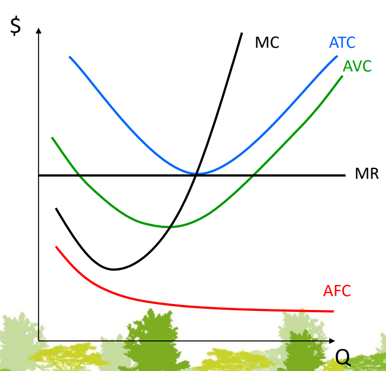
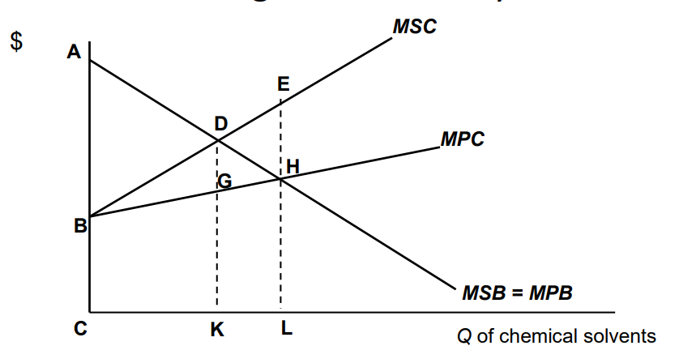

# GE1205 - Green Economics

## 1. Economics and Environment

### Definition of Economics from Environmental Perspective

- **Scarcity** - resources are limited and cannot satisfy all human wants
- **Economics** (of Individual) - the study of making choices to attain goals with limited resources
- **Economics of Society** - the study of how society manages and allocates its scarce resources
- Contradiction of Economics and Environment: Economy drains the resources of the environment
- Assumption of Human Nature: Humans are rational and respond to **econimic incentives** (= rewards and punishments)
- Logic of choice making: Scarcity -> Choice -> Opportunity Cost (= highest of the forgone alternatives)

Case Study:

>  Suppose that an air conditioner producer is deciding whether to use banned CFC-11 as the freezer or not.  
> 1. What is the opportunity cost in using more environmentally friendly alternative than CFC-11 as the freezer?  
> 2. Although it is well-known than CFC-11 is harmful to ozone, why some producers still use it?

> 1. The opportunity cost is the difference in cost and performance between the two alternatives. By using the alternative, the producer will have to incur higher costs or lower customer satisfaction. The opportunity cost can be measured by the amount of money or utility that the producer will give up by using the alternative.  
> 2. They face a trade-off between private benefits and social cost of ozone depletion. The private benefits of using CFC-11 is higher product competitiveness and lower cost. The social cost is the harm to the environment and the health of the public. However the cost is not fully borne by the producer, but by the society as a whole. This is an example of **market failure caused by a negative externality**.

### Model of Economics Activity and Environment

#### Circular Flow Model

- Two parties:
    - **Firms** - hire factors of production, produce goods and services
    - **Households** - supply factors of production, consume goods and services
- Two flows:
    - **Real Flow** - factors of production, goods and services
    - **Money Flow** - income, expenditure
- **Factors of production** - land, labour, capital, entrepreneurship (factors determine the production capacity of the economy)
- **Factor Payment** - rent, wages, interest, profit (factor payment is the income of households)
- Two markets:
    - **Product Market** - firms -> goods and services -> households
    - **Factor Market** - households -> factors of production -> firms

Issues of the Circular Flow Model: It does not consider the environment, and assumes that the resources are unlimited.

#### Materials Balance Model

- Links between economic activity and environment:
    - Flow of resources **from environment to economy** (use of resources)
    - Flow of residuals **from economy to environment** (pollution, waste)

### Environmental Damage

#### Causes of Pollution

- **Natural pollutants** - volcanic eruptions, forest fires, dust storms
- **Anthropogenic pollutants** - human activities

#### Sources of Pollution

- Mobility:
    - **Stationary** - power plants, factories, incinerators
    - **Mobile** - cars, trucks, ships, airplanes
- Identifiability:
    - **Point** - smokestacks, exhaust pipes
    - **Non-point** - agricultural fields, urban runoff (cannot accurately identify the source of pollution in a board area)

#### Scope of Pollution

- **Local** - air pollution, solid waste
- **Regional** - acid rain, oil spills
- **Global** - ozone depletion, global warming

### Environmental Objectives

- **Environmental Quality** - the state of the environment
    - It is impossible to achieve zero pollution
    - A rational perception: A reduction in man-made contamination to a level that is acceptable to the society
- **Susutainable Development** - manage earth's resources, ensure their long-term **quality** and **abundance** for future generations
    - serves as an intertemporal trade-off; other economical trade-offs are immediate
- **Biodiversity**: Variety of species

### Approaches to Environmental Economical Issues

#### Government Policy Approaches

- **Command-and-Control** - gov regulate polluters by setting rules
- **Market Approach** - gov provide incentives for polluters to reduce pollution
    - use **taxes and subsidies** to encourage conservation & reduce pollution
    - **polluter-pay principle**

Exercises:

> Identify the government approach of the following policies  
> 1. 50 cents on plastic bag (Market Approach)  
> 2. Law on Turning off the car engine when it stops (Command-and-Control)  
> 3. Banning the import of products containing CFC-11 (Command-and-Control)  
> 4. Educating people to recycle solid waste (Non-economic Approach)

#### Policy Time Horizon

- **Management** Strategies - short-term, fixing the problem, **Linear Flow Approach**
- **Pollution Prevention** - long-term, preventing the problem, **Circular Flow Approach**

Pollution Prevention reduce or eliminate wastes or residuals at **source**, shift from end-of-pipe treatment to **front-end reduction**, and achieve **Sustainable Development**.

##### Linear (Open) Flow Approach

Pollution can be anywhere instead of just at the end of the process.

But in Linear Flow Approach, waste is just handled at the end of the process.

##### Circular (Closed) Flow Approach

- **Reduce** - improve design & process -> reduce energy & material use
- **Reuse** - use product again to reduce manufacturing
- **Recycle** - residual waste serve as raw material

Waste can be used for (1) safe landfill, incineration, or composting, (2) recycling as raw material

### Growth and Environment

- Traditional view on growth: all economic growth is good
    - did reduce world poverty
    - actually a trade-off between growth and environment
- Sustainable development
    - Premise: Economic growth and environmental protection are compatible
- Relationship of growth and environment
    - $\text {EI} = \frac{\text{I}}{\text{POP}} \times \frac{\text{EI}}{\text{I}}\times \text{P}$
    - by differentiating, $\Delta\text{EI}\%= \frac{\Delta\text{I}\%}{\text{POP}}+\frac{\Delta\text{EI}\%}{\text{I}}+\Delta\text{POP}\%$
    - EI = Environmental Impact, I = Income per capita, POP = Population

Case Study:

> Income per capita grows by 2% and population grows by 1.7%. What effort is needed to sustain the environmental impact at the same level?

$0\%=\frac{2\%}{101.7\%}+\frac{\Delta\text{EI}\%}{102\%}+1.7\%$

$\Delta\text{EI}\% = -3.7\%$

### Environmental Kuznets Curve

- x-axis: income per capita, y-axis: pollution
- **Inverted U-shape**
    - early industrialization: pollution increases with income
    - more developed stage: pollution decreases with income
- 3 parts of KFC theory: scale, composition, technique
    - if as economic grows, all activities **scale** proportionally, then pollution increases with income
    - if **composition** of goods and services changes, then pollution may increase or decrease with income
    - in rich countries, less pollution intensive **techniques** are used, so pollution decreases with income
- Pessimistic view: EKC will not turn down
- Optimistic view: EKC curve is dropping and shifting to the left, because of more regulations, advanced technology, and increased public awareness

## 2. Demand and Supply Analysis

### Terminology

Case Study:

> How does global warming affect grain demand and supply?

> Global warming -> higher temperature causes dehydration -> lower grain supply -> higher grain price -> lower grain demand  
> In fact, grain demand is still increasing because of the increase in population, demands for meat, and biofuel

- **Demand: people's willingness and ability to buy a good or service**
- Demand is the maximum amount of a good or service that people are willing and able to buy at a given price over a given period of time
- **Supply: people's willingness and ability to sell a good or service**

### Demand function

$Q_x^d = f(P_x, P_y, M, ...)$

- $Q_x^d$ = quantity demanded of good x
- $P_x$ = price of good x
- $P_y$ = price of related good y (substitute or complement)
- $M$ = income (normal or inferior good)
- ... = other factors

$Q_x^d - P_x$ curve has a **negative slope**

The following theorems are based on the assumption that all other factors are constant:

#### Law of Demand

$Q_x^d$ decreases as $P_x$ increases

In the $Q_x^d - P_x$ graph, **a downward movement along the curve** (=decrease) as $P_x$ increases

#### Substitution Effect

For substitute goods $y$ and $x$, $Q_x^d$ increases as $P_y$ increases

More people choose $x$ over $y$ as $P_y$ increases

In the $Q_x^d - P_x$ graph, **the curve shifts rightward** (=increase) as $P_y$ increases

#### Complementary Effect

For complementary goods $y$ and $x$, $Q_x^d$ decreases as $P_y$ increases

More people choose not to buy $x$ as they cannot buy $y$

In the $Q_x^d - P_x$ graph, **the curve shifts leftward** (=decrease) as $P_y$ increases

#### Income Effect

- **Normal good**: $Q_x^d$ increases as $M$ increases
- **Inferior good**: 
    - Serves as a cheaper substitute for normal goods, $Q_x^d$ decreases as $M$ increases
    - Examples of inferior goods: instant noodles, second-hand goods, long-distance bus

#### Other Factors

- **Taste and preference**: $Q_x^d$ increases as people become more interested in $x$
- **Population**: $Q_x^d$ increases as population increases
- **Customer expectation**: 
    - $Q_x^d$ increases as people expect the price of $x$ to increase in the future, people are likely to buy more now
    - Examples: to-be-banned products (expect the price to increase after the ban), seasonal outfits (expect the price to decrease after the season)

Exercises:

> 1. A drop in the price of electric cars shift the demand curve for gasoline car leftward. From that you know electric cars and gasoline cars are (substitute goods).  
> 2. People come to expect that the price of vegetables will rise next week. As a result, (today's demand for vegetables will increase).  
> 3. If income decreases or the price of a complement rises, (the demand curve for a normal good shifts leftward).  
> 4. Suppose the demand for X is given by Qx = 100 - 2PX + 4PY + 10M + 2A, where PX represents the price of good X, PY is the price of good Y, M is income and A is the amount of advertising on good X. Based on this information, we know that good Y is (a substitute for good X).

### Supply function

$Q_x^s = f(P_x, P_r, W, ...)$

- $Q_x^s$ = quantity supplied of good x
- $P_x$ = price of good x
- $P_r$ = price of a production substitute
- $W$ = input price (e.g. wage)
- ... = other factors

$P_x - Q_x^s$ curve has a **positive slope**. Note $P_x$ is on y-axis, $Q_x^s$ is on x-axis.

The following theorems are based on the assumption that all other factors are constant:

#### Law of Supply

$Q_x^s$ increases as $P_x$ increases

In the $P_x - Q_x^s$ graph, **an upward movement along the curve** (=increase) as $P_x$ increases

#### Substitution Effect

For substitute goods $r$ and $x$, $Q_x^s$ increases as $P_r$ increases (people prefer to buy $x$ instead of $r$)

In the $P_x - Q_x^s$ graph, **the curve shifts rightward** (=increase) as $P_r$ increases

#### Cost Effect

- **Input price** (Production cost): $Q_x^s$ decreases as input price increases, **the curve shifts leftward** (=decrease)
- **Technology**: $Q_x^s$ increases as technology improves, **the curve shifts rightward** (=increase)
- **Number of firms**: $Q_x^s$ increases as the number of competitors increases, **the curve shifts rightward** (=increase)

#### Other Factors

- **Producer expectation**:
    - $Q_x^s$ decreases as producers expect the price of $x$ to increase in the future
    - not because they produce less, but they sell less and store more for future profit
    - $Q_x^s$ increases as producers expect the price of $x$ to decrease in the future, they will sell more at a profitable price now

### Market Equilibrium

- $Q_x^d$ decreases as $P_x$ increases, $Q_x^s$ increases as $P_x$ increases
- $Q_x^d = Q_x^s$, at a price $P_x^*$ that balances the demand and supply
- If $P_x < P_x^*$, $Q_x^d > Q_x^s$, demand exceeds supply, **shortage**
- If $P_x > P_x^*$, $Q_x^d < Q_x^s$, supply exceeds demand, **surplus**
- There is a natural tendency for the price to move towards $P_x^*$

#### Price Control

- **Price ceiling**: maximum price set by the government
    - below $P_x^*$, shortage
    - above $P_x^*$, no effect
    - examples: rent control
- **Price floor**: minimum price set by the government
    - above $P_x^*$, surplus
    - below $P_x^*$, no effect
    - examples: minimum wage

Exercise:

> 1. Suppose the equilibrium price of bottled water has risen from \$1.00 per bottle to \$2.00 per bottle and the equilibrium quantity has increased. These changes are a result of a (rightward shift of the demand curve).  
> 2. When both the market supply and demand shift right at the same time, the equilibrium price (may rise, fall, or remain unchanged) and the equilibrium quantity (will rise).  
> 3. An effective minimum wage is a price (floor) that (decreses) the quantity of low-skilled labor demanded by firms.

When a minimum wage is set above free-market equilibrium, the labour supply exceeds the labour demand, resulting in unemployment.

This analysis is based on conventional economics. However, in reality, the labour market is not a free market. Reference: [HK Gov Minimum Wage](https://www.edb.gov.hk/attachment/tc/curriculum-development/kla/pshe/references-and-resources/economics/2_Minimum_wage.pdf).

Case Study:

> [HK Statutory Minimum Wage Coverage](https://www.labour.gov.hk/chs/faq/smw_coverage.htm)
> 1. Does SMW cover hourly-rated workers only?   
> 2. Does SMW apply to student interns?  
> 3. Does SMW apply to employees with disabilities? If so, would SMW hurt their employment opportunities?

> 1. No, it covers all employees who sign a contract of employment with an employer, regardless of whether they are employed on an hourly-rated, daily-rated, monthly-rated, piece-rated, permanent, casual, full-time, part-time or temporary basis. (The contract requires at least 4 weeks of employment with at least 18 hours of work per week.)  
> 2. No, it does not apply to student interns. Student interns are also limited to at most 30 hours of work per week.  
> 3. Yes, it applies to employees with disabilities. However, the government provides a subsidy to employers who hire employees with disabilities. The subsidy is equal to 75% of the SMW rate. Therefore, the effective minimum wage for employees with disabilities is 25% of the SMW rate. This is to encourage employers to hire employees with disabilities.

Case Study:

> In 2020, due to the outbreak of COVID-19, the price of oil collapsed. The worst time is April 20, 2020. The contract future price of oil plummeted from US\$18 to –US\$37.  
> 1. Why did oil price plummet in 2020? What is the impact of oil price plummet on the demand for biofuel?  
> 2. Changes in market conditions cause different environmental impacts. Think about, what is the impact of oil price’s decline on the environment.  
> 3. Although the demand for biofuel decreases, the price of corns surge in 2020. Can you think of some factors that cause the change?

> 1. The outbreak of COVID-19 caused a global economic recession. The demand for oil plummeted because of the decrease in demand for transportation. This is among other factors determining the demand. The demand curve shifts leftward, resulting in a decrease in equilibrium quantity and price. The demand for biofuel decreases because biofuel is a substitute for oil and oil is cheaper.  
> 2. Oil users will use more oil because of the lower price. Oil producers will face a surplus and have to reduce production and forfeit some of the oil (including oil spills into the ocean). This results in an increase in oil pollution.  
> 3. The demand for corns increases because corns are also used as human food and animal feed, whose demand increases sharply during the pandemic. This is among other factors determining the demand. The demand curve shifts rightward, resulting in an increase in equilibrium quantity and price.

## 3. Producer Theory

### Global Energy Consumption

Categories of energy sources:

- **Fossil Fuels**: coal, oil, natural gas
- **Low-carbon energy**:
    - **Renewable energy**: solar, wind, hydro, geothermal, biomass
    - **Non-renewable energy**: nuclear

Trend:

- 1/3 of world electricity is generated by low-carbon energy
- 1/5 of world energy is generated by low-carbon energy
- Leading energy source: oil (worldwide), coal (China), natural gas (US)

### Production Function

$$
Q = A \times f(L, K, ...)
$$

- $Q$ = output
- $A$ = technology (determines base productivity)
- $L$ = labour
- $K$ = capital (machinery, equipment)
- ... = other factors

- **Marginal Product of Labour (MPL)**: $MP_L = \frac{\Delta Q}{\Delta L}$
    - The output produced by **one additional worker**
    - Slope of the short-run production function
- **Marginal Product of Capital (MPK)**: $MP_K = \frac{\Delta Q}{\Delta K}$
    - The output produced by **one additional unit of capital**
    - Slope of the short-run production function, if capital is allowed to vary

**law of diminishing marginal product** - increase in productivity will first increase and then decrease as more labour is added

- **Average Product of Labour (APL)**: $AP_L = \frac{Q}{L}$
- **Average Product of Capital (APK)**: $AP_K = \frac{Q}{K}$

- If MP > AP, AP is increasing
- If MP < AP, AP is decreasing
- If MP = AP, AP is at maximum
- AP always peaks after MP

Stages of MPL / APL curve:

- MPL > APL, MPL increases, APL increases (Increasing Marginal Returns)
- MPL > APL, MPL decreases, APL increases (Decreasing Marginal Returns)
- MPL < APL, MPL decreases, APL decreases (Decreasing Marginal Returns)
- MPL < 0, APL decreases (Negative Marginal Returns)

### Q-L-K Diagram and Isoquant Curve

$TP-L$ and $TP-K$ curves are the same as $Q-L$ and $Q-K$ curves. 

They are sigmoid-shaped, always increasing, but increasing rate changes in slow-fast-slow pattern.

$TP-L$ curve is shifted upward when $K$ increases. Same for $TP-K$ curve.

**Isoquant curve** (等产量曲线):
- curve of all combinations of $L$ and $K$ that produce the **same output** $Q$ (at same technology $A$)
- Derived from 3D diagram of $Q = A \times f(L, K)$
- Negative slope, inverse relationship between $L$ and $K$
- Shift upward when output $Q$ increases
- Shift downward when technology $A$ increases
- Let $L$ be x-axis, $K$ be y-axis, slope is defined as **Marginal Rate of Technical Substitution (MRTS)**
- $MRTS = -\frac{\Delta K}{\Delta L} = \frac{MP_L}{MP_K}$ (defined positive)
- MRTS is **how many units of capital can be saved by hiring one unit of labour** without changing output
- MRTS decreases as $L$ increases, because of diminishing marginal product of labour

### Isocost Curve

**Isocost curve** (等成本曲线):
- curve of all combinations of $L$ and $K$ that cost the **same amount of money** $C$ (at same wage $w$ and rental rate $r$)
- $wL + rK = C \Rightarrow K = -\frac w r L + \frac C r$
- absolute value of slope is $\frac w r$, **relative price of labour compared to capital**
- the slope is **if you hire one more unit of labour, how many units of capital it costs** (at market price)
- Example: if wage is w=\$100 per day per worker, rental rate is r=\$200 per day per machine, then the slope is $\frac {100} {200} = \frac 1 2$. If you hire 1 more worker, you have to give up 0.5 machine.
- Intersects with $L$-axis at $\frac C w$, $K$-axis at $\frac C r$
- Shift upward when $C$ increases
- Rotate downward when $w$ or $r$ increases (rotate: one end fixed, the other end moves)

Case Study:

> Suppose a Power plant use Labor (L) and Capital (K) to generate Q level of electricity.  
> Wage is \$100 per day per worker, rental rate is \$200 per day per machine. The total production cost is \$2,400 per day.  
> 1. Write down the equation of the isocost curve.  
> 2. Suppose a labor shortage, the wage increases to \$200 per day per worker. How does the isocost curve change?  
> 3. Suppose a technological improvement, the rental rate decreases to \$50 per day per machine. How does the isocost curve change?  

> 1. $100L + 200K = 2400 \Rightarrow K = -\frac 1 2 L + 12$  
> 2. $200L + 200K = 2400 \Rightarrow K = -L + 12$. The curve rotates downward, and becomes steeper (slope increases).  
> 3. $100L + 50K = 2400 \Rightarrow K = -2L + 48$. The curve rotates upward, and becomes flatter (slope decreases).

### Cost Minimization

- Assume the desired output is a given level $Q$.
- When you hire 1 more unit of labour,
    - based on Isoquant curve, the cost decreases because $MRTS$ unit of capital is saved
    - based on Isocost curve, the cost increases because $\frac w r$ unit of capital is used to pay for the labour
    - **when cost decrements = cost increments, the cost is minimized**
    - amount of capital saved = market price of labour (in terms of capital)
- draw both Isoquant K-L curve (at output $Q$) and Isocost K-L curve (at cost $C$) in the same diagram
- They intersect at the **cost-minimizing point** (at $L^*$ and $K^*$)
- $MRTS = \frac{MP_L}{MP_K} = \frac w r$
- $\frac w r$ is a constant when moving along the Isocost curve, but $MRTS$ decreases as $L$ increases when moving along the Isoquant curve. So when $\frac w r < MRTS$, hiring more labour can minimize cost; when $\frac w r > MRTS$, using more machines can minimize cost.

Exercises:

> 1. If the price of labor increases and we are looking at a graph with capital on the vertical axis and labor on the horizontal, the (isocost line will become steeper).  
> 2. For given input prices, isocost lines farther from the origin are associated with (higher costs).  
> 3. If the price of labor increases, in order to minimize the costs of producing a given level of output, the firm manager should use (less labor and more capital).

## 4. Cost Theory

### Types of Short-run Cost

| Term | Abbr. | Definition |
| ---- | ----- | ---------- |
| Total Cost | TC | $TC = TFC + TVC$ |
| Total Fixed Cost | TFC | $TFC = rK$ |
| Total Variable Cost | TVC | $TVC(L) = wL$ |
| Average Cost | AC | $AC = \frac{TC}{Q}$ |
| Average Fixed Cost | AFC | $AFC = \frac{TFC}{Q}$ |
| Average Variable Cost | AVC | $AVC = \frac{TVC}{Q}$ |
| Marginal Cost | MC | $MC = \frac{\Delta TC}{\Delta Q}= \frac{\Delta TVC}{\Delta Q}$ |

### Short-run Cost Curves

1. Draw a $TP-L$ (total product vs. labour) curve. It grows in a slow-fast-slow pattern.
2. Mirror it from the $TP$ axis to get a $TP-TVC$ curve. It is always increasing.
3. Let 3 points on $TP-L$ curve be $(L_1, Q_1), (L_2, Q_2), (L_3, Q_3)$.
4. The $TP-TVC$ curve would go through $(wL_1, Q_1), (wL_2, Q_2), (wL_3, Q_3)$.

Now rotates the image to get $TVC-TP$ curve. It is always increasing, in a fast-slow-fast pattern.

When wage $w$ increases, the $TVC-TP$ curve rotates upward, and becomes steeper (slope increases).

i.e. the same amount of output $Q$ requires more TVC$=wL$, because $L$ does not increase but $w$ increases.

Now further move up the $TVC-TP$ curve by a fixed amount $TFC=rK$ to get $TC-TP$ curve.

$TC=C(Q)=TVC(Q)+TFC=wL+rK$

#### Arthmetic of Cost Curves

- Average Total Cost (ATC): $ATC = \frac{TC}{Q} = \frac{wL+rK}{Q} = \frac{w}{AP_L} + \frac{r}{AP_K} = AVC + AFC$
- Average Variable Cost (AVC): $AVC = \frac{TVC}{Q} = \frac{wL}{Q} = \frac{w}{AP_L}$
- Average Fixed Cost (AFC): $AFC = \frac{TFC}{Q} = \frac{rK}{Q} = \frac{r}{AP_K}$
- Marginal Cost (MC): $MC = \frac{\Delta TC}{\Delta Q} = \frac{\Delta TVC}{\Delta Q} = \frac{w}{MP_L}$

In the case above, since TC grows in a fast-slow-fast pattern,

- ATC first decreases and then increases
- AVC first decreases and then increases
- MC first decreases and then increases
- AFC always decreases
- The quantity for minimum ATC, AVC and MC: $Q_{\min MC} < Q_{\min AVC} < Q_{\min ATC}$

Explanation:

- MC increases as long as marginal product decreases (= diminishing marginal returns stage)
- AVC increases when MC > AVC, since MC < AVC in earlier stage, AVC keeps decreasing until MC = AVC
- ATC = AVC + AFC, so ATC will increases last, when AFC decrease slower than AVC increase

Choose a point on ATC, AVC or AFC curve, the rectangle area between the point, $O$, and two axes is the cost. i.e. $AC \times Q = TC$.

Exercises:

Given that

| Q | TVC | TC |
| - | --- | -- |
| 0 | 0 | 300 |
| 100 | 400 | |
| 200 | 1000 | |
| 300 | 1800 | |
| 400 | 2800 | |

Complete the table.

| Q | TVC | TFC | TC | AFC | AVC | ATC | MC |
| - | --- | --- | -- | --- | --- | --- | -- |
| 0 | 0 | 300 | 300 | - | - | - | - |
| 100 | 400 | 300 | 700 | 300/100=3 | 400/100=4 | 700/100=7 | 400/100=4 |
| 200 | 1000 | 300 | 1300 | 300/200=1.5 | 1000/200=5 | 1300/200=6.5 | 600/100=6 |
| 300 | 1800 | 300 | 2100 | 300/300=1 | 1800/300=6 | 2100/300=7 | 800/100=8 |
| 400 | 2800 | 300 | 3100 | 300/400=0.75 | 2800/400=7 | 3100/400=7.75 | 1000/100=10 |

Diminishing marginal returns occurs after $Q=100$.

ATC reaches minimum at $Q=200$, $ATC=6.5$.

## 5. Perfect Competition

### Perfect Competition

Assumptions:

- Many buyers and sellers (i.e. monopoly and monopsony are not possible)
- Homogeneous (identical) products
- Perfect information on both sides
- No information costs
- Free entry and exit

Example: feed-in tariff

households and businesses can sell surplus electricity generated by solar panels to the power grid at a fixed price

Implications:

- Individual firms can only sell at the market price (they have no market power)
- In short run, firms may make profit or loss
- In long run, firms make zero economic profit because of free entry and exit

### Market Demand and Individual Firm's Demand

- Given market equilibrium price $P^*$ when market demand $D$ = market supply $S$
- Individual firm's demand is **perfectly elastic** at $P^*$, because it can sell any amount at $P^*$
- It cannot set higher price, because it will lose all customers
- It cannot set lower price, because it will lose all profit
- Market Price = **Marginal Revenue** = $\frac{\Delta TR}{\Delta Q}$ (TR - Total Revenue)

### Output Decision

Assuming price is fixed, i.e. Marginal Revenue = Price

- Economic Profit = $TR - TC = (P^* - ATC) \times Q$
- $\frac{\Delta TR}{\Delta Q} = P^* = MR$
- $\frac{\Delta TC}{\Delta Q} = MC$
- When $MC = MR$, profit is maximized
- Area of the rectangle = profit (rectangle area below P=MR line and above ATC line)
- Rectangle $(ATC-AVC) \times Q$ = TFC (because $ATC-AVC=AFC$)

#### Shutdown Decision

When market price decreases to $P'$, the firm will make loss.

Profit = $TR - TC = (P' - ATC) \times Q < 0$ (rectangle area above P=MR line and below ATC line)

- If $P' < AVC_{\min}$, the firm will shut down (loss is larger than TFC)
- If $P' \geq AVC_{\min}$, the firm will continue to operate (loss is smaller than TFC)
- Reason: Because of contract, the firm has to pay TFC in a short run even if it shuts down. So if they suffer loss smaller than TFC, continuing to operate reduces loss.
- Price for min AVC = intersection of $AVC$ and $MC$ curves

Exercises:

1. When demand $P_1=\$30$, how much profit does the firm make?

When $MC=P_1$, $Q=80$, $ATC=\$20$, profit = $(P_1-ATC) \times Q = (30-20) \times 80 = \$800$

2. When demand $P_2=\$15$, how much profit does the firm make?

When $MC=P_2$, $Q=60$, $ATC=\$16$, profit = $(P_2-ATC) \times Q = (15-16) \times 60 = -\$60$, i.e. loss of \$60

3. When demand $P_3=\$10$, should the firm shut down?

When $MC=P_3$, $Q=45$, $ATC=\$20$, profit = $(P_3-ATC) \times Q = (10-20) \times 45 = -\$450$, i.e. loss of \$450

When $Q=60$, $ATC=\$16$, $AVC=\$12$, TFC = $(ATC-AVC) \times Q = (16-12) \times 60 = \$240$

Loss > TFC, so the firm should shut down.

On the other hand, we know $P_3 < AVC_{\min} = \$11$, so the firm should shut down.

### Market Supply Curve

- Each individual firm's supply grows as price increases
- Market supply = sum of all individual firms' supply at specific price

Exercises:

Suppose you are the manager of a watchmaking firm operating in a competitive market. The total cost is $C(Q) = 200 + 2Q^2$. The market price is $P = \$100$.

1. The marginal cost is $MC = \frac{\Delta C}{\Delta Q} = 4Q$.

2. What is the profit-maximizing output level?

When $MC = MR = P$, $4Q = 100$, $Q = 25$.

3. What will the profit level be?

When $Q = 25$, $TR = P \times Q = 100 \times 25 = \$2500$, $TC = 200 + 2Q^2 = 200 + 2 \times 25^2 = \$1450$, profit = $TR - TC = \$1050$.

4. If there are $10$ identical firms in the market, what is the market supply curve?

When $P = P_0$, $MC = 4Q = P_0$, $Q = \frac{P_0}{4}$, $Q_{\text{market}} = 10 \times \frac{P_0}{4} = \frac{5}{2} P_0$.

### Long-run Competitive Equilibrium

- $P=MR=MC$
- $P=ATC_{\min}$
- Total economic profit = $0$
- Earning = opportunity cost = normal profit

### Efficiency of Perfect Competition

- **Allocative efficiency**: $P=MC$ - additional benefit of producing one more unit of output is equal to the additional cost
- **Cost efficiency**: $P=ATC_{\min}$ - least amount of resources are used to produce a given amount of output

Denote $MB$ = marginal society benefit = $C \times \text{Demand}$, $MC$ = marginal society cost = $C \times \text{Supply}$

Denote $Q_E$ = equilibrium quantity

At **market level**:

- When MB > MC, demand > supply, **underproduction**, $Q < Q_E$
- When MB < MC, demand < supply, **overproduction**, $Q > Q_E$
- When MB = MC, demand = supply, **allocative efficiency**, $Q = Q_E$

At **individual firm level**:

- MC keeps increasing with $Q$
- MB is a horizontal line
- When $Q < Q_E$, MB > MC, **underproduction**, the firm can increase profit by producing more
- When $Q > Q_E$, MB < MC, **overproduction**, the firm can increase profit by producing less
- When $Q = Q_E$, MB = MC, **allocative efficiency**

### Consumer Surplus and Producer Surplus

Consumer Surplus = Area above market price and below demand curve = $\frac 12$ (max price - market price) $\times$ quantity

Producer Surplus = Area below market price and above supply curve = $\frac 12$ (market price - min price) $\times$ quantity

#### Price Floor

| | Previous Surplus | New Surplus | Change |
| :-: | :-: | :-: | :-: |
| Consumer | A+B+C | A | -B-C |
| Producer | D+E+F | B+D+E | +B-F |

#### Price Ceiling

| | Previous Surplus | New Surplus | Change |
| :-: | :-: | :-: | :-: |
| Consumer | A+B+C | A+B+D | +D-C |
| Producer | D+E+F | E | -D-F |

#### Tax

| | Previous Surplus | New Surplus | Change |
| :-: | :-: | :-: | :-: |
| Consumer | A+B+C | A | -B-C |
| Producer | D+E+F | E | -D-F |
| Government | 0 | B+D | +B+D |

Social welfare decreases by $C+F$. This is called **deadweight loss**.

This is caused by reduction in production and consumption.

## 6. Externalities

- Environmental problems are **market failures**
- if the goods is defined as **environmental goods**, then source of market failure = **public goods**
- if the goods is defined as **good generates pollution**, then source of market failure = **externalities**

### Terminology

**Market failure**: market does not allocate resources efficiently, resulting in **deadweight loss**.

Possible reasons:

- Market power (monopoly, monopsony)
- Externalities
- Public goods (i.e. environment is not private property)

In perfect competition, there is no market power. So the reason is externalities.

**Externality**: an market transaction's side-effect on a 3rd party who is not involved in the transaction. Externalities can be positive or negative (benefit or cost).

Polution is a negative externality. e.g. Air transport generates noise pollution at nearby residents which are unrelated to the transaction. Costs are absorbed by the residents, but not the airline.

### Model of Externalities

#### Negative Externality

- **Marginal Private Cost (MPC)**: cost to the producer = Marginal Cost (MC)
- **Marginal External Cost (MEC)**: cost to the 3rd party
- **Marginal Social Cost (MSC)**: MPC + MEC

Taking MEC into consideration, the supply curve shifts upward. Total cost at same quantity increases.

Calculate the efficient balance point based on MB = MSC, and compare to the original balance point based on MB = MC:

- **Efficient Quantity < Equilibrium Quantity**
- **Efficient Price > Equilibrium Price**

Considering MEC, producers have to sell less products at higher price.

**Deadweight loss is eliminated**. Though the production is reduced, the external cost is reduced more, so the net social welfare increases.

| | Previous Net Benefit | New Net Benefit | Change |
| :-: | :-: | :-: | :-: |
| Consumer | CS1+CS2+CS3 | CS1 | -CS2-CS3 |
| Producer | PS1+PS2 | PS1+CS2 | +CS2-PS2 |
| Paid Externality | 0 | CS3+PS2 | +CS3+PS2 |
| DWL | -DWL | 0 | DWL |

Total social welfare increases by DWL.

The parallelogram area is **externality cost**, equal to the decrease in $\sum$ MEC.

Example: Chemical factory and water pollution

1. Production = L, pollution damage = $\Delta BEH$
2. Production = K, pollution damage = $\Delta BDG$
3. Production = L -> K, net social welfare = $\text{DWL}=\Delta DEH$

Example:

> Supply $P=10+0.075Q$, Demand $P=42-0.125Q$  
> Competitive equilibrium: $P=MC=10+0.075Q=42-0.125Q$, $Q=160, P=22$  
> Now consider MEC=$0.05Q$  
> Efficient equilibrium: $P=MSC=10+0.125Q=42-0.125Q$, $Q=128, P=26$

#### Positive Externality

- **Marginal Private Benefit (MPB)**: benefit to the consumer = Marginal Benefit (MB)
- **Marginal External Benefit (MEB)**: benefit to the 3rd party
- **Marginal Social Benefit (MSB)**: MPB + MEB

- **Efficient Quantity > Equilibrium Quantity**
- **Efficient Price > Equilibrium Price**

Considering MEB, consumers can buy more products at higher price.

This solves the issue of **under-consumption**. Deadweight loss is eliminated.

### Solutions to Externalities

#### Command-and-control Approach

Government sets rules to regulate polluters' activities. e.g. emission standards.

- **Technology-based standard**: force polluters to use certain technology
- **Performance-based standard**: force polluters to limit pollution to a certain level

Under Performance-based standard, producers change their production process to reduce pollution, as well as limit production to $Q_{\text{efficient}}$.

However, there are some problems:

- Hard to set the standard
- Asymmetry in firm's cost structure: Given the same Uniform Standard, some firms need to pay higher abatement cost than others. Therefore production cost is not minimized for the whole industry.

**Aggregate Abatement Standard** (AST): set a total amount of pollution abatement that the whole industry needs to achieve.

**Uniform Emission Standard**: evenly distribute AST to each firm.

Scenario: 2 firms, both generating 10 units of pollution

Firm 1: Marginal Abatement Cost (MAC) = $2.5A_1$, Total Abatement Cost (TAC) = $1.25A_1^2$

Firm 2: MAC = $\frac{5}{8}A_2$, TAC = $\frac{5}{16}A_2^2$

Under Uniform Emission Standard, if government requires both firms to reduce pollution by 5 units, then

Firm 1: TAC = $\$31.25$, Firm 2: TAC = $\$9.375$. Total TAC = $\$40.625$

However, we can achive the same result with lower cost by **Equimarginal Principle of Optimality**.

Requires two firms to reduce pollution by a total of 10 units, then the cost is minimized when $MAC_1 = MAC_2$.

Solution: $A_1=2, A_2=8$, $TAC_1 =\$5$, $TAC_2 = \$20$. Total TAC = $\$25$.

Draw a $MAC_1 / MAC_2 - A_1 / A_2$ diagram, the efficient solution is the intersection of the two MAC curves.

#### Market Approach

Use taxes and subsidies to change market equilibrium, encourage conservation and discourage pollution.

Pollution is charged to **internalize the externality** - i.e. let polluters bear the cost of pollution.

Government can set a **Pigouvian tax** (tax to correct market failure) on goods or charge an emission fee on pollution.

In this way, CS and PS decrease, but government revenue increases.

Social benefit > Social cost, so social welfare increases. Deadweight loss is eliminated.

Suppose MB and MSC intersect at $Q_{\text{efficient}}$, $P_{\text{efficient}}$.

Pigouvian tax = shifts MPC upward by the amount of tax, so that MSC = MPC + tax at $Q_{\text{efficient}}$.

If $Q < Q_{\text{efficient}}$, MPC + tax > MSC, so producers will increase production.

If $Q > Q_{\text{efficient}}$, MPC + tax < MSC, so producers will decrease production.

Scenario: 2 firms, both generating 10 units of pollution

**Firm choose to either abate or pay tax, whichever is cheaper.**

Firm 1: MAC = $2.5A_1$, TAC = $1.25A_1^2$

Firm 2: MAC = $\frac{5}{8}A_2$, TAC = $\frac{5}{16}A_2^2$

Marginal Tax (MT) = $\$5$

To minimize total TAC, let $MAC_1 = MT, MAC_2 = MT$, i.e. $A_1 = 2, A_2 = 8$.

For firm 1:

- For the 1st unit of pollution, tax = $5$, Abatement Cost (AC) = $2.5$, abate is cheaper
- For the 2nd unit of pollution, tax = $5$, AC = $5$
- For the 3rd unit of pollution, tax = $5$, AC = $7.5$, tax is cheaper

Therefore, firm 1 will abate 2 units of pollution and pay tax for the rest.

Similiarly, firm 2 will abate 8 units of pollution and pay tax for the rest.

A correctly set Pigouvian tax can achieve the same result as the command-and-control approach.

However, some problems still exist:

- Monitoring cost: government needs to monitor the pollution level of each firm
- Some of the pollution is non-point or mobile source
- Use of poor-quality technology and material (e.g. coal)

## 7. Public Goods

Another type of market failure.

### Terminology

- **Excludable**: a good is excludable if it is possible to prevent people who have not paid for it from having access to it
- **Rival in consumption**: a good is rival in consumption if A's consumption decreases the amount available for B

Examples:

| | Excludable | Non-excludable |
| :-: | :-: | :-: |
| Rival | **Pure Private Goods**   Food, electricity | **Club Goods**   Cable TV, sports stadium |
| Non-rival | **Common Goods**   Fish in the ocean | **Pure Public Goods**   Biodiversity, national defense |

### Efficient Allocation of Public Goods

#### Private Goods

Market Demand = **Horizontal sum** of individual demand (= Marginal Private Benefit, MPB)

i.e. On a $P$(y-axis) vs. $Q$(x-axis) diagram, market demand at price $P$ is the sum of individual demand at price $P$.

Private goods are excludable and rival. 

Consumers A and B cannot benefit from the same unit of private goods. And they need to pay to access the goods.

Therefore $Q(P)=Q_A(P)+Q_B(P)$.

#### Public Goods

Public goods are non-excludable and non-rival.

For example, the office plans to install an air purifier in the office. Clean air is non-excludable and non-rival.

For employee A and B, they can both benefit from the air purifier. However, they have to decide the amount of money to pay for the air purifier, based on their total benefit (demand).

Here, total demand = **Vertical sum** of individual demand (MSB).

i.e. On a $P$(y-axis) vs. $Q$(x-axis) diagram, **total price** at quantity $Q$ is the sum of individual price at quantity $Q$.

$P(Q)=P_A(Q)+P_B(Q)$.

Suppose consumer B has higher demand than consumer A, i.e. $P_B(Q) > P_A(Q)$.

If A's demand is too low that it **does not intersect with market supply curve**, i.e. $P_A(Q) < MC(Q)$ for all $Q$, then A will not pay for the public good. Consumer A **free-rides** the public good, then $P(Q)$ is reduced to $P_B(Q)$.

Therefore, equilibrium quantity and price are reduced. **Deadweight loss** occurs due to under-production.

Scenario: 3 consumers willing to pay for a public good

$P_A=10-0.12Q_A$, $P_B=15-0.18Q_B$, $P_C=8.33-0.1Q_C$

Market supply $P=4+0.75Q$

1. Total private benefit $P(Q)=P_A(Q)+P_B(Q)+P_C(Q)=33.33-0.4Q$

It intersects with market supply curve at $Q=25.5$, $P=23.13$.

Therefore, social optimal equilibrium price is $P=23.13$.

2. Suppose consumer C is not willing to pay for the public good, then $P(Q)=P_A(Q)+P_B(Q)=25-0.3Q$

It intersects with market supply curve at $Q=20$, $P=19$.

Therefore, private equilibrium price is $P=19$.

#### Observation

- Externality and public goods shows that market equilibrium is not always efficient
- Underlying cause of market failure is **absence of property rights**
- **Game theory** can be used to analyze free-riding behavior

### Free-rider Problem

#### Game Theory

A game is defined by:

- Players
- Strategies
- Payoffs

Additionally, a game can be categorized as:

- **Simultaneous-move game**: players make decisions at the same time
- **Sequential-move game**: players make decisions in a sequence. Players select strategies after observing the rivals' moves.
- **One-shot game**: players play the game only once
- **Repeated game**: players play the game multiple times. Infinitely, or terminating at a certain point.

**Dominant strategy**: a strategy that is better than any other strategy regardless of what the other player does.

**Dominant strategy equilibrium**: a situation in which each player has a dominant strategy, and when each player plays his dominant strategy, the outcome is a Nash equilibrium.

**Nash equilibrium**: a pair of strategies that A's choice is optimal given B's choice, and B's choice is optimal given A's choice.

Example 1:

| X \ Y | Left | Right |
| :-: | :-: | :-: |
| Up | 2, 4 | 1, 0 |
| Down | 6, 5 | 4, 2 |

For X, Down is dominant strategy. 

For Y, Right is dominant strategy.

Nash Equilibrium is (Down, Right).

Example 2:

| X \ Y | Left | Middle | Right |
| :-: | :-: | :-: | :-: |
| Up | 0,1 | 9,0 | 2,3 |
| Straight | 5,9 | 7,3 | 1,7 |
| Down | 7,5 | 10,10 | 3,5 |

For X, Down is dominant strategy.

For Y, given that X will choose Down, Y will choose Middle.

Nash Equilibrium is (Down, Middle).

Explanation of Nash Equilibrium:

- Assume initial choice is (Up, Left)
- Given Y choose Left, X will choose Down, because (Down, Left) gives X higher payoff
- Given X choose Down, Y will choose Middle, because (Down, Middle) gives Y higher payoff
- Given Y choose Middle, X will choose Down
- X and Y won't change their choices, so (Down, Middle) is Nash Equilibrium

Example 3:

| X \ Y | Left | Middle | Right |
| :-: | :-: | :-: | :-: |
| Top | 3,1 | 2,3 | 10,2 |
| High | 4,5 | 3,0 | 6,4 |
| Low | 2,2 | 5,4 | 12,3 |
| Bottom | 5,6 | 4,5 | 9,7 |

There are no dominant strategies for both X and Y.

- Assume initial choice is (Top, Left)
- Given Y choose Left, X will choose Bottom, because (Bottom, Left) gives X higher payoff (5 > 3)
- Given X choose Bottom, Y will choose Right, because (Bottom, Right) gives Y higher payoff (7 > 6)
- Given Y choose Right, X will choose Low, because (Low, Right) gives X higher payoff (12 > 9)
- Given X choose Low, Y will choose Middle, because (Low, Middle) gives Y higher payoff (4 > 3)
- Given Y choose Middle, X will choose Low
- Nash Equilibrium is (Low, Middle)

Example 4:

| X \ Y | Left | Right |
| :-: | :-: | :-: |
| Up | 3, 1 | 4, 2 |
| Down | 5, 2 | 2, 3 |

For Y, Right is dominant strategy.

For X, given that Y will choose Right, X will choose Up.

Nash Equilibrium is (Up, Right).

Example 5:

| X \ Y | Left | Middle | Right |
| :-: | :-: | :-: | :-: |
| Up | 2,9 | 5,5 | 6,2 |
| Straight | 6,4 | 9,2 | 5,3 |
| Down | 4,3 | 2,7 | 7,1 |

There are no dominant strategies for both X and Y.

- Assume initial choice is (Up, Left)
- Given Y choose Left, X will choose Straight, because (Straight, Left) gives X higher payoff
- Given X choose Straight, Y will choose Left
- Nash Equilibrium is (Straight, Left)

**Prisoner's Dilemma**: Nash equilibrium is not Pareto optimal.

> Pareto optimal: a situation in which no individual can be made better off without making someone else worse off

Prisoner's Dilemma is a paradox in which two individuals prioritize their individual interests (according to Nash equilibrium), but the outcome is worst for both of them.

Example in Economics:

Customers A and B can choose or free-ride on a public good.

If a customer pays \$100, a net benefit of \$50 is generated (i.e. \$150 in total). The benefit is shared by all customers, regardless of whether they pay or not.

| A \ B | Pay | Free-ride |
| :-: | :-: | :-: |
| Pay | 50, 50 | -25, 75 |
| Free-ride | 75, -25 | 0, 0 |

Nash Equilibrium is (Free-ride, Free-ride).

However, if both customers pay, the total net benefit is \$100. Therefore, the outcome is not Pareto optimal.

#### Decision Tree

In Decision Tree, **the timing of the decision matters**.

Decision Tree lists all possible combinations of decisions and payoffs.

One player moves first, and the other player can adjust his strategy accordingly.

#### Carbon Emission Control

**The Paris Agreement**: a **legally binding** international treaty on climate change. 

- The goal is to cut greenhouse gas emissions to keep global temperature rise to below 2 degrees Celsius.
- Each country set their Nationally Determined Contributions (NDCs), i.e. their own targets and plans to reduce emissions.

The benefits of reducing carbon emissions is non-excludable and non-rival. Therefore, it is a public good.

Suppose country A and B each plan to reduce carbon emission using 5 units of abatement.

| A \ B | Reduce | Not reduce |
| :-: | :-: | :-: |
| Reduce | -5, -5 | -5, 0 |
| Not reduce | 0, -5 | 0, 0 |

Nash Equilibrium is (Not reduce, Not reduce), which is Pareto optimal.

However, we know that Marginal Social Cost (MSC) is not included in this game.

- **Credible threat**: A put a credible threat to B = if B acts in a certain way, A will harm B.
- **Credible promise**: A put a credible promise to B = if B acts in a certain way, A will benefit B.

Under the Paris Agreement, each country can put a credible threat to the other country, i.e. if the other country does not reduce carbon emission, the country will impose a penalty on the other country.

Suppose 10 units of penalty is imposed on the countries that do not reduce carbon emission. Then the game becomes:

| A \ B | Reduce | Not reduce |
| :-: | :-: | :-: |
| Reduce | -5, -5 | -5, -10 |
| Not reduce | -10, -5 | -10, -10 |

Nash Equilibrium is (Reduce, Reduce), which is Pareto optimal.

## 8. Private Solutions to Environmental Problems

### Property Rights

(1) Property rights

- **Property rights**: the rights of an owner to use and exchange (sell) property
- For example: tenant does not have property rights of the house (because he can't sell it), but he has the right to use the house
- Market failure for public goods is caused by the **absence of property rights**

(2) Ill-defined property rights

- Ill-defined property rights: property rights are not clearly defined, so it is hard to enforce them
- Market failure for externalities is caused by **ill-defined property rights** (for example, who to bear the cost of pollution).

(3) Common resources

- Common resources are **non-excludable** and **rival** in consumption
- In comparison, public goods are **non-excludable** and **non-rival** in consumption
- Rival in consumption involves private benefit, so common resources cause externalities

#### Tragedy of the Commons

- Only applies to **Common resources**, not public goods
- Cause: the private incentives (MPB) outweight the social incentives (MSB)
- People neglect the external cost (MEC), resulting in **over-exploitation**

Example:

Farmer Jones and Farmer Smith graze their cattle on the same field.

- If 20 cows are on the field, each cow yields \$4,000 worth of milk.
- If 30 cows are on the field, each cow yields \$3,000 worth of milk.
- If 40 cows are on the field, each cow yields \$2,200 worth of milk.
- Each cow costs \$1,000 to feed.
- They can choose to graze 10 or 20 cows each.

Payoff matrix:

| Jones \ Smith | 10 | 20 |
| :-: | :-: | :-: |
| 10 | 30K, 30K | 20K, 40K |
| 20 | 40K, 20K | 24K, 24K |

Nash Equilibrium is (20, 20). This is a Prisoner's Dilemma.

Example: 

Property developers in Hong Kong build higher and higher buildings to reduce cost. However, this cause heat island effect, blockage of sunlight and air ventilation.

### Coase Theorem

Goal: resolve market failure caused by absence of property rights (externalities)

How? Assign property right properly, to allow private negotiation (bargaining) between the parties.

Who actually holds the property right does not matter. 

Effectively, this converts externalities into internalities between individuals.

Example:

- Property developer A plans to build a 50-storey building.
- Nearby community B is concerned about the negative externalities (e.g. heat island effect, blockage of sunlight and air ventilation).

Case 1:

- the worth of "A building a 50-storey building" to A = \$100 million
- the cost of "building harms nearby community" to B = \$50 million

i.e. A is willing to pay no more than \$100 million to settle B's concern, while B is willing to accept no less than \$50 million.

Therefore, A pay B some amount between \$50 million and \$100 million, and B will not object to the building.

Case 2:

- the worth of "A building a 50-storey building" to A = \$100 million
- the cost of "building harms nearby community" to B = \$150 million

i.e. A is willing to pay no more than \$100 million to settle B's concern, while B is willing to accept no less than \$150 million. This does not work.

On the other hand, B is willing to pay no more than \$150 million to make A forgo the building, while A is willing to accept no less than \$100 million.

Therefore, B pay A some amount between \$100 million and \$150 million, and A will not build the building.

Result: **The private market achieves the efficient outcome regardless of who holds the property right.**

Numerical example:

In refined petroleum market, 

- Supply (MPC) = $P=10+0.075Q$
- Demand (MPB) = $P=42-0.125Q$
- MEC = $0.05Q$

Therefore, $MSC=10+0.125Q$, $MSB=42-0.125Q$.

Competitive Equilibrium: $MPC=MPB$, $Q=160$, $P=22$.

Efficient Equilibrium: $MSC=MSB$, $Q=128$, $P=26$.

At $Q=160$, MEC = $0.05 \times 160 = \$8$ - this is the **highest amount that the society (consumer) is willing to pay to reduce pollution**.

Marginal Profit $M\pi=MR-MC$, at $Q=160$, $M\pi=0$ (based on the definition of competitive equilibrium). - this is the **lowest amount that the firm is willing to accept to reduce pollution**.

> Marginal Revenue = Marginal Benefit = Price.  
> If tax is imposed on the firm, Marginal Revenue = Price - Tax.  
> In this example, Marginal Profit $M\pi=MR-MC=MB-MPC=32-0.20Q$.

Therefore, the bargining range at $Q=160$ is between \$8 and \$0.

At $Q=128$, MEC = $0.05 \times 128 = \$6.4$, $M\pi=26-(10+0.075 \times 128) = \$6.4$.

Therefore, the bargining range at $Q=128$ is between \$6.4 and \$6.4. - **MEC and Marginal Profit are equal at the efficient equilibrium**.

#### Abstract of Coasian Solution

- The market starts at $Q_c$ (chosen by the refinery based on MPC=MPB)
- Recreational users: willing to pay up to $MEC$ to reduce pollution
- Refinery: willing to reduce pollution if paid at least $M\pi$
- Initial state: $(P_c, Q_c), MEC > \rho > M\pi$
- Final state: $(P_e, Q_e), MEC = \rho = M\pi$

#### Advantages and Flaws of Coasian Solution

Advantages:

Reach efficient outcome without government intervention (because government intervention is costly)

Flaws:

- **clearly defined property rights**: Parties involved may not know who has the property right
- **transaction costs**: cost of bargaining, e.g. bargaining, agreement, monitoring, enforcement
- **coordination problem**: parties compete with each other
- **Measurement problem**: it is hard to measure the potential cost to each party
- **Irrational stubbornness**

### Pollution Permit Trading System

**Pollution permit trading system**: government issues tradable pollution credits or allowances, and make it legal to trade them.

- **Credits** are issued for emitting **below a standard**, i.e. bonus for reducing pollution
- **Allowances** indicate the maximum amount of pollution that can be emitted, i.e. penalty for exceeding the standard

Key components of the system:

- **Total pollution allowance is fixed** (i.e. total pollution is capped)
- **Permits are tradable** (i.e. a competitive market is formed)

Incentives:
- Polluters are encouraged to reduce pollution, so they can earn profit by selling the spare permits
- It **lowers the total abatement cost**
- If the permit price < self abatement cost, polluters will buy permits from the market
- If the permit price > self abatement cost, polluters will reduce pollution
- The market works as long as different polluters have different abatement costs
- Market equilibrium = **efficient outcome**

Numerical example:

- Polluter 1: MAC = $2.5A_1$, TAC = $1.25A_1^2$, Pollution = 10 units, Allowance = 5 units
- Polluter 2: MAC = $\frac{5}{8}A_2$, TAC = $\frac{5}{16}A_2^2$, Pollution = 10 units, Allowance = 5 units

Because Polluter 1 faces higher MAC, he will buy permits from Polluter 2.

Initial State:

| | Polluter 1 | Polluter 2 |
| :-: | :-: | :-: |
| Allowance | 5 | 5 |
| Abatement | 5 | 5 |
| MAC | 12.5 | 3.125 |
| TAC | 31.25 | 7.8125 |

Final State: When $MAC_1 = MAC_2$, $A_1 = 2, A_2 = 8$, $TAC_1 = 5$, $TAC_2 = 20$, Total TAC = 25.

| | Polluter 1 | Polluter 2 |
| :-: | :-: | :-: |
| Allowance | 8 | 2 |
| Abatement | 2 | 8 |
| MAC | 5 | 5 |
| TAC | 5 | 20 |

- Low-cost abaters will sell permits at any price higher than their MAC
- High-cost abaters will buy permits at any price lower than their MAC
- Equilibrium price = MAC of all abaters

Advantages:

- Government does not need to set a price; the market will find the equilibrium price
- Government can progressively reduce the total allowance
- No tax revenue for the government

The system is adopted in the Kyoto Protocol.