# GE1305 Foundation Physics - Notes

## 1. Force motion and gravity

### [Chapter 1 PDF](D:\2022A\GE1305\L1 Force Motion and Gravity.pdf)

### Definition of Physical Phenomenon (P5)

One quantity changes due to another quantity change

### Definition of motion (P15)

> change of **position** of an object with **time**.

where:
* $t$-independent
* $x$-dependent

#### Velocity

> $v=\frac{\Delta x}{\Delta t}$

#### Position time graph ($x-t$)

**Slope**(斜率) = velocity

### Newton's First Law: Inertia 惯性 (P11)

> an object will continues its motion of constant velocity or remain at rest if it is not under any force.

### Newton's Second Law: Acceleration (P18)

> Force $\propto$ Acceleration
>
> $𝐹 = 𝑚𝑎$

> $a=\frac{\Delta v}{\Delta t} $

#### Mass

Larger mass, less acceleration

#### Velocity time graph ($v-t$) graph 

**Slope** = acceleration

### Newton's Second law: Momentum 动量 (P36)

> Force = **rate of change**(Slope) of momentum
>
> 
> $$
> F=ma=m\frac{\Delta v}{\Delta t}=m\frac{V_f-V_i}{\Delta t}
> $$

* No external forces,
* between gas and rocket there are **internal force**
* momentum(gas) backward
* momentum(rocket) forward

#### Example: Newton’s Cradle

**Conservation** (守恒) of momentum

#### Example: Gun recoil 子弹反冲

##### **1st Recoil**

* Bullet forward, the gun backward
* Bullet go against air, friction heat the air

##### 2nd Recoil

* When bullet leave the gun
* air is suddenly released forward
* gun is heavily pushed back

##### What affects the recoil

* Heavier gun, less recoil
* Heavier bullet, higher speed, more recoil

### Example: Car Crash

#### View: First law (P9)

* The car suddenly stopped moving forward
* The driver not, due to **inertia**
* The driver bump into wind screen, and crash with it

#### View: Second law (P21)

* The car deaccelerate fast upon crash
* So the force is immense 
* Higher speed, larger force
* The force is applied when driver hit wind screen
* lower speed is safer

#### How to keep safe (P23)

* **Seat belt**: move with the car, provide you a **stopping** force
* the seat belt is long, to distribute the force
* **Air bag**: when bumped, stop your head motion
* air bag decreases the deacceleration
* **Bumper**: soft, when deformed (can be damaged), slow the car and reduce the force

---

### Newton's Third Law: Reaction 反作用力 (P25)

> When you exert a force on an object, the object exerts a force on you.

* a **pair** of forces
* are **equal and opposite** to each other

#### Example: Jet propulsion 飞机推进 (P33)

* **Forward**: Engine is pushed by the reaction
* **Backward**: Heated air expands, getting backward and have a action

#### Example: Rocket engine

Similar to Jet, but use liquid oxygen to provide stronger force

#### Example: Water rocket

### Newton's Third Law: Friction (P27)

>Friction, when two surfaces **want to move relative** each other, friction forces exists. The strength of the friction force depends on the nature of the surfaces

#### Example: Walking

> * When you push against the ground, you try to move your foot’s surface relative to the ground’s surface
> * A friction force is created between the two **surface**
> * The friction force from your foot push the ground (backward)
> * The friction force from the ground push your foot and you (forward)
> * So you are pushed forward by the friction force from the ground
> * The acceleration you experienced depends on the friction force between your foot and the ground

#### Example: Running Shoes

* Higher friction force can give you higher acceleration
* surface of a running shoes should **increase the friction** between the surface and the ground

#### Example: Slippery

* low friction
* wet surface is slippery, because **water reduce friction**
* add **sand increase friction**

#### Static and Kinetic Friction 静摩擦 弹性摩擦

> static = applied force
>
> kinetic = constant

---

### Rotation Motion (P38)

* Position: $\theta$
* **angular velocity**: $\omega = \frac{\Delta \theta}{\Delta t}$

### Centripetal Force 向心力

* Prevent the object from moving in a straight direction
* Moving the object to the direction towards the center
* Using a string tied to the object to provide the centripetal force
* **required** centripetal force: may not equal to actual force provided

$$
F=m\omega^2r
$$

#### Centrifugal Force 离心力

* **DOES NOT EXIST**
* appear to draw the object even further from the center of the roration

#### Example: Centrifuge 离心机

* The tube and liquid move in uniform circular motion (匀速圆周运动)
* The liquid do not provide enough centripetal force for particle (centrifugal > centripetal)
* **particle** move straight, going down because they are subject to gravity
* particle finally gather at the bottom of the tube

#### Example: Spin dry in washing machine

* While fabric rotates, the water is not held tight
* Inadequate centripetal force make the water go straight into the drum (筒壁)

#### Example: Car skid on Ice / Oil

* **friction** serves as the centripetal force
* $F_f=\mu N$ if $\mu$ too small, makes friction inadequate
* The car skids, going at its current velocity direction

### Torque 力矩 (P49)

* $\vec\tau = \vec r \times \vec F$, $r$ is moment arm
* larger the $r$ is, easier for a constant force $F$ to have a rotation effect
* example: exert force at two different points of a pencil make it rotates

#### Example: Roll Over

* When going through a turn, $F_f$ also creates a torque
* When the torque is large enough, a rotation effect **in the direction towards center** roll the vehicle over
* Bus, higher, has larger moment arm and are easier to roll over

#### Example: Sloping race Track 斜坡

* Track's force has a component $N_x =N\sin\theta$ provides centripetal force
* subtorque of track's normal force $N$ **cancel** the torque of $F_f$
* $N_x$ reduce the $F_f$ required and thus reduce the torque of $F_f$
* This allows higher speed without tip over

#### Example: Motorcyclists in a Bend 摩托车过弯

[Reference Blog](https://www.wired.com/2015/08/motorcycles-lean-far-without-tipping/)

> $\vec F_\text{fake}=-m\vec a$, centrifugal force here, grants a temporary equilibrium
>
> **Equilibrium** means $\sum \vec F=0$ but not that $\sum \vec\tau=0$ 
>
> nonzero $\vec\tau$ can change $\omega$. 
>
> In the figure above, $\sum \vec\tau=0$, because all moment arm is 0
>
> 
>
> Another explanation:
>
> considering the **center of mass** in red
>
> torque of friction makes it rotate **clockwise**
>
> while torque of fake force makes it rotate counterclockwise, canceling that

* friction as the centripetal force
* torque of $F_f$ outward
* body **inward** created a normal force $F$ **cancel** the torque of $F_f$

---

### Type of Forces (P53)

* Push and Pull: **direct contact**

* Friction

* Weight (gravitational force)

* Tension: reaction

* Normal force: reaction, **perpendicular to the surface**

 >  $N$ stands for **normal force**
 >
 >  
 >
 >  in a **pulley** system employs tension, strings can divide the force

### Gravitational Attraction (P60)

$$
F = \frac{Gm_1m_2}{r^2}
$$

### Water Pressure (P63)

* **pressure = force / area** $p=\frac{F}{S}$
* water is under pressure of the water **above**
* lower the water level, higher the depth above and higher the water pressure

#### Diver's Disease
* Deep water have high pressure
* more nitrogen **dissolves** in water **under high pressure**
* lungs have higher pressure than blood so nitrogen **get into blood**
* when suddenly go up, nitrogen cannot get out from lungs and will form bubbles in blood
* go up slowly solve this problem

### Work and Energy (P66)

* $W=Fd\cos\theta$
* when $F \perp d$ the work is 0
* moving item have **kinetic energy** (动能)

#### Four stroke cycle engine

### Wave Motion (P72)

* **Longitudinal Wave** 纵波: like coils
    * $\vec v_\text{particle} \parallel \vec v_\text{wave}$
    * ~~Expansion~~ Compression 疏部
    * Rarefaction 密部
* **Transverse Wave** 横波：like strings
    * $\vec v_\text{particle} \perp \vec v_\text{wave}$
    * Crest 波峰
    * Trough 波谷
    * **Period**: The time a particle complete a cycle
    * **Wavelength**: The distance between successive crests / troughs

$$
v = \frac{\lambda}{T} = \lambda f
$$

---

## 2. Electricity & Magnetisms

### [Chapter 2.1 PDF](D:/2022A/GE1305/L3 Electricity and Magnetisms.pdf)

### Charges (P2)

#### Atom: Bohr's Model

* Electron (in shell of atom): -
* Proton (in nucleus): +
* Neutron (in nucleus): 0

#### Charging by Friction

* positive proton can't move

* negative electrons are transferred by friction

* glass: +, plastic: -

#### Static Electricity

* Example: Static cling 静电吸附

#### Example: Combing Hair

* comb get negative charges
* they **repel** the negative and **attract** the positive of the paper
* this makes the negative move farther from the comb

#### Example: Static Spark

* the clothes rub against your body
* positive and negative are separated between body and clothes
* charges are **attracted**, they go through **dry air** and **combine**

#### Induced Charge in Metal 静电感应

* metal is **conductor**, where charges can move freely
* paper and plastics are **insulator**, where charges can move within a limited distance
* one end of the **metal rod** will be attracted by another charged rod.
* this end get the opposite charge, while another end get the same (by transferring the electron, the + end will have less e)
* the metal rod is **polarized**, one end + and another -
* the net charge of the metal is **zero**

#### Electroscope

##### Detect by Charge Transfer (touching)

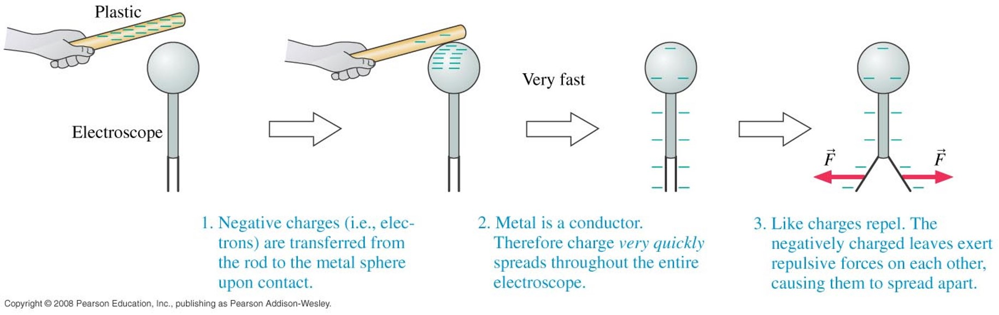

##### Detect by Polarization (non-touching)

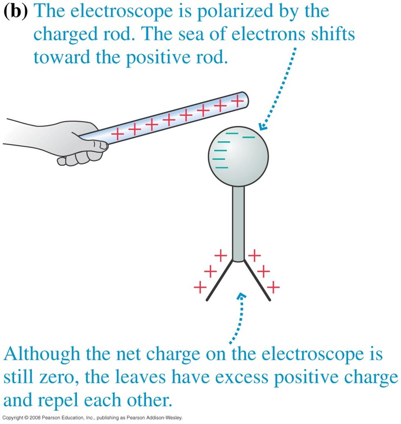

### Coulomb's law (P15)

#### Electric Force

* the forces beetween $q_1$ and $q_2$ are equal in magnitude and have the opposite direction
* $q_1$ and $q_2$ aren't in contact. This is **action at a distance**.

$$
\begin{align}
F&=k\frac{\left | q_1 q_2 \right |}{r^2}
\\ k &= \frac{1}{4\pi \epsilon_0} = 9 \times 10^9\mathrm{N}\mathrm{m}^2\mathrm{C}^{-1}
\\ \epsilon_0 &=8.85\times10^{-12}\mathrm{C}^2\mathrm{N}^{-1}\mathrm{m}^{-2}
\\ k &\gg G=6.67 \times 10^{-11} \mathrm{m}^3\mathrm{kg}^{-1}\mathrm{s}^{-2}
\end{align}
$$

#### Electric Field

* $q_2$ is in the electric field $q_1$ sets up
* assume a test charge $q_0>0$ in the field
* $\vec E=\frac{\vec F}{q_0}$ **defines** $\vec E$ as a vector, its direction same as the force that test charge experiences

#### Electric Field Lines

* **imaginary**, visualize electric fields
* **in three dimensions**
* originate on the (imaginary distant) positive charges, extending to the negative charge
* electric field direction **tangent to the field line**
* **higher density means stronger field**
* between + and +: they repel each other, all lines arrowing out
* between + and -: they attract each other, some lines from + to -

### Potential Energy and Voltage (P26)

#### Definition

* **stored energy of position**
* called potential because it **can do work**: when position changes, it can be converted to other forms like $E_k$
* called potential because it **don't do work** at current form

#### Definition: Electric Potential Energy

* 2 charges have force between each other
* they can move each other
* $Fs=W=E$, so electric field possesses potential energy
* \+ charge: positive plate, high $E_p$
* \- charge: negative plate, high $E_p$
    * \- charge are automatically attracted to positive plate. This consumes potential energy and adds to $E_k$

#### Formula: Electric Potential Energy

$$
\begin{align}
U&=k\frac{q_1q_2}{r}
\\ V &= \frac{U}{q_1}=k\frac{q_2}{r}
\end{align}
$$

* this **defines** $V$ about the field of $q_2$ and irrelevant to $q_1$.
* when $r \to \inf$, $U \to 0$
* positive means repel, negative means attract
* example: move $q_1<0$ from $\inf$ distance closer to $q_2<0$.
    * $U>0$ so they repel
    * $r \downarrow, \ U \uparrow$
    * potential energy lose, equal $E_k$ gain

#### Electric Potential Difference 电势差

$$
\begin{align}
\Delta V = V_f - V_i &= \frac{U_f - U_i}{q} = \frac{\Delta U}{q} = -\frac{W}{q} = \frac{W_\text{external}}{q}
\\ \Delta U =-W&=W_\text{external}=q \left (V_f-V_i \right) = q\Delta V
\end{align}
$$

#### Equipotential Surfaces 等势面

* equipotential surfaces always $\perp$ field lines, thus always $\perp \vec E$
* in a **uniform** electric field:
    * $\vec E\perp$ the surface 
    * field lines are evenly spaced and parallel
    * thus equipotential surfaces **parallel** to the surface

### Examples

#### Shielding Effect of a Conducting Shell 静电屏蔽

* a uncharged **conductor** expose in an external electric field
* the charges on the conductor become one end + and the other - (in the picture below, left - and right +, corresponds with the tendency of the external field lines)
* **net electric field** inside conductor is zero

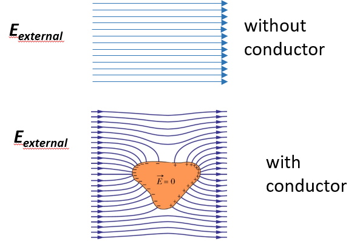

#### Charging by Cloud

* sharper the surface is, denser the equipotential surfaces are
* with a highly charged cloud overhead
* your head has electric field **pointing out to cloud**
* electrons are conducted down through the body
* hair strands will be positively charged

#### Ink-jet Printing

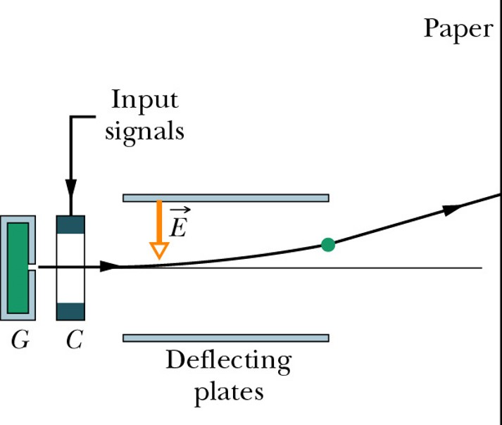

#### Laser Printing

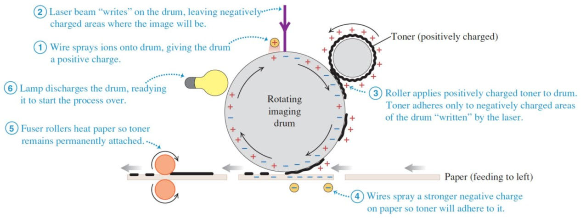

### C, I and R (P37)

#### Capacitor

* **two isolated conductor**, regardless of shapes
* when capacitor is **charged**, two conductor(**plate**) have equal but **opposite** charges($+q, -q$).

#### Parallel Plate Capacitor

* two plates of Area $A$ separated by a distance $d$
* the electric field between two plates is **uniform**, parallel and evenly spaced

#### Capacitance

* $C=\frac{q}{V}$ defines $C$
    * thus $q=CV$
* $C$ depends only on **geometry** of the plates, irrelevant of their charge and potential difference.
* Capacitors with higher $C$ require more $q$ to charge with a constant voltage
* two plates have different potential thus **different potential energy**
* when charges go from one plate to another, the potential energy is released
* charges do not go directly from plate to plate

#### Examples: Flash Camera

* energy release from the capacitor is very fast
* so flash is bright for very short moment

#### Battery

* $V=\frac{\text{Energy}}{q}$
* High potential (\+ end), low potential (\- end)
* **potential difference** V is supported by **chemical energy**
* positive charge flow from \+ to \- and carries energy

#### Electric Current

* add battery to a electric circular **creates a electric field** and cause charges to move in the loop
* Direction of **current flow** is against the electron flow (as in metal)

* $I=\frac{q}{t}$
* in one conductor $I$ is the same, regardless of the seeing/cutting plane

#### Ohm's Law

$$
\begin{align}
\because I &\propto V \\
I &\propto \frac{1}{R} \\
\therefore V &=IR
\end{align}
$$

---

### [Chapter 2.2 PDF](D:/2022A/GE1305/L4 Electricity and Magnetisms.pdf)

### Magnetic Dipole (P3)

* N and S
* must exist at the same time

### Magnetic Field (P6)

* $\vec{F_B}=q\vec v \times \vec B$ as a vector.
* Unit: $1T=1N\cdot A^{-1}\cdot m^{-1}$​ 

> * $\vec F \perp$ the plane defined by $\vec v$ and $\vec B$.
> * If $\vec v\times \vec B=0$, there is no $\vec F_B$. This can be cause by:
>     * $\vec v =0$
>     * $\vec v\vec B=|\vec v||\vec B|\sin 0^\circ$, **move along the direction of B**

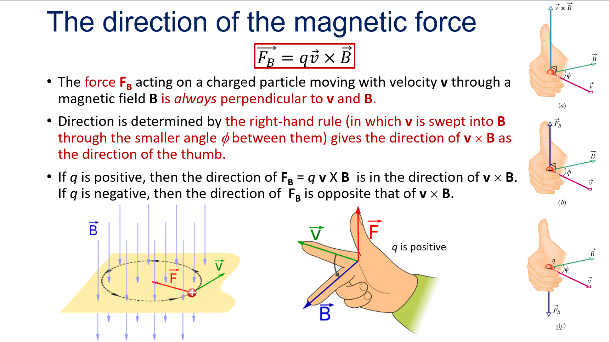

#### Magnetic Field Line

* magnetic field lines are closed loops from N to S
* electric field lines can go to infinity
* direction of $\vec B$ is tangent to field line at that point
* **density** of lines represents the magnitude
* Rounding a Vertical Current, Iron filings (铁屑) are aligned in circles and they show field lines

### Torque (P9)

* Magnetic field exerts a torque on a magnet, $\vec \tau = \vec F \times \vec d$
* **N pole towards the direction**
* Example: Compass

#### Current in the Magnetic Field

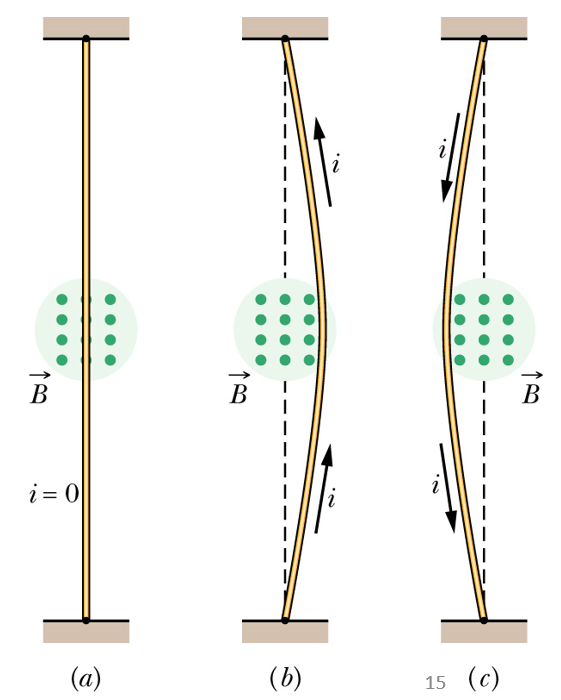

> * `x` means the Field is into the paper
> * `·` means the Field is out of the paper
> * In figure(b), $\vec B$ is Outing, $\vec v$ is $\uparrow$, So $\vec F=q \vec v \times \vec B=\rightarrow$
> * Imagine there is a wire right to the current wire (call it wire0) and its $\vec v$ is also $\uparrow$. It creates a $\cdot$ field on its left (= at wire0's place) and these two wires attracted each other (due to the same direction). So wire0 is drawn right.

#### Example: Electric Motor

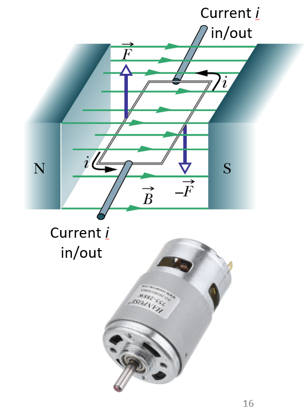

> * The left wire: $\vec B$ is $\rightarrow$, $\vec v$ is Outing, So $\vec F=q\vec v\times\vec B=\uparrow$
> * A Commutator reverse the direction of $I$ every $180^\circ$ so the torque always act in the same direction (left up right down)

### I Generate B (P17)

* $B=\frac{\mu_oI}{2\pi r}$
* $B$ field is a **closed loop** around $I$ 
* Use right hand (figure omitted), thumb is $I$, other fingers are $B$

#### Example: Solenoid 螺线管

* A long coil of wire with many turns
* **Inside solenoid, B is nearly uniform**
* **Electromagnet**
* More turns or **a ferromagnetic iron inside** makes B stronger

#### Example: Between Parallel Currents

* Given: parallel currents $i_a$, $i_b$, separated by distance $d$
* $i_b$ is in $B_a$ created by $a$
* **parallel currents attract, antiparallel repel**

$$
\begin{align}
B_a&=\frac{\mu_0i_a}{2\pi d}\\
\vec{F_b}&=i_b\vec L \times \vec B_a\\
F_{b}&=i_bLB_a\sin90^\circ=\frac{\mu_0Li_ai_b}{2\pi d}
\end{align}
$$

### Magnetic Properties (P20)

#### In micro

* electron acts like a small magnet (due to its motion's current)
* If electron are **orderly aligned**, they produce a magnetic field
* a bar ferromagnet is created by application of an external field

#### Diamagnetism 抗磁性

* repel the external field
* the weakest magnetism
* all materials have
* **not a permanent magnet**

#### Paramagnetism 顺磁性

* attract the external field

#### Ferromagnetism 铁磁性

* Strongest, found in Iron Cobalt Nickel
* Used in data storage

* Atom show **magnetic moments**
* In a **magnetic domain** all atoms are aligned in the same direction
* Without external field, different domains randomly aligned
* With external field, **all domains align with the field**
* **hard magnet**: **walls between domains** hard to move -> permanent magnet
* **soft magnet**: easy to move -> electromagnet

### More

#### Earth Magnetic Field (P36)

* Magnetic North Pole = **Magnet South** is near North Pole
* **magnetic declination** (地磁偏角)
* magnetic north pole is changing everyday
* reverse about every million years

#### Magnetic Induction 电磁感应 (P41)

* **coil creates a current when a magnet moves**
* Magnetic flux (磁通量) = area * magnetic field (**perpndicular to the coil**), $\phi=B\cdot A\cos\theta$
* induced current (感应电流) depends on **the change of flux over time**
* magnetic flux can also be changed by area:
    * moving rod between two parallel lines in a magnetic field converts $E_K$ to $E_{e}$
* can generate current from rotation (power generator)

---

## 3. Energy and Power

### [Chapter 3.1 PDF](D:/2022A/GE1305/L5 Energy and Power.pdf)

### Energy Types

#### Kinetic Energy

* $E_k=\frac12mv^2$
* **Stationary** objects have no KE

#### Electric Potential Energy

* $U=k\frac{q_1q_2}r, W=q_1U$

#### Gravitational Energy

* $E=mg\Delta h$
* Gravitational Energy in Water is used to Generate Electricity

#### Chemical Energy

* Oil, coal, gas
* Li-ion Battery

#### Energy in Sound Waves

* Higher vibration Amplitude, Bigger Sound, More Energy

#### Elastic Energy

* $E=\frac12k\Delta x^2$

#### Heat Energy, Thermal (internal) Energy

* Thermal Energy = $\Sigma(E_p+E_k)$ for all molecules
* The **macroscopic** energy of the material is not considered.  
* Nor the macroscopic potential energy
* Thermometer

##### Temperature

##### Specific heat 比熱容

* The amount of heat required to change the temperature of a material is proportional to the **mass** and to the temperature change
* $Q=mc\Delta T$, $c$ in $\mathrm{J/kg\cdot C^\circ}$

#### Nuclear Energy

##### Nuclear Reaction

* $^{12}_{\ 6}C$ = $12$ nucleons = $6$ protons + $12-6$ neutrons 
* **nuclear fission**: heavy atom split
    * can use to Generate Electrical Power
    * **chain reaction**: fission produce **neutron** and cause more fission
    * $^{235}U+n\rightarrow^{91}K+^{142}Ba+3n+E$
* **nuclear fusion**: light atom form heavy
    * **solar fusion**: $^2H+^3H\rightarrow^4He+n+E$

---

### [Chapter 3.2 PDF](D:/2022A/GE1305/L6 Energy and Power.pdf)

1 human-day energy $\sim$ $2000 \mathrm{\ kcal}\sim 8\times 10^6\mathrm{\ J}$ 

### Conservation of Energy

(First Law of Thermodynamics, by James Prescott Joule)

$E_2-E_1=Q-W$

* $Q$: energy transferred in (by heat)
* $W$: energy transferred out (by work)
* this makes perpetual motion machines impossible

### Second Law of Thermodynamics

* Cannot **completely convert heat to work**, Efficiency = Work / Heat < 1
* Cannot **transfer heat from the cooler to the hotter**

> Renewable forms of energy
>
> * solar (from solar radiation)
> * wind (from atmospheric effects)
> * ocean (from wind, motion of Moon)
> * hydro (from atmospheric effects)
> * biomass, biofuel (from photosynthesis)
> * geothermal (mostly from radioactivity)

> Non-renewable
>
> * mineral oil / petroleum / gasoline 
> * gas (methane)
> * coal
> * nuclear

---

## 4. Wave, Light and Invisible Light

### [Chapter 4.1 PDF](D:/2022A/GE1305/L7 Wave and Light.pdf)

#### Oscillations

* A regular periodic motion in time
* Harmonic Oscillation: $y=A\sin(\omega t), \omega=\frac{2\pi}T$

### Wave

* A periodic motion in both space and time
* Can transport energy without transport matter

#### Transverse Wave

* Vibration is **perpendicular** to the propagation
* **Crests and Troughs**
* Example: light wave, water wave

#### Longitudinal Wave

* Vibration is **parallel** to the propagation
* **Compressions (+) and Rarefactions (-)**
* Example: sound wave

##### Sound Wave

* mechanical wave
* need **a material medium** - air
* sound cannot travel in vacuum, but light can
* <20Hz: Infrasound
* **>20000Hz: Ultrasound**

$f$, $\lambda$, $v$

* Frequency $f=\frac1T$, $T$ is Period
* Wavelength $\lambda $ : crest-to-crest distance
* Speed $v=\frac \lambda T$
* Amplitude

#### Superposition

* Two Identical Wave
    * Constructive Interference (Same Direction)
    * Destructive Interference (Opposite Direction)
* can be from two sources (e.g. water wave)
* Example: **noise-canceling earphones**
    * play signal back **inverted (+180$^\circ$)**

#### Standing Wave

* Two Identical Wave in Opposite cause **Standing Wave** (驻波)
* The wave form is kept same all the time
* Have different number of **nodes (zero amplitude point)**:
    * On a $2L$ length begins and ends with nodes
    * 2 node, $\lambda=2L$
    * 3 node, $\lambda=L$
    * 4 node, $\lambda=\frac23L$
* $f=\frac v \lambda, v=\sqrt\frac \tau \rho$, $\tau$ is tension force, $\rho$ is linear density
    * wave travels faster under higher tension

#### Examples

* Guitar ($\rho$ is large, so sound $f$ is low)

* Pipe / Flute (Shorter pipe, shorter wavelength, higher $f$)

* Beats ($f_\text{beat}=f_1-f_2$), in **Tuning piano**

* **Doppler Effect**

    * source move away from observer, $f'=\frac{v-v_o}{v+v_s}f$

    * source move towards observer, $f'=\frac{v+v_o}{v-v_s}f$

    * closer = higher f

* **Bow waves**: source speed > wave

#### Sound Intensity

* Sound intensity $\propto $ **square of amplitude**
* Unit: $\mathrm{W/m^2}$
* $\mathrm{Loudness (dB)}=10\log\frac{I}{I_0}$

#### Sound Reflection & Absorption

* Reflective Surfaces in Concert Halls
* Absorbing Walls in Acoustical Quiet Room
* Dolphin: Use the Reflection of Ultrasound
* -> Ultrasound can be applied: **Ultrasonic radar** & Medical Use

#### Fourier analysis

* Break waves into **Sine Waves**

---

### Light

* **Electromagnetic Wave**
* **No material Medium is required**
* **Visible Light** Wavelength: $380\sim750\text{ nm}$

#### Color in Human Eye

* **Screen Emit light**
* Cone cells and Rod cells on Retina
    * Rod: low light vision
    * Cone: Color vision and detail
    * R & G & B Cone cells, intake the same color
* White is mixed by equal R & G & B

#### Printed Color

* **Ink Absorb light**, reflecting the rest
* Cyan = -Red, Magenta = -Green, Yellow = -Blue, Black(K) = -All
* CMYK

#### Photography

* Evolved From **Hole to Lenses**

### [Chapter 4.2 PDF](D:/2022A/GE1305/L8 Wave and Light.pdf)

#### Light Reflection

* Spherical Mirrors
* Parabolic Mirrors
* Will **reflect into the middle**

##### Antireflective Coating (P18)

* Apply a coating of thickness $\frac\lambda 4$
* **Reflected light from Top and Bottom of Coating Cancel each other**
* as the two reflected light have a distance of $\frac\lambda 2$

#### Light Refraction

* $v_\text{light}=\frac cn, c=3\times 10^8 \text{ m/s}$
* $n_\text{water}=1.33, n_\text{glass}=1.5$
* **Snell's law**: $n_1\sin\theta_1=n_2\sin\theta_2$

##### Mirages 海市蜃楼

* $n_\text{cool air}> n_\text{hot air}$

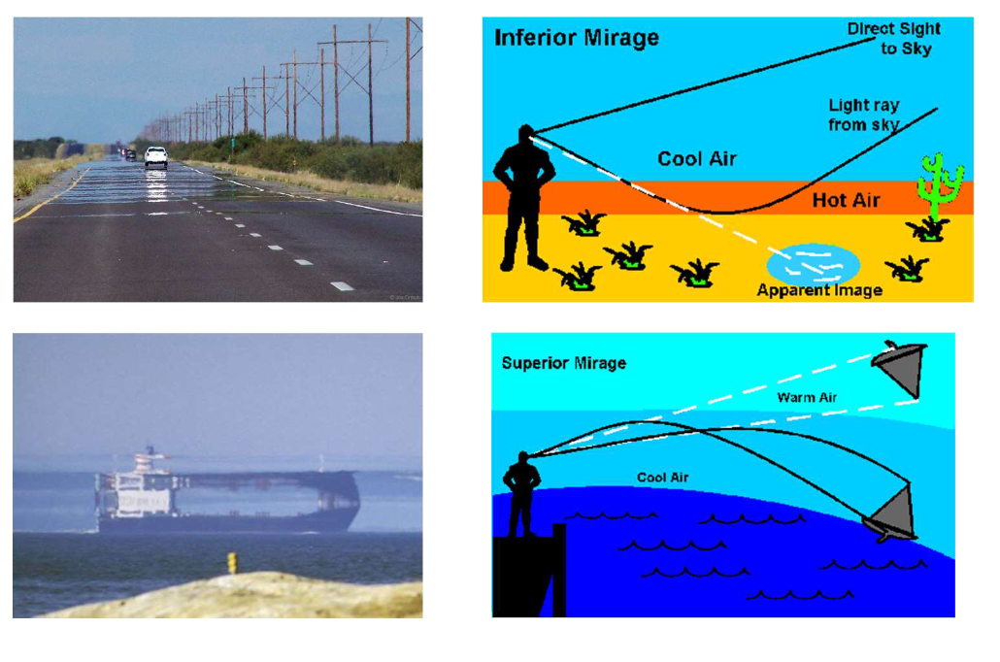

##### Total Internal Reflection

* Only when $n_1>n_2$, $\theta_2$ will reach $90^\circ$
* $n_1\sin\theta_1=n_2\sin90^\circ\Rightarrow \theta_1=\arcsin\frac{n_2}{n_1}$
* Example: Glass Fibers

#### Dispersion 色散

* Different colors have different refractive indices in the same material
* Example: Rainbow

#### Scattering 散射

* **Scatter Likelihood: Violet > ... > Red**
* Scattered by Atoms and Molecules
* **Blue light is scattered most in the sky**
* **Red light is least scattered in the sunset**

#### Lens

* **Converging Lens** 凸透镜
* **Diverging Lens** 凹透镜
* $\frac 1f=\frac 1O+\frac 1I$
* Magnification (放大倍数) $M=\frac{\text{Image Size}}{\text{Object Size}}=\frac IO = \frac{f}{f-O}$
* where: $I$ is image coordinate, $O$ is object coordinate, $f$ is focal length
* $I>0$ Real Image (Opposite, Upside Down)
* $I<0$ Virtual Image (Same side, Up)

##### Telescope

* Photo Resolution limited by diffraction (spreading of light)

##### Microscope

* Make high $M$ lens(like $100\times$) is difficult
* Use multiple lens
* Resolution limited by diffraction

#### 3D Movie

* Early 3D: monochrome images **projected in red and cyan**
* Recent 3D: **Polarization**. Only allow light vibrating in a particular direction

---

### Invisible Light

#### Black-body Radiation

* $\lambda_\max=\frac{2.90\times 10^6}{T}\mathrm{\ nm\cdot K}$

* **Higher temperature, Lower wavelength where radiation is max**

##### Color Temperature 色温

* Used in Lightning & Photography
* Only for Red->Orange->Yellow->White->Violet Colors

##### Solar Spectrum

* Approximately 5778K Blackbody Radiation
* UV + Visible + Infrared

##### Infrared Light (IR Light)

* **Infrared Bulb Low Efficiency**
* Bulb in Red color, **emit more infrared light than visible light**
* Transcendent -> Fluorescent -> LED
* **Infrared light emitted by T > 0 object**
* **Thermography**: Infrared Camera, Night Vision, Thermometer

#### Ultraviolet

* Largely on Blackbody > 6000K
* Wavelength: 400mm > UVA > UVB > UVC > 100mm
* UVB help **production of Vitamin-D**
* UVB cause DNA Damage lead to **Sunburn and Skin Cancer**
* can cause polymeric materials / pigment / dye damage

##### Application of UV

* Bacteria Killing
* **Water Purification**
* Banknotes & Passport Authentication
* UV fluorescent dyes as Bio-markers

#### Radio Waves (<Infrared)

* $f=3\text{ kHz} (3\times 10^3) \sim 300\text{ GHz}(3\times10^{11})$
* $\lambda = 10^5\text{ m}\sim10^{-3}\text{ m}$
* Frequency: AM < FM < TV
* Wavelength & Distance: AM > FM

##### Microwaves

* $f=300\text{ MHz}(3\times 10^8)\sim 300\text{ GHz}$
* $\lambda=1\text{ m}\sim10^{-3}\text{ m}$

#### $X$-ray, $\gamma$-ray (>Ultarviolet)

#### Light Energy

* $E=hf=\frac{hc}{\lambda}, h=6.63\times 10^{-34}\mathrm{\ m^2kgs^{-1}}$

### Tutorial

* **Bluish Water due to scattering of IR**

## 5.  Atoms, Radioactivity and Nuclear Reactions

### [Chapter 5 PDF](D:/2022A/GE1305/L9 Atoms, Radioactivity and Nuclear Reactors.pdf)

### Atom

* Atom radius $\sim 10^{-10}\text{ m}=0.1\text{ nm}$
* Atom nucleus radius $10^{-15}\text{ m}$

#### Atom Model

* Dalton "Billiard Ball" 实心球
* Thompson "Plum Pudding" 面包葡萄干
    * Uniform distribution of charge & mass
* **Rutherford** 原子核带正电
* **Bohr** 电子轨道
* Schrodinger "Electron Cloud" 电子云

####  Rutherford's Discovery

* **Mass concentrated at a tiny core**
* Proved by Rutherford **Scattering** Experiment
    * almost all $\alpha-$particles went through the gold foil
    * some $\alpha-$particles were deflected slightly
    * few $\alpha-$particles were turned through $90^\circ+$

#### Structure of the Nucleus

* Atom = Nucleus + Electrons
* Nucleus = Protons + Neutrons
* Neutron has a similar mass as proton and 0 charge
* Mass of a proton = 1 AMU
* **Z = Proton number**

#### Isotopes
* Same Protons, Different Neutrons
* Isotopes of Hydrogen
    * Deuterium (D), Tritium (T) 
    * **used to make hydrogen bombs**
    * Heavy Water $D_2O$

* Isotopes of Uranium
    * $U-238$ is more stable than $U-235$

#### Fundamental Particles: Standard Model

* Proton= Up+Up+Down
* Neutron=Up+Down+Down
* Up Quark=$+\frac 23e$, Down Quark=$-\frac 13 e$

### Radioactive

* Proton & Neutrons are held together by **Strong Nuclear Force**, one of foru basic forces
* Radioactive because of Unstable Nuclear

#### Raditaion

* Discovered by Antoine Henri Becquerel
* Definition: **Electromagnetic Waves or Energetic Particles**

#### Types

* Particle: $\alpha$, $\beta$, neutron decay
* Electromagnetic (EM Wave): From radio waves, microwaves, infrared, **visible light**, UV, X-, to $\gamma-$ray
    * **Ionizing**: Part of UV, X-ray and up
    * Non-ionizing: UV and down

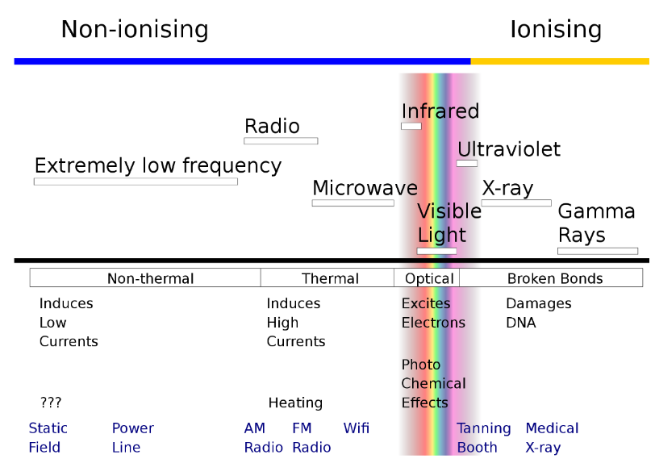

#### Natural Radiations

* Salt and Body contain $K-40$
* Air contain $Rn-86$

#### Radiation Unites

* **Rad** (radiation absorbed dose)
* **Rem** (Roentgen equivalent man)
* 1 Rem = 1 rad $\times$ Q, Q = Quality Factor
* 1 rem = 0.01 Sv = 10 mSv
* Dental X-ray: 0.005mSv

#### Radiation Penetration

* $\alpha-$particles can be blocked by paper
* $\beta-$particles can be blocked by thin $Al$
* $\gamma-$ and $X-$ray can be weakened by thick $Pb$ or $Fe$
* Neutron beams can be weakened by water (contain $H$)

#### Radiation Application

* Therpay
* **Energy Source: Nuclear Fission** (Atomic Bomb)

#### Decay: Half-Life

* C-14 for dating ancient animals (Carbon Dating)

## Nuclear Reaction

#### Chain Reaction

* $n+^{235}_{92}\!U\rightarrow ^{93}_{36}\!Kr+^{141}_{56}\!Ba+2n+\mathrm{Energy}$
* **Output: 2 neutrons > Input: 1 neutron**
* Application: Nuclear Power Plants + Nuclear Weapons

#### Energy from Nuclear Reaction

* $E=mc^2$, **Energy come from mass loss**
* $\mathrm{mass}\left(n+^{235}_{92}\!U\right)>\mathrm{mass}\left(^{93}_{36}\!Kr+^{141}_{56}\!Ba+2n\right)$

#### Nuclear Fusion

* $^2\!H+^3\!\!H\rightarrow^4\!\!He+n+\mathrm{Energy}$
* **Energy from Fusion >> Fission**
* Application: Hydrogen Bomb
* Sun's energy come from nuclear fusion

## 6. Modern Physics

### [Chapter 6 PDF](D:/2022A/GE1305/L10 Modern Physics.pdf)

### Quantum Physics

* **Energy Quantization** 能量量子化
* **Wave-Particle Duality** 波粒二象性
* **Uncertainty Principle** 不确定性原理

#### Energy Quantization

* Hydrogen atom energy level $KE=\frac{13.6}{n^2} eV$
* Energies of **free electrons** are not quantized

##### Application: Laser

* Stimulated Emission of Radiation
    * $E_2-E_1=\Delta E=hv$
    * Input one Photon
    * Output two **identical photons** with exactly same $hv$
* Light Amplification (**Population Inversion**)

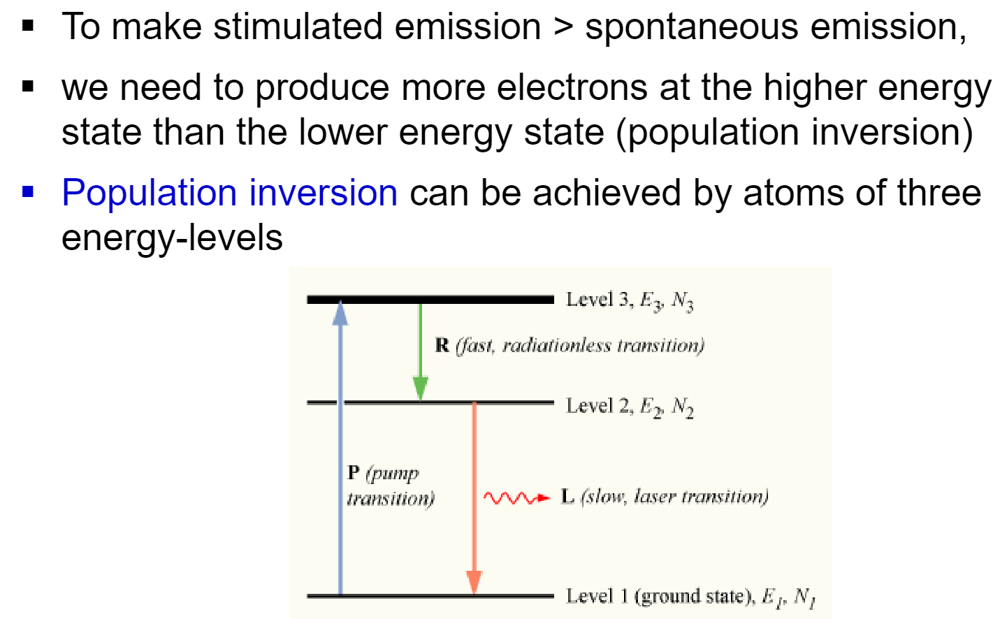

* Advantages: **Identical color/wavelength, Coherent (same phase), Single Direction**, Highly focused, High energy intensity
* Application: Compact Discs (**Shorter Wavelength, Higher Capacity**: Blu-ray > DVD > CD)

#### Photoelectric Effect 光电效应 (Particle Properties of Light)

* Light **give energy to electron in the unit of photon** (= in a **discrete** manner)
* Light energy is in individual photons
* Energy of 1 Photon $=hf$, $h=$ Planck Constant, $f=$ frequency of light
* Electron can escape when **frequency > threshold** (hf > well energy)

#### Wave Properties of Electrons

* **Double-slit interference experiment**

* $\lambda=\frac{h}{mv}$
* $h$ is Planck constant $6.626\times 10^{-34} \mathrm{J/ s}$
* After Accelerating Voltage, Electron Energy $E (eV)=\frac 12m_0v^2 \Rightarrow \lambda=\frac{h}{\sqrt{2m_oeV}}$
* with **relativistic correction**, wavelength is shorter
* Higher Voltage, Higher Velocity, Shorter Wavelength

##### Application: Electron Microscope

* Optical Microscope: Visible Light $\sim\mu m$
* Visible Light wavelength: $380\sim 740 nm$
* Electron Microscope: Electron $\sim nm$
* Electron wavelength $<0.01 nm$

#### Heisenberg Uncertainty Principle

* $\Delta(mv)\cdot \Delta x\geq \frac{h}{2\pi}$ (**position & momentum**)

* Wave Function

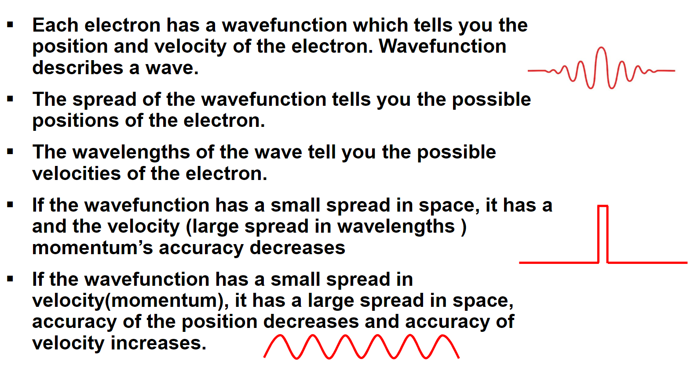

#### Application

##### Semiconductor

* Semiconductor has a medium **band gap between Conduction Band & Valence Band**
* Computer Chips
* Junction Diodes
* Solar Cells

### Relativity

* **speed of light in vacuum is the same** in all inertial reference frames (Maxwell Theory)
* Lorentz transformation

#### Time Dilation

* $\gamma=\frac{1}{\sqrt{1-\frac{u^2}{c^2}}} >1$ **Lorentz Factor**
* $\Delta t=$ Duration measured on the train
* $\Delta t'=\gamma\Delta t=\frac{\Delta t}{\sqrt{1-\frac{u^2}{c^2}}}=$ Duration measured from the ground
* $\Delta t'>\Delta t$

#### Length Contraction

* $L_0= $ Length measured on the train
* $L=\frac{L_0}{\gamma}=L_0\sqrt{1-\frac{u^2}{c^2}}=$ Length Measured from the ground
* $L<L_0$

#### Mass Loss

* $m_u=\frac{m_0}{\sqrt{1-\frac{u^2}{c^2}}}$
* $m_0$ is rest speed
* $m_u\approx m_0\left[1+\frac 12 \left(\frac uc\right)^2\right] \Rightarrow m_uc^2=m_0c^2+\frac 12 m_0u^2$
* **Total Energy = Kinetic Energy + ** $m_0c^2$
* Mass Loss in Nuclear Reactions $\Rightarrow$ Huge Energy

#### Application: GPS

#### Important Experiment

* Michelson-Morley experiment: Special Relativity

* Stern-Gerlach experiment:  [angular momentum](https://en.wikipedia.org/wiki/Angular_momentum) is [quantized](https://en.wikipedia.org/wiki/Quantization_(physics))

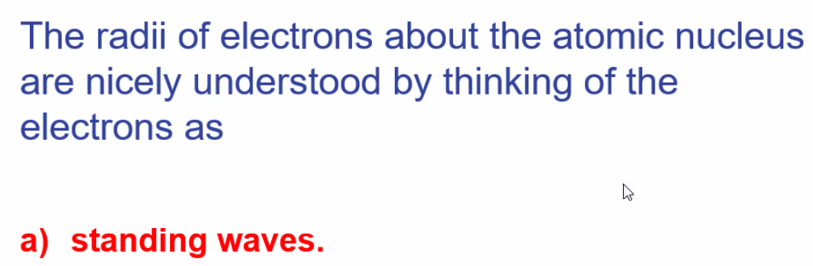

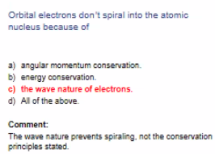

