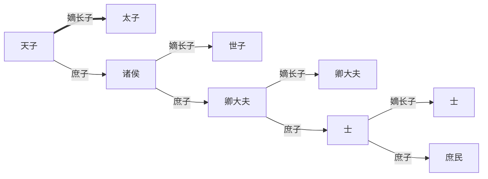

# GE1501 中国文化：历史与哲学 (Chinese Civilization - History and Philosophy)

## 01 文明起源

### 新石器时代

**新石器时代（约公元前7000年 - 公元前2000年）**：人类开始发明及掌握一定的生产技术，以**磨制石器**为主。**农业**和**畜牧业**逐渐发展，出现了早期的村落和部落。
    - 黄河流域：大地湾文化、仰韶文化、龙山文化
    - 长江流域：河姆渡文化、良渚文化
    - 珠江流域：石峁文化
    - 辽河流域：红山文化

| 文化 | 地区 | 代表遗址 | 主要特征 |
|------|------|----------|----------|
| 大地湾文化 | 西北 | 甘肃大地湾 | 陶器、地画 |
| 仰韶文化 | 黄河中游 | 陕西半坡 | 彩陶、图腾 (崇拜活动)、石器、骨器、饰物、符号 (文字萌芽) |
| 龙山文化 | 黄河下游 | 山东城子崖 | 黑陶、城址 (防御工事) |
| 河姆渡文化 | 长江下游 | 浙江河姆渡 | 榫卯结构 (木构建筑)、稻作农业、陶器 (陶砖、陶鼎)、农具 |
| 良渚文化 | 长江下游 | 浙江良渚 | 玉器 (玉琮、玉璧、玉钺)、工具 (冠形器、锥形器)、串饰 (祭祀活动)、神人兽面纹 (宗教信仰) |
| 红山文化 | 东北 | 辽宁牛河梁 | 女神像 (宗教信仰)、玉器 (玉猪龙、玉璧) |

### 青铜时代

**青铜时代（约公元前2000年 - 公元前771年）**：人类开始使用**青铜器**，并逐渐形成早期国家。

- **夏朝（约公元前2070年 - 公元前1600年）**：
  - 传说中的第一个朝代，由禹建立，实行世袭制。
  - 都城：阳城（今河南省偃师市）。
  - 主要遗址：二里头遗址，出土了大量青铜器，显示出早期国家的雏形。
  - 社会结构：以氏族为基础，逐渐向中央集权过渡。
- **商朝（约公元前1600年 - 公元前1046年）**：
  - 由商汤建立，推翻夏朝，实行奴隶制。
  - 都城：殷（今河南省安阳市）。
  - 社会结构：分封制，贵族阶层显著，奴隶制存在。**宫殿**等大型建筑出现，**墓葬**制度完善。
  - 文字：**甲骨文**的出现，标志着中国文字的起源。
  - 宗教：崇拜祖先和自然神，**祭祀**活动频繁。
- **西周（约公元前1046年 - 公元前771年）**：
  - 由周武王建立，推翻商朝，实行分封制，加强中央集权。
  - 都城：镐京（今陕西省西安市）。
  - 社会结构：贵族阶层进一步发展，土地私有制开始形成。
  - 文化：青铜器制作技术继续发展，出现了大量铭文，记录历史事件和宗教祭祀。
  - 宗教：天命观念兴起，强调君权神授。

### 文明起源的历史叙述

- **神话传说**：盘古氏、女娲氏、伏羲氏等神话人物，反映了古代人们对世界起源的理解。有“三皇”（天皇伏羲、地皇女娲、人皇神农）和“五帝”（黄帝、颛顼、帝喾、尧、舜）的传说。
- **文献记录**：《史记》是中国第一部纪传体通史，记载了从黄帝到汉武帝时期的历史。在此之前，有《竹书纪年》和《尚书》（包含古代政治、法律、经济等内容）等重要文献。

### 文化象征

- **河图洛书**：象征宇宙秩序和自然规律的图案，传说由伏羲氏发现。
- **太极、两仪、四象、八卦**：风水、阴阳五行学说的基础。
- **禹贡**：九州图，反映了古代对地理和行政区划的认识。
- **玉璇玑**：古代天文学仪器。
- **龙**：象征权力、尊贵和吉祥，是中华文化的重要象征。玉龙最早见于红山文化。
- **凤**：象征美德和祥瑞，常与龙配对，代表阴阳和谐。在大汶口文化中已有凤的图案，良渚文化中出现凤形玉饰。
- **天圆地方**：古代宇宙观，在建筑和手工业中反映为圆形和方形的结合，如圆形的祭坛和方形的城墙。
- **三星堆文化**：位于四川省广汉市，距今约3000-5000年，出土了大量青铜器、金器和玉器，显示出高度发达的青铜文明和独特的宗教信仰体系。

关键词：

- 农业生产：水稻、小麦、粟、畜牧
- 制造技术：陶器、玉器、青铜器
- 城市：宫室、城墙、墓葬
- 祭祀：祭祖、自然神
- 天象
- 文字：甲骨文、金文
- 占卜
- 文化符号

## 02 朝代循环

| 朝代 | 时间 | 开国君主 | 都城 | 备注 |
|------|------|----------|------|------|
| 夏 | 约 BC 2070 - BC 1600 | 禹 | 阳城 (偃师) | |
| 商 | 约 BC 1600 - BC 1046 | 商汤 | 殷 (安阳) | |
| 西周   东周 | BC 1046 - BC 771   BC 770 - BC 256 | 周武王   周平王 | 镐京 (西安)   洛邑 (洛阳) | 春秋、战国 |
| 秦 | BC 221 - BC 206 | 秦始皇 | 咸阳 | |
| 西汉   东汉 | BC 202 - AD 8   AD 25 - 220 | 刘邦   光武帝 | 长安 (西安)   洛阳 | 王莽新朝 (9 - 23) |
| 三国 | 220 - 280 | 曹操 (魏)   孙权 (吴)   刘备 (蜀) | 洛阳 (魏)   建业 (南京, 吴)   成都 (蜀) | |
| 西晋   东晋 | 265 - 316   317 - 420 | 司马炎   司马睿 | 洛阳   建康 (南京) | |
| 南北朝 | 420 - 589 | 刘裕 (宋)   拓跋珪 (北魏) | 建康 (南京)   平城 (大同) | 南朝：宋、齐、梁、陈   北朝：北魏、东魏、西魏、北齐、北周 |
| 隋 | 581 - 618 | 隋文帝 | 大兴 (西安) | |
| 唐 | 618 - 907 | 李渊 | 长安 (西安) | 武则天代唐称周 (690 - 705)  |
| 五代十国 | 907 - 960 | | | 五代：后梁、后唐、后晋、后汉、后周 |
| 北宋   南宋 | 960 - 1127   1127 - 1279 | 赵匡胤   赵构 | 汴京 (开封)   临安 (杭州) | |
| 元 | 1271 - 1368 | 忽必烈 | 大都 (北京) | |
| 明 | 1368 - 1644 | 朱元璋 | 南京 | 后迁都北京 |
| 清 | 1644 - 1912 | 努尔哈赤   皇太极 | 盛京 (沈阳)   北京 | |

- 西周（BC 1046 - BC 771）
    - 贵族政治：**分封制**
    - 春秋五霸：齐桓公、晋文公、楚庄王、吴王夫差、越王勾践（《荀子》）
    - 文化：**礼乐制度**
- 东周（BC 770 - BC 256）
    - 战国七雄：齐、楚、燕、韩、赵、魏、秦
    - 变法：商鞅变法（秦）……
    - 文化：**诸子百家**
        - 儒家：孔子、孟子、荀子
        - 道家：老子、庄子
        - 法家：韩非子、商鞅、李斯
        - 墨家 (墨子)、纵横家 (鬼谷子)、兵家 (孙子)……
- 秦（BC 221 - BC 206）
    - 统一六国，采**法家**思想
    - **大一统中央集权**：郡县制
    - 文化：**书同文、车同轨**（小篆），**统一度量衡**
- 西汉（BC 202 - AD 8）
    - **文景之治**：文帝、景帝
    - **汉武帝**：推行**推恩令**，加强中央集权，开辟**丝绸之路** (与西域通商)
    - 文化：**儒学独尊**；**汉赋**、字体演变为**隶书**；**司马迁《史记》**
- 东汉（25 - 220）
    - 匈奴入侵、黄巾起义，宦官专权
    - 文化：**蔡伦造纸术**，盐铁专卖，草书和楷书
- 三国（220 - 280）
    - 曹魏 (220 - 265)：曹操、曹丕，坐北方，灭于司马氏
    - 蜀汉 (221 - 263)：刘备、诸葛亮，坐西南，灭于曹魏
    - 东吴 (222 - 280)：孙权，坐东南，灭于西晋
- 西晋（265 - 316）
    - 司马炎灭曹魏，统一三国
    - 内乱：八王之乱，外患：五胡乱华
    - 文化：北方民族入侵，**中原文化南迁**
- 东晋（317 - 420）
    - 五胡十六国 (304 - 439)，匈奴等民族南下侵略
    - **世族/门阀政治**：士族掌握政权
    - 文化：**王羲之《兰亭集序》**，佛教传入
- 南北朝（420 - 589）
    - 南朝：宋、齐、梁、陈
    - 北朝：北魏、东魏、西魏、北齐、北周
    - **北魏孝文帝**：汉化改革，民族融合；**均田制** (土地国有，按户分田)
    - 文化：佛教盛行，**洛阳龙门石窟**，**敦煌莫高窟**
- 隋（581 - 618）
    - 政治：**三省六部制**，科举制雏形
    - 经济：**大运河**贯通南北
- 唐（618 - 907）
    - **贞观之治**：唐太宗李世民
    - **开元盛世**：唐玄宗李隆基
    - **安史之乱**：唐朝由盛转衰的转折点
    - 文化：**科举制**完善，**唐诗**（李白、杜甫、白居易），**敦煌艺术**；**茶文化**兴起，**火药**发明，行书（颜真卿、柳公权）
    - 对外：**丝绸之路**繁荣，**唐蕃古道**，与日本、朝鲜、东南亚交流
- 五代十国（907 - 960）
    - 中原政权 (五代)：后梁、后唐、后晋、后汉、后周
    - 地方割据 (十国)：吴、南唐、楚、闽、南汉等
    - 文化：**山水画**
- 北宋（960 - 1127）、南宋（1127 - 1279）
    - 政治：**文人(士大夫)阶层壮大**，**重文轻武**
    - 经济：**商品经济**发展，**城市化**，**纸币**（交子）出现
    - 文化：**宋词**（苏轼、李清照），**科学技术**（活字印刷、指南针、火药改进，沈括《梦溪笔谈》）
    - 对外：军事积弱，外敌入侵（辽、西夏、金）
- 元（1271 - 1368）
    - 由蒙古族建立，**统一中国**，实行**行省制**
    - 社会结构：蒙古人、色目人、汉人、南人四等人
    - 经济：**东西方贸易**繁荣，马可·波罗来华
    - 文化：**杂剧**（关汉卿、白朴），**元曲四大家**；**士大夫文化式微**；**青花瓷**
- 明（1368 - 1644）
    - 政治：**中央集权加强**，废丞相，设东厂、西厂 (明成祖)
    - 对外：**郑和下西洋**，加强海上贸易
    - 经济：**手工业**和**商业**发展，城市繁荣
    - 文化：**小说**（《三国演义》、《水浒传》、《西游记》、《金瓶梅》），**明清家具**、私家园林
- 清（1644 - 1912）
    - 文化：**满汉文化融合**，戏曲、皇家园林（颐和园、圆明园）、旗袍
    - 对外：**闭关锁国**，鸦片战争 (1840) 后被迫开放，**五口通商**

### 政权更迭的原因

- 革命
    - 夏：商汤放逐夏桀
    - 商：周武王伐商纣王
    - 秦：陈胜吴广起义
    - 汉：张角黄巾起义
    - 明：李自成农民起义
    - 清：太平天国运动、辛亥革命
- 政权过失
    - 夏：荒淫残暴
    - 商：暴虐无道
    - 周：诸侯争霸、内战
    - 秦：严刑峻法、赋役过重
    - 汉：外戚宦官专权、土地兼并、地方割据
    - 晋：八王之乱、五胡乱华
    - 隋：好大喜功、大兴土木
    - 唐：藩镇割据、宦官专权
    - 宋：重文轻武、积弱不振
    - 元：民族压迫、阶级剥削
    - 明：宦官专权、土地兼并
    - 清：闭关锁国、腐败无能
- 天灾 (大旱、农民起义)
    - 东汉
    - 明
- 外敌
    - 宋：蒙古入侵
    - 明：满族入侵 (后金)

### 重要改革

- 商鞅变法 (秦)
    - 政治：废除世卿世禄，实行县制
    - 经济：重农抑商，奖励耕织
    - 文化：统一度量衡，推行小篆
- 王莽新政 (西汉)
    - 政治：废除奴隶制，实行王田制
    - 经济：盐铁官营，均输平准
    - 文化：推行儒学，改革历法
- 北魏孝文帝汉化改革 (南北朝)
    - 政治：迁都洛阳，推行汉族官制
    - 经济：推广汉族农耕技术，实行均田制
    - 文化：鼓励汉族服饰、语言、习俗
- 王安石变法 (北宋)
    - 目标：增强国家财政，减轻农民负担
    - 内容：青苗法、募役法、市易法、保甲法、农田水利法
- 张居正改革 (明)
    - 内容：一条鞭法，整顿吏治，兴修水利
- 洋务运动 (清)
    - 目标：自强、求富
    - 内容：兴办近代工业，建立海军，设立新式学堂
- 戊戌变法 (清)
    - 目标：富国强兵
    - 内容：政治改革，发展实业，兴办教育

### 討論1：哪個朝代對現代華人社會影響最大

漢朝對現代華人社會的影響最大，原因如下：

（一）奠定文化認同：漢朝透過「罷黜百家，獨尊儒術」的政策，確立儒家思想為中國其後兩千多年來的主流意識形態。儒家思想強調倫理道德、社會秩序和家庭價值，這些價值觀深深植根於中國文化中，影響了中國人的行為和思維方式。

（二）確立民族身份：漢朝的強盛和統一使得「漢」成為中國的代名詞，並且在歷史上形成了強烈的民族認同感，今日「漢族」一詞即源於此。其時亦透過絲綢之路與西域各國通商，促進文化交流，強化了以中原爲核心的文化共同體意識。

（三）鞏固政治制度：漢朝完善秦的大一統中央集權制度，推行郡縣制和察舉制，前者成爲現代中國行政區劃的基礎，後者則成爲科舉制度的雛形。這些制度確立了官僚體系和治理模式，對後世中國政治制度產生深遠影響。

（四）文字文化發展：漢朝推行隸書，相較小篆更易書寫和普及，已與今日楷書相近。又有《說文解字》系統整理漢字，對漢字的發展和標準化起了重要作用。漢字作爲中華文化的載體，促進了文化傳承和交流。

## 03 传统社会形态

- 传统：世代相传、改变很少
- 社会：政治（建立秩序/导向）、经济（合作生产/分工）、生活（人际关系/交流）

| | 传统社会 | 现代社会 |
| --- | --- | --- |
| 政治 | 君主制 (世袭) | 共和制 (选举) |
| 经济 | 农业、手工业 (小家庭) | 工、商、服务业 (大企业) |
| 人际关系 | 血缘/家族/地域 | 工作单位 |
| 社会地位 | 君臣、辈份、性别 | 平等 |
| 个人身份 | 职业（士农工商） | 收入 |
| | 封闭、等级 | 开放、流动 |

### 古代政治制度

- [周] 分封制：
    - 周天子(武王)分封诸侯，诸侯再分封卿大夫，形成多级封建体系
    - 诸侯向天子交纳贡税、提供军事支持，独立治理本国；封地和爵位世袭
    - 影响：形成以血缘为纽带的政治结构，促进地方自治和文化多样性
- [秦] 中央集权制：
    - 地方在政治、经济、军事上没有独立性，受控于中央
    - 中央设“三公九卿”（三公：丞相-政务、太尉-军事、御史大夫-监察，由皇帝任免，不世袭）
- [秦] 郡县制：
    - 废分封，设三十六郡，郡下设县
    - 郡守、县令由中央任命，负责地方行政、司法、军事
    - 以后各朝沿用，设中央、州（省）、县三级政府

### 古代礼乐制度

礼乐制度起于周。

- 一夫一妻多妾制
- 宗法制度
    - 宗族分为大宗和小宗，都是相对而言。正统的一支称为大宗，其他支系（庶子、旁系）称为小宗。
    - 如，周天子为天下大宗，诸侯为小宗。诸侯在国内为大宗，长子继承爵位，其他子孙为小宗。
- 嫡长子继承制
    - 嫡：正妻所生；长子：年龄最大
    - 继承权：嫡长子 > 嫡次子 > 庶长子 > 庶次子

- 礼乐制度
    - 礼：“夫礼者，所以定亲疏、决嫌疑、别同异、明是非也。”
    - 乐：“凡音者，生于人心也。乐者，音之所由生也，其本在人心之感于物也。”
    - 礼规定了社会等级、行为规范、宗教祭祀等；乐则通过音乐和舞蹈表达情感，调节社会关系。
    - 礼乐制度维护社会秩序，促进政治稳定和文化传承。
- 祭祀：
    - 祭祀活动体现对天地神灵和祖先的敬畏，强化宗法观念和社会凝聚力。
    - “天子祭天地，祭四方，祭山川，祭五祀。”（天上地下，天尊地卑）
    - “诸侯方祀（一方的神祇），祭山川，祭五祀（五谷、牲畜等）。”
    - “卿大夫祭五祀。”
    - “士祭其先。”（体现了天子与各级诸侯之间的等级关系）

### 古代建筑与城市

- 井田制（西周 - 春秋）
    - 天下井田属天子所有，分予庶民耕种，不得买卖转让。
    - 八户为一井田（1里x1里，1里约405米），均分为九块（100步x100步，100步约135米），中央一块为公田，由八户代耕，其余八块为私田，由各户耕种。
    - 先理公田，后耕私田。公田收成上缴天子，私田收成归户主。
    - 影响：促进土地均分和农业生产，但随着人口增长和社会发展，逐渐瓦解。
- 闾里制
    - 闾：村落，里：乡镇。
    - “门闾无闭，关市无索。”（《吕氏春秋》。闾：里门，与“门”（城门）区别）
    - 一里的大小一般为一里见方，约有百户。
- [唐长安] 里坊制
    - 城市规划：长安城呈方形，四周有城墙，设有东西南北四个城门。
    - 城内划分为108坊，每坊有若干里，每里有若干户。
    - 每坊有坊门，夜间关闭，实行封闭管理，保障治安。
    - 影响：棋盘式布局，便于管理和防御；坊内有市场、住宅、官署等，促进商业和文化交流。
- [宋] 宗族
    - 古人聚族而居。共通祖先、共同姓氏。
    - 设宗祠、族田、族学、族谱、族长、族规。
    - 始于宋。明朝嘉靖年间，平民百姓被广泛允许在村中建宗祠。
    - 民间非官方的社会管理组织。个人、家庭从属于宗族。
    - 承担祭祖、聚族、教育（村塾）、慈善（义产）、议事、审断、风俗等职能。

## 04 家庭与性别

1. 性别
    - 天尊地卑，男尊女卑
    - “男女授受不亲”“男子居外，女子居内”“男耕女织”
    - 男子：考取功名、报效国家、光宗耀祖、承继父业、尽忠尽孝、养家糊口
    - 女子：三从四德、女子无才便是德，无受教育权、继承权、参政权，少出闺门
    - 三从四德（《礼记·内则》）
        - 三从：未嫁从父，既嫁从夫，夫死从子
        - 四德：妇德、妇言、妇容、妇功（品德、辞令、仪态、女红）
2. 婚姻
    - 子女没有婚姻自由。“父母之命，媒妁之言”
    - 门当户对
    - 生儿育女，传宗接代；婚姻大事，三书六礼；同姓不婚
    - 一夫一妻多妾制
    - 三书六礼
        - 三书：聘书（订亲）、礼书（礼单）、迎书（迎亲）
        - 六礼：纳采（提亲）、问名（问生辰八字）、纳吉（宗祠问卜）、纳征（送聘金聘礼）、请期（择吉日）、亲迎（迎娶）
    - 夫妻
        - 夫妇有义，相敬如宾；举案齐眉，白头偕老；男主外，女主内
        - 夫为妻纲，妻子无权干涉丈夫的决定
        - 贞节观念：从一而终，寡妇不改嫁
        - 七出三不去（《大戴礼记》）
            - 七出：不顺父母、无子、淫、妒、恶疾、多言、盗窃
            - 三不去：有所娶无所归、与更三年丧、糟糠之妻不可弃（没有娘家可归的、曾为公婆守孝三年的、贫穷时结婚的妻子不可抛弃）
        - 贞节牌坊（“节妇牌坊”）：《古今图书集成》所志，表彰女性对涨幅坚贞不渝，一生恪守贞节而建立的牌坊
3. 家庭
    - 大家庭，多代同堂
    - 男女有别，长幼有序；孝顺父母，兄弟和睦，妯娌不争；少事长（尊敬长辈）；家和万事兴
    - 父为子纲；养不教，父之过；严父慈母
    - 家庭是社会单位（赋税徭役）、生产单位（农耕）

相关的文学：

- [西汉] 刘向《列女传》：记载古代贤良女性事迹，宣扬妇德、贞节、孝顺等传统美德
- [汉] 《孝经》：儒家经典，强调孝道的重要性，影响中国家庭伦理观念
- [元] 郭居业《二十四孝图》：通过图画和文字，展示二十四位孝子孝女的故事，弘扬孝道文化（其中杜撰者多，以“卧冰求鲤”最为著名）
- [元] 王实甫《西厢记》、[明] 汤显祖《牡丹亭》：反映封建礼教对婚姻自由的压制，提倡真爱和个人选择
- [清] 曹雪芹《红楼梦》：古典小说的大成之作，描绘封建大家庭的兴衰，揭示封建礼教对个人命运的影响。金陵十二钗之名媛多有悲剧命运，反映女性在封建社会中的地位和困境

### 討論2：對「門當戶對」的看法及對現代人的影響

「門當戶對」作為中國傳統婚姻觀念，源於宗法制度與儒家階序思想，強調雙方家庭在社會地位、經濟實力、文化背景的對等。封建社會中，作爲維繫家族榮譽與社會秩序的重要手段，「門當戶對」有其歷史合理性。

然而，所謂「父母之命，媒妁之言」，古代婚姻多以家庭利益為重，子女少有婚姻自由，乃至出現童養婚、買賣婚等弊端，對個人幸福造成損害。因而，隨着近代以來西方自由戀愛觀念的傳入和個人主義的興起，「門當戶對」逐漸被視爲封建禮教的束縛，與現代社會追求個人自由和平等的價值觀相悖，被除棄乃社會進步的象徵。

現今社會，雖然「門當戶對」的字面意義已不再被嚴格遵循，但其背後反映的價值觀仍對今人有一定影響。現代婚姻強調感情基礎和個人選擇，但經濟條件、教育背景等因素仍在一定程度上影響配偶選擇，在相親中尤為明顯；與此同時，經濟實力和教育水平的差距，可能導致婚姻關係中的權力不平等和價值觀衝突，影響婚姻質量和穩定性。

總而言之，作爲一種歷史產物，雖然在現代社會已不再具有法律和道德約束力，但其影響仍然存在於人們的婚姻觀念和行爲模式中，並仍有一定的現實意義。

## 05 学术思想

### 法家

代表人物：管仲（春秋齐）、商鞅（战国秦，《商君书》）、韩非子（战国韩，《韩非子》）、李斯（秦）

核心观点：

- 经济建设，富国强兵；挑战贵族政治
- 法：严刑峻法；权威（“凡治天下者，必因人情，人情者有好惡，故賞罰可用。賞罰可用則禁令可立，而治道具矣。”；以法为本；赏罚分明）
- 术：统治艺术、手段；权术
- 势：主导地位、强势；权力

影响：

- 秦始皇在法家思想指导下，统一六国，建立中央集权的秦朝
- 推行经济、政治改革

### 儒家

代表人物：

- 孔子（春秋鲁，《论语》）、孟子（战国齐，《孟子》）、荀子（战国赵，《荀子》）
- 董仲舒（西汉），汉武帝采纳其“罢黜百家，独尊儒术”政策
- 程朱理学：程颢、程颐、朱熹（宋）
- 心学：陆九渊（宋）、王阳明（明）
- 顾炎武、王夫之、康有为、章太炎（明清）

- 四书：《大学》、《中庸》、《论语》、《孟子》
- 五经：诗（《诗经》）、书（《尚书》）、礼（《礼记》、《周礼》、《仪礼》）、易（《周易》）、春秋（孔子所作）
- 三纲：君为臣纲，父为子纲，夫为妻纲
- 五常：仁义礼智信（仁爱、正确认识、礼仪道德、判断力、承诺）
- 五伦：君臣、父子、夫妇、兄弟、朋友
- 六艺：礼（吉、凶、军、宾、嘉礼）、乐（乐舞）、射（射箭）、御（驾驭马车战车）、书（书法）、数（数学），周朝的贵族教育体系
- 教育：有教无类，因材施教
- 人性论：孟子性善，荀子性恶

### 道家

代表人物：黄帝（《黄帝内经》）、老子（春秋陈，《道德经》）、庄子（战国宋，《庄子》）

核心观点：

- 道：宇宙的本源和规律；无为（顺应自然规律，不妄为）
- 守静；道法自然；物极必反；辩证（二元论、相对论）
- 庄子：齐物（平等，庄周梦蝶）；逍遥（个体精神解放、自由）

## 06 现代以前的中国和世界

### 汉朝外交

汉朝初期，采取“和亲”政策，与匈奴等少数民族建立友好关系，促进经济文化交流。

汉武帝时期，改为主动出击、远交近攻，卫青、霍去病多次北伐匈奴（追杀至狼居胥），同时派张骞出使西域。

- 张骞出使西域（约前138年），开辟丝绸之路，加强与中亚、西亚的联系，促进东西方贸易和文化交流。
- 大宛汗血天马（约前104-102年），两次西征大宛，带回天马和汗血马，提高汉朝在西域的影响力。
- 影响：传入葡萄、石榴、胡麻等农作物，促进农业发展；引进西域音乐、舞蹈、服饰等文化元素，丰富汉族文化；将铸铁、开渠、矿冶等技术传入西域，推动技术进步。

### 丝绸之路

- 起讫：长安（今西安）至地中海沿岸
- 路线：陆路和海路相结合，陆路穿越中亚（至亚历山大、伊斯坦布尔），海路经地中海至罗马
- 河西走廊：汉朝控制的通往西域的战略要地，河西四郡（武威、张掖、酒泉、敦煌），位于今甘肃省境内
- 汉长城：古称“塞”，修筑于汉武帝时期，防御匈奴入侵，延伸至罗布泊；十里一垒，设烽火台（古称“燧”或“亭”），传递军事情报；若干亭一堡，称“障”，驻军防守（闲时务农，称屯田）
- 西域都护府：设于敦煌，管理西域55国，推行汉朝政令、保障交通安全、推动屯田
- 胡物、胡风：西域物产和风俗习惯，如胡服、胡帐、胡床、胡饭、胡乐、胡舞等

后续发展：

- 隋唐时期，丝绸之路达到鼎盛，长安成为国际大都市，张掖成为中西商人的集散地
- 唐：贞观十四年（640）在高昌（今吐鲁番）设立安西都护府，702年在龟兹（今库车）设立北庭都护府，加强对西域的控制；在丝绸之路设驿馆，保障商旅安全（“过所”制度登记信息），沿途有驻军。东罗马、阿拉伯、波斯多有商人来唐，胡商集中在长安西市。
- 东突厥：贞观四年（630），唐太宗派李靖率六路大军灭东突厥，唐疆域扩大到贝加尔湖，西突厥吐蕃王国一蹶不振；
- 西突厥：显庆二年（657），唐高宗派苏定方率军出击西突厥，唐疆域西至中亚，设昆陵、蒙池两都护府，控制今新疆大部地区。

商品交易：

- 输入中国：植物（葡萄、石榴、胡麻、胡桃、胡豆、胡瓜、橄榄）；毛皮、毛毯；动物（良马、骆驼、狮子、犀牛、孔雀、鸵鸟）；香料、宝石、药材、珊瑚、玻璃器等
- 输出中国：丝绸、漆器、植物（桃、梨、生姜）；技术（冶铁、水利、四大发明）

文化交流：杂技、西域音乐歌舞（箜篌、琵琶、胡旋舞）、宗教（佛教、祆教/波斯拜火教、景教/基督教聂斯托里派、摩尼教 —— 传入后在长安立寺建窟）

### 邓和下西洋

- 自永乐三年（1405）至宣德五年（1430），明朝派遣郑和率领庞大舰队七次下西洋，访问东南亚、南亚、西亚和东非沿岸国家。
- 舰队规模：最大时有200多艘船只，2万多人，船只分为宝船（主舰）、战船、补给船等。
- 影响：维护了南亚、东南亚的安定和平；树立了明的宗族国地位；扩张了明朝的朝贡贸易；文化上，传播伊斯兰教、佛教、华人风俗。
- 贡品：本国土特产（金银器皿、犀角、象牙、香料、药材、宝石、珍禽等）
- 赏赐：大宗（丝绸、瓷器、茶叶、铁器、金银等），厚往薄来

### 近代中国与世界

- 明清海禁：明朝禁止私人海上贸易，嘉靖三年（1524）起实行禁海律令，不准造船；清朝康熙二十六年（1687）起实行海禁，禁止沿海五十里住人，完全断绝海外贸易
- 本来的目的是为了消灭反叛势力、打击海盗及走私。但是，欧洲（14-17世纪文艺复兴、15-17世纪大航海时代、17-18世纪启蒙运动、1760年起工业革命）国家的崛起，促使他们积极开拓海外市场和殖民地。中国的海禁政策使得中国与世界隔绝，错失了与西方国家交流和发展的机会，导致中国在近代逐渐落后于西方国家。
- 南洋华侨：19世纪中叶至20世纪初，大量东南沿海居民（主要是福建、广东人）前往东南亚各国谋生，形成庞大的华侨群体。
- 19世纪以前，当地开发程度较低，华侨教育程度高于土人，保持独立的文化，主要从事苦力、小贩及企业（橡胶、锡矿、种植园等）经营。
- 19世纪后期，西方列强殖民统治加强，华侨逐渐融入当地社会，成为重要的经济力量和文化桥梁。
- 华侨有“中介人”的特殊经济地位，在土人与欧人之间进行商品转运和贸易，积累了大量财富，形成“华侨资本”。

## 07 佛教与禅宗

### 佛教基本知识

- 佛教传入中国：东汉永平七年（公元64年），汉明帝遣使西域，携带佛经和佛像回国，永平十年（公元67年）在洛阳建**白马寺**，标志着佛教正式传入中国。
- 佛教的创立：公元前6世纪，**释迦牟尼**在印度创立佛教，后世称“佛”或“佛祖”
- **佛**（Buddha）：意为“觉者”，指觉悟真理、解脱生死轮回的人
- **三世佛**：
    - 寺庙正殿的三尊佛像：燃灯佛（过去佛）、释迦牟尼佛（现在佛）、弥勒佛（未来佛）
    - 寺庙后殿的三尊佛像：药师如来佛（东方净琉璃世界）、释迦牟尼佛（中央娑婆世界）、阿弥陀佛（西方极乐世界）
- **菩萨**（Bodhisattva）：意为“觉有情”，投生人间、菩提悟道、通达四谛的觉者，已发愿成佛但在人间救度众生者
- **罗汉**（Arhat）：释迦牟尼的弟子。佛经原载十六罗汉，中国民间增至十八

### 佛教基本教义

- **四谛**：
    - 苦谛：人生充满苦难
    - 集谛：苦难的根源是贪、嗔、痴
    - 灭谛：灭除苦难的方法是断除贪、嗔、痴
    - 道谛：断除贪、嗔、痴的方法是修习八正道
- **因果报应**：
    - 所造之业为因，报为果，因和果辗转相生
    - 善有善报，恶有恶报；不是不报，时候未到
- **六道轮回**：
    - 三善道（天道、人道、阿修罗道）
    - 三恶道（畜生道、饿鬼道、地狱道）
- **色即是空，空即是色**：
    - 色是一切可见或不可见的事物和现象，由因缘聚合产生
    - 空是事物的本质，指一切事物皆无自性
    - 色的本质是空，空的表现形式是色

### 佛教的分支

- 大乘佛教和小乘佛教
    - 小乘佛教：强调个人解脱，修行八正道，追求涅槃
    - 大乘佛教：强调普渡众生，提倡菩萨道，追求成佛
- 中国佛教的分支
    - 汉传佛教/北传佛教：由丝绸之路或广州传入
    - 南传佛教：由泰国、缅甸（小乘佛教）传入，在云南南部少数名族区
    - 藏传佛教/喇嘛教：受印度佛教、汉传佛教和本土苯教影响，由西藏传入，在青海、西藏、四川、西藏等地
- 宗派
    - 大乘佛教：天台宗（妙法莲华经）、三论宗（中论、百论、十二门论）、律宗（四分律）、净土宗（无量寿经、观无量寿经、阿弥陀经）、法相宗（解深密经）、禅宗（六祖坛经）、华严宗（华严经）、密宗（大日经、金刚顶经）
    - 部派佛教：俱舍宗、成实宗

### 佛教在中国的发展

- 东汉：自汉明帝时从丝绸之路传入，大为流行；《四十二章经》
- 三国：翻译大量佛经
- 南北朝：南梁武帝笃信佛教；北魏孝文帝在迁都洛阳后在大同（山西）修建云冈石窟
- 隋朝：在首都大兴（今西安）修大兴善寺，执行佛教政策的国家寺院
- 唐朝：佛教达到鼎盛，玄奘取经，翻译《大般若经》《大唐西域记》；建大雁塔、小雁塔；武则天（691）下诏规定佛教列于国教之首（“方启惟新之运”）；唐末会昌毁佛（原因：佛教寺院不课税，僧侣免除徭役，寺院过度扩张，带来严重的经济和社会问题）

### 禅宗

- 达摩于南北朝时期（470-478年）来访中国，被尊为中国禅宗的开创者
- 唐朝：弘忍的弟子神秀和慧能分别创立了北宗和南宗
- 六祖慧能（638-713年），南宗禅宗的代表人物，主张“顿悟成佛”，强调心性本净，提倡“教外别传，不立文字，直指人心，见性成佛”
- 菩提本无树，明镜亦非台，本来无一物，何处惹尘埃。（慧能）
- 不是风动，亦非幡动，仁者心动。（慧能）
- 顿悟成佛：即心即佛、自心是佛
- 后世影响：禅宗对中国文化产生深远影响，促进了文学、艺术、建筑等领域的发展，如宋代的山水画、园林艺术等；东传日本，形成日本禅宗，融入日本文化，如茶道、花道等。

### 討論3：對因果報應的看法

「因果報應」是佛教的重要教義，強調個人行為與其後果之間的關係。佛教認爲因果法則是天然存在的，所作之業爲因，所受之報爲果，因與果輾轉相生，是爲「因果報應」，即「善有善報，惡有惡報」。與此同時，種下善因不一定立即產生善報，只有緣分到了才會得到結果，所作惡業亦然，此即「不是不報，時候未到；時機一到，自然會報」。

以今日觀之，「因果報應」雖沒有科學依據，但其作爲影響中華文化近兩千年的倫理道德觀念，仍有其積極意義。其一，「因果報應」強調個人行爲必將肩負結果，促使人們自覺遵守法律良俗，維護社會秩序。其二，「善有善報，惡有惡報」的觀念，鼓勵人們行善積德，培育良好品德，促進社會和諧。其三，「不是不報，時候未到」令人們在面對挫折和不公時能夠堅信正義終將得到伸張，保持積極心態。

與此同時，「因果報應」觀念亦有其局限性。其一，過分強調個人行爲與結果的關聯，可能忽視了社會結構和環境因素對個人命運的影響，導致對弱勢群體的不公正評價。其二，「因果報應」觀念可能使人們過於被動地接受命運安排，而忽視了積極改變現實的可能性。

總而言之，作爲佛教教義和一種中華文化觀念，現代人應當理性認識到其積極作用與局限性，取其精華，去其糟粕，促進個人修養和社會和諧。

## 08 道教

### 道教的产生和发展

- 道教是中国本土宗教，基于上古的「巫」
- 春秋战国：道家思想兴起，老子、庄子著作流传，有方士（炼丹术）的「方仙教」，但未形成系统宗教
- 东汉：五斗米道（天师道）创立，张道陵被尊为「天师」，道教逐渐形成；东汉末年，太平道兴起，张角得到《太平清领书》，领导黄巾起义
- 魏晋：寇谦之入蒿山修道，受到北魏太武帝支持，改革了五斗米道，称「天师道」
- 唐：皇帝尊老子为始祖，唐太宗在老子的故里修建「太上老君庙」，唐高宗尊老子为「玄元皇帝」，将《道德经》纳入科举，道教成为国教之一
- 宋：宋朝皇帝崇尚道教，宋徽宗封自己为「道君皇帝」，政府对道教加强管理，任道官、赐师号、紫衣、进行道士考试等，保证道教的文化素质
- 金：王重阳创立「全真道」，以内丹修养为主
- 元：道派合流，形成「正一道」和「全真道」两大派别，由于丘处机受赏识，全真道成为主流
- 明：正一道成为主流。张三丰在武山修道，后离武当山隐居，明成祖设「武当宫观」

### 代表人物

- [东汉]张道陵（五斗米道）
- [东晋]葛洪（《抱朴子内篇》，炼丹术）
- [北魏]寇谦之（天师道），引入儒家的忠孝思想和佛教的六道轮回
- [唐]吕洞宾，八仙之一，全真道师祖
- [金]王重阳，全真五祖之一，提倡儒释道三教合一
- [金]全真七子，北真，王重阳弟子
- [明]张三丰，武当隐仙派

五斗米道→正一道：

- 奉张天一为首领，道术以画符念咒为主
- 道士一般娶妻生子，不必出家

全真道：

- 王重阳创立，继承吕洞宾的内丹思想
- 提倡三教合一，三教平等，认为儒家、释教（佛教）、道教的核心都是「道」
- 出家制度

### 道教的教义与信仰

- 思想：成仙、长生不死、顺其自然；阴阳、八卦、五行
- 经典：《道德经》（老子）、《周易》、《周易参同契》（葛洪）、《皇帝阴符经》
- 《道藏》：南北朝时期（471年）陆修静编纂，共1228卷；明英宗正统十年（1445年）重刊，明神宗万历十五年（1607年）增补，成现今道藏，共5485卷
- 三清：元始天尊（玉清）、灵宝天尊（上清）、道德天尊（太清，老子）
- 仙：太上老君（老子）、八仙 [汉-明]、姜太公 [商]、安期生 [春秋]、东方朔 [汉]等。道教有得道成仙、羽化登仙的说法
- 道士的活动：内（打坐、炼气）、外（炼丹、画符念咒、驱邪治病、祈福消灾、超度亡魂等）
- 世界观：
    - 天庭（天界）：天神（三清、四御、五老、八仙、二十八宿、三十六天将等）
    - 人间（阳界）：人类、妖精（狐仙、蛇精等）
    - 地府（阴界）：鬼魂、阴司（黑白无常、十殿阎王、孟婆等）
- 象征和符号：
    - 太极图：阴阳调和，宇宙万物的本源
    - 八卦图：天地自然的变化规律
    - 五行：木、火、土、金、水，构成宇宙万物的基本元素
    - 葫芦：辟邪、长寿的象征
    - 神龟、仙鹤：长寿和吉祥的象征

### 道教景观

- 洞天福地：道观遗址多在深山幽谷，常建在山顶，以接近天和仙界
- 青城山 [四川]：道教发源地之一，传说张天师羽化之地，天师道祖山
- 武当山 [湖北]：张三丰修道之地，武当派武术发源地。明代封为皇室家庙
- 全真道：齐云山 [安徽]、崂山 [山东]、华山 [陕西]
- 正一道：龙虎山 [江西]（天师府）、泰山 [山东]
- 上清派：茅山 [江苏]
- 黄大仙祠：供奉黄初平（黄大仙），民间信仰
