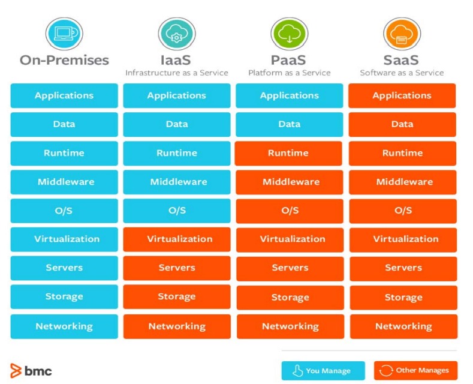
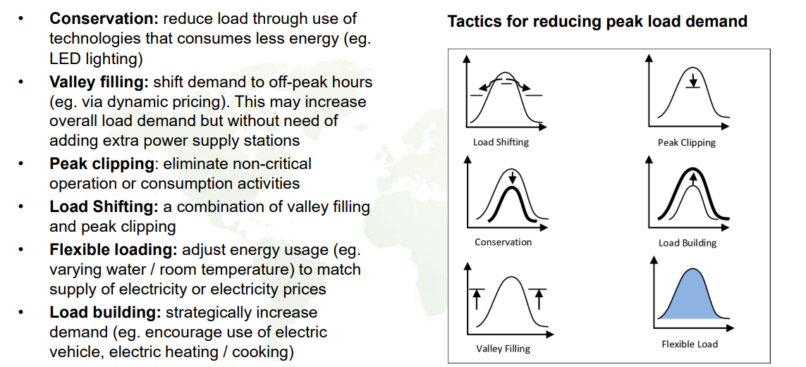

# GE2313 Global IT Case Studies

## 01 Introduction to Smart Cities

### Need for Smart Cities - Urbanization

Reasons for urbanization:

- People migrate from rural villages to political, economic, and industrial centers, leading to growth in cities.
- Cities offer better quality employment, housing, healthcare, education, and recreational opportunities.

Challenges of urbanization:

- High population density
- Insufficient public services capacity (schools, hospitals, public transport)
- Insufficient infrastructure capacity (roads, electricity, water)
- Competition for resources (housing, jobs, entertainment)
- Pollution (air, water, noise)
- Inequalities and diversities; public safety and crimes; discriminations
- High wastage and low sustainability (environmental, economic, social)

### Definition of Smart Cities

- Three key stakeholders: **residents, industry, and government**
- Smart city aims to encourage industrial development, enhance public service ability, enrich residential (quality of) life

A smart city is a **data-driven urban area** that leverages **information and communication technology (ICT)** and **Internet of Things (IoT)** to enhance the efficiency of city operations, services, and connectivity with citizens. Sensor data from various sources is collected, processed, and analyzed to manage resources such as traffic, utilities, public services, and safety.

How Smart Cities enable sustainability:

- Integration and innovative use of technologies (e.g., IoT, data analytics, fast communications)
- Address urban challenges
- Improve efficiency in resource management, energy, transportation, and waste systems; promote business innovations
- Enhance city infrastructure and service performance
- Enhance quality of life (livability, inclusivity, workability, productivity) while reducing environmental impact
- Help achieve Sustainable Development Goals

### Enabling Technologies for Smart Cities

- **Sensors**: Collect data (e.g., temperature, rain, movement, distance)
- **5G and Internet**: Communication networks to distribute & share data
- **Internet of Things (IoT)**: Combination of sensors and communication networks
- **Big Data and AI**: Algorithms to organize, analyze, and draw insights from data; enable machines to learn, reason, deduce, and make decisions
- **Cloud/Fog/Edge Computing**: Platforms for Big Data storage, processing, analysis, and AI training
- **VR / AR**: Facilitate information visualization, design, education, and training
- **Cyber Physical Systems**: Autonomous cars, drones, and robots that interact with the physical world

Layers of Smart City Architecture:

- **Application**: Algorithms and models for data analysis and decision-making
- **Platform**: Cloud/Fog/Edge computing for data storage and processing
- **Network**: Wired, wireless, 5G, and IoT for data communication
- **End user devices**: Edge devices (sensors and actuators) for data collection, and mobile devices for user interaction

## 02 Enabling Technologies for Smart Cities

### Internet of Things (IoT)

**Internet of Things (IoT)**: A network of physical objects embedded with **sensors, electronics, software, and network connectivity** to collect and exchange data.

- **Sensors**: Measure physical properties
    - Examples: tracking (GPS), compass (gyroscope), step counter (accelerometer), heart rate (optical sensor), posture (flex sensor)
- **Connectivity**: Wired or wireless communication technologies
    - High speed, long range, low power consumption

Challenges of IoT:

- Big Data: How to organize, communicate and analyze the massive data generated by IoT devices; how to enhance personal experience; how to figure out relationships between different data sources
- Sensor data transmission: **transmission protocol**, **network technology**
    - 4 points to consider: range (m vs km), bandwidth (kbps vs Mbps), power consumption, reliability
- Data security: how to guarantee data security and privacy (personal, commercial, societal and national)

### 5G Mobile Communication

| Generation | Data Rate | Applications |
|------------|-----------|--------------|
| 1G (1979) | 2.4 Kbps | Cellular phone (analog) |
| 2G (1991) | ~64 Kbps | SMS (text), MMS (multimedia) |
| 3G (2001) | ~2 Mbps | Mobile internet, video call |
| 4G (2009) | ~100 Mbps | HD video streaming, mobile gaming |
| 5G (2019) | ~10 Gbps | IoT, autonomus driving, AR/VR |

(*) All data rates are theoretical maximums.

Challenge of high bit rate communication:

- Use higher radio frequency (e.g., mmWave)
- Use wider spectrum bandwidth so more data can be transmitted in parallel
- However, **higher frequency = shorter transmission distance** = more base stations needed = higher telecom infrastructure cost

Technologies of 5G:

- **enhanced mobile broadband (eMBB)**: higher data rate, wider bandwidth. Application: HD video streaming, AR/VR
- **massive machine type communication (mMTC)**: connect massive number of devices. Application: IoT
- **ultra reliable low latency communication (URLLC)**: low latency, high reliability. Application: autonomous driving, remote surgery

Pros and cons of 5G:

- Pros:
    - High data rate
    - Low latency (4G ~70ms; 5G ~20ms)
    - Increase capacity (more devices can be connected)
    - Increase bandwidth
- Cons:
    - Reduced coverage (shorter range, 4G ~3km; 5G ~300m)
    - Higher infrastructure cost (more base stations needed)
    - Cyber security (more devices connected = more vulnerable to cyber attacks)

### Cloud, Fog, and Edge Computing

- **Cloud computing**: centralized data storage and processing in large data centers
- **Fog computing**: decentralized data storage and processing at node devices (e.g., local servers, gateways)
- **Edge computing**: data processing at the edge devices (e.g., IoT devices, mobile devices)

Cloud eco-system:

- Public cloud: services provided over the public internet (e.g., AWS, Azure, Google Cloud)
- Private cloud: services provided over a private network (e.g., enterprise data centers)
- Hybrid cloud: combination of public and private clouds

3 levels of cloud services:

- **Infrastructure as a Service (IaaS)**: virtualized computing resources (incl. virtual machines, storage, networks)
- **Platform as a Service (PaaS)**: development platforms and tools (incl. OS, middleware, runtime)
- **Software as a Service (SaaS)**: software applications delivered over the internet

Comparison of IaaS, PaaS, and SaaS:

| Feature | IaaS | PaaS | SaaS |
|---------|------|------|------|
| User control | OS, database, applications | Applications | None |
| Cloud provides | VM, storage, network | + OS, database, dev tools | + applications |
| Examples | AWS EC2, Alibaba ECS | Heroku, Google App Engine | Google Workspace, Microsoft 365 |
| Suitable for | Companies with IT expertise | Developers | End users |

Comparison of Cloud and Fog/Edge Computing:

| Feature | Cloud Computing | Fog/Edge Computing |
|---------|-----------------|--------------------|
| Aim | Cost and resource efficiency | Low latency and real-time processing |
| Ownership of devices | Centralized | Distributed |
| Location of data processing | Remote | Local |
| Latency | Higher | Lower |
| Suitable for | Big data analytics, long-term storage | Real-time applications, IoT |

Real-time applications: denoising, de/encryption, de/encoding, user interaction, intruder detection

Pros and cons of Cloud Computing:

- Pros:
    - Data centralization
    - Easier maintenance
    - Higher global security
    - Scalability
- Cons:
    - Higher latency
    - Easier to be attacked

Pros and cons of Fog/Edge Computing:

- Pros:
    - Lower latency
    - Better portability
    - Better local security
- Cons:
    - Privacy issues (limited computing resources, so data may need to travel through multiple nodes)
    - Difficult to manage and coordinate; need periodic synchronization

### Artificial Intelligence (AI)

Artificial Intelligence (AI): the exhibition of intelligent behavior by machines.

Birth of AI: John McCarthy (1956) at Dartmouth Conference

Stages of AI development:

- **Inference Period (1956-1974)**: Perceptron, Structure learning, Logic-based inductive learning
- **Knowledge Period (1980-1987)**: Multilayer perceptron, Backpropagation, Expert systems
- **Learning Period (1993-now)**: SVM (1995), Deep Blue (1997), Neural networks with DL (2006), AlphaGo (2016), GPT-3 (2020)

Paradigms of AI research:

- **Logical Inference**: Traditional algorithm-based reasoning
- **Knowledge-based**: Representation of knowledge (provided by human experts) as FACTs and IF-THEN rules; Reasoning using knowledge
- **Neural Networks**: Inspired by biological neural networks; Learning from data
    - Knowledge is represented in the weights of the connections between neurons
    - Learning is done by adjusting the weights based on the input data and the desired output (in supervised learning)

Deep Blue (1997): IBM's chess-playing computer using knowledge of previous human games and brute-force search

AlphaGo (2016): Google's Go-playing AI using deep neural networks and reinforcement learning. AlphaZero (2017) learned to play Go, chess, and shogi without human knowledge.

Weak and Strong AI:

- **Weak AI**: made to respond to specific situations, but cannot think for themselves
- **Strong AI**: think and act just like a human, learn from experience

As of now, we only have achieved Weak AI.

**The Turing Test**: A test created by Alan Turing to determine if a machine can exhibit intelligent behavior indistinguishable from a human.

Opportunities and challenges of AI:

- AI brings employment or unemployment?
- Legal and ethical issues (wealth inequality, legal liability, intellectual property, privacy, AI bias)
- Can humanoid obtain AI rights? How to define the humanitarian treatment of AI?
- AI weaponry

### Big Data

Characteristics of Big Data (5Vs):

- **Volume**: large amount of data (terabytes, petabytes, exabytes) generated from various sources (social media, IoT, sensors, transactions)
- **Velocity**: high speed of data generation and processing (real-time or near real-time)
- **Variety**: different types of data (structured, semi-structured, unstructured) from various sources (text, images, videos, audio)
- **Veracity**: uncertainty and quality of data (accuracy, trustworthiness, reliability)
- **Volatility**: shelf life of data (how long before it becomes obsolete or irrelevant)

Key enablers of Big Data:

- Increase in data generation and acquisition (IoT, social media, online activities)
- Increase in data communication capabilities (5G)
- Increase in data storage capabilities (Cloud data centers)
- Increase in data processing & analysis power (Cloud computing, AI)

Applications of Big Data:

- e-commerce: recommendation systems (**collaborative filtering**, serendipity recommendation)
- social media: **sentiment analysis**, **influencer identification**
- STP marketing for targeted advertising: **customer segmentation**

Pros and cons of targeted advertising:

| | Pros | Cons |
|-----|------|------|
| Companies | target right audience   per-channel personalization   higher ROI | higher cost   pushback from the public   privacy concerns |
| Users | more relevant ads   better user experience | feel of being tracked   privacy concerns |

### Virtual Reality (VR) and Augmented Reality (AR)

- **Virtual Reality (VR)**: a computer-generated simulation of a 3D environment that can be interacted with using special electronic equipment (e.g., VR headset, gloves)
- **Immersive Experience**: stimulate multiple senses (sight, sound, touch) that correspond to those received when in a real-world situation. Gives a sense of "being there" (presence)

Characteristics of VR: Realistic, Interactive, Multisensory

Enabling technologies of VR:

- Realistic: graphical modeling, rendering, 3D display
- Interactive: motion sensors, CV
- Multisensory: audio, haptics (force feedback)
- Real-time: parallel computing, GPU

Applications of VR:

- Entertainment: interactive games, 3D movies
- Education and skill training: surgery, sports, aviation
- Psychotherapy

Types of XR:

- **Virtual Reality (VR)**: fully immersive virtual environment. Device: VR headset
- **Augmented Reality (AR)**: mainly real, and overlay virtual objects on the real world. Device: AR glasses
- **Mixed Reality (MR)**: Integrates real and virtual with interactions for both. Device: MR headset (e.g., Microsoft HoloLens)
- **Extended Reality (XR)**: an umbrella term for all of the above

Difference between VR and AR:

- Working principle: VR creates a fully virtual environment generated by computer; AR overlays virtual objects on the real world
- Delivery device: VR usually requires a head-mounted or hand-held device; AR can be delivered through smartphones, tablets, or AR glasses

## 03 E-Government

It is the **transformation** of government to provide/deliver **efficient, convenient and transparent** services, with regard to good governance to citizens and businesses, by using **ICT**.

E-Government Development Index (EGDI):

- A composite index measuring the readiness and capacity of national institutions to use ICT to deliver public services
- Three components:
    - **Online Service Index (OSI)**
    - **Telecommunication Infrastructure Index (TII)**
    - **Human Capital Index (HCI)**

E-Participation Index (EPI):

- Focuses on citizen participation
- E-information: Enabling participation by providing access to information, without upon request
- E-consultation: Engaging citizens in contributions to public policies and services
- E-decision-making: Empowering citizens through co-designed policy options and co-production of services and delivery modalities

Types of E-Government services:

- **Government to Citizen (G2C)**: deliver public services; participation in consultation and communication
- **Government to Business (G2B)**: facilitate business operations; provide information and services (e.g., transactions, licenses, permits)
- **Government to Government (G2G)**: share information and conduct e-communication between government agencies
- **Government to Employees (G2E)**: personnel management (records, disbursements, payroll, training) for government employees

Four phases of E-Government model:

- **Information**: one-way communication; static web pages for information dissemination
- **Interaction**: two-way communication; email or interactive e-forms for inquiries and feedback
- **Transaction**: online services; e-payments (e.g., license renewal, tax filing); e-forms for applications and registrations
- **Transformation**: using digital technologies to create new or modify existing business processes, culture, and customer experiences to meet changing business and market requirements

Examples: HKedCity, GovHK (tax filing, car registration), automated immigration clearance (Shenzhen Bay Port), iAM Smart (multi-purpose eID platform in HK)

Benefits of E-Government:

- G2C
    - easy access of public information; certainty and convenient in getting services (24/7)
    - time and cost saving
    - multiple delivery & payment channels; enhance participation; better quality of life
- G2B
    - facilitate doing business with government; encourage business investment; transparency
    - reduce cost and lower barriers
    - provide more, clearer and accessible information; help business navigate through regulations
- G2G
    - law & policy making: wider and faster dissemination of laws; faster and better policy making; catalyst for legal reform
    - better regulation: cross-department data sharing (better tax revenues); better environmental compliance and sustainability; more transparency and safety
    - C&B efficiency: better credibility; saving time and costs; improve efficiency; better targeting of benefits

Challenges of E-Government:

- Budgeting
- Digital Culture
- Managerial Issues
- IT Infrastructure
- Laws and Legislation

## 04 Smart City Management

- Manage:
    - Planning, implementation, monitoring of urban infrastructures and services
    - Effective and efficient management of projects, campaigns, and programmes
- Promote:
    - Intersectoral coordination among the urban sectors
    - Community participation and involvement of NGOs and civil societies
    - Public-private partnerships (PPP)
- Strengthen:
    - Urban administration and governance
    - Implementation of urban policies

Smart City Management focus on using ICT to monitor, analyze, process, and manage city **facilities, assets, projects and events** to enhance the efficiency of five flows (human, information, traffic, money, goods) in the city.

Use cases of smart management of public services:

- Facilities management
- Security services
- Public services

### Case Study

(1) Smart water management

Goal: a resilient and efficient water supply system; reduce costs, improve revenue; improve water quality and sustainability

Technologies: smart sensors and meters, SCADA (Supervisory Control and Data Acquisition), GIS (Geographic Information System)

(2) Smart streetlights

Technologies: Communication hub (wireless mesh network), energy harvesting (solar panels), smart sensors

Functions: dynamic lighting control; environmental and weather monitoring; green energy generation; parking management; digital signage (public information display); public WiFi hotspot; emergency communication (SOS buttons)

Benefits: Reduce energy and maintenance costs; increase lamp life; improve public safety; reduce light pollution and carbon footprint

(3) Emergency management system

Continuity: Mitigation → Preparedness → Response → Recovery

- Mitigation: identify potential hazard and its impact
- Preparedness: develop Emergency Operation Plan (EOP); train personnel; identify resources needed
- Response: decrease life-threatening effects; provide life-sustaining aid; halt further infrastructure damage
- Recovery: Coordinate relief efforts; rebuild and restore operations; educate community

(4) Smart parks

- Security: smart entry control (RFID, facial recognition)
- Experience enhancement: flowers and insects recognition and location (AR, GPS)
- Operations: smart lighting and water irrigation, robotic lawnmowers
- Strategtic planning: analysis visitor behavior for their interests (Big Data)

(5) Smart museums

- Artifact preservation: IoT for humidity, temperature, light monitoring
- Access control
- Artwork tracking: Near Field Communication (NFC) tags
- Occupancy sensing: PIR for crowd control
- Interactive exhibits: AR
- Visitor behavior: wearable IoT devices for movement and interests analysis

## 05 Smart Energy

### Smart Grid

Traditional power grid system allows one way interaction only: power plants generate electricity and transmit to consumers. Lacks real-time control and monitoring.

Smart grids is an **electricity network that supports the flow of electricity and data** with automation, digital communication and IT systems that can **monitor** power flows from points of generation to points of consumption and **control** power flow in **real-time**.

**Demand Side Management (DSM)**: comprise technologies and policies, aiming at equalizing energy consumption levels over the day. Goal: flatten consumption pattern, reduce peak load demand

**Time-of-Use (TOU) Metering**: electricity pricing scheme that varies the price of electricity based on the time of day, season, and level of demand.

Benefits of smart meters: reduce energy consumption; lower carbon footprint; better information on billing; faster outage detection and restoration; remote connect/disconnect

### Renewable Energy

- Definition: clean energy that comes from natural resources that are replenished constantly (will not run out)
- Sources: sunlight (solar), tides and waves (hydro), wind, geothermal heat, biomass
- Advantages: self-replenishing, low pollution, carbon neutral
- Disadvantages: intermittent supply (e.g., weather dependent), limited scale, environmental disruption (dam, mine)
- Smart grid: resell surplus to grid; store excess energy in batteries; allow energy exchange

(*) nuclear energy is not considered renewable as uranium is a finite resource

Types of renewable energy systems:

- Solar energy
    - **Solar power tower**: large field of mirrors (heliostats) reflect sunlight onto a central receiver on top of a tower to generate high-temperature heat for electricity generation
    - **Solar thermal plants** (example: Qatar KSPP)
    - **Solar cooker**: use reflective surfaces to concentrate sunlight onto a cooking pot
    - **Photovoltaic (PV) cells**: convert sunlight directly into electricity using semiconductor materials (example: solar panels on rooftops). Lower efficiency (~15-20%) but more versatile
- Wind power
    - **Wind turbines**: convert kinetic energy from wind into mechanical energy, which is then converted into electricity using a generator
    - Taller turbines capture more wind energy (wind speed increases with height)
    - Larger rotor diameter, longer blades, and fewer turbines increase efficiency
    - **Wind farms**: large-scale installations of wind turbines (onshore or offshore)
    - Choose a location with high average wind speed, away from noise sensitive areas, easy connection to power grid, easy access to maintenance and no environmental designations
- Hydropower
    - **Reservoir-based**: damming a river to create a reservoir; water released through turbines to generate electricity
    - Head: difference in water level between the hydro intake and discharge point; higher head = more potential energy
    - Pro: green energy, reliable, flexible, low operating cost, reservoir creates leisure activities area
    - Con: destruction of habitats, altering of natural conditions, relocation of people, high initial cost
- Tidal power
    - **Tidal barrage**: dam built across a tidal estuary; water flows through turbines during tidal changes to generate electricity
    - **Tidal stream**: underwater turbines placed in tidal streams to capture kinetic energy from moving water
    - Pro: lower cost than hydropower, predictable (as high and low tides are regular)
    - Con: intermittent (only during tidal changes), increase coastal erosion, affect marine life
- Biomass power
    - Biomass: organic material from plants and animals (wood, landfill gas, alcohol fuels, crops, garbage)
    - Thermal, biochemical and electrochemical conversion

Urgent need for smart energy management:

- Cut down costs
- Manage energy consumption
- Energy reliability
- Environmental sustainability

## 06 Smart Manufacturing

### Industry 4.0

**Industry 4.0**: the current trend of automation and data exchange in manufacturing technologies, including **cyber-physical systems (CPS), Internet of Things (IoT), cloud computing, and cognitive computing**.

The first three industrial revolutions:

- Industry 1.0 (1784~): mechanization using water and steam power
- Industry 2.0 (1870~): mass production using electricity
- Industry 3.0 (1969~): automation using electronics and IT

Key factors of productive manufacturing:

- Supply chain optimization, just-in-time production (tracking, ordering, shipping, inventory management)
- Rapid design changes (quick response to market trend, mass customization)
- Flexible adjustment in production volume
- High level, low defect rate, 24/7 automation
- Continuous employee training
- Minimal downtime (preventive maintenance)

Enabling technologies of Industry 4.0:

- IoT (sensors & communication)
- Cloud computing (data storage & processing)
- Big Data (data analytics)
- AI (safety monitoring, decision support, sales forecasting)
- Cybersecurity
- Advanced robotics
- AR/VR (for design, training)
- 3D printing/additive manufacturing (rapid prototyping, mass customization)

### Decision Support System (DSS)

**Decision Support System (DSS)** bridges the gap between data analystics and decisions.

DSS:

- brings together data and knowlege from multiple sources to help decision making
- Provide comparative figures/charts over a time frame/trends
- Simulate "what-if" scenarios to evaluate different options (consequence analysis)

Intelligent DSS:

- Use AI (deep learning) to process and analyze big data to get insights, latent relationships and make recommendations
- Use data mining and ML techniques to identify trends and patterns to predict future outcomes
- To emulate human decision making process on inventory, sales, business processes

### Virtual Technologies

VR:

- Enable fast design iterations
- Shorten design-to-product cycle
- Training

AR:

- Guided assembly, maintenance, and repair
- Virtual expert assistance
- Quality control

Virtual technologies help achieve consistent and parallel design of products, process and production system.

**Digital Twin**: a digital replica of physical assets that can react to real-time data. Allow real-world data to inform or predict product/process improvements.

Example:

- Cobot monitoring (collaborative robots working alongside humans)
- Workplace monitoring
    - Smart cameras -> thermal temperature -> edge computing -> heatmap
    - Panoramic camera -> space occupancy algorithm -> people counting -> occupancy heatmap

### Benefits and Challenges of Industry 4.0

Benefits:

- Higher productivity and lower costs
- Better product quality
- Enable collaboration and better knowledge sharing
- Safety for workers
- Better customer satisfaction

Challenges:

- Economic:
    - Business model transformation
    - High initial investment
- Organizational:
    - IT security and data privacy
    - Reliability and stability
    - Insufficient qualified personnel
- Legal:
    - Lack of regulation
    - Unclear liability in cybersecurity and data governance
- Social:
    - Privacy concerns
    - Surveillance and distrust
    - Stakeholder resistance to change
    - Job displacement and unemployment

## 07 Smart Banking & Smart Business

### FinTech

FinTech: the use of technology to improve and automate financial services.

Enabling technologies: AI, blockchain, cloud computing, big data

Applications of FinTech:

- Mobile apps for banking and social payments
- Autotrading
    - taking advantage of dynamic market movement to predict the future price movement for better decision making
    - when to enter/exit, how much to buy/sell, whether to sell short or buy long
    - Techniques
        - setting up rules for trading
        - sentiment-based price movement prediction (analyze news, social media)
        - high frequency trading (HFT): transact at very high speeds using powerful computers to capitalize on small price movements
- Blockchain
    - Blocks of data chained together in chronological order
    - Each block contains data on batches of transactions
    - A new block is added to the chain through a cryptographic hash of the previous block, creating a secure and tamper-proof record of transactions
    - Once recorded, history and information in a blockchain are irreversible
    - **Blockchain: a decentralized and distributed ledger** that records transactions across many computers so that the record cannot be altered retroactively without the alteration of all subsequent blocks and the consensus of the network
    - Steps: a transaction is requested → a block representing the transaction is created → the block is broadcast to a P2P network of computers (nodes) → the nodes validate the transaction → the node receive a reward for PoW → the new block is added to the blockchain → the updated blockchain is distributed to all nodes
- Cryptocurrency
    - Cryptocurrency: a digital or virtual currency that uses cryptography for security and operates independently of a central bank
    - Each cryptocurrency has a unique ID, quantity, and owner (wallet address) stored in the blockchain
    - Transaction procedure: sender initiates transaction with recipient's wallet address and amount → transaction is validated by network nodes through cryptography → transaction is recorded in a block on the blockchain → the request is passed to the recipient's wallet
    - Issues: information security, regulatory challenges, connection to illegal activities, negative environmental impact (high energy consumption for mining)
- Non-Fungible Token (NFT)
    - **NFT: a unique digital asset that represents ownership** of a specific item or piece of content, such as art, music, videos, or collectibles
    - Issues: copyright infringement, illegal activities
- E-Commerce
    - Definition: a process of buying, selling, or exchanging products, services, and information via the internet
    - Business-to-Consumer (B2C): online retail platforms (e.g., Amazon, JD)
    - Consumer-to-Consumer (C2C): online exchange marketplaces (e.g., eBay, Taobao)
    - Business-to-Business (B2B): online wholesale or supply chain platforms (e.g., Alibaba)
    - Online-to-Offline (O2O): online platforms that connect consumers with local businesses (e.g., food delivery, ride-hailing)
- Influencer Marketing
    - **Key Opinion Leader (KOL)**: individuals with a significant following on social media platforms who can influence the purchasing decisions of their followers
    - Benefits: followers trust influencers; influencers can create quality content; doesn't suffer from ads blocking; give brands insights into customer preferences; automated brand-KoL matching platforms
    - Steps: identify goals and target audience → find suitable KOLs → create engaging content → publishing and evaluate performance
- Display Ads
    - Elements:
        - advertiser (brand)
        - publisher (website or app displaying the ad)
        - media agency (1. create ad banners; 2. buying ad placements from publishers; 3. determines ad budget)
        - inventory (impressions available for sale on publisher's website/app)
    - Types: banner/image/flat ads, rich media ads (pop-up, interactive); traditional display ads (images, text), responsive display ads (automatically adjust size, appearance, format), retargeting display ads (target users who have previously visited brand's website), native ads (match the look and feel of the platform)
    - Click-through Rate (CTR): (number of clicks on ad) / (number of times ad is shown) × 100%
    - Conversion Rate (CVR): (number of purchases or actions taken) / (number of clicks on ad) × 100%
