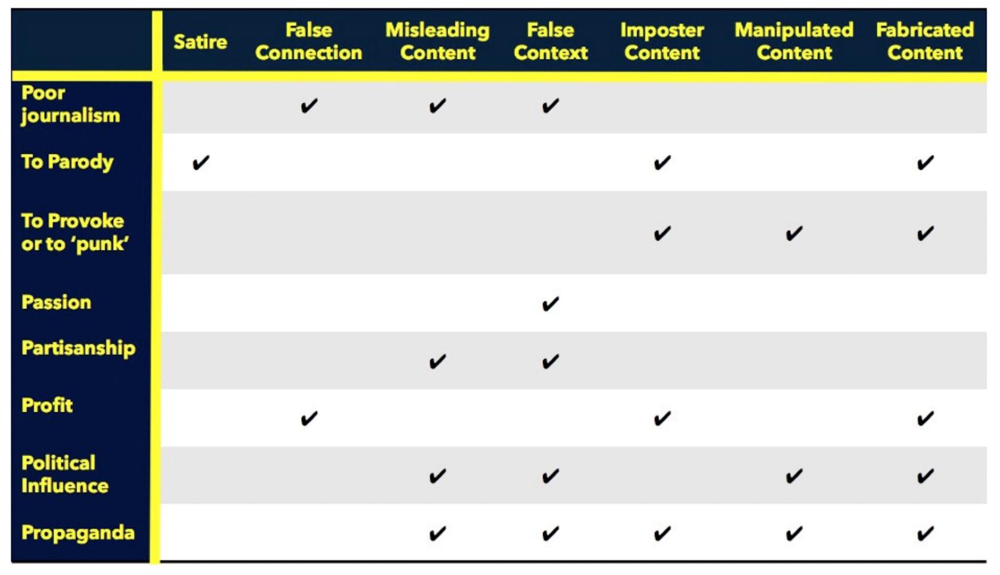
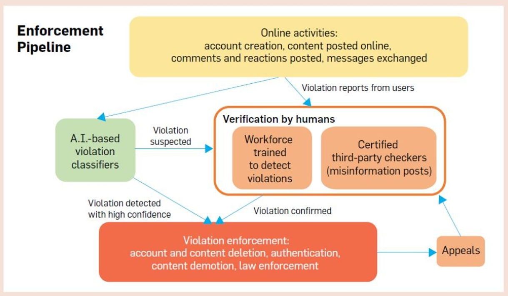

# JC2066 IT Professionals: Ethical, Legal and Social Issues - Notes

## L01 Course Introduction

### [Lecture 1 PPT](D:\2022A\JC2066\L01.Course Introduction.pptx)

### Examples: Consequences

* Waymo Collision (2018): Software drive more safely than human
* Frances Haugen (2021): Disclosure on Facebook's algorithm cheating
* Student Surveillance
* Student prefer working in **big tech**, for money rather than ethics
* Theranos Downfall (2018-22): Cheat consumers and get investment
* CRISPR (2019): gene-editing

### IT and Governance

* An immense gap between IT Pros and Governors (who have a **responsibility** for regulating tech)
* **Competing Values** (比较四宫格) isn't presented clearly with value, so **balancing** between is difficult

#### Example

* FBI requiring Apple to unlock the terrorist's phone (2015)
* Should tech include a **backdoor** for **law enforcement**?

### Emerging Technologies

* AR/VR/XR
* AI
* 5G

### Public concern

* Public's trust for big tech is falling
* Public calls for more regulation on big tech
* big tech is always found violating

#### Examples: Debates

* Stop on Prop 22 (Uber + Lyft Duopoly, 2020)
* Twitter banning Trump (2021)
* Platform's **obligation to police**
* **owner of data** and sharing / selling consent
* platform matching: business or tech

---

### Definition of a professional

> * relating to work that needs **special training or** **education**
> * having the **qualities** that you connect with trained
> * and skilled people, such as effectiveness, skill, organization, and **seriousness of manner**
> * having the type of job that is **respected** because it
> * involves a **high level** of education and training

### Central themes

> * design in the technology reflects a set of **values**
> * taking politics and social regulation into consideration
> * When competing values are at stake, they must be weighed against one another. **Who weighs these values and how**? 
> * work with the value is part of civic duty

### Evolution of Governance

> * 1st Generation: researchers / hackers
> * 2nd Generation: commercial
> * 3rd Generation: politics

## L02 Ethical Foundations & Research Ethics

### [Lecture 2 PPT](D:\2022A\JC2066\L02.Ethics.pptx)

### Broader Themes in the Answer

> * It matters **who builds** technology
> * It matters how the technology is **funded**
> * both **intentional** and **unintentional** harm
>     * intentional: monetization (货币化) of personal data, addictive tech
> * the **cost** outweigh the **potential benefits**
>     * who's responsibility to act

### Personal Ethics

#### Example

* Theranos (2018): if you don't fraud, you never get investment. Fake it till you make it.
* Stealing Trades Secrets (2020): make immoral money
* Water Gate (1974, Richard Nixon)

#### Conclusion

* important, but not especially interesting
* no good argument for cheating, lying, stealing
* still connected with social ethics

### Professional Ethics

#### Compare: Biomedical vs Computer Science

| Category    | Biomedical                   | Computer Science            |
| ----------- | ---------------------------- | --------------------------- |
| Ethics      | Hippocratic oath: do no harm | ACM Code of Ethics          |
| Requirement | Pro licensure                | -                           |
| Review      | by IRB[^1]                   | Only for human research[^2] |
| Regulation  | by FDA                       | No single regulatory body   |

[^1]: Example: CRISPR (2019)

[^2]: Machine Learning is neither ethically reviewed nor governed

#### [Google Code of Conduct](https://abc.xyz/investor/other/google-code-of-conduct/)

1. Serve our Users
2. Support and Respect Each Other
3. Avoid Conflicts of Interest
4. Preserve Confidentiality
5. Protect Google's Assets
6. Ensure Financial Integrity and Responsibility
7. Obey the Law

##### Conflicts of Interest (CoI)

* definition: personal interest affect the benefit of a third party
* factor: financial, commercial or legal
* examples:
    * manager's relative gets biggest raise
    * receiving expensive gifts from clients
* handling: disclosure & recusal

#### Role of Engineers

* to integrate science and tech into life
* to put technology into use with responsibility
* to build a foundation for sustainable growth

##### Engineering Ethics

* responsibility to **public**
* responsibility to **profession**
    * serve only in areas of their compete
    * zero-tolerance to fraud and corruption
* responsibility to **people**
    * act professionally, avoid CoI
    * compete fairly
    * provide progression possibility under supervision
    * treat people fairly

#### Computing Ethics

* access resources only when authorized or for public good
* design **robustly and secure** system
* **evaluate** system and impact comprehensively
* **respect privacy**

#### [ACM Code of Ethics](https://www.acm.org/code-of-ethics)

##### General Principles

1. Contribute to society & human well-being, all people are **stakeholders** in computing
2. Avoid harm
3. honest, trustworthy
4. fair, not to discriminate
5. respect the work in new ideas, inventions
6. respect privacy
7. honor confidentiality 名誉保密

##### Professional Responsibilities

1. high quality in process and product
2. maintain high standards of professional competence
3. respect professional rules
4. accept and provide appropriate professional review
5. evaluate potential outcomes
6. perform work only in areas of competence
7. foster public understanding of technology and consequences
8. access resources only when authorized or for public good
9. design robustly and secure system

#### Legal Liability

* Software professionals are **not liable** for their work product
* according to **End User Licensing Agreement** (EULA)

### Social / Political Ethics

#### Social Science

* assess the **benefits** and **costs** of new technology
* after assessment, make a **legitimate** judgment: **governance** challenge

#### Social Science as Technology

* Structured, scientific **thinking**
* **Open environment** based on reasoning and facts
* Advance fundamental **understanding** of the world
* Help policy problems

#### Example: Fake news

* Common (with people sharing more -> User's responsibility)
* Unable to identify
* Change people's underlying beliefs
* **Crowd out other information**
* Use people's trust in news source
* **Source matters more than the content**
* Platform use algorithm to spread it wider

#### Governance In Lifecycle of Technology

* Preferences
* Organized interests
* Aggregating Preferences
* Decision-making
* Implementation

#### Who and when should be governing

* People: Inventors, Companies, Industries, Consumers, Citizens, Governments, International Organizations
* Time:
    * Negative public consequences
    * long-term harm
    * threaten fundamental values and individual rights

## L03 AI & Algorithms

### [Lecture 3 PPT](D:/2022A/JC2066/L03.AI.pptx)

### AI functions

#### Natural language

* Text Extraction
* Language Translation
* Sentiment analysis 情感分析
* Web Search

#### Speech

* Speech recoginiton
* Text-to-speech
* Chatbot
* Voice verification (voice lock)

#### Perception

* Object and face recoginition
* Scene segmentation (Abstraction)
* Image classification
* Image captioning (add description)

#### Robotics

* Self-driving car
* Rescue robot
* Warehousing
* Game-playing

#### Logic

* Theorem proving
* Fault diagnosis

### Definition of AI

* AI is an attempt of reproduction of **human reasoning and intelligent behavior** by computational methods
* [Russell & Norvig] discipline that systemizes and automates reasoning processes to create think and act **like humans or rationally**

|       | like humans       | rationally      |
| ----- | ----------------- | --------------- |
| think | cognitive science | laws of thought |
| act   | Turing test       | rational agents |

#### Thinking like humans

| From: Modelling How humans think                             | To: Cognitive Science                           |
| ------------------------------------------------------------ | ----------------------------------------------- |
| subjective                                                   | Top-down from psychology to case           |
| Psychological experiments based on their cognitive theory | Bottom up use neuropsysiological structure |
| studied this by brain-imaging                                |                                                 |

* Cognitive Science differs from AI in disciplines
* because it's hard to model how humans brain work

#### Acting like humans

* CAPTCHA: A Turing example
* No machines passed

#### Thinking rationally

| Logicist tradition                                           | Limitations                                            |
| ------------------------------------------------------------ | ------------------------------------------------------ |
| Syllogisms: **argument structures** yield correct  conclusions given correct premises | Not always apply **logical deliberation**              |
| Logic: **notation and rules** for derivation for thoughts    | Difficult to represent **informal** knowledge in logic |
|                                                              | Do wrong in uncertainty                                |

#### Acting rationally

* Rationality concerns what **actions** are made rather than **thought** process behind
* maximizing the expected **utility** based on their circumstances and **knowledge**
* incomplete knowledge and out-of-control circumstance can fail the most rational solution

### AI Structure

* Input into **Agent**
    * Abilities
    * Global / Preferences
    * Prior Knowledge
* Agent **action** to Environment
* **Environment** re-input into Agent
    * Observations
    * Past Experiences
* Input -> Agent --(Action)-> Environment -> Agent

#### Machine Learning Model

* Training data (experience) -> ML Algorithm (task) -> model
* Training data : (features x -> Target y)
* New example (x new) -> model -> Output (y predicted)
* can't easily go beyond the **experience of training**

#### Machine Learning Tasks

* Supervised Learning
    * Classification
    * Regression 回归分析 (e.g. predict temperature)
* Unsupervised Learning
    * Clustering (classifying articles into topics)
    * Representation and embeddings (words same in meaning)
* Reinforcement Learning
    * Make decisions based on expected reward

#### Risk of AI/ML

* Failure: **Unpredictability**
    * when things go wrong due to human or environment, difficult for AI to correct or understand
    * these scenes can be very hard to predict
    * the **unknown-unknown** situation: don't know how to correct, don't know it's wrong
    * model performance will also change as time passes
* Error: Poor performance
    * **Data is expensive** to collect
    * can be solved by acquiring more data at its weakest
    * Designer can **rule on non-ML based fallbacks** to give user protect
* Error: Low confidence or False High confidence
    * High confidence is **unknown-unknown** errors
    * give user some **error collection or feedback**
    * **non-AI/ML fallbacks** + communicating with the user
* Error: Relevance Errors
* Error: Multiple users and input

#### [Important]AI Scenarios

* AI probably better
    * **Recommending** different content to different users
    * **Prediction** of future events
    * **Personalization**
    * **Natural language interactions**
    * An agent or **bot**
    * UX does not rely on predictability

* AI probably not better
    * The **cost** **of errors** is very high and overweighs the benefits of a small increase in performance
    * Users, customers, or developers need to understand exactly **everything that happens** in the code
    * People explicitly convey that they **do not** want a task to be automated or augmented

## L04 Machine Learning Fairness

### [Lecture 4 PPT](D:/2022A/JC2066/L04.ML Fairness.pptx)

### Investigating Bias

#### Definition of ML Failure

* A ML System do something **undesirable** or **unanticipated**
* A sociotechnical problem
    * Only technical approaches do not solve the problem

#### ML Bias

* Bias are **protected attributes** that algorithms impede upon
* point of machine learning: to prevent traditional discrimination

#### Types of Errors

* Imbalanced Data Sets
* Removing Sensitive Features (e.g. Racial Discrimination)
    * If a credit score model removes races, the system will learn to discriminate
    * For different races, facial recognition will be slightly different technically

* Lurking Bias in Features (e.g. White-face only recognition)
* Poorly Framed Problems (e.g. Judge criminal on face)

### Act Against Bias

#### Publicly Regulated Domains

* legal precedent protects people from discrimination

#### Civil Rights Act: What is Bias (Defined by Law)

* Disparate **Treatment**
    * Formal: Explicitly considering class membership, even if it’s relevant
    * Informal: Purposefully attempting to discriminate without direct reference to class membership
* Disparate **Impact**
    * **Four-fifths rule**: Selection rate for a certain group is less than 80% of rate for group with highest selection rate, there is adverse impact.
    * **Alternative practice**: Could the same goal be achieved using a different procedure that would result in a smaller disparity?

#### Against Bias, Beyond The Law

* Worker Organization (e.g. Worker Union)
* Design & Business Decisions
* Moral impreatives
* Equity, Inclusion, Belonging

#### Important Concept

* **Designer**: should be aware of & identify bias in an algorithm before it launches
* **User**: stay vigilant and assess algorithms' fairness & **teach others to do the same** (trust less of the systems)
* **Watchdogs and protection agencies**
* Understand fairness varies socially, culturally and contextually

### Ameliorating bias

#### Grouping Terminology

* **Privileged Group** is expected to get the favorable outcome more often than they should
* Unprivileged Group is expected to get less
* **Privilege(=inequality & disparate treatment)** is what we actually care about
    * Privileged group is NOT EQUAL TO Privilege

#### [Important]How to Identify Bias

##### Disparate Impact

* Idea is: each group should have an **equal opportunity of achieving** the favorable outcome
* Calculate: favorable% for unprivileged group / favorable% for the privileged group
* If the value < 1, there is a benefit toward the privileged group.

##### Statistical Parity 统计均等

* Idea is: Classified person $\sim$ Underlying Population

    > *A* 與非 *A* 兩個群體，被分類到各個類別的比例一樣。例如某個行業的從業人口男女比為 1:2，那麼受僱用的男女比也應該接近 1:2。

* Calculate: favorable% for all - favorable% for unprivileged

* If the value < 0, there is a benefit toward the privileged group

##### Equal Opportunity

* Same correct classification possibility for each group

    > 也就是「可以入選的人，不論身在 A 或非 A 之中，入選的機率都一樣」。

* Calculate: **true positive**% for unprivileged - true positive% for privileged

* If the value < 0, there is a benefit toward the privileged group

##### Average Odds

* Same incorrect  classification possibility for each group
* Calculate: **false positive**% for unprivileged - false positive% for privileged
* If the value < 0, there is a benefit toward the privileged group

#### Correct Misconceptions

* Bias can start anywhere, not only data
* Race & gender are protected traits (not included in the data) so they are **least obvious bias**
* Algorithm sometimes create bias
* Bias is not fixable, and bias exist in all models

### HOW TO SOLVE #4

* **Constraints**: Set a fairness constraint (e.g. a minimum disparate impact score), so classifier will be as accurate as possible
* **Reweighting**: weight examples in each group/label differently
* **Optimized Pre-processing**: A probabilistic transformation that modify the features and labels in the training data
* **Adversarial Debiasing**: Choose the classifier cannot carry any group discrimination information, while maximize accuracy
* **Reject-option-based Classification**: provide more favorable outcome to unprivileged group

## L05 Privacy & Surveillance

### Examples of Privacy Deprivation

* The Digital Panopticon: **CCTV**
    * Citizens can monitor the roads online and report suspicious
* **Facial Recognition**
    * Applications
        * Verification (FaceID)
        * Photo Tagging
    * Surveillance
        * Used at concert
        * to identify suspect, stalker
    * DeepFace
* An age of **Surveillance Capitalism**

> An economy driven by massive data collection (and privacy violations) where a small number of companies possess vast troves of information about individual and collective experience.

### Definition of Privacy

* Aristotle's Early View: **The Public / Private Sphere**
    * Individuals have interests in shielding the public (**politics and commerce**) from seeing/hearing what happens in private
* **Social Context**: We want to be able to control *what is known about us, how we present ourselves*
    * Individuals have **privacy interests in public** or in private
* **Privacy**: **The information about ourselves** (self-determination), **pursuit of relationships with others** (intimacy)
    * central to *individual autonomy* or *self-determination*
    * Violation of privacy impose will **harm**, causing loss of *freedom, intimacy, self-control*

#### Four Categories of Privacy Harms

* Information **Collection** (Surveillance)
* Information **Processing** (Big Data)
* Information **Dissemination** 传播
    * Breach of confidentiality
    * Disclosure to third party
    * Blackmail
* Invasion of Privacy
    * Intrusion
    * Decision interference

### Privacy and Big Data

* individuals give up information about themselves, creating *digital exhaust streams*
* algorithm make **inferences and predictions** from these data

#### Aggregation & Inference

* When you are in public, you're being noticed
    * your figure is recognized, purchase history is recorded
* **Classification**, The Information Ecosystem
    * Example: Acxiom's Life Stage Clustering System *PersonicX*
    * for **Ad tech**, can be used to promote products precisely
    * **Surveillance Capitalism** economy

### Privacy and Rival Values

* Security: Should tech provide a shortcut for government?
    * People moving to Telegram and Security for end-to-end platforms cannot be monitored
* Personal Safety
    * Apple scan iCloud photos in search of child abuse
    * will see private information
* Innovation
    * study DNA samples to make drugs

### HOW TO SOLVE #5

* A balance of intersets
* Data available only for meaningful analysis
    * For the public good
        * examine **fairness** in decision making
        * **medical** research and health care improvement
        * national security
    * for the private good
        * personalized advertising
* Protecting Individual Privacy
    * **Personal value** of value and respect for individual
    * **Freedom** of speech and activity
    * Avoiding **Discrimination**
    * Regulation & laws

#### Approach: Anoymization

* Basic Idea: Drop personally identifying features from the data
* Gender and Birth year (Age) are protected characteristics
* De-Anonymization can be easy: Given ZIP Code, birthdate, sex
* Example: America Online (2006): its data get deanonymized by NYT

#### Approach: Encryption

* **Encoding** information so only authorized can access
* The Aim of Encryption:
    * Keep data private/secure
    * Prevent eavesdropping 窃听 (so we use end-to-end encrypt)
    * Guarantee data not changed in transfer
* Who receive the data must be able to **decrypt**
* **Symmetric Cryptography**
    * Encryption and Decryption Algorithm use the same **private key**
    * Example: Caesar Cipher
* **Public Key Cryptography**
    * Encrypt use Public Key, Decrypt use Private Key
    * Example: RSA Public key (the product $pq$), Private ($p$ and $q$, two large primes). This based on the fact that large number are hard to factorize, and data is represented by numbers

#### Approach: Differential Privacy

* Design Intuition: Two databases, one with extra row of personal data. The statistical of two tables should be identical
* Such that: a **counted subject** should be subject to no more harm from data analysis than uncounted subject
* system can't distinguish single row
* **Randomized Response**: Give people probability to answer sensitive question
* **Noise Injection**: Using normal distribution to add random noise to **answer** when the database is queried  

## L6 Misinformation

### [Lecture 6 PPT](D:/2022A/JC2066/L06.Misinformation.pptx)

### The Public Sphere

#### Requires

* **Rights** to expression and association
* Real opportunities to **express** oneself in public discussion
* **Access** to instructive **information** on matters of public concern from reliable sources
* Chances to **hear** a **diverse** set of views on issues of public concern
* opportunity to explore issues with others to identify and advance **common interests** by **communicative power**
* Norms & Dispositions
    * Regard for Truth
    * Orientation toward the common good
    * civility

In short: given the opportunity to learn about **public concern** and then **express freely, hear diversely**

#### Now: The Digital Public Sphere

* More content providers & distributers (every person can write & forward)
* Consumers enjoy greater choice
* Particular content directed (targeted) at users (by providers, advertisers, or platform)

| Optimists                         | Pessimists                     |
| --------------------------------- | ------------------------------ |
| Easy communication                | Destruction of truth           |
| No gatekeepers                    | Polarization                   |
| Diversity                         | Loss of civility               |
| Increase participation            | Lack of profession             |
| Reduce costs of communication     | Content without public purpose |
| Better for citizen when vs elites |                                |

#### Sunstein's Warning

* Hashtag Fake News Example: #ColumbianChemicals (A hoax in 2014)
* Multi-platform **Fake news** cause more alerts
* **Conspiracy Theories**

### Social Media and Society: Question

* prevent people from exposure to diverse views? (**echo chamber**)
* promote **polarization**?
* how widespread is **misinformation**? can people tell from truth?

#### Echo chamber

* ranking algorithm do not limit people's exposure to cross-cutting interactions
* Social media seems to **expand people's interactions** outside their closest social circles

#### Polarization

* a minority of **highly active individuals** are responsible for the overwhelming majority of hyper-partisan content
* polarization has increased most among the group **least likely to use** social media (oldest)
* a casual estimate of the impact of Facebook on polarization (2018):
    * freed up time
    * less polarization on policy / news issues
    * no less affective polarization

### Misinformation

#### Definition

| Misinformation | Disinformation | Malinformation |
| -------------- | -------------- | -------------- |
| False Info     | False Info     | True Info      |
| Non-intent     | Intent         | Intent         |

* False news: **Intentionally** and verifiably false, presented as genuine

### HOW TO SOLVE #6

Do not take...

* Technological Determinism
* Commercial Determinism
    * Facebook can, will and must react

#### Incentives 激励

* User Incentive
    * Fake news exist because people engage with it
* Content-provider (writer) Incentive
    * content -> money + influence
    * agreeable & emotion-raising content
* Platform Incentive
    * user engagement -> money
    * will promote eye-catching & extreme content to maximize click-through rates

#### Content Moderation

* Human
    * Large member of moderators
    * Have guidelines, but:
    * different people have different individual standards
    * May suffer psychological toll
* Automated Filtering
    * Easy to process large quantities
    * Uniform filtering standard
    * Low accuracy, because:
    * Context is critical for content moderation

* So use a **Human/Machine Hybrid Systems**

#### Type of Moderation (by platform)

* Flag questionable content
* Rank down / Limit spread
    * still available
    * can potentially raise again by user reaction
* Delete & Modify
    * alternative edition can be posted
    * take time before it's detected
* Sequester User / Content (Shadow ban)
    * Seen by self, Not seen by others
    * decreased reaction will discourage writer
* Suspend / Expel User from Platform
    * Come back under a different username
    * Effective for well-known people

#### Platforms as the New Governors

##### Aim

* to protect free speech & resist against government requests
* co-operate **social responsibility** and identity
* consistent with user norms & expectations + advertiser preferences

##### Requirement

* maintain a fair opportunity
* protect individuals' right to **transparency**

#### Self-regulation is not enough

* restrictive of free speech
* permissive of misinformation
* influential in polarization

##### Government do

* already do: law standards around what must be removed
* should do: transparency around content moderation, data, information
* should do: algorithmic amplification

#### The Potential of Technologist

* help users understand their online behavior (information diet, truthfulness & civility)
* Provides middleware, users can access info according to preference
* Create better way for good info into money & influence

##### Role of Citizens

* Distinguish falsehood
* Resist against casual communication (write & forward to spread)
* Report abuses
* avoid narrow news diets
* learning about interests, perspectives, and pain of others.

## L07: Inequality and Justice

### [Lecture 7 PPT](D:/2022A/JC2066/L07.Inequality.pptx)

### The Concept of Equality (The most fundamental value)

> The extent of a man's, or a people's **liberty** to choose to live as he or they **desire**, must be weighed against the claims of many other values, of which equality, or justice, or happiness, or security, or public order are perhaps the most obvious examples.
>
> For this reason, liberty cannot be **unlimited**. - Isaiah Berlin
>
> In short: Liberty may clash with other and must be limited.

#### Is equality equal?

> We hold, these truths to be self-evident: that all men are created equal... - Declaration of Independence

Equality != Equal in All Characteristics

#### Definition of Equality

* Equality is the central and fundamental ideal behind any flourishing society
* Equality is a fundamentally comparative concept
* Equality means not we are equal in outcomes or opportunities, but that every person **has enough**

#### Values Interactions

##### Equality as Status Ideal

* Equality = how we stand **in relation to one another**
* we are **treated as an equal**, matter equally, interests count equally. -> **Justice**
* Against Caste, 2nd-class citizenship, domination, oppression, subjugation
* Stands Against 5 Faces of Oppression (Exploitation, Marginalization, Powerlessness, Cultural Imperialism, Violence)

##### Equality as Distributive Ideal

* Equality of Outcome
* Equality of Opportunity
    * Differential Treatment
    * Example: in College Admission
* Global Inequality
    * decreasing
    * the Citizenship Premium (Location > Social Class)

### Equality & Inequality in Tech

#### Tech Produces Inequality

##### Gig Economy

* Independent contractors / On-call workers
* Example: Uber / Lyft
* Result: Disadvantages for the worker
    * Lack of minimum wage + overtime payment + paid time-off
    * Lack of insurance + retirement saving
    * Workers are **paid by task**, calculated are algorithmically allocated, they **have no control**
* Result: **A transfer of risk** from employee to gig worker
    * Short term contracts
    * Flexible work hours
    * Reduced employment benefits
* Proposition 22:
    * Law previously defined platform workers as employees
    * Prop22 undid these employee protection
    * legal racial wage code (effected mainly colored, immigrant men)

##### Gentrification (中产阶级化) & Regional Income

* Income differs greatly between different areas
* Generally White have higher income

### Diversity and Inclusion

#### Fairness Argument

* Example: Higher positions (like Executives) are mainly **white men**
* In lower positions (like Professionals) more women & Asian engaged

#### Epistemic Benefits

* Lack of Diverse Representation in the Tech
* Problems solved for **white guys in their 20s**
* Ecosystem didn't prioritized diversity

#### Social Science Argument

* Diversity trumps Ability
* Diversity Prediction Theorem: **Collective Error** - Average Individual Error - Prediction Diversity
* Do not think **Diversity as Ability** so need to add diversity
    * reject this **predatory view** of diversity, where worth of underrepresented is tied to their add-value
    * add diversity naturally

### HOW TO SOLVE #7

* Address DEI (Diversity Equality & Inclusion) in Multi-stages
    * Education, Hiring, Retention, Position Advance
* Company Approaches
    * Implement Comprehensive D&I Strategies
        * D&I Director
        * Diversity Goal
        * Bonuses for Underrepresented Background
        * Unconscious Bias Training
        * Employee Resource Groups (ERG)
        * Outcome
            * Lower Unfairness & Mistreatment
            * Lower Sexual Harassment & Bullying & Stereotyping
            * **Reduction in Unfair Experiences**
    * Create Inclusive Cultures
        * Work Power
        * Union, however Limited Participation
    * Develop Effective and Fair Management Processes
* Models of Regulating the Power of Big Tech Companies
    * Require equal access to address gatekeeper power
    * prevent dominant platforms from leveraging their platform in other business lines
    * tackle accumulation of power by preventing mergers/acquisitions or breaking up of major tech

## L08 Smart City and e-government

### [Lecture 8 PDF](D:/2022A/JC2066/L08.pdf)

### Smart City

* From: **Innovation, technology**
* To: **strong economy, high quality**

#### Smart Government

* **data analysis** to improve service delivery, policy making and public management
* technologies to enhance quality
* **infrastructure** to empower smart living/economy, sustainable development
* talents and abilities of **non-governmental sectors**

### Big Data

* **Volume**
* **Complexity** (Structured and Unstructured data)
* Volatility
* Variability
* Veracity
* Possibilities of **Personalization**
* Vulnerability

#### Data-rich Environment

* Small-scale data is important in policy and public management research
* Human intelligence and insights matter

### Implications for Smart City

* Our living environment determines our health

## L12
