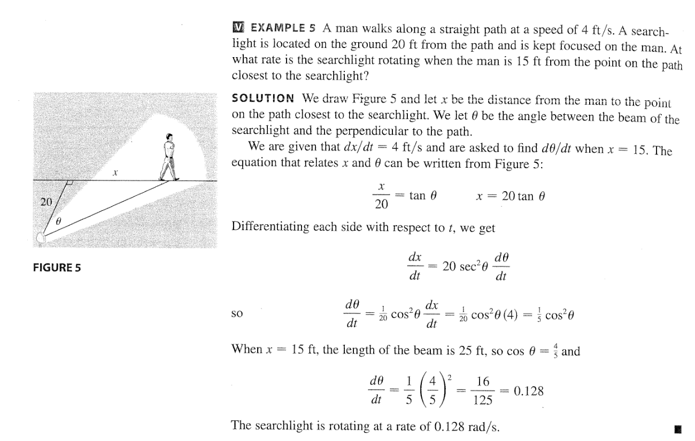

# MA1300 - Enhanced Calculus and Linear Algebra Ⅰ - Notes

## [Textbook](D:/2022A/SingleVariableCalculus7E.pdf)

## [Chapter 0 Functions](D:/2022A/MA1300/ch00.pdf)

## [Chapter 1 Limits](D:/2022A/MA1300/ch01.pdf)

### 1.4 Precise Definition of Limit

| | $\lim \limits_{x \to c}=L$  | $\lim \limits_{x \to c} \neq L$ |
| --- | --- | --- |
| Given | $\forall\ \epsilon > 0$ | $\exist\ \epsilon > 0$ |
| Given | $\exist\ \delta >0$ | $\forall\ \delta >0$ |
| Given | $\forall\ 0 < \left |x - c \right | < \delta$ | $\exist\ 0 < \left |x - c \right | < \delta$ |
| Result | $\left |f(x)-L\right |< \epsilon$ | $\left |f(x)-L\right |> \epsilon$|

### 1.9 Continuity at a point (p. 82)

If $f$ is continuous at a, 
$$
\lim_{x\to a}f(x) = f(a)
$$
which implies that:

* $f(a)$ is defined
* $\lim\limits_{x \to a } f(x)$ exists

### Self Practice 2

(4) Prove: $\lim \limits_{x\to 0}\sqrt{x^3+x^2}\sin\frac{\pi}{x}=0$

> $$
> \sqrt{x^3+x^2}=|x|\sqrt{1+x}\\
> \underline{-\sqrt\frac{1}2|x|}\leq-\sqrt{x^3+x^2}\leq\sqrt{x^3+x^2}\sin\frac{\pi}{x}\leq\sqrt{x^3+x^2}\leq\underline{\sqrt\frac{3}2|x|}\\
> \mathrm{where} \ 0< |x|<\frac{1}{2}\\
> \lim\limits_{x\to0}\left(-\sqrt\frac{1}2|x|\right)=\lim\limits_{x\to0}\left(\sqrt\frac{3}2|x|\right)=0
> $$

(12) Prove: $\lim\limits_{x \to 0} f(x)=0$, where
$$
f(x)= \left\{\begin{aligned}
&x^2 &x\in \Q \\ 
&0 &x \notin \Q
\end{aligned}\right.
$$

> $$
> 0\leq f(x) \leq x^2\\
> \lim_{x\to0}0=\lim_{x\to0}x^2=0
> $$

(13) Evaluate: $\lim\limits_{x \to 2}\frac{\sqrt{6-x}-2}{\sqrt{3-x}-1}$

> $$
> \begin{align}
> \lim_{x\to2}\frac{\sqrt{6-x}-2}{\sqrt{3-x}-1}&=\lim_{x\to2}\frac{(6-x-4)\left(\sqrt{3-x}+1\right)}{(3-x-1)\left(\sqrt{6-x}+2\right)}\\
> &=\lim_{x\to2}\frac{(2-x)\left(\sqrt{3-x}+1\right)}{(2-x)\left(\sqrt{6-x}+2\right)}\\
> &=\lim_{x\to2}\frac{\sqrt{3-x}+1}{\sqrt{6-x}+2}=\frac{1}{2}
> \end{align}
> $$

(15) Prove: $\lim\limits_{x \to 0} f(x)$ DNE, where
$$
f(x)= \left\{\begin{aligned}
&0 &x\in \Q \\ &1 &x \notin \Q
\end{aligned}\right.
$$

> Template for proving limit is not $f_0$: 
> $$
> \exist\  \epsilon>0, \forall\  \delta, \exist\  0 <\left|x_1-x_0 \right|< \delta\Rightarrow \left|f(x_1) - f_0\right|\geq 0
> $$
> Template for proving limit DNE:
>
> $n\to\infin, {a_n}\to x_0\Rightarrow f(a_n)\to\lim\limits_{x\to x_0}f(x)$
> $$
> \{a_n\}\to x_0, \{b_n\}\to x_0, \lim_{n\to\infty}f(a_n)\neq\lim_{n\to\infty}f(b_n)
> $$
> More precisely for this question:
> $$
> \begin{align}
> n\to\infty, \bold{A_n = \frac{1}{n}\to0, B_n = \frac{\sqrt 2}{n}\to0}\\
> \exist\ \epsilon = \frac{1}{2}, \forall\ \delta, \exist\ (n+1) = \lceil\frac{\sqrt 2}{\delta}\rceil+1\\
> B_{n + 1} = \frac{\sqrt 2}{n + 1}=\frac{\sqrt 2}{\lceil\frac{\sqrt 2}{\delta}\rceil+1}<\frac{\sqrt 2}{\frac{\sqrt 2}{\delta}}=\delta\\
> |f(B_{n+1})-0| =1>\epsilon\\
> \therefore \lim_{x\to0}f(x)\neq0\\\\
> \exist\ \epsilon = \frac{1}{2}, \forall\ \delta, \exist\ (n+1) = \lceil\frac{1}{\delta}\rceil+1\\
> A_{n + 1} = \frac{1}{n+1} =\frac{1}{\lceil\frac{1}{\delta}\rceil+1} <\frac{1}{\frac{1}\delta}=\delta\\
> |f(A_{n+1})-1| =0>\epsilon\\
> \therefore \lim_{x\to0}f(x)\neq 1
> \end{align}
> $$

### Self Practice 3

#### Use the Definition of Continuity

(1, 2)

> * **Since $f$ is a rational function**
>
> * **and $a=1$ is in domain/$(1,\infin)$is a subset of domain**
>
> * so $\lim\limits_{x\to1}f(x)=f(1)$
>

#### Use Continuity to Evaluate Limit

(5)

> * Example: $\lim\limits_{x\to\pi}\sin(x+\sin x)$
> * Since $\sin t$ domain is $\R$, $\lim\limits_{x\to\pi}(x+\sin x)=\pi\in\R$,
> * So $\lim\limits_{x\to\pi}\sin(x+\sin x)=\sin\left(\lim\limits_{x\to\pi}(x+\sin x)\right)=\sin\pi=0$

### Self Practice 4

(4)

If $a$ and $b$ are positive numbers, prove $\frac{a}{x^3+2x^2-1}+\frac{b}{x^3+x-2}=0$ have at least one solution on the interval $(-1,1)$.

> $$
> \begin{align}
> f(x)&=x^3+2x^2-1,f(-1)=0\\
> f(x)&=(x^3+x^2)+(x^2+x)-(x+1)=(x^2+x-1)(x+1)\\
> g(x)&=x^3+x-2,g(1)=0\\
> g(x)&=(x^3-x^2)+(x^2-x)+(2x-2)=(x^2+x+2)(x-1)\\
> \Rightarrow H(x)&=\frac{a}{(x+1)(x-\frac{-1-\sqrt5}2)(x-\frac{-1+\sqrt5}2)}+\frac{b}{(x-1)(x^2+x+2)}\\
> x&\in(-1,\phi)\cup(\phi, 1), \phi=\frac{\sqrt5-1}2\\
> \lim_{x\to\phi^+}H(x)&=\infin+C=+\infin, \lim_{x\to1^-}H(x)=C-\infin=-\infin\\
> \textbf{As\ H(x)}&\bold{\ is\ continuous\ on\ (\phi,1),}\\
> \exist\ \delta_1>0,&\forall\ 0<\hat\delta_1<\delta_1, H(1-\hat\delta_1)<-1\\
> \exist\ \delta_2>0,&\forall\ 0<\hat\delta_2<\delta_2, H(\phi+\hat\delta_2)>1\\
> \bold{Let\ }\delta&=\min\left\{\frac{\delta_1}2,\frac{\delta_2}2,\frac{1-\phi}{3}\right\}\\
> &\left\{
> \begin{aligned}
> H(1-\delta)&< -1\\
> H(\phi+\delta)&>1\\
> H(x)&\textbf{\ continuous\ on\ }(\phi+\delta, 1-\delta)
> \end{aligned}
> \right.\\
> \Rightarrow H(x)&=0 \textbf{\ have\ at\ least\ one\ solution\ on\ }(\phi+\delta, 1-\delta)
> \end{align}
> $$

## [Chapter 2 Derivatives](D:2022A/MA1300/ch02.pdf)

### 2.2 The derivative as a function

Ex. if $f(x)=\sqrt{x}$, find $f'(x)$ with its domain.

> $$
> \begin{align}
> f'(x)&=\lim\limits_{h \to 0}\frac{\sqrt{x+h}-\sqrt{x}}{h}\\
> &=\lim\limits_{h \to 0}\frac{(x+h)-x}{h\left(\sqrt{x+h}+\sqrt{x}\right)}\\
> &=\lim\limits_{h \to 0}\frac{1}{\sqrt{x\color{gray}+h}+\sqrt{x}}\\
> &=\frac{1}{2\sqrt{x}} (x > 0)
> \end{align}
> $$
> $f(x)$ is not differentiable at $x=0$, because it corners at $x=0$.

Ex. Prove $\frac{\mathrm{d}x^n}{\mathrm{d}x}=nx^{n-1}$.

>$$
>\begin{aligned}
>f'(x)&=\lim\limits_{h\to 0}\frac{-x^n+(x+h)^n}{h}\\
>&=\lim\limits_{h \to 0}\frac{-x^n+x^n+{n \choose 1}x^{n-1}h^1\color{gray}+\dots+{n \choose k}x^{n-k}h^k+\dots+h^n}{h}\\
>&=\lim\limits_{h \to 0}\frac{{n \choose 1}x^{n-1}h+\dots}{h}\\
>&={n \choose 1}x^{n-1}=nx^{n-1}
>\end{aligned}
>$$

### 2.3 Differentiation formulas

#### Proof of Product Rule

> $$
> \begin{align}
> [f(x)g(x)]'&=\lim\limits_{h \to 0}\frac{-f(x)g(x)+f(x+h)g(x+h)}{h}\\
> &=\lim\limits_{h \to 0}\frac{-f(x)g(x)+[f(x)+f'(x)h][g(x)+g'(x)h]}{h}\\
> &=\lim\limits_{h \to 0}\frac{-f(x)g(x)+f(x)g(x)+f'(x)g(x)h+f(x)g'(x)h+f'(x)g'(x)h^2}{h}\\
> &=\lim\limits_{h \to 0}f'(x)g(x)+f(x)g'(x)\color{grey}+f'(x)g'(x)h\\
> &=f'(x)g(x)+f(x)g'(x)
> \end{align}
> $$

#### Proof of Quotient Rule

> $$
> \begin{align}
> \left[\frac{f(x)}{g(x)}\right]'&=\lim\limits_{h \to 0}\frac{\frac{f(x+h)}{g(x+h)}-\frac{f(x)}{g(x)}}{h}\\
> &=\lim\limits_{h \to 0}\frac{f(x+h)g(x)-f(x)g(x+h)}{g(x)g(x+h)h}\\
> &=\lim\limits_{h \to 0}\frac{[f(x)+f'(x)h]g(x)-f(x)[g(x)+g'(x)h]}{g(x)[g(x)+g'(x)h]\cdot h}\\
> &=\lim\limits_{h \to 0}\frac{f'(x)g(x)-f(x)g'(x)}{g^2(x)\color{grey}+g(x)g'(x)h}\\
> &=\frac{f'(x)g(x)-f(x)g'(x)}{g^2(x)}
> \end{align}
> $$

### 2.4 Derivatives of trigonometric functions

#### Proof of Limit formula (2)

> $$
> \begin{align}
> \because\cos 2\theta&=2\cos^2\theta-1=1-2\sin^2\theta\\
> \therefore\lim_{\theta\to0}\frac{\cos\theta-1}{\theta}&=\lim_{\theta\to0}\frac{-2\sin^2\frac{\theta}2}{\theta}\\
> &=-\lim_{\theta\to0}\frac{\sin^2\frac{\theta}2}{\frac{\theta}2}\\
> &=-\lim_{\theta\to0}\frac{\sin^2\frac{\theta}2}{\left(\frac{\theta}2\right)^2}\lim_{\theta\to0}\frac{\theta}{2}\\
> &=-\lim_{\theta\to0}\frac{\theta}{2}=0\\\textbf{another proof}\\
> \lim_{\theta\to0}\frac{\cos\theta-1}{\theta}&=\lim_{\theta\to0}\frac{(\cos\theta-1)(\cos\theta+1)}{\theta(\cos\theta+1)}\\
> &=\lim_{\theta\to0}\frac{-\sin^2\theta}{\theta(\cos\theta+1)}\\
> &=-\lim_{\theta\to0}\frac{\sin\theta}{\theta}\lim_{\theta\to0}\frac{\sin\theta}{\cos\theta+1}\\
> &=-1\times\frac{0}{1+1}=0
> \end{align}
> $$

#### Proof of Derivatives

> $$
> \begin{align}
> (\tan x)'&=\frac{\sin x'\cos x-\sin x\cos x'}{\cos^2x}\\
> &=\frac{\cos^2x+\sin^2x}{\cos^2x}\\
> &=\frac{1}{\cos^2x}=\sec^2x
> \end{align}
> $$

> $$
> \begin{align}
> (\cos x)'&=\lim_{h\to0}\frac{\cos(x+h)-\cos x}{h}\\
> &=\lim_{h\to0}\frac{\cos x\cos h-\sin x \sin h-\cos x}{h}\\
> &=\cos x\lim_{h\to0}\frac{\cos h-1}{h}-\sin x\lim_{h\to 0}\frac{\sin h}{h}\\
> &=\cos x\cdot0-\sin x\cdot 1\\
> &=-\sin x
> \end{align}
> $$

> * $(\cot x)'=\left(\frac{\cos x}{\sin x}\right)'=\frac{-\sin^2x-\cos^2x}{\sin^2x}=-\csc^2x$
> * $(\sec x)'=[(\cos x)^{-1}]'=\frac{-\sin x}{-(\cos x)^2}=\tan x\sec x$
> * $(\csc x)'=[(\sin x)^{-1}]'=\frac{\cos x}{-(\sin x)^2}=-\cot x\csc x$

### 2.6 Implicit Differentiation

#### Definition

Treat $y$ as a function of $x$.
$$
\begin{align}
\frac{\mathrm{d}}{\mathrm{d}x}y&=y'\\
\therefore\frac{\mathrm{d}}{\mathrm{d}x}y^2&=2yy'
\end{align}
$$

#### Example

Find the tangent line of the equation $2(x^2+y^2)^2=25(x^2-y^2)$ at $(3,1)$.

>$$
>\begin{align}
>2\frac{d}{dx}[(x^2+y^2)^2]&=25\left[\frac{d}{dx}x^2-\frac{d}{dx}y^2\right]\\
>2\cdot2(x^2+y^2)\cdot\frac{d}{dx}(x^2+y^2)&=25\left(2x-\frac{d}{dx}y^2\right)\\
>4(x^2+y^2)\left(2x+\frac{d}{dx}y^2\right)&=50x-25[2y\cdot\frac{d}{dx}y]\\
>4(x^2+y^2)(2x+2yy')&=50(x-yy')\\
>y'&=\frac{25x-4x^3-4xy^2}{4x^2y+4y^3+25y}\\
>\left.y'\right|_{x=3}&=-\frac9{13}
>\end{align}
>$$

#### Example

* Car A is traveling west at $40$ km/h and car B is traveling north at $ 50$ km/h. 
* Both are headed for the intersection of the two roads. 
* At what rate are the cars approaching each other when car A is $0.6$ km and car B is $0.4$ km from the intersection?

> $$
> \begin{align}
> \frac{dx}{dt}&=40\\
> \frac{dy}{dt}&=50\\
> D&=\sqrt{x^2+y^2}\\
> \frac{dD}{dt}&=\frac{d}{dt}\sqrt{x^2+y^2}\\
> &=\frac{d}{dt}(x^2+y^2)\cdot\frac12(x^2+y^2)^{-\frac12}\\
> &=\frac{2x\frac{dx}{dt}+2y\frac{dy}{dt}}{2\sqrt{x^2+y^2}}\\
> &=\frac{2(0.6\cdot40+0.4\cdot50)}{2\sqrt{0.6^2+0.4^2}}
> \end{align}
> $$

>  **Important!** $\frac{d\tan\theta}{dt}=\frac{1}{\cos^2\theta}\color{red}\frac{d\theta}{dt}$

### Aware of $f(0)$ Case

Webwork 2.1 (3)
$$
f(x)=\left\{\begin{align}&-5x^2+2x&x<0\\&8x^2-3&x\geq0\end{align}\right.
$$

> According to the definition of the derivate, to compute $f'(0)$,
>
> * $\lim\limits_{x\to 0^-}\frac{f(x)\color{red}-f(0)}{x-0}=\lim\limits_{x\to 0^-}\frac{-5x^2+2x\color{red}-3}{x}=\lim\limits_{x\to0^-}{-5x+2+\frac{3}{x}}$ DNE
> * $\lim\limits_{x\to0^+}\frac{f(x)-f(0)}{x-0}=\lim\limits_{x\to 0^+}\frac{8x^2-3-(-3)}{x}=\lim\limits_{x\to 0^+}8x=0$
> * So $f'(0)$ is undefined.

### L' hospitals Case

Webwork 2.3 (4) Find $\lim\limits_{x\to 0}\frac{\cot 5x}{\csc x}$

> $$
> \begin{align}
> \lim_{x\to0}\frac{\cot5x}{\csc x}\left(\frac{\infin}{\infin}\right)&=\lim_{x\to0}\cot5x\sin x\\
> &=\lim_{x\to0}\frac{\sin x}{\tan 5x}\left(\frac00\right)\\
> &=\lim_{x\to0}\frac{\cos x}{\frac{5}{\cos^25x}}\\
> &=\lim_{x\to0}\frac15=\frac15
> \end{align}
> $$

### [Important] $\frac{\mathrm{d}}{\mathrm{d}x}|x|=\frac{x}{|x|}=\mathrm{sgn\ } x$

> Proof: $|x|'=\left(\sqrt{x^2}\right)'=\frac12(x^2)^{-\frac12}\cdot 2x=\frac{x}{\sqrt{x^2}}=\frac{x}{|x|}$
>
> Example: (Webwork 2.4 (3))
>
> * $|\sin x|'=\frac{\sin x}{|\sin x|}\cdot \cos x$
> * $\sin|x|'=\frac{x}{|x|}\cdot\cos|x|=\frac{x}{|x|}\cdot\cos x$

### Double-Implicit Differenation

Self Practice 8 (5) $l\sin\alpha=50$, $\frac{d (l\cos\alpha)}{dt}=2$, Solve $\frac{d\alpha}{dt}$ when $l=100$

>$$
>\begin{align}
>l\sin\alpha&=50\\
>\Rightarrow l&=\frac{50}{\sin\alpha}\\
>\frac{d(l\cos\alpha)}{dt}&=2\\
>\Rightarrow \frac{d(50\cot\alpha)}{dt}&=2\\
>\frac{d\cos\alpha}{dt}&=-\frac{1}{\sin^2\alpha}{\color{red}\frac{d\alpha}{dt}}=\frac{2}{50}\\
>l=100&\Rightarrow\sin\alpha=\frac{\pi}6\\
>\left.\frac{d\alpha}{dt}\right|_{l=100}&=-\frac{1}{25}\sin^2\alpha=-\frac1 {100}
>\end{align}
>$$

### Midterm

#### Limit Proof by Definition

Midterm 2(a) Prove $\lim\limits_{x\to 0}\frac{x-2}{x^2+x+1}=-2$

> $$
> \begin{aligned}
> \forall\ \epsilon&>0\\
> \exist\ \delta&=\min\left\{1, \frac{3\epsilon}{20}\right\}\\
> \forall\ 0&<|x|<\delta\\
> |f(x)-(-2)|&=\left|\frac{2x^2+3x}{x^2+x+1}\right|\\
> &=|x| \left|\frac{3+2x}{(x+\frac12)^2+\frac34}\right|\\
> &\leq|x|\left|\frac{3+2x}{\frac34}\right|\\
> &\leq |x|\left|\frac{3+2}{\frac34}\right|(\delta \leq1)\\
> &=\frac{20}{3}|x|\\
> &<\frac{20}{3}|\delta|<\epsilon
> \end{aligned}
> $$

#### Limit DNE Proof by Definition

Midterm 2(b) Prove $\lim\limits_{x\to0^-}\frac{\sin\frac1{x^2}}{x^2}$ DNE

> $$
> \begin{align}
> \textbf{Suppose}\lim_{x\to0^-}\frac{\sin\frac1{x^2}}{x^2}&=L\\
> \textbf{by Definiton, Let}\ \epsilon&=1\\
> \forall\ \delta&>0\\
> \forall -\delta&<x<0\\
> \rightarrow\left|\frac{\sin\frac1{x^2}}{x^2}-L\right|&<1\\
> \textbf{Let }x_0&=-\frac{1}{\sqrt{2n\pi+\frac\pi2}}\\
> -\delta &<x_0<0\\
> \textbf{However}\left|\frac{\sin\frac1{x_0^2}}{x_0^2}-L\right|&=\left|2n\pi+\frac\pi2-L\right|>1
> \end{align}
> $$
> Between each two $f(x_0)=2n\pi+\frac\pi2$, there is a gap of $2\pi> 2$, thus there is no $L$ such that all $|f(x_0)-L|\leq1$.

#### MVT

Midterm 4 $f(x)$ continuous on $[0, n]$, $f(0)=f(n)$, Prove: $\exist\ x \in[0, n - 1]$, $f(x)=f(x+1)$.

> $$
> \begin{align}
> \textbf{Let } g(i)&=f(i)-f(i+1)\ (0 \leq i \leq n - 1)\\
> \textbf{Case 1}\\
> g(0)&=g(1)=\dots=g(n-1)=0\\
> \textbf{Case 2}\\
> \exist\ g(a)&>0, g(b)<0\\
> \textbf{According}&\textbf{ to MVT,}\\
> \exist\ \zeta&\in(a,b)\subset[0, n-1]\\
> g(\zeta)&=f(\zeta)-f(\zeta+1)=0
> \end{align}
> $$

#### Squeeze Theorem

>$$
>\begin{align}
>-h\leq h\sin\frac1h&\leq h\\
>\lim_{x\to 0}-h=\lim_{x\to 0}h&=0\\
>\Rightarrow \lim_{x\to 0}h\sin\frac1h&=0
>\end{align}
>$$

## Chapter 4 Inverse Functions

### Log Diff Trick

(Ex on Page 6) Find $y'$ for $y=\frac{x^\frac{3}{4}\sqrt{x^2+1}}{(3x+2)^5}$

> $$
> \begin{align}
> \ln y&=\frac34\ln x+\frac12\ln(x^2+1)-5\ln(3x+2)\\
> {\color{red}\frac{dy}{dx}\frac{1}{y}}&=\frac{3}{4x}+\frac{2x}{2(x^2+1)}-\frac{15}{3x+2}\\
> y'&=\frac{x^\frac{3}{4}\sqrt{x^2+1}}{(3x+2)^5}\left(\frac{3}{4x}+\frac{x}{x^2+1}-\frac{15}{3x+2}\right)
> \end{align}
> $$

### Inverse Trigonometric Function

| Inv Function    | Range        | Domain                                                       | SP 1                   | SP 2                        | SP 3                  | SP 4                          |
| --------------- | ------------ | ------------------------------------------------------------ | ---------------------- | --------------------------- | --------------------- | ----------------------------- |
| $y=\sin^{-1} x$ | $|x| < 1$    | $\left(-\frac{\pi}2,\frac{\pi}2\right)$                      | $-1,-\frac{\pi}2$      | $\color{red}0,0$            | $1,\frac{\pi}2$       |                               |
| $y=\cos^{-1} x$ | $|x| < 1$    | $\left(0,\pi\right)$                                         | $1, 0$                 | $\color{red}0, \frac{\pi}2$ | $-1, \pi$             |                               |
| $y=\tan^{-1} x$ |              | $\left(-\frac{\pi}2,\frac{\pi}2\right)$                      | $-\infin,-\frac{\pi}2$ | $\color{red}0, 0$           | $\infin, \frac{\pi}2$ |                               |
| $y=\cot^{-1} x$ |              | $\left(0,\pi\right)$                                         | $\infin, 0$            | $\color{red}0, \frac{\pi}2$ | $-\infin, \pi$        |                               |
| $y=\sec^{-1} x$ | $|x| \geq 1$ | $\left[0, \frac{\pi}2\right)\cup \left[\pi, \frac{3\pi}2\right)$ | $\color{red}1, 0$      | $\infin, \frac{\pi}2$       | $\color{red}-1,\pi$   | $-\infin, \frac{3\pi}2$       |
| $y=\csc^{-1} x$ | $|x| \geq 1$ | $\left(0, \frac{\pi}2\right]\cup \left(\pi, \frac{3\pi}2\right]$ | $\infin, 0$            | $\color{red}1, \frac{\pi}2$ | $-\infin, \pi$        | $\color{red}-1, \frac{3\pi}2$ |

Notice: $x=\pm 1$ for $\sin^{-1}, \cos^{-1}$ and $x=\pm \infin$ for all cases are **not in the range**

### Inv Trig Derivative

Assume $\theta = \text{func}^{-1}\ x$ in all cases.

**Important**: $\color{red}(1+\tan^2\theta)\cos^2\theta=\cos^2\theta+\sin^2\theta=1\Leftrightarrow (1+\cot^2\theta)\sin^2\theta=1$

$\Rightarrow \tan^2\theta=\sec^2\theta-1, \cot^2\theta=\csc^2\theta-1$

* $\frac{d}{dx}\sin^{-1}x=\frac{d\theta}{d\sin\theta}=\frac{1}{\cos\theta}=\frac{1}{\sqrt{1-\sin^2\theta}}=\frac{1}{\sqrt{1-x^2}}$
* $\frac{d}{dx}\cos^{-1}x=\frac{d\theta}{d\cos\theta}=\frac{-1}{\sin\theta}=\frac{-1}{\sqrt{1-\cos^2\theta}}=\frac{-1}{\sqrt{1-x^2}}$
* $\frac{d}{dx}\tan^{-1}x=\frac{d\theta}{d\tan\theta}=\frac{1}{1/\cos^2\theta}=\frac{1}{1+\tan^2\theta}=\frac{1}{1+x^2}$
* $\frac{d}{dx}\cot^{-1}x=\frac{d\theta}{d\cot\theta}=\frac{-1}{1/\sin^2\theta}=\frac{-1}{1+\cot^2\theta}=\frac{-1}{1+x^2}$
* $\frac{d}{dx}\sec^{-1}x=\frac{d\theta}{d\sec \theta}=\frac{1}{\tan\theta\sec\theta}=\frac{1}{\sqrt{\sec^2\theta-1}\sec\theta}=\frac{1}{x\sqrt{x^2-1}}$
* $\frac{d}{dx}\csc^{-1}x=\frac{d\theta}{d\csc\theta}=\frac{-1}{\cot\theta\csc\theta}=\frac{-1}{\sqrt{\csc^2\theta-1}\csc\theta}=\frac{-1}{x\sqrt{x^2-1}}$

### L' hospital's Rule

#### Type $1^\infin$ 

(Ex on Page 11)

> $$
> \begin{align}
> \lim_{x\to 0^+} (1+\sin 4x)^{\cot x}(1^\infin)&=\lim_{x\to 0^+}\left(e^{\ln(1+\sin 4x)}\right)^{\cot x}\\
> &=\lim_{x\to 0^+} e^{\ln(1+\sin 4x)\cot x}(e^{0\cdot\infin})\\
> &=\exp \lim_{x\to 0^+}\frac{\ln(1+\sin 4x)}{\tan x}\left(\frac00\right)\\
> &=\exp \lim_{x\to 0^+} \frac{\frac{4\cos 4x}{1+\sin 4x}}{\frac{1}{\cos^2 x}}\\
> &=\exp \frac{\frac{4\times 1}{1+0}}{1}=e^4
> \end{align}
> $$

