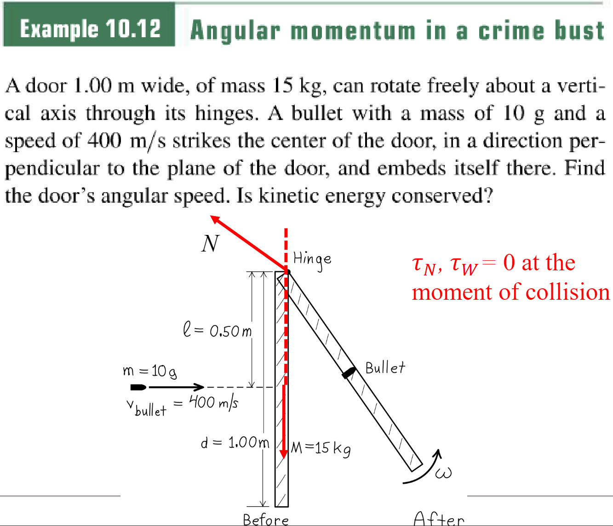
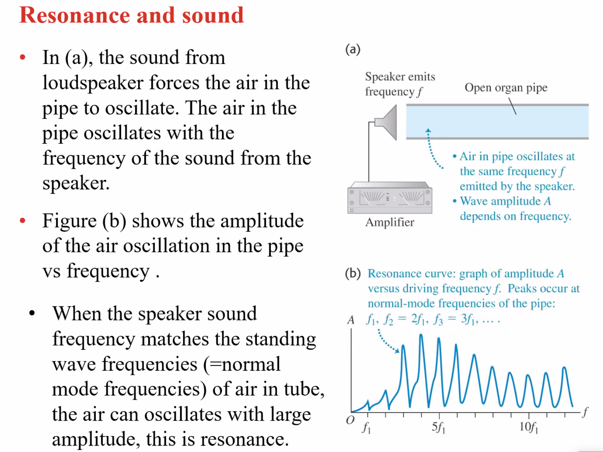

# PHY1201 General Physics Ⅰ - Notes

## Ch1 Vectors and Simple Calculus

### [Chapter 1 PDF](D:\2022A\PHY1201\01.Vectors.pdf)

### Physical Quantities (P10)

#### Scalar 矢量

* Numbers Only

#### Vector 标量

* Consists of **scalar magnitude + direction**
* $\vec{A}$
* magnitude = $\left |{A}\right |$

#### Physical quantities in vector

* displacement $x$ 位移
* velocity $v$、momentum $p$
* angular velocity $\omega$、angular momentum $\mathbf{L}$ 角动量
* acceleration $a$、force $F$
* **electric field $E$, magnetic field $B$**

### Representing Vector Graphically (P14)

### Calculation of Vector (P15)

#### Addition

tail(A)->head(A) coincidences with tail(B)->head(B)

* **Head to tail method**
* Parallelogram method

#### Subtraction (P20)

$\vec{A}-\vec{B}=\vec{A}+(-\vec{B})$

#### Scalar Product (P21) 数量积

* $\left |c\left |\vec A\right |\right | = c \left | \vec A\right |$
* Direction remains if $c>0$, or opposite if $c<0$

#### Vector Component

* $\vec {A_x}=\vec A\cos \theta$
* $\vec {A_y} = \vec A \sin \theta$
* $\vec A = \vec {A_x} +\vec{A_y}$

#### Unit Vector (P28)

* $\left |\hat i\right |=\left | \hat j \right |= 1$
* $\vec C = A_x \hat i + A_y \hat j%$
* $\vec{A_x}=A_x\hat i;\vec {A_y} = A_y \hat j$

#### Scalar Product (P55) 点积

* also dot product
* $\vec A \cdot \vec B = \left | A \right | \left | B \right | cos \phi$
* $\vec A \cdot \vec B = A_xB_x+A_yB_y$

#### Vector Product (P57) 叉积

---

## Ch2 Motion

### [Chapter 2 PDF](D:\2022A\PHY1201\02.Motion.pdf)

### Definition (P3)

#### Motion

> change of **position** with **time** (position as function of time)

#### Mechanics 动力学

> study of motion and the cause of motion

#### Position

> coordinates or position vector, like:
>
> * $x$
> * $\vec r = x\hat i + y \hat j$
>
> * $\vec r = x \hat i+ y \hat j + z\hat k$

#### Displacement & Average Velocity

> * $\Delta x = x_2 - x_1$
> * $v_{\text{av}-x}=\frac{\Delta x}{\Delta t}$
> * $\iff x_2 = x_1 + v_{\text{av}-x}\ \Delta t$
> * Average velocity is defined for a **time interval**

#### Instantaneous velocity

$$
v_x = \lim_{\Delta t \to 0}\frac{\Delta x}{\Delta t}=\frac{\text{d}{x}}{\text{d}t}
$$

* on $x-t$ graph, $v_x$ is the slope of the **tangent** to the curve

#### Average & Instantaneous acceleration

$a_{\text{av}-x}=\frac{\Delta v_x}{\Delta t}$
$$
a_x=\lim_{\Delta t \to 0}\frac{\Delta v_x}{\Delta t}=\frac{\text{d}v_x}{\text{d}t}
$$

* on $v-t$ graph, $a_x$ is the slope of the tangent to the curve

### Constant Acceleration Motion (P13)

#### $v-t$ graph

* **straight line**
* The area under $v-t$ graph is $\Delta x$, proof:

$$
\begin{equation}
\Delta x_i = v_x  \Delta t_i \Rightarrow 

\sum v_x \Delta t = \Delta x
\end{equation}
$$

#### Equations

> * $v_x = v_{0x} + a_xt$
> * $x = x_0+v_{0x} t + \frac{1}{2} a_x t^2$
> * $v_x^2=v_{0x}^2+2a_x(x-x_0)$
> * $x-x_0 = \ \bigl (\frac{v_{0x}+v_x}{2}\bigr ) t$

### 2D and 3D Motion (P30)

#### Velocity under vector

$\vec v_\text{av} = \frac{\Delta \vec r}{\Delta t} = \frac{\Delta x}{\Delta t}\hat i+ \frac{\Delta y}{\Delta t}\hat j+ \frac{\Delta z}{\Delta t}\hat k$

other definition likewise

* motion(position-time function)
* instantaneous velocity
* average acceleration
* instantaneous acceleration

#### Difference between Insta. Speed and Velocity

* speed (速率) is **scalar**
* velocity is **vector**

#### Insta. Velocity and Acceleration

* Instantaneous velocity is always **tangent to the path**
* Instantaneous acceleration
    * normal = perpendicular
    * ahead = higher speed pull outward & forward

### Projectile Motion (P56)

* Gravity only (ignoring air resistance)
* **The x and y motion are separable**

#### Equations

> * $x=v_0 \cos \theta_0 t$
> * $y=v_0\sin\theta_0t-\frac{1}{2}gt^2$
> * $v_x=v_0\cos\theta_0$
> * $v_y=v_0\sin\theta_0-gt$

### Uniform circular motion (P69)

> * $a=\frac{v^2}{r}$
> * $a_\text{rad}=\frac{4\pi^2 r}{t^2}$
> * $\Delta \theta=\frac{\Delta s}{\Delta r}=\frac{v \Delta t}{\Delta r}$

## Exercise 2

### Thinking Questions

#### Uniform Ellipse Motion

* When rounding ellipse (椭圆) or other curves, the **acceleration is always perpendicular with velocity**

#### Same Height with Different Initial Speed

> Assume there is no $g$ and monkey don't move. The dart with an initial speed $v_x, v_y$ will hit the monkey at time $T$.
>
> So monkey's coordinates are $(v_xT,v_yT)$.
>
> Now with gravity, the coordinates at time $t$ are:
> $$
> \begin{align}
> x_\text{dart}(t)&=v_xt\\
> y_\text{dart}(t)&=v_yt-\frac{1}{2}gt^2\\
> x_\text{monk}(t)&=v_xT\\
> y_\text{monk}(t)&=v_yT-\frac{1}{2}gt^2
> \end{align}
> $$
> Finally at time $T$ we have: $x_\text{dart}(T)=x_\text{monk}(T)=v_xT,\ y_\text{dart}(T)=y_\text{monk}(T)=v_yT-\frac{1}{2}gT^2$
>
> Thus dart will still **hit monkey at time T**.
>
> When dart reaches $P$, $v_y=0$. At this time monkey's $v_y>0$. So if monkey's height is no greater than $P$, it will drop quicker and dart cannot hit monkey.
>
> Thus monkey is higher than P.

### Tutorial 2

#### Acceleration Direction

* Point 1: velocity increasing, direction not changed
    * acceleration downward to the right
* Point 2: velocity right, velocity **at next moment** lifted up
    * acceleration straight up
* Point 3: acceleration straight down
* acceleration in circular uniform always point to **the center of the circle**
* as $a=\frac{v^2}{r}$, smaller $r$, greater $a$ when $v$ is given.

#### Projectile Motion

* When thrown at $45^\circ$ with respect to the
    horizontal, the object fly the longest distance
* When $\theta > 45^\circ$, greater $\theta$, shorter distance
* greater $\theta$, greater $v_y$, means:
    * higher **maximum height**
    * longer **time**

---

## Lab: Projectile Motion

$$
\begin{align}
\because x &= x_0+v_x\ t\\
v_x &= v_0\cos\theta\\
\therefore x-x_0&=v_0\ t\cos\theta\\
\Leftrightarrow v_0 &= \frac{x-x_0}{t\cos \theta}
\end{align}
$$

---

## Ch3 Newton's law and Force

### [Chapter 3 PDF](D:/2022A/PHY1201/03.Newton's law and Force.pdf)

### Newton's Law (P3)

#### Characteristics of Force

* Forces causes **change in the motion**
* Force is an interaction between **two objects**
* Force as a **vector** has direction and magnitude

#### Newton's First Law

> If there is no force or **no net force** on a body the body moves with **constant velocity** and zero acceleration or remain at **rest**
> $$
> \Sigma \vec F = 0 \Rightarrow \vec v = C,\ \vec a = 0
> $$

#### Newton's Second Law

> $$
> \begin{align}
> \vec a & \propto \Sigma \vec F\\
> \left |a\right | & \propto \frac{1}{m}\\
> \therefore\vec a &= \frac{\Sigma F}{m} \\
> \Leftrightarrow \vec F &= m\vec a\\
> 1\mathrm{N}&=1\mathrm{kg}\cdot \mathrm{m/s}^2
> \end{align}
> $$

##### Mass

> * Mass is proportional to the amount of matter
> * Mass resists motion, tendency to stay unmoved.
> * Larger mass $\leftrightarrow$ Larger motion resistance $\leftrightarrow$ Smaller acceleration.

#### Newton's Third Law

> * If you exert a force (**action**) on an object, the object always exerts a force (the **reaction**) back upon you.
> * A force and its reaction force have the same magnitude but **opposite directions**. These forces act on **different bodies**.

#### Common Forces

* The normal force (surface -> object): **perpendicular** to the surface. Contact force.
* Friction force (surface -> another surface): **parallel** to the surface. Contact force.
* Tension force: via rope or cord. Contact force.
* Weight: Long-range force.
* Push: Contact force.

#### Friction

* **kinetic friction**: relative motion, $f_k=\mu_kN$ is **static**  
* **static friction**: no relative motion, $0 \leq f_s=\Sigma F \leq \mu_s N$ is **proportional** 
* $f_s=F_\text{eternal}$

#### (De)composition of Force

#### Free-body Diagram / Force Diagram 隔离体图

* Normal force must $\perp$ the surface.
* **There is no $m\vec a$ force**.

#### Dynamics of circular motion

$$
v=\frac{2\pi R}T, a=\frac{v^2}{R}=\frac{4\pi^2}{T^2}R=\omega^2R
$$

With no net force as **centripetal force**, object will go linear uniform motion

## Exercise 3

### Application of Newton's law (P41)

* When rounding a flat curve with radius $R$, $v_max=\sqrt{\mu \mathrm{g} r}$
* When sliding down the slope with **no friction**, $a=g\sin \alpha$.
* When sliding down the slope with **zero acceleration**, $\mu=\tan\alpha$.

### Tutorial 3

#### Slope

> * Given: frictionless slope, block 1 pulling 2 up at a constant acceleration
> * let direction going down along slope be $x$, perpendicular down to slope be $y$, and vertically down be $g$. (We can have different directions for different objects.) 
> * If have a friction down the slope, the answer will become $a_{1g}=\frac{m_2g\sin\theta-\mu m_2g\cos\theta-m_1g}{m_1+m_2}$
>
> $$
> \begin{align}
> a_{2x}<0, &a_{1g}>0\\
> T_1=T_2\Leftrightarrow& a_{2x}=-a_{1g}\\
> T-m_1g&=m_1a_{1g}\\
> T-m_2g\sin\theta&=m_2a_{2x}\\
> \Rightarrow m_2g\sin\theta+m_2a_{2x}&=m_1g+m_1a_{1g}\\
> \Rightarrow a_{1g}&=\frac{m_2g\sin\theta-m_1g}{m_1+m_2}
> \end{align}
> $$

#### Slope Variant (Assignment 4)

> * Given: slope kinetic friction coefficient $\mu$; $m_1=m_2$
>
> $$
> \begin{align}
> mg-T&=ma (a>0)\\
> T-\mu mg\cos\theta-mg\sin\theta&=ma\\
> T&=\frac12mg(1+\mu\cos\theta+\sin\theta)\\
> a=\frac{mg-T}{m}&=\frac12g(1-\mu\cos\theta-\sin\theta)
> \end{align}
> $$

#### Rope

Let a rope's right pull be $F_R$ and let pull be $F_L$. So $F_R - F_L = ma_\text{rope}$

$F_R=F_L$ in case that:

* the rope is massless ($m=0$)
* **the rope is moving at constant speed** ($a_\text{rope}=0$) 

#### Pull - Friction

* $F_1-\mu mg=ma\Leftrightarrow F_1=\mu mg+ma$
* $F_2-\mu mg=m(2a)\Leftrightarrow F_2=\mu mg+2ma\rightarrow F_1 < F_2 < 2F_1$
* $F_3-\mu \frac{m}2g=\frac{m}2(2a)\Leftrightarrow F_3=\frac12\mu mg+ma\rightarrow \frac12F_1<F_3<F_1$

---

## Ch4 Work, Kinetic Energy, Potential Energy

### [Chapter 4 PDF](D:/2022A/PHY1201/04.Work Energy.pdf) 

### Work & Kinetic Energy (P6)

#### Definition

$$
F_x\Delta x=\frac12mv_x^2-\frac12mv_0^2
$$

Where $F_x\Delta x$ is **work done by a force**, and the right is **energy acquired by an object**.

#### 2-Dimensional Work

$$
W=\vec F \cdot \Delta \vec s=Fs\cos\phi=F_\parallel\Delta s
$$

* $\phi<90^\circ$, will give the object energy
* $\phi=90^\circ$, will have no energy transfer
* $\phi>90^\circ$, will draw energy from the object

#### Kinetic Energy

$E_K=\frac12mv^2$
$$
W=F_\parallel\Delta s=\frac12mv^2-\frac12mv_0^2=E_{K_\mathrm{FIN}}-E_{K_\mathrm{INIT}}=\Delta E_K
$$

* Force and velocity in the same direction, **positive work**
* Force and velocity in the opposite direction, **negative work**
* Force and velocity are perpendicular, **zero work**

>* In an uniform circular motion, $\vec F \perp \vec v$ so $W=F\Delta s\cos 90^\circ=0$. So $E_K$ doesn't change and keep the same value.
>* **Normal force perpendicular to motion in curve**
>* In an accelerated motion, positive work
>* In a friction motion, negative work
>* $\Sigma\vec F_i = m\vec a\Rightarrow\Sigma W_i=\mathrm{Sum\ of\ all\ work}$

#### $F-x$ graph

The area under the curve is W.

### Potential Energy & Energy Conservation (P27)

#### Definition

* When an object falls, gravity force do work: $W_{mg} =(-mg)\Delta y=(-mg)(-H)=mgH>0$
* When you lift the object, your force counter gravity and do work:$W_F=mgH=mg\Delta y=-W_{mg} > 0$

#### Conversion of $E_P$ to $E_K$

* Before and after a fall: $0=\frac12mv^2+mg\Delta y$, where $v$ is final speed, $\Delta y < 0$
* $E_K+mgH=0=\mathrm{Constant}\Rightarrow E_P=mgH$
* During the fall, $E_P$ is converted into $E_K$

$$
\begin{align}
\because v_{y1}^2-v_{y0}^2&=-2g\Delta H\\
v_{x1}&=v_{x0}=v_0\\
v_1^2&=v_{x1}^2+v_{y1}^2\\
\therefore v_1^2-v_0^2&=-2g\Delta H\\
\therefore \frac12mv_1^2-\frac12mv_0^2&=-mg(H_1-H_0)\\
\Leftrightarrow \frac12mv_1^2+mgH_1&=\frac12mv_0^2+mgH_0
\end{align}
$$

#### Conservation of mechanical energy

* mechanical energy = $E_P$ + $E_K$
* when only gravity do work (zero other force or **zero other work**), mechanical energy conserved
* $\Delta E_P=-W_G$, when $mg$ do positive work, lose $E_P$.
* $E_P$ is only dependent on $y$ coordinate.

#### First Law of Thermodynamics

$$
\begin{align}
\because \Delta E_P&=-W_G\\
W_f+W_G&=\Delta E_k\\
\therefore W_f&=\Delta E_P+\Delta E_K=\Delta E_M\\
\Leftrightarrow W_f&=-E_\mathrm{lost}<0
\end{align}
$$

$W_f$ is converted into internal energy ($E_K$ of molecules). Overall energy is conserved.

#### Elastic Potential Energy

* Because $F=kx$, and $F-x$ area is a triangle
* So $W=\frac12kx^2$
* Whether stretching or compressing, you do positive work
* When it is released, it do positive work on object

##### Spring Mass System

* spring + mass, no friction, start at zero speed
* $E_P$ change in $\cos$, $E_K$ change in $\sin$

##### More Potential Energy

* Newtonian Gravitational Potential: $E_{PG}=-G\frac{Mn}r$
* Coulomb Electric Potential: $E_{Pe}=k\frac{Qq}r$

## Exercise 4

### Forces on a Hammerhead

> * Problem (a): $v=\sqrt{57} \mathrm{m\cdot s^{-1}}$
> * Problem (b): 
>
> $$
> \begin{align}
> W_w-W_f-W_n&=0-E_K\\
> (mg-f-n)s&=0-\frac12mv^2\\
> n&=mg-f+\frac{mv^2}{2s}\\
> &=78927\mathrm{N}
> \end{align}
> $$

---

## Ch5: Rotation Motion

### [Chapter 5A PDF](D:/2022A/PHY1201/05A.Rotation.pdf)

### What do we Study

* *Rigid Body* rotation of a *Fixed* Axis

* **Axis of Rotation: the line formed by motion center** of all particles
* Axis of Rotation can be outside the object, like: the moon's Axis of Rotation is in the center of the earth

#### 1-Dimensional Motion

* use the angle $\theta$ between $+x$-axis for a coordinate
* $s=\theta r$, where $\theta$ is radian, $360^\circ=2\pi$ rad

#### Angular $\theta$(coordinate), $\omega$(velocity), $\alpha$(acceleration) 

* $\Delta\theta=\theta_2-\theta_1$
* Clockwise: <0, Counterclockwise: >0
* $\omega_\text{av-z}=\Delta\theta/\Delta t$, where $z$ is the axis of rotation
* $\vec \omega$ is a vector, Direction given by **right-hand rule**
* $\alpha_z=\frac{\mathrm{d}\omega_z}{\mathrm{d}t}=\frac{\mathrm{d^2}\theta}{\mathrm{d}t^2}$ is a vector 
* $a_x\Leftrightarrow \alpha_z$, $v_x\Leftrightarrow \omega_z$, $x\Leftrightarrow \theta$, $\theta$ **must be the reminder of** $2\pi$

#### Direction of Angular Quantities

Note: Angular velocity direction **is not tangential velocity**

#### Tangential and radial(=centripetal) acceleration 切向/向心加速度

* $x(t)=r\cos\theta(t), y(t)=r\sin\theta(t)$
* $a_x(t)=-r\omega\sin\theta(t),a_y(t)=r\omega\cos\theta(t)$ (note $\theta'(t)=\omega$)
* **radial $a>0$**
* **tangential $a=0$ if speed is constant**

$$
\begin{align}
\because v&=r\omega\\
\therefore a_r&=\frac{v^2}{r}=r\omega^2\\
a_t&=\frac{\Delta v}{\Delta t}=r\frac{\Delta\omega}{\Delta t}=r\alpha
\end{align}
$$

### Translational & Rotational Quantities

* $\vec r \Leftrightarrow \theta$
* $\vec v \Leftrightarrow \omega$
* $\vec{a_{\tan}}\Leftrightarrow\alpha$
* $m \Leftrightarrow I$

#### Rotational Kinetic Energy (Moment of Inertia) 转动惯量

* $I=\Sigma m_i^2r_i^2$
* Smaller $I$ makes it easier to rotate
* $I$ varies depend on the rotation axis
* $E_K=\frac12mv^2\Rightarrow E_R=\frac12I\omega^2$
* **Total Kinetic Energy = Translational + Rotational** $E=\frac12mv^2+\frac12I\omega^2$
    * Translational: The system move externally as a whole
    * Rotational: The objects in system rotates internally

#### Center of Mass

$x_c=\frac{m_1x_1+m_2x_2}{m_1+m_2}$

When rotating through center of mass
$$
\begin{aligned}
I_{CM}&=m_1\Delta x_1^2+m_2\Delta x^2_2\\
&=m_1(x_c-x_1)^2+m_2(x_c-x_2)^2\\
&=m_1x_c^2-2m_1x_cx_1+m_1x_1^2+m_2x_c^2-2m_2x_cx_2+m_2x_2^2\\
&=(m_1x_1^2+m_2x_2^2)-2({\color{red}m_1x_1+m_2x_2})x_c+(m_1+m_2)x_c^2\\
&=I-2{\color{red}\frac{m_1x_1+m_2x_2}{m_1+m_2}}Mx_c+Mx_c^2\  \{M=m_1+m_2\}\\
&=I-Mx_c^2\ \left\{x_c=\frac{m_1x_1+m_2x_2}{m_1+m_2}\right\}\\
\Leftrightarrow I&=I_{CM}+Md^2
\end{aligned}
$$

---

### [Chapter 5B PDF](D:/2022A/PHY1201/05B.Rotation.pdf)

### Torque

* $\vec \tau=\vec F\times \vec r$, where $r$ is the arm length

* The larger is the $r$, the stronger the **rotation effect**

* **line of action** of the force: along the force vector

* **level arm**: **perpendicular** distance from $O$ (the axis of rotation) to the line of action

* When a force is exerted on the axis of rotation, **torque = 0**

* $\tau=Fl=Fr\sin\theta=F_{\perp}r$, or $\color{red}\tau=Fr\sin\theta$

* direction of torque can be found using **Right Hand Rule**, [Refer to this](#Direction of Angular Quantities)

#### Effect of Torque

* Produce acceleration in **rotational motion**, like a force can increase or decrease speed in linear motion
* $\vec\tau$ and $\vec v$ in the same direction: increase speed

#### Newton's Second Law for Rotation

$$
\begin{align}
\because F_t&=ma_t\\
a_t&=r\alpha\\
\therefore F_t&=mr\alpha\\
\underbrace{rF_t}_\tau&=\underbrace{mr^2}_I\alpha\\
\therefore\color{red}\tau&\;\color{red}=I\alpha
\end{align}
$$

(where: $F_t$ is tangential external force, $a_t$ is tangential acceleration, $\alpha$ is angular acceleration, $I$ is moment of inertia)

* Don't forget: $a_\text{rad}=\omega^2r$

#### Lots of Torques

$\Sigma\tau_i=(\Sigma I_i)\alpha=\left(\Sigma m_ir_i^2\right)\alpha=I\alpha$

#### Internal Forces

According to definition, action-reaction in a system will have exactly opposite torque. They will cancel each other in the total sum of torques.

$\Sigma \tau_\text{external}=I\alpha$

### Momentum

* Momentum $\vec p = m\vec v$
* Angular momentum $\vec L=I\vec \omega$, [Refer to this](#Translational & Rotational Quantities)

$$
\begin{align}
\color{red}\tau&\;\color{red}=I\alpha=I\frac{\Delta \omega}{\Delta t}=\frac{\Delta (I\omega)}{\Delta t}=\frac{\Delta L}{\Delta t}\\
L&=I\omega=mr^2\omega=mrv=pr\\
\textbf{where } L&= \textbf{ Angular momentum }\\
\Rightarrow \vec L&=\vec r\times m\vec v\
(\vec L=\vec r\times \vec p)\\ &(\textbf{Similiar to torque}: \vec\tau=\vec r\times \vec F)
\end{align}
$$

#### Impulse

* When a force $F$ acts **abruptly** for a short time $\Delta t$ on an object, have impulse $\vec J=\vec F\Delta t$
* Rewrite Newton's 2nd Law: $\vec F=m\vec a=m\frac{\Delta \vec v}{\Delta t}=\frac{\Delta(m\vec v)}{\Delta t}$
* in Impulse Form: $\vec J=\vec F\Delta t=\Delta(m\vec v)$

#### Linear Momentum

* $E_K=\frac12mv^2=\frac{p^2}{2m}$
* In a system, $\vec P=\Sigma (m_i\vec v_i^2)=\Sigma\vec p_i$
* **Momentum conservation** of linear momentum
    * can be found during collision
    * proof by Newton's 3rd Law: Opposite Force
    * **Internal force come in action and reaction**
    * When consider the whole system as one, those force momentum will be canceled
    * Momentum conservation along a certain **direction** when no external force in that direction

#### Angular Quantities

* Momentum Conservation: $I_1\omega_1=I_2\omega_2$

* Work: $\color{red}W=F\Delta s=Fr\Delta\theta=\tau\Delta\theta$
* Power: $P=Fv=F\frac{\Delta s}{\Delta t}=Fr\frac{\Delta \theta}{\Delta t}=Fr\omega=\tau\omega$

## Exercise 5

### Examples

### Unwinding Cable I

$$
\begin{align}
\textbf{In}&\textbf{ view of Energy}\\
Fx&=\frac12Mv^2-0=\frac12I\omega^2\\
I&=\color{red}\frac12MR^2\\
\therefore\omega&=\sqrt\frac{2Fx}{I}=20\mathrm{rad/s}\\
v&=\omega R=12\mathrm{m/s}\\
\textbf{In}&\textbf{ view of Torque}\\
\tau&=FR=I\alpha\\
\therefore\alpha&=\frac{FR}{I}=\frac{2F}{MR}=6\mathrm{rad/s^2}\\
a_\text{tan}&=R\alpha=\frac{2F}{M}=0.36\mathrm{m/s^2}
\end{align}
$$

#### Unwinding Cable II

$$
\begin{align}
\textbf{In}&\textbf{ view of Energy}\\
mgh&=\frac12mv^2+\frac12{\color{red}I}\omega^2\\
&=\frac12mv^2+\frac12\left({\color{red}\frac12MR^2}\right)\omega^2\\
&=\left(\frac12m+\frac14M\right)v^2\\
\textbf{In}&\textbf{ view of Torque}\\
\text{For}&\text{ the cylinder, only T have a torque}\\
\tau_c&=RT=I\alpha=\frac12MR^2\alpha\\
\Rightarrow T&=\frac12MR\alpha &(1)\\
\text{For}&\text{ the block, } mg-T=ma_y&(2)\\
a_y&=a_\text{tan}=\alpha R&(3)\\
\Rightarrow a&=\frac{mg}{\frac12M+m}\\
T&=\frac12MR\alpha=\frac{Mmg}{M+2m}
\end{align}
$$

#### Angular Momentum

$$
\begin{align}
I_1&=I_\text{prof}+I_\text{dumb}=I_\text{prof}+2MR^2=3.0+2\times(5\text{ kg})\times(1\text{ m})^2=13.0\ \mathrm{kg\cdot m^2}\\
\omega_1&=\frac{1\text{ rev}}{2.0\text{s}}=0.5\text{ rev/s}\\
I_2&=2.2+2\times(5\text{ kg})\times(0.20\text{ m})^2=2.6\ \mathrm{kg\cdot m^2}\\
I_1\omega_1&=I_2\omega_2\Rightarrow\omega_2=\frac{I_1}{I_2}\omega_1=2.5\text{ rev/s}
\end{align}
$$

> Why the Kinetic Energy is Increased?
>
> * When the professor pulled his arm in, the dumbbell rotated in a spiral(螺旋线), **a centripetal motion** where the radius decreases.
> * So the angle between $\vec F$ and $\vec v$ is less than $90^\circ$. So $E_K$ increased.

$$
I_A\omega_A+I_B\omega_B=(I_A+I_B)\omega
$$
**Important: $\vec F$ and $-\vec F$ (through the rotation axis) have no torque.**

$$
\begin{align}
{\color{red}\tau=I\alpha_z}\Rightarrow\alpha_z&=\frac{\tau}{I}=\frac{10\mathrm{\ N\cdot m}}{2.0\mathrm{\ kg\cdot m^2}}=5\mathrm{\ rad/s^2}\\
\Delta\theta&=\frac12\alpha_zt^2=\frac12\times5\mathrm{\ rad/s^2}\times(8\text{ s})^2=160\text{ rad}\\
\omega_z&=\alpha_zt=40\text{ rad}\\
\Rightarrow \color{red}W&\;{\color{red}=Fs=Fr\Delta\theta=\tau\theta}=1600\text{ J}\\
K&=\frac12I\omega_z^2=1600\text{ J}\\
\bar P&=\frac{W}{t}=200\text{ J}
\end{align}
$$

#### Angular Momentum

$$
\begin{align}
\color{red}\vec L&\;{\color{red}=\vec r\times m\vec v}=(0.50\text{ m})\times(0.010\text{ kg}\times400\text{ m/s})=2\mathrm{\ kg\cdot m^2/s}\\
I_\text{door}&=\frac13Md^2=5\mathrm{\ kg\cdot m^2}\text{(Rod, axis through one end, see Table 9.2)}\\
I_\text{bullet}&=ml^2=0.025\mathrm{\ kg\cdot m^2}\text{(A traditional rotating object out of axis)}\\
\color{red}\omega&\;{\color{red}=\frac{L}{M+m}}=0.4\text{ rad/s}
\end{align}
$$

### Tutorial

#### Graphs of Rotation Quantities

* Initially speed: Counterclockwise
* Positive Direction: $x$-right, $y$-up, $\theta$-counterclockwise

> * $x-t$: Initially rightmost(++), going 0 => F
> * $v_x-t$: Initially 0, going left(-) => G
> * $a_x-t$: Initially leftmost(--), going 0 => H
> * $y-t$: Initially 0, going up(-) => E
> * $v_y-t$: Initially upmost(++), going 0 => F
> * $a_y-t$: Initially 0, going down(-) => G
> * $\theta-t$: Initially 0, going up(+) linear => A
> * $\omega-t$: Constant => C
> * $\alpha-t$: 0

### Assignment

In the figure, two blocks, of masses $m_2=2$ kg and $m_1=3$ kg, are connected by a light string that passes over a frictionless pulley (i.e. the pulley is on a frictionless axle) of the moment of inertia $0.004\mathrm{\  kg \cdot m^2}$ and radius $5.00\text{ cm}$. However, there is sufficient friction between the pulley and the string such that the string turns the pulley without slipping (the string does not slip over the pulley). The coefficient of friction for the tabletop is $\mu=0.2$ . The blocks are released from rest. Using energy methods, find the speed of the upper block just as it has moved $3 \text{ m}$.

$$
\begin{align}
\tau&=I\alpha\\\Rightarrow T_2R-T_1R&=I\frac aR\\
m_2g-T_2&=m_2a\\\Rightarrow T_2&=m_2g-m_2a\\
T_1-\mu m_1g&=m_1a\\\Rightarrow T_1&=\mu m_1g+m_1a\\
\therefore(m_2g-m_2a-\mu m_1g-m_1a)&=I\frac{a}{R}
\end{align}
$$

---

## Ch6 Temperature and Heat

### [Chapter 6 PDF](D:/2022A/PHY1201/06.Temperature and Heat.pdf)

### Heat

* A form of **energy**, unit=J
* Receive Energy = Temperature Up
* Heat can be **converted into work**

### Temperature

* The degree of Hotness
* measured using **Thermometer**, temperature can be calculated in a linear way $l=a+b\times T$
* **Gas Thermometer**

#### Temperature Scale

* Celsius $P=a+bT_C$
* Fahrenheit
* Kelvin $P=bT_K, \frac{T_1}{T_2}=\frac{P_1}{P_2}$
* $P=a+bT_C=T_K\Rightarrow T_C=T_K-d, a=bd$
* **Triple Point of water is 273.16K**, so $T=273.16\frac P {P_\text{triple}}$
* **Boiling Point of water is 373.15K**

##### Temperature Scale Conversions

* $T_F=\frac95T_C+32^\circ$
* $T_C=\frac 59(T_F-32^\circ)$
* $T_K=T_C+273.15$

### Thermal Equilibrium

* When two objects have different **temperature**, there is **heat flow** between the two objects
* When they have same temperature, they are in **thermal equilibrium**, there is no heat flow
* In Temperature Equilibrium: **The thermometer and the object are in thermal equilibrium**

#### 0th Law of Thermodynamics

* C and A in equilibrium, C and B in equilibrium $\Rightarrow$ A and B in equilibrium
* **Two objects are in equilibrium if they have same temperature**

### Heat is Energy

* Heat energy come from **work** (done into the object) and **potential energy**
* Heat is a form of energy
* **Internal Energy = Random $E_K$ + Inter-molecular $E_P$**
* Temperature Increase = Internal Energy Increase = **Heat** energy consumed

#### Thermal State

Change in Temperature > Change in Thermal State > Change in Properties

##### State Variables

* Temperature, Pressure, Volume (Length)
* Describes thermal state of matter

### Thermal Expansion

* Linear Expansion $\Delta L=\alpha L_0 \Delta T$
* Hole Expansion $\Delta A=\mu A_0\Delta T, \mu=2\alpha$, does not shrink
* Volume Expansion $\Delta V=\beta V_0\Delta T, \beta = 3\alpha$
* Liquid only have $\beta$

#### Atomic Mechanism

* atoms are in **constant random motion**, bound together by interatomic forces
* Higher Temperature, larger interatomic $E_P$
* **Repulsive Force > Attractive Force, so they pull apart**
* **Average Position** between atoms increase

#### Water

* Between $0^\circ\mathrm{C}$ and $4^\circ\mathrm{C}$ water decreases in volume with increasing temperature
* Hydrogen Bond between molecules is strong
* Example: **Lakes freeze from the top down**

#### Thermal Stress

* Stress $\frac FA=-Y\alpha\Delta T$
* Strain = $\alpha\Delta T$
* Example: Gaps between Bridges can protect it from bending

##### Stress

* Length is shortened: Compressive
* Length is lengthened: Tensile
* **Stress =** $\frac{F_\perp}{A}$ 
* **Strain =** $\frac{\Delta l}{l_0}$
* $Y=\frac{\text{Tensile Stress}}{\text{Tensile Strain}}=\frac{F_\perp l_0}{A\Delta l}$

#### Specific Heat

* $Q=mc\Delta T$
* $1\mathrm{\ J\cdot K^{-1}g^{-1}}=10^3\mathrm{\ J\cdot K^{-1}kg^{-1}}$

#### Phase Changes

* **Temperature does not change**
* Heat of Fusion $L_f$
* Heat of vaporization $L_v$
* Heat transferred $Q=\pm mL$

### Heat Transfer

#### Conduction of Heat (Heat Current)

* $H=\frac{\Delta Q}{\Delta t}=\frac{kA(T_H-T_C)}{L}$
    * $A$ is section area

    * $L$ is conductor length

    * $T_H, T_C$ is hot-end and cold-end temperature

    * $k$ is thermal conductivity

    * **With multiple conductors**, sum up the $k$

* Mechanism: **Rapid moving atoms cause neighboring atoms to move fast**

#### Convection of Heat

* Through Fluid Motion
* Temperature increases, **liquid/gas expand, density decreased, hotter fluid move up** and move to the cold area

#### Radiation of Heat

* Non-zero temperature
* Low-temp: Infra Red
* High-temp: Visible & Invisible
* $H=Ae\sigma (T^4-T_s^4)$
    * $A$ is surface area
    * $e$ is emissivity
    * $\sigma=5.67\times10^{-8}\mathrm{\ W/m^2K^4}$
    * $T, T_s$ is surface and surrounding temperature

### Training 6

#### Heat Conductivity

(Assignment 6 Question 4)

The wall of a house is made from a layer of wood $3\text{ cm}$ thick and a layer of wool which is $5.5\text{ cm}$ thick. The layer of wood faces outside and the layer of wool faces inside. The thermal conductivity of wood is $0.08\mathrm{W/mK}$ and the thermal conductivity of wool is $0.02\mathrm{W/mK}$. The temperature outside the house is $0^\circ$ and the temperature inside the house is $21.8^\circ$. What is the temperature at the contact surface between the wool and the wooden layers?

$\frac{K_\text{out}A}{l_\text{out}}(T-T_\text{out})=\frac{K_\text{in}A}{l_\text{in}}(T_\text{in}-T)$

`out` is wood, `in` is wool

---

## Ch7 Thermal Properties of Matter

### [Chapter 7 PDF](D:/2022A/PHY1201/07.Thermal Properties of Matter.pdf)

### Thermal State of Matter

#### State Variables

* Pressure, volume, temperature
* move heat from hot to cold **using change of thermal states**, e.g. refrigerators

#### 4-Stroke Engine

|             | Temperature | Pressure | Volume |
| ----------- | ----------- | -------- | ------ |
| Intake      | -           | -        | +      |
| Compression | +           | +        | -      |
| Power       | +           | +        | +      |
| Exhaust     | -           | -        | -      |

In *Intake* and *Exhaust*, hot air go to outside and suck in cold air-fuel mixture.

### Equation of State

* $pV=nRT, R=8.31 \mathrm{\ J\cdot K^{-1}mol^{-1}}$

> * Pressure $\propto$ number of molecule: $P \propto n$
>
> * Pressure = force / area: $P\propto L^{-2}$
>
> * Pressure $\propto$ number of collision $\left(=\frac{V}{2L}\right)$: $P\propto L^{-1}$
>
> * $P\propto L^{-2}$ and $P \propto L^{-1} \Rightarrow P\propto \frac1 V\Rightarrow P\propto \frac nV$

#### Ideal gas

* Equation Only Ideal gas Behavior
* Assumption1: Molecule Volume is 0
* Assumption2: No Interactions between Molecules
* At normal temperature and pressure, all gases have behavior resembling the ideal gas
* **At high temperature / low pressure**, all gases behaves like the ideal gas
* **Standard Temperature and Pressure** (STP): $T=0^\circ \text{ C}=273.15\text{ K}\\p=1\text{ atm}=1.013\times10^5\text{ Pa}$
* At STP, 1 mole of an ideal gas occupies $V=\frac{nRT}{p}=22.4\text{ L}$, notice $1\text{ L}=1\times10^{-3}\text{ m}^3$

#### Interference

* $m=nM$, where $M$ is molecular weight
* $\rho=\frac mV=\frac {nM}V=\frac {pM}{RT}$
* $\frac{p_1V_1}{T_1}=\frac{p_2V_2}{T_2}$
* $M=28.8\text{ g/mol}=\color{blue}28.8\times 10^{-3}\text{ kg/mol}$

#### Number of Moles

* $1\text{ mol }^{12}C=0.012\text{ kg}$
* $1\text{ mol }^{12}C=\color{blue}6.022\times 10^{23}\text{ of } ^{12}C$
* $M=N_Am$, $M$ is one mole weight, $m$ is one molecule weight

#### The van der Waals equation

* $\left(p+\frac{an^2}{V^2}\right)(V-nb)=nRT$

* $+\frac{an^2}{V^2}$​ 

    * **Inter-molecule Attractive Force**
    * Actual pressure > measured pressure $=p$
    * two molecules have interaction, so $\propto$ $n^2$

* $-nb$

    * volume of molecules
    * Actual total volume < measured volume $=V$

#### $pV-$diagrams

* $p\propto\frac{1}{V}$
* $pV\propto T$
* $T_1>T_2>T_3$ in the following graph 

#### $pT-$diagrams

* straight lines, $p\propto T$, all lines intersects at $(0\text{ K}, 0)$
* $k=\frac{p}{T}\propto \frac{1}{V}$

#### $VT-$diagrams

* straight lines, $V\propto T$, all lines intersects at $(0\text{ K}, 0)$
* $k=\frac{V}{T}\propto \frac{1}{p}$

### Microscopic Models

#### Forces between Molecules

(UP: force; DOWN: Potential Energy)

* distance between molecules: gas > liquid > solids

* $F_r(r)=-\frac{dU}{dr}$, $U$ is potential energy

### Kinetic-Molecular Model

#### Assumption

* The molecules size much smaller than the **average distance between molecules**
* The molecules undergo **perfectly elastic collision**

#### Collision With Wall

* With speed $v=\{-|v_x|, v_y\}$, when colliding with the wall on $x-$direction, the speed
    * $x-$component becomes $|v_x|$.
    * $y-$component stays the same.
    * magnitude stays the same.
* **Momentum change** $\Delta p=(m|v_x|)-(-m|v_x|)=2m|v_x|$
* **During short time** $dt$,
    * the molecules traveled on $x-$component at an average distance of $|v_x|dt$.
    * on a certain area $A$, the number of molecules hitting the wall is $\frac12\frac{N}{V}(A|v_x|dt)$
    * where $N$ is the number of molecules in total volume $V$
    * and the total momentum change $dp_x=\frac12\frac{N}{V}(A|v_x|dt)\times\Delta p=\frac{NAmv_x^2dt}{V}$
* **Pressure = Force / Unit Area** $p=\frac{F}{A}=\frac{1}{A}\frac{dp_x}{dt}=\frac{Nmv_x^2}{V}\Leftrightarrow\color{red}pV=Nm<v_x^2>$
    * where $<v_x^2>=\bar{v_x^2}$, the average of square (in kinetic way)
* Because $<v_x^2>=<v_y^2>=<v_z^2>=\frac{1}{3}<v^2>$,
    * $pV=\frac13Nm<v^2>=\frac23N\frac12m<v^2>=\frac23N\cdot E_k=\frac23 K_\text{tr}$
    * where $K_\text{tr}$ is total translational Kinetic Energy
* According to $pV=nRT$, we have internal energy $U=\color{red}K_\text{tr}=\frac32 nRT=\frac 32 Nk_BT$
* **Heat Capacity** per mole $C_V=\frac{\Delta U}{\Delta T}=\frac 32 N_Ak_B$
* **Average translational Kinetic Energy** of a molecule $\frac{K_\text{tr}}{N}=\frac32\frac{n}{N}RT=\frac32\frac{R}{N_A}T$
    * where $n$ is total mole of gas, $N$ is total molecule of gas, so $N=N_An$
    * **Boltzmann constant** $\color{blue}k_B=\frac{R}{N_A}=1.381\times 10^{-23}$
    * $\frac12m<v^2>=\frac32 k_BT \Leftrightarrow {\color{red}v_\text{rms}}=\sqrt\frac{3k_BT}{m}=\sqrt\frac{3RT}{mN_a}=\color{red}\sqrt\frac{3RT}{M}$
    * $v_\text{rms}=\sqrt\frac{v_1^2+v_2^2+\dots+v_n^2}{n}>\frac{v_1+v_2+\dots+v_n}{n}=v_\text{av}$
    * `rms` stands for `root-mean-square`
    * Beware that $M=N_Am$ **results in $\text{g}$ , remember to convert to $\text{kg}$**
    * $K_B=\frac{R}{N_A}, N_A=\frac Nn\Rightarrow{\color{red}pV=Nk_BT}\Rightarrow pV=\frac 23U$

#### Collisions between Molecules

* **mean free path**: average distance between collisions
* **mean free time**: average time between collisions

* $t_\text{mean}=\frac{\lambda}{v_\text{rms}}=\frac{kT}{4\sqrt2\pi r^2p}\div\sqrt\frac{3RT}{M}$

#### Principle of Equipartition of Energy

* $E_K=\frac32kT\Rightarrow E_{kx}=E_{ky}=E_{kz}=\frac12kT$
* also applies to **rotational degree of freedom**

#### Heat Capacity

* Specific Heat $c=\frac{C}{m}$

> * $dK_\text{tr}=\frac 32 nRdT$
> * $dQ=mcdT=nMcdT=nCdT$

* $C_V=\frac 32 R$ (for **monatomic** ideal gas 单原子)
* $C_V=\frac52R$ (for diatomic ideal gas 双原子)

#### Molecular Speed

* **Speed Distribution** of Gas Molecules
* **Area Under the curve** is the fraction of molecules with velocity in that range

### Phases of Matter

* **Boiling Point Depends on Pressure**

#### $pVT-$Diagram

 

 

#### $pV-$Diagram

#### $pT-$Diagram

* **Critical Point**:
    * Below Critical Point, there are liquid + vapor
    * **Right-above** Critical Point, there are only **supercritical fluid**
* **Triple Point**: Three phases coexist

****

## Training 7

### Pressure Change Rate

(Example 18.4)

Find the variation of atmospheric pressure with elevation in the earth’s atmosphere. Assume that at all elevations, $T = 0^\circ\text{C}$ and $g=9.80\text{ m/s}^2$.
$$
\begin{aligned}
\because\frac{dp}{dy}&=-\rho g\\
\rho&=\frac{pM}{RT}\\
\therefore \frac{dp}{dy}&=-\frac{pMg}{RT}\\
\int_{p_1}^{p_2}\frac{dp}{p}&=-\frac{Mg}{RT}\int_{y_1}^{y_2}dy\\
\ln\frac{p_2}{p_1}&=-\frac{Mg}{RT}(y_2-y_1)\\
\therefore\frac{p_2}{p_1}&=e^{-Mg(y_2-y_1)/RT}\\
\therefore p&=p_0e^{-Mgy/RT}
\end{aligned}
$$
where $p_0=1.013\times 10^5\text{ Pa}, y_1=0$ at sea level.

At $y=8863\text{ m}$, $T=0^\circ\text{C}$, $p=p_0\exp\frac{-28.8\times10^{-3}\text{kg/mol}\times9.8\mathrm{m/s^2}\times 8863\text{m}}{8.314\mathrm{J/mol\cdot K}\times273\text{K}}=0.33\text{ atm}$

## Ch8 Mechanical Waves

### [Chapter 8 PDF](D:/2022A/PHY1201/08.Mechanical Waves.pdf)

### Definition

* A pattern travelling through the medium, **involving the motion of particles of the medium**

#### Types

* Transverse: motion of particle **perpendicular to wave propagation** 横波
* Longitudinal: motion of particle parallel to wave propagation 纵波
* Periodicity: take the same amount of **time** to repeat
* Oscillation: move back and forth between **two states**

#### Periodic Transverse Waves

* The particles **only move up and down**, not move to left or right
* **Crest, Trough** 波峰，波谷
* $A=$**Amplitude** 振幅
* $\lambda=$Wavelength $Tv=\lambda$
* $T=$Period, $f=$frequency
* $v=$speed of the wave, $v=f\lambda$
* **Sinusoidal** means the pattern is described by $\sin$ or $\cos$ functions
* $y(x,t)=A\cos(kx-\omega t)=A\cos\left(k\left(x-\frac \omega k t\right)\right)\Rightarrow v=\frac \omega k$ (moving +x)
* $y(x, t)=A\cos(kx+\omega t)$  (moving -x)
* $y(x, t)$ is a function of $x$ for fixed $t$; a function of $t$ for fixed $x$

#### Periodic Longitudinal Waves

* **Compression, Rarefaction** 密部，疏部
* $\lambda, T, f, v$
* Compression & Rarefaction moves with the wave
* $\Delta x(x, t)=A\cos(kx-\omega t)$(moving +x)
* $\Delta x(x, t)=A\cos(kx+\omega t)$ (moving -x) 
* $\Delta x$ is the displacement from equilibrium position

### Calculation

$\omega=\frac{2\pi}{T}=2\pi f$ Angular Frequency 

$f\lambda=v$

$k=\frac{2\pi}{\lambda}$ Wave Number

$\Rightarrow \omega = vk \Leftrightarrow v=\frac \omega k$ 

* notice **it is a stretched string** so the $F_y$ must be along the direction of string
* $F(\mathrm{N}), \mu(\mathrm{kg/m})$

* $P_\text{av}=\frac 12 P_\text{max}$

* $P$ is $\max$ at $|\sin(kx-\omega t)|=1\Rightarrow \cos(kx-\omega t)=0$, at equilibrium
* $P$ is $\min$ at $\sin(kx-\omega t)=0\Rightarrow |\cos(kx-\omega t)|=1$, at top

#### Wave Intensity

* **Average power carries per unit area**, in a 3D spherical space
* **Intensity = Total Power/**$4\pi r^2$
* $I\propto 1/r^2 \Rightarrow \frac{I_1}{I_2}=\frac{r_2^2}{r_1^2}$

### Reflected Wave

#### Fixed End

* Opposite Force
* Same Amplitude, **Reversed Direction (+x -> -x)**

#### Free End

* Same Direction Force
* **Same Direction (+x -> +x)**

### Wave Interference

#### Superposition

$y(x,t)=y_1(x,t)+y_2(x,t)$

#### Standing Wave

* Standing Wave: Two waves, **same A, same f, opposite direction**
* It looks no left/right move. The pattern only move up/down
* **Nodes**(N): 0 Motion, **Destructive Interference** (Displacement Cancel each other)
* **Antinodes**(A): Greatest Motion, **Constructive Interference** (Displacement Add)
* $y_1(x,t)=-A\cos(kx+\omega t)$(moving -x)
* $y_2(x,t)=A\cos(kx-\omega t)$(moving +x)
* $y(x,t)=y_1(x,t)+y_2(x,t)=(2A\sin kx)\sin \omega t$
* **New amplitude = 2A**
* Nodes at $x=0, \frac{\lambda}2, \frac{2\lambda}2, \frac{3\lambda}2, \cdots \frac{n\pi}k=\frac{n\lambda}2$

$$
\begin{align}
y(x,t)&=y_1(x,t)+y_2(x,t)\\
&=-A\cos kx\cos \omega t+A\sin kx\sin\omega t+A\cos kx\cos\omega t+A\sin kx\sin\omega t\\
&=2A\sin kx\sin \omega t\\
v(x,t)&=\frac{\Delta y(x,t)}{\Delta t}\\
&=2A\omega \sin kx\cos \omega t\\
a(x,t)&=\frac{\Delta a(x,t)}{\Delta t}\\
&=-2A\omega^2\sin kx\sin\omega t=-2\omega^2y(x,t)
\end{align}
$$

notice: **string fixed at both ends**

* $\lambda_n=\frac{2L}{n}$
* $f_n=n\frac{v}{2L}=nf_1$
* $f_1=\frac{v}{2L}=\frac{1}{2L}\sqrt\frac{F}{\mu}$
* Longer string, lower frequency sound (e.g. String Length: Bass viol > Cello > Viola > Violin)

### Tutorial

#### Waves on Strings (P. 4)

* In summary, when a wave travels along a string, the wave speed depends exclusively on the properties of the string, whereas the **wave frequency is set by the oscillator** that creates the waves. The wavelength is a quantity that can vary if either the wave speed or the wave frequency is changed. Thus, it can be modified by changing either the motion of the oscillator or the properties of the string.

#### Normal Mode and Resonance Frequencies (P. 6)

* $\lambda_i$ satisfying **y(0, t)=y(L, t)=0**, corresponding to two nodes
* $\lambda_i=\frac {2L}{i}, f_i=\frac{v}{\lambda_i}=i\frac{v}{2L}$

## Ch9 Sound Wave

### [Chapter 9 PDF](D:/2022A/PHY1201/09.Sound Wave.pdf)

### Bulk Modulus

* Sound Wave is also **Pressure Wave**
* Bulk Modulus $\Delta p=-B \frac{\Delta V}{V_0}$
    * $B=\frac{\text{Bulk Stress}}{\text{Bulk Strain}}=-\frac{\Delta p}{\Delta V/V_0}$
    * Object under **bulk stress**, $p=p_0+\Delta p$ increases, $V=V_0+\Delta V (\Delta V <0)$ decreases

#### Pressure Fluctuations

* $y(x,t)=A\cos(kx-\omega t)$
* $\frac{\Delta V}{V_0}=\frac{(y_2-y_1)S}{(x_2-x_1)S}=\frac{y(x_1+\Delta x)-y(x_1)}{\Delta x}=y'|_{x=x_1}=\color{red}-Ak\sin(kx_1-\omega t)$
* $p(x,t)=-B\frac{\Delta V}{V_0}=\color{red}BkA\sin(kx-\omega t)$
* $p_\max=BkA$
* $v=\frac\omega k\Rightarrow k=\frac\omega v$

* Rarefaction 疏部：- pressure, + volume
* Compression 密部：+ pressure, - volume
* **Displacement = Cosine, Pressure = Sine**
* **Pressure = 0, Displacement = Max**
* **Displacement = 0, Pressure = Max**

#### Speed of Sound Wave

* Music contains sounds of different frequencies (**harmonic content**)
* **Fluid** $v=\sqrt\frac B \rho$ Bulk modulus/density
* **Ideal Gas** $\sqrt\frac{\gamma RT}{M}$, $\gamma=\frac{1}{40}$ is adiabatic index, $M$ is molar weight in $\text{kg/mol}$

### Sound Intensity

* [Review of Intensity](#Calculation)
* Definition: **energy / (time * area) = power / area**
* Unit: $\mathrm{W/m^2}$
* $I=\frac 12\sqrt{\rho B}\omega^2A^2=\frac{p^2_\max}{2\rho v}=\frac{p_\max^2}{2\sqrt{\rho B}}$
* $A \propto \frac1\omega\propto \frac1f$
* The sound waves are sent at a **hemisphere**, $\text{Area}=\frac 12\times 4\pi R^2=2\pi R^2$
* Sound Intensity at distance $R$: $I=\frac{P}{w\pi R^2}$

#### Decibel Scale for Sound Intensity

* $\beta=\mathrm{(10 dB)}\log\frac I{I_0}$
*  $I_0=10^{-12}\mathrm{W/m^2}$
* $\mathrm{0dB}$ = threshold of hearing at $1000\mathrm{Hz}$
* $\beta_2-\beta_1=\mathrm{(10dB)}\log\frac{I_2}{I_1}$
* $\frac{I_2}{I_1}=\left(\frac{R_1}{R_2}\right)^2$

### Standing Wave of Sound

* Sound is Longitudal
* Node = 0 Displacement = Max Pressure$\Delta$
* Antinode = Max Displacement = 0 Pressure$\Delta$
* Antinodes at $\frac{2n+1}{4}\lambda$
* **Don't here sound at pressure node = dp antinode =**$\frac{2n+1}{4}\lambda$

 

#### Organ Pipes

* **dp antinode** at mouth, because it's open end
* open pipe: $\lambda_n=\frac{2L}n$, $n+1$ antinodes and $n$ nodes (total $2n+1$)

* stopped pipe: $\lambda_{2n-1}=\frac{4L}{2n-1}$,$n$ antinodes and $n$ nodes (total $2n$s)
* **second overtone = 3rd possible harmonic = 3rd in open or 5th in stopped**
* remember: for **string fixed at both ends**, $f_1=\frac{v}{2L}$

#### Resonance

* normal mode frequency $=1, 2, 3, \cdots \times f_0$

### Interference

* **difference in path lengths** (e.g. $\Delta x$ between two loudspeakers and a point)
* **constructive interference**, $\Delta x=n\lambda, n\in \N$
* **destructive interference**, $\Delta x=\frac{(2n+1)\lambda}2, n\in\N$

#### Beats

* two tones of slightly different frequency
* $f_\text{beat}=f_a-f_b$
* (displacement) **frequency**=$\frac{\omega_a+\omega_b}{2}$
* **amplitude**=$\cos\left(\frac{\omega_a-\omega_b}{2}t\right)=\cos\left(\frac{2\pi(f_a-f_b)}{2}t\right)$
* **what we hear is intensity (sound energy) -> reflected by amplitude**
* $I\propto \cos^2\left(\frac{2\pi(f_a-f_b)}{2}t\right)$

$$
\begin{align}
y(x,t)&=y_a+y_b\\
&=A\cos(k_ax-\omega_at)+A\cos(k_bx-\omega_bt)\\
y(0,t)&=A\cos(\omega_at)+A\cos(\omega_bt)\\
&=2A\cos\left(\frac{\omega_a+\omega_b}{2}t\right)\cos\left(\frac{\omega_a-\omega_b}{2}t\right)
\end{align}
$$

### Doppler Effect

* Source towards listener $f_L=f_s\frac{v}{v-v_s}$
* Source away from listener $f_L=f_s\frac{v}{v+v_s}$
* Listener towards source $f_L=f_s\frac{v+v_L}{v}$
* Listener away from source $f_L=f_s\frac{v-v_L}s$

$$
\frac{f_L}{f_s}=\frac{v\mp v_L}{v \pm v_s}
$$

* **getting closer, higher frequency**
* **reflected sound**

$$
\frac{f_R}{f_s}=\frac{v}{v-v_s}\frac{v+v_s}{v}=\frac{v+v_s}{v-v_s}
$$

* source speed = sound speed, **shock wave**
* source speed > sound speed, **sonic bloom** (supersonic)
* $\sin\alpha=\frac{v}{v_s}$, $\frac{v_s}{v}=\text{Mach Number}$ (example: airplane at Mach 1.75)

